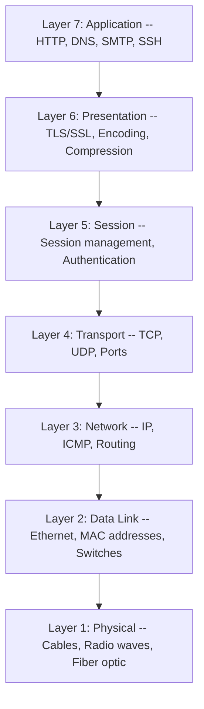
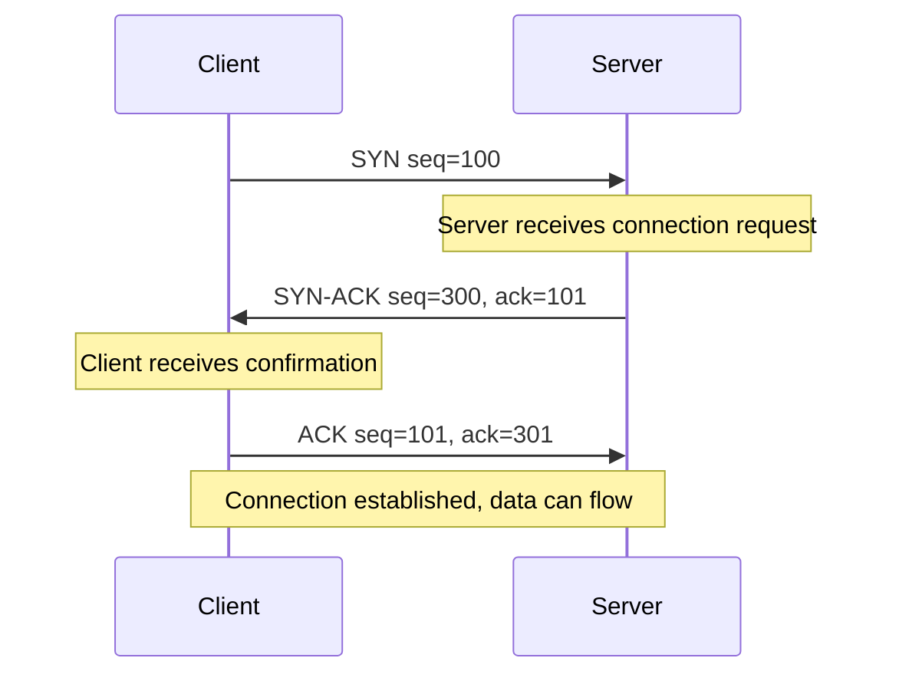
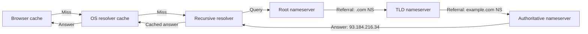
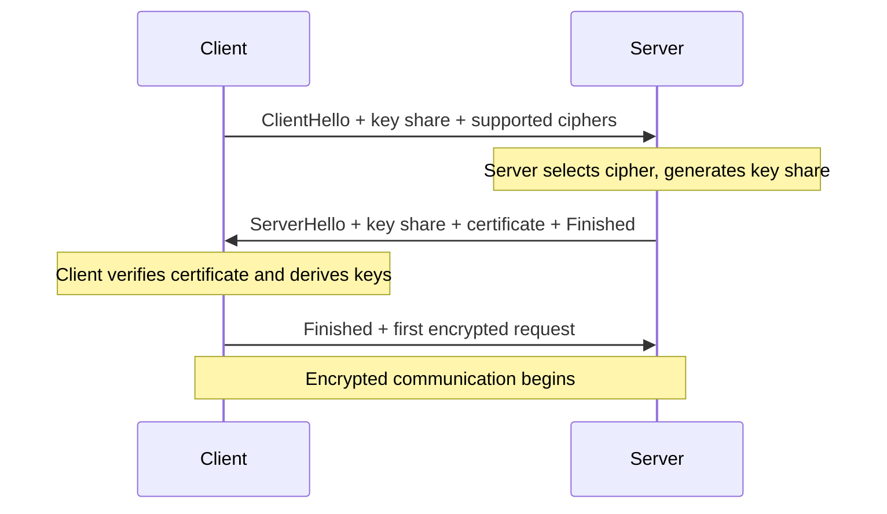

# Network Fundamentals: Every Concept You Need to Know

Every line of code you write eventually becomes a packet on a wire. Your API call to a payment processor, the database query that takes 200ms instead of 2ms, the WebSocket connection that drops every thirty seconds in production -- these aren't application problems. They're network problems. And if you don't understand what's happening beneath your abstractions, you're debugging blind.

The strange thing about networking knowledge is that most engineers treat it as someone else's job. Front-end developers assume the CDN handles it. Back-end developers assume the cloud provider handles it. DevOps engineers assume the network team handles it. But when latency spikes at 3am, the network team isn't the one holding the pager. You are.

This guide covers every fundamental concept you need. Not at a surface level -- we'll walk through how DNS resolution actually works step by step, what happens during a TLS handshake, how routers decide where to send your packets, and why your container can talk to the internet even though it has a private IP address. By the end, you'll have the mental model to diagnose network issues, design systems that handle failure gracefully, and speak the same language as your infrastructure team.

**Prerequisites:** A terminal with access to `ping`, `traceroute` (or `tracert` on Windows), `nslookup`, `dig`, and `curl`. For deeper exploration: `tcpdump` (Linux/Mac) or Wireshark (all platforms), and Python 3.8+ with the `socket` standard library module.

---

## The OSI Model: Seven Layers of Abstraction

The Open Systems Interconnection (OSI) model is a conceptual framework that describes how data moves from an application on one machine to an application on another. It was developed by the International Organization for Standardization (ISO) in 1984, and while no real network protocol stack maps perfectly to its seven layers, the model remains the standard vocabulary for discussing network architecture.

Think of it as a stack of responsibilities. Each layer provides services to the layer above it and consumes services from the layer below it. When you send data, it moves down the stack, getting wrapped in headers at each layer (encapsulation). When the destination receives it, the data moves back up, each layer stripping its header and passing the payload upward (decapsulation).



### Layer 1: Physical

This is the actual medium carrying electrical signals, light pulses, or radio waves. Ethernet cables (Cat5e, Cat6, Cat6a), fiber optic cables (single-mode, multi-mode), Wi-Fi radio frequencies (2.4 GHz, 5 GHz, 6 GHz) -- all Layer 1. At this layer, data is just bits: ones and zeros represented as voltage levels or light states.

When you're troubleshooting Layer 1 issues, you're checking physical things: is the cable plugged in? Is the link light on? Is there interference on the wireless channel? These sound trivial, but a surprising number of production outages trace back to a fiber patch cable that got bent too sharply in a data center aisle.

### Layer 2: Data Link

Layer 2 handles communication between devices on the same local network segment. It uses MAC (Media Access Control) addresses -- 48-bit hardware addresses burned into network interface cards, written as six pairs of hex digits: `00:1A:2B:3C:4D:5E`.

Ethernet frames are the Layer 2 protocol data unit. Each frame contains a source MAC, destination MAC, type field, payload, and a CRC checksum for error detection. Switches operate at Layer 2: they learn which MAC addresses are reachable on which ports, and forward frames only to the correct port instead of flooding them everywhere (which is what hubs did, and why nobody uses hubs anymore).

VLANs (Virtual LANs) are a Layer 2 concept. They let you segment a single physical switch into multiple logical broadcast domains, so traffic from the engineering team's VLAN never reaches the HR team's VLAN even though they're plugged into the same switch.

### Layer 3: Network

This is where IP lives. Layer 3 handles addressing across different networks and routing -- the process of getting a packet from network A to network B through a series of intermediate routers. The key concept is that Layer 2 gets frames between adjacent devices on the same network, while Layer 3 gets packets across networks.

IP addresses are logical addresses (unlike MAC addresses, which are physical). They can be assigned, reassigned, and structured hierarchically to enable efficient routing. ICMP (Internet Control Message Protocol) also lives here -- it's what `ping` and `traceroute` use.

### Layer 4: Transport

TCP and UDP live here. Layer 4 is responsible for end-to-end communication between applications. It introduces the concept of ports: 16-bit numbers (0-65535) that identify specific applications or services on a host. A web server listens on port 80 (HTTP) or 443 (HTTPS). Your SSH session connects to port 22.

Layer 4 also handles segmentation (breaking large data into manageable pieces), flow control (preventing a fast sender from overwhelming a slow receiver), and in TCP's case, reliable delivery with retransmissions.

### Layers 5-7: Session, Presentation, Application

In practice, these three layers blur together in modern protocol stacks. TCP/IP doesn't separate them cleanly. Layer 5 (Session) manages dialog control and synchronization. Layer 6 (Presentation) handles encoding, encryption, and compression. Layer 7 (Application) is where protocols like HTTP, DNS, SMTP, SSH, and FTP operate.

TLS is an interesting case: it spans Layers 5 and 6 (session establishment and encryption). HTTP sits cleanly at Layer 7. When someone says "this is a Layer 7 load balancer," they mean it can inspect HTTP headers and route based on URLs, cookies, or other application-level data -- as opposed to a Layer 4 load balancer that only sees IP addresses and ports.

---

## TCP/IP: The Protocol Stack That Runs the Internet

The OSI model is a teaching tool. The TCP/IP model is what actually runs. It has four layers: Link, Internet, Transport, and Application -- mapping roughly to OSI Layers 1-2, 3, 4, and 5-7 respectively. The two protocols it's named for -- TCP and UDP at the transport layer, IP at the internet layer -- are the backbone of virtually all internet communication.

### TCP: Reliable, Ordered Delivery

TCP (Transmission Control Protocol) provides a reliable byte stream between two applications. "Reliable" means every byte sent will arrive, in order, or you'll get an error. This reliability is built on three mechanisms: the three-way handshake for connection establishment, sequence numbers for ordering, and acknowledgments with retransmission for delivery guarantee.

The three-way handshake is how two hosts agree to start communicating:



**Step 1 (SYN):** The client sends a segment with the SYN flag set and an initial sequence number (ISN). This says, "I want to connect, and I'll start numbering my bytes from this value."

**Step 2 (SYN-ACK):** The server responds with both SYN and ACK flags set. The ACK acknowledges the client's sequence number (ISN + 1), and the SYN provides the server's own initial sequence number. This says, "I acknowledge your request, and here's my starting number."

**Step 3 (ACK):** The client acknowledges the server's sequence number. The connection is now established, and both sides can send data.

TCP also implements flow control through a sliding window mechanism. Each side advertises a "receive window" -- how many bytes it can accept before running out of buffer space. The sender won't transmit more than the receiver's window allows. Congestion control algorithms (Cubic, BBR) further regulate sending rate to avoid overwhelming the network itself.

Connection teardown uses a four-way handshake: FIN from one side, ACK from the other, then FIN from the other side, and final ACK. This allows each direction to be closed independently (half-close).

### UDP: Fast, Simple, No Guarantees

UDP (User Datagram Protocol) is TCP's counterpart for cases where reliability matters less than speed. UDP adds just a source port, destination port, length, and checksum to the IP packet. No handshake, no sequence numbers, no acknowledgments, no retransmission. You send a datagram, and it either arrives or it doesn't.

This sounds terrible until you consider the use cases: DNS queries (small, single-request-response), video streaming (a dropped frame is better than a delayed frame), online gaming (the player position from 200ms ago is worthless), and VoIP (audio latency is worse than audio gaps).

| Feature | TCP | UDP |
|---------|-----|-----|
| Connection | Connection-oriented (handshake) | Connectionless |
| Reliability | Guaranteed delivery, in-order | Best-effort, no ordering |
| Flow control | Yes (sliding window) | No |
| Overhead | 20-byte header minimum | 8-byte header |
| Speed | Slower due to overhead | Faster |
| Use cases | HTTP, SSH, email, file transfer | DNS, video, gaming, VoIP |
| Congestion control | Yes (Cubic, BBR, etc.) | No (application must handle) |

### HTTP/3 and QUIC: The Evolution

Worth noting: HTTP/3, now supported by over 95% of major browsers and roughly 30-34% of the top websites, runs on QUIC -- which is built on UDP, not TCP. QUIC implements its own reliability, ordering, and congestion control at the application layer, but avoids TCP's head-of-line blocking problem where a single lost packet stalls all streams on a connection. It also integrates TLS 1.3 directly into its handshake, achieving 0-RTT connection establishment in many cases.

---

## IP Addressing and Subnetting

Every device on an IP network needs an address. Understanding how these addresses work, how they're structured, and how subnetting divides networks is fundamental to configuring anything from a home lab to a cloud VPC.

### IPv4

An IPv4 address is a 32-bit number, written as four octets in dotted-decimal notation: `192.168.1.100`. That gives us $2^{32} = 4{,}294{,}967{,}296$ possible addresses. Sounds like a lot, but we ran out of unallocated IPv4 blocks in 2011. NAT has been the band-aid keeping things running.

IPv4 addresses are divided into a network portion and a host portion. The subnet mask tells you where the split is. A mask of `255.255.255.0` (or `/24` in CIDR notation) means the first 24 bits identify the network and the last 8 bits identify the host. In the network `192.168.1.0/24`, you can have hosts from `192.168.1.1` to `192.168.1.254` (`.0` is the network address, `.255` is the broadcast address), giving you 254 usable addresses.

**CIDR (Classless Inter-Domain Routing)** replaced the old classful addressing system (Class A, B, C). Instead of fixed boundaries, CIDR lets you specify any prefix length. A `/22` gives you $2^{10} - 2 = 1022$ usable host addresses. A `/28` gives you $2^{4} - 2 = 14$.

**Private address ranges** (defined in RFC 1918) are not routable on the public internet:

| Range | CIDR | Size | Common use |
|-------|------|------|------------|
| 10.0.0.0 - 10.255.255.255 | 10.0.0.0/8 | 16.7M addresses | Corporate networks, cloud VPCs |
| 172.16.0.0 - 172.31.255.255 | 172.16.0.0/12 | 1M addresses | Docker default bridge |
| 192.168.0.0 - 192.168.255.255 | 192.168.0.0/16 | 65K addresses | Home networks |

### IPv6

IPv6 uses 128-bit addresses, providing $2^{128} \approx 3.4 \times 10^{38}$ addresses -- enough to assign a unique address to every atom on the surface of the Earth, several times over. IPv6 addresses are written as eight groups of four hexadecimal digits, separated by colons: `2001:0db8:85a3:0000:0000:8a2e:0370:7334`. Leading zeros in each group can be dropped, and a single consecutive run of all-zero groups can be replaced with `::`, so that address becomes `2001:db8:85a3::8a2e:370:7334`.

Adoption has been accelerating. As of early 2026, global IPv6 adoption stands at roughly 45-50% of traffic to Google, with France at around 86%, Germany at 75%, India at 72%, and the US crossing the 50% mark in 2025. AWS expanded IPv6-native networking in late 2025, and major cloud providers now offer IPv6-only networking options.

| Feature | IPv4 | IPv6 |
|---------|------|------|
| Address length | 32 bits | 128 bits |
| Address format | Dotted decimal | Hexadecimal with colons |
| Address space | 4.3 billion | 340 undecillion |
| Header complexity | Variable, with options | Fixed 40-byte header |
| NAT required | Common | Not needed by design |
| IPSec | Optional | Built into specification |
| Auto-configuration | DHCP required | SLAAC built in |

### Subnetting in Practice

Subnetting is the process of dividing a larger network into smaller ones. If your organization has `10.0.0.0/16` (65,534 usable addresses), you might subnet it into:

- `10.0.1.0/24` -- production web servers (254 hosts)
- `10.0.2.0/24` -- production databases (254 hosts)
- `10.0.3.0/24` -- staging environment (254 hosts)
- `10.0.10.0/23` -- development (510 hosts)

The math is straightforward. For a given prefix length `/n`:
- Number of host bits = 32 - n
- Number of usable hosts = $2^{(32-n)} - 2$
- Subnet mask = first n bits set to 1, rest to 0

Here's a quick Python helper for subnet calculations:

```python
import ipaddress

# Parse a network
network = ipaddress.ip_network("10.0.0.0/22")

print(f"Network address:   {network.network_address}")
print(f"Broadcast address: {network.broadcast_address}")
print(f"Subnet mask:       {network.netmask}")
print(f"Usable hosts:      {network.num_addresses - 2}")
print(f"First host:        {list(network.hosts())[0]}")
print(f"Last host:         {list(network.hosts())[-1]}")

# Check if an IP is in the network
ip = ipaddress.ip_address("10.0.1.50")
print(f"\n{ip} in {network}? {ip in network}")

# Subnet into /24s
print(f"\nSubnets (/24):")
for subnet in network.subnets(new_prefix=24):
    print(f"  {subnet} ({subnet.num_addresses - 2} usable hosts)")
```

```
Network address:   10.0.0.0
Broadcast address: 10.0.3.255
Subnet mask:       255.255.252.0
Usable hosts:      1022
First host:        10.0.0.1
Last host:         10.0.3.254

10.0.1.50 in 10.0.0.0/22? True

Subnets (/24):
  10.0.0.0/24 (254 usable hosts)
  10.0.1.0/24 (254 usable hosts)
  10.0.2.0/24 (254 usable hosts)
  10.0.3.0/24 (254 usable hosts)
```

---

## DNS: The Internet's Phone Book

The Domain Name System translates human-readable domain names (`github.com`) into IP addresses (`140.82.121.3`). It's a globally distributed, hierarchical database that handles trillions of queries per day. Understanding DNS resolution is essential because misconfigured DNS is behind a disproportionate number of "the internet is down" reports.

### How DNS Resolution Works

When you type `www.example.com` into your browser, here's what actually happens:



**Step 1: Local caches.** Your browser checks its own DNS cache. If not found, it asks the operating system's stub resolver, which checks the OS-level cache (and `/etc/hosts` on Linux/Mac, or `C:\Windows\System32\drivers\etc\hosts` on Windows).

**Step 2: Recursive resolver.** If no cache hit, the query goes to a recursive DNS resolver -- typically your ISP's, or a public one like Google (8.8.8.8), Cloudflare (1.1.1.1), or Quad9 (9.9.9.9). This resolver does the actual work of chasing down the answer.

**Step 3: Root nameservers.** The recursive resolver asks one of the 13 root nameserver clusters (labeled a.root-servers.net through m.root-servers.net, but actually hundreds of anycast instances globally). The root server doesn't know `www.example.com`, but it knows who handles `.com` and returns a referral to the .com TLD nameservers.

**Step 4: TLD nameservers.** The resolver asks the .com TLD nameserver, which doesn't know the full answer either, but knows which nameservers are authoritative for `example.com` and returns that referral.

**Step 5: Authoritative nameserver.** The resolver queries the authoritative nameserver for `example.com`, which has the actual DNS records. It returns the A record (IPv4 address) or AAAA record (IPv6 address) for `www.example.com`.

**Step 6: Response.** The recursive resolver caches the result (respecting the TTL -- Time To Live -- set by the authoritative server) and returns it to your OS, which caches it too, and your browser finally gets the IP address.

### DNS Record Types

| Record Type | Purpose | Example |
|-------------|---------|---------|
| A | Maps name to IPv4 address | `example.com -> 93.184.216.34` |
| AAAA | Maps name to IPv6 address | `example.com -> 2606:2800:220:1:248:1893:25c8:1946` |
| CNAME | Alias to another domain | `www.example.com -> example.com` |
| MX | Mail server for the domain | `example.com -> mail.example.com (priority 10)` |
| NS | Nameserver for the domain | `example.com -> ns1.example.com` |
| TXT | Arbitrary text (SPF, DKIM, verification) | `example.com -> "v=spf1 include:_spf.google.com ~all"` |
| SRV | Service location (port + host) | `_sip._tcp.example.com -> sipserver.example.com:5060` |
| PTR | Reverse lookup (IP to name) | `34.216.184.93.in-addr.arpa -> example.com` |

You can query DNS records directly:

```bash
# Basic lookup
nslookup example.com

# Detailed query with dig (shows TTL, record class, full response)
dig example.com A +short
dig example.com AAAA +short
dig example.com MX
dig example.com ANY +noall +answer

# Trace the full resolution path
dig +trace example.com

# Query a specific nameserver
dig @8.8.8.8 example.com A
```

A Python example using sockets for DNS resolution:

```python
import socket

def resolve_all(hostname):
    """Resolve a hostname to all associated IP addresses."""
    results = socket.getaddrinfo(hostname, None)
    seen = set()
    for family, _, _, _, addr in results:
        ip = addr[0]
        if ip not in seen:
            seen.add(ip)
            version = "IPv4" if family == socket.AF_INET else "IPv6"
            print(f"  {version}: {ip}")

print("Resolving github.com:")
resolve_all("github.com")

print("\nResolving google.com:")
resolve_all("google.com")
```

---

## HTTP, HTTPS, and the TLS Handshake

HTTP (Hypertext Transfer Protocol) is the application-layer protocol that powers the web. Every API call, every page load, every webhook -- they all speak HTTP. Understanding its mechanics is non-negotiable.

### HTTP Request/Response Cycle

An HTTP request has a method, a path, headers, and optionally a body:

```
GET /api/users/42 HTTP/1.1
Host: api.example.com
Accept: application/json
Authorization: Bearer eyJhbGciOi...
```

The server responds with a status code, headers, and a body:

```
HTTP/1.1 200 OK
Content-Type: application/json
Cache-Control: max-age=300

{"id": 42, "name": "Alice", "role": "engineer"}
```

### HTTP Status Codes

Memorize the categories, and you'll be able to interpret any status code:

| Range | Category | Examples |
|-------|----------|----------|
| 1xx | Informational | 101 Switching Protocols (WebSocket upgrade) |
| 2xx | Success | 200 OK, 201 Created, 204 No Content |
| 3xx | Redirection | 301 Moved Permanently, 304 Not Modified |
| 4xx | Client error | 400 Bad Request, 401 Unauthorized, 403 Forbidden, 404 Not Found, 429 Too Many Requests |
| 5xx | Server error | 500 Internal Server Error, 502 Bad Gateway, 503 Service Unavailable, 504 Gateway Timeout |

### HTTP Versions at a Glance

**HTTP/1.1** (1997): Persistent connections, chunked transfer encoding, Host header for virtual hosting. One request per connection at a time (pipelining was specified but poorly supported).

**HTTP/2** (2015): Binary framing, multiplexing (multiple concurrent requests over a single TCP connection), header compression (HPACK), server push. Eliminated head-of-line blocking at the HTTP level, but TCP-level head-of-line blocking remained.

**HTTP/3** (2022, RFC 9114): Runs over QUIC instead of TCP. Eliminates TCP-level head-of-line blocking. Built-in encryption. 0-RTT connection resumption. As of early 2026, supported by all major browsers and adopted by approximately 30-34% of the top websites.

### The TLS 1.3 Handshake

HTTPS is HTTP over TLS (Transport Layer Security). TLS 1.3, the current standard, reduced the handshake from two round trips (TLS 1.2) to one:



**What's happening:** The client proposes cipher suites and sends its half of the key exchange (typically X25519 or P-256 Diffie-Hellman). The server picks a cipher, sends its half of the key exchange plus its certificate. Both sides now have the shared secret needed to derive encryption keys. The entire negotiation takes just one round trip.

TLS 1.3 also supports **0-RTT resumption**: if you've connected to a server before, you can send encrypted data in the very first message of the reconnection, using a pre-shared key from the previous session. This is what makes QUIC's fast connection establishment possible.

The certificate chain is critical: your browser trusts a set of root Certificate Authorities (CAs). The server's certificate is signed by an intermediate CA, which is signed by a root CA. The browser walks this chain to verify trust. If any link is broken -- expired certificate, mismatched domain, revoked CA -- the connection fails. Let's Encrypt has made certificates free and automated, removing the last excuse for running unencrypted services.

---

## Routing: How Packets Find Their Way

When you send a packet from your laptop in Buenos Aires to a server in Virginia, that packet doesn't take a direct path. It hops through 10-20 intermediate routers, each one making an independent forwarding decision based on its routing table.

### The Routing Table

Every device with an IP stack has a routing table. You can see yours right now:

```bash
# Linux/Mac
ip route show     # or: netstat -rn
# Typical output:
# default via 192.168.1.1 dev eth0
# 192.168.1.0/24 dev eth0 proto kernel scope link src 192.168.1.100
# 10.0.0.0/8 via 10.0.0.1 dev tun0

# Windows
route print
```

Each entry says: "For packets destined to this network, send them to this next-hop gateway via this interface." The `default` route (or `0.0.0.0/0`) is the catch-all -- if no more specific route matches, send the packet to the default gateway. That's typically your home router or the VPC gateway in a cloud environment.

### How Routing Decisions Work

Routers use **longest prefix matching**: for a destination IP, the routing table entry with the most specific (longest) matching prefix wins. If you have routes for `10.0.0.0/8`, `10.0.1.0/24`, and `10.0.1.128/25`, a packet to `10.0.1.200` matches all three, but the `/25` route wins because it's the most specific.

### Routing Protocols

Home routers have simple static routing tables. Internet backbone routers need to learn about millions of routes dynamically. That's what routing protocols do:

**Interior Gateway Protocols (within an organization):**
- **OSPF (Open Shortest Path First):** Link-state protocol. Every router has a complete map of the network topology and runs Dijkstra's algorithm to compute shortest paths. Converges fast but uses more memory.
- **EIGRP (Enhanced Interior Gateway Routing Protocol):** Cisco-proprietary (now partially open). Distance-vector hybrid that converges quickly and uses less bandwidth than OSPF.

**Exterior Gateway Protocols (between organizations):**
- **BGP (Border Gateway Protocol):** The routing protocol of the internet. BGP manages routing between autonomous systems (ASes) -- distinct networks operated by ISPs, cloud providers, and large organizations. Every ISP peers with others via BGP to exchange routing information. When a major cloud provider has an outage, it's often because of a BGP misconfiguration that caused routes to be withdrawn or leaked.

BGP is a path-vector protocol: routes include the full AS path (list of autonomous systems a packet traverses), which prevents routing loops and allows policy-based path selection. An ISP might prefer routes through a paid transit provider over a peer, even if the peer's path is shorter.

### Traceroute: Seeing the Path

`traceroute` reveals the path packets take by sending probes with increasing TTL (Time To Live) values. Each router that decrements the TTL to zero sends back an ICMP Time Exceeded message, revealing its address:

```bash
traceroute github.com
# 1  192.168.1.1 (192.168.1.1)       1.234 ms
# 2  10.0.0.1 (10.0.0.1)             5.678 ms
# 3  isp-router-1.example.net        12.345 ms
# 4  backbone-1.example.net           25.678 ms
# 5  * * *                            (no response)
# 6  github-edge.example.net          45.123 ms
```

Stars (`* * *`) mean a router didn't respond -- usually because it's configured to drop ICMP, not because the path is broken.

---

## Network Devices: Switches, Routers, Firewalls, and Load Balancers

Understanding what each device does -- and what layer it operates at -- is essential for designing and troubleshooting networks.

### Switches (Layer 2)

A switch forwards Ethernet frames based on MAC addresses. It maintains a MAC address table (also called a CAM table) that maps MAC addresses to physical ports. When a frame arrives, the switch looks up the destination MAC and sends the frame only to the correct port. If it doesn't know the destination, it floods the frame to all ports (except the source) -- but it learns the source MAC immediately.

Managed switches add features like VLANs, Spanning Tree Protocol (STP) to prevent broadcast loops, port mirroring for monitoring, and 802.1X port-based authentication.

### Routers (Layer 3)

Routers forward packets between different networks based on IP addresses. They examine the destination IP, consult their routing table, and forward the packet to the appropriate next hop. Each hop, the Layer 2 frame is stripped and a new one is created for the next segment, but the Layer 3 packet (source and destination IP) remains the same.

### Firewalls

Firewalls filter traffic based on rules. They can operate at different layers:

- **Packet-filtering (Layer 3-4):** Allow or deny based on source/destination IP, port, and protocol. Simple and fast but can't inspect payloads.
- **Stateful inspection (Layer 4):** Track connection state so you can allow "established" connections without explicitly permitting return traffic.
- **Application-layer / Next-gen firewalls (Layer 7):** Inspect application data. Can block specific HTTP paths, detect malware in downloads, or enforce DLP policies. Slower but much more capable.

### Load Balancers

Load balancers distribute incoming traffic across multiple backend servers. They serve two critical purposes: scalability (handling more traffic than one server can manage) and availability (routing around failed servers).

**Layer 4 load balancers** route based on IP and port. They're fast because they don't inspect the payload -- they just forward connections using algorithms like round-robin, least connections, or IP hash.

**Layer 7 load balancers** inspect HTTP headers. They can route based on URL path (`/api/*` goes to API servers, `/static/*` goes to CDN origin), Host header (virtual hosting), cookies (session affinity), or even request body content.

---

## NAT, DHCP, and VPNs

These three technologies solve different problems but are deeply intertwined in how modern networks operate.

### NAT (Network Address Translation)

NAT is the reason your laptop has a private IP address (`192.168.1.100`) but can reach the public internet. Your home router translates between your private address and its single public IP address using a NAT table that maps internal IP:port pairs to external port numbers.

When your laptop sends a request to `142.250.80.46:443` (Google), your router:
1. Replaces the source address (`192.168.1.100:54321`) with its own public IP and an arbitrary port (`203.0.113.50:12345`)
2. Records this mapping in its NAT table
3. When the response arrives at `203.0.113.50:12345`, it reverses the translation and delivers the packet to your laptop

This is **PAT (Port Address Translation)**, the most common form. It allows hundreds of devices to share a single public IP. It's also why you can't easily run a server at home without port forwarding -- inbound connections have no NAT table entry, so the router doesn't know which internal device to send them to.

### DHCP (Dynamic Host Configuration Protocol)

DHCP automatically assigns IP addresses and network configuration to devices. When your laptop connects to a network, here's the DORA process:

1. **Discover:** Your laptop broadcasts a DHCP Discover message (it doesn't have an IP yet, so it broadcasts to 255.255.255.255)
2. **Offer:** A DHCP server responds with an IP address, subnet mask, default gateway, DNS server, and lease duration
3. **Request:** Your laptop formally requests the offered address
4. **Acknowledge:** The server confirms, and your laptop configures itself

Leases prevent address exhaustion -- when a device leaves the network, its address eventually expires and returns to the pool. In enterprise networks, DHCP reservations bind specific MAC addresses to fixed IPs, giving you DHCP convenience with static addressing predictability.

### VPNs (Virtual Private Networks)

A VPN creates an encrypted tunnel between two points over an untrusted network. There are two main categories:

**Site-to-site VPNs** connect entire networks. A company's New York office connects to its London office over the public internet, but all traffic between them flows through an encrypted tunnel. Both offices can use private IP ranges, and the VPN gateways handle routing between them.

**Remote access VPNs** connect individual devices to a corporate network. When you "VPN into work," your laptop creates a tunnel to the VPN gateway, receives a virtual IP address on the corporate network, and routes some or all traffic through that tunnel.

Common VPN protocols:
- **WireGuard:** Modern, minimal, extremely fast. Uses state-of-the-art cryptography (Curve25519, ChaCha20, BLAKE2). Approximately 4,000 lines of code versus 600,000 for OpenVPN.
- **OpenVPN:** Mature, flexible, well-audited. Uses OpenSSL library. Runs on UDP or TCP.
- **IPSec (IKEv2):** Built into most operating systems. Common for site-to-site VPNs and mobile devices (handles network switching well).

---

## Network Security Fundamentals

Network security is not a feature you bolt on at the end. It's a design principle that should inform every architectural decision. The core principles -- defense in depth, least privilege, and network segmentation -- are conceptually simple but require discipline to implement consistently.

### Firewalls and Access Control Lists (ACLs)

ACLs are ordered lists of permit/deny rules evaluated top-to-bottom. When a packet arrives, the firewall checks it against each rule in sequence and applies the first match. This means rule ordering matters enormously:

```
# iptables example (Linux)
# Rule 1: Allow established connections
iptables -A INPUT -m conntrack --ctstate ESTABLISHED,RELATED -j ACCEPT

# Rule 2: Allow SSH from management network only
iptables -A INPUT -s 10.0.100.0/24 -p tcp --dport 22 -j ACCEPT

# Rule 3: Allow HTTP/HTTPS from anywhere
iptables -A INPUT -p tcp --dport 80 -j ACCEPT
iptables -A INPUT -p tcp --dport 443 -j ACCEPT

# Rule 4: Drop everything else (implicit deny)
iptables -A INPUT -j DROP
```

The principle of **default deny** is critical: block everything by default, then explicitly allow only what's needed. The opposite approach -- default allow with specific blocks -- inevitably leaves gaps.

### Network Segmentation

Segmentation divides your network into zones with different trust levels, controlling traffic between them. A typical architecture might have:

- **DMZ (Demilitarized Zone):** Public-facing servers (web servers, API gateways). Can receive traffic from the internet but can only initiate specific connections to internal zones.
- **Application zone:** Application servers. Can receive traffic from the DMZ, can connect to the database zone, cannot be reached directly from the internet.
- **Database zone:** Database servers. Only accepts connections from the application zone on specific database ports.
- **Management zone:** Jump boxes, monitoring, CI/CD. Highly restricted access, usually requires MFA and VPN.

Cloud providers implement this with security groups and network ACLs. AWS security groups are stateful (allow return traffic automatically), while network ACLs are stateless (you must explicitly allow both directions).

### Zero Trust Architecture

Traditional network security follows the "castle and moat" model: hard perimeter, soft interior. Once you're inside the network, you're trusted. This model has been steadily failing for a decade -- VPNs extend the perimeter, cloud services exist outside it, and attackers who breach the perimeter move laterally with impunity.

Zero trust flips this. The core principle: **never trust, always verify.** Every request is authenticated, authorized, and encrypted regardless of where it originates. Being "inside the network" grants no implicit trust.

By 2026, zero trust has moved from theory to operational reality. The focus has shifted from buying zero-trust products to answering specific questions: Who is the user? What device are they on? What are they trying to access? Do they need that access? Can we verify compliance through logs and policies? Organizations are implementing identity-first approaches with continuous verification, microsegmentation at the workload level, and AI-driven anomaly detection.

### Common Security Protocols

**SSH (Secure Shell):** Encrypted remote terminal access. Uses public-key authentication (far more secure than passwords). Port 22. Also supports tunneling and port forwarding.

**SNMP (Simple Network Management Protocol):** Used for monitoring and managing network devices. SNMPv3 added encryption and authentication -- never use v1/v2c in production as community strings are sent in plaintext.

**FTP vs. SFTP vs. SCP:** FTP transmits credentials and data in plaintext -- avoid it entirely. SFTP (SSH File Transfer Protocol) and SCP (Secure Copy) both run over SSH and encrypt everything.

**SMTP (Simple Mail Transfer Protocol):** Email transmission. Modern deployments require STARTTLS for encryption, SPF/DKIM/DMARC for authentication, and careful configuration to avoid becoming an open relay.

---

## Latency, Bandwidth, and Throughput

These three concepts are often confused but measure fundamentally different things.

**Latency** is the time it takes for a packet to travel from source to destination. Measured in milliseconds. A ping from New York to London takes about 70ms (limited by the speed of light in fiber: roughly 200,000 km/s, about two-thirds of light speed in vacuum). Latency has a hard physical lower bound that no amount of bandwidth can fix.

**Bandwidth** is the maximum data rate of a link. Measured in bits per second (Mbps, Gbps). A 1 Gbps Ethernet connection can theoretically carry 1 billion bits per second. Bandwidth is the width of the pipe.

**Throughput** is the actual data rate you achieve. It's always less than bandwidth because of protocol overhead, congestion, packet loss, and TCP windowing. A 1 Gbps link with 1% packet loss might deliver only 100 Mbps of TCP throughput because of retransmissions.

The classic analogy: bandwidth is the number of lanes on a highway, latency is the speed limit, and throughput is how many cars actually arrive per hour (accounting for traffic, accidents, and toll booths).

### The Bandwidth-Delay Product

The bandwidth-delay product (BDP) tells you how much data can be "in flight" at any moment:

$$BDP = bandwidth \times RTT$$

For a 1 Gbps link with 100ms RTT: $BDP = 10^9 \times 0.1 = 10^8$ bits = 12.5 MB. TCP's receive window must be at least this large to fully utilize the link. This is why TCP window scaling (RFC 7323) is essential for high-bandwidth, high-latency connections, and why the default 64 KB window is catastrophically undersized for modern networks.

---

## Troubleshooting Toolkit

When something goes wrong -- and it will -- you need tools that let you observe what the network is actually doing, not what it should be doing.

### ping: Is It Alive?

`ping` sends ICMP Echo Request packets and waits for Echo Reply responses. It tells you three things: whether the destination is reachable, the round-trip time, and whether packets are being lost.

```bash
ping -c 5 google.com
# PING google.com (142.250.80.46): 56 data bytes
# 64 bytes from 142.250.80.46: icmp_seq=0 ttl=118 time=12.3 ms
# 64 bytes from 142.250.80.46: icmp_seq=1 ttl=118 time=11.8 ms
# 64 bytes from 142.250.80.46: icmp_seq=2 ttl=118 time=12.1 ms
# 64 bytes from 142.250.80.46: icmp_seq=3 ttl=118 time=11.9 ms
# 64 bytes from 142.250.80.46: icmp_seq=4 ttl=118 time=12.0 ms
#
# --- google.com ping statistics ---
# 5 packets transmitted, 5 packets received, 0.0% packet loss
# round-trip min/avg/max/stddev = 11.8/12.0/12.3/0.2 ms
```

High latency suggests congestion or a long path. Packet loss suggests a failing link or congested router. No response could mean the host is down, ICMP is blocked, or there's a routing problem.

### traceroute: Where's the Problem?

`traceroute` (or `tracert` on Windows) shows each hop between you and the destination. Use it when ping fails or latency is high -- it shows you where in the path the problem occurs.

```bash
traceroute -n google.com
# or on Windows: tracert google.com
```

If latency jumps dramatically at hop 5 and stays high for all subsequent hops, the bottleneck is at hop 5. If only hop 5 is slow but subsequent hops are normal, hop 5's router is just slow to respond to ICMP (which is low-priority) -- not a real problem.

### netstat / ss: What's Listening?

`netstat` (or the modern `ss` on Linux) shows network connections, listening ports, and connection states.

```bash
# Show all listening TCP ports
ss -tlnp
# or: netstat -tlnp

# Show all established connections
ss -tnp state established

# Show connections to a specific port
ss -tnp dst :443

# Count connections by state
ss -s
```

This is your go-to when debugging "connection refused" errors (nothing listening on that port), "address already in use" errors (something else has the port), or connection leaks (thousands of connections in CLOSE_WAIT or TIME_WAIT).

### tcpdump: What's on the Wire?

`tcpdump` captures packets for analysis. It's the most powerful troubleshooting tool in the networking toolkit and the one most engineers never learn to use.

```bash
# Capture HTTP traffic on port 80
sudo tcpdump -i eth0 port 80 -nn

# Capture DNS traffic
sudo tcpdump -i any port 53 -nn

# Capture traffic to/from a specific host
sudo tcpdump -i eth0 host 10.0.1.50 -nn

# Capture and save to a file (for Wireshark analysis)
sudo tcpdump -i eth0 -w capture.pcap -c 1000

# Show packet contents in ASCII
sudo tcpdump -i eth0 port 80 -A -nn

# Capture only SYN packets (connection attempts)
sudo tcpdump -i eth0 'tcp[tcpflags] & (tcp-syn) != 0' -nn
```

**Wireshark** provides a GUI for the same packet analysis with protocol dissectors that decode hundreds of protocols. It can open `tcpdump` capture files and adds filtering, coloring, stream reassembly, and statistical analysis.

### nslookup and dig: DNS Debugging

When "the site is down" is actually a DNS problem:

```bash
# Quick check: does the name resolve?
nslookup api.example.com

# Detailed check: what record is returned? What TTL? From which server?
dig api.example.com A

# Check if different DNS servers give different answers
dig @8.8.8.8 api.example.com A +short
dig @1.1.1.1 api.example.com A +short

# Check propagation of a recently changed record
dig api.example.com A +trace
```

### curl: HTTP-Level Debugging

`curl` is indispensable for debugging HTTP issues. Its verbose mode shows the full request/response including TLS handshake details:

```bash
# Verbose output: see headers, TLS negotiation, timing
curl -v https://api.example.com/health

# Show only response headers
curl -I https://api.example.com/health

# Time every phase of the connection
curl -o /dev/null -s -w "\
  DNS:        %{time_namelookup}s\n\
  Connect:    %{time_connect}s\n\
  TLS:        %{time_appconnect}s\n\
  TTFB:       %{time_starttransfer}s\n\
  Total:      %{time_total}s\n\
  HTTP Code:  %{http_code}\n" \
  https://api.example.com/health
```

That timing breakdown is gold. If DNS takes 2 seconds, you have a DNS problem. If connect is fast but TLS is slow, there's a certificate chain issue. If TTFB is high, the server is slow to process the request.

### A Practical Debugging Flow

When an application can't reach a service, work from the bottom of the stack up:

1. **Layer 1-2:** Is the link up? (`ip link show`, check cable)
2. **Layer 3:** Can you ping the gateway? (`ping 192.168.1.1`) Can you ping the destination IP? (`ping 10.0.2.50`)
3. **DNS:** Does the name resolve? (`dig service.internal`) To the right IP?
4. **Layer 4:** Is the port open? (`ss -tlnp | grep 5432`) Can you connect? (`nc -zv 10.0.2.50 5432`)
5. **Layer 7:** Does the service respond correctly? (`curl -v http://10.0.2.50:8080/health`)

If Layer 3 works but Layer 4 doesn't, there's a firewall or the service isn't running. If DNS resolves to the wrong IP, someone changed a DNS record or a cache is stale. This methodical approach prevents the most common mistake: assuming the problem is at your layer when it's actually two layers below.

---

## CDNs: Bringing Content Closer

A Content Delivery Network (CDN) caches content at edge locations around the world so users fetch it from a nearby server instead of the origin. When someone in Tokyo loads your site hosted in US-East, the CDN serves static assets (images, CSS, JS) from a Tokyo edge node with 5ms latency instead of 200ms from Virginia.

CDNs use anycast routing: the same IP address is announced from hundreds of locations, and BGP routing naturally directs users to the closest one. They also handle TLS termination, DDoS mitigation, and increasingly, edge compute (running serverless functions at the edge).

Major CDNs (Cloudflare, AWS CloudFront, Akamai, Fastly) have become critical internet infrastructure. Cloudflare alone handles roughly 20% of all web traffic. When a CDN has an outage, it's a reminder that the internet's resilience depends on a surprisingly small number of companies.

---

## Going Deeper

**Books:**

- Stevens, W. R. (1994). *TCP/IP Illustrated, Volume 1: The Protocols.* Addison-Wesley.
  - The definitive reference for TCP/IP internals. Dense but comprehensive. Every packet header, every protocol state machine, every edge case. The third edition (2011) by Fall and Stevens covers IPv6 and modern extensions.

- Kurose, J. F., & Ross, K. W. (2021). *Computer Networking: A Top-Down Approach.* 8th Edition. Pearson.
  - The standard university textbook. Starts from the application layer and works down, which is more intuitive for software engineers. Excellent coverage of HTTP, DNS, and transport protocols.

- Tanenbaum, A. S., & Wetherall, D. (2021). *Computer Networks.* 6th Edition. Pearson.
  - The other standard textbook, with a more hardware-oriented perspective. Stronger on physical and data link layers, network security, and protocol design philosophy.

- Ilya Grigorik. (2013). *High Performance Browser Networking.* O'Reilly.
  - Available free online at hpbn.co. Covers TCP, UDP, TLS, HTTP/2 (and the principles behind HTTP/3) from a web performance perspective. Essential reading for front-end and full-stack engineers.

**Online Resources:**

- [Cloudflare Learning Center](https://www.cloudflare.com/learning/) -- Exceptionally clear explanations of DNS, DDoS, TLS, HTTP/3, and network security concepts with helpful diagrams.
- [Julia Evans' Networking Zines](https://jvns.ca/) -- Concise, illustrated explanations of networking tools like `tcpdump`, DNS, and HTTP that make complex topics immediately approachable.
- [Beej's Guide to Network Programming](https://beej.us/guide/bgnet/) -- The classic guide to socket programming in C, but the concepts apply to any language. Updated regularly.
- [Professor Messer's CompTIA Network+ N10-009 Training](https://www.professormesser.com/network-plus/n10-009/n10-009-video/n10-009-training-course/) -- Free, structured video course covering all Network+ exam objectives in 87 videos spanning nearly 13 hours.

**Videos:**

- [Computer Networking Course - Network Engineering (CompTIA Network+ Exam Prep)](https://www.freecodecamp.org/news/free-computer-networking-course/) by freeCodeCamp -- A comprehensive 9-hour college-level course taught by Brian Ferrill covering network devices, protocols, IPv4/IPv6, routing, security, and troubleshooting.
- [Professor Messer's CompTIA N10-009 Network+ Course](https://www.professormesser.com/network-plus/n10-009/n10-009-video/n10-009-training-course/) by Professor Messer -- 87 free videos organized by exam objective, covering networking fundamentals through advanced security and troubleshooting topics.

**Academic Papers:**

- Saltzer, J. H., Reed, D. P., & Clark, D. D. (1984). ["End-to-End Arguments in System Design."](https://web.mit.edu/saltzer/www/publications/endtoend/endtoend.pdf) *ACM Transactions on Computer Systems*, 2(4), 277-288.
  - One of the most influential papers in network architecture. Argues that many functions (reliability, security, duplicate suppression) can only be correctly implemented at the endpoints, not within the network. This principle shaped TCP/IP's design and continues to inform debates about where intelligence should live in network stacks.

- Clark, D. D. (1988). ["The Design Philosophy of the DARPA Internet Protocols."](https://web.mit.edu/6.033/www/papers/darpa.pdf) *ACM SIGCOMM Computer Communication Review*, 18(4), 106-114.
  - Explains why the internet was designed the way it was. Clark articulates the priority ordering of goals (survivability first, then multiple types of service, then accommodation of diverse networks) and how these priorities led to IP's stateless, best-effort design. Essential context for understanding why TCP/IP won over OSI protocols.

- Iyengar, J., & Thomson, M. (2021). ["QUIC: A UDP-Based Multiplexed and Secure Transport."](https://datatracker.ietf.org/doc/html/rfc9000) RFC 9000, IETF.
  - The specification for QUIC, which underpins HTTP/3. Describes how QUIC provides reliable, multiplexed transport over UDP with integrated TLS 1.3 encryption, connection migration, and 0-RTT resumption. Reading the introduction and architectural overview sections gives you deep understanding of why the transport layer is being reinvented.

**Questions to Explore:**

- If you were designing the internet from scratch today, knowing what we know about security, mobility, and scale, would you still separate the network and transport layers -- or would you build something more like QUIC from the beginning?
- NAT was a stopgap measure introduced in the 1990s to extend IPv4's lifespan. It has now outlived most predictions. What are the hidden costs of building an internet where most devices are not directly addressable, and does IPv6 adoption actually solve this if NAT is already entrenched?
- Zero trust architectures assume that the network itself is hostile. If we truly internalize this principle, does the concept of a "network perimeter" still serve any purpose, or is it purely a legacy abstraction?
- The end-to-end argument suggests that reliability should be implemented at the application layer, not the network layer. But modern CDNs, load balancers, and service meshes push enormous amounts of logic into the network. Has the pendulum swung too far, or was the end-to-end principle always too idealistic for production systems?
- As HTTP/3 and QUIC move transport-layer concerns into user space, what does this mean for network operators who have traditionally relied on inspecting TCP headers for monitoring, security, and traffic management?
