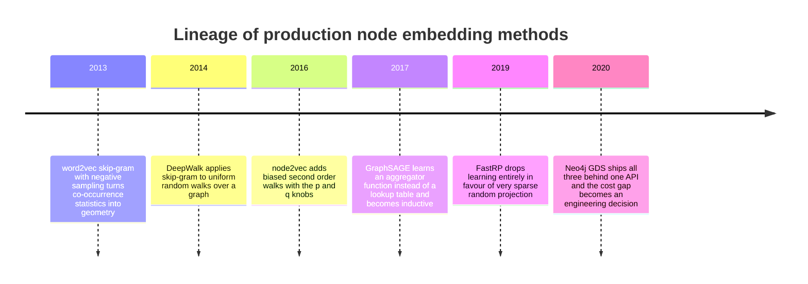
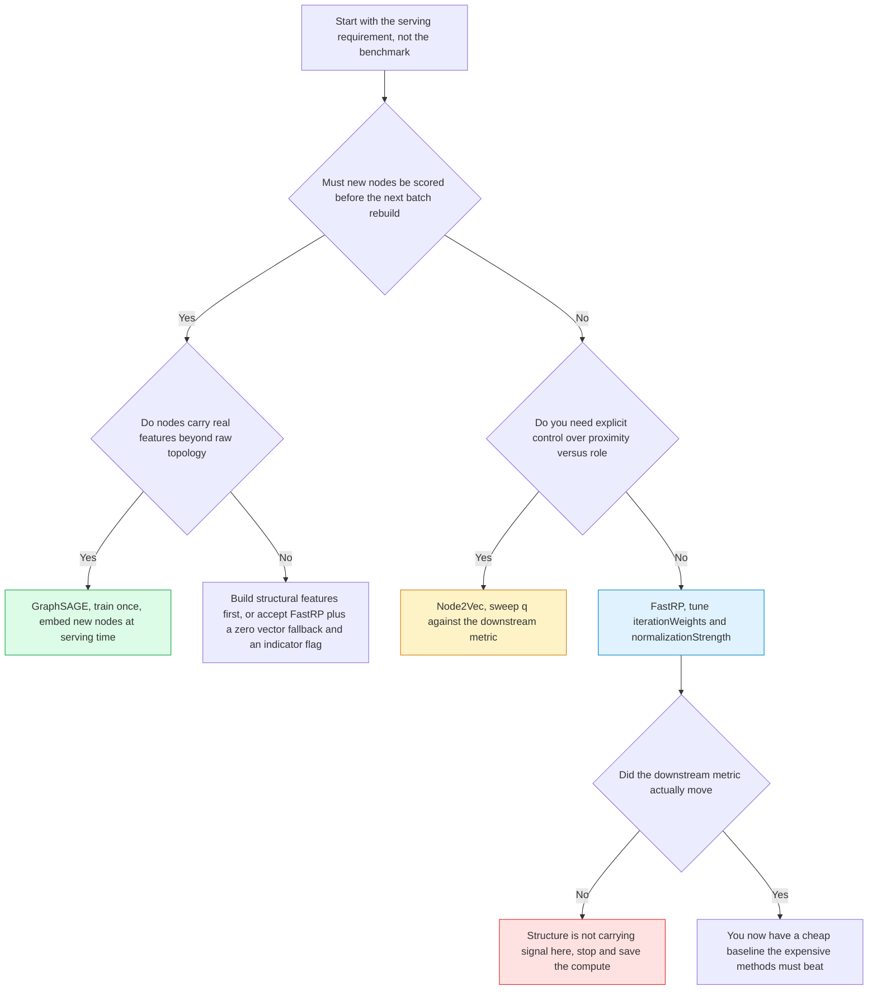
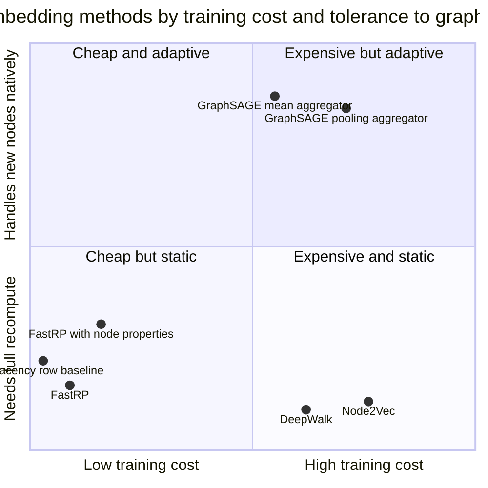
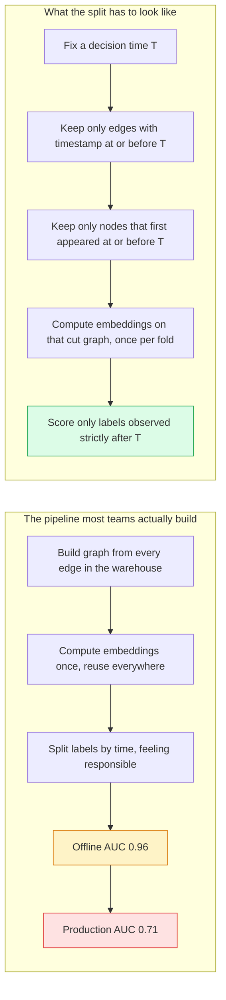

# Node Embeddings: FastRP, Node2Vec, and GraphSAGE in Production

The fraud model was already good. Two hundred and eleven tabular features — account age, transaction velocity, device fingerprint entropy, hour-of-day histograms, the whole catalogue a decade of feature engineering had accumulated. Gradient boosting on top. Validation AUC of 0.87, which the risk team considered close to the ceiling of what the data could support.

Then someone added one hundred and twenty-eight more columns. The columns had no names, only indices. Nobody could say what column 47 measured. They were the output of a random projection over the account-to-account transfer graph, computed in under four minutes on a graph with ninety million edges.

Validation AUC went to 0.91.

Four points of AUC on a mature model is not a rounding error. It is the difference between a review queue twelve people can work and one that needs eighteen. And it came from numbers that were individually meaningless — column 47 corresponds to no human concept, and a different random seed would make it measure something else entirely while the model performed exactly the same. That is the bargain of node embeddings: you give up interpretability at the column level and get a compact encoding of graph structure that a tabular model can consume. The structure was always there. What was missing was a way to hand it to XGBoost.

This is Part 3 of **Graph Analytics in Production**. [Part 1](https://juanlara18.github.io/portfolio/#/blog/graph-analytics-gds-execution-model) covered the GDS execution model — projections, memory estimation, and why the in-memory graph is a separate artifact from your database. [Part 2](https://juanlara18.github.io/portfolio/#/blog/centrality-communities-in-practice) covered centrality and community detection, which give one *interpretable* number per node: this account has a PageRank of 0.0031, this one belongs to community 7. Embeddings are the opposite trade — a hundred and twenty-eight uninterpretable numbers carrying far more than any centrality score, in a form a downstream model can learn from.

Two neighbouring posts approach this territory differently. The [Graph Neural Networks post](https://juanlara18.github.io/portfolio/#/blog/graph-neural-networks-learning-structured-data) covers message passing, GCN, and GAT — this one deliberately does not re-derive any of it. The [embeddings geometry post](https://juanlara18.github.io/portfolio/#/blog/embeddings-geometry-of-meaning) covers what it means for meaning to have coordinates, the same intuition applied to text rather than topology. What follows is the engineering: how the numbers are produced, what they preserve, which of the three algorithms to reach for, and the evaluation mistake that makes offline metrics beautiful and production metrics honest.

## What a Node Embedding Actually Preserves

A node embedding is a function $f: V \to \mathbb{R}^d$ assigning every node a fixed-length real vector. That is the whole definition, and it is uselessly general. The interesting question is what the function preserves, because distance in $\mathbb{R}^d$ has to approximate *something* about the graph, and there is more than one candidate.

There are two, and they are genuinely different.

**Structural proximity**, also called homophily, says two nodes are similar if they are close to each other in the graph. Alice and Bob transact with each other, share three counterparties, and bank at the same branch. They live in the same neighborhood. A proximity embedding puts them near each other.

**Structural role**, also called structural equivalence, says two nodes are similar if their neighborhoods have the same *shape*, regardless of whether they are anywhere near each other. Two ATMs in different cities: each a low-degree node attached to one high-degree branch, each receiving short-lived edges from many distinct accounts, neither connected to the other. Their local structure is nearly identical; their graph distance might be twelve hops. A role embedding puts them together. A proximity embedding puts them far apart.

Both are legitimate; neither is more correct. They answer different questions, and picking the wrong one silently costs accuracy. People conflate them because every library's defaults optimize for proximity — and you will probably never discover you wanted role, because proximity worked well enough to ship.

To tell which your problem needs, ask what the label depends on.

- "Is this account part of a fraud ring?" Proximity. Ring members transact with each other.
- "Is this account behaving like a money mule?" Role. Mules are structurally identical to each other (many small inbound edges, few large outbound, short lifetime) and typically have no connection whatsoever to other mules.
- "Is this server a load balancer?" Role. Load balancers in different data centers look identical and never talk.

If your label depends on *who a node connects to*, you want proximity. If it depends on *what the connection pattern looks like*, you want role.



The lineage matters because each method inherits its ancestor's assumptions. Node2Vec is word2vec with a smarter sentence generator, so it inherits skip-gram's cost structure. FastRP is linear algebra with no learning at all, so it inherits nothing and costs almost nothing. GraphSAGE is a neural network, so it inherits both the expressiveness and the operational weight of one.

## FastRP and the Johnson-Lindenstrauss Lemma

Start with the most honest possible node representation: the node's row in the adjacency matrix. Node $v$ becomes a binary vector of length $n$ with a one in every neighbor's position, so nodes with overlapping neighbor sets get vectors with a large dot product. A perfectly good proximity embedding, requiring no algorithm at all.

It has two problems. It is $n$-dimensional, and $n$ is a hundred million. And it only sees one hop — two accounts that share no direct counterparty but sit two hops from the same hub look unrelated.

The second problem has a clean fix. Powers of the adjacency matrix count paths: $(A^2)_{ij}$ is the number of length-two paths from $i$ to $j$, and so on. A weighted sum

$$M = \alpha_1 A + \alpha_2 A^2 + \cdots + \alpha_k A^k$$

blends neighborhoods across hop distances. Node $v$'s row in $M$ now encodes its $k$-hop neighborhood — and the first problem is catastrophically worse, because $A^k$ is dense, so $M$ is a hundred-million-square dense matrix that will never exist.

The whole trick of FastRP is to never build $M$, and to observe that you do not need $n$ dimensions to preserve the distances in it.

### The lemma

The Johnson-Lindenstrauss lemma sounds too good to be true and turns out to be both true and easy to prove. In the form given by Dasgupta and Gupta's elementary proof: for any $0 < \epsilon < 1$ and any set $X$ of $n$ points in $\mathbb{R}^N$, if

$$k \geq \frac{4 \ln n}{\epsilon^2/2 - \epsilon^3/3}$$

then there exists a linear map $f: \mathbb{R}^N \to \mathbb{R}^k$ such that for every pair $u, v \in X$:

$$(1 - \epsilon)\|u - v\|^2 \leq \|f(u) - f(v)\|^2 \leq (1 + \epsilon)\|u - v\|^2$$

The important part of that bound is what is *absent*. The required dimension $k$ depends on the number of points $n$ and the distortion tolerance $\epsilon$. It does not depend on $N$, the ambient dimension. Compressing from a thousand dimensions or from a hundred million, the target is the same.

That is the structural reason node embeddings work at all: graph size affects required dimension only logarithmically. Going from one million nodes to ten million multiplies $\ln n$ by $\ln(10^7)/\ln(10^6) \approx 1.17$. Seventeen percent more dimensions for ten times the graph.

Now the honest part, which most write-ups skip. Plug in real numbers. For $n = 10^6$ and $\epsilon = 0.2$:

$$k \geq \frac{4 \ln(10^6)}{0.02 - 0.00267} = \frac{55.26}{0.01733} \approx 3189$$

Three thousand dimensions, not 128. Relax to $\epsilon = 0.5$ — accepting that distances may be off by half — and the bound still only drops to about 664.

So does FastRP violate the lemma? No. The lemma is a *sufficient* condition, worst-case over an adversarially chosen point set. Real graph neighborhood matrices are nothing like adversarial: low effective rank, heavily clustered, dominated by a few hundred meaningful directions. You do not need every one of $\binom{n}{2}$ pairwise distances preserved to $\pm 20\%$; you need the downstream model to tell the clusters apart, and empirically 128 to 256 dimensions does that.

What JL buys you is not the number. It is the *shape of the guarantee* — random projection preserves geometry in expectation, failure probability shrinks exponentially in $k$, and required $k$ grows like $\log n$. That is a license to compress aggressively and verify empirically, a very different posture from hoping.

### The projection matrix you do not have to search for

The lemma says such a map *exists*. The practical miracle is that you find it by sampling — a random matrix works with high probability, and does not even need Gaussian entries. Achlioptas showed that entries from $\{-1, 0, +1\}$ with probabilities $\{1/6, 2/3, 1/6\}$ satisfy the same guarantee: integer arithmetic, two thirds of the entries zero. Li, Hastie and Church pushed much further with *very sparse random projections*:

$$R_{ij} = \begin{cases}
+\sqrt{s} & \text{with probability } \dfrac{1}{2s} \\[6pt]
0 & \text{with probability } 1 - \dfrac{1}{s} \\[6pt]
-\sqrt{s} & \text{with probability } \dfrac{1}{2s}
\end{cases}$$

With $s = \sqrt{D}$ you get a $\sqrt{D}$-fold speedup over a dense Gaussian projection, because all but a $1/\sqrt{D}$ fraction of the matrix is zero and never touched. FastRP uses $s = \sqrt{m}$, with $m$ the edge count.

### The algorithm

FastRP composes multi-hop similarity with the sparse projection, computed iteratively so the dense matrix never materializes. First a diagonal degree-normalization matrix $L$ with

$$L_{jj} = \left(\frac{d_j}{2m}\right)^{\beta}$$

where $d_j$ is node $j$'s degree and $\beta$ is the normalization strength. Then:

$$N_1 = A \cdot L \cdot R, \qquad N_i = A \cdot N_{i-1} \ \ \text{for } i = 2, \ldots, k$$

and the final embedding is the weighted sum $N = \alpha_1 \tilde{N}_1 + \cdots + \alpha_k \tilde{N}_k$ with each $\tilde{N}_i$ L2-normalized.

Every step is a sparse matrix times a thin dense matrix. Total cost is $O(m \cdot k \cdot d)$ — linear in edges, hops, and dimensions. No gradients, no epochs, no convergence criterion, no learning rate: $k$ sparse matrix multiplications and a weighted sum, with the $d$ columns embarrassingly parallel.

The reported numbers are not subtle. On the paper's WWW-200K benchmark, FastRP finished in 136 seconds; DeepWalk took 6.9 days; Node2Vec took 63.8 days. That is the 4,000x headline, and it holds up because there is no hidden constant — FastRP genuinely does less work, not the same work faster.

### The two parameters that matter

**`iterationWeights`** is the $\alpha$ vector. The GDS default is `[0.0, 1.0, 1.0]`: zero weight on the initial random vectors, equal weight on the one-hop and two-hop terms. Position zero weights the node's own raw random vector, which carries no structural information at all — pure identity — so raising it says "keep nodes distinguishable even when their neighborhoods are identical."

The non-obvious rule is to keep at least one non-zero weight at an even position and one at an odd position. Odd-length walks land on the opposite side of a bipartite structure; even-length walks return to your own side. In a customer-to-product graph, a customer's odd-hop terms are built entirely from products and the even-hop terms from other customers. Weight only odd positions and two customers with identical baskets never resemble each other directly — you have encoded their products, not their similarity.

**`normalizationStrength`** is $\beta$, and it silently ruins embeddings on real graphs. At $\beta = 0$ there is no normalization and hubs dominate every neighborhood they touch. Drop a payment processor with three million edges into a transaction graph and every account's embedding becomes, approximately, "I touched the processor." The paper found $\beta = -0.9$ optimal on some benchmarks; $-1.0$ to $-0.5$ is a reasonable starting range on hub-heavy graphs. Positive values push the other way and are almost never what you want.

```python
"""FastRP embeddings via the GDS Python client (graphdatascience >= 1.10)."""
import os
from graphdatascience import GraphDataScience

gds = GraphDataScience(
    "neo4j+s://graph.internal:7687",
    auth=("neo4j", os.environ["GDS_PASSWORD"]),
    database="risk",
)

# Project only what the embedding needs. Every extra relationship type is
# extra memory and extra structure the embedding will try to encode.
G, stats = gds.graph.project(
    "transfers_2028_08",
    {"Account": {"properties": ["account_age_days", "kyc_tier"]}},
    # Flow direction is a separate tabular feature. For structural
    # similarity, treat the transfer graph as undirected.
    {"TRANSFERRED_TO": {"orientation": "UNDIRECTED",
                        "properties": ["amount_log"]}},
)
print(f"{stats['nodeCount']:,} nodes, {stats['relationshipCount']:,} rels")

# Estimate first. FastRP memory is dominated by nodeCount * dimension * 8.
print(gds.fastRP.write.estimate(
    G, embeddingDimension=128, writeProperty="emb_fastrp_v3",
)["requiredMemory"])

result = gds.fastRP.write(
    G,
    embeddingDimension=128,
    iterationWeights=[0.0, 1.0, 1.0, 0.5],  # 1-hop, 2-hop, damped 3-hop
    normalizationStrength=-0.8,             # suppress the processor hub
    relationshipWeightProperty="amount_log",
    randomSeed=20280907,                    # pin it, see the last section
    writeProperty="emb_fastrp_v3",          # version tag, not decoration
    concurrency=16,
)
print(f"Wrote {result['nodePropertiesWritten']:,} embeddings "
      f"in {result['computeMillis'] / 1000:.1f}s")
```

Two details there are load-bearing beyond the algorithm. `randomSeed` is not optional in production, for reasons the stability section will make painfully clear. And the property name carries a version tag, because an embedding is an artifact with a lifecycle, and treating it as an anonymous column is how you end up unable to reproduce a model from six months ago.

## Node2Vec: Biased Walks and the p/q Knobs

Node2Vec is word2vec with a graph-shaped corpus: generate random walks from every node, treat each walk as a sentence and each node as a word, run skip-gram with negative sampling over that corpus, keep the input embedding matrix.

DeepWalk did this in 2014 with uniform walks. Node2Vec's contribution, from Grover and Leskovec at KDD 2016, is that the walks are *biased* — and the bias is exactly the proximity-versus-role knob.

### The second-order walk

A uniform random walk is memoryless: at node $v$, pick a neighbor uniformly. Node2Vec's walk is second-order — it remembers where it came from. Suppose the walk just traversed edge $(t, v)$ and is now at $v$, considering a move to neighbor $x$. The unnormalized transition probability is

$$\pi_{vx} = \alpha_{pq}(t, x) \cdot w_{vx}$$

where $w_{vx}$ is the edge weight and the search bias is

$$\alpha_{pq}(t, x) = \begin{cases}
\dfrac{1}{p} & \text{if } d_{tx} = 0 \\[6pt]
1 & \text{if } d_{tx} = 1 \\[6pt]
\dfrac{1}{q} & \text{if } d_{tx} = 2
\end{cases}$$

with $d_{tx}$ the shortest-path distance from the previous node $t$ to the candidate $x$. Having arrived at $v$ from $t$, only three cases are possible: $x = t$ (distance zero, backtracking), $x$ is also a neighbor of $t$ (distance one, moving sideways within a triangle), or $x$ is two hops from $t$ (moving outward).

**$p$ is the return parameter.** High $p$ makes backtracking unlikely, so the walk keeps moving and covers more ground with less redundancy. Low $p$ — specifically $p < \min(q, 1)$ — makes the walk backtrack often, pinning it near the source and encoding the immediate neighborhood tightly.

**$q$ is the in-out parameter, and it is the one that matters.** With $q > 1$ the walk is biased toward nodes close to $t$, circling the source in a BFS-like pattern that repeatedly samples the local neighborhood. With $q < 1$ it is biased outward, wandering DFS-like across the graph and sampling entire communities.

Grover and Leskovec are explicit about the consequence. BFS-like sampling characterizes the *neighborhood around* each node — what its local connection pattern looks like — producing embeddings that reflect **structural equivalence**. DFS-like sampling wanders through communities, so nodes co-occurring in walks are nodes in the same cluster, producing embeddings that reflect **homophily**.

This is the cleanest available demonstration that proximity and role are different objects. Same algorithm, same graph, same objective. Turn one knob and the output geometry reorganizes around a completely different notion of similarity.

| Goal | $p$ | $q$ | Walk character | What the embedding encodes |
|---|---|---|---|---|
| Communities, fraud rings, churn contagion | 1.0 | 0.25 to 0.5 | DFS-like, wanders outward | Homophily and proximity |
| Roles, mule detection, node typing | 1.0 | 2.0 to 4.0 | BFS-like, circles the source | Structural equivalence |
| Tight local structure | 0.25 | 1.0 | Backtracks constantly | Immediate neighborhood |
| Neutral baseline, equivalent to DeepWalk | 1.0 | 1.0 | Uniform | Mixed, dominated by proximity |

The practical instruction: sweep $q$ over roughly $\{0.25, 0.5, 1, 2, 4\}$ against your downstream metric before touching anything else. A one-dimensional five-point grid, frequently worth more than any other hyperparameter change you will make.

### Why it is slow

Two costs stack.

**Walk generation.** The paper's defaults are $r = 10$ walks per node of length $l = 80$: 800 steps per node, eight billion steps on a ten-million-node graph, each requiring a weighted sample over a neighbor list.

Worse, the second-order bias means the transition distribution depends on the previous node, so you cannot precompute one alias table per node — you need one per *directed edge*, and building it requires checking, for each neighbor $x$ of $v$, whether $x$ is also a neighbor of $t$. Naively that is $O(\sum_v \deg(v)^2)$ time and memory; a single node of degree 100,000 contributes ten billion entries. On any graph with a heavy degree tail this is not a constant-factor problem, it is a wall. Production implementations sample on the fly and pay per-step compute instead, which is the right trade but keeps the phase expensive.

**Skip-gram training.** Then multiple epochs of SGD over a corpus of $r \cdot l \cdot |V|$ tokens, with negative sampling and learning-rate schedules. It is word2vec, with word2vec's costs. FastRP's 63.8-days-versus-136-seconds comparison fairly characterizes the gap at scale.

```python
"""Sweep node2vec's q against a downstream metric.

Everything else in node2vec is second-order compared to choosing
proximity versus role, which is what q controls.
"""
import pandas as pd
from sklearn.metrics import roc_auc_score
import lightgbm as lgb


def embed_and_score(gds, G, *, p: float, q: float, dim: int = 128) -> float:
    emb = gds.node2vec.stream(
        G, embeddingDimension=dim,
        returnFactor=p,        # GDS name for p
        inOutFactor=q,         # GDS name for q
        walkLength=80, walksPerNode=10, windowSize=10,
        negativeSamplingRate=5, randomSeed=20280907,
    )
    E = pd.DataFrame(emb["embedding"].tolist(), index=emb["nodeId"],
                     columns=[f"n2v_{i:03d}" for i in range(dim)])
    # train/valid come from strictly earlier windows. See the leakage section.
    X_tr = labels_train.join(E, how="left").fillna(0.0)
    X_va = labels_valid.join(E, how="left").fillna(0.0)

    model = lgb.LGBMClassifier(n_estimators=400, learning_rate=0.05,
                               num_leaves=63, random_state=0)
    model.fit(X_tr.drop(columns=["y"]), X_tr["y"])
    return roc_auc_score(
        X_va["y"], model.predict_proba(X_va.drop(columns=["y"]))[:, 1])


for q in [0.25, 0.5, 1.0, 2.0, 4.0]:
    print(f"q={q:>4}  AUC={embed_and_score(gds, G, p=1.0, q=q):.4f}")
# Monotone improvement toward low q means your label is a proximity label.
# A peak at high q means it is a role label, and the defaults were costing you.
```

## GraphSAGE: Inductive Embeddings for Graphs That Change

FastRP and Node2Vec share a property that is easy to miss because it never shows up in a benchmark: they produce a **table**, not a function.

Run either and the output is a mapping from node ID to vector. There is no model you can apply. When a new account is created at 3:14am and needs a risk score before its first transfer clears, you look it up and it is not there. Every option is bad: recompute the entire embedding (minutes to days), approximate it by averaging neighbors' vectors (unprincipled, and undefined for a node with no neighbors yet), or emit a zero vector and let the model degrade silently.

That is what transductive means — the embedding is defined only on the nodes present at training time.

GraphSAGE, from Hamilton, Ying, and Leskovec at NeurIPS 2017, learns a function instead. At each of $K$ depths, a node aggregates its neighbors' current representations, concatenates the result with its own, transforms, and normalizes:

$$h_{\mathcal{N}(v)}^{(k)} = \text{AGGREGATE}_k\left(\left\{h_u^{(k-1)}, \ \forall u \in \mathcal{N}(v)\right\}\right)$$

$$h_v^{(k)} = \sigma\left(W^{(k)} \cdot \text{CONCAT}\left(h_v^{(k-1)}, \ h_{\mathcal{N}(v)}^{(k)}\right)\right)$$

$$h_v^{(k)} \leftarrow \frac{h_v^{(k)}}{\left\|h_v^{(k)}\right\|_2}$$

with $h_v^{(0)} = x_v$, the node's input features, and the final embedding $z_v = h_v^{(K)}$.

The per-layer L2 normalization is not decoration: it puts all representations on the unit sphere, keeping the loss's dot products bounded and making cosine the natural output metric.

The aggregator is a design choice. Mean is closest to a GCN. LSTM is more expressive but not permutation-invariant, so it is applied to random permutations. Pooling transforms each neighbor independently and takes an element-wise max:

$$\text{AGGREGATE}_k^{\text{pool}} = \max\left(\left\{\sigma\left(W_{\text{pool}} h_{u}^{(k)} + b\right), \ \forall u_i \in \mathcal{N}(v)\right\}\right)$$

Training without labels uses a graph-based loss that pulls co-occurring nodes together and pushes random pairs apart — structurally the same contrastive idea as skip-gram, with $v$ co-occurring with $u$ on a fixed-length walk and $Q$ negative samples:

$$J_{\mathcal{G}}(z_u) = -\log\left(\sigma\left(z_u^{\top} z_v\right)\right) - Q \cdot \mathbb{E}_{v_n \sim P_n(v)}\left[\log\left(\sigma\left(-z_u^{\top} z_{v_n}\right)\right)\right]$$

Because the weights $W^{(k)}$ are shared across all nodes, embedding a node that did not exist at training time requires only its features and its current neighborhood. Sample 25 first-hop and 10 second-hop neighbors — the paper's defaults, bounding computation at 250 nodes — run two small matrix multiplications, and you have a vector. Single-digit milliseconds. The paper reports roughly 100x faster inference on unseen nodes than DeepWalk's retraining path, and 39 to 63 percent F1 gains over raw-feature baselines on citation, Reddit, and protein-interaction benchmarks.

### The catch nobody mentions until it is too late

$h_v^{(0)} = x_v$. GraphSAGE aggregates **features**. If your nodes have no features, there is nothing to aggregate.

Teams discover this in a specific, frustrating way. They read that GraphSAGE is inductive, they have node churn, they reach for it — and then notice their Account nodes carry an ID and a creation timestamp and nothing else. So they feed constants or one-hot identity vectors, the model trains, and the embeddings are useless: a new node with no distinguishing features gets whatever the aggregator produces from an undifferentiated neighborhood, which is roughly what every other new node gets.

GraphSAGE without meaningful node features is a badly configured GNN, not an embedding method. The workaround is honest and works: compute cheap structural features and use those as $x_v$ — degree, weighted degree, local clustering coefficient, triangle count, community ID from Part 2. The binding constraint is that every feature must be computable for a *new* node at serving time within your latency budget: degree yes, global PageRank probably not. Doing that well is most of the work of a GraphSAGE deployment.

```python
"""Inductive GraphSAGE with PyTorch Geometric. Trained unsupervised on a
snapshot, then applied to nodes that did not exist when it was trained."""
import torch
import torch.nn.functional as F
from torch_geometric.nn import SAGEConv
from torch_geometric.loader import LinkNeighborLoader


class GraphSAGEEncoder(torch.nn.Module):
    """K=2 matches the paper's default depth."""

    def __init__(self, in_channels: int, hidden: int = 256, out: int = 128):
        super().__init__()
        self.conv1 = SAGEConv(in_channels, hidden, aggr="mean")
        self.conv2 = SAGEConv(hidden, out, aggr="mean")

    def forward(self, x, edge_index):
        h = F.relu(self.conv1(x, edge_index))
        # L2 normalize per the paper; makes cosine the natural metric.
        return F.normalize(self.conv2(h, edge_index), p=2.0, dim=-1)


def unsupervised_loss(z, pos_ei, neg_ei, q: float = 1.0):
    """Co-occurring nodes close, random pairs far."""
    pos = (z[pos_ei[0]] * z[pos_ei[1]]).sum(dim=-1)
    neg = (z[neg_ei[0]] * z[neg_ei[1]]).sum(dim=-1)
    return -F.logsigmoid(pos).mean() - q * F.logsigmoid(-neg).mean()


# data.x MUST carry real features. Structural features computed at the
# temporal cut are fine; constants are not. See the discussion above.
loader = LinkNeighborLoader(
    data, num_neighbors=[25, 10],    # S1=25, S2=10 from the paper
    batch_size=2048, edge_label_index=data.edge_index,
    neg_sampling_ratio=1.0, shuffle=True, num_workers=4,
)
model = GraphSAGEEncoder(data.num_node_features).to(device)
opt = torch.optim.Adam(model.parameters(), lr=1e-3, weight_decay=1e-5)

for epoch in range(1, 11):
    model.train()
    for batch in loader:
        batch = batch.to(device)
        opt.zero_grad()
        z = model(batch.x, batch.edge_index)
        n_pos = batch.edge_label_index.size(1) // 2
        loss = unsupervised_loss(z, batch.edge_label_index[:, :n_pos],
                                 batch.edge_label_index[:, n_pos:])
        loss.backward()
        opt.step()
torch.save(model.state_dict(), "sage_encoder_v3.pt")


@torch.no_grad()
def embed_new_node(model, node_features, neighbor_subgraph) -> torch.Tensor:
    """Embed a node the model has never seen. This is the whole point.

    node_features: [1 + n_sampled, F], target at index 0.
    neighbor_subgraph: edge_index over that induced 2-hop subgraph.
    """
    model.eval()
    z = model(node_features.to(device), neighbor_subgraph.to(device))
    return z[0].cpu()   # single-digit milliseconds, no retraining
```

That last function is the entire argument for GraphSAGE. Everything else — aggregator, depth, loss — is tuning. The property you are buying is that a node created ninety seconds ago gets a real embedding from a frozen model.

## Choosing Between Them

The first fork is not accuracy. It is what happens at 3:14am.



The questions, in order:

**1. Does the graph change between training and serving?** Not "does it ever change" — every graph changes. The question is whether nodes appear that must be scored before the next scheduled rebuild. If yes, you need inductive, and GraphSAGE is the only one of the three that qualifies.

**2. Do you have node features?** Bare IDs mean GraphSAGE degenerates. Either invest in structural features first or accept a transductive method with an explicit new-node policy.

**3. What is the latency budget for embedding a new node?** Sub-100ms means a frozen GraphSAGE forward pass. An overnight batch means FastRP recomputation is fine — four minutes on ninety million edges is not a constraint.

**4. How large is the graph and how often do you rebuild?** Five hundred million edges nightly rules out Node2Vec on cost alone; five million weekly makes it affordable if you need the $q$ knob.

**5. Do you need role rather than proximity?** Only Node2Vec gives a direct knob. FastRP is a proximity method by construction — literally a projection of weighted adjacency powers. GraphSAGE's similarity is neighborhood-feature-driven, a third thing again.



| | FastRP | Node2Vec | GraphSAGE |
|---|---|---|---|
| Mechanism | Sparse random projection of weighted adjacency powers | Biased walks plus skip-gram | Learned neighborhood aggregator |
| Transductive or inductive | Transductive | Transductive | Inductive |
| Uses node features | Optionally, via propertyRatio | No | Required |
| Relative training cost | Baseline | 100x to 1000x | 50x to 500x |
| Cost to embed one new node | Full rebuild | Full rebuild | Milliseconds |
| Proximity versus role control | Proximity by construction | Direct, via p and q | Indirect, via features |
| Deterministic with a fixed seed | Yes | Approximately | Yes, given frozen weights |
| Main failure mode | Hub domination when beta is zero | Cost, and alias table blowup | Useless without real features |

The honest default: **start with FastRP.** An afternoon of work, minutes of compute. If the downstream metric does not move, graph structure is not carrying signal for your label and no more expensive embedding will rescue it — you have saved a month. If it does move, you have a cheap baseline the expensive methods must beat by enough to justify their operational weight, which is a far healthier evaluation than comparing benchmark tables.

And frame cost correctly. The unit is not wall-clock time for one run; it is amortized cost per served prediction. GraphSAGE has high training cost and near-zero marginal cost per new node. FastRP has near-zero training cost and a marginal cost equal to a full rebuild. Which is cheaper depends entirely on the ratio of new nodes to rebuilds — a property of your business, not of the algorithms.

## Picking a Dimensionality Without Superstition

People choose 128 because it is a power of two, because the paper used it, or because it feels right. None of those are reasons. Here are the actual constraints, in both directions.

**Lower bound from geometry.** JL says required dimension grows like $\log n$, which is why the answer is so stable across wildly different graph sizes: a hundred-thousand-node graph and a hundred-million-node graph need dimensions within a factor of two of each other. It also means that if 128 works on your dev sample, it will very likely work on the full graph.

**Lower bound from separability.** To distinguish $C$ groups you need room for $C$ roughly-orthogonal directions. High-dimensional geometry is generous here — in $d$ dimensions you can pack on the order of $e^{O(\epsilon^2 d)}$ *nearly* orthogonal vectors — so this bound essentially never binds above $d = 64$. A graph with 400 communities does not need 400 dimensions.

**Upper bound from the downstream model.** This is the constraint that actually binds, and almost nobody discusses it. Take a boosted-tree model with 211 well-engineered tabular features and append 512 embedding dimensions. You have changed the feature sampling distribution: at every split the tree now picks from a candidate set that is 71% embedding columns, each individually weakly informative. The model spends capacity on the embedding block and underfits the features you spent years building. Past the useful point, more dimensions do not merely fail to help — they dilute your good features.

**Upper bound from storage and latency.** One hundred million nodes at 256 dimensions in float32 is 102 GB, which has to fit in your feature store, cross the network at scoring time, and be indexed for nearest-neighbor lookups. Halving $d$ halves all of it.

The method is a sweep, and it takes an hour.

```python
"""Choose d empirically. Every embedding here is computed on the SAME
temporally-cut graph and scored on the SAME held-out window."""
import numpy as np
import pandas as pd


def effective_rank(E: np.ndarray) -> float:
    """Roy and Vetterli's effective rank: exp of the entropy of the
    normalized singular value spectrum. How many dimensions actually do
    work, versus how many you are paying for."""
    s = np.linalg.svd(E, compute_uv=False)
    p = s[s > 0] / s.sum()
    return float(np.exp(-(p * np.log(p)).sum()))


rows = []
for dim in [16, 32, 64, 128, 256, 512]:
    emb = gds.fastRP.stream(
        G_cut, embeddingDimension=dim, iterationWeights=[0.0, 1.0, 1.0],
        normalizationStrength=-0.8, randomSeed=20280907,
    )
    E = np.vstack(emb["embedding"].values)
    cols = pd.DataFrame(E, index=emb["nodeId"],
                        columns=[f"emb_{i:03d}" for i in range(dim)])
    auc = fit_and_score(train_window.join(cols, how="left").fillna(0.0),
                        valid_window.join(cols, how="left").fillna(0.0))
    rows.append({"dim": dim, "valid_auc": auc, "bytes_per_node": dim * 4,
                 "effective_rank": effective_rank(E)})
    print(f"d={dim:>4}  AUC={auc:.4f}  "
          f"eff_rank={rows[-1]['effective_rank']:.1f}")

sweep = pd.DataFrame(rows).assign(auc_gain=lambda d: d["valid_auc"].diff())
```

Read two things off the result. First the knee — the point past which `auc_gain` falls below run-to-run noise. It is almost always 128 or 256, but now you know rather than assume, and critically you know the curve is *flat* past it, which means dropping to 64 may cost 0.001 AUC and save 4x storage.

Second, the effective rank. Ask for 128 dimensions, get an effective rank of 19, and you are paying for 128 columns while carrying 19 columns of information. On FastRP that usually means `normalizationStrength` is wrong and one enormous hub dominates every vector. On GraphSAGE it usually means the contrastive loss collapsed and every node converged to the same point — check that your negative sampling is actually producing negatives.

## Evaluating Embeddings, and the Temporal Leakage Trap

There is no intrinsic measure of embedding quality. None. "The cosine similarities look reasonable" is not evaluation, it is vibes. An embedding is good exactly insofar as it improves a downstream task, and it must be measured that way. Evaluate at three levels, in order of cost.

**Sanity checks.** Cheap, and they catch real bugs. Are all vectors near-identical? Is the distribution of L2 norms degenerate? Do isolated nodes get all-zero vectors? (A genuine FastRP failure mode: an isolated node with `propertyRatio = 0.0` produces an all-zero embedding, and if many nodes are isolated at the temporal cut, a large block of your feature matrix is zeros.) Do hand-picked pairs you *know* are similar actually rank near each other?

**Proxy tasks.** kNN label purity against a label you did not train on; agreement between the embedding's k-means clusters and the Louvain communities from Part 2. Useful for fast iteration, but proxies — optimizing them is not optimizing your task.

**The downstream task with a correct split.** The only one that counts, and where the expensive mistake lives.

### The trap

Here is the failure, told the way it actually happens.

You want to predict which accounts will be flagged for fraud in September. It is now late October, and you have a transaction graph covering everything through today. You compute FastRP embeddings on that graph — one run, four minutes, done — and join them to your feature table. You train on accounts labeled through August and validate on accounts labeled in September. Validation AUC: 0.96, an enormous lift over the 0.87 baseline. You ship it.

Production AUC in November: 0.71. Worse than the model without embeddings.

Every account's embedding was computed from a graph containing September and October edges — including the very transfers that caused those accounts to be flagged. The embedding *contains the label*. Not a correlate, not a proxy: the actual edges that generated the label are inside the neighborhood the embedding summarizes.

This is nastier than ordinary leakage for one reason: **you did split correctly.** You used a strict time-based split on labels, and any checklist that examines the label split passes. The leak is in feature construction, which happened before the split and touched the whole graph, and it appears nowhere in the training code.



The fix: **the graph must be cut at the same timestamp as everything else.** For a prediction made at decision time $T$, the embedding must be computed on the subgraph induced by edges with timestamp $\leq T$. That means one embedding run per temporal fold. Five folds, five runs.

This is another reason FastRP wins in production that has nothing to do with accuracy. If a run costs four minutes, you will happily do five. If it costs three days, you will not, and you will construct a reason why one run over the full graph is "close enough." It is not. It is the difference between 0.96 and 0.71.

Two more layers of the same trap survive a correct edge cut:

**Node existence leaks.** If your node set is "every account in the warehouse as of October," an account created in September appears in the August-cut graph as a degree-zero island. That is itself a signal — "brand new account" — and one you did not have in August, when the account did not exist at all. Cut the node set too, not just the edges.

**Label propagation leaks.** If you train the embedding *with* labels — supervised GraphSAGE — the representations of unlabeled neighbors absorb label information through aggregation. In a transductive semi-supervised split that is the intended behaviour and it is why GNNs work well on Cora. In a temporal production split it is leakage, because the propagated labels are from the future.

```python
"""One graph cut and one embedding run per temporal fold.

The expense is intentional. Reusing a single full-graph embedding across
folds is exactly the shortcut that produces 0.96 offline and 0.71 live.
"""
from datetime import datetime, timedelta
import pandas as pd

DIM = 128
EMB_COLS = [f"emb_{i:03d}" for i in range(DIM)]


def cut_projection(gds, T: datetime, name: str):
    """Project ONLY nodes and edges that existed at the decision time.

    Both filters matter: cutting edges alone leaves future nodes present
    as degree-zero islands, which is itself a leaked signal.
    """
    G, _ = gds.graph.cypher.project(
        """
        MATCH (a:Account)-[r:TRANSFERRED_TO]->(b:Account)
        WHERE r.ts <= $T AND a.created_at <= $T AND b.created_at <= $T
        RETURN gds.graph.project($name, a, b,
            { relationshipProperties: r { .amount_log } },
            { undirectedRelationshipTypes: ['*'] })
        """,
        database="risk", params={"T": T, "name": name},
    )
    return G


def build_fold(gds, T: datetime, horizon_days: int = 30) -> pd.DataFrame:
    G = cut_projection(gds, T, f"cut_{T:%Y%m%d}")
    try:
        emb = gds.fastRP.stream(
            G, embeddingDimension=DIM, iterationWeights=[0.0, 1.0, 1.0],
            normalizationStrength=-0.8, randomSeed=20280907,
        )
        E = pd.DataFrame(emb["embedding"].tolist(),
                         index=emb["nodeId"], columns=EMB_COLS)
        return (
            load_tabular_features(as_of=T)
            .join(E, how="left")
            .assign(has_embedding=lambda d: d["emb_000"].notna().astype("int8"))
            .fillna({c: 0.0 for c in EMB_COLS})
            .join(load_labels(after=T,
                              until=T + timedelta(days=horizon_days)),
                  how="inner")
        )
    finally:
        G.drop()   # projections are memory; Part 1 covers this


folds = [build_fold(gds, datetime(2028, 3, 1) + timedelta(days=30 * i))
         for i in range(5)]
```

A blunt heuristic that has saved me more than once: **if adding embeddings moves your offline AUC by more than about 0.05 absolute, be suspicious before you are pleased.** Real structural signal on a mature tabular model is usually worth 0.01 to 0.04. A jump of 0.09 is more often a leak than a breakthrough. Go look at the graph cut.

## Feeding Embeddings to a Downstream Model

The architecture that ships is boring and it is worth stating plainly:

```
X = hstack([tabular_features, node_embedding]) -> LightGBM/XGBoost -> score
```

Concatenate the embedding onto your existing feature matrix and train the boosted tree model you were already training. That is it. This is the dominant production pattern, and it is worth understanding why it beats the more exciting alternative of training an end-to-end GNN on the whole problem.

**Gradient boosting still wins on the tabular part.** Your 211 hand-built features are heterogeneous, mixed-type, and full of interactions trees capture efficiently. A GNN will not beat GBDT on that block, so going end-to-end means giving up your best model for your best features in order to accommodate your supplementary ones.

**Operational surface area.** Your feature store, monitoring, model registry, drift dashboards, explainability tooling, and approval process are all built around a tabular model. An embedding is a set of columns and flows through all of it unchanged. A GNN is a new deployment surface with a new serving path, new failure modes, and a new conversation with model risk management.

**Debuggability.** When the model degrades you ablate the embedding block in one line and see whether the degradation follows. End-to-end, structure and features are entangled and cannot be separated.

Hence the common production architecture: a **GNN as feature factory**. Train the GNN, export node vectors, feed the vectors to boosted trees, serve the trees. The GNN is an offline component that produces columns. It is not the model.

### Details that matter more than they should

**Trees and embeddings are a mismatch, and there is a fix.** A decision tree makes axis-aligned splits: `emb_047 > 0.13`. But an embedding space is approximately rotationally symmetric — information lives in directions, no coordinate is special — so trees approximate oblique boundaries only with depth, inefficiently. The fix is to add explicitly aimed scalars alongside the raw dimensions: cosine similarity to the centroid of known positives; distance to the $k$-th nearest labeled positive; mean cosine similarity to a node's own neighbors, which measures how *typical* it is within its neighborhood. These cost almost nothing and often carry more of the lift than the 128 raw columns.

**Missing embeddings need an explicit policy.** Do not silently impute the mean — a mean-imputed new account looks *average*, precisely the wrong claim when being new is the salient fact. Use a zero vector plus a `has_embedding` indicator and let the model learn what it means.

**Version the feature block.** Tag columns with algorithm, parameters, and run: `emb_fastrp_v3_d128_000`. The next section explains why that is not bureaucracy.

```python
"""Join, augment, train, ablate. The ablation is not optional."""
import numpy as np
import pandas as pd
import lightgbm as lgb
from sklearn.metrics import roc_auc_score


def add_similarity_features(df: pd.DataFrame, positives) -> pd.DataFrame:
    """Well-aimed scalars a tree can split on directly.

    Centroids come from the SAME embedding run. Never compare across runs.
    """
    E = df[EMB_COLS].to_numpy(dtype=np.float32)
    U = E / (np.linalg.norm(E, axis=1, keepdims=True) + 1e-9)
    centroid = U[positives].mean(axis=0)
    centroid /= np.linalg.norm(centroid) + 1e-9
    return df.assign(emb_cos_to_fraud_centroid=U @ centroid,
                     emb_norm=np.linalg.norm(E, axis=1))


def train_and_ablate(train_df, valid_df, tabular_cols: list[str]) -> dict:
    """Report the delta from the embedding block. If it is not meaningfully
    positive, delete the pipeline. Above ~0.05, audit the temporal cut."""
    derived = ["emb_cos_to_fraud_centroid", "emb_norm"]
    configs = {
        "tabular_only": tabular_cols,
        "plus_derived": tabular_cols + derived,
        "plus_full_emb": tabular_cols + derived + EMB_COLS + ["has_embedding"],
    }
    scores = {}
    for name, cols in configs.items():
        model = lgb.LGBMClassifier(
            n_estimators=800, learning_rate=0.03, num_leaves=63,
            colsample_bytree=0.6,   # keeps 128 emb columns from crowding
            subsample=0.8,          # out the features you understand
            subsample_freq=1, random_state=0,
        )
        model.fit(train_df[cols], train_df["y"])
        scores[name] = roc_auc_score(
            valid_df["y"], model.predict_proba(valid_df[cols])[:, 1])
        print(f"{name:>16}  AUC={scores[name]:.4f}")
    scores["lift"] = scores["plus_full_emb"] - scores["tabular_only"]
    return scores
```

That `colsample_bytree=0.6` is not incidental. With 211 tabular features and 130 embedding columns, per-tree column subsampling is the practical countermeasure to the dilution problem from the dimensionality section.

## Stability, Drift, and Retraining

Here is the fact that surprises everyone, usually at the worst possible moment.

**Run FastRP twice on the same graph with different seeds and you get two completely different embeddings.** Not slightly different. The cosine similarity between a node's vector in run A and its vector in run B is approximately zero. The runs span similar *subspaces*; they do not share a basis. Column 47 in run A and column 47 in run B measure unrelated things.

Node2Vec is worse — random initialization, walk sampling, and negative sampling all inject variance. GraphSAGE is stable differently: the learned *function* is fixed once you stop training, so the same node with the same neighborhood always gets the same vector. Retrain the encoder and the space rotates like everything else.

Three consequences follow, and each has bitten a production system.

**1. You cannot compare embeddings across runs.** No cosine between last month's vector and this month's, no "did this account move in embedding space?" monitoring spanning a retrain. Any such metric is measuring the random seed.

**2. The embedding and the downstream model are a single artifact.** Your LightGBM model learned splits against a specific basis. Regenerate with a different seed — even on an *identical* graph — and every split becomes meaningless. The model still runs, still produces scores, and the scores are garbage. Nothing errors, which is why version-tagged column names matter.

**3. Any precomputed nearest-neighbor index must be rebuilt.** Every time. An index built on run A's vectors and queried with run B's returns noise.

### What to do about it

**Pin the seed.** GDS FastRP accepts `randomSeed`: same graph, same parameters, same seed, same embedding. Necessary, not sufficient — a fixed seed does not make embeddings comparable once the graph itself has changed, because adding edges moves many vectors.

**Align with orthogonal Procrustes when you genuinely need to compare.** Given two embedding matrices over shared anchor nodes, find the rotation that best maps one onto the other:

$$\Omega^\star = \arg\min_{\Omega^\top \Omega = I} \left\| X_B \Omega - X_A \right\|_F$$

The closed form comes from the SVD: compute $X_B^\top X_A = U \Sigma V^\top$, then $\Omega^\star = U V^\top$. This is the same machinery used to align word embedding spaces across languages, and it works for the same reason — when two spaces encode the same relationships in different bases, a rotation is the right correction. It works well for two runs on similar graphs, breaks down when the graph has changed substantially, and the residual tells you which regime you are in.

**Prefer inductive when stability is the requirement.** A frozen GraphSAGE encoder is a *fixed function*: same node, same neighborhood, same vector, indefinitely. Embedding drift then means "the graph changed," which is a real monitorable signal, rather than "the basis rotated," which is noise. If your monitoring story matters more than your training cost, this alone can decide the choice.

**Monitor what is monitorable.** Not the raw vectors. Monitor the downstream score distribution (PSI on model output), derived scalars computed *within* each run (embedding norm, cosine to a centroid defined in that same run), and the fraction of scored nodes with `has_embedding = 0`. That last one is an excellent canary — a sudden jump means your rebuild is failing or the graph cut is wrong.

```python
"""Procrustes alignment and a run-to-run stability report."""
import numpy as np


def procrustes_align(X_b: np.ndarray, X_a: np.ndarray) -> np.ndarray:
    """Orthogonal transform mapping X_b onto X_a. Rows must correspond
    to the same nodes in the same order."""
    U, _, Vt = np.linalg.svd(X_b.T @ X_a)
    return U @ Vt


def rowwise_cos(P, Q):
    P = P / (np.linalg.norm(P, axis=1, keepdims=True) + 1e-9)
    Q = Q / (np.linalg.norm(Q, axis=1, keepdims=True) + 1e-9)
    return (P * Q).sum(axis=1)


def stability_report(emb_a: dict, emb_b: dict) -> dict:
    """raw_cosine is near zero even on an identical graph. That is not a
    bug, it is the basis being random. aligned_cosine carries the signal."""
    anchors = sorted(set(emb_a) & set(emb_b))
    if len(anchors) < 1000:
        raise ValueError(f"Only {len(anchors)} anchors; alignment unreliable")
    X_a = np.vstack([emb_a[n] for n in anchors])
    X_b = np.vstack([emb_b[n] for n in anchors])
    X_b_aligned = X_b @ procrustes_align(X_b, X_a)
    return {
        "n_anchors": len(anchors),
        "raw_cosine_median": float(np.median(rowwise_cos(X_a, X_b))),
        "aligned_cosine_median": float(
            np.median(rowwise_cos(X_a, X_b_aligned))),
        "residual_frobenius": float(
            np.linalg.norm(X_b_aligned - X_a) / np.linalg.norm(X_a)),
    }


# Typical healthy output on a slowly evolving graph:
#   raw_cosine_median      ~ 0.01   meaningless, as expected
#   aligned_cosine_median  ~ 0.83   the graph is mostly stable
#   residual_frobenius     ~ 0.31
# aligned_cosine_median under ~0.5 means the graph moved enough that the
# downstream model needs retraining, not just an embedding refresh.
report = stability_report(embeddings_august, embeddings_september)
```

The operational rule that follows: **ship the embedding and the model together, always.** One versioned artifact. Regenerate embeddings on the same cadence as you retrain, never independently. Before cutover, score the new embedding-plus-model pair against the old on the same held-out window and require it to win. Refreshing embeddings under a stale model is not a cheap update — it is deploying an untested model with no announcement.

## Going Deeper

**Books:**

- Hamilton, W. L. (2020). *Graph Representation Learning.* Morgan and Claypool.
  - Written by GraphSAGE's first author. Chapter 3 covers shallow embedding methods, including the matrix-factorization view that unifies DeepWalk and node2vec; Chapter 5 covers the inductive turn. The best treatment of why transductive and inductive are different objects rather than different accuracies.
- Vempala, S. S. (2004). *The Random Projection Method.* DIMACS Series in Discrete Mathematics and Theoretical Computer Science, Vol. 65. American Mathematical Society.
  - The reference monograph on random projection as an algorithmic technique. Where the geometry behind FastRP lives, rather than the empirical claim that it works.
- Needham, M. and Hodler, A. E. (2019). *Graph Algorithms: Practical Examples in Apache Spark and Neo4j.* O'Reilly.
  - Weakest on embeddings specifically, strongest on everything that has to be in place before embeddings make sense: projections, centrality, community detection, plumbing.
- Barabasi, A.-L. (2016). *Network Science.* Cambridge University Press. Free at [networksciencebook.com](http://networksciencebook.com/).
  - Read the degree-distribution chapters before setting `normalizationStrength`. Knowing why real graphs have heavy degree tails turns that parameter from a guess into a decision.

**Online Resources:**

- [Neo4j GDS Node Embeddings documentation](https://neo4j.com/docs/graph-data-science/current/machine-learning/node-embeddings/) — Reference for all three algorithms as implemented, including every parameter name and default used above.
- [Neo4j Graph Data Science Python client](https://neo4j.com/docs/graph-data-science-client/current/) — The `graphdatascience` package, whose tutorials include an end-to-end FastRP plus kNN pipeline worth running once in full.
- [scikit-learn: Random Projection](https://scikit-learn.org/stable/modules/random_projection.html) — Includes `johnson_lindenstrauss_min_dim`, so you can plug in your own $n$ and $\epsilon$ and see how loose the bound is. The accompanying [JL bound example](https://scikit-learn.org/stable/auto_examples/miscellaneous/plot_johnson_lindenstrauss_bound.html) plots the distortion empirically.
- [FastRP reference implementation](https://github.com/GTmac/FastRP) and the [SNAP node2vec page](https://snap.stanford.edu/node2vec/) — The authors' own code for both. FastRP's is short enough to read in one sitting, which is itself an argument for the method.
- [PyTorch Geometric documentation](https://pytorch-geometric.readthedocs.io/) — `SAGEConv`, `NeighborLoader`, and `LinkNeighborLoader` are the three pieces the GraphSAGE section needs.

**Videos:**

- [Stanford CS224W: Machine Learning with Graphs, Lecture 3.1 - Node Embeddings](https://www.youtube.com/watch?v=rMq21iY61SE) by Jure Leskovec (Stanford Online) — Sets up the encoder/decoder framing and the similarity-function question that this entire post is downstream of. Watch this before the next one.
- [Stanford CS224W: Machine Learning with Graphs, Lecture 3.2 - Random Walk Approaches for Node Embeddings](https://www.youtube.com/watch?v=Xv0wRy66Big) by Jure Leskovec (Stanford Online) — Covers DeepWalk and node2vec, including a clear geometric treatment of the BFS/DFS interpolation that the $p$ and $q$ parameters implement.

**Academic Papers:**

- Grover, A. and Leskovec, J. (2016). ["node2vec: Scalable Feature Learning for Networks."](https://arxiv.org/abs/1607.00653) *KDD 2016.*
  - Source for the $\alpha_{pq}$ bias and the homophily-versus-structural-equivalence framing. Section 3.2 and the Les Miserables visualization in Section 4.1 are the clearest statement anywhere of why proximity and role differ.
- Hamilton, W. L., Ying, R., and Leskovec, J. (2017). ["Inductive Representation Learning on Large Graphs."](https://arxiv.org/abs/1706.02216) *NeurIPS 2017.*
  - GraphSAGE. Section 3 for the aggregators, Section 4.3 for the inductive evaluation protocol, which is a good model for an honest held-out-nodes experiment.
- Chen, H., Sultan, S. F., Tian, Y., Chen, M., and Skiena, S. (2019). ["Fast and Accurate Network Embeddings via Very Sparse Random Projection."](https://arxiv.org/abs/1908.11512) *CIKM 2019.* DOI: 10.1145/3357384.3357879.
  - FastRP. Short, direct, and unusually candid that the method contains no learning at all. The runtime table comparing 136 seconds to 63.8 days is worth seeing in context.
- Li, P., Hastie, T. J., and Church, K. W. (2006). ["Very Sparse Random Projections."](https://hastie.su.domains/public/Papers/Ping/KDD06_rp.pdf) *KDD 2006.* DOI: 10.1145/1150402.1150436.
  - The projection matrix FastRP depends on, with the analysis showing you can zero all but a $1/\sqrt{D}$ fraction of the entries and keep the guarantee.
- Dasgupta, S. and Gupta, A. (2003). ["An Elementary Proof of a Theorem of Johnson and Lindenstrauss."](https://cseweb.ucsd.edu/~dasgupta/papers/jl.pdf) *Random Structures and Algorithms*, 22(1), 60-65.
  - Four pages, the source of the bound quoted above, accessible to anyone comfortable with Gaussian concentration.
- Perozzi, B., Al-Rfou, R., and Skiena, S. (2014). ["DeepWalk: Online Learning of Social Representations."](https://arxiv.org/abs/1403.6652) *KDD 2014.*
  - Where the walk-based line starts. Worth reading to see how small the step from word2vec to graph embeddings actually was.

**Questions to Explore:**

- FastRP matches node2vec's downstream accuracy while doing no learning at all. If a random projection of adjacency powers is as good as an optimized objective, what exactly was the optimization contributing, and on which graphs would it start to matter?
- Node2vec treats proximity and role as two ends of one knob, but they are conceptually independent. Would a method emitting both as separate blocks of one vector outperform either, or does the downstream model recover the distinction on its own?
- Embedding bases rotate freely between runs. Text embeddings have the same property, yet the field treats them as stable enough to sit in vector databases indefinitely. Is that justified, or a debt that has not come due?
- The Johnson-Lindenstrauss bound demands thousands of dimensions where practitioners ship 128 without trouble. What property of real graphs closes that gap, and could it be measured directly and used to choose $d$ analytically rather than by sweep?
- If embeddings are only meaningful relative to a downstream task, and every serious evaluation requires a full temporal re-cut of the graph, is there any defensible notion of a general-purpose node embedding?
