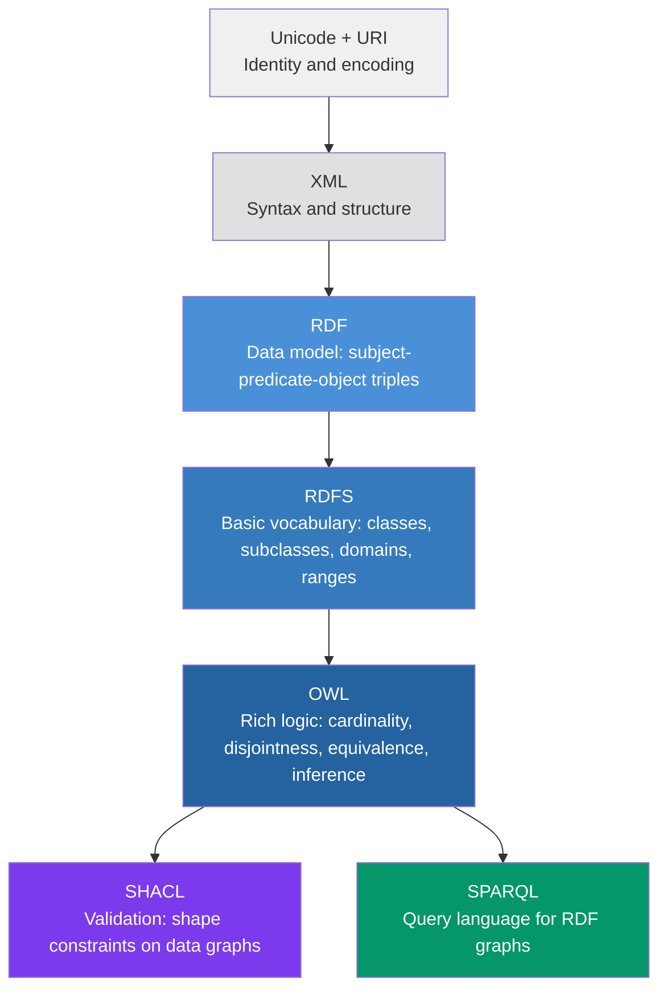
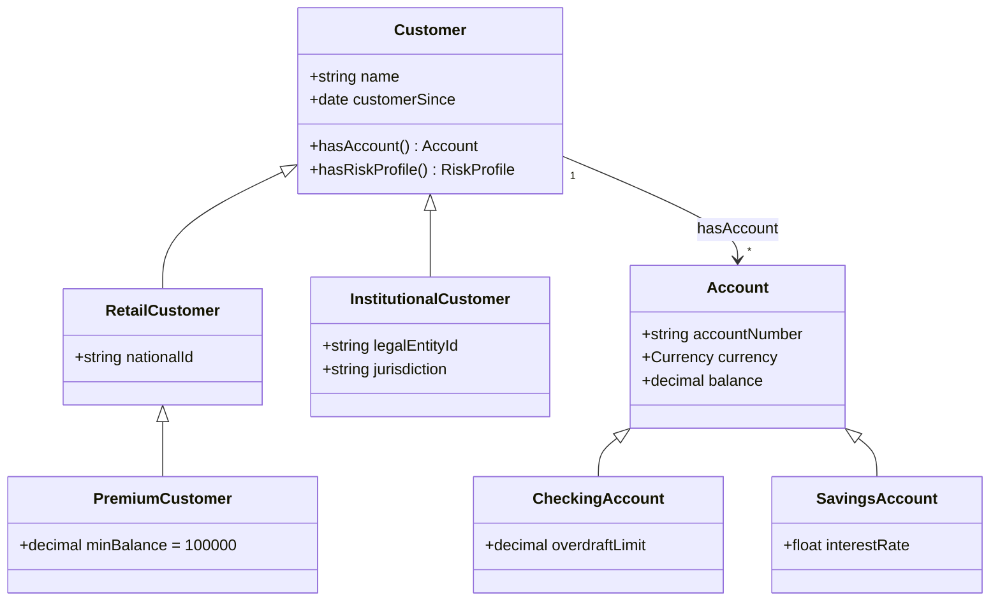
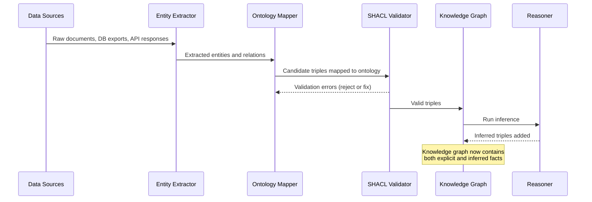
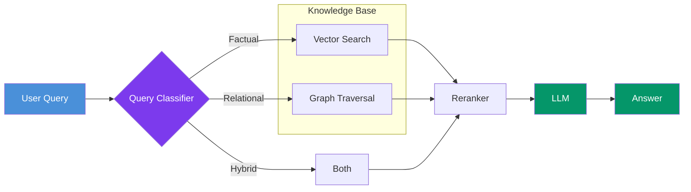
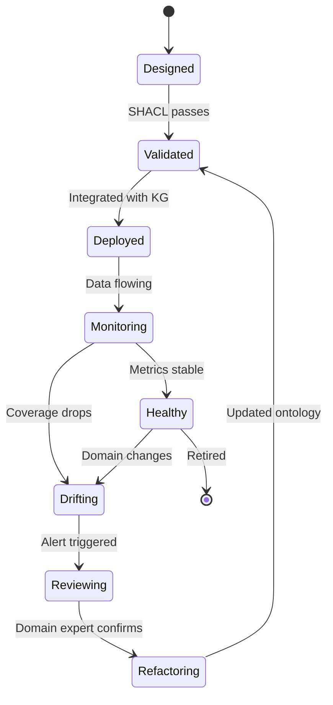

# Ontologies: The Blueprint Behind Every Knowledge Base That Actually Works

You've built a knowledge base before. Maybe it was a Notion wiki that ballooned into 2,000 pages nobody could search. Maybe it was a vector database stuffed with embedded documents that returned eerily confident but completely wrong answers. Or maybe — and this one stings — it was a carefully curated FAQ system that broke the moment someone asked a question using slightly different words.

The pattern is always the same: you throw data into a system, add a search layer on top, and hope that structure will emerge organically. It doesn't. What you get instead is an expensive pile of text that looks like knowledge but behaves like a junk drawer.

The missing ingredient is an *ontology* — a formal, explicit specification of the concepts, relationships, and rules that give meaning to your data. Ontologies aren't new. They've powered biomedical databases, financial compliance systems, and the semantic web for decades. But with the rise of knowledge graphs, GraphRAG, and enterprise AI, ontologies are experiencing a renaissance. The enterprise knowledge graph market grew from $1.18 billion in 2024 to $1.48 billion in 2025, and the organizations seeing the highest ROI — 300% or more across finance, healthcare, and manufacturing — are the ones building on top of formal ontologies rather than ad-hoc schemas.

This post walks you through the full journey: what ontologies are, the semantic stack that supports them, how to build one in Python, and how they transform knowledge bases from keyword-matching tools into reasoning engines.

## What Is an Ontology (And What It Isn't)

The word "ontology" comes from philosophy — the study of what exists. In computer science, we've borrowed the term with a narrower meaning. Tom Gruber's classic 1993 definition still holds: *an ontology is a formal, explicit specification of a shared conceptualization.*

Let's unpack that:

- **Formal**: machine-readable, with precise semantics. Not a slide deck, not a glossary.
- **Explicit**: assumptions are stated, not implied. If a `Customer` can have multiple `Accounts`, the ontology says so.
- **Shared**: agreed upon by a community. An ontology that only one person understands is just a schema.
- **Conceptualization**: a model of a domain — the things that exist, their properties, and how they relate.

People often confuse ontologies with related concepts. Here's how they differ:

| Concept | What it does | Example |
|---------|-------------|---------|
| **Taxonomy** | Hierarchical classification (is-a relationships only) | Animal → Mammal → Dog |
| **Thesaurus** | Synonym/related-term mappings | "Revenue" → "Income", "Earnings" |
| **Schema** | Structural template for data storage | SQL DDL, JSON Schema |
| **Ontology** | All of the above + properties, constraints, inference rules | A `Customer` *has* an `Account`, which *must have* a `Currency`. A `PremiumCustomer` *is-a* `Customer` with `balance > 100,000`. |

The key differentiator is *inference*. A taxonomy tells you that a Dog is a Mammal. An ontology tells you that — and also that every Mammal is warm-blooded, so your system can infer that a Dog is warm-blooded *without you explicitly stating it*. This inference capability is what transforms a static knowledge base into one that can reason.

### Why This Matters for Knowledge Bases

Consider a concrete scenario. You're building a knowledge base for a bank. Without an ontology, your system stores documents — policy PDFs, product sheets, compliance guidelines — as flat text chunks. When someone asks "What investment products can a high-net-worth retail customer access?", the system searches for chunks containing similar words. If the answer is split across three documents — one defining "high-net-worth" thresholds, another listing product eligibility rules, a third mapping customer tiers to product categories — vector search alone will struggle.

With an ontology, you've formally defined that a `HighNetWorthCustomer` is a subclass of `RetailCustomer` with `netWorth > 1,000,000`. You've stated that `HighNetWorthCustomer` `isEligibleFor` products in the `AlternativeInvestments` category. The knowledge base doesn't need to find a document that says this explicitly — it *reasons* its way to the answer by traversing the ontology graph.

This is the fundamental shift: from *finding text that sounds like an answer* to *deriving answers from structured knowledge*.

## The Semantic Stack: RDF, RDFS, OWL, and SHACL

Ontologies don't exist in a vacuum. They're built on a stack of W3C standards that together form the backbone of the semantic web. Understanding this stack is essential before you start building.

The following diagram shows how each layer builds on the one below it, adding expressivity at each level:



### RDF: The Data Model

RDF (Resource Description Framework) represents knowledge as **triples**: `(subject, predicate, object)`. Every fact in your knowledge base decomposes into this atomic unit.

```
(acme:Customer_42, rdf:type, acme:PremiumCustomer)
(acme:Customer_42, acme:hasAccount, acme:Account_789)
(acme:Account_789, acme:hasCurrency, acme:USD)
(acme:Account_789, acme:hasBalance, "150000"^^xsd:decimal)
```

Each element is identified by a URI, making every concept globally unique and linkable. This is what enables knowledge bases to merge data from multiple sources without ID collisions — something JSON or SQL schemas struggle with.

### RDFS: Basic Vocabulary

RDFS (RDF Schema) adds basic structuring:

- `rdfs:Class` — defines categories of things
- `rdfs:subClassOf` — hierarchical relationships ("PremiumCustomer is a Customer")
- `rdfs:domain` and `rdfs:range` — constrains what a property connects ("hasAccount" links a Customer to an Account)

RDFS is enough for simple taxonomies but lacks expressivity for real-world domains.

### OWL: The Reasoning Layer

OWL (Web Ontology Language) is where the real power lives. Built on description logic, OWL 2 adds:

- **Cardinality constraints**: "Every Account must have exactly one Currency"
- **Disjointness**: "A RetailCustomer and an InstitutionalCustomer cannot be the same entity"
- **Property characteristics**: transitive, symmetric, functional, inverse
- **Equivalence**: "Revenue owl:equivalentClass Income" — letting your system understand that two terms mean the same thing
- **Restrictions**: "PremiumCustomer ≡ Customer ∧ hasBalance ≥ 100,000"

These aren't decorative annotations. When you run a reasoner (HermiT, Pellet, or ELK), OWL axioms let the system *derive new facts* from existing data.

### SHACL: The Validator

SHACL (Shapes Constraint Language) is the quality gate. While OWL defines what *can* be true, SHACL defines what *must* be true for your data to be valid. Think of it as unit tests for your knowledge graph.

```turtle
acme:CustomerShape a sh:NodeShape ;
    sh:targetClass acme:Customer ;
    sh:property [
        sh:path acme:hasName ;
        sh:minCount 1 ;
        sh:datatype xsd:string ;
    ] ;
    sh:property [
        sh:path acme:hasAccount ;
        sh:minCount 1 ;
        sh:class acme:Account ;
    ] .
```

This shape says: every `Customer` must have at least one `hasName` (a string) and at least one `hasAccount` (an `Account` instance). Violate these constraints, and SHACL validation will tell you exactly what's wrong.

## Designing Your First Ontology

Ontology engineering is more art than science. The classic methodology — described in Noy and McGuinness's *Ontology Development 101* — starts with a deceptively simple exercise: writing **competency questions**.

### Step 1: Define Competency Questions

Before you model a single class, write the questions your knowledge base needs to answer. For a banking domain:

1. *Which customers have accounts denominated in more than one currency?*
2. *What products is a customer eligible for given their risk profile?*
3. *Which regulatory policies apply to a given transaction type?*
4. *Who is the relationship manager for all premium customers in the LATAM region?*

These questions are your test suite. If your ontology can't support answering them, it's incomplete. If it models concepts that no question references, it's over-engineered.

### Step 2: Identify Core Classes and Properties

From the competency questions above, you can extract:

- **Classes**: `Customer`, `Account`, `Product`, `RiskProfile`, `Transaction`, `Policy`, `Region`, `RelationshipManager`
- **Properties**: `hasAccount`, `hasCurrency`, `hasRiskProfile`, `isEligibleFor`, `appliesTo`, `managedBy`, `locatedIn`
- **Data properties**: `balance`, `name`, `customerSince`, `transactionDate`

### Step 3: Build the Hierarchy

The following diagram shows the class hierarchy for our banking ontology. Notice how each subclass adds constraints that distinguish it from its siblings:



### Step 4: Add Constraints and Rules

This is where ontologies diverge from simple ER diagrams. You're not just modeling structure — you're encoding business logic:

- `PremiumCustomer ≡ RetailCustomer ∧ ∃hasAccount.(balance ≥ 100,000)` — a customer *becomes* premium based on account balance, not because someone toggled a flag.
- `RetailCustomer ⊓ InstitutionalCustomer ≡ ⊥` — a customer is one or the other, never both.
- `hasAccount` is **inverse functional** on `accountNumber` — no two customers share the same account number.

### Step 5: Iterate With Domain Experts

The biggest mistake in ontology engineering isn't getting the logic wrong — it's building in isolation. Every class name, every relationship, every constraint should be validated with the people who actually work in the domain. "Does `isEligibleFor` mean *currently eligible* or *has ever been eligible*?" That distinction matters.

A practical approach is to run **ontology review sessions** where you show domain experts the class hierarchy and ask them to find errors. You'll be surprised how often an engineer's model diverges from reality. In banking, for example, engineers often model `Account` as belonging to exactly one `Customer` — but in practice, joint accounts, trust accounts, and power-of-attorney arrangements mean an account can have multiple owners with different roles.

The best ontologies go through at least three revision cycles before they stabilize. Use Protégé's visual tools for these reviews — its OntoGraf plugin renders class hierarchies and property relationships as interactive diagrams that non-technical stakeholders can navigate.

### Reusing Existing Ontologies

Before building from scratch, check if someone has already modeled your domain. Well-established ontologies include:

| Domain | Ontology | Notes |
|--------|----------|-------|
| Finance | FIBO (Financial Industry Business Ontology) | Maintained by the EDM Council. Covers instruments, entities, contracts. Massive but well-documented. |
| Biomedicine | SNOMED CT, Gene Ontology | Gold standard for clinical and genomic knowledge. |
| General | Schema.org | Lightweight. Good for product, organization, and event modeling. |
| Geospatial | GeoSPARQL | W3C standard for spatial data in RDF. |
| Scientific publishing | Dublin Core, BIBO | Metadata for documents, publications, bibliographic records. |

Reusing saves time and improves interoperability. Import what you need with `onto.imported_ontologies.append()` in Owlready2, then extend with your domain-specific classes and properties. The FIBO ontology alone has over 1,500 classes — you don't want to recreate that.

## Building Ontologies in Python

### Prerequisites and Environment

You need Python 3.8+ and two libraries:

```bash
pip install owlready2==0.50 rdflib==7.1.4
```

- **Owlready2** (v0.50, released February 2026): Load, create, and manipulate OWL 2 ontologies as Python objects. Includes HermiT and Pellet reasoners. Uses an SQLite-backed quadstore for efficient memory use.
- **RDFlib** (v7.1.4): Parse, serialize, and query RDF graphs. Supports SPARQL.

No GPU required. This runs on any machine — local, Colab, or a CI server. Total install size is under 50 MB.

### Creating an Ontology From Scratch

```python
from owlready2 import *

# Create a new ontology with a namespace URI
onto = get_ontology("http://example.org/banking#")

with onto:
    # Define classes
    class Customer(Thing):
        pass

    class RetailCustomer(Customer):
        pass

    class InstitutionalCustomer(Customer):
        pass

    class Account(Thing):
        pass

    class CheckingAccount(Account):
        pass

    class SavingsAccount(Account):
        pass

    class Currency(Thing):
        pass

    class RiskProfile(Thing):
        pass

    # Define object properties (relationships between instances)
    class hasAccount(ObjectProperty):
        domain = [Customer]
        range = [Account]

    class hasCurrency(ObjectProperty, FunctionalProperty):
        domain = [Account]
        range = [Currency]

    class hasRiskProfile(ObjectProperty, FunctionalProperty):
        domain = [Customer]
        range = [RiskProfile]

    # Define data properties (attributes with literal values)
    class hasName(DataProperty, FunctionalProperty):
        domain = [Customer]
        range = [str]

    class hasBalance(DataProperty, FunctionalProperty):
        domain = [Account]
        range = [float]

    class hasAccountNumber(DataProperty, FunctionalProperty):
        domain = [Account]
        range = [str]

    # Disjointness: retail and institutional customers are mutually exclusive
    AllDisjoint([RetailCustomer, InstitutionalCustomer])

# Save the ontology
onto.save(file="banking_ontology.owl", format="rdfxml")
print(f"Ontology saved with {len(list(onto.classes()))} classes")
```

### Adding Instances and Running Inference

Here's where ontologies earn their keep. Let's add data and let the reasoner discover new facts:

```python
from owlready2 import *

onto = get_ontology("banking_ontology.owl").load()

with onto:
    # Define a rule: customers with balance >= 100,000 are premium
    class PremiumCustomer(onto.RetailCustomer):
        equivalent_to = [
            onto.RetailCustomer
            & onto.hasAccount.some(
                onto.hasBalance.value(lambda x: x >= 100_000)
            )
        ]

    # Create instances
    usd = onto.Currency("USD")
    eur = onto.Currency("EUR")

    alice = onto.RetailCustomer("alice")
    alice.hasName = "Alice Johnson"

    alice_account = onto.CheckingAccount("alice_checking")
    alice_account.hasAccountNumber = "CHK-001"
    alice_account.hasBalance = 250_000.0
    alice_account.hasCurrency = usd
    alice.hasAccount.append(alice_account)

    bob = onto.RetailCustomer("bob")
    bob.hasName = "Bob Smith"

    bob_account = onto.SavingsAccount("bob_savings")
    bob_account.hasAccountNumber = "SAV-002"
    bob_account.hasBalance = 15_000.0
    bob_account.hasCurrency = eur
    bob.hasAccount.append(bob_account)

# Run the HermiT reasoner
with onto:
    sync_reasoner_hermit(infer_property_values=True)

# Check inferred classifications
for customer in onto.Customer.instances():
    types = [cls.name for cls in customer.is_a]
    balance = customer.hasAccount[0].hasBalance if customer.hasAccount else 0
    print(f"{customer.hasName}: balance={balance:,.0f}, types={types}")
```

The reasoner automatically classifies Alice as a `PremiumCustomer` because her account balance exceeds the threshold — without us ever explicitly assigning that class. Bob stays a `RetailCustomer`. This is inference in action.

### Querying With SPARQL

Owlready2's quadstore is compatible with RDFlib, so you can run SPARQL queries directly:

```python
from owlready2 import *
import rdflib

onto = get_ontology("banking_ontology.owl").load()

# Access the RDFlib-compatible graph
graph = default_world.as_rdflib_graph()

# Which customers have accounts in multiple currencies?
query = """
    PREFIX bank: <http://example.org/banking#>
    SELECT ?customer ?name (COUNT(DISTINCT ?currency) AS ?numCurrencies)
    WHERE {
        ?customer a bank:Customer .
        ?customer bank:hasName ?name .
        ?customer bank:hasAccount ?account .
        ?account bank:hasCurrency ?currency .
    }
    GROUP BY ?customer ?name
    HAVING (COUNT(DISTINCT ?currency) > 1)
"""

results = graph.query(query)
for row in results:
    print(f"{row.name} has accounts in {row.numCurrencies} currencies")
```

This directly answers competency question #1 from our design phase. If the query returns nothing, either the data is incomplete or the ontology needs refinement — both useful signals.

### Validating With SHACL

To enforce data quality, use pySHACL:

```bash
pip install pyshacl==0.29.0
```

```python
from pyshacl import validate
from rdflib import Graph

# Load the data graph
data_graph = Graph()
data_graph.parse("banking_ontology.owl", format="xml")

# Define SHACL shapes
shapes_ttl = """
@prefix sh: <http://www.w3.org/ns/shacl#> .
@prefix bank: <http://example.org/banking#> .
@prefix xsd: <http://www.w3.org/2001/XMLSchema#> .

bank:CustomerShape a sh:NodeShape ;
    sh:targetClass bank:Customer ;
    sh:property [
        sh:path bank:hasName ;
        sh:minCount 1 ;
        sh:maxCount 1 ;
        sh:datatype xsd:string ;
        sh:message "Every customer must have exactly one name" ;
    ] ;
    sh:property [
        sh:path bank:hasAccount ;
        sh:minCount 1 ;
        sh:class bank:Account ;
        sh:message "Every customer must have at least one account" ;
    ] .

bank:AccountShape a sh:NodeShape ;
    sh:targetClass bank:Account ;
    sh:property [
        sh:path bank:hasBalance ;
        sh:minCount 1 ;
        sh:datatype xsd:decimal ;
        sh:message "Every account must have a balance" ;
    ] .
"""

shapes_graph = Graph()
shapes_graph.parse(data=shapes_ttl, format="turtle")

conforms, results_graph, results_text = validate(
    data_graph, shacl_graph=shapes_graph
)

if conforms:
    print("All data conforms to the ontology constraints")
else:
    print("Validation failures found:")
    print(results_text)
```

SHACL catches problems that OWL can't: missing required fields, wrong data types, cardinality violations. In production, run SHACL validation as part of your data ingestion pipeline — before bad data enters the knowledge graph.

## From Ontology to Knowledge Graph

An ontology alone is a schema without data — like SQL DDL without any rows. A knowledge graph is what you get when you populate an ontology with instances from real-world data sources.

The following diagram shows how documents, databases, and APIs feed into an ontology-driven knowledge graph:



### The Three Ingestion Patterns

**1. Schema-to-Ontology Mapping** — When your source is a relational database, you can derive much of the ontology from the existing schema. Foreign keys become object properties, tables become classes, columns become data properties. Recent research (Ristoski et al., 2025) shows that ontologies extracted from databases achieve performance comparable to those derived from text corpora — at a fraction of the cost.

**2. NLP-Based Extraction** — For unstructured text (policies, manuals, contracts), use an LLM or NER pipeline to extract entities and relations, then map them to ontology classes and properties. The ontology acts as a guardrail here, constraining what types of facts the system can assert.

**3. Manual Curation** — For high-stakes domains (medical, legal, regulatory), human experts populate the knowledge graph directly using tools like Protégé (v5.6.9, free, open-source). This is slow but produces the highest-quality data.

In practice, most production knowledge bases use a combination of all three, with automated extraction for volume and human review for accuracy.

### LLMs as Ontology Engineering Assistants

A recent development worth noting: LLMs are increasingly used to *accelerate* ontology construction, not replace it. The 2026 paper on Large Ontology Models (LOMs) by Pan et al. introduces a three-stage pipeline — ontology instruction fine-tuning, text-ontology grounding, and multi-task instruction tuning — that produces compact OWL ontologies suitable for rule engines and expert systems.

In practice, the most effective workflow looks like this:

1. **Draft with LLM**: Give an LLM a set of domain documents and ask it to propose classes, properties, and relationships.
2. **Refine with domain experts**: Review the draft ontology for accuracy, completeness, and alignment with actual business logic.
3. **Formalize in Protégé or Owlready2**: Translate the reviewed model into OWL with proper axioms and constraints.
4. **Validate with SHACL**: Write shapes that encode the competency questions as validation rules.

This hybrid approach cuts ontology development time by 40-60% compared to fully manual engineering, while maintaining the precision that pure LLM-generated ontologies lack. The key insight from the research: LLMs are good at *proposing* ontological structure but poor at *constraining* it — they generate plausible-sounding axioms that don't hold up under reasoning. Human review remains essential.

## Ontology-Driven Knowledge Bases for RAG

If you've read the posts on [RAG systems](/blog/rag-building-production-systems) and [enterprise knowledge bases](/blog/enterprise-knowledge-bases) in this blog, you know that vanilla vector search has fundamental limitations: it finds semantically *similar* text but can't reason about *relationships* between concepts. This is where ontologies transform RAG from keyword matching into something closer to actual understanding.

### Why Ontologies Improve RAG

Standard RAG embeds document chunks into a vector space and retrieves the closest matches to a query. This works well for simple factual questions ("What is our refund policy?") but fails on relational questions ("Which products are available to premium customers in the LATAM region who have accounts in both USD and EUR?").

An ontology-driven knowledge base enables **structured retrieval**: instead of searching for similar text, you traverse the knowledge graph along typed relationships, constrained by the ontology's logic.

The numbers back this up. Microsoft's GraphRAG achieves 86% accuracy on enterprise benchmarks compared to 32% for baseline vector RAG. OG-RAG's ontology grounding reduces hallucinations by 40% through schema-constrained extraction. And the 2025 paper by Ristoski et al. shows that ontology-guided knowledge graphs incorporating chunk information substantially outperform vector retrieval baselines.

### The Hybrid Architecture

The most effective production systems combine both approaches:



A query classifier routes questions to the appropriate retrieval strategy. Factual questions go to vector search. Relational questions go to graph traversal (SPARQL or Cypher queries generated from the ontology schema). Complex questions use both, with a reranker to merge and prioritize results before sending context to the LLM.

### Practical Example: Ontology-Aware Retrieval

```python
from owlready2 import *

onto = get_ontology("banking_ontology.owl").load()

def ontology_aware_retrieval(query: str, onto) -> list[dict]:
    """
    Use the ontology to expand and constrain retrieval.
    For relational queries, generate SPARQL from ontology structure.
    """
    graph = default_world.as_rdflib_graph()

    # Example: find all products available to premium customers
    # The ontology tells us the path: Customer -> RiskProfile -> Product
    sparql = """
        PREFIX bank: <http://example.org/banking#>
        SELECT ?customer ?name ?product
        WHERE {
            ?customer a bank:PremiumCustomer .
            ?customer bank:hasName ?name .
            ?customer bank:hasRiskProfile ?profile .
            ?profile bank:isEligibleFor ?product .
        }
    """

    results = graph.query(sparql)
    return [
        {"customer": str(r.name), "product": str(r.product)}
        for r in results
    ]


def hybrid_retrieve(query: str, vector_store, onto) -> list:
    """Combine vector search with ontology-constrained graph traversal."""
    # Step 1: vector search for relevant chunks
    vector_results = vector_store.similarity_search(query, k=10)

    # Step 2: extract entities mentioned in top results
    entities = extract_entities(vector_results)

    # Step 3: expand context via ontology relationships
    expanded = []
    graph = default_world.as_rdflib_graph()
    for entity_uri in entities:
        # Follow ontology-defined relationships one hop out
        neighbors = graph.query(f"""
            SELECT ?predicate ?object
            WHERE {{ <{entity_uri}> ?predicate ?object }}
        """)
        expanded.extend(neighbors)

    # Step 4: merge and rerank
    return rerank(vector_results, expanded, query)
```

The ontology serves as both a retrieval guide (which relationships to follow) and a quality filter (only facts that conform to the ontology schema are returned).

## Ontology Drift: The Silent Killer

Here's the part nobody talks about in tutorials: ontologies rot.

Your domain changes — new products launch, regulations update, organizational structures shift. The ontology that perfectly modeled your business in January becomes subtly wrong by June. This is **ontology drift**, and it's the leading cause of knowledge base degradation in production.

The symptoms are insidious:

- **Silent precision loss**: Queries return slightly fewer results because new entities don't match outdated class definitions.
- **False inferences**: The reasoner derives conclusions that were true under the old model but not the current one.
- **Classification gaps**: New concepts don't fit any existing class, so they get shoved into a catch-all category or simply lost.

The following diagram shows the lifecycle of an ontology in production and the maintenance triggers that prevent drift:



### Preventing Drift

1. **Ontology coverage metrics**: Track what percentage of incoming entities map to ontology classes. A drop below 90% is a red flag.
2. **Scheduled reviews**: Monthly reviews with domain experts — not annual.
3. **Version control**: Treat `.owl` files like code. Use Git, tag releases, write changelogs.
4. **SHACL regression tests**: Run validation on every data ingestion. New failures mean the ontology or the data needs updating.
5. **Automated drift detection**: Compare the distribution of classified instances over time. If a class suddenly has 50% fewer instances, something changed.

## Known Gotchas

Before you start building, save yourself the debugging hours:

- **Reasoner performance**: HermiT and Pellet can be slow on large ontologies (10,000+ classes). For classification-only tasks, use the ELK reasoner which trades expressivity for speed. Owlready2 bundles HermiT; for ELK, you'll need to call it externally via Java.

- **Open-world assumption**: OWL uses the *open-world assumption* — if something isn't stated, it's unknown, not false. This trips up everyone coming from SQL (closed-world). If you don't explicitly state that Alice has an account, OWL won't conclude she doesn't — it simply doesn't know. Use SHACL (closed-world validation) alongside OWL to catch missing data.

- **Import conflicts**: When reusing external ontologies (Schema.org, FIBO, Dublin Core), namespace collisions are common. Always use `onto.imported_ontologies.append()` in Owlready2 and verify that imported class names don't shadow your own.

- **Serialization formats**: RDF/XML is verbose but universally supported. Turtle (`.ttl`) is human-readable. N-Triples is fast to parse. Pick Turtle for development, RDF/XML for interchange, N-Triples for bulk loading.

- **Owlready2 SQLite locking**: Owlready2 stores triples in SQLite. If multiple processes access the same `.sqlite3` file, you'll get locking errors. Use separate `World()` instances or switch to a proper triplestore (Apache Jena Fuseki, Blazegraph) for concurrent access.

- **Property value types**: Owlready2 silently coerces types. If you define `hasBalance` with range `float` but insert a string, it won't error during insertion — it'll break during reasoning. Always validate types before insertion.

## When to Use (and When Not to Use) an Ontology

Ontologies add complexity. They're not always the right choice. Here's a decision framework:

| Scenario | Use an Ontology? | Why |
|----------|:-:|-----|
| Simple FAQ chatbot | No | Vector search is sufficient |
| Multi-domain enterprise KB | Yes | Ontology provides cross-domain coherence |
| Regulatory compliance system | Yes | Inference rules encode policy logic |
| Personal notes search | No | Over-engineering for the use case |
| Product recommendation engine | Maybe | Useful if products have complex eligibility rules |
| Medical knowledge base | Yes | Existing biomedical ontologies (SNOMED, UMLS) are battle-tested |
| Small team documentation | No | A well-organized wiki is enough |
| Financial risk analysis | Yes | Relationships between entities, products, and regulations are the core value |

The rule of thumb: if your knowledge base needs to *reason* about relationships — not just find similar text — you need an ontology. If it just needs to match keywords or embeddings, you don't.

### The Cost of Not Using One

When you skip the ontology and go straight to "dump everything into a vector DB," you typically hit a wall around 10,000 documents. At that scale, retrieval precision drops because:

- **Ambiguity compounds**: The word "account" means different things in different contexts. Without formal class definitions, the system can't distinguish a bank account from a user account from an accounting report.
- **Relationships are invisible**: Vector similarity captures *topical* relevance, not *structural* relevance. Two documents about the same customer are no closer in embedding space than two random documents about customers in general.
- **Updates cascade unpredictably**: Change one policy document and you've invalidated chunks scattered across the index with no way to trace the impact.

An ontology doesn't eliminate these problems, but it gives you the handles to manage them: formal disambiguation through class hierarchies, explicit relationships through typed properties, and traceable provenance through linked metadata.

## Putting It All Together: A Minimal Production Stack

For teams getting started with ontology-driven knowledge bases, here's the recommended stack:

| Layer | Tool | Why |
|-------|------|-----|
| Ontology authoring | Protege 5.6.9 + Owlready2 | Visual editor for design, Python for automation |
| Storage | Apache Jena Fuseki or Blazegraph | SPARQL-native triplestores with concurrent access |
| Validation | pySHACL | CI-friendly, Python-native |
| Reasoning | HermiT (via Owlready2) or ELK | Bundled with Owlready2; ELK for large ontologies |
| Query | SPARQL via rdflib or direct triplestore endpoint | Standard, portable |
| RAG integration | LangChain or LlamaIndex with custom retriever | Hybrid vector + graph retrieval |
| Monitoring | Custom metrics + SHACL regression | Track coverage, validate on ingestion |

Start small. Build the ontology for one domain. Populate it with data from one source. Validate with SHACL. Run a few competency questions as SPARQL queries. Only then expand to multiple domains and hybrid RAG.

## Going Deeper

**Books:**
- Allemang, D., Hendler, J., & Gandon, F. (2020). *Semantic Web for the Working Ontologist: Effective Modeling for Linked Data, RDFS, and OWL.* ACM Press / Morgan & Claypool, 3rd edition.
  - The definitive practical guide to building ontologies with RDF and OWL. Updated third edition covers current best practices and real-world patterns.
- Staab, S. & Studer, R. (Eds.). (2009). *Handbook on Ontologies.* Springer, 2nd edition.
  - Comprehensive academic reference covering ontology engineering methodologies, tools, and applications across domains.
- Blumauer, A. & Nagy, H. (2020). *The Knowledge Graph Cookbook: Recipes That Work.* Edition mono/monochrom.
  - Practical, recipe-style guide to building knowledge graphs. Good bridge between ontology theory and production implementation.
- Baader, F. et al. (2017). *An Introduction to Description Logic.* Cambridge University Press.
  - If you want to understand the formal logic underneath OWL, this is the textbook. Heavy on math but essential for advanced ontology design.

**Online Resources:**
- [Ontology Development 101](https://protege.stanford.edu/publications/ontology_development/ontology101.pdf) — Noy and McGuinness's classic guide from Stanford. Still the best starting point for beginners despite its age.
- [W3C OWL 2 Web Ontology Language Primer](https://www.w3.org/TR/owl2-primer/) — The official W3C primer for OWL 2. Dense but authoritative.
- [Awesome Semantic Web](https://github.com/semantalytics/awesome-semantic-web) — Curated list of semantic web tools, libraries, and resources. Updated regularly.
- [Owlready2 Documentation](https://owlready2.readthedocs.io/en/latest/) — Complete reference for the Python ontology library used in this post.

**Videos:**
- [Knowledge Graphs and Graph Databases Explained](https://youtu.be/p4W56HYaO_s) — Clear introduction to the relationship between ontologies, knowledge graphs, and graph databases.
- [Ontologies in Neo4j](https://neo4j.com/blog/knowledge-graph/ontologies-in-neo4j-semantics-and-knowledge-graphs/) — Neo4j's guide to importing and querying OWL/RDF ontologies using the Neosemantics plugin.

**Academic Papers:**
- Gruber, T. (1993). ["A Translation Approach to Portable Ontology Specifications."](https://tomgruber.org/writing/ontolingua-kaj-1993.pdf) *Knowledge Acquisition*, 5(2), 199-220.
  - The foundational paper that defined "ontology" for computer science. Still cited in every ontology engineering paper.
- Hogan, A. et al. (2021). ["Knowledge Graphs."](https://arxiv.org/abs/2003.02320) *ACM Computing Surveys*, 54(4).
  - Comprehensive 70-page survey of knowledge graph construction, representation, and applications. Essential background reading.
- Ristoski, P. et al. (2025). ["Ontology Learning and Knowledge Graph Construction: A Comparison of Approaches and Their Impact on RAG Performance."](https://arxiv.org/abs/2511.05991) *arXiv:2511.05991*.
  - Compares ontology-guided KG construction approaches and their effect on RAG. Key finding: database-derived ontologies match text-derived ones at lower cost.
- Pan, J. et al. (2026). ["Construct, Align, and Reason: Large Ontology Models for Enterprise."](https://arxiv.org/abs/2602.00029) *arXiv:2602.00029*.
  - Introduces the Large Ontology Model (LOM) — a three-stage training pipeline for enterprise ontology construction using LLMs.

**Questions to Explore:**
- If LLMs can generate ontologies automatically, does the process of *designing* an ontology with domain experts still provide value beyond the artifact itself — through the shared understanding it creates?
- At what point does ontology maintenance overhead exceed the reasoning benefits? Is there a "complexity budget" for ontologies, analogous to technical debt?
- Can ontologies bridge the gap between symbolic AI (rules, logic) and neural AI (embeddings, transformers) — or will one paradigm eventually subsume the other?
- How should ontologies evolve in a world where the meaning of concepts shifts faster than formal models can be updated — is "good enough" ontology engineering the future?
- What happens when two organizations with incompatible ontologies need to merge knowledge bases — is alignment a solved problem or a perpetual negotiation?
