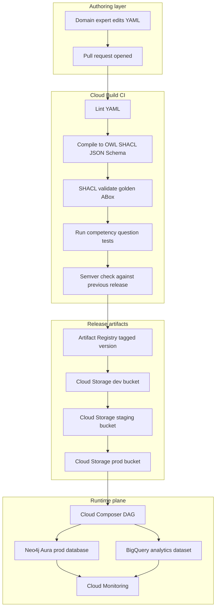
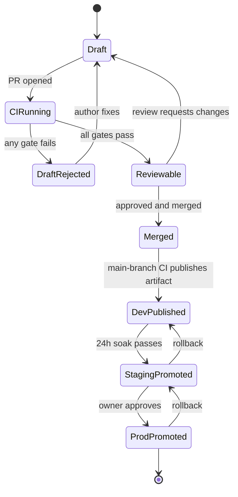

# Ontologies in Production: A CI/CD Pipeline for Enterprise Schemas on GCP

Someone on the business side is going to email you a `.ttl` file. They will be very pleased with themselves, because it took three months of cross-team workshops to produce, and it encodes real domain knowledge that was previously scattered across thirty Confluence pages. The email will say something like "the ontology is ready, we just need you to load it into production."

I have received this email. Probably so have you. The file will open fine in Protege. The classes will be named reasonably. The object properties will have domains and ranges. And yet, if you take the file at face value and point a graph-population pipeline at it on a Tuesday afternoon, by Wednesday morning you will own every one of the following problems:

- A junior analyst has pushed a change to the ontology that silently renamed `hasFee` to `hasCost`, and every dashboard that depended on the old name is now blank.
- A SHACL shape was added over the weekend that constrains `Customer.taxId` to a specific regex; half a million pre-existing records violate the regex because the bank used to accept hyphens.
- A new `InvestmentProduct` class appeared in a branch, but nobody noticed it was a subclass of `LoanProduct` instead of `Product`. The classifier on top of the graph now thinks investments are loans.
- There is no way to answer the question "which version of the ontology was in production on March 14, and did it contain the `governedBy` relation?" because there is no such thing as a version. There is only the file.

An ontology on a laptop is a document. An ontology in production is a piece of software, and it needs the same apparatus software gets: version control, code review, automated tests, versioned releases, environment separation, and observability. This post is the apparatus, end to end, for a banking knowledge graph on Google Cloud.

The stack I will use, which is close to what I run today as a Knowledge Data Engineer at a financial institution:

- **GitHub** (or Cloud Source Repositories) for source of truth
- **Cloud Build** for CI, triggered on pull requests
- **Artifact Registry** for versioned ontology releases
- **Cloud Storage** for compiled artifact snapshots per environment
- **Cloud Composer** (managed Airflow) for the graph-population pipeline that consumes the ontology
- **Neo4j Aura** for the production property graph, with **BigQuery** alongside for the analytics table projection
- **Cloud Monitoring** for observability of the ontology itself, not only the graph it produces

And one rule underneath all of it: **the ontology is code, not data.** You do not `INSERT` new classes, you open a pull request that adds them. You do not patch a running system, you cut a new version and promote it. You do not trust a file, you trust a commit SHA.

## Ontology as Code, Not Data

The distinction sounds like semantics until you try to diff two database-resident ontologies at 2 a.m. to figure out which change broke production. When the ontology lives in a database, change is a sequence of opaque transactions. When the ontology lives in a repository, change is a sequence of human-readable commits, each with an author, a message, and a reviewer.

What this means concretely:

1. **Every TBox change is a pull request.** New class, renamed property, widened range, tightened SHACL constraint: all of them are file edits, all of them go through review.
2. **The repository is the source of truth.** The Neo4j database has a loaded version of the ontology. BigQuery has an exported table with the same structure. Both are *caches*, built from the Git commit. Either one can be thrown away and rebuilt; the commit is authoritative.
3. **PR review is where domain experts earn their keep.** A domain expert who cannot read Turtle can read YAML. A compliance officer who cannot code can leave a comment on GitHub. The PR is the forum where "is this actually what a `CorporateCustomer` is?" gets asked, and answered, before any bit hits the graph.
4. **CI is the gate.** Merging to `main` is not the agreement that the ontology is correct. Passing CI is. A PR that someone has approved but whose competency-question tests fail is a PR that does not ship.

There is a secondary benefit that matters more than it first appears: **diffs become meaningful**. A commit that renames `hasFee` to `hasCost` shows up as exactly that, one line changed, in the file. Anyone reviewing the PR sees the rename, thinks about downstream impact, and either blocks the PR or asks for a migration. Compare this to a database-resident ontology where the same change is a sequence of `ALTER` or `CREATE`/`DROP` statements run in a console, possibly at night, possibly by someone who has since left the team.

## YAML In, Many Artifacts Out

The second architectural decision is about authoring format. Turtle and OWL Manchester syntax are fine for machines and for ontology specialists, but they are a barrier for the domain experts who actually own the semantics. YAML, with a schema that constrains what can be said, is the authoring format that everyone can edit in a browser, review on GitHub, and argue about in a PR comment thread.

Here is a slice of the source-of-truth file for a small banking ontology:

```yaml
# ontology/banking.yaml
version: 2.3.0
namespace: "http://bank.example.com/ontology/banking#"
prefix: bnk

classes:
  - name: Customer
    description: "Natural or legal person holding a relationship with the bank."
    subclass_of: []

  - name: RetailCustomer
    subclass_of: [Customer]

  - name: CorporateCustomer
    subclass_of: [Customer]

  - name: Product
    description: "A financial offering: savings account, loan, card, fund."

  - name: SavingsProduct
    subclass_of: [Product]

  - name: LoanProduct
    subclass_of: [Product]

  - name: Account
    description: "Ledger of transactions under a product, owned by a customer."

  - name: Transaction
    description: "A single money movement posted against an Account."

  - name: Regulation
    description: "A legal or supervisory rule that governs Products."

object_properties:
  - name: ownedBy
    domain: Account
    range: Customer
    functional: true

  - name: basedOn
    domain: Account
    range: Product
    functional: true

  - name: governedBy
    domain: Product
    range: Regulation

  - name: postedTo
    domain: Transaction
    range: Account
    functional: true

data_properties:
  - name: hasFee
    domain: Product
    range: float
    shacl:
      min_inclusive: 0.0
      max_inclusive: 10000.0

  - name: hasCurrency
    domain: Account
    range: string
    shacl:
      pattern: "^[A-Z]{3}$"   # ISO 4217

  - name: hasAmount
    domain: Transaction
    range: float

  - name: postedAt
    domain: Transaction
    range: datetime
```

That file is what domain experts edit. It is also what compiles, deterministically, into five downstream artifacts:

1. **Turtle (`banking.ttl`)** for tools that want OWL.
2. **SHACL shapes (`banking-shapes.ttl`)** for validation.
3. **JSON-Schema (`banking.schema.json`)** for the LLM prompt embed and for any API that needs to validate structured output.
4. **A Neo4j constraint script (`banking-neo4j.cypher`)** that materializes uniqueness, existence, and type constraints on the property graph.
5. **A Mermaid diagram (`banking.mmd`)** for documentation.

The compiler is the thing that makes this work. It is not glamorous, but it is load-bearing:

```python
# compile_ontology.py
"""Compile YAML ontology source into OWL, SHACL, JSON-Schema, Cypher, Mermaid."""
from __future__ import annotations
import json
from pathlib import Path
from typing import Any
import yaml
from rdflib import Graph, Namespace, RDF, RDFS, OWL, XSD, Literal, URIRef
from rdflib.namespace import SH

XSD_MAP = {
    "string": XSD.string,
    "float": XSD.decimal,
    "integer": XSD.integer,
    "boolean": XSD.boolean,
    "datetime": XSD.dateTime,
}

JSON_TYPE = {
    "string": "string",
    "float": "number",
    "integer": "integer",
    "boolean": "boolean",
    "datetime": "string",  # format: date-time
}


def load(path: Path) -> dict[str, Any]:
    with path.open(encoding="utf-8") as f:
        return yaml.safe_load(f)


def to_owl(model: dict[str, Any]) -> Graph:
    g = Graph()
    ns = Namespace(model["namespace"])
    g.bind(model["prefix"], ns)
    g.bind("owl", OWL)

    ontology_iri = URIRef(model["namespace"].rstrip("#"))
    g.add((ontology_iri, RDF.type, OWL.Ontology))
    g.add((ontology_iri, OWL.versionInfo, Literal(model["version"])))

    for cls in model["classes"]:
        c = ns[cls["name"]]
        g.add((c, RDF.type, OWL.Class))
        if desc := cls.get("description"):
            g.add((c, RDFS.comment, Literal(desc)))
        for parent in cls.get("subclass_of", []):
            g.add((c, RDFS.subClassOf, ns[parent]))

    for prop in model["object_properties"]:
        p = ns[prop["name"]]
        g.add((p, RDF.type, OWL.ObjectProperty))
        g.add((p, RDFS.domain, ns[prop["domain"]]))
        g.add((p, RDFS.range, ns[prop["range"]]))
        if prop.get("functional"):
            g.add((p, RDF.type, OWL.FunctionalProperty))

    for prop in model["data_properties"]:
        p = ns[prop["name"]]
        g.add((p, RDF.type, OWL.DatatypeProperty))
        g.add((p, RDFS.domain, ns[prop["domain"]]))
        g.add((p, RDFS.range, XSD_MAP[prop["range"]]))

    return g


def to_shacl(model: dict[str, Any]) -> Graph:
    g = Graph()
    ns = Namespace(model["namespace"])
    g.bind(model["prefix"], ns)
    g.bind("sh", SH)

    # One node shape per class, collecting property shapes for every
    # data_property whose domain is this class.
    for cls in model["classes"]:
        node_shape = ns[f"{cls['name']}Shape"]
        g.add((node_shape, RDF.type, SH.NodeShape))
        g.add((node_shape, SH.targetClass, ns[cls["name"]]))
        for prop in model["data_properties"]:
            if prop["domain"] != cls["name"]:
                continue
            p_shape = ns[f"{cls['name']}_{prop['name']}_Shape"]
            g.add((node_shape, SH.property, p_shape))
            g.add((p_shape, SH.path, ns[prop["name"]]))
            g.add((p_shape, SH.datatype, XSD_MAP[prop["range"]]))
            for key, value in prop.get("shacl", {}).items():
                term = {
                    "min_inclusive": SH.minInclusive,
                    "max_inclusive": SH.maxInclusive,
                    "pattern": SH.pattern,
                }[key]
                g.add((p_shape, term, Literal(value)))
    return g


def to_json_schema(model: dict[str, Any]) -> dict[str, Any]:
    defs: dict[str, Any] = {}
    for cls in model["classes"]:
        props: dict[str, Any] = {}
        for prop in model["data_properties"]:
            if prop["domain"] != cls["name"]:
                continue
            field: dict[str, Any] = {"type": JSON_TYPE[prop["range"]]}
            if prop["range"] == "datetime":
                field["format"] = "date-time"
            for key, value in prop.get("shacl", {}).items():
                if key == "pattern":
                    field["pattern"] = value
                elif key == "min_inclusive":
                    field["minimum"] = value
                elif key == "max_inclusive":
                    field["maximum"] = value
            props[prop["name"]] = field
        defs[cls["name"]] = {
            "type": "object",
            "description": cls.get("description", ""),
            "properties": props,
        }
    return {
        "$schema": "https://json-schema.org/draft/2020-12/schema",
        "$id": f"{model['namespace']}v{model['version']}",
        "title": "Banking Ontology",
        "version": model["version"],
        "$defs": defs,
    }


def main() -> None:
    src = Path("ontology/banking.yaml")
    out = Path("build")
    out.mkdir(exist_ok=True)
    model = load(src)

    to_owl(model).serialize(out / "banking.ttl", format="turtle")
    to_shacl(model).serialize(out / "banking-shapes.ttl", format="turtle")
    (out / "banking.schema.json").write_text(
        json.dumps(to_json_schema(model), indent=2), encoding="utf-8"
    )
    (out / "VERSION").write_text(model["version"])


if __name__ == "__main__":
    main()
```

The compiler is deterministic: same input YAML, same output artifacts, byte for byte. Determinism matters because the CI pipeline hashes the artifacts and refuses to publish a release whose hash differs from what the build produced. It is the mechanism that lets us say, a year later, that artifact `sha256:a7f4...` was built from commit `abc123` and nothing else.

I have watched teams skip this compile step and ask domain experts to edit Turtle directly. It works for about six weeks, until the first merge conflict on a TBox file. Turtle does not diff well. YAML does.

## The Reference Architecture on GCP

The moving parts fit together in a shape that is worth drawing once and referring back to.



Five things are worth pointing out in the picture:

1. The only path from author to runtime goes through CI. Nobody uploads a `.ttl` file to a bucket by hand, ever.
2. Artifact Registry holds the versioned release. The GCS buckets hold a promotion-flow snapshot for each environment. The registry is the canonical store; the buckets are positioning.
3. Cloud Composer reads the ontology at DAG-start time from the environment's bucket. It does not reach back to the registry at runtime, because the bucket is pre-synced by a promotion step. This is what gives you reproducibility: `dev` ran against version X on Tuesday, and that version is frozen in the `dev` bucket until you promote a new one.
4. Neo4j and BigQuery are both downstream. Neo4j holds the graph. BigQuery holds a table-shaped projection useful for analysts who think in SQL. The ontology drives both.
5. Cloud Monitoring observes the graph *and* the ontology. I will come back to this; it is where most teams underinvest.

## The CI Pipeline: Five Gates

Here is the real `cloudbuild.yaml` we use. It is not illustrative; it is the shape the production pipeline takes, minus names:

```yaml
# cloudbuild.yaml
substitutions:
  _PROJECT: bank-ontology
  _REGION: europe-west1
  _BUCKET_DEV: ${_PROJECT}-ontology-dev
  _PY_IMAGE: python:3.12-slim

options:
  logging: CLOUD_LOGGING_ONLY
  machineType: E2_HIGHCPU_8

steps:
  # 1. Lint YAML source against its meta-schema.
  - name: ${_PY_IMAGE}
    id: lint
    entrypoint: bash
    args:
      - -c
      - |
        pip install -q pyyaml jsonschema
        python tools/lint_ontology.py ontology/banking.yaml

  # 2. Compile YAML to OWL, SHACL shapes, JSON-Schema, Cypher, Mermaid.
  - name: ${_PY_IMAGE}
    id: compile
    entrypoint: bash
    waitFor: [lint]
    args:
      - -c
      - |
        pip install -q pyyaml rdflib
        python tools/compile_ontology.py
        ls -l build/

  # 3. SHACL-validate a golden ABox sample against the compiled shapes.
  - name: ${_PY_IMAGE}
    id: shacl
    entrypoint: bash
    waitFor: [compile]
    args:
      - -c
      - |
        pip install -q pyshacl rdflib
        python tools/validate_golden.py \
          build/banking-shapes.ttl \
          tests/golden_abox.ttl

  # 4. Competency-question tests: SPARQL against the golden ABox.
  - name: ${_PY_IMAGE}
    id: cq
    entrypoint: bash
    waitFor: [compile]
    args:
      - -c
      - |
        pip install -q rdflib
        python -m pytest tests/competency_questions.py -v

  # 5. Semver check against last published version. Fails PR if major-bump
  #    required but only minor/patch was proposed in ontology/banking.yaml.
  - name: ${_PY_IMAGE}
    id: semver
    entrypoint: bash
    waitFor: [compile]
    args:
      - -c
      - |
        pip install -q pyyaml rdflib
        python tools/semver_check.py \
          --previous-tag $(gcloud artifacts docker tags list \
            ${_REGION}-docker.pkg.dev/${_PROJECT}/ontology/banking \
            --format="value(tag)" --limit=1) \
          --current ontology/banking.yaml

  # 6. Publish artifact only on main branch.
  - name: gcr.io/cloud-builders/gsutil
    id: publish
    waitFor: [shacl, cq, semver]
    entrypoint: bash
    args:
      - -c
      - |
        if [ "$BRANCH_NAME" = "main" ]; then
          VERSION=$(cat build/VERSION)
          gsutil -m cp build/* gs://${_BUCKET_DEV}/v$${VERSION}/
          gsutil cp build/* gs://${_BUCKET_DEV}/latest/
        else
          echo "Not on main, skipping publish."
        fi

timeout: 900s
```

Six steps, five of them gates. Any of them failing blocks the PR. A few are worth unpacking.

**Lint** catches shape errors in the YAML that would otherwise explode deeper in the pipeline. A class listed as a subclass of a class that does not exist. An `object_property` whose `domain` or `range` points at a nonexistent class. A `data_property` with an unknown range type. Catching these here keeps the error messages close to the edit.

**Compile** is the step from the previous section. Its output lives in `build/`. Every subsequent step reads from there; nothing recompiles.

**SHACL validation** is where the shapes meet reality. We keep a `golden_abox.ttl` file in the repo: a small, hand-curated set of instance data that represents real shapes we expect the production graph to contain. Think of it as the ontology's equivalent of unit-test fixtures. When the ontology tightens a constraint, we want to know immediately whether it breaks the golden ABox. If it does, we either loosen the constraint or fix the data model; we do not let the tightening through silently.

The validator call itself is two lines of pySHACL:

```python
# tools/validate_golden.py
import sys
from pathlib import Path
from pyshacl import validate
from rdflib import Graph

shapes = Graph().parse(sys.argv[1], format="turtle")
data = Graph().parse(sys.argv[2], format="turtle")

conforms, results_graph, results_text = validate(
    data_graph=data,
    shacl_graph=shapes,
    inference="rdfs",
    abort_on_first=False,
    meta_shacl=False,
    advanced=True,
    debug=False,
)
if not conforms:
    print(results_text)
    sys.exit(1)
print("Golden ABox conforms to all SHACL shapes.")
```

**Competency questions as tests** is the gate that separates real ontologies from decorative ones. I will spend a whole section on it next.

**Semver check** is belt-and-braces governance. It reads the previous published `banking.yaml`, diffs it against the current one, computes what the change *should* be (major, minor, patch) by rules we will enumerate, and fails the build if the author bumped to the wrong level. Humans are bad at semver; machines are good at it.

## Competency Questions as Tests (Not as Decoration)

Grüninger and Fox put competency questions on the map in 1995. Their idea was that an ontology should be justified by the questions it lets you answer: not the structure it has, but the queries it can *support*. A competency question is a question in natural language that the ontology should be able to answer once it is loaded with data. "Which products are governed by MiFID II?" is a competency question. "Which customers opened an account in the last 90 days and hold at least one regulated product?" is a harder one. A good ontology is a set of classes and relations that lets you express and answer all your competency questions.

The anti-pattern here is tests that assert only *structure*: "the class `Product` exists", "the property `hasFee` has domain `Product`". Those tests pass when the ontology is wrong in exactly the way that matters most: when it has the right shape but cannot answer the business question. The real value comes from tests that *execute* a SPARQL query against the compiled TBox plus the golden ABox, and assert the answer matches an expected value.

Here are four concrete tests in the banking domain. They use pytest plus rdflib, and they run in CI exactly the way application unit tests do:

```python
# tests/competency_questions.py
"""Competency questions as executable tests against the compiled ontology."""
from pathlib import Path
from rdflib import Graph

ONT = Graph()
ONT.parse("build/banking.ttl", format="turtle")
ABOX = Graph()
ABOX.parse("tests/golden_abox.ttl", format="turtle")
ABOX += ONT  # union of TBox and ABox for RDFS entailment

BNK = "http://bank.example.com/ontology/banking#"

def _ask(q: str):
    return list(ABOX.query(q))


def test_cq_1_which_products_are_regulated_by_mifid():
    """CQ1: Which products are governed by MiFID II?"""
    rows = _ask(f"""
        PREFIX bnk: <{BNK}>
        SELECT ?product WHERE {{
          ?product bnk:governedBy ?reg .
          ?reg bnk:hasName "MiFID II" .
        }}
    """)
    ids = {str(r[0]) for r in rows}
    assert f"{BNK}prod-savings-eur-001" in ids
    assert f"{BNK}prod-investment-fund-eu" in ids
    assert len(ids) >= 2, "Golden ABox expects at least two MiFID-II products."


def test_cq_2_customers_with_high_value_txn_and_a_loan():
    """CQ2: Which customers have a transaction over 50k in the last 90d
    and also hold a loan product?"""
    rows = _ask(f"""
        PREFIX bnk: <{BNK}>
        SELECT DISTINCT ?c WHERE {{
          ?a bnk:ownedBy ?c .
          ?t bnk:postedTo ?a .
          ?t bnk:hasAmount ?amt .
          FILTER (?amt > 50000)
          ?a2 bnk:ownedBy ?c .
          ?a2 bnk:basedOn ?p .
          ?p a bnk:LoanProduct .
        }}
    """)
    assert any(f"{BNK}cust-premium-014" == str(r[0]) for r in rows)


def test_cq_3_no_savings_product_without_a_fee_bound():
    """CQ3: Every savings product must have a fee between 0 and 10_000
    (enforced by SHACL, asserted here as an ontology-level invariant)."""
    rows = _ask(f"""
        PREFIX bnk: <{BNK}>
        SELECT ?p WHERE {{
          ?p a bnk:SavingsProduct .
          FILTER NOT EXISTS {{ ?p bnk:hasFee ?fee }}
        }}
    """)
    assert rows == [], (
        "Found savings products without hasFee in the golden ABox; "
        "either fix the fixture or weaken the ontology constraint."
    )


def test_cq_4_subclass_polymorphism_for_customers():
    """CQ4: A query over :Customer should return instances of subclasses
    (RetailCustomer, CorporateCustomer) by RDFS subsumption."""
    rows = _ask(f"""
        PREFIX bnk: <{BNK}>
        SELECT ?c WHERE {{ ?c a bnk:Customer }}
    """)
    kinds = {
        str(list(ABOX.triples((r[0], None, None)))[0][2])
        for r in rows
    }
    # We expect subclasses to be folded into the Customer result.
    assert f"{BNK}RetailCustomer" in kinds or f"{BNK}CorporateCustomer" in kinds
```

Notice what each test is doing. It is not checking whether `hasFee` is in the TBox as a property. It is checking whether the ontology plus the golden data can *answer the business question*. That is the whole point. If someone tightens `hasFee`'s range to `[0, 100]` tomorrow, CQ3 still passes but SHACL validation on the golden ABox fails, because a real savings product costs 120. If someone removes `governedBy` entirely, CQ1 fails noisily and the PR is blocked. The tests are read as "can my analysts still get their answers?" not "is this a valid OWL file?"

A working rule of thumb: for every new class or non-trivial relation you add, write at least one competency question that would fail if the class or relation were removed. The test file grows alongside the ontology; neither gets ahead of the other.

## Semantic Versioning for Schemas

The semver check is a step most teams skip, then regret. The rule set is short enough to state in a table and boring enough that machines should enforce it.

| Change kind | Version bump | Example |
|---|---|---|
| Add a new class | minor | `InvestmentProduct` appears |
| Add a new optional property | minor | `Product.brochureUrl` added |
| Add an optional SHACL constraint | minor | `hasCurrency` gets a pattern |
| Widen a range | minor | `hasFee` range `float` becomes `number` |
| Add a new mandatory property | **major** | `Customer.taxResidency` required |
| Rename a class or property | **major** | `hasFee` to `hasCost` |
| Remove a class, property, or relation | **major** | `legacyRiskScore` deleted |
| Tighten a SHACL constraint | **major** | `hasFee` range `[0,10_000]` to `[0,500]` |
| Move a property up or down the class hierarchy | **major** | `hasFee` moves from `Product` to `SavingsProduct` |
| Fix a typo in a `description` | patch | `"acccount"` to `"account"` |
| Add a `rdfs:comment` or reorder lines | patch | Pure cosmetic |

The key insight is that breaking changes are changes that can invalidate data that conformed under the previous version. A new mandatory property will make every pre-existing instance non-conformant. A tightened SHACL constraint will reject instances that were fine yesterday. Rename is breaking even though the YAML diff looks small, because every consumer (dashboards, SPARQL, Cypher queries, agent tools) refers to the old name.

The semver-check tool enumerates the diff, scores each change, and compares the computed bump to the one in `version:`. It fails the build if you bumped patch but changed a mandatory-property constraint. It fails if you bumped major without a reason. Same tool, same rules, no arguments over Slack.

## Environment Separation: Dev, Staging, Prod

Every environment gets its own isolated everything: bucket, Neo4j Aura database, BigQuery dataset, Composer DAG. The pipeline moves artifacts between environments, not data.

- **Dev bucket** (`gs://bank-ontology-dev`): receives every successful main-branch build, automatically. DAGs here run against a tiny synthetic graph. Break things freely.
- **Staging bucket** (`gs://bank-ontology-staging`): receives artifacts promoted by a manual (or cron-triggered) Cloud Build workflow after a 24-hour dev soak. DAGs here run against a real but sampled copy of production data, maybe 1% sample. Break things carefully.
- **Prod bucket** (`gs://bank-ontology-prod`): receives artifacts promoted by an approval-gated Cloud Build workflow, executed by a named ontology owner. DAGs here run against the full graph. Do not break things.

Promotion itself is boring: a Cloud Build trigger that checks out the tag, copies the artifacts from the dev bucket to staging (or staging to prod), and sends a notification. The workflow that populates Neo4j re-reads the bucket at DAG-start time, so rollback is "promote the previous version" and takes one button-click.

Here is the state machine, because the order matters:



Two discipline points are not on the diagram but are absolutely part of the system:

1. **Nobody edits prod directly.** Not with `gsutil cp` into the prod bucket, not with a `neo4j-admin` patch on the Aura database. If you need a hotfix, you open a PR, it goes through CI, it gets promoted. If the hotfix is genuinely urgent, you can make the CI pipeline skip the soak with a named approval, but you cannot skip the pipeline itself.
2. **Each environment's Composer DAG pins the ontology version explicitly.** The DAG reads `gs://bank-ontology-prod/latest/VERSION`, fetches that exact version's artifacts, and records the version in the load's metadata. So every Neo4j node and BigQuery row can, in principle, be traced back to the ontology commit that produced its schema.

## Observability of the Ontology, Not Just the Graph

Most teams instrument the graph they produce. Few instrument the ontology itself. Both matter, and they tell you different things.

Observability signals I publish to Cloud Monitoring on every load:

- **Concept count over time.** Is the ontology growing? Shrinking? A sudden drop in class count is a red flag worth a Slack alert.
- **Reference count per concept.** Which classes and properties are used by instance data, and which are dead? A class that is in the TBox but referenced by zero ABox instances for 30 days is a candidate for deprecation.
- **SHACL violations per load, per shape.** A single number per shape per environment. When the count spikes, something in the source data has changed, or the ontology has been tightened.
- **TBox-ABox drift.** Count of ABox predicates that have no matching property in the current TBox. Hopefully zero. If non-zero, the load introduced ad-hoc shapes that nobody declared; investigate.
- **Orphan concepts.** Classes that have no instances, properties with no usages, regulations with no products. Not always a problem, but a slow-growing set is a smell.
- **Orphan instances.** Instances whose class has been renamed or deleted. These should not exist if the load discipline is good; the count is a correctness check.
- **Competency-question hit rate in production.** This is the most interesting one. Keep the competency-question SPARQL queries from CI, run them hourly against the live graph, and measure how many return plausible non-empty results. A CQ that passes on the golden ABox but returns empty on the live graph is telling you the golden ABox is not actually representative, or the production data has drifted.

A small helper that publishes these as custom metrics:

```python
# tools/publish_ontology_metrics.py
from google.cloud import monitoring_v3
import time
from rdflib import Graph, OWL, RDF

client = monitoring_v3.MetricServiceClient()
PROJECT = "projects/bank-ontology"

def publish(metric_name: str, value: float, labels: dict[str, str]) -> None:
    series = monitoring_v3.TimeSeries()
    series.metric.type = f"custom.googleapis.com/ontology/{metric_name}"
    for k, v in labels.items():
        series.metric.labels[k] = v
    now = time.time()
    point = monitoring_v3.Point({
        "interval": {"end_time": {"seconds": int(now)}},
        "value": {"double_value": value},
    })
    series.points = [point]
    client.create_time_series(name=PROJECT, time_series=[series])


def count_concepts(tbox_path: str) -> tuple[int, int]:
    g = Graph().parse(tbox_path, format="turtle")
    classes = len(list(g.subjects(RDF.type, OWL.Class)))
    object_props = len(list(g.subjects(RDF.type, OWL.ObjectProperty)))
    data_props = len(list(g.subjects(RDF.type, OWL.DatatypeProperty)))
    return classes, object_props + data_props


if __name__ == "__main__":
    c, p = count_concepts("build/banking.ttl")
    publish("class_count", c, {"env": "prod"})
    publish("property_count", p, {"env": "prod"})
```

Wire those metrics into a Cloud Monitoring dashboard and an alert policy. The class-count-dropped alert has saved me twice. Both times, the cause was a bad merge that lost a couple of classes during a conflict resolution. The TBox-ABox drift alert has saved me more often than I will admit.

## Governance: Who Opens, Who Approves, Who Owns

The final piece is human. A CI pipeline that a single engineer can open, approve, and merge is a pipeline with no governance. Roles matter.

- **Authors** are domain experts: product specialists, compliance, risk. They open PRs with YAML edits. They are not expected to understand SHACL, OWL, or Cypher. They are expected to describe what they want in the PR title and body.
- **Reviewers** are ontology engineers. They are expected to understand the downstream effects of a TBox change, to insist on tests, to request migration plans for breaking changes.
- **Owners** are senior ontology engineers. They own CODEOWNERS entries for core files. A PR that touches `ontology/banking.yaml` cannot merge without an owner approval.
- **Release managers** approve promotions from staging to prod. For low-volume ontologies this is the same person as the owner. For high-volume ones it is a separate role, often rotating.

A `CODEOWNERS` file at the root, of the kind GitHub enforces, is the lightest-weight tool that does this:

```
# CODEOWNERS
/ontology/                 @bank/ontology-owners
/ontology/banking.yaml     @bank/ontology-owners @bank/risk-product
/tests/competency_*.py     @bank/ontology-owners @bank/analytics-platform
/tools/compile_ontology.py @bank/platform
```

Release cadence is a choice. In my current team, we release to dev continuously on every main-branch merge, promote to staging weekly on Wednesday, and promote to prod on the first Tuesday of each month. Emergency breaks glass for security, regulatory, or data-integrity fixes. Nothing else skips the cadence.

A governance principle that is worth putting on the wall: **the ontology is the contract between the business and the engineers**. It is not a platform team's internal artifact. If business people cannot read, write, and comment on it, it will drift away from the business and become, eventually, irrelevant. YAML with a lint-schema is the compromise that keeps them in the loop.

## Prerequisites

Before you take any of this to production, make sure you have:

- **A repository with branch protection on main**, including required CI checks and at least one review.
- **A service account with least-privilege** for Cloud Build: read from source, write to Artifact Registry, write to the dev bucket only. Separate service accounts for staging and prod promotion.
- **A golden ABox.** Not optional, not "later". Fifty instances are enough to start. Grow as the ontology grows.
- **A compile step that is deterministic.** If your compiler's output depends on dict ordering, sort keys. If it depends on timestamps, strip them. Reproducibility is non-negotiable.
- **One person who owns the ontology's semver.** Not a committee. Semver decisions cannot be made by consensus.
- **Cloud Monitoring alert policies on the key ontology signals.** Silent drift is worse than loud breakage.

## Gotchas

Traps I have personally fallen into, in rough order of painfulness:

- **Reasoner surprises.** If your compile step runs an OWL reasoner (HermiT, Pellet), its output can change between versions of the reasoner itself. Pin the reasoner version.
- **Turtle whitespace and blank-node churn.** Two semantically identical Turtle files can differ byte-for-byte because of blank node renumbering or whitespace. Run a canonicalizer before hashing. Otherwise your "deterministic" build is not.
- **PR that changes only `description` fields triggering semver drift.** Ignore pure-comment changes in the semver checker, or you will bump minors for typo fixes.
- **Golden ABox that has become a lie.** The fixture was representative in 2026, but the business has changed. Review the golden set quarterly.
- **SHACL shapes that over-constrain the real world.** Especially for free-text fields: a regex that works in dev will eventually reject a perfectly legitimate character in a name or address. SHACL constraints on PII fields must survive the edge cases of every country you operate in.
- **Cloud Composer DAGs that cache the ontology in-worker.** Airflow workers can outlive a DAG run. If the worker caches the ontology in-memory, a new version fetched by a later DAG can end up mixing with the old one. Load fresh per DAG run.
- **Artifact Registry retention policy.** If you set retention to 30 days, you lose the ability to roll back to versions older than that. Prod releases should be retention-exempt or stored with a long TTL.

## Testing

Three layers, all cheap:

**Compiler tests.** Feed the compiler a set of small YAML fixtures and assert the output Turtle parses, the SHACL loads in pySHACL, and the JSON-Schema validates a known-good instance. Catches regressions in the compiler before they touch a real ontology.

**Golden-ABox tests.** The pytest file of competency questions from earlier. Run in CI. Run also on every promotion, against the environment's Neo4j database, not just the in-memory rdflib graph.

**Promotion dry-runs.** A staging-promotion pipeline that runs the full Neo4j load against a disposable Aura database, measures load time, and asserts that node and relationship counts fall within expected bands. If a version makes the load twice as slow, or produces half the nodes, do not promote.

And the boring one: **restore from Git**. At least quarterly, nuke a dev environment and rebuild it from zero using only the repo and the CI pipeline. If you cannot, your environment has hidden state, and you will discover the hidden state at the worst possible moment.

## Going Deeper

**Books:**

- Allemang, D., Hendler, J., & Gandon, F. (2020). *Semantic Web for the Working Ontologist* (3rd ed.). ACM Books.
  - The canonical practitioner's book on RDF, RDFS, OWL, and SHACL. Read the SHACL chapters before you design your first shapes graph.

- Kejriwal, M., Knoblock, C. A., & Szekely, P. (2021). *Knowledge Graphs: Fundamentals, Techniques, and Applications.* MIT Press.
  - Good coverage of the full lifecycle: ontology, construction, quality, deployment. The chapter on quality assessment dovetails with the observability section above.

- Barrasa, J., & Webber, J. (2023). *Building Knowledge Graphs: A Practitioner's Guide.* O'Reilly.
  - Written by two people who ship these systems into production banks, telcos, and retailers. The deployment chapters are where this post agrees most strongly with existing practice.

- Forsgren, N., Humble, J., & Kim, G. (2018). *Accelerate: The Science of Lean Software and DevOps.* IT Revolution.
  - Not about ontologies, but the evidence base for why short lead times, small batches, and fast feedback matter. Everything in this post is an instance of Accelerate's principles applied to TBox changes.

**Online Resources:**

- [W3C SHACL Recommendation](https://www.w3.org/TR/shacl/) - The canonical specification. Treat it as reference material, not a tutorial. The SHACL 1.2 working drafts at [w3c.github.io/data-shapes](https://w3c.github.io/data-shapes/shacl12-core/) are where the future is going.
- [pySHACL on GitHub](https://github.com/RDFLib/pySHACL) - The Python validator this post uses in CI. Actively maintained, works well with rdflib.
- [Cloud Build build configuration schema](https://cloud.google.com/build/docs/build-config-file-schema) - The exact reference for `cloudbuild.yaml` syntax. Especially useful for `waitFor` and artifact configuration.
- [Cloud Composer release notes](https://cloud.google.com/composer/docs/release-notes) - Track the current Airflow version (2.11.x at time of writing on Composer 3) and the EOL dates for older images.
- [Ontotext: What Is SHACL](https://www.ontotext.com/knowledgehub/fundamentals/what-is-shacl/) - A readable introduction to SHACL with concrete shape examples from a graph-database vendor's perspective.

**Videos:**

- [Going Meta - Episode 03: Controlling the shape of your graph with SHACL](https://neo4j.com/videos/going-meta-s02-ep-01-continuing-the-journey-in-ai-and-knowledge-graph/) by Jesus Barrasa and Alexander Erdl on Neo4j - The Going Meta series is the single best resource for hands-on ontology engineering in a property-graph world. The SHACL episode maps directly onto the validation pipeline above.
- [Apache Airflow and Data Pipeline Orchestration with Google Cloud Composer](https://www.classcentral.com/course/youtube-nashknolx-airflow-using-gcp-composer-430380) by NashKnolX - A 44-minute practical walkthrough of Composer, useful background for understanding how the graph-population DAG fits into a larger GCP data platform.

**Academic Papers:**

- Gruninger, M., & Fox, M. S. (1995). ["Methodology for the Design and Evaluation of Ontologies."](http://www.eil.utoronto.ca/wp-content/uploads/enterprise-modelling/papers/gruninger-ijcai95.pdf) *Workshop on Basic Ontological Issues in Knowledge Sharing, IJCAI-95.*
  - The origin paper for competency questions. Short, readable, foundational. Every engineer who writes tests against an ontology is implicitly using their framework, whether they know it or not.

- Poveda-Villalon, M., Fernandez-Izquierdo, A., Fernandez-Lopez, M., & Garcia-Castro, R. (2022). ["LOT: An industrial oriented ontology engineering framework."](https://doi.org/10.1016/j.engappai.2022.104755) *Engineering Applications of Artificial Intelligence*, 111.
  - A practitioner-leaning methodology for industrial ontology projects that aligns closely with the CI-driven pipeline this post describes. Read it for their treatment of roles and artifacts.

**Questions to Explore:**

- If the ontology is code, should the business logic encoded in SHACL shapes be versioned in the same artifact as the TBox, or separately? What changes if shapes evolve faster than classes?
- When an ontology version has been in production for a year, and the TBox has changed eight times since, how do you reconcile historical data that was loaded under earlier versions? Versioned sub-graphs? Named graphs per release? A migration pipeline per breaking change?
- Competency questions are tests of the ontology's expressive power on a golden ABox. How do you write competency questions that test the ontology's behavior on *adversarial* data, the way fuzz testing stresses software?
- Should the ontology's semver be derived automatically from the YAML diff, or declared explicitly by the author and then verified? The ergonomics differ; which produces fewer bugs?
- In a multi-domain bank, you rarely have one ontology; you have retail, corporate, risk, and compliance ontologies that import from each other. What does "CI for an ontology" look like when the TBox you are testing imports three others whose releases you do not control?
