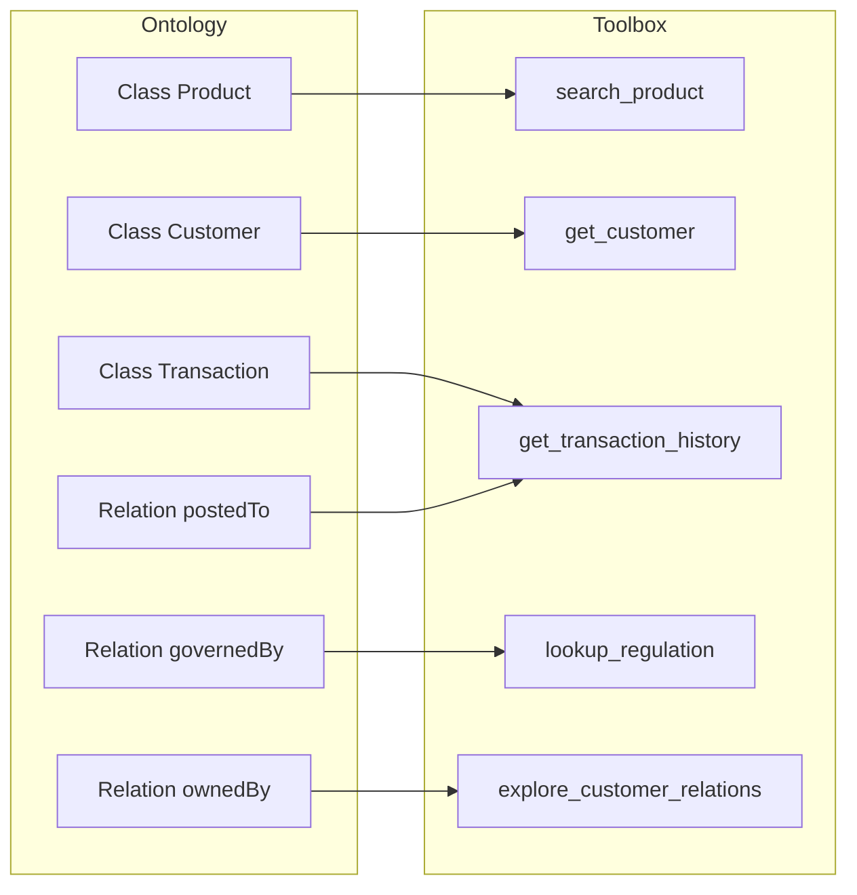
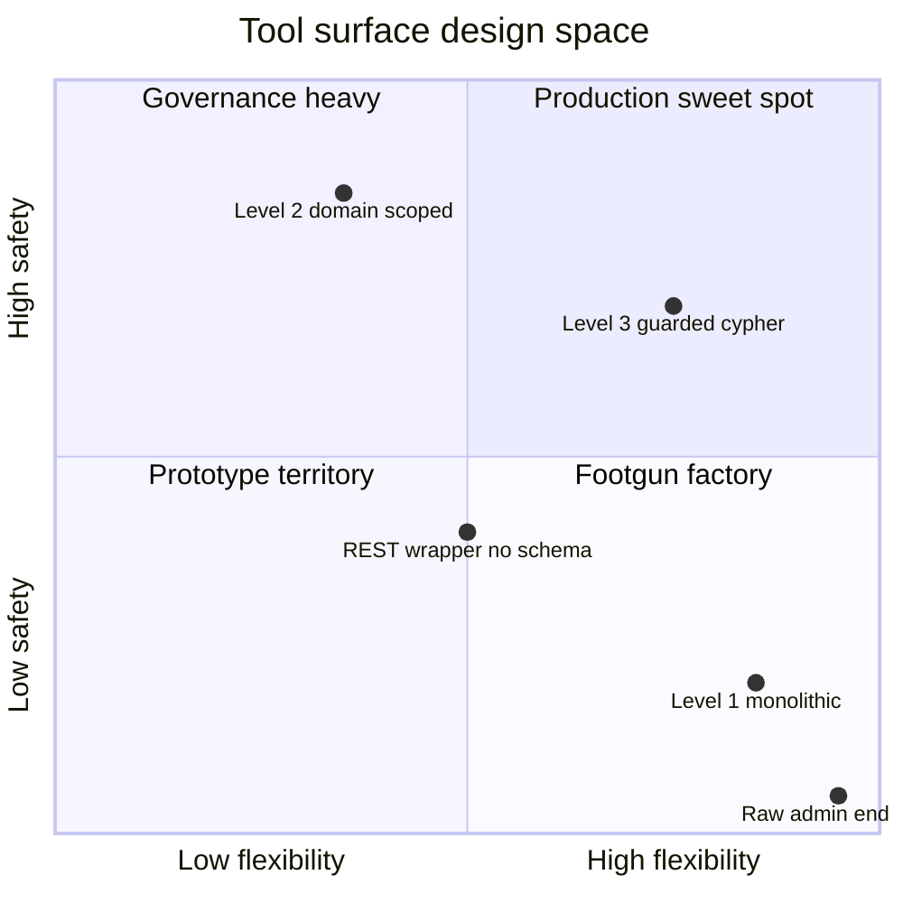
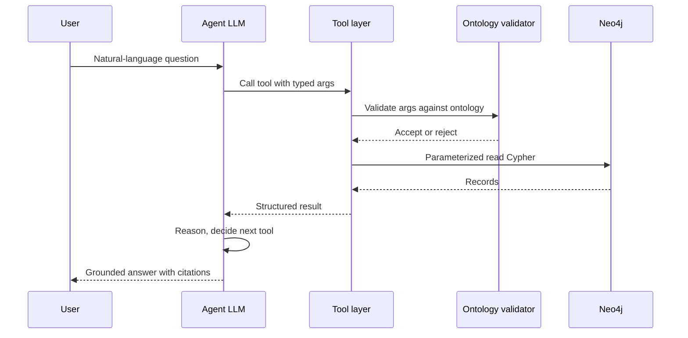

# From Ontology to Agent Toolbox: Turning Your Schema Into Tools

A colleague of mine shipped an internal agent last quarter. It was clever. It had Neo4j underneath, a carefully curated knowledge graph of customers, products, and regulations, and a single, elegant-looking tool called `run_cypher(query: str)`. The agent was supposed to answer analyst questions: "Which savings products charge fees above the regional median?", "Who owns account A-1193 and what's its five-year transaction tail?"

On the third day of soft launch, the agent received a question it didn't really understand. It did what LLMs do when they don't understand: it generated something plausible. The Cypher it generated included a `DETACH DELETE` pattern because the phrase "clean up" had appeared, in a completely different context, seven turns earlier in the conversation. The write transaction did not fail, because the Neo4j role was the default admin role. Thirty-two customer nodes disappeared before a human noticed and killed the session.

Nobody had told the agent what the schema meant. Nobody had told the agent which operations were allowed. The contract between the agent and the graph was, quite literally, a free-form string field.

This post is about the alternative. It's about the idea that an ontology — the formal spec of classes, relations, and constraints behind your knowledge graph — is also the blueprint for your agent's toolbox. Every class is a candidate tool. Every typed relation is a candidate tool. Every SHACL shape is a candidate input validator. When you design tools from the ontology rather than from the database interface, the agent stops being a free-form Cypher generator and becomes a consumer of a well-typed, well-documented API.

We'll work through three levels of tool granularity, each with real code, a concrete banking example, and explicit trade-offs:

1. **Level 1** — A single monolithic `query_knowledge_graph` tool
2. **Level 2** — Domain-scoped tools generated one-per-ontology-zone
3. **Level 3** — Cypher-with-guardrails: LLM writes Cypher, but a validator gates it

Then we'll close with the pattern that makes all of this reusable across teams: a shared ontology, differentiated access, and a role-based tool registry.

## The Ontology Is the Blueprint

Before we write any tools, we need to anchor ourselves on what an ontology actually gives us. For the rest of the post, we'll use a small banking ontology defined with Owlready2. Keep it on the left side of your mental screen; the tools will appear on the right.

```python
# banking_ontology.py
from owlready2 import get_ontology, Thing, DataProperty, ObjectProperty
from owlready2 import FunctionalProperty, DatatypeProperty

onto = get_ontology("http://example.org/banking.owl")

with onto:
    # --- Classes ---
    class Customer(Thing):
        """Natural or legal person holding a relationship with the bank."""

    class RetailCustomer(Customer):
        pass

    class CorporateCustomer(Customer):
        pass

    class Account(Thing):
        """Ledger of transactions under a product, owned by a customer."""

    class Product(Thing):
        """A financial offering: savings account, loan, card, fund, etc."""

    class SavingsProduct(Product):
        pass

    class LoanProduct(Product):
        pass

    class Transaction(Thing):
        """A single money movement posted against an Account."""

    class Regulation(Thing):
        """A legal or supervisory rule that governs Products."""

    # --- Object properties (typed relations) ---
    class ownedBy(Account >> Customer, FunctionalProperty):
        pass

    class basedOn(Account >> Product, FunctionalProperty):
        pass

    class governedBy(Product >> Regulation):
        pass

    class postedTo(Transaction >> Account, FunctionalProperty):
        pass

    # --- Data properties (typed attributes) ---
    class hasFee(DataProperty, FunctionalProperty):
        domain = [Product]
        range  = [float]

    class hasCurrency(DataProperty, FunctionalProperty):
        domain = [Account]
        range  = [str]

    class hasAmount(DataProperty, FunctionalProperty):
        domain = [Transaction]
        range  = [float]

    class postedAt(DataProperty, FunctionalProperty):
        domain = [Transaction]
        range  = [str]  # ISO-8601
```

Four things matter here, and they all turn into agent affordances later:

1. **Classes** define *what kinds of things exist* (`Customer`, `Product`, `Transaction`, `Regulation`). Each becomes a retrieval target.
2. **Object properties** define *which relations are legal between classes* (`ownedBy: Account >> Customer`). Each becomes a traversal.
3. **Data properties** define *which attributes exist per class* (`hasFee` on `Product`). Each becomes a filter.
4. **Class hierarchy** (`SavingsProduct` is-a `Product`) is free polymorphism: a tool that searches `Product` also searches its subclasses.

Owlready2 gives you something nicer than a YAML file: the ontology is live Python. Once you have loaded `banking.owl` (or constructed it in code as above), `onto.classes()`, `onto.object_properties()`, and `onto.data_properties()` return first-class iterables. You can attach Python methods to ontology classes, compute per-instance business logic, and, when the HermiT reasoner is enabled, infer subsumption automatically — a `PremiumCustomer` restricted to `netWorth > 1_000_000` is *computed* to be a subclass of `HighNetWorthCustomer`, not asserted manually. That reasoning capacity is what makes the ontology a serious source of truth rather than a documentation convenience.

The mapping from ontology to toolbox is almost mechanical:



The picture is simple. The discipline of following it is not. In the rest of the post we'll see why the naive mapping — one tool per class — is only the middle option, and what you gain (and lose) by moving in either direction.

## Level 1: The Monolithic Tool

The simplest tool surface is a single endpoint: one tool, any query. You expose your query language directly.

```python
# level1_monolithic.py
from neo4j import GraphDatabase

driver = GraphDatabase.driver(
    "bolt://graph.internal:7687",
    auth=("reader", "***"),
)

def query_knowledge_graph(cypher: str) -> list[dict]:
    """Run a read-only Cypher query and return records as dictionaries."""
    with driver.session(default_access_mode="READ") as s:
        # execute_read opens a read transaction; writes will error out.
        records = s.execute_read(
            lambda tx: [r.data() for r in tx.run(cypher)]
        )
    return records
```

The corresponding tool schema in the Anthropic tool-use format is equally sparse:

```python
QUERY_KG_TOOL = {
    "name": "query_knowledge_graph",
    "description": (
        "Execute a read-only Cypher query against the banking knowledge graph "
        "and return the resulting rows. Do not use write clauses: CREATE, "
        "MERGE, DELETE, SET, REMOVE are blocked."
    ),
    "input_schema": {
        "type": "object",
        "properties": {
            "cypher": {
                "type": "string",
                "description": "A read-only Cypher query.",
            }
        },
        "required": ["cypher"],
    },
}
```

And the agent prompt snippet looks roughly like this:

```text
You have access to the banking knowledge graph via a single tool,
query_knowledge_graph. The schema is described below. Use Cypher only.

Node labels: Customer, RetailCustomer, CorporateCustomer, Account,
Product, SavingsProduct, LoanProduct, Transaction, Regulation.

Relationships: (Account)-[:OWNED_BY]->(Customer),
(Account)-[:BASED_ON]->(Product), (Product)-[:GOVERNED_BY]->(Regulation),
(Transaction)-[:POSTED_TO]->(Account).
```

### What works

On an easy analyst question — "How many savings products have fees above 10 euros?" — the agent writes:

```cypher
MATCH (p:SavingsProduct) WHERE p.hasFee > 10 RETURN count(p) AS n
```

…and gets a correct answer. Level 1 is the most flexible surface you can offer. Every query the graph supports is reachable. You do not need to anticipate user intent.

### What fails

The same flexibility is the failure mode. Three concrete problems show up the moment you leave the happy path:

**Schema hallucination.** Ask about "product categories" when the ontology has no such class and you'll get:

```cypher
MATCH (p:Product)-[:IN_CATEGORY]->(c:Category) RETURN c.name, count(p)
```

This is syntactically valid, semantically wrong, and runs silently to produce zero rows. The agent then invents an answer.

**Prompt brittleness.** The schema description in the system prompt is essentially a documentation file pasted into the context. Any change to the ontology requires you to rewrite that prompt, re-evaluate it, and redeploy. In a real enterprise graph with two hundred labels, the schema description alone runs several thousand tokens, eats cache budget, and gets truncated.

**No auditability.** You cannot say, after the fact, "this agent called `get_customer` on customer X." You can only say "this agent ran a string." Every Cypher invocation is a new artifact. Evaluating tool choice becomes evaluating string similarity of queries.

**Safety is one layer deep.** `execute_read` prevents writes at the driver level — that's fine, and it's what saved my colleague from a repeat incident. But if the reader role has access to a sensitive label (say `PII`), there is nothing stopping the agent from querying it. The granularity of your guardrail is "is this query a read?" not "is this query allowed?"

### When Level 1 is the right choice

Not never. Level 1 is appropriate in three narrow situations:

- The graph is small, the schema is stable, and the audience is internal analysts who will review every generated query.
- You are prototyping and trying to discover which tools to build. Level 1 is a fast way to watch an agent flounder and learn which shapes of query it actually reaches for.
- The consumer is another program, not a production-facing agent, and you have already decided to trust it.

For customer-facing or compliance-sensitive agents, Level 1 is almost always wrong.

### A concrete failure walk-through

It is worth sitting with one bad Level 1 trace end to end, because it crystallises why we move up the stack. Question from the analyst:

> "Show me customers whose primary account has had at least one transaction over 50k in the last six months, and who also hold at least one loan product."

A capable model will generate something like this on the first try:

```cypher
MATCH (c:Customer)-[:OWNS]->(a:Account),
      (t:Transaction)-[:ON]->(a)
WHERE t.amount > 50000 AND t.date > date() - duration('P6M')
MATCH (c)-[:HAS]->(l:Loan)
RETURN c.id, count(DISTINCT t) AS big_tx, count(DISTINCT l) AS loans
```

Four things are wrong with this query, and none of them will raise an error:

1. `:OWNS` does not exist in our schema — the actual relation is `OWNED_BY`, in the opposite direction.
2. `:ON` does not exist — the actual relation is `POSTED_TO`.
3. `t.amount` is wrong — the ontology declares `hasAmount`; `date` is wrong — the property is `postedAt`.
4. `:Loan` does not exist — it is `:LoanProduct`, and it sits behind `(:Account)-[:BASED_ON]->(:Product)`, not a direct relation from the customer.

Because Cypher does not complain about unknown labels or relations at query time (it silently returns zero rows), the agent's response is "No customers matched your criteria." The analyst believes the graph is empty of matches. The truth is the other way around — the graph is full of matches, but the query asked for a parallel universe.

This is why moving to Level 2 or Level 3 is not about style. The tool surface is the place you encode *which universe is real*.

## Level 2: Domain-Scoped Tools

Here the ontology becomes literal blueprint. For each class in the ontology we expose a search tool. For each important relation, we expose a traversal tool. The agent composes them, rather than writing queries.

```python
# level2_domain_scoped.py
from typing import Literal, Optional
from pydantic import BaseModel, Field
from neo4j import GraphDatabase

driver = GraphDatabase.driver("bolt://graph.internal:7687",
                              auth=("reader", "***"))

# ---------- search_product ----------

class SearchProductArgs(BaseModel):
    query: Optional[str] = Field(
        None, description="Free-text match against product name/description."
    )
    product_type: Optional[Literal["SavingsProduct", "LoanProduct"]] = Field(
        None, description="Restrict to a product subclass."
    )
    max_fee: Optional[float] = Field(
        None, description="Maximum fee in euros (inclusive)."
    )
    limit: int = Field(20, ge=1, le=100)

def search_product(args: SearchProductArgs) -> list[dict]:
    cypher = (
        "MATCH (p:Product) "
        "WHERE ($label IS NULL OR $label IN labels(p)) "
        "  AND ($query IS NULL OR toLower(p.name) CONTAINS toLower($query)) "
        "  AND ($max_fee IS NULL OR coalesce(p.hasFee, 0) <= $max_fee) "
        "RETURN p.id AS id, p.name AS name, labels(p) AS types, "
        "       p.hasFee AS fee LIMIT $limit"
    )
    params = {
        "label": args.product_type,
        "query": args.query,
        "max_fee": args.max_fee,
        "limit": args.limit,
    }
    with driver.session(default_access_mode="READ") as s:
        return s.execute_read(lambda tx: [r.data() for r in tx.run(cypher, **params)])


# ---------- lookup_regulation ----------

class LookupRegulationArgs(BaseModel):
    product_id: str = Field(..., description="Product identifier.")

def lookup_regulation(args: LookupRegulationArgs) -> list[dict]:
    cypher = (
        "MATCH (p:Product {id: $product_id})-[:GOVERNED_BY]->(r:Regulation) "
        "RETURN r.id AS id, r.name AS name, r.jurisdiction AS jurisdiction"
    )
    with driver.session(default_access_mode="READ") as s:
        return s.execute_read(
            lambda tx: [rec.data() for rec in tx.run(cypher, product_id=args.product_id)]
        )


# ---------- explore_customer_relations ----------

class ExploreCustomerArgs(BaseModel):
    customer_id: str
    depth: int = Field(1, ge=1, le=3,
                       description="How many hops from the customer node.")

def explore_customer_relations(args: ExploreCustomerArgs) -> list[dict]:
    # Bounded variable-length path — critical for cost control.
    cypher = (
        "MATCH p = (c:Customer {id: $cid})-[*1..%d]-(n) "
        "RETURN [x IN nodes(p) | {id: x.id, labels: labels(x)}] AS path "
        "LIMIT 50"
    ) % args.depth
    with driver.session(default_access_mode="READ") as s:
        return s.execute_read(
            lambda tx: [r.data() for r in tx.run(cypher, cid=args.customer_id)]
        )


# ---------- get_transaction_history ----------

class GetTransactionHistoryArgs(BaseModel):
    account_id: str
    since: Optional[str] = Field(None, description="ISO-8601 lower bound.")
    until: Optional[str] = Field(None, description="ISO-8601 upper bound.")
    min_amount: Optional[float] = None
    limit: int = Field(100, ge=1, le=500)

def get_transaction_history(args: GetTransactionHistoryArgs) -> list[dict]:
    cypher = (
        "MATCH (t:Transaction)-[:POSTED_TO]->(a:Account {id: $aid}) "
        "WHERE ($since IS NULL OR t.postedAt >= $since) "
        "  AND ($until IS NULL OR t.postedAt <= $until) "
        "  AND ($min_amount IS NULL OR abs(t.hasAmount) >= $min_amount) "
        "RETURN t.id AS id, t.postedAt AS at, t.hasAmount AS amount "
        "ORDER BY t.postedAt DESC LIMIT $limit"
    )
    params = args.model_dump()
    params["aid"] = params.pop("account_id")
    with driver.session(default_access_mode="READ") as s:
        return s.execute_read(lambda tx: [r.data() for r in tx.run(cypher, **params)])
```

Every tool above was pulled directly from the ontology. The class `Product` gave us `search_product`. The relation `governedBy: Product >> Regulation` gave us `lookup_regulation`. The relation `postedTo: Transaction >> Account` combined with the data properties `postedAt` and `hasAmount` gave us `get_transaction_history`.

The tool schemas follow automatically from the Pydantic models. In the Anthropic format:

```python
import json
SEARCH_PRODUCT_TOOL = {
    "name": "search_product",
    "description": (
        "Search the bank's product catalog. Returns products optionally "
        "filtered by subclass (SavingsProduct, LoanProduct) and maximum fee. "
        "Use this before lookup_regulation if you only have a product name."
    ),
    "input_schema": SearchProductArgs.model_json_schema(),
}
```

LangChain offers the same lift with `StructuredTool.from_function`, which infers the schema from the callable's signature — the mechanism is different but the contract is identical: the tool's `args_schema` is the typed input validator.

### What works

The agent no longer needs to know Cypher. It does not need to know that `POSTED_TO` is uppercase while `postedAt` is camelCase. It does not need to remember whether `:Product` has a `hasFee` attribute or a `fee` attribute. The ontology constraints are baked into the tool boundary.

The prompt becomes tiny — just a list of tool names and purposes — because the descriptions live on the tools themselves. That's where modern LLMs look first, and where evaluation frameworks can assert coverage.

And crucially, **every invocation is auditable as a typed call**. "Agent X called `lookup_regulation(product_id='SAV-77')` at timestamp T" is a log line you can aggregate, alert on, and replay in tests.

### What fails

Level 2 has two honest weaknesses.

**Composition is the agent's job.** "List the regulations that govern any savings product with fee under 5 euros" is now two calls: `search_product(product_type='SavingsProduct', max_fee=5)`, then `lookup_regulation` for each id. The agent has to loop, which costs latency and tokens, and smaller models will sometimes forget to iterate.

**Schema evolution cascades into tool definitions.** Add a new class `InvestmentProduct` to the ontology and — if you want the agent to see it — you must edit `search_product`'s `Literal[...]` union, regenerate schemas, and redeploy. In practice this is tolerable if you treat tool definitions the way you treat API versions: contracts that break deliberately. But it is work, and it is work that Level 1 does not require.

### When Level 2 is the right choice

Almost always, for external-facing or governance-sensitive agents. If you have compliance people reading your tool list, this is the level they can reason about. It is also the level that lets you write *integration tests* in the style agents actually fail: a golden question, an expected sequence of tool calls, and a verifier.

### Generating tools from the ontology

Because the mapping from ontology to Level 2 tool is mechanical, we can generate tool stubs rather than hand-write them. In Owlready2 the reflection is direct:

```python
# scaffold_tools.py
from banking_ontology import onto

def scaffold_search_tool(cls):
    """Emit a Pydantic args model and a Cypher search function for a class."""
    name = cls.name
    data_props = [p.name for p in cls.get_class_properties()
                  if p.range and p.range[0] in (float, int, str)]
    print(f"class Search{name}Args(BaseModel):")
    for p in data_props:
        print(f"    {p}: Optional[str] = None")
    print(f"def search_{name.lower()}(args): ...")

for cls in onto.classes():
    if cls is Thing:
        continue
    scaffold_search_tool(cls)
```

You should still code-review the generated stubs — ontology authors are not API designers, and not every class deserves a tool. But treating tool generation as a build step rather than a hand-written artifact is the right long-term posture. The alternative, which I have watched happen, is a slow drift where tools outlive the ontology concepts they refer to, and the graph grows a layer of zombie code nobody is sure still works.

## Level 3: Cypher with Guardrails

Level 3 is not "give up and go back to Level 1." It is a deliberate middle ground: the agent *does* write Cypher, but every query passes through a validator whose rules are derived from the same ontology. This is the pattern that papers like Auto-Cypher and production work on Neo4j's MCP Cypher server have been converging on: generation plus verification.

```python
# level3_guarded_cypher.py
import re
from typing import Iterable
from neo4j import GraphDatabase

FORBIDDEN = re.compile(
    r"\b(CREATE|MERGE|DELETE|DETACH|SET|REMOVE|DROP|CALL\s+db\.|LOAD\s+CSV)\b",
    re.IGNORECASE,
)

class CypherPolicyError(ValueError):
    pass

class CypherGuard:
    """Validate an LLM-generated Cypher query against ontology-derived allow-lists."""

    def __init__(
        self,
        allowed_labels: Iterable[str],
        allowed_relationships: Iterable[str],
        max_hops: int = 3,
        row_limit: int = 200,
    ):
        self.labels = {l.lower() for l in allowed_labels}
        self.rels = {r.lower() for r in allowed_relationships}
        self.max_hops = max_hops
        self.row_limit = row_limit

    def validate(self, cypher: str) -> str:
        c = cypher.strip().rstrip(";")

        # 1. Single statement only.
        if ";" in c:
            raise CypherPolicyError("Multiple statements are not allowed.")

        # 2. Reject any write or admin clause.
        if FORBIDDEN.search(c):
            raise CypherPolicyError("Write and admin clauses are forbidden.")

        # 3. Label allow-list. :Label and :`Label` forms.
        for label in re.findall(r":`?([A-Za-z_][A-Za-z0-9_]*)`?", c):
            if label.lower() not in self.labels:
                raise CypherPolicyError(f"Label '{label}' is not allowed.")

        # 4. Relationship allow-list. -[:REL]- and -[:REL*..k]- forms.
        for rel in re.findall(r"\[\s*:?`?([A-Z_][A-Z0-9_]*)`?", c):
            if rel.lower() not in self.rels:
                raise CypherPolicyError(f"Relationship '{rel}' is not allowed.")

        # 5. Bounded path length. Forbid unbounded *.
        for hops in re.findall(r"\*\s*(\d*)\s*\.\.\s*(\d*)", c):
            hi = int(hops[1]) if hops[1] else 10**9
            if hi > self.max_hops:
                raise CypherPolicyError(
                    f"Variable-length path capped at {self.max_hops} hops."
                )
        if re.search(r"\[\s*:?\w*\s*\*\s*\]", c):
            raise CypherPolicyError("Unbounded variable-length paths are forbidden.")

        # 6. Mandatory LIMIT.
        if not re.search(r"\bLIMIT\s+\d+\b", c, re.IGNORECASE):
            c = f"{c} LIMIT {self.row_limit}"

        return c


# --- Derive allow-lists from the ontology ---
from banking_ontology import onto

ALLOWED_LABELS = [c.name for c in onto.classes()]
ALLOWED_RELS   = [p.name.upper() for p in onto.object_properties()]

guard = CypherGuard(
    allowed_labels=ALLOWED_LABELS,
    allowed_relationships=ALLOWED_RELS + ["OWNED_BY", "BASED_ON",
                                          "GOVERNED_BY", "POSTED_TO"],
    max_hops=3,
    row_limit=200,
)

driver = GraphDatabase.driver("bolt://graph.internal:7687",
                              auth=("reader", "***"))

def guarded_cypher(cypher: str) -> list[dict]:
    safe = guard.validate(cypher)
    with driver.session(
        database="banking",
        default_access_mode="READ",
    ) as s:
        return s.execute_read(lambda tx: [r.data() for r in tx.run(safe)])
```

The tool schema makes the contract explicit:

```python
GUARDED_CYPHER_TOOL = {
    "name": "guarded_cypher",
    "description": (
        "Run a Cypher query against the banking knowledge graph. "
        "Only read queries are permitted. Only the following labels are "
        "allowed: {labels}. Only the following relationships are allowed: "
        "{rels}. Variable-length paths are capped at 3 hops. Queries without "
        "a LIMIT clause are auto-capped at 200 rows."
    ).format(labels=", ".join(ALLOWED_LABELS), rels=", ".join(ALLOWED_RELS)),
    "input_schema": {
        "type": "object",
        "properties": {"cypher": {"type": "string"}},
        "required": ["cypher"],
    },
}
```

There are three things the validator is doing, and each one traces back to the ontology rather than the database interface:

1. **Label allow-list.** Comes from `onto.classes()`. If the ontology says `Product`, `Customer`, and `Transaction` are the only concepts, then `MATCH (x:Category)` is rejected at validation time with a clean error message the agent can read and retry from.
2. **Relationship allow-list.** Comes from `onto.object_properties()`. A hallucinated `IN_CATEGORY` relation — the exact failure from the Level 1 example — is caught here.
3. **Shape bounds.** Max hop count and mandatory `LIMIT` prevent a benign-looking `MATCH (c:Customer)-[*]-(x)` from turning into an accidental DoS on a million-node graph.

Add to this the database-level guarantees: `execute_read` opens a read transaction so writes fail even if validation is bypassed; the Neo4j role is a read-only user with granted privileges only on the labels in `ALLOWED_LABELS`; the session is scoped to the `banking` database.

Three concentric rings of defense: the ontology-derived allow-list, the driver transaction mode, and the database role.

### What works

The agent retains full compositional power. Compound queries like "return the top three savings products by fee, alongside their regulations" are one call, one roundtrip, one plan in Neo4j.

When the agent hallucinates, it fails loudly. A `CypherPolicyError` flows back to the agent with a specific error ("Label 'Category' is not allowed"), and modern tool-use loops can recover: the agent tries again, usually correctly.

### What fails

The validator is a regex-plus-parse. Real Cypher parsers exist (the Cypher grammar is open, and projects like `cypher-parser` expose it), and at scale you should use them. Regex validation catches 95% of what you need and 0% of the 5% you don't: subqueries inside `CALL { ... }`, APOC procedures that bypass labels, cluster topology queries. If you go to production on Level 3, plan on a proper parser and a security review.

Second failure: the allow-list needs to be regenerated whenever the ontology changes. This is actually a feature — the ontology is the source of truth — but your build pipeline needs to notice.

### When Level 3 is the right choice

When the agent needs compositional queries and you trust your validator. In practice: internal analyst workbenches, power-user agents, and any case where Level 2's "one tool per concept" surface becomes a combinatorial tax on the agent's reasoning budget.

### A worked example through the guard

Take the question the monolithic Level 1 agent failed on: "customers with a transaction over 50k in the last six months who also hold a loan product." A well-prompted agent at Level 3 writes:

```cypher
MATCH (c:Customer)<-[:OWNED_BY]-(a:Account)<-[:POSTED_TO]-(t:Transaction)
WHERE t.hasAmount > 50000 AND t.postedAt >= '2027-11-20'
WITH c, count(DISTINCT t) AS big_tx
MATCH (c)<-[:OWNED_BY]-(a2:Account)-[:BASED_ON]->(p:LoanProduct)
RETURN c.id, big_tx, count(DISTINCT p) AS loans LIMIT 100
```

The validator runs through it:

1. Single statement, no semicolons — passes.
2. No forbidden clauses — passes.
3. Labels seen: `Customer`, `Account`, `Transaction`, `LoanProduct`. All in the allow-list — passes.
4. Relations seen: `OWNED_BY`, `POSTED_TO`, `BASED_ON`. All in the allow-list — passes.
5. No variable-length paths — passes.
6. `LIMIT 100` present — passes.

The query runs, returns a typed result, and the agent answers the analyst. The same agent at Level 2 would have made three tool calls and a Python-side join; the same agent at Level 1 would have returned silently wrong zero rows. This is the shape of benefit Level 3 offers when it is trustworthy.

And when the validator fires — say the agent hallucinates `CATEGORY` — the error that goes back is structured:

```json
{"error": "CypherPolicyError",
 "message": "Label 'Category' is not allowed.",
 "allowed_labels": ["Customer", "RetailCustomer", "CorporateCustomer",
                    "Account", "Product", "SavingsProduct", "LoanProduct",
                    "Transaction", "Regulation"]}
```

Modern tool-use loops feed this straight back into the next turn. The agent reads the `allowed_labels` list and recovers, usually in one retry. That is not accidental: it is the same reason Pydantic `ValidationError` strings are agent-legible. Error messages are a UI for models, not only for humans.

## Choosing a Level

Three levels, three trade-offs. The quadrant below is how I draw it on a whiteboard when a team is picking.



And the same information as a side-by-side comparison:

| Dimension | Level 1 monolithic | Level 2 domain-scoped | Level 3 guarded Cypher |
|---|---|---|---|
| Flexibility | Maximum | Low (fixed per tool) | High |
| Agent cognitive load | High — must know schema | Low — tools self-describe | Medium — must know schema |
| Auditability | Poor | Excellent | Good |
| Evaluation surface | String similarity | Typed call assertions | Query shape assertions |
| Schema-evolution cost | Zero | Cascade through tools | Regenerate allow-lists |
| Hallucination blast radius | Large | Contained by args_schema | Caught by validator |
| Good for | Internal prototyping | Customer-facing, compliance | Analyst workbench |

A pattern that works well: start at Level 2 for the surface the agent exposes, and use Level 3 internally as an escape hatch for power users who can read and write Cypher themselves. Level 1 is where the team *learns*; it should rarely be where the team *ships*.

### Hybrid topologies

In production you rarely land on a single level. The registry lets you compose. A typical hybrid topology I have seen work:

- **Top tier:** three or four Level 2 tools that cover 80% of questions. Cheap, fast, auditable, boring.
- **Middle tier:** a couple of Level 2 tools that are really "recipes" — they issue two or three sub-queries behind the scenes and stitch results. Think `customer_360(customer_id)` returning product holdings, recent transactions, and open tickets. These exist to save the agent from iterating.
- **Escape hatch:** a single Level 3 `guarded_cypher` tool, gated behind an `analyst` role, with a larger row budget.

What you do *not* want is a registry so rich that the agent's tool-selection step becomes a bottleneck. Every tool in the system prompt is a candidate the model has to consider; past twelve or fifteen entries, smaller models start picking the wrong one. Trim ruthlessly. The ontology has many classes, but not every class deserves a tool, and no class deserves more than one unless you have measured the composition cost.

## The Agent-Tool-Graph Lifecycle

Regardless of which level you pick, the runtime shape is the same. An agent receives a natural-language question, picks a tool (or a sequence of tools), the tool translates into a Cypher query the driver runs against Neo4j, and the response flows back. The ontology governs the whole loop.



The sequence matters because every arrow is a place you can log, test, or break glass on. If `A -> T` fails the tool schema, the agent retries. If `T -> V` fails the ontology check, the tool returns a structured error the agent can learn from. If `T -> G` fails at the database, the transaction rolls back because it was a read.

## The Shared Toolbox, Differentiated Access

The final insight is that the ontology is *one* blueprint but the toolbox it generates can be *many*. Different consumption channels of the same graph need different tool subsets:

- A **customer support chat** needs `search_product`, `lookup_regulation`, `get_my_account_summary` (restricted to the authenticated customer).
- An **internal analyst workbench** needs all Level 2 tools plus the Level 3 guarded-Cypher tool, with a larger row limit.
- A **compliance auditor agent** needs only read access to `Regulation`, `Product`, and the `governedBy` relation, and an `audit_log` tool that writes — carefully — to a separate audit graph.

A role-based tool registry is the mechanism. It's small enough to include in full:

```python
# tool_registry.py
from dataclasses import dataclass, field
from typing import Callable

@dataclass
class Tool:
    name: str
    func: Callable
    schema: dict
    required_role: str = "reader"   # minimum role needed

@dataclass
class ToolRegistry:
    tools: dict[str, Tool] = field(default_factory=dict)

    def register(self, tool: Tool) -> None:
        self.tools[tool.name] = tool

    def for_role(self, role: str) -> list[Tool]:
        hierarchy = {"guest": 0, "customer": 1, "reader": 2,
                     "analyst": 3, "auditor": 3, "admin": 4}
        floor = hierarchy[role]
        return [t for t in self.tools.values()
                if hierarchy[t.required_role] <= floor]

    def schemas_for(self, role: str) -> list[dict]:
        return [t.schema for t in self.for_role(role)]


# Wire it up from the tools we built above.
registry = ToolRegistry()
registry.register(Tool("search_product", search_product,
                       SEARCH_PRODUCT_TOOL, "customer"))
registry.register(Tool("lookup_regulation", lookup_regulation,
                       LOOKUP_REGULATION_TOOL, "customer"))
registry.register(Tool("get_transaction_history", get_transaction_history,
                       GET_TX_HISTORY_TOOL, "customer"))
registry.register(Tool("explore_customer_relations", explore_customer_relations,
                       EXPLORE_CUSTOMER_TOOL, "analyst"))
registry.register(Tool("guarded_cypher", guarded_cypher,
                       GUARDED_CYPHER_TOOL, "analyst"))
```

When the agent is instantiated, the first thing the session does is call `registry.schemas_for(user.role)`. The support-chat agent gets a three-tool surface. The analyst agent gets five. The auditor agent gets a different three. All of them share the same ontology and all of them benefit from the same validator; what differs is only *which zones of the toolbox are visible*.

This is the pattern that earns the cost of building Level 2 in the first place. The tools are not per-channel — they are per-class-of-thing-in-the-ontology — and channels compose them.

### Row-level filters per role

Role gating at the tool level is only the first layer. For data where *rows*, not *tables*, are sensitive — which describes most banking and healthcare graphs — the second layer is a row-level filter injected into the Cypher template at call time. The pattern looks like this:

```python
def get_my_account_summary(args, *, user):
    # The customer role can only read their own accounts.
    cypher = (
        "MATCH (c:Customer {id: $self})<-[:OWNED_BY]-(a:Account) "
        "OPTIONAL MATCH (a)-[:BASED_ON]->(p:Product) "
        "RETURN a.id AS account_id, a.hasCurrency AS currency, "
        "       p.id AS product_id, p.name AS product "
        "LIMIT 50"
    )
    with driver.session(default_access_mode="READ") as s:
        return s.execute_read(
            lambda tx: [r.data() for r in tx.run(cypher, self=user.customer_id)]
        )
```

The critical property is that `user.customer_id` is *not* an argument to the tool. It is injected from the authenticated session. The agent cannot override it, because it is not in the tool's input schema at all. If an agent manages to argue that it represents a different customer — say by a clever prompt injection — the tool still only ever sees the session's true customer id, because that is where the value comes from.

This is, again, the ontology paying dividends. We know `Customer` is the class whose instances are identifying principals; we know `ownedBy` is the relation that partitions the data. Row-level filtering writes itself once you have those facts available as named concepts rather than as conventions buried in a README.

## Prerequisites

Before you take any of this to production:

- **A real ontology.** Not a mental model; a file that lives in version control, owned by a specific person. OWL via Owlready2 is the path of least resistance; SHACL on top of it if you need validation shapes.
- **A read-only database role.** Even Level 3's validator is a belt; the read-only role is the suspenders. Create it before you write the first tool.
- **Parameterized queries only.** Every example in this post uses `$param` placeholders, never string interpolation. Cypher injection is the SQL injection of graph databases, and it is equally avoidable.
- **A tool-schema test harness.** For each tool, write a golden-call test: "given question X, the agent should call `search_product(product_type='SavingsProduct', max_fee=5)`". These tests catch regressions that evaluation harnesses on final answers miss.
- **Observability on tool invocations.** Log every call with user role, tool name, typed args, latency, and result count. This is your eval dataset.

## Gotchas

A few traps I have personally fallen into:

- **Ontology drift.** The ontology file is updated, the tool allow-lists are not regenerated, and production silently accepts a new relation that was supposed to be embargoed. Put the regeneration in CI and fail the build if the allow-list in source differs from the one computed from the ontology.
- **Tool-description bloat.** Each tool's description is part of the system prompt on every call. A ten-tool registry with 400-token descriptions is 4k tokens of cold context per turn. Keep descriptions tight and push examples into a retrieved-on-demand layer.
- **Agent loops against Level 2.** A Level-2-only agent asked a Level-3-shaped question (graph traversal with joins) will iterate and iterate. Watch tool-call counts per turn in your traces; if the p95 is above 6, you are telling the agent the wrong story.
- **SHACL as afterthought.** If your ontology has SHACL shapes, use them to validate *inputs* to your tools, not just data. A SHACL `minCount 1` on `Product.hasFee` can become a required field on `SearchProductArgs`.
- **Forgetting the audit graph.** Write-once audit trails of every tool call are cheap to build on day one and hellish to reconstruct on day one hundred.

## Testing

Two layers, both cheap, both mandatory.

**Tool-level unit tests.** Each tool's Cypher query should have a fixture graph and an expected return. These are fast and catch schema changes. Example:

```python
def test_search_product_filters_by_fee():
    seed_fixture_graph()
    out = search_product(SearchProductArgs(max_fee=5, limit=10))
    assert all(r["fee"] <= 5 for r in out if r["fee"] is not None)
```

**Agent-level golden-call tests.** A JSON file of `(question, expected_tool_sequence)` pairs, run against a deterministic model or replayed from recorded sessions. These catch regressions in *tool choice* and complement answer-quality evals, which are noisier.

Plus the fuzz test you absolutely want for Level 3: random Cypher strings against `CypherGuard.validate`. No string should ever produce a valid write query; no string should ever produce an unbounded traversal. If it does, you have a validator bug, and you want to know now.

A useful third layer is **trace replay**. Save every production tool-call sequence to a replay store, then when you upgrade the agent model or rewrite a prompt, replay the top-N traces and diff the tool-call shapes. You are not asserting the final answer is identical (it rarely is with non-zero temperature). You are asserting that the model still *reaches for the right tools in roughly the right order*. Trace-replay diffs catch regressions that answer-quality evals, which average over a lot of noise, silently swallow.

Finally, test the registry itself. Golden-test `registry.for_role('customer')` against a known list. Golden-test `registry.schemas_for('auditor')` against a JSON snapshot. The role boundary is a security boundary, and security boundaries deserve the most boring, most deterministic tests you can write.

## Going Deeper

**Books:**

- Allemang, D., Hendler, J., & Gandon, F. (2020). *Semantic Web for the Working Ontologist* (3rd ed.). ACM Books.
  - The canonical book on modeling with RDF, RDFS, and OWL. Read the chapters on RDFS and OWL before you commit to an ontology for a production graph.
- Hogan, A., Blomqvist, E., Cochez, M., et al. (2021). *Knowledge Graphs*. Morgan & Claypool (also on arXiv).
  - A survey-shaped book that grounds everything this post assumes: graph models, ontologies, query languages, and the interplay with machine learning.
- Chip Huyen. (2024). *AI Engineering.* O'Reilly.
  - The chapter on tool use and agent architectures is the best short treatment of the tool-calling contract in production.

**Online Resources:**

- [Owlready2 documentation](https://owlready2.readthedocs.io/en/latest/) — The starting point for ontology authoring in Python; the chapters on classes, properties, and mixing Python with OWL are the core of Level 2.
- [Anthropic tool-use documentation](https://docs.anthropic.com/en/docs/agents-and-tools/tool-use/overview) — Canonical spec for the tool schema this post uses.
- [Neo4j Python driver: transactions](https://neo4j.com/docs/python-manual/current/transactions/) — The read-only transaction pattern and session scoping.
- [Neo4j GraphRAG Ecosystem Tools](https://neo4j.com/labs/genai-ecosystem/graphrag/) — Reference implementations of the tool patterns described here, including Cypher retrievers and hybrid search.
- [LangChain StructuredTool reference](https://python.langchain.com/api_reference/core/tools/langchain_core.tools.structured.StructuredTool.html) — If your stack uses LangChain, this is the equivalent of the Pydantic-schema-plus-function pattern.

**Videos:**

- [Tool Use with Claude](https://www.youtube.com/watch?v=CEmiZbw05ZA) by Anthropic — Walks through the tool schema and multi-turn tool loops end to end.
- [Building GraphRAG Apps with Neo4j](https://www.youtube.com/watch?v=knDDGYHnnSI) by Neo4j — Practical GraphRAG patterns, including text-to-Cypher and domain-scoped retrievers.

**Academic Papers:**

- Lamy, J.-B. (2017). ["Owlready: Ontology-oriented programming in Python with automatic classification and high level constructs for biomedical ontologies."](https://doi.org/10.1016/j.artmed.2017.07.002) *Artificial Intelligence in Medicine*, 80.
  - The paper behind Owlready. Worth reading to understand why Owlready maps classes to Python classes rather than to dicts.
- Gandhi, A., et al. (2024). ["Auto-Cypher: Improving LLMs on Cypher generation via LLM-supervised generation-verification framework."](https://arxiv.org/abs/2412.12612) arXiv:2412.12612.
  - The generate-then-verify pattern at the heart of Level 3, with empirical results on improving correctness of LLM-generated Cypher.
- Schick, T., Dwivedi-Yu, J., Dessì, R., et al. (2023). ["Toolformer: Language Models Can Teach Themselves to Use Tools."](https://arxiv.org/abs/2302.04761) arXiv:2302.04761.
  - The early academic grounding for tool use as a first-class LLM capability.

**Questions to Explore:**

- If your ontology contains constraints the database cannot enforce (e.g., "a SavingsProduct must have at least one Regulation"), should the tool layer enforce them on read, on write, or both?
- How do you version the toolbox when the ontology changes? Is a tool surface a semantic-versioned API, or is it always a rolling deployment?
- When is a domain-scoped tool better expressed as a *view* in Neo4j (via named graphs or stored procedures) rather than as Python code?
- Can the agent discover tools from the ontology at runtime, or should the toolbox always be a static artifact built at deploy time? What changes if the ontology itself is dynamic?
- In a multi-tenant setting where each customer's data lives in a separate graph projection, how do you keep the toolbox shared while the *data* the tools reach into is sharded?
