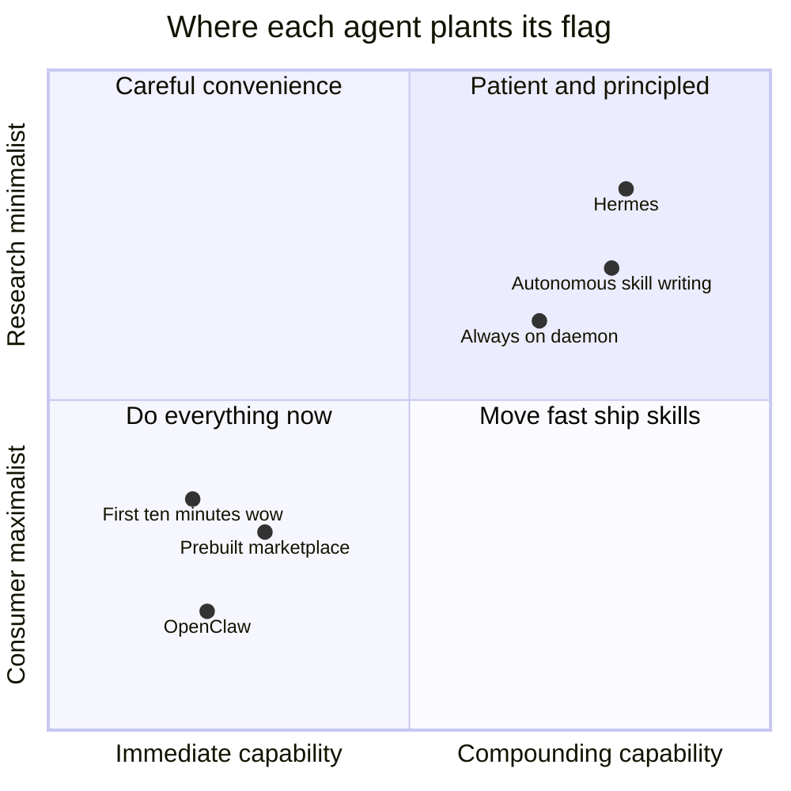
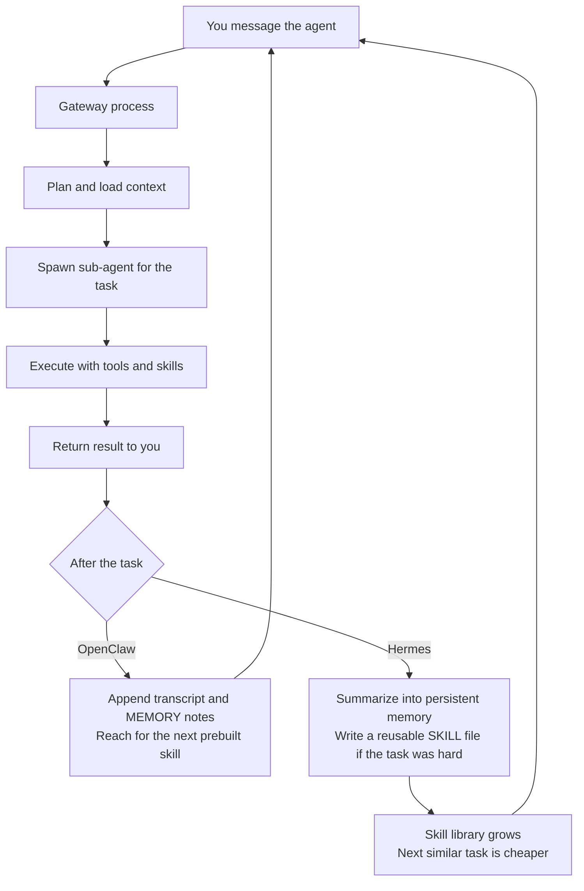
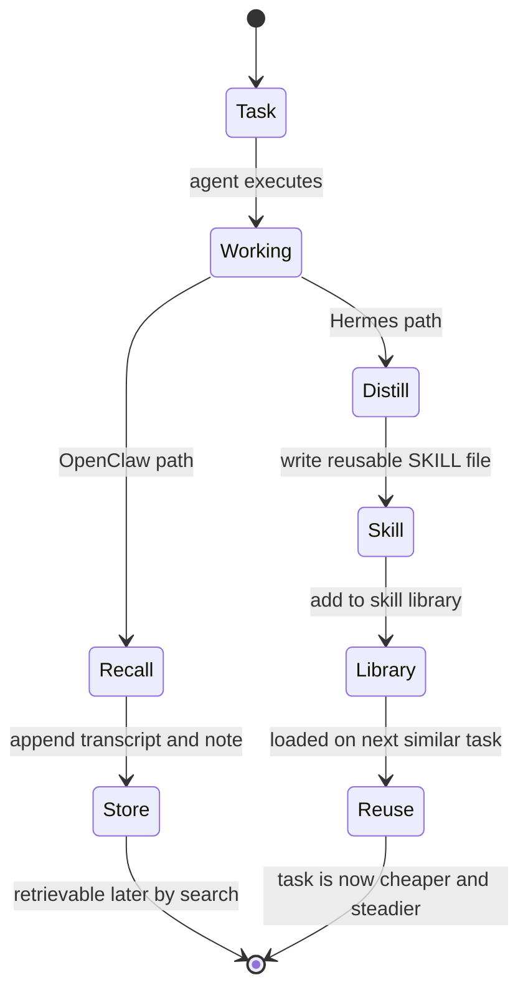
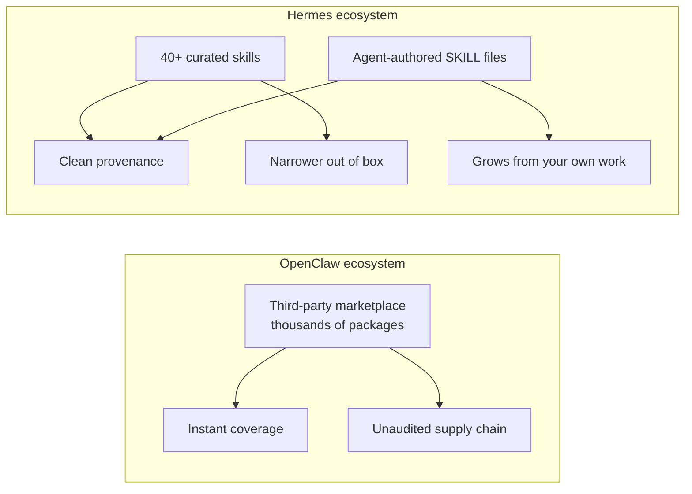
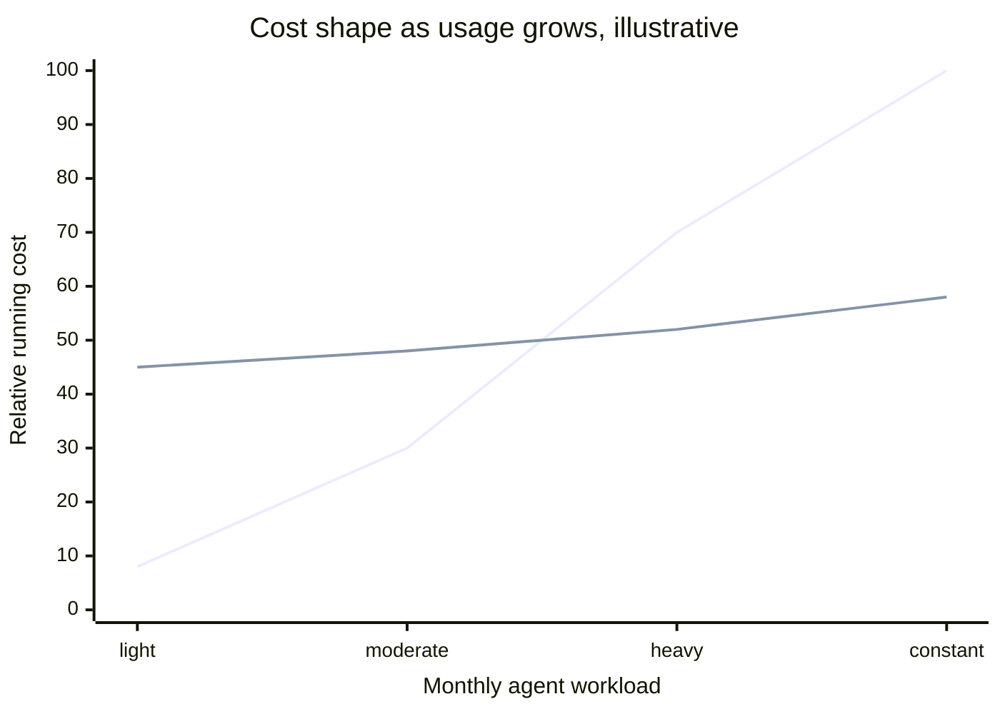
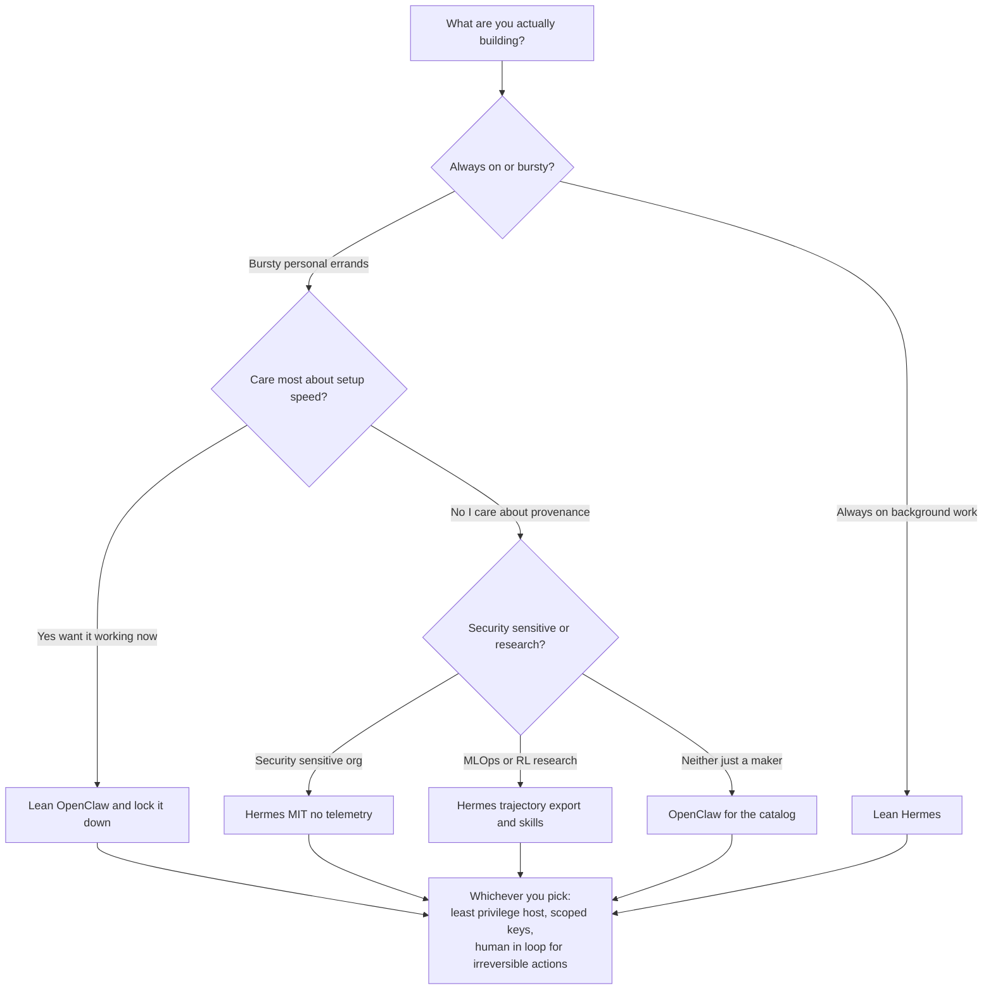
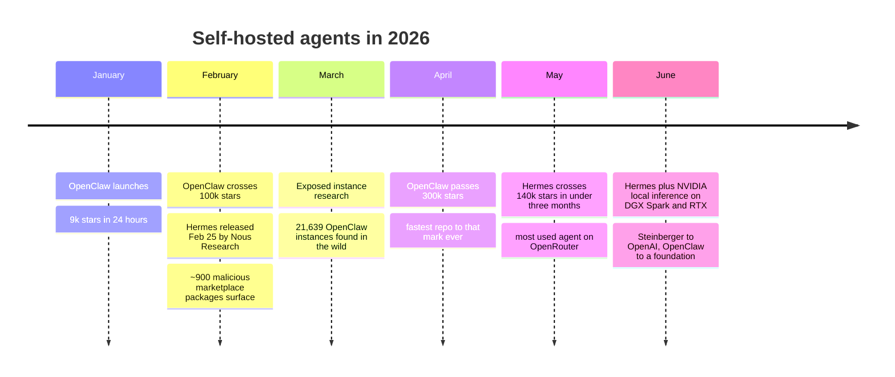

# OpenClaw vs Hermes: Two Philosophies of the Self-Hosted Agent

Two agents. Same year. Opposite instincts.

In the first quarter of 2026, two open-source projects took the self-hosted AI agent from a hacker curiosity to something your non-technical friend had heard of. One of them, **OpenClaw**, went from a weekend project to the single most-starred repository on GitHub in under five months — north of 340,000 stars and still climbing past 360k by mid-year, overtaking React, Vue, and TensorFlow on a timeline those projects took the better part of a decade to walk. The other, **Hermes Agent**, shipped from a research lab, crossed 140,000 stars in under three months, and quietly became — by OpenRouter's own numbers — the most-used agent in the world.

They look, on a diagram, almost identical. Both run a long-lived gateway process on your machine. Both hang off your messaging apps so you can text your computer and have it do work. Both spawn isolated sub-agents. Both accumulate some notion of memory. Both are self-hosted, open source, and model-agnostic-ish. If you squinted at the architecture slides you would think one had forked the other.

They did not. And the difference between them is not really a difference of features. It is a difference of *belief* — about what an agent on your machine is **for**, and what it should become over time. OpenClaw believes an agent should do everything, right now, on the machine in front of you. Hermes believes an agent should remember, and get better, and eventually be worth more than the sum of the tasks you gave it.

This is the third post in a trilogy. The first two were deep dives on each system: [the anatomy of OpenClaw as a viral agent platform](https://juanlara18.github.io/portfolio/#/blog/openclaw-anatomy-viral-agent-platform), and [Hermes as a self-improving agent with persistent memory](https://juanlara18.github.io/portfolio/#/blog/hermes-self-improving-agent-persistent-memory). If you want the internals of either, go read those — I am not going to re-derive them here. This post assumes you have at least skimmed them, gives you a tight recap so nobody is lost, and then spends the rest of its length on the thing the deep dives could not do: help you **choose**, and be honest about where each one hurts.

Because both of these tools hand an autonomous agent OS-level access to your life. That is not a footnote. That is the whole conversation. So let's have it.

## The 90-second recap

If you have read the deep dives, skip to the next section. If not, here is the smallest amount you need to follow along.

**OpenClaw** is the work of Peter Steinberger — an Austrian developer previously known for PSPDFKit, the PDF framework inside Autodesk, Dropbox, and SAP. He built OpenClaw in the open, it hit 9,000 stars in its first 24 hours, and it did not stop. The pitch is visceral: install one thing, connect it to WhatsApp, Telegram, Slack, Discord, Signal, and iMessage, and now you can message your computer like a person and it goes and *does the thing* — books, buys, scrapes, files, replies. It ships with a huge library of prebuilt skills and a third-party marketplace that exploded to thousands of packages within weeks. Steinberger later joined OpenAI and moved the project to an independent foundation to keep it open. The energy is consumer-first, maximalist, "why can't my computer just do this."

**Hermes Agent** comes from **Nous Research**, the lab behind the Hermes, Nomos, and Psyche model families. Released February 25, 2026, it is MIT-licensed, ships with zero telemetry and zero data collection as a stated design guarantee, and runs as a persistent daemon on your own infrastructure. Its thesis is not "do everything now" — it is **persistence and self-improvement**. It keeps everything in `~/.hermes/` on your machine, it remembers across sessions, it runs scheduled cron jobs, and — the headline trick — when it finishes a hard task it writes itself a reusable skill file so it does the task better next time. The energy is research-lab, patient, "an agent should compound."

Same shape. Different soul. Now let's pull them apart.

## Origin and philosophy: the indie hit vs the lab framework

The origin stories are not trivia. They predict almost everything downstream — the security posture, the memory model, the ecosystem, even the license.

OpenClaw is an **indie consumer hit**. It was built by one person with an extraordinary sense for developer delight and shipped with the ruthlessness of someone who wants you to feel the magic in the first ten minutes. That is why it went viral, and it is also why its problems are viral-shaped: a marketplace that grew faster than anyone could review, a default posture optimized for "it just works" over "it is locked down," and a creator who — brilliantly, humanely — burned out and moved on to OpenAI, leaving the project to a foundation. The philosophy is **capability-maximalist and immediate**. The measure of success is: did it do the thing you asked, in the fewest words, with the least setup?

Hermes is a **research artifact that happens to be a great product**. Nous Research does not make money selling you an agent; Nous Research makes and studies models. Hermes exists partly as a product and partly as a *data-generation and evaluation substrate* for how self-improving agents behave. That is why it ships trajectory export in ShareGPT format and batch-processing modes for generating training data — features a pure consumer tool would never prioritize. The philosophy is **compounding and legible**. The measure of success is: is the agent better this month than last month, and can you read every line of why?

Here is the tell. OpenClaw's most-quoted number is a *cost* — the widely reported story of Steinberger running roughly 100 agents that ran up around $1.3 million in OpenAI tokens in a single month. That number is a flex about throughput and ambition. Hermes's most-quoted number is a *ranking* — most-used agent on OpenRouter — which is a flex about durable daily use. One optimizes for the spike. The other optimizes for the habit.

You can even see it in the licensing choices. OpenClaw is open source and, after Steinberger's move to OpenAI, governed by an independent foundation — a structure that exists to keep a wildly popular consumer artifact free and neutral, the way big infrastructure projects get shepherded once they outgrow their founder. Hermes went straight to MIT, the most permissive license there is, from a lab whose business is models, not agents. MIT with zero telemetry is the choice you make when you *want* people to fork, embed, and study your thing without ever phoning home. One license protects a crown jewel; the other gives away a research substrate on purpose.

Neither is wrong. They are answers to different questions. And once you internalize which question each project was answering, every architectural decision below reads as a consequence rather than a coincidence.



## Architecture head-to-head

Zoom into the boxes and the family resemblance is real. Both are, at heart, a **gateway plus spawned sub-agents**.

OpenClaw's Gateway is a single long-running process that owns every messaging connection you have wired up. It runs a WebSocket control plane on port `18789`, bound to localhost by default. Around it sits the agent loop that routes an incoming message, loads context, picks a model, and executes. Memory is file-based: JSONL transcripts, human-readable `MEMORY.md` files, and retrieval that blends vector search with SQLite FTS5 keyword matching. Skills are the star — a huge prebuilt catalog plus a third-party marketplace, and the whole thing is model-agnostic (Claude, GPT, DeepSeek, whatever you connect).

Hermes's gateway is structurally similar — one unified process fronting Telegram, Discord, Slack, WhatsApp, and Signal plus a CLI — but the *center of gravity* is different. The center is not the skill catalog; it is `~/.hermes/`, the persistent memory root, and the built-in cron scheduler that lets the agent keep working while you sleep. Sub-agents are "contained" — isolated by design for parallel workstreams. The bundled skill set is deliberately small (40-plus curated skills) and the interesting skills are the ones the agent writes *for itself*.

Read the two rows below and you can see the philosophy leaking through every cell.

| Dimension | OpenClaw | Hermes Agent |
|---|---|---|
| Origin | Indie developer (Peter Steinberger, later OpenAI); now a foundation | Research lab (Nous Research) |
| License | Open source, foundation-governed | MIT |
| Released / momentum | Fastest repo to 300k+ stars ever; ~360k by mid-2026 | Feb 25 2026; 140k stars in under 3 months; most-used agent on OpenRouter |
| Core process | Gateway on WebSocket port 18789, localhost by default | Persistent daemon rooted at `~/.hermes/` |
| Sub-agents | Spawned per task | Contained isolated sub-agents for parallel work |
| Messaging surface | WhatsApp, Telegram, Slack, Discord, Signal, iMessage | Telegram, Discord, Slack, WhatsApp, Signal, CLI |
| Memory model | JSONL transcripts + MEMORY.md + vector search with SQLite FTS5 | Persistent store in `~/.hermes/`, SQLite full-text with LLM summarization |
| Skills | Large prebuilt catalog + third-party marketplace (thousands of packages) | 40+ curated skills + autonomous SKILL.md creation (agentskills.io) |
| Skill provenance | Human-authored, community-published | Human-curated **and** agent-authored from experience |
| Scheduling | Available via skills | Built-in cron scheduler (daily reports, nightly jobs) |
| Model stance | Model-agnostic, cloud-leaning by default | Provider-agnostic, optimized for always-on local |
| Local hardware focus | Runs anywhere; not the headline | Tuned for RTX PCs and DGX Spark with local Qwen |
| Telemetry | Not the stated centerpiece | Zero telemetry, zero data collection (stated guarantee) |
| Signature move | The first-ten-minutes "it just did that" | The month-three "it taught itself to do that" |

Here is the same contrast as a data-flow, so you can see where the two loops actually diverge — not at the front door, but at what happens *after* a task finishes.



The diagram is the whole argument in one picture. Up to the point marked "After the task," the two systems are nearly interchangeable. The fork is what each one *does with the experience*. OpenClaw logs it and moves on, betting that whatever you need next already exists as a prebuilt skill someone published. Hermes tries to metabolize the experience into a new capability, betting that your particular life is idiosyncratic enough that the best skills are the ones grown in place.

## Memory: embeddings vs skill accumulation

This is where people get confused, so let me be precise. **Neither system updates model weights.** Nobody is fine-tuning anything at runtime. When either project says "memory" or "self-improving," they mean something that lives *outside* the model, in files and databases the model reads back in as context. Keep that straight and the marketing stops being mysterious.

Within that shared constraint, the two took different bets.

OpenClaw's memory is **recall-shaped**. Transcripts as JSONL, notes as Markdown, and a retrieval layer that combines semantic vector search with FTS5 keyword matching so it can find the right past context and stuff it into the prompt. The deep-dive coverage of OpenClaw's User Notes describes exactly this: an embedding-backed note store, the kind of thing you would build on Chroma or Milvus, whose job is to answer "what did we say about X, and when." It is a *better memory of events*. Ask it about a conversation from six weeks ago and it retrieves the relevant slice. What it is not, on its own, is a memory of *how to do things*.

Hermes's memory is **procedure-shaped**. Yes, it also has an event store — SQLite full-text search with LLM summarization, so "recall our chat from three months ago" works. But the distinctive layer sits on top: when Hermes completes a genuinely hard task, it writes a `SKILL.md` — a reusable Markdown document describing the approach it just used — and files it in its skill library, to be loaded contextually the next time a similar task shows up. That is **skill accumulation**. It is not remembering what happened; it is remembering *what worked*, and turning it into a reusable procedure.

The distinction is the difference between a diary and a cookbook. OpenClaw keeps a superb diary. Hermes keeps a diary *and* is constantly promoting the good entries into recipes.



Both formats are just files, which is a genuine strength — you can read them, diff them, and version them. Here is a tiny adapter that reads a note from OpenClaw's diary-style store and, if it looks like a repeatable procedure, promotes it into a Hermes-style skill file. It is deliberately naive; the point is to make the two shapes concrete side by side.

```python
from pathlib import Path
import json, datetime

def load_openclaw_notes(path: Path):
    """OpenClaw-style memory: append-only JSONL of events and notes."""
    for line in path.read_text(encoding="utf-8").splitlines():
        if line.strip():
            yield json.loads(line)

def looks_like_procedure(note: dict) -> bool:
    """A note worth promoting names concrete, repeatable steps."""
    text = note.get("content", "").lower()
    return note.get("kind") == "task_success" and "steps" in note

def to_hermes_skill(note: dict) -> str:
    """Hermes-style memory: a reusable SKILL.md keyed by when to load it."""
    steps = "\n".join(f"{i+1}. {s}" for i, s in enumerate(note["steps"]))
    return (
        f"# Skill: {note['title']}\n\n"
        f"**Use when:** {note['trigger']}\n\n"
        f"**Learned:** {datetime.date.today()}\n\n"
        f"## Procedure\n{steps}\n"
    )

# Diary -> cookbook: only promote what actually generalizes.
for note in load_openclaw_notes(Path("~/.openclaw/notes.jsonl").expanduser()):
    if looks_like_procedure(note):
        skill = to_hermes_skill(note)
        Path(f"~/.hermes/skills/{note['id']}.md").expanduser().write_text(skill)
```

The gap that adapter cannot close is the interesting one. OpenClaw's notes were never designed to be *procedures*, so most of them fail `looks_like_procedure` and stay diary entries. Hermes generates procedures on purpose, at the moment the knowledge is freshest. You can bolt skill-accumulation onto a diary system, but you will always be reconstructing intent after the fact. The system that decided to distill up front has cleaner raw material. That is not an implementation detail — it is the payoff of the whole philosophy.

There is a subtler trade hiding here too, and it cuts the other way. A pure recall system has one enormous virtue: it never lies to you about the past. A transcript is a transcript; retrieval might surface the wrong slice, but the slice it surfaces is real. A skill-accumulation system introduces a new failure mode — a *bad* skill. If Hermes distills a procedure from a task that happened to succeed for the wrong reasons, it has now written down and will faithfully reuse a superstition. The cookbook can contain recipes that only worked once, on a Tuesday, because the wind was right. Recall systems degrade gracefully (you just miss context); procedural systems can degrade *actively* (you confidently do the wrong thing). This is the price of compounding, and it is why the human-review discipline in the security section is not optional for Hermes — it is the mechanism that keeps the cookbook honest. The diary needs no such supervision because it never claims to know how to do anything.

## Skills and ecosystem: marketplace vs curation

Now the part where the philosophies collide hardest, because it is the same trade-off every package ecosystem has ever faced, playing out at agent speed.

OpenClaw chose the **marketplace**. A large first-party catalog, plus a third-party ecosystem that ballooned to thousands of packages within weeks of launch. This is npm energy, and it delivers npm's blessing: whatever niche thing you want your agent to do, someone probably already published a skill for it, and you are running in a minute. Reach and coverage are staggering, and the network effect is real — popularity begets more skills begets more popularity.

Hermes chose **curation plus autogeneration**. A deliberately small set of about 40 vetted skills, and beyond that, the agent grows its own via the `SKILL.md` standard shared through agentskills.io. This is the opposite bet: rather than a thousand strangers' skills of unknown quality, you get a handful of trusted ones and a mechanism to grow the rest *from your own verified successes*. Coverage is narrower out of the box. Provenance is dramatically cleaner — the skills you accumulate were authored either by the maintainers or by your own agent doing your own work.

There is a prerequisite worth naming before you commit to either. OpenClaw's marketplace only pays off if you treat installing a skill the way you treat installing an npm dependency in production — you read it, or you trust the publisher, or you sandbox it, before it touches your keys. If your honest answer is "I will click install and hope," the marketplace is not a feature, it is a liability, and you should be on the curated tool. Hermes's autogeneration only pays off if your work is *repetitive enough to distill* — an agent that never sees the same shape of task twice has nothing to promote into a skill, and you have paid for a compounding mechanism that never compounds. Match the ecosystem to your actual behavior, not to the demo.

The blessing and the curse are the same fact. A marketplace of thousands of packages is a marketplace of thousands of packages *you did not write and cannot fully audit*. Which is exactly the seam where the next section lives.



## Local, hardware, and cost

Both call themselves self-hosted, but they mean different things by "self."

OpenClaw is self-hosted in the sense that the **gateway** runs on your machine — the process, the connections, the memory files are all local. The *intelligence*, though, leans cloud by default. It is model-agnostic and happy to point at Claude, GPT, or DeepSeek, and the flagship demos assume you are calling a frontier API. That is how you get a $1.3-million-a-month token story: the local part is cheap, and the model calls are where the money and the capability live. For a solo maker this is often the right shape — you do not want to babysit a GPU, you want the smartest available model doing your errands.

Hermes leans the other way and makes local a first-class citizen. The NVIDIA collaboration is the clearest signal: Hermes is tuned to run alongside local **Qwen 3.6** models — the 27B and 35B variants that Nous and NVIDIA describe as outperforming previous-generation 120B and 400B models — via llama.cpp, LM Studio, or Ollama, on RTX PCs, RTX PRO workstations, and the **DGX Spark** with its 128GB of unified memory and roughly one petaflop of AI performance. "Optimized for always-on local use" is a design statement. If your agent is a daemon that runs cron jobs at 3am and writes itself skills, you very much do not want to be metering every one of those background thoughts against a per-token API bill. Local inference is what makes a compounding, always-on agent economically sane.

So the cost curves are genuinely different animals. OpenClaw's cost is **variable and usage-shaped** — cheap at rest, potentially eye-watering under heavy frontier-model use, and easy to reason about per task. Hermes's cost is **fixed and capital-shaped** — you buy or already own the hardware, and then the marginal cost of an extra background task rounds to electricity. A workstation with a DGX Spark is a real check to write; after that, "run 100 nightly jobs" is free in a way it never is against an API.



Read that chart the right way. It is illustrative, not a benchmark, and it carries no legend on purpose — read it by *slope*. The line that starts low and climbs steeply is OpenClaw on cloud models: cheap at rest, potentially eye-watering under heavy frontier-model use. The line that starts on a hardware-shaped floor and stays nearly flat is Hermes on local inference: a real capital cost up front, then almost free per task. Where the two lines cross is exactly the decision boundary — light and occasional favors the cloud-leaning tool, heavy and always-on favors the local one.

## Security and governance: the shared elephant

Here is the section neither system's marketing wants to open with, and the one you should read twice.

**Both of these tools give an autonomous agent OS-level access to your machine, your messages, and your credentials.** That is the product. An agent that can "just do the thing" is an agent that can read your iMessage, hit your APIs with your keys, move your money, and email as you. The capability and the risk are the same capability. There is no version of a genuinely useful do-everything agent that is also sandboxed away from everything that matters. So the real governance question is not "is it safe" — it is "whose failure mode am I signing up for."

OpenClaw's failure mode is the **supply chain**, and it has already shown its teeth. A marketplace that grew to thousands of packages in weeks also grew, by early February 2026, roughly 900 malicious packages — the credential-stealing, inbox-wiping variety you would expect the moment you give strangers a distribution channel into agents that hold your keys. On top of that, security researchers catalogued tens of thousands of **exposed OpenClaw instances** (the widely cited figure is 21,639), a high-severity remote-code-execution issue tracked as CVE-2026-25253, and a hardening update that shipped more than 40 patches at once. Some of that is the tax of being the most-forked agent on earth — you are the biggest target simply because you are the biggest. But some of it is structural: a localhost-by-default gateway that a surprising number of people exposed to the internet, plus an unaudited skill marketplace, is a large attack surface by construction.

Hermes's failure mode is **narrower but not zero**. The stance is defensible: MIT-licensed, fully auditable, zero telemetry, zero data collection, 100% self-hosted, with a small curated skill set instead of an open bazaar. That closes the supply-chain hole that hurt OpenClaw most — you are not running a stranger's skill of unknown intent. What it does *not* close is the elephant: a Hermes agent still has OS-level reach, still holds your credentials, still runs unattended cron jobs, and now *writes its own skills*. Agent-authored automation that executes later, without a human reading it first, is its own category of risk — subtler than a malicious package, but real. "The agent taught itself to do this" is wonderful right up until the thing it taught itself is wrong and runs at 3am.

Put plainly:

| Risk axis | OpenClaw | Hermes |
|---|---|---|
| Primary exposure | Unaudited third-party skill marketplace | Agent-authored skills that run unattended |
| Demonstrated incidents | ~900 malicious packages; 21,639 exposed instances; CVE-2026-25253 RCE | No comparable mass incident to date |
| Data posture | Not the stated centerpiece | Zero telemetry, zero data collection (stated) |
| Auditability | Large surface, many moving community parts | MIT, small surface, fully readable |
| Shared, unavoidable risk | OS-level access to messages, keys, money | OS-level access to messages, keys, money |

If you take one thing from this section: **the curated tool is safer by default, not safe by nature.** Both need the same discipline — a dedicated, least-privilege machine or VM, scoped credentials with tight blast radius, network egress you can see, and a human in the loop for anything irreversible. Hermes gives you a cleaner starting point. Neither gives you a pass.

## Which should you reach for?

I promised no cop-out. So here is a real recommendation, mapped to who you actually are.

**Reach for OpenClaw if you are a solo maker automating a Mac.** You want the first-ten-minutes magic, you already live in iMessage and WhatsApp, you want the biggest prebuilt skill catalog on the planet, and you are pointing it at a frontier API you are happy to pay per task. Your workloads are bursty, not always-on. Lock it down — do not expose that gateway, vet every marketplace skill, scope your keys — and it is the most productive personal agent you can install today.

**Reach for Hermes if you want an always-on, on-prem agent with compounding skills.** A small team that wants a daemon running scheduled work, remembering context across months, and getting measurably better at *your* recurring tasks — that is the exact shape Hermes was built for. The local-inference tuning (Qwen on RTX or DGX Spark) means always-on does not mean always-billing, and the skill-accumulation loop means month three is genuinely better than month one.

**Reach for Hermes if you are a security-sensitive org.** MIT, auditable, zero telemetry, no third-party marketplace to police, fully self-hosted with local models so your data never leaves the building. You still owe the agent a least-privilege home and human review of its self-written skills — but the defaults are on your side in a way OpenClaw's, by design, are not.

**Reach for Hermes if you are running an MLOps or RL research workflow.** This one is not close. Trajectory export in ShareGPT format, batch processing for training-data generation, and a skill-accumulation mechanism that is itself a research object — Hermes is a substrate for studying self-improving agents, not just a tool that uses them. OpenClaw is a product; Hermes is also an instrument.

And the honest caveats, so this is not a puff piece. **OpenClaw is a bigger target and a bigger surface** — the incident history is real, not hypothetical, and the marketplace that makes it powerful is the same marketplace that makes it dangerous. **Hermes asks more of you up front** — narrower out-of-box coverage, a hardware bill if you want the local-first dream, and the newer, subtler risk that an agent writing its own automation can teach itself the wrong thing. Pick the failure mode you are equipped to manage, not the demo that impressed you most.



Notice that every path ends at the same box. The choice between OpenClaw and Hermes is real and it matters — but it sits *inside* a discipline that neither tool relieves you of. The agent that can do everything is the agent that can do everything wrong. Choose the philosophy that fits your work, and then do the boring, unglamorous work of containing it. That is the whole job.

## The one-year view

Here is how the year actually unfolded, because the timeline itself tells you something about the two temperaments.



Read the two tracks. OpenClaw's line is a rocket — star milestones, a token-bill legend, a security reckoning, a founder exit, all in six months. Hermes's line is a flywheel — a quieter launch, steady adoption, a hardware partnership, and a slow climb to the top of the usage charts precisely because people *keep* using it. The rocket and the flywheel are both real physics. They just get you to different places.

That is the trilogy's real conclusion. These are not competitors so much as two answers to a question the whole field is only starting to ask out loud: when you put an autonomous agent on your own machine, do you want it to be *maximally capable today*, or *compounding forever*? OpenClaw and Hermes each picked, and built with total conviction. Your job is only to know which question is yours.

## Going Deeper

**Books:**
- Russell, S., & Norvig, P. (2021). *Artificial Intelligence: A Modern Approach* (4th ed.). Pearson.
  - The standard reference on agents as a formal concept — rational agents, environments, and the perception-action loop that both OpenClaw and Hermes are concrete instances of.
- Anderson, R. (2020). *Security Engineering: A Guide to Building Dependable Distributed Systems* (3rd ed.). Wiley.
  - The right lens for the shared-elephant section: least privilege, blast radius, and supply-chain trust are exactly what you are managing when an agent holds your keys.
- Newman, S. (2021). *Building Microservices* (2nd ed.). O'Reilly.
  - A gateway plus spawned sub-agents is a distributed system. The failure modes, isolation, and boundaries here map directly onto how both agents partition work.
- Kleppmann, M. (2017). *Designing Data-Intensive Applications*. O'Reilly.
  - For the memory chapter: how you think about durable local state, indexing, and retrieval underpins the difference between a diary and a cookbook.

**Online Resources:**
- [OpenClaw project site](https://openclaw.ai/) — The primary source for the current architecture, skill catalog, and setup.
- [Hermes Agent site](https://hermes-agent.org/) — Persistent memory model, the SKILL.md standard, and the zero-telemetry stance from the source.
- [Hermes Agent documentation](https://hermes-agent.nousresearch.com/docs/) — The gateway, sub-agents, cron scheduler, and bundled skills in depth.
- [Hermes unlocks self-improving agents on RTX and DGX Spark](https://blogs.nvidia.com/blog/rtx-ai-garage-hermes-agent-dgx-spark/) — The local-inference and hardware story, including the Qwen 3.6 details.
- [The 21,639 exposed instances breakdown](https://natesnewsletter.substack.com/p/the-20kmonth-lobster-that-zuckerberg) — A clear-eyed look at OpenClaw's security tail.

**Videos:**
- [Nous Research on YouTube](https://www.youtube.com/@NousResearch) — The lab's own channel; talks and demos on Hermes and the surrounding model families straight from the source.
- [Peter Steinberger on YouTube](https://www.youtube.com/@steipete) — The OpenClaw creator's channel, for the building-in-public perspective that drove the project's design.

**Academic Papers:**
- Park, J. S., et al. (2023). ["Generative Agents: Interactive Simulacra of Human Behavior."](https://arxiv.org/abs/2304.03442) *UIST 2023*.
  - The foundational study of agents with persistent memory and reflection — the intellectual ancestor of both systems' memory models.
- Wang, G., et al. (2023). ["Voyager: An Open-Ended Embodied Agent with Large Language Models."](https://arxiv.org/abs/2305.16291) *arXiv:2305.16291*.
  - The clearest prior work on an agent that writes and accumulates its own reusable skills — read this and Hermes's skill loop stops looking like magic.

**Questions to Explore:**
- If neither system updates model weights, is "self-improvement" an honest word for skill accumulation — or should we reserve it for something that changes the model itself?
- A marketplace of thousands of agent skills is a supply chain. What would a genuinely trustworthy skill registry — signing, provenance, sandboxed execution — actually look like, and why does neither project have it yet?
- When an agent writes automation that runs unattended, who is accountable for what it does at 3am: the user, the maintainers, or the agent's own prior self?
- Does the local-first, capital-cost model (Hermes on DGX Spark) or the cloud-first, usage-cost model (OpenClaw on frontier APIs) win the next three years — and does the answer depend more on hardware curves or on token prices?
- If OpenClaw is a rocket and Hermes is a flywheel, which shape does the enterprise actually want — and is "boring, compounding, auditable" the feature that finally moves self-hosted agents past the demo?
