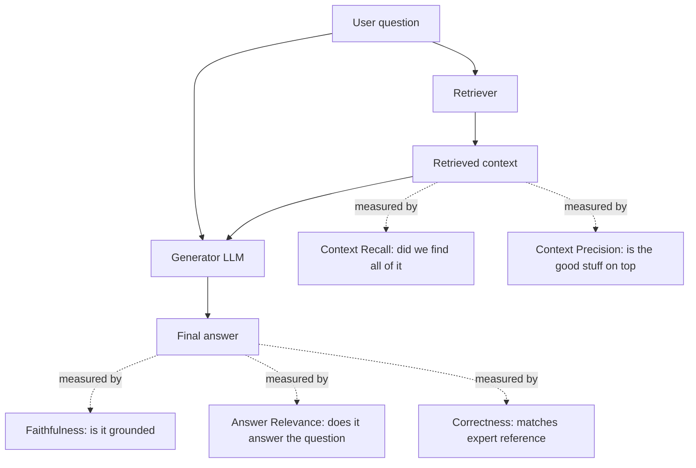
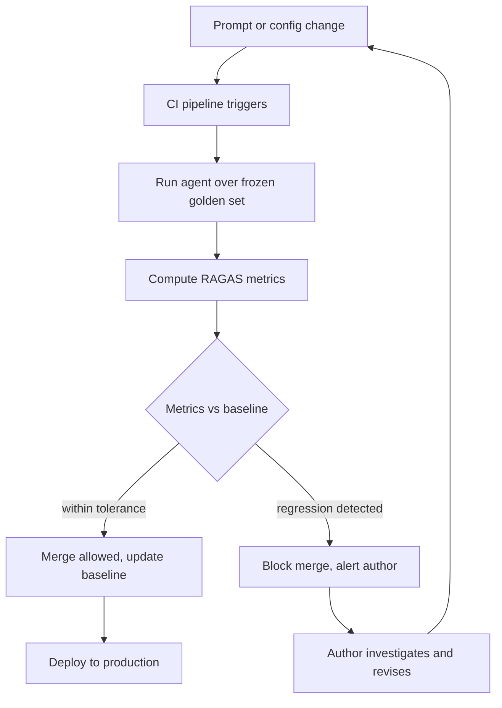
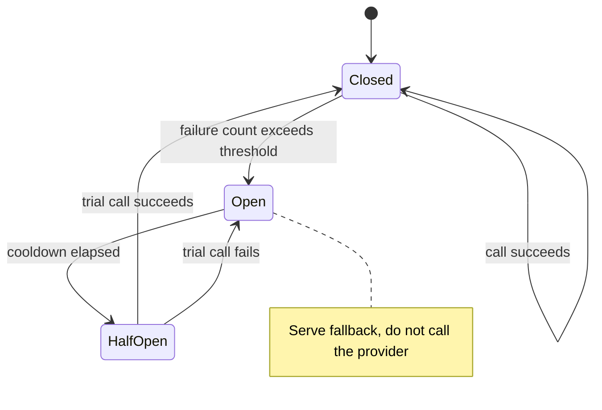
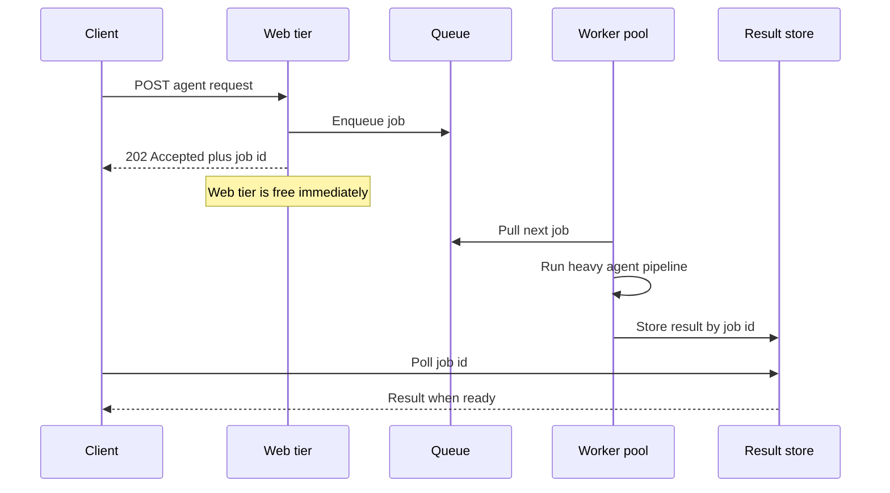

# Operating Agents: Evaluation, Observability, and Scalability

## The Agent That Scored 98 Percent And Then Lied To Everyone

The agent passed evaluation at ninety-eight percent. I watched the dashboard go green the night before launch. Faithfulness near perfect, answer relevance high, context recall almost saturated. The team had built a careful test set of three hundred questions, run them through the pipeline, and the numbers said: ship it. So we shipped it.

Within a week, support was forwarding us transcripts. A user had asked a question phrased slightly differently from anything in the test set, and the agent had confidently invented a policy clause that did not exist. Another asked a question that was *in* the test set, almost word for word, and got a perfect answer. The pattern was eerie: the agent was brilliant on questions that resembled the evaluation set and erratic on everything else.

The cause was not the model. It was not a bad prompt. It was a data-isolation failure that I should have caught and did not. Someone, trying to be helpful, had ingested the evaluation question-and-answer pairs into the same vector store the agent retrieved from in production. The agent was not answering the test questions. It was *looking up the answer key.* On evaluation day it retrieved the golden answers verbatim and parroted them back. The ninety-eight percent was the score of a student who had been handed the exam solutions. On real traffic, with the answer key absent, the agent collapsed to its actual ability, which was mediocre.

That is the gap this post is about. Building an agent is the part everyone writes tutorials for. Operating one — knowing whether it works, knowing *why* it did what it did, and keeping it standing under real load — is the part that separates a demo from a service. The previous posts in this series covered the agent loop, tool use, routing, and memory. This one is the operations layer: evaluation, observability, and scalability. It is the least glamorous of the six and the one most likely to wake you at three in the morning.

A note on scope. I am not going to re-derive RAGAS from scratch; there is a [dedicated post on RAG evaluation](https://juanlara18.github.io/portfolio/#/blog/ragas-evaluating-rag) that does the math and the bias taxonomy properly, and I will lean on it. I am not going to re-explain caching layers; that lives in [the four-layer caching post](https://juanlara18.github.io/portfolio/#/blog/llm-caching-four-layers). And the failure modes of the agent loop itself — runaway loops, hallucinated tools, context death — got their full treatment in [the production agent patterns post](https://juanlara18.github.io/portfolio/#/blog/production-llm-agents-patterns). What I want to do here is connect those threads into a single operational discipline and fill in the parts none of them cover: regression pipelines, determinism for debugging, audit-grade tracing, and the resilience patterns that keep a third-party-dependent service alive.

## Evaluating Rigorously: What The Numbers Actually Mean

You cannot operate what you cannot measure, and the first thing to measure is quality. The trap is that "quality" for a retrieval-augmented agent is not one number. An agent has at least two separable subsystems — the retriever that finds evidence and the generator that writes the answer — and a single aggregate score hides which one is failing. The RAGAS framework, whose current docs were refreshed in December 2025 and which now backs onto OpenAI, Anthropic, and Gemini through a unified provider model, exists precisely to disaggregate that score into interpretable dimensions.

Here are the metrics by name, what each one actually catches, and the failure each one is blind to.

| Metric | What it measures | What it catches | What it is blind to |
|---|---|---|---|
| Faithfulness (groundedness) | Fraction of claims in the answer that are supported by the retrieved context | Hallucination and contradiction. The generator asserting things its evidence does not say | Whether the evidence itself is correct, or whether the question was even answered |
| Context Recall | Fraction of the ground-truth answer that the retriever actually surfaced | Retriever misses. The needed fact existed but never made it into context | Noise. A retriever can have perfect recall and still drown the answer in junk |
| Context Precision | Whether the truly relevant chunks are ranked at the top | Signal-to-noise. Relevant evidence buried under irrelevant evidence | Coverage. High precision says nothing about what was missed |
| Answer Relevance | Whether the answer addresses the question that was asked | Off-topic but faithful answers. Technically true, practically useless | Factual correctness. A relevant answer can still be wrong |
| Correctness | Semantic match of the answer against an expert ground-truth reference | Everything end to end, but only where you have a golden reference | Nothing it can see, but it costs you a human-written answer per question |

Read that table as a diagnostic instrument, not a scorecard. The whole reason to keep the metrics separate is that each combination tells a different story about *where* to start fixing.

Consider the most counterintuitive case. Your faithfulness is high — every claim the agent makes is genuinely supported by what it retrieved — and yet users complain the answers are wrong. How? Low context recall. The retriever never found the relevant section, the generator faithfully summarized the *wrong* documents, and faithfulness, which only checks the answer against the retrieved context, cheerfully reports success. Faithfulness measures whether the generator was honest about its evidence. It says nothing about whether the evidence was the right evidence. That is context recall's job, and a low recall score with a high faithfulness score is the unmistakable signature of a retriever failure masquerading as a working system.



### LLM-As-Judge Versus The Golden Dataset

Two of those metrics require something the others do not: a ground-truth reference answer. Correctness compares the agent's output against an expert-written answer. Context recall checks whether the retrieved context can account for the claims in that reference. The other three — faithfulness, context precision, answer relevance — are reference-free. They reason about internal consistency between question, context, and answer without needing anyone to have written down the right answer first.

That distinction maps onto the two ways people actually run evaluations, and you need both.

**LLM-as-judge** uses a capable model to grade outputs by reasoning about explicit, narrow criteria — "can this specific claim be inferred from this specific passage?" — rather than by matching surface text. It is cheap, it scales to thousands of production traces, and it requires no human annotation. You point it at live traffic, sample a percentage, and get a continuous quality signal. Its weakness is that the judge has its own biases — verbosity bias, position bias, self-enhancement when the judge and generator share a model family — which the evaluation post catalogs in detail. The rule of thumb that survives contact with production: use a *stronger* model as judge than as generator, shuffle context order across runs to average out position effects, and treat the scores as trend indicators, not as pass/fail oracles for tiny score differences.

**The golden dataset** is a curated set of question-and-reference-answer pairs, hand-validated by domain experts, that you treat as ground truth. It is expensive to build and maintain, so it is small — a few hundred high-quality examples rather than thousands. You use it where you need defensible, reference-based metrics: correctness and context recall, the two that an LLM-as-judge cannot fake without a reference. The golden dataset is the anchor that keeps your reference-free metrics honest. Periodically you check that the cheap LLM-judge scores still correlate with the expensive golden-dataset scores; when they drift apart, your judge has stopped tracking reality and needs recalibration.

The mature pattern, and the one I run now, is layered: reference-free LLM-as-judge metrics on a sample of production traffic for continuous coverage, the golden dataset for periodic deep evaluation and for the regression gate we are about to build. Neither alone is enough. The judge gives you breadth without ground truth; the golden set gives you ground truth without breadth.

Here is what a single evaluation pass looks like in the current RAGAS API, wiring the disaggregated metrics together and using a stronger judge than the generator. This is deliberately close to what the evaluation post shows, because consistency matters more than novelty when you are running this in CI.

```python
from ragas import evaluate
from ragas.metrics import (
    Faithfulness,
    ResponseRelevancy,
    LLMContextPrecisionWithReference,
    ContextRecall,
)
from ragas.dataset_schema import SingleTurnSample, EvaluationDataset
from ragas.llms import LangchainLLMWrapper
from ragas.embeddings import LangchainEmbeddingsWrapper
from langchain_openai import ChatOpenAI, OpenAIEmbeddings


def build_eval_dataset(golden_set, run_agent):
    """golden_set: list of {question, reference}. run_agent returns (answer, contexts)."""
    samples = []
    for item in golden_set:
        answer, contexts = run_agent(item["question"])
        samples.append(
            SingleTurnSample(
                user_input=item["question"],
                response=answer,
                retrieved_contexts=contexts,
                reference=item["reference"],   # needed for recall + correctness
            )
        )
    return EvaluationDataset(samples=samples)


# Judge is stronger than the generator on purpose: a weaker judge
# cannot reliably catch a stronger generator's sophisticated confabulations.
judge = LangchainLLMWrapper(ChatOpenAI(model="gpt-5", temperature=0))
judge_emb = LangchainEmbeddingsWrapper(OpenAIEmbeddings(model="text-embedding-3-large"))

results = evaluate(
    dataset=build_eval_dataset(golden_set, run_agent),
    metrics=[
        Faithfulness(llm=judge),
        ResponseRelevancy(llm=judge, embeddings=judge_emb),
        LLMContextPrecisionWithReference(llm=judge),
        ContextRecall(llm=judge),
    ],
)
print(results)   # per-metric scores you can threshold on
```

## Regression Pipelines: Turning Evaluation Into A Gate

A score you look at by hand the night before launch is not evaluation. It is a feeling with a decimal point. Evaluation becomes operational only when it is automated, runs on every change, and has the authority to *block a deploy*. This is the LLMOps version of CI/CD, and the unit of change it guards is not code in the usual sense — it is the prompt.

The shape of the pipeline is straightforward and worth stating plainly. You maintain a frozen golden dataset. On every change to the prompt, the retrieval configuration, the model version, or the tool definitions, an automated job runs the full RAGAS metric suite against that golden set. It compares the new scores against a stored historical baseline. If any metric regresses past a threshold — faithfulness drops below 0.80, context recall falls more than two points from the last release — the pipeline fails the build and blocks the merge. The deploy does not happen until a human investigates.



Here is the comparison logic that turns scores into a gate. It is deliberately boring — boring is what you want guarding production.

```python
import json
from pathlib import Path

# Per-metric tolerances. Absolute floors plus a max allowed drop from baseline.
THRESHOLDS = {
    "faithfulness":                          {"floor": 0.80, "max_drop": 0.03},
    "answer_relevancy":                      {"floor": 0.75, "max_drop": 0.03},
    "context_recall":                        {"floor": 0.80, "max_drop": 0.02},
    "llm_context_precision_with_reference":  {"floor": 0.70, "max_drop": 0.03},
}


def gate(new_scores: dict, baseline_path="eval_baseline.json") -> bool:
    baseline = json.loads(Path(baseline_path).read_text()) if Path(baseline_path).exists() else {}
    failures = []
    for metric, rule in THRESHOLDS.items():
        score = new_scores.get(metric)
        if score is None:
            failures.append(f"{metric}: missing from this run")
            continue
        if score < rule["floor"]:
            failures.append(f"{metric}: {score:.3f} below floor {rule['floor']}")
        prev = baseline.get(metric)
        if prev is not None and (prev - score) > rule["max_drop"]:
            failures.append(f"{metric}: regressed {prev:.3f} -> {score:.3f}")
    if failures:
        print("DEPLOY BLOCKED:\n  " + "\n  ".join(failures))
        return False
    Path(baseline_path).write_text(json.dumps(new_scores, indent=2))
    print("Gate passed. Baseline updated.")
    return True
```

It is worth being explicit about why the obvious shortcuts do *not* substitute for this gate, because every team tries at least one of them first.

**Freezing temperature to zero does not validate a prompt.** Determinism is necessary for reproducible *debugging*, and we will get there, but it tells you nothing about whether a new prompt is *better or worse* than the old one. A deterministic prompt can be deterministically wrong. Temperature controls variance, not quality.

**Linting does not validate a prompt.** Static analysis can catch a malformed f-string or a Python type error in your orchestration code. It cannot tell you that your new system instruction subtly increased the hallucination rate, because a prompt is natural language, and there is no linter for "is this instruction semantically worse." The thing that changed is not code in any sense a parser understands. Only running it against measured ground truth tells you.

**Canary deploys plus manual ticket-watching are reactive, not preventive.** Shipping the new prompt to five percent of traffic and waiting for complaint tickets does eventually surface regressions — after real users have hit them. That is detection, not prevention. The whole point of the regression gate is that the bad prompt never reaches a single user, because it never passes the merge. Canary has a place as a second line of defense *after* the gate, never as a replacement for it.

### Data Contamination: When The Agent Has The Answer Key

Now back to the opening story, because it names a specific and underappreciated failure that a naive regression pipeline will not catch — it will *celebrate* it.

The agent scored ninety-eight percent because the evaluation questions and their golden answers had been ingested into the same vector store the agent retrieved from. When evaluated, the agent retrieved the golden answer and repeated it. The metrics measured the agent's ability to copy from a source that will not exist in production. This is **data contamination**, and it is precisely the kind of bug that inflates your gate's confidence while destroying real-world performance.

Be careful with the vocabulary here, because three different things get conflated and they have completely different fixes.

This is **not statistical overfitting.** Overfitting is a model memorizing patterns in training data and failing to generalize; the fix is regularization, more data, simpler models. No weights were trained here. The agent is a frozen model plus a retrieval index. There is nothing to regularize.

This is **not hallucination.** Hallucination is the model inventing unsupported claims. Here the agent was *faithful* — it grounded its answers perfectly in retrieved context. The context was just the leaked answer key. Faithfulness was high precisely because the contamination made grounding trivial.

This is a **data-isolation engineering failure.** The boundary between the evaluation corpus and the production knowledge base was breached. The fix is not a model fix or a prompt fix; it is a pipeline fix. The evaluation set must live in a strictly separate store, the agent's retrieval must be pointed only at the production knowledge base during evaluation, and you should add an automated check that no golden-set document appears in the production index. The tell, in retrospect, was the impossibly high score combined with the impossibly clean faithfulness. When an agent scores near the ceiling on every metric at once, suspect contamination before you celebrate. Real systems have ragged scores. A flawless one usually means the test was rigged, accidentally.

```python
import hashlib


def contamination_check(production_index_ids: set[str], golden_set: list[dict]) -> list[str]:
    """Fail loudly if any golden answer leaked into the production retrieval index."""
    leaked = []
    for item in golden_set:
        # Hash the reference answer the way your ingestion pipeline hashes documents.
        digest = hashlib.sha256(" ".join(item["reference"].split()).encode()).hexdigest()
        if digest in production_index_ids:
            leaked.append(item["question"])
    if leaked:
        raise RuntimeError(
            f"Contamination: {len(leaked)} golden answers found in the production index. "
            f"Evaluation scores are invalid until isolated."
        )
    return leaked
```

## Making Bugs Reproducible: Temperature Zero And A Fixed Seed

Here is a bug report that will ruin your week. "Sometimes the agent gives a wrong answer to this question. Maybe one time in ten. I cannot make it happen on demand." You run the question. It works. You run it again. It works. You run it twenty times and it works nineteen times and fails once, and the once is gone before you can attach a debugger.

This is a Heisenbug, and LLM agents manufacture them by design. The cause is sampling. At any temperature above zero, the model draws its next token from a probability distribution rather than always taking the most likely one. That stochasticity is wonderful for creative writing and poison for debugging, because the very property that makes the output varied makes the bug intermittent. You cannot fix what you cannot reproduce, and you cannot reproduce a process whose output is random.

The fix is to remove the randomness while you debug. Two knobs, not one.

**Set temperature to zero.** This makes the model always take the highest-probability token instead of sampling. It collapses the distribution to its mode. This is necessary but, on its own, not sufficient — at exactly temperature zero there can still be ties and floating-point nondeterminism in how the highest-probability token is selected across different hardware.

**Set a fixed seed.** A seed pins the pseudo-random number generator that drives sampling, so that when sampling does happen it happens identically across runs. OpenAI exposes a `seed` parameter and returns a `system_fingerprint` in every response; when the seed, the request parameters, and the system fingerprint all match, outputs are reproducible. The fingerprint matters: if OpenAI changes the backend, the fingerprint changes, and your "reproducible" run is silently no longer reproducible. Anthropic, as of this writing, does not expose a public seed parameter, which means full byte-for-byte determinism is not available on Claude through the public API — temperature zero gets you most of the way, and you lean harder on logging the exact request to reconstruct the rest.

```python
from openai import OpenAI

client = OpenAI()
DEBUG_SEED = 42


def deterministic_call(messages, model="gpt-5"):
    """Reproducible mode for chasing intermittent bugs."""
    resp = client.chat.completions.create(
        model=model,
        messages=messages,
        temperature=0,      # collapse sampling to the mode
        seed=DEBUG_SEED,    # pin the RNG so sampling, when it happens, is identical
    )
    # Log the fingerprint. If it changes between runs, reproducibility is void
    # even with the same seed, because the backend changed underneath you.
    return resp.choices[0].message.content, resp.system_fingerprint
```

Be honest about the limits. Even with both knobs set, providers describe the result as "mostly deterministic" rather than guaranteed, because of load balancing across heterogeneous hardware and silent backend updates. The goal is not philosophical perfection. The goal is to convert a one-in-ten Heisenbug into a bug that reproduces every single time on your machine, so you can step through the trace, find the bad retrieval or the misread tool result, and fix it. Once fixed, you turn the temperature back up for production if your use case wants variety.

It is worth naming what does *not* solve this, because each is a tempting non-answer:

- **Verbose logging alone is passive.** Logs tell you what happened on the runs you captured. They do not make the bug happen again, so you are still waiting for the dice to come up wrong while staring at a log file. Logging is essential — but as a complement to reproducibility, not a substitute.
- **A bigger model does not remove stochasticity.** Sampling is sampling regardless of parameter count. A larger model might hallucinate less, but it is exactly as nondeterministic at temperature above zero. You would be paying more to keep the bug.
- **Clearing a vector cache is unrelated.** The intermittency lives in token sampling, not in a stale cache. Flushing Redis changes nothing about whether the model samples the same token twice.

## Observability: Seeing Inside The Loop

Determinism helps you reproduce a bug once you know it exists. Observability is how you find out it exists, and how you explain to a regulator, six months later, exactly why the agent said what it said. For an agent — a system whose control flow is itself a statistical prediction — observability is not optional instrumentation bolted on at the end. It is the only window into a process you cannot otherwise inspect.

There are three distinct things people mean by "observability" for agents, and they answer three different questions.

### Traces And Intermediate Steps: Diagnosing The Loop

The first question is *what did the agent do, step by step.* A code agent or a ReAct agent does not produce a single input-output pair. It produces a loop: thought, action, observation, thought, action, observation, until it answers or gives up. The record of that loop — the intermediate-steps array — is the single most valuable diagnostic artifact you have.

When an agent gets stuck in a loop, calls a tool with malformed arguments, or talks itself into a wrong conclusion through three rounds of flawed self-correction, the evidence is in the intermediate steps. You read the action-observation sequence and you see it: the same tool called five times with slightly different arguments, each observation an error, the agent reasoning elaborately about why the tool "might be misbehaving" when the real problem is that the tool does not exist. The tracebacks are there. The self-correction attempts are there. The exact arguments that triggered the failure are there.

What you are *not* looking at, when you diagnose a stuck loop, is the input embedding vector — that tells you how the query was encoded, not what the agent did with it. You are not looking at temperature and seed — those govern reproducibility, not the decision path. You are not looking at the aggregate token count — that is a billing number, not a behavioral one. The loop is diagnosed from the loop. The intermediate steps are the loop made legible.

```python
# A trace span per decision. Every action, observation, and error is captured
# in a tree rooted at the user request, so you can replay the loop later.
import time, uuid


def trace_react_step(tracer, iteration, thought, action, observation, is_error):
    tracer.emit({
        "span_id": str(uuid.uuid4()),
        "iteration": iteration,
        "thought": thought,                 # why the agent chose this action
        "action": action,                   # tool name + exact arguments
        "observation": observation[:2000],  # tool result or traceback
        "is_error": is_error,               # so error loops are queryable
        "ts": time.time(),
    })
    # A burst of identical actions across iterations is the signature of a
    # stuck loop. Make it queryable; do not make on-call read raw logs.
```

The current standard worth betting on is the OpenTelemetry GenAI semantic conventions, driven by the GenAI special interest group that formed in 2024 and has since expanded to cover agent orchestration and tool calling. The conventions define a common vocabulary — `gen_ai.request.model`, `gen_ai.usage.input_tokens`, `gen_ai.usage.output_tokens`, `gen_ai.response.finish_reasons` — so that traces emitted by your agent are intelligible to any OTel-native backend. Langfuse, LangSmith, Arize Phoenix, and Datadog all consume this schema now, which means you instrument once and stay portable. The detailed eval-tooling landscape is in the [RAG evaluation post](https://juanlara18.github.io/portfolio/#/blog/ragas-evaluating-rag); the point here is narrower: emit OTel-compliant spans for every step and you get tracing, token telemetry, and cross-tool interoperability from the same instrumentation.

### Auditability: One Trace ID, The Whole Decision

The second question is *can you reconstruct, after the fact, exactly why a specific decision was made.* In a regulated setting — finance, healthcare, anything where a wrong answer has legal weight — this is not a nice-to-have. You will be asked, possibly by a regulator, why the agent told a customer a particular thing on a particular day, and "the model is stochastic, who can say" is not an acceptable answer.

The requirement is concrete: link the **Input**, the **Prompt**, the **retrieved Context**, and the **Output** under a single trace ID, and store them immutably. With those four artifacts joined by one identifier, you can reconstruct the decision completely. You see the exact question the user asked, the exact prompt the agent assembled, the exact documents it retrieved, and the exact answer it produced. The chain is closed. The reasoning is auditable.

Note what does *not* satisfy this requirement, because plausible-sounding alternatives miss the mark. A snapshot of the model weights tells you nothing about a single decision — the weights are identical across millions of decisions. A digital signature proves the output was not tampered with, but proves nothing about *why* it was produced. A screen recording shows what the user saw, not the retrieved context or the assembled prompt that drove the answer. Auditability is about reconstructing reasoning, and reasoning is reconstructed from the Input-Prompt-Context-Output chain, nothing else.

```python
import json, uuid, datetime


def audit_record(user_input, assembled_prompt, retrieved_context, output):
    """Immutable, single-trace-ID record. Required where a decision can be challenged."""
    record = {
        "trace_id": str(uuid.uuid4()),
        "ts": datetime.datetime.now(datetime.timezone.utc).isoformat(),
        "input": user_input,
        "prompt": assembled_prompt,             # exactly what the model saw
        "context": retrieved_context,           # the chunks that grounded it
        "output": output,                       # what it answered
    }
    # Append-only sink: object store with versioning, or a write-once log.
    with open("audit_log.jsonl", "a", encoding="utf-8") as f:
        f.write(json.dumps(record, ensure_ascii=False) + "\n")
    return record["trace_id"]
```

### Token Telemetry: Cost And Quota, Not Logic

The third question is about money and limits, and it is genuinely distinct from the first two. Token-usage telemetry — input tokens, output tokens, cost per request, cost per task, cost per user — is what tells you the economics of the service and keeps you inside provider rate limits. It is the number you put anomaly detection on: if average cost per successful task drifts upward, something changed in your prompts or your tool surface.

The mistake is to confuse token telemetry with logic debugging. A spike in token usage tells you *that* something is wrong — usually a runaway loop, which we will get to — but not *what* the agent was thinking. For the "what," you go back to the intermediate-steps trace. Token telemetry is a smoke alarm. The trace is the investigation. You need both, and you should not expect either to do the other's job. For the deeper discipline of tracking cost and quality as first-class experiment metrics across changes, the [experiment-tracking post](https://juanlara18.github.io/portfolio/#/blog/experiment-tracking-mlops) covers the MLOps machinery.

## Scaling And Resilience: Surviving Real Traffic

Evaluation tells you the agent is good. Observability tells you what it did. Neither keeps the service standing when traffic spikes, a provider rate-limits you, or a thousand users ask the same question in the same five minutes. Scalability and resilience are a separate engineering problem, and an agent has properties that make it harder than scaling a normal web service: each request is expensive, slow, and dependent on a third party you do not control.

Let me take the patterns one at a time, each with the failure it solves and the cheaper-looking alternatives that do not.

### Semantic Caching: Stop Paying To Answer The Same Question

The single highest-leverage pattern for a repetitive workload is semantic caching. In a customer-support or internal-knowledge agent, the same forty questions account for most of the traffic, asked a thousand different ways. "How do I reset my password" and "I forgot my password, how do I get back in" are different strings, different embeddings, but the same answer. An exact-match cache misses both. A semantic cache catches them.

The mechanism: embed the incoming question, search a vector index of previously answered questions, and if the nearest neighbor is within a similarity threshold, return its cached answer without touching retrieval or the LLM at all. Cost drops to near zero and latency to milliseconds for the hit. Tools like GPTCache (Zilliz, backing onto Milvus, FAISS, Redis, or Qdrant) and Redis's own vector store provide this out of the box; GPTCache reports hit rates in the sixty-percent range with precision above ninety-seven percent on repetitive traffic. The four-layer caching post goes deep on thresholds, invalidation, and the four cache layers; here I want only to place semantic caching against its alternatives, because the alternatives are what teams reach for first when the problem is actually redundant queries.

- A **budget cap** shuts the service off when spend hits a limit. That controls cost by refusing to answer, which is not the goal. The goal is to answer cheaply.
- A **rate limiter** throttles request volume but still reprocesses every identical query from scratch. It limits the bleeding without stopping the wound. The thousandth "how do I reset my password" still costs a full LLM call.
- **Prompt compression** shrinks the tokens per call but still *makes the call.* Cheaper redundancy is still redundancy.

When the problem is redundant identical queries, semantic caching is the answer that addresses the actual problem: not "make each call cheaper" but "do not make the call at all."

```python
import numpy as np

SIMILARITY_THRESHOLD = 0.95   # below this, treat as a new question


def semantic_cache_answer(question, embed, cache_index, run_agent):
    """Serve a cached answer when a semantically equivalent question was seen before."""
    q_vec = embed(question)
    hit = cache_index.nearest(q_vec, k=1)          # vector search over past questions
    if hit and (1 - hit.distance) >= SIMILARITY_THRESHOLD:
        return hit.cached_answer, True             # near-zero cost, ms latency

    answer, _ = run_agent(question)                # full pipeline only on a miss
    cache_index.add(q_vec, answer)
    return answer, False
```

### Circuit Breaker: Stop Hammering A Failing Provider

Your agent depends on a third-party LLM, and third parties fail. The most common failure is the HTTP 429 — rate limited — but it can be a 500, a timeout, or an outage. The naive behavior is to keep calling, retry, call again, and in doing so pile more load onto a provider that is already telling you to back off, while every one of your own backend threads blocks waiting on a doomed request. That is how one provider's bad ten minutes becomes your total outage.

The circuit breaker, straight out of Nygard's *Release It!* and available in Python through libraries like PyBreaker, prevents the cascade. It is a small state machine wrapped around the provider call. After N consecutive failures the circuit **opens**: it stops calling the provider entirely and immediately serves a fallback — a cached answer, a degraded response, a polite "try again shortly." After a cooldown it moves to **half-open**, lets a single trial request through, and either **closes** (provider recovered, resume normal traffic) or trips back **open** (still broken, keep the fallback). The breaker turns a provider failure into a controlled degradation instead of a backend collapse.



```python
import pybreaker

# Open after 5 consecutive failures; try a trial call again after 30 seconds.
breaker = pybreaker.CircuitBreaker(fail_max=5, reset_timeout=30)


def call_llm_protected(messages, run_llm, fallback):
    try:
        return breaker.call(run_llm, messages)   # raises if the circuit is open
    except pybreaker.CircuitBreakerError:
        # Circuit is open: provider is down or rate-limiting. Degrade gracefully.
        return fallback(messages)
```

One nuance worth knowing in practice: a 429 is not a 500. Rate limits often clear in seconds, so some teams tune a shorter, dedicated breaker for 429s rather than tripping the same thirty-second breaker they use for hard server errors. The principle is the same — stop hammering — but the cooldown should match how fast the failure typically clears.

### Queue And Worker: Decouple Receiving From Processing

Agent requests are heavy and spiky. A burst of traffic that a normal API would shrug off can overwhelm an agent backend, because each request might run for thirty seconds across multiple LLM calls. If your web tier processes requests synchronously, a spike means every incoming connection blocks, timeouts cascade, and the service falls over.

The pattern that fixes this is queue-and-worker. A lightweight web tier does almost nothing: it accepts the request, validates it, drops it onto a queue, and immediately returns **202 Accepted** with a job ID. It does not wait for the agent to finish. A separate pool of worker processes pulls jobs off the queue and runs the heavy agent pipeline at their own sustainable pace. The client polls the job ID or receives a webhook when the result is ready. Receipt is decoupled from processing.



The queue is RabbitMQ, SQS, or Redis — the choice matters less than the decoupling. What this pattern buys you that the alternatives do not:

- **Vertical scale-up** — a bigger box — raises the ceiling but does not change the shape of the problem. A spike twice as big still overwhelms it, and you are paying for the big box during the quiet hours.
- A **round-robin load balancer** spreads requests across instances but, if each instance still processes synchronously, a coordinated spike just overwhelms all of them in parallel. Distribution is not decoupling.
- **Rewriting in a compiled language** makes each request a little faster but does nothing about the fundamental mismatch between bursty arrival and slow, LLM-bound processing. The bottleneck is the model latency, not your glue code.

Queue-and-worker is the right tool because the actual problem is the coupling between *when requests arrive* and *when they can be processed.* Break that coupling and spikes become queue depth — a number you can watch and scale workers against — instead of a service outage.

### Async I/O: Concurrency For Free On The Slow Calls

Inside a single agent run, much of the wall-clock time is spent waiting on the network: an embedding call, a vector search, two or three LLM calls, maybe a tool that hits an external API. These are I/O-bound. If you run them sequentially, total time is the sum of all of them. If you fire the independent ones concurrently, total time approaches the *slowest single call* instead of the sum.

This is what `async`/`await` is for. It is single-threaded cooperative concurrency — not multiprocessing, not parallel CPU work — and it shines exactly here, where the program is mostly waiting on remote services. When you have several network calls with no dependency between them — retrieving from three indices, calling three workers, embedding a batch — `asyncio.gather` issues them all and waits for the set.

```python
import asyncio


async def fan_out_retrieval(question, indices, aembed):
    """Query several retrieval backends concurrently instead of one after another."""
    q_vec = await aembed(question)
    # All three searches fire at once; total time ~ the slowest one, not the sum.
    results = await asyncio.gather(*(idx.asearch(q_vec) for idx in indices))
    return [chunk for r in results for chunk in r]
```

Two caveats keep this honest. Async gives you concurrency, not parallelism — it will not speed up CPU-bound work like local re-ranking; for that you need processes. And `gather` does not guarantee ordering of *completion*; it returns results in the order you passed the awaitables, but they finish whenever they finish, so do not rely on side-effect ordering across the concurrent calls.

### Runaway Loops: The max_iterations Guard

A burst of hundreds of LLM calls for a *single* user query is not load. It is a bug. It is an agent stuck in a ReAct loop, taking action after action that goes nowhere, each iteration slightly different so no naive de-duplication fires, burning tokens until your cost alarm finally trips. The production-patterns post tells the full story of the agent that spent forty dollars in nine minutes calling a tool that did not exist; the operational point here is the guard.

The guard is a hard iteration cap. `max_iterations` on the agent loop, enforced at the outer level, so that after N steps the agent stops, returns what it has or escalates, and cannot run forever. It is one of the cheapest pieces of resilience you will ever write and one of the most important. Per-iteration limits are not enough — a clever loop just splits one bad idea into many small ones — so the cap must bound the *whole run*, alongside token and wall-clock budgets.

```python
def run_agent_bounded(task, step_fn, max_iterations=10):
    """A loop that cannot run forever. The single most important resilience guard."""
    for i in range(max_iterations):
        result = step_fn(task)
        if result.is_final:
            return result.answer
    # Hit the ceiling without finishing: stop, escalate, alert. Never loop on.
    raise RuntimeError(f"Agent exceeded {max_iterations} iterations; escalating.")
```

### Docker: Environment Parity So It Behaves The Same In Production

The agent that works on your laptop and misbehaves in production is usually a victim of environment drift: a different Python version, a different dependency pin, a different system library, a different OS. The core value of containerizing the agent with Docker is **environment parity** — the dev container and the prod container are byte-for-byte the same environment, so the agent behaves identically wherever it runs. That parity is the whole point. Docker's value here is not encryption and not GPU passthrough (those are separate concerns the orchestrator handles); it is that "works on my machine" becomes "works in the image, and the image is what runs everywhere." The [Docker-for-ML post](https://juanlara18.github.io/portfolio/#/blog/docker-for-ml-engineers) covers the build details; for our purposes, the container is the unit that makes the agent's behavior reproducible across environments.

### Stateless Horizontal Scaling: A Brief Recap

To scale the worker pool horizontally — add more instances behind the queue — every worker must be **stateless**. No conversation history, no session data, no agent memory held in a worker's local process, because the next request from the same user might land on a different worker. All shared state lives in an external distributed store: Redis for session and cache, a vector database for knowledge, a result store for completed jobs. With state externalized, workers become interchangeable and you scale by adding or removing them freely. This is the standard twelve-factor discipline applied to agents, and it is what the queue-and-worker pattern above quietly assumes. The memory post in this series treats agent state architecture in depth; the operational recap is just this: keep workers stateless, put the state outside, scale the workers.

## Keeping The Ecosystem Current

There is one more operational discipline that does not fit cleanly into evaluation, observability, or scaling, and it is the one teams forget until it bites them: the agent's knowledge ages.

A retrieval-augmented agent is only as current as its vector store. The day you ingest a corpus, it is fresh. Three months later, policies have changed, products have launched, documentation has been rewritten, and the agent — faithfully grounding every answer in a vector store full of stale documents — confidently cites a policy that was revised in the spring. Faithfulness is still high. The agent is still grounded. It is grounded in the past.

Keeping the agent current is a re-ingestion problem. The fix is a pipeline that periodically, or on a change event, re-ingests updated source documents into the vector store: re-chunk, re-embed, upsert, and retire the documents that no longer exist. This is the same machinery that makes the [query-routing post's](https://juanlara18.github.io/portfolio/#/blog/query-routing-agent-decisions) routing decisions stay relevant as the underlying corpus shifts — a router is only as good as the freshness of what it routes to. Two operational hooks make this safe rather than scary. First, version the embeddings: include the embedding-model identifier in the index so that a model upgrade triggers a full re-embed rather than mixing incompatible vector spaces. Second, run your contamination check and your regression gate *after* every major re-ingestion, because changing the knowledge base changes the agent's behavior just as surely as changing the prompt does, and it deserves the same gate.

The mental model that has served me: the agent is not a static artifact you deploy once. It is a living system with a metabolism. Evaluation is its checkup, observability its nervous system, the resilience patterns its immune response, and re-ingestion its diet. An agent ecosystem that does not keep current does not fail loudly. It drifts quietly into being confidently, faithfully, measurably wrong.

## Prerequisites And Known Gotchas

A few things worth having in place before you operate an agent in earnest, and a few traps that get nearly everyone once.

**Prerequisites.** You need a frozen golden dataset, validated by someone who knows the domain, isolated from the production index. You need a tracing backend that speaks OpenTelemetry GenAI conventions, even if it starts as a JSON file. You need an external state store — Redis or equivalent — for cache, sessions, and results. You need a queue if your traffic is spiky. And you need cost telemetry wired before you scale, because you cannot anomaly-detect a number you are not collecting.

**Contamination is silent and it inflates upward.** The most dangerous bug in this whole post does not throw an exception. It hands you a better-looking score. Treat any near-ceiling evaluation result as suspect until you have proven isolation. Real systems score raggedly. A flawless one is usually a rigged test.

**Determinism is partial and provider-dependent.** Temperature zero plus a fixed seed gets you reproducible debugging on OpenAI as long as the `system_fingerprint` holds; log it and watch it. On providers without a public seed, you get most of the benefit from temperature zero and lean on logging the exact request to reconstruct the rest. Do not promise byte-for-byte determinism you cannot deliver.

**The breaker cooldown should match the failure.** A 429 that clears in seconds does not deserve a thirty-second open circuit. Tune cooldowns to how fast each failure class typically recovers, or you will degrade service longer than necessary.

**Async is concurrency, not parallelism, and not ordering.** `asyncio.gather` overlaps I/O waits; it will not speed up CPU-bound re-ranking, and it does not guarantee the order in which side effects land. Reach for processes when the work is CPU-bound.

**Re-ingestion is a deploy.** Changing the knowledge base changes behavior. Run the contamination check and the regression gate after every significant re-ingest, the same way you would after a prompt change. The knowledge base is part of the system under test, not a passive backdrop.

## Going Deeper

**Books:**
- Huyen, C. (2025). *AI Engineering: Building Applications with Foundation Models.* O'Reilly Media.
  - The chapters on evaluation and on inference optimization map almost directly onto this post; the most practically useful single reference for operating LLM systems.
- Nygard, M. T. (2018). *Release It!: Design and Deploy Production-Ready Software* (2nd ed.). Pragmatic Bookshelf.
  - The origin of the circuit breaker, bulkhead, and timeout patterns. Pre-dates LLMs entirely and applies to them perfectly, because the failure is always a flaky dependency.
- Kleppmann, M. (2017). *Designing Data-Intensive Applications.* O'Reilly Media.
  - The reliability, scalability, and maintainability framing in Chapter 1 is the right mental model for the queue-and-worker and stateless-scaling sections.
- Burns, B., Beda, J., Hightower, K., & Evenson, L. (2022). *Kubernetes: Up and Running* (3rd ed.). O'Reilly Media.
  - For when stateless horizontal scaling of workers graduates from "more containers" to an orchestrator that does it for you.

**Online Resources:**
- [RAGAS Documentation](https://docs.ragas.io/) — Current metric definitions, the unified provider model across OpenAI, Anthropic, and Gemini, and the test-set generator, refreshed through late 2025.
- [OpenTelemetry GenAI Semantic Conventions](https://opentelemetry.io/docs/specs/semconv/gen-ai/) — The standard schema for LLM and agent spans: model, token usage, finish reasons, tool and agent calls. The portability bet worth making.
- [OpenAI Reproducible Outputs with the Seed Parameter](https://cookbook.openai.com/examples/reproducible_outputs_with_the_seed_parameter) — The official cookbook on `seed`, `system_fingerprint`, and the honest limits of "mostly deterministic."
- [PyBreaker on PyPI](https://pypi.org/project/pybreaker/) — A faithful Python implementation of Nygard's circuit breaker with configurable thresholds, reset timeouts, and optional Redis backing for shared state across workers.
- [GPTCache Repository](https://github.com/zilliztech/GPTCache) — Open-source semantic cache with pluggable embedding models, similarity evaluators, and vector backends (Milvus, FAISS, Redis, Qdrant).

**Videos:**
- [Inside the LLM Call: GenAI Observability with OpenTelemetry](https://opentelemetry.io/blog/2026/genai-observability/) — The OpenTelemetry project's own walkthrough of instrumenting LLM and agent calls with the GenAI conventions.
- [Evaluating RAG with Langfuse and RAGAS](https://www.youtube.com/watch?v=2fqs8Nlh5UI) by Langfuse — End-to-end pipeline of running RAGAS metrics inside a real system and wiring them into a continuous feedback loop.
- [Building Production LLM Apps](https://www.youtube.com/watch?v=ma4gEB1Gmog) by AI Engineer — A conference talk covering caching, scaling, and resilience as parts of a single production deployment story.

**Academic Papers:**
- Es, S., James, J., Espinosa-Anke, L., & Schockaert, S. (2023). ["RAGAS: Automated Evaluation of Retrieval Augmented Generation."](https://arxiv.org/abs/2309.15217) *EACL 2024 Demo Track.*
  - The framework this post's evaluation section rests on. Read the appendix for the human-calibration study that establishes where LLM-as-judge holds and where it breaks.
- Gu, J., et al. (2024). ["A Survey on LLM-as-a-Judge."](https://arxiv.org/abs/2411.15594) arXiv 2411.15594.
  - The catalog of judge biases — position, verbosity, self-enhancement — you must account for before putting an LLM-judged metric in front of stakeholders.
- Vattani, A., Chierichetti, F., & Lowenstein, K. (2015). ["Optimal Probabilistic Cache Stampede Prevention."](https://cseweb.ucsd.edu/~avattani/papers/cache_stampede.pdf) *Proceedings of the VLDB Endowment*, 8(8).
  - The XFetch algorithm. Directly relevant when a popular semantic-cache entry expires and a stampede of concurrent misses all try to recompute an expensive LLM answer at once.

**Questions to Explore:**
- If contamination inflates scores upward while real performance collapses, what would an automated "too good to be true" detector look like — a meta-evaluator that flags suspiciously clean metric profiles before a human celebrates them?
- Reproducible debugging needs determinism, but production often wants variety. Is there a principled way to capture the exact random state of a failing production run so it can be replayed deterministically later, without forcing all of production to temperature zero?
- The circuit breaker treats a provider as a single dependency, but multi-provider fallback turns resilience into a routing problem. How should a breaker, a router, and a cost model be co-designed so that degradation is graceful in quality, not just in availability?
- Semantic caching trades freshness for cost, and re-ingestion fights staleness. Is there a unified policy that bounds the staleness of a semantically cached answer as a function of how recently the underlying source documents changed?
- Audit logs reconstruct why a decision was made, but they grow without bound and contain sensitive context. What is the right retention and redaction policy for agent audit trails in a regulated setting, and can you keep them auditable while keeping them private?
