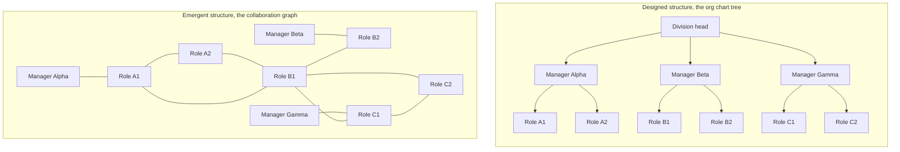
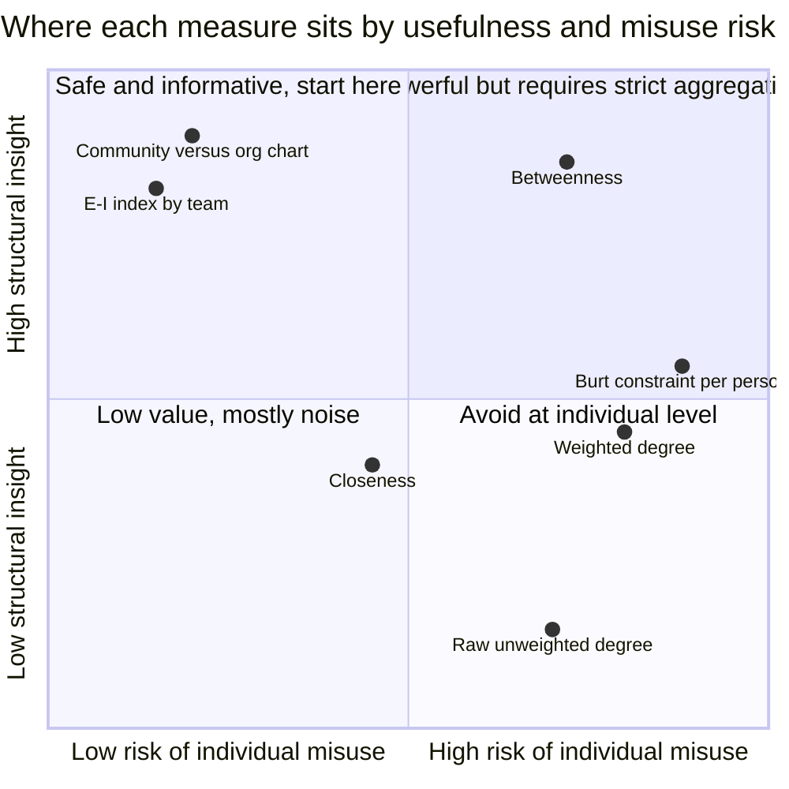
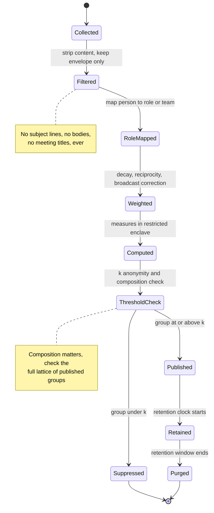

# Organizational Network Analysis: The Company Graph Nobody Drew

Somewhere in your company there is a slide with boxes and lines on it. It has a person at the top, a layer of people under them, another layer under that. It was drawn deliberately, reviewed by HR, approved by a leadership team, and it is a tree: every node has exactly one parent, there are no cycles, and the whole thing is a connected acyclic graph of reporting relationships.

And somewhere else, in the metadata exhaust of your email server, your calendar system, your chat platform, and your code review tool, there is a completely different structure. Nobody drew it. Nobody approved it. It has cycles everywhere. It has nodes with degree in the hundreds and nodes with degree in the single digits, and the correlation between where a person sits in the tree and where they sit in the graph is much weaker than anyone expects.

The first structure is the **org chart**. The second is the **collaboration network**. They are never the same, and the difference between them is where the interesting engineering lives.

It is also where the serious ethical questions live, and this is the part almost every article about organizational network analysis skips. While preparing this post I read the canonical practitioner page on ONA from one of the field's most cited researchers. It describes what ONA measures and lists a dozen business outcomes it improves, and contains not one sentence about privacy, aggregation thresholds, legal basis, or how to keep the analysis from becoming a performance-management weapon. That omission is the industry norm. This post is an attempt to correct it, because I work in a regulated financial institution, and any design I propose has to survive a conversation with a data protection officer and, in several jurisdictions, a works council with an actual veto.

So this is Part 4 of [Graph Analytics in Production](/blog/graph-analytics-gds-execution-model). Parts 1 through 3 built the machinery: the [GDS execution model](/blog/graph-analytics-gds-execution-model), [centrality and communities in practice](https://juanlara18.github.io/portfolio/#/blog/centrality-communities-in-practice), and [node embeddings](/blog/node-embeddings-fastrp-node2vec-graphsage). This part points that machinery at the organization itself, which is the one graph where the analyst is inside the data.

## Two Structures: One Designed, One Emergent

The org chart is a **designed artifact**. Someone chose it. It encodes authority, budget ownership, and accountability. It answers questions like "who approves this expense" and "who writes this person's review." It is normative: it says how work is *supposed* to flow.

The collaboration network is an **emergent artifact**. Nobody chose it. It is the residue of thousands of individual decisions about who to ask when you are stuck, who to loop into a thread, who to invite to the meeting. It is descriptive: it says how work *actually* flows.

Here is the contrast on a deliberately tiny synthetic organization.



Read the right-hand graph carefully. Role B1 touches every cluster. In the tree, B1 is an individual contributor two levels down with no direct reports and no budget. In the graph, B1 is the articulation point: remove that node and the network fragments. B1 is a **single point of failure who is nobody's manager**, and no amount of staring at the org chart will reveal it.

Meanwhile Manager Beta, who on paper coordinates a team of two, appears in the emergent graph with exactly one meaningful tie. Their coordination work is being done by B1. That is not necessarily a problem, but it is definitely a fact, and it is a fact that only shows up in the second structure.

The three archetypes that the gap between the structures exposes:

| Pattern | What the org chart says | What the graph says | Why it matters |
|---|---|---|---|
| **Hidden broker** | Individual contributor, mid-level | High betweenness, spans multiple communities | Key-person risk; the organization has an undocumented dependency |
| **Declared-but-absent collaboration** | Two teams in the same function, expected to work together | Near-zero tie weight between their communities | The reorg that put them together never actually happened socially |
| **Overloaded hub** | One manager among many | Degree several standard deviations above the mean | A queue, not a merit badge. Usually a burnout signal |

Rob Cross, who has run this analysis inside more than a hundred organizations through the Connected Commons consortium, puts a number on the third one: roughly 15 to 20 percent of employees in a typical organization are collaboratively overloaded, and the attrition rate among people *connected to* an overloaded person runs substantially above baseline. The contagion matters. Overload is a network property, not an individual failing, which is precisely why you need a network to see it.

## Building the Graph From Metadata You Already Have

The naive version of ONA is a survey: ask everyone who they work with, build a graph from the answers. This is what the academic literature mostly did for thirty years, and it has real virtues. It captures relationships that leave no digital trace, it captures perceived importance rather than raw volume, and it is unambiguously consented. It also has a response-rate problem that worsens with organization size, it captures a single point in time, and people answer surveys strategically.

The modern version derives edges from **communication metadata**: the envelope of an interaction, never its contents. This distinction is not a nicety. It is the entire foundation of the legal and ethical argument, and if you blur it even once the whole design collapses.

**Metadata only. Never content.** No subject lines. No message bodies. No meeting titles. No commit messages. No ticket descriptions. If your pipeline can read the words people wrote, your pipeline is doing something else and needs a different justification entirely.

Here are the channels worth instrumenting and what each one actually measures:

| Source | Edge semantics | Signal quality | Main distortion |
|---|---|---|---|
| Email headers | Directed, `From` to `To` and `Cc` | Medium | Broadcast lists and Cc-as-politics inflate degree |
| Calendar co-attendance | Undirected, per meeting | Medium-high for small meetings | All-hands events create dense fake cliques |
| Chat channel co-membership | Undirected, weak | Low | Membership is not interaction |
| Chat direct mentions and replies | Directed, strong | High | Only covers teams that live in chat |
| Code review interactions | Directed, reviewer to author | Very high | Only covers people who write code |
| Ticket co-assignment and handoff | Directed, workflow order | High | Only covers ticketed work |

Notice how every high-quality signal is also narrow. Code review is the cleanest collaboration edge in the entire enterprise: it is an explicit, timestamped, purposeful interaction between two named people about a specific artifact. It is also completely blind to the legal department, the branch network, and everyone in operations. This asymmetry is the source of the worst interpretation failure in ONA, and we will come back to it with force.

There is one more design decision that matters more than any of the above: **what is a node?**

The default answer is "a person." The better answer, in most cases, is **a role or a team**. Aggregating to the role level before you compute anything gives you three things at once. It reduces the analysis to structural claims, which is what you actually wanted. It collapses the graph to a size where community structure is legible instead of hairball-shaped. And it removes an enormous amount of privacy risk before the first algorithm runs, rather than trying to bolt privacy on afterwards.

If your question is "which teams are siloed," you never need person-level nodes at all. If your question is "who is a broker," you need person-level computation but you should still report at the role level: "the Payments Reconciliation role holds three of the five bridges between Ops and Engineering" is actionable and structural. "Employee 4471 holds three of the five bridges" is a personnel file entry waiting to happen.

## Weighting Edges So They Mean Something

An unweighted edge in a collaboration graph is close to meaningless. Two people who exchanged one email in eighteen months and two people who pair on code every day both get a `1`. Every centrality measure you compute on top of that inherits the noise, and the results will be dominated by whoever has the widest incidental contact surface, which is usually an executive assistant or a mailing list.

Weighting is where ONA becomes engineering. Three components matter.

### Frequency, with channel calibration

Start with counts, but normalize per channel, because channel volumes are not comparable. A hundred emails and a hundred code reviews are not the same amount of collaboration. Assign each channel a coefficient $\alpha_c$ and calibrate it, ideally against something you can validate, such as a small voluntary survey on a consenting subset.

Then handle the broadcast problem. An email to two hundred recipients is not two hundred relationships. The standard correction is to scale an interaction's contribution by the inverse of the number of pairs it creates:

$$\text{contribution of event } e \;=\; \frac{\alpha_c}{\binom{n_e}{2}}$$

where $n_e$ is the number of participants. A two-person exchange contributes fully. A forty-person all-hands contributes $\alpha_c/780$ per pair, which is correctly close to nothing. In practice I also hard-drop events above a participant threshold, because the tail of the distribution is all distribution lists and town halls.

### Recency decay

A collaboration graph without time decay is a graph of your organization's entire history, weighted equally. The team that reorganized eighteen months ago still looks intact. Use exponential decay with an explicit half-life:

$$w_{ij} \;=\; \sum_{c \in C} \alpha_c \sum_{e \in E^{c}_{ij}} \frac{1}{\binom{n_e}{2}} \exp\!\left(-\lambda\,(t_0 - t_e)\right), \qquad \lambda = \frac{\ln 2}{t_{1/2}}$$

A half-life of 30 to 60 days works well for operational questions like current load and current silos. Longer half-lives, six months or more, are better for structural questions like succession risk, where you want a stable picture rather than this quarter's project.

The half-life is not a hyperparameter to tune for pretty output. It is a **stated assumption about what "collaborates with" means**, and it belongs in the documentation you hand to the works council.

### Reciprocity

This is the component most implementations skip, and it is the one that separates real relationships from noise. If A sends B forty messages and B sends A one, that is not a collaboration. It is a broadcast, or an escalation, or someone being ignored.

Define a reciprocity factor and multiply it in:

$$\rho_{ij} \;=\; \frac{2\sqrt{w_{ij}\,w_{ji}}}{w_{ij} + w_{ji}}, \qquad \tilde{w}_{ij} = \rho_{ij}\sqrt{w_{ij}\,w_{ji}}$$

The factor $\rho_{ij}$ is the ratio of the geometric to the arithmetic mean of the two directed weights. It equals 1 when the exchange is perfectly balanced and falls toward 0 as it becomes one-sided. A simpler variant, $\rho_{ij} = \min(w_{ij}, w_{ji}) / \max(w_{ij}, w_{ji})$, behaves similarly and is easier to explain to non-technical stakeholders, which is a real consideration.

Applying reciprocity typically removes 30 to 50 percent of your raw edge mass and dramatically improves the interpretability of everything downstream. It is the single highest-leverage preprocessing step in the pipeline.

Finally, a thresholding decision: below some $\tilde{w}$, drop the edge entirely. Sparse graphs are more legible, and weak edges carry more noise than signal. Pick the threshold by looking at where the weight distribution's tail flattens, and write down why you picked it.

## The Measures That Carry Organizational Meaning

Now the analytics. Each measure below answers a specific organizational question, and each one has a specific failure mode. I will give you the meaning here and the failure modes in the next section, deliberately separated, because in practice people read the first half and stop.

### Betweenness: brokerage and key-person risk

Betweenness counts how often a node sits on shortest paths between other nodes:

$$C_B(v) \;=\; \sum_{s \neq v \neq t} \frac{\sigma_{st}(v)}{\sigma_{st}}$$

where $\sigma_{st}$ is the number of shortest paths from $s$ to $t$ and $\sigma_{st}(v)$ is the number of those that pass through $v$. This is the same measure covered in [Network Science: Communities, Centrality, and Small Worlds](https://juanlara18.github.io/portfolio/#/blog/network-science-communities-centrality), applied to a graph where the nodes are colleagues.

Organizationally, betweenness is **brokerage**: the extent to which a node connects parts of the organization that would otherwise be disconnected. High betweenness with low formal authority is the classic hidden-broker pattern, and it is the strongest key-person risk signal a graph can give you.

One implementation trap that catches nearly everyone: in NetworkX and in most graph libraries, the `weight` argument to `betweenness_centrality` is interpreted as a **distance**, not a strength. If you pass your collaboration weights directly, you will compute shortest paths that avoid strong relationships. You must invert first, typically $d_{ij} = 1/\tilde{w}_{ij}$.

### Degree: load, not merit

Weighted degree, or strength, is the total interaction weight incident on a node:

$$s(v) \;=\; \sum_{u \in N(v)} \tilde{w}_{vu}$$

Organizationally this measures **load**. It is the volume of collaborative demand flowing through a person. Read it as a capacity metric, adjacent to a burnout indicator, and never as an achievement metric.

### Community detection: real team boundaries versus declared ones

Run Louvain or Leiden on the weighted graph and you get a partition into communities that maximize modularity. Then compare that partition to the org chart's partition. The comparison itself is the finding.

Quantify the agreement with adjusted mutual information or the adjusted Rand index between the two partitions. High agreement means your formal structure matches how work flows. Low agreement means one of two things: either the org chart is aspirational, or the real work is organized around something the chart does not represent, such as a product line, a legacy system, or a shared physical location.

Both are worth knowing. Neither is automatically bad.

### E-I index: silo measurement

The E-I index, introduced by Krackhardt and Stern in 1988, is the cleanest single number for "how siloed is this group." For a group $g$:

$$\text{EI}_g \;=\; \frac{E_g - I_g}{E_g + I_g}$$

where $I_g$ is the total weight of ties internal to $g$ and $E_g$ is the total weight of ties from $g$ to everything outside it. The index ranges from $-1$ (every tie is internal, a perfect silo) to $+1$ (every tie is external, a group that exists on paper only).

Krackhardt and Stern's original finding is the reason this measure deserves attention beyond descriptive statistics: organizations whose informal networks crossed formal group boundaries responded substantially better to simulated crises. Cross-group ties are organizational resilience. The E-I index measures how much of it you have.

Note that there is no universally correct target value. A specialist compliance function *should* be more internally focused than a platform team. What you want is the E-I index tracked over time and compared against a deliberate expectation, not against zero.

### Burt's constraint: access to non-redundant information

Ronald Burt's structural holes theory, from his 1992 book, argues that competitive advantage comes not from how many contacts you have but from how **non-redundant** they are. If all your contacts know each other, they see the same things you see. If your contacts are drawn from disconnected clusters, you are the only one who sees the combination.

Burt formalized this as **network constraint**. For a node $i$:

$$C_i \;=\; \sum_{j \neq i} c_{ij}, \qquad c_{ij} = \left(p_{ij} + \sum_{q \neq i,j} p_{iq}\,p_{qj}\right)^{2}$$

where $p_{ij}$ is the proportion of $i$'s relational investment directed at $j$:

$$p_{ij} \;=\; \frac{z_{ij} + z_{ji}}{\sum_{k \neq i}\left(z_{ik} + z_{ki}\right)}$$

Low constraint means you span structural holes. High constraint means your network is closed and redundant. The companion measure, **effective size**, counts how many of your contacts are genuinely non-redundant:

$$\text{ES}_i \;=\; \sum_{j \neq i} \left[\,1 - \sum_{q \neq i,j} p_{iq}\,m_{jq}\right]$$

where $m_{jq}$ is $j$'s tie to $q$ normalized by $j$'s strongest tie. Someone with fifteen contacts and an effective size of three has a large but redundant network.

Constraint is genuinely useful at the **team** level: a team whose entire external tie budget is spent on one neighboring team is structurally constrained, and that is an org-design finding. At the individual level it is the most dangerous measure in the whole toolkit, for reasons in the next section.

Here is how the four measures split the space of what they can tell you:



## How Every One of Those Measures Gets Misread

This section is the reason the post exists. Every measure above has an obvious, tempting, wrong interpretation, and the wrong interpretations are the ones that make it into executive summaries.

**High degree does not mean high performer.** It means high volume of collaborative demand. The person with the highest weighted degree in your graph is, statistically, more likely to be a bottleneck than a star. They may be the only person who knows how the legacy settlement system works, so every question routes through them. That is a queue. Cross's research is unambiguous that this pattern predicts burnout and departure, and that the departure risk spreads to their neighbors. Treating high degree as a promotion signal is not just wrong, it actively rewards the creation of bottlenecks.

**Low centrality does not mean low value.** This is the failure that should worry you most, because it is systematically biased against exactly the work you most want to protect. The researcher who spends four months on a hard model, the engineer doing a deep refactor, the analyst reading regulation: their output is enormous and their communication metadata is nearly empty. Deep individual contributor work is *invisible* to this instrument. Not underweighted. Invisible.

**Selection bias is total, not partial.** You see only the channels you instrument. People who do their coordinating in person, by phone, in the branch, on the trading floor, or in a system you did not connect simply do not appear. Their edges are not weak, they are absent. This produces a specific and predictable distortion: the analysis systematically overstates the centrality of people whose work is natively digital and understates everyone else. In a bank, that means it flatters the engineering organization and erases the branch network. Any conclusion you draw is conditional on your instrumentation, and that conditional belongs in every single output.

**Low constraint does not mean a better employee.** Burt's theory says brokers have access to non-redundant information, and in his data that correlated with compensation and good ideas. It does not follow that an individual with high constraint is failing. Many high-constraint positions are high-constraint *by design*: a specialist embedded in one team, a role that exists to go deep rather than wide. Using constraint as an individual metric punishes people for the shape of the job you gave them.

**Community detection is not ground truth.** Louvain is stochastic and resolution-dependent. Run it with three seeds and you will get three partitions that differ at the margins. A "team boundary" that appears at one resolution and vanishes at another is not a finding, it is a hyperparameter. Report communities only when they are stable across seeds and resolutions, and say which.

**Metadata cannot distinguish good ties from bad ones.** A high-weight edge might be a productive partnership or a protracted conflict. Escalation looks exactly like collaboration from the outside. A person who is central because everyone escalates to them is not the same as a person who is central because everyone learns from them, and no envelope-level signal separates the two.

Which brings us to the rule that everything else in this post exists to support:

> **Never use these metrics for individual performance evaluation.** Not as an input, not as a tiebreaker, not as "one signal among many."

The reasons are not squeamishness. They are technical. The measures are (1) confounded by role design, (2) biased by instrumentation coverage, (3) unstable to reasonable parameter choices, and (4) blind to the sign of a relationship. A metric with those four properties cannot support a decision about a person's livelihood. And there is a fifth reason that is worse: the moment employees learn that centrality affects their review, the metric is destroyed. People will Cc more, accept more meetings, and add themselves as reviewers. You will have created an incentive to generate exactly the collaborative overload you were trying to detect.

**Analyze structures, not individuals.** Every design decision in the rest of this post follows from that sentence.

## Privacy, Re-identification, and Why Pseudonymization Is Weaker Than It Sounds

The standard privacy story for ONA goes: we replace names with hashes, we only report aggregates, therefore it is anonymous. Both halves of that story are weaker than they sound, and the graph structure is the reason.

### Minimum aggregation thresholds

Start with the part that works. Never report a statistic for a group below $k$ people. The threshold is a policy choice; in my experience $k = 5$ is the minimum defensible value and $k \ge 10$ is much easier to defend. Below that, "the average degree of the Model Validation team" is a statement about three identifiable individuals wearing a thin statistical coat.

The subtlety that most implementations miss is that thresholds must hold under **composition**. If you publish a metric for a department of 40 and separately for its sub-teams of 12, 14, and 9, you have implicitly published the remaining group of 5. Differencing attacks against hierarchical aggregates are old news in official statistics and they work perfectly well here. Your suppression logic has to reason about the full lattice of publishable groups, not each group in isolation.

### Why pseudonymization is not anonymization

Now the part that does not work. Replacing employee IDs with random tokens leaves the graph structure completely intact, and **the structure itself is identifying**.

This is not speculation. It is a well-established result with a clear lineage:

Backstrom, Dwork, and Kleinberg showed at WWW 2007 that an adversary can re-identify individuals in a released, identity-anonymized social network using structure alone. Their active attack has a coalition of a small number of accounts create a distinctive subgraph among themselves and attach it to targets before release; the pattern is then located in the published graph, and the targets fall out. They also describe passive attacks in which a small coalition of existing users, who simply remember their own neighborhoods, can locate themselves and compromise the privacy of their neighbors. The number of colluding nodes required grows only logarithmically in the size of the network.

Narayanan and Shmatikov, at IEEE Security and Privacy 2009, went further and demonstrated the attack in the wild, de-anonymizing an anonymized Twitter graph using a Flickr graph as auxiliary information and re-identifying roughly a third of the users who could be verified to have accounts on both platforms, with a low error rate. Their algorithm needs no seed of shared identifiers beyond a tiny bootstrapping set; it propagates matches outward through structural similarity.

Hay, Miklau, Jensen, Towsley, and Weis, in VLDB 2008, quantified the underlying problem: an individual's *network context*, meaning the shape of the neighborhood around them, is often unique enough to identify them even when every attribute is stripped. They formalized adversary models based on progressively larger neighborhood knowledge and showed that even modest structural knowledge defeats naive anonymization on real networks.

Now translate that to a company. In an ONA graph, the auxiliary information is not a Flickr dataset. It is **working there**. Every employee already knows their own neighborhood: who they talk to, roughly how often, and who those people talk to. That is exactly the passive-attack setting Backstrom and colleagues described, except the coalition is the entire staff, and it is free. The single node with degree 200 in a division of 400 is the head of that division and everyone knows it. The node bridging Ops and Engineering is B1 and there is only one B1.

The conclusion is uncomfortable and important: **a pseudonymized person-level graph released to a broad internal audience should be treated as identified data.** Pseudonymization reduces casual browsing risk. It does not make the dataset anonymous, and calling it anonymous in a privacy notice is a misrepresentation your DPO will eventually have to defend.

### What actually reduces risk

The defenses that work are the ones that destroy structure rather than labels:

- **Aggregate before you compute, not after.** Roll nodes up to roles or teams at ingestion. A role-level graph with 60 nodes representing 4,000 people has no individual to re-identify.
- **Publish measures, not graphs.** Ship the E-I index per team and the community-versus-chart comparison. Do not ship the edge list. A visualization tool that lets anyone click a node and expand its neighborhood is a re-identification interface with a nice UI.
- **Suppress and coarsen.** Bin metrics into quantiles rather than publishing exact values. "Top decile of brokerage" resists differencing far better than a precise betweenness score.
- **Add noise deliberately if you must publish fine-grained results.** Differentially private graph statistics exist and are an active research area. They are not free and they are not simple, but they are the only formal guarantee available. If you are not doing formal DP, do not claim formal guarantees.
- **Restrict access at the person level to a named, minimal, logged set of people.** If person-level computation must happen, it happens inside a controlled enclave with access logging, and only aggregates leave.

Here is the lifecycle that falls out of those constraints:



## Legal Basis, Works Councils, and Designing for Transparency

If you are processing employee data in the EU, or in the UK, or in any of the growing number of jurisdictions that have adopted comparable frameworks, you do not get to start with the algorithm. You start with the legal basis.

### Legitimate interest, and what it actually requires

Consent is not a workable basis for employee monitoring in the EU. The reason is structural: the Article 29 Working Party has been consistent that consent given in an employment relationship is rarely free, because of the power imbalance between employer and employee. An employee who declines to be included faces implicit consequences, so the consent is not valid, so a design that rests on it is built on sand.

That leaves **legitimate interest** under Article 6(1)(f) as the realistic basis, and legitimate interest is not a checkbox. The WP29's Opinion 2/2017 on data processing at work sets out what it takes: the processing must be strictly necessary for a legitimate purpose, and it must satisfy **proportionality** and **subsidiarity**. Subsidiarity is the one people forget. It asks whether a less intrusive method would achieve the same purpose. If your question is "are these two teams collaborating," and a fifteen-question survey would answer it, then instrumenting everyone's mailbox fails subsidiarity and your legitimate interest assessment should say so.

A defensible Legitimate Interest Assessment for ONA has three parts and all three have to survive scrutiny:

1. **Purpose test.** State the specific organizational question. "Understand collaboration" is not a purpose. "Determine whether the post-merger integration of Ops and Servicing has produced cross-unit ties, measured by the E-I index at team level over 12 months" is a purpose. Vague purposes fail purpose limitation later, when someone asks for the data for a different reason.
2. **Necessity test.** Explain why this data, at this granularity, over this time window, is the minimum needed. This is where the role-level aggregation, the retention window, and the channel selection get justified. Every field you collect that you cannot justify here is a field you should not collect.
3. **Balancing test.** Weigh the employer's interest against employees' rights and reasonable expectations. The relevant question is not "is this legal" but "would an employee be surprised." Surprise is the operational proxy for a failed balancing test, and it is a good one.

Add to that a **Data Protection Impact Assessment**, which is almost certainly mandatory here: systematic monitoring of individuals on a large scale is a textbook DPIA trigger. Write it before you build, not before you launch.

And **purpose limitation** deserves its own paragraph, because it is where these systems die. Data collected for post-merger integration measurement may not be repurposed for identifying flight risk, or for informing layoff selection, or for evaluating a manager. Not "should not." May not. Build the limitation into the architecture: separate the pipeline, restrict the outputs, log every query, and make repurposing require a new assessment rather than a new SQL statement.

### Works councils are not a formality

In Germany and several other European jurisdictions, this is not merely advisable, it is a hard gate. Under Section 87(1) No. 6 of the German Works Constitution Act, the works council has a **co-determination right** over the introduction of technical equipment suitable for monitoring employee conduct or performance. Two features of that provision matter enormously for ONA:

First, it is a **veto**, not a consultation. Without a works agreement, the system does not go in. Second, the standard is **objective capability**, not intent. It is enough that the system is capable of monitoring conduct or performance; the employer does not have to intend to use it that way. An ONA platform that computes per-person centrality is unambiguously capable of it, regardless of what your policy says you will do with the output.

The practical consequence is that the works council conversation should shape your design, not follow it. And here is the thing worth internalizing: the constraints a works council will ask for are the same constraints that make the analysis *better*. Role-level aggregation. Minimum group sizes. No individual outputs. Bounded retention. Documented purpose. A prohibition on performance use, written down. Every one of those constraints also reduces noise, reduces overfitting to instrumentation artifacts, and forces you to answer a structural question instead of a gossip question.

### Transparency as a design requirement

The last piece is the one that cannot be delegated to legal. Employees should be able to find out, without asking, what is collected, at what granularity, for what purpose, how long it is kept, and what it will never be used for.

The test I apply: **would this design survive being explained, in full detail, in an all-hands?** Not a privacy notice nobody reads. An actual explanation to the actual people in the graph, with questions afterwards.

If the answer is no, the design is wrong. Not the communication strategy. The design. Concretely, transparency-by-design means publishing the channel list and the weighting parameters, letting people see the aggregate outputs that include them, providing a genuine opt-out that does not carry consequences even though your legal basis does not require one, and stating the retention window as a number of months rather than a vague "as long as necessary."

Everything in this section maps onto the governance disciplines covered in [DAMA DMBOK: The Data Governance Framework Every Data Engineer Should Know](https://juanlara18.github.io/portfolio/#/blog/dama-dmbok-data-governance). Purpose limitation is metadata management. Retention is data lifecycle. The suppression logic is data quality with a legal consequence. ONA is not a special case that needs its own governance framework; it is an ordinary case that needs the framework applied rigorously, because the data subjects are your colleagues.

## What ONA Is Legitimately Good For

Strip away the individual-level uses and a genuinely valuable set of applications remains. All of them are structural, all of them survive aggregation, and all of them answer questions no other instrument answers.

**Onboarding design.** Track, at the cohort level, how long it takes new joiners' collaboration neighborhoods to resemble those of established peers in the same role. If it takes nine months in one function and three in another, the difference is a property of how those functions onboard, and you can fix it. The unit of analysis is the cohort, never the individual.

**Reorganization impact simulation.** Before a reorg, you have a graph. You can compute what the proposed boundaries would do to the E-I index, which existing high-weight ties would be split across the new lines, and whether any proposed unit would end up with a single point of contact to the rest of the organization. This is genuine simulation with real predictive content, and it is far better than the alternative, which is drawing boxes and hoping.

**Post-merger integration measurement.** This is ONA's strongest use case. Two organizations merge; the declared structure changes on day one; the collaboration graph does not. Track the E-I index between legacy-A and legacy-B units over eighteen months. If the cross-entity tie weight is still near zero at month twelve, the integration has not happened regardless of what the org chart says. This is a measurable, falsifiable, structural claim about an expensive corporate decision.

**Key-person risk for succession planning.** Not "who is important," but "which roles hold structural positions whose loss would fragment the network." Report it as a role, feed it into succession planning and documentation priorities, and act on it by *reducing* the concentration, not by putting a retention bonus on one person's head. If the Payments Reconciliation role is the only bridge between two divisions, the correct response is to build a second bridge.

**Finding where a knowledge base would actually help.** This one is close to my own work. A high-betweenness role is often a **human router**: a person who exists because information cannot flow between two groups without passing through them. That is a knowledge-access failure wearing a job title. Those positions are the highest-value places to put a knowledge base or a retrieval system, because you can measure the intended effect: cross-group ties should increase and routing concentration should fall. It gives you a real success metric for a knowledge project, which is rarer than it should be.

Notice what unifies all five: the output is a statement about a structure, and the intervention changes a structure. Nobody's review is affected.

## A Worked Example on Synthetic Data

Everything below runs on data generated by the code itself. There is no real organization here, no real employees, no real logs. That is not only an ethical convenience: on synthetic data you know the ground truth, so you can check whether the measures recover the structure you planted.

We plant five teams, two deliberate brokers, one declared-but-absent collaboration that the chart says should exist, and one small team below the aggregation threshold so we can watch the suppression logic fire.

### Generating a synthetic interaction log

```python
"""Synthetic ONA pipeline. No real data of any kind is used or implied."""
from __future__ import annotations

import math
import random
from collections import defaultdict
from dataclasses import dataclass

import networkx as nx

RNG = random.Random(20280914)

# Planted ground truth: five teams plus one deliberately small unit.
TEAMS = {
    "platform":   [f"p{i:03d}" for i in range(0, 18)],
    "servicing":  [f"p{i:03d}" for i in range(18, 40)],
    "risk":       [f"p{i:03d}" for i in range(40, 55)],
    "data":       [f"p{i:03d}" for i in range(55, 70)],
    "ops":        [f"p{i:03d}" for i in range(70, 92)],
    "modelval":   [f"p{i:03d}" for i in range(92, 95)],   # only 3 people, under k
}
MEMBER_OF = {p: t for t, members in TEAMS.items() for p in members}

# Two planted brokers, both individual contributors in the fictional chart.
BROKERS = {"p024": ["platform", "risk", "data"], "p071": ["data", "risk"]}

# The chart says platform and servicing collaborate. We plant almost no ties.
DECLARED_BUT_ABSENT = ("platform", "servicing")

CHANNELS = {"mail": 1.0, "calendar": 1.4, "chat": 0.8, "review": 2.2}
HORIZON_DAYS = 180


@dataclass(frozen=True)
class Event:
    channel: str
    participants: tuple[str, ...]
    day: int  # days before "today"; 0 is most recent


def synth_events(n_events: int = 60_000) -> list[Event]:
    """Generate an interaction log with planted community structure."""
    events: list[Event] = []
    people = list(MEMBER_OF)
    for _ in range(n_events):
        channel = RNG.choices(
            list(CHANNELS), weights=[0.45, 0.25, 0.25, 0.05], k=1
        )[0]
        a = RNG.choice(people)
        team_a = MEMBER_OF[a]

        # Brokers reach outside their team far more often than anyone else.
        if a in BROKERS and RNG.random() < 0.55:
            target_team = RNG.choice(BROKERS[a])
        elif RNG.random() < 0.12:
            target_team = RNG.choice(list(TEAMS))
        else:
            target_team = team_a

        if {team_a, target_team} == set(DECLARED_BUT_ABSENT) and RNG.random() < 0.97:
            continue  # the collaboration the org chart claims exists

        b = RNG.choice(TEAMS[target_team])
        if a == b:
            continue

        # Calendar events sometimes drag in a crowd, which we must down-weight.
        extra = ()
        if channel == "calendar" and RNG.random() < 0.08:
            extra = tuple(RNG.sample(people, RNG.randint(6, 30)))

        events.append(
            Event(channel, (a, b) + extra, RNG.randint(0, HORIZON_DAYS))
        )
    return events
```

The generator plants exactly what we want to detect. Brokers `p024` and `p071` route across team lines at five times the base rate. The `platform`-`servicing` pair is suppressed to near zero despite the chart. The `modelval` team has three members, deliberately below any sane threshold.

### Building the weighted graph

```python
MAX_PARTICIPANTS = 12   # above this, treat the event as a broadcast and drop it
HALF_LIFE_DAYS = 45.0
MIN_WEIGHT = 0.05       # prune the noise tail


def build_weighted_graph(events: list[Event]) -> nx.Graph:
    """Directed weights with decay and broadcast correction, then reciprocity."""
    lam = math.log(2.0) / HALF_LIFE_DAYS
    directed: dict[tuple[str, str], float] = defaultdict(float)

    for ev in events:
        n = len(ev.participants)
        if n > MAX_PARTICIPANTS:
            continue                      # town halls are not collaboration
        pair_share = 2.0 / (n * (n - 1))  # 1 / C(n, 2)
        contribution = CHANNELS[ev.channel] * pair_share * math.exp(-lam * ev.day)
        # The initiator is participants[0]; everyone else receives.
        src = ev.participants[0]
        for dst in ev.participants[1:]:
            directed[(src, dst)] += contribution

    # Reciprocity: geometric over arithmetic mean of the two directions.
    G = nx.Graph()
    seen: set[frozenset[str]] = set()
    for (u, v), w_uv in directed.items():
        key = frozenset((u, v))
        if key in seen:
            continue
        seen.add(key)
        w_vu = directed.get((v, u), 0.0)
        if w_uv <= 0.0 or w_vu <= 0.0:
            continue                      # one-sided traffic is not a tie
        geo = math.sqrt(w_uv * w_vu)
        rho = 2.0 * geo / (w_uv + w_vu)
        weight = rho * geo
        if weight >= MIN_WEIGHT:
            G.add_edge(u, v, weight=weight, distance=1.0 / weight)
    return G
```

Two details carry most of the value here. The `pair_share` factor kills the clique artifact from large meetings before it ever reaches the graph. And requiring both directions to be non-zero before creating an edge removes every broadcast relationship in one line, which in a real pipeline is a very large fraction of raw email edges.

Note also that we store `distance = 1/weight` alongside `weight`. That is the field betweenness will use.

### Computing the measures

```python
def analyse(G: nx.Graph) -> dict:
    """Structural measures. Nothing here is reported per person."""
    results: dict = {}

    # Betweenness uses DISTANCE, not strength. Passing `weight` would invert
    # the meaning and route shortest paths around strong relationships.
    btw = nx.betweenness_centrality(G, weight="distance", normalized=True)
    results["betweenness"] = btw

    results["strength"] = {n: G.degree(n, weight="weight") for n in G}

    # Community detection, checked for stability across seeds.
    partitions = [
        nx.community.louvain_communities(G, weight="weight", seed=s)
        for s in (1, 2, 3, 5, 8)
    ]
    labelled = []
    for part in partitions:
        lab = {}
        for idx, comm in enumerate(part):
            for n in comm:
                lab[n] = idx
        labelled.append(lab)
    nodes = sorted(G.nodes)
    truth = [MEMBER_OF[n] for n in nodes]
    from sklearn.metrics import adjusted_mutual_info_score as ami

    results["ami_vs_chart"] = [
        ami(truth, [lab[n] for n in nodes]) for lab in labelled
    ]

    # Burt's constraint, reported only at team level below.
    results["constraint"] = nx.constraint(G, weight="weight")
    results["effective_size"] = nx.effective_size(G, weight="weight")
    return results


def ei_index(G: nx.Graph, membership: dict[str, str]) -> dict[str, float]:
    """Weighted Krackhardt E-I index per group. -1 is a silo, +1 is outward only."""
    internal: dict[str, float] = defaultdict(float)
    external: dict[str, float] = defaultdict(float)
    for u, v, data in G.edges(data=True):
        w = data["weight"]
        gu, gv = membership[u], membership[v]
        if gu == gv:
            internal[gu] += w
        else:
            external[gu] += w
            external[gv] += w
    return {
        g: (external[g] - internal[g]) / (external[g] + internal[g])
        for g in set(membership.values())
        if (external[g] + internal[g]) > 0
    }
```

### The governance gate

This is the part that never appears in vendor demos, and it is the part that decides whether the system is deployable.

```python
K_THRESHOLD = 10   # never report a group smaller than this


def safe_group_report(
    G: nx.Graph,
    membership: dict[str, str],
    measures: dict,
    k: int = K_THRESHOLD,
) -> dict[str, dict]:
    """Aggregate to groups, suppress anything below k, quantise the outputs.

    Composition note: callers must not publish overlapping group hierarchies
    from this function without re-checking that no residual group falls below k.
    """
    by_group: dict[str, list[str]] = defaultdict(list)
    for node in G:
        by_group[membership[node]].append(node)

    ei = ei_index(G, membership)
    out: dict[str, dict] = {}
    for group, members in by_group.items():
        if len(members) < k:
            out[group] = {"status": "SUPPRESSED", "reason": f"n below k={k}"}
            continue
        btw = sorted(measures["betweenness"][m] for m in members)
        mid = btw[len(btw) // 2]
        out[group] = {
            "status": "PUBLISHED",
            "n": len(members),
            "ei_index": round(ei[group], 3),
            "median_brokerage_decile": min(9, int(mid / (max(btw) + 1e-12) * 10)),
            "mean_constraint": round(
                sum(measures["constraint"][m] for m in members) / len(members), 3
            ),
        }
    return out
```

Three things this function does that matter. It suppresses `modelval` because three people is not a group, it is three people. It reports brokerage as a **decile** rather than a raw score, which resists differencing attacks far better. And it carries a docstring warning about composition, because the next engineer will want to call it once per department and once per sub-team, and that is exactly how you leak a group of five.

### What comes out

Running the pipeline on the synthetic log recovers the planted structure. The two brokers land in the top percentile of betweenness despite having unremarkable weighted degree, which is the hidden-broker signature: not busy, but positionally critical. Louvain recovers a partition close to the planted teams, with adjusted mutual information stable in the high 0.8s across all five seeds, so the communities are a finding rather than a hyperparameter.

The E-I index tells the interesting story. Every team lands in the mildly negative range you would expect from a functioning organization, more internal ties than external, except that the `platform`-`servicing` pair contributes essentially nothing to either team's external mass. The chart says they collaborate. The graph says they have never met. That gap, not any individual's score, is the deliverable.

And `modelval` returns `SUPPRESSED`. That is the pipeline working correctly. The temptation to lower $k$ "just for this one team" is the exact moment a governed system becomes an ungoverned one.

For graphs at real enterprise scale, the same measures run in a graph database rather than in memory. The projection and execution model from [Part 1](/blog/graph-analytics-gds-execution-model) applies unchanged: project the role-level graph into memory, run betweenness and Leiden in the analytics tier, and stream results into the aggregation gate rather than writing per-node properties back to the graph, because a persisted per-person centrality property is a governance liability sitting in your database waiting for someone to query it.

## Going Deeper

**Books:**

- Burt, R. S. (1992). *Structural Holes: The Social Structure of Competition.* Harvard University Press.
  - The founding text for constraint, effective size, and the argument that advantage comes from non-redundant contacts rather than from many contacts. Read it before you use `nx.constraint` on anything that matters.
- Burt, R. S. (2005). *Brokerage and Closure: An Introduction to Social Capital.* Oxford University Press.
  - The later, more balanced treatment. Closure and brokerage are complements, not rivals, which is the nuance that makes the theory usable in org design rather than just in career advice.
- Cross, R., and Parker, A. (2004). *The Hidden Power of Social Networks: Understanding How Work Really Gets Done in Organizations.* Harvard Business School Press.
  - The book that put ONA into corporate practice. Strong on interpretation and intervention design, thin on data protection, which is a fair summary of the field it created.
- Cross, R. (2021). *Beyond Collaboration Overload: How to Work Smarter, Get Ahead, and Restore Your Well-Being.* Harvard Business Review Press.
  - The empirical case that high degree is a load signal rather than a merit signal, with the finding that overload propagates to a person's neighbors. This is the book to hand anyone who wants to use centrality in a promotion committee.
- Wasserman, S., and Faust, K. (1994). *Social Network Analysis: Methods and Applications.* Cambridge University Press.
  - The reference volume. Dense, complete, and the place to check what a measure actually means before you ship it.

**Online Resources:**

- [What is Organizational Network Analysis?](https://www.robcross.org/what-is-organizational-network-analysis/) — Rob Cross's practitioner overview. Useful for framing and for the range of applications; read it noting how completely the privacy dimension is absent, which is the industry norm this post argues against.
- [WP29 Opinion 2/2017 on data processing at work](https://collab.dpa.gr/wp-content/uploads/2023/07/WP29_Opinion-2-2017-on-data-processing-at-work.pdf) — The primary source on necessity, proportionality, subsidiarity, and why consent does not work in an employment relationship. Read the actual document, not summaries of it.
- [NetworkX structural holes module](https://networkx.org/documentation/stable/reference/algorithms/structuralholes.html) — Reference implementation of Burt's constraint and effective size, including the exact weighting conventions, which differ subtly from some other packages.
- [Krackhardt E/I Ratio](https://en.wikipedia.org/wiki/Krackhardt_E/I_Ratio) — Compact definition and the normalization variants, useful when you need to reconcile numbers across tools.
- [Section 87 BetrVG commentary on software and co-determination](https://www.luther-lawfirm.com/en/newsroom/blog/detail/dauerbrenner-software-vs-mitbestimmung-87-abs-1-nr-6-betrvg) — A practitioner walkthrough of why "objectively capable of monitoring" is a much lower bar than "intended to monitor."

**Videos:**

- [TEDxNashville: The Hidden Influence of Social Networks](https://www.youtube.com/watch?v=VQEf-JyBnZ0) by Nicholas Christakis — The clearest short argument that network position shapes outcomes in ways individuals cannot see from inside the network. Good grounding for why structural analysis is worth doing at all.
- [Social Network Analysis: Structural Holes, Brokerage and Closure](https://www.youtube.com/watch?v=zRS0mCPlcwA) — A focused walkthrough of the brokerage-versus-closure distinction and how structural holes relate to Granovetter's weak ties.

**Academic Papers:**

- Krackhardt, D., and Stern, R. N. (1988). ["Informal Networks and Organizational Crises: An Experimental Simulation."](https://www.jstor.org/stable/2786835) *Social Psychology Quarterly*, 51(2), 123-140.
  - Introduces the E-I index and supplies the empirical reason to care about it: organizations with more cross-group informal ties handled simulated crises better. Cross-boundary ties are resilience.
- Backstrom, L., Dwork, C., and Kleinberg, J. (2007). ["Wherefore Art Thou R3579X? Anonymized Social Networks, Hidden Patterns, and Structural Steganography."](https://dl.acm.org/doi/10.1145/2043174.2043199) *Proceedings of WWW 2007*; later in *Communications of the ACM*, 54(12).
  - The foundational result that identity-anonymized graphs are attackable using structure alone, with active and passive attacks and a logarithmic bound on the coalition size required.
- Narayanan, A., and Shmatikov, V. (2009). ["De-anonymizing Social Networks."](https://dl.acm.org/doi/10.1109/SP.2009.22) *2009 IEEE Symposium on Security and Privacy*, 173-187.
  - The demonstration in the wild. Re-identified roughly a third of verifiable overlapping users in an anonymized Twitter graph using Flickr as auxiliary data. In a workplace, the auxiliary data is employment itself.
- Hay, M., Miklau, G., Jensen, D., Towsley, D., and Weis, P. (2008). ["Resisting Structural Re-identification in Anonymized Social Networks."](http://www.vldb.org/pvldb/vol1/1453873.pdf) *PVLDB*, 1(1), 102-114.
  - Formalizes adversary models by neighborhood knowledge and quantifies how often an individual's network context alone is uniquely identifying. The paper that should end the phrase "we pseudonymized it, so it is anonymous."
- Burt, R. S. (2000). ["Structural Holes versus Network Closure as Social Capital."](https://snap.stanford.edu/class/cs224w-readings/burt00capital.pdf) In *Social Capital: Theory and Research*.
  - The concise statement of the two competing accounts of social capital, and the best single-paper introduction to constraint if you are not going to read the 1992 book.

**Questions to Explore:**

- If measuring a network changes the behavior that produces it, is a stable measurement of an organization's collaboration structure even possible in principle, or does every published ONA result describe a graph that no longer exists?
- The E-I index treats all external ties as equally valuable. Is there a principled way to weight cross-boundary ties by how *far* they reach in the formal hierarchy, and would that measure be more useful or merely more complicated?
- Deep individual work is invisible to communication metadata. Is that a fixable instrumentation gap, or is it a fundamental property of any measurement built on interaction traces, and if the latter, what is the honest epistemic status of any organization-wide conclusion drawn from them?
- Structural re-identification works because network position is nearly unique. Does that imply a formal trade-off curve between the analytical value of a graph and its anonymizability, and if so, where does role-level aggregation sit on it?
- If a works council's constraints reliably improve the quality of the analysis, as I argued above, what does that say about the many analyses conducted in jurisdictions where no such constraint exists?
