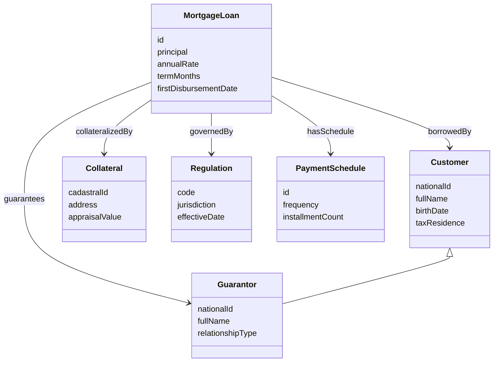
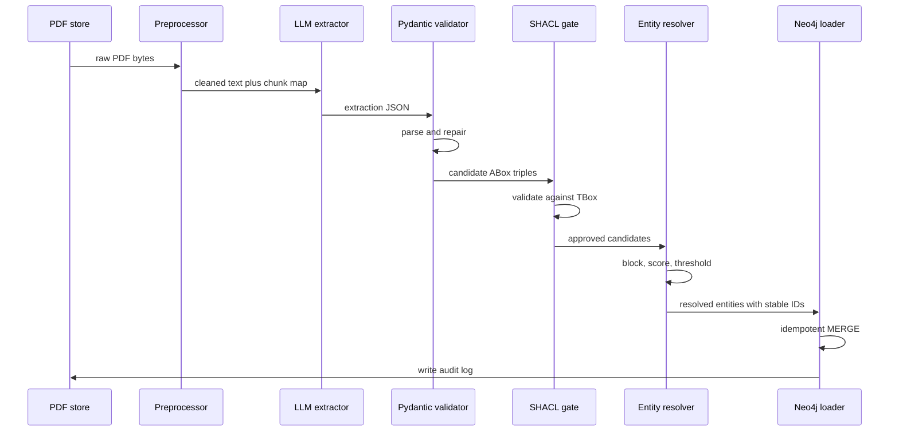
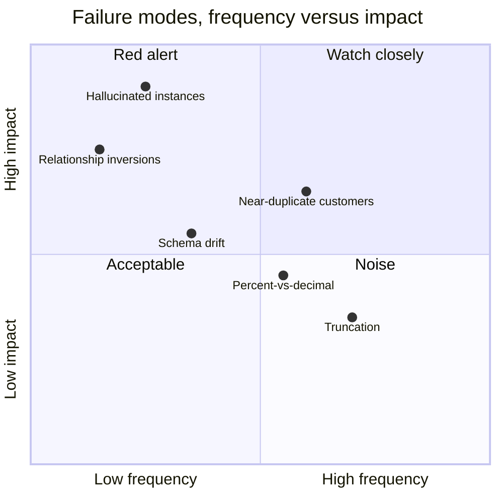

# Populating a Knowledge Graph with LLMs: A Banking Case Study

The demo went well. It always does. On a Tuesday afternoon our team stood around a screen, watched GraphRAG chew through a 12-page PDF about a fictional savings product, and produced a little constellation of nodes — `Product`, `Customer`, `Regulation`, edges neatly labeled, a readable Cypher result for "what products are governed by which rules?" Half the room said "we should ship this." The other half, politely, said "let's try it on a real document." That was the end of the good mood.

The real document was a *Crédito Hipotecario* — a mortgage-loan contract — from our bank's origination archive. One PDF. 38 pages. A cover page in marketing prose, eight pages of legal boilerplate copied from the 2019 regulatory framework, a table of amortization schedules spanning three pages that had been scanned at some point in 2016 and re-OCR'd twice, four signatures pages, an annex specifying the collateral (a flat in Chapinero), a second annex with the guarantor's personal data, and — buried on page 27 — the actual economic terms: the principal, the annual rate, the term, the payment calendar, and a brutal list of optional insurance riders. When we fed this PDF to the same pipeline that had just wowed the room, it produced a graph that looked plausible from a distance and was wrong in roughly six different ways on close inspection.

The `tasa` (rate) was extracted as a number without its unit. The `plazo` (term) was extracted as "240" — correct, except the document said 240 months in one place and 20 years in another, and the LLM had silently unified them into a single value without recording either. The guarantor had been invented as a separate `Customer` node even though he appeared on the borrower's identity card as *the same person with a middle name*. Two regulations were cited, one of them was hallucinated entirely. The `covers` relation between the collateral and the loan was drawn backwards. And the entire load was not idempotent — running the pipeline a second time created a second, parallel graph alongside the first, because nobody had thought about `MERGE` semantics when they wrote the ingestion code.

None of these failures are in the GraphRAG paper. None of them are in the slide decks. They are what happens when you take an LLM-driven KG construction pipeline and point it at a corpus that was written by humans under legal constraints, not by ML teams under demo constraints.

This post is a field report on the gap between those two worlds. The goal is not to re-derive GraphRAG or to argue for any particular framework. The goal is to walk through, end to end, the pipeline we ended up with after the bruises: a schema-embedded extraction prompt, a Pydantic-repair loop around the JSON output, a SHACL gate that refuses to write anything that violates the TBox, a proper entity-resolution step that doesn't rely only on string similarity, and Cypher that is idempotent down to the byte. Plus the three failure modes we learned to detect specifically, and the metrics we use to know the pipeline is healthy.

If you have not already, it pays to read this post as the fourth stop on a four-part ontology series. The other three pieces set up what I will assume here:

- [TBox vs ABox: Keeping Your Schema and Your Facts Apart](/blog/tbox-abox-schema-facts-distinction) — why "schema" and "instances" need to be different artifacts in your repo.
- [Modular Ontologies: The Core-Plus-Domains Pattern](/blog/modular-ontologies-core-domains-pattern) — how to avoid a 400-class monolith.
- [From Ontology to Production Pipeline on GCP](/blog/ontology-production-pipeline-gcp) — the cloud plumbing around the steps we will talk about here.
- [Ontology-Grounded RAG: Why Chunks-in-Nodes Matter](/blog/ontology-grounded-rag-chunks-in-nodes) — the retrieval side of the same graph.

Everything below is ingestion.

## The Case: Crédito Hipotecario

Before any code, the domain. A mortgage-loan product in our bank is modeled by an ontology fragment that sits inside the *Lending* domain module. The classes relevant to ingestion are:

- `MortgageLoan`: the product instance. Carries `principal`, `annualRate`, `termMonths`, `paymentFrequency`, `firstDisbursementDate`.
- `Customer`: the borrower. Carries `nationalId`, `fullName`, `birthDate`, `taxResidence`. Subclassed as `RetailCustomer` or `CorporateCustomer`.
- `Guarantor`: a `Customer` in the same role set, but connected via `guarantees` instead of `borrows`.
- `Collateral`: the asset pledged. For a mortgage this is an `Immovable` with `address`, `cadastralId`, `appraisalValue`, `appraisalDate`.
- `Regulation`: the supervisory rule invoked. Carries `code`, `jurisdiction`, `effectiveDate`.
- `PaymentSchedule`: the amortization table. Carries many `PaymentInstallment` rows.

The object properties we care about are `borrowedBy`, `guarantees`, `collateralizedBy`, `governedBy`, `hasSchedule`, and `partOf`. The hard part is not naming these — the ontology is version-controlled and reviewed by the domain team. The hard part is writing an extraction pipeline that takes a 38-page PDF, produces a set of ABox assertions consistent with the TBox, and does it reliably enough that ops does not get paged every night.

Here is the target shape, class-level, for a single loan:



`Guarantor` is a subclass of `Customer` because a guarantor is a person with all the same identifying attributes; the only thing that differs is the role they play with respect to a specific loan. Modeling it as a subclass rather than a parallel class pays off massively in entity resolution, as we will see.

The raw document flows through the pipeline in seven stages. Before drilling into any of them, the diagram:



Every arrow is a place the pipeline can reject a record cleanly. That property — *fail early, fail loud, fail with structured errors* — is the single most important design commitment. In the first version of our pipeline we tried to forgive the LLM; the forgiveness compounded into silent corruption in the graph. Now every stage is a strict gate.

## Stage One: The Extraction Prompt

The extraction prompt is the only stage where the LLM has creative freedom. Everything downstream is deterministic. The prompt template has three ingredients: the JSON Schema derived from the TBox, a small set of few-shot examples drawn from historical loans, and strict formatting instructions.

The schema-derivation step is worth dwelling on. Many pipelines I have seen write a hand-curated JSON Schema and then let it drift away from the ontology. We generate it mechanically from the ontology file on every build, so the two cannot drift apart without the CI failing.

```python
from pydantic import BaseModel, Field, field_validator
from typing import Literal, Optional
from datetime import date

class MortgageLoanSchema(BaseModel):
    """
    Mirrors the MortgageLoan class in the Lending ontology module.
    Every field here must correspond to a data property declared on
    :MortgageLoan in the TBox. Changes here are tracked against the
    .ttl file by a CI test (see `test_schema_matches_tbox.py`).
    """
    loan_id: str = Field(..., description="Internal loan id as printed on the cover page.")
    principal: float = Field(..., ge=0, description="Nominal principal in COP.")
    annual_rate: float = Field(..., ge=0, le=1, description="Annual effective rate as a decimal.")
    term_months: int = Field(..., ge=1, le=600, description="Total term in months.")
    first_disbursement_date: date
    product_family: Literal["CreditoHipotecario", "CreditoHipotecarioVIS"] = Field(
        ..., description="Product subtype as stated in the document header."
    )
    borrower_national_id: str
    borrower_full_name: str
    guarantor_national_id: Optional[str] = None
    guarantor_full_name: Optional[str] = None
    guarantor_relationship: Optional[Literal["spouse", "parent", "corporate"]] = None
    collateral_cadastral_id: str
    collateral_address: str
    collateral_appraisal_value: float = Field(..., ge=0)
    governing_regulation_codes: list[str] = Field(default_factory=list)

    @field_validator("annual_rate")
    @classmethod
    def reject_percent_like(cls, v: float) -> float:
        # The LLM occasionally extracts "9.5" instead of "0.095".
        # We refuse values > 1 outright and force the LLM to retry.
        if v > 1:
            raise ValueError(
                f"annual_rate looks percent-encoded ({v}); must be decimal < 1."
            )
        return v
```

That Pydantic model is the source of truth for the JSON Schema. `model_json_schema()` serializes it into the shape the prompt expects. Because it inherits field descriptions directly from the ontology's `rdfs:comment` annotations (via a small build script we do not reproduce here), the model is also the source of truth for the natural-language hints the LLM sees.

The prompt itself:

```python
EXTRACTION_PROMPT = """You are an information extraction component in a
banking ontology pipeline. Your task is to read a mortgage-loan document
(Crédito Hipotecario) and emit a single JSON object conforming *exactly*
to the schema below.

Strict rules:
- Emit only JSON. No prose, no comments, no markdown fences.
- If a required field cannot be located in the document, emit the string
  "__MISSING__" for it. Do NOT hallucinate values.
- Dates must be ISO-8601 (YYYY-MM-DD).
- Monetary amounts must be numeric; strip currency symbols and thousand
  separators.
- Rates must be expressed as decimals (0.095 for 9.5%).
- If the document mentions multiple regulations, list all of their codes.
- If a guarantor is not mentioned, set guarantor_* fields to null.

Schema (JSON Schema draft-2020-12):
{schema_json}

Few-shot examples:
{few_shot_examples}

Document text (may be truncated; prioritize fields on pages 1, 2, and
the economic-terms section):
<document>
{document_text}
</document>

Emit the JSON object now."""
```

Three points worth highlighting, because they were each paid for in blood:

1. `__MISSING__` instead of an empty string or null. When the field is missing, we need to know whether the LLM *could not find it* or whether *the document says it is null*. A `None` from Pydantic blurs those two; a sentinel keeps them distinct. The downstream stage knows to treat `__MISSING__` as a retrieval failure and, depending on the field, to either re-prompt with a narrower context window or defer to human review.

2. The schema is embedded as JSON Schema, not as an English description. Modern models (Claude, GPT-4 class, Gemini 1.5) adhere to JSON Schema constraints much more reliably than to prose. "Must be a decimal between 0 and 1" is better stated as `{"type": "number", "minimum": 0, "maximum": 1}`.

3. Few-shot examples are drawn from the *gold set* — the 60 loans we have manually labeled — and rotated per call so the LLM is not just memorizing one style. Rotating matters because our documents were authored by three different back-office teams over seven years; the prose conventions are not uniform.

A structured-output API (Anthropic's tool-use, OpenAI's `response_format`, Gemini's `response_mime_type: application/json`) gives you a second layer of insurance: the provider's own parser rejects malformed JSON before you ever see it. We still validate with Pydantic afterward, because provider parsers accept JSON that satisfies the *syntax* but not the *schema constraints*.

## Stage Two: Parsing, Repair, Partial Accept

Even with structured-output mode, roughly one extraction in 40 fails Pydantic validation on our production traffic. The failures fall into three buckets:

- **Truncation.** The document was long, the LLM hit its output budget, and the JSON ended mid-field. We detect this with `json.JSONDecodeError` and ask for a continuation bounded by the unfinished field.
- **Hallucinated fields.** The LLM adds an `early_payoff_penalty` field that is not in the schema. Pydantic rejects extras if we set `model_config = ConfigDict(extra="forbid")`. We log the extras and drop them.
- **Mixed types.** `annual_rate: "9.5"` instead of `0.095`; `term_months: "240 meses"` instead of `240`. Our validators coerce when safe and reject otherwise.

A small repair loop handles these. The shape is deliberately plain:

```python
import json
from pydantic import ValidationError

def extract_with_repair(document_text: str, max_attempts: int = 3):
    schema_json = MortgageLoanSchema.model_json_schema()
    prompt = EXTRACTION_PROMPT.format(
        schema_json=json.dumps(schema_json, indent=2),
        few_shot_examples=_render_few_shot(3),
        document_text=document_text,
    )
    errors: list[str] = []
    for attempt in range(max_attempts):
        raw = _call_llm(prompt, temperature=0.0)
        try:
            payload = json.loads(raw)
            model = MortgageLoanSchema.model_validate(payload)
            return model, errors
        except json.JSONDecodeError as e:
            errors.append(f"attempt {attempt}: invalid JSON at pos {e.pos}")
            prompt = prompt + f"\n\nYour previous response was invalid JSON: {e}. Emit valid JSON only."
        except ValidationError as e:
            errors.append(f"attempt {attempt}: {e.errors()}")
            prompt = prompt + f"\n\nYour previous response failed schema validation: {e.errors()}. Fix and re-emit the full JSON."
    # Partial-accept path: keep fields that validate individually,
    # mark the rest as MISSING and push to human review.
    return _partial_accept(raw, errors), errors
```

The partial-accept path matters. When repair fails three times, the record is not lost. Fields that validate in isolation are kept; the rest are marked `__MISSING__` and the record enters a review queue. In our experience about 0.3% of documents end up in review on first pass, and a human resolves them typically in under two minutes by looking at the page of the PDF we flag.

The `temperature=0.0` is load-bearing. Extraction is not creative work. Any warmer and you introduce silent run-to-run variation, which destroys the idempotence property we will need later. Our evaluation harness runs every extraction twice and fails the build if the two runs produce different JSON.

## Stage Three: The SHACL Gate

By the time we reach this stage, the JSON has passed Pydantic. That means it is syntactically valid and each field is independently well-typed. What it does *not* mean is that the graph of assertions we are about to write satisfies the ontology's constraints. SHACL — the Shapes Constraint Language — is the layer that checks the *shape* of the data against the TBox, not just the types of the fields.

The TBox declares things like:

- Every `MortgageLoan` must have exactly one `borrowedBy` relation to a `Customer`.
- Every `MortgageLoan` must have exactly one `collateralizedBy` relation to a `Collateral`.
- `annualRate` must be in `[0, 1]`.
- `termMonths` must be in `[1, 600]`.
- If the `product_family` is `CreditoHipotecarioVIS`, the `principal` must be below a subsidy cap.

These are expressible as SHACL shapes. pySHACL runs the validation:

```python
import pyshacl
from rdflib import Graph, Namespace, URIRef, Literal, RDF

BANK = Namespace("http://bank.example/ontology/")

def candidate_graph_for(loan: MortgageLoanSchema) -> Graph:
    """Build the tiny RDF graph the candidate extraction would produce."""
    g = Graph()
    loan_iri = URIRef(f"http://bank.example/loan/{loan.loan_id}")
    g.add((loan_iri, RDF.type, BANK.MortgageLoan))
    g.add((loan_iri, BANK.principal, Literal(loan.principal)))
    g.add((loan_iri, BANK.annualRate, Literal(loan.annual_rate)))
    g.add((loan_iri, BANK.termMonths, Literal(loan.term_months)))
    # borrower
    borrower_iri = URIRef(f"http://bank.example/person/{loan.borrower_national_id}")
    g.add((borrower_iri, RDF.type, BANK.Customer))
    g.add((borrower_iri, BANK.nationalId, Literal(loan.borrower_national_id)))
    g.add((loan_iri, BANK.borrowedBy, borrower_iri))
    # collateral, regulations, etc. elided for brevity
    return g


def shacl_gate(loan: MortgageLoanSchema, shapes_graph: Graph) -> tuple[bool, str]:
    data_graph = candidate_graph_for(loan)
    conforms, _report_graph, report_text = pyshacl.validate(
        data_graph=data_graph,
        shacl_graph=shapes_graph,
        ont_graph=None,
        inference="rdfs",
        abort_on_first=False,
        allow_warnings=False,
    )
    return conforms, report_text
```

Three things to know about SHACL in production:

1. **It is a gate, not a fixer.** pySHACL tells you *what* is wrong, not how to fix it. The output is a human-readable report plus a machine-readable `ValidationReport` graph. We route non-conforming extractions to the review queue with the failing shape attached.

2. **Inference is optional but useful.** With `inference="rdfs"`, pySHACL applies RDFS subsumption before validation. That means a shape declared on `Customer` also validates instances of `Guarantor`, because `Guarantor rdfs:subClassOf Customer`. Without inference you would have to duplicate shapes on every subclass.

3. **Shapes belong in version control.** Our shapes are a `.ttl` file next to the ontology file, updated in the same PR. Changes trigger a re-run of the gold-set extraction tests.

An example shape, for the "annual rate is in [0, 1]" rule:

```turtle
bank:MortgageLoanShape a sh:NodeShape ;
    sh:targetClass bank:MortgageLoan ;
    sh:property [
        sh:path bank:annualRate ;
        sh:datatype xsd:decimal ;
        sh:minInclusive 0 ;
        sh:maxInclusive 1 ;
        sh:minCount 1 ;
        sh:maxCount 1 ;
    ] ;
    sh:property [
        sh:path bank:borrowedBy ;
        sh:class bank:Customer ;
        sh:minCount 1 ;
        sh:maxCount 1 ;
    ] .
```

A Pydantic validator could in principle enforce the same rule. The reason we enforce it twice — once in Pydantic, once in SHACL — is that the two layers catch different things. Pydantic validates *the extraction*, treating it as a flat record. SHACL validates *the graph*, treating it as RDF. When the schema is a flat record this is redundant; when the schema implies a multi-node structure (a loan plus a borrower plus collateral), only SHACL checks the connections between them.

We discovered this distinction the hard way when an extraction passed Pydantic because each individual field was valid but produced an `bank:MortgageLoan` with *two* `bank:borrowedBy` edges because the document named a co-borrower structure we had not modeled. Pydantic saw one `borrower_national_id` field; SHACL saw two borrower edges after the extraction was denormalized, and rejected it. That rejection saved us a week of debugging.

## Stage Four: Entity Resolution

Extraction gives you `borrower_full_name: "Pedro Pérez"` and `borrower_national_id: "79123456"`. The graph already contains 900 instances of `Customer`. Which one, if any, is Pedro Pérez? And if none, is Pedro Pérez *in fact* the same person as Pedro A. Pérez in the graph, under a different ID scheme?

This is entity resolution, and the single biggest mistake I have watched teams make is to delegate it to string similarity. "Pedro Pérez" and "Pedro A. Pérez" have a Levenshtein distance of 3 and a Jaro-Winkler similarity of 0.93. But so do "Pedro Pérez" and "Pablo Pérez", who are different people. String similarity is a feature, not the whole model.

The production pipeline does three things:

**Blocking.** A full pairwise comparison between 900 existing customers and a new candidate is 900 comparisons; across an ingestion batch of 50 loans it is 45,000. That is fine. Across a backfill of 100,000 historical loans it is not. Blocking reduces the candidate pool by cheap keys before any expensive comparison runs. Our blocks are: `national_id[:4]`, `birth_year`, and a phonetic encoding of the last name (we use Double Metaphone).

**Feature engineering.** Once blocking narrows the candidates to a dozen or so, we score each pair with a vector of features: normalized Jaro-Winkler on full name, exact match on national ID, date-of-birth difference, address similarity, shared-phone flag, and a small neural similarity score on the free-text `notes` field.

**Calibrated threshold with a human queue.** Scores above the upper threshold are auto-merged. Scores below the lower threshold are auto-declared non-matches. Scores in the middle go to a review queue where an ops analyst decides.

```python
from metaphone import doublemetaphone
from rapidfuzz import fuzz

def blocks(rec) -> list[str]:
    """Cheap keys; any match on any key makes a candidate pair."""
    keys = []
    if rec.national_id:
        keys.append(f"nid4:{rec.national_id[:4]}")
    if rec.birth_date:
        keys.append(f"yob:{rec.birth_date.year}")
    if rec.last_name:
        keys.append(f"dm:{doublemetaphone(rec.last_name)[0]}")
    return keys


def pair_features(a, b) -> dict[str, float]:
    return {
        "name_jw": fuzz.WRatio(a.full_name, b.full_name) / 100.0,
        "nid_exact": float(a.national_id == b.national_id),
        "dob_delta": _dob_delta(a.birth_date, b.birth_date),
        "address_jw": fuzz.WRatio(a.address or "", b.address or "") / 100.0,
        "shared_phone": float(bool(set(a.phones) & set(b.phones))),
    }


def pair_score(features: dict[str, float]) -> float:
    # Weights fitted once on a 5k hand-labeled training set of pairs.
    # national-id equality dominates; the rest act as tiebreakers and
    # as positive signal when the id is stale or missing.
    return (
        0.55 * features["nid_exact"]
        + 0.20 * features["name_jw"]
        + 0.10 * features["shared_phone"]
        + 0.10 * (1 - features["dob_delta"])
        + 0.05 * features["address_jw"]
    )


MATCH_UPPER = 0.85
MATCH_LOWER = 0.55

def resolve(candidate, existing_pool):
    bucket = {k: [] for k in blocks(candidate)}
    for e in existing_pool:
        for k in blocks(e):
            if k in bucket:
                bucket[k].append(e)
    candidates = {id(e): e for lst in bucket.values() for e in lst}
    scored = []
    for e in candidates.values():
        f = pair_features(candidate, e)
        s = pair_score(f)
        scored.append((s, e))
    scored.sort(reverse=True)
    if not scored:
        return "new", None
    best_score, best_match = scored[0]
    if best_score >= MATCH_UPPER:
        return "merge", best_match
    if best_score <= MATCH_LOWER:
        return "new", None
    return "review", best_match
```

Two calibrations matter. First, the weights in `pair_score`. These should not be guessed; we fit them once on 5,000 hand-labeled pairs using logistic regression, which gives interpretable coefficients a domain expert can inspect. Second, the thresholds `MATCH_UPPER` and `MATCH_LOWER`. These are chosen on a held-out calibration set to hit a target precision for auto-merges (we aim for 99.5%, which in our workload means a review rate of roughly 4% of candidates).

Specialized libraries do all of this with more sophistication. [dedupe](https://github.com/dedupeio/dedupe) gives you an active-learning loop that learns the weights from a handful of human labels. [Splink](https://github.com/moj-analytical-services/splink) implements the Fellegi-Sunter probabilistic record linkage model at scale and runs on Spark, DuckDB, or PostgreSQL backends. For banking-scale pipelines, Splink is usually the right answer.

The feature that is often missing in naive implementations and that we cannot skip: *role disambiguation*. Pedro Pérez the borrower on this loan is the same *person* as Pedro Pérez the guarantor on his brother's loan from last year. But the two loan records have distinct *role assertions*. Entity resolution operates on `Customer`, not on `borrower_on_this_loan`. Modeling roles as relation types (`borrowedBy`, `guarantees`) instead of as separate entity types is what lets us resolve once and reuse everywhere.

## Stage Five: Idempotent MERGE Cypher

We finally have: a validated extraction, an approved shape, and a resolved customer id. We write it to Neo4j with a Cypher statement whose defining property is idempotence: running it once produces graph G; running it a thousand times produces the same graph G.

The pattern is `MERGE` on a stable ID, followed by `SET` with scalar overrides, followed by `MERGE` on relations, in that order. Never `CREATE`, except for immutable audit rows.

```cypher
// Idempotent load of a single mortgage loan and its immediate neighborhood.
// Parameters arrive as a map $p populated from the resolver output.

MERGE (loan:MortgageLoan {id: $p.loan_id})
  ON CREATE SET loan.createdAt = datetime()
SET loan.principal              = $p.principal,
    loan.annualRate             = $p.annual_rate,
    loan.termMonths             = $p.term_months,
    loan.firstDisbursementDate  = date($p.first_disbursement_date),
    loan.productFamily          = $p.product_family,
    loan.updatedAt              = datetime()

WITH loan
MERGE (borrower:Customer {nationalId: $p.borrower_national_id})
  ON CREATE SET borrower.createdAt = datetime()
SET borrower.fullName = coalesce($p.borrower_full_name, borrower.fullName)
MERGE (loan)-[:BORROWED_BY]->(borrower)

WITH loan
MERGE (coll:Collateral {cadastralId: $p.collateral_cadastral_id})
SET coll.address         = $p.collateral_address,
    coll.appraisalValue  = $p.collateral_appraisal_value
MERGE (loan)-[:COLLATERALIZED_BY]->(coll)

WITH loan
UNWIND $p.governing_regulation_codes AS reg_code
MERGE (r:Regulation {code: reg_code})
MERGE (loan)-[:GOVERNED_BY]->(r)

WITH loan
FOREACH (_ IN CASE WHEN $p.guarantor_national_id IS NOT NULL THEN [1] ELSE [] END |
  MERGE (g:Customer {nationalId: $p.guarantor_national_id})
    ON CREATE SET g.createdAt = datetime()
  SET g.fullName = coalesce($p.guarantor_full_name, g.fullName)
  MERGE (loan)-[:GUARANTEED_BY {relationship: $p.guarantor_relationship}]->(g)
)

RETURN loan.id AS id
```

Several properties to notice:

- **Stable IDs everywhere.** `MortgageLoan` matches on `id`, `Customer` on `nationalId`, `Collateral` on `cadastralId`, `Regulation` on `code`. None of these are auto-generated by Neo4j. The resolver gave us the stable ID before the write.
- **`ON CREATE` guards for immutable fields.** `createdAt` is set only on first creation; subsequent runs leave it alone.
- **`SET` uses `coalesce` for nullable properties.** If the new extraction did not find `fullName` but the existing node has one, we keep the existing. If both exist, the new one wins. This is a policy choice — we audit the handful of fields where we want different precedence.
- **`FOREACH` with a CASE predicate as conditional logic.** Cypher does not have `IF`; the `FOREACH` trick with a zero-or-one-element list is the canonical pattern for conditional writes.
- **Constraints on every MERGE key.** Outside this script, we declare `CREATE CONSTRAINT FOR (c:Customer) REQUIRE c.nationalId IS UNIQUE` and the equivalents. Without those, `MERGE` is allowed to be non-deterministic under concurrent writes.

Idempotence also requires that the driver-level transaction behavior does not surprise us. Every write runs in an explicit `execute_write` transaction; on failure, the transaction aborts and no partial graph is left behind. We check for idempotence in CI by running the same load twice and diffing the resulting graph — any non-empty diff is a test failure.

## The Three Failure Modes and How to Detect Them

Three failure modes are endemic to LLM-driven KG construction. Each has a specific detector.

**Schema drift.** The LLM invents a class or property that is not in the ontology. We saw an extraction emit a `covered_by_insurance` field that does not exist in our schema. The detector: the Pydantic model is `extra="forbid"`, and the SHACL gate rejects `rdf:type` assertions whose class IRI is not declared in the TBox. Every drift event generates a structured error routed to the review queue, and the reviewer decides whether the ontology should add the concept or the prompt should be adjusted.

**Hallucinated instances.** The LLM invents an entity that is not mentioned in the document. The most dangerous flavor is a hallucinated `Customer` — the pipeline will happily create a node for a person who does not exist. We detect this with a provenance check: every ABox assertion must carry a `SUPPORTED_BY` edge to a specific chunk of the source document. The chunk linker (see the chunks-in-nodes post) runs over the extraction and refuses to accept any entity whose value is not literally present in any linked chunk. Entities without chunk support are flagged.

**Relationship inversions.** The LLM gets the direction of a relation wrong. `collateralizedBy` goes from `MortgageLoan` to `Collateral`; the LLM occasionally emits triples in the opposite direction. The detector here is structural: we never let the LLM write direct triples. The Pydantic model exposes fields like `collateral_cadastral_id`, and the Cypher script hard-codes the direction of `COLLATERALIZED_BY`. The LLM has no opportunity to invert.

Summarized as a quadrant:



The high-frequency-low-impact corner is where you want your failures to live. Truncation is annoying but deterministic and easy to retry. Percent-versus-decimal confusion is caught at Pydantic. Near-duplicate customers are caught at entity resolution. The dangerous corner is top-left: low frequency, high impact. Hallucinated instances are rare but corrupt the graph for every downstream query that touches the fabricated entity. Keep the dangerous corner empty by making the gates strict.

## Pipeline Quality Metrics

The pipeline is healthy if six numbers are in range. We dashboard them and alert on drift.

| Metric | What it measures | Healthy range |
|---|---|---|
| Extraction recall | Fraction of gold-set fields correctly extracted | above 0.92 |
| Extraction precision | Fraction of extracted fields that match gold | above 0.97 |
| SHACL violation rate | Extractions rejected by the SHACL gate | below 3% |
| Entity-resolution F1 | F1 on a hand-labeled linkage gold set | above 0.95 |
| Review queue rate | Candidates deferred to human review | below 5% |
| Idempotence diff | Nodes or edges that differ across two runs | 0 |

Recall and precision are computed against a frozen gold set of 60 manually labeled mortgage loans. Every new model version and every prompt change reruns the gold set; a drop of more than two percentage points blocks the release. The SHACL violation rate is a canary: if it spikes, either a new document template has appeared or the ontology has drifted; either way, a human needs to look.

The idempotence metric is non-negotiable. It is computed by running the full pipeline twice on the same inputs and taking the symmetric difference of the resulting graphs. Any non-empty diff is a pipeline bug, not a tolerable state. The most common cause of a non-zero diff is hidden nondeterminism in the LLM, which is why `temperature=0.0` is load-bearing and why we cache the raw JSON output by document hash.

## Prerequisites, Gotchas, Testing

### Prerequisites

Before you build this pipeline:

- **A TBox you own.** Not a Neo4j label list; a `.ttl` file with classes, properties, and SHACL shapes, under version control, with a named maintainer. If you do not have one, start at [TBox vs ABox](/blog/tbox-abox-schema-facts-distinction) and read that before writing any extraction prompts.
- **A gold set.** At least 20 hand-labeled documents covering the variance in your corpus. Without this, you cannot measure anything.
- **Stable IDs for every class.** For us, `nationalId`, `cadastralId`, `regulationCode`, etc. are externally generated. If a class has no natural stable ID, you need a resolution-time ID generator, and you need to keep it deterministic.
- **A constraint per MERGE key in Neo4j.** Non-negotiable before any production load.

### Gotchas

Things that will bite you in order of likelihood:

- **Forgetting `temperature=0.0`.** Any warmth destroys idempotence. The CI check runs twice and diffs; the first time it fails, half the team blames Neo4j before someone checks the model config.
- **`extra="allow"` on the Pydantic model.** Silently accepts hallucinated fields and writes them to the graph. Use `extra="forbid"` always.
- **SHACL inference turned off by accident.** A shape on `Customer` stops validating `Guarantor` instances, and you get bifurcated validation behavior between the parent and subclass. Keep `inference="rdfs"` on.
- **Entity resolution without role disambiguation.** A person becomes two nodes because they are the borrower on one loan and the guarantor on another. Resolve on `Customer`, not on `Borrower` or `Guarantor`.
- **Ontology drift without pipeline rebuild.** Someone adds a class in the `.ttl` file, the Pydantic schema is not regenerated, and extraction silently ignores instances of the new class. Put schema regeneration in CI.
- **Forgetting the audit log.** Every write should append a row to an audit graph with `(loan_id, document_hash, model_version, prompt_version, timestamp)`. Reconstruction after an incident is hopeless without it.

### Testing

Three layers of tests, all mandatory:

1. **Unit tests on the Pydantic model.** Give it fifty synthetic payloads: good, near-miss, clearly bad. Assert that validators fire as expected.
2. **Gold-set tests on the full pipeline.** Run the 60-loan gold set on every pull request. Block the merge on any regression beyond the alerting thresholds.
3. **Idempotence test.** Run the full pipeline twice on a fixed five-loan input. Diff the graphs. The diff must be empty.

A useful fourth layer is *fuzz testing on the SHACL gate*. Generate random Turtle that mixes valid and invalid shapes and assert that pySHACL rejects exactly the invalid ones. This has caught two bugs for us, both in our SHACL shapes rather than in the library.

## The Connection Map

This is the last piece in the four-part ontology series. The connection map is how I draw the series on a whiteboard when onboarding new engineers:

- [TBox vs ABox: Keeping Your Schema and Your Facts Apart](/blog/tbox-abox-schema-facts-distinction) — the conceptual distinction that makes everything here tractable. The Pydantic schema is the TBox made executable; the Neo4j graph is the ABox made queryable.
- [Modular Ontologies: The Core-Plus-Domains Pattern](/blog/modular-ontologies-core-domains-pattern) — the organizational structure of the ontology. The Lending module owns `MortgageLoan`; the Core module owns `Customer`. Changes to one do not ripple into the other.
- [From Ontology to Production Pipeline on GCP](/blog/ontology-production-pipeline-gcp) — the cloud plumbing. Cloud Run for the extractor, BigQuery for the audit log, Cloud Composer to orchestrate, and a private Neo4j AuraDS for the graph.
- [Ontology-Grounded RAG: Why Chunks-in-Nodes Matter](/blog/ontology-grounded-rag-chunks-in-nodes) — what happens after the graph is loaded. The chunks-in-nodes pattern from that post is how the downstream agent retrieves evidence from the graph we just built.

Read in order, they are a set of instructions for taking an ontology from diagram to production. Read out of order, they are four independent essays. Either is fine; I have used the individual posts as references during incidents and the series as onboarding material for new team members.

## Going Deeper

**Books:**

- Hogan, A., Blomqvist, E., Cochez, M., et al. (2022). *Knowledge Graphs.* Synthesis Lectures on Data, Semantics, and Knowledge, Morgan & Claypool.
  - The reference survey. The chapters on quality assessment and construction are directly applicable to the validation story in this post.
- Allemang, D., Hendler, J., & Gandon, F. (2020). *Semantic Web for the Working Ontologist* (3rd ed.). ACM Books.
  - Read chapters 8-10 for OWL and SHACL. Every shape in this post is a direct application of the patterns in chapter 10.
- Christen, P. (2012). *Data Matching: Concepts and Techniques for Record Linkage, Entity Resolution, and Duplicate Detection.* Springer.
  - The textbook on entity resolution. The Fellegi-Sunter model that Splink implements is derived in chapter 6; blocking strategies are chapter 4.
- Kleppmann, M. (2017). *Designing Data-Intensive Applications.* O'Reilly.
  - The chapter on batch processing and the one on consistency are the frame for why idempotent loads matter at all.

**Online Resources:**

- [Microsoft GraphRAG repo](https://github.com/microsoft/graphrag) — the reference implementation. Read the indexing pipeline side by side with the extraction stage in this post; note how much of the same plumbing is unavoidable.
- [pySHACL on GitHub](https://github.com/RDFLib/pySHACL) — Python validator for SHACL. Version 0.31 as of early 2026, under active maintenance by the RDFLib team.
- [dedupe documentation](https://docs.dedupe.io/) — the active-learning-based entity resolution library. Start with the tutorial on CSV deduplication and generalize from there.
- [Splink documentation](https://moj-analytical-services.github.io/splink/index.html) — probabilistic record linkage at scale, developed by the UK Ministry of Justice. This is what we use for the batch resolution jobs that run nightly.
- [Neo4j LLM Knowledge Graph Builder](https://github.com/neo4j-labs/llm-graph-builder) — Neo4j's own end-to-end pipeline. Useful to compare against the pattern in this post; theirs is more off-the-shelf, ours is more opinionated.
- [Pydantic documentation](https://docs.pydantic.dev/latest/) — v2 is the only supported line. The `@field_validator` and `model_json_schema()` APIs are central to the extraction stage.

**Videos:**

- [GraphRAG: LLM-Derived Knowledge Graphs for RAG](https://www.youtube.com/watch?v=r09tJfON6kE) — a walkthrough of LLM-based KG construction, covering the extraction prompt and the retrieval side; frames the same problem this post attacks from a different angle.
- [GraphRAG: The Marriage of Knowledge Graphs and RAG](https://www.youtube.com/watch?v=knDDGYHnnSI) by Neo4j with Emil Eifrem — cleaner on the Neo4j-specific patterns for building KGs with LLMs, including the MERGE idempotence story.

**Academic Papers:**

- Edge, D., Trinh, H., Cheng, N., Bradley, J., Chao, A., Mody, A., Truitt, S., & Larson, J. (2024). ["From Local to Global: A Graph RAG Approach to Query-Focused Summarization."](https://arxiv.org/abs/2404.16130) arXiv:2404.16130.
  - Microsoft's GraphRAG paper. The construction pipeline in section 3 is the direct ancestor of what this post productionizes.
- Zhang, B., & Soh, H. (2024). ["Extract, Define, Canonicalize: An LLM-based Framework for Knowledge Graph Construction."](https://arxiv.org/abs/2404.03868) arXiv:2404.03868.
  - A three-phase framework for KG construction that explicitly models the canonicalization step. The alignment between their "define" phase and the SHACL gate in this post is worth reading for.
- Fellegi, I. P., & Sunter, A. B. (1969). "A Theory for Record Linkage." *Journal of the American Statistical Association*, 64(328), 1183-1210.
  - The foundational paper for probabilistic record linkage. Every entity-resolution library in production today descends from this model; reading the original is still the clearest way to understand the math.

**Questions to Explore:**

- SHACL gates reject non-conforming extractions. What would it look like to *repair* a non-conforming extraction automatically rather than deferring to human review? Is there a principled way to separate repairable violations (a missing `minCount` that can be filled from the source) from unrepairable ones (a hallucinated class)?
- Entity resolution in this pipeline is deterministic given the features and thresholds. How would you build an uncertainty-aware resolver that produces *probability distributions* over possible resolutions instead of hard decisions, and what would the downstream graph queries look like on top of a probabilistic graph?
- The idempotence property is enforced at the level of the Cypher load. Can it be pushed further up — enforced at the *extraction* level, so that the same document always produces the same Pydantic object regardless of model version? What would that buy you, and what would it cost in extraction quality?
- This post treats each document as independent. In reality, mortgages have co-signers, and co-signed loans share customers across documents. How does the pipeline shape change when you need to resolve entities *across* documents in a single ingestion batch, not only against the existing graph?
- The failure-mode quadrant treats each mode as independent. Are there patterns where failures correlate — a document that causes schema drift also tends to produce hallucinated instances? If so, is there value in a joint detector that fires on the combination before either individual detector would?
