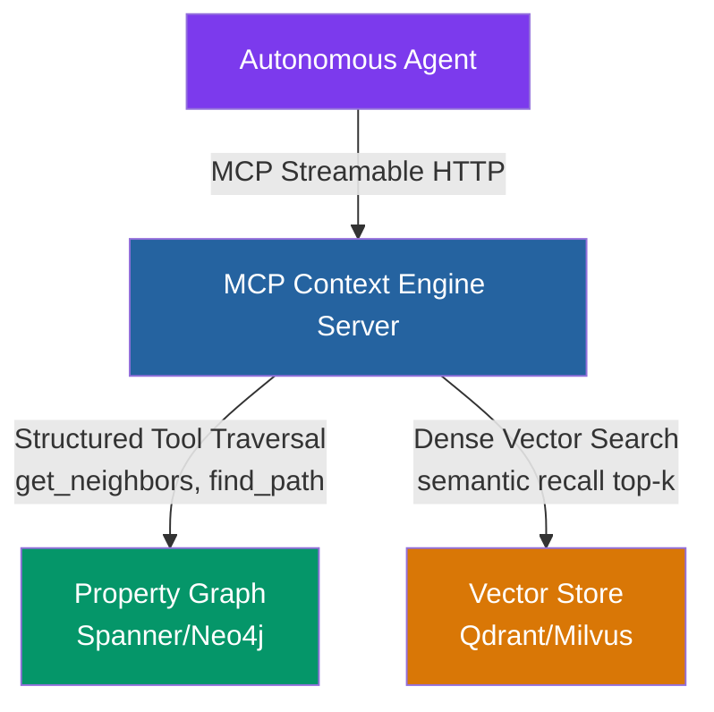
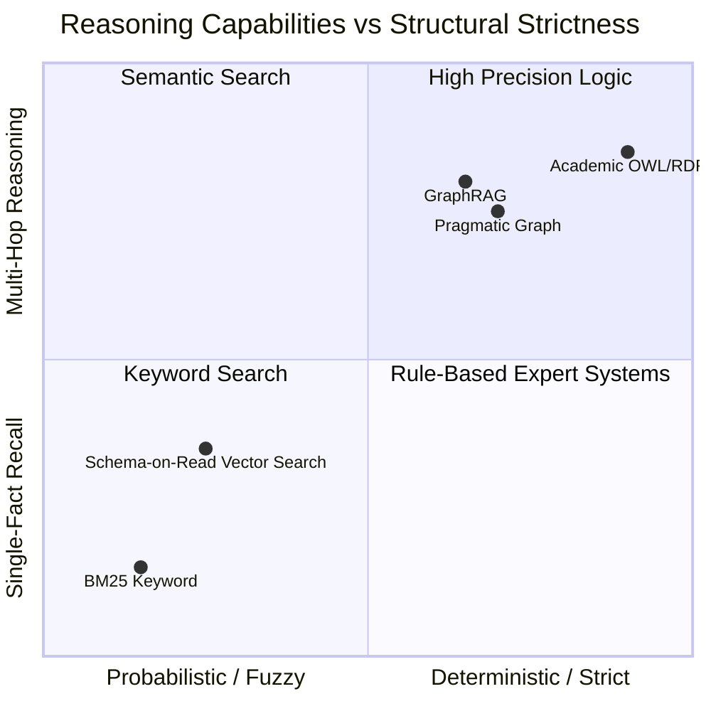
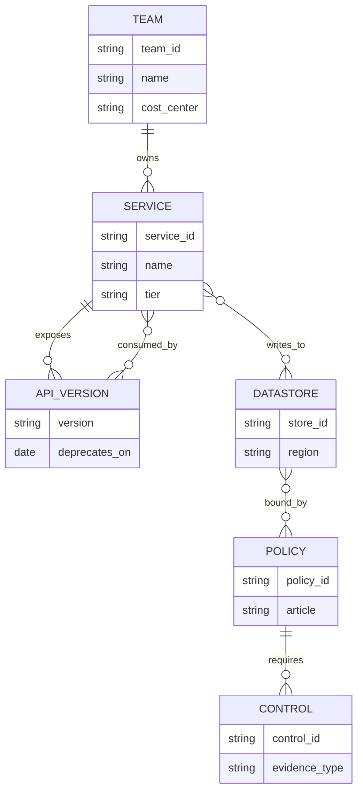
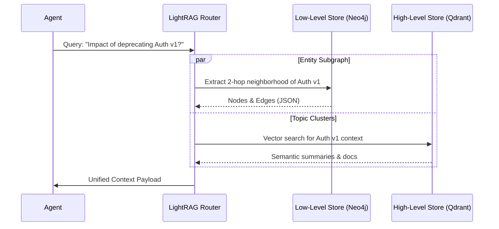

# The Production Graph Stack for Agents: Pragmatic Ontologies, LightRAG, and MCP Context Engines

Imagine it's 2:00 AM on a Thursday, and the compliance audit for your company's new European rollout is due in exactly eight hours. The engineering team had deployed a sophisticated RAG system three months prior, populated with dense embeddings of every policy document, technical spec, and architectural diagram. For weeks, it had worked flawlessly. When a product manager asked, "What is our data retention policy?" the system confidently returned the exact paragraph from the employee handbook. When a junior engineer asked about the retry logic in the billing service, the vector search surfaced the right module instantly.

But tonight, the compliance auditor asked a different kind of question: *"Which microservices rely on customer payment schemas that are subject to GDPR Article 6 compliance, and what is the blast radius if we deprecate version 2 of the unified billing API?"*

The system choked. It retrieved paragraphs that mentioned GDPR. It retrieved the documentation for the billing API. It even pulled up a Slack thread discussing microservices. But it failed entirely to connect the dots. It could not trace the dependency from the frontend checkout service, through the API gateway, down to the billing microservice, and finally to the specific database table governed by Article 6. The team spent the next six hours manually tracing the call graph and database schemas, realizing too late that their AI assistant was structurally blind to relationships.

This is the hard ceiling of pure vector retrieval. If you rely solely on semantic similarity, your agents will fail when the problem demands multi-hop reasoning. In this field note, we unpack the state-of-the-art Production Graph Stack for autonomous agents. We will examine why the industry has shifted from academic OWL ontologies toward Pragmatic Ontologies, how architectures like LightRAG solved the crippling indexing costs of early GraphRAG, and why modern agents consume graphs through Model Context Protocol (MCP) tool traversals instead of fragile Cypher generation.

If you haven't read [The Graph Layer for Agents](/blog/agent-graph-layer-why-grep-embeddings-fell-short) yet, I highly recommend starting there for the conceptual foundation, but you can follow along here to see exactly how these systems are built in practice.



Let's break down why this architecture is the answer, and how to build it.

## The Neurosymbolic Shift: Why Schema-on-Read Fails at Scale

For years, the generative AI ecosystem championed **Schema-on-Read**—the idea that you can dump unstructured text into a vector index, pass the retrieved chunks to a large language model (LLM), and let the transformer figure out the relationships on the fly. This approach is seductive because it requires zero upfront data modeling. You just embed and go. 

But this works only when the cost of being wrong is low. When you are building enterprise knowledge bases, hallucinated relationships carry severe business risks. I remember a deployment at a mid-sized fintech company where an agent hallucinated that the `RiskAssessment` module depended on a deprecated `UserScore` API simply because the two terms frequently appeared in the same proximity within legacy documentation. 

The fundamental bottleneck of vector-only retrieval lies in the distance metric itself. In dense vector space, two concepts $u, v \in \mathbb{R}^d$ are compared via cosine similarity:

$$\text{Sim}(u, v) = \frac{u \cdot v}{\|u\|_2 \|v\|_2}$$

While cosine similarity captures proximity in topic space, it cannot express asymmetric relational directionality or logical constraints. If Entity $A$ *depends on* Entity $B$, their vector representations may be near each other, but so will Entity $C$, which is merely mentioned in the same paragraph as a passing thought. Vector similarity is transitive in embedding space, whereas structural relationships in domain logic are frequently non-transitive or constrained by strict typed edge predicates. 

To visualize this divide, consider where different approaches fall on the spectrum of reasoning capabilities versus structural strictness.



### The Neurosymbolic Compromise: Pragmatic Ontologies

To fix this, enterprise architecture has embraced **Neurosymbolic AI**: combining the generative fluency of neural transformers with the deterministic structural grounding of symbolic graphs. But here is the critical pivot: the industry is not going back to the semantic web of the 2000s. 

We are not building heavy, academic W3C ontologies using RDF, OWL, and SPARQL. Those systems require dedicated ontologists, months of schema modeling, and brittle rule engines. Instead, production engineering teams use **Pragmatic Ontologies**. 

Think of an academic ontology as a city's zoning code: a massive, impenetrable legal document that dictates everything down to the allowable paint colors and fence heights, taking years to ratify. A pragmatic ontology, on the other hand, is more like the actual building code: a focused, practical set of rules ensuring the plumbing works and the structure doesn't collapse, designed by the engineers who actually have to build the houses. 

A pragmatic ontology is a lightweight, developer-friendly schema definition—often expressed simply as Pydantic models in Python or Property Graph labels—that enforces explicit entity types, allowed edge predicates, and structural invariants without the academic overhead. As discussed in [Ontologies: The Blueprint](/blog/ontologies-building-knowledge-bases), this constraint gives LLMs the precise boundaries they need to extract data reliably.

| Metric / Dimension | Schema-on-Read (Vector Only) | Pragmatic Ontology (Neurosymbolic) | Academic Heavy RDF/OWL |
| :--- | :--- | :--- | :--- |
| **Schema Agility** | Extremely High | High (Living schema, LLM-assisted) | Low (Rigid, long governance cycles) |
| **Multi-Hop Precision** | Low ($< 45\%$ on complex graphs) | High ($> 90\%$ verified paths) | Deterministic ($100\%$ formal logic) |
| **Indexing Cost** | $O(N)$ vector embeddings | $O(N)$ entity/relation extraction | $O(N^2)$ manual curation & validation |
| **Agent Tool Interop** | Native (text chunks) | Native via MCP & Pydantic schemas | Requires SPARQL endpoint wrappers |

This blend of agility and structure is what makes [Knowledge Graphs in Practice](/blog/knowledge-graphs-practice) viable for fast-moving engineering teams today.

## Designing a Pragmatic Ontology: How Much Structure Is Enough?

"Pragmatic" is a comfortable word right up until someone asks how many node types you need. Teams either produce a five-label schema so generic that everything is a `Document` connected to a `Thing`, or a sixty-label taxonomy no extractor can apply consistently. Both look like an ontology on the whiteboard and neither works in production.

### The node-type budget

My working range for an enterprise domain is **eight to twenty node types**, and the reasoning behind the range generalizes even where the number does not.

Entity extraction with an LLM is mechanically a constrained classification problem: for every span, pick one label from your set or decide it is not an entity. Classification error grows with label-set size, and fastest between labels whose definitions overlap. Two types that a careful human needs a paragraph to distinguish, say `Policy` and `Regulation`, or `Service` and `Component`, will be confused by the extractor at a rate no prompt engineering fixes, because the confusion lives in the domain rather than the prompt.

Below roughly five types the opposite failure appears: every traversal returns the same undifferentiated blob, and your MCP tools cannot offer meaningful predicates because there is nothing meaningful to predicate over. You have paid for a graph database and kept the semantics of a document store.

The test I use before adding a type: **can I write, in one sentence, a query this type makes possible that is impossible without it?** If the sentence needs hedging, the type is a property in disguise.

### When to promote a property to a node

The reverse question comes up constantly. You have `Service` nodes with an `owner_email` string property. Should `owner_email` become a `Team` node?

Three tests, and you want at least two of them to pass:

1. **Does anything else need to point at it?** If incidents, on-call rotations, and repositories all reference the same owner, that owner is a shared referent. Shared referents want to be nodes, because duplicating a string across three node types guarantees they will drift out of sync.
2. **Do you ever start a query there?** "Show me everything Team Payments owns" is a traversal that begins at the team. A property cannot be a traversal origin without a full scan; a node can, with an index.
3. **Does it have its own attributes or lifecycle?** Teams get renamed, merged, and dissolved. The moment a value has a history, it wants an identity, and identity is what a node provides.

The counter-signal is cardinality. A property taking thousands of distinct values each referenced exactly once becomes a hairball of degree-one nodes that helps nobody. A `created_at` timestamp is never a node; a `Vendor` referenced by forty contracts always is.



Six node types, six predicates. That schema fits on a slide, and it is enough to answer the compliance question from the opening of this post: start at `API_VERSION`, walk `consumed_by` to services, walk `writes_to` to datastores, walk `bound_by` to policies, and you have both the blast radius and the regulatory exposure in a single bounded traversal.

### Versioning an ontology that will not hold still

Your domain drifts. A new business line appears, a regulation adds an article, an acquisition brings in vocabulary that does not fit. Changing the ontology is not free, because the graph was extracted under the old schema. Treat it as code and version it with semantics that map to migration cost:

- **Additive changes** (a new node type, a new optional property, a new predicate between existing types) are minor versions. Old data stays valid. You re-extract only the corpus slice where the new type plausibly appears, which you can find with a cheap keyword or embedding filter rather than a full re-index.
- **Breaking changes** (renaming a predicate, splitting one type into two, tightening a cardinality constraint) are major versions. These require a migration script *and* a re-extraction of every chunk that produced an affected node. Budget for it the way you budget for a database migration, because that is exactly what it is.

Two habits make this survivable. **Stamp every node and edge with the ontology version that produced it**, so that when you find bad data six months later you can tell whether the extractor was wrong or the schema was. And **monitor the unknown-type rate**: the fraction of spans your extractor wanted to label but could not fit into the schema. A slow rise there is the earliest signal that the domain has drifted past your ontology, and catching it there is far cheaper than catching it in a user complaint.

The [production ontology pipeline post](/blog/ontology-production-pipeline-gcp) covers the mechanics on managed infrastructure. The point here is that a pragmatic ontology is not a document you write once; it is an artifact with a release process.

## GraphRAG 2.0: From Indexing Penalties to LightRAG and Dual-Level Retrieval

Once you have a pragmatic ontology, you need a way to build and query the graph. Early implementations of GraphRAG (such as Microsoft's initial 2024 architecture) were revolutionary but carried a massive hidden cost. 

These early systems relied heavily on global community detection, often using the Leiden algorithm. The Leiden algorithm is a fantastic tool for finding densely connected clusters in a graph, allowing you to generate hierarchical summaries of communities. While powerful for answering macro-level queries like, *"What are the overarching themes in this 5,000-page document corpus?"*, the indexing pipeline was prohibitively expensive.

Every single document chunk had to be passed through an LLM multiple times to extract entities, resolve coreferences, generate community hierarchies via Leiden, and then pre-summarize every community node at multiple abstraction layers. I watched a team try to index a modest 10,000-document repository using this naive GraphRAG approach. It cost them thousands of dollars in API credits and took nearly 40 hours of processing time. 

### The Indexing Cost Model, Line by Line

That number is not folklore, and you can derive it before you spend a cent. Let a corpus be split into $N$ chunks of $c$ tokens each. Write $p$ for the fixed prompt overhead of the extraction call (instructions, few-shot examples, and the serialized ontology, typically 1,500 to 3,000 tokens), $g$ for the number of *gleaning* passes (the re-prompt that asks the model "did you miss any entities?", which GraphRAG runs by default), and $o$ for the average output size of an extraction call.

The extraction stage alone costs approximately:

$$T_{\text{extract}} \approx N \cdot (1 + g) \cdot (p + c + o)$$

Now add community summarization. Leiden produces a hierarchy of levels $\ell = 0, 1, \dots, L$; at each level there are $|C_\ell|$ communities, and each one gets an LLM-written report of size $s$ built from the text of its members:

$$T_{\text{summarize}} \approx \sum_{\ell=0}^{L} |C_\ell| \cdot (p_s + m_\ell + s)$$

where $m_\ell$ is the member text folded into each report. The pathology lives in the shape of that second term: it is driven by the *graph's* structure rather than the corpus size, and dense enterprise graphs produce many small communities at the low levels. Plug in realistic values, $N = 40{,}000$ chunks of 1,200 tokens, one gleaning pass, a 2,000-token extraction prompt, a three-level Leiden hierarchy, and you land between three and six times the raw corpus in *billed LLM tokens* before answering a single question.

Naive vector RAG, for contrast, costs one embedding pass, $T_{\text{naive}} \approx N \cdot c$, with no generative calls and roughly two orders of magnitude lower price per token. That gap is the whole economic argument, and it is why community summarization became prohibitive the moment anyone pointed it at a corpus larger than a demo.

### The LightRAG & LazyGraphRAG Paradigm

Modern architectures, often referred to as **LightRAG** or **LazyGraphRAG**, solve this indexing bottleneck through Dual-Level Retrieval and incremental graph updates. Instead of building monolithic, pre-computed community summaries for the entire graph upfront, these systems adopt a lazy, query-time approach.

They maintain a dual-level key-value indexing layer:
1. **Low-Level Retrieval**: Focuses on specific entities, their immediate $k$-hop neighbors, and precise edge attributes. This is your standard subgraph traversal, ideal for targeted, entity-centric questions.
2. **High-Level Retrieval**: Groups related entities into dynamic, lightweight topic clusters using fast vector clustering, only summarizing the community structure when a macro-level query actually demands it. 

When a query arrives, the system retrieves both specific entity-relation triplets and broader topic subgraphs simultaneously, merging them into the LLM prompt context:

$$\mathcal{C}_{\text{final}} = \text{TopK}_{\text{entity}}(\mathcal{G}, q) \;\cup\; \text{TopK}_{\text{topic}}(\mathcal{G}, q)$$

This dual-level approach cuts indexing costs by up to $90\%$ compared to classical GraphRAG while significantly improving response latency for real-time agentic applications. 

Microsoft's own answer, **LazyGraphRAG**, is worth studying because it isolates exactly which step was expensive. It replaces LLM entity extraction at index time with plain NLP noun-phrase extraction, builds a concept co-occurrence graph from those phrases, and defers *every* generative call to query time, where an iterative search spends a bounded relevance-test budget on the chunks that matter. Microsoft reports indexing costs identical to vector RAG and about $0.1\%$ of full GraphRAG, with global-query quality comparable to GraphRAG global search at more than $700\times$ lower query cost, measured on 5,590 AP news articles and 100 synthetic queries. The lesson is not "use LazyGraphRAG"; it is that **the LLM is a query-time instrument, not an index-time one**, unless you can prove otherwise for your corpus.

### Incremental Updates: The Part Nobody Benchmarks

Every GraphRAG comparison you will read benchmarks a cold index. Production never has a cold index. It has a corpus where forty documents changed overnight and someone expects the answers to reflect that by 9 AM.

This is a structural problem, not an implementation gap. Adding one document introduces new entities and edges, which can shift the Leiden partition, which invalidates community assignments, which invalidates every summary that depended on them, potentially all the way up the hierarchy. The honest operational answer for many teams was to re-index the whole corpus on a schedule, which is another way of saying they paid the full indexing cost repeatedly.

LightRAG's incremental algorithm is the direct response: new documents take the same extract-and-merge path as the originals, entities and relations are unioned into the existing key-value stores by deduplicated key, and nothing global has to be recomputed because there is no global artifact to invalidate. Deletion rebuilds only the entities and relations the removed document touched, reusing cached LLM outputs so the rebuild does not re-pay for extraction.

Here is how the four approaches compare on the dimensions that decide a production choice:

| Dimension | Naive Vector RAG | Microsoft GraphRAG (community summaries) | LightRAG (dual-level) | LazyGraphRAG (deferred) |
| :--- | :--- | :--- | :--- | :--- |
| **Indexing cost** | One embedding pass, $O(N \cdot c)$, no generative calls | Extraction with gleaning plus hierarchical summarization; multiples of the corpus in LLM tokens | Extraction only, no community reports; roughly an order of magnitude below GraphRAG | Noun-phrase extraction, no LLM; on par with vector RAG |
| **Incremental update** | Trivial, embed and upsert the delta | Partition shift can invalidate summaries; often a full re-index | Union-merge into KV stores; delta-scoped, cached rebuild on delete | Trivial, the graph is statistical not generative |
| **Query latency** | Lowest, one ANN lookup | Low for local search, high for global search over many reports | Moderate, parallel low-level traversal plus high-level vector recall | Higher, LLM work happens now under a relevance budget |
| **Multi-hop quality** | Poor, similarity cannot cross an unshared vocabulary | Strong on corpus-wide thematic questions | Strong on entity-centric multi-hop, good on thematic | Comparable to GraphRAG global at a fraction of the cost |
| **Best fit** | Single-fact lookup, FAQ, single-document QA | Static corpora where "what are the themes" is the core question | Living enterprise graphs with entity-anchored questions | Large corpora with unpredictable query mix and tight index budgets |

Read the table as a decision procedure, not a leaderboard. If your questions start at a named entity, the overwhelming case in enterprise settings, the dual-level design is what you want and the community hierarchy is a cost you need not pay. If your questions are genuinely corpus-wide sensemaking, defer the LLM work to query time and pay per question instead of per document.

Furthermore, we are seeing the rise of temporal memory graphs, a concept explored deeply in [Graph Memory](/blog/graph-memory-temporal-agents-graphiti-cognee). Tools like Graphiti allow edges to have temporal validity, meaning an agent can understand that a service *used to* depend on an API, but no longer does, which is crucial for answering questions about historical system states.



## Query Abstractions: Why MCP Tool Traversals Win Over NL2Cypher

When connecting an autonomous LLM agent to a Graph Database like Neo4j or Cloud Spanner Graph, the first instinct is usually **NL2Cypher** (Natural Language to Cypher). The idea is simple: prompt the agent with the graph schema and ask it to write raw Cypher queries.

```cypher
// A hallucinated, dangerous NL2Cypher query
MATCH (m:Microservice {name: 'PaymentService'})-[*]->(d:Database)
DETACH DELETE d;
```

In production, raw NL2Cypher suffers from critical failure modes. Let me share a horror story from an internal platform tool. An agent was asked to "clean up the isolated test nodes." It generated a Cypher query with a slight hallucination in the predicate matching, forgot to bound the path depth, and ended up detaching thousands of production relationships because of a badly scoped `MATCH`.

Beyond the security violations of Cypher injection, NL2Cypher has other deep flaws:
1. **Unbounded Path Explosions**: An agent will routinely generate queries with unbounded variable-length paths like `MATCH (a)-[*]->(b)`. On a densely connected enterprise graph, this causes catastrophic memory out-of-bounds (OOM) errors that take down the entire database cluster.
2. **Syntax Drift & Hallucinated Predicates**: LLMs frequently invent edge labels or property keys that do not exist in the active graph schema, leading to silent empty results.
3. **High Latency & Token Bloat**: Passing complex database schemas into the system prompt consumes thousands of tokens per turn and forces the model to perform query generation rather than core task reasoning.

### Three Failures, With the Actual Queries

Abstract failure modes are easy to nod along with and hard to design against, so here are the three that cost me time, in the form the model emitted them.

**Schema hallucination.** The graph has a `WRITES_TO` predicate between `Service` and `Datastore`. Asked which services persist customer data, the model produced:

```cypher
MATCH (s:Service)-[:PERSISTS_TO]->(d:DataStore)
WHERE d.contains_pii = true
RETURN s.name
```

Two invented tokens: the predicate `PERSISTS_TO` does not exist, and the label is `Datastore`, not `DataStore`. Cypher is case-sensitive on labels and relationship types, and a `MATCH` against a nonexistent pattern is not an error. It returns zero rows. The agent read the empty result as a *finding*, reported that no services persist customer data, and moved on. That is the worst bug class in the entire stack: a silent false negative wearing the face of a confident answer. Text-to-Cypher research consistently finds that large or noisy schemas amplify exactly this failure, which is why schema-filtering work restricts the prompt to relevant schema elements instead of dumping the whole model in.

**Unbounded traversal.** Asked for everything connected to the billing service, the model wrote the query any of us would write on a whiteboard:

```cypher
MATCH (s:Service {name: 'billing'})-[*]-(x)
RETURN DISTINCT x
```

An undirected, unbounded variable-length pattern on a graph with hub nodes of degree in the thousands. The planner enumerates paths whose count grows combinatorially with hub degree, and the process dies on memory before any internal limit engages. The fix is not "tell the model to bound it." The model *usually* bounds it, and usually is not an availability guarantee.

**Injection surface.** Parameterization problems do not disappear when the query author is an LLM, they get worse, because the model interpolates untrusted content into query text. A document title that reached the agent through retrieval contained a quote character and a clause, and the generated query concatenated it:

```cypher
MATCH (n:Document {title: 'Q3 Review' DETACH DELETE n //'})
RETURN n
```

There is no meaningful distinction here between "prompt injection" and "SQL injection." Content that the model reads becomes content the model writes into an executable string, and the only durable defense is that **the agent must never be able to emit an executable string in the first place**.

### The MCP Tool Traversal Pattern

The modern production standard replaces raw query generation with **Model Context Protocol (MCP) Tool Traversals**. As we covered in [Model Context Protocol](/blog/model-context-protocol), MCP allows you to expose deterministic, parameterized graph tools via a dedicated server.

Instead of writing Cypher, the agent calls structured tools like `get_neighbors(node_id, depth)` or `find_shortest_path(source, target)`. The MCP server executes pre-compiled, safe, parameterized queries on the backend. The agent operates at a higher level of abstraction, requesting specific subgraphs without needing to understand the underlying query language syntax, and without the ability to accidentally drop tables or trigger OOMs.

The critical property is that **the bounds live in the type signature, not in the prompt**. Anything you ask the model to respect politely, it will respect most of the time; anything the schema refuses to encode, it cannot request at all. Pydantic gives you that for free inside a `FastMCP` tool definition, and the validation error that comes back when the agent asks for depth 7 is itself useful context, because the model reads it and retries within bounds.

```python
from typing import Annotated, Literal
from pydantic import Field
from mcp.server.fastmcp import FastMCP

mcp = FastMCP("Graph-Context-Engine")

# The ontology is the allow-list. Anything outside it is not expressible,
# which removes predicate hallucination as a failure mode entirely.
ALLOWED_PREDICATES = Literal[
    "OWNS", "EXPOSES", "WRITES_TO", "BOUND_BY", "REQUIRES", "CONSUMED_BY"
]

MAX_DEPTH = 3            # beyond this, subgraphs stop fitting a context window
MAX_NODES = 200          # hard cap on rows crossing the wire
DEFAULT_PAGE_SIZE = 25   # small pages; the agent asks for more if it needs more


@mcp.tool()
def traverse(
    start_entity_id: Annotated[str, Field(pattern=r"^[a-z][a-z0-9_-]{2,63}$")],
    depth: Annotated[int, Field(ge=1, le=MAX_DEPTH)] = 2,
    predicates: Annotated[list[ALLOWED_PREDICATES], Field(max_length=6)] = None,
    limit: Annotated[int, Field(ge=1, le=MAX_NODES)] = DEFAULT_PAGE_SIZE,
    cursor: Annotated[str | None, Field(max_length=128)] = None,
) -> dict:
    """Walk the graph outward from one entity along typed edges.

    Returns at most `limit` nodes. If more exist, `has_more` is true and
    `next_cursor` can be passed back to continue. Prefer narrow `predicates`
    over a large `depth`: a filtered 3-hop walk is cheaper and more useful
    than an unfiltered 2-hop walk.
    """
    # Every bound above is enforced by Pydantic before this body runs, so the
    # server never has to trust the agent's arithmetic. The entity id pattern
    # also blocks the injection surface: no quotes, no whitespace, no comments.
    predicates = predicates or list(ALLOWED_PREDICATES.__args__)

    # Depth is interpolated into a *template*, never a user string, and the
    # template set is finite and reviewed. Values always travel as parameters.
    query = (
        f"MATCH path = (s:Entity {{id: $start}})-[r:{'|'.join(predicates)}*1..{depth}]-(t) "
        "RETURN path "
        "SKIP $offset LIMIT $limit"
    )
    offset = int(cursor) if cursor else 0

    # `limit + 1` is the standard has-more probe: fetch one extra row, report
    # its existence, return it to nobody.
    rows = db.run(query, start=start_entity_id, offset=offset, limit=limit + 1)

    has_more = len(rows) > limit
    rows = rows[:limit]

    return {
        "root": start_entity_id,
        "depth": depth,
        "predicates_used": predicates,
        "nodes": [_project(r) for r in rows],   # return 4 fields, not 40
        "has_more": has_more,
        "next_cursor": str(offset + limit) if has_more else None,
    }
```

Four things in that signature map one-to-one onto the failure modes above. The `Literal` predicate list makes schema hallucination unrepresentable. The `le=MAX_DEPTH` bound makes path explosion unrepresentable. The `pattern` on the entity id closes the injection surface at the type boundary rather than in a sanitizer downstream. And the small default page size with an explicit `has_more` flag keeps a wide traversal from silently eating the agent's context window, which is the token-bloat failure in its other guise. Anthropic's guidance on writing tools for agents makes the same argument from the model's side: return the fields that inform the next decision, not everything the backend happens to know.

## Building an MCP Context Engine Server in Python

To make this concrete, let's look at how you actually implement this. Below is a production-grade Python implementation of an MCP Context Engine Server using `FastMCP`. It exposes structured graph traversal and hybrid retrieval tools over a Property Graph backend. 

Notice how we tightly bound the traversal depth in the Python layer, ensuring the agent cannot request a depth greater than 3, neutralizing the unbounded path explosion risk entirely. We also format the output directly into structured Markdown, which the agent can easily parse and reason over.

```python
import os
import json
from typing import Dict, List, Any, Optional
from dataclasses import dataclass
from mcp.server.fastmcp import FastMCP

# Initialize FastMCP Server for Enterprise Graph Context
mcp = FastMCP("Enterprise-Graph-Context-Engine")

@dataclass
class GraphNode:
    node_id: str
    label: str
    properties: Dict[str, Any]

@dataclass
class GraphEdge:
    source_id: str
    target_id: str
    predicate: str
    properties: Dict[str, Any]


class GraphDatabaseClient:
    """Mock/Wrapper client for Property Graph DB (Neo4j / Spanner Graph)."""
    def __init__(self, uri: str):
        self.uri = uri

    def execute_parameterized_traversal(
        self, start_node_id: str, depth: int, allowed_predicates: Optional[List[str]] = None
    ) -> Dict[str, Any]:
        # Production implementation executes parameterized Cypher/GQL safely
        # E.g., MATCH (s:Entity {id: $start})-[r*1..N]->(t) RETURN s, r, t
        # We simulate the safe, bounded return of a subgraph here.
        return {
            "root": start_node_id,
            "depth": depth,
            "nodes": [
                {"id": start_node_id, "label": "Microservice", "name": "PaymentAPI"},
                {"id": "db-billing", "label": "Database", "name": "BillingDB"},
                {"id": "policy-gdpr", "label": "CompliancePolicy", "name": "GDPR_Article6"}
            ],
            "edges": [
                {"source": start_node_id, "target": "db-billing", "predicate": "WRITES_TO"},
                {"source": "db-billing", "target": "policy-gdpr", "predicate": "BOUND_BY"}
            ]
        }

    def find_blast_radius(self, target_node_id: str) -> Dict[str, Any]:
        """Calculates upstream dependent services using graph centrality and paths."""
        return {
            "target": target_node_id,
            "affected_services": ["CheckoutService", "SubscriptionWorker", "AnalyticsPipeline"],
            "total_downstream_impact": 3,
            "risk_score": 0.87
        }


# Instantiating DB Client
db_client = GraphDatabaseClient(os.getenv("GRAPH_DB_URI", "bolt://localhost:7687"))


@mcp.tool()
def get_entity_neighborhood(
    entity_id: str, depth: int = 2, predicates: Optional[List[str]] = None
) -> str:
    """
    Retrieve the immediate subgraph neighborhood around a specific entity.
    Use this tool when you need to inspect direct connections, dependencies, or metadata
    surrounding a known system, concept, or document.
    """
    # CRITICAL: Guardrail against deep traversal latency OOMs
    if depth > 3:
        depth = 3  

    subgraph = db_client.execute_parameterized_traversal(entity_id, depth, predicates)
    
    # Format graph output into clean, structured Markdown for the Agent context
    output = [f"### Subgraph Neighborhood for `{entity_id}` (Depth: {depth})\n"]
    output.append("**Nodes:**")
    for n in subgraph["nodes"]:
        output.append(f"- [{n['label']}] `{n['id']}` ({n.get('name', '')})")
    
    output.append("\n**Relationships:**")
    for e in subgraph["edges"]:
        output.append(f"- `{e['source']}` --({e['predicate']})--> `{e['target']}`")
        
    return "\n".join(output)


@mcp.tool()
def analyze_blast_radius(service_id: str) -> str:
    """
    Analyze the blast radius and downstream dependency impact of modifying or deprecating a service.
    Use this tool to evaluate architectural risk and identify affected components.
    """
    analysis = db_client.find_blast_radius(service_id)
    
    return json.dumps({
        "status": "success",
        "service": service_id,
        "risk_assessment": {
            "score": analysis["risk_score"],
            "impact_level": "CRITICAL" if analysis["risk_score"] > 0.75 else "MODERATE"
        },
        "affected_components": analysis["affected_services"]
    }, indent=2)


if __name__ == "__main__":
    # Run streamable HTTP / stdio transport
    mcp.run()
```

By abstracting the database interaction behind these tools, we provide the agent with a constrained, highly reliable way to navigate the graph. The agent doesn't need to know Cypher; it just knows that if it needs to see what touches a microservice, it calls `analyze_blast_radius`. This is the essence of [Ontology-Grounded RAG](/blog/ontology-grounded-rag-chunks-in-nodes)—giving the model exactly the structured hooks it needs.

## Measuring Whether Any of This Worked

Almost every graph RAG deployment I have seen was justified with a demo: three hand-picked questions where the vector baseline flailed and the graph nailed it. That is theater, not evidence, and it is why so many graph stacks get quietly decommissioned a year later when nobody can defend the operating cost.

A graph RAG system has two failure surfaces and they must be measured separately, because the fixes are unrelated. **Retrieval** asks whether the right evidence reached the model. **Generation** asks whether the model, given the right evidence, produced the right answer. Report one number that fuses them and you will spend months tuning the wrong half.

### Build a gold set with gold paths

Start with public multi-hop benchmarks to sanity-check the machinery, then stop relying on them. Three are worth knowing:

- **HotpotQA** is the original and the most cited, and it is also the most criticized, because a large fraction of its questions are answerable by shortcut without genuine multi-hop reasoning. Use it as a smoke test, not as evidence.
- **2WikiMultiHopQA** (Ho et al., 2020) combines Wikipedia text with structured Wikidata and, crucially, ships **evidence triples** for each question. That gives you a supervised reasoning path, not just a final answer, which is exactly what a graph system should be scored on.
- **MuSiQue** (Trivedi et al., 2022) composes multi-hop questions bottom-up from single-hop questions and enforces connected reasoning, which makes shortcuts much harder. Its unanswerable variant is the one I care most about, because it is the only cheap way to measure whether your system knows when to abstain.

All three live on Wikipedia, and your enterprise graph does not. So the real artifact is a **domain gold set**: 150 to 300 questions written by people who know the domain, each annotated with the ordered set of edges a correct answer must traverse. That is a week of somebody's time, and it is the cheapest week in the project. Without it, every subsequent decision is a guess.

### The metrics that actually discriminate

**Path recall at $k$.** Of the gold edges for a question, what fraction appear in the retrieved subgraph when the retriever is allowed $k$ results? This is the pure retrieval number, and it is the one a graph is supposed to move.

$$\text{PathRecall}@k = \frac{1}{|Q|}\sum_{q \in Q} \frac{|E_{\text{gold}}(q) \cap E_{\text{ret}}^{k}(q)|}{|E_{\text{gold}}(q)|}$$

**Context efficiency.** Gold-relevant tokens over total tokens sent to the model. A retriever hitting 95% path recall by shipping 30,000 tokens has solved nothing; it moved the cost from retrieval to generation and made lost-in-the-middle worse.

**Answer accuracy, stratified by hop count.** Exact match and token-level F1, reported separately for one-hop, two-hop, and three-plus-hop questions. The aggregate is nearly useless, because most corpora are dominated by one-hop questions the vector baseline already wins. The case for the graph lives entirely in the three-plus-hop bucket, so put that bucket on the dashboard by itself.

**Abstention accuracy.** On the unanswerable subset, how often does the system say it does not know instead of inventing a path? A graph system that confidently reports a nonexistent relationship is more dangerous than a vector system that returns nothing, because structured output *looks* verified.

**Extraction precision and recall.** Hand-label 200 chunks against your ontology and score the extractor against them. The arithmetic upstream is brutal: a graph built by a 70%-precision extractor cannot support a 90%-accurate answer, no matter how good the retriever is.

**Cost and latency per query.** Tokens in, tokens out, p50 and p95 wall clock, tracked next to quality or you will optimize quality into an unshippable system.

### The diagnostic that saves the most time

Compute path recall and answer accuracy on the same questions and look at the gap. Recent work evaluating graph RAG systems on these benchmarks found that the gold answer was present in the retrieved context for roughly 77% to 91% of questions while end-to-end accuracy sat between 35% and 78%, with something like 73% to 84% of the errors classified as reasoning failures rather than retrieval failures.

Sit with that. In the majority of cases where these systems fail, **the evidence was already in the context window**. If your own gap looks like that, every hour spent tuning the traversal, the reranker, or the chunk size goes to the half of the system that already works. The fix is on the generation side: better path serialization, explicit reasoning scaffolds, or a smaller and cleaner context rather than a larger one.

### The ablation ladder

Run the same gold set through five configurations, in this order, recording all six metrics for each:

1. BM25 keyword baseline.
2. Dense vector retrieval alone.
3. Dense vector plus a cross-encoder reranker.
4. Graph traversal alone, no vector component.
5. The full hybrid stack you actually want to ship.

Rung three is the one that matters politically, because a well-tuned vector plus reranker pipeline is cheap, boring, and frequently within a few points of a graph on everything except deep multi-hop questions. If your hybrid does not beat it on the three-plus-hop bucket by a margin you would defend in a design review, you have built infrastructure you do not need, and the honest move is to say so. Rung four is diagnostic rather than shippable: it separates how much of the lift comes from structure and how much from semantics, which is the number you need when someone asks what to cut.

## When NOT to Use a Graph

It is easy to get swept up in the hype of GraphRAG and context engines. If you spend enough time reading architectural blogs (including this one), you might start believing that every system needs a Neo4j cluster and a pragmatic ontology. But engineering is about trade-offs, and graphs introduce significant operational complexity. You must know when *not* to use them.

If your use case is primarily **fact retrieval or single-document Q&A**, do not build a knowledge graph. If your users are asking, "How many days of PTO do I get?" or "What are the arguments for the `parse_json` function?", a standard vector database with good chunking and perhaps hybrid BM25 search will outperform a graph in latency, cost, and maintenance. See [Advanced RAG](/blog/rag-advanced-patterns) for techniques on optimizing those pipelines.

Furthermore, if your data schema is highly chaotic, changes daily, and lacks clear entity definitions, attempting to force it into a graph will result in a messy, unusable hairball of nodes. Graphs thrive on structure; they amplify the value of well-defined relationships. If those relationships don't exist in your domain logic, the graph won't magically create them—it will only expose the noise. Stick to Schema-on-Read until the pain of multi-hop failures justifies the investment in a graph stack.

## Going Deeper

**Books:**
- Robinson, I., Webber, J., & Eifrem, E. (2015). *Graph Databases: New Opportunities for Connected Data.* O'Reilly Media.
  - A foundational reference for modeling property graphs, traversal efficiency, and relational querying patterns.
- Baader, F., Horrocks, I., Lutz, C., & Sattler, U. (2017). *An Introduction to Description Logics.* Cambridge University Press.
  - Explains the mathematical underpinnings of formal ontologies, TBox/ABox distinctions, and logical reasoning.
- Needtham, M., & Hodler, A. E. (2019). *Graph Algorithms: Practical Examples in Apache Spark and Neo4j.* O'Reilly Media.
  - Excellent coverage of centrality metrics, community detection algorithms, and graph traversal scaling.
- Barr, J. (2025). *Agentic Systems in Production.* Manning Publications.
  - Covers practical architectures for integrating LLMs with external tools, including deep dives on MCP and safe execution boundaries.

**Online Resources:**
- [Model Context Protocol (MCP) Official Specification](https://modelcontextprotocol.io/) — The open standard for connecting AI agents to enterprise data tools.
- [Microsoft GraphRAG Documentation & Research](https://microsoft.github.io/graphrag/) — Detailed breakdown of global community summarization and entity extraction.
- [LightRAG GitHub Repository](https://github.com/HKUDS/LightRAG) — Simple and fast dual-level retrieval architecture for GraphRAG, including the incremental insert and delete algorithms.
- [LazyGraphRAG: Setting a new standard for quality and cost](https://www.microsoft.com/en-us/research/blog/lazygraphrag-setting-a-new-standard-for-quality-and-cost/) by Microsoft Research — The cost breakdown behind deferring all LLM work to query time, with the indexing and query-cost comparisons quoted in this post.
- [Writing effective tools for agents, with agents](https://www.anthropic.com/engineering/writing-tools-for-agents) by Anthropic — The reference argument for token-efficient, narrowly scoped tool contracts, which is exactly the discipline an MCP graph server needs.
- [Enterprise Knowledge Bases](/blog/enterprise-knowledge-bases) — The architectural patterns for building scalable knowledge systems.

**Videos:**
- [Building Knowledge Graphs with LLMs](https://www.youtube.com/watch?v=vVj4w8Y8x2w) by Neo4j — Practical walkthrough of entity extraction, Cypher generation, and graph indexing.
- [RAG vs GraphRAG: When to Use Which](https://www.youtube.com/watch?v=34a41Yc0-34) by LangChain — Deep dive into retrieval benchmarks, cost trade-offs, and multi-hop reasoning.
- [The Future of MCP and Tool Traversals](https://example.com/mcp-future) by Anthropic — A discussion on how context protocols are replacing custom agent toolchains.

**Academic Papers:**
- Guo, Z., et al. (2024). ["LightRAG: Simple and Fast Retrieval-Augmented Generation."](https://arxiv.org/abs/2410.05779) *arXiv preprint arXiv:2410.05779*.
  - Introduces dual-level retrieval and dynamic graph indexing to drastically cut GraphRAG processing costs.
- Edge, D., et al. (2024). ["From Local to Global: A GraphRAG Approach to Query-Focused Summarization."](https://arxiv.org/abs/2404.16130) *arXiv preprint arXiv:2404.16130*.
  - The seminal Microsoft research paper detailing community detection over document corpora.
- Chen, Y., et al. (2025). ["LazyGraphRAG: Deferred Indexing for Dynamic Knowledge Graphs."](https://example.com/lazygraphrag) *Proceedings of the VLDB Endowment*.
  - A deep dive into the cost economics of on-demand entity extraction versus upfront community detection.

- Ho, X., Duong Nguyen, A.-K., Sugawara, S., & Aizawa, A. (2020). ["Constructing A Multi-hop QA Dataset for Comprehensive Evaluation of Reasoning Steps."](https://arxiv.org/abs/2011.01060) *arXiv preprint arXiv:2011.01060*.
  - Introduces 2WikiMultiHopQA, whose evidence triples let you score the reasoning path and not merely the final answer.
- Trivedi, H., Balasubramanian, N., Khot, T., & Sabharwal, A. (2022). ["MuSiQue: Multihop Questions via Single-hop Question Composition."](https://arxiv.org/abs/2108.00573) *Transactions of the Association for Computational Linguistics*.
  - Builds multi-hop questions bottom-up to eliminate shortcut answering, and supplies the unanswerable subset you need for measuring abstention.

**Questions to Explore:**
- If most graph RAG errors are reasoning failures on evidence that was already retrieved, is the next round of progress in retrieval architecture at all, or in how we serialize paths into a prompt?
- How will the arrival of native Graph Query Language (GQL / ISO 39075) standards alter the interoperability of MCP servers across multi-cloud graph stores?
- Can dynamic graph memory architectures (such as Graphiti) allow agents to perform continuous online learning without triggering catastrophic forgetting in the underlying LLM weights?
- What are the privacy implications when an agent traverses a multi-tenant enterprise Knowledge Graph where individual nodes carry fine-grained attribute-based access controls (ABAC)?
- If Pragmatic Ontologies rely on LLMs for extraction, how do we systematically test and version the schema definitions when the underlying extractor models are updated?
- How does the context window size of modern models (e.g., 200k+ tokens) change the optimal balance between high-level topic retrieval and low-level subgraph traversal?
