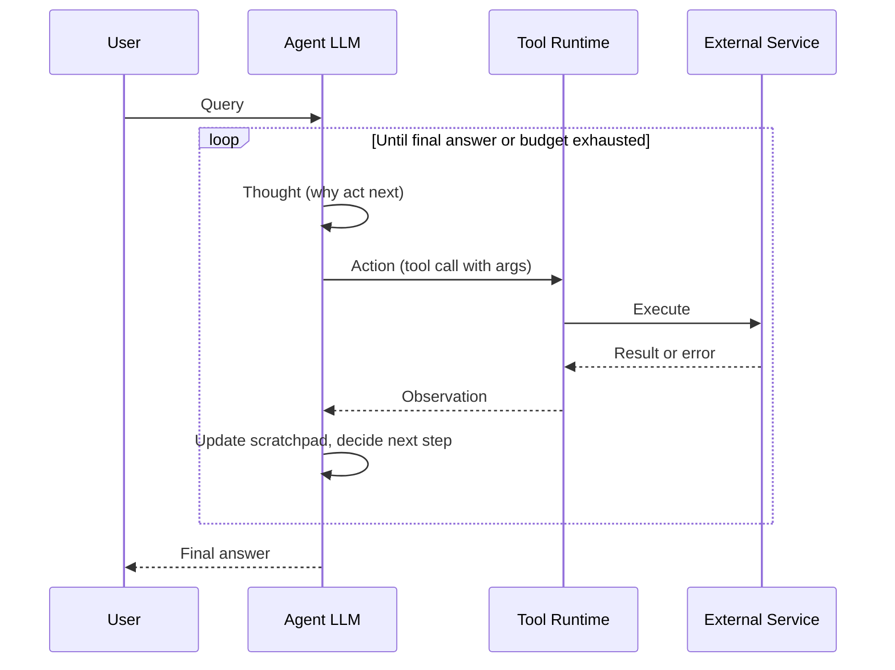
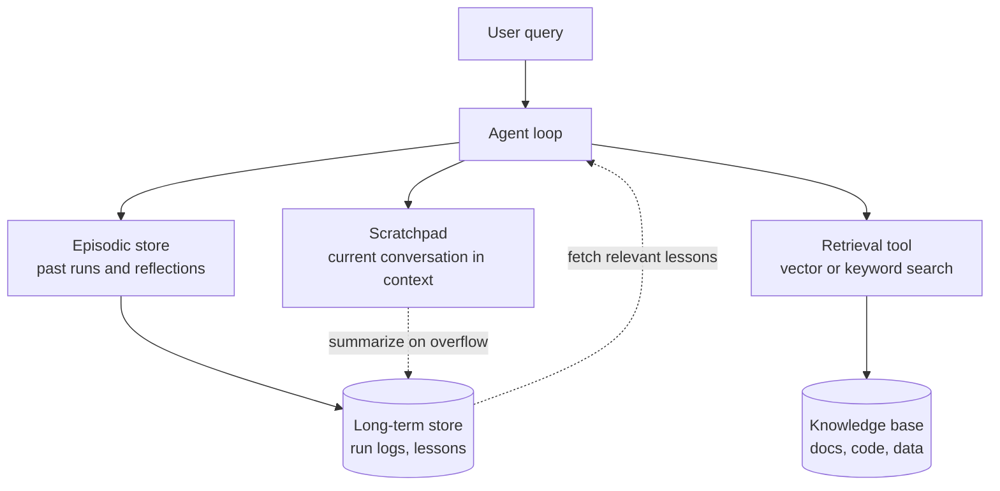
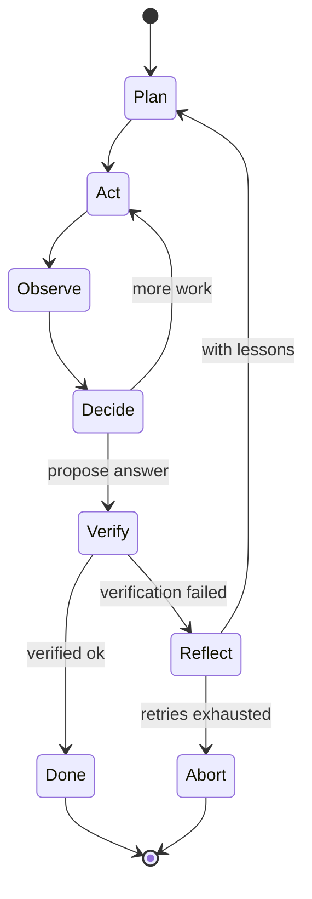
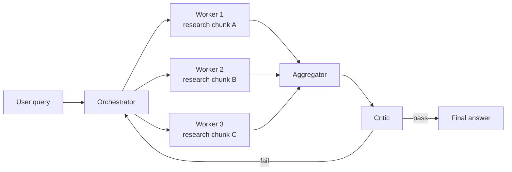
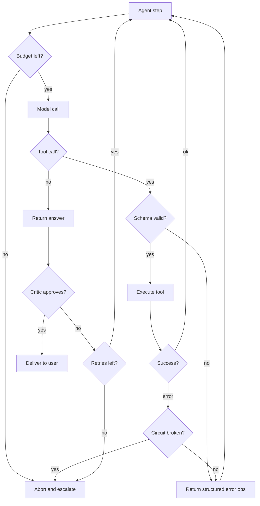

# Production LLM Agents: Patterns That Survive Contact With Users

A few months ago, an agent I was babysitting in production decided that the best way to respond to a user asking about their quarterly revenue was to hallucinate a tool called `get_financial_report` that had never existed in its schema, call it three times in a row with slightly different arguments, and — each time the tool call failed because the tool wasn't real — feed the error message back into its own context, reason about why the tool might be misbehaving, and try again. By the time our cost alert fired, the agent had burned through about forty dollars of inference in nine minutes, produced a transcript that was longer than the US Constitution, and had still not answered the question.

That is what a production agent failure looks like. Not some philosophical alignment problem. Not a self-aware system deciding to disobey. Just a very confused statistical text predictor stuck in a loop that, if you removed the LLM, would be a trivial bug in any ordinary program: an unbounded retry with no exit condition.

By early 2026, the field has moved past the point where "look, it called a function" is impressive. The interesting question is no longer *can you build an agent* — you can, in about fifty lines of Python. The interesting question is whether the thing you built survives contact with real users, real latency, real cost constraints, and real edge cases. This post is about what actually breaks when agents hit production, and the patterns that make them less likely to break.

I will deliberately avoid the words "autonomous," "AGI," and "reasoning" in their marketing senses. Those words do real damage to how people design agents. The framing that has worked best for me, and for the teams I have watched succeed, is narrow and unflattering: *an agent is a loop around an LLM that can take actions in the world and observe their results.* Everything interesting follows from trying to make that loop terminate, stay cheap, and produce correct behavior.

---

## What "Agent" Actually Means In Production

Before the patterns, a definition. The literature uses "agent" for everything from AutoGPT-style autonomous task solvers to simple tool-using chatbots. In production the useful distinction is not autonomy — it is *how much control flow is delegated to the model*.

On one end you have pipelines: a fixed sequence of LLM calls wired together by hand. The model fills in text; humans decided the flow. These are not agents. They are LLM-powered programs. They are extremely reliable and should be your default whenever the task fits.

On the other end you have open-ended agents: the model decides what step to take next, when to stop, which tools to call, and in what order. This is where all the failure modes live. The cost of flexibility is that your control flow is now also a statistical text prediction.

In the middle — and this is where most production systems actually end up — you have *bounded agents*: a tight loop where the model picks from a small menu of pre-defined actions, there is a hard limit on iterations, and there is a very explicit termination condition. These are the systems that work. Claude Code, for all its apparent freedom, is structurally a bounded agent: its action space is small (read, edit, run bash, finish), it stops when the task is done or when the user interrupts, and there are guardrails around everything.

Anthropic's engineering team has been consistent on this point. The post "Building effective agents" from late 2024 — still the best piece of writing on the topic — argues that most production LLM systems should not be agents at all; they should be workflows. Their working definition is sharp: workflows are systems where LLMs and tools are orchestrated through predefined code paths; agents are systems where LLMs dynamically direct their own processes and tool usage. You should reach for the second only when the task is genuinely hard enough to justify the extra variance.

The reason this matters is that the patterns I am about to describe are not all useful at the same time. Some of them — retries, validation, tracing — are just good engineering hygiene and you want them everywhere. Others — reflection loops, multi-agent debate, planner/executor splits — buy you flexibility at the cost of tokens, latency, and failure modes. The game is knowing when each is worth it.

---

## The ReAct Loop, And Why The Planner/Executor Split Helps

The foundational pattern is still ReAct, from Yao et al.'s 2022 paper *ReAct: Synergizing Reasoning and Acting in Language Models*. The idea is simple enough to write on a napkin: at each step, the model produces a *thought* (why it wants to do something), then an *action* (the tool call), then it receives an *observation* (the tool result), and it decides what to do next. Think, act, observe, repeat.



The magic of ReAct is not the interleaving — it is that the model sees its own prior thoughts, which keeps it from forgetting the plan. Without an explicit reasoning trace between tool calls, the model will happily call the same tool three times with the same arguments because each tool call is, from its point of view, the first decision of a new forward pass. The thought track is what gives the loop memory of intent across iterations.

This is also where the first production failure hides. The ReAct paper's loop is unbounded. In production it must not be. Every loop needs a budget — iterations, tokens, wall time, dollars, or (better) all four. An agent that does not terminate is not a feature, it is a bill.

### Why Split Planner From Executor

A subtle improvement over vanilla ReAct is to split the loop into two roles: a *planner* that decides what to do next, and an *executor* that carries the action out. In the simplest case the planner is the LLM and the executor is your code that actually runs the tool and feeds back the observation. But you can also split at a higher level: have one LLM call generate a plan (a list of steps), then a second smaller model or deterministic dispatcher execute the steps one by one, falling back to the planner only when execution fails.

The reason this split helps is cost and stability. Planning is expensive — it is where you need your biggest, smartest model. Execution is often mechanical — it is where you want your cheapest, fastest model, or no model at all. An agent where a frontier model is reinvoked at every micro-step, just to say "now call the `search` tool with that query I already decided on three steps ago," is wasting orders of magnitude of compute.

```python
# Minimal planner/executor split using the Anthropic SDK.
# The planner produces a structured plan; the executor runs it step by step
# and only calls the planner again if something deviates from the plan.

import anthropic
import json

client = anthropic.Anthropic()

PLANNER_MODEL = "claude-opus-4-6"      # smart, expensive, used sparingly
EXECUTOR_MODEL = "claude-haiku-4-6"    # cheap, fast, used for routine calls

def plan(task: str, available_tools: list[str]) -> list[dict]:
    """Ask the planner LLM for a structured plan."""
    resp = client.messages.create(
        model=PLANNER_MODEL,
        max_tokens=1024,
        system=(
            "You are a planner. Given a task and a list of tools, "
            "output a JSON array of steps. Each step has 'tool' and 'args'. "
            "Do not include any text outside the JSON."
        ),
        messages=[{
            "role": "user",
            "content": f"Task: {task}\nTools: {available_tools}",
        }],
    )
    return json.loads(resp.content[0].text)

def execute(plan: list[dict], tool_registry: dict) -> list[dict]:
    """Run the plan step by step. Bail out to replanning on error."""
    results = []
    for step in plan:
        tool = tool_registry.get(step["tool"])
        if tool is None:
            raise RuntimeError(f"Hallucinated tool: {step['tool']!r}")
        try:
            result = tool(**step["args"])
            results.append({"step": step, "ok": True, "result": result})
        except Exception as e:
            results.append({"step": step, "ok": False, "error": str(e)})
            break
    return results
```

The planner/executor split makes two otherwise-hidden costs visible: how often the planner gets called, and how often execution deviates from the plan. Both are numbers you want on a dashboard. In practice I have seen the first drop by ten to twenty times when this split is done well. The second is a leading indicator of plan quality: if your executor bails out more than about one time in five, your planner needs a better prompt or a better model.

---

## Tool-Use Protocols: Schemas, Validation, Error Feedback

An agent is only as useful as the tools it can call, and tool use is the place where protocols matter most. The short version is: use the tool-use protocol your provider ships, put strict JSON schemas on everything, validate every call before executing, and feed errors back as structured observations — not as exceptions.

Both Anthropic and OpenAI now ship first-class tool-use APIs. They are similar enough that you can mostly reason about them as one thing: the LLM emits a structured tool-call block that names a tool and supplies arguments as JSON matching a schema you provided; you run the tool; you return the result in a tool-result message that the model sees on its next turn. The older pattern of telling the model "reply with a JSON blob on a line by itself" was a hack for an earlier era — do not build new agents on it.

### Schemas Are Your First Line Of Defense

A good tool definition does three things. It describes what the tool does in prose the LLM can read. It fully specifies the arguments as JSON Schema with strict typing and required fields. And it documents the shape of the result, so the model does not have to guess how to parse it.

```python
# Strict tool schema for an Anthropic tool-use call.
SEARCH_TOOL = {
    "name": "search_documents",
    "description": (
        "Full-text search over the internal knowledge base. "
        "Returns up to `k` document snippets, ordered by relevance."
    ),
    "input_schema": {
        "type": "object",
        "properties": {
            "query": {
                "type": "string",
                "description": "The search query as a natural-language string.",
                "minLength": 1,
                "maxLength": 512,
            },
            "k": {
                "type": "integer",
                "description": "How many results to return.",
                "minimum": 1,
                "maximum": 10,
                "default": 5,
            },
        },
        "required": ["query"],
        "additionalProperties": False,
    },
}
```

Notice `additionalProperties: false`. That one line has saved me more debugging hours than any dashboard. It makes the schema a closed world: if the model invents a parameter that is not in the schema, the call fails loud at the validation step instead of being silently passed to your tool. It is also worth noting that Anthropic's recent advanced tool use update added a `strict: true` flag at the tool level that enforces this behavior more aggressively — use it if you are on the latest SDK.

### Validate Before You Execute

The model will sometimes emit arguments that pass schema validation but are still nonsense — a `user_id` that is a random string instead of a UUID, a `date_range` that ends before it begins, a `price` that is negative. Your defense is a validation layer in your own code, between the tool-call block and the actual function that takes the action.

```python
from jsonschema import Draft202012Validator, ValidationError

_validator = Draft202012Validator(SEARCH_TOOL["input_schema"])

def validated_call(tool_name: str, raw_args: dict) -> dict:
    try:
        _validator.validate(raw_args)
    except ValidationError as e:
        # IMPORTANT: return an error observation, do not raise.
        return {
            "is_error": True,
            "content": (
                f"Invalid arguments for {tool_name}: {e.message}. "
                f"Path: {list(e.absolute_path)}. "
                f"Expected schema: {SEARCH_TOOL['input_schema']}."
            ),
        }
    # Add any business rules here. For example:
    if raw_args.get("k", 5) > 10:
        return {"is_error": True, "content": "k must be <= 10."}
    return do_search(**raw_args)
```

Why a structured error observation instead of an exception? Because when you raise, you either kill the agent loop or you catch it somewhere outside the model's context. Neither helps the model fix its mistake. A tool-result with `is_error: true` tells the model: *you tried, it failed, here is why, try again.* In my experience agents recover gracefully from well-worded errors about nine times out of ten. Anthropic's tool-use documentation explicitly recommends this pattern, and for good reason.

### The MCP Era

Worth flagging briefly: the Model Context Protocol (MCP), which Anthropic released in late 2024, has become the de facto standard for how agents talk to tools by 2026. Instead of every framework inventing its own tool-registration format, you expose tools through an MCP server, and any MCP-aware client — Claude Code, Cursor, LangGraph, CrewAI — can use them. If you are building tools that multiple agents will share, MCP is the right shape. If you are building a single agent with tools that only it will call, the provider-native tool-use API is fine and lighter weight.

---

## Memory: Scratchpad, Retrieval, Episodic

The word "memory" in the agent literature is overloaded to the point of being unhelpful. There are at least three distinct things people mean by it, and they solve different problems.

**Short-term scratchpad memory** is the conversation history the model sees on each forward pass. This is just the context window. There is nothing magical about it. It works as long as the task fits. The only interesting thing here is budgeting: as the transcript grows, you will eventually have to summarize, truncate, or offload older turns.

**Long-term retrieval memory** is a database of relevant facts that the agent can fetch into context on demand. This is where RAG lives. The agent decides, based on the current question, that it needs to look something up, calls a retrieval tool, and gets back snippets which enter its scratchpad. The agent does not remember the data directly; it remembers that the data is retrievable.

**Episodic memory** is the record of what the agent has done in the past — prior tasks, prior failures, prior user preferences — that is itself indexed and retrievable. It is the agent version of a learning journal. Reflection patterns often write into episodic memory so that the agent can look up lessons from last week's mistakes.



A production agent usually needs all three, but the boundaries between them should be explicit. Do not try to build a single "memory" system that handles everything. In particular, do not put "episodic lessons" in the same vector store as "domain knowledge" — they have different retrieval dynamics, different update rates, and different failure modes. The quickest way to ruin RAG quality is to pollute it with transcripts from previous agent runs.

### Context Window Death

While we are on memory, a word about the failure mode I opened with. As of early 2026, frontier models ship with 200K to 1M token context windows, and people use that as an excuse to stop thinking about memory hygiene. Do not. Two things go wrong as transcripts grow.

First, *attention dilution*: models get measurably worse at finding relevant information as the context lengthens. The "lost in the middle" phenomenon from Liu et al. (2023) has been replicated many times since and still holds for frontier models at long contexts, even as absolute performance improves. A fact in a 200-token prompt is used; the same fact in a 150K-token transcript is maybe used.

Second, *cost*: you pay for every token on every call. An agent that accumulates 400 turns of scratchpad and is invoked a hundred times during a task is not going to 200K tokens once — it is going to 200K tokens every turn, forever. That is a cost graph you do not want to discover at the end of the month.

The defense is aggressive summarization. Every time the scratchpad crosses some threshold — I use 60% of the window as a soft limit — have the agent (or a smaller cheaper model) summarize the oldest N turns into a compact note and replace them. Keep the last few turns verbatim, because the model relies on recency for continuity. The prompt caching features Anthropic rolled out in 2024 and kept improving through 2026 make this pattern almost free if you structure it correctly, because the stable prefix of your transcript gets cached automatically.

---

## Self-Correction: Reflection, Critic, Retry Budgets

One of the more interesting results of the last three years of agent research is that models can often catch their own mistakes *if you ask them to look again*. This is the Reflexion pattern, from Shinn et al.'s 2023 paper *Reflexion: Language Agents with Verbal Reinforcement Learning*. The idea is to add an explicit self-critique step to the loop: after the agent finishes (or fails) a task, it writes a short natural-language reflection — what went wrong, what to try differently — and that reflection is fed back as part of its context on the next attempt.

Reflexion is not reinforcement learning in the classical sense — no weights are updated. It is verbal RL: the "reward signal" is prose, and the "policy update" is adding that prose to the next prompt. It works surprisingly well on tasks where the model can verify its own answer (coding benchmarks, where you can run the tests; math problems, where you can check the arithmetic). It works much less well on open-ended tasks where the model cannot tell whether it succeeded.



In production, the useful distillation of Reflexion is a *critic* step: a second LLM call, ideally with a different prompt and often with a different model, whose only job is to look at the agent's proposed final answer and say whether it is good enough. The critic is cheap compared to the whole loop, and it catches a surprising fraction of dumb errors before they reach the user.

Critics come in two flavors. A *hard* critic returns a boolean: good or not good. Use this when you can, because booleans are easy to act on. A *soft* critic returns a score or a rubric. Use this when your rubric is fuzzy (helpfulness, tone, safety) and you want to route borderline cases somewhere — usually to retry, sometimes to human review.

Whatever shape the critic takes, wrap the whole thing in a retry budget. I use the rule *three attempts, hard stop*. After three self-corrections, either the agent gets it right or the task is escalated. Agents left to self-correct indefinitely will find creative ways to spend all your tokens without converging.

---

## Multi-Agent: When It's Worth It, When It's Overkill

Multi-agent systems are the shiny thing of the last year, and I want to be fairly blunt about them: most production "multi-agent" systems should be single-agent systems with better prompts, and you can tell the difference by asking whether the agents ever disagree with each other in a way that matters.

That said, there are real patterns where splitting work across multiple LLM calls with distinct roles buys you something. The three that earn their keep in production:

**Orchestrator/worker**. One planner LLM breaks a task into subtasks, farms them out to worker LLMs (possibly in parallel), and aggregates the results. This pattern is useful when subtasks are genuinely independent — different documents to summarize, different code files to review, different sub-questions to research. Parallelism is the point, not cognitive diversity.

**Critic/actor**. One LLM proposes, another critiques. The two-role version of reflection. Useful when you want the critic to use a different prompt or a different model than the actor, which often works better than self-critique.

**Debate**. Two or more LLMs argue opposite positions, and a judge LLM decides. There are papers showing this improves accuracy on factual questions, but the cost is brutal and the gains in most production settings are marginal. I have used this once, for a legal contract review pipeline where the cost was justified and accuracy mattered more than latency. Usually it is overkill.



By 2026 two frameworks have pulled ahead for multi-agent orchestration: LangGraph, which hit 1.x in late 2025 and leans into explicit graph state machines with checkpointing and time-travel, and CrewAI, which reached production maturity around the same time and leans into role-based abstractions where you describe agents in natural language with goals and tools. The rough heuristic I use:

| Situation | Reach for |
|---|---|
| Complex branching, human-in-the-loop, audit requirements | LangGraph |
| Role-based teams, fast iteration, less boilerplate | CrewAI |
| Single-agent tool use with structured tools | Provider-native SDK (no framework) |
| Tools shared across multiple agents or clients | MCP server plus any MCP-aware client |

The honest warning about both: multi-agent systems compound cost and latency multiplicatively, and their failure modes are harder to debug because an error in worker 2 can show up as a weird answer from the aggregator three steps later. If you cannot clearly articulate why a single agent with a good tool set cannot do your task, you probably do not need multiple agents.

---

## Failure Modes That Will Eat You Alive

The patterns above are the happy path. The rest of this post is about what breaks. Five failure modes account for most of the production incidents I have seen with agents:

**1. Unbounded loops.** The agent gets into a state where every iteration looks slightly different from the last, so none of your de-duplication logic fires, and it runs until your budget or your patience runs out. The agent is not stuck — it is making progress, just extremely slow progress, in a direction no one cares about. The only durable defense is hard budgets: max iterations, max tokens, max wall clock, max cost, and all four enforced at the outer loop. Per-iteration budgets are not enough because a clever agent can always split a big bad idea into smaller bad ideas.

**2. Hallucinated tools.** The opening story. The model produces a tool call for a tool that does not exist, or calls a real tool with an argument schema from a different version, or passes the result of one tool as the argument of another in a way that type-checks but makes no sense. Defenses: strict schemas with `additionalProperties: false`, `strict: true` at the tool level, validation before execution, and structured error observations that describe the valid schema so the model can correct itself. Also: keep your tool list short. Piling up forty tools is a hallucination magnet.

**3. Context window death.** Already covered, but worth restating: unbounded scratchpad growth plus lost-in-the-middle plus compounding cost. Defenses: summarize aggressively, cache aggressively, and put an alarm on scratchpad length so you see it coming before the bill does.

**4. Cost blowup.** A single misbehaving agent can eat the monthly budget for an entire product in hours. Defenses: per-user and per-request token budgets, enforced at a gateway, plus billing alarms that fire at levels well below "we need to call the CFO." Anomaly detection on cost per task is especially useful — if average cost per successful task drifts upward, something has changed in your prompts or your tool surface.

**5. Authentication rot and schema drift.** The most under-discussed class of production bug. OAuth tokens expire, API keys rotate, downstream services change response shapes, and the agent — which has no way to know any of this happened — keeps trying the now-stale call and then reasoning elaborately about why it is failing. Defenses: treat tool failures as observations the model sees, but also treat repeated failures of the same tool with the same class of error as a circuit-breaker signal that escalates to monitoring and, if necessary, disables the tool until a human looks.



One meta-observation: the failure modes above are all failures of *state*, not failures of *intelligence*. The model is not stupid; it just does not know what iteration it is on, what tools it has already tried, or how much money it has spent. The patterns that work in production are the ones that make this state visible and bounded at every step.

---

## Observability And Evals

If you take one thing from this post, take this: *you will not debug a production agent with print statements*. The nondeterminism alone makes traditional debugging useless — the same input produces different traces on different runs, and the interesting bugs are the ones where one run in a hundred goes sideways.

Agent observability has three components, all necessary:

**Tracing**. Every LLM call, every tool invocation, every intermediate decision, captured with its full input, output, and latency, structured as a tree rooted at the user request. LangSmith, Langfuse, Arize, and Braintrust all do this well as of 2026; OpenTelemetry has a semi-standard spec for LLM spans now, which is the right long-term bet. The key point is that you need to see *the whole trace* — not a single call, but the entire decision path from user query to final answer, so you can see why the agent did what it did.

**Eval harnesses**. An offline test suite, run on every prompt change, that scores the agent against known-good inputs. The eval set should include both happy paths (the task you built the agent to do) and adversarial paths (the failure modes from the previous section). Evals are where prompt engineering stops being voodoo and starts being engineering: you change a prompt, you run the evals, you see the numbers move, you commit.

**Production monitoring**. The online version of evals. Token usage per agent and per user. Cost per successful task, with anomaly detection. Tool success rate, with alerts when it drifts. Critic pass rate. Percentage of runs that hit the iteration budget (this one should be near zero; if it climbs, your agent is getting stuck more often). Number of escalations to human review.

```python
# Minimal OpenTelemetry-flavored tracing wrapper for an agent loop.
# In production you would hand these spans off to Langfuse, LangSmith, or any
# OTEL-compatible backend. The point is that every decision is a span.

from contextlib import contextmanager
import time, uuid, json

class Tracer:
    def __init__(self, sink):
        self.sink = sink  # function that accepts a finished span dict

    @contextmanager
    def span(self, name: str, attrs: dict | None = None):
        span = {
            "id": str(uuid.uuid4()),
            "name": name,
            "start": time.time(),
            "attrs": attrs or {},
            "events": [],
        }
        try:
            yield span
        except Exception as e:
            span["error"] = repr(e)
            raise
        finally:
            span["end"] = time.time()
            span["duration_ms"] = (span["end"] - span["start"]) * 1000
            self.sink(span)

def run_traced_agent(client, task, tools, tracer, max_iters=10):
    with tracer.span("agent.run", {"task": task}) as root:
        history = [{"role": "user", "content": task}]
        for i in range(max_iters):
            with tracer.span(f"iter.{i}", {"history_len": len(history)}):
                with tracer.span("model.call"):
                    resp = client.messages.create(
                        model="claude-opus-4-6",
                        max_tokens=2048,
                        tools=tools,
                        messages=history,
                    )
                if resp.stop_reason == "end_turn":
                    root["attrs"]["result"] = "ok"
                    return resp
                for block in resp.content:
                    if block.type == "tool_use":
                        with tracer.span("tool.call", {
                            "tool": block.name,
                            "args": json.dumps(block.input)[:500],
                        }) as s:
                            result = dispatch_tool(block.name, block.input)
                            s["attrs"]["ok"] = not result.get("is_error")
                        history.append({"role": "assistant", "content": resp.content})
                        history.append({"role": "user", "content": [{
                            "type": "tool_result",
                            "tool_use_id": block.id,
                            "content": json.dumps(result),
                            "is_error": bool(result.get("is_error")),
                        }]})
        root["attrs"]["result"] = "iteration_budget_exhausted"
        return None
```

The specific tools do not matter much as of 2026 — they are mostly converging on the same feature set. What matters is that your traces are *complete* (every call captured, no sampling), *structured* (attributes you can query), and *navigable* (you can jump from a failed run in production to its full trace in under a minute). If your on-call engineer cannot answer "what did the agent do during incident X" in five minutes, your observability is not production-ready, no matter how pretty the dashboard is.

---

## A Minimal Production-Quality Agent

Time to put it all together. The following is a stripped-down but honestly production-minded agent using the Anthropic SDK's tool-use API. It has hard budgets, validated tool calls, error feedback, a critic, a trace sink, and no surprises.

```python
"""
A minimal production-minded agent.

- Bounded iterations, tokens, and wall clock.
- Strict tool schemas with validation.
- Error observations instead of raised exceptions.
- A critic step before returning to the user.
- Every step traced through a pluggable sink.
"""
from __future__ import annotations
import json
import time
from dataclasses import dataclass, field
from typing import Callable

import anthropic
from jsonschema import Draft202012Validator, ValidationError

client = anthropic.Anthropic()


@dataclass
class Budget:
    max_iterations: int = 10
    max_tokens: int = 40_000
    max_seconds: float = 60.0
    tokens_used: int = 0
    started: float = field(default_factory=time.time)

    def tick(self, tokens: int) -> None:
        self.tokens_used += tokens

    def exhausted(self, iteration: int) -> str | None:
        if iteration >= self.max_iterations:
            return "iteration_budget"
        if self.tokens_used >= self.max_tokens:
            return "token_budget"
        if time.time() - self.started >= self.max_seconds:
            return "wallclock_budget"
        return None


@dataclass
class Tool:
    name: str
    description: str
    input_schema: dict
    run: Callable[..., dict]
    _validator: Draft202012Validator = field(init=False)

    def __post_init__(self):
        self._validator = Draft202012Validator(self.input_schema)

    def invoke(self, args: dict) -> dict:
        try:
            self._validator.validate(args)
        except ValidationError as e:
            return {
                "is_error": True,
                "content": f"Schema error: {e.message}. Path: {list(e.absolute_path)}.",
            }
        try:
            return {"is_error": False, "content": self.run(**args)}
        except Exception as e:
            return {"is_error": True, "content": f"Tool runtime error: {e!r}"}


def to_anthropic_tools(tools: list[Tool]) -> list[dict]:
    return [
        {"name": t.name, "description": t.description, "input_schema": t.input_schema}
        for t in tools
    ]


def run_agent(
    task: str,
    tools: list[Tool],
    tracer,
    budget: Budget | None = None,
    model_planner: str = "claude-opus-4-6",
    model_critic: str = "claude-haiku-4-6",
) -> dict:
    budget = budget or Budget()
    tool_map = {t.name: t for t in tools}
    tool_defs = to_anthropic_tools(tools)
    messages = [{"role": "user", "content": task}]

    with tracer.span("agent.run", {"task": task}) as root:
        for i in range(budget.max_iterations + 1):
            over = budget.exhausted(i)
            if over:
                root["attrs"]["result"] = f"abort:{over}"
                return {"ok": False, "reason": over, "messages": messages}

            with tracer.span(f"iter.{i}"):
                resp = client.messages.create(
                    model=model_planner,
                    max_tokens=2048,
                    tools=tool_defs,
                    messages=messages,
                )
                budget.tick(resp.usage.input_tokens + resp.usage.output_tokens)

            if resp.stop_reason == "end_turn":
                proposed = "".join(
                    b.text for b in resp.content if getattr(b, "type", "") == "text"
                )
                verdict = run_critic(task, proposed, tracer, model_critic)
                if verdict["ok"]:
                    root["attrs"]["result"] = "ok"
                    return {"ok": True, "answer": proposed, "verdict": verdict}
                messages.append({"role": "assistant", "content": resp.content})
                messages.append({
                    "role": "user",
                    "content": (
                        f"Critic rejected the answer: {verdict['reason']}. "
                        f"Please try again with that feedback in mind."
                    ),
                })
                continue

            # Otherwise: execute any tool calls and loop.
            messages.append({"role": "assistant", "content": resp.content})
            tool_results = []
            for block in resp.content:
                if getattr(block, "type", "") != "tool_use":
                    continue
                tool = tool_map.get(block.name)
                if tool is None:
                    result = {
                        "is_error": True,
                        "content": (
                            f"Tool {block.name!r} does not exist. "
                            f"Available tools: {sorted(tool_map)}."
                        ),
                    }
                else:
                    with tracer.span("tool.call", {"tool": block.name}):
                        result = tool.invoke(block.input)
                tool_results.append({
                    "type": "tool_result",
                    "tool_use_id": block.id,
                    "content": json.dumps(result["content"])
                        if isinstance(result["content"], (dict, list))
                        else str(result["content"]),
                    "is_error": result["is_error"],
                })
            messages.append({"role": "user", "content": tool_results})

        root["attrs"]["result"] = "abort:iteration_budget"
        return {"ok": False, "reason": "iteration_budget", "messages": messages}


def run_critic(task: str, proposed: str, tracer, model: str) -> dict:
    with tracer.span("critic.call"):
        resp = client.messages.create(
            model=model,
            max_tokens=256,
            system=(
                "You are a critic. Given a task and a proposed answer, "
                "respond with strict JSON: {\"ok\": bool, \"reason\": str}. "
                "Set ok=true only if the answer is directly, completely, "
                "and correctly responsive to the task."
            ),
            messages=[{
                "role": "user",
                "content": f"Task:\n{task}\n\nProposed answer:\n{proposed}",
            }],
        )
    text = "".join(b.text for b in resp.content if getattr(b, "type", "") == "text")
    try:
        return json.loads(text)
    except json.JSONDecodeError:
        return {"ok": False, "reason": f"critic returned non-JSON: {text[:200]}"}
```

This is not production-ready in the sense that you could drop it into a customer-facing product tomorrow. It is production-*minded* — the shapes are right, the failure modes are named, the bounds are explicit, and extending it to your real use case means replacing pieces rather than rewriting. In particular you will want to add: prompt caching headers on the planner call, an episodic memory store that the agent can query as a tool, a real OTEL backend instead of the inline tracer, and circuit breakers on tools that fail repeatedly.

The thing to notice is how little of this code is about "intelligence" and how much is about control flow, validation, and bookkeeping. That ratio is the right one. An agent framework that hides all the bookkeeping is easy to start with and painful to operate. An agent loop where the bookkeeping is visible is the opposite, and by the time you are one month in to running the thing, you will prefer the latter.

---

## Prerequisites, Gotchas, And Testing

A few things I wish someone had told me before I put my first agent in front of real users.

**Prerequisites.** You need: a model provider account with tool use enabled (Anthropic, OpenAI, Google, Mistral all work), Python 3.11+ (the typing helps), `jsonschema` for validation, and a tracing backend even if it is just a JSON file to start. You do not need an agent framework on day one — start with the provider SDK directly so you understand the loop, then add LangGraph or CrewAI if the patterns get complex.

**Gotchas.** The two that get everybody at least once: (1) forgetting that `tool_result` messages must reference the exact `tool_use_id` from the assistant's preceding message, which means you cannot just concatenate prior turns willy-nilly — the structure of the transcript matters and the API will reject malformed sequences with an inscrutable error. (2) Assuming the model will never produce a tool call for a tool you did not define. It will, especially when you describe tools inline in the system prompt. Keep tools in the `tools` parameter, not in prose, and even then, validate.

**Testing.** Agent evals are the single highest-leverage thing you can build. Start with a dozen canonical tasks the agent should handle, plus a dozen adversarial ones it should refuse or escalate. Run them on every prompt change. The eval suite does not need to be sophisticated — a scored pass/fail list is fine to begin with, and you can graduate to LLM-as-judge scoring later. The important thing is that it runs in CI and that a prompt change which drops the score below a threshold blocks the merge. An untested agent is a loaded weapon pointing at your cost center.

---

## Going Deeper

**Books:**
- Chip Huyen. (2024). *AI Engineering: Building Applications with Foundation Models.* O'Reilly.
  - The single most useful book on building real systems with LLMs. Chapters on evaluation, agent design, and cost management are directly relevant to everything above.
- Varun Mayya and Srinivas Narayanan. (2025). *Designing LLM Applications: Patterns for Reliable Systems.* Manning.
  - A pattern-language book that treats agents as one composition style among several. Good for the "should I even use an agent" question.
- Jay Alammar and Maarten Grootendorst. (2024). *Hands-On Large Language Models.* O'Reilly.
  - Strong chapters on prompting, tool use, and retrieval. Less focused on agents specifically but the plumbing is the same plumbing.
- Valentina Alto. (2024). *Building LLM Powered Applications.* Packt.
  - More introductory, but the chapters on error handling and orchestration touch many of the production concerns here.

**Online Resources:**
- [Anthropic: Building Effective Agents](https://www.anthropic.com/research/building-effective-agents) — The foundational engineering-team piece arguing that most "agent" use cases should actually be workflows, with worked examples of the distinction.
- [Anthropic: Advanced Tool Use](https://www.anthropic.com/engineering/advanced-tool-use) — Covers `strict: true`, programmatic tool calling, and tool search; essential reading if you are on Claude 4.x.
- [Anthropic Tool Use Documentation](https://platform.claude.com/docs/en/agents-and-tools/tool-use/overview) — The reference. Read the error-handling section in particular.
- [OpenAI Function Calling Guide](https://platform.openai.com/docs/guides/function-calling) — The other canonical tool-use protocol; worth reading even if you are on Anthropic because the patterns are the same.
- [LangGraph Documentation](https://langchain-ai.github.io/langgraph/) — If you decide to use a framework, LangGraph's graph model is the most production-honest of the bunch.
- [Model Context Protocol Specification](https://modelcontextprotocol.io/) — The tool-interop layer that has become the de facto standard.

**Videos:**
- [Building Production-Ready Agents (Anthropic)](https://www.youtube.com/watch?v=Jwy9TDA2YBM) by Anthropic — A talk from late 2024 walking through the patterns that made it into the engineering blog post above.
- [What Even Is An Agent](https://www.youtube.com/watch?v=pBBe1pk8hf4) by Simon Willison — A skeptic's guide, clearheaded about what agents are and are not, with worked examples.

**Academic Papers:**
- Yao, S., Zhao, J., Yu, D., Du, N., Shafran, I., Narasimhan, K., and Cao, Y. (2022). ["ReAct: Synergizing Reasoning and Acting in Language Models."](https://arxiv.org/abs/2210.03629) *ICLR 2023.*
  - The paper that defined the think-act-observe loop. Every production agent still uses a descendant of this structure.
- Shinn, N., Cassano, F., Berman, E., Gopinath, A., Narasimhan, K., and Yao, S. (2023). ["Reflexion: Language Agents with Verbal Reinforcement Learning."](https://arxiv.org/abs/2303.11366) *NeurIPS 2023.*
  - Introduces the self-reflection pattern and shows measurable gains on verifiable tasks. Also clearly articulates where it does and does not help.
- Liu, N. F., Lin, K., Hewitt, J., Paranjape, A., Bevilacqua, M., Petroni, F., and Liang, P. (2023). ["Lost in the Middle: How Language Models Use Long Contexts."](https://arxiv.org/abs/2307.03172) *TACL 2024.*
  - Empirical evidence for the attention-dilution failure mode. Still relevant at long contexts in 2026.
- Park, J. S., O'Brien, J. C., Cai, C. J., Morris, M. R., Liang, P., and Bernstein, M. S. (2023). ["Generative Agents: Interactive Simulacra of Human Behavior."](https://arxiv.org/abs/2304.03442) *UIST 2023.*
  - The influential early paper on episodic memory for agents. Read it for the memory architecture, not for the Sims-like demo.

**Questions to Explore:**
- If the ReAct loop is essentially an open-ended search over tool-call sequences, what would a principled termination criterion look like, beyond "the model said `end_turn`"? Is there a Bayesian stopping rule that a production agent should implement?
- Multi-agent debate improves accuracy on some tasks but multiplies cost. What is the break-even point in practice, and is there a way to train a single model to internalize debate-like reasoning so the gains come for free?
- Episodic memory introduces a new failure mode: the agent learns the wrong lesson from a prior run and applies it where it does not fit. How do you design a memory system that forgets, and what does "forgetting" even mean for a verbal RL agent?
- The MCP protocol standardizes tool interfaces across clients. Does this push toward a world where tools are a shared marketplace (like npm for agent capabilities), and if so, what does the equivalent of supply-chain security look like?
- Critics catch many obvious errors but cannot detect problems the actor model cannot see either (shared blind spots). What does a heterogeneous critic architecture look like — different models, different prompts, different training data — and is the cost worth it?
