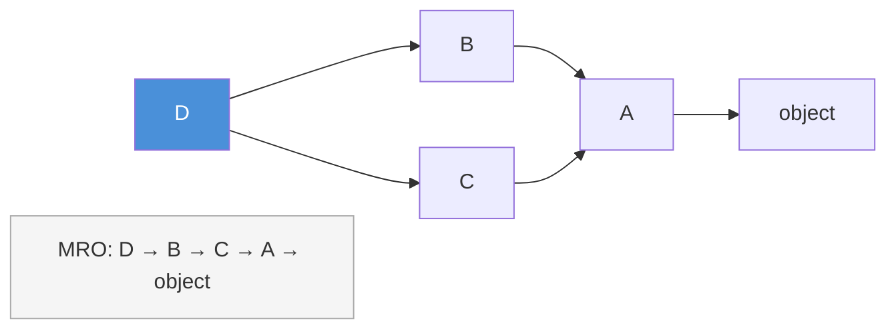
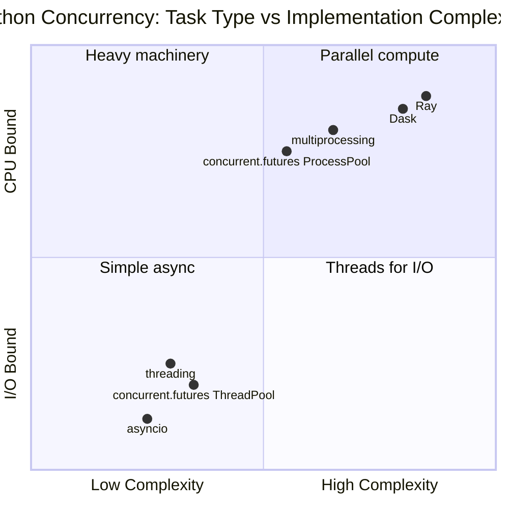
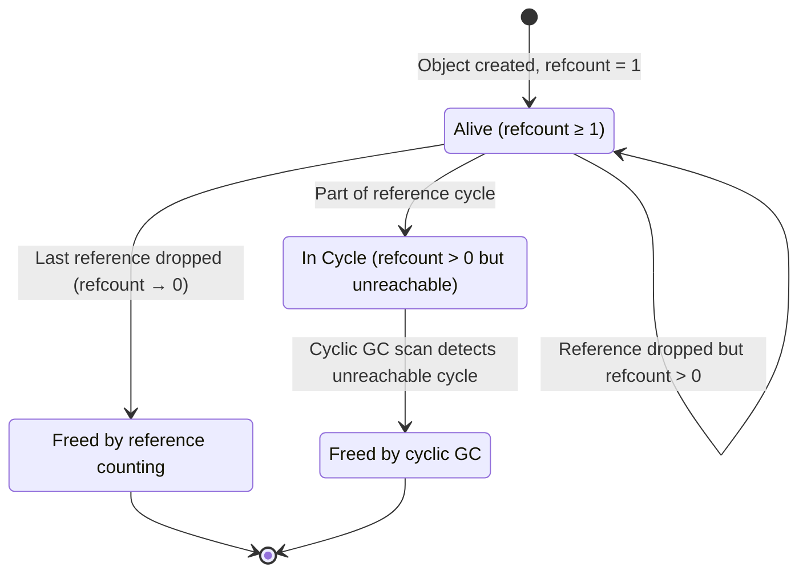

# Python Beyond the Basics: The Language Behind the Language

## The Illusion of Simplicity

Python's greatest achievement is also its most dangerous gift: the illusion that programming is simple. A beginner can write working code in hours. A data scientist can train a neural network without understanding what a class truly is. A startup can ship a product built on copy-pasted Stack Overflow answers.

And for a while, it works.

Then the codebase grows. The team expands. The model needs to be retrained, the data pipeline needs to scale, the inference endpoint needs to handle ten thousand requests per second. And suddenly, the code that "just worked" becomes an archaeological site—layers of quick fixes, mysterious behaviors, and functions that no one dares to touch because "it might break something."

This post is for those who have been there. For engineers who know Python but suspect there is more beneath the surface. For ML practitioners who have inherited codebases that feel like reading someone else's fever dream. For anyone who has asked themselves: "Why does Python do *that*?"

We will not cover basic syntax. We will not explain what a loop is. Instead, we will explore the mechanisms that transform Python from a scripting language into a tool for building systems—the data model, the object system, the execution model, and the patterns that separate maintainable code from technical debt with a timer.

This is the Python you were never formally taught.

## The Data Model: Python's Hidden Constitution

### Everything is an Object, But What Does That Mean?

The phrase "everything in Python is an object" is repeated so often that it has become meaningless. Let us give it meaning.

When you write `x = 42`, you are not storing the value 42 in a variable called `x`. You are creating an object of type `int` somewhere in memory, and `x` becomes a name that references that object. The integer 42 is not a primitive—it is a full-fledged object with methods, attributes, and an identity.

```python
x = 42
print(type(x))       # <class 'int'>
print(id(x))         # Some memory address
print(x.__add__(1))  # 43 - yes, + is just calling __add__
```

This is not a curiosity. It is the foundation of Python's entire design philosophy. Every operation you perform—addition, comparison, attribute access, function calls—is translated into method calls on objects. The `+` operator calls `__add__`. Square bracket access `[]` calls `__getitem__`. Even the `len()` function calls `__len__` on the object.

This translation layer is called the **Python Data Model**, and understanding it is the difference between using Python and mastering it.

### Dunder Methods: The Protocols of Python

The methods with double underscores—`__init__`, `__str__`, `__repr__`, `__eq__`—are not just naming conventions. They are entry points into Python's protocols. When you implement these methods, you are not just defining behavior; you are declaring that your object participates in a specific protocol.

Consider a simple example: making a custom class work with `len()`.

```python
class Dataset:
    def __init__(self, samples):
        self._samples = samples
    
    def __len__(self):
        return len(self._samples)
    
    def __getitem__(self, index):
        return self._samples[index]
```

By implementing `__len__` and `__getitem__`, this class now participates in Python's **Sequence Protocol**. It can be used with `len()`, indexed with `[]`, and—crucially—iterated over with a `for` loop. Python's `for` loop does not look for a method called `iterate()`. It looks for `__iter__`, and if that is not found, it falls back to calling `__getitem__` with successive integers until an `IndexError` is raised.

This is why understanding the data model matters for ML: when you build a PyTorch `Dataset` or a custom data pipeline, you are not just writing a class. You are implementing protocols that the entire framework depends on.

### The Representation Protocol: __str__ vs __repr__

These two methods are confused constantly, and the confusion leads to debugging nightmares.

`__repr__` is for developers. It should return a string that, ideally, could be used to recreate the object. It is what you see when you inspect an object in the REPL or a debugger. If you implement only one, implement `__repr__`.

`__str__` is for users. It is called by `print()` and `str()`, and it should return a human-readable representation.

```python
class ModelConfig:
    def __init__(self, name, learning_rate, epochs):
        self.name = name
        self.learning_rate = learning_rate
        self.epochs = epochs
    
    def __repr__(self):
        return f"ModelConfig(name={self.name!r}, learning_rate={self.learning_rate}, epochs={self.epochs})"
    
    def __str__(self):
        return f"{self.name} (lr={self.learning_rate}, {self.epochs} epochs)"

config = ModelConfig("ResNet50", 0.001, 100)
print(repr(config))  # ModelConfig(name='ResNet50', learning_rate=0.001, epochs=100)
print(str(config))   # ResNet50 (lr=0.001, 100 epochs)
```

Notice the `!r` in the f-string for `name`. This forces the use of `repr()` on the value, ensuring strings are properly quoted. This small detail prevents countless debugging sessions where you cannot tell if a value is `None`, the string `"None"`, or an empty string.

### The Comparison Protocol: Equality and Identity

One of the most common bugs in Python comes from confusing `==` and `is`.

`is` checks **identity**: are these the same object in memory?
`==` checks **equality**: do these objects have the same value?

```python
a = [1, 2, 3]
b = [1, 2, 3]
c = a

print(a == b)  # True - same value
print(a is b)  # False - different objects
print(a is c)  # True - same object
```

When you implement `__eq__`, you are defining what "equal value" means for your class. But here is where it gets subtle: if you implement `__eq__`, your class becomes **unhashable** by default. Python assumes that if you have custom equality, you might also need custom hashing, and having mismatched `__eq__` and `__hash__` breaks dictionaries and sets.

```python
class Point:
    def __init__(self, x, y):
        self.x = x
        self.y = y
    
    def __eq__(self, other):
        if not isinstance(other, Point):
            return NotImplemented
        return self.x == other.x and self.y == other.y
    
    def __hash__(self):
        return hash((self.x, self.y))
```

The rule is simple but often violated: **if two objects compare equal, they must have the same hash**. The reverse is not required—different objects can have the same hash (that is just a collision).

For ML, this matters when you use objects as dictionary keys or in sets—a common pattern for caching computed features or tracking unique configurations.

### The Callable Protocol: __call__

When you write `function()`, Python calls `function.__call__()`. This means any object can behave like a function if it implements `__call__`.

This is the foundation of how PyTorch modules work:

```python
class LinearLayer:
    def __init__(self, in_features, out_features):
        self.weight = initialize_weights(in_features, out_features)
        self.bias = initialize_bias(out_features)
    
    def __call__(self, x):
        return x @ self.weight + self.bias

layer = LinearLayer(784, 256)
output = layer(input_tensor)  # Calls layer.__call__(input_tensor)
```

This pattern—callable objects—is everywhere in ML. Models, loss functions, optimizers, transforms—they are all objects that behave like functions but carry state.

## Classes: Beyond Basic Object-Oriented Programming

### The MRO: Method Resolution Order

Python supports multiple inheritance, and multiple inheritance is a minefield. When a class inherits from multiple parents that might have methods with the same name, which one gets called?

Python uses the **C3 Linearization Algorithm** to determine the Method Resolution Order (MRO). You can inspect it with `ClassName.__mro__` or `ClassName.mro()`.

```python
class A:
    def method(self):
        print("A")

class B(A):
    def method(self):
        print("B")
        super().method()

class C(A):
    def method(self):
        print("C")
        super().method()

class D(B, C):
    def method(self):
        print("D")
        super().method()

D().method()
# Output: D, B, C, A
print(D.__mro__)
# (<class 'D'>, <class 'B'>, <class 'C'>, <class 'A'>, <class 'object'>)
```

The MRO follows two rules:
1. A class always appears before its parents
2. If a class inherits from multiple parents, they appear in the order specified

Understanding the MRO is essential when working with frameworks like PyTorch or TensorFlow that use deep class hierarchies. When you subclass `nn.Module` and mix in other classes, the MRO determines which methods get called.

For the diamond hierarchy `D(B, C)` where both `B` and `C` inherit from `A`, the MRO walks left-to-right depth-first but merges duplicates so `A` appears only once at the end—that is the C3 linearization in action.



### super(): More Complex Than You Think

`super()` does not simply call the parent class. It calls the **next class in the MRO**. This distinction matters enormously in multiple inheritance.

```python
class Parent:
    def __init__(self, value):
        self.value = value

class Mixin:
    def __init__(self, **kwargs):
        self.extra = kwargs.pop('extra', None)
        super().__init__(**kwargs)

class Child(Mixin, Parent):
    def __init__(self, value, extra=None):
        super().__init__(value=value, extra=extra)
```

In this example, `Child.__init__` calls `Mixin.__init__` (next in MRO), which calls `Parent.__init__`. If `Mixin` did not call `super().__init__()`, the chain would break.

This is why many style guides recommend that all classes in a hierarchy accept `**kwargs` and pass them up—it makes the chain resilient to additions.

### Abstract Base Classes: Contracts in Code

When you define an interface—a contract that subclasses must fulfill—use Abstract Base Classes from the `abc` module.

```python
from abc import ABC, abstractmethod

class BaseModel(ABC):
    @abstractmethod
    def fit(self, X, y):
        """Train the model on data X with targets y."""
        pass
    
    @abstractmethod
    def predict(self, X):
        """Generate predictions for data X."""
        pass
    
    def fit_predict(self, X, y):
        """Train and predict in one call."""
        self.fit(X, y)
        return self.predict(X)

class LinearRegressor(BaseModel):
    def fit(self, X, y):
        # Implementation here
        pass
    
    def predict(self, X):
        # Implementation here
        pass
```

If you try to instantiate `BaseModel` directly, you get a `TypeError`. If you create a subclass that does not implement all abstract methods, you get a `TypeError` when you try to instantiate *that*.

This is not just about catching bugs early. It is about documentation. When someone reads your code and sees a class inheriting from `ABC` with abstract methods, they immediately understand the contract. They know what they must implement and what they get for free.

### Properties: Computed Attributes

Properties allow you to define methods that behave like attributes. This is the Pythonic way to implement getters and setters—without the boilerplate that plagues other languages.

```python
class TrainingRun:
    def __init__(self, epochs, batch_size, dataset_size):
        self.epochs = epochs
        self.batch_size = batch_size
        self.dataset_size = dataset_size
    
    @property
    def steps_per_epoch(self):
        return self.dataset_size // self.batch_size
    
    @property
    def total_steps(self):
        return self.epochs * self.steps_per_epoch
    
    @property
    def learning_rate(self):
        return self._learning_rate
    
    @learning_rate.setter
    def learning_rate(self, value):
        if not 0 < value < 1:
            raise ValueError("Learning rate must be between 0 and 1")
        self._learning_rate = value
```

Properties are computed on access, which means they always reflect the current state. If you change `batch_size`, `steps_per_epoch` automatically updates. No need to remember to recalculate.

But use them judiciously. A property that performs expensive computation (like loading a file or making a network call) violates the principle of least surprise. Users expect attribute access to be fast.

### Descriptors: The Machinery Behind Properties

Properties are actually a special case of a more general mechanism: **descriptors**. A descriptor is any object that implements `__get__`, `__set__`, or `__delete__`.

When you access an attribute, Python checks if the attribute is a descriptor. If it is, Python calls the descriptor's `__get__` method instead of returning the attribute directly.

```python
class Validated:
    def __init__(self, validator, default=None):
        self.validator = validator
        self.default = default
    
    def __set_name__(self, owner, name):
        self.name = name
        self.storage_name = f'_validated_{name}'
    
    def __get__(self, obj, objtype=None):
        if obj is None:
            return self
        return getattr(obj, self.storage_name, self.default)
    
    def __set__(self, obj, value):
        if not self.validator(value):
            raise ValueError(f"Invalid value for {self.name}: {value}")
        setattr(obj, self.storage_name, value)

class ModelConfig:
    learning_rate = Validated(lambda x: 0 < x < 1)
    epochs = Validated(lambda x: isinstance(x, int) and x > 0)
    batch_size = Validated(lambda x: isinstance(x, int) and x > 0)
    
    def __init__(self, learning_rate, epochs, batch_size):
        self.learning_rate = learning_rate
        self.epochs = epochs
        self.batch_size = batch_size
```

Now every instance of `ModelConfig` will validate its arguments—not just in `__init__`, but whenever the attributes are set. This is the kind of defensive programming that prevents bugs from propagating.

### Dataclasses: The Modern Alternative

Python 3.7 introduced `dataclasses`, which automate the boilerplate of data-holding classes.

```python
from dataclasses import dataclass, field
from typing import List, Optional

@dataclass
class Experiment:
    name: str
    model_type: str
    learning_rate: float
    epochs: int
    tags: List[str] = field(default_factory=list)
    notes: Optional[str] = None
    
    def __post_init__(self):
        if not 0 < self.learning_rate < 1:
            raise ValueError("Learning rate must be between 0 and 1")
```

The `@dataclass` decorator generates `__init__`, `__repr__`, `__eq__`, and optionally `__hash__`, `__lt__`, etc. The `field()` function handles mutable default arguments correctly—no more accidental shared lists.

For configuration objects, data transfer objects, and anywhere you would otherwise write a class that is mostly `__init__` and `__repr__`, dataclasses should be your first choice.

But know their limitations: they do not support validation in the way that libraries like `pydantic` or `attrs` do. For complex validation, you need `__post_init__` or external libraries.

### Slots: Memory Efficiency

By default, Python stores instance attributes in a dictionary (`__dict__`). This is flexible—you can add arbitrary attributes at runtime—but it costs memory.

`__slots__` declares the attributes a class will have, allowing Python to allocate fixed storage:

```python
class Point:
    __slots__ = ('x', 'y')
    
    def __init__(self, x, y):
        self.x = x
        self.y = y
```

A slotted class uses significantly less memory per instance—sometimes 40-50% less. For classes where you will create millions of instances (think: data points, tokens, game states), this matters.

The tradeoff: you cannot add attributes not declared in `__slots__`, and you lose `__dict__`. Inheritance becomes trickier—all classes in the hierarchy need to use slots consistently.

## Decorators: Modifying Behavior Elegantly

### What Decorators Really Are

A decorator is not magic. It is syntactic sugar for a simple pattern:

```python
@decorator
def function():
    pass

# Is exactly equivalent to:
def function():
    pass
function = decorator(function)
```

A decorator is a callable that takes a callable and returns a callable. That is it.

The simplest decorator does nothing useful:

```python
def do_nothing(func):
    return func

@do_nothing
def greet():
    print("Hello")
```

A slightly more useful decorator wraps the original function:

```python
def log_calls(func):
    def wrapper(*args, **kwargs):
        print(f"Calling {func.__name__}")
        result = func(*args, **kwargs)
        print(f"{func.__name__} returned {result}")
        return result
    return wrapper

@log_calls
def add(a, b):
    return a + b

add(2, 3)
# Calling add
# add returned 5
```

### functools.wraps: Preserving Metadata

There is a subtle bug in the decorator above. Inspect the decorated function:

```python
print(add.__name__)  # wrapper
print(add.__doc__)   # None
```

The decorated function has lost its identity. This breaks introspection, documentation, and debugging. The fix is `functools.wraps`:

```python
from functools import wraps

def log_calls(func):
    @wraps(func)
    def wrapper(*args, **kwargs):
        print(f"Calling {func.__name__}")
        result = func(*args, **kwargs)
        print(f"{func.__name__} returned {result}")
        return result
    return wrapper
```

Now `add.__name__` returns `'add'` as expected. **Always use `@wraps` in your decorators.**

### Decorators with Arguments

Sometimes you need a decorator that takes arguments. This requires an extra level of nesting:

```python
def repeat(times):
    def decorator(func):
        @wraps(func)
        def wrapper(*args, **kwargs):
            for _ in range(times):
                result = func(*args, **kwargs)
            return result
        return wrapper
    return decorator

@repeat(times=3)
def say_hello():
    print("Hello")

say_hello()
# Hello
# Hello
# Hello
```

The pattern is: the outer function takes the arguments and returns the actual decorator. This is why you see `@decorator()` with parentheses even when there are no arguments—it is calling the outer function.

### Class Decorators

Decorators can also modify classes:

```python
def singleton(cls):
    instances = {}
    
    @wraps(cls)
    def get_instance(*args, **kwargs):
        if cls not in instances:
            instances[cls] = cls(*args, **kwargs)
        return instances[cls]
    
    return get_instance

@singleton
class DatabaseConnection:
    def __init__(self, url):
        self.url = url
        self.connect()
```

The dataclass decorator we saw earlier is a class decorator—it takes a class and returns a modified version.

### Practical Decorator: Retry with Backoff

Here is a production-quality decorator that retries a function with exponential backoff—essential for any code that talks to external services:

```python
import time
import random
from functools import wraps

def retry(max_attempts=3, base_delay=1.0, exponential_base=2, jitter=True):
    def decorator(func):
        @wraps(func)
        def wrapper(*args, **kwargs):
            last_exception = None
            
            for attempt in range(max_attempts):
                try:
                    return func(*args, **kwargs)
                except Exception as e:
                    last_exception = e
                    
                    if attempt == max_attempts - 1:
                        raise
                    
                    delay = base_delay * (exponential_base ** attempt)
                    if jitter:
                        delay *= (0.5 + random.random())
                    
                    time.sleep(delay)
            
            raise last_exception
        return wrapper
    return decorator

@retry(max_attempts=5, base_delay=0.5)
def fetch_from_api(endpoint):
    # Might fail due to network issues
    pass
```

### Method Decorators: staticmethod and classmethod

Two built-in decorators deserve special attention because they change how methods work.

`@staticmethod` creates a method that does not receive the instance (`self`) or class (`cls`) as the first argument. It is essentially a regular function that happens to live in a class namespace:

```python
class MathUtils:
    @staticmethod
    def clamp(value, min_val, max_val):
        return max(min_val, min(value, max_val))
```

`@classmethod` creates a method that receives the class (`cls`) as the first argument instead of the instance. This is essential for alternative constructors:

```python
class Model:
    def __init__(self, weights, config):
        self.weights = weights
        self.config = config
    
    @classmethod
    def from_pretrained(cls, path):
        weights = load_weights(path)
        config = load_config(path)
        return cls(weights, config)
    
    @classmethod
    def from_config(cls, config):
        weights = initialize_weights(config)
        return cls(weights, config)

# Both create Model instances
model1 = Model.from_pretrained("/models/bert")
model2 = Model.from_config(my_config)
```

The critical detail: `cls` is the class on which the method is called, not necessarily the class where it is defined. This means `from_pretrained` works correctly on subclasses:

```python
class FineTunedModel(Model):
    pass

# Returns a FineTunedModel, not a Model
model = FineTunedModel.from_pretrained("/models/my-bert")
```

## Type Hints: Safety Without the Ceremony

### The Evolution of Python Typing

Python was born as a dynamically typed language, and that is still its nature. Type hints do not change runtime behavior—they are metadata for tools and humans.

But the tools have become powerful. Type checkers like `mypy`, `pyright`, and `pytype` can catch entire categories of bugs before your code runs. IDEs use type hints for intelligent autocomplete. And documentation becomes self-updating.

```python
from typing import List, Dict, Optional, Union, Callable

def process_batch(
    items: List[str],
    transform: Callable[[str], str],
    metadata: Optional[Dict[str, int]] = None
) -> List[str]:
    results = [transform(item) for item in items]
    if metadata is not None:
        metadata['processed'] = len(results)
    return results
```

### Generic Types and TypeVar

When you write a function that works with any type but needs to express relationships between types, use `TypeVar`:

```python
from typing import TypeVar, List, Callable

T = TypeVar('T')
U = TypeVar('U')

def map_list(items: List[T], func: Callable[[T], U]) -> List[U]:
    return [func(item) for item in items]

# The type checker understands:
# - If items is List[int] and func is Callable[[int], str]
# - Then the return type is List[str]
```

For constrained type variables:

```python
from typing import TypeVar
import numpy as np

Number = TypeVar('Number', int, float, np.ndarray)

def scale(value: Number, factor: float) -> Number:
    return value * factor
```

### Protocol: Structural Subtyping

Python 3.8 introduced `Protocol`, which allows structural subtyping—"if it looks like a duck and quacks like a duck."

```python
from typing import Protocol, runtime_checkable

@runtime_checkable
class Trainable(Protocol):
    def fit(self, X, y) -> None: ...
    def predict(self, X): ...

def cross_validate(model: Trainable, X, y, folds: int = 5):
    # Works with ANY object that has fit() and predict()
    # No need to inherit from a base class
    pass
```

This is different from ABCs. With Protocol, you do not need inheritance—any class that implements the methods is considered compatible. This is how Python's built-in types like `Iterable` and `Sized` work.

### When Types Get Complex: Type Aliases

Complex types can become unreadable. Define aliases:

```python
from typing import Dict, List, Tuple, Callable, TypeAlias

# Without alias
def train(
    data: List[Tuple[List[float], int]],
    callback: Callable[[int, float], None]
) -> Dict[str, List[float]]:
    ...

# With aliases
Sample: TypeAlias = Tuple[List[float], int]
Dataset: TypeAlias = List[Sample]
TrainingCallback: TypeAlias = Callable[[int, float], None]
Metrics: TypeAlias = Dict[str, List[float]]

def train(
    data: Dataset,
    callback: TrainingCallback
) -> Metrics:
    ...
```

### The Pragmatic Approach to Typing

Type hints are a tool, not a religion. Here is a pragmatic approach:

1. **Always type function signatures** - This is where the biggest benefit lies
2. **Type public APIs fully** - These are your contracts
3. **Use inference for local variables** - `items = []` inside a function does not need `items: List[Any] = []`
4. **Use `Any` sparingly but honestly** - Better than a wrong type
5. **Run type checkers in CI** - Catch issues before merge

For ML codebases specifically, numpy arrays and tensors are challenging because their shapes and dtypes are part of their meaning. Libraries like `jaxtyping` and `torchtyping` exist for this, but they are not yet mainstream. For now, comments describing shapes often work better than complex type annotations.

## Generators and Iterators: Lazy Computation

### The Iterator Protocol

Any object that implements `__iter__` and `__next__` is an iterator. `__iter__` returns the iterator itself; `__next__` returns the next value or raises `StopIteration`.

```python
class CountDown:
    def __init__(self, start):
        self.current = start
    
    def __iter__(self):
        return self
    
    def __next__(self):
        if self.current <= 0:
            raise StopIteration
        self.current -= 1
        return self.current + 1

for i in CountDown(5):
    print(i)  # 5, 4, 3, 2, 1
```

### Generators: Iterators Made Simple

Generators are functions that use `yield` instead of `return`. They automatically implement the iterator protocol:

```python
def countdown(start):
    current = start
    while current > 0:
        yield current
        current -= 1

for i in countdown(5):
    print(i)  # 5, 4, 3, 2, 1
```

The magic of generators is that they pause at each `yield` and resume where they left off. The state is preserved between calls.

### Why This Matters for ML

In ML, data often does not fit in memory. Generators let you process data lazily:

```python
def load_images(directory):
    for path in Path(directory).glob("*.jpg"):
        image = load_and_preprocess(path)
        yield image

def batch_generator(items, batch_size):
    batch = []
    for item in items:
        batch.append(item)
        if len(batch) == batch_size:
            yield batch
            batch = []
    if batch:
        yield batch

# Memory-efficient: only one batch in memory at a time
for batch in batch_generator(load_images("/data/train"), batch_size=32):
    train_step(batch)
```

### Generator Expressions: One-Liners

Just as list comprehensions create lists, generator expressions create generators:

```python
# List comprehension - builds entire list in memory
squares_list = [x**2 for x in range(1_000_000)]

# Generator expression - lazy, uses almost no memory
squares_gen = (x**2 for x in range(1_000_000))
```

Use generator expressions when you only need to iterate once and do not need to keep the results.

### yield from: Delegating to Sub-Generators

When one generator needs to yield all values from another, use `yield from`:

```python
def flatten(nested):
    for item in nested:
        if isinstance(item, list):
            yield from flatten(item)
        else:
            yield item

list(flatten([1, [2, 3, [4, 5]], 6]))  # [1, 2, 3, 4, 5, 6]
```

## Context Managers: Resource Management Done Right

### The with Statement

The `with` statement ensures resources are properly released, even if exceptions occur:

```python
with open("file.txt", "r") as f:
    content = f.read()
# File is guaranteed to be closed here
```

This is the context manager protocol at work. The object returned by `open()` implements `__enter__` and `__exit__`.

### Writing Context Managers

You can create context managers with a class:

```python
class Timer:
    def __enter__(self):
        self.start = time.perf_counter()
        return self
    
    def __exit__(self, exc_type, exc_val, exc_tb):
        self.elapsed = time.perf_counter() - self.start
        print(f"Elapsed: {self.elapsed:.4f} seconds")
        return False  # Don't suppress exceptions

with Timer():
    train_model(data)
```

The `__exit__` method receives exception information. If you return `True`, the exception is suppressed. This is rarely what you want.

### contextlib: The Easy Way

For simple cases, the `contextlib` module provides shortcuts:

```python
from contextlib import contextmanager

@contextmanager
def timer():
    start = time.perf_counter()
    try:
        yield
    finally:
        elapsed = time.perf_counter() - start
        print(f"Elapsed: {elapsed:.4f} seconds")

with timer():
    train_model(data)
```

The code before `yield` is `__enter__`. The code after (in `finally`) is `__exit__`.

### Practical Context Manager: GPU Memory

In ML, managing GPU memory is critical:

```python
@contextmanager
def gpu_memory_snapshot(label=""):
    if torch.cuda.is_available():
        torch.cuda.synchronize()
        before = torch.cuda.memory_allocated()
    try:
        yield
    finally:
        if torch.cuda.is_available():
            torch.cuda.synchronize()
            after = torch.cuda.memory_allocated()
            diff = (after - before) / 1024 / 1024
            print(f"{label}: {diff:+.2f} MB")

with gpu_memory_snapshot("Model loading"):
    model = load_large_model()
```

## The Global Interpreter Lock: Python's Controversial Core

### What is the GIL?

The Global Interpreter Lock is a mutex that protects access to Python objects. It prevents multiple threads from executing Python bytecode simultaneously.

Yes, you read that correctly. Python threads do not run in parallel on multiple cores.

```python
import threading

def cpu_bound_task():
    total = 0
    for i in range(10_000_000):
        total += i
    return total

# These run sequentially, not in parallel
threads = [threading.Thread(target=cpu_bound_task) for _ in range(4)]
for t in threads:
    t.start()
for t in threads:
    t.join()
```

This code takes roughly the same time as running the function four times in sequence.

### Why Does the GIL Exist?

The GIL exists because Python's memory management (reference counting) is not thread-safe. Making it thread-safe without a GIL would require fine-grained locks on every object, which would slow down single-threaded code—the vast majority of Python programs.

The GIL is a pragmatic choice, not a design flaw. It makes single-threaded Python faster and simpler to embed with C extensions.

### When the GIL Does Not Matter

The GIL is released during I/O operations. This means threading works perfectly for I/O-bound tasks:

```python
import concurrent.futures
import requests

def fetch_url(url):
    return requests.get(url).status_code

urls = ["https://example.com"] * 100

# This IS parallel - threads release GIL during I/O
with concurrent.futures.ThreadPoolExecutor(max_workers=10) as executor:
    results = list(executor.map(fetch_url, urls))
```

The GIL is also released by most numerical libraries. NumPy, for example, releases the GIL during array operations because the actual computation happens in C.

### Multiprocessing: True Parallelism

For CPU-bound tasks, use `multiprocessing`:

```python
import multiprocessing

def cpu_bound_task(n):
    return sum(range(n))

if __name__ == "__main__":
    with multiprocessing.Pool(4) as pool:
        results = pool.map(cpu_bound_task, [10_000_000] * 4)
```

Each process has its own Python interpreter and its own GIL. True parallelism.

The cost is inter-process communication. Data must be serialized (pickled) to pass between processes. This is slow for large objects.

### Python 3.12 and Beyond: The GIL's Future

Python 3.12 introduced experimental support for disabling the GIL (PEP 703). Python 3.13 expands this. The "free-threaded" Python builds allow true multi-threaded parallelism.

This is still experimental. Libraries like NumPy and PyTorch need to be rebuilt to support it. But it signals a future where Python can fully utilize multi-core CPUs without the GIL.

The right concurrency tool depends on whether your bottleneck is I/O or CPU, and how much inter-process overhead you can tolerate. The quadrant below maps the main options so the choice is immediate.



## Memory Management: Understanding What Python Does

### Reference Counting

Python's primary memory management mechanism is reference counting. Every object has a counter of how many references point to it. When the counter reaches zero, the object is deallocated.

```python
import sys

a = [1, 2, 3]
print(sys.getrefcount(a))  # 2 (a + the argument to getrefcount)

b = a
print(sys.getrefcount(a))  # 3

del b
print(sys.getrefcount(a))  # 2
```

### Cyclic Garbage Collection

Reference counting cannot handle cycles:

```python
a = []
a.append(a)  # a references itself
del a  # Reference count is still 1 (self-reference)
```

Python has a cyclic garbage collector that periodically scans for unreachable cycles and cleans them up. You can control it via the `gc` module:

```python
import gc

gc.collect()  # Force garbage collection
gc.disable()  # Disable automatic collection (use carefully)
```

The diagram below shows the full lifecycle of a Python object—reference counting handles the fast path, and the cyclic GC catches the cases that slip through.



### Common Memory Leaks in Python

Memory leaks in Python are usually one of:

1. **Unintended references** - Objects stored in a global structure that grows forever
2. **Cycles with `__del__`** - If objects in a cycle have `__del__` methods, the collector cannot determine a safe deletion order (improved in Python 3.4+)
3. **C extension leaks** - Extensions that allocate memory and do not free it

For ML, a common pattern is accidentally keeping references to large tensors:

```python
# Memory leak: history grows forever
history = []

for epoch in range(1000):
    loss = train_epoch(model, data)
    history.append(loss)  # If loss is a tensor, GPU memory accumulates

# Fix: convert to Python scalar
for epoch in range(1000):
    loss = train_epoch(model, data)
    history.append(float(loss))  # Releases tensor
```

## The Import System: How Python Finds and Loads Code

### The Module Search Path

When you write `import foo`, Python searches for `foo` in this order:

1. The current script's directory
2. Directories in `PYTHONPATH` environment variable
3. Installation-dependent defaults (site-packages, etc.)

You can inspect and modify this at runtime:

```python
import sys
print(sys.path)
sys.path.append("/my/custom/modules")
```

### Packages and __init__.py

A package is a directory containing Python modules and an `__init__.py` file. The `__init__.py` can be empty or can contain initialization code.

```
mypackage/
    __init__.py
    module_a.py
    module_b.py
    subpackage/
        __init__.py
        module_c.py
```

When you `import mypackage`, Python executes `mypackage/__init__.py`. This is where you can control what gets exported:

```python
# mypackage/__init__.py
from .module_a import ClassA
from .module_b import function_b

__all__ = ['ClassA', 'function_b']
```

### Relative vs Absolute Imports

Inside a package, you can use relative imports:

```python
# Inside mypackage/module_b.py
from .module_a import ClassA          # Same package
from ..otherpackage import something  # Parent's sibling
```

The dots indicate levels up in the package hierarchy.

The rule of thumb: use absolute imports in scripts (files you run directly), use relative imports inside packages.

### Circular Import Hell

Circular imports are Python's most frustrating gotcha. They happen when module A imports module B, and module B imports module A.

```python
# a.py
from b import B
class A:
    def method(self):
        return B()

# b.py
from a import A  # ImportError: cannot import name 'A'
class B:
    def method(self):
        return A()
```

When Python imports `a.py`, it starts executing it. It hits `from b import B`, so it starts importing `b.py`. In `b.py`, it hits `from a import A`. But `a.py` is not finished executing—`A` has not been defined yet.

Solutions:

1. **Restructure** - Move common code to a third module
2. **Import at function level** - Delay the import until it is needed
3. **Use TYPE_CHECKING** - For type hints that cause circular imports

```python
from typing import TYPE_CHECKING

if TYPE_CHECKING:
    from a import A  # Only imported for type checking, not at runtime

class B:
    def method(self) -> "A":  # Forward reference as string
        from a import A
        return A()
```

## Version Hell: Why Python Breaks and How to Survive

### Why Python Versions Are Painful

Python's commitment to backward compatibility is... complicated. The Python 2 to Python 3 transition traumatized an entire generation of developers. Minor versions introduce changes that can break code.

Some examples of breaking changes:

- Python 3.10: `match` became a keyword (breaks code with variables named `match`)
- Python 3.9: `dict` union operators `|` and `|=` (new syntax, not backward compatible)
- Python 3.8: Walrus operator `:=` (new syntax)
- Python 3.7: `async` and `await` became keywords
- Python 3.6: f-strings (new syntax)

Code that runs on 3.6 might not parse on 3.5. Code that runs on 3.10 might not parse on 3.9.

### The __future__ Module

Python provides a way to opt in to future behavior:

```python
from __future__ import annotations  # PEP 563: postponed evaluation
from __future__ import division     # Python 3-style division in Python 2
```

The most useful today is `annotations`, which makes all type hints strings by default. This solves many forward reference problems.

### Version Compatibility Patterns

If you must support multiple Python versions:

```python
import sys

if sys.version_info >= (3, 10):
    from importlib.metadata import packages_distributions
else:
    from importlib_metadata import packages_distributions  # backport

# Feature detection instead of version checking
try:
    from functools import cache  # Python 3.9+
except ImportError:
    from functools import lru_cache
    cache = lru_cache(maxsize=None)
```

Feature detection (`try`/`except ImportError`) is generally preferred over version checking because it is resilient to backports and forward compatibility.

### Why Poetry and pyenv Matter

This is why the previous post emphasized dependency management. A project pinned to Python 3.9 with exact dependency versions will run the same on any machine. `pyenv` ensures the right Python version; `poetry.lock` ensures the right packages.

```bash
pyenv install 3.9.18
pyenv local 3.9.18
poetry install
```

No surprises. No "works on my machine."

## Putting It All Together: Patterns for ML Codebases

### The Trainer Pattern

Here is how these concepts combine in a typical ML training class:

```python
from abc import ABC, abstractmethod
from dataclasses import dataclass, field
from typing import Optional, List, Dict, Any, Protocol
from contextlib import contextmanager
import time

class Callback(Protocol):
    def on_epoch_start(self, epoch: int) -> None: ...
    def on_epoch_end(self, epoch: int, metrics: Dict[str, float]) -> None: ...

@dataclass
class TrainerConfig:
    epochs: int
    learning_rate: float
    batch_size: int
    checkpoint_dir: Optional[str] = None
    callbacks: List[Callback] = field(default_factory=list)
    
    def __post_init__(self):
        if not 0 < self.learning_rate < 1:
            raise ValueError("Learning rate must be between 0 and 1")
        if self.batch_size <= 0:
            raise ValueError("Batch size must be positive")

class BaseTrainer(ABC):
    def __init__(self, config: TrainerConfig):
        self.config = config
        self.current_epoch = 0
        self._history: List[Dict[str, float]] = []
    
    @property
    def history(self) -> List[Dict[str, float]]:
        return self._history.copy()  # Defensive copy
    
    @abstractmethod
    def train_epoch(self, data) -> Dict[str, float]:
        pass
    
    @abstractmethod
    def validate(self, data) -> Dict[str, float]:
        pass
    
    @contextmanager
    def _epoch_context(self, epoch: int):
        for callback in self.config.callbacks:
            callback.on_epoch_start(epoch)
        start = time.perf_counter()
        
        try:
            yield
        finally:
            elapsed = time.perf_counter() - start
            metrics = self._history[-1] if self._history else {}
            metrics['epoch_time'] = elapsed
            
            for callback in self.config.callbacks:
                callback.on_epoch_end(epoch, metrics)
    
    def fit(self, train_data, val_data=None):
        for epoch in range(self.config.epochs):
            with self._epoch_context(epoch):
                self.current_epoch = epoch
                
                train_metrics = self.train_epoch(train_data)
                
                if val_data is not None:
                    val_metrics = self.validate(val_data)
                    train_metrics.update({f'val_{k}': v for k, v in val_metrics.items()})
                
                self._history.append(train_metrics)
        
        return self
```

This class uses:
- **ABCs** to define the training contract
- **Dataclasses** for configuration with validation
- **Properties** for safe access to history
- **Context managers** for epoch lifecycle
- **Protocols** for flexible callbacks
- **Type hints** throughout

### The Repository Pattern for Data Access

When your ML project interacts with databases or external storage:

```python
from abc import ABC, abstractmethod
from typing import TypeVar, Generic, List, Optional
from dataclasses import dataclass

T = TypeVar('T')

class Repository(ABC, Generic[T]):
    @abstractmethod
    def get(self, id: str) -> Optional[T]:
        pass
    
    @abstractmethod
    def list(self, limit: int = 100, offset: int = 0) -> List[T]:
        pass
    
    @abstractmethod
    def save(self, entity: T) -> None:
        pass

@dataclass
class Experiment:
    id: str
    name: str
    config: dict
    metrics: dict

class ExperimentRepository(Repository[Experiment]):
    def __init__(self, storage_path: str):
        self.storage_path = storage_path
    
    def get(self, id: str) -> Optional[Experiment]:
        # Implementation
        pass
    
    def list(self, limit: int = 100, offset: int = 0) -> List[Experiment]:
        # Implementation
        pass
    
    def save(self, entity: Experiment) -> None:
        # Implementation
        pass
```

This pattern separates data access from business logic. You can swap a local file repository for a cloud database without changing your training code.

## The Road Ahead

This post covered the Python you need to write professional ML systems. But it is just the foundation.

The language features we discussed—classes, decorators, type hints, generators—are tools. Their value comes from how you apply them to solve real problems: building data pipelines that scale, training loops that are debuggable, model architectures that are maintainable.

The next post in this series will cover the ML ecosystem itself: NumPy's architecture and why it matters, PyTorch vs TensorFlow, the data loading patterns that prevent training bottlenecks, and the libraries that turn raw computation into production systems.

Python is the language of ML not because it is the fastest or the most elegant, but because it is the most practical. It is the language where good ideas become working code with minimal friction. Understanding Python deeply means you can focus on the ideas instead of fighting the tools.

Now go build something.

---

## Going Deeper

**Books:**

- Ramalho, L. (2022). *Fluent Python.* 2nd ed. O'Reilly. — The definitive book on Pythonic programming. Covers the data model, protocols, closures, decorators, concurrency, and metaprogramming with extraordinary depth and clarity. Every advanced Python pattern you will encounter in ML codebases is explained here.

- Beazley, D., & Jones, B.K. (2013). *Python Cookbook.* 3rd ed. O'Reilly. — A curated collection of advanced recipes covering data structures, iterators, generators, metaprogramming, and concurrency. Each recipe explains *why* the solution works, not just what it is.

- Percival, H., & Gregory, B. (2020). *Architecture Patterns with Python.* O'Reilly. [Free online.](https://www.cosmicpython.com/) — Covers repository patterns, dependency injection, event-driven architecture, and CQRS in Python. The design patterns that make large ML systems maintainable and testable.

**Videos:**

- ["Beyond PEP 8: Best Practices for Beautiful Intelligible Code"](https://www.youtube.com/watch?v=wf-BqAjZb8M) by Raymond Hettinger (PyCon 2015) — One of the most watched Python conference talks ever. Hettinger shows how to transform idiomatic but verbose code into elegant Pythonic solutions.

- ["So You Want to Be a Python Expert?"](https://www.youtube.com/watch?v=cKPlPJyQrt4) by James Powell — A 2-hour deep dive into the Python data model: descriptors, context managers, decorators, and metaclasses. Dense and demanding, but one of the most rewarding Python talks available.

- ["Python Concurrency from the Ground Up"](https://www.youtube.com/watch?v=MCs5OvhV9S4) by David Beazley (PyCon 2015) — Beazley live-codes a concurrent event loop in Python. Explains the GIL, threads, and async I/O by building them from scratch.

**Online Resources:**

- [Python Data Model Documentation](https://docs.python.org/3/reference/datamodel.html) — The authoritative specification for all dunder methods and protocols. The sections on descriptors and metaclasses are where the deep magic lives.
- [PEP 544 — Protocols: Structural Subtyping](https://peps.python.org/pep-0544/) — The specification for `typing.Protocol`. Understanding this PEP explains why structural typing is more powerful than nominal typing for ML library design.
- [Real Python Advanced Tutorials](https://realpython.com/tutorials/advanced/) — Well-written tutorials on decorators, context managers, generators, and other advanced features.
- [CPython Source Code](https://github.com/python/cpython) — Reading the C implementation of Python built-ins is often the most direct way to understand how they work. The `Objects/` directory is the starting point.

**Key References (PEPs):**

- [PEP 484](https://peps.python.org/pep-0484/) — Type Hints. The specification that made gradual typing possible in Python.
- [PEP 526](https://peps.python.org/pep-0526/) — Variable Annotations. The syntax for annotating variables, not just function arguments.
- [PEP 703](https://peps.python.org/pep-0703/) — Making the GIL Optional. The proposal for removing Python's Global Interpreter Lock, which will eventually make true thread-level parallelism possible.

**Questions to Explore:**

What is the descriptor protocol and how does it power both `@property` and PyTorch's parameter registration? How does the GIL affect NumPy, and why is NumPy-heavy code often faster in multiple threads than pure Python code? What is the difference between `__slots__` and `__dict__`, and when does using slots matter for memory-intensive ML code?

