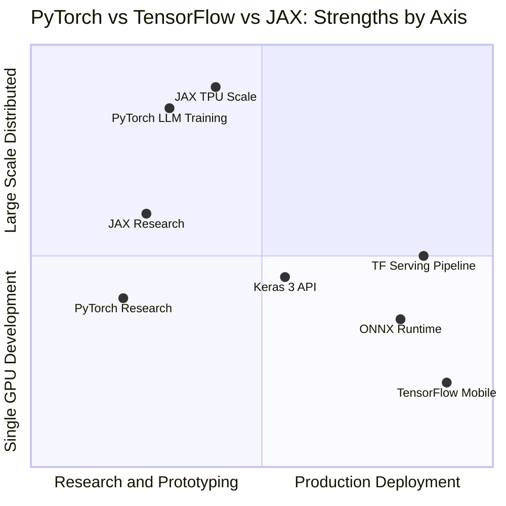
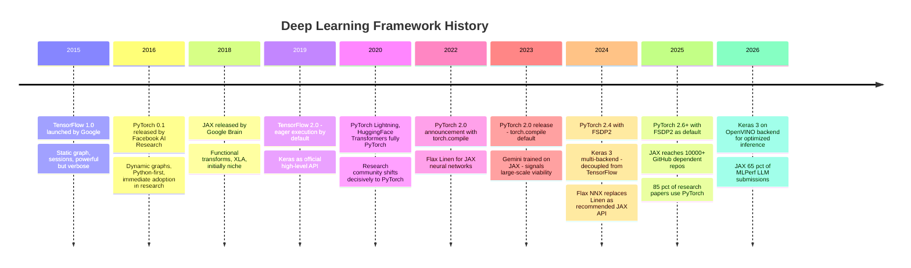
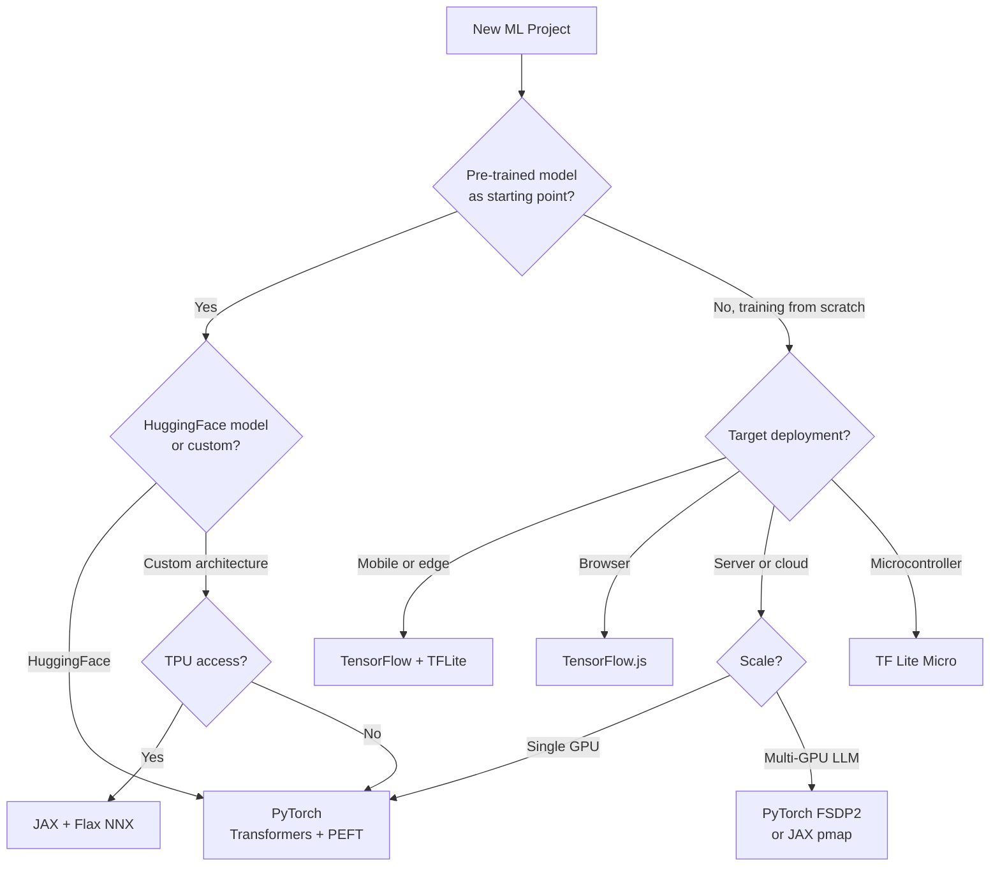

# PyTorch, TensorFlow, and JAX: The Deep Learning Framework Landscape in 2026

In 2017, the choice between PyTorch and TensorFlow felt like a religious war. TensorFlow had production credibility, Google's backing, and a head start. PyTorch had something harder to measure: it felt like Python. You wrote your forward pass, you ran it, you got a result. No sessions, no placeholders, no graph compilation ceremony before you could even see a number.

The war resolved more decisively than most expected. PyTorch now accounts for roughly 85% of deep learning research papers published in 2025. LLaMA, GPT-4, Claude, Gemma — all trained in PyTorch. The entire HuggingFace ecosystem, vLLM, Unsloth — PyTorch. But the story doesn't end there. TensorFlow still has a strong grip on mobile and edge deployment. And JAX — Google's functional framework — is now training Gemini and increasingly appearing in competitive ML benchmarks, quietly accumulating adoption in large-scale research settings.

This post covers all three seriously. The architecture decisions that make each framework what it is. The production patterns worth knowing. The distributed training strategies for when a single GPU isn't enough. And the framework-selection heuristics that actually hold up in practice.

---

## The Central Idea: Automatic Differentiation

Before comparing frameworks, we need to understand what they all actually do. The core job of a deep learning framework is **automatic differentiation** — computing gradients of a scalar loss with respect to every parameter in a network.

Training a neural network is gradient descent: compute the loss, compute how much each weight contributed to that loss (the gradient), update weights in the direction that reduces the loss. For a small network, you could write the backward pass by hand. For a billion-parameter transformer, you cannot.

Automatic differentiation (autograd) works by recording every operation performed on tensors and building a computational graph — a directed acyclic graph of operations, where nodes are tensors and edges are the operations connecting them. The backward pass traverses this graph in reverse using the chain rule, accumulating gradients all the way to the parameters.

The critical design choice: **when** do you build this graph?

**Static graphs (define-and-run)**: Build the graph first, then run data through it. TensorFlow 1.x did this. You declared your computation symbolically — placeholders, operations, variable declarations — compiled it into an optimized execution plan, then ran data through the plan in a session. This enabled aggressive optimization (operation fusion, memory planning, XLA compilation) but made debugging painful: you couldn't print intermediate tensors, add conditional logic, or inspect what was happening at runtime.

**Dynamic graphs (define-by-run)**: Build the graph on the fly as operations execute. PyTorch pioneered this. You write normal Python — loops, conditionals, function calls — and PyTorch records the operations on the autograd tape as they happen. The graph is different on every forward pass if the logic branches. Debugging means `print()` or `pdb`. This is why PyTorch won the research community: the cognitive overhead is minimal.

TensorFlow 2.x resolved this tension pragmatically: eager execution by default (like PyTorch), with `@tf.function` for when you need graph compilation. JAX takes a third path: purely functional transformations on immutable arrays, with explicit JIT compilation via `jax.jit`. Each approach has consequences that ripple through the entire developer experience.

---

## PyTorch: The Researcher's Framework That Grew Up

### The Core Abstractions

PyTorch is built around three things: tensors, autograd, and `nn.Module`.

**Tensors** are the fundamental data structure — multi-dimensional arrays backed by CUDA or CPU memory, with a complete set of linear algebra operations and broadcasting rules similar to NumPy. The key difference: PyTorch tensors track gradients.

```python
import torch

# A tensor that participates in autograd
x = torch.tensor([2.0, 3.0, 4.0], requires_grad=True)
loss = (x ** 2).sum()  # loss = 4 + 9 + 16 = 29

loss.backward()  # Compute gradients via autograd
print(x.grad)    # tensor([4., 6., 8.]) — d(x²)/dx = 2x
```

**Autograd** maintains a computation graph behind the scenes. Every operation on a `requires_grad=True` tensor records itself on the tape. `loss.backward()` traverses the tape in reverse, computing gradients via the chain rule and accumulating them into `.grad` attributes. This is all automatic — you write the forward pass, PyTorch computes the backward pass.

**`nn.Module`** is the base class for all neural network components. A module encapsulates parameters and computation. The contract is simple: subclass `nn.Module`, define `__init__` (declare parameters and sub-modules), define `forward` (the computation):

```python
import torch.nn as nn
import torch.nn.functional as F

class TransformerBlock(nn.Module):
    def __init__(self, d_model: int, n_heads: int, d_ff: int, dropout: float = 0.1):
        super().__init__()
        self.attn = nn.MultiheadAttention(d_model, n_heads, batch_first=True)
        self.ff = nn.Sequential(
            nn.Linear(d_model, d_ff),
            nn.GELU(),
            nn.Linear(d_ff, d_model),
        )
        self.norm1 = nn.LayerNorm(d_model)
        self.norm2 = nn.LayerNorm(d_model)
        self.dropout = nn.Dropout(dropout)
    
    def forward(self, x: torch.Tensor, mask: torch.Tensor | None = None) -> torch.Tensor:
        # Pre-norm transformer (more stable than post-norm)
        attn_out, _ = self.attn(x, x, x, attn_mask=mask)
        x = self.norm1(x + self.dropout(attn_out))
        ff_out = self.ff(x)
        x = self.norm2(x + self.dropout(ff_out))
        return x
```

`nn.Module` provides automatic parameter tracking: every `nn.Parameter` and sub-module registered in `__init__` is discoverable via `.parameters()`, serializable via `.state_dict()`, and movable between devices via `.to(device)`. The tree of modules becomes the model.

### The Training Loop

Unlike Keras, PyTorch gives you the training loop explicitly. This is both a feature and a cost: full control, full responsibility.

```python
import torch
from torch.utils.data import DataLoader, TensorDataset

def train_one_epoch(
    model: nn.Module,
    loader: DataLoader,
    optimizer: torch.optim.Optimizer,
    criterion: nn.Module,
    device: torch.device,
    scaler: torch.cuda.amp.GradScaler | None = None,
) -> float:
    model.train()
    total_loss = 0.0
    
    for batch_idx, (inputs, targets) in enumerate(loader):
        inputs, targets = inputs.to(device), targets.to(device)
        optimizer.zero_grad()
        
        if scaler is not None:
            # Automatic Mixed Precision: forward in float16, loss in float32
            with torch.autocast(device_type="cuda", dtype=torch.float16):
                outputs = model(inputs)
                loss = criterion(outputs, targets)
            scaler.scale(loss).backward()
            scaler.unscale_(optimizer)
            torch.nn.utils.clip_grad_norm_(model.parameters(), max_norm=1.0)
            scaler.step(optimizer)
            scaler.update()
        else:
            outputs = model(inputs)
            loss = criterion(outputs, targets)
            loss.backward()
            torch.nn.utils.clip_grad_norm_(model.parameters(), max_norm=1.0)
            optimizer.step()
        
        total_loss += loss.item()
    
    return total_loss / len(loader)
```

The explicit loop looks like more code than Keras's `model.fit()`, but it gives you exactly the control you need when training isn't standard: custom sampling strategies, gradient accumulation across multiple batches, curriculum learning that changes the dataset mid-epoch, logging intermediate activations. Research requires this flexibility constantly.

### torch.compile: Closing the Performance Gap

PyTorch 2.0 introduced `torch.compile`, a JIT compiler that transforms a PyTorch model into an optimized kernel. You write normal PyTorch code; the compiler handles the rest.

```python
model = TransformerBlock(d_model=512, n_heads=8, d_ff=2048).to("cuda")

# One line to enable compilation
compiled_model = torch.compile(model, mode="max-autotune")
# mode options:
#   "default"       — balanced (default)
#   "reduce-overhead" — minimize kernel launch overhead, good for small models
#   "max-autotune"  — maximum optimization, slow first run, fast thereafter
```

Under the hood, `torch.compile` captures a computation graph via TorchDynamo (Python bytecode analysis), then routes it through TorchInductor (the default backend) which generates optimized CUDA or CPU code via Triton or C++. Key optimizations: operator fusion (eliminating redundant memory reads/writes), persistent kernels, CUDA graph capture for repeated patterns.

The practical speedup varies: 20-40% on transformer inference is common. Training speedups are more modest (10-20%) because the backward pass involves more dynamic computation. For LLM inference specifically, `torch.compile` with CUDA graphs can push throughput dramatically.

One caveat: compilation happens lazily on the first forward pass (or on warmup). A model that sees highly variable input shapes will recompile for each new shape. Use `torch.compile(dynamic=True)` or pad inputs to fixed shapes to avoid recompilation overhead.

### Distributed Training: DDP and FSDP2

Single-GPU training is the exception in production. PyTorch has two primary strategies for multi-GPU training.

**DistributedDataParallel (DDP)** is the classic approach: each GPU holds a full copy of the model, processes a different batch, and synchronizes gradients via all-reduce after each backward pass. Simple and efficient when the model fits in a single GPU's memory.

```python
import torch.distributed as dist
from torch.nn.parallel import DistributedDataParallel as DDP

def setup_ddp(rank: int, world_size: int):
    dist.init_process_group("nccl", rank=rank, world_size=world_size)
    torch.cuda.set_device(rank)

def main_worker(rank: int, world_size: int):
    setup_ddp(rank, world_size)
    
    model = TransformerBlock(512, 8, 2048).to(rank)
    model = DDP(model, device_ids=[rank])  # Wraps model, syncs gradients automatically
    
    # Training loop is unchanged — DDP handles gradient synchronization
    optimizer = torch.optim.AdamW(model.parameters(), lr=1e-4)
    # ... train normally ...
    
    dist.destroy_process_group()
```

**Fully Sharded Data Parallel (FSDP2)** is the strategy for models that don't fit in one GPU's memory — i.e., any serious LLM. Instead of replicating the full model on each device, FSDP shards parameters, gradients, and optimizer states across GPUs. Each GPU holds only a fraction of the model at any time, gathering the necessary shards via all-gather before each layer's computation.

FSDP2 (shipped in PyTorch 2.4, default in PyTorch 2.6+) rewrites this with per-parameter DTensor sharding, replacing FSDP1's flat-parameter approach. The practical wins: 7% lower GPU memory on Llama 7B, 1.5% faster throughput, and much better composability with pipeline parallelism and `torch.compile`.

```python
from torch.distributed.fsdp import fully_shard, MixedPrecisionPolicy

# FSDP2: apply per-module sharding declaratively
mp_policy = MixedPrecisionPolicy(
    param_dtype=torch.bfloat16,
    reduce_dtype=torch.float32,
)

for block in model.transformer_blocks:
    fully_shard(block, mp_policy=mp_policy)
fully_shard(model, mp_policy=mp_policy)  # shard the outer model last

# From here: use model like normal, FSDP handles communication
optimizer = torch.optim.AdamW(model.parameters(), lr=1e-4)
```

TorchTitan, Meta's LLM pre-training framework, uses FSDP2 as its default parallelism strategy and composes it with pipeline parallelism and `torch.compile` for training at trillion-parameter scale.

### Deployment: torch.export and ONNX

For deployment, PyTorch gives you two clean paths.

**torch.export** (the modern approach, replacing TorchScript) captures a complete, portable representation of the model:

```python
import torch.export as export

model.eval()
example_inputs = (torch.randn(1, 32, 512),)  # batch_size=1, seq_len=32, d_model=512

exported = export.export(model, example_inputs)
# exported is a fully-traced, portable graph with:
# - static shapes (or dynamic shapes with constraints)
# - no Python overhead
# - deployable via ExecuTorch (mobile/edge) or TorchServe (server)
```

**ONNX export** for cross-framework deployment:

```python
torch.onnx.export(
    model,
    example_inputs,
    "transformer_block.onnx",
    opset_version=17,
    input_names=["x"],
    output_names=["out"],
    dynamic_axes={"x": {0: "batch", 1: "seq_len"}},
)
# Deploy with ONNX Runtime — works on CUDA, CPU, TensorRT, DirectML
```

---

## TensorFlow: The Production Framework That Adapted

### From Sessions to Eager: The TF2 Transformation

TensorFlow 1.x is worth understanding historically, because TF2's design is a direct reaction against it. In TF1, you wrote computation as a static graph:

```python
# TensorFlow 1.x (do not write code like this in 2026)
import tensorflow as tf

graph = tf.Graph()
with graph.as_default():
    x = tf.placeholder(tf.float32, shape=[None, 784])  # Declare placeholder
    W = tf.Variable(tf.random.normal([784, 10]))
    b = tf.Variable(tf.zeros([10]))
    logits = tf.matmul(x, W) + b
    loss = tf.reduce_mean(tf.nn.softmax_cross_entropy_with_logits(labels=y, logits=logits))
    train_op = tf.train.GradientDescentOptimizer(0.01).minimize(loss)

with tf.Session(graph=graph) as sess:
    sess.run(tf.global_variables_initializer())
    for batch_x, batch_y in data:
        _, loss_val = sess.run([train_op, loss], feed_dict={x: batch_x, y: batch_y})
```

This is painful. The `placeholder`, `Session`, `feed_dict` machinery is verbose; you can't use Python debuggers; conditional logic requires special TF ops (`tf.cond`, `tf.while_loop`). This is the environment PyTorch was reacting against in 2016.

TensorFlow 2.x (2019) made eager execution the default. Now `tf.Tensor` operations run immediately, just like PyTorch:

```python
import tensorflow as tf

# TF2: immediate execution, no sessions
x = tf.constant([[1.0, 2.0, 3.0]])
W = tf.Variable(tf.random.normal([3, 2]))
y = tf.matmul(x, W)
print(y)  # tf.Tensor([[...]], shape=(1, 2), dtype=float32)
```

### @tf.function: Tracing for Performance

The performance escape hatch in TF2 is `@tf.function`, which traces a Python function to build a static graph — the best of both worlds in theory.

```python
@tf.function(jit_compile=True)  # jit_compile=True enables XLA compilation
def train_step(model, optimizer, inputs, targets):
    with tf.GradientTape() as tape:
        predictions = model(inputs, training=True)
        loss = tf.keras.losses.sparse_categorical_crossentropy(targets, predictions)
        loss = tf.reduce_mean(loss)
    
    gradients = tape.gradient(loss, model.trainable_variables)
    optimizer.apply_gradients(zip(gradients, model.trainable_variables))
    return loss
```

`@tf.function` traces the function once (or a few times for different input shapes), converts the Python control flow to TF graph operations via AutoGraph, and caches the graph. Subsequent calls use the compiled graph. With `jit_compile=True`, this further routes through XLA (Accelerated Linear Algebra), Google's domain-specific compiler that achieves similar optimizations to PyTorch's `torch.compile` — operator fusion, memory planning, hardware-specific code generation.

The caveat: tracing happens with symbolic tensors. Python side effects in a `@tf.function` body (like printing, writing to Python lists, calling external services) only execute during tracing, not during subsequent compiled invocations. This is the "retracing problem" — a source of subtle bugs when your function has Python side effects or when input shape variation triggers unexpected retracings.

### Keras 3: The Multi-Backend Layer

The biggest architectural shift in TensorFlow's recent history is Keras 3, which decoupled Keras from TensorFlow entirely. Keras 3 is now a backend-agnostic deep learning API that runs on top of TensorFlow, JAX, PyTorch, or OpenVINO.

```python
import os
os.environ["KERAS_BACKEND"] = "jax"  # or "tensorflow", "torch", "openvino"

import keras

# This code runs identically on any backend
model = keras.Sequential([
    keras.layers.Dense(128, activation="relu"),
    keras.layers.Dropout(0.2),
    keras.layers.Dense(10, activation="softmax"),
])

model.compile(
    optimizer=keras.optimizers.Adam(learning_rate=1e-3),
    loss=keras.losses.SparseCategoricalCrossentropy(),
    metrics=["accuracy"],
)

model.fit(x_train, y_train, epochs=10, validation_split=0.1)
```

The practical implication: if you write your model in Keras 3, you can benchmark it on all three backends and pick the fastest for your specific hardware and architecture. JAX tends to win on TPUs and in scenarios with many identical operations (where its vectorization via `vmap` shines). TensorFlow wins on certain GPU configurations with XLA. PyTorch wins in flexibility and ecosystem coverage.

Keras 3's benchmark page shows the JAX backend consistently achieving competitive or superior throughput on both GPU and TPU compared to native TensorFlow, particularly for models with regular computation patterns.

### TensorFlow's Production Moat

Where TensorFlow still leads, unambiguously, is the **deployment ecosystem**.

**TensorFlow Serving** is a battle-tested model serving system built for production. You save a model in the SavedModel format, point TF Serving at a model registry (local filesystem, GCS, S3), and get an optimized gRPC/REST inference server with built-in versioning, A/B traffic splitting, and health checks.

```python
# Save model for TF Serving
model.export("gs://my-bucket/models/my_model/1")  # version 1

# TF Serving picks up new versions automatically
# Config: batching, timeout, max queue depth all configurable
```

**TensorFlow Lite** is the dominant framework for mobile and embedded deployment. A TFLite model is optimized for inference on devices with no GPU, limited memory, and tight power budgets. The conversion pipeline applies quantization (int8 or float16), graph optimization, and operation fusion:

```python
# Convert to TFLite with quantization
converter = tf.lite.TFLiteConverter.from_keras_model(model)
converter.optimizations = [tf.lite.Optimize.DEFAULT]
converter.target_spec.supported_types = [tf.float16]
tflite_model = converter.convert()

with open("model.tflite", "wb") as f:
    f.write(tflite_model)
# Deploy to Android (TFLite Java/Kotlin API), iOS (TFLite Swift API),
# or microcontrollers (TF Lite Micro — runs on ARM Cortex-M)
```

**TFX (TensorFlow Extended)** is the ML pipeline framework for production: data validation, preprocessing, training, evaluation, and deployment as composable pipeline components. If you're building a recurring training pipeline with data drift monitoring and automated retraining, TFX is the mature solution.

**TensorFlow.js** lets you run models in the browser or Node.js — the only major framework with first-class JavaScript support. Models trained in TensorFlow or Keras can be converted and served without a backend.

PyTorch's equivalents exist (TorchServe, ExecuTorch for mobile, ONNX for browser deployment) but none match the maturity and ecosystem coverage of TF's deployment stack. This is why "prototype in PyTorch, deploy in TensorFlow" is a real pattern — 40% of ML teams in 2025 use both frameworks.



---

## JAX: The Functional Challenger

JAX is not a deep learning framework in the conventional sense. It's a **composable function transformation library** — and deep learning turns out to be a special case of function transformation. Google uses JAX internally to train Gemini.

### The Functional Model

JAX operates on **pure functions**: functions with no side effects, no mutable state, no in-place operations. This is a hard constraint. NumPy's `array[i] = value` doesn't work in JAX. `random.seed(42)` doesn't work. Everything goes through JAX's transformation API.

Why this constraint? Because pure functions are easy to reason about mathematically, and JAX's transformations exploit this. The four core transformations:

**`jax.jit`**: Just-in-time compile a function to XLA bytecode.

```python
import jax
import jax.numpy as jnp

def relu(x):
    return jnp.maximum(0, x)

fast_relu = jax.jit(relu)
# First call: traces the function, compiles to XLA
# Subsequent calls: runs compiled kernel
x = jnp.array([-1.0, 0.0, 1.0, 2.0])
print(fast_relu(x))  # [0. 0. 1. 2.]
```

**`jax.grad`**: Compute the gradient of a scalar function.

```python
def loss_fn(params, x, y):
    predictions = x @ params["W"] + params["b"]
    return jnp.mean((predictions - y) ** 2)

grad_fn = jax.grad(loss_fn, argnums=0)  # differentiate with respect to params
# jax.value_and_grad returns both value and gradient
value_and_grad = jax.value_and_grad(loss_fn, argnums=0)

params = {"W": jnp.ones((3, 1)), "b": jnp.zeros(1)}
x, y = jnp.ones((10, 3)), jnp.ones((10, 1))
loss, grads = value_and_grad(params, x, y)
# grads has the same structure as params — a pytree of gradients
```

**`jax.vmap`**: Vectorize a function over a batch dimension without writing batching logic manually.

```python
def single_sample_forward(params, x):
    """Forward pass for a single sample (no batch dimension)."""
    return jnp.dot(x, params["W"]) + params["b"]

# Vectorize over the first axis of x
batched_forward = jax.vmap(single_sample_forward, in_axes=(None, 0))
# None: params are shared (not batched)
# 0: x is batched along axis 0

result = batched_forward(params, jnp.ones((32, 3)))  # batch of 32
print(result.shape)  # (32, 1)
```

`vmap` is where JAX gets unusual. Instead of writing a function that processes batches and trusting NumPy broadcasting, you write a function for a single sample and tell JAX to vectorize it. This is more composable: you can `vmap` over users, tasks, prompts, ensemble members — any dimension — without refactoring the function.

**`jax.pmap`**: Parallel map over multiple devices (GPUs/TPUs).

```python
# Replicate the function across all available GPUs
parallel_train = jax.pmap(train_step)

# Shard data across devices
sharded_batch = jnp.reshape(batch, (jax.device_count(), -1, *batch.shape[1:]))
parallel_train(params, sharded_batch)
```

### State Management: The Fundamental Difference

JAX's functional purity creates a problem for neural networks: networks have state (parameters, batch norm running stats, optimizer state). JAX's solution is explicit: state is passed in and returned from functions. You manage it yourself, or you use a library that does.

**Flax NNX** (Google's current recommendation) adds mutable object semantics on top of JAX while keeping the core functional transforms:

```python
import flax.nnx as nnx

class MLP(nnx.Module):
    def __init__(self, in_features: int, hidden: int, out_features: int, rngs: nnx.Rngs):
        self.linear1 = nnx.Linear(in_features, hidden, rngs=rngs)
        self.linear2 = nnx.Linear(hidden, out_features, rngs=rngs)
    
    def __call__(self, x: jax.Array) -> jax.Array:
        x = nnx.relu(self.linear1(x))
        return self.linear2(x)

rngs = nnx.Rngs(0)  # PRNG key management
model = MLP(in_features=784, hidden=256, out_features=10, rngs=rngs)
optimizer = nnx.Optimizer(model, optax.adam(1e-3))

@nnx.jit  # Compile training step
def train_step(model, optimizer, x, y):
    def loss_fn(model):
        logits = model(x)
        return optax.softmax_cross_entropy_with_integer_labels(logits, y).mean()
    
    loss, grads = nnx.value_and_grad(loss_fn)(model)
    optimizer.update(grads)
    return loss
```

Flax NNX (released 2024, replacing the older Linen API) adds Python reference semantics — `model` is mutable, like PyTorch's `nn.Module` — while still allowing you to use JAX's `jit`, `vmap`, and `grad` transforms on it. The goal is to lower the barrier for PyTorch developers migrating to JAX.

**Equinox** (developed by Patrick Kidger) takes the opposite approach: models are PyTrees (immutable data structures), not mutable objects. This is philosophically purer but requires functional update patterns (`eqx.tree_at`) instead of in-place mutation. Engineers who deeply understand JAX's functional model tend to prefer Equinox for its consistency.

### Why JAX for Large-Scale Training?

JAX's advantage is XLA compilation and hardware-native parallelism. When you compile a JAX function with `jit`, it goes through XLA's full optimization pipeline: operation fusion, memory layout optimization, and device-specific code generation. On TPUs (Google's custom AI accelerator), XLA achieves hardware utilization that other frameworks can't match because XLA was co-designed with TPU hardware.

The MLPerf 2026 results tell the story: 65% of LLM and vision submissions used the Optax optimizer ecosystem (JAX), compared to 30% using PyTorch-based optimizers. For organizations training at the scale where TPU pods are cost-effective, JAX is increasingly the tool of choice.



---

## Core Technical Comparison

### Computation Graph and Debugging

| Feature | PyTorch | TensorFlow 2 | JAX |
|---|---|---|---|
| Default execution | Eager | Eager | Eager (no autograd by default) |
| Compilation | `torch.compile` (TorchInductor) | `@tf.function` (AutoGraph + XLA) | `jax.jit` (XLA) |
| Compiler backend | Triton / C++ | XLA | XLA |
| Debugging | Full Python debugger | Eager OK, `@tf.function` opaque | Functional, traces compile |
| Dynamic control flow | Native Python | AutoGraph (limited) | `jax.lax.cond`, `jax.lax.while_loop` |
| Gradient computation | `loss.backward()` | `tf.GradientTape` | `jax.grad`, `jax.value_and_grad` |

PyTorch's debugging story is the simplest: set a breakpoint anywhere in your forward pass. TF2 eager works the same way, but `@tf.function` bodies become opaque once compiled. JAX compilation via `jit` has the same opacity — but because JAX functions are pure, you can always test them in eager mode (without `jit`) and the behavior is identical. The tracing bugs that plague `@tf.function` (Python side effects executing only during tracing) are structurally prevented in JAX by the purity requirement.

### Automatic Mixed Precision

Training in float16 or bfloat16 halves memory usage and roughly doubles throughput on modern hardware. All three frameworks support it.

```python
# PyTorch AMP
from torch.cuda.amp import autocast, GradScaler
scaler = GradScaler()
with autocast():
    output = model(inputs)
    loss = criterion(output, targets)
scaler.scale(loss).backward()
scaler.step(optimizer)
scaler.update()

# TensorFlow AMP
tf.keras.mixed_precision.set_global_policy("mixed_float16")
# All layers now compute in float16 automatically

# JAX (bfloat16 preferred — no loss scaling needed on TPU)
model_bf16 = model.astype(jnp.bfloat16)
```

bfloat16 (brain float 16 — Google's format, used in TPUs) has the same exponent range as float32 but half the mantissa precision. On TPUs and A100/H100 GPUs, bfloat16 is preferred over float16 because it avoids the numerical instability that makes float16 training require loss scaling.

### Distributed Training Strategies

| Strategy | PyTorch | TensorFlow | JAX |
|---|---|---|---|
| Data Parallel | DDP | `tf.distribute.MirroredStrategy` | `jax.pmap` |
| Model Parallel | FSDP2, pipeline_parallel | `tf.distribute.experimental` | `jax.sharding` |
| Pipeline Parallel | TorchTitan, GPipe | TF-Mesh | `jax.experimental.maps` |
| TPU Support | Limited | Native | Native (designed for TPU) |
| Multi-node | `torchrun` + NCCL | `TF_CONFIG` + gRPC | `jax.distributed` |

PyTorch's `torchrun` launcher has become the standard way to launch multi-node training:

```bash
# Launch on 4 GPUs across 2 nodes
torchrun \
  --nnodes=2 \
  --nproc_per_node=4 \
  --rdzv_backend=c10d \
  --rdzv_endpoint=master_node:29500 \
  train.py
```

TensorFlow's `tf.distribute` API wraps training loops in a strategy object:

```python
strategy = tf.distribute.MirroredStrategy()  # multi-GPU, single node
# strategy = tf.distribute.MultiWorkerMirroredStrategy()  # multi-node

with strategy.scope():
    model = build_model()
    model.compile(optimizer="adam", loss="sparse_categorical_crossentropy")

model.fit(dataset, epochs=10)  # strategy handles sharding automatically
```

JAX's model parallelism is lower-level but more flexible, built on the `jax.sharding` API that lets you specify exactly how tensors should be distributed across a device mesh.

---

## Ecosystem and Tooling

The frameworks don't exist in isolation — the libraries built around them matter as much as the core APIs.

**PyTorch ecosystem:**
- **HuggingFace Transformers, Datasets, PEFT, Accelerate** — the de facto standard for working with pre-trained models. All PyTorch-first.
- **Lightning** — structured training loop framework that eliminates boilerplate while preserving PyTorch flexibility
- **vLLM, TGI (Text Generation Inference)** — production LLM serving, both PyTorch
- **Weights & Biases, MLflow** — experiment tracking (framework-agnostic but PyTorch native)
- **Unsloth** — optimized fine-tuning, PyTorch

**TensorFlow ecosystem:**
- **TFX** — end-to-end ML pipeline (data validation → training → serving)
- **TensorFlow Serving** — production model server with versioning
- **TF Lite / TF Lite Micro** — mobile and embedded deployment
- **TensorFlow.js** — browser and Node.js inference
- **TF Extended (TFRS)** — recommendation system library
- **MediaPipe** — cross-platform ML solutions for vision and NLP

**JAX ecosystem:**
- **Flax NNX** — neural network layers, preferred by Google
- **Equinox** — pytree-native neural networks (community favorite)
- **Optax** — differentiable optimizers (65% of MLPerf 2026 LLM submissions)
- **Orbax** — checkpointing
- **Chex** — testing utilities for JAX code

One thing to notice: the HuggingFace hub, which is the primary distribution channel for pre-trained models in 2026, hosts models in PyTorch safetensors format as the default. Downloading and fine-tuning almost any pre-trained model means using PyTorch. This network effect is the deepest moat PyTorch has.

---

## A Real-World Decision Framework

Given the landscape above, here's how to make the framework decision without getting lost in benchmarks.

**Choose PyTorch when:**
- You're doing research or prototyping — the default, the debuggable, the one HuggingFace ships models for
- You're building an LLM application: fine-tuning with Unsloth/PEFT, inference with vLLM, agents with any major framework
- Your team has mixed experience — PyTorch's mental model is closest to "NumPy that runs on GPU"
- You need flexibility in the training loop: custom sampling, multi-task learning, research architectures
- Time-to-first-result matters more than production optimization

**Choose TensorFlow (with Keras) when:**
- You're deploying to mobile or embedded hardware — TFLite has no peer
- You're deploying to a browser — TensorFlow.js is the only first-class option
- You have a large existing TF codebase and rewriting has negative ROI
- You need TFX's pipeline infrastructure for recurring training jobs with data validation
- Your serving infrastructure is already built around TF Serving

**Choose JAX when:**
- You're training on TPUs — JAX is first-class on Google's hardware, others are second-class
- You're writing research code that needs heavy use of `vmap` (ensemble methods, meta-learning, Bayesian inference)
- Performance at scale is critical and you have engineering bandwidth to work with the functional model
- You want the cleanest path to composing gradient, vectorization, and parallelism transforms

**Use Keras 3 as the neutral layer when:**
- You want to write model code once and benchmark on all three backends
- Your team uses different backends for different workloads
- You're migrating from TF2/Keras to JAX or PyTorch incrementally



---

## Performance in Practice

Benchmark numbers age quickly, but a few patterns are stable:

**Training throughput on GPU (A100):**
- PyTorch with `torch.compile` and `bfloat16`: baseline
- TensorFlow with `@tf.function(jit_compile=True)`: within 5-10% of PyTorch for standard architectures
- JAX with `jit` + XLA: comparable on GPU, 30-40% faster on TPU for the same model

**Inference latency on CPU:**
- ONNX Runtime outperforms all three native runtimes for CPU inference (~2-3× faster than eager PyTorch)
- TFLite outperforms all for mobile/embedded (optimized for ARM, has hardware delegate support)
- torch.compile with CPU target is improving but still lags ONNX Runtime

**Memory efficiency:**
- FSDP2 (PyTorch): best for large model training on consumer/mid-range GPU clusters
- `jax.sharding` (JAX): best for TPU pod training
- TensorFlow's model parallelism: functional but less ergonomic than FSDP2

The honest takeaway: for most workloads, the framework choice matters less than the hardware choice, the batch size, and whether you're using mixed precision. A well-tuned PyTorch training loop and a well-tuned TF training loop for the same model on the same hardware will be within 10-15% of each other. The differences only compound at extreme scale.

---

## Going Deeper

**Books:**
- Chollet, F. (2021). *Deep Learning with Python, Second Edition.* Manning.
  - Written by Keras's creator. Conceptually excellent, now updated for Keras 3. Best for understanding the high-level API deeply.
- Stevens, E., Antiga, L., & Viehmann, T. (2020). *Deep Learning with PyTorch.* Manning.
  - The definitive PyTorch reference. Covers autograd mechanics, custom layers, and production patterns.
- Géron, A. (2022). *Hands-On Machine Learning with Scikit-Learn, Keras, and TensorFlow, Third Edition.* O'Reilly.
  - Comprehensive TF/Keras reference with strong coverage of the full ML workflow.
- Lakshmanan, V., Robinson, S., & Munn, M. (2020). *Machine Learning Design Patterns.* O'Reilly.
  - Framework-agnostic patterns for production ML — data representation, training, deployment. Excellent for system design.

**Online Resources:**
- [PyTorch Documentation: torch.compile Tutorial](https://pytorch.org/tutorials/intermediate/torch_compile_tutorial.html) — Official guide to the 2.x compilation system with performance tips.
- [JAX Documentation: Thinking in JAX](https://jax.readthedocs.io/en/latest/thinking-in-jax.html) — Essential reading for understanding the functional model before writing JAX code.
- [Keras 3 Multi-Backend Guide](https://keras.io/keras_3/) — Overview of the new architecture and backend switching.
- [HuggingFace Accelerate Documentation](https://huggingface.co/docs/accelerate) — Framework-agnostic distributed training, works with PyTorch, TF, and JAX.

**Videos:**
- [Andrej Karpathy — "Neural Networks: Zero to Hero"](https://www.youtube.com/playlist?list=PLAqhIrjkxbuWI23v9cThsA9GvCAUhRvKZ) — Builds a micrograd engine from scratch. Best explanation of autograd mechanics available. PyTorch-based.
- [PyTorch 2.0 Release Keynote — torch.compile deep dive](https://www.youtube.com/watch?v=s8V9TkMgJ-c) — PyTorch team explains TorchDynamo, TorchInductor, and the Triton backend.
- [JAX: Accelerated Machine Learning Research — Google I/O 2025](https://io.google/2025/explore/technical-session-1/) — Current state of JAX and Flax NNX from Google.

**Academic Papers:**
- Paszke, A. et al. (2019). ["PyTorch: An Imperative Style, High-Performance Deep Learning Library."](https://arxiv.org/abs/1912.01703) *NeurIPS.*
  - The original PyTorch paper. Explains the design choices: eager execution, autograd tape, the Module system.
- Bradbury, J. et al. (2018). ["JAX: Composable Transformations of Python+NumPy Programs."](https://github.com/google/jax) *GitHub.*
  - JAX's design document. Explains why functional composition of `grad`, `vmap`, `jit`, and `pmap` is the right abstraction.
- Frostig, R. et al. (2018). ["Compiling Machine Learning Programs via High-Level Tracing."](https://mlsys.org/Conferences/doc/2018/146.pdf) *MLSys.*
  - XLA compilation paper — the backend that both JAX and `@tf.function(jit_compile=True)` use.

**Questions to Explore:**
- `torch.compile` and `jax.jit` both compile Python to optimized kernels, but through completely different mechanisms (bytecode tracing vs functional transformation). For the same model, do they produce equivalent optimized code? When does one outperform the other, and why?
- JAX's purity constraint prevents in-place operations and global state. These feel like restrictions, but they enable composable transforms that stateful frameworks can't easily offer. What classes of algorithms become *easier* to write in JAX, and what becomes harder?
- Keras 3's multi-backend design means the same high-level code can run on PyTorch, TensorFlow, or JAX. But low-level behavior (random number handling, gradient tape vs `jax.grad`, device placement) differs. What are the real portability limits — where does backend-agnostic code break down?
- The ONNX ecosystem aims to separate model training (any framework) from inference (ONNX Runtime). As ONNX support matures, does framework choice matter less for deployment? What's still not portable?
- TensorFlow's mobile deployment story (TFLite, TF Lite Micro) has no serious PyTorch equivalent yet. ExecuTorch is emerging — will it close this gap, or will TF maintain this moat?
