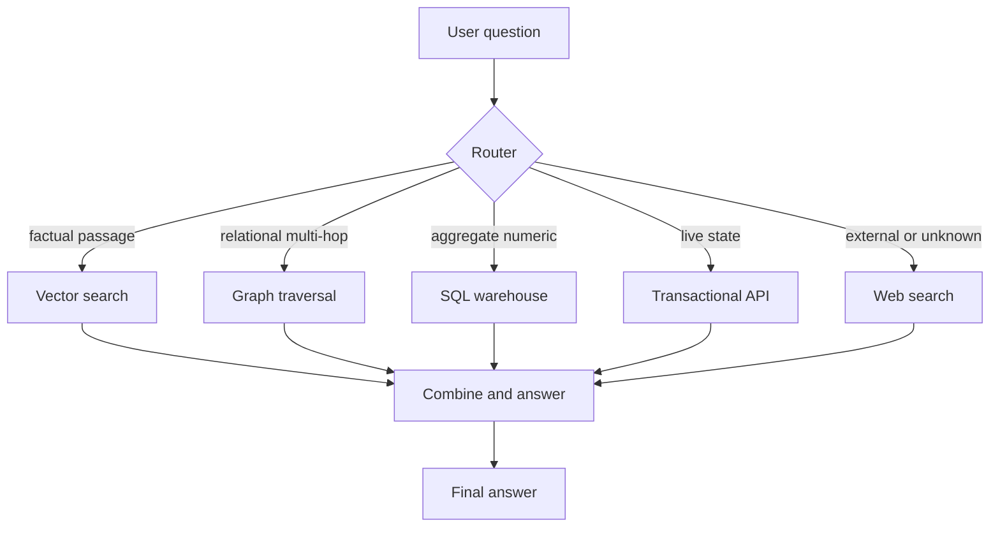
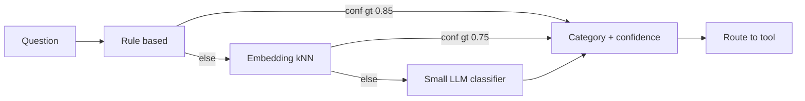
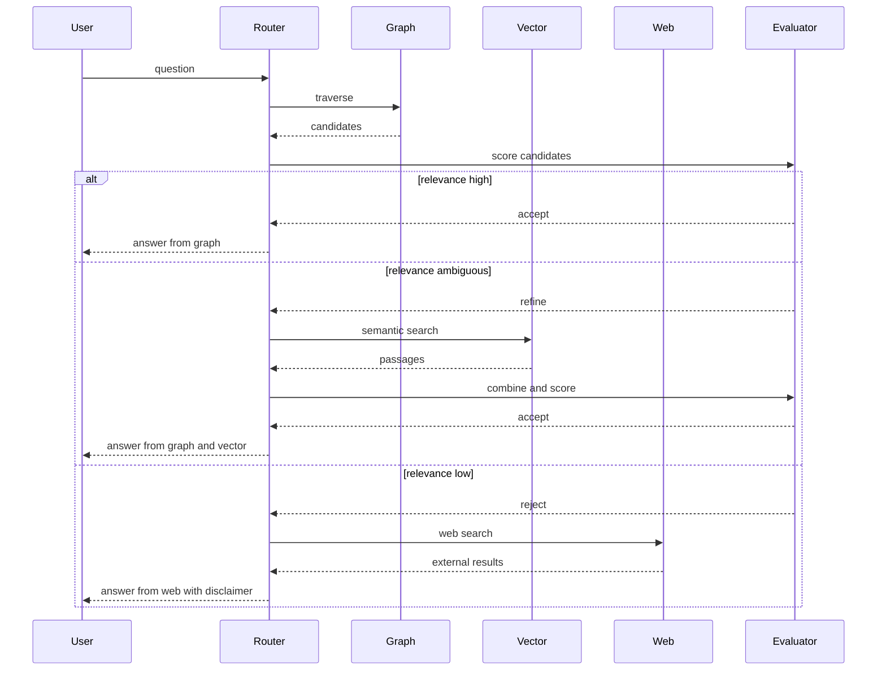
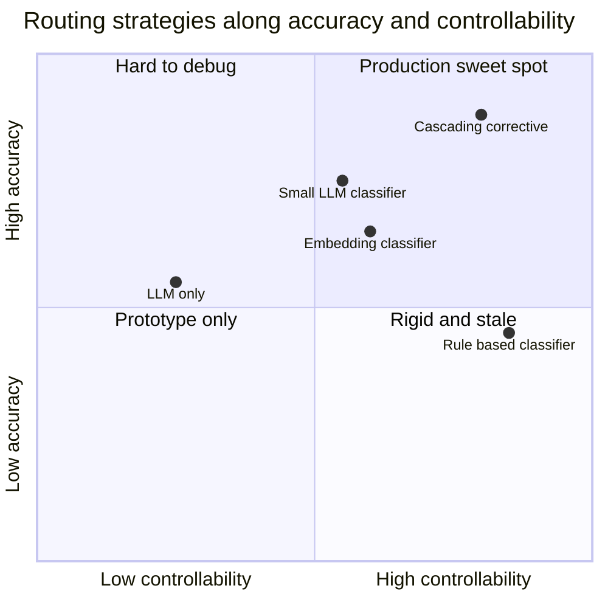

# Query Routing: How the Agent Decides Where to Look

A few weeks ago a compliance analyst asked our assistant a simple question: *"Which products are affected by the new CFPB rule on overdraft fees?"* The agent confidently answered with a three-paragraph summary lifted from marketing pages and a blog post about fee transparency. It was fluent. It was well-cited. It was also wrong in the way that matters: the actual list of regulated products lives in the ontology that connects each product SKU to the regulation node in the knowledge graph. A graph traversal would have returned the answer in 40 milliseconds. Instead the agent ran a cosine-similarity search over embedded documents and got a plausible-sounding mirage.

The failure was not in the vector store. The vector store did exactly what vector stores do: it returned the documents most semantically similar to the question. The failure was not in the graph either — the graph had the correct answer all along. The failure was in the step *before* retrieval, the silent little decision the agent made when it looked at the question and picked a tool. It picked the wrong one. That decision is what this post is about.

In a hybrid system with four or five retrieval backends — a vector index over policy documents, a property graph over products and regulations, a star schema in the warehouse, a couple of REST APIs to transactional systems, maybe a web search as a fallback — the quality of any individual backend matters less than the quality of the routing decision. The router is the switching yard. If the switches are set wrong, the train ends up on the wrong track no matter how well-laid the rails.

## The Routing Problem, Formalized

Before we start solving, let us be precise about what we are solving. The routing problem is a mapping: given a natural-language question $q$, choose a subset of tools $T_q \subseteq T$ that should be invoked, optionally with an order and a combination strategy. In the simplest case $|T_q| = 1$ and we call it single-tool routing. In more interesting cases we want a plan — *first the graph, then enrich with vector, then summarize* — which turns routing into a tiny bit of program synthesis.

We can write the optimal router as

$$
T_q^\star = \arg\max_{T' \subseteq T}\; \mathbb{E}\big[U(a \mid q, T')\big]
$$

where $a$ is the answer produced by the downstream pipeline and $U$ is some utility function that rewards correctness, penalizes latency, and maybe penalizes cost. In production you never know $U$ exactly. You approximate it by an offline evaluation set of labeled questions plus some heuristics about which tool is cheaper.

The space of tools $T$ in a typical enterprise RAG system looks like:

- **Vector search.** Good at "what does the policy say about X?" type queries where the answer is a passage.
- **Graph traversal.** Good at "which products connect to this regulation?" type queries where the answer is a list obtained by walking relationships.
- **SQL over the warehouse.** Good at "how much did fraud cost in Q3 by segment?" type queries where the answer is a number.
- **REST API to a transactional system.** Good at "what is the current status of account 9921?" type queries where the answer is live state.
- **Web search.** Good as a fallback when the internal knowledge is stale or the question is about something outside the organization.

The question space is less easily enumerated but more tractable than it looks. In practice most queries fall into a small number of categories: factual, relational, global or thematic, compliance or traceability, and operational or transactional. The router's real job is to detect which category a question belongs to and pick the tool that handles that category well.



This flowchart is the skeleton. The rest of the post is about how that diamond — the `{Router}` node — actually works.

## Strategy 1: LLM-Only Routing

The simplest strategy, and the one most teams start with, is to let the LLM route. You describe each tool in a docstring, register them as function-calling tools, and trust the model to pick the right one. This is what LangChain's `create_tool_calling_agent`, LlamaIndex's `RouterQueryEngine`, and most Anthropic or OpenAI tool-use examples do out of the box.

It works most of the time. Modern frontier models have absorbed enough of the pattern from their training data that given a reasonable tool description they can pick correctly on 80 to 90 percent of routine queries. This is what makes agent demos look magical. It is also what makes production deployments fail in subtle ways.

Here is the minimal setup:

```python
from typing import Literal
from pydantic import BaseModel, Field
from anthropic import Anthropic

client = Anthropic()

TOOLS = [
    {
        "name": "vector_search",
        "description": (
            "Semantic search over internal policy documents, procedures, "
            "and product descriptions. Use this for questions about what a "
            "policy says, how a process works, or the text of a document."
        ),
        "input_schema": {
            "type": "object",
            "properties": {"query": {"type": "string"}},
            "required": ["query"],
        },
    },
    {
        "name": "graph_traversal",
        "description": (
            "Traverse the product-regulation-customer knowledge graph. Use "
            "this for questions about which entities are related to which "
            "other entities, especially regulatory mappings and product "
            "hierarchies."
        ),
        "input_schema": {
            "type": "object",
            "properties": {
                "start_node": {"type": "string"},
                "relation": {"type": "string"},
            },
            "required": ["start_node", "relation"],
        },
    },
    {
        "name": "sql_warehouse",
        "description": (
            "Run SQL against the analytics warehouse for aggregate metrics, "
            "trends, counts, and averages. Use for any question about "
            "numbers, time series, or grouped statistics."
        ),
        "input_schema": {
            "type": "object",
            "properties": {"sql": {"type": "string"}},
            "required": ["sql"],
        },
    },
]

def route_with_llm(question: str) -> dict:
    resp = client.messages.create(
        model="claude-opus-4-6",
        max_tokens=1024,
        tools=TOOLS,
        messages=[{"role": "user", "content": question}],
    )
    for block in resp.content:
        if block.type == "tool_use":
            return {"tool": block.name, "args": block.input}
    return {"tool": None, "args": None}
```

Give it *"which products are affected by the new CFPB rule?"* and if you are lucky it picks `graph_traversal`. If you are unlucky — and this is the interesting part — it picks `vector_search`, because the word "products" and the word "rule" both appear frequently in your policy documents and the question *feels* like a documentation question. The failure mode is keyword similarity masquerading as intent.

The ToolScan benchmark, which catalogs errors across tool-use LLMs, finds that the dominant error class is Incorrect Function Name — the model picks the wrong tool even when the argument generation would have been correct. The tool-calling benchmark on GitHub reports that five out of eight function-calling models will invoke `get_weather` whenever the word "weather" appears in the prompt, even when the system prompt explicitly instructs them not to. Keyword hooks in the prompt pull the model toward the wrong tool.

### When LLM-only routing fails

Three failure patterns show up repeatedly:

1. **Ambiguous questions.** *"Tell me about account overdrafts"* could be vector (policy text), graph (which products have overdraft features), or SQL (how many customers overdrew last month). The LLM picks one with high confidence and moves on. You never know it was ambiguous.

2. **Questions that look factual but are relational.** *"Is product X in scope for SR 11-7?"* feels like a yes/no factual question. It is actually a graph edge existence check. The LLM tends to read it as factual and runs vector search over compliance documents, which returns the text of SR 11-7 itself — informative but unhelpful for the specific question.

3. **Multi-hop questions that need graph but feel semantic.** *"Which of our retail lending products share a control with the new AML framework?"* is a two-hop graph walk. The LLM will chunk it up into a series of vector searches because it parses the surface as descriptive rather than relational.

The recurring issue is that tool descriptions are prose, the LLM reads them as prose, and the decision boundary ends up being lexical rather than structural. You can partially patch this by writing extraordinarily careful tool descriptions — including negative examples, usage rules, and explicit category mappings — but you are using natural language to encode what is really a classification problem. At some point you want a classifier.

## Strategy 2: Explicit Query Classifier

The second strategy separates the routing decision from the agent loop. Before the LLM sees the tools, a lightweight classifier tags the question with a category. The agent then either invokes the tool mapped to that category directly, or passes the category as a hint and lets the LLM pick among a narrowed set.

This shows up in production systems as a `QueryClassifier` component with a fixed taxonomy. The taxonomy is the single most consequential design choice. Too coarse and you lose signal. Too fine and your labeled data thins out and the classifier becomes unreliable. A taxonomy that has served us well:

- **factual** — single-document, single-fact lookup. Answer is a passage or a short extract. *"What is the maximum transaction limit under the treasury policy?"*
- **relational** — requires traversing relationships between entities. Answer is a list or a path. *"Which controls apply to cross-border wire transfers?"*
- **global / thematic** — requires summarization or synthesis across many documents. Answer is a paragraph or a themed list. *"What are the main operational risks in retail lending this quarter?"*
- **compliance / traceability** — requires reproducible citation from authoritative sources, often graph-backed. Answer must include provenance. *"For every product impacted by SR 11-7, show the evidence and last review date."*
- **operational / transactional** — requires live system state. Answer is a current value. *"What is the current outstanding balance on facility 4407?"*

Three ways to build the classifier, ranging from cheap to sophisticated.

### Rule-based classifier

Start here. Rule-based classifiers are unfashionable and underrated. They are fast, deterministic, easy to debug, and good enough for a surprising fraction of queries.

```python
import re
from dataclasses import dataclass
from typing import Literal

Category = Literal[
    "factual", "relational", "global", "compliance", "operational", "unknown"
]

@dataclass
class Rule:
    pattern: re.Pattern
    category: Category
    confidence: float

RULES: list[Rule] = [
    # Operational / transactional — live state questions
    Rule(re.compile(r"\b(current|latest|right now|today)\b.*\b(balance|status|position)\b", re.I), "operational", 0.9),
    Rule(re.compile(r"\b(what is|show me)\b.*\b(account|facility|transaction)\s*\d+", re.I), "operational", 0.95),

    # Compliance / traceability — regulator, citation, evidence
    Rule(re.compile(r"\b(SR\s*11-7|CFPB|Basel|AML|GDPR|FINRA)\b"), "compliance", 0.85),
    Rule(re.compile(r"\b(evidence|provenance|audit trail|last review|regulated)\b", re.I), "compliance", 0.8),

    # Relational — multi-hop graph language
    Rule(re.compile(r"\b(which|what)\b.*\b(products?|controls?|customers?)\b.*\b(affected by|related to|linked to|share|connected)\b", re.I), "relational", 0.85),
    Rule(re.compile(r"\b(who|what)\s+(owns|manages|reports to|depends on)\b", re.I), "relational", 0.9),

    # Global / thematic — aggregate synthesis
    Rule(re.compile(r"\b(main|key|overall|summary|trend|top|most common)\b", re.I), "global", 0.7),
    Rule(re.compile(r"\b(how (much|many))\b.*\b(this (quarter|year|month))\b", re.I), "global", 0.75),

    # Factual — definition, what does X say
    Rule(re.compile(r"\b(what is|define|explain|describe)\b", re.I), "factual", 0.6),
    Rule(re.compile(r"\b(according to|says|states)\b", re.I), "factual", 0.7),
]

def classify_rule_based(question: str) -> tuple[Category, float]:
    best: tuple[Category, float] = ("unknown", 0.0)
    for rule in RULES:
        if rule.pattern.search(question) and rule.confidence > best[1]:
            best = (rule.category, rule.confidence)
    return best
```

A rule-based classifier will get you somewhere between 50 and 70 percent accuracy on realistic queries, depending on how well you know your users' language. The key insight: rules capture high-precision patterns (regulator acronyms, "share a control with", account-number syntax) that embeddings struggle to learn from small data. Keep the rule set small and readable. When a rule fires with high confidence, trust it. When nothing fires, fall through to something smarter.

### Embedding-based classifier

The second tier uses labeled examples and nearest-neighbor search in embedding space. You collect 10 to 30 canonical examples per category, embed them, and classify a new question by its similarity to each cluster's centroid or to its nearest neighbors.

```python
import numpy as np
from dataclasses import dataclass
from typing import Sequence

# Assume we have an embed() function mapping str -> np.ndarray
# and a labeled set of examples.

@dataclass
class Exemplar:
    text: str
    category: Category
    embedding: np.ndarray

EXAMPLES: list[tuple[str, Category]] = [
    ("What is the maximum limit under treasury policy?", "factual"),
    ("Explain how we calculate regulatory capital.", "factual"),
    ("Which products are affected by the new CFPB rule?", "relational"),
    ("What controls apply to cross-border wires?", "relational"),
    ("For every product under SR 11-7 show the last review date.", "compliance"),
    ("What are the main operational risks this quarter?", "global"),
    ("Summarize top complaint themes for retail lending.", "global"),
    ("What is the current balance on facility 4407?", "operational"),
    ("Show the status of account 9921.", "operational"),
    # ... 20 to 30 per category in a real deployment
]

class EmbeddingClassifier:
    def __init__(self, examples: Sequence[tuple[str, Category]], embed_fn):
        self.embed = embed_fn
        self.exemplars = [
            Exemplar(text, cat, self.embed(text)) for text, cat in examples
        ]
        self.centroids: dict[Category, np.ndarray] = {}
        for cat in set(e.category for e in self.exemplars):
            vecs = np.stack([e.embedding for e in self.exemplars if e.category == cat])
            self.centroids[cat] = vecs.mean(axis=0)

    def classify(self, question: str, k: int = 5) -> tuple[Category, float]:
        q = self.embed(question)
        # kNN over exemplars
        sims = [(e, float(q @ e.embedding / (np.linalg.norm(q) * np.linalg.norm(e.embedding))))
                for e in self.exemplars]
        sims.sort(key=lambda x: -x[1])
        top_k = sims[:k]
        # Majority vote weighted by similarity
        votes: dict[Category, float] = {}
        for e, s in top_k:
            votes[e.category] = votes.get(e.category, 0.0) + s
        cat = max(votes, key=votes.get)
        # Confidence = normalized winning vote
        total = sum(votes.values())
        return cat, votes[cat] / total if total > 0 else 0.0
```

Embedding classifiers are at their best when the category boundary is semantic rather than lexical. They handle paraphrase well — *"what's the cap on treasury trades"* and *"maximum limit under treasury policy"* will cluster together even though they share almost no tokens. They struggle when the category boundary depends on question structure more than content — *"what products share a control with X"* (relational) and *"describe the controls under X"* (factual) live close together in sentence-embedding space even though they want different tools.

A practical tip: use the same embedding model you use for your main vector store. One fewer model to host, and your classifier and retriever will at least disagree for the same reasons.

### Small LLM classifier

The third tier uses a small, fast LLM (7B–13B distilled from a larger model, or a frontier model's Haiku-tier sibling) as a structured classifier. You send the question plus a short definition of each category and get back a label with a confidence.

```python
from pydantic import BaseModel, Field
from typing import Literal

class RouteDecision(BaseModel):
    category: Literal[
        "factual", "relational", "global", "compliance", "operational", "unknown"
    ] = Field(description="The category of the question.")
    confidence: float = Field(ge=0.0, le=1.0)
    rationale: str = Field(description="One sentence explaining the choice.")

CLASSIFIER_PROMPT = """You are a query router. Classify the following question
into exactly one category:

- factual: single-fact lookup in documents. Answer is a passage.
- relational: requires traversing relationships between entities.
- global: requires synthesis or aggregation over many documents.
- compliance: requires authoritative citation, typically regulatory.
- operational: requires live state from a transactional system.

Be conservative. If the question is ambiguous across multiple categories,
pick the category whose tool would fail most gracefully, and set a low
confidence.

Question: {question}

Respond with structured output matching the RouteDecision schema.
"""

def classify_llm(question: str) -> RouteDecision:
    resp = client.messages.create(
        model="claude-haiku-4-5",
        max_tokens=256,
        messages=[{"role": "user", "content": CLASSIFIER_PROMPT.format(question=question)}],
        # Structured output via tool or JSON schema depending on provider
    )
    # Parse structured response
    return RouteDecision.model_validate_json(resp.content[0].text)
```

A small LLM classifier is the most flexible of the three. It handles rare phrasings, can reason about ambiguity, and returns a rationale you can log and audit. The cost is latency and money: even Haiku adds 200–400ms per query. In high-QPS systems, cache classifier outputs keyed on a normalized question hash. For a surprising number of enterprise systems the top 1,000 question templates cover 80 percent of traffic.

In practice, stack all three. Run rules first. If a rule fires with confidence above 0.85, take it. Otherwise run the embedding classifier. If *its* confidence is above 0.75, take that. Otherwise escalate to the LLM classifier. This cascaded classifier is cheap on average and accurate on the long tail.



## Strategy 3: Cascading, Corrective Routing

The first two strategies decide *once*, before retrieval, and commit. The third strategy accepts that the decision might be wrong and builds recovery into the pipeline. This is the generalization of Corrective RAG (CRAG) to multi-source retrieval.

The core idea in CRAG (Yan et al., 2024, arXiv:2401.15884) is a lightweight *retrieval evaluator* that scores the relevance of retrieved documents to the query. If relevance is high, use them. If relevance is ambiguous, refine and combine with web search. If relevance is low, throw the documents out and fall back to web search entirely. Self-RAG (Asai et al., 2023, arXiv:2310.11511) goes further by training the generator itself to emit reflection tokens — `Retrieve`, `ISREL`, `ISSUP`, `ISUSE` — that control whether and how retrieval happens.

Generalizing: instead of routing to a single tool and living with the result, build a cascade. Start with the cheapest or most precise tool. Evaluate. If the result is good, return it. If not, escalate.

For a graph-plus-vector-plus-web system the cascade looks like:



The retrieval evaluator is the piece that does the work. It is usually a small classifier — a trained reranker like a cross-encoder, a small LLM scoring a 1-to-5 grade, or a heuristic over retrieval scores — that answers a single question: *do these results actually match the intent of the query?*

```python
from dataclasses import dataclass

@dataclass
class RetrievalResult:
    source: str              # "graph" | "vector" | "web"
    documents: list[dict]
    raw_scores: list[float]

@dataclass
class EvaluatorDecision:
    verdict: Literal["accept", "refine", "reject"]
    relevance: float         # [0, 1]
    reason: str

def evaluate_retrieval(question: str, result: RetrievalResult) -> EvaluatorDecision:
    # Use a cross-encoder or small LLM grader
    scores = [cross_encoder.score(question, d["text"]) for d in result.documents]
    top = max(scores) if scores else 0.0
    mean = sum(scores) / len(scores) if scores else 0.0

    if top >= 0.8 and mean >= 0.5:
        return EvaluatorDecision("accept", top, "strong alignment")
    if top >= 0.5:
        return EvaluatorDecision("refine", top, "partial alignment")
    return EvaluatorDecision("reject", top, "no relevant documents")

def cascading_route(question: str, category: Category) -> list[RetrievalResult]:
    results: list[RetrievalResult] = []

    # 1. Start with the tool the classifier picked
    first = run_tool(category_to_tool(category), question)
    verdict = evaluate_retrieval(question, first)
    results.append(first)

    if verdict.verdict == "accept":
        return results

    # 2. Refine by combining with a secondary source
    if verdict.verdict == "refine":
        secondary = run_tool("vector_search" if category != "factual" else "graph_traversal", question)
        results.append(secondary)
        combined = merge(first, secondary)
        if evaluate_retrieval(question, combined).verdict == "accept":
            return results

    # 3. Fall back to web search
    web = run_tool("web_search", question)
    results.append(web)
    return results
```

Two properties of cascading routing are worth naming. First, it is *self-correcting*: a wrong initial routing decision is not fatal because the evaluator catches it. Second, it is *auditable*: every step — classifier output, tool output, evaluator verdict — is logged, which makes it possible to later mine the logs for systematic routing errors and push corrections back into the classifier.

The cost is obvious: latency. A cascade that always runs three tools is three times slower than a single routed call. Mitigations include running the secondary tool speculatively in parallel with the evaluator, caching evaluator verdicts for common questions, and tuning the evaluator to be biased toward "accept" when acceptable precision has been achieved.

LangGraph has become the de facto framework for implementing this pattern. The `adaptive-rag` tutorial from LangChain combines ideas from Self-RAG, CRAG, and adaptive RAG into a single state machine. The structure is always the same: a state object threads the question and intermediate results through a graph of nodes, with conditional edges that express the if-accept-then-return, if-reject-then-escalate logic.

## Comparing the Three Strategies

Each strategy trades off along three axes: latency, accuracy, and controllability. LLM-only is fast and flexible but hardest to debug. Classifier-based routing is more accurate on structured questions but requires maintaining a taxonomy and labeled data. Cascading is the most accurate and most auditable but the slowest and most expensive.



A comparison table, because quadrants only show two axes:

| Strategy              | Avg latency | Build cost | Run cost   | Accuracy (typical) | Debuggability |
|-----------------------|------------:|-----------:|-----------:|-------------------:|--------------:|
| LLM-only routing      | 300–600ms   | Low        | Medium     | 0.70–0.85          | Low           |
| Rule-based classifier | 1–5ms       | Medium     | Negligible | 0.50–0.70          | Very high     |
| Embedding classifier  | 20–80ms     | Medium     | Low        | 0.70–0.80          | Medium        |
| Small LLM classifier  | 200–400ms   | Low        | Medium     | 0.80–0.90          | Medium        |
| Cascading corrective  | 500ms–2s    | High       | High       | 0.88–0.95          | High          |

The right choice depends on what you are optimizing. For a chatbot answering low-stakes questions over public docs, LLM-only is perfectly fine. For a compliance assistant where a wrong tool means a wrong citation and a wrong citation means regulatory risk, you want cascading correction on top of an explicit classifier.

## Evaluating the Router as a First-Class Component

The deepest mistake in agent engineering is treating the router as infrastructure rather than a model. It is a model. It has precision and recall. It has a confusion matrix. It can be A/B tested, monitored, and retrained. Most teams never do any of this and as a result have no idea why their agent is wrong when it is wrong.

A router evaluation has three pieces.

### 1. A labeled question set

Collect 200 to 2,000 real user questions and hand-label each with the correct route. Two rules:

- **Sample from production**, not from your imagination. The questions your users actually ask never match the questions you thought they would ask.
- **Label by outcome, not by syntax**. The correct route is the one that produces the best final answer, not the one whose description matches the question most closely.

If you have multiple acceptable routes for some questions (the ambiguous cases), label them as sets. `{"correct_routes": ["vector", "graph"], "preferred": "graph"}` is an honest label.

### 2. Per-route metrics

For each route $r$, compute:

$$
\text{precision}_r = \frac{|\{q : \hat r(q) = r \wedge r \in \text{correct}(q)\}|}{|\{q : \hat r(q) = r\}|}
$$

$$
\text{recall}_r = \frac{|\{q : \hat r(q) = r \wedge r \in \text{correct}(q)\}|}{|\{q : r \in \text{correct}(q)\}|}
$$

Precision tells you how often, when the router picks $r$, it should have. Recall tells you how often, when $r$ was the right choice, the router picked it. Imbalances are informative: high vector-search recall and low vector-search precision means the router is over-using vector search (the classic failure mode). High graph-search precision and low graph-search recall means the router only picks the graph when it is extremely confident, leaving graph-appropriate questions mis-routed to other tools.

### 3. A confusion matrix over the taxonomy

Plot predicted category against actual category. The off-diagonal cells tell you exactly which confusions matter. `relational -> factual` confusions explain the overdraft disaster from the opening. `compliance -> factual` confusions cause citation problems. `global -> factual` confusions are usually harmless because the vector-search answer, while incomplete, is at least on-topic.

```python
from collections import defaultdict
from sklearn.metrics import confusion_matrix, classification_report

@dataclass
class EvalRecord:
    question: str
    correct_routes: set[Category]
    preferred: Category
    predicted: Category
    tool_output_graded: float   # 0 to 1, human or LLM grader

def evaluate_router(
    records: list[EvalRecord]
) -> dict:
    y_true = [r.preferred for r in records]
    y_pred = [r.predicted for r in records]

    # Strict accuracy: predicted must match preferred
    strict = sum(1 for r in records if r.predicted == r.preferred) / len(records)

    # Lenient accuracy: predicted is in the set of correct routes
    lenient = sum(1 for r in records if r.predicted in r.correct_routes) / len(records)

    # Downstream quality: does the final answer pass grading?
    downstream = sum(r.tool_output_graded for r in records) / len(records)

    per_route = classification_report(
        y_true, y_pred, output_dict=True, zero_division=0
    )
    cm = confusion_matrix(y_true, y_pred, labels=sorted(set(y_true + y_pred)))

    return {
        "strict_accuracy": strict,
        "lenient_accuracy": lenient,
        "downstream_quality": downstream,
        "per_route": per_route,
        "confusion": cm.tolist(),
    }
```

The gap between `lenient_accuracy` and `downstream_quality` is diagnostic. If lenient accuracy is 0.92 and downstream quality is 0.78, the router is usually picking an acceptable tool but the tools themselves are dropping the ball — focus on retrieval quality. If the numbers are close, the router is the limiting factor — focus on the classifier and the tool descriptions.

A fourth metric you should compute, even though it is awkward: *regret*. For the questions where the router picked a route that was in `correct_routes` but not `preferred`, how much worse was the answer? If regret is near zero, the distinction between correct and preferred does not matter and you can simplify your labels. If regret is substantial, the preferred route is carrying real information and your taxonomy is under-resolved.

### Running the eval in CI

Put the eval in continuous integration. Every change to tool descriptions, to classifier prompts, to the embedding model, should run through the labeled set and report the delta. This is the single highest-leverage practice I have seen in production agent teams and the one most consistently skipped.

```python
def ci_router_gate(records, baseline_strict=0.85, baseline_downstream=0.80):
    results = evaluate_router(records)
    failures = []
    if results["strict_accuracy"] < baseline_strict:
        failures.append(f"Strict accuracy {results['strict_accuracy']:.3f} below baseline {baseline_strict}")
    if results["downstream_quality"] < baseline_downstream:
        failures.append(f"Downstream quality {results['downstream_quality']:.3f} below baseline {baseline_downstream}")
    # Regression check per category
    for cat, metrics in results["per_route"].items():
        if isinstance(metrics, dict) and metrics.get("f1-score", 1.0) < 0.5:
            failures.append(f"Category {cat} F1 {metrics['f1-score']:.3f} below floor 0.5")
    if failures:
        raise AssertionError("Router regression:\n" + "\n".join(failures))
    return results
```

When the gate fails on a `relational -> factual` drop, you know exactly what changed: someone edited the vector-search tool description and pulled ambiguous questions toward vector when they should have gone to the graph. You fix the description, re-run, pass, merge.

## Prerequisites

A working query-router assumes a few things that are easy to skip and expensive to retrofit:

- **A stable tool surface.** Before you can route, you need the tools themselves to have stable names, argument schemas, and deterministic outputs. Renaming a tool from `search_docs` to `vector_search` is a breaking change to every classifier.
- **A per-query observability record.** Every query should log its inputs, the classifier output, the tool invoked, the tool output, and the final answer. Without this, your eval harness has nothing to regress against and your debugging is guesswork.
- **A labeled evaluation set.** Without labels, you cannot measure. Without measurement, you cannot improve. Bootstrap with 100 questions labeled by the team; grow from production sampling.
- **A retrieval evaluator.** If you plan to do cascading correction, you need a cheap, fast grader of retrieval relevance. A cross-encoder reranker works. A small LLM works. Retrieval scores alone do not.
- **An ontology or taxonomy of queries.** Pick your categories early and commit to them. Changing the taxonomy invalidates your labeled set.

## Gotchas

A few traps I have watched teams fall into.

- **Training the classifier on synthetic data.** If you generate the labeled set by asking a bigger LLM to paraphrase canonical examples, your classifier will be great on paraphrases and terrible on real queries. Spend the time labeling real production data.
- **Routing on tokens that are accidents of phrasing.** The word "show" appears in both *"show me the policy"* (factual) and *"show all products under SR 11-7"* (relational). Surface-level cues are unreliable; the classifier has to learn structure.
- **Treating confidence as probability.** Classifier confidence is a ranking signal, not a calibrated probability. Use it to set thresholds, not to compute expected values.
- **Over-fitting to a few categories.** If 90 percent of production traffic is factual, your confusion matrix will look great on strict accuracy even when your `compliance` and `operational` routes are catastrophically broken. Weight your evaluation by category importance, not frequency.
- **Forgetting about multi-intent queries.** Some questions honestly require two or three tools. *"Which products are impacted by SR 11-7 and how many incidents did they have last quarter?"* is graph then SQL. A single-label classifier maps this to one of the two, always wrong. Use `PydanticMultiSelector` or an equivalent, and accept the complexity.
- **Tool description drift.** Tool descriptions are prompts. Prompts drift when teams tweak them. Version your tool descriptions and run the eval on every change.

## Testing

Three layers of test, in order of importance.

First, **unit tests on the rule-based tier.** Every rule should have positive and negative examples. A rule that matches `\bcurrent\b` should match *"current balance"* and not *"current events"*. Failing unit tests stop the build.

Second, **integration tests on the classifier cascade.** Pick 20 to 50 canonical questions, one per category, and assert that the full cascade routes each to the right tool. These catch the case where a change to one tier breaks the handoff to the next.

Third, **the full eval harness in CI.** On every pull request that touches the router, the classifier, or any tool description, run the 200-to-2,000-question eval and compare to baseline. Fail the build on regression. This is the only test that catches subtle quality drops across the whole system.

A test you will want but rarely see: **adversarial routing tests**. Craft questions specifically designed to pull each classifier toward the wrong tool, and assert that routing is correct. These questions come out of your production confusion matrix — mine the off-diagonal cells for real examples and promote them into a regression set.

## Going Deeper

**Books:**

- Russell, S. & Norvig, P. (2021). *Artificial Intelligence: A Modern Approach* (4th ed.). Pearson.
  - Classical coverage of agent architectures, utility-based decision making, and planning — the conceptual foundation under any router.
- Jurafsky, D. & Martin, J. H. (2024). *Speech and Language Processing* (3rd ed. draft). Stanford.
  - Chapters on classification and information retrieval provide the NLP grounding for the embedding and rule-based classifier tiers.
- Kleppmann, M. (2017). *Designing Data-Intensive Applications.* O'Reilly.
  - Framework for thinking about a routing layer as a request dispatcher over heterogeneous data systems, with clear guidance on consistency and observability.
- Hapke, H., Nelson, C. & Kellermann, J. (2023). *Building Machine Learning Powered Applications.* O'Reilly.
  - Practical ML engineering playbook; the chapters on evaluation and iteration map directly onto treating the router as a product.

**Online Resources:**

- [LlamaIndex Routers documentation](https://docs.llamaindex.ai/en/stable/module_guides/querying/router/) — Canonical reference for `RouterQueryEngine`, `PydanticSingleSelector`, and `PydanticMultiSelector`.
- [LangGraph Adaptive RAG tutorial](https://langchain-ai.github.io/langgraph/tutorials/rag/langgraph_adaptive_rag/) — Worked implementation of a CRAG-plus-Self-RAG-style cascade as a state machine.
- [Berkeley Function Calling Leaderboard](https://gorilla.cs.berkeley.edu/leaderboard.html) — Up-to-date benchmark of how well frontier models handle tool selection and argument generation.
- [Patronus AI Agent Routing Guide](https://www.patronus.ai/ai-agent-development/ai-agent-routing) — Production-oriented write-up of routing patterns and common failure modes.

**Videos:**

- [Complex RAG Flow with LangGraph (Sophia Young & Lance Martin)](https://www.youtube.com/watch?v=-ROS6gfYIts) — Walkthrough of combining CRAG, Self-RAG, and Adaptive RAG in a single LangGraph implementation.
- [LangGraph official tutorial playlist](https://www.youtube.com/playlist?list=PLfaIDFEXuae16n2TWUkKq5PgJ0w6Pkwtg) — Harrison Chase's introduction to LangGraph, including routing and multi-agent patterns.

**Academic Papers:**

- Yan, S.-Q., Gu, J.-C., Zhu, Y. & Ling, Z.-H. (2024). ["Corrective Retrieval Augmented Generation."](https://arxiv.org/abs/2401.15884) arXiv:2401.15884.
  - Introduces the retrieval evaluator and decompose-then-recompose algorithm that underpins cascading correction; the most important paper in the post.
- Asai, A., Wu, Z., Wang, Y., Sil, A. & Hajishirzi, H. (2023). ["Self-RAG: Learning to Retrieve, Generate, and Critique through Self-Reflection."](https://arxiv.org/abs/2310.11511) arXiv:2310.11511.
  - Trains reflection tokens into the generator, letting a single LM decide whether to retrieve and whether to trust what it retrieved.
- Huang, Y., et al. (2024). ["ToolScan: A Benchmark for Characterizing Errors in Tool-Use LLMs."](https://arxiv.org/html/2411.13547v2) arXiv:2411.13547.
  - Catalogs the error taxonomy in LLM tool use, with Incorrect Function Name as the dominant failure — direct evidence for why routing matters.
- Patil, S. G., et al. (2024). ["The Berkeley Function Calling Leaderboard (BFCL)."](https://openreview.net/forum?id=2GmDdhBdDk) OpenReview.
  - Formal benchmark of function-calling performance across models, including multi-turn and parallel function calls.

**Questions to Explore:**

- If the router is itself a model, can you apply active learning to it — routing uncertain questions to a human labeler and feeding the labels back into the classifier? What does the cost curve look like compared to buying more labeled data upfront?
- When the cascade escalates from graph to vector to web, what is the right prior on "the graph just did not have this answer" versus "we wrote the graph traversal query incorrectly"? How do you distinguish between a missing edge and a missing query pattern?
- Most routers treat the question in isolation. Should the router instead consider user identity, conversation history, and time of day? Does that help or does it just leak signal that belongs in the retrieval layer?
- If your taxonomy evolves — say you split `compliance` into `compliance-regulatory` and `compliance-internal-policy` — how do you migrate a labeled set without re-labeling everything? Is there a hierarchical taxonomy design that makes this cheap?
- At what point does the router itself deserve to be an agent with its own reasoning steps, rather than a single classification call? Is there a regime where the meta-cost of a reasoning router outweighs the expected cost of mis-routing in a cascade?
