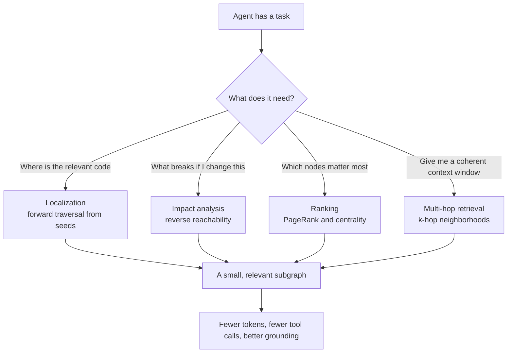
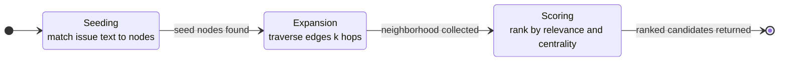
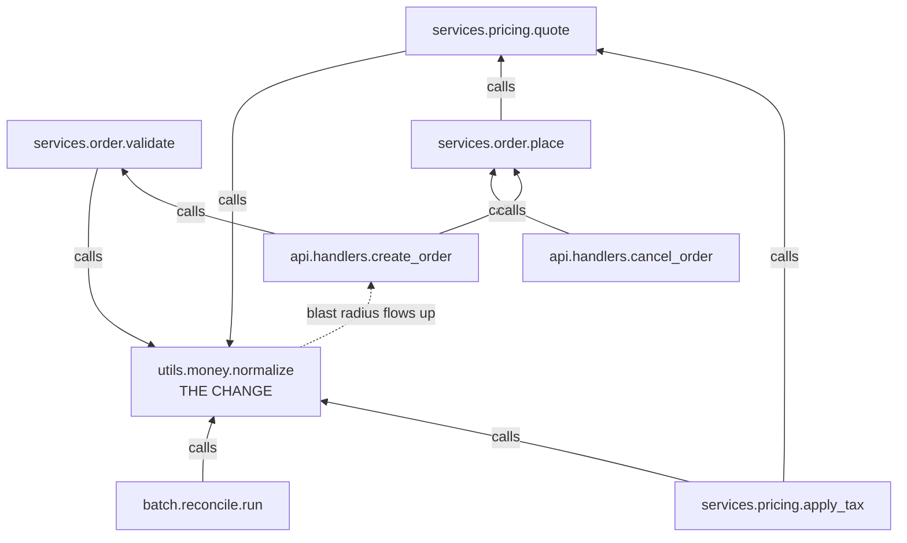
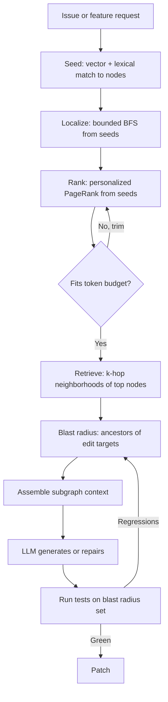

# Querying Code Graphs: Blast Radius, Localization, and Ranking Context

The pull request looked trivial. One line. A junior engineer had renamed a parameter on an internal helper, `normalize(payload, strict=True)`, to `normalize(payload, *, strict=True)` so callers would be forced to pass `strict` by keyword. Clean. Defensible. The kind of change you approve on your phone.

It broke fourteen call sites. Not in the file the change touched, not even in the same package. A batch job three services away imported the helper transitively through a shared utilities module and called it positionally. The agent that wrote the PR had read the helper, read the two files that showed up in a grep for `normalize(`, confirmed they still worked, and declared victory. It never saw the other twelve. It had no way to see them. It was reasoning over a flat pile of files and a keyword search, and keyword search does not know that `from .utils import normalize as _norm` three directories away is the same function.

Here is the uncomfortable part. The information needed to prevent that failure was fully determined by the code. It was not a judgment call, not a matter of taste, not something that required understanding the business domain. It was a graph reachability question: *which nodes can reach this function through call and import edges?* The agent failed not because the answer was hard but because it was asking the wrong data structure. Grep is a substring oracle. The question was about topology.

In [Part 2 of this series](https://juanlara18.github.io/portfolio/#/blog/repo-to-graph-ast-vs-llm-extraction) we built the graph. We took a repository and turned it into nodes (files, classes, functions, modules) and edges (imports, calls, inheritance, containment), whether by parsing the AST deterministically or by having an LLM extract relationships from messier code. That post ended with a graph sitting in memory and an implicit promise: *this will be worth it.* This post is where we collect on that promise. Having a graph is inert. The value is entirely in the queries you run against it, and the queries are where "we added a knowledge graph" turns from architecture-diagram theater into measurable wins: fewer tokens loaded into context, fewer tool calls burned on exploration, and answers grounded in the actual structure of the code instead of the model's fuzzy recollection of what a codebase like this usually looks like.

Let me be concrete about the stakes. A coding agent operating over a real repository has a fixed, small budget of attention. Even with a large context window, every token you spend on an irrelevant file is a token not spent on the relevant one, and worse, it is noise that degrades the model's ability to find the signal. Every tool call, every `read_file`, every `grep`, is a round trip that costs latency and money and gives the model another chance to wander. The whole game is to load the *right* small subgraph and nothing else. Graph queries are how you find that subgraph.

## From Graph to Answers: The Four Query Classes

Almost everything a coding agent needs from a code graph falls into one of four query classes. They are not exotic. They map onto standard graph algorithms that have existed for decades, which is exactly why this works: we are not inventing new theory, we are recognizing that a problem the industry frames as "prompt engineering" is often a solved graph problem wearing a disguise.



The four classes:

1. **Localization.** Given a natural-language description of a bug or a feature, find the files and functions you actually need to touch. This is a search problem: pick seed nodes, then expand outward along edges. It is forward traversal from an entry point.

2. **Impact analysis (blast radius).** Given a node you intend to change, find everything that could break. This is reverse reachability: not "what does this call" but "what calls this," transitively. It is the query the one-line PR needed.

3. **Ranking.** Given more relevant code than fits in the budget, decide what to load first. This is centrality: some functions are load-bearing and some are leaves, and you can compute which is which. This is where PageRank comes back, applied to a call graph instead of the web.

4. **Multi-hop retrieval.** Given a query, return a *coherent* chunk of the codebase, a connected neighborhood, rather than a scatter of individually-similar-looking snippets. This is where graph retrieval beats flat vector chunks for code.

The rest of this post takes each in turn, with runnable [networkx](https://networkx.org/) over a small code graph. I will build one example graph and reuse it, because the whole point is that these queries compose. You localize to find seeds, compute blast radius to bound the change, rank to prioritize, and retrieve a neighborhood to feed the model. Four queries, one graph.

Let me set up the running example. Assume Part 2 handed us a directed graph where **an edge points from caller to callee**, that is, from the thing that depends on something to the thing depended upon. `A -> B` reads "A calls B" or "A imports B." This direction convention matters enormously and I will keep hammering it, because getting it backwards silently inverts every query in this post.

```python
import networkx as nx

# A code graph as produced by Part 2's extraction pass.
# Nodes are fully-qualified functions; node attributes carry metadata.
# Edge A -> B means "A calls or imports B" (A depends on B).

G = nx.DiGraph()

functions = [
    ("api.handlers.create_order",   {"kind": "function", "file": "api/handlers.py",   "loc": 40}),
    ("api.handlers.cancel_order",   {"kind": "function", "file": "api/handlers.py",   "loc": 25}),
    ("services.order.place",        {"kind": "function", "file": "services/order.py",  "loc": 60}),
    ("services.order.validate",     {"kind": "function", "file": "services/order.py",  "loc": 30}),
    ("services.pricing.quote",      {"kind": "function", "file": "services/pricing.py", "loc": 45}),
    ("services.pricing.apply_tax",  {"kind": "function", "file": "services/pricing.py", "loc": 20}),
    ("utils.money.normalize",       {"kind": "function", "file": "utils/money.py",     "loc": 12}),
    ("utils.money.to_cents",        {"kind": "function", "file": "utils/money.py",     "loc": 8}),
    ("batch.reconcile.run",         {"kind": "function", "file": "batch/reconcile.py", "loc": 55}),
    ("db.orders.insert",            {"kind": "function", "file": "db/orders.py",       "loc": 18}),
]
G.add_nodes_from(functions)

calls = [
    ("api.handlers.create_order", "services.order.place"),
    ("api.handlers.create_order", "services.order.validate"),
    ("api.handlers.cancel_order", "services.order.place"),
    ("services.order.place",      "services.pricing.quote"),
    ("services.order.place",      "db.orders.insert"),
    ("services.order.validate",   "utils.money.normalize"),
    ("services.pricing.quote",    "services.pricing.apply_tax"),
    ("services.pricing.quote",    "utils.money.normalize"),
    ("services.pricing.apply_tax","utils.money.normalize"),
    ("utils.money.normalize",     "utils.money.to_cents"),
    ("batch.reconcile.run",       "utils.money.normalize"),
    ("batch.reconcile.run",       "db.orders.insert"),
]
G.add_edges_from(calls)

print(G.number_of_nodes(), "nodes,", G.number_of_edges(), "edges")
```

Notice `utils.money.normalize` is called from four places: `validate`, `quote`, `apply_tax`, and the batch reconciler. That is the helper from the opening story. Keep an eye on it.

## Localization: From a Bug Report to a Subgraph

Localization is the first thing an agent does with any task, and historically it does it badly. The default loop is: read the issue, guess some keywords, grep, read whatever comes back, grep again. This works for shallow bugs in small repos and falls apart exactly where you need it, in a large codebase where the words in the bug report do not appear in the code that causes the bug. A report that says "checkout total is wrong for international orders" contains none of the tokens `apply_tax` or `normalize`, yet that is where the fix lives.

This is the problem [LocAgent](https://arxiv.org/abs/2503.09089) (Chen et al., ACL 2025) set out to solve, and their framing is the right one. They parse the codebase into a directed heterogeneous graph, nodes for files, classes, and functions, edges for imports, invocations, and inheritance, and then give an LLM agent tools to *search and traverse* that graph rather than the raw text. The agent starts from entities that match the issue and reasons across multiple hops to reach the code that actually needs changing. The reported results are worth stating precisely because they justify the whole enterprise: up to 92.7 percent file-level localization accuracy, and, using a fine-tuned open model in place of a proprietary one, roughly 86 percent cost reduction with a 12 percent improvement in downstream issue-resolution success across multiple attempts. The mechanism behind those numbers is multi-hop reasoning over structure, which is exactly what a flat text search cannot do.

The pattern generalizes cleanly, and you do not need their full framework to use it. Localization is a two-phase operation:



**Phase one, seeding.** Find entry points where the issue text plausibly touches the graph. This is a hybrid retrieval step: lexical matches on identifiers and docstrings, plus vector similarity between the issue embedding and node embeddings (function signatures, docstrings, surrounding comments). You do not need this step to be precise. You need it to have *recall*, to land somewhere in the right region of the graph, because the expansion phase will do the precision work.

**Phase two, expansion.** From the seeds, walk the graph outward, collecting neighbors, and let the structure surface the real target even when it shared no words with the query. This is a bounded breadth-first search.

```python
from collections import deque

def seed_nodes(G, query_terms):
    """Phase 1: lexical seeding. In production, add vector similarity.
    Returns nodes whose identifier or file path matches any query term."""
    seeds = []
    for node, data in G.nodes(data=True):
        haystack = (node + " " + data.get("file", "")).lower()
        if any(term.lower() in haystack for term in query_terms):
            seeds.append(node)
    return seeds

def localize(G, seeds, max_hops=2, budget=8):
    """Phase 2: bounded BFS over BOTH directions.
    We expand along callees (what the seed uses) and callers (who uses
    the seed), because a bug can live upstream or downstream of the
    text match. Returns nodes with their hop distance from the seed set."""
    visited = {s: 0 for s in seeds}
    frontier = deque((s, 0) for s in seeds)
    # Treat the graph as undirected for traversal, but remember direction
    # by consulting successors and predecessors separately.
    while frontier:
        node, depth = frontier.popleft()
        if depth >= max_hops:
            continue
        neighbors = set(G.successors(node)) | set(G.predecessors(node))
        for nb in neighbors:
            if nb not in visited:
                visited[nb] = depth + 1
                frontier.append((nb, depth + 1))
    # Prefer nodes closer to a seed; break ties later with centrality.
    ranked = sorted(visited.items(), key=lambda kv: kv[1])
    return ranked[:budget]

# "checkout total is wrong for international orders" -> the word "tax"
# never appears, but "pricing" and "order" do.
seeds = seed_nodes(G, ["pricing", "order"])
for node, hops in localize(G, seeds, max_hops=2, budget=8):
    print(f"{hops} hops: {node}")
```

The subtlety that separates a working localizer from a toy is in the expansion direction. My `localize` walks *both* successors and predecessors, and that is deliberate. A bug can be downstream of your text match (the function you found calls the broken one) or upstream (the function you found is called by the broken one). If you only walk callees you miss the caller that passes bad input; if you only walk callers you miss the utility that computes the wrong number. For pure localization, treat the graph as undirected during traversal but keep the directed edges around, because you will need direction the moment you switch to impact analysis.

Two design decisions make this practical at scale. First, **bound the hops.** Two is usually right, three is the ceiling; every additional hop multiplies the candidate set and quietly reintroduces the "load the whole repo" problem you were trying to escape. The blast radius of an unbounded traversal is the entire connected component. Second, **rank before you truncate.** BFS gives you a set ordered by distance, but distance-one neighbors are not all equally relevant. This is exactly where the ranking query from Section 5 plugs in: score the expanded candidate set by centrality and keep the top *k* that fit the budget. Localization and ranking are not separate features; ranking is the sort key localization needs.

One more note on seeding, because it is where teams underinvest. The seed step is a small retrieval problem and it deserves the same care you would give any [RAG retriever](https://juanlara18.github.io/portfolio/#/blog/rag-advanced-patterns). Embed function signatures and docstrings, not raw bodies; bodies are noisy and the signature plus docstring is the highest-signal summary of what a function is *for*. Combine lexical and vector recall. And when the issue references a stack trace, a log line, or an error type, mine it, those are gold seed nodes because they name code directly. The better your seeds, the fewer hops you need, and fewer hops means a tighter, cheaper subgraph.

## Blast Radius: Reverse Reachability and Why Signature Changes Are Graph Problems

Now the query that would have saved the opening PR. You are about to change `utils.money.normalize`, its signature, its return type, its error behavior, does not matter. The question is: **what depends on it, transitively?** Not just direct callers, everything that could observe the change through any chain of calls.

This is reverse reachability, and it is where the edge direction convention earns its keep. Our edges point caller to callee. Direct callers of a node are its **predecessors**. Everything that can reach it, all transitive callers, is its set of **ancestors** in the graph. networkx gives you this directly:

```python
target = "utils.money.normalize"

# Direct callers only (one hop up).
direct = list(G.predecessors(target))

# Everything that can reach the target through any path of call edges.
# THIS is the blast radius: transitive callers.
blast_radius = nx.ancestors(G, target)

print("Direct callers:", sorted(direct))
print("Blast radius:  ", sorted(blast_radius))
```

Running this on our graph:

```
Direct callers: ['batch.reconcile.run', 'services.order.validate',
                 'services.pricing.apply_tax', 'services.pricing.quote']
Blast radius:   ['api.handlers.cancel_order', 'api.handlers.create_order',
                 'batch.reconcile.run', 'services.order.place',
                 'services.order.validate', 'services.pricing.apply_tax',
                 'services.pricing.quote']
```

Look at what `nx.ancestors` surfaced that the four direct callers did not. `api.handlers.create_order` and `cancel_order` are in the blast radius even though neither calls `normalize` directly. They call `place` and `validate`, which reach `normalize` two and one hops down. A grep for `normalize(` finds the four direct callers. Reverse reachability finds the seven functions that actually observe the change, including the two public API handlers that are the most important ones to check because they are what users hit. `batch.reconcile.run`, the batch job from the opening story, is right there in the set, exactly the caller the agent never saw.

Here is the mental model as a diagram. Blast radius is the flood upstream from the change:



The arrows are call edges pointing at the change; the blast radius is everything from which you can reach the red node by following arrows. That is `nx.ancestors`, verbatim.

The dual query is just as useful and just as easy to get backwards. If instead you want to know **what a function depends on**, its downstream, "if I want to understand `normalize`, what does it need to work?", you want **descendants**:

```python
# What normalize depends on (downstream). Useful for building a
# self-contained context to reason about a function.
dependencies = nx.descendants(G, target)
print("Depends on:", sorted(dependencies))   # -> ['utils.money.to_cents']
```

`nx.ancestors(G, n)` returns every node that can reach `n`; `nx.descendants(G, n)` returns every node reachable *from* `n`. Neither includes `n` itself, so add it back if your downstream consumer expects it. Both are set-returning and run a traversal under the hood, linear in the size of the reachable subgraph.

Why is this a *graph* problem rather than a text problem, at a deeper level than "grep misses aliases"? Because the property you care about, "can a change here be observed there," is precisely the definition of reachability, and reachability is not expressible as a local pattern. No amount of looking at the changed file tells you its blast radius; the answer lives in the global structure. Signature changes are the sharpest example. A signature is a contract, and a contract binds every caller no matter how far away. When you make `strict` keyword-only, you have altered a contract that seven functions across five files transitively rely on, and the only faithful representation of "who relies on this contract" is the ancestor set in the call graph. This is the same reason [graph theory](https://juanlara18.github.io/portfolio/#/blog/graph-theory-mathematics-of-connections) shows up wherever "influence spreads through connections", epidemics, citations, package dependencies. Impact analysis is influence spreading backward through the call relation.

A few refinements that matter in production:

**Weight the radius by risk, do not just count it.** Seven affected functions is not a number, it is a set with structure. A change touching two public API handlers is scarier than one touching seven internal leaves. Combine blast radius with the centrality scores from the next section: `blast_radius x pagerank` gives you a risk-ranked list of what to test first. The reconcile batch job might be low-centrality; the two API handlers are high. Test the handlers.

**Bound it, or accept it is unbounded.** For a leaf utility called everywhere, the blast radius can be most of the repo, and that is a true and useful answer: it tells you this is a change to touch with extreme care, or not at all. But when you feed a subgraph to an agent, an unbounded ancestor set blows the budget. Use `nx.single_source_shortest_path_length` on the *reversed* graph to get callers within a hop bound:

```python
# Callers within 2 hops, with their distance, on the reversed graph.
R = G.reverse(copy=False)
near_callers = nx.single_source_shortest_path_length(R, target, cutoff=2)
print(near_callers)  # {node: hops} for everything within 2 call-hops upstream
```

**Cycles are real and `ancestors` handles them, your intuition might not.** Recursive functions and mutually recursive modules create cycles, and in a cyclic graph "ancestors" and "descendants" can overlap, a node can be both upstream and downstream of another. networkx's reachability is correct on cyclic graphs (it is just BFS/DFS over the directed edges), but any code you write that assumes a DAG, topological sorts, naive recursion over predecessors, will break or loop forever. If you need a DAG, condense strongly connected components first with `nx.condensation`, which collapses each cycle into a single super-node and hands you back a genuine DAG to reason over.

## Ranking What to Load: PageRank Over the Call Graph

You have localized. You have bounded the blast radius. You still, routinely, have more relevant code than fits in the budget. A blast radius of forty functions is common in a mature service, and you cannot load forty function bodies without either overflowing the window or, worse, drowning the two functions that matter in thirty-eight that do not. You need a priority order. You need to know which nodes are *important*.

This is exactly the problem PageRank was invented for, and the mapping to code is almost suspiciously direct. In my [PageRank post](https://juanlara18.github.io/portfolio/#/blog/pagerank-eigenvectors) the setup was: a web page is important if important pages link to it, a recursive definition made tractable by treating it as the stationary distribution of a random surfer, which turns out to be the dominant eigenvector of the link matrix. Swap "web page" for "function" and "hyperlink" for "call" and you have code centrality. **A function is important if important functions call it.** A utility that everything depends on, `normalize`, in our example, accrues rank from all its callers; a leaf handler that nothing calls has only whatever base rank the damping term provides.

The edge direction convention pays off one final time. PageRank flows rank *along* edges toward the nodes edges point at. Our edges point caller to callee, so rank accumulates on callees, on the widely-depended-upon utilities, which is precisely the "importance" we want for context selection. If you had built the graph with edges pointing callee to caller, PageRank would rank your entry points highest instead, a different and usually less useful notion. Direction is destiny.

```python
# PageRank over the call graph. alpha is the damping factor (0.85 is
# the canonical value from the original PageRank paper): with prob 0.85
# the random surfer follows a call edge, with prob 0.15 it teleports.
importance = nx.pagerank(G, alpha=0.85)

for node, score in sorted(importance.items(), key=lambda kv: -kv[1]):
    print(f"{score:.4f}  {node}")
```

The ranking that comes out:

```
0.2000  utils.money.normalize
0.1300  utils.money.to_cents
0.1000  services.pricing.quote
0.0900  db.orders.insert
0.0800  services.pricing.apply_tax
...
```

`normalize` tops the ranking, as it should: four direct callers and seven transitive ones. `to_cents` is second because the highly-ranked `normalize` calls it, importance flows through. The API handlers, despite being where users enter, rank low, because in a call graph the entry points are sources, not sinks, they give rank rather than receive it. This is the correct behavior for *context ranking*: if the agent is going to reason about a change, the shared utilities are the load-bearing walls it must understand, and the handlers are comparatively disposable leaves it can summarize.

The most important refinement, and the one that makes this genuinely useful for agents rather than a static "here are the important files" report, is **personalized PageRank.** Global PageRank tells you what is important in general. But relevance is relative to a task. When the agent is working on a specific issue, you want importance *as seen from the seed nodes* of that issue, not importance in the abstract. Personalization biases the random surfer's teleport step to jump back to your seeds instead of to a uniform-random node, so rank concentrates in the region of the graph near the task.

```python
def rank_for_task(G, seeds, top_k=5):
    """Personalized PageRank: importance relative to the task's seeds.
    The teleport distribution puts all its mass on the seed nodes, so
    rank concentrates around code relevant to THIS issue."""
    personalization = {n: 0.0 for n in G.nodes}
    for s in seeds:
        personalization[s] = 1.0 / len(seeds)
    scores = nx.pagerank(G, alpha=0.85, personalization=personalization)
    return sorted(scores.items(), key=lambda kv: -kv[1])[:top_k]

seeds = ["api.handlers.create_order"]     # the issue is about order creation
for node, score in rank_for_task(G, seeds, top_k=5):
    print(f"{score:.4f}  {node}")
```

Now the ranking reshapes around the order-creation flow: `create_order`, `place`, `validate`, `quote`, and the utilities *they* reach rise to the top, while `cancel_order` and the batch reconciler, structurally distant from the seed, sink. This is the single most valuable code-graph query for a token-constrained agent. You give it "the issue is about order creation" and it returns, in priority order, the functions to load, ranked by structural relevance to *that* issue rather than to the repo as a whole.

This is not a research curiosity; it is shipping. [Aider](https://aider.chat/2023/10/22/repomap.html) builds a "repo map" by extracting symbols with tree-sitter, constructing a graph where files are nodes and shared-symbol dependencies are edges, and running personalized PageRank to select which definitions to show the model within a fixed token budget (`--map-tokens`). The mentioned files get the personalization mass; PageRank spreads relevance to their structural neighbors; the top-ranked definitions, elided to signatures, become the map. It is the exact pattern above, seeds plus personalized PageRank plus a token budget, deployed in a widely used coding tool. When people say Aider "understands" a large repo better than a naive tool, this is the machinery. There is no magic, just an eigenvector.

A practical caution on centrality choice. PageRank is the right default, but it is not the only measure, and the alternatives answer different questions. **In-degree** (how many functions call this) is a cheap proxy that ignores the importance of the callers, fine for a first pass, misleading when a function is called many times but only by junk. **Betweenness centrality** finds functions that sit on many paths between other functions, the chokepoints and bridges, which is a great signal for "what is architecturally central" but is expensive to compute (it needs all-pairs shortest paths, roughly cubic on dense graphs) and usually overkill for context selection. For ranking what to load, personalized PageRank at `alpha=0.85` is the workhorse; reach for the others only when you have a specific structural question they answer better.

## Multi-Hop Retrieval: k-Hop Neighborhoods Versus Flat Chunks

Everything so far assumed you already had a graph query in hand. Step back to the retrieval layer, because this is where graph structure changes the *unit* of retrieval, and where it most clearly beats the default RAG-over-code setup.

The standard approach to code RAG is the same as document RAG: split every file into fixed-size chunks, embed each chunk, and at query time return the top-*k* chunks by vector similarity. This is a category error for code, and it fails in two specific, predictable ways. First, **it fragments logical units.** A function that spans a chunk boundary gets split; a class and its methods land in different chunks; a function and the helper it cannot work without are retrieved or not retrieved independently. You get syntactically adjacent lines, not semantically complete units. Second, **it retrieves lookalikes, not collaborators.** Vector similarity surfaces chunks that *resemble* the query text, five different functions that all validate input and read similarly, when what the agent needs is the *one* validation function plus the schema it validates against plus the caller that invokes it. Those collaborators do not look alike. They look like each other's context. Flat vector retrieval, which only knows textual similarity, is structurally blind to the "works together" relation, and "works together" is exactly the call edge.

This is the same limitation I explored for documents in [ontology-grounded RAG](https://juanlara18.github.io/portfolio/#/blog/ontology-grounded-rag-chunks-in-nodes): flat chunks lose the relationships that make retrieved context coherent, and the fix is to make the *node*, not the chunk, the retrieval unit and let edges carry the relationships. Code is the ideal case for this because the relationships are not fuzzy semantic links you had to infer, they are calls and imports the parser already gave you for free. The graph is *already* the ground truth of what works with what.

The graph-native retrieval unit is the **k-hop neighborhood**: given a relevant node, return it together with the subgraph within *k* call-hops. networkx gives you this with `ego_graph`:

```python
def retrieve_neighborhood(G, center, radius=1):
    """Return the k-hop neighborhood of `center` as a subgraph.
    ego_graph with undirected=True includes both callers and callees,
    so the unit is 'this function plus everything it collaborates with
    within k hops', a coherent context, not a bag of lookalikes."""
    ego = nx.ego_graph(G, center, radius=radius, undirected=True)
    return ego

hood = retrieve_neighborhood(G, "services.pricing.quote", radius=1)
print("Nodes in the retrieval unit:")
for n in hood.nodes:
    print("  ", n)
print("Edges (the relationships we get for free):")
for u, v in hood.edges:
    print(f"   {u} -> {v}")
```

For `services.pricing.quote` at radius 1, the unit is `quote` plus its callers (`services.order.place`) and its callees (`apply_tax`, `normalize`), *with the edges between them*. That is a self-contained, readable slice of the pricing flow. An agent handed this can reason about a change to `quote` and immediately see who calls it and what it depends on, without a single extra tool call. Contrast the flat-chunk version, which might return `quote`'s body, an unrelated `validate` function that also happens to mention "amount," and half of `apply_tax` cut off at a chunk boundary. One of these is context; the other is noise that looks like context.

`nx.ego_graph(G, n, radius=k, undirected=True)` returns the induced subgraph on all nodes within distance `k` of `n`, and crucially it includes the *edges among those nodes*, which is the whole point: you retrieve the relationships, not just the nodes. Set `undirected=False` to get only downstream (callees) if you want a "what does this need to run" slice, or run it on `G.reverse()` for a callers-only slice. The `radius` parameter is your coherence-versus-size dial: radius 1 is a tight, high-precision unit; radius 2 pulls in the broader flow at the cost of tokens.

When does graph retrieval actually beat vector retrieval for code? Be honest about the trade-off, because "always use the graph" is as wrong as "always use vectors":

| Situation | Better retriever | Why |
|---|---|---|
| "Where is the function that does X" | Vector or lexical seed | You need recall over descriptions; similarity finds the entry point |
| "Give me everything I need to change function Y safely" | Graph (k-hop + blast radius) | Coherence and completeness beat similarity; you need collaborators |
| Cross-file feature spanning a call chain | Graph (multi-hop) | The chain is edges; vectors see each link in isolation |
| Fuzzy semantic query with no code anchor | Vector | No seed node to traverse from; fall back to similarity |
| Reasoning about impact of a change | Graph (reverse reachability) | Impact is reachability, not similarity, full stop |

The mature pattern is not graph *or* vector, it is **vector to seed, graph to expand.** Use embeddings to solve the recall problem, find a foothold node from a natural-language query, then use the graph to solve the coherence and completeness problem, expand that foothold into a connected, relevant subgraph. Vector retrieval gets you *near* the answer; graph retrieval assembles the answer into something the model can actually reason over. This hybrid is the state of the art in the [advanced RAG patterns](https://juanlara18.github.io/portfolio/#/blog/rag-advanced-patterns) I have written about, and code is where it shines brightest because the graph is exact.

## Repository-Aware Repair and Generation: Feeding the Subgraph Back

The four query classes are means to an end, and the end is that the agent writes better code with less flailing. This is where the recent literature on repository-aware repair and generation ties the whole thing together, and the results are the strongest argument for doing any of this.

[KGCompass](https://arxiv.org/abs/2503.21710) (Yang et al., 2025) is the cleanest demonstration for *repair*. Its two ideas are exactly the ones we have built up. First, a repository-aware knowledge graph that links not only code entities (files, classes, functions) but also repository *artifacts*, issues and pull requests, so the graph connects "the bug report" to "the code" natively. Second, a path-guided repair mechanism: it mines *paths* through the graph from the issue to candidate fault locations and feeds those paths, the connective tissue between symptom and cause, to the LLM as context for generating the patch. Structurally this is localization (issue to candidate functions) plus multi-hop retrieval (the path connecting them) plus ranking (it narrows to the 20 most relevant functions). The reported outcome on SWE-bench Lite is state-of-the-art single-model repair accuracy at, notably, about 0.2 dollars per repair. That cost number is the thesis of this whole post stated in dollars: you get better results *and* pay less, because you stopped shoveling the repository through the context window and started sending the twenty functions that matter.

[Knowledge Graph Based Repository-Level Code Generation](https://arxiv.org/abs/2505.14394) (Athale and Vaddina, LLM4Code at ICSE 2025) makes the parallel case for *generation*. LLMs generating code against an evolving repository struggle with contextual accuracy, they hallucinate APIs, miss existing helpers, reinvent utilities that already exist, because flat retrieval gives them a poor picture of what the repo actually contains and how it fits together. Representing the repository as a graph and retrieving structurally relevant context improves the quality and relevance of generated code. Same lesson, generation instead of repair: the graph is a better index of a codebase than a pile of embeddings because it encodes the relationships that determine whether generated code will actually integrate.

Here is the composed pipeline, the four queries assembled into the thing you would actually ship:



Read the savings off that diagram. The agent never loaded a file it did not need, because ranking gated the budget. It never missed a caller, because blast radius bounded the change and told the verify step exactly which tests to run, the seven functions from Section 4, not the whole suite and not just the four greps would have found. It made a handful of graph queries, each cheap and deterministic, in place of a long exploratory chain of `read_file` and `grep` calls, each of which costs a model round trip and a chance to wander. Fewer tokens, fewer tool calls, better grounding. That is the entire pitch, and the repair-cost numbers from the literature are it made quantitative.

## Gotchas: Where This Goes Wrong

I have shown the queries working on a clean ten-node graph. Real graphs are bigger and messier, and a senior engineer's value here is knowing the failure modes before they cost a day.

**Stale graphs are worse than no graph.** The graph is a cache of the code's structure, and like every cache it goes stale. An agent that trusts a graph built before the last three commits will confidently compute a blast radius that omits a caller added yesterday, and it will be *more* dangerous than grep because it will present its incomplete answer with the authority of a graph query. Rebuilding the whole graph on every change is too slow for a large repo, so the real engineering is incremental update: on a file change, reparse that file and patch only its nodes and edges. Tie graph freshness to your VCS, invalidate on commit, and never let the agent reason over a graph whose provenance you cannot state. A wrong blast radius is the specific failure that started this post.

**Cycles break DAG assumptions silently.** I raised this under blast radius; it deserves its own line because it is the most common way homegrown graph code corrupts. Real call graphs have cycles, recursion, mutual imports, callback registration, and the moment you write a traversal that assumes acyclicity you get either infinite loops or subtly truncated results. networkx's `ancestors`, `descendants`, `pagerank`, and `ego_graph` are all cycle-safe. Your own DFS may not be. If you need a DAG for topological reasoning, run `nx.condensation` first and operate on the condensed graph.

**Over-expansion quietly rebuilds the problem you were solving.** Every query in this post has a knob, hops in BFS, radius in `ego_graph`, cutoff in shortest-path, and every knob, turned up, tends toward "load the whole connected component." Three-hop expansion from a central utility can pull in most of the repo. The discipline is to set a *token budget first* and let the budget bound the traversal, not the other way around. Rank, then truncate to the budget. If your subgraph does not fit, the answer is a smaller radius or tighter ranking, never a bigger context window, because the bigger window degrades reasoning even when it technically fits.

**Traversal is not free, and neither is centrality.** For most repos, `ancestors`, `descendants`, and `ego_graph` are cheap, linear in the reachable subgraph, and you can run them per-query without a second thought. PageRank over a whole large graph is more expensive but still fast and, critically, *cacheable*: compute global PageRank offline, refresh it on the same cadence as the graph, and only run *personalized* PageRank per-task, which is cheaper because it converges near the seeds. Betweenness centrality is the trap, roughly cubic, do not put it in a hot path. Budget your queries the way you budget tokens: cache the expensive global ones, run the cheap local ones live.

**Not every task needs the graph.** The final and most senior judgment call: a shallow bug in a single file, a typo, a wrong constant, does not need localization, blast radius, or ranking. Grep finds it, the agent fixes it, done. The graph earns its cost on *cross-cutting* changes, signature changes, refactors, features that span a call chain, impact analysis, exactly the changes where flat search fails. Wiring the graph into every trivial task adds latency and complexity for no gain and trains you to distrust it. Use it where reachability, centrality, or coherence is the actual question, and use grep where it is not. Knowing the difference is the skill.

Where this goes next is the obvious question the whole series is building toward. We have treated the graph as a static index of code structure, queried fresh each time. But an agent working a codebase over hours or days accumulates knowledge, which functions it has already understood, which changes worked, which paths were dead ends, and re-deriving that from scratch on every task is its own waste of tokens and tool calls. That accumulated, queryable knowledge is *graph memory*, and it is the subject of Part 4. The queries stay the same; the graph starts to remember.

## Going Deeper

**Books:**

- Newman, M. E. J. (2018). *Networks* (2nd ed.). Oxford University Press.
  - The definitive text on network structure and centrality measures. Chapters on degree, eigenvector, betweenness, and PageRank-style centralities give you the theory behind every ranking query in this post.
- Nielson, F., Nielson, H. R., and Hankin, C. (2015). *Principles of Program Analysis.* Springer.
  - The rigorous foundation for call graphs, control-flow graphs, and reachability analysis. If you want to know why blast radius is a reachability problem in the formal sense, this is the source.
- Easley, D., and Kleinberg, J. (2010). *Networks, Crowds, and Markets.* Cambridge University Press.
  - Free online. The most readable derivation of PageRank as a stationary distribution, plus the graph-theoretic intuition for why importance propagates along edges. Directly reinforces the ranking section.
- Kleppmann, M. (2017). *Designing Data-Intensive Applications.* O'Reilly.
  - Not about code graphs specifically, but its treatment of graph data models and traversal query languages is the best practical framing for thinking about a code graph as a queryable store.

**Online Resources:**

- [NetworkX documentation](https://networkx.org/documentation/stable/reference/algorithms/index.html) — The algorithm reference. Every function used here, `pagerank`, `ancestors`, `descendants`, `ego_graph`, `condensation`, `single_source_shortest_path_length`, with signatures and complexity notes.
- [Aider repo map](https://aider.chat/2023/10/22/repomap.html) — Aider's own writeup of building a tree-sitter symbol graph and ranking it with personalized PageRank under a token budget. The production reference implementation of Section 5.
- [LocAgent on GitHub](https://github.com/gersteinlab/LocAgent) — The code for the graph-guided localization framework, including how they build the heterogeneous graph and expose traversal tools to the agent.

**Videos:**

- [PageRank on Khan Academy](https://www.khanacademy.org/computing/computer-science/internet-intro/internet-works-intro/v/the-internet-how-search-works) by Khan Academy — A clear visual introduction to how link-based ranking works, the intuition that transfers directly to ranking functions by their callers.
- [Graph Algorithms for Technical Interviews](https://www.youtube.com/watch?v=tWVWeAqZ0WU) by freeCodeCamp — A thorough hands-on tour of BFS, DFS, and reachability, the traversal primitives behind localization and blast radius, with runnable code.

**Academic Papers:**

- Chen, Z., et al. (2025). ["LocAgent: Graph-Guided LLM Agents for Code Localization."](https://arxiv.org/abs/2503.09089) *Proceedings of ACL 2025.*
  - The reference for graph-guided localization. Parses the repo into a heterogeneous graph and lets an agent traverse it, reporting up to 92.7 percent file-level accuracy with roughly 86 percent cost reduction using a fine-tuned open model.
- Yang, B., et al. (2025). ["Enhancing Repository-Level Software Repair via Repository-Aware Knowledge Graphs."](https://arxiv.org/abs/2503.21710) *arXiv:2503.21710.*
  - KGCompass. Links issues and PRs to code entities in one graph and uses path-guided repair, narrowing to the 20 most relevant functions and achieving state-of-the-art single-model repair on SWE-bench Lite at about 0.2 dollars per repair.
- Athale, M., and Vaddina, V. (2025). ["Knowledge Graph Based Repository-Level Code Generation."](https://arxiv.org/abs/2505.14394) *LLM4Code at ICSE 2025.*
  - Makes the generation-side case: representing the repository as a graph for context retrieval improves the quality and contextual relevance of generated code over flat retrieval.

**Questions to Explore:**

- If personalized PageRank ranks context by structural relevance to a task, could an agent *learn* a better personalization vector from which retrieved functions actually ended up in successful patches, turning context selection into a trainable component?
- Blast radius is exact for static call edges but blind to dynamic dispatch, reflection, and runtime plugin loading. How much of real breakage lives in the edges a static graph cannot see, and what is the honest floor on precision?
- When does the cost of maintaining a fresh code graph exceed the tokens it saves? Is there a repository size or change velocity below which flat retrieval is simply the rational choice?
- If two functions are structurally distant but always change together in the commit history, should that co-change relation be an edge in the graph? What does retrieval look like when the graph mixes static structure with learned temporal coupling?
- Every query here assumes the graph is ground truth. What would it take for an agent to notice its graph is stale, to detect that the code it is reading contradicts the edges it was given, and repair its own index mid-task?
