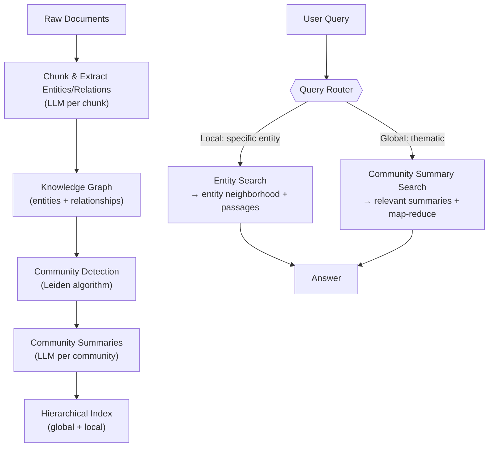
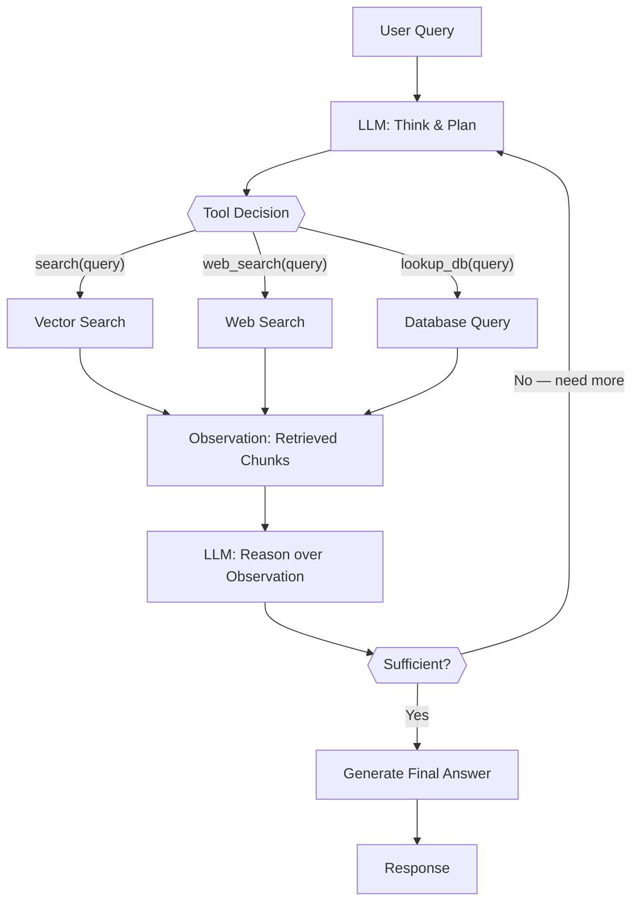

# Advanced RAG: From Naive Retrieval to Systems That Actually Work

## Where Naive RAG Falls Apart

Part 1 of this series covered the foundations: how chunking works, why embedding quality matters, what a vector index is doing when it answers your query in milliseconds, and how to get a basic RAG pipeline running end-to-end. If you have not read it, the short version is: you split documents into chunks, embed them into dense vectors, store them in a vector database, and at query time you embed the query, find the nearest neighbor chunks, and pass them to an LLM to generate an answer.

That pipeline works in demos. In production it fails in ways that are frustrating precisely because they are so predictable in hindsight.

**Vocabulary mismatch** is the first failure mode. A medical knowledge base indexed with clinical terminology — "myocardial infarction", "cerebrovascular accident", "pyrexia" — will not surface relevant documents when a patient types "heart attack", "stroke", or "fever". The semantic embeddings are better than keyword search at bridging these gaps, but they are not perfect, and the gap between clinical and lay vocabularies is wide enough to matter. A user who asks "what causes heart attack" may get nothing useful from a corpus that contains excellent information about myocardial infarction because the embedding space does not fully close the distributional gap between the query and the documents.

**Multi-hop questions** break the naive pipeline structurally. The question "Which product did the team that built GPT-4 release after it?" requires first retrieving who built GPT-4, then using that answer to retrieve what that team released next. No single chunk contains both pieces of information. Naive RAG retrieves top-k chunks matching the whole query, which tends to return documents about GPT-4 without connecting to what came after.

**Temporal reasoning** is subtle but pervasive. Questions like "What is the current pricing for the Pro tier?" or "What changed in version 3.2?" require understanding recency. If your index contains many versions of the documentation, the right answer depends on which version is most recent — information that is typically in metadata, not in the dense vector, and therefore invisible to pure semantic retrieval.

**Synthesis questions** fail because the relevant information is distributed across many chunks. "Summarize the main arguments for and against the proposed regulation" requires reading twenty documents, not finding one passage. Top-k retrieval finds the most similar chunks, not the most representative sample of a corpus.

**Ambiguous queries** fail silently. A question like "How does it handle authentication?" issued in the middle of a conversation where "it" refers to an API the user asked about three turns ago will retrieve whatever documents happen to be closest to "authentication" — which may be entirely different systems from the one the user cares about.

**Chunking artifacts** are perhaps the most insidious. When a document describes a concept that spans four paragraphs, your chunking strategy — 512 tokens with 50-token overlap — may slice the critical explanation across two chunks. Each chunk looks semantically reasonable in isolation. Neither one contains the complete explanation. The LLM gets one half and confidently generates an incomplete or wrong answer.

Every one of these failure modes has a known fix. The rest of this post is about those fixes.

## Query Transformation

The simplest observation about naive RAG is that the query the user types is often not the best query for retrieval. It might be too short, too colloquial, too specific, too ambiguous, or too conversational. Query transformation techniques close this gap before retrieval begins.

### HyDE: Hypothetical Document Embeddings

The core insight behind HyDE (Gao et al. 2022) is that query vectors and document vectors live in different distributional neighborhoods in embedding space. A document that says "Aspirin inhibits cyclooxygenase enzymes, reducing prostaglandin synthesis" is semantically close to other documents about pharmacology, drug mechanisms, and enzyme inhibition. A query that says "how does aspirin work" is semantically close to other questions — short, interrogative, colloquial. Even in a good embedding space, these two representations are not as close as they should be.

HyDE solves this by asking the LLM to generate a hypothetical document that would answer the query, then embedding that hypothetical document instead of the original query. The hypothetical document is in document-space: it is long, declarative, uses the same vocabulary as indexed documents, and mentions the same kinds of entities. Even if it is factually incorrect — which it may be, since we are asking an LLM to hallucinate an answer before retrieval — its embedding will be in the right neighborhood to find the actual documents we want.

```python
from langchain_openai import ChatOpenAI, OpenAIEmbeddings
from langchain.prompts import ChatPromptTemplate
from langchain_core.output_parsers import StrOutputParser

llm = ChatOpenAI(model="gpt-4o-mini", temperature=0)
embeddings = OpenAIEmbeddings(model="text-embedding-3-small")

# Step 1: generate a hypothetical document
hyde_prompt = ChatPromptTemplate.from_template(
    """Write a short technical passage (3-5 sentences) that would directly answer the following question.
    Write it in the style of a factual encyclopedia or technical documentation entry.
    Do not say you are hypothesizing — just write the passage.

    Question: {question}

    Passage:"""
)

hyde_chain = hyde_prompt | llm | StrOutputParser()

def hyde_retrieve(question: str, vectorstore, k: int = 5) -> list:
    # Generate a hypothetical document
    hypothetical_doc = hyde_chain.invoke({"question": question})

    # Embed the hypothetical doc, not the question
    hyp_embedding = embeddings.embed_query(hypothetical_doc)

    # Use the hypothetical embedding to search
    results = vectorstore.similarity_search_by_vector(hyp_embedding, k=k)
    return results

# Usage
question = "how does aspirin work in the body?"
chunks = hyde_retrieve(question, my_vectorstore, k=5)
```

HyDE helps most when the gap between query style and document style is large. For highly technical corpora queried by non-experts, or for corpora in formal language queried conversationally, it can substantially improve recall. The tradeoff is one extra LLM call per query, adding roughly 200-400ms depending on model latency.

### Step-Back Prompting

Some queries are so specific that they miss the broader context needed to answer them. If a user asks "What was Usain Bolt's speed at the 2008 Beijing Olympics 100m final?", the most relevant document might be a general overview of sprint physiology and world records — not a per-race statistics page that might not exist in your corpus at all.

Step-back prompting generates a more abstract version of the query — stepping back from the specific instance to the relevant domain — and uses that for retrieval. The original specific query is kept for generation, so the final answer remains grounded in the user's actual question.

```python
step_back_prompt = ChatPromptTemplate.from_template(
    """Given a specific question, generate a more general, abstract question that would help retrieve
    background knowledge needed to answer the specific question.

    Specific question: {question}

    Abstract step-back question:"""
)

step_back_chain = step_back_prompt | llm | StrOutputParser()

def step_back_retrieve(question: str, vectorstore, k: int = 5) -> list:
    abstract_question = step_back_chain.invoke({"question": question})

    # Retrieve on the abstract question
    abstract_chunks = vectorstore.similarity_search(abstract_question, k=k)

    # Also retrieve on the original for direct matches
    direct_chunks = vectorstore.similarity_search(question, k=k)

    # Combine, deduplicate by chunk id
    seen = set()
    combined = []
    for chunk in abstract_chunks + direct_chunks:
        if chunk.metadata["chunk_id"] not in seen:
            seen.add(chunk.metadata["chunk_id"])
            combined.append(chunk)

    return combined
```

### Query Decomposition (Multi-Query)

Complex questions that touch multiple topics need different documents for each sub-topic. "Compare the memory efficiency, inference speed, and fine-tuning cost of LoRA versus full fine-tuning for LLMs" is really three separate questions. Retrieving on the entire question finds documents that mention all three topics together — which are rare — instead of the excellent individual resources on each topic.

LangChain's `MultiQueryRetriever` does this automatically:

```python
from langchain.retrievers.multi_query import MultiQueryRetriever

retriever = MultiQueryRetriever.from_llm(
    retriever=vectorstore.as_retriever(search_kwargs={"k": 4}),
    llm=llm,
)

# The retriever internally decomposes the question, retrieves for each sub-query,
# and deduplicates the results
docs = retriever.get_relevant_documents(
    "Compare the memory efficiency, inference speed, and fine-tuning cost "
    "of LoRA versus full fine-tuning for LLMs"
)
```

If you need to see what queries were generated, or want to customize the decomposition:

```python
from langchain.prompts import PromptTemplate

decomposition_prompt = PromptTemplate(
    input_variables=["question"],
    template="""You are an AI assistant. Generate 3 different sub-questions that together
    cover all aspects of the following question. These sub-questions will be used to retrieve
    documents from a knowledge base. Output only the questions, one per line.

    Original question: {question}

    Sub-questions:""",
)

retriever = MultiQueryRetriever.from_llm(
    retriever=vectorstore.as_retriever(search_kwargs={"k": 4}),
    llm=llm,
    prompt=decomposition_prompt,
)
```

### Conversational Query Rewriting

Conversational RAG has a specific, annoying failure mode: follow-up questions use pronouns and implicit references that only make sense in context. "What about its limitations?" issued after a discussion of transformer attention is a perfectly clear follow-up for a human. For a retrieval system, it is nearly useless as a query.

The fix is condense-and-rewrite: use the conversation history to reformulate the follow-up as a standalone question before retrieval.

```python
from langchain.chains import create_history_aware_retriever
from langchain_core.prompts import MessagesPlaceholder

contextualize_q_prompt = ChatPromptTemplate.from_messages([
    ("system",
     "Given a chat history and the latest user question, reformulate the question "
     "as a standalone question that can be understood without the chat history. "
     "Do NOT answer the question. Only reformulate it if needed; otherwise return it as-is."),
    MessagesPlaceholder("chat_history"),
    ("human", "{input}"),
])

history_aware_retriever = create_history_aware_retriever(
    llm, vectorstore.as_retriever(), contextualize_q_prompt
)
```

This rewriter runs before every retrieval call. It adds latency but is non-negotiable for conversational systems where users naturally build on previous turns.

### RAG-Fusion

RAG-Fusion (Shi et al. 2024) combines query decomposition with Reciprocal Rank Fusion. Generate multiple query variations from the user's question, retrieve separately for each, then merge the result lists using RRF. The key property of RRF is that it rewards documents that appear consistently across multiple ranked lists — a document in position 3 for query A and position 4 for query B outscores a document in position 1 for only one query. This produces more robust rankings than any single query alone.

```python
from langchain_core.runnables import RunnablePassthrough
from langchain_core.output_parsers import StrOutputParser

def reciprocal_rank_fusion(results: list[list], k: int = 60) -> list:
    """
    Merge multiple ranked document lists using Reciprocal Rank Fusion.
    k=60 is the standard constant from the original RRF paper.
    Returns documents sorted by fused score, descending.
    """
    fused_scores: dict = {}
    for docs in results:
        for rank, doc in enumerate(docs):
            doc_id = doc.metadata.get("chunk_id", doc.page_content[:100])
            if doc_id not in fused_scores:
                fused_scores[doc_id] = {"doc": doc, "score": 0.0}
            fused_scores[doc_id]["score"] += 1 / (rank + k)

    reranked = sorted(
        fused_scores.values(), key=lambda x: x["score"], reverse=True
    )
    return [item["doc"] for item in reranked]


query_gen_prompt = ChatPromptTemplate.from_template(
    """Generate {n} different versions of the following query to retrieve documents
    from a knowledge base. Vary vocabulary, specificity, and framing.
    Output only the queries, one per line.

    Query: {query}"""
)

query_gen_chain = (
    query_gen_prompt
    | llm
    | StrOutputParser()
    | (lambda x: x.strip().split("\n"))
)

def rag_fusion_retrieve(query: str, vectorstore, n_queries: int = 4, k: int = 5) -> list:
    generated_queries = query_gen_chain.invoke({"query": query, "n": n_queries})
    all_queries = [query] + generated_queries  # include the original

    all_results = [
        vectorstore.similarity_search(q, k=k)
        for q in all_queries
    ]

    return reciprocal_rank_fusion(all_results)
```

RAG-Fusion is more expensive than a single-query retrieval — you are doing N vector searches instead of one. But the RRF combination typically improves hit rate by 10-20% on complex questions, and for user-facing systems where retrieval quality directly affects answer quality, this is often worth the overhead.

## Advanced Retrieval Strategies

Query transformation improves what goes into retrieval. The following strategies improve how retrieval itself is structured.

### Parent-Document Retrieval (Small-to-Big)

There is a fundamental tension in chunking: small chunks are better for precise semantic matching (they contain a single focused concept), but large chunks are better for generation (they provide more context). A 128-token chunk will match a specific technical claim precisely. A 1024-token chunk will give the LLM the surrounding explanation, examples, and caveats needed to answer well.

Parent-Document Retrieval resolves this by maintaining two representations: small child chunks for retrieval, and their parent documents (or larger parent chunks) for generation.

```python
from langchain.retrievers import ParentDocumentRetriever
from langchain.storage import InMemoryStore
from langchain.text_splitter import RecursiveCharacterTextSplitter
from langchain_chroma import Chroma

# Child splitter: small chunks for precise retrieval
child_splitter = RecursiveCharacterTextSplitter(chunk_size=400, chunk_overlap=50)

# Parent splitter: larger chunks returned during generation
parent_splitter = RecursiveCharacterTextSplitter(chunk_size=2000, chunk_overlap=200)

# Vector store only needs to hold the small child chunks
vectorstore = Chroma(
    collection_name="child_chunks",
    embedding_function=embeddings,
)

# Document store holds the parent chunks (or full documents)
docstore = InMemoryStore()  # In production: use Redis or another persistent store

retriever = ParentDocumentRetriever(
    vectorstore=vectorstore,
    docstore=docstore,
    child_splitter=child_splitter,
    parent_splitter=parent_splitter,
)

# Ingestion: stores children in vector store, parents in docstore
retriever.add_documents(documents)

# Retrieval: searches child chunks, returns their parents
relevant_docs = retriever.get_relevant_documents("query here")
# These docs are parent-sized — 2000 tokens of rich context
```

The docstore can be any key-value store. For production, replace `InMemoryStore` with a Redis-backed store so parents survive restarts. The child-to-parent mapping is stored in the child chunk's metadata.

### Contextual Retrieval

Anthropic published a technique in 2024 that addresses a specific chunking artifact: when a chunk is extracted from its document, it loses the context that tells you where it fits. A chunk reading "Q3 revenue grew 23% year over year" could be from any company's earnings report. Without the surrounding context, the embedding does not capture "this is about Acme Corp's Q3 2024 financials."

Contextual Retrieval prepends each chunk with a short, LLM-generated context summary before indexing. The context anchor explains the chunk's place in the larger document.

```python
from anthropic import Anthropic

client = Anthropic()

def generate_chunk_context(document_text: str, chunk_text: str) -> str:
    """
    Generate a brief context summary for a chunk within its document.
    Use a fast, cheap model here — you are calling this N times per document.
    """
    response = client.messages.create(
        model="claude-3-haiku-20240307",  # Fast and cheap for this task
        max_tokens=200,
        messages=[{
            "role": "user",
            "content": f"""Here is a document:
<document>
{document_text[:8000]}  <!-- Truncate if needed to fit context window -->
</document>

Here is a specific chunk from this document:
<chunk>
{chunk_text}
</chunk>

Provide a brief (2-3 sentence) context that situates this chunk within the document.
Describe: which section it comes from, what larger topic it is part of, and any key
entities it references that provide essential context.
Write only the context, no preamble."""
        }],
    )
    return response.content[0].text


def contextualize_and_index(documents: list, vectorstore) -> None:
    """Index documents with contextual chunk enrichment."""
    from langchain.text_splitter import RecursiveCharacterTextSplitter

    splitter = RecursiveCharacterTextSplitter(chunk_size=800, chunk_overlap=100)

    for doc in documents:
        chunks = splitter.split_text(doc.page_content)

        for i, chunk_text in enumerate(chunks):
            context = generate_chunk_context(doc.page_content, chunk_text)
            # Prepend the context — the embedding now captures both
            enriched_text = f"{context}\n\n{chunk_text}"

            vectorstore.add_texts(
                texts=[enriched_text],
                metadatas=[{
                    "source": doc.metadata["source"],
                    "chunk_index": i,
                    "original_chunk": chunk_text,  # Keep original for display
                }],
            )
```

Anthropic reports that Contextual Retrieval reduces retrieval failures by 49% when combined with reranking. The main cost is the context generation step: if you have 100,000 chunks, you are making 100,000 LLM calls. Use the cheapest model that produces coherent output — Haiku, GPT-4o-mini, or Gemini Flash work well here — and cache aggressively.

### Ensemble Retrieval

Dense vector search is excellent for semantic similarity but poor for exact-match queries ("what is the API endpoint for /v2/users/batch?"), rare terminology, and queries where specific words matter more than overall meaning. BM25 (a sparse keyword retrieval method) is excellent for exact matches and rare terms but poor at semantic understanding. They are complementary.

Ensemble retrieval runs multiple retrievers in parallel and merges their results with Reciprocal Rank Fusion.

```python
from langchain.retrievers import EnsembleRetriever, BM25Retriever
from langchain_chroma import Chroma

# Dense retriever: semantic similarity via embeddings
dense_retriever = vectorstore.as_retriever(search_kwargs={"k": 10})

# Sparse retriever: BM25 keyword matching
# BM25Retriever needs the raw documents (not a vector store)
bm25_retriever = BM25Retriever.from_documents(documents, k=10)

# Ensemble: each retriever is given equal weight by default
# Adjust weights to favor one over the other
ensemble_retriever = EnsembleRetriever(
    retrievers=[dense_retriever, bm25_retriever],
    weights=[0.6, 0.4],  # 60% dense, 40% sparse
)

# Combine with a metadata filter for time-sensitive content
from langchain.retrievers import ContextualCompressionRetriever
from langchain.retrievers.document_compressors import LLMChainFilter

# Optional: add an LLM filter to prune irrelevant documents after retrieval
_filter = LLMChainFilter.from_llm(llm)
final_retriever = ContextualCompressionRetriever(
    base_compressor=_filter,
    base_retriever=ensemble_retriever,
)

docs = final_retriever.get_relevant_documents("your query")
```

The `weights` parameter in `EnsembleRetriever` should be tuned based on your corpus and query patterns. If your users ask precise technical questions, lean on BM25. If they ask broad conceptual questions, lean on dense retrieval.

## Self-RAG and Adaptive Retrieval

Static RAG pipelines always retrieve, regardless of whether the query needs retrieval. Asking "What is 17 × 43?" to a RAG system will trigger a vector search, find tangentially related documents, and confuse the LLM. More importantly, static pipelines never verify whether what they retrieved is actually useful.

### Self-RAG

Self-RAG (Asai et al. 2023) proposes fine-tuning a model that generates special reflection tokens during inference to decide: should I retrieve at all? Is this passage I retrieved actually relevant? Is my answer grounded in the retrieved passages? Is my answer useful?

The four token types are:
- **[Retrieve]**: binary decision — retrieve or skip retrieval
- **[ISREL]**: is the retrieved passage relevant to the query?
- **[ISSUP]**: does the passage support the generated claim?
- **[ISUSE]**: is the overall response useful?

This is a training-time intervention, not a pipeline pattern — you need a Self-RAG fine-tuned model. But the architecture has directly inspired the CRAG and FLARE patterns below, which you can implement as pipeline logic without fine-tuning.

### FLARE: Forward-Looking Active Retrieval

FLARE (Jiang et al. 2023) observes that during long-form generation, the information needs shift as the answer develops. A question like "Explain the development of transformer architecture and its impact on NLP benchmarks" requires different documents at different points in the answer. FLARE addresses this by pausing generation when the model's confidence drops — indicated by low-probability tokens — and using the partial output to trigger a targeted retrieval.

```python
from langchain.chains import FlareChain
from langchain_openai import OpenAI

# FLARE requires a completion model (not chat) for probability inspection
llm_for_flare = OpenAI(model="gpt-3.5-turbo-instruct", max_tokens=512)

flare = FlareChain.from_llm(
    llm=llm_for_flare,
    retriever=vectorstore.as_retriever(search_kwargs={"k": 5}),
    max_generation_len=256,
    min_prob=0.3,  # Trigger retrieval when token probability drops below this threshold
)

response = flare.run(
    "Explain the development of transformer architecture and its impact on NLP benchmarks"
)
```

FLARE is particularly valuable for knowledge-intensive long-form generation tasks: technical summaries, research synthesis, detailed explanations. The adaptive retrieval ensures that each section of the answer is grounded by relevant documents — not just the opening.

### CRAG: Corrective RAG

CRAG (Yan et al. 2024) adds a verification and correction loop after retrieval. Instead of assuming that the top-k retrieved documents are useful, CRAG scores their relevance. If all retrieved documents score below a confidence threshold, it takes corrective action: web search, alternative retrieval, or explicit fallback to parametric knowledge with an uncertainty marker.

```python
from langchain_core.runnables import RunnablePassthrough, RunnableLambda
from langchain_core.output_parsers import StrOutputParser

# Relevance evaluator
relevance_prompt = ChatPromptTemplate.from_template(
    """Rate the relevance of the following retrieved document to the given question.
    Return only a score between 0.0 and 1.0.

    Question: {question}
    Document: {document}

    Relevance score (0.0-1.0):"""
)

relevance_chain = relevance_prompt | llm | StrOutputParser()

def evaluate_and_correct(inputs: dict) -> dict:
    question = inputs["question"]
    docs = inputs["docs"]

    # Score each retrieved document
    scores = []
    for doc in docs:
        score_str = relevance_chain.invoke({
            "question": question,
            "document": doc.page_content[:500],
        })
        try:
            scores.append(float(score_str.strip()))
        except ValueError:
            scores.append(0.5)  # Default if parse fails

    avg_score = sum(scores) / len(scores) if scores else 0

    if avg_score > 0.7:
        # High confidence: use as-is
        return {"docs": docs, "retrieval_quality": "high"}
    elif avg_score > 0.4:
        # Moderate confidence: filter to only high-scoring docs
        filtered = [doc for doc, score in zip(docs, scores) if score > 0.5]
        return {"docs": filtered if filtered else docs, "retrieval_quality": "moderate"}
    else:
        # Low confidence: could trigger web search or signal uncertainty
        # Here we pass through but flag it
        return {"docs": docs, "retrieval_quality": "low", "uncertain": True}


crag_chain = (
    RunnablePassthrough.assign(docs=lambda x: vectorstore.similarity_search(x["question"], k=5))
    | RunnableLambda(evaluate_and_correct)
    | RunnablePassthrough.assign(
        answer=lambda x: generate_answer(x["question"], x["docs"])
    )
)
```

CRAG's verification step costs approximately 100-200ms per document evaluated, depending on model speed. For systems where hallucination from bad retrieval is a serious risk — medical, legal, financial — the tradeoff is clearly worth it.

## GraphRAG

Standard RAG treats your document corpus as a collection of independent passages. Each chunk is retrieved in isolation. The connections between entities, the patterns that emerge across many documents, the thematic structure of a large corpus — all of this is invisible to the retriever.

GraphRAG, formalized in the Microsoft paper by Edge et al. (2024), builds a knowledge graph before any query arrives. At query time, instead of retrieving isolated passages, you can traverse entity relationships and query at the level of topics, themes, and communities.

### The Problem GraphRAG Solves

Consider a corpus of 10,000 customer support tickets. A naive RAG system can answer "what did customer X say about product Y?" by finding the relevant ticket. But it cannot reliably answer "what are the most common themes in complaints about product Y across all customers?" — because that answer requires aggregating and synthesizing across hundreds of documents, not finding a single relevant passage.

GraphRAG addresses the global query problem. It builds a graph-structured view of the entire corpus, then answers queries that require corpus-level understanding.

### The GraphRAG Pipeline



The ingestion pipeline is the expensive part:

```python
# Conceptual — Microsoft GraphRAG has its own CLI/API
# pip install graphrag

# Initialize a GraphRAG project
# graphrag init --root ./my-corpus

# settings.yml (key configuration)
"""
llm:
  api_key: ${OPENAI_API_KEY}
  model: gpt-4o-mini          # For entity extraction (N calls per chunk)
  model_supports_json: true

embeddings:
  async_mode: threaded
  llm:
    model: text-embedding-3-small

chunks:
  size: 300
  overlap: 100

entity_extraction:
  prompt: "prompts/entity_extraction.txt"
  entity_types: [person, organization, product, concept, event]
  max_gleanings: 1

community_reports:
  prompt: "prompts/community_report.txt"
  max_length: 2000
  max_input_length: 8000
"""

# Run ingestion
# graphrag index --root ./my-corpus
# This calls the LLM for every chunk to extract entities — expensive!

# Query
# graphrag query --root ./my-corpus --method global --query "What themes dominate customer complaints?"
# graphrag query --root ./my-corpus --method local --query "What products does Acme Corp use?"
```

### Local vs Global Search

Microsoft GraphRAG provides two query modes that reflect fundamentally different information needs.

**Local search** works like enhanced RAG. Given a query, find the relevant entities, retrieve their descriptions, retrieve the passages that mention them, and construct an answer from that local neighborhood of the graph. This is best for queries about specific entities or direct relationships.

**Global search** is the unique capability. The corpus-wide community summaries are retrieved, and a map-reduce pattern is used: first generate partial answers from each relevant community summary, then reduce across all partial answers to a final response. This enables answering questions like "what are the dominant themes?", "how has the discussion evolved over time?", "what are the most commonly mentioned concerns?"

### When to Use GraphRAG

GraphRAG is not a replacement for standard RAG. It is a specialized tool for a specific class of queries.

| Query Type | Standard RAG | GraphRAG |
|---|---|---|
| "What does document X say about Y?" | Excellent | Adequate |
| "What is the relationship between A and B?" | Poor | Excellent |
| "What themes appear across the corpus?" | Very poor | Excellent |
| "Summarize all mentions of entity X" | Moderate | Excellent |
| "Find documents relevant to this specific passage" | Excellent | Poor |
| Latency requirement: <500ms | Achievable | Very difficult |

The cost structure is also very different. Building a GraphRAG index over a 10,000 document corpus requires calling an LLM for every chunk during ingestion — easily 50,000-200,000 API calls for extraction and summarization. Index construction that takes minutes in standard RAG can take hours and cost hundreds of dollars in GraphRAG. For stable corpora where the index can be built once, this is often acceptable. For rapidly changing corpora, it is a significant operational challenge.

## Agentic RAG

Static RAG pipelines execute a fixed sequence: transform query → retrieve → generate. Agentic RAG replaces the fixed sequence with an LLM-controlled loop. The model decides what to retrieve, when to retrieve it, whether the retrieved information is sufficient, and when to stop.



The LLM follows a ReAct (Reason + Act) pattern:

```
Thought: The user is asking about the performance comparison between GPT-4 and Claude 3 Opus
         on reasoning benchmarks. I should search for benchmark results.
Action: search("GPT-4 vs Claude 3 Opus reasoning benchmark MMLU MATH")
Observation: [5 retrieved chunks about benchmark comparisons]

Thought: I have data on MMLU and MATH benchmarks. But the user specifically asked about
         "reasoning" which might include other benchmarks like ARC-Challenge or HumanEval.
Action: search("GPT-4 Claude 3 Opus ARC-Challenge HumanEval coding benchmark 2024")
Observation: [5 retrieved chunks about coding and ARC benchmarks]

Thought: Now I have enough data to provide a comprehensive comparison across multiple
         reasoning benchmark categories.
Action: generate_answer
```

### Implementation with LangChain

```python
from langchain.agents import AgentExecutor, create_react_agent
from langchain.tools import Tool
from langchain import hub

# Define retrieval as a tool the agent can call
def retrieval_tool_fn(query: str) -> str:
    """Search the knowledge base for information relevant to the query."""
    docs = vectorstore.similarity_search(query, k=5)
    return "\n\n".join([
        f"Source: {doc.metadata.get('source', 'unknown')}\n{doc.page_content}"
        for doc in docs
    ])

retrieval_tool = Tool(
    name="knowledge_base_search",
    description=(
        "Search the internal knowledge base for technical documentation, "
        "product specifications, and internal policies. Use this when you need "
        "specific information to answer the user's question."
    ),
    func=retrieval_tool_fn,
)

# Optionally add a web search tool
from langchain_community.tools import TavilySearchResults

web_search_tool = TavilySearchResults(
    max_results=3,
    description="Search the web for current information not in the knowledge base.",
)

tools = [retrieval_tool, web_search_tool]

# Use the standard ReAct prompt from LangChain hub
prompt = hub.pull("hwchase17/react")

agent = create_react_agent(llm=llm, tools=tools, prompt=prompt)

agent_executor = AgentExecutor(
    agent=agent,
    tools=tools,
    verbose=True,             # Log the thought/action/observation chain
    max_iterations=6,         # Prevent infinite loops
    early_stopping_method="generate",
    handle_parsing_errors=True,
)

result = agent_executor.invoke({
    "input": "Compare GPT-4 and Claude 3 Opus on reasoning benchmarks, "
             "and explain what these benchmarks actually measure."
})
```

### When to Use Agentic RAG

The extra complexity of agentic RAG is warranted when:

- The question inherently requires multi-hop reasoning that cannot be decomposed in advance
- You need to perform operations on retrieved data (calculations, comparisons, aggregations)
- The number of required retrievals is not known before answering begins
- You have multiple data sources with different access patterns (vector store + SQL + web)

The costs are real. Agentic RAG is slower: each reasoning cycle adds 300-800ms. It is more expensive: multi-turn reasoning uses more tokens. It is harder to debug: a 6-step reasoning chain can fail in many places. And it is possible for poorly constrained agents to loop — the `max_iterations` limit is not optional.

For straightforward factual questions, a well-designed static pipeline with good query transformation will outperform an agent on speed, cost, and reliability. Save agentic patterns for queries that actually need them.

## RAG vs Fine-tuning: When to Use Each

This is one of the most-asked questions in production LLM systems, and it has a concrete answer once you frame it correctly. RAG and fine-tuning solve different problems. Understanding which problem you have determines which tool you need.

**RAG is the right choice when:**

The knowledge changes frequently. Product documentation, internal wikis, news, regulatory updates, pricing — any corpus where documents are added, changed, or retired regularly. Fine-tuning bakes knowledge into weights; updating that knowledge requires another fine-tuning run. RAG updates by updating the index.

Users need provenance. When your users need to see "this answer came from document X, section Y," RAG delivers that naturally. Fine-tuned models cannot cite sources because the knowledge exists as distributed weight activations, not as retrievable documents.

The knowledge is large. A corpus of a million documents does not fit in a context window and cannot be baked into model weights at reasonable cost. RAG scales to arbitrarily large corpora.

Privacy requires access control. Different users should see different documents. A fine-tuned model with all organizational knowledge cannot enforce per-user document permissions. A RAG system that filters the vector store by user permissions can.

You cannot afford fine-tuning cycles. Fine-tuning a 7B model takes hours on A100s. Fine-tuning a 70B model takes days. Updating a RAG index takes minutes.

**Fine-tuning is the right choice when:**

The task requires a specific format or style that no amount of prompting achieves reliably. Medical report writing. Legal document drafting. Code generation in a proprietary internal framework. When the output style is as important as the content, fine-tuning teaches the model what "correct" looks like for your domain.

The domain vocabulary is so specialized that the base model generates wrong terminology. A model trained on general text will write "make a database query" when your codebase always uses "issue a request to the data service layer." Fine-tuning teaches the model the vocabulary, idioms, and conventions of your domain.

The knowledge is stable and small enough to bake in. If your facts fit in 100 documents and those documents change once a quarter, the operational simplicity of a fine-tuned model (no vector store, no retrieval, lower latency) is genuinely valuable.

Inference latency is critical and retrieval overhead is unacceptable. A fine-tuned model answers without a retrieval round-trip, saving 100-500ms of latency.

**Do both when the problem has two layers:**

Fine-tune for style and behavior; use RAG for knowledge. A concrete example: fine-tune a legal writing model that understands contract structure, legal phrasing conventions, and your firm's specific drafting style — but use RAG to retrieve relevant case law, statutes, and precedents. The fine-tuned model knows how to write; RAG knows what to write about.

| Decision dimension | Prefer RAG | Prefer Fine-tuning |
|---|---|---|
| Knowledge freshness | Changes frequently | Stable |
| Knowledge size | Large corpus | Small enough to bake in |
| Provenance requirement | Users need citations | Not required |
| Access control | Per-user filtering needed | All users see same knowledge |
| Output style/format | Prompt engineering sufficient | Specialized style required |
| Domain vocabulary | Standard terminology | Highly specialized terms |
| Inference latency | Retrieval overhead acceptable | Every millisecond counts |
| Update cost | Must update continuously | Periodic re-training is fine |
| Initial setup cost | Low | High (labeled data, training runs) |

## LangChain and LlamaIndex: Production Patterns

Both frameworks provide excellent tools for advanced RAG, but they reflect different philosophies. LangChain is pipeline-centric: you compose chains of operations using its expression language. LlamaIndex is document-centric: it provides rich abstractions for document ingestion, indexing, and query routing.

### LangChain: LCEL and Composable Chains

LangChain Expression Language (LCEL) is the modern way to build LangChain pipelines. The `|` operator composes runnables, and the result is a lazy, composable pipeline that supports streaming, async execution, and parallel branching.

A complete conversational RAG chain with LCEL:

```python
from langchain_openai import ChatOpenAI, OpenAIEmbeddings
from langchain_chroma import Chroma
from langchain.chains import create_history_aware_retriever, create_retrieval_chain
from langchain.chains.combine_documents import create_stuff_documents_chain
from langchain_core.prompts import ChatPromptTemplate, MessagesPlaceholder
from langchain_core.messages import HumanMessage, AIMessage

llm = ChatOpenAI(model="gpt-4o", temperature=0)
embeddings = OpenAIEmbeddings(model="text-embedding-3-small")
vectorstore = Chroma(persist_directory="./chroma_db", embedding_function=embeddings)

# 1. Prompt to contextualize follow-up questions
contextualize_prompt = ChatPromptTemplate.from_messages([
    ("system",
     "Given a chat history and the latest user question which might reference context "
     "in the chat history, formulate a standalone question which can be understood "
     "without the chat history. Do NOT answer the question, just reformulate it if needed."),
    MessagesPlaceholder("chat_history"),
    ("human", "{input}"),
])

history_aware_retriever = create_history_aware_retriever(
    llm, vectorstore.as_retriever(search_kwargs={"k": 6}), contextualize_prompt
)

# 2. Prompt for the final answer generation
qa_prompt = ChatPromptTemplate.from_messages([
    ("system",
     "You are a helpful assistant. Use the following retrieved context to answer the question. "
     "If the context does not contain enough information, say so explicitly. "
     "Do not make up information not present in the context.\n\n"
     "Context:\n{context}"),
    MessagesPlaceholder("chat_history"),
    ("human", "{input}"),
])

question_answer_chain = create_stuff_documents_chain(llm, qa_prompt)

# 3. Combine into a full RAG chain
rag_chain = create_retrieval_chain(history_aware_retriever, question_answer_chain)

# Usage with maintained history
chat_history = []

def chat(question: str) -> str:
    result = rag_chain.invoke({
        "input": question,
        "chat_history": chat_history,
    })

    chat_history.extend([
        HumanMessage(content=question),
        AIMessage(content=result["answer"]),
    ])

    return result["answer"]

# The chain handles follow-up questions correctly
print(chat("What is the capital of France?"))
print(chat("What is its population?"))  # "its" correctly resolved to Paris
```

### LlamaIndex: Document-Centric and Index-Aware

LlamaIndex shines when your data has complex structure — nested documents, multiple document types requiring different treatment, hierarchical organization — or when you need to route queries to different indexes based on content type.

The SubQuestion QueryEngine is one of LlamaIndex's most powerful tools for complex queries:

```python
from llama_index.core import VectorStoreIndex, SimpleDirectoryReader, Settings
from llama_index.core.tools import QueryEngineTool, ToolMetadata
from llama_index.core.query_engine import SubQuestionQueryEngine
from llama_index.llms.openai import OpenAI
from llama_index.embeddings.openai import OpenAIEmbedding

Settings.llm = OpenAI(model="gpt-4o", temperature=0)
Settings.embed_model = OpenAIEmbedding(model="text-embedding-3-small")

# Build separate indexes for different document collections
docs_2023 = SimpleDirectoryReader("./data/annual-report-2023").load_data()
docs_2024 = SimpleDirectoryReader("./data/annual-report-2024").load_data()
docs_competitors = SimpleDirectoryReader("./data/competitor-analysis").load_data()

index_2023 = VectorStoreIndex.from_documents(docs_2023)
index_2024 = VectorStoreIndex.from_documents(docs_2024)
index_competitors = VectorStoreIndex.from_documents(docs_competitors)

# Wrap each index as a named tool
query_engine_tools = [
    QueryEngineTool(
        query_engine=index_2023.as_query_engine(similarity_top_k=5),
        metadata=ToolMetadata(
            name="annual_report_2023",
            description="Financial results, strategy, and operations for fiscal year 2023.",
        ),
    ),
    QueryEngineTool(
        query_engine=index_2024.as_query_engine(similarity_top_k=5),
        metadata=ToolMetadata(
            name="annual_report_2024",
            description="Financial results, strategy, and operations for fiscal year 2024.",
        ),
    ),
    QueryEngineTool(
        query_engine=index_competitors.as_query_engine(similarity_top_k=5),
        metadata=ToolMetadata(
            name="competitor_analysis",
            description="Analysis of competitor products, pricing, market position, and strategy.",
        ),
    ),
]

# SubQuestionQueryEngine decomposes complex queries automatically
sub_question_engine = SubQuestionQueryEngine.from_defaults(
    query_engine_tools=query_engine_tools,
    use_async=True,     # Sub-questions queried in parallel
    verbose=True,       # See the decomposition
)

# This query gets decomposed into sub-questions routed to the right indexes
response = sub_question_engine.query(
    "How did our revenue growth in 2024 compare to 2023, "
    "and how does it benchmark against our main competitors?"
)
print(response)
```

LlamaIndex will decompose this into questions like "What was revenue growth in 2024?", "What was revenue growth in 2023?", and "What is the revenue growth of our main competitors?" — routing each to the appropriate index and synthesizing the sub-answers into a final response.

**LangChain vs LlamaIndex: when to choose which**

Use LangChain when: your pipeline integrates many different systems (email, databases, APIs, vector stores, web search), you need flexible agent behavior, or your team is already familiar with it.

Use LlamaIndex when: your primary challenge is document ingestion and indexing complexity, you have multiple document collections requiring different treatment, or you need sophisticated multi-index routing.

They are not mutually exclusive. Many production systems use LlamaIndex for ingestion and indexing, and LangChain for the agent/chain logic on top.

## Evaluation: Going Beyond RAGAS

RAGAS (Retrieval Augmented Generation Assessment) provides useful baseline metrics: faithfulness (is the answer grounded in the retrieved documents?), answer relevancy (is the answer relevant to the question?), context precision (is the retrieved context precise?), and context recall (does the retrieved context cover the needed information?). These are valuable starting points but insufficient for production.

### Retrieval-Specific Metrics

The metrics that tell you whether your retrieval pipeline is working:

```python
from ragas import evaluate
from ragas.metrics import (
    faithfulness,
    answer_relevancy,
    context_precision,
    context_recall,
)
from datasets import Dataset

# Prepare evaluation dataset
eval_data = {
    "question": ["What is the refund policy for digital products?", ...],
    "answer": [generated_answers...],       # What your system produced
    "contexts": [retrieved_contexts...],   # What was retrieved (list of strings per question)
    "ground_truth": [correct_answers...],  # Human-validated correct answers
}

dataset = Dataset.from_dict(eval_data)

results = evaluate(
    dataset,
    metrics=[
        faithfulness,
        answer_relevancy,
        context_precision,
        context_recall,
    ],
)
print(results)
```

For retrieval quality specifically, implement MRR and Hit Rate, which tell you whether the right document appears in your retrieved results:

```python
def mean_reciprocal_rank(retrieved_ids: list[list[str]], relevant_ids: list[set[str]]) -> float:
    """
    MRR: for each query, what is the reciprocal rank of the first relevant document?
    High MRR means relevant documents appear near the top of the retrieved list.
    """
    reciprocal_ranks = []
    for retrieved, relevant in zip(retrieved_ids, relevant_ids):
        for rank, doc_id in enumerate(retrieved, start=1):
            if doc_id in relevant:
                reciprocal_ranks.append(1 / rank)
                break
        else:
            reciprocal_ranks.append(0)
    return sum(reciprocal_ranks) / len(reciprocal_ranks)


def hit_rate_at_k(retrieved_ids: list[list[str]], relevant_ids: list[set[str]], k: int) -> float:
    """
    Hit rate@k: fraction of queries where at least one relevant document appears in top-k.
    The most intuitive retrieval quality metric.
    """
    hits = 0
    for retrieved, relevant in zip(retrieved_ids, relevant_ids):
        if any(doc_id in relevant for doc_id in retrieved[:k]):
            hits += 1
    return hits / len(retrieved_ids)


# Example usage on a golden dataset
golden_dataset = [
    {
        "query": "What is the refund policy for digital products?",
        "relevant_chunk_ids": {"chunk_0042", "chunk_0043"},
    },
    # ... more examples
]

retrieved = [
    retriever.get_relevant_documents(item["query"])
    for item in golden_dataset
]

retrieved_ids = [
    [doc.metadata["chunk_id"] for doc in docs]
    for docs in retrieved
]
relevant_ids = [item["relevant_chunk_ids"] for item in golden_dataset]

print(f"MRR: {mean_reciprocal_rank(retrieved_ids, relevant_ids):.3f}")
print(f"Hit@5: {hit_rate_at_k(retrieved_ids, relevant_ids, k=5):.3f}")
print(f"Hit@10: {hit_rate_at_k(retrieved_ids, relevant_ids, k=10):.3f}")
```

### The Evaluation Dataset Problem

Synthetic evaluation datasets — queries generated by an LLM from your documents — are useful for catching regressions but dangerous for measuring absolute quality. They test whether your system can answer the questions your documents seem to ask, which is easier than answering the questions your actual users ask.

Build your golden evaluation set from real user queries:

- Collect the first 1,000 queries from your production system
- For each query, have human annotators label: which chunks were relevant? Was the answer correct? Was it complete?
- Use this human-labeled set as your ground truth

If you cannot afford human annotation at scale, use LLM-as-judge with calibration: have humans validate 100 LLM judgments to ensure the LLM's accuracy aligns with human assessment before trusting it on the remaining 900.

### Tracing: The Prerequisite for Everything Else

You cannot evaluate, debug, or improve what you cannot observe. Every production RAG system needs request-level tracing: for every query, log what was retrieved, the retrieval scores, which documents ended up in the prompt, and what the model generated.

```python
import langfuse
from langfuse.decorators import observe, langfuse_context

langfuse_client = langfuse.Langfuse(
    public_key="pk-...",
    secret_key="sk-...",
    host="https://cloud.langfuse.com",
)

@observe()  # Decorator instruments the function for tracing
def rag_pipeline(query: str, user_id: str) -> dict:
    # Update trace metadata
    langfuse_context.update_current_trace(
        user_id=user_id,
        input=query,
    )

    # Query transformation
    reformulated_query = rewrite_query(query)

    # Retrieval — log what was retrieved
    retrieved_docs = retriever.get_relevant_documents(reformulated_query)
    langfuse_context.update_current_observation(
        metadata={
            "retrieved_count": len(retrieved_docs),
            "top_sources": [doc.metadata.get("source") for doc in retrieved_docs[:3]],
            "reformulated_query": reformulated_query,
        }
    )

    # Generation
    answer = generate_answer(query, retrieved_docs)

    langfuse_context.update_current_trace(output=answer)

    return {
        "answer": answer,
        "sources": [doc.metadata.get("source") for doc in retrieved_docs],
    }
```

Without tracing, when a user reports "your system gave me wrong information about X," you have no way to know whether the retrieval failed (the right chunk was not retrieved), the context was malformed (the right chunk was retrieved but the LLM could not use it), or the LLM hallucinated (the context was fine but the model ignored it). These three failure modes require completely different fixes, and you cannot distinguish between them without the trace.

## Production Engineering: The Hard Parts

### Latency Budget

Every stage in a RAG pipeline adds latency. Knowing where the time goes tells you where to optimize.

| Stage | Typical latency | Notes |
|---|---|---|
| Query embedding | 20-80ms | Faster with smaller models (MiniLM vs OpenAI) |
| HNSW vector search | 5-30ms | Depends on index size and ef parameter |
| BM25 retrieval | 2-10ms | Very fast; in-memory index |
| Re-ranker (cross-encoder) | 100-400ms | Biggest single optimization target |
| Context compression | 100-300ms | LLM call; optional |
| LLM generation | 500ms-5s | Depends on model and output length |
| **Total (simple pipeline)** | **700ms-6s** | |
| **Total (with reranker)** | **1-6.5s** | |

The re-ranker is often the easiest place to cut latency without hurting quality. Use a lightweight cross-encoder (ms-marco-MiniLM-L-6-v2) instead of a large one, and only re-rank the top 10-20 candidates rather than the top 50.

### Semantic Caching

Embedding queries and running vector searches is fast, but repeated queries for the same (or similar) information waste compute and add latency. Semantic caching stores previous query results and returns them for semantically similar future queries.

```python
import numpy as np
from typing import Optional
import redis
import json

class SemanticCache:
    def __init__(
        self,
        embedder,
        redis_client: redis.Redis,
        similarity_threshold: float = 0.95,
        ttl_seconds: int = 3600,
    ):
        self.embedder = embedder
        self.redis = redis_client
        self.threshold = similarity_threshold
        self.ttl = ttl_seconds

    def _cosine_similarity(self, a: list[float], b: list[float]) -> float:
        a, b = np.array(a), np.array(b)
        return float(np.dot(a, b) / (np.linalg.norm(a) * np.linalg.norm(b)))

    def get(self, query: str) -> Optional[dict]:
        query_embedding = self.embedder.embed_query(query)

        # Check all cached query embeddings for similarity
        # In production, use a vector index (Faiss, Redis with RediSearch) for efficiency
        for key in self.redis.scan_iter("rag_cache:*"):
            cached = json.loads(self.redis.get(key))
            similarity = self._cosine_similarity(
                query_embedding, cached["embedding"]
            )
            if similarity >= self.threshold:
                return cached["result"]

        return None

    def set(self, query: str, result: dict) -> None:
        query_embedding = self.embedder.embed_query(query)
        cache_key = f"rag_cache:{hash(query)}"
        self.redis.setex(
            cache_key,
            self.ttl,
            json.dumps({"embedding": query_embedding, "result": result}),
        )


# Usage
cache = SemanticCache(embedder=embeddings, redis_client=redis.Redis())

def cached_rag_pipeline(query: str) -> dict:
    # Check cache first
    cached_result = cache.get(query)
    if cached_result:
        return {**cached_result, "from_cache": True}

    # Cache miss — run the full pipeline
    result = rag_pipeline(query)
    cache.set(query, result)
    return result
```

A similarity threshold of 0.95 is conservative — it only returns cached results for near-identical queries. Lower it to 0.90 to be more aggressive (saving more computation) at the risk of returning stale results for queries that are similar but not identical.

### Index Updates and Drift

Vector indexes are not write-optimized. The three main approaches to keeping the index current each have tradeoffs:

**Batch reindexing** rebuilds the entire index on a schedule (nightly, weekly). Simple to implement, but the index can be hours stale. Acceptable for corpora that change slowly.

**Incremental updates** add new documents and mark deleted documents. Most vector databases (Qdrant, Weaviate, Pinecone) support upserts and deletes. The main challenge is drift: as you add and delete documents over months, the HNSW graph can degrade. Schedule periodic full reindexes during low-traffic windows to refresh.

**Streaming updates** process document changes through a pipeline (Kafka → embedding service → vector store) in near real-time. Complex but necessary when the corpus is changing continuously. Requires careful handling of in-flight queries that might retrieve partially updated content.

```python
# Incremental update pattern with Qdrant
from qdrant_client import QdrantClient
from qdrant_client.models import PointStruct, UpdateResult

client = QdrantClient(host="localhost", port=6333)

def upsert_document(doc_id: str, text: str, metadata: dict) -> UpdateResult:
    """Add or update a document in the vector index."""
    embedding = embeddings.embed_query(text)
    return client.upsert(
        collection_name="documents",
        points=[
            PointStruct(
                id=doc_id,  # Deterministic ID based on document identifier
                vector=embedding,
                payload={**metadata, "text": text},
            )
        ],
    )

def delete_document(doc_id: str) -> UpdateResult:
    """Remove a document from the index."""
    return client.delete(
        collection_name="documents",
        points_selector=[doc_id],
    )
```

### Cost Optimization

Embedding and retrieval costs are typically small compared to generation costs, but they add up at scale. The main levers:

**Tiered embeddings**: use a fast, cheap embedding model (MiniLM, Ada-002) for the initial retrieval pass over thousands of candidates. Use an expensive, accurate model (OpenAI text-embedding-3-large, Cohere embed-v3) only for re-ranking the top 20 candidates. The expensive model runs 50 times instead of 1,000 times.

**Context compression**: before passing retrieved chunks to the LLM, compress them to retain only the sentences most relevant to the query. This reduces token count and therefore generation cost.

```python
from langchain.retrievers.document_compressors import LLMChainExtractor
from langchain.retrievers import ContextualCompressionRetriever

# The compressor extracts only relevant sentences from each chunk
compressor = LLMChainExtractor.from_llm(
    llm=ChatOpenAI(model="gpt-4o-mini", temperature=0)  # Use cheap model for compression
)

compression_retriever = ContextualCompressionRetriever(
    base_compressor=compressor,
    base_retriever=vectorstore.as_retriever(search_kwargs={"k": 10}),
)

# Returns compressed excerpts, not full chunks — cheaper to pass to generation LLM
compressed_docs = compression_retriever.get_relevant_documents("your query")
```

**Prompt caching**: OpenAI and Anthropic both offer prefix caching — if the beginning of your prompt is identical across requests, they cache the KV computation for that prefix, reducing cost and latency. Structure your prompts to put the system prompt and retrieved context early (cacheable) and the user question at the end (variable). When using Anthropic's API, mark the context portion with `cache_control`:

```python
from anthropic import Anthropic

client = Anthropic()

def generate_with_cache(context: str, question: str) -> str:
    response = client.messages.create(
        model="claude-3-5-sonnet-20241022",
        max_tokens=1024,
        system=[
            {
                "type": "text",
                "text": "You are a helpful assistant that answers questions based on provided context.",
            },
            {
                "type": "text",
                "text": f"Context:\n{context}",
                "cache_control": {"type": "ephemeral"},  # Cache this prefix
            },
        ],
        messages=[{"role": "user", "content": question}],
    )
    return response.content[0].text
```

Prefix caching reduces cost by up to 90% for the cached tokens on repeated queries with similar context — particularly effective when the same documents appear in many different query results.

## Going Deeper

The patterns in this post are building blocks. Applying them well requires understanding the underlying research and the broader landscape of systems that combine retrieval with reasoning.

**Papers that matter:**

- **HyDE** (Gao et al. 2022, arXiv:2212.10496): the original Hypothetical Document Embeddings paper. Short and clear.
- **Self-RAG** (Asai et al. 2023, arXiv:2310.11511): the full training approach for retrieval-with-reflection. Read this to understand where adaptive retrieval is heading.
- **FLARE** (Jiang et al. 2023, arXiv:2305.06983): forward-looking active retrieval. Detailed analysis of when generation uncertainty predicts retrieval need.
- **CRAG** (Yan et al. 2024, arXiv:2401.15884): corrective RAG with web search fallback. Shows that retrieval quality evaluation before generation substantially reduces hallucinations.
- **GraphRAG** (Edge et al. 2024, arXiv:2404.16130): the Microsoft paper. Dense with implementation detail. Read the ablation section to understand which parts of the pipeline contribute most.
- **Lost in the Middle** (Liu et al. 2023, arXiv:2307.03172): the paper that showed LLMs attend most strongly to information at the beginning and end of their context window, not the middle. Directly relevant to how you order retrieved chunks in your prompt.
- **Contextual Retrieval** (Anthropic, 2024): the blog post describes the exact technique and reports quantitative improvements. Not behind a paywall.

**Resources worth your time:**

- [Lilian Weng's blog](https://lilianweng.github.io/) covers RAG, agents, and LLM fundamentals at survey depth. Her post on RAG is the best single overview in existence.
- [LangChain Advanced RAG Cookbook](https://github.com/langchain-ai/langchain/tree/master/cookbook): executable notebooks covering most of the patterns in this post, with current API syntax.
- [LlamaIndex Advanced Retrieval Guide](https://docs.llamaindex.ai/en/stable/optimizing/advanced_retrieval/advanced_retrieval/): the official documentation for LlamaIndex retrieval patterns.
- [Microsoft GraphRAG GitHub](https://github.com/microsoft/graphrag): the full open-source implementation with documentation and prompt templates.
- [Ragas Documentation](https://docs.ragas.io/): the evaluation framework. Read the metrics section carefully — the definitions are precise and the subtleties matter.

**Books:**

- Chip Huyen's *Designing Machine Learning Systems* has a chapter on LLM applications that provides useful context for the operational challenges of production RAG systems.
- Jurafsky and Martin's *Speech and Language Processing* (freely available online) covers information retrieval fundamentals — TF-IDF, BM25, relevance ranking — at depth that is useful for understanding why hybrid retrieval works.

**Videos:**

- Jerry Liu (LlamaIndex CEO) gives regular webinars on advanced retrieval patterns. The YouTube channel has recordings.
- The AI Engineer Summit talks (YouTube) include several practitioner presentations on production RAG that are refreshingly honest about what fails.

---

A question to sit with: as RAG systems become more agentic, the model increasingly decides what to retrieve, when to retrieve it, how to verify the retrieved information, and when to stop. The boundary between "a system that retrieves information to answer questions" and "a system that reasons about information" becomes hard to locate. At what point does agency over retrieval change the nature of the system? A system that decides to search, evaluates what it found, searches again with a refined query, synthesizes across multiple sources, and flags its own uncertainty is doing something that looks less like retrieval and more like research. Whether that distinction matters practically or only philosophically may depend on how wrong the system is allowed to be — and who is deciding that.

---

## References

- [HyDE: Precise Zero-Shot Dense Retrieval without Relevance Labels](https://arxiv.org/abs/2212.10496) — Gao et al. 2022
- [Self-RAG: Learning to Retrieve, Generate, and Critique through Self-Reflection](https://arxiv.org/abs/2310.11511) — Asai et al. 2023
- [Active Retrieval Augmented Generation (FLARE)](https://arxiv.org/abs/2305.06983) — Jiang et al. 2023
- [Corrective Retrieval Augmented Generation (CRAG)](https://arxiv.org/abs/2401.15884) — Yan et al. 2024
- [From Local to Global: A Graph RAG Approach to Query-Focused Summarization](https://arxiv.org/abs/2404.16130) — Edge et al. 2024
- [Lost in the Middle: How Language Models Use Long Contexts](https://arxiv.org/abs/2307.03172) — Liu et al. 2023
- [Contextual Retrieval](https://www.anthropic.com/news/contextual-retrieval) — Anthropic 2024
- [LangChain LCEL Documentation](https://python.langchain.com/docs/expression_language/) — Composable chain patterns
- [LlamaIndex Advanced Retrieval](https://docs.llamaindex.ai/en/stable/optimizing/advanced_retrieval/advanced_retrieval/) — Multi-index routing and SubQuestion QueryEngine
- [Microsoft GraphRAG GitHub](https://github.com/microsoft/graphrag) — Open-source implementation
- [RAGAS Documentation](https://docs.ragas.io/en/latest/) — RAG evaluation metrics
- [Lilian Weng — Retrieval-Augmented Generation for Large Language Models](https://lilianweng.github.io/posts/2023-10-25-adv-attack-llm/) — Comprehensive survey
- [Langfuse Documentation](https://langfuse.com/docs) — Production observability for LLM applications
