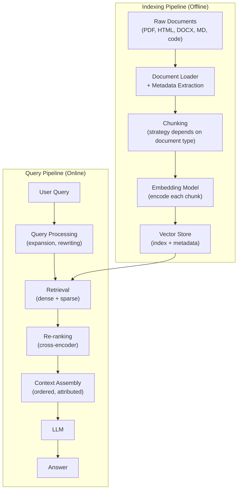
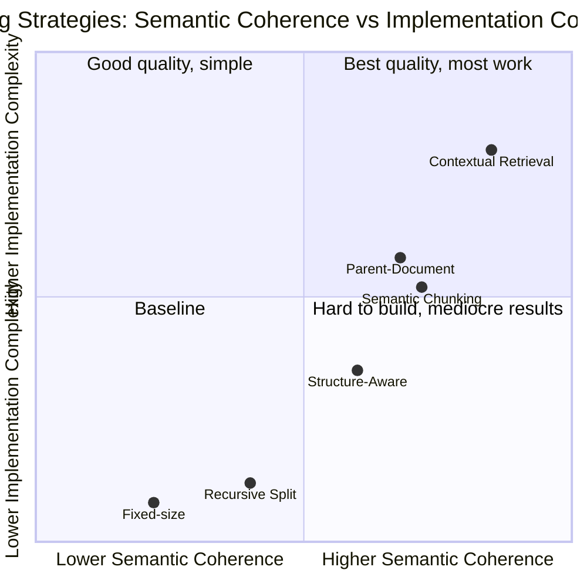
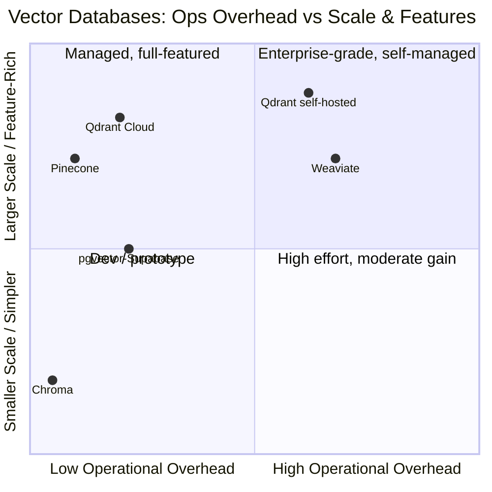

# Building RAG Systems: Pipelines, Chunking, and Vector Search

## The Gap Between the Paper and Production

The original RAG paper by Lewis et al. (2020) is elegant. The setup is clean: Wikipedia as the knowledge base, Dense Passage Retrieval (DPR) as the retriever, pre-trained on Natural Questions. The retriever fetches five 100-word passages, the generator produces an answer. The whole thing fits on a few pages of a NeurIPS submission and hits impressive numbers on open-domain QA benchmarks.

Then you try to build something like it for a real product.

Your documents are not uniform Wikipedia paragraphs. They are PDFs with three-column layouts, tables that span pages, headers and footers that appear in the middle of extracted text, embedded images that contain crucial information. They are Confluence pages with nested bullet lists, Jira tickets with inline code, Slack threads where the relevant answer is buried in message seventeen of forty. They are codebases where a function's meaning only makes sense alongside its docstring and the interface it implements. Wikipedia paragraphs are roughly 100 tokens. Your legal contracts are 80,000 tokens. Your API documentation has thousands of individual endpoint descriptions, each 50 tokens.

DPR was trained on Natural Questions, which means it was trained on question-answer pairs derived from Wikipedia searches. It has never seen a question about your internal product taxonomy, your proprietary processes, your domain-specific acronyms. When a user asks "what is the SLA for P1 incidents in the EMEA region?", DPR has no idea what any of those identifiers mean. The retriever that works on Wikipedia is going to miss this exact match.

The gap between the paper's setup and production reality is enormous. And the decisions that fill that gap — how to chunk documents, which embedding model to use, whether to run hybrid retrieval, how to re-rank — matter more than most engineers realize when they first prototype a RAG system. A prototype built with fixed-size chunking and cosine similarity over OpenAI embeddings can look fine in a demo. The same system, against a realistic query distribution over realistic documents, can fail in ways that are hard to diagnose because the failures are subtle: the right chunk exists in the database, but it was not retrieved. Or it was retrieved but ranked fifth, pushed down by chunks that matched keywords without matching meaning.

This post is about making every one of those decisions deliberately rather than accidentally. It covers the complete first half of the RAG stack: ingestion, chunking, embedding, vector storage, retrieval, and re-ranking. A second post will cover advanced patterns: HyDE, query decomposition, agentic retrieval, and everything that happens after you have the basics working.

## The Complete Pipeline

Before diving into any individual component, it helps to have the whole architecture in mind. A production RAG system has two distinct phases: an **indexing pipeline** that runs offline to build the knowledge base, and a **query pipeline** that runs online to answer each request.



Each box in this diagram represents a set of decisions. Each decision has real consequences for the quality of the final answers. The sections below go through them in order.

## Document Ingestion: The Plumbing That Determines Everything Downstream

The quality of your knowledge base is bounded by the quality of your ingestion. No retrieval algorithm can surface information that was destroyed during loading.

### Loaders

The go-to library for document loading in Python is **Unstructured**, which handles the widest range of formats with the most aggressive content extraction. For PDF specifically, there are three realistic options, each with different trade-offs:

- **PyMuPDF (fitz)**: Fast, accurate text extraction, preserves reading order well on most PDFs. Good default for straightforward documents.
- **pdfplumber**: Better table extraction. Slower than PyMuPDF. The right choice when your PDFs contain structured tables that need to be parsed rather than read as raw text.
- **Unstructured**: The most capable but also the heaviest. Uses computer vision for complex layouts. Handles multi-column PDFs, extracts tables as structured data, identifies document regions. Use it when layout matters and you can afford the dependency.

```python
from unstructured.partition.pdf import partition_pdf
from unstructured.partition.html import partition_html
from unstructured.partition.docx import partition_docx
from pathlib import Path

def load_document(file_path: str) -> list[dict]:
    """
    Load a document and return a list of elements with metadata.
    Each element is a dict with 'text', 'type', and 'metadata' keys.
    """
    path = Path(file_path)
    suffix = path.suffix.lower()

    if suffix == ".pdf":
        elements = partition_pdf(
            filename=str(path),
            strategy="hi_res",          # Use computer vision for layout
            infer_table_structure=True,  # Parse tables as structured data
            extract_images_in_pdf=False, # Set True for multi-modal RAG
        )
    elif suffix in (".html", ".htm"):
        elements = partition_html(filename=str(path))
    elif suffix == ".docx":
        elements = partition_docx(filename=str(path))
    elif suffix in (".md", ".txt"):
        # For markdown/text, a simpler approach is fine
        with open(path, "r", encoding="utf-8") as f:
            content = f.read()
        return [{"text": content, "type": "text", "metadata": {"source": str(path)}}]
    else:
        raise ValueError(f"Unsupported file type: {suffix}")

    return [
        {
            "text": el.text,
            "type": el.category,           # NarrativeText, Table, Title, etc.
            "metadata": {
                "source": str(path),
                "page_number": el.metadata.page_number,
                "filename": path.name,
                "element_type": el.category,
            }
        }
        for el in elements
        if el.text and el.text.strip()
    ]
```

### The Metadata Problem

Metadata preservation is the step most engineers skip in a prototype and regret in production. By "metadata" I mean the information that travels alongside each text chunk and ends up stored as payload in the vector database: source URL, document title, page number, section heading, creation date, author, document type.

Why does it matter? Three reasons.

First, **attribution**. When your RAG system returns an answer, the user needs to know where it came from. "The SLA for P1 incidents is four hours" is useful. "The SLA for P1 incidents is four hours (Source: Incident Management Policy v2.3, Section 4.1, page 7)" is trustworthy. The source reference is assembled from metadata at retrieval time — if you did not store it, you cannot include it.

Second, **filtered retrieval**. Many production queries implicitly scope the knowledge base: "what does our Q3 roadmap say about the payment integration?" You do not want to retrieve from the Q1 roadmap, the competitor analysis, or the engineering onboarding doc. Metadata filtering — "only search documents tagged `product_roadmap` with `quarter: Q3`" — is how you implement this. It requires metadata to be stored per chunk.

Third, **debugging**. When your system returns a wrong answer, you need to trace which chunks were retrieved. Without metadata, you have a bag of text fragments with no way to find them in the original document.

### Tables and Images

Tables break naive chunking badly. Consider a table with ten rows and five columns — as raw extracted text, it becomes 50 cells of text with no structural markers, often split across chunk boundaries such that a single cell's value is separated from its column header by the chunk boundary. The chunk containing the value has no context for what the value means.

The pragmatic approach: extract tables separately, convert them to a structured string representation (Markdown table format works well), and embed them as a unit rather than letting the chunker break them up.

```python
def format_table_element(element) -> str:
    """Convert a parsed table element to Markdown table format."""
    if hasattr(element, 'metadata') and element.metadata.text_as_html:
        # Unstructured provides HTML table; convert to markdown
        from html_table_parser import HTMLTableParser
        parser = HTMLTableParser()
        parser.feed(element.metadata.text_as_html)
        if parser.tables:
            rows = parser.tables[0]
            if not rows:
                return element.text
            header = "| " + " | ".join(str(c) for c in rows[0]) + " |"
            separator = "| " + " | ".join("---" for _ in rows[0]) + " |"
            body = "\n".join(
                "| " + " | ".join(str(c) for c in row) + " |"
                for row in rows[1:]
            )
            return f"{header}\n{separator}\n{body}"
    return element.text
```

Images in PDFs are a harder problem. The complete solution is multi-modal RAG: embed images using a vision encoder (CLIP, or GPT-4V to generate captions), store in a separate index, and retrieve from both text and image indices. That is a post in itself. The practical short-term answer for most teams: generate textual captions for figures using a vision model during ingestion, store the caption as a text chunk alongside the page context. Imperfect but functional.

## Chunking: Where Most Systems Fail

If you had to identify the single decision that most determines RAG quality, it would be chunking strategy. It also happens to be the decision that gets the least attention. Most engineers reach for whatever the framework's default is, set `chunk_size=512`, and move on. This is a mistake.

The fundamental tension in chunking: chunks need to be small enough that the retrieved content is precise and focused (you do not want to retrieve five pages when the answer is one sentence), but large enough that each chunk is semantically complete (you do not want a chunk that says "it was introduced in" without any context for what "it" refers to).

### Fixed-Size Chunking

Split every N tokens, with M tokens of overlap. The overlap ensures that a sentence straddling a chunk boundary is fully present in at least one chunk.

```python
from langchain_text_splitters import TokenTextSplitter

splitter = TokenTextSplitter(
    chunk_size=512,
    chunk_overlap=64,
    encoding_name="cl100k_base",  # OpenAI's tokenizer, reasonable default
)

chunks = splitter.split_text(document_text)
```

This is the simplest approach and the worst at semantic boundaries. It will cheerfully split a paragraph in the middle of a sentence, separating a claim from its supporting evidence, or a question from its answer. Use it as a baseline to measure against, not as a production strategy.

### Recursive Character Text Splitting

LangChain's `RecursiveCharacterTextSplitter` is a significant improvement. It tries to split at progressively finer boundaries: first at double newlines (paragraph breaks), then single newlines, then sentences, then words, then characters. The result is chunks that respect document structure far more often than fixed-size splitting.

```python
from langchain_text_splitters import RecursiveCharacterTextSplitter

splitter = RecursiveCharacterTextSplitter(
    chunk_size=512,
    chunk_overlap=64,
    separators=["\n\n", "\n", ". ", "? ", "! ", " ", ""],
    length_function=len,  # Use character count; swap for token count if needed
)

chunks = splitter.create_documents(
    texts=[doc["text"] for doc in documents],
    metadatas=[doc["metadata"] for doc in documents],
)
```

This is a good default for unstructured text. It handles the most common cases cleanly without requiring any understanding of the document's content.

### Semantic Chunking

Rather than splitting at structural boundaries, semantic chunking splits where the topic changes. The algorithm: embed every sentence, then look at cosine similarity between consecutive sentences. A large drop in similarity signals a topic boundary — split there.

```python
from sentence_transformers import SentenceTransformer
import numpy as np
from nltk.tokenize import sent_tokenize

def semantic_chunk(text: str, model: SentenceTransformer,
                   breakpoint_percentile: int = 95) -> list[str]:
    """
    Split text into semantically coherent chunks by detecting topic boundaries
    through embedding similarity drops.
    """
    sentences = sent_tokenize(text)
    if len(sentences) <= 2:
        return [text]

    # Embed all sentences in one batch
    embeddings = model.encode(sentences, batch_size=64, show_progress_bar=False)

    # Compute cosine similarity between consecutive sentence pairs
    similarities = []
    for i in range(len(embeddings) - 1):
        cos_sim = np.dot(embeddings[i], embeddings[i + 1]) / (
            np.linalg.norm(embeddings[i]) * np.linalg.norm(embeddings[i + 1])
        )
        similarities.append(cos_sim)

    # Find breakpoints: positions where similarity drops below the threshold
    threshold = np.percentile(similarities, 100 - breakpoint_percentile)
    breakpoints = [i + 1 for i, sim in enumerate(similarities) if sim < threshold]

    # Build chunks from breakpoints
    chunks = []
    start = 0
    for bp in breakpoints:
        chunk_sentences = sentences[start:bp]
        chunks.append(" ".join(chunk_sentences))
        start = bp
    chunks.append(" ".join(sentences[start:]))

    return [c for c in chunks if c.strip()]


# Usage
model = SentenceTransformer("all-MiniLM-L6-v2")
chunks = semantic_chunk(document_text, model, breakpoint_percentile=95)
```

Semantic chunking produces higher-quality boundaries but is more expensive — you are embedding every sentence to chunk the document, before indexing. For a corpus of 100,000 documents, the embedding cost at indexing time is significant. For a corpus of 1,000 documents that will be queried millions of times, it is completely worth it.

### Structure-Aware Chunking

If your documents have structure — Markdown headers, HTML section tags, PDF bookmark trees — use it. A section defined by a `## H2 header` is almost always a coherent semantic unit. Splitting inside a section and merging across sections both throw away information the document author encoded for free.

```python
from langchain_text_splitters import MarkdownHeaderTextSplitter

# Split by headers — each resulting chunk includes its header context as metadata
header_splitter = MarkdownHeaderTextSplitter(
    headers_to_split_on=[
        ("#", "h1"),
        ("##", "h2"),
        ("###", "h3"),
    ],
    strip_headers=False,  # Keep headers in the chunk text for context
)

md_chunks = header_splitter.split_text(markdown_content)

# If individual sections are still large, further split with a size-based splitter
from langchain_text_splitters import RecursiveCharacterTextSplitter

secondary_splitter = RecursiveCharacterTextSplitter(
    chunk_size=512,
    chunk_overlap=64,
)

final_chunks = secondary_splitter.split_documents(md_chunks)
```

Each chunk now carries `h1`, `h2`, `h3` metadata fields with the section path — useful both for filtering and for generating the source attribution string that appears in responses.

### Parent-Document Retrieval

This pattern solves a real tension: small chunks retrieve precisely (the vector similarity is focused on a narrow piece of text), but small chunks lack context (the sentence "it was deprecated in version 3" tells you nothing without surrounding paragraphs). Parent-document retrieval splits documents at two scales simultaneously: small child chunks for retrieval, large parent chunks for generation.

The index stores embeddings of child chunks. When a child chunk is retrieved, the system looks up its parent document or section and returns that larger context to the LLM instead.

```python
from langchain.retrievers import ParentDocumentRetriever
from langchain.storage import InMemoryStore
from langchain_text_splitters import RecursiveCharacterTextSplitter
from langchain_chroma import Chroma
from langchain_openai import OpenAIEmbeddings

# Child splitter: small chunks for precise retrieval
child_splitter = RecursiveCharacterTextSplitter(chunk_size=200, chunk_overlap=20)

# Parent splitter: larger chunks returned to the LLM
parent_splitter = RecursiveCharacterTextSplitter(chunk_size=2000, chunk_overlap=200)

vectorstore = Chroma(
    collection_name="child_chunks",
    embedding_function=OpenAIEmbeddings(),
)
store = InMemoryStore()  # Stores parent documents; use Redis/database in production

retriever = ParentDocumentRetriever(
    vectorstore=vectorstore,
    docstore=store,
    child_splitter=child_splitter,
    parent_splitter=parent_splitter,
)

retriever.add_documents(documents)

# Retrieval: finds small chunks, returns big parents
results = retriever.get_relevant_documents("your query here")
```

This is one of the highest-leverage improvements you can make to a basic RAG system. The retrieval precision of small chunks plus the generation quality of large contexts.

### Chunk Size Guidance

There is no universally correct chunk size. The right choice depends on your document type, your embedding model's context window, and the nature of queries your users ask.

| Chunk Size | Characteristics | Good For |
|---|---|---|
| 128–256 tokens | High precision, low recall | Short factual queries, keyword-style retrieval |
| 512 tokens | Balanced default | Most general-purpose RAG |
| 1024+ tokens | High recall, "lost in the middle" risk | Long-form answers, summarization tasks |

The "lost in the middle" risk is worth taking seriously. Liu et al. (2023) showed that LLMs systematically use information at the beginning and end of their context better than information in the middle. If you are retrieving ten 1024-token chunks and concatenating them into a single context, the fifth and sixth chunks may be effectively invisible to the model. Fewer, more relevant, smaller chunks often produce better answers than many large ones.

Measure this on your data. Build a small evaluation dataset (50–100 question-answer pairs), vary chunk size from 128 to 1024, and measure retrieval recall (does the correct chunk appear in top-k?) at each size. The optimal chunk size is domain-specific and the measurement takes an afternoon.

Chunking strategies form a progression: as semantic coherence increases, so does implementation complexity. The sweet spot for most teams is structure-aware chunking or semantic chunking before reaching for parent-document or contextual approaches:



## Embedding Models: The Semantic Lens

The embedding model determines what "similar" means in your system. Two chunks that are close in embedding space will be retrieved together. The model you choose defines the semantic lens through which your retrieval sees documents and queries.

### The Main Options

**OpenAI text-embedding-3-small and text-embedding-3-large** are the easiest starting point. Strong performance on MTEB benchmarks, simple API, well-documented. The `small` model produces 1536-dimensional vectors; the `large` model produces 3072-dimensional vectors. Both support Matryoshka representation learning, meaning you can truncate vectors to smaller dimensions (256, 512) with graceful performance degradation — useful for reducing storage and retrieval cost when you have millions of chunks.

The downsides: API cost (small but nonzero and it accumulates), latency (network round-trip for every batch during indexing), and the privacy concern for sensitive documents. Your legal contracts, HR records, and internal financial data should probably not be embedded by an external API.

**sentence-transformers** gives you models that run entirely locally. The practical options:

- `all-MiniLM-L6-v2`: 22M parameters, 384 dimensions, extremely fast. Good for development, decent quality. The right choice if you need to embed millions of documents quickly on modest hardware.
- `all-mpnet-base-v2`: 109M parameters, 768 dimensions. Significantly better quality than MiniLM. Slower but still practical for most indexing workloads.
- `BAAI/bge-large-en-v1.5`: State-of-the-art open-source English embedding model as of 2024. 335M parameters, 1024 dimensions. Competitive with OpenAI `text-embedding-3-small` on most benchmarks. The default choice for production open-source deployments.
- `intfloat/e5-mistral-7b-instruct`: 7B parameter embedding model. Better quality than bge-large on hard retrieval tasks, impractical without a GPU dedicated to embedding.

**Cohere Embed** is worth mentioning specifically for multilingual content. Cohere's `embed-multilingual-v3.0` handles 100+ languages in a single embedding space, which means cross-lingual retrieval (query in English, retrieve French documents) works without any additional infrastructure.

### Embedding with Proper Batching

The typical mistake is embedding documents one by one in a loop. Embedding models are most efficient with batched inputs. For a large corpus, the difference is an order of magnitude in throughput.

```python
from sentence_transformers import SentenceTransformer
from typing import Generator
import numpy as np
import logging

logger = logging.getLogger(__name__)

def embed_chunks(
    chunks: list[str],
    model_name: str = "BAAI/bge-large-en-v1.5",
    batch_size: int = 64,
    device: str = "cpu",
    normalize: bool = True,
) -> np.ndarray:
    """
    Embed a list of text chunks using sentence-transformers with batching.

    Args:
        chunks: List of text strings to embed.
        model_name: HuggingFace model name.
        batch_size: Number of chunks per forward pass. Increase if GPU memory allows.
        device: 'cpu', 'cuda', or 'mps'.
        normalize: Normalize embeddings to unit length (required for cosine similarity).

    Returns:
        Array of shape (len(chunks), embedding_dim).
    """
    model = SentenceTransformer(model_name, device=device)

    logger.info(f"Embedding {len(chunks)} chunks with {model_name} (batch_size={batch_size})")

    embeddings = model.encode(
        chunks,
        batch_size=batch_size,
        show_progress_bar=True,
        normalize_embeddings=normalize,
        convert_to_numpy=True,
    )

    logger.info(f"Done. Embedding shape: {embeddings.shape}")
    return embeddings


def embed_chunks_batched_generator(
    chunks: list[str],
    model: SentenceTransformer,
    batch_size: int = 64,
) -> Generator[tuple[int, np.ndarray], None, None]:
    """
    Generator version for streaming embeddings into the vector store
    without holding all embeddings in memory simultaneously.
    Yields (start_index, batch_embeddings) tuples.
    """
    for start in range(0, len(chunks), batch_size):
        batch = chunks[start : start + batch_size]
        batch_embeddings = model.encode(
            batch,
            normalize_embeddings=True,
            convert_to_numpy=True,
        )
        yield start, batch_embeddings
```

### Embeddings and Chunking Are Coupled

This is a point that does not appear in most tutorials: the embedding model and the chunking strategy are not independent choices. They are tightly coupled, and choosing one without the other is choosing half of a system.

Every embedding model has a context window — a maximum number of tokens it can embed at once. `all-MiniLM-L6-v2` has a 256-token context window. If your chunks are 512 tokens, the model truncates them to 256 tokens silently, and you are embedding incomplete chunks. `bge-large-en-v1.5` has a 512-token window. `text-embedding-3-large` handles 8191 tokens.

More subtly: models trained on certain text distributions perform better on chunks of corresponding density. MiniLM was trained on sentence pairs. It represents individual sentences well. It is less reliable for 500-token multi-paragraph chunks. Models trained on longer passages — like e5-mistral or OpenAI's models — handle longer chunks better.

The practical implication: if you switch embedding models, re-test your chunking strategy. If you switch chunking strategies, re-evaluate your embedding model. They should be evaluated as a pair.

## Vector Databases: Making the Right Infrastructure Choice

The vector database is where your embeddings live and where retrieval happens. The choice matters for performance, operational complexity, cost, and the features available to you (hybrid search, filtering, multi-tenancy). Here is a practical comparison of the five most important options.

### Chroma

Chroma is the zero-friction option. No server to run, no Docker, no configuration. It embeds directly in your Python process, stores to SQLite locally, and provides a clean API.

```python
import chromadb
from chromadb.utils import embedding_functions

# Persistent local storage
client = chromadb.PersistentClient(path="/data/chroma")

# Use a sentence-transformer for embedding
ef = embedding_functions.SentenceTransformerEmbeddingFunction(
    model_name="BAAI/bge-large-en-v1.5"
)

collection = client.get_or_create_collection(
    name="docs",
    embedding_function=ef,
    metadata={"hnsw:space": "cosine"},
)

# Add chunks with metadata
collection.add(
    documents=chunk_texts,
    metadatas=chunk_metadatas,  # List of dicts; each dict is payload for one chunk
    ids=[f"chunk_{i}" for i in range(len(chunk_texts))],
)

# Query
results = collection.query(
    query_texts=["what is the SLA for P1 incidents?"],
    n_results=10,
    where={"document_type": "policy"},  # Metadata filter
)
```

Chroma's limitations become apparent at scale: single-node only, no built-in hybrid search, limited concurrent write performance. But for development, for small production systems (under a few million chunks), and for rapid prototyping, nothing is faster to get running.

### Qdrant

Qdrant is the best choice for production systems that need speed, flexible filtering, and real operational control. It is written in Rust, runs as a standalone server or in Docker, and has an excellent Python SDK.

Its killer feature is **payload filtering**: you can filter by any metadata field at query time, and the filters are applied inside the HNSW index, not as a post-retrieval pass. This means filtering a million-document corpus to only documents tagged with `team: engineering` and then running vector search is nearly as fast as searching the full corpus, rather than searching the full corpus and then discarding irrelevant results.

```python
from qdrant_client import QdrantClient
from qdrant_client.models import (
    Distance, VectorParams, PointStruct,
    Filter, FieldCondition, MatchValue,
    SearchRequest,
)
import uuid

client = QdrantClient(host="localhost", port=6333)

# Create collection with HNSW index config
client.recreate_collection(
    collection_name="docs",
    vectors_config=VectorParams(
        size=1024,         # bge-large-en-v1.5 produces 1024-dim vectors
        distance=Distance.COSINE,
    ),
    hnsw_config={
        "m": 16,           # Number of bi-directional links per node
        "ef_construct": 200, # Higher = better index quality, slower build
    },
)

# Upsert chunks with rich payloads
points = [
    PointStruct(
        id=str(uuid.uuid4()),
        vector=embedding.tolist(),
        payload={
            "text": chunk_text,
            "source": metadata["source"],
            "page_number": metadata["page_number"],
            "document_type": metadata["document_type"],
            "created_at": metadata["created_at"],
            "section": metadata.get("h2", ""),
        },
    )
    for chunk_text, embedding, metadata in zip(chunks, embeddings, metadatas)
]

# Batch upsert — Qdrant handles large batches efficiently
batch_size = 256
for i in range(0, len(points), batch_size):
    client.upsert(
        collection_name="docs",
        points=points[i : i + batch_size],
    )

# Search with payload filter
query_embedding = embed_single_query("SLA for P1 incidents in EMEA")

results = client.search(
    collection_name="docs",
    query_vector=query_embedding,
    query_filter=Filter(
        must=[
            FieldCondition(key="document_type", match=MatchValue(value="policy")),
        ]
    ),
    limit=20,
    with_payload=True,
)

for hit in results:
    print(f"Score: {hit.score:.4f} | {hit.payload['source']} p{hit.payload['page_number']}")
    print(f"  {hit.payload['text'][:200]}...\n")
```

### Pinecone

Pinecone is fully managed — you provision an index, you write to it, you query it. No server, no ops, no configuration beyond the basic index settings. For teams that do not want to think about infrastructure, it is the fastest path to production.

```python
from pinecone import Pinecone, ServerlessSpec

pc = Pinecone(api_key="your-api-key")

# Create a serverless index (pay per query, no always-on cost)
pc.create_index(
    name="docs",
    dimension=1024,
    metric="cosine",
    spec=ServerlessSpec(cloud="aws", region="us-east-1"),
)

index = pc.Index("docs")

# Upsert vectors with metadata
vectors = [
    {
        "id": f"chunk_{i}",
        "values": embedding.tolist(),
        "metadata": {
            "text": chunk_text,
            "source": metadata["source"],
            "document_type": metadata["document_type"],
        },
    }
    for i, (chunk_text, embedding, metadata) in enumerate(zip(chunks, embeddings, metadatas))
]

# Upsert in batches of 100 (Pinecone's recommended batch size)
for i in range(0, len(vectors), 100):
    index.upsert(vectors=vectors[i : i + 100])

# Query with filter
results = index.query(
    vector=query_embedding.tolist(),
    top_k=20,
    filter={"document_type": {"$eq": "policy"}},
    include_metadata=True,
)
```

The concerns with Pinecone are vendor lock-in and cost surprises at scale. The serverless pricing model is economical for low-query-volume applications and expensive for high-volume ones. Model the expected query volume before committing. Also: you do not own the infrastructure, which matters for compliance in regulated industries.

### pgvector

pgvector is a PostgreSQL extension that adds a vector type and approximate nearest-neighbor search. If your application already runs on PostgreSQL — and a large fraction of production applications do — pgvector means your RAG knowledge base lives in the same database as your other data, with ACID transactions, row-level security, and the full power of SQL for filtering and joining.

```sql
-- Enable the extension
CREATE EXTENSION vector;

-- Create a table for document chunks
CREATE TABLE document_chunks (
    id          UUID PRIMARY KEY DEFAULT gen_random_uuid(),
    document_id UUID NOT NULL REFERENCES documents(id),
    content     TEXT NOT NULL,
    embedding   VECTOR(1024),
    source      TEXT,
    page_number INTEGER,
    section     TEXT,
    created_at  TIMESTAMPTZ DEFAULT NOW()
);

-- Create an HNSW index (better recall than IVFFlat at moderate scale)
CREATE INDEX ON document_chunks
    USING hnsw (embedding vector_cosine_ops)
    WITH (m = 16, ef_construction = 200);
```

```python
import psycopg2
from psycopg2.extras import execute_batch
import numpy as np

conn = psycopg2.connect(os.environ["DATABASE_URL"])

def insert_chunks(chunks: list[dict], embeddings: np.ndarray) -> None:
    with conn.cursor() as cur:
        execute_batch(
            cur,
            """
            INSERT INTO document_chunks (document_id, content, embedding, source, page_number)
            VALUES (%s, %s, %s::vector, %s, %s)
            """,
            [
                (
                    chunk["document_id"],
                    chunk["text"],
                    embedding.tolist(),
                    chunk["source"],
                    chunk["page_number"],
                )
                for chunk, embedding in zip(chunks, embeddings)
            ],
        )
    conn.commit()

def search_chunks(query_embedding: np.ndarray, document_type: str, top_k: int = 20) -> list[dict]:
    with conn.cursor() as cur:
        cur.execute(
            """
            SELECT
                dc.id,
                dc.content,
                dc.source,
                dc.page_number,
                dc.embedding <=> %s::vector AS distance
            FROM document_chunks dc
            JOIN documents d ON d.id = dc.document_id
            WHERE d.document_type = %s
            ORDER BY distance
            LIMIT %s
            """,
            (query_embedding.tolist(), document_type, top_k),
        )
        rows = cur.fetchall()
    return [
        {"id": r[0], "text": r[1], "source": r[2], "page": r[3], "score": 1 - r[4]}
        for r in rows
    ]
```

pgvector's HNSW index is competitive with dedicated vector databases for corpora up to tens of millions of vectors. Beyond that, the single-node architecture starts to show limits. But "tens of millions" is well beyond what most RAG systems will ever need, and the operational simplicity of not running a second database is worth a lot.

### Weaviate

Weaviate is the richest option in terms of built-in features. It has built-in vectorization (point it at an OpenAI or HuggingFace model and it embeds documents automatically during import), a GraphQL API, native hybrid search, and strong multi-tenancy support — each tenant gets an isolated vector index, useful for SaaS applications where customer data must be separated.

The trade-off is complexity. Weaviate has more moving parts to configure and a steeper operational learning curve. For teams building a product where hybrid search and multi-tenancy are first-class requirements from day one, it pays for itself. For teams that just need reliable vector search with good filtering, Qdrant is a simpler starting point.

### Comparison Table

| | Chroma | Qdrant | Pinecone | pgvector | Weaviate |
|---|---|---|---|---|---|
| **Latency (10M vecs)** | N/A | ~5ms | ~15ms | ~20ms | ~10ms |
| **Max scale** | ~1M | 100M+ | 1B+ | 50M+ | 100M+ |
| **Filtering** | Basic | Excellent | Good | Full SQL | Good |
| **Hybrid search** | No | Native | No (workaround) | Via text search | Native |
| **Hosted option** | No | Yes (Qdrant Cloud) | Yes (managed only) | Via RDS/Supabase | Yes |
| **Ops overhead** | None | Low | None | Low | Medium |
| **Cost model** | Free | Open source + cloud | Per query/vector | Infrastructure | Open source + cloud |
| **Best for** | Dev / small prod | Production systems | Zero infra teams | Postgres shops | SaaS, complex schemas |

The operational overhead vs scale/performance tradeoff places each option in a distinct position:



## Retrieval: Dense, Sparse, and Hybrid

Vector search — embedding similarity — is dense retrieval. It excels at semantic matching: the query "what is the company's policy on remote work?" matches chunks about "working from home guidelines" even though the words overlap minimally. The embedding model bridges the vocabulary gap.

Dense retrieval has a real weakness: it can miss exact matches for things the embedding model has never seen. A medical code like `ICD-10:J45.30`, a SKU like `PRD-X4821-EMEA`, a rare proper noun, a technical identifier that appears nowhere in the model's training data — these will not have reliable dense representations. The model has no semantic understanding of what they are, so it cannot match them reliably.

Sparse retrieval — BM25, the TF-IDF family — has the complementary strength: it is excellent at exact keyword matching and handles rare terms gracefully because it does not require the term to have been in any training corpus. If the query contains "PRD-X4821-EMEA", BM25 finds every chunk containing exactly that string.

The right answer for most production systems is **hybrid retrieval**: combine dense and sparse.

### BM25 Retrieval

```python
from rank_bm25 import BM25Okapi
import nltk
from nltk.tokenize import word_tokenize

nltk.download("punkt", quiet=True)

class BM25Retriever:
    def __init__(self, chunks: list[dict]):
        self.chunks = chunks
        tokenized = [word_tokenize(c["text"].lower()) for c in chunks]
        self.bm25 = BM25Okapi(tokenized)

    def retrieve(self, query: str, top_k: int = 50) -> list[tuple[int, float]]:
        tokenized_query = word_tokenize(query.lower())
        scores = self.bm25.get_scores(tokenized_query)
        top_indices = scores.argsort()[::-1][:top_k]
        return [(int(idx), float(scores[idx])) for idx in top_indices]
```

### Reciprocal Rank Fusion

Combining dense and sparse rankings requires a fusion function. Reciprocal Rank Fusion (RRF) is the standard: each result gets a score of `1 / (k + rank)` where `k` is a smoothing constant (typically 60), and final scores are the sum of RRF scores across all rankers. RRF is robust to the fact that dense and sparse scores are not on the same scale — it operates on ranks, not raw scores.

```
RRF_score(d) = Σ_{r ∈ rankers} 1 / (k + rank_r(d))
```

```python
from collections import defaultdict

def reciprocal_rank_fusion(
    rankings: list[list[tuple[str, float]]],
    k: int = 60,
) -> list[tuple[str, float]]:
    """
    Fuse multiple ranked lists using Reciprocal Rank Fusion.

    Args:
        rankings: List of ranked lists. Each inner list is [(doc_id, score), ...],
                  ordered by descending relevance.
        k: RRF smoothing constant.

    Returns:
        Fused ranked list of (doc_id, rrf_score), descending.
    """
    fused_scores: dict[str, float] = defaultdict(float)

    for ranked_list in rankings:
        for rank, (doc_id, _score) in enumerate(ranked_list):
            fused_scores[doc_id] += 1.0 / (k + rank + 1)

    return sorted(fused_scores.items(), key=lambda x: x[1], reverse=True)


def hybrid_retrieve(
    query: str,
    query_embedding: np.ndarray,
    vector_client,            # Qdrant client
    bm25_retriever: BM25Retriever,
    collection_name: str,
    top_k_per_source: int = 50,
    final_top_k: int = 20,
) -> list[dict]:
    """
    Retrieve using both dense vector search and BM25, then fuse with RRF.
    """
    # Dense retrieval
    dense_results = vector_client.search(
        collection_name=collection_name,
        query_vector=query_embedding,
        limit=top_k_per_source,
        with_payload=True,
    )
    dense_ranking = [(hit.id, hit.score) for hit in dense_results]

    # Sparse retrieval
    sparse_ranking = bm25_retriever.retrieve(query, top_k=top_k_per_source)
    sparse_ranking_ids = [(str(idx), score) for idx, score in sparse_ranking]

    # Fuse
    fused = reciprocal_rank_fusion([dense_ranking, sparse_ranking_ids], k=60)

    # Assemble final results with payloads
    # ... (look up payloads for each chunk ID)
    return fused[:final_top_k]
```

Qdrant also supports hybrid search natively using sparse vectors (in SPLADE or BM25 format) alongside dense vectors, which avoids maintaining a separate BM25 index. This is the cleanest production approach if you are using Qdrant.

The rule of thumb for when hybrid search pays off: if your document corpus contains proper nouns, codes, identifiers, technical terms, or specialized jargon that the embedding model has not seen in pre-training, hybrid search will meaningfully improve recall. For corpora of natural-language text without specialized vocabulary, dense retrieval alone is usually sufficient.

## Re-ranking: Spending More Compute Where It Matters

First-stage retrieval — whether dense, sparse, or hybrid — is designed for speed. It returns top-50 candidates in milliseconds using approximate nearest neighbor search or an inverted index. The approximation is good, but it is an approximation. The 50 candidates are not perfectly ranked.

Re-ranking applies a more expensive model to the top-50 candidates to produce a better-ranked top-5 or top-10 for the LLM. The cost is acceptable because you are running it on a small, fixed number of candidates rather than the entire corpus.

### Bi-Encoders vs Cross-Encoders

The embedding models used for first-stage retrieval are **bi-encoders**: they encode the query and the document independently, producing separate vectors that are then compared by cosine similarity. Encoding is fast because query and document never interact during encoding — only their final vectors are compared.

**Cross-encoders** encode the query and document together. The model sees both simultaneously, allowing full attention interaction between every query token and every document token. This produces much more accurate relevance estimates because the model can reason about how specific parts of the query relate to specific parts of the document. The cost: you must run a forward pass for every (query, document) pair. On 50 candidates, this is 50 forward passes — slow for first-stage but fast enough for re-ranking.

```python
from sentence_transformers import CrossEncoder
import numpy as np

reranker = CrossEncoder(
    "cross-encoder/ms-marco-MiniLM-L-6-v2",
    max_length=512,
    device="cpu",
)

def rerank(query: str, candidates: list[dict], top_k: int = 5) -> list[dict]:
    """
    Re-rank retrieved candidates using a cross-encoder.

    Args:
        query: The user's query string.
        candidates: List of chunk dicts, each with a 'text' key.
        top_k: Number of top results to return after re-ranking.

    Returns:
        Top-k candidates, re-ranked by cross-encoder relevance score.
    """
    if not candidates:
        return []

    pairs = [(query, c["text"]) for c in candidates]
    scores = reranker.predict(pairs, show_progress_bar=False)

    # Sort by score descending
    scored = sorted(
        zip(candidates, scores),
        key=lambda x: x[1],
        reverse=True,
    )

    results = []
    for chunk, score in scored[:top_k]:
        results.append({**chunk, "rerank_score": float(score)})

    return results
```

The cross-encoder you choose depends on the latency budget and quality requirements:

- `cross-encoder/ms-marco-MiniLM-L-6-v2`: Fast (6-layer), good quality. ~20ms for 50 pairs on CPU.
- `cross-encoder/ms-marco-MiniLM-L-12-v2`: Slower (12-layer), better quality. ~40ms for 50 pairs on CPU.
- `BAAI/bge-reranker-large`: Best open-source re-ranker. Slower, significantly better quality.
- **Cohere Rerank**: API-based, very high quality, no local compute needed.

**ColBERT** deserves a brief mention as a middle ground between bi-encoders and cross-encoders. Rather than comparing two fixed-length vectors, ColBERT computes token-level embeddings for both query and document, then scores them using a MaxSim operation: for each query token, find the most similar document token. This "late interaction" approach captures more of the nuance of cross-encoders at a cost closer to bi-encoders. The `ragatouille` library provides a clean ColBERT implementation.

The standard pipeline: first-stage retrieval returns top-50, re-ranker scores each pair, top-5 are passed to the LLM. For high-stakes queries in production, this combination is the reliable pattern.

## Context Assembly and the Lost-in-the-Middle Problem

After retrieval and re-ranking, you have a small number of highly relevant chunks. How you assemble them into the LLM prompt matters more than most people expect.

Liu et al. (2023) — the "Lost in the Middle" paper — demonstrated that transformer language models show a systematic pattern: they use information at the beginning and end of their context window significantly better than information in the middle. In a 20-chunk context, chunks 1 and 20 contribute to the answer; chunks 8–13 are effectively buried.

The implication: put your most relevant chunk first. The re-ranker has already produced a ranked list; use it. Do not naively concatenate retrieved chunks in the order they were returned by the vector store.

```python
def assemble_context(
    ranked_chunks: list[dict],
    max_context_tokens: int = 3000,
    query: str = "",
) -> tuple[str, list[dict]]:
    """
    Assemble retrieved chunks into a context string for the LLM.

    Strategy:
    - Most relevant chunk first (uses the model's primacy bias)
    - Each chunk is clearly delimited with source attribution
    - Stops adding chunks when token budget is reached
    - Returns both the context string and the chunks included (for logging)

    Args:
        ranked_chunks: Chunks ordered by re-rank score, descending.
        max_context_tokens: Approximate token budget for context.
        query: The original query (included in context header for some models).

    Returns:
        (context_string, included_chunks)
    """
    import tiktoken
    encoder = tiktoken.get_encoding("cl100k_base")

    context_parts = []
    included_chunks = []
    tokens_used = 0

    for i, chunk in enumerate(ranked_chunks, start=1):
        chunk_text = chunk["text"].strip()
        source_info = _format_source(chunk)

        chunk_block = f"[Source {i}: {source_info}]\n{chunk_text}"

        chunk_tokens = len(encoder.encode(chunk_block))
        if tokens_used + chunk_tokens > max_context_tokens:
            break

        context_parts.append(chunk_block)
        included_chunks.append(chunk)
        tokens_used += chunk_tokens

    context = "\n\n---\n\n".join(context_parts)
    return context, included_chunks


def _format_source(chunk: dict) -> str:
    """Format source attribution string from chunk metadata."""
    parts = []
    if chunk.get("source"):
        # Strip full path, keep filename
        from pathlib import Path
        parts.append(Path(chunk["source"]).name)
    if chunk.get("page_number"):
        parts.append(f"p.{chunk['page_number']}")
    if chunk.get("section"):
        parts.append(chunk["section"])
    return ", ".join(parts) if parts else "Unknown source"
```

The source attribution format (`[Source 1: PolicyDocument.pdf, p.7, Section 4.1]`) serves two purposes: the LLM can reference it in its answer ("According to Source 1..."), and your logging infrastructure can capture exactly which chunks contributed to each response. That logging matters enormously for debugging wrong answers.

One more pattern worth implementing: **context compression**. If you have retrieved five chunks but only two are directly relevant to the query, the other three are noise that dilutes the signal and consumes tokens. A lightweight approach: before passing to the main LLM, run a smaller model to filter or summarize the less relevant chunks. LLMChainFilter in LangChain implements this pattern. It adds latency and complexity, but for question-answering applications where answer quality is critical, it can meaningfully reduce hallucination.

## Evaluation: RAGAS and Why You Need a Systematic Approach

One of the signs of a RAG system built by engineers who have shipped it before is the presence of an evaluation pipeline from day one. You cannot improve what you cannot measure, and "the answer sounded right in my test" is not a measurement.

RAGAS (Retrieval Augmented Generation Assessment) is the standard evaluation framework. It provides four metrics that together give a complete picture of system health:

- **Faithfulness**: Does the generated answer contain only information that can be found in the retrieved context? High faithfulness means the model is not hallucinating beyond what it retrieved. Low faithfulness means it is.
- **Answer Relevancy**: Is the generated answer responsive to the question? A system that retrieves perfectly but generates a tangentially related response scores low here.
- **Context Recall**: Do the retrieved chunks contain all the information needed to answer the question? Measures retrieval quality from a recall perspective.
- **Context Precision**: Are the retrieved chunks actually relevant? A system that retrieves correctly but also retrieves a lot of irrelevant noise scores low here.

```python
from ragas import evaluate
from ragas.metrics import (
    faithfulness,
    answer_relevancy,
    context_recall,
    context_precision,
)
from ragas.llms import LangchainLLMWrapper
from ragas.embeddings import LangchainEmbeddingsWrapper
from langchain_openai import ChatOpenAI, OpenAIEmbeddings
from datasets import Dataset

# Build your evaluation dataset from real user queries
# Each row: a question, the ground truth answer, retrieved contexts, generated answer
eval_data = {
    "question": [
        "What is the SLA for P1 incidents in EMEA?",
        "What are the approved cloud providers?",
        # ... more from real user queries
    ],
    "answer": [
        # Generated by your RAG system for each question
        generated_answers[0],
        generated_answers[1],
    ],
    "contexts": [
        # Retrieved chunks for each question (list of strings per question)
        retrieved_contexts[0],
        retrieved_contexts[1],
    ],
    "ground_truth": [
        "The SLA for P1 incidents in EMEA is four hours.",
        "Approved cloud providers are AWS, Azure, and GCP.",
    ],
}

dataset = Dataset.from_dict(eval_data)

# Initialize with your LLM (RAGAS uses an LLM to evaluate faithfulness etc.)
langchain_llm = LangchainLLMWrapper(ChatOpenAI(model="gpt-4o-mini"))
langchain_embeddings = LangchainEmbeddingsWrapper(OpenAIEmbeddings())

results = evaluate(
    dataset=dataset,
    metrics=[faithfulness, answer_relevancy, context_recall, context_precision],
    llm=langchain_llm,
    embeddings=langchain_embeddings,
)

print(results.to_pandas())
```

The key practice: build your evaluation dataset from real user queries, not hand-crafted examples. Synthetic evaluation questions miss the edge cases, the ambiguous phrasings, the domain-specific vocabulary that users actually use. If you are building a production system, run it for a week in shadow mode (retrieve and generate but do not show to users), collect the queries, sample 100 of them, annotate the expected answers, and use that as your evaluation set. It will catch things that no synthetic dataset will.

**TruLens** is an alternative worth knowing. Where RAGAS is batch evaluation, TruLens instruments your application for continuous evaluation — every response is scored as it is generated, and you get a real-time dashboard. For teams that want ongoing observability rather than offline benchmark runs, it is the more operational choice.

## Production Checklist

Before calling a RAG system production-ready, walk through this list. Each item represents a class of failures that will surface under real usage.

- [ ] **Metadata preserved throughout pipeline.** Every chunk stored in the vector database carries source, page number, document type, and creation date. Test this by querying the database directly and inspecting payloads.
- [ ] **Chunk sizes tested on your specific domain.** Run a small offline evaluation at 256, 512, and 1024 token chunk sizes and measure context recall at each. Do not use the framework default without measuring.
- [ ] **Hybrid retrieval enabled if content has proper nouns, codes, or IDs.** If your documents contain product codes, person names, technical identifiers, or abbreviations, dense-only retrieval will miss queries that use those terms exactly.
- [ ] **Re-ranking implemented for high-stakes retrieval paths.** First-stage retrieval is approximate. Cross-encoder re-ranking on top-50 candidates improves answer quality measurably in user studies.
- [ ] **Context window budgeted carefully.** Know the token counts: retrieved context + system prompt + user message + expected generation length must fit within the model's context window with room to spare. Budget explicitly, do not discover this at runtime.
- [ ] **Evaluation dataset built from real user queries.** Synthetic questions do not catch what users actually ask. If you do not have real users yet, run the system internally first.
- [ ] **Retrieval logging enabled.** For every query, log which chunks were retrieved, their scores, and which were included in context. This is the only way to diagnose wrong answers systematically.
- [ ] **Graceful fallback when retrieval quality is low.** If the top-k retrieved chunks score below a threshold, do not silently pass poor context to the LLM. Either tell the user you could not find relevant information or trigger a fallback path.
- [ ] **Embedding model version pinned.** OpenAI periodically updates their embedding models. Sentence-transformers models can have subtle differences across revisions. Pin the exact version used for indexing and verify that any update requires re-indexing the entire corpus.
- [ ] **Index rebuild tested.** You will need to re-index. New documents, better embedding models, changed chunking strategies — all require a rebuild. Test the rebuild process before it is urgent at 2am.

## Going Deeper

The bibliography for RAG is now substantial enough to be organized.

### Foundational Papers

- **Lewis et al., "Retrieval-Augmented Generation for Knowledge-Intensive NLP Tasks"** (2020). The paper that named the pattern. Read it to understand the original formulation and its assumptions — then notice what production systems need to do differently.
- **Karpukhin et al., "Dense Passage Retrieval for Open-Domain Question Answering"** (2020). The DPR paper. Establishes the bi-encoder retrieval paradigm, the training methodology, and the benchmarks.
- **Liu et al., "Lost in the Middle: How Language Models Use Long Contexts"** (2023). Essential reading before making any decisions about context assembly. The primacy and recency effects are real and large.
- **Es et al., "RAGAS: Automated Evaluation of Retrieval Augmented Generation"** (2023). The paper behind the evaluation framework. Worth reading to understand what the metrics actually measure and their limitations.
- **Khattab and Zaharia, "ColBERT: Efficient and Effective Passage Search via Contextualized Late Interaction"** (2020). The ColBERT paper. A different retrieval architecture worth understanding if you are hitting the limits of bi-encoders.

### Books

- **Manning, Raghavan, and Schütze, "Introduction to Information Retrieval"** — free online at nlp.stanford.edu/IR-book. BM25, tf-idf, evaluation metrics — the mathematical foundations of everything sparse retrieval builds on.
- **Tunstall et al., "Natural Language Processing with Transformers"** (O'Reilly) — The best practical guide to the Hugging Face ecosystem. The chapters on sentence transformers and information retrieval are directly applicable.
- **Huyen, "Designing Machine Learning Systems"** (O'Reilly) — Not RAG-specific but essential for the production ML mindset. The chapters on feature stores and serving infrastructure translate directly to RAG system design.

### Documentation and Guides

- **LangChain RAG Documentation** (python.langchain.com/docs/use_cases/question_answering) — The most comprehensive worked examples for RAG patterns, including parent-document retrieval, hybrid search, and context compression.
- **LlamaIndex Documentation** (docs.llamaindex.ai) — LlamaIndex's abstractions (nodes, indices, query engines) map more naturally to document-centric RAG. Their guides on ingestion pipelines and evaluation are particularly good.
- **Qdrant Documentation and Blog** (qdrant.tech/articles) — Qdrant's engineering blog has some of the best practical writing on vector search, hybrid retrieval, and quantization. Start with "Efficient Filtering in Vector Search."
- **RAGAS Documentation** (docs.ragas.io) — The metrics are subtle. The documentation explains what each one measures and, more usefully, what scenarios it does and does not catch.

### Online Resources

- **Pinecone Learning Center** (pinecone.io/learn) — Practical tutorials on chunking strategies, embedding models, and retrieval patterns. Vendor-produced but technically rigorous.
- **Weaviate Blog** (weaviate.io/blog) — Deep technical content on hybrid search, multi-tenancy, and vector database internals.
- **Jerry Liu's writing and talks** — LlamaIndex founder. His talks on advanced RAG patterns (agentic retrieval, knowledge graphs over RAG) are some of the best practitioner writing in the space.

### A Question to Sit With

Here is a tension that does not have a clean resolution: better retrieval does not always mean better answers.

A RAG system can retrieve perfectly — every relevant chunk is in the top-5, ranked correctly, assembled properly — and still produce a wrong answer because the LLM cannot synthesize the information across chunks, or because the answer requires reasoning that goes beyond what any individual chunk states explicitly.

Conversely, a system with imperfect retrieval can often produce correct answers because the LLM fills in gaps from parametric memory. The model "knows" the answer from training even when the retrieved context is incomplete.

This creates a measurement problem: if you only evaluate end-to-end answer quality, you cannot separate retrieval quality from generation quality. A high-quality answer might mask bad retrieval. A low-quality answer might be the result of a retrieval failure, a generation failure, or both.

Build separate evaluations for retrieval (context recall, context precision) and for generation (faithfulness, answer relevancy). They will tell you different things, and fixing the right one at each stage will require knowing which one is actually failing.

---

*This is Part 1 of the RAG field notes series. Part 2 covers advanced patterns: HyDE (Hypothetical Document Embeddings), query decomposition, multi-hop retrieval, knowledge graph integration, and the engineering of agentic RAG systems that can decide when and how to retrieve.*

---

## References

- [Lewis et al., "Retrieval-Augmented Generation for Knowledge-Intensive NLP Tasks"](https://arxiv.org/abs/2005.11401) — The original RAG paper (NeurIPS 2020)
- [Karpukhin et al., "Dense Passage Retrieval for Open-Domain Question Answering"](https://arxiv.org/abs/2004.04906) — DPR, the standard bi-encoder retrieval model
- [Liu et al., "Lost in the Middle: How Language Models Use Long Contexts"](https://arxiv.org/abs/2307.03172) — Empirical study of LLM context utilization
- [Es et al., "RAGAS: Automated Evaluation of Retrieval Augmented Generation"](https://arxiv.org/abs/2309.15217) — The RAGAS evaluation framework paper
- [Khattab and Zaharia, "ColBERT: Efficient and Effective Passage Search via Contextualized Late Interaction"](https://arxiv.org/abs/2004.12832) — Late interaction retrieval
- [LangChain RAG Documentation](https://python.langchain.com/docs/use_cases/question_answering/) — Comprehensive RAG patterns and examples
- [LlamaIndex Documentation](https://docs.llamaindex.ai/) — Document-centric RAG abstractions and guides
- [RAGAS Documentation](https://docs.ragas.io/) — RAG evaluation metrics reference
- [Qdrant Documentation](https://qdrant.tech/documentation/) — Vector database with hybrid search and rich filtering
- [sentence-transformers Documentation](https://www.sbert.net/) — Open-source embedding models and usage
- [Manning, Raghavan, Schütze, "Introduction to Information Retrieval"](https://nlp.stanford.edu/IR-book/) — Free online; foundational IR theory
- [Tunstall et al., "Natural Language Processing with Transformers"](https://www.oreilly.com/library/view/natural-language-processing/9781098136789/) — Practical Hugging Face ecosystem guide
- [Huyen, "Designing Machine Learning Systems"](https://www.oreilly.com/library/view/designing-machine-learning/9781098107956/) — Production ML engineering reference
