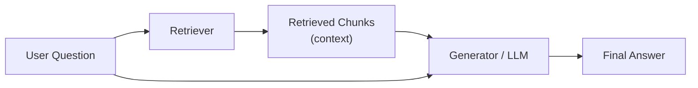
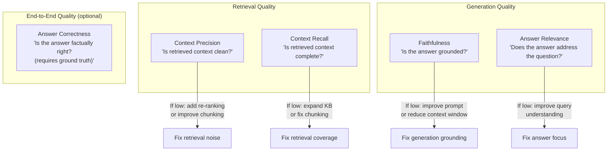
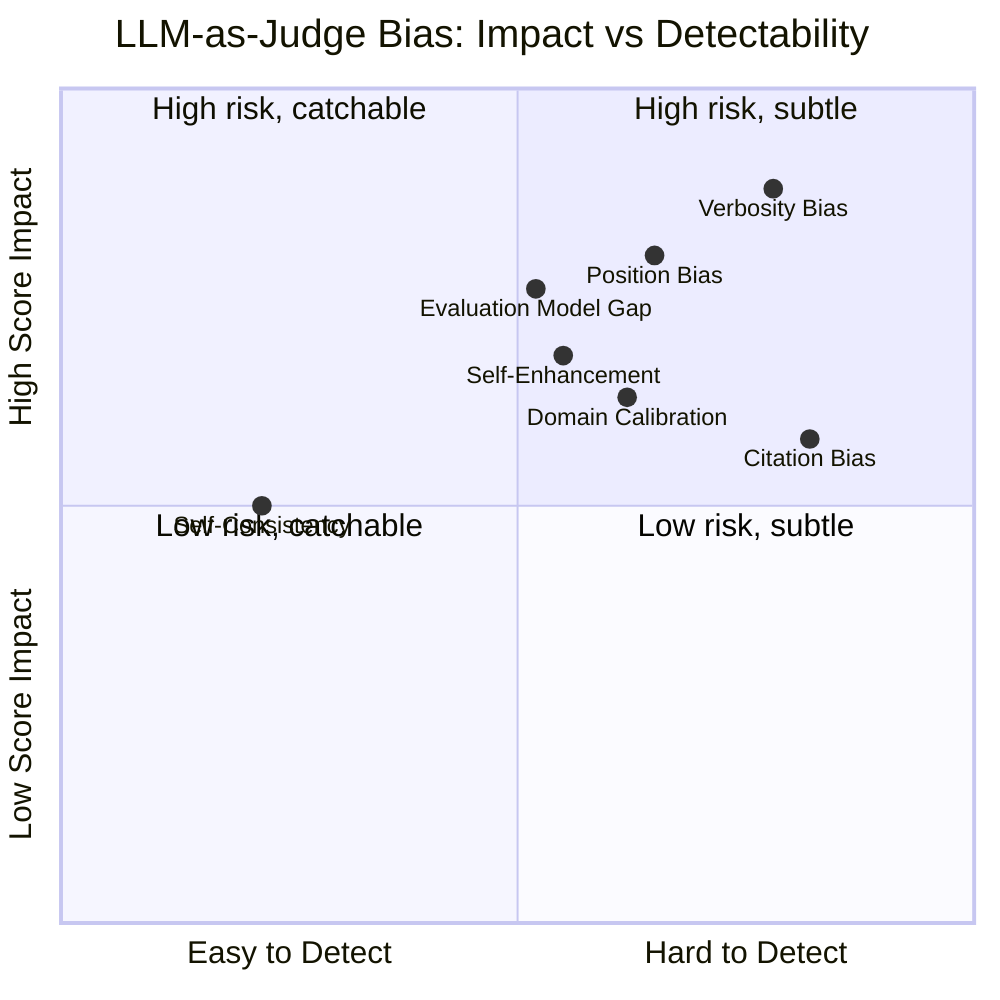
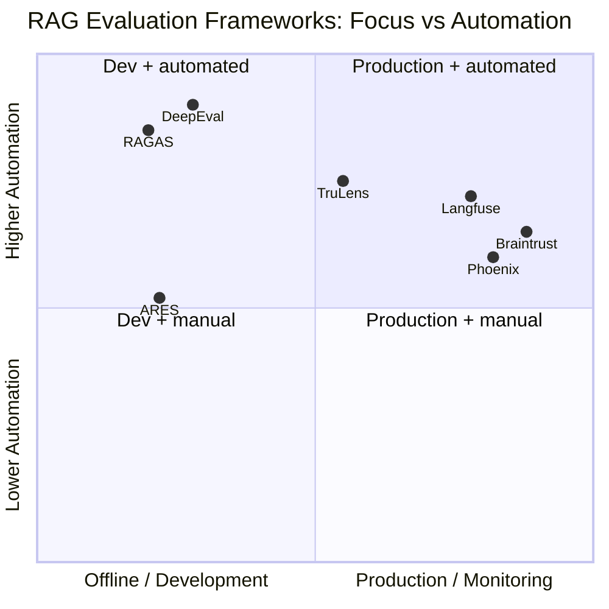
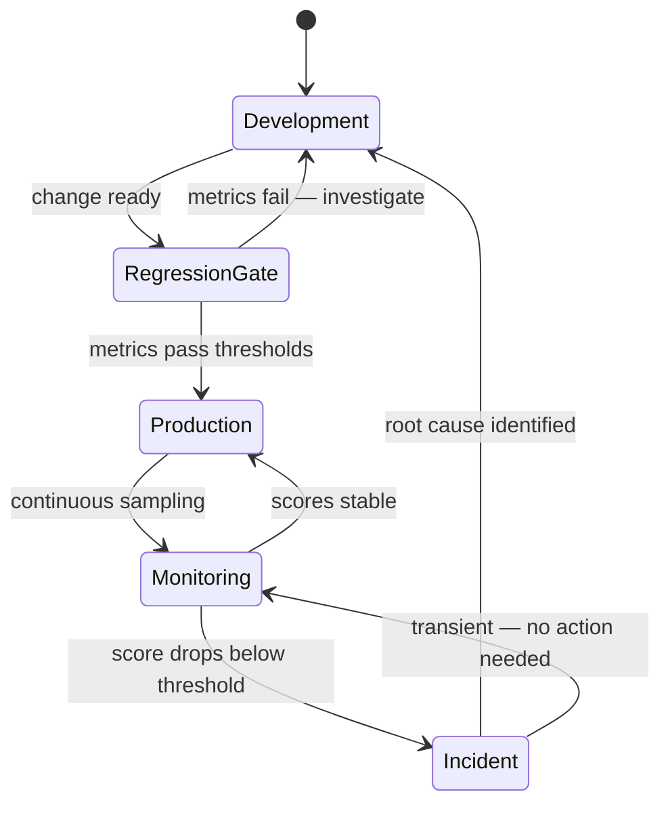

# RAGAS: Evaluating RAG End-to-End

## The System That Feels Like It Works

You have built the RAG system. You split the documents, embedded the chunks, indexed them in a vector store, wrote the retrieval pipeline, wired it up to the language model. You run a few test questions. The answers come back—coherent, relevant, impressively detailed. The demo goes well. Stakeholders are pleased.

A week later, a user reports that the system confidently cited a policy that was updated six months ago. Another user discovers the system answered a legal question using chunks from an unrelated regulatory document that happened to share vocabulary with their query. A third finds that when they ask about a topic covered in three different sections of the knowledge base, the system ignores two of them and gives a partial answer with no indication that it is incomplete.

You had no way to see any of this coming. You had no metrics tracking retrieval quality, no measurement of faithfulness, no signal that the system was silently failing on a class of queries. The demos looked good. The system felt like it was working. Feeling is not a measurement.

This is the evaluation gap—and it is arguably the most underappreciated problem in building RAG systems.

The technical complexity of building a RAG pipeline is well-documented. Chunking strategies, embedding model selection, vector database trade-offs, re-ranking—these are engineering problems with established best practices. But evaluation, the process of systematically measuring whether the system is doing what you intend, has historically lagged behind. The research paper introduces the architecture; the blog tutorials show you how to build it; nobody tells you how to know if it is actually working.

RAGAS—Retrieval Augmented Generation Assessment, introduced by Es, James, Espinosa-Anke, and Schockaert, first posted to arXiv in September 2023 and presented at the EACL 2024 Demo track—was the most systematic attempt to fill that gap. It proposed a framework for evaluating RAG pipelines without the usual dependencies on annotated test sets or expensive human evaluation, built around a specific insight: that a language model can be used to evaluate the outputs of another language model, as long as the evaluation tasks are decomposed carefully enough that the evaluating model cannot be fooled by fluent but incorrect text. Since its release the library has been iterated aggressively—version 0.2 in October 2024 introduced a complete architectural overhaul; version 0.4 in December 2025 overhauled the LLM provider model entirely; at the time of writing the current release is 0.4.3.

This post covers that framework in depth: what RAGAS measures, how each metric works mathematically, where it holds up and where it breaks down, how to implement it in practice, and what the broader landscape of RAG evaluation looks like now that the problem has attracted significant research attention. It assumes you have a RAG system running—either from following the previous posts in this series on building RAG systems or from your own implementation—and that you are asking the natural next question: how do I know if this is any good?

## Why Traditional Metrics Fail

The instinct when first measuring a RAG system is to reach for the standard NLP evaluation toolkit. BLEU, ROUGE, METEOR, exact match—these are the metrics you know. They have been used for decades. They are fast, deterministic, and require no additional infrastructure. Surely they can tell you whether your answers are correct.

They cannot. Not for RAG. The failure is fundamental, not incidental.

**BLEU and ROUGE measure surface overlap, not semantic correctness.** BLEU was designed for machine translation, where a correct translation should share n-grams with a reference translation. ROUGE was designed for summarization, where a good summary should overlap lexically with the source. Neither was designed for question answering over arbitrary documents where the same information can be expressed in dozens of different surface forms.

Consider a question: "What is the company's refund policy for digital purchases?" The reference answer is: "Digital purchases are non-refundable under any circumstances." Your RAG system returns: "Once completed, transactions involving digital goods cannot be reversed or refunded." This answer is semantically identical to the reference. Its BLEU score against the reference would be poor—the n-gram overlap between "digital purchases are non-refundable" and "transactions involving digital goods cannot be reversed" is minimal. BLEU would tell you this answer is wrong. It is correct.

The inverse problem also exists: a fluent, confident hallucination can achieve high n-gram overlap with a reference answer without being factually grounded in the retrieved context. "The policy allows refunds within 30 days for digital purchases" overlaps meaningfully with "The policy does not allow refunds for digital purchases." ROUGE would not flag this as wrong. It is catastrophically wrong.

**Exact match fails even more aggressively** because natural language is paraphrase-rich by design. People ask the same question hundreds of different ways; systems answer correctly in hundreds of different surface forms. An exact match metric that demands lexical identity with a reference answer is measuring the wrong thing.

**Traditional metrics cannot evaluate the retrieval component at all.** They measure the final answer. A RAG system has two separable failure modes: the retriever fails to return relevant chunks, and the generator fails to use the chunks correctly. If you evaluate only the final answer with BLEU or ROUGE, you cannot distinguish between these cases. You know something went wrong; you do not know where. Diagnosing and fixing the wrong component is worse than useless—it can degrade a system that was actually working on one dimension while failing on another.

**They require ground truth at scale.** To evaluate with BLEU or ROUGE, you need reference answers for every query in your test set. Producing those references requires human annotation, which is expensive, slow, and inconsistent at scale. For a knowledge base of ten thousand documents covering a specialized domain, producing even a few hundred high-quality annotated question-answer pairs is a significant project.

The evaluation problem for RAG is therefore fundamentally different from standard NLP evaluation. You need metrics that evaluate semantic correctness rather than surface similarity, that separately assess retrieval quality and generation quality, that can be computed without annotated ground truth for every query, and that are sensitive to the specific failure modes that matter in RAG—hallucination, retrieval drift, incomplete synthesis.

## The Three Dimensions of RAG Quality

Before introducing RAGAS specifically, it is useful to think about what could go wrong in a RAG system—because the framework is designed around exactly these failure modes.



**Retrieval failures** happen when the chunks returned by the retriever do not contain the information needed to answer the question correctly. There are two flavors. In the first, the relevant chunk exists in the index but is not retrieved—it ranks below the top-k cutoff because the query-chunk similarity score is not high enough. This happens due to vocabulary mismatch, poor chunking that separates related information, or embedding models that fail on domain-specific terminology. In the second, no relevant chunk exists at all—the information is simply not in the knowledge base, and the system should acknowledge this rather than attempting to answer.

**Generation failures** happen when the generator fails to produce an answer faithfully grounded in the retrieved chunks, even when those chunks contain the relevant information. The generator might ignore the retrieved context and fall back on parametric knowledge from pre-training. It might synthesize across chunks in a way that introduces fabricated connections. It might extract the right information but state it with incorrect confidence, or omit important caveats present in the source text. These are faithfulness failures: the context was right; the generated answer diverged from it.

**Relevance failures** are distinct from both. The answer might be factually correct and faithfully derived from the retrieved context, but fail to actually address what the user was asking. The system answered a question, just not the one asked. This is particularly common when the query is ambiguous and the system's interpretation diverges from the user's intent.

These three dimensions—retrieval quality, generation faithfulness, and answer relevance—are what a complete RAG evaluation framework must measure. RAGAS operationalizes each of them.

## RAGAS: The Framework

The RAGAS paper (Es, James, Anke, & Schockaert, 2023) introduced a set of metrics designed to evaluate RAG pipelines in a way that is reference-free for most dimensions—meaning you can evaluate many aspects of system quality without providing a correct reference answer for every question.

The enabling insight is the **LLM-as-judge** paradigm: you can use a capable language model to evaluate the outputs of another language model, provided the evaluation task is specified precisely enough that the judge model can distinguish correct from incorrect by reasoning about explicit criteria rather than by matching surface forms.

This is not obvious. The initial reaction is: how can you trust a language model to evaluate a language model? The judge has the same failure modes—hallucination, sycophancy, surface-form sensitivity—as the system being evaluated. The RAGAS answer is: the evaluation tasks are designed to minimize these failure modes. Rather than asking the judge "is this answer good?" (an open-ended question that invites confabulation), RAGAS asks the judge to perform narrow, verifiable reasoning tasks: "Can this specific claim be inferred from this specific text?" These tasks decompose the hard evaluation question into a sequence of simpler binary judgments that a capable LLM can answer reliably.

The framework centers on four primary metrics.

## Faithfulness: Measuring Hallucination

Faithfulness measures whether the claims made in the generated answer are actually supported by the retrieved context. It directly measures the hallucination rate—the tendency of the generator to assert things that are not in the evidence it was given.

**Definition:** Faithfulness is the fraction of claims in the generated answer that can be inferred from the retrieved context.

$$\text{Faithfulness} = \frac{|\text{claims in answer supported by context}|}{|\text{total claims in answer}|}$$

The computation has two steps. First, the judge model extracts a list of atomic claims from the answer—individual statements that can each be independently verified. Then, for each claim, the judge checks whether it can be logically inferred from the retrieved context. The score is the proportion of claims that pass this check.

Why atomic claims? Because evaluating the whole answer at once invites holistic judgments that are unreliable. If an answer contains ten statements and nine are supported by the context while one is hallucinated, a holistic evaluation might rate the answer as "mostly correct"—failing to flag the specific hallucination. Decomposing into atoms forces the judge to evaluate each claim independently, making hallucinations harder to hide behind surrounding correct statements.

```python
from ragas import evaluate
from ragas.metrics import Faithfulness
from ragas.dataset_schema import SingleTurnSample, EvaluationDataset

# A sample with a hallucinated claim
sample = SingleTurnSample(
    user_input="What is the company's policy on remote work?",
    retrieved_contexts=[
        "Employees may work remotely up to 3 days per week with manager approval. "
        "Full remote work requires VP-level sign-off."
    ],
    response=(
        "The company allows remote work up to 3 days per week. "
        "All remote work arrangements are fully flexible and do not require approval. "  # hallucinated
        "VP approval is needed for full remote work."
    ),
)

dataset = EvaluationDataset(samples=[sample])
result = evaluate(dataset=dataset, metrics=[Faithfulness()])
# Expected: faithfulness ~ 0.67 (2 of 3 claims supported)
```

The faithfulness metric answers the question: **given that the retrieval worked, did the generation stay grounded?** A high faithfulness score on a system with high retrieval quality means the system is producing faithful answers from good evidence. A low faithfulness score, regardless of retrieval quality, means the generator is confabulating—the most dangerous failure mode because the user has no way to distinguish confabulation from genuine recall.

A faithfulness score below 0.7 should be treated as a critical failure. At that level, roughly one in three claims made by your system is not supported by its own sources.

## Answer Relevance: Measuring Focus

A system can be highly faithful—every claim it makes is supported by the retrieved context—and still be useless if its answers do not address what the user actually asked. Answer relevance measures this: does the generated response actually address the question?

**Definition:** Answer relevance is the average cosine similarity between the original question and several questions generated by reverse-engineering the answer.

The computation uses a reverse generation approach. The judge model reads the generated answer and produces multiple questions that the answer would be a plausible response to. These generated questions are then embedded, and their average cosine similarity to the original question is computed.

$$\text{Answer Relevance} = \frac{1}{n} \sum_{i=1}^{n} \cos(\mathbf{e}_{q_i}, \mathbf{e}_{q_{\text{original}}})$$

where $\mathbf{e}_{q_i}$ is the embedding of the $i$-th reverse-generated question and $\mathbf{e}_{q_{\text{original}}}$ is the embedding of the original question.

The intuition: if an answer actually addresses the question asked, then the question that naturally leads to this answer should closely resemble the original question. If the system produces an answer that is technically correct but tangential to the user's actual need, the reverse-generated questions will point in a different direction than the original.

```python
from ragas.metrics import AnswerRelevancy

# An evasive but accurate answer
sample_evasive = SingleTurnSample(
    user_input="How do I cancel my subscription?",
    retrieved_contexts=[
        "Subscription cancellation can be initiated through the account settings page. "
        "Click 'Billing', then 'Cancel Subscription'. Cancellations take effect at the end of the billing cycle."
    ],
    response=(
        "Our subscription service offers monthly and annual billing options. "
        "We offer several tiers including Basic, Pro, and Enterprise. "
        "Many customers find our annual plan provides significant savings."
    ),
    # This answer is about subscriptions but doesn't answer the cancellation question
)

sample_direct = SingleTurnSample(
    user_input="How do I cancel my subscription?",
    retrieved_contexts=[
        "Subscription cancellation can be initiated through the account settings page. "
        "Click 'Billing', then 'Cancel Subscription'. Cancellations take effect at the end of the billing cycle."
    ],
    response=(
        "To cancel your subscription, go to account settings, click 'Billing', "
        "then select 'Cancel Subscription'. Your cancellation takes effect at the end of your current billing cycle."
    ),
)
```

Answer relevance handles the case where the system retrieves the right documents, generates a faithful answer from them, but the answer does not answer the actual question—often because the system interpreted an ambiguous query in a way that does not match the user's intent.

## Context Precision: Measuring Retrieval Signal-to-Noise

Context precision evaluates the quality of the retrieval step. Specifically, it measures what fraction of the retrieved chunks are actually relevant to answering the question—the signal-to-noise ratio in the retrieved context.

This matters because irrelevant chunks in the context window are not neutral—they are actively harmful. Irrelevant text can confuse the generator, cause it to produce answers that mix relevant and irrelevant information, and consume context window tokens that could have held more useful evidence. A retriever that returns ten chunks where eight are irrelevant is worse than a retriever that returns three relevant chunks, even though both surface the same relevant information.

**Definition:** Context precision is the weighted proportion of relevant chunks in the retrieved context.

$$\text{Context Precision} = \frac{\sum_{k=1}^{K} \text{Precision@}k \cdot \mathbf{1}[\text{chunk}_k \text{ is relevant}]}{|\text{relevant chunks in top-}K|}$$

where Precision@k is the proportion of retrieved chunks up to position k that are relevant. This position-weighted formulation gives more credit when relevant chunks appear earlier in the ranked list—which matters because most generators attend more strongly to context that appears at the beginning.

```python
from ragas.metrics import LLMContextPrecisionWithReference

# Ground truth helps but RAGAS can also estimate without it
sample = SingleTurnSample(
    user_input="What are the visa requirements for a US citizen visiting Japan?",
    retrieved_contexts=[
        "US citizens can visit Japan for up to 90 days without a visa under the visa waiver program.",  # relevant
        "Japan's national currency is the Japanese Yen (JPY).",  # irrelevant
        "A valid passport is required. The passport must be valid for the entire duration of stay.",  # relevant
        "Tokyo is the capital of Japan and has a population of approximately 14 million.",  # irrelevant
        "Travel insurance is recommended but not required for US citizens visiting Japan.",  # marginally relevant
    ],
    reference="US citizens can visit Japan for up to 90 days without a visa. A valid passport is required.",
)
```

A low context precision score tells you that your retrieval is noisy—you're surfacing too much irrelevant content alongside relevant content. The fix is usually upstream: better chunking to avoid mixing topics within a single chunk, query expansion to improve query-document matching, or re-ranking to push relevant chunks earlier in the ranked list.

## Context Recall: Measuring Retrieval Completeness

Context recall asks the complementary question to context precision: did the retrieval step return all the information needed to answer the question, or did it miss important parts? Where context precision measures noise in the retrieved context, context recall measures coverage.

**Definition:** Context recall is the proportion of claims in the ground-truth reference answer that can be attributed to the retrieved context.

$$\text{Context Recall} = \frac{|\text{sentences in reference attributable to context}|}{|\text{total sentences in reference}|}$$

The computation requires a reference answer (ground truth). Each sentence in the reference is independently checked against the retrieved context: can this sentence be inferred from what was retrieved? The score is the fraction of reference sentences that pass this check.

```python
from ragas.metrics import ContextRecall

sample = SingleTurnSample(
    user_input="Explain the key steps for onboarding a new enterprise customer.",
    retrieved_contexts=[
        "Step 1: Initial discovery call with sales team to understand requirements.",
        "Step 2: Technical kickoff with the customer's IT department.",
        # Step 3 (contract signing) is missing from retrieved context
        "Step 4: Data migration and integration setup.",
        "Step 5: User training and documentation handoff.",
    ],
    reference=(
        "Enterprise onboarding involves five steps: initial discovery call, technical kickoff, "
        "contract signing and legal review, data migration, and user training. "
        "All steps must be completed within 30 days of contract signature."
    ),
)
# Expected recall: ~0.6 because step 3 (contract/legal) and the 30-day timeline
# are not in the retrieved context
```

Context recall requires ground truth, making it less convenient than faithfulness and answer relevance. But it is the most direct measure of whether your knowledge base and retrieval pipeline contain and surface all the necessary information. A low recall score can mean three things: the information is not in the knowledge base at all, it is in the knowledge base but chunked in a way that makes it non-retrievable, or the retriever's similarity scoring fails to surface it for the given query.

## The Score Quartet and What It Tells You Together

The power of RAGAS comes not from any individual metric but from reading them together. Each combination tells a different diagnostic story.

| Context Precision | Context Recall | Faithfulness | Answer Relevance | Diagnosis |
|---|---|---|---|---|
| High | High | High | High | System is working well |
| Low | High | High | High | Retrieval is noisy — re-ranking needed |
| High | Low | High | High | Knowledge gaps — expand the knowledge base |
| High | High | Low | High | Generator is hallucinating — prompt or model issue |
| High | High | High | Low | Answers are off-topic — ambiguity or prompt issue |
| Low | Low | Low | Low | Fundamental pipeline failure — start debugging from retrieval |
| High | High | Low | Low | Severe generation problems — model may not be following context |

This diagnostic table captures the key insight: a RAG system has independent failure modes at the retrieval level and the generation level, and a single aggregate score cannot distinguish between them. An average quality score of 0.55 could mean the retriever is perfect and the generator is terrible, the generator is perfect and the retriever is failing, or both are mediocre. You need the disaggregated view.



## Answer Correctness: The Fifth Metric

RAGAS includes a fifth metric, answer correctness, that requires a ground-truth reference answer and combines semantic similarity with factual overlap.

$$\text{Answer Correctness} = w_1 \cdot \text{Factual Correctness} + w_2 \cdot \text{Semantic Similarity}$$

where factual correctness measures the precision and recall of factual claims between the generated answer and the reference, and semantic similarity measures embedding cosine similarity between them. Default weights are $w_1 = 0.75$, $w_2 = 0.25$.

Answer correctness is the metric closest to what most engineers intuitively want—is the answer right?—but it is the most expensive to compute because it requires human-annotated reference answers for every query. The other four metrics require no ground truth for faithfulness and answer relevance, and ground truth only for context recall.

The practical trade-off is: use answer correctness for your curated regression test set (a few hundred high-quality annotated examples) and the reference-free metrics for broader continuous evaluation over production traffic.

## Generating the Test Set

One of RAGAS's most practical contributions is its test set generator. The bottleneck in RAG evaluation has historically been annotation: you need questions to evaluate against, and producing high-quality questions across a large, specialized knowledge base is labor-intensive.

RAGAS uses LLMs to generate questions automatically from your documents, following a structured evolution process that produces questions of varying complexity.

```python
from ragas.testset import TestsetGenerator
from ragas.testset.synthesizers import (
    SingleHopSpecificQuerySynthesizer,
    MultiHopAbstractQuerySynthesizer,
    MultiHopSpecificQuerySynthesizer,
)
from langchain_openai import ChatOpenAI, OpenAIEmbeddings
from langchain_community.document_loaders import DirectoryLoader

# Load your documents
loader = DirectoryLoader("./knowledge_base/", glob="**/*.md")
docs = loader.load()

# Configure the generator
generator_llm = ChatOpenAI(model="gpt-4o")
embeddings = OpenAIEmbeddings(model="text-embedding-3-small")

generator = TestsetGenerator(llm=generator_llm, embedding_model=embeddings)

# Generate a diverse test set
testset = generator.generate_with_langchain_docs(
    documents=docs,
    testset_size=100,
    synthesizers=[
        SingleHopSpecificQuerySynthesizer(llm=generator_llm),  # Simple factual questions
        MultiHopAbstractQuerySynthesizer(llm=generator_llm),   # Reasoning across documents
        MultiHopSpecificQuerySynthesizer(llm=generator_llm),   # Multi-document factual
    ],
)

# Convert to a DataFrame for inspection
df = testset.to_pandas()
print(df[["user_input", "reference", "reference_contexts"]].head())
```

The evolution process generates different question types:

**Simple (single-hop):** Questions that can be answered from a single chunk. "What is the maximum file size for uploads?"

**Multi-hop reasoning:** Questions that require connecting information across multiple chunks. "If the API rate limit is X per minute and a batch job makes Y calls, how long will it take to process Z items?"

**Conditional:** Questions that depend on context. "Under what conditions does the system fall back to synchronous processing?"

**Abstractive:** Questions requiring synthesis across multiple sources rather than extraction from a single one. "What are the main trade-offs between the two authentication methods described in the documentation?"

This diversity is critical. A test set of only simple factual questions will not reveal failures on complex queries. A system that scores 0.9 on simple questions and 0.3 on multi-hop questions has a very different failure profile than one that scores 0.7 uniformly.

## Running a Full Evaluation

Putting it together: a complete RAGAS evaluation pass requires a dataset of query-context-response triples, optionally with reference answers.

RAGAS 0.4 (the current series as of early 2026) migrated to a universal provider model using the `instructor` library, which means you can back the evaluator with OpenAI, Anthropic, Google, or any LiteLLM-compatible model through a single interface. The `EvaluationDataset` and `SingleTurnSample` types introduced in 0.2 remain the canonical data structures.

```python
from ragas import evaluate
from ragas.metrics import (
    Faithfulness,
    ResponseRelevancy,
    LLMContextPrecisionWithReference,
    ContextRecall,
)
from ragas.dataset_schema import SingleTurnSample, EvaluationDataset
from ragas.llms import LangchainLLMWrapper
from ragas.embeddings import LangchainEmbeddingsWrapper
from langchain_openai import ChatOpenAI, OpenAIEmbeddings

# Your RAG pipeline (abbreviated)
def run_rag_pipeline(question: str) -> tuple[str, list[str]]:
    """Returns (answer, retrieved_chunks)"""
    chunks = retriever.invoke(question)
    context_text = "\n\n".join(chunk.page_content for chunk in chunks)
    answer = llm.invoke(f"Context:\n{context_text}\n\nQuestion: {question}")
    return answer.content, [chunk.page_content for chunk in chunks]

# Build evaluation dataset
samples = []
for item in testset:
    answer, contexts = run_rag_pipeline(item["user_input"])
    samples.append(
        SingleTurnSample(
            user_input=item["user_input"],
            response=answer,
            retrieved_contexts=contexts,
            reference=item.get("reference"),  # None for reference-free metrics
        )
    )

eval_dataset = EvaluationDataset(samples=samples)

# In RAGAS 0.4+, wrap your LLM and embeddings, then assign at metric level
# Use a stronger model as judge than you used as generator
evaluator_llm = LangchainLLMWrapper(ChatOpenAI(model="gpt-4o"))
evaluator_embeddings = LangchainEmbeddingsWrapper(OpenAIEmbeddings(model="text-embedding-3-large"))

# Run evaluation
results = evaluate(
    dataset=eval_dataset,
    metrics=[
        Faithfulness(llm=evaluator_llm),
        ResponseRelevancy(llm=evaluator_llm, embeddings=evaluator_embeddings),
        LLMContextPrecisionWithReference(llm=evaluator_llm),
        ContextRecall(llm=evaluator_llm),
    ],
)

print(results)
# Output example:
# {'faithfulness': 0.82, 'response_relevancy': 0.91,
#  'llm_context_precision_with_reference': 0.76, 'context_recall': 0.88}
```

A few practical notes on running evaluations reliably.

**Use a stronger model as judge than as generator.** If your RAG pipeline uses GPT-4o-mini as the generator, use GPT-4o as the evaluator. A judge that is weaker than the generator will not reliably catch the generator's failures. This adds cost, but evaluation is done offline and at lower volume than production queries.

**Stratify your test set.** Run evaluation separately on different query types (simple, multi-hop, temporal), different document sections, and different user personas if you have data on this. Aggregate scores can mask dramatically different performance profiles across subsets.

**Evaluate on a sliding window.** Do not wait for a major release to evaluate. Run RAGAS against a sample of production queries (with appropriate privacy handling) on a regular schedule—weekly or after each significant change to the pipeline. RAG system quality degrades when knowledge bases drift without corresponding pipeline updates, and evaluation is how you detect this before users do.

**Separate your test set from your development set.** It is easy to over-optimize for a fixed test set, especially when the evaluator LLM is the same one you use to generate synthetic test data. Maintain a held-out evaluation set that you do not use for prompt engineering or pipeline tuning decisions.

## The LLM-as-Judge Problem

RAGAS depends on LLMs to evaluate LLMs, and this creates a category of problems that require explicit acknowledgment. A November 2024 survey paper ("A Survey on LLM-as-a-Judge," arXiv 2411.15594) catalogued the known failure modes systematically; the taxonomy is worth knowing before you put any LLM-based evaluation signal in front of stakeholders.

**Position bias.** LLM judges are sensitive to where content appears in the input. GPT-4-class models tend to favor content placed earlier in the prompt; ChatGPT-class models show a measurable preference for the second position in pairwise comparisons. In faithfulness evaluation, a claim near the beginning of a long retrieved context is more likely to be marked "supported" than the same claim buried in the middle, independent of actual support. Mitigation: shuffle context order across multiple evaluation runs and average the scores.

**Verbosity and length bias.** Judges trained with RLHF have learned to associate longer, more formal outputs with quality—because human raters, in the data these models were trained on, often did the same. A hallucinated answer dressed in detailed prose will systematically outscore a correct but terse one. This makes the bias particularly dangerous: the failure modes you most need to catch (fluent confabulations) are exactly the ones most likely to receive inflated scores.

**Self-enhancement bias.** Models give higher scores to their own outputs. If your generator and your judge are the same model family—or the same model—the evaluator has a measurable tendency to rate the generator's work more favorably. The magnitude of this effect can be quantified by comparing against human judgments on a calibration set; a 2024 paper (arXiv 2410.02736) introduced CALM specifically to detect and quantify this across twelve bias dimensions.

**Concreteness and citation bias.** Judges favor answers that include numbers, technical terms, or cited sources—regardless of whether those citations are correct or the numbers are accurate. A response that says "According to the 2023 Gartner report, 73% of organizations..." will be rated more highly than "Most large organizations do..." even when the citation is fabricated.

**Self-consistency failure.** Running the same evaluation query twice against the same judge model can produce different scores, particularly for borderline cases. A 2025 study at IJCNLP found that position bias mitigation strategies (like shuffling) often introduce new biases while reducing the target one. RAGAS evaluations have inherent variance that you should quantify: run each evaluation pass multiple times and report score distributions rather than single point estimates.

**The evaluation model gap.** If your generator model is very capable, a less capable evaluator will fail to detect its errors. A GPT-4o-class generator and a weaker evaluator is a problematic combination: the generator can produce sophisticated confabulations that the evaluator cannot reason through carefully enough to flag.

**Domain calibration.** RAGAS metrics are calibrated on general-domain data. The survey found an average Fleiss' Kappa of only ~0.3 across languages when evaluating multilingual content—meaning LLM judges are not yet reliable for non-English evaluation. In specialized domains—medical, legal, financial—the judge may lack the domain expertise to correctly evaluate whether a specialized claim is faithful to specialized source text. A 2025 study extending RAGAS to telecom domain documentation found substantial metric reliability degradation under domain shift.

These are not reasons to reject LLM-as-judge evaluation. They are reasons to treat RAGAS scores as estimates with uncertainty rather than ground truth, to validate against human judgment on a subset of your evaluation data, and to be especially skeptical of scores at the extremes.

The right posture is: RAGAS scores are the most practical scalable signal available for RAG quality, and they are dramatically better than no evaluation or BLEU/ROUGE. They are not infallible. Use them to identify large failures and track trends, not to make binary pass/fail decisions based on small score differences.

The seven bias types differ significantly in how easy they are to catch and how much damage they do before you notice. Some—like self-consistency failure—are detectable with a simple two-run comparison. Others—like verbosity bias—are structurally dangerous precisely because the failures they hide (fluent confabulations) look like high-quality outputs:



## Custom Metrics and AspectCritic

RAGAS's built-in metrics cover the core dimensions. For domain-specific quality requirements, the framework supports custom metrics through AspectCritic—a mechanism for defining arbitrary evaluation criteria in natural language.

```python
from ragas.metrics import AspectCritic

# Custom metric: does the answer appropriately hedge uncertainty?
hedging_critic = AspectCritic(
    name="appropriate_uncertainty_hedging",
    definition=(
        "Does the response appropriately communicate uncertainty when the retrieved context "
        "is incomplete or when claims cannot be fully verified from the provided documents? "
        "A good response says 'based on the available documentation' or 'the documentation "
        "indicates' rather than making absolute claims from partial evidence."
    ),
    strictness=3,  # 1-3, higher is more strict
)

# Custom metric: is the answer actionable?
actionability_critic = AspectCritic(
    name="actionability",
    definition=(
        "Does the response provide concrete, actionable information that the user can "
        "immediately act on, rather than vague or generic guidance? An actionable response "
        "includes specific steps, commands, settings, or procedures rather than just "
        "describing what something does."
    ),
    strictness=2,
)

results = evaluate(
    dataset=eval_dataset,
    metrics=[Faithfulness(), hedging_critic, actionability_critic],
)
```

AspectCritic enables evaluation of qualities that are important for your specific application but are not captured by the generic metrics. For a medical information system, you might define critics for safety appropriate disclaimers, for a legal system for jurisdiction-specific accuracy, for a customer support system for tone appropriateness and escalation triggers.

## Beyond RAGAS: The Evaluation Landscape

RAGAS is not the only framework for RAG evaluation, and understanding the alternatives helps you pick the right tool and avoid over-indexing on any single framework's view of quality. The ecosystem has grown substantially in 2024-2025, partly because of the scale of enterprise RAG adoption (73% of RAG implementations now in large organizations, according to 2025 industry surveys) and partly because of the shift toward agentic systems that require new evaluation categories beyond classic retrieval quality.

**TruLens** (current: 2.7.0, February 2026) organizes evaluation around the RAG Triad—context relevance, groundedness, and answer relevance—the same three concerns as RAGAS, implemented differently. The engineering emphasis has shifted toward observability: TruLens 1.5.0 (June 2025) made OpenTelemetry the default tracing backend, enabling cross-framework interoperability in multi-agent architectures. The 2.x series introduced a unified `Metric` class API replacing the previous `Feedback` object design. TruLens positions itself explicitly as "evals and tracing for AI agents, not just RAG"—the same pivot RAGAS is making with its agentic metrics. For teams already using LangChain or LlamaIndex instrumentation, TruLens's tracing integration is the tightest in class.

**DeepEval** (current: 3.8.4, February 2026) is the testing framework that most aggressively pursues the "pytest for LLMs" positioning. You define test cases with assertions about quality metrics, run them in CI, and fail the build when scores drop below thresholds. As of 2025, DeepEval ships over 50 research-backed metrics including G-Eval (a flexible LLM-based rubric evaluator), contextual precision/recall/relevancy, hallucination, bias, and toxicity. The 2025 additions are worth noting: six agentic evaluation metrics covering plan quality, tool correctness, task completion, and goal accuracy; MCP tool evaluation metrics; and native integrations with CrewAI and Anthropic's SDK. DeepEval is the right choice for teams with a software testing culture who want evaluation gates in their deployment pipeline.

**ARES** (Automated RAG Evaluation System, Saad-Falcon et al., NAACL 2024) takes a fundamentally different approach to the reliability problem. Rather than using a general-purpose LLM as judge, ARES trains lightweight classifier models on a small amount of human-labeled data and uses prediction-powered inference (PPI) to produce evaluation scores with statistically valid confidence intervals. The key advantage is calibrated uncertainty: ARES does not report a point estimate, it reports a score with a confidence interval derived from statistical theory. The disadvantage is the training data requirement and the maintenance overhead. As of early 2026, ARES shows less development activity than RAGAS or DeepEval—the last significant commit was March 2025—but the statistical approach it represents remains the most rigorous option for teams that need defensible uncertainty quantification.

**Arize Phoenix** (open-source, self-hostable) focuses on observability first and evaluation second—it traces every step of the RAG pipeline, logs queries, retrieved chunks, and responses at scale, and provides interactive evaluation interfaces with native OpenTelemetry support. The design philosophy is that evaluation failures are most useful when you can trace them to specific pipeline steps, not just aggregate them into a score. Phoenix complements RAGAS naturally: Phoenix to see what your system is doing at each step, RAGAS to measure how well it is doing it.

**Langfuse** (open-source, with a cloud tier) combines traces, evals, prompt management, and production analytics in one platform. The evaluation component runs LLM-as-judge scores on sampled production traces, making it the most direct path to continuous production evaluation for teams not already committed to Phoenix.

**Braintrust** (commercial) focuses on the production-to-test feedback loop: failed production traces can be captured and directly converted into regression test cases, closing the loop between production failures and systematic prevention. The CI/CD gating story is mature.

The practical pattern that has emerged in 2025 for mature RAG deployments is to combine RAGAS for offline benchmark evaluation and testset generation, Phoenix or Langfuse for production tracing and monitoring, and DeepEval or RAGAS for CI/CD regression gates. No single tool does all three well enough to justify building exclusively around it.

Where each framework sits in this landscape — how oriented toward offline development versus live production, and how much of the evaluation it can automate — makes the choice clearer:



**RAGAS's own expansion** into agentic evaluation is worth noting separately. Version 0.2 introduced `MultiTurnSample` for conversational and agentic workflows; the 0.3.x series added `ToolCallF1`, `ToolCallAccuracy`, `AgentGoalAccuracy`, and `TopicAdherence` metrics. The library is explicitly positioning beyond RAG toward general LLM application evaluation—which is simultaneously its greatest strength (one framework covering the full stack) and its main architectural challenge (maintaining coherent metric semantics across very different task types).

## Continuous Evaluation: Making It Actually Useful

Evaluation that happens once before a deployment is not evaluation—it is a demo. Continuous evaluation means building systematic measurement into the development and deployment lifecycle so that quality becomes a tracked, improving metric rather than a one-time checkpoint.

The evaluation lifecycle for a RAG system has three phases:

**Development evaluation** uses your curated test set to compare pipeline configurations—different chunking strategies, different embedding models, different retriever settings, different prompts. At this phase, you are using RAGAS metrics to make engineering decisions. The test set should be fixed across comparisons (so changes in scores reflect changes in the system, not changes in the test data), diverse (covering simple queries, multi-hop queries, edge cases), and independent from your training and prompt-engineering process.

**Pre-deployment regression** runs the full metric suite against your regression test set before any significant change goes to production. Establish threshold policies: a deployment that drops faithfulness below 0.75 or context recall below 0.80 is blocked pending investigation. These thresholds should be informed by your domain's risk tolerance—medical or legal applications warrant stricter thresholds than internal productivity tools.

**Production monitoring** samples production queries (with appropriate anonymization), runs them through your RAG pipeline with evaluation enabled, and tracks metric trends over time. This is where you catch the subtle degradations: as your knowledge base grows and documents are added or updated, the retriever's behavior on existing query types can drift. Faithfulness can drop as the document corpus introduces contradictory information. Context precision can degrade as the index grows and more irrelevant documents compete with relevant ones. Without production monitoring, you learn about these degradations from user complaints.



```python
import json
from datetime import datetime
from ragas import evaluate
from ragas.metrics import Faithfulness, AnswerRelevancy

def evaluate_production_sample(
    queries: list[str],
    rag_pipeline,
    evaluator_llm,
    sample_fraction: float = 0.1,
) -> dict:
    """
    Evaluate a random sample of production queries.
    Called by a cron job or CI trigger.
    """
    import random
    sampled = random.sample(queries, max(1, int(len(queries) * sample_fraction)))

    samples = []
    for query in sampled:
        answer, contexts = rag_pipeline(query)
        samples.append(
            SingleTurnSample(
                user_input=query,
                response=answer,
                retrieved_contexts=contexts,
            )
        )

    results = evaluate(
        dataset=EvaluationDataset(samples=samples),
        metrics=[Faithfulness(llm=evaluator_llm), AnswerRelevancy(llm=evaluator_llm)],
    )

    report = {
        "timestamp": datetime.utcnow().isoformat(),
        "sample_size": len(sampled),
        "metrics": dict(results),
    }

    # Log to your monitoring system
    with open("eval_log.jsonl", "a") as f:
        f.write(json.dumps(report) + "\n")

    return report
```

The most important output of continuous evaluation is the trend, not the absolute number. A system with a faithfulness score of 0.85 that has been declining 0.02 per week for the past month is a more urgent problem than a system with a steady faithfulness score of 0.75.

## The Evaluation Philosophy

There is a deeper question underneath all the metric definitions that is worth naming explicitly: what does it mean to evaluate a RAG system well?

RAGAS offers a specific, pragmatic answer: it means measuring faithfulness, relevance, and retrieval quality, using LLMs as judges, with a tractable set of automated metrics. This answer is enormously useful. It is not complete.

The metrics RAGAS can measure are the metrics RAGAS was designed to measure. They capture whether the system is grounded in its sources, whether it addresses the question asked, and whether the retrieval pipeline is returning relevant content. They do not capture whether the sources themselves are authoritative and trustworthy. They do not capture whether the answer is current (a faithfully cited but outdated policy is a failed answer for most practical purposes). They do not capture user satisfaction, which correlates with but is not identical to technical quality metrics. They do not capture the downstream consequences of incorrect answers in high-stakes domains.

There is also the meta-evaluation problem: how do you know whether the metrics themselves are valid? RAGAS metrics have been validated against human judgments on specific benchmarks, and the correlations are reasonably strong. But the correlation between LLM-as-judge scores and human judgments varies significantly across domains, query types, and answer styles. In the domains where your system operates, the calibration between RAGAS scores and actual quality may be different from the benchmarks on which the framework was developed.

This does not mean you should not use RAGAS. It means you should use RAGAS as the main quantitative signal while maintaining a human evaluation process on a small, representative subset—both to catch the failures that automated metrics miss and to periodically re-calibrate that the automated metrics are still tracking what you care about. The right evaluation system for a production RAG application is a combination of automated RAGAS metrics for coverage and speed, human evaluation on a curated subset for calibration and edge cases, and user feedback signals (thumbs up/down, explicit corrections, query reformulations) as the ground-truth signal that everything else is ultimately trying to proxy.

RAGAS closes the gap between "feels like it's working" and "is measurably working." It does not close the gap between "is measurably working on the metrics I can automate" and "is actually serving users well in my specific domain." The latter gap requires judgment that no automated framework can fully substitute.

## Closing: The Missing Half

The posts in this series have covered RAG from theory to production. The original Lewis et al. paper introduced the paradigm: retrieve, marginalize over evidence, generate. The building post covered the engineering decisions that make retrieval actually work at scale—chunking, embedding, vector indexing, re-ranking. The advanced patterns post covered the techniques that turn a brittle prototype into a reliable system—HyDE, query decomposition, agentic retrieval.

Evaluation is the thread that connects all of them. Without it, the engineering decisions in building and the techniques in advanced patterns are optimizations in the dark—you are making choices about which chunking strategy to use or whether to add a re-ranker without any reliable signal that one choice is better than another. With evaluation, you have the feedback loop that makes the whole development process coherent: you change something, you measure, you learn.

RAGAS is not the final answer to RAG evaluation—the problem is too hard and the field is too active for any framework from 2023 to be the last word. But it is the most principled, widely adopted framework currently available, and its decomposition of RAG quality into faithfulness, relevance, precision, and recall reflects a genuine insight about what it means for a retrieval-augmented system to work correctly.

If you have a RAG system in production without any evaluation framework, start here. Add RAGAS to your pipeline this week. Generate a test set from your documents. Run the metrics. The numbers will almost certainly tell you something surprising.

Building without measuring is hope. Measuring turns it into engineering.

---

## Going Deeper

**The Papers:**

- Es, S., James, J., Espinosa-Anke, L., & Schockaert, S. (2023). ["RAGAS: Automated Evaluation of Retrieval Augmented Generation."](https://arxiv.org/abs/2309.15217) *EACL 2024 Demo Track* (revised April 2025). — The original paper. Clear, well-structured, and honest about limitations. Read the appendix for the full metric derivations and the human evaluation calibration study that establishes where the LLM-as-judge approach holds and where it fails.

- Saad-Falcon, J., Khattab, O., Potts, C., & Zaharia, M. (2023). ["ARES: An Automated Evaluation Framework for Retrieval-Augmented Generation Systems."](https://arxiv.org/abs/2311.09476) *NAACL 2024*. — The statistical alternative to RAGAS. Uses lightweight classifiers with prediction-powered inference (PPI) to produce evaluation scores with statistically valid confidence intervals rather than point estimates. Essential reading for anyone who needs defensible uncertainty quantification.

- Friel, R., Singhal, A., & Santra, A. (2024). ["RAGBench: Explainable Benchmark for Retrieval-Augmented Generation Systems."](https://arxiv.org/abs/2407.11005) arXiv 2407.11005. — 100,000 evaluation examples across five industry domains. Introduces the TRACe framework (Utilization, Relevance, Adherence, Completeness) and the striking finding that a fine-tuned RoBERTa classifier outperforms LLM-based evaluation on domain-specific RAG tasks—a direct challenge to the LLM-as-judge paradigm in specialized domains.

- Gu, J., et al. (2024). ["A Survey on LLM-as-a-Judge."](https://arxiv.org/abs/2411.15594) arXiv 2411.15594, November 2024. — The most comprehensive treatment of evaluator bias available. Catalogues seven bias types, reviews mitigation strategies, and provides empirical analysis across model families and languages. The reference for anyone building production evaluation pipelines.

- Zheng, L., Chiang, W., Sheng, Y., Zhuang, S., Wu, Z., Zhuang, Y., ... & Stoica, I. (2023). ["Judging LLM-as-a-Judge with MT-Bench and Chatbot Arena."](https://arxiv.org/abs/2306.05685) *NeurIPS 2023*. — The foundational paper on LLM-as-judge methodology. Characterized position, length, and sycophancy biases before the more comprehensive 2024 survey. The MT-Bench benchmark it introduces remains widely used for judge calibration.

- Liu, N. F., Lin, K., Hewitt, J., Paranjape, A., Bevilacqua, M., Petroni, F., & Liang, P. (2023). ["Lost in the Middle: How Language Models Use Long Contexts."](https://arxiv.org/abs/2307.03172) *TACL 2024*. — Explains why context precision matters: retrieval noise at the wrong position in the context window is not merely wasteful, it actively degrades generation quality. The empirical position-dependence results inform how to interpret context precision scores.

- Gao, Y., Xiong, Y., Gao, X., et al. (2023). ["Retrieval-Augmented Generation for Large Language Models: A Survey."](https://arxiv.org/abs/2312.10997) — The most complete survey of where RAG stands. Section 4 on evaluation covers all major frameworks and their trade-offs, including comparison between RAGAS, ARES, and the broader landscape of automated and human evaluation approaches.

**Books:**

- Huyen, C. *AI Engineering.* O'Reilly Media, 2025. — Chapter 6 covers evaluation in AI applications thoroughly, including LLM-as-judge methodology, evaluation framework design, and the relationship between automated metrics and business outcomes. The most practically useful treatment of this topic available.

- Garg, S., & Moschitti, A. *Building LLM Applications.* O'Reilly Media, 2024. — Chapter 9 specifically addresses RAG evaluation patterns with production deployment context. Bridges the gap between research metrics and engineering practice.

- Kleppmann, M. *Designing Data-Intensive Applications.* O'Reilly Media, 2017. — Not about RAG, but Chapter 1's treatment of reliability, scalability, and maintainability applies almost directly to RAG evaluation design. The mental model of "what does it mean for a system to be correct" transfers directly.

**Online Resources:**

- [RAGAS Documentation](https://docs.ragas.io/) — The official docs cover the full 0.4.x API including the `instructor`-based LLM provider model, all current metrics with formulas and limitations, and the Knowledge Graph-based testset generator. The migration guides (v0.1 → v0.2 and v0.3 → v0.4) are unusually clear about what broke and why.

- [RAGAS GitHub — vibrantlabsai/ragas](https://github.com/explodinggradients/ragas) — The examples directory has worked implementations for every metric and the testset generator, including custom `AspectCritic` configurations for domain-specific evaluation criteria.

- [Arize Phoenix Documentation](https://docs.arize.com/phoenix) — The observability platform that complements RAGAS most naturally. Built on OpenTelemetry, which means traces from Phoenix integrate with Langfuse, TruLens, and other OTel-native tools. Particularly useful for tracing evaluation failures back to specific pipeline steps.

- [DeepEval Documentation](https://docs.confident-ai.com/) — DeepEval's pytest integration guide is the best available reference for CI/CD-gated RAG evaluation. The G-Eval metric documentation explains the flexible rubric-based evaluation approach that complements RAGAS's fixed-dimension metrics.

- [Awesome-RAG-Evaluation on GitHub](https://github.com/YHPeter/Awesome-RAG-Evaluation) — Maintained collection of RAG evaluation papers, frameworks, and benchmarks. A useful index of what's happening in the space, updated through 2024-2025.

**Videos:**

- ["Evaluating RAG with Langfuse and RAGAS"](https://www.youtube.com/watch?v=2fqs8Nlh5UI) by Langfuse — End-to-end walkthrough of running RAGAS metrics inside a real pipeline, interpreting scores, and wiring evaluation into a continuous feedback loop. One of the most practical intros available.

- ["Building and Evaluating Advanced RAG"](https://www.deeplearning.ai/short-courses/building-evaluating-advanced-rag/) — Free short course by Jerry Liu (LlamaIndex) and Anupam Datta (TruEra) on DeepLearning.AI. Covers the RAG triad (context relevance, groundedness, answer relevance) with working code you can run immediately.

**Questions to Explore:**

- RAGAS uses LLMs to evaluate LLMs. The evaluator model has biases, failure modes, and knowledge cutoffs of its own. Under what conditions does this evaluation loop become self-referential in a way that masks systematic failures? Is there a principled way to detect when the evaluator has been fooled by the generator's outputs?

- Context precision and recall trade off against each other under retrieval budget constraints: retrieving more chunks increases recall but decreases precision. How should this trade-off be managed, and does the optimal balance point differ by domain, query type, or downstream use case?

- RAGAS measures whether the generated answer is faithful to the retrieved context. But what if the retrieved context is itself wrong, outdated, or biased? Faithfulness to incorrect sources is not a virtue. How should evaluation frameworks account for source quality, not just retrieval and generation quality?

- The evaluation problem for RAG systems has an interesting parallel in epistemology: how do we know when we know something? Both a human expert and a RAG system face the problem of distinguishing genuine knowledge from confident confabulation. What can evaluation frameworks learn from epistemological work on justified belief and epistemic humility?

- Continuous evaluation generates a feedback signal—a stream of scores over time. How should this signal feed back into RAG system improvement? Should it trigger automatic pipeline reconfigurations, or is human oversight required at every decision point? And what are the risks of closing the loop too tightly?
