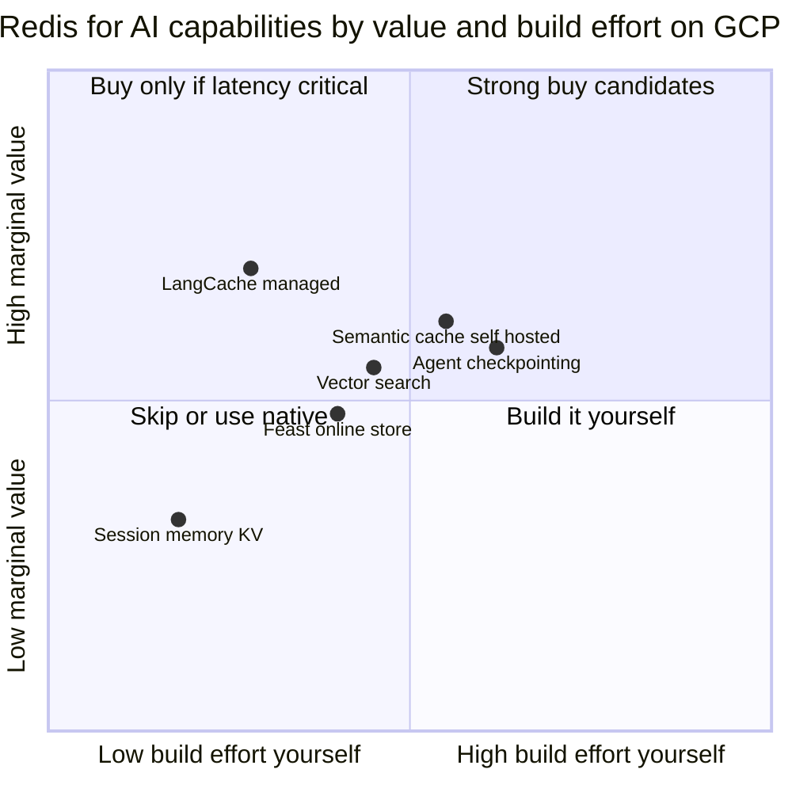
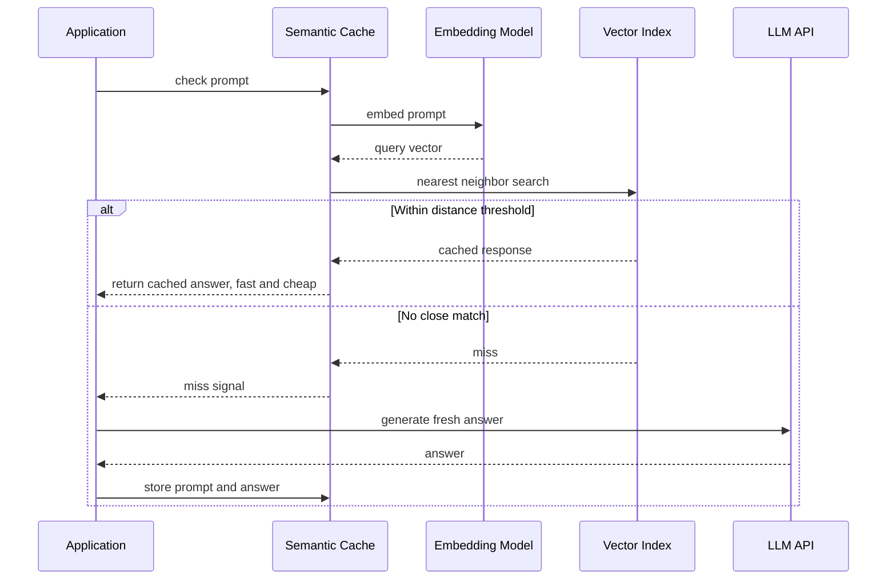
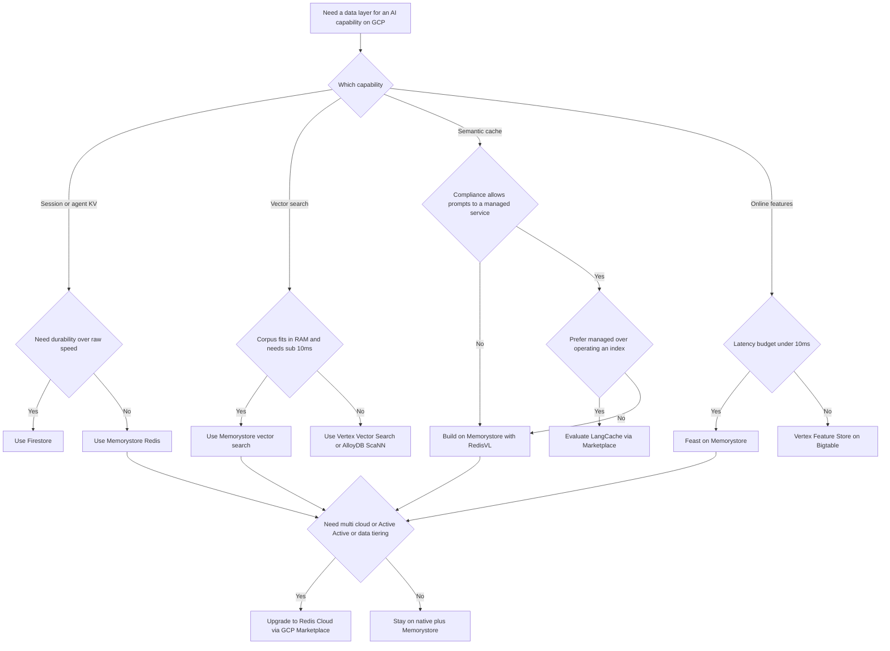

# Redis for AI on GCP: A Critical Buy-vs-Build Analysis

## The Multitool Temptation

There is a specific kind of object that everyone owns and almost nobody uses to its full extent: the Swiss Army knife. It has a blade, a saw, a corkscrew, a tiny pair of scissors, a thing that is either a leather punch or a weapon. It is genuinely useful in the way that a single competent tool is useful, and genuinely seductive in the way that a drawer full of specialized tools is not. When you are standing in the camping aisle, the multitool wins. When you are actually building a deck, you reach for the cordless drill you already own and the multitool stays in the drawer.

"Redis for AI" is a multitool. Over the past two years Redis has assembled its in-memory database, its vector index, a managed semantic cache, agent-memory libraries, and a feature-serving story into a single branded bundle, wrapped it in a Python library called RedisVL, and put it on the Google Cloud Marketplace where it can be added to your bill with a few clicks and drawn down against your existing committed-use contract. The pitch is clean: one system for short-term memory, vectors, caching, and features. Fewer moving parts. Lightning fast. Enterprise grade.

If you are starting from nothing, that pitch is compelling. But you are not starting from nothing. You already run everything on GCP. You have Memorystore one API call away, Vertex AI Vector Search and Vertex AI Feature Store sitting in the same console, BigQuery as your analytical spine, and AlloyDB with pgvector if you want vectors next to relational data. The real question is not "is Redis good?" It obviously is. The question is the procurement question: **what do I actually gain by adding Redis to a stack that already has a Google-managed answer for most of what Redis sells, and is that gain worth the cost, the second vendor, and the lock-in?**

This post treats that as a decision you have to defend to a budget owner, not a technology you want to play with. It maps each Redis-for-AI capability to its nearest GCP-native equivalent, untangles the genuinely confusing distinction between Memorystore and Redis Cloud, and proposes three concrete proofs of concept with success metrics that would settle the argument with data instead of vibes. If you want the caching mechanics in depth, I wrote a companion piece on [the four cache layers that move the needle in LLM systems](https://juanlara18.github.io/portfolio/#/blog/llm-caching-four-layers); and if you want the broader GCP AI stack with its warts, see [the GCP AI stack field notes](https://juanlara18.github.io/portfolio/#/blog/gcp-ai-stack-vertex-alloydb-knowledge-pipeline). This post is the buy-vs-build layer on top of both.

## What Redis Actually Offers for AI

Before we can evaluate, we need an honest inventory. "Redis for AI" is a marketing umbrella over five distinct capabilities, each with different maturity and different competition.

### Short-term Memory and Session State

This is the original Redis. Sub-millisecond key-value reads and writes, native TTLs, atomic operations, pub/sub. For an agentic system, this is where you keep the things that must be fast and must expire: the current conversation buffer, tool-call scratchpads, rate-limit counters, idempotency keys, in-flight task state, and per-session context that you do not want to re-derive on every turn. None of this is AI-specific. It is the same reason Redis has been in front of databases for fifteen years. The AI framing is just that agents have a lot of small, hot, ephemeral state and they have it per user.

RedisVL adds conversational abstractions on top -- message history with optional semantic retrieval over past turns -- but underneath, it is hashes with TTLs. This is the capability where Redis is least replaceable and least differentiated at the same time: everyone agrees you want a fast KV store for session state, and there are many fast KV stores.

### Vector Search via the Redis Query Engine

Redis is a vector database. The Redis Query Engine (the indexing-and-search subsystem, historically surfaced as RediSearch) supports `FLAT` exact search, `HNSW` approximate search, and a newer `SVS-VAMANA` index, with cosine, inner-product, and L2 distance, plus hybrid queries that combine vector similarity with tag, numeric, geo, and full-text filters. HNSW exposes the usual knobs: `M` (graph connectivity, default 16), `EF_CONSTRUCTION` (build-time candidate set, default 200), and `EF_RUNTIME` (query-time candidate set, default 10), the last of which RedisVL lets you tune per query without rebuilding the index. As of recent releases it also does BM25 full-text and a `HybridQuery` that fuses semantic and keyword signals.

The honest framing: Redis is a very fast in-memory vector index, which means its strength is low-latency, high-QPS search over datasets that fit in RAM. It is not a disk-backed billion-vector warehouse, and it is not trying to be a dedicated vector DB with exotic quantization and compaction tooling the way Milvus or a purpose-built system is. For a comparison of dedicated vector DBs on their own terms, see [the vector DB benchmarks post](https://juanlara18.github.io/portfolio/#/blog/vector-db-benchmarks).

### Semantic Caching: RedisVL SemanticCache and LangCache

There are two distinct products here, and conflating them is the most common mistake.

**RedisVL `SemanticCache`** is a library-level pattern you run yourself. It creates a vector index inside *your* Redis, embeds incoming prompts, and returns a stored response when an incoming prompt is within a distance threshold of a previous one. You own the Redis, the index, the embedding model, and the threshold. The distance is COSINE in Redis units `[0, 2]`, where 0 is identical and lower thresholds are stricter; the default is around 0.1.

**LangCache** is Redis's *fully managed* semantic cache, announced in public preview on Redis Cloud. You call a REST API (`POST /v1/caches/{cacheId}/entries/search` to check, `POST /v1/caches/{cacheId}/entries` to store), and Redis handles embedding generation, storage, similarity search, and eviction. It ships a purpose-trained embedding model (`redis/langcache-embed`) alongside OpenAI embedding support, bills on consumption, and supports both exact and semantic search strategies. RedisVL wraps it as `LangCacheSemanticCache` so you get the same `check`/`store` interface as the self-hosted version but without operating the index.

The economics of either are identical and worth stating plainly: a cache hit saves the LLM output-token cost and the generation latency, but you pay for the embedding call and the vector storage on every lookup. The break-even is entirely a function of hit rate. Below some hit rate, you are paying embedding costs to save nothing.

### Feature Store: Feast on Redis

Redis is the de facto default online store for [Feast](https://docs.feast.dev/), the open-source feature store. The architecture is standard: an offline store (BigQuery, Snowflake, S3) holds historical features for training, and an online store holds the latest feature values for low-latency serving at inference time. Feast's own performance tuning docs put Redis and the Redis-compatible Dragonfly in the sub-millisecond p50 tier, ahead of DynamoDB (2 to 5 ms), Bigtable (3 to 8 ms), and PostgreSQL (3 to 10 ms), and Feast's benchmark history claims Redis is several times faster than alternatives for feature serving. The Redis online store batches all `HMGET` reads across feature views into a single pipeline, collapsing N round-trips into one.

So if your real-time models need single-digit-millisecond feature lookups and you are already using Feast, Redis is the obvious online store. The question is whether *your* latency budget actually needs the difference between 1 ms and 8 ms.

### LLM Context, Conversation Memory, and the RAG Cache

The last bucket is the integration story: RedisVL's message history (with semantic retrieval over prior turns), the LangChain and LangGraph Redis integrations for checkpointing agent state, and the "RAG cache" pattern where you cache retrieved chunks or whole answers keyed on semantic similarity. This is less a distinct product and more the composition of the four above into agent and RAG patterns, packaged so a LangChain user can adopt it in a few lines.

The whole thing is marketed as the "Redis for AI" bundle, sold primarily through Redis Cloud and positioned as a single low-latency data layer for the entire AI application -- memory, retrieval, caching, and features in one place. RedisVL is the glue: one Python client, built on `redis-py`, that exposes vector search, semantic caching, and conversational memory through a consistent interface, so you do not learn a new ecosystem if your team already runs Redis. That cohesion is the genuine product. It is also exactly the multitool framing -- the value proposition is integration and fewer moving parts, not any single capability being uniquely best. Whether integration is worth a second vendor is precisely the question a GCP-native team has to answer, because GCP's counter-pitch is that *its* services are the ones already integrated with your IAM, VPC, billing, and the rest of your data estate.



## The GCP-Native Overlap Map

Here is the uncomfortable truth for the Redis sales motion: Google has spent the last two years closing the gaps. Almost every capability in the Redis-for-AI bundle now has a GCP-native answer that ships in the same console, bills on the same invoice, and inherits your IAM, VPC, and CMEK setup for free.

The single most important development: **Memorystore for Redis Cluster and Memorystore for Valkey both now support vector search as a Generally Available feature.** Both offer `HNSW` and `FLAT` indexes, hybrid queries with numeric and tag filters, multi-threaded query execution, and cluster-wide partitioning to scale across many vectors. This is Google-managed, in your VPC, and it means the "I need a fast in-memory vector index" use case no longer requires a second vendor. Memorystore is Redis-compatible (and Valkey, the Linux Foundation fork of Redis, is wire-compatible), so the same client libraries and largely the same index DSL apply.

Map it capability by capability:

| Redis-for-AI capability | Nearest GCP-native option | How close is the match |
| --- | --- | --- |
| Session and agent KV memory with TTL | Memorystore for Redis / Valkey; Firestore for durable session docs | Near-exact for Memorystore; Firestore trades latency for durability and serverless billing |
| Vector search HNSW in-memory | Memorystore for Redis Cluster or Valkey vector search GA | Functionally equivalent for in-RAM, low-latency, high-QPS search |
| Vector search at large scale | Vertex AI Vector Search with ScaNN; AlloyDB ScaNN index; BigQuery vector search | Different shape: disk-backed, managed ANN, scales past RAM, higher floor latency |
| Semantic cache self-hosted | RedisVL SemanticCache on Memorystore vector search | You can run the same pattern on Memorystore; no managed turnkey equivalent |
| Semantic cache managed turnkey | No direct GCP equivalent | This is a genuine Redis-only product on GCP today |
| Online feature serving | Vertex AI Feature Store with Bigtable online serving | Native and integrated with BigQuery offline; higher latency floor than Redis |
| Offline feature store and training data | BigQuery | Native, no Redis story competes here |
| RAG retrieval and grounding | Vertex AI RAG Engine; AlloyDB pgvector | Native managed pipeline; Redis covers the index layer only |

Two services deserve a closer look because they define the boundaries.

**Vertex AI Vector Search** (formerly Matching Engine) is Google's managed ANN service built on ScaNN. It is architecturally the opposite of Redis vector search: it is disk-and-memory tiered, scales well past what fits in a single machine's RAM, and is billed on infrastructure node-hours for the index-serving endpoint. That last point is the catch that surprises every team: the endpoint bills per node-hour whether or not you send a single query, on the order of roughly \$0.09 per node-hour for a small machine type, with index builds around \$3 per GiB processed and streaming updates around \$0.45 per GiB. A modestly sized index on a few replicas runs on the order of several hundred dollars a month just to keep the lights on. It is excellent when you have a large corpus and steady traffic; it is a money pit when you have a small index and bursty or development traffic, because there is no scale-to-zero by default. (Set `minReplicaCount` carefully and undeploy idle endpoints.)

**Vertex AI Feature Store** has consolidated on **Bigtable online serving** -- the older "Optimized online serving" tier is deprecated as of mid-2026 and should not be used for new builds. The offline store is BigQuery: you register existing BigQuery tables as feature groups and sync selected features to Bigtable for serving. Real-world server-side latency lands around 30 ms at moderate QPS, which is fast enough for most inference paths but is emphatically not the sub-millisecond tier Redis plays in. Note also that Bigtable online serving does not manage embeddings; Google explicitly points you to Vector Search for that.

## Marketplace Reality: Memorystore vs Redis Cloud and Redis Enterprise

This is where most teams get confused, so let us be precise. There are, on GCP, two completely different things both reasonably called "managed Redis."

**Memorystore** is Google's own managed service. It comes in three flavors today: Memorystore for Redis (the original, non-clustered), Memorystore for Redis Cluster (sharded, horizontally scalable), and Memorystore for Valkey (the open-source fork). Google operates it, Google supports it, Google bills it, and it lives natively in your project with your IAM and VPC. It now includes vector search. What it does *not* include are Redis Ltd's proprietary, source-available modules and managed services -- and crucially, **LangCache is a Redis Cloud product, not something you get on Memorystore.**

**Redis Cloud / Redis Enterprise** is the vendor's offering, operated by Redis Ltd. And yes -- to answer the procurement question directly -- **it is available on the Google Cloud Marketplace.** The listing is titled "Redis Cloud Cache and Vector Database." Subscribing through the Marketplace gives you unified billing (a single Google Cloud invoice) and, importantly, lets you draw down existing Google Cloud committed-use commitments against your Redis spend. It connects to your project via VPC peering, advertises a 99.999% SLA, and supports Active-Active geo-distribution across many GCP regions. This is the path that gives you the advanced modules, LangCache, auto data-tiering (RAM plus flash), and multi-cloud portability.

So the decision is not "Redis or no Redis." It is a three-way fork: **Memorystore** (Google-managed, native, now with vectors, no proprietary AI modules), **Redis Cloud via Marketplace** (vendor-managed, advanced modules and LangCache, commit drawdown, multi-cloud), or **build the missing pieces yourself** on what you already have.

| Dimension | Memorystore (Redis / Cluster / Valkey) | Redis Cloud / Enterprise (via GCP Marketplace) |
| --- | --- | --- |
| Operated by | Google | Redis Ltd |
| Billed by | Google, native line item | Google Marketplace, eligible for commit drawdown |
| Lives in | Your VPC and project natively | Vendor-managed VPC, connected via peering |
| Vector search | Yes, HNSW and FLAT, GA | Yes, full Query Engine |
| LangCache managed semantic cache | No | Yes |
| Advanced modules and data tiering | Core engine plus vector search | Full module set, RAM plus flash tiering |
| Multi-cloud and Active-Active | No | Yes, across many regions |
| SLA | Google Memorystore SLA | Up to 99.999 percent |
| Best when | You want native managed Redis in GCP | You need advanced modules, multi-cloud, or LangCache |

The practical reading: if all you want is fast KV plus in-memory vector search inside GCP, Memorystore already does that and you do not need the Marketplace at all. You only reach for Redis Cloud when you specifically need something Memorystore does not have -- LangCache, data tiering, Active-Active multi-region, or genuine multi-cloud portability.

## Buy vs Build, Capability by Capability

Now the critical part. For each capability, the question is the same: is the marginal value of bringing in Redis (Cloud or Enterprise) worth it over Memorystore plus native GCP plus a little glue?

### Session and Agent Memory: Build It (You Already Have It)

This is the easiest call. Session state and agent scratchpad memory is fast KV with TTLs, and **Memorystore for Redis is exactly that, natively, with the same wire protocol.** There is no AI-specific magic that Redis Cloud adds for storing a conversation buffer. If you want durability and serverless billing instead of raw speed, Firestore is right there. Bringing in Redis Cloud purely for session memory is paying a vendor premium for something Google already manages for you.

```python
import json
import time
import redis

# Memorystore for Redis speaks the same protocol; only the host changes.
r = redis.Redis(host="10.0.0.3", port=6379, decode_responses=True)

SESSION_TTL = 60 * 30  # 30 minutes of idle life

def append_turn(session_id: str, role: str, content: str, max_turns: int = 20):
    """Append a conversation turn and keep only the most recent window."""
    key = f"session:{session_id}:history"
    r.rpush(key, json.dumps({"role": role, "content": content, "ts": time.time()}))
    r.ltrim(key, -max_turns, -1)        # bound memory: keep last N turns
    r.expire(key, SESSION_TTL)          # sliding TTL: refresh on each turn

def load_history(session_id: str) -> list[dict]:
    key = f"session:{session_id}:history"
    return [json.loads(item) for item in r.lrange(key, 0, -1)]

def set_scratchpad(session_id: str, tool: str, value: dict, ttl: int = 300):
    """Short-lived tool state, e.g. a partially built plan or API cursor."""
    r.setex(f"session:{session_id}:scratch:{tool}", ttl, json.dumps(value))
```

The only nuance: if you want *semantic* recall over long conversation history (retrieve relevant past turns rather than the last N), that is a vector problem, which brings us to the next section -- and you can run it on Memorystore vector search too.

**Verdict: Build on Memorystore.** Redis Cloud adds nothing here unless you already need it for another reason.

### Vector Search: It Depends Entirely on Scale and Latency

This used to be a clear Redis win on GCP. It no longer is, because Memorystore got vector search. The decision now splits on dataset size and latency budget.

```python
from redis.commands.search.field import VectorField, TextField, TagField
from redis.commands.search.indexDefinition import IndexDefinition, IndexType
from redis.commands.search.query import Query
import numpy as np

# This HNSW index DSL works on Memorystore (Redis Cluster / Valkey) and on
# Redis Cloud alike -- the engine is wire-compatible.
def create_vector_index(r, dim: int = 768):
    schema = (
        TextField("$.text", as_name="text"),
        TagField("$.tenant", as_name="tenant"),
        VectorField(
            "$.embedding",
            "HNSW",
            {
                "TYPE": "FLOAT32",
                "DIM": dim,
                "DISTANCE_METRIC": "COSINE",
                "M": 16,                 # graph connectivity
                "EF_CONSTRUCTION": 200,  # build-time recall/cost knob
            },
            as_name="embedding",
        ),
    )
    r.ft("docs_idx").create_index(
        schema,
        definition=IndexDefinition(prefix=["doc:"], index_type=IndexType.JSON),
    )

def knn_search(r, query_vec: list[float], tenant: str, k: int = 5, ef_runtime: int = 64):
    """Hybrid query: vector KNN filtered by tenant tag, tuned for recall."""
    vec = np.array(query_vec, dtype=np.float32).tobytes()
    q = (
        Query(f"(@tenant:{{{tenant}}})=>[KNN {k} @embedding $vec AS score]")
        .sort_by("score")
        .return_fields("text", "score")
        .dialect(2)
    )
    return r.ft("docs_idx").search(
        q, query_params={"vec": vec, "EF_RUNTIME": ef_runtime}
    )
```

The decision tree:

- **Small-to-medium corpus (fits comfortably in RAM), low latency, high QPS, frequent updates:** in-memory vector search wins, and you can get it from **Memorystore** without a second vendor. This is the agent-tool-lookup, real-time-personalization, hot-recommendation case where you want single-digit-millisecond p99 and you re-index constantly.
- **Large corpus (tens of millions to billions of vectors), steady traffic, batch updates:** **Vertex AI Vector Search** is the better architectural fit. It scales past RAM, is fully managed, and the always-on node-hour cost is justified when traffic is steady. Paying to keep all those vectors in RAM on Redis would be far more expensive.
- **Vectors that live next to relational data with transactional consistency:** **AlloyDB with the ScaNN index** keeps everything in one Postgres-compatible system, which removes a sync pipeline.

Redis Cloud (over Memorystore) earns the vector budget only when you need the full Query Engine's advanced hybrid search, the `SVS-VAMANA` index, or multi-cloud replication of the index. For a single-cloud GCP team, Memorystore vector search covers the in-memory case and Vertex covers the at-scale case, and there is daylight only at the margins.

**Verdict: Memorystore for in-memory, Vertex for scale. Redis Cloud only for advanced-module or multi-cloud needs.**

### Semantic Caching: The Most Interesting Case

This is where Redis has something GCP genuinely does not: **LangCache, a turnkey managed semantic cache.** There is no Vertex "semantic cache" product. So the buy-vs-build question is sharpest here.

You have three options:

1. **Build it on Memorystore** with RedisVL `SemanticCache` -- you run the index, pick the embedding model, tune the threshold.
2. **Buy LangCache** via Redis Cloud -- managed embedding, storage, eviction, metrics, behind a REST API.
3. **Build it on Vertex** -- use Vertex embeddings plus any vector store (Memorystore, Vector Search, AlloyDB) and write the check/store glue yourself.

```python
from redisvl.extensions.cache.llm import SemanticCache
from redisvl.utils.vectorize import HFTextVectorizer

# Self-hosted semantic cache: runs against your Memorystore / Redis instance.
# distance_threshold is COSINE in Redis units [0, 2]; lower is stricter.
llmcache = SemanticCache(
    name="llmcache",
    redis_url="redis://10.0.0.3:6379",
    distance_threshold=0.12,
    vectorizer=HFTextVectorizer("redis/langcache-embed-v2"),
    ttl=60 * 60 * 24,  # entries live one day unless refreshed
)

def answer_with_cache(prompt: str, generate_fn) -> tuple[str, bool]:
    """Return (answer, was_cache_hit). generate_fn calls the real LLM."""
    hit = llmcache.check(prompt=prompt, num_results=1)
    if hit:
        return hit[0]["response"], True
    answer = generate_fn(prompt)          # the expensive path
    llmcache.store(prompt=prompt, response=answer)
    return answer, False
```

The brutal arithmetic of semantic caching, which no vendor slide will foreground: **every lookup costs an embedding call and a vector search, hit or miss.** A hit saves the LLM generation (output tokens plus latency). A miss saves nothing and costs the embedding. So your net savings is roughly:

$$
\text{net savings} = H \cdot (c_{\text{gen}} - c_{\text{lookup}}) - (1 - H) \cdot c_{\text{lookup}}
$$

where $H$ is the hit rate, $c_{\text{gen}}$ is the cost of a generation, and $c_{\text{lookup}}$ is the embedding-plus-search cost. There is a break-even hit rate below which the cache loses money. With a cheap embedding model and an expensive generation, that break-even can be in the low single-digit percentages -- but with a near-free generation (small model) and a managed cache that bills per lookup, it can climb high enough that caching is pointless. The cache pays when queries genuinely repeat and generations are expensive; it is dead weight when every query is unique or the model is cheap.

When does LangCache (buy) beat building it on Memorystore? When you do not want to operate the index, pick and host the embedding model, or tune eviction -- and when LangCache's purpose-trained embedding model meaningfully beats a generic one on *your* query distribution. When does building win? When you already operate Memorystore, want full control of the threshold and embedding, need the cache co-located with other data for filtering, or cannot send prompts to a third-party managed service for compliance reasons.

One subtlety that trips teams up: the distance threshold is not a set-and-forget constant. It interacts with the embedding model, the phrasing distribution of your prompts, and the cost of a wrong answer. Too loose and you serve a confidently incorrect cached response to a question that merely *sounds* similar -- "how do I cancel my plan" matching "how do I change my plan" is a real failure mode that an LLM-as-judge will catch but a naive hit-rate metric will not. Too strict and the cache rarely fires and you have paid for embeddings to save almost nothing. The right value is a property of your data, which is the entire reason POC 1 below exists: you cannot reason your way to the threshold, you have to measure it on real traffic and watch the false-hit rate as you sweep it.



**Verdict: This is the one capability worth a real POC. LangCache is a genuine buy candidate; building on Memorystore is a credible alternative.**

### Feature Store: Build on Vertex Unless You Need Sub-Millisecond

If you do not already run Feast, the native path is **Vertex AI Feature Store**: BigQuery as the offline store you already have, Bigtable for online serving, all integrated. The latency floor is around 30 ms server-side, which is fine for the vast majority of inference paths.

You reach for **Feast on Redis** (Memorystore or Redis Cloud) when your latency budget genuinely lives below 10 ms -- high-frequency fraud scoring, ad bidding, real-time ranking where milliseconds of feature-fetch latency translate to measurable revenue. Feast's tuning data puts Redis in the sub-millisecond p50 tier versus Bigtable's 3 to 8 ms. If your model adds 40 ms of inference latency, shaving feature fetch from 8 ms to 1 ms is noise. If your whole budget is 15 ms, it is the difference between shipping and not.

And note: even here, the Redis you want is most likely **Memorystore**, not Redis Cloud, because Feast just needs a fast Redis-compatible online store. Redis Cloud only enters if you need its multi-region or tiering features for the feature store itself.

**Verdict: Vertex Feature Store by default; Memorystore-backed Feast only for sub-10ms budgets.**

### Agent Checkpointing and RAG Cache: Mostly Glue

The LangGraph/LangChain Redis integrations (checkpointers, message history, RAG caches) are convenience layers. They are real and they save you writing boilerplate, but they run on top of either Memorystore or Redis Cloud equally. The value here is developer velocity, not infrastructure capability. If your team is deep in LangGraph and wants the official Redis checkpointer, that is a fine reason to use Redis -- but it does not by itself justify Redis Cloud over Memorystore.

## When Redis Is NOT Worth It

A section the brochures will never write. Redis (the Cloud/Enterprise vendor product specifically) is **not** worth adding to your GCP stack when:

- **Your only need is session KV.** Memorystore is the same engine, Google-managed, on your invoice. Adding a second vendor for this is pure overhead.
- **Your vector corpus is large and traffic is steady.** Keeping tens of millions of vectors in RAM is expensive; Vertex Vector Search or AlloyDB ScaNN is the right tool and is native.
- **Your latency budget is loose (over ~30 ms).** If 30 ms feature fetches and managed-ANN search latencies are fine, the Redis speed advantage buys you nothing you can measure, and you are paying for headroom you will never use.
- **Your queries are unique or your model is cheap.** Semantic caching has a break-even hit rate. Below it, the cache costs more in embeddings than it saves. A cheap model plus diverse queries is the worst case for caching.
- **You cannot tolerate a second control plane.** Every new managed service is more IAM, more VPC peering, more on-call surface, more "who do I page at 2am." If Memorystore plus Vertex already covers you, a vendor Redis is net negative operational complexity.
- **Lock-in matters more than features.** Redis Cloud's proprietary modules and LangCache are sticky. If portability is a stated goal, weigh that the open path is Memorystore/Valkey, which is wire-compatible and forkable.

The mirror-image: Redis Cloud earns its place specifically when you need **multi-cloud or Active-Active multi-region** (Memorystore is single-cloud), **data tiering** (RAM plus flash to hold larger-than-RAM datasets cheaply), **LangCache** as a turnkey managed semantic cache, or the **advanced Query Engine features** Memorystore does not expose. Outside those, the native stack is hard to beat on a GCP-only deployment.

## Prerequisites Before You Even Run a POC

Do not benchmark anything until you can answer these. A POC without them produces a number nobody can act on.

- **A real latency budget, end to end.** Not "fast." A number: p99 must be under X ms, of which the data layer may consume Y ms. Without this, the Redis-vs-Bigtable latency gap is uninterpretable.
- **A real query distribution.** For caching, the only thing that matters is the repeat rate of *your* actual prompts. Pull a week of production traffic. If you cannot, the POC is theater.
- **A cost baseline.** Current spend on embeddings, generation, and existing infra, per request. You cannot compute caching ROI without $c_{\text{gen}}$ and $c_{\text{lookup}}$.
- **A corpus size and growth curve.** RAM-resident vector search has a hard ceiling. Know whether you are at 100K, 10M, or 1B vectors next year.
- **Compliance constraints.** Can prompts leave your VPC to a managed cache? If not, LangCache (buy) is off the table and the question collapses to Memorystore (build).

These mirror the discipline in [the enterprise PoC framework post](https://juanlara18.github.io/portfolio/#/blog/ai-poc-enterprise-evaluation): define success before you start, or you will rationalize whatever the demo showed.

## Three POCs That Would Prove the Value

Each is scoped to a week, uses your real data, and has a kill criterion. The point is to generate a defensible number, not a vibe.

### POC 1: Semantic Cache Hit-Rate and Cost Economics

**Question:** Does a semantic cache save real money on our actual traffic, and does the managed option (LangCache) beat the self-built one (RedisVL on Memorystore)?

**Method:** Replay one week of production prompts through three configurations -- no cache (baseline), RedisVL SemanticCache on Memorystore, and LangCache via Redis Cloud -- at a fixed distance threshold, then sweep the threshold. Measure hit rate, false-hit rate (a hit that returns a semantically wrong answer, scored by an LLM-as-judge), embedding cost, and net dollar savings per the break-even formula above.

**Success metrics:**

| Metric | Target to proceed |
| --- | --- |
| Hit rate at acceptable false-hit rate | Above the computed break-even hit rate with margin |
| False-hit rate at chosen threshold | Under 1 percent on judge evaluation |
| Net cost savings per 1000 requests | Positive and material after embedding and storage cost |
| p50 latency on a hit | At least 5x faster than a fresh generation |
| LangCache vs self-built delta | Managed wins only if it beats build on hit rate or ops cost |

**Kill criterion:** If the break-even hit rate is not reached on real traffic, the cache loses money -- stop, do not ship it anywhere.

### POC 2: Agent-Memory and Vector Latency, Redis vs Native

**Question:** For our hot path, does Redis's latency advantage over Firestore (session) and Bigtable / Vertex Vector Search (lookup) actually move our end-to-end p99?

**Method:** Build the agent hot path three ways: session state on Memorystore vs Firestore; nearest-neighbor tool/context lookup on Memorystore vector search vs Vertex Vector Search. Load-test at production-representative QPS. Measure the *end-to-end* p99 of a full agent turn, not just the data-layer call, because that is the number a user feels.

**Success metrics:**

| Metric | Target to proceed |
| --- | --- |
| Data-layer p99 (session read plus vector lookup) | Measured for each backend |
| End-to-end agent turn p99 | The decision metric, against your budget |
| p99 improvement Redis vs native | Must exceed a threshold that matters to the product |
| Cost per million operations | Redis advantage must justify its premium |

**Kill criterion:** If swapping Memorystore in for native services does not move end-to-end p99 by an amount the product cares about, the latency win is real but irrelevant -- use native.

### POC 3: Vector Recall, Latency, and Cost at Your Scale

**Question:** At our corpus size and update frequency, which vector backend gives the best recall-latency-cost frontier: Memorystore (in-RAM HNSW), Vertex Vector Search (managed ScaNN), or AlloyDB ScaNN?

**Method:** Index your real corpus in all three. Use a labeled query set to measure recall@k. Measure p50/p99 query latency at representative QPS. Compute fully loaded monthly cost including the always-on Vertex endpoint node-hours and the RAM cost of holding vectors in Memorystore. Include re-index cost at your real update cadence.

**Success metrics:**

| Metric | Target to proceed |
| --- | --- |
| recall@10 | Above your quality bar for all candidates |
| Query p99 at target QPS | Within latency budget |
| Fully loaded monthly cost | Including idle endpoint and RAM costs |
| Re-index time and cost | Acceptable at production update frequency |
| Cost per 1000 queries at scale | The tie-breaker across backends meeting quality and latency |

**Kill criterion:** If Memorystore's RAM cost to hold the corpus exceeds Vertex's node-hours at your scale while latency is within budget on both, the in-memory option is not worth it -- use Vertex.

## A Decision Framework: When Redis Earns Its Place

Pulling it together. The framework is not a verdict; it is a series of honest gates. The default on a GCP-only stack is **native plus Memorystore**, and Redis Cloud has to earn its way in by clearing a specific bar.



In plain language, Redis Cloud (the vendor product, via the Marketplace) earns its place when at least one of these is true:

- You need **multi-cloud or Active-Active multi-region**, which Memorystore cannot do.
- You need **data tiering** to hold a larger-than-RAM dataset cheaply.
- You want **LangCache** as a turnkey managed semantic cache and compliance allows it.
- You need **advanced Query Engine features** Memorystore does not expose.
- The **commit-drawdown economics** through the Marketplace genuinely change your TCO and you were going to use Redis Cloud anyway.

For everything else on a single-cloud GCP deployment -- session memory, in-memory vector search, feature serving within a normal latency budget, RAG retrieval -- the native stack plus Memorystore is the defensible default, and the burden of proof is on Redis to beat it with a number from one of the POCs above, not a demo.

## Going Deeper

**Books:**
- Kleppmann, M. (2017). *Designing Data-Intensive Applications.* O'Reilly.
  - The reference for reasoning about latency, durability, and the trade-offs between in-memory and durable stores that underlie every choice in this post.
- Huyen, C. (2025). *AI Engineering: Building Applications with Foundation Models.* O'Reilly.
  - Covers caching, retrieval, and serving architecture for LLM applications, with the production-cost lens this analysis depends on.
- Carlson, J. L. (2013). *Redis in Action.* Manning.
  - Still the clearest treatment of Redis data structures and patterns; the foundation under the AI bundle has not changed.
- Geron, A. (2022). *Hands-On Machine Learning with Scikit-Learn, Keras, and TensorFlow.* O'Reilly.
  - Useful background on feature engineering and serving that frames the online/offline feature-store split.

**Online Resources:**
- [Redis for AI documentation](https://redis.io/docs/latest/develop/ai/) -- The canonical entry point for RedisVL, the Query Engine, SemanticCache, and LangCache.
- [Redis LangCache documentation](https://redis.io/docs/latest/develop/ai/langcache/) -- The managed semantic cache, its REST API, and its preview status and pricing model.
- [Memorystore for Valkey vector search](https://cloud.google.com/memorystore/docs/valkey/about-vector-search) -- Google's native, GA in-memory vector search and how its HNSW/FLAT options map to Redis.
- [Vertex AI Vector Search architecture and cost](https://cloud.google.com/architecture/gen-ai-rag-vertex-ai-vector-search) -- The managed ScaNN service, autoscaling, and the node-hour billing model that catches teams off guard.
- [Sign up for Redis Cloud via Google Cloud Marketplace](https://redis.io/docs/latest/operate/rc/cloud-integrations/gcp-marketplace/) -- Confirms the "Redis Cloud Cache and Vector Database" listing, unified billing, and commit drawdown.
- [Feast online store performance tuning](https://docs.feast.dev/master/how-to-guides/online-server-performance-tuning) -- The latency table comparing Redis, Bigtable, DynamoDB, and PostgreSQL as online stores.

**Videos:**
- [AI tech talk: LLM memory and vector databases](https://redis.io/resources/videos/ai-tech-talk-llm-memory-and-vector-databases/) by Redis -- A 26-minute walkthrough of Redis for LLM memory, RAG, and vector search with RedisVL and LangChain.
- [MLOps Game Changer: Feast with DragonflyDB](https://www.youtube.com/watch?v=LFLiBzG7qRU) -- A hands-on migration of a Feast online store off Redis, useful for understanding the online-store latency and operations trade-offs.
- [Redis AI video tutorial collection](https://redis.io/docs/latest/develop/ai/ai-videos/) by Redis -- Curated demos covering semantic caching, RAG pipelines, and vector databases end to end.

**Academic and Technical Papers:**
- Malkov, Y.; Yashunin, D. (2018). ["Efficient and Robust Approximate Nearest Neighbor Search Using Hierarchical Navigable Small World Graphs."](https://arxiv.org/abs/1603.09320) *IEEE TPAMI.*
  - The HNSW algorithm that underlies both Redis vector search and many native options; essential for understanding the M and EF knobs.
- Guo, R. et al. (2020). ["Accelerating Large-Scale Inference with Anisotropic Vector Quantization."](https://arxiv.org/abs/1908.10396) *ICML.*
  - The ScaNN method behind Vertex Vector Search and AlloyDB's index, explaining why the managed at-scale path makes different trade-offs than in-memory HNSW.
- Vattani, A.; Chierichetti, F.; Lowenstein, K. (2015). ["Optimal Probabilistic Cache Stampede Prevention."](https://cseweb.ucsd.edu/~avattani/papers/cache_stampede.pdf) *VLDB Endowment*, 8(8).
  - Foundational for the operational side of any cache layer, including the semantic caches discussed here.

**Questions to Explore:**
- As Memorystore continues absorbing Redis-for-AI features, what is the long-run defensible moat for the vendor product on a single-cloud deployment -- is it modules, multi-cloud, or only the managed conveniences like LangCache?
- If LLM generation costs keep falling, does semantic caching migrate from a cost optimization to a pure latency optimization, and at what point does the break-even hit rate make most caches not worth running?
- Is there a principled way to decide the in-memory-versus-managed-ANN crossover from corpus size, update frequency, and traffic shape alone, without running POC 3 every time?
- When the same capability is available as build (Memorystore), buy-managed (Redis Cloud LangCache), and buy-native (Vertex), how should an organization weigh operational simplicity against vendor lock-in and portability as first-class costs?
- Does drawing Redis Cloud spend against GCP committed-use discounts change the buy-vs-build math enough to flip otherwise-marginal decisions, and is that a sound basis for an architecture choice or a procurement artifact?
