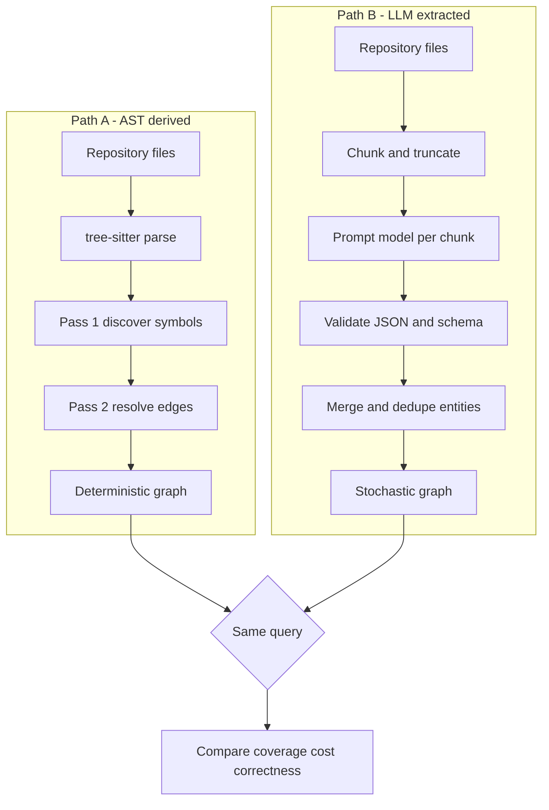
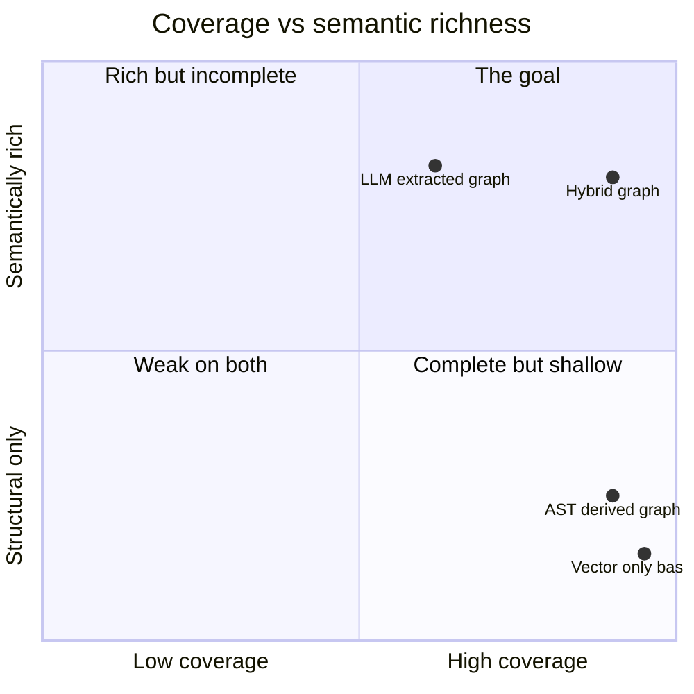
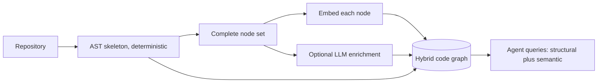

# Repo to Graph: AST-Derived vs LLM-Extracted Knowledge Graphs

Point two indexing tools at the same repository. Tool A is a tree-sitter parser that walks every source file, extracts symbols and their relationships, and writes a graph. It finishes in about eight seconds. Tool B is an LLM-extraction pipeline: it reads code in batches, prompts a model to emit entities and typed relationships, and assembles those triples into a knowledge graph. It takes forty minutes and costs roughly twenty times as much.

Then you ask both graphs the same question. Something an agent asks constantly: *which controllers eventually reach the `OrderService`, and through which interfaces?* The fast, boring, deterministic graph answers it correctly. The slow, expensive, "smarter" graph gets it mostly right, but it also quietly forgot about a few hundred files during indexing, so some of the wiring it needs to answer simply is not there.

This is not a hypothetical. It is the central result of a January 2026 paper we will spend a good part of this post dissecting. And it upends the intuition that most teams walk in with: that if you want a *semantic* understanding of a codebase, you should hand the code to a language model and let it build the graph. Sometimes you should. But for the structural backbone that agents actually traverse, an abstract syntax tree beats a language model on coverage, on cost, on latency, and on reliability, all at once.

In [part 1 of this series](https://juanlara18.github.io/portfolio/#/blog/agent-graph-layer-why-grep-embeddings-fell-short) we argued that agents outgrew grep-plus-embeddings, and that the missing substrate is a graph layer: an explicit, typed representation of how the pieces of a system connect. That post was the *why*. This post is the *how*: how a pile of source files becomes a queryable graph, the two fundamentally different ways to build it, and the trade-off that decides which one you reach for. It is the technical heart of the series. In [part 3](https://juanlara18.github.io/portfolio/#/blog/agent-graph-layer-why-grep-embeddings-fell-short) we will pick the graph up and query it; here we build it.

## What a Graph of a Codebase Even Means

Before we can compare two ways to build something, we need to agree on what we are building. "A graph of a codebase" sounds obvious until you try to write down the schema, at which point you realize there are a dozen defensible choices and most tutorials never make them explicit.

A code graph is a set of **nodes** representing the entities in your source, and **typed edges** representing the relationships between them. That is it. The art is in choosing which entities and which relationships matter for the questions you intend to ask.

The entities almost always include, in increasing granularity:

- **Modules / packages** — the top-level namespaces. `com.shopizer.order`, `src/payments`, a Python package.
- **Files** — the physical unit of storage, and often the unit of retrieval and re-indexing.
- **Types** — classes, interfaces, enums, records, structs, traits. The nouns of your domain as the compiler sees them.
- **Members** — methods, functions, fields, constants. The verbs and the state.

The edges are where the graph earns its keep. The structural ones a compiler or linter already knows about:

- **defines** — a file defines a class; a class defines a method. Containment.
- **imports** — file A imports module B. The dependency skeleton.
- **calls** — function `f` invokes function `g`. The dynamic wiring, captured statically.
- **inherits / extends / implements** — a class extends a base class or implements an interface. The type hierarchy.
- **references** — a symbol is read or written somewhere it is not defined. The catch-all for use.
- **injects** — a dependency-injection edge: this class receives that collaborator through its constructor or a field. In enterprise Java and Spring-style codebases this is *the* edge that reveals how the application is actually wired, and a plain call graph misses it because the wiring happens in a framework, not in an explicit `new`.

Here is a minimal schema for a code graph, expressed as an entity-relationship diagram. This is roughly the shape most AST-derived tools converge on:

```mermaid
erDiagram
    MODULE ||--o{ FILE : contains
    FILE ||--o{ CLASS : defines
    FILE ||--o{ INTERFACE : defines
    CLASS ||--o{ METHOD : defines
    CLASS ||--o{ FIELD : declares
    CLASS ||--o{ CLASS : extends
    CLASS ||--o{ INTERFACE : implements
    CLASS ||--o{ CLASS : injects
    METHOD ||--o{ METHOD : calls
    FILE ||--o{ FILE : imports
    METHOD ||--o{ FIELD : references
```

Notice what this schema is *not*. There is no node for "the payment subsystem" or "the retry policy" or "the anti-corruption layer between billing and shipping." Those are architectural and domain concepts. They are real, they matter enormously to a human reasoning about the system, and they appear nowhere in the abstract syntax tree because they are not syntax. Hold onto that gap. It is the entire reason LLM-extracted graphs exist, and the entire reason they are harder than they look.

A quick note on why this shape suits agents specifically. When [part 1](https://juanlara18.github.io/portfolio/#/blog/agent-graph-layer-why-grep-embeddings-fell-short) talked about multi-hop questions, this schema is what makes them answerable in one traversal instead of a dozen tool calls. "What breaks if I change this method's signature?" is a `references` and `calls` walk backward from a node. "Is this service reachable from any HTTP handler?" is a path query over `injects` and `calls`. Vector search cannot answer either, because the answer is a *path*, not a *passage*. This is the same argument the [knowledge-graphs-in-practice post](https://juanlara18.github.io/portfolio/#/blog/knowledge-graphs-practice) makes for documents, applied to code: the semantic layer is what turns a database of things into a map of relationships.

## Path A: AST-Derived Graphs

The first way to build the graph is to parse the code the way a compiler would and read the structure directly out of the syntax tree. No model, no probabilities, no prompt. Just a grammar and a tree walk.

### Tree-sitter, briefly

The workhorse here is [tree-sitter](https://tree-sitter.github.io/tree-sitter/), an incremental parsing library that has quietly become the standard substrate for code tooling. It is a parser *generator*: you write a grammar for a language and tree-sitter produces a fast parser (in C or WebAssembly) that turns source text into a **concrete syntax tree** — a full-fidelity tree that keeps every token and every byte offset, unlike a compiler's abstract syntax tree which throws away detail it does not need.

Three properties make it ideal for building code graphs at scale:

- **It is multi-language through one interface.** There are maintained grammars for Java, Python, JavaScript, TypeScript, Go, Rust, C, C++, Ruby, and dozens more. You learn one API and get every language your monorepo happens to contain. Under the hood it uses a GLR-based algorithm (LR parsing extended to handle ambiguity), which is why it copes with the messy, sometimes-ambiguous grammars real languages have.
- **It is error-tolerant.** It parses code that does not compile, half-written functions, files with syntax errors. That matters more than it sounds: an agent editing code needs a graph that survives the intermediate broken states.
- **It has an S-expression query language.** Rather than hand-writing tree-walk code for every construct, you write declarative patterns — "find me every `class_declaration` and capture its name" — and tree-sitter matches them against the tree. This is what makes extraction terse and maintainable.

Max Brunsfeld's [original Strange Loop talk](https://www.youtube.com/watch?v=Jes3bD6P0To) is still the best fifteen-minute intuition for why the incremental, GLR design matters. For our purposes the key fact is simply: parsing is *fast* and *exact*. There is no sampling temperature on a syntax tree.

### Building a symbol and call graph

Let us build one. The following is a compact but production-shaped extractor: it walks a repository, parses each file with tree-sitter, and emits a typed graph of files, classes, methods, and the edges between them. I will use Python with the `tree-sitter` and `tree-sitter-languages` bindings, and I will keep it to the Python language for the example so it is self-contained, but the exact same structure works for Java or Go by swapping the grammar and the queries.

```python
"""
ast_graph.py — deterministic code-graph extraction with tree-sitter.

Two passes:
  1. Discover every definition (class, function) and build a symbol table
     mapping fully-qualified names to graph nodes.
  2. Walk each file again, resolve references/calls against the symbol
     table, and emit typed edges.

The two-pass design matters: you cannot resolve a call to `foo()` on the
first pass because `foo` may be defined in a file you have not read yet.
"""

from __future__ import annotations

import hashlib
from dataclasses import dataclass, field
from pathlib import Path

from tree_sitter_languages import get_parser

PARSER = get_parser("python")


# --- Graph data model ----------------------------------------------------

@dataclass(frozen=True)
class Node:
    id: str            # stable, content-addressed identifier
    kind: str          # "file" | "class" | "function"
    name: str          # short name
    qualified: str     # module.Class.method
    path: str          # source file
    start_line: int
    end_line: int


@dataclass
class Edge:
    src: str           # Node.id
    dst: str           # Node.id
    kind: str          # "defines" | "calls" | "inherits" | "imports"


@dataclass
class CodeGraph:
    nodes: dict[str, Node] = field(default_factory=dict)
    edges: list[Edge] = field(default_factory=list)

    def add_node(self, node: Node) -> str:
        self.nodes[node.id] = node
        return node.id

    def add_edge(self, src: str, dst: str, kind: str) -> None:
        # Skip dangling edges: an edge to a symbol we never resolved is
        # worse than no edge, because it lies about coverage.
        if src in self.nodes and dst in self.nodes:
            self.edges.append(Edge(src, dst, kind))


def _node_id(path: str, qualified: str, kind: str) -> str:
    raw = f"{kind}:{path}:{qualified}"
    return hashlib.sha1(raw.encode()).hexdigest()[:16]


# --- Tree-sitter queries -------------------------------------------------
# S-expression patterns. Each capture (@name) is pulled out by the matcher.

DEFINITION_QUERY = """
(class_definition
    name: (identifier) @class.name) @class.def

(function_definition
    name: (identifier) @func.name) @func.def
"""

CALL_QUERY = """
(call
    function: [
        (identifier) @callee
        (attribute attribute: (identifier) @callee)
    ]) @call
"""

IMPORT_QUERY = """
(import_from_statement
    module_name: (dotted_name) @module)

(import_statement
    name: (dotted_name) @module)
"""


def _module_name(root: Path, file: Path) -> str:
    rel = file.relative_to(root).with_suffix("")
    return ".".join(rel.parts)
```

That is the data model and the declarative queries. Now the two-pass driver:

```python
class Extractor:
    def __init__(self, root: Path):
        self.root = root
        self.graph = CodeGraph()
        # qualified name -> node id, our resolver for pass two
        self.symbols: dict[str, str] = {}
        self.py_lang = PARSER.language

    def _query(self, pattern: str, root_node):
        q = self.py_lang.query(pattern)
        return q.captures(root_node)

    # --- Pass 1: discover definitions ------------------------------------
    def discover(self, file: Path) -> None:
        module = _module_name(self.root, file)
        source = file.read_bytes()
        tree = PARSER.parse(source)

        file_id = self.graph.add_node(Node(
            id=_node_id(str(file), module, "file"),
            kind="file", name=file.name, qualified=module,
            path=str(file), start_line=0,
            end_line=source.count(b"\n"),
        ))

        for node, cap in self._query(DEFINITION_QUERY, tree.root_node):
            if cap not in ("class.def", "func.def"):
                continue
            name_node = node.child_by_field_name("name")
            if name_node is None:
                continue
            name = source[name_node.start_byte:name_node.end_byte].decode()
            kind = "class" if cap == "class.def" else "function"
            qualified = f"{module}.{name}"

            nid = self.graph.add_node(Node(
                id=_node_id(str(file), qualified, kind),
                kind=kind, name=name, qualified=qualified,
                path=str(file),
                start_line=node.start_point[0] + 1,
                end_line=node.end_point[0] + 1,
            ))
            self.graph.add_edge(file_id, nid, "defines")
            # Register in the symbol table for cross-file resolution.
            self.symbols[qualified] = nid
            self.symbols.setdefault(name, nid)  # unqualified fallback

    # --- Pass 2: resolve calls, imports, inheritance ---------------------
    def resolve(self, file: Path) -> None:
        module = _module_name(self.root, file)
        source = file.read_bytes()
        tree = PARSER.parse(source)
        file_id = _node_id(str(file), module, "file")

        # Imports: file -> file edges via module name.
        for node, cap in self._query(IMPORT_QUERY, tree.root_node):
            if cap != "module":
                continue
            target = source[node.start_byte:node.end_byte].decode()
            if target in self.symbols:
                self.graph.add_edge(file_id, self.symbols[target], "imports")

        # Calls: attribute them to the enclosing function node.
        for node, cap in self._query(CALL_QUERY, tree.root_node):
            if cap != "callee":
                continue
            callee = source[node.start_byte:node.end_byte].decode()
            enclosing = self._enclosing_def(node, source, module)
            target = self.symbols.get(callee)
            if enclosing and target:
                self.graph.add_edge(enclosing, target, "calls")

    def _enclosing_def(self, node, source: bytes, module: str) -> str | None:
        cur = node.parent
        while cur is not None:
            if cur.type == "function_definition":
                name_node = cur.child_by_field_name("name")
                name = source[name_node.start_byte:name_node.end_byte].decode()
                return self.symbols.get(f"{module}.{name}")
            cur = cur.parent
        return None

    def run(self) -> CodeGraph:
        files = list(self.root.rglob("*.py"))
        for f in files:                 # pass 1: every file, no exceptions
            self.discover(f)
        for f in files:                 # pass 2: now the table is complete
            self.resolve(f)
        return self.graph


if __name__ == "__main__":
    import sys
    g = Extractor(Path(sys.argv[1])).run()
    print(f"{len(g.nodes)} nodes, {len(g.edges)} edges")
```

A few things worth calling out, because they are the difference between a toy and something you would actually ship.

**The two-pass structure is not optional.** You cannot resolve `OrderService.save()` while reading the file that *calls* it, because the file that *defines* it may not have been parsed yet. Pass one builds the complete symbol table; pass two resolves against it. This is exactly the "two-pass extraction" the paper we are about to discuss describes: first discover all type declarations and build a file-to-symbol map, then traverse again to link the edges.

**Dangling edges are suppressed on purpose.** `add_edge` refuses to create an edge to a node it never saw. An edge that points into the void is worse than a missing edge, because it inflates your apparent coverage while quietly lying. Determinism means you know exactly what you have and exactly what you do not.

**Every node has a stable, content-addressed id.** That id is what makes *incremental* re-indexing possible, which we will return to when we discuss the hybrid. Change one file, re-run the two passes on that file's neighborhood, and only the affected nodes and edges churn.

**Resolution here is deliberately naive.** Real extractors handle scoping, method overloads, aliased imports, and type inference to disambiguate `save()` on two different classes. That precision work is real, but notice its character: it is *engineering*, bounded and testable. There is no failure mode where the extractor decides, on this run, to just skip a few hundred files because it felt like it. Which brings us to Path B.

The whole run for a mid-sized repository is I/O-bound and finishes in single-digit seconds. There is no per-token cost, no rate limit, no context window. That is not a minor operational convenience. As we will see, it is the property that decides the comparison.

## Path B: LLM-Extracted Graphs

The second way to build the graph is to ask a language model to read the code and tell you what is in it. Instead of a grammar, you write a prompt. Instead of tree-walk code, you define a schema and validate the model's output against it. This is the approach that [Microsoft's GraphRAG](https://microsoft.github.io/graphrag/) popularized for documents, and it is the approach a lot of teams instinctively reach for when they hear "knowledge graph of my codebase."

### The triple-extraction pipeline

The canonical LLM-extraction pipeline, whether from GraphRAG or a homegrown variant, looks like this:

1. **Chunk** the corpus into units that fit comfortably in context, often with a large chunk size so each unit carries enough surrounding context to name relationships. For code, the natural unit is a file, or a file truncated to some character budget.
2. **Extract** entities and relationships from each chunk. The LLM is prompted to emit structured output: a list of entities with types and descriptions, and a list of subject-predicate-object triples describing how they relate. "`StripeGateway` — implements → `PaymentGateway`." "`OrderController` — depends on → `OrderService`."
3. **Summarize / merge.** The same entity appears in many chunks with slightly different descriptions; the pipeline merges those into a single canonical node. GraphRAG then goes further, detecting communities of related entities and generating natural-language summaries per community.
4. **Assemble** the deduplicated entities and relationships into the final graph.

The appeal is obvious and genuine. The model can produce edges the AST *cannot*: it can label `StripeGateway` as "the concrete payment provider," notice that a cluster of classes together form "the checkout flow," and write a paragraph summarizing what the payments package does. Those are the domain and architectural concepts we flagged as absent from the syntax tree. When your question is "give me a high-level tour of how billing works," an LLM-built graph with community summaries genuinely shines. The [ontology-grounded RAG post](https://juanlara18.github.io/portfolio/#/blog/ontology-grounded-rag-chunks-in-nodes) makes the broader case for why putting chunks *in* nodes, with semantic structure around them, beats a flat vector index.

### A sketch, and where it drifts

Here is a compact extraction step, with the validation that any serious version needs bolted on:

```python
"""
llm_extract.py — LLM triple extraction for code, with schema validation.

The prompt is the easy part. The validation and the accounting of what
the model DID NOT return are the parts that decide whether you can trust
the resulting graph.
"""

import json
from dataclasses import dataclass

from pydantic import BaseModel, ValidationError

MAX_CHARS = 15_000   # per-file truncation to fit the context budget

ALLOWED_RELATIONS = {"implements", "extends", "injects", "calls", "imports"}


class Entity(BaseModel):
    name: str
    type: str          # class | interface | service | ...
    description: str


class Relation(BaseModel):
    source: str
    relation: str
    target: str


class Extraction(BaseModel):
    entities: list[Entity]
    relations: list[Relation]


EXTRACTION_PROMPT = """You are analyzing a single source file from a Java
codebase. Identify the project-local types it declares and the typed
relationships to other project-local types.

Return ONLY valid JSON matching this schema:
{{"entities": [{{"name": "...", "type": "...", "description": "..."}}],
  "relations": [{{"source": "...", "relation": "...", "target": "..."}}]}}

Allowed relation values: implements, extends, injects, calls, imports.
Use ONLY names that appear in the file. Do not invent types.

FILE: {path}
---
{code}
"""


@dataclass
class ExtractionResult:
    path: str
    extraction: Extraction | None
    status: str        # "ok" | "invalid_json" | "schema_fail" | "empty"


def extract_file(client, path: str, code: str) -> ExtractionResult:
    prompt = EXTRACTION_PROMPT.format(path=path, code=code[:MAX_CHARS])
    raw = client.complete(prompt)          # your LLM call

    # Failure mode 1: the model returned prose, not JSON.
    try:
        payload = json.loads(raw)
    except json.JSONDecodeError:
        return ExtractionResult(path, None, "invalid_json")

    # Failure mode 2: JSON, but not the shape we asked for.
    try:
        parsed = Extraction(**payload)
    except ValidationError:
        return ExtractionResult(path, None, "schema_fail")

    # Failure mode 3: valid but empty — the file was "skipped" in effect.
    if not parsed.entities:
        return ExtractionResult(path, parsed, "empty")

    # Drop relations with out-of-vocabulary predicates, silently emitted.
    parsed.relations = [
        r for r in parsed.relations if r.relation in ALLOWED_RELATIONS
    ]
    return ExtractionResult(path, parsed, "ok")


def extract_repo(client, files: dict[str, str]) -> dict:
    results = [extract_file(client, p, c) for p, c in files.items()]
    ok = [r for r in results if r.status == "ok"]
    skipped = [r for r in results if r.status != "ok"]

    # THIS accounting is the whole point. If you do not track it, you will
    # never notice that a third of the repo silently vanished.
    print(f"analyzed: {len(ok)}  skipped/failed: {len(skipped)}")
    for r in skipped:
        print(f"  SKIPPED [{r.status}] {r.path}")

    return {"analyzed": ok, "skipped": skipped}
```

Look at what dominates that code. It is not the prompt. It is the *bookkeeping of failure*. Three named failure modes before you even get a usable extraction, plus a filter for relations the model invented outside your vocabulary. And every one of these is a real, observed behavior of extraction pipelines at scale, not defensive paranoia.

The failure modes compound in a way that AST extraction structurally cannot:

- **Truncation loss.** Files longer than the character budget get cut. Relationships defined in the tail of a long file are simply not seen.
- **Schema-compliance failures.** The model returns something that is not the JSON you asked for, or returns entities under keys you did not define. On a large run, some fraction of calls always drifts.
- **Silent skipping.** In a batched, tool-mediated pipeline, files from an input batch sometimes never appear in the model's output at all. No error is raised. The file is just gone, and unless you diff the input set against the output set — the accounting in `extract_repo` — you will not know.
- **Stochasticity.** Run it twice and you get two different graphs. Same repo, same prompt, different temperature draw, different edges. Determinism is gone, and with it your ability to reason about what changed between two indexing runs.

None of this makes LLM extraction useless. It makes it *unreliable for the structural backbone*, while remaining valuable for the semantic layer on top. Keep that split in mind; it is where we are headed.

Here are the two pipelines side by side:



## The Head-to-Head

Now the evidence. In January 2026, Manideep Reddy Chinthareddy published [*Reliable Graph-RAG for Codebases: AST-Derived Graphs vs LLM-Extracted Knowledge Graphs*](https://arxiv.org/abs/2601.08773) (arXiv 2601.08773), a 46-page study that does exactly the experiment this post is built around. It is the most direct measurement I know of on this question, so it is worth taking seriously and quoting precisely.

The study benchmarks three retrieval pipelines on real Java codebases:

- **No-Graph** — a vector-only baseline. Embed chunks, retrieve by similarity, no graph at all.
- **DKB** — a *deterministic knowledge base*: an AST-derived graph built with tree-sitter and traversed bidirectionally. This is Path A.
- **LLM-KB** — an *LLM-generated knowledge graph*: a model reads code in batches and emits entities and relationships. This is Path B.

The primary subject is **Shopizer**, a Java e-commerce platform with **1,210 Java files**, with secondary validation on **ThingsBoard** and **OpenMRS Core**. Each repository gets **15 architecture and code-tracing queries** — the multi-hop kind, "which controller reaches which repository through which service," not "find me a function named X." Forty-five queries in total across the three repos.

The DKB schema is close to what we built above, tuned for enterprise Java: nodes are classes, interfaces, enums, records, and annotation types; the labeled edges are `injects` (dependency injection from field declarations and constructor parameters), `extends`, and `implements`. Extraction is the two-pass design — discover all type declarations and build a file-to-class map, then traverse to link edges. Retrieval expands bidirectionally: **successors** (what a class depends on), **predecessors** (what depends on it), and a clever **interface-consumer expansion** — if a retrieved class implements an interface, also pull in everything that consumes that interface, so you can trace across the interface boundary that dependency injection hides.

### Coverage

The first result is the one that should reframe your intuition. LLM extraction *does not cover the repository*. On Shopizer:

| Pipeline | Files analyzed | Chunks | Chunk coverage | Graph nodes | Graph edges |
|----------|---------------|--------|----------------|-------------|-------------|
| No-Graph | 1,210 | 5,403 | 1.000 (baseline) | — | — |
| DKB (AST) | 1,210 | 4,873 | 0.902 | 1,158 | 1,503 |
| LLM-KB | 833 | 3,465 | 0.641 | 842 | 2,552 |

The LLM pipeline **skipped or missed 377 of the 1,210 files** — a per-file success rate of 0.688. More than a quarter of the codebase never made it into the graph. Not because those files were unparseable; the deterministic parser handled them fine. They were dropped by the stochastic, batched, tool-mediated extraction process: truncation, schema failures, silent omission. The AST graph, by contrast, held near-baseline coverage.

Notice the edge counts tell a subtler story. LLM-KB has *more* edges (2,552) over *fewer* nodes (842) than DKB (1,503 edges over 1,158 nodes). The LLM is happy to assert relationships — including semantic ones the AST would never emit — but it is asserting them over a graph that is missing a third of its foundation. Density over an incomplete substrate is not coverage.

### Cost and latency

The second result is operational, and stark.

| Pipeline | Indexing time (Shopizer) | Graph build | End-to-end cost | Cost multiplier |
|----------|--------------------------|-------------|-----------------|-----------------|
| No-Graph | 18.41 s | — | $0.04 | 1x baseline |
| DKB (AST) | 22.09 s | 2.81 s | $0.09 | ~2.25x |
| LLM-KB | 215.09 s | 200.14 s | $0.79 | ~19.75x |

The AST graph adds under three seconds of build time on top of the embedding step, and costs roughly twice the vector-only baseline. The LLM graph takes over 200 seconds just to build the graph — nearly ten times the *entire* DKB pipeline — and costs almost twenty times the baseline. On the larger combined ThingsBoard-plus-OpenMRS workload the LLM multiplier blows out further, to roughly **45x**, because cost scales with the amount of code the model has to read while the AST parser's cost barely moves. That scaling curve is the whole ballgame for a monorepo.

### Correctness

Here is the twist that makes the coverage and cost numbers land. You might expect the expensive, semantic LLM graph to at least *win on answer quality*, justifying its cost. It does not.

On Shopizer's 15-question suite: **DKB answered 15 of 15 correctly. LLM-KB got 13 of 15** (two partial). **No-Graph got 6 of 15**, with the highest hallucination risk on architectural queries. Across all 45 questions on all three repositories:

| Pipeline | Correct | Partial | Incorrect |
|----------|---------|---------|-----------|
| DKB (AST) | 43 | 2 | 0 |
| LLM-KB | 38 | 5 | 2 |
| No-Graph | 31 | 9 | 5 |

The deterministic graph did not just tie on correctness; it *led* on it, with zero outright wrong answers, while costing a fraction of the LLM approach and covering more of the repo. The paper's own summary is worth quoting: "Deterministic AST-derived graphs provide more reliable coverage and multi-hop grounding than LLM-extracted graphs at substantially lower indexing cost."

And notice the vector-only baseline. Six of fifteen on Shopizer, thirty-one of forty-five overall, highest hallucination risk. This is the empirical version of the argument [part 1](https://juanlara18.github.io/portfolio/#/blog/agent-graph-layer-why-grep-embeddings-fell-short) made from first principles: for architectural, multi-hop questions, embeddings-only retrieval is not a graph and cannot substitute for one. It retrieves passages that *sound* related and lets the model guess at the wiring, which is precisely when it hallucinates.

A single study on three Java repos is not the last word, and the paper is honest about its scope: enterprise Java, a specific query suite, one extraction configuration. But the *direction* of every result is consistent, mutually reinforcing, and mechanistically explicable. The AST wins on coverage because parsing does not skip files. It wins on cost because parsing does not pay per token. It wins on determinism because parsing has no temperature. Those are not tuning artifacts. They are properties of the method.

## Where Each One Breaks

If the AST wins on all four axes, why does anyone build LLM graphs at all? Because the four axes the study measured are not the only thing you can want from a code graph, and each approach breaks in a place the other does not reach.

**Where the AST graph breaks: intent and domain concepts.** The syntax tree knows that `StripeGateway implements PaymentGateway`. It does not know that this is *the payment provider abstraction*, that swapping it is *the extension point for adding a new processor*, or that the three classes `Cart`, `Checkout`, and `OrderConfirmation` together constitute *the purchase funnel*. These are not in the syntax. They live in names, comments, documentation, commit history, and the heads of the people who wrote it. An AST graph can tell you *what calls what*; it is structurally blind to *what it is for*. Ask "where is the retry logic for failed payments" and a pure structural graph can only offer you the call neighborhood of anything named `retry` — it cannot recognize a retry *pattern* implemented without that word.

**Where the LLM graph breaks: coverage and determinism.** We have seen it quantified. It cannot guarantee it read every file, cannot guarantee two runs agree, cannot guarantee its output matches your schema, and its cost scales with your codebase in a way that becomes prohibitive on the repos big enough to *need* a graph. For the structural backbone that agents traverse thousands of times — "trace this call chain," "find all implementers" — non-determinism and gaps are disqualifying. An agent that gets a different graph on Tuesday than it got on Monday cannot build reliable behavior on top of it.

Plot the two on the axes that actually matter and the complementarity is obvious. Neither corner is empty; they are strong in *different* corners.



The top-right quadrant — high coverage *and* semantic richness — is empty for both single approaches. That empty corner is the design target. You do not get there by picking a side. You get there by layering them.

## The Hybrid That Actually Ships

The practical synthesis is not "AST versus LLM." It is **AST for the skeleton, embeddings and selective LLM enrichment for the flesh.** The deterministic graph is the load-bearing structure, guaranteed complete and reproducible; the semantic layer is draped over it, adding meaning without being trusted for coverage. This is the same layered instinct the [knowledge-graphs-in-practice post](https://juanlara18.github.io/portfolio/#/blog/knowledge-graphs-practice) describes for documents — a structural graph with a semantic layer on top — specialized to code.

Concretely, three layers:

1. **The deterministic AST skeleton.** Every file, every symbol, every structural edge (`defines`, `imports`, `calls`, `extends`, `implements`, `injects`). Built by Path A, in seconds, reproducibly. This is the ground truth an agent traverses. Coverage is guaranteed because parsing does not skip.

2. **Embeddings on the nodes.** For each function and class node, embed its source (and docstring) and store the vector *on the node*. Now you have both: structural traversal *and* semantic similarity, over the same complete set of entities. "Find functions similar to this one" becomes a vector query; "and then show me everything they call" becomes a graph walk from the results. This is chunks-in-nodes, the pattern from the [ontology-grounded RAG post](https://juanlara18.github.io/portfolio/#/blog/ontology-grounded-rag-chunks-in-nodes), applied to code: the vector index and the graph share identity instead of living in separate systems.

3. **Optional, targeted LLM semantic edges.** *Now* you bring in the language model — not to discover the graph, but to annotate it. Ask it to label communities ("these eight classes are the checkout flow"), to add `describes` or `belongs-to-subsystem` edges, to write summaries. Crucially, it operates over the *complete* AST node set, so even if it skips some or drifts, you lose *enrichment*, not *structure*. The backbone is still there. The LLM is a decorator, never a foundation.



This ordering matters more than it looks. If you build the LLM graph *first* and try to backfill structure, you inherit the LLM's gaps — you are enriching a foundation with holes in it. If you build the AST skeleton first and enrich *second*, the enrichment sits on solid ground and its failures are graceful. Same two techniques, opposite reliability, purely because of which one is load-bearing.

### Incremental re-indexing

The hybrid's real payoff shows up when code changes, which for an agent is constantly. This is where the AST's determinism pays a compounding dividend.

Because every node has a stable, content-addressed id (recall the `_node_id` hash in the extractor), you can re-index at the granularity of a file. When a file changes:

1. Recompute its content hash. If unchanged, do nothing — most files in any given edit are untouched.
2. If changed, drop the nodes and edges *owned by that file* (its definitions and its outgoing edges).
3. Re-run the two passes on that file, plus a resolution pass over its immediate graph neighbors, because a changed signature can invalidate edges pointing *in*.
4. Re-embed only the changed nodes. Re-run LLM enrichment only on the affected community, if at all.

The blast radius of a one-file change is one file plus its neighbors — milliseconds, cents. Contrast the LLM-only approach: a stochastic pipeline gives you no stable node identity to diff against, so "incremental" degrades toward "re-extract and hope the graph does not shift underneath you." Determinism is not just a correctness property; it is what makes cheap freshness possible. An agent working in a live repo needs the graph to track the code edit-by-edit, and only the deterministic backbone can do that affordably.

Tooling in this shape already exists in the wild. [Sourcegraph's SCIP](https://scip-code.org/) is a deterministic, cross-language code-intelligence index (the format behind go-to-definition and find-references) emitted by a growing set of language indexers; several open code-graph projects pair tree-sitter AST extraction with embeddings and optional LLM concept extraction. You do not have to build all three layers from scratch — but you do have to know which layer is load-bearing, and keep the LLM off of it.

## Choosing for Your Repo

Strip away the nuance and here is the decision, in order of what actually constrains you.

**Start from your language support.** If your repo is in languages with solid tree-sitter grammars — Java, Python, Go, TypeScript, C#, Rust, and most mainstream languages qualify — the AST skeleton is available to you cheaply, and it should be your foundation. If you are in something exotic with no maintained grammar, LLM extraction may be your *only* structural option, and you accept its costs knowingly.

**Then your repo size and freshness needs.** The larger the codebase and the more often it changes, the more decisively the AST wins. LLM cost scales with code volume; AST cost barely does. A small, static docs-plus-code corpus you index once can tolerate an LLM pipeline. A million-line monorepo an agent edits all day cannot — the ~45x cost multiplier on larger workloads is not a rounding error, and the re-indexing story is the difference between a graph that tracks reality and one that lags it.

**Then your budget and latency.** Roughly 2x baseline versus roughly 20x is a real line item, and 3 seconds versus 200 seconds of build time is the difference between re-indexing on every save and re-indexing overnight.

**Then, and only then, your semantic ambition.** If you need architectural summaries, domain-concept grouping, "explain this subsystem" answers — add the LLM layer *on top of* the AST skeleton. Do not use it *instead of* the skeleton.

The one anti-pattern to avoid is the one most teams start with: reaching for LLM extraction *first* because it sounds smarter, discovering months later that it skips files, drifts between runs, and costs a fortune to keep fresh, and then bolting structure on underneath a foundation full of holes. Build the boring deterministic skeleton first. Earn the semantics second.

That skeleton is only half the story, of course. A graph you cannot query well is just an expensive data structure. In [part 3](https://juanlara18.github.io/portfolio/#/blog/agent-graph-layer-why-grep-embeddings-fell-short) we pick this graph up and interrogate it: the traversal patterns agents actually use, why bidirectional expansion and interface-consumer walks matter, how you expose graph queries to an agent through something like the [Model Context Protocol](https://juanlara18.github.io/portfolio/#/blog/model-context-protocol), and how to keep a language model from turning a clean graph query into a hallucinated answer. The backbone is built. Now we make it talk.

## Going Deeper

**Books:**
- Aho, A. V., Lam, M. S., Sethi, R., & Ullman, J. D. (2006). *Compilers: Principles, Techniques, and Tools* (2nd ed.). Pearson.
  - The "dragon book." Chapters on lexical and syntax analysis explain what a parser is actually doing when it turns text into a tree — the foundation under tree-sitter and every AST extractor.
- Robinson, I., Webber, J., & Eifrem, E. (2015). *Graph Databases* (2nd ed.). O'Reilly.
  - The clearest treatment of the property-graph model, traversals, and when relationship-first storage beats tables — the data-model reasoning behind every code graph.
- Nilsson, N. J. (1998). *Artificial Intelligence: A New Synthesis.* Morgan Kaufmann.
  - Old but excellent on graph search and traversal as a reasoning primitive, which is exactly what an agent does over a code graph.
- Kleppmann, M. (2017). *Designing Data-Intensive Applications.* O'Reilly.
  - The graph-data-models chapter and the material on derived data and incremental maintenance map directly onto the incremental re-indexing problem.

**Online Resources:**
- [Tree-sitter documentation](https://tree-sitter.github.io/tree-sitter/) — The official guide, including the S-expression query syntax used in the extractor above.
- [Microsoft GraphRAG methods](https://microsoft.github.io/graphrag/index/methods/) — The canonical description of the LLM entity-and-relationship extraction pipeline, straight from the source.
- [SCIP Code Intelligence Protocol](https://scip-code.org/) — Sourcegraph's deterministic, cross-language code-index format; a production example of AST-derived code intelligence at scale.
- [FalkorDB CodeGraph write-up](https://www.falkordb.com/blog/code-graph/) — A concrete walkthrough of mapping a Git repo into a queryable knowledge graph with tree-sitter and a graph database.

**Videos:**
- ["Tree-sitter: a new parsing system for programming tools"](https://www.youtube.com/watch?v=Jes3bD6P0To) by Max Brunsfeld (Strange Loop) — The creator explains the incremental, GLR-based design and why it suits code tooling.
- [Galois Tech Talk: "Tree-Sitter: A New Parsing System for Programming Tools"](https://www.youtube.com/watch?v=RUYPd7SjI-Y) by Max Brunsfeld — A longer, more technical treatment of the parsing algorithm and query system.

**Academic Papers:**
- Chinthareddy, M. R. (2026). ["Reliable Graph-RAG for Codebases: AST-Derived Graphs vs LLM-Extracted Knowledge Graphs."](https://arxiv.org/abs/2601.08773) *arXiv:2601.08773.*
  - The anchor of this post. Benchmarks vector-only, AST-derived, and LLM-extracted graphs on Java repos; finds AST graphs give more reliable coverage and multi-hop grounding at a fraction of the indexing cost.
- Edge, D., et al. (2024). ["From Local to Global: A Graph RAG Approach to Query-Focused Summarization."](https://arxiv.org/abs/2404.16130) *arXiv:2404.16130.*
  - The Microsoft GraphRAG paper. The definitive description of the LLM-driven entity/relationship extraction and community-summarization pipeline that Path B is built on.
- [Graph Retrieval-Augmented Generation: A Survey](https://arxiv.org/abs/2408.08921) (2024). *arXiv:2408.08921.*
  - A broad map of the GraphRAG landscape, useful for situating code graphs within the larger graph-plus-retrieval field.

**Questions to Explore:**
- The paper measured enterprise Java, where dependency injection makes `injects` edges decisive. How does the AST-versus-LLM trade-off shift for dynamically typed languages like Python or Ruby, where structural resolution is genuinely harder and more of the "graph" lives in runtime behavior?
- If an LLM graph reliably skips a fraction of files, could you use the deterministic AST coverage as an *oracle* — diffing the LLM's node set against the AST's to automatically detect and re-extract exactly what the model dropped?
- Where is the true boundary between "structural" and "semantic"? Is a dependency-injection edge structural because a parser can find it, or semantic because it encodes an architectural intent — and does that boundary move as parsers get smarter?
- An agent that edits code changes the graph it reasons over. How should a hybrid graph represent *uncommitted, in-flight* edits — and should structural and semantic layers refresh at the same cadence, or should the cheap deterministic layer track every keystroke while the expensive semantic layer lags behind?
- If graph-grounded retrieval so reliably beats vector-only on architectural questions, what class of question is *left* where embeddings alone still win — and does that class shrink to nothing as code graphs mature, or is there a permanent niche for pure similarity search?
