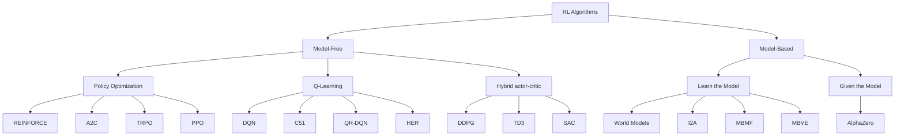
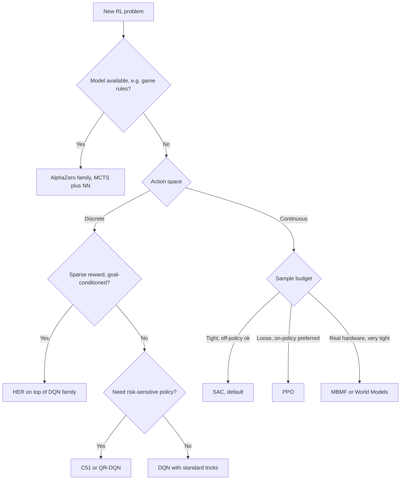
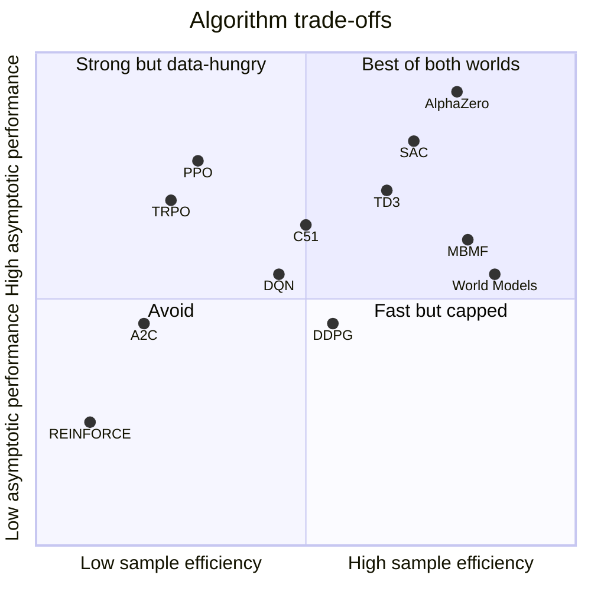
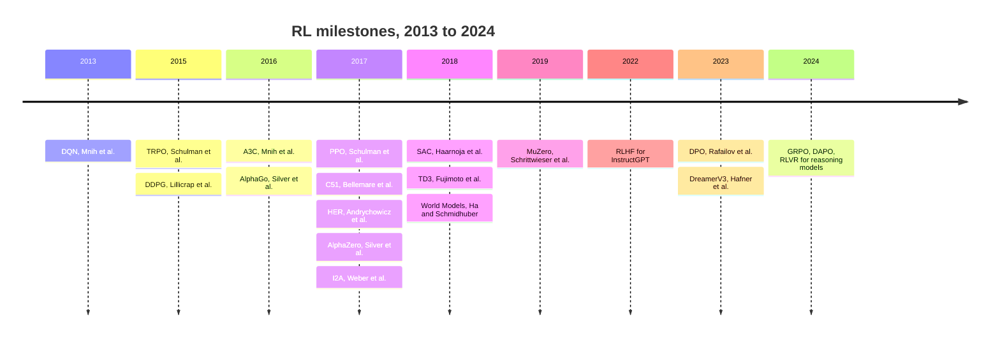

# The RL Algorithm Tree: A Practitioner's Tour from Policy Gradients to AlphaZero

## Why This Post Exists

In Part II of the cert review, reinforcement learning got one paragraph. One paragraph for the entire field that gave us Atari-from-pixels, AlphaGo, dexterous robotic manipulation, and the alignment layer behind every modern chat model. That is not a complaint — Part II was correctly proportioned for a cert blueprint where RL is two questions out of forty. But it leaves a reader who actually wants to *do* RL with no map.

This post is the map.

The blueprint version of RL goes "there's Q-learning, there's policy gradients, there's PPO, here is the bullet point about Markov Decision Processes." The actual tree the field uses — the one OpenAI's *Spinning Up* documents and that every RL practitioner internalizes — has four major branches, roughly fifteen named algorithms in common use, and a clean logical order for which one to reach for given the shape of your problem.

We are going to walk every node of that tree. For each algorithm you get four things:

1. The **core idea** in one sentence.
2. The **mathematical heart** — one equation that defines what the algorithm is optimizing or what update it applies.
3. The **incremental contribution** — what it does that its predecessor did not.
4. A **minimal Python skeleton** — eight to fifteen lines showing the loss or update, not a runnable training loop.

The reader I am writing for has finished the [Reinforcement Learning: From First Principles](https://juanlara18.github.io/portfolio/#/blog/reinforcement-learning-first-principles) post (or its equivalent) and is comfortable with MDPs, value functions, the Bellman equations, and the words "policy" and "trajectory". I will not re-derive any of that. I will skip straight to where each algorithm lives on the tree and what it costs you to live there.

## The Tree

Before any equations, here is the canonical taxonomy from *Spinning Up*. Stare at it. Most of this post is a guided walk through it.

```
RL Algorithms
├── Model-Free RL
│   ├── Policy Optimization
│   │   ├── Policy Gradient (REINFORCE)
│   │   ├── A2C / A3C
│   │   ├── TRPO
│   │   └── PPO
│   ├── Q-Learning
│   │   ├── DQN
│   │   ├── C51
│   │   ├── QR-DQN
│   │   └── HER
│   └── Hybrid actor-critic (continuous action)
│       ├── DDPG
│       ├── TD3
│       └── SAC
└── Model-Based RL
    ├── Learn the Model
    │   ├── World Models
    │   ├── I2A
    │   ├── MBMF
    │   └── MBVE
    └── Given the Model
        └── AlphaZero
```

The same tree as a Mermaid diagram, because every RL practitioner has redrawn this on a whiteboard at least three times:



## The Master Splits

The tree has one primary split and two orthogonal axes that do not appear in the picture but that you should keep in mind for every algorithm.

**Primary split: model-free vs. model-based.** A *model* of the environment is a function $\hat{p}(s', r \mid s, a)$ that predicts the next state and reward given the current state and action. Model-based methods either have one (the rules of chess) or learn one. Model-free methods refuse to model the world and just learn what to *do* in it.

| | Model-Free | Model-Based |
|---|---|---|
| Sample efficiency | Low. Tens of millions of env steps for hard tasks. | High. World Models learns CarRacing in roughly 10k rollouts. |
| Asymptotic performance | Generally higher. PPO and SAC still hold the crown on hard continuous-control benchmarks. | Variable. Bottlenecked by model bias unless the model is given (AlphaZero). |
| Implementation simplicity | Single network, single loss. | Two networks plus a planner. The planner is often the hard part. |
| Where it shines | When env steps are cheap. Simulators, games, fast simulators on a GPU. | When env steps are expensive. Robotics, drug design, anything physical. |

**Orthogonal axis 1: on-policy vs. off-policy.** An *on-policy* algorithm can only learn from data generated by the current policy. Once you update, all old data is stale and gets thrown away. *Off-policy* algorithms can learn from any data — old policies, expert demonstrations, random exploration, even adversarial trajectories. Off-policy methods reuse data; that is sample efficiency in one phrase.

| | On-Policy | Off-Policy |
|---|---|---|
| Examples | REINFORCE, A2C/A3C, TRPO, PPO | DQN family, DDPG, TD3, SAC |
| Replay buffer? | No. Trash data after each update. | Yes. Buffer is the algorithm's memory. |
| Stability | High. Each update sees fresh, on-distribution data. | Trickier. Distribution mismatch is the failure mode. |
| Sample efficiency | Low. | High. |

**Orthogonal axis 2: discrete vs. continuous action.** Atari has 18 discrete actions. A robot arm has continuous joint torques. The two cases want different machinery: $\arg\max_a Q(s,a)$ is trivial when $a$ is one of 18 integers and intractable when $a$ is a vector in $\mathbb{R}^7$.

| | Discrete actions | Continuous actions |
|---|---|---|
| Examples | Atari, board games, recommendation, dialogue | Robotics, control, vehicle dynamics |
| Natural family | Q-learning (DQN, C51, QR-DQN) | Policy methods (PPO, SAC, TD3, DDPG) |
| Why | $\arg\max_a Q$ is one forward pass | Need a parameterized policy or a deterministic actor |

These two axes are why the hybrid bucket (DDPG, TD3, SAC) exists at all. You want off-policy sample efficiency *and* continuous actions, so you need a policy on top of a Q-function. We will get there.

A useful reading habit: every time you encounter a new RL algorithm, locate it on three coordinates before you read the math. Is it model-free or model-based? On-policy or off-policy? Discrete or continuous action? The combination eliminates roughly 80% of the design space and tells you what the algorithm has to do mechanically. PPO is model-free, on-policy, and supports both action types because it learns a stochastic policy directly. SAC is model-free, off-policy, and continuous because it has both an actor and a critic and uses the reparameterization trick. AlphaZero is model-based given, on-policy in the loose sense (each iteration trains on its own self-play data), and discrete because moves in chess are. Once these coordinates are pinned down, the equations write themselves.

There is one more trade-off worth naming: **bias vs. variance in the value target.** Every algorithm in the model-free branches estimates returns somehow, and every estimator sits on a spectrum. Pure Monte Carlo (REINFORCE) is unbiased and high-variance. One-step TD (DQN) is biased — because it bootstraps off a learned approximation — but low-variance. $n$-step methods, GAE (generalized advantage estimation), and the $\lambda$-return interpolate between the two. Most of the engineering of modern RL is in choosing this estimator wisely. We will not derive GAE here — see the [first-principles post](https://juanlara18.github.io/portfolio/#/blog/reinforcement-learning-first-principles) — but be aware that whenever you see "advantage" in this post, there is a knob behind it called the GAE $\lambda$ that controls bias-variance, and almost every PPO implementation tunes it to around 0.95.

## Branch 1: Policy Optimization

The defining move of policy optimization is to parameterize the policy directly as $\pi_\theta(a \mid s)$ — a neural network mapping states to action probabilities — and ascend the gradient of expected return with respect to $\theta$. No value function is strictly required, though every modern method uses one as a baseline.

### REINFORCE — the gradient that started it all

**Core idea.** Estimate $\nabla_\theta J(\theta)$ where $J(\theta) = \mathbb{E}_{\tau \sim \pi_\theta}\left[\sum_t \gamma^t r_t\right]$ by Monte Carlo rollouts and the score-function trick.

**Mathematical heart.** The policy gradient theorem (Williams, 1992) gives

$$
\nabla_\theta J(\theta) = \mathbb{E}_{\tau \sim \pi_\theta} \left[ \sum_{t=0}^{T} \nabla_\theta \log \pi_\theta(a_t \mid s_t) \cdot G_t \right]
$$

where $G_t = \sum_{k=t}^{T} \gamma^{k-t} r_k$ is the discounted return from step $t$. The identity is exact; the variance of the estimator is enormous.

**What it solves.** Nothing yet. It is the base of the tree. The contribution is the formulation: gradient ascent on expected return without ever estimating a value function.

**When to reach for it.** Almost never in modern practice. Use it as a teaching object or as the inner loop of a more sophisticated method.

**Skeleton.**

```python
import torch
from torch.distributions import Categorical

# logits: [B, A], rewards: list of per-trajectory returns G_t
def reinforce_loss(logits, actions, returns):
    dist = Categorical(logits=logits)
    log_probs = dist.log_prob(actions)               # [B]
    # Optional: subtract a baseline b(s) to reduce variance
    advantages = returns - returns.mean()
    loss = -(log_probs * advantages.detach()).mean()
    return loss
```

The minus sign is because PyTorch minimizes; we want to maximize $J$.

### A2C and A3C — actor-critic, with a critic that pulls its weight

**Core idea.** Replace the high-variance Monte Carlo return $G_t$ with an *advantage* $A(s_t, a_t) = Q(s_t, a_t) - V(s_t)$, estimated by a learned value network $V_\phi$. Run many environment workers in parallel for stable gradient estimates.

**Mathematical heart.** The advantage actor-critic estimator is

$$
\nabla_\theta J(\theta) = \mathbb{E} \left[ \sum_t \nabla_\theta \log \pi_\theta(a_t \mid s_t) \cdot \hat{A}_t \right], \quad \hat{A}_t = r_t + \gamma V_\phi(s_{t+1}) - V_\phi(s_t)
$$

with the value network trained by mean-squared TD error. The advantage centers the gradient: positive when an action beat expectation, negative when it underperformed.

**What it solves.** Variance. The critic gives a baseline that depends on state, which is the optimal variance-reducing baseline. A3C (Mnih et al., [2016, arXiv:1602.01783](https://arxiv.org/abs/1602.01783)) added asynchronous CPU workers; A2C is the synchronous variant that turned out to work just as well and is easier to debug.

**When to reach for it.** As a baseline in classroom settings. In production, PPO has eaten its lunch.

### TRPO — the trust region

**Core idea.** Each policy update should be a step in parameter space that does not wander too far in *policy* space. Wandering far is what causes catastrophic policy collapse. Constrain the KL divergence between successive policies and you get monotonic improvement guarantees.

**Mathematical heart.** TRPO (Schulman et al., [2015, arXiv:1502.05477](https://arxiv.org/abs/1502.05477)) maximizes the surrogate objective

$$
\max_\theta \ \mathbb{E}_{s,a \sim \pi_{\theta_{\text{old}}}} \left[ \frac{\pi_\theta(a \mid s)}{\pi_{\theta_{\text{old}}}(a \mid s)} \hat{A}(s,a) \right] \quad \text{s.t.} \quad \mathbb{E}_s\left[ D_{\mathrm{KL}}\!\left(\pi_{\theta_{\text{old}}}(\cdot \mid s) \,\|\, \pi_\theta(\cdot \mid s)\right) \right] \leq \delta
$$

solved with conjugate gradient and a backtracking line search. The math is beautiful. The implementation is painful.

**What it solves.** Gives a theoretical guarantee of monotonic policy improvement and prevents the "one bad gradient step kills the policy" failure mode.

**When to reach for it.** Almost never anymore. Read the paper for the theory; use PPO in practice.

### PPO — the workhorse

**Core idea.** Get the trust-region effect of TRPO with first-order optimization only. Clip the importance-sampling ratio so the surrogate objective stops rewarding gradient steps that move the policy too far.

**Mathematical heart.** Schulman et al. ([2017, arXiv:1707.06347](https://arxiv.org/abs/1707.06347)) maximize

$$
L^{\mathrm{CLIP}}(\theta) = \mathbb{E}_t \left[ \min\!\left( r_t(\theta) \hat{A}_t, \ \mathrm{clip}\!\left(r_t(\theta), 1-\epsilon, 1+\epsilon\right) \hat{A}_t \right) \right]
$$

where $r_t(\theta) = \pi_\theta(a_t \mid s_t) / \pi_{\theta_{\text{old}}}(a_t \mid s_t)$ and $\epsilon$ is typically 0.1 or 0.2. The clip kills the gradient signal whenever the policy ratio leaves a small ball around 1, which is the trust region in disguise.

**What it solves.** TRPO's complexity. PPO drops the KL constraint and the second-order solver and replaces them with a one-line clipped surrogate. It works as well or better in practice and fits in 200 lines of PyTorch.

**When to reach for it.** This is the default modern RL algorithm. If you have on-policy data, a reasonable simulator, and no strong reason to use anything else, you start with PPO. It is also the algorithm running underneath standard RLHF pipelines for LLM alignment — see the [RLHF and DPO post](https://juanlara18.github.io/portfolio/#/blog/rlhf-dpo-alignment) for that lineage.

**A practical note on PPO that the paper does not emphasize.** Roughly 80% of getting PPO to work on a new environment is in the supporting machinery, not the clipped objective itself. Generalized advantage estimation with $\lambda \approx 0.95$, observation normalization with running statistics, reward scaling (not centering — centering breaks the discount), value-function clipping symmetric to the policy clip, careful handling of episode boundaries, multiple epochs over each batch with mini-batch shuffling, and a small entropy bonus to keep exploration alive. None of these appear in the original equation. All of them appear in every working implementation. The lore around PPO has its own canon — see "The 37 Implementation Details of Proximal Policy Optimization" by Huang et al. for the definitive list.

**Skeleton.**

```python
def ppo_loss(logp, logp_old, advantages, epsilon=0.2):
    # logp, logp_old: [B] log-probs of taken actions under new and old policies
    ratio = torch.exp(logp - logp_old)
    unclipped = ratio * advantages
    clipped = torch.clamp(ratio, 1 - epsilon, 1 + epsilon) * advantages
    policy_loss = -torch.min(unclipped, clipped).mean()
    return policy_loss
```

The full PPO objective adds a value-function loss and an entropy bonus. The clipped surrogate above is the load-bearing piece.

## Branch 2: Q-Learning

Q-learning skips the policy parameterization entirely. Learn the optimal action-value function $Q^*(s,a)$ — the expected return of taking action $a$ from $s$ and acting optimally thereafter — and the policy is implicit: $\pi^*(s) = \arg\max_a Q^*(s,a)$. This is elegant and works extraordinarily well when the action space is discrete.

### DQN — the Atari moment

**Core idea.** Approximate $Q^*$ with a neural network $Q_\theta$, train it by minimizing the Bellman residual on samples drawn from a replay buffer, and use a slowly-updating target network to stabilize the bootstrap target.

**Mathematical heart.** Mnih et al. ([2013, arXiv:1312.5602](https://arxiv.org/abs/1312.5602); Nature, 2015) minimize

$$
L(\theta) = \mathbb{E}_{(s,a,r,s') \sim \mathcal{D}} \left[ \left( r + \gamma \max_{a'} Q_{\theta^{-}}(s', a') - Q_\theta(s, a) \right)^2 \right]
$$

where $\theta^{-}$ are frozen target-network weights and $\mathcal{D}$ is a replay buffer of past transitions.

**What it solves.** Two things. The replay buffer breaks temporal correlation in samples, which un-breaks SGD. The target network breaks the moving-target problem, where bootstrapping off your own current estimates causes catastrophic divergence.

**When to reach for it.** Discrete action space, off-policy data is fine, you want sample efficiency. Atari, recommendation, dialogue with a finite action set.

**Skeleton.**

```python
def dqn_loss(q_net, q_target, s, a, r, s_next, done, gamma=0.99):
    # q_values: [B, A]; gather along action dim
    q_sa = q_net(s).gather(1, a.unsqueeze(1)).squeeze(1)
    with torch.no_grad():
        max_q_next = q_target(s_next).max(dim=1).values
        target = r + gamma * (1.0 - done) * max_q_next
    return ((q_sa - target) ** 2).mean()
```

The target network $q_\text{target}$ is a periodically-copied (or Polyak-averaged) snapshot of $q_\text{net}$. Without it, training diverges.

### C51 — the distributional Bellman

**Core idea.** Don't predict $\mathbb{E}[Z(s,a)]$, the *expected* return. Predict the entire distribution $Z(s,a)$ over returns. Bellman's equation has a distributional analogue, and minimizing distributional KL gives richer, faster learning.

**Mathematical heart.** Bellemare, Dabney, and Munos ([2017, arXiv:1707.06887](https://arxiv.org/abs/1707.06887)) replace the scalar Bellman equation with the *distributional Bellman equation*

$$
Z(s, a) \;\stackrel{D}{=}\; R(s,a) + \gamma Z(S', A')
$$

where $\stackrel{D}{=}$ denotes equality in distribution. C51 represents $Z$ as a categorical distribution over 51 fixed atoms in $[V_{\min}, V_{\max}]$ and trains it with KL divergence to a projected target.

**What it solves.** Information loss. Two states with identical mean return but very different return *distributions* (one bimodal, one tight) get conflated under expected-value Q-learning; C51 distinguishes them. Empirically: large gains across the Atari benchmark.

**When to reach for it.** When you want a stronger DQN-style algorithm and can afford the implementation overhead. Also when you want to do risk-sensitive RL — once you have the full distribution, CVaR-style policies are easy.

### QR-DQN — quantile regression instead of categorical bins

**Core idea.** Same distributional perspective as C51, but represent $Z(s,a)$ by its quantiles $\{\theta_i\}_{i=1}^N$ rather than fixed-support categorical atoms, and train them with quantile regression loss.

**Mathematical heart.** Dabney et al. ([2017, arXiv:1710.10044](https://arxiv.org/abs/1710.10044)) use the Huber-quantile loss

$$
\mathcal{L}_\tau(\delta) = \left| \tau - \mathbb{1}\{\delta < 0\} \right| \cdot \mathcal{L}_\kappa(\delta), \quad \delta = y - \theta_i
$$

summed across quantile levels $\tau_i = (i - 0.5)/N$. This minimizes the 1-Wasserstein distance between predicted and target return distributions in expectation.

**What it solves.** C51's two awkward design choices: the fixed support $[V_{\min}, V_{\max}]$ and the projection step. Quantile regression has a moving support that adapts to the actual return distribution and removes the need for projection. QR-DQN beat C51 by a meaningful margin on Atari.

**When to reach for it.** When C51's fixed-bin assumption is biting you, or when you want a cleaner distributional implementation.

### HER — sparse rewards, solved by relabeling

**Core idea.** Goal-conditioned tasks with sparse binary rewards (`1` if the gripper is on the cup, `0` otherwise) almost never see a reward signal during random exploration. Hindsight Experience Replay relabels failed trajectories: after the fact, pretend the goal was the state we *actually* reached. The trajectory was successful for *that* goal.

**Mathematical heart.** Andrychowicz et al. ([2017, arXiv:1707.01495](https://arxiv.org/abs/1707.01495)) augment each transition $(s_t, a_t, r_t, s_{t+1}, g)$ in the replay buffer with relabeled versions $(s_t, a_t, r'_t, s_{t+1}, g')$ where $g'$ is sampled from the achieved states later in the trajectory and $r'_t = r(s_{t+1}, a_t, g')$.

**What it solves.** The sparse-reward exploration problem for off-policy goal-conditioned RL. With HER on top of DDPG, the same sparse-reward block-stacking task that was untrainable becomes trainable.

**When to reach for it.** Goal-conditioned robotics with sparse rewards. Any task where you can compute a reward function from $(s, g)$ post-hoc.

**Skeleton.**

```python
# After collecting trajectory tau = [(s0, a0, r0, s1, g), ..., (sT-1, aT-1, rT-1, sT, g)]
def relabel_with_hindsight(traj, k=4):
    augmented = list(traj)
    for t in range(len(traj)):
        for _ in range(k):
            future = random.randint(t, len(traj) - 1)
            new_g = traj[future][3]                    # achieved state at time future
            s, a, _, s_next, _ = traj[t]
            new_r = compute_reward(s_next, new_g)      # task-specific, often binary
            augmented.append((s, a, new_r, s_next, new_g))
    return augmented
```

## Branch 3: The Bridge — Continuous-Action Off-Policy Methods

The hybrid bucket exists because neither pure policy optimization nor pure Q-learning gives you both off-policy sample efficiency *and* continuous actions. DDPG, TD3, and SAC all parameterize a policy network and a Q-network, train them concurrently, and use the policy network to compute the $\arg\max_a Q$ that pure Q-learning cannot do in continuous spaces.

### DDPG — Deterministic Policy Gradient meets DQN

**Core idea.** Train a deterministic policy $\mu_\theta(s)$ and a critic $Q_\phi(s, a)$. The policy is updated by ascending $\nabla_\theta Q_\phi(s, \mu_\theta(s))$ — backpropagating through the critic to the actor. Use replay buffers and target networks à la DQN.

**Mathematical heart.** Lillicrap et al. ([2015, arXiv:1509.02971](https://arxiv.org/abs/1509.02971)) train the critic with the standard Bellman residual

$$
L(\phi) = \mathbb{E}\left[\left(r + \gamma Q_{\phi^-}(s', \mu_{\theta^-}(s')) - Q_\phi(s,a)\right)^2\right]
$$

and the actor by maximizing $J(\theta) = \mathbb{E}[Q_\phi(s, \mu_\theta(s))]$, with policy gradient

$$
\nabla_\theta J(\theta) = \mathbb{E}\left[ \nabla_a Q_\phi(s, a) \big|_{a=\mu_\theta(s)} \nabla_\theta \mu_\theta(s) \right].
$$

**What it solves.** The continuous-action gap in DQN. By having a parameterized actor, $\arg\max_a Q$ is replaced with a single forward pass through $\mu_\theta$.

**When to reach for it.** Almost never. DDPG is brittle. TD3 and SAC dominate it on every benchmark. Read the paper for the deterministic policy gradient theorem.

### TD3 — fixing DDPG's three pathologies

**Core idea.** DDPG overestimates Q-values, updates the policy too eagerly off a noisy critic, and suffers from sharp Q-value spikes. Three fixes: twin critics with $\min$, delayed policy updates, target policy smoothing.

**Mathematical heart.** Fujimoto et al. ([2018, arXiv:1802.09477](https://arxiv.org/abs/1802.09477)) use the *clipped double-Q* target

$$
y = r + \gamma \min_{i=1,2} Q_{\phi_i^-}\!\left(s', \mu_{\theta^-}(s') + \mathrm{clip}(\epsilon, -c, c)\right), \quad \epsilon \sim \mathcal{N}(0, \sigma)
$$

and update the policy only every $d$ critic steps (typically $d=2$).

**What it solves.** Overestimation bias (the $\min$ of two critics is conservative), policy-update instability (delayed updates let the critic settle), and target-action sensitivity (the noise term smooths the Q-landscape around the chosen action).

**When to reach for it.** Continuous control with deterministic policy. SAC is usually preferred but TD3 is a strong, lightweight option.

**Skeleton.**

```python
def td3_critic_target(actor_targ, q1_targ, q2_targ, r, s_next, done,
                      gamma=0.99, sigma=0.2, c=0.5):
    with torch.no_grad():
        a_next = actor_targ(s_next)
        noise = torch.clamp(torch.randn_like(a_next) * sigma, -c, c)
        a_next = torch.clamp(a_next + noise, -1.0, 1.0)
        q_next = torch.min(q1_targ(s_next, a_next), q2_targ(s_next, a_next))
        return r + gamma * (1.0 - done) * q_next
```

### SAC — maximum-entropy RL, the workhorse

**Core idea.** Instead of just maximizing expected return, maximize expected return *plus* the entropy of the policy. The entropy bonus encourages exploration, robustness, and a multi-modal stochastic policy that is more stable to train than DDPG's deterministic one.

**Mathematical heart.** Haarnoja et al. ([2018, arXiv:1801.01290](https://arxiv.org/abs/1801.01290)) maximize

$$
J(\pi) = \sum_{t} \mathbb{E}_{(s_t, a_t) \sim \rho_\pi}\left[ r(s_t, a_t) + \alpha \mathcal{H}(\pi(\cdot \mid s_t)) \right]
$$

where $\mathcal{H}(\pi) = -\mathbb{E}_a[\log \pi(a \mid s)]$ is the policy entropy and $\alpha$ is the temperature controlling the exploration-exploitation trade-off (typically auto-tuned to a target entropy).

**What it solves.** DDPG/TD3 stability and sample efficiency simultaneously. The stochastic policy explores naturally; the entropy term prevents premature convergence; off-policy training reuses data; the auto-tuned $\alpha$ removes one major hyperparameter.

**When to reach for it.** Default for continuous control. Robotics, simulated locomotion, dexterous manipulation, anything with a continuous action vector and an off-policy budget.

**Why the entropy term works.** It is tempting to read the entropy bonus as a hack — "add randomness so we keep exploring" — but the math is sharper than that. Optimizing the maximum-entropy objective gives a *Boltzmann-style* optimal policy, $\pi^*(a \mid s) \propto \exp\!\left(\frac{1}{\alpha} Q^*(s, a)\right)$, which is the soft analog of the greedy policy. As $\alpha \to 0$, this collapses to the deterministic greedy policy. As $\alpha$ grows, it becomes a uniform policy. The entropy term is not added to encourage exploration; it *changes what is being optimized* into a problem whose solutions are inherently stochastic. Stable training, robustness to model misspecification, and natural exploration are downstream consequences of having reformulated the objective, not of adding noise.

**Skeleton.**

```python
def sac_actor_loss(actor, q1, q2, s, alpha):
    a, logp = actor.sample_with_logprob(s)             # reparameterized sample
    q = torch.min(q1(s, a), q2(s, a))
    return (alpha * logp - q).mean()                   # entropy-regularized

def sac_critic_target(actor, q1_targ, q2_targ, r, s_next, done, alpha, gamma=0.99):
    with torch.no_grad():
        a_next, logp_next = actor.sample_with_logprob(s_next)
        q_next = torch.min(q1_targ(s_next, a_next), q2_targ(s_next, a_next))
        return r + gamma * (1.0 - done) * (q_next - alpha * logp_next)
```

The four major continuous-control algorithms compared:

| | DDPG | TD3 | SAC | PPO |
|---|---|---|---|---|
| On/off-policy | Off | Off | Off | On |
| Policy type | Deterministic | Deterministic | Stochastic | Stochastic |
| Sample efficiency | Medium | High | High | Low |
| Stability | Low | Medium | High | High |
| Exploration | External noise | External noise | Entropy bonus | Stochastic policy |
| Current usage | Rare | Common | Default | Default for on-policy |

## Branch 4: Model-Based RL — Learn the Model

If env steps are expensive, you cannot afford to throw away their information by reducing each one to a scalar return. You should *model* the transition dynamics and re-use them. The four algorithms here all learn a dynamics model $\hat{p}_\psi(s' \mid s, a)$ and then differ in how they exploit it.

### World Models — train the model, plan in latent space

**Core idea.** Compress observations to a latent space with a VAE. Train an RNN that predicts the next latent given the current latent and action. Train the controller (often by evolution strategies, sometimes by RL) using the world model as a fast proxy for the real environment.

**Mathematical heart.** Ha and Schmidhuber ([2018, arXiv:1803.10122](https://arxiv.org/abs/1803.10122)) factor the agent into three modules: $V$ (vision, a VAE), $M$ (memory, an MDN-RNN), $C$ (controller). The world model is learned unsupervised; the controller is trained inside the *imagined* rollouts of $M$.

$$
\text{Vision: } z_t = V(o_t), \quad \text{Memory: } p(z_{t+1} \mid z_t, a_t, h_t), \quad \text{Control: } a_t = C(z_t, h_t)
$$

**What it solves.** The "RL eats simulator time" problem. Once $M$ is good enough, you can train the controller on hallucinated trajectories. Ha and Schmidhuber famously trained a CarRacing controller entirely inside the dream and then transferred it back to the real environment.

**When to reach for it.** When env steps are precious and you have observation structure (images, sensors) that compresses well. The DreamerV3 line of work is the modern descendant.

### I2A — imagination as a feature

**Core idea.** Instead of replacing the model-free agent with planning, *augment* it. Roll out the learned model for several steps, encode each rollout, and feed the encoded rollouts as additional inputs to a model-free policy.

**Mathematical heart.** Weber et al. ([2017, arXiv:1707.06203](https://arxiv.org/abs/1707.06203)) compute imagined trajectories $\hat{\tau}_i = (\hat{s}_1, \hat{a}_1, \dots, \hat{s}_K)$ from the learned model, encode each with a rollout encoder $e_i = f_\text{enc}(\hat{\tau}_i)$, aggregate, and condition the policy as $\pi(a \mid s, e_1, \dots, e_n)$.

**What it solves.** Robustness to model errors. A model-free agent that *consults* a learned model is more robust than a planner that *trusts* it. If the model is wrong, the policy can ignore it.

**When to reach for it.** When you have a partial or imperfect model and want to extract value from it without committing to pure planning.

### MBMF — model-based pretraining, model-free fine-tuning

**Core idea.** Use the learned dynamics model with MPC (model predictive control) to bootstrap a competent policy quickly, then fine-tune that policy with a model-free algorithm to push past the model's bias.

**Mathematical heart.** Nagabandi et al. ([2017, arXiv:1708.02596](https://arxiv.org/abs/1708.02596)) combine MPC over a learned $\hat{f}_\psi(s, a)$:

$$
a_t = \arg\max_{a_t, \dots, a_{t+H-1}} \sum_{k=0}^{H-1} r(\hat{s}_{t+k}, a_{t+k})
$$

with subsequent fine-tuning of a model-free policy initialized from imitating the MPC controller.

**What it solves.** The asymptotic-performance gap of pure model-based methods. MPC gets you 80% of the way there in 1/10 the samples; model-free fine-tuning closes the rest.

**When to reach for it.** Locomotion and continuous control on real hardware where every minute of robot time costs money.

### MBVE — use the model only for value targets

**Core idea.** Don't plan with the learned model. Don't generate fake training data from it. Use it only to extend the bootstrap horizon of your value-function target, computing an $H$-step model-based return as a lower-variance estimator of the true return.

**Mathematical heart.** Feinberg et al. ([2018, arXiv:1803.00101](https://arxiv.org/abs/1803.00101)) compute the value target

$$
\hat{V}^{\text{MVE}}(s_t) = \sum_{k=0}^{H-1} \gamma^k \hat{r}_{t+k} + \gamma^H V_\phi(\hat{s}_{t+H})
$$

where $\hat{r}_{t+k}$ and $\hat{s}_{t+H}$ come from rolling out the learned dynamics model from $s_t$.

**What it solves.** Variance in the value-function bootstrap target. A 1-step TD target is high-bias, low-variance (with model bias = 0); a Monte Carlo return is low-bias, high-variance. MBVE interpolates: $H$-step model-based bootstrap with the value function picking up the rest. The model only needs to be good for $H$ steps, which is much weaker than asking it to plan for an entire episode.

**When to reach for it.** When you already have a model-free pipeline (SAC, TD3) and want sample efficiency with minimal architectural disruption.

## Branch 5: Model-Based RL — Given the Model

When the environment is a board game, the rules *are* the model. You have a perfect transition function. The question is no longer whether to learn the model but how to exploit a perfect one.

### AlphaZero — MCTS plus a neural network plus self-play

**Core idea.** Combine Monte Carlo Tree Search with a neural network that outputs both a policy prior $\pi_\theta(a \mid s)$ and a value estimate $V_\theta(s)$. Use MCTS to produce stronger move probabilities than the raw network, and train the network to imitate them — bootstrapping itself from random play to superhuman.

**Mathematical heart.** Silver et al. ([2017, arXiv:1712.01815](https://arxiv.org/abs/1712.01815)) select MCTS actions using the PUCT (a variant of UCB) rule

$$
a^* = \arg\max_a \left[ Q(s, a) + c_{\text{puct}} \cdot \pi_\theta(a \mid s) \cdot \frac{\sqrt{N(s)}}{1 + N(s, a)} \right]
$$

and train the network with the joint loss

$$
L = (z - V_\theta(s))^2 - \boldsymbol{\pi}_{\text{MCTS}} \cdot \log \pi_\theta(\cdot \mid s) + c \|\theta\|^2
$$

where $z$ is the game outcome and $\boldsymbol{\pi}_{\text{MCTS}}$ is the visit-count distribution from the search tree.

**What it solves.** "I have a perfect model — what do I do with it?" The answer is: search hard enough that the network's predictions become better than the network on its own, then train the network on the search's output. Iterate. This loop is responsible for AlphaGo, AlphaZero, and (as the lineage continues into MuZero) extends to environments where the model is itself learned.

**When to reach for it.** Two-player perfect-information games, planning problems with cheap simulation, anywhere search is feasible.

**Why this is a different beast from everything above.** AlphaZero is not really a "reinforcement learning algorithm" in the same sense as PPO or SAC. It is a planning algorithm (MCTS) combined with a function approximator (the network) and a self-improvement loop (self-play). The reward signal in the usual RL sense barely matters — the only reward is win/loss/draw at the end of the game. There is no exploration bonus, no entropy term, no advantage estimation. The work is being done by the search. The network's job is to make the search faster, and the search's job is to make the network's training data smarter. The whole loop is a beautiful example of what RL becomes when you have a perfect model: most of the algorithmic complexity of model-free RL — variance reduction, off-policy correction, exploration — disappears, and what remains is search and amortization.

**Skeleton.**

```python
def alphazero_search(root_state, net, n_simulations, c_puct=1.5):
    root = Node(root_state)
    for _ in range(n_simulations):
        node = root
        path = [node]
        # 1. Selection: walk down using PUCT
        while node.is_expanded():
            a = max(node.children,
                    key=lambda a: node.Q[a] + c_puct * node.P[a]
                                  * math.sqrt(node.N_total) / (1 + node.N[a]))
            node = node.children[a]
            path.append(node)
        # 2. Expand and evaluate
        priors, value = net(node.state)
        node.expand(priors)
        # 3. Backup the value along the path
        for n in reversed(path):
            n.update(value)
            value = -value                              # alternate for two-player games
    return root.visit_distribution()
```

The visit distribution `pi_mcts` from the root is the training target for $\pi_\theta$.

## Decision Diagrams: Which Algorithm Do I Start With?

Algorithm choice in RL is a decision tree, not a leaderboard. The relevant questions are: do you have a model, what is the action space, can you afford on-policy, and is the reward sparse?



A second view: positioning the major algorithms on the two axes that matter most in production — sample efficiency and asymptotic performance.



Coordinates are rough practitioner consensus, not benchmark numbers. The point is the *shape*: model-free on-policy methods sit on the left (data-hungry), off-policy methods in the middle, model-based methods on the right (sample-efficient), and AlphaZero — with a perfect model — sits in the upper right where everything is good.

## A Brief Timeline

The dates matter. Most of the tree was planted between 2013 and 2018. Everything since has been refinement, scale, and integration with language modeling.



## What's NOT On This Tree

The taxonomy is a snapshot of canonical model-free and model-based methods circa 2018. A few things that should be on a 2027 reader's radar but did not fit:

**MuZero.** The natural successor to AlphaZero. Same MCTS-plus-network architecture, but the model is *learned* end-to-end alongside the policy and value. It eliminates the "given the model" requirement and bridges branches 4 and 5. The 2019 paper ([arXiv:1911.08265](https://arxiv.org/abs/1911.08265)) extended the AlphaZero recipe to Atari.

**DreamerV3.** Modern World Models. Same VAE-plus-RNN-plus-controller skeleton as the original, but with disciplined normalization, KL balancing, and one set of hyperparameters that works across 150+ environments out of the box.

**Offline RL.** Learn from a fixed dataset with no further environment interaction. CQL (Conservative Q-Learning), IQL (Implicit Q-Learning), BCQ — all variants of "Q-learning that does not extrapolate beyond the dataset." Critical for robotics and healthcare, where exploration is unethical or impossible.

**Exploration bonuses.** RND, ICM, NGU. When sparse reward is not goal-conditioned and HER does not apply, you need intrinsic motivation. These were a hot topic 2018-2020 and are now standard plumbing in any agent that needs to handle Montezuma's Revenge-style hard exploration.

**RLHF, DPO, GRPO, and the LLM era.** Every modern chat model is post-trained with some descendant of PPO, and the alignment literature has spun off its own taxonomy of preference-based methods. If you only ever do RL on language models, you can probably skip most of this post and read the [RLHF and DPO post](https://juanlara18.github.io/portfolio/#/blog/rlhf-dpo-alignment) instead. But the tools are the same: PPO underneath, KL regularization to a reference policy, advantage estimation. The bones are policy gradients.

## Reading the Tree as a Whole

A few patterns worth naming once you have walked all four branches.

**Every off-policy algorithm has a target network.** DQN, C51, QR-DQN, DDPG, TD3, SAC — they all maintain a slowly-updating copy of the critic (and sometimes of the actor). This is not a coincidence; it is an unavoidable consequence of bootstrapping. The moment you train $Q_\theta$ on targets that include $\max_a Q_\theta(s', a)$, the loss landscape becomes a moving target chasing itself, and gradient descent diverges. Polyak averaging $\theta^- \leftarrow \tau \theta + (1-\tau) \theta^-$ with $\tau \approx 0.005$ is the standard fix. Spend an afternoon reading any DQN-family or DDPG-family implementation and you will find this exact line.

**Every continuous-control algorithm reparameterizes the policy.** SAC, DDPG (deterministically), TD3 (deterministically) all use the reparameterization trick to push gradients from the critic's output back through the policy's parameters. The standard form is $a = \mu_\theta(s) + \sigma_\theta(s) \odot \epsilon$ with $\epsilon \sim \mathcal{N}(0, I)$ for stochastic policies, or just $a = \mu_\theta(s)$ for deterministic ones. PPO is the exception: because it is on-policy and uses the score-function estimator, it does not need reparameterization. This is one of several reasons PPO can use any policy distribution (including discrete categoricals, Beta on bounded actions, or weird custom mixtures) where SAC's standard implementation is locked into reparameterizable Gaussians.

**Every modern algorithm uses an actor-critic structure**, even when the original paper did not call it one. DQN with no actor still has an implicit actor: the $\arg\max_a Q$. PPO has the value head right next to the policy head. SAC has two critics and an actor. AlphaZero has the policy head and the value head sharing a trunk. The "pure policy gradient" or "pure Q-learning" methods of the 1990s have been largely absorbed into actor-critic frames because the variance reduction is just too valuable to give up.

**The model-based branches share more with each other than they share with model-free.** World Models, I2A, MBMF, MBVE all involve learning a dynamics model $\hat{p}_\psi(s' \mid s, a)$ and then *deciding what to do with it*. Each algorithm makes a different decision: simulate forward and plan in latent space, encode imagined rollouts as features, train MPC and fine-tune model-free, or use the model only for value targets. This is a much richer design space than the model-free side, and it remains under-explored in mainstream RL. The 2023+ resurgence of world-model research (DreamerV3, Genie, MuZero descendants) is essentially this branch finally getting the attention it deserves.

## Closing Note

Three posts ago this blog laid out [RL from first principles](https://juanlara18.github.io/portfolio/#/blog/reinforcement-learning-first-principles) — MDPs, value functions, the Bellman equations, reward design. Two posts ago we covered [the engineering side](https://juanlara18.github.io/portfolio/#/blog/reinforcement-learning-in-practice) — vectorized environments, replay buffer geometry, GPU memory, the implementation details that separate a working PPO from a broken one. One post ago we walked through [the alignment frontier](https://juanlara18.github.io/portfolio/#/blog/rlhf-dpo-alignment) — how RLHF, DPO, and the 2024 family of preference methods turned RL from a niche control technique into the default fine-tuning paradigm for language models.

This post sits between them. It is the taxonomy you should have in your head when you read the rest. When someone says "we trained it with PPO," you should know which branch of the tree they are on, what the alternative algorithms are, and what trade-off they accepted by choosing PPO instead. When someone says "the model was finetuned with DPO," you should hear: they skipped the policy-gradient branch entirely and converted the alignment problem into supervised classification.

The tree is a finite object. Fifteen named algorithms, four branches, two orthogonal axes. Walk it once carefully and the field stops looking like a mountain of papers and starts looking like a small, well-organized town.

## Going Deeper

**Books:**
- Sutton, R. S., & Barto, A. G. (2018). *Reinforcement Learning: An Introduction* (2nd ed.). MIT Press.
  - The textbook. Read chapters 3-13 for the foundations beneath every algorithm in this post. Chapter 13 (policy gradients) is the prereq for understanding REINFORCE through PPO.
- Bertsekas, D. P. (2019). *Reinforcement Learning and Optimal Control.* Athena Scientific.
  - The control-theory framing. Heavier on dynamic programming, MPC, and the model-based side. Useful when MBMF and World Models start feeling like black boxes.
- Szepesvári, C. (2010). *Algorithms for Reinforcement Learning.* Morgan & Claypool.
  - A short, dense, theory-first treatment. Worth reading alongside Sutton & Barto for the convergence-proof angle.
- Goodfellow, I., Bengio, Y., & Courville, A. (2016). *Deep Learning.* MIT Press.
  - The deep-learning prereq. Chapters on backpropagation, optimization, and regularization underpin every algorithm from DQN onward.

**Online Resources:**
- [OpenAI Spinning Up in Deep RL](https://spinningup.openai.com/) — The canonical practitioner introduction. Hosts both the taxonomy this post is built around and reference implementations of VPG, TRPO, PPO, DDPG, TD3, SAC.
- [DeepMind RL Lecture Series](https://www.deepmind.com/learning-resources/reinforcement-learning-series-2021) — David Silver's UCL course revisited and updated. Best free lecture material on the foundations.
- [Stanford CS234: Reinforcement Learning](https://web.stanford.edu/class/cs234/) — Emma Brunskill's course page with slides and assignments. Heavier on theory than Spinning Up.
- [CleanRL](https://docs.cleanrl.dev/) — Single-file, didactic implementations of PPO, DQN, SAC, TD3 and friends. The fastest way from "I read the paper" to "I have a working baseline."

**Videos:**
- [DeepMind / UCL RL Course playlist](https://www.youtube.com/playlist?list=PLqYmG7hTraZBKeNJ-JE_eyJHZ7XgBoAyb) — David Silver's lectures, the canonical video introduction to the foundations.
- Pieter Abbeel's lectures and tutorials on his [research group's channel](https://www.youtube.com/@PieterAbbeel) — strong on policy gradients, TRPO/PPO, robotics applications.

**Academic Papers:**
- Mnih, V. et al. (2013). ["Playing Atari with Deep Reinforcement Learning."](https://arxiv.org/abs/1312.5602) *arXiv:1312.5602.*
  - The DQN paper. The moment deep RL became a thing.
- Schulman, J. et al. (2017). ["Proximal Policy Optimization Algorithms."](https://arxiv.org/abs/1707.06347) *arXiv:1707.06347.*
  - The most-implemented algorithm in modern RL. Read for the clipped surrogate derivation.
- Haarnoja, T. et al. (2018). ["Soft Actor-Critic: Off-Policy Maximum Entropy Deep Reinforcement Learning with a Stochastic Actor."](https://arxiv.org/abs/1801.01290) *arXiv:1801.01290.*
  - SAC. The default for continuous control, and the cleanest motivation for entropy-regularized objectives anywhere in the literature.
- Silver, D. et al. (2017). ["Mastering Chess and Shogi by Self-Play with a General Reinforcement Learning Algorithm."](https://arxiv.org/abs/1712.01815) *arXiv:1712.01815.*
  - AlphaZero. The cleanest "what to do when you have a model" paper, and the lineage that runs through MuZero into modern reasoning systems.
- Bellemare, M. G., Dabney, W., & Munos, R. (2017). ["A Distributional Perspective on Reinforcement Learning."](https://arxiv.org/abs/1707.06887) *arXiv:1707.06887.*
  - C51. The paper that turned "predict the mean return" into "predict the distribution."

**Questions to Explore:**
- Why did PPO win over TRPO in practice when TRPO has stronger theoretical guarantees? What does this say about the relative value of theoretical optimality vs. implementation simplicity in deep RL research?
- Maximum-entropy RL adds a regularizer that improves both exploration and stability. Where else in machine learning does the same regularizer show up under different names, and is the connection accidental or deep?
- The model-based vs. model-free axis is presented as a trade-off, but AlphaZero shows that with a perfect model you get both sample efficiency and asymptotic performance. What does this say about the *real* bottleneck in model-free methods — sample efficiency or model bias?
- DPO eliminated the reward model and the PPO loop in alignment. Could a similar simplification eliminate PPO entirely from non-language RL settings, or are language preferences a special case where the math collapses?
- The taxonomy in this post is the 2018 snapshot. If you had to draw it again in 2027 with offline RL, world models, and reasoning-as-RL on equal footing with the original branches, what would the new tree look like?
