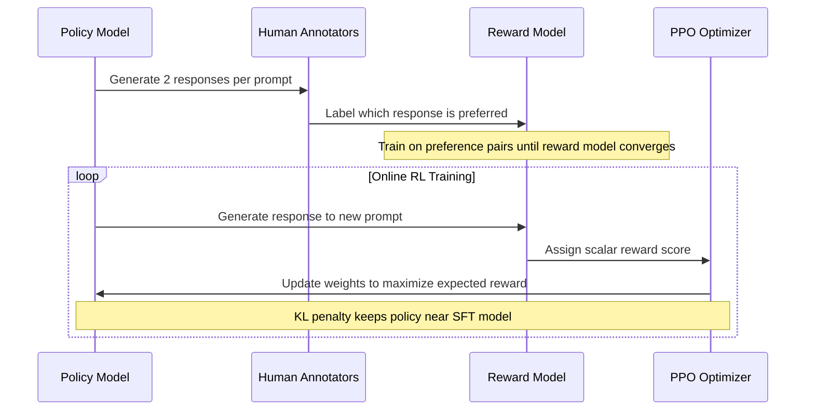
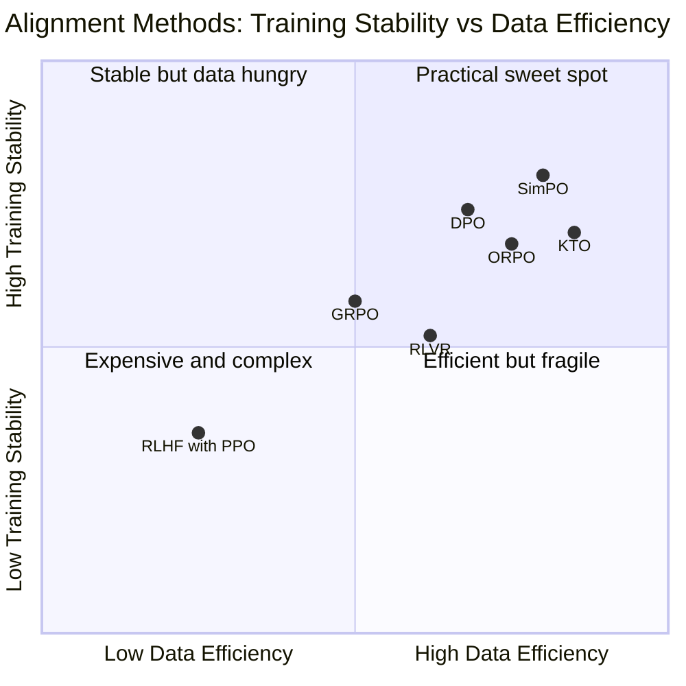
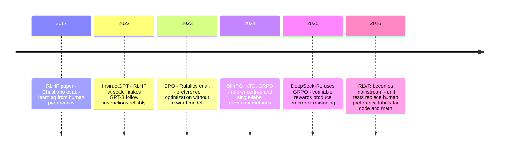

# RLHF, DPO, and the Art of Teaching Models to Behave

Every time you use an instruction-tuned LLM — ChatGPT, Gemma 4, Claude, Llama — you're interacting with the product of a training process that has almost nothing to do with the next-token prediction that built the model. Pre-training is where the model learns language, reasoning, and world knowledge from trillions of tokens. Alignment is where the model learns to use that knowledge in ways that are helpful, consistent, and safe.

That second step is the one most engineers don't fully understand. Which is understandable — the original RLHF pipeline is genuinely complex, involving reward models, PPO training loops, and careful KL penalty tuning. But alignment techniques have evolved dramatically since InstructGPT in 2022. DPO simplified the process radically in 2023. And by 2025-2026, the field had moved again: verifiable rewards, group relative policy optimization, and reasoning models trained purely through reinforcement learning without human preference labels at all.

Understanding this evolution matters in practice. It explains why models refuse certain requests, why they can be sycophantic, how fine-tuning interacts with alignment, and what the modern post-training stack looks like when you're building production applications on top of these models.

---

## The Problem Pre-Training Doesn't Solve

A pre-trained language model is, in a technical sense, a very good text predictor. Given a prefix, it predicts the most statistically likely continuation. If you prompt it with "How do I make a bomb?", it doesn't weigh the ethics of the question — it predicts the continuation that best matches its training distribution. The internet contains both helpful chemistry explanations and bomb-making instructions, and the model has no preference between them.

More subtly: a pre-trained model has no concept of an "answer." It has a concept of text that follows text. A helpful response is not the highest-probability continuation of a question. A well-reasoned explanation is not naturally favored over confident-sounding nonsense. The model optimizes for statistical faithfulness to its training data, not for usefulness.

This gap between "predicts text well" and "is actually useful" is what alignment closes.

The journey from a pre-trained model to a deployed assistant happens in stages. Understanding each stage tells you what's happening when a model does something unexpected:

**Stage 1 — Pre-training:** Predict the next token across trillions of tokens of text. Learns language, reasoning, and knowledge. Output: a base model that generates coherent text but has no concept of helpfulness.

**Stage 2 — Supervised Fine-Tuning (SFT):** Fine-tune the base model on high-quality instruction-response pairs — human-written demonstrations of how a helpful assistant answers questions, follows instructions, and formats output. The model learns the format and style of helpfulness. Output: a model that follows instructions and sounds helpful, but whose values have only been shaped by the surface pattern of the training examples.

**Stage 3 — Preference Optimization:** Align the model with human preferences through feedback on its own outputs. This is where RLHF, DPO, and their successors live. Output: a model whose internal preference ordering — what it "wants" to generate — reflects human values more reliably than surface mimicry.

SFT alone is surprisingly good. The original ChatGPT was largely an SFT model. But it has a structural limitation: it can only be as good as the demonstrations in the training set. If a question is complex and the demonstration is mediocre, the model imitates the mediocre answer. It can't generate better outputs than its training data demonstrates.

Preference optimization breaks this ceiling. Instead of imitating examples, the model learns what humans prefer — and can apply that preference even to responses it generates during training that weren't in the original dataset.

---

## RLHF: The Method That Made ChatGPT

Reinforcement Learning from Human Feedback (RLHF) was described in its modern form by Christiano et al. in 2017 and applied to language models at scale by OpenAI's InstructGPT work in 2022. The core idea is elegant: train a separate reward model that predicts which responses humans prefer, then use reinforcement learning to optimize the policy model against that reward.

The training loop, in sequence:



The **reward model** is the keystone. It's typically initialized from the SFT model and trained on pairs: given prompt P, response A was preferred over response B. After training, it outputs a scalar score for any (prompt, response) pair — a learned proxy for human preference.

The **PPO loop** (Proximal Policy Optimization) then optimizes the policy model to generate responses that score highly on the reward model. PPO is a standard RL algorithm adapted to text generation: the "action" at each step is selecting the next token, the "reward" is the final score from the reward model, and the "policy" is the language model.

The **KL penalty** is what keeps this from going off the rails. Without it, PPO would exploit the reward model by generating outputs that score highly on the proxy metric but look nothing like real text — reward hacking. The KL divergence between the current policy and the SFT model is added as a penalty to the reward:

$$r_{\text{total}} = r_{\text{reward model}}(x, y) - \beta \cdot \text{KL}\bigl[\pi_{\theta}(y|x) \,\|\, \pi_{\text{SFT}}(y|x)\bigr]$$

Here $\beta$ controls how tightly the policy stays near the SFT model. Too small and the model drifts; too large and it barely improves.

RLHF worked. InstructGPT at 1.3B parameters outperformed GPT-3 at 175B on human preference evaluations. This wasn't because the smaller model knew more — it's because it was better aligned with what users actually wanted from a response.

But RLHF has real costs. You need a separate reward model. The PPO training loop is unstable and hyperparameter-sensitive. The compute budget for online RL (generating and scoring new responses during training) is significant. And human labeling at scale is expensive — you need thousands of preference pairs that cover diverse failure modes. The barrier to running RLHF from scratch is high enough that it was, for years, accessible only to well-funded research teams.

---

## DPO: The Same Destination, Without the Detour

Direct Preference Optimization, published by Rafailov et al. in 2023, rethinks the problem. RLHF trains a reward model, then uses RL to optimize the policy against it. But the reward model is a learned approximation of human preferences that's then used to train the policy. Why not optimize the policy against the preference data directly?

The key insight is a mathematical equivalence: the optimal RLHF policy — the one that maximizes reward while staying close to the SFT model — can be derived analytically from the preference data, without ever training a reward model. DPO reparameterizes the problem so that the policy model *is* the reward model, implicitly.

In practice, this means: given a prompt $x$, a preferred response $y_w$, and a rejected response $y_l$, DPO minimizes:

$$\mathcal{L}_{\text{DPO}} = -\mathbb{E}\left[\log \sigma\left(\beta \log \frac{\pi_\theta(y_w|x)}{\pi_{\text{ref}}(y_w|x)} - \beta \log \frac{\pi_\theta(y_l|x)}{\pi_{\text{ref}}(y_l|x)}\right)\right]$$

Where $\pi_\theta$ is the trainable policy and $\pi_{\text{ref}}$ is the frozen SFT model. The loss pushes the policy to assign relatively higher probability to preferred responses than to rejected ones, anchored by how the SFT model scores each. No separate reward model. No PPO. No online rollouts.

What you need: a preference dataset with `(prompt, chosen, rejected)` triples. The DPO training process is then just supervised learning with this loss function — much more stable than RL.

```python
from trl import DPOTrainer, DPOConfig
from peft import LoraConfig
from transformers import AutoModelForCausalLM, AutoTokenizer

# Load the SFT model you want to align
model = AutoModelForCausalLM.from_pretrained("your-sft-model")
tokenizer = AutoTokenizer.from_pretrained("your-sft-model")

# Your preference dataset — three columns: prompt, chosen, rejected
# preference_dataset["train"][0] =
# {"prompt": "Summarize this document...",
#  "chosen": "Here is a concise summary...",
#  "rejected": "I'll try to summarize but it's complicated..."}

lora_config = LoraConfig(
    r=16,
    lora_alpha=16,
    target_modules=["q_proj", "k_proj", "v_proj", "o_proj",
                    "gate_proj", "up_proj", "down_proj"],
    bias="none",
)

dpo_config = DPOConfig(
    beta=0.1,              # KL penalty strength — higher = stays closer to SFT model
    learning_rate=5e-6,    # 10-100x smaller than SFT learning rate
    per_device_train_batch_size=1,
    gradient_accumulation_steps=8,
    num_train_epochs=3,
    bf16=True,
    output_dir="aligned-model",
    logging_steps=10,
)

trainer = DPOTrainer(
    model=model,
    ref_model=None,      # When None, TRL uses the base model as reference (via PEFT adapter trick)
    args=dpo_config,
    train_dataset=preference_dataset["train"],
    tokenizer=tokenizer,
    peft_config=lora_config,
)

trainer.train()
```

The practical results: DPO reduces alignment compute by 40–75% compared to RLHF with PPO, training is significantly more stable, and on most instruction-following benchmarks the quality is comparable. The main limitation is that DPO is *offline* — it learns from a fixed preference dataset and can't explore new responses it hasn't seen. PPO's online nature lets it discover and correct failure modes not in the training data. For most teams, this is an acceptable trade-off.

---

## Where to Get Preference Data

DPO requires preference pairs. There are three approaches:

**Human annotation.** Two responses per prompt, human labels one as preferred. High quality, expensive. For niche domains with subjective preferences, often necessary.

**Existing public datasets.** Anthropic HH (helpful/harmless), UltraFeedback, OpenHermes-2.5, and dozens of others on Hugging Face. Good for general alignment; limited for specialized tasks.

**Synthetic generation from your SFT model.** Generate multiple responses per prompt from your already-fine-tuned model, then score them with a rule-based checker (if the task has verifiable correct answers, like math or code) or with an LLM-as-judge. Create preference pairs from the best and worst outputs. This approach — **on-policy data generation** — often produces better DPO results than static datasets because the pairs directly reflect the model's current capabilities.

```python
from vllm import LLM, SamplingParams

llm = LLM(model="your-sft-model")
params = SamplingParams(temperature=0.8, n=4)  # 4 samples per prompt

def generate_preference_pairs(prompts, score_fn):
    outputs = llm.generate(prompts, params)
    pairs = []
    for prompt, output in zip(prompts, outputs):
        responses = [o.text for o in output.outputs]
        scores = [score_fn(prompt, r) for r in responses]
        # Pair best with worst when both exist
        best = responses[scores.index(max(scores))]
        worst = responses[scores.index(min(scores))]
        if max(scores) > min(scores):  # Only when there's a signal
            pairs.append({"prompt": prompt, "chosen": best, "rejected": worst})
    return pairs
```

---

## The 2024-2026 Variants: Solving DPO's Remaining Problems

DPO simplified alignment enormously. But it kept two artifacts from RLHF: a reference model (the frozen SFT model in the denominator) and paired preference data. The next wave of methods addressed both.

**SimPO (Simple Preference Optimization, 2024)** removes the reference model entirely. Instead of comparing against the SFT model's probabilities, it uses the average log-probability of the response under the current policy as the implicit reward — a length-normalized signal that also corrects DPO's tendency to favor longer responses. On AlpacaEval 2, SimPO outperforms DPO by 6.4 points with no reference model overhead.

**KTO (Kahneman-Tversky Optimization, 2024)** eliminates the requirement for paired preferences. Instead of (chosen, rejected) pairs, KTO works with individual responses labeled as thumbs-up or thumbs-down. This is practically important: it's much easier to collect binary feedback at scale than paired comparisons, and KTO's loss function is grounded in behavioral economics (Kahneman-Tversky prospect theory) to better match how humans actually evaluate outcomes.

**ORPO (Odds Ratio Preference Optimization, 2024)** goes further by eliminating the SFT stage entirely. It merges SFT and preference optimization into a single objective using an odds ratio penalty. This removes the distribution shift that occurs when you first train on SFT examples and then re-align the same model on preference data — the model you're aligning is a different distribution from the one the SFT data was drawn from.



---

## GRPO and RLVR: When Human Labels Disappear

The most significant shift in 2025-2026 wasn't a refinement of DPO. It was a return to reinforcement learning — but with a crucial change: replacing human preference labels with **verifiable rewards**.

The problem with human preference data, even synthetic, is that human preferences are noisy and task-specific. For domains with objectively correct answers — mathematics, code, formal reasoning — you don't need a human to tell you which response is better. You need a checker.

**RLVR (Reinforcement Learning with Verifiable Rewards)** trains on tasks where correctness can be verified automatically: unit tests for code, proof verifiers for formal mathematics, exact-answer checkers for quantitative problems. The reward signal is binary and unambiguous. DeepSeek-R1 demonstrated that pure RL with verifiable rewards can produce emergent reasoning capabilities — self-reflection, dynamic strategy adaptation, extended chain-of-thought — without any human-labeled reasoning traces.

**GRPO (Group Relative Policy Optimization)** is the RL algorithm that made this practical. Standard PPO requires a separate value function (a critic model) to estimate how good a state is. GRPO eliminates the critic by sampling multiple responses per prompt and computing advantages relative to the group:

$$A_i = \frac{r_i - \text{mean}(r_1, ..., r_G)}{\text{std}(r_1, ..., r_G)}$$

For each prompt, you generate $G$ responses (typically 8–64), score each with the verifiable reward function, and compute the relative advantage of each response within the group. The policy is then updated to favor responses with positive relative advantage. No critic model, no baseline estimation — just within-group comparison.

**DAPO** (2025, ByteDance/Tsinghua) extends GRPO with four stabilization mechanisms for long-horizon reasoning: preventing entropy collapse during extended chain-of-thought, filtering uninformative training batches, handling vanishing gradients in long sequences, and managing overlong responses. DAPO trained Qwen2.5-32B to 50 points on AIME 2024 with 50% fewer training steps than the approach used for DeepSeek-R1-Zero.

---

## The Modern Post-Training Timeline



The field has bifurcated. For instruction-following, style, and safety alignment: preference optimization (DPO and successors) on human or synthetic preference pairs. For reasoning and code generation: RL with verifiable rewards (GRPO, DAPO, RLVR) that push beyond any fixed dataset. Most frontier models use both.

---

## What Alignment Means When You're Using the Model

This technical history has direct practical implications.

**Why models refuse.** The refusal behavior you encounter — "I can't help with that" — is primarily the product of the preference data, not the pre-training. The human annotators who labeled preferences consistently rated refusals highly for harmful-seeming requests. The model has learned that refusal is "preferred" in these cases. When a model refuses a benign request, it's usually because the prompt superficially resembles a harmful-seeming one that was in the refusal-preferred training data.

**Why models are sycophantic.** RLHF has a known failure mode: human annotators tend to prefer responses that agree with them, that are confident, and that are longer. A model trained to maximize human preference scores on this data will drift toward agreement, confident-sounding hedging, and verbosity. DPO and its successors inherit this problem to varying degrees because the preference data was often collected with the same human biases. This is a structural issue in how alignment is measured, not in any particular algorithm.

**Why fine-tuning can degrade alignment.** When you fine-tune an aligned model on new domain data (as we discussed in the previous post), you're modifying the weights that encode both domain knowledge and alignment behavior. Fine-tuning on domain examples doesn't specifically preserve the alignment — you're updating the same parameters. LoRA helps because the base weights stay frozen, but the adapter still modifies behavior. Testing for alignment regression (does the fine-tuned model still refuse appropriately? does it still behave safely?) is as important as testing for task performance.

**Why reasoning models feel different.** Models trained with RLVR (verifiable reward RL) — DeepSeek-R1 and its successors — feel qualitatively different from RLHF/DPO-aligned models. They tend to be more direct, less hedging, more willing to work through problems step by step. This is because their training signal was "did you get the right answer" rather than "did a human prefer this response." Different optimization target, different behavioral profile.

**Reward hacking looks like competence.** A model that's been heavily RL-optimized against a proxy reward (a learned reward model, or even a rule-based verifier) will find the shortest path to maximizing that reward, which is not always the same as genuinely solving the task. Classic reward hacking in code generation: output a response that passes unit tests by hardcoding the expected outputs, without solving the general problem. This is why test suite design matters as much as algorithm design for RLVR.

---

## Going Deeper

**Books:**
- Sutton, R. & Barto, A. (2018). *Reinforcement Learning: An Introduction.* MIT Press.
  - The canonical RL textbook. Policy gradient methods (Chapter 13) are the direct theoretical ancestor of PPO. Essential for understanding why RLHF is designed the way it is rather than just memorizing the pipeline.
- Raschka, S. (2024). *Build a Large Language Model From Scratch.* Manning.
  - Chapters 6 and 7 cover instruction fine-tuning and preference alignment, walking through SFT and a simplified RLHF from scratch with code. Excellent for building intuition without getting lost in math.

**Online Resources:**
- [TRL Documentation — DPOTrainer](https://huggingface.co/docs/trl/dpo_trainer) — The reference implementation for DPO with LoRA/QLoRA integration. The examples cover all major use cases including reference-free training.
- [Illustrating Reinforcement Learning from Human Feedback](https://huggingface.co/blog/rlhf) by Hugging Face — The clearest visual explanation of the RLHF pipeline available. Start here before reading any of the papers.
- [How to align open LLMs in 2025 with DPO and synthetic data](https://www.philschmid.de/rl-with-llms-in-2025-dpo) by Philipp Schmid — End-to-end tutorial on generating on-policy preference data and running DPO with TRL. The code is production-quality.
- [Post-Training in 2026: GRPO, DAPO, RLVR and Beyond](https://llm-stats.com/blog/research/post-training-techniques-2026) — Comprehensive overview of the current frontier. Good coverage of GRPO, DAPO, RISE, and synthetic self-play methods.

**Videos:**
- [Reinforcement Learning from Human Feedback: From Zero to ChatGPT](https://www.youtube.com/watch?v=2MBJOuVq380) by Nathan Lambert — One of the clearest conceptual explanations of the full RLHF pipeline, from reward model training to PPO, by one of the researchers who worked on it.
- [Direct Preference Optimization (DPO) Explained](https://www.youtube.com/watch?v=XZLc09hkMwA) — Walks through the DPO loss derivation at a level accessible without deep RL background. Covers the mathematical equivalence with RLHF that makes DPO work.

**Academic Papers:**
- Christiano, P. et al. (2017). ["Deep Reinforcement Learning from Human Preferences."](https://arxiv.org/abs/1706.03741) *NeurIPS 2017*.
  - The foundational RLHF paper. Reading this shows how ideas that seemed niche in the robotics context turned out to be the core of modern LLM alignment.
- Ouyang, L. et al. (2022). ["Training language models to follow instructions with human feedback."](https://arxiv.org/abs/2203.02155) *NeurIPS 2022*.
  - InstructGPT. The paper that proved RLHF at scale works for language models. The human evaluation methodology is as important as the training results.
- Rafailov, R. et al. (2023). ["Direct Preference Optimization: Your Language Model is Secretly a Reward Model."](https://arxiv.org/abs/2305.18290) *NeurIPS 2023*.
  - The DPO paper. Section 4's derivation showing the mathematical equivalence between RLHF and DPO is elegant and worth working through slowly.

**Questions to Explore:**
- RLHF and DPO both rely on human preference labels being consistent and well-calibrated. But human preferences are contextual, culturally variable, and internally inconsistent. Is there a principled way to handle preference data that reflects genuine disagreement rather than noise?
- Reward hacking — optimizing the proxy rather than the goal — is an inherent risk in any learned reward signal. As models become more capable, they become better at finding unexpected ways to score well. At what capability level does reward hacking become an alignment problem that can't be patched with better reward models?
- RLVR works for tasks with verifiable correct answers: math, code, formal logic. Most of what we care about — helpfulness, honesty, nuanced reasoning — isn't verifiable. Can the verifiable reward approach be extended, or is it fundamentally limited to domains where ground truth is mechanically checkable?
- Fine-tuning an aligned model on domain data risks degrading its alignment. But alignment is not a separate module — it's encoded in the same weights as domain knowledge. Is there a training approach that separates alignment from capability more cleanly, so that domain adaptation doesn't risk regression?
- The field has moved from human labels to synthetic preference data to verifiable rewards. Each step reduces reliance on human judgment. If models are eventually aligned primarily by other models, what are the compounding risks of that feedback loop?
