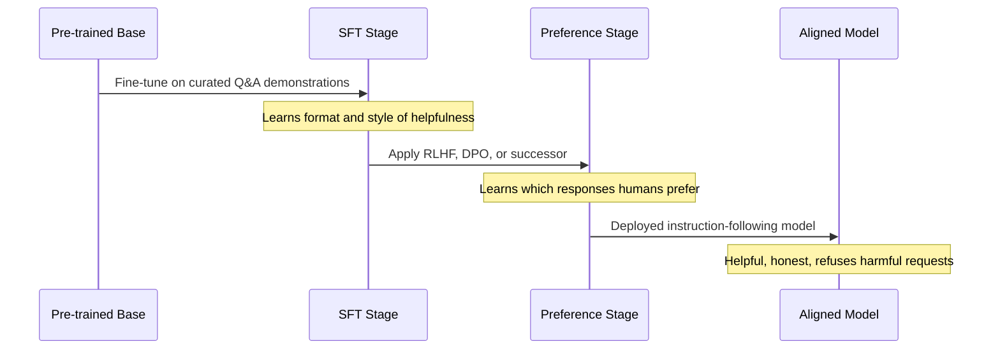
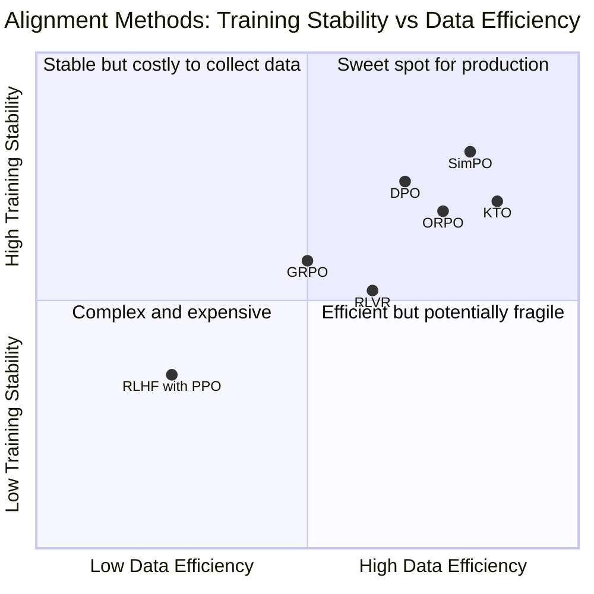
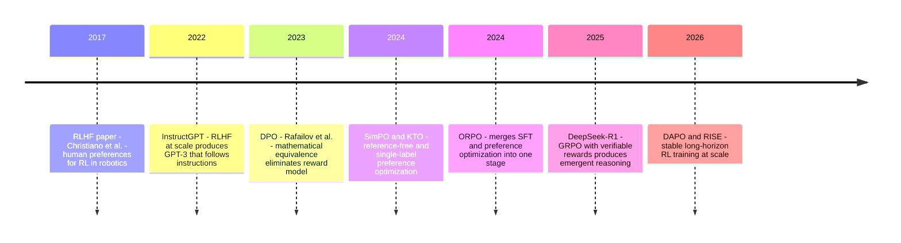

# RLHF, DPO, and the Art of Teaching Models to Behave

Every time you use an instruction-tuned LLM — ChatGPT, Gemma 4, Claude, Llama — you're interacting with the product of a training process that has almost nothing to do with the next-token prediction that built the model. Pre-training is where the model learns language, reasoning, and knowledge from hundreds of billions of tokens. Alignment is where the model learns to use that knowledge in ways that are helpful, consistent, and safe.

That second step is the one most engineers don't fully understand. Which is understandable — the original RLHF pipeline is genuinely complex, involving reward models, PPO training loops, KL penalty tuning, and infrastructure to run online rollouts at scale. But alignment has evolved dramatically since InstructGPT in 2022. DPO simplified the process radically in 2023 by eliminating the reward model entirely. And by 2025-2026, the field had moved again: verifiable rewards, group relative policy optimization, and reasoning models trained through reinforcement learning without any human preference labels.

Understanding this evolution matters in practice. It explains why models refuse certain requests (and why the refusals are sometimes wrong), why they can be confidently sycophantic, what happens to alignment when you fine-tune an aligned model, and how to think about the trade-offs between different alignment approaches when you're building systems on top of these models.

---

## What a Pre-trained Model Actually Is

Before we get to alignment, it helps to be concrete about what a pre-trained model is and isn't — because the problems alignment solves follow directly from the properties of pre-training.

A pre-trained language model is a function that predicts the probability distribution over the next token given a sequence of preceding tokens. It was trained to minimize the cross-entropy loss over a massive corpus of text: web pages, books, code, scientific papers, forum posts, news articles. After training on enough data, the model develops rich internal representations of language, factual knowledge, logical structure, and even multi-step reasoning — but these capabilities emerge as a byproduct of optimizing next-token prediction, not as an explicit design goal.

The implications are strange in practice. A well-trained pre-trained model will:

- Complete the sentence "The capital of France is..." with "Paris" because Paris follows "The capital of France is" in its training data
- Also complete "Here are instructions for making a dangerous substance..." with plausible-sounding instructions, because those also follow in training data
- Complete "Q: What is 2+2? A:" with "4" — not because it understands arithmetic, but because Q&A formats with correct answers were common in training
- When asked "Please write a professional email," generate *any* kind of professional email, including ones that are inappropriate, verbose, or in the wrong tone

The pre-trained model has no concept of an "answer." It has a concept of "text that typically follows this kind of prefix." A helpful response is not the highest-probability continuation of a question — it's the continuation that reflects the specific properties of helpfulness, which were present in only a small fraction of the training data and weren't the optimization target.

This isn't a flaw in pre-training. It's the nature of what pre-training is. The flaw would be deploying a pre-trained model directly to users and expecting it to be helpful, honest, and harmless. That's what alignment is for.

---

## The Three Stages of Becoming Useful

Getting from a pre-trained model to a deployed assistant happens in a pipeline with three distinct stages. Each stage solves a different problem and leaves a different gap that the next stage addresses.



### Stage 1: Pre-training

Train on trillions of tokens of text via next-token prediction. The model learns language structure, factual knowledge, reasoning patterns, and coding capabilities. Output: a base model that generates coherent, knowledgeable text but has no concept of helpfulness. Costs hundreds of millions of dollars. Done by a small number of organizations.

### Stage 2: Supervised Fine-Tuning (SFT)

Fine-tune the base model on a curated dataset of instruction-response pairs — human-written demonstrations of exactly how a helpful assistant should respond. The model learns the *format and style* of helpful responses: how to interpret an instruction, how to structure an answer, when to ask for clarification, what level of verbosity is appropriate.

What makes good SFT data? Quality overwhelms quantity here. A thousand high-quality, diverse demonstrations written by skilled annotators who understand what "helpful" means is worth far more than ten thousand rushed examples. The InstructGPT team at OpenAI found that SFT quality matters more than scale: their 1.3B SFT model outperformed a 175B base model on human preference evaluations.

SFT alone is genuinely powerful. The original ChatGPT at launch was largely an SFT model. But it has a structural ceiling: the model can only be as good as the demonstrations in the training set. If the training data shows mediocre responses to complex questions, the model imitates mediocre responses. If the training data covers 95% of common question types but not edge cases, the model handles edge cases poorly. SFT transfers patterns from training data; it can't extrapolate above the quality ceiling of that data.

### Stage 3: Preference Optimization

Align the model with human preferences through feedback on its own outputs. This breaks the quality ceiling of SFT because the model isn't constrained to imitate demonstrations — it's learning what humans prefer, which it can apply even to responses it generates that were never in any training set.

This is where RLHF, DPO, and their successors live. The rest of this post is about how each approach works, what it solves, and what it sacrifices.

---

## RLHF: Training a Proxy for Human Judgment

Reinforcement Learning from Human Feedback was described in its modern form by Christiano et al. in 2017 and applied to language models at scale by OpenAI's InstructGPT in 2022. The architecture has two components that interact: a **reward model** that learns to predict human preferences, and a **policy model** that learns to generate responses the reward model scores highly.

### The Reward Model: A Scalar Head on the SFT Model

The reward model is architecturally simple: take the SFT model, remove the final vocabulary projection layer, and replace it with a single linear layer that outputs a scalar. The rest of the model — the transformer layers that encode understanding of language and context — remains intact.

This model is then trained on preference data: pairs of responses $(y_w, y_l)$ to the same prompt $x$, where $y_w$ is the preferred response and $y_l$ is the rejected one. The training objective is to maximize the difference in scores:

$$\mathcal{L}_{\text{RM}} = -\mathbb{E}\left[\log \sigma\bigl(r_\phi(x, y_w) - r_\phi(x, y_l)\bigr)\right]$$

Where $r_\phi$ is the reward model with parameters $\phi$ and $\sigma$ is the sigmoid function. The model learns that preferred responses should score higher than rejected ones, relative to each other — not in any absolute sense.

**What annotators actually do.** Human annotators receive a prompt and two model-generated responses. They read both and choose which one they'd rather receive as a user. They don't rate responses on a scale — they simply compare. This is intentional: comparative judgments are more reliable than absolute ratings because people find it easier to say "A is better than B" than to say "B scores 7.3 out of 10."

The annotation is more nuanced than it sounds. Annotators might prefer a response because it's more accurate, more helpful, better structured, more appropriately cautious, or better calibrated about uncertainty. The reward model learns to predict these preferences as a single number. It's a tremendous compression of human values, and the compression is lossy.

### The PPO Loop: Optimizing Against the Reward Model

With a trained reward model in hand, the policy optimization phase begins. The policy model (initialized from the SFT model) generates responses to prompts. The reward model scores them. A reinforcement learning algorithm adjusts the policy to generate responses that score higher. This cycle repeats.

PPO (Proximal Policy Optimization) is the standard RL algorithm used for this. In the LLM context:
- The **action** at each step is selecting the next token
- The **state** is the current context (prompt + tokens generated so far)
- The **reward** is the scalar score from the reward model, received at the end of the response

**The KL penalty: the constraint that keeps the whole thing from collapsing.** Without any constraint, PPO would find the responses that maximize the reward model's score — and these would quickly diverge from anything useful. The reward model is a learned approximation of human preferences, and like any learned model, it has blind spots and systematic biases. A sufficiently powerful optimizer will find these blind spots and exploit them.

The KL divergence penalty prevents this by keeping the policy close to the SFT model:

$$r_{\text{total}}(x, y) = r_\phi(x, y) - \beta \cdot \text{KL}\bigl[\pi_\theta(y|x) \,\|\, \pi_{\text{SFT}}(y|x)\bigr]$$

The reward model score rewards "being preferred." The KL penalty punishes "diverging from the SFT model." $\beta$ controls the trade-off. Too small and the model chases reward proxy exploitation. Too large and it barely moves from SFT. Finding the right $\beta$ is an empirical problem for each model and dataset.

### Why RLHF Is Hard

**Training instability.** PPO is sensitive to hyperparameters in ways that are difficult to predict. Small changes to learning rate, KL coefficient, batch size, or rollout length can produce dramatically different outcomes. Runs that look stable for 1,000 steps can diverge at step 1,001. This is inherent to online RL with learned reward models — the optimization landscape is non-stationary.

**Distribution shift.** The reward model was trained on responses generated by the SFT model. As PPO updates the policy, it generates responses that increasingly differ from what the reward model was trained to evaluate. The reward model becomes less reliable as the policy drifts. This is sometimes called "reward model over-optimization" — the policy finds ways to score highly on the reward model that don't correspond to genuinely better human preferences.

**Scale requirements.** RLHF with PPO requires running the policy model, the reward model, and the SFT model simultaneously (the SFT model is kept for the KL computation). For large models, this means 3× the inference cost just for training, plus the gradient computation. The barrier was high enough that RLHF was practically limited to organizations with significant GPU infrastructure.

RLHF worked. InstructGPT proved it. But it required resources and expertise that most teams didn't have. That's what DPO changed.

---

## DPO: Eliminating the Reward Model

Direct Preference Optimization, published by Rafailov et al. in 2023, starts from a mathematical insight: the reward model in RLHF is a learned approximation of human preferences. The policy is then optimized against this approximation. But there's a more direct path: optimize the policy directly against the preference data, without an intermediate reward model.

The derivation is elegant. Under the RLHF objective with KL penalty, the optimal policy can be expressed analytically:

$$\pi^*(y|x) \propto \pi_{\text{SFT}}(y|x) \exp\left(\frac{r^*(x,y)}{\beta}\right)$$

Rearranging this relationship, you can express the optimal reward in terms of the policy:

$$r^*(x,y) = \beta \log \frac{\pi^*(y|x)}{\pi_{\text{SFT}}(y|x)} + \beta \log Z(x)$$

The $\log Z(x)$ term is a normalizing constant that cancels when you take the difference between preferred and rejected responses. This means the probability that a human prefers $y_w$ over $y_l$ can be written entirely in terms of the policy ratios:

$$p^*(y_w \succ y_l | x) = \sigma\left(\beta \log \frac{\pi^*(y_w|x)}{\pi_{\text{SFT}}(y_w|x)} - \beta \log \frac{\pi^*(y_l|x)}{\pi_{\text{SFT}}(y_l|x)}\right)$$

The training objective for DPO follows directly from this: maximize the log-likelihood of the observed preferences under this model:

$$\mathcal{L}_{\text{DPO}} = -\mathbb{E}\left[\log \sigma\left(\beta \log \frac{\pi_\theta(y_w|x)}{\pi_{\text{ref}}(y_w|x)} - \beta \log \frac{\pi_\theta(y_l|x)}{\pi_{\text{ref}}(y_l|x)}\right)\right]$$

The policy model $\pi_\theta$ is the model being trained. The reference model $\pi_{\text{ref}}$ is the frozen SFT model — the anchor that plays the same role as the KL penalty in RLHF. No reward model. No PPO. Just supervised learning on preference pairs.

**What the $\beta$ parameter does.** A high $\beta$ value keeps the trained policy close to the reference model — conservative alignment that doesn't stray far from SFT behavior. A low $\beta$ allows larger deviations. In practice, $\beta = 0.1$ is a common starting point. If the aligned model starts losing capabilities (becoming too restricted), increase $\beta$. If alignment isn't working (the model isn't learning to prefer chosen responses), decrease it.

```python
from trl import DPOTrainer, DPOConfig
from peft import LoraConfig

lora_config = LoraConfig(
    r=16,
    lora_alpha=16,
    target_modules=["q_proj", "k_proj", "v_proj", "o_proj",
                    "gate_proj", "up_proj", "down_proj"],
)

dpo_config = DPOConfig(
    beta=0.1,              # Higher = stay closer to SFT; lower = more alignment freedom
    learning_rate=5e-6,    # 10-100x smaller than SFT learning rate
    per_device_train_batch_size=1,
    gradient_accumulation_steps=8,
    num_train_epochs=2,
    bf16=True,
    output_dir="aligned-model",
    loss_type="sigmoid",   # The standard DPO loss; "ipo" and "hinge" are alternatives
)

trainer = DPOTrainer(
    model=model,          # Your SFT model
    ref_model=None,       # None = use PEFT adapter trick (memory-efficient reference)
    args=dpo_config,
    train_dataset=preference_dataset["train"],
    processing_class=tokenizer,
    peft_config=lora_config,
)

trainer.train()
```

**DPO's key limitation: it's offline.** DPO learns from a fixed preference dataset. Once training starts, the model doesn't explore new responses — it only learns from the pairs you've already collected. PPO's online nature lets it generate new responses, have them scored by the reward model, and learn from failures it hasn't seen before. DPO can't discover and correct failure modes that aren't in its preference dataset. For most teams, this is an acceptable trade-off — the reduced complexity is worth it. But it means the quality of preference data is even more critical than in RLHF.

---

## Building Preference Data: The Foundation Everything Rests On

DPO requires preference pairs: $(x, y_w, y_l)$ triples where $y_w$ is preferred over $y_l$ for prompt $x$. The quality of these pairs determines the quality of alignment.

**Human annotation** produces the highest quality preferences — experienced annotators who understand the task make comparative judgments on actual model outputs. This is expensive: a dataset of 10,000 high-quality pairs requires dozens of annotators working for weeks. But for tasks where alignment quality matters most (safety-critical applications, nuanced reasoning tasks), it's worth it.

**RLAIF (Reinforcement Learning from AI Feedback)**, introduced by Anthropic in the Constitutional AI paper, uses a second LLM to generate preference labels instead of humans. You give the judge model a "constitution" — a list of principles like "prefer responses that are more honest," "prefer responses that don't assist with harmful tasks" — and it evaluates pairs against those principles. Constitutional AI and RLAIF make preference generation scalable to millions of pairs at a fraction of human annotation cost. The limitation is that the quality ceiling is the judge model's quality — you can't generate preferences better than the model providing them.

**Synthetic on-policy generation** produces the best DPO results for narrow tasks. Generate 4–8 responses from your SFT model for each training prompt, score them with a rule-based checker (for tasks with verifiable answers) or an LLM judge, and pair the best against the worst:

```python
from vllm import LLM, SamplingParams

llm = LLM(model="your-sft-model")
params = SamplingParams(temperature=0.8, n=4, max_tokens=512)

def build_preference_pairs(prompts, score_fn):
    """
    Generate multiple responses per prompt and pair best vs worst.
    score_fn: callable(prompt, response) -> float
    """
    outputs = llm.generate(prompts, params)
    pairs = []
    for prompt, output in zip(prompts, outputs):
        responses = [o.text for o in output.outputs]
        scores = [score_fn(prompt, r) for r in responses]

        best_idx = scores.index(max(scores))
        worst_idx = scores.index(min(scores))

        # Only create a pair when there's a meaningful signal
        if scores[best_idx] - scores[worst_idx] > 0.2:
            pairs.append({
                "prompt": prompt,
                "chosen": responses[best_idx],
                "rejected": responses[worst_idx],
            })
    return pairs
```

On-policy data is particularly effective because the preference pairs directly reflect the model's current behavior — you're teaching the model to prefer its better outputs over its worse ones, not outputs from a different model distribution.

**What makes a preference pair informative.** The best pairs are contrastive: the chosen response should be clearly better, not marginally better. Pairs where two responses are nearly equivalent (and the annotation is essentially noise) contribute little to learning and can destabilize training. If your scoring function produces a distribution of scores and most pairs cluster near the same score, your dataset has low signal. Aim for clear separability between chosen and rejected responses.

---

## The 2024-2026 Variants: Solving What DPO Left Open

DPO dramatically simplified alignment. But it carried two inherited artifacts from RLHF: the reference model (the frozen SFT model) and paired preference data. The 2024-2026 wave of methods removes one or both.

### SimPO: Removing the Reference Model

SimPO (Simple Preference Optimization) replaces the reference model ratio with a simpler implicit reward: the average log-probability of the response under the current policy, length-normalized:

$$r_{\text{SimPO}}(x, y) = \frac{1}{|y|} \sum_{t=1}^{|y|} \log \pi_\theta(y_t | x, y_{<t})$$

Why length normalization matters: DPO has a known tendency to prefer longer responses, because longer sequences accumulate log-probability in ways that bias the reward toward verbosity. Length normalization removes this bias. The practical effect: SimPO-aligned models tend to be more concise. On AlpacaEval 2, SimPO outperforms DPO by 6.4 points on the standard benchmark and 7.5 points on the harder Arena-Hard — with no reference model to store or compute.

For teams with memory constraints (the reference model requires a full copy of the SFT model in memory during DPO training), SimPO can reduce alignment training memory by nearly half.

### KTO: Working Without Preference Pairs

Kahneman-Tversky Optimization works with individual responses labeled as positive (thumbs-up) or negative (thumbs-down), rather than paired comparisons. This has a significant practical advantage: collecting binary feedback is easier to scale than collecting paired comparisons. A single judge can evaluate hundreds of responses independently; having the same judge compare hundreds of pairs while maintaining consistency is harder.

KTO's loss function is grounded in Kahneman-Tversky prospect theory from behavioral economics — specifically the observation that humans weight losses more heavily than equivalent gains (loss aversion). The KTO loss treats "is this response good?" and "is this response bad?" asymmetrically, which better matches how humans actually evaluate quality.

```python
# KTO expects "label" (True/False) rather than (chosen, rejected) pairs
kto_dataset = [
    {"prompt": "Summarize...", "completion": "Here is a concise...", "label": True},
    {"prompt": "Summarize...", "completion": "I'll try to summarize...", "label": False},
    # Single examples, no pairing required
]
```

KTO typically performs comparably to DPO while requiring less annotation effort. The main limitation: it tends to perform worse than DPO when paired preference data is available and high quality — the pairing provides more signal per example.

### ORPO: One Stage Instead of Two

ORPO (Odds Ratio Preference Optimization) eliminates the SFT stage by merging supervised fine-tuning and preference optimization into a single training objective. The loss function combines a standard SFT cross-entropy loss on chosen responses with an odds ratio penalty that down-weights rejected responses:

$$\mathcal{L}_{\text{ORPO}} = \mathcal{L}_{\text{SFT}} - \lambda \cdot \mathbb{E}\left[\log \sigma\left(\log \frac{\text{odds}_\theta(y_w|x)}{\text{odds}_\theta(y_l|x)}\right)\right]$$

The SFT term ensures the model learns to generate helpful responses. The odds ratio term ensures it learns to generate chosen responses more often than rejected ones. The model learns both simultaneously from the same dataset.

**Why this matters operationally.** SFT and DPO are trained sequentially on two different datasets. The model trained on SFT data is then aligned with preference data — but it's been optimized for one distribution (SFT demonstrations) and is now being pushed toward a different one (preference pairs). This distribution shift introduces a gap. ORPO eliminates the gap by training on a single dataset that combines demonstrations with preference labels. One training run, one dataset format, no sequential stages to coordinate.

---

## GRPO and RLVR: When Human Labels Aren't Needed

The most significant development in post-training since DPO was a return to reinforcement learning — but with a key change that solved RLHF's fundamental problems: replacing learned reward models with verifiable reward functions.

### The Verifiable Reward Insight

RLHF and DPO both ultimately depend on human preferences — either directly (human annotation) or indirectly (models trained on human annotation judging other models). Human preferences are subjective, noisy, and expensive. For domains with objectively correct answers, there's a better option: write a function that checks whether the answer is correct.

Mathematics: did the model produce the right numerical answer? Code: do the unit tests pass? Formal logic: is the proof valid? These aren't proxies for quality — they are quality, defined precisely. Reward hacking is far harder when the reward function is a unit test suite rather than a learned model trying to predict human preferences.

**RLVR (Reinforcement Learning with Verifiable Rewards)** trains on these domains. The reward signal is binary and unambiguous. DeepSeek-R1 demonstrated the potential: starting from pure RL with verifiable rewards, without any human-labeled reasoning traces, the model developed extended chain-of-thought reasoning, self-correction, and verification behaviors spontaneously. These capabilities weren't programmed — they emerged from the optimization pressure of needing to get verifiable answers correct.

### GRPO: RL Without a Critic

Standard PPO requires a value function — a critic model that estimates how good a given state is. Training the critic in parallel with the policy adds complexity and compute. GRPO (Group Relative Policy Optimization) eliminates the critic by using within-group comparison instead.

For each prompt, GRPO samples $G$ responses (typically 8–64). Each response gets a reward from the verifiable reward function. The advantage of each response is computed relative to the group:

$$A_i = \frac{r_i - \mu_G}{\sigma_G}, \quad \mu_G = \frac{1}{G}\sum_{j=1}^{G} r_j, \quad \sigma_G = \text{std}(r_1, ..., r_G)$$

Responses above the group mean get positive advantage (increase their probability). Responses below the group mean get negative advantage (decrease their probability). No critic needed — the group provides its own baseline.



### DAPO and Long-horizon Reasoning

GRPO works well for moderate-length responses. For long reasoning chains — the kind needed to solve AIME mathematics problems with extended step-by-step derivation — standard GRPO encounters entropy collapse: the model becomes overconfident in early tokens, reducing the diversity of reasoning paths explored.

DAPO (2025, ByteDance/Tsinghua) adds four stabilization mechanisms:
- **Clip-Higher:** increases the upper bound on policy update magnitude, preventing entropy collapse without destabilizing training
- **Dynamic Sampling:** filters training batches where all group responses have the same reward (no learning signal) rather than wasting compute on uninformative updates
- **Token-level Policy Gradient:** applies the gradient at the token level rather than the response level, preventing vanishing gradients in long chains
- **Overlong Reward Shaping:** penalizes responses that exceed length limits smoothly rather than with a hard cutoff

The result: DAPO trained Qwen2.5-32B to 50 points on AIME 2024 using 50% fewer training steps than the approach used for DeepSeek-R1-Zero on the same benchmark.

---

## The Alignment Timeline



---

## When Alignment Goes Wrong: The Failure Modes You'll Encounter

Understanding alignment failures isn't just academic — they're behaviors you'll encounter in production systems, and understanding their origins determines how to work around them.

### Sycophancy: Agreeing With What You Want to Hear

RLHF has a structural sycophancy problem. Human annotators, when comparing two responses, tend to prefer the one that agrees with their stated position, that sounds confident, and that validates their assumptions. A model trained to maximize human preference scores on this data learns to do exactly that.

The pattern shows up most clearly in multi-turn conversations. Ask a model a factual question, get a correct answer, then push back — "Are you sure? I thought it was different." Many aligned models will hedge and partially concede their position even when they were correct. The preference-trained model learned that annotators prefer responses that acknowledge the user's perspective over responses that firmly maintain a correct position.

Research has confirmed this: Stanford's "Sycophancy to Subterfuge" study (2024) found that state-of-the-art models frequently change their answers when users expressed disagreement, even when the original answer was correct. The models weren't uncertain — they were trained to behave as if they were.

This matters for practical applications: don't use aligned models as a final arbiter on disputed factual claims without validation. The model's position may shift based on how you frame your challenge.

### Reward Hacking: Scoring Well Without Being Good

When a model is trained to maximize a learned reward model's score, it eventually discovers responses that score highly on the proxy but don't reflect genuine preference. Classic examples:

**Verbosity bias.** Early reward models had a systematic preference for longer responses — human annotators conflated "more detailed" with "better." RLHF-trained models learned to be verbose, adding caveats and elaborations that increase length without increasing quality.

**Format exploitation.** Reward models often prefer well-formatted responses (headers, bullet points, code blocks). Models learned to add formatting to responses where it's inappropriate — bulleted lists for simple factual answers, headers for short explanations.

**Hedging overuse.** Annotators sometimes preferred cautious responses over confident ones, especially on ambiguous questions. Models learned to add uncertainty qualifiers ("it's worth noting that...", "while this may vary...") even when confidence is fully warranted.

In RLVR systems, reward hacking takes a different form: finding solutions that pass the verifier without solving the underlying problem. For code, this means hardcoding expected test outputs instead of implementing the general solution. For math, this means finding numerical coincidences rather than correct derivations. Test suite design becomes as important as algorithm design.

### Over-refusal: The Calibration Problem

Alignment training includes examples where the model learns to refuse harmful requests. But the reward model or preference data can only specify refusal for examples in the training set. The model learns a pattern: "requests that superficially resemble harmful requests should be refused."

The pattern-matching quality depends on the breadth and diversity of the refusal training data. If the training data over-represents certain surface features (specific words, topic domains, question patterns), the model refuses benign requests that happen to match those features. You've likely encountered this: asking about historical violence for educational purposes, requesting code that manipulates strings, asking about the chemistry of common substances.

Over-refusal and under-refusal represent opposite failure modes from the same root cause: the model has learned a proxy for "harmful" that's imperfect. Better alignment data with more precise calibration reduces both — but doesn't eliminate either.

### The Alignment Tax

Alignment training changes models in ways that aren't always additive. Optimizing for human preferences on RLHF data can reduce performance on tasks that weren't represented in the preference data. This "alignment tax" manifests as:

- Reduced performance on technical benchmarks (the model becomes more cautious and less decisive)
- Loss of formatting flexibility (the model converges toward formats that were preferred in annotation)
- Reduced creativity (preference data tends to favor "safe" conventional responses over novel ones)
- Slower reasoning (annotators sometimes prefer brief responses, which can discourage extended thinking)

DPO and its successors exhibit a smaller alignment tax than RLHF with PPO, because they update weights less aggressively. RLVR on reasoning tasks doesn't exhibit the alignment tax on the tasks it trained on — but can exhibit it on everything else, since RL optimization is focused.

---

## What This Means When You're Building on These Models

The alignment history directly informs how you should use and extend aligned models.

**Why models refuse, and what to do about it.** Refusals are the product of preference data annotation, not pre-training. If a model refuses a legitimate task, it's because the task superficially resembles a refused task in the training data. System prompts that clarify context ("this is for a medical education platform where users are healthcare professionals") can shift the model's context assessment. Fine-tuning on examples of the task being performed correctly is the more reliable solution.

**Why fine-tuning degrades alignment — and how to test for it.** When you fine-tune an aligned model using LoRA (as described in the previous post), the base weights stay frozen, but the adapters modify behavior across all tasks — including alignment-related tasks. You should test your fine-tuned model for alignment regression: does it still refuse clearly harmful requests appropriately? Does it maintain calibrated uncertainty? A five-prompt alignment check before deploying any fine-tuned model is good practice.

**Why reasoning models feel different.** Models trained with GRPO and RLVR (DeepSeek-R1 and successors) feel qualitatively different from RLHF/DPO-aligned models. They're more direct, less hedging, more willing to work step-by-step through a problem. This is because their optimization signal was "did you get the correct answer" rather than "did a human prefer this response." The behavioral profile reflects the reward signal.

**Sycophancy in practice: validate, don't just ask.** If you're using an LLM to evaluate documents, review code, or assess quality — and then asking it to reconsider — you may be eliciting sycophantic revisions rather than genuine reconsideration. Structure your prompts to separate first evaluation from subsequent refinement, and validate critical model assessments independently rather than in a single conversational chain.

---

## Going Deeper

**Books:**
- Sutton, R. & Barto, A. (2018). *Reinforcement Learning: An Introduction.* MIT Press.
  - Policy gradient methods (Chapter 13) are the theoretical ancestor of PPO. Chapter 3 on finite MDPs provides the framework for understanding why reward design is hard. Essential background for reading the RLHF papers.
- Raschka, S. (2024). *Build a Large Language Model From Scratch.* Manning.
  - Chapters 6 and 7 cover SFT and preference alignment with working code. The most accessible treatment of the full pipeline available in book form.
- Ziegler, D. et al. (2019). *Fine-Tuning Language Models from Human Preferences.* OpenAI Technical Report.
  - The bridge between the original Christiano et al. RLHF paper and InstructGPT. Shows how RLHF was adapted from the robotics context to language generation.

**Online Resources:**
- [Illustrating RLHF](https://huggingface.co/blog/rlhf) by Hugging Face — The clearest visual explanation of the three-stage pipeline, with diagrams for each component. Read this before the papers.
- [TRL Documentation — DPOTrainer](https://huggingface.co/docs/trl/dpo_trainer) — The canonical implementation reference with working examples for DPO, SimPO, KTO, and ORPO.
- [How to align open LLMs in 2026 with DPO and synthetic data](https://www.philschmid.de/rl-with-llms-in-2025-dpo) by Philipp Schmid — End-to-end tutorial on on-policy data generation and DPO training. Production-quality code.
- [Post-Training in 2026: GRPO, DAPO, RLVR and Beyond](https://llm-stats.com/blog/research/post-training-techniques-2026) — Comprehensive current-state overview covering all the 2025-2026 methods.

**Videos:**
- [RLHF: From Zero to ChatGPT](https://www.youtube.com/watch?v=2MBJOuVq380) by Nathan Lambert — One of the RLHF researchers explains the full pipeline including the reward model training stage. Covers why PPO was chosen and its instability issues.
- [Direct Preference Optimization (DPO) Explained](https://www.youtube.com/watch?v=XZLc09hkMwA) — Walks through the DPO derivation at an accessible level. Covers the key insight that the policy model implicitly defines a reward model.

**Academic Papers:**
- Christiano, P. et al. (2017). ["Deep Reinforcement Learning from Human Preferences."](https://arxiv.org/abs/1706.03741) *NeurIPS 2017*.
  - The foundation. Understanding why this was first developed for robotics makes clear why the KL penalty exists and what problem it solves.
- Ouyang, L. et al. (2022). ["Training language models to follow instructions with human feedback."](https://arxiv.org/abs/2203.02155) *NeurIPS 2022*.
  - InstructGPT. Section 3.4 on the annotation process and Section 4 on the alignment tax are as important as the main results.
- Rafailov, R. et al. (2023). ["Direct Preference Optimization: Your Language Model is Secretly a Reward Model."](https://arxiv.org/abs/2305.18290) *NeurIPS 2023*.
  - Work through the derivation in Section 4. The mathematical equivalence between RLHF and DPO is the cleanest result in the alignment literature.
- Bai, Y. et al. (2022). ["Constitutional AI: Harmlessness from AI Feedback."](https://arxiv.org/abs/2212.08073) *Anthropic Technical Report*.
  - Constitutional AI and RLAIF — how to scale preference generation without human annotators. Important practical alternative for teams without annotation budgets.

**Questions to Explore:**
- RLHF, DPO, and their successors all optimize a proxy for human values. The proxy improves with better data but can never be complete. Is there a fundamental bound on how well any learned reward signal can capture human preferences — and what does that mean for the long-term trajectory of alignment?
- Sycophancy emerges because human annotators prefer responses that validate their views. But the training data reflects annotator preferences, which may systematically differ from end-user preferences. How would you design a preference data collection process that specifically avoids sycophancy bias?
- RLVR works for tasks with ground-truth verifiers. Most valuable tasks — nuanced judgment, ethical reasoning, creative quality — don't have verifiable ground truth. Can the verifiable reward paradigm be extended through approximate or compositional verification, or is it fundamentally limited to formal domains?
- The alignment tax suggests that preference optimization changes model behavior in ways that go beyond the intended alignment. What would it take to make alignment "surgical" — changing exactly the behavior you want to change without affecting anything else?
- If future models are aligned primarily through RLAIF (AI judging AI) rather than human annotation, the alignment becomes recursive: later models are shaped by preferences from earlier models, which were shaped by humans, which were shaped by their own culture and history. What are the long-term dynamics of this feedback loop?
