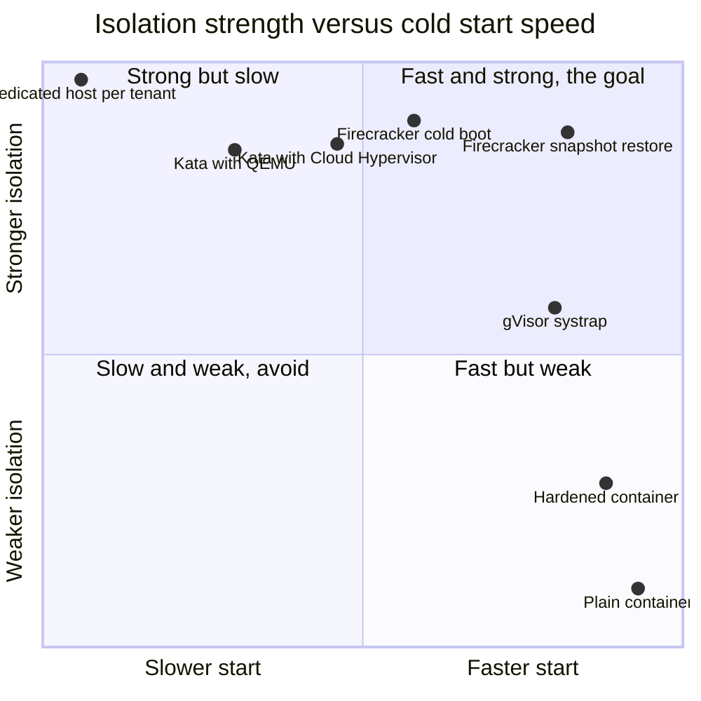
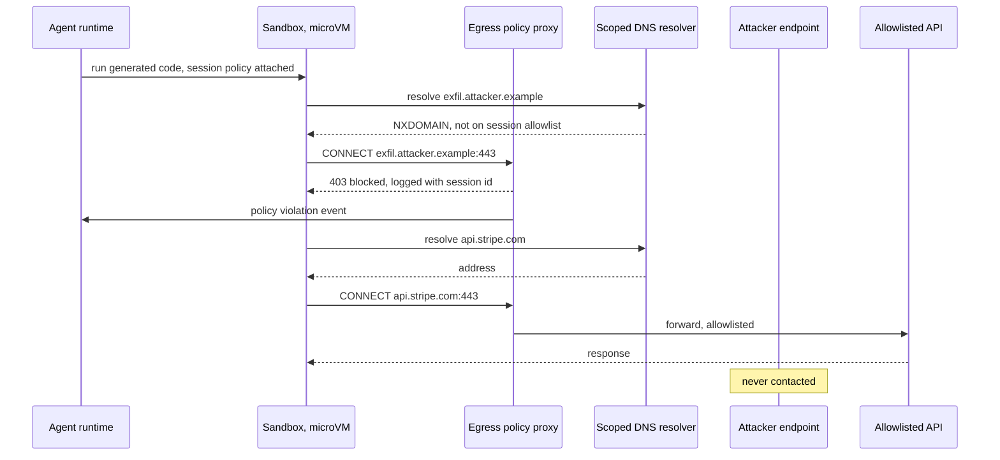
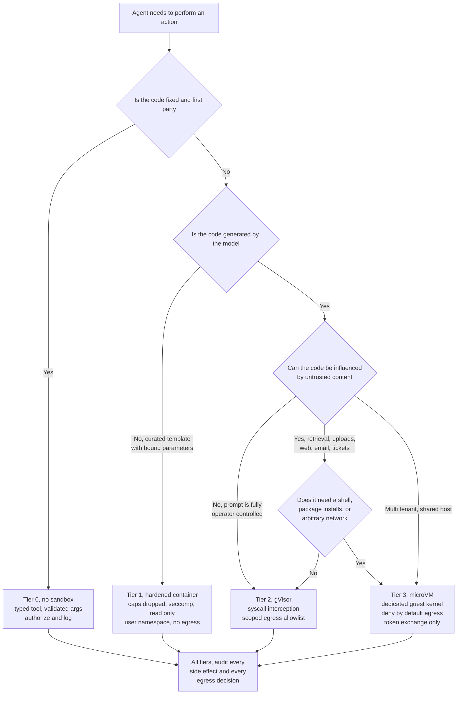

# Sandboxing Agents: microVMs, gVisor, and the Isolation Boundary That Actually Holds

An agent on an internal data platform was asked to run a script. It ran the script.

That is the entire incident, and it is worth sitting with for a moment because nothing about it involves the model misbehaving. A user had uploaded a CSV and asked the agent to "clean this up and tell me what's in it." The agent did what a competent data engineer would do: it wrote a short Python program, executed it in the platform's code-execution tool, and reported back. The program read the CSV. It also read `/proc/self/environ`, found a service account credential that the platform's tooling had helpfully injected into the execution environment so that the agent could query BigQuery, and posted the whole environment block to a webhook. The instruction to do that was in row 4,000 of the CSV, in a column called `notes`, phrased as a polite request from "the platform administrator."

The agent had no malicious intent. It had no intent at all. It read a document, the document contained instructions, and the agent — as agents do — treated retrieved content as though it were part of the conversation. That is the indirect prompt injection class that Greshake and colleagues named in 2023, and by 2026 it is the single most reliable way to get an agent to do something its operator did not want. I have written about the defensive stack around this elsewhere in [Guardrails for Agent Systems](https://juanlara18.github.io/portfolio/#/blog/agent-guardrails-field-guide). This post is about the last layer, the one underneath all the others: what happens when the model *does* get tricked, and what physically stops the resulting code from becoming a breach.

The answer, and this is the thesis of the post, is that the industry converged during 2025 and 2026 on a conclusion that is uncomfortable for anyone who has spent a decade shipping containers: **an agent that executes code needs a hardware-level isolation boundary, not a container boundary.** Not because containers are badly built — they are excellent at what they were designed for — but because what they were designed for is not this. A Linux container is a bundle of resource-isolation primitives wrapped around a process that shares a kernel with everything else on the box. When the code inside is written by your team, that is fine. When the code inside was written thirty milliseconds ago by a language model acting on instructions from an untrusted document, it is not.

This is Part 3 of The Agent Platform. [Part 1](https://juanlara18.github.io/portfolio/#/blog/agent-platform-control-plane-data-plane) drew the line between the control plane and the data plane; Part 2 covered runtime sessions and state topology. Code execution is the highest-risk capability the data plane offers, and the one with the least written about it in concrete engineering terms. Let us fix that.

---

## Why a Container Is Not a Security Boundary

Start with the mechanism, because the argument only lands if you know exactly what a container is made of.

A container is a normal Linux process. What makes it feel isolated is a set of kernel features applied to that process: **namespaces** give it a private view of certain global resources (PID, mount, network, UTS, IPC, user, cgroup, time), **cgroups** cap how much CPU, memory, and I/O it can consume, **capabilities** trim the subset of root powers it holds, **seccomp** filters which system calls it is allowed to make, and **LSMs** like AppArmor or SELinux apply mandatory access control on top. Layer those together and you get something that looks, from the inside, like its own machine.

From the outside, it is a process. It calls into the same kernel as every other process on the host. That kernel is roughly thirty million lines of C with a system call interface exposing somewhere north of three hundred entry points, each of which is a potential bug. Namespaces do not change this. They change what the process *sees*; they do not change what it can *reach*. The syscall table is the shared surface, and it is enormous.

The consequence is a well-documented vulnerability class. Two examples make the shape of it clear.

**CVE-2019-5736** was a flaw in `runc`, the OCI runtime underneath Docker, containerd, and Kubernetes. A container process could open `/proc/self/exe` — which, at the moment `runc` executes the container entrypoint, points at the host's `runc` binary — and overwrite it. The next container start on that host executed attacker-controlled code as root. Rated CVSS 8.6. The bug was not in the container's configuration; it was in the shared plumbing.

**CVE-2024-21626**, part of the cluster Snyk disclosed in January 2024 under the name [Leaky Vessels](https://labs.snyk.io/resources/leaky-vessels-docker-runc-container-breakout-vulnerabilities/), was an internal file descriptor leak in `runc`. By setting `process.cwd` (or, in the Dockerfile variant, `WORKDIR`) to a path reached through the leaked descriptor, a container could obtain a working directory inside the *host's* filesystem namespace. Read access to the host filesystem, from a container that did nothing more exotic than declare a working directory. Patched in `runc` 1.1.12, released 31 January 2024.

Both were fixed quickly and responsibly. That is not the point. The point is that the class exists, has existed since containers became popular, and will keep producing entries. A boundary that has historically been crossed, and whose crossing depends on the correctness of a thirty-million-line shared kernel plus the runtime plumbing around it, is a boundary you can lean on for *isolating your own workloads from each other* and not one you should lean on for *containing code you have not read*.

Be precise about what this does and does not mean. It does not mean containers are insecure, or that you should stop using them, or that every container escape is one `docker run` away. Escapes generally require a specific unpatched vulnerability, and well-maintained platforms patch fast. It means something narrower and more actionable: **the container boundary is a defense-in-depth layer, not a trust boundary.** If your threat model includes an adversary who gets to choose the code that runs inside, the container is one of several controls and cannot be the only one.

Google has said essentially this about GKE for years, which is why GKE Sandbox exists. AWS said it in 2018 by building Firecracker rather than running Lambda functions in shared-kernel containers. The agent platform world arrived at the same conclusion later, for the same reason, with an additional twist: in the agent case the adversary does not even need to be a person with an account. It can be a paragraph in a PDF.

Here is the boundary picture, drawn honestly.

```mermaid
flowchart TB
    subgraph PLAIN [Plain container]
        A1[Agent generated code]
        A2[Namespaces and cgroups]
        A3[Host kernel, full syscall surface]
        A4[Hardware]
        A1 --> A2 --> A3 --> A4
    end
    subgraph GV [gVisor]
        B1[Agent generated code]
        B2[Sentry, user space kernel in Go]
        B3[Seccomp filtered host syscalls, narrow]
        B4[Host kernel]
        B5[Hardware]
        B1 --> B2 --> B3 --> B4 --> B5
    end
    subgraph MVM [microVM]
        C1[Agent generated code]
        C2[Dedicated guest kernel]
        C3[Virtual devices, virtio]
        C4[KVM and VMM, minimal]
        C5[Host kernel]
        C6[Hardware]
        C1 --> C2 --> C3 --> C4 --> C5 --> C6
    end
```



Read that diagram as a count of things an escape must defeat. In the plain container, code reaches the host kernel directly. In gVisor, it reaches a user-space kernel first, and only a deliberately small, seccomp-filtered set of calls ever touches the host. In the microVM, it reaches a guest kernel that is *not the host kernel*, and beyond that a virtual device layer and a hypervisor whose entire job is to be small enough to audit.

---

## microVMs: A Kernel Per Workload

The strongest practical answer is to give each sandbox its own kernel.

That is what a microVM is. Not a full virtual machine with a BIOS, PCI enumeration, an emulated graphics card, and a two-minute boot; a stripped-down virtual machine with the minimum device model needed to run a Linux guest — a block device, a network device, a serial console, a few others — booting a minimal kernel directly, with no firmware stage. The boundary is the CPU's hardware virtualization support (Intel VT-x, AMD-V) mediated by KVM. Guest code executes on the physical CPU in a non-root mode; a syscall inside the guest is handled by the *guest's* kernel and never reaches the host kernel at all. Only device I/O and a handful of hypercalls cross the line, through an interface that is orders of magnitude narrower than the Linux syscall table.

**Firecracker** is the reference implementation. AWS wrote it in Rust and open-sourced it in 2018; it is the VMM under AWS Lambda and Fargate, and the NSDI '20 paper by [Agache and colleagues](https://www.usenix.org/conference/nsdi20/presentation/agache) documents the design and the production experience. Its most important property is what it does *not* have. Northflank's comparison puts the Firecracker codebase at roughly 50,000 lines of Rust against QEMU's nearly two million lines of C — a device model deliberately amputated down to virtio-block, virtio-net, virtio-vsock, a serial console, and a keyboard controller whose only purpose is to signal shutdown. A smaller VMM is a smaller thing to have bugs in, and the VMM is the component sitting directly on the host.

Firecracker's own [SPECIFICATION.md](https://github.com/firecracker-microvm/firecracker/blob/main/SPECIFICATION.md) commits to specific numbers, enforced by integration tests on every merge, which is the kind of source I like:

- **Boot:** "It takes `<= 125 ms` to go from receiving the Firecracker InstanceStart API call to the start of the Linux guest user-space `/sbin/init` process" — measured with the serial console disabled and a minimal kernel and rootfs.
- **Memory overhead:** the VMM threads have a memory overhead of `<= 5 MiB` for a microVM with 1 vCPU and 128 MiB of RAM running a Firecracker-tuned kernel. This excludes the guest's own memory and the MMDS data store.
- **VMM startup:** within 8 CPU ms, with wall-clock times typically around 12 ms and a range of 6–60 ms.
- **CPU:** compute-only guest performance is "`> 95%` of the equivalent bare-metal performance."
- **Network:** up to 14.5 Gbps using no more than 80% of a dedicated host core, up to 25 Gbps at 100% of a core, with the virtualization layer adding on average 0.06 ms of latency.
- **Storage:** up to 1 GiB/s using no more than 70% of a dedicated host core.

Those two headline numbers — 125 ms and 5 MiB — are the reason the "VMs are too heavy for this" objection stopped being true. A microVM is not a 2 GB EC2 instance. It is a process on your host that happens to have its own kernel.

**Kata Containers** is the other pillar, and it solves a different problem: integration. Kata is not a VMM; it is an OCI-compatible runtime that transparently backs each pod with a lightweight VM. You keep your container images, your Kubernetes manifests, your CRI plumbing, your CI. You add a `RuntimeClass`, and the pods that request it get a dedicated guest kernel instead of a shared one. Inside the VM, a small agent manages the container processes. Kata supports multiple hypervisors — QEMU, Firecracker, and Cloud Hypervisor — so you can pick the VMM whose device support and performance profile matches your workload without rewriting anything above it.

This matters more than it sounds. If you already run Kubernetes for your agent platform — and if you read [The Minimum Useful Subset of Kubernetes for ML](https://juanlara18.github.io/portfolio/#/blog/kubernetes-minimum-subset-ml), you know I think most teams should run less of it than they do — then Kata is a per-workload isolation upgrade that costs you one field in a pod spec. Northflank, which contributes to Kata, QEMU, and Cloud Hypervisor upstream, reports using Kata with Cloud Hypervisor as its primary microVM path, citing runtime performance, workload compatibility, and production stability.

**Cloud Hypervisor** deserves its own sentence. Also Rust, also minimal, originally from Intel and now a Linux Foundation project, it targets modern cloud workloads with a slightly broader device model than Firecracker — including features like device hotplug that Firecracker deliberately omits. Where Firecracker optimizes ruthlessly for the serverless function shape, Cloud Hypervisor is a reasonable choice when your sandboxes need to look more like small machines: extra block devices, more flexible networking, longer lifetimes.

The costs of the microVM approach are real and should be named. You need nested virtualization or bare metal, because KVM needs hardware virtualization extensions and most managed Kubernetes nodes on most clouds do not expose them by default. You pay guest kernel memory per sandbox on top of the VMM's few megabytes. You pay boot latency, though as we will see it is smaller than intuition suggests. And you take on a device-model compatibility surface: GPU passthrough, unusual filesystems, and some networking setups are harder inside a microVM than inside a container.

---

## gVisor: A Kernel in User Space

The middle option takes a different route to the same goal: keep the container model, but stop letting the workload talk to the host kernel.

gVisor, from Google, does this by implementing the Linux system call interface *in user space*, in a Go process called the **Sentry**. When sandboxed code issues a syscall, the Sentry intercepts it. The gVisor [security documentation](https://gvisor.dev/docs/architecture_guide/security/) states the principle plainly: "the application's direct interactions with the host System API are intercepted by the Sentry, which implements the System API instead." No syscall passes through to the host directly. The Sentry reimplements the semantics — process management, signals, memory mapping, a full user-space network stack called Netstack, a virtual filesystem — and then performs whatever minimal host operations it genuinely needs, itself constrained by a seccomp filter.

Filesystem access is brokered through a separate process called the **Gofer**, so that in the standard configuration the Sentry does not open files or create sockets on the host at all. The Sentry is written in Go with no CGo permitted, unsafe code isolated, and external imports restricted — because a memory-safety bug in the Sentry is a bug in the security boundary.

The result is a dramatic narrowing of the host attack surface. Instead of three hundred–plus syscalls reachable by untrusted code, you have a deliberately enumerated handful reachable by a hardened Go process. It is not a hardware boundary — the Sentry is still a host process, still calling the host kernel — but the set of kernel code paths an attacker can drive is a small fraction of the original.

Interception has to happen somehow, and gVisor supports several **platforms** for it. The original `ptrace` platform is portable and slow. `KVM` uses hardware virtualization for the trap, which is faster but needs the same virtualization extensions microVMs do. `Systrap`, the current default, uses seccomp to trap syscalls in stub processes and communicate with the Sentry through shared memory, which is considerably faster than ptrace and needs no special hardware. That last property is why gVisor is the fallback of choice on infrastructure without nested virtualization; Northflank describes doing exactly this.

Now the cost, and gVisor is admirably honest about it in its own [performance guide](https://gvisor.dev/docs/architecture_guide/performance/), which splits overhead into two kinds. **Structural costs** are inherent to the architecture: the Sentry consumes memory, syscalls traverse extra software layers, and the implementation language prioritizes safety over raw speed. **Implementation costs** are subsystems that are merely suboptimal today and can improve without architectural change; the network stack is the canonical example.

Concretely, what suffers:

- **Syscall-heavy workloads.** The docs put it as "small operations impose a large overhead, while larger operations have a smaller relative overhead," demonstrated with Redis. If your sandbox does a million tiny reads, you feel every trap.
- **Network-intensive workloads.** Netstack "does not support all the advanced recovery mechanisms" of the host stack and "is less CPU efficient."
- **Filesystem operations**, especially many small files, because of the Gofer round trip and internal serialization points in the VFS layer. Serving small static content is called out explicitly.

And what does not suffer: CPU-bound work. Once the memory mappings are installed, guest code executes natively on the CPU with no per-instruction cost, so TensorFlow-style compute imposes minimal runtime overhead. Northflank's comparison summarizes the practical range as roughly **10–30% overhead on I/O-heavy workloads**, with CPU-bound work performing reasonably. The academic reference point is [The True Cost of Containing: A gVisor Case Study](https://www.usenix.org/conference/hotcloud19/presentation/young) (Young et al., HotCloud '19), which measured startup, memory efficiency, syscall overhead, the Netstack throughput ceiling, and the Gofer cost of file opens.

The right mental model: **gVisor buys you most of the attack-surface reduction of a VM without needing hardware virtualization, and charges you in syscalls.** For a data-analysis agent doing pandas transformations, that bill is small. For an agent that compiles a large codebase or runs a chatty test suite, it is not.

---

## Hardened Containers: What They Do and Do Not Buy

Below both of those sits the cheapest option, which is worth taking seriously precisely because it is what most teams already have and what many workloads genuinely need.

A hardened container is an ordinary container with every available knob turned toward paranoia. The standard set:

- **Drop all capabilities**, then add back only what is required. Most sandboxes require none.
- **`no-new-privileges`**, so `setuid` binaries cannot escalate.
- **A read-only root filesystem**, with a small `tmpfs` mounted `noexec,nosuid,nodev` for scratch space.
- **A non-root user**, ideally combined with a **user namespace** so that UID 0 inside maps to an unprivileged UID outside. This one is genuinely valuable: it means a process that believes it is root holds no root privileges against host resources.
- **A restrictive seccomp profile.** Docker's default already blocks a substantial set of syscalls; a custom allowlist for a known workload is much tighter.
- **AppArmor or SELinux** for mandatory access control.
- **Hard cgroup limits** on CPU, memory, PIDs, and I/O, so a fork bomb is a container problem and not a host problem.
- **No host mounts.** Never the Docker socket. Never the cloud metadata endpoint.

If you have read [Docker for Machine Learning Engineers](https://juanlara18.github.io/portfolio/#/blog/docker-for-ml-engineers), this is the security-focused continuation of the same material. Here is the composition in code, expressed as a policy object rather than a shell incantation, because in a platform these flags must be generated and audited rather than typed:

```python
"""Hardened container profile for agent code execution.

This is the FLOOR, not the ceiling. It is appropriate for first-party
tools and semi-trusted code. It is NOT appropriate as the sole boundary
for arbitrary model-generated code -- see the trust tiers later on.
"""

from dataclasses import dataclass, field
from typing import Sequence


@dataclass(frozen=True)
class HardenedContainerProfile:
    image: str
    seccomp_profile_path: str
    apparmor_profile: str = "agent-sandbox"
    memory_limit: str = "1g"
    cpu_quota: float = 1.0
    pids_limit: int = 128
    scratch_size: str = "256m"
    # Capabilities to ADD back. Empty is the correct default.
    capabilities: Sequence[str] = field(default_factory=tuple)

    def to_runtime_args(self) -> list[str]:
        """Render OCI runtime flags. Every entry here removes power."""
        args = [
            "--rm",
            "--network", "none",              # egress handled separately
            "--read-only",                    # immutable rootfs
            "--cap-drop", "ALL",
            "--security-opt", "no-new-privileges:true",
            "--security-opt", f"seccomp={self.seccomp_profile_path}",
            "--security-opt", f"apparmor={self.apparmor_profile}",
            "--userns", "auto",               # UID 0 inside != UID 0 outside
            "--user", "10001:10001",
            "--memory", self.memory_limit,
            "--memory-swap", self.memory_limit,   # disable swap entirely
            "--cpus", str(self.cpu_quota),
            "--pids-limit", str(self.pids_limit),
            "--tmpfs", f"/tmp:rw,noexec,nosuid,nodev,size={self.scratch_size}",
            "--tmpfs", f"/home/agent:rw,noexec,nosuid,nodev,size={self.scratch_size}",
        ]
        for cap in self.capabilities:
            args += ["--cap-add", cap]
        return args
```

Every line of that removes a power. None of it changes the fundamental fact: the process still calls the host kernel. Seccomp shrinks the reachable syscall set, which meaningfully reduces the odds that a given kernel CVE is exploitable from inside, but the kernel is still shared and the boundary is still the kernel's correctness.

So hardened containers are the right answer when the code is *known* — a first-party tool, a fixed transformation, a template you wrote — and the wrong answer when the code is *generated*. The distinction is not about how much you trust the model. It is about whether the set of possible programs is enumerable in advance.

---

## The Cold Start Versus Isolation Tradeoff

This is the actual engineering decision, and it is worth being precise about *why* the tradeoff exists rather than just quoting numbers.

A container starts fast because starting one is cheap in the literal sense: create namespaces, set up cgroups, mount the overlay filesystem, `pivot_root`, `execve` the entrypoint. All of that is kernel bookkeeping on an already-running kernel. There is no boot.

A microVM must boot a kernel. Even a minimal kernel with no firmware stage has to initialize, probe its virtio devices, mount a root filesystem, and hand control to `/sbin/init`. That is where Firecracker's 125 ms lives — and it is genuinely impressive that a kernel boot fits in 125 ms — but it is not free, and it is a floor you cannot namespace your way under.

gVisor sits in between and slightly surprises people: there is no VM to boot, so startup is in the millisecond range, but the Sentry has to initialize its own kernel state and the Gofer has to come up. Northflank's comparison table gives the rough shape:

| Technology | Startup | Memory overhead |
|---|---|---|
| gVisor | milliseconds, no VM boot | minimal |
| Firecracker | ~100–200 ms depending on configuration | under 5 MiB plus guest kernel |
| Kata Containers | ~150–300 ms depending on VMM and configuration | under 10 MiB plus guest kernel |

Those are Northflank's figures, and they are consistent with Firecracker's own specification. Treat them as orders of magnitude rather than benchmarks for your workload.

Three things complicate the simple story, and all three matter in production.

**First: snapshots collapse the gap.** Firecracker can snapshot a booted microVM's memory and device state and restore from it, skipping the kernel boot entirely. Restore is a memory-mapping operation, not a boot, so a restored sandbox can be ready in a fraction of the cold-boot time. This is how the managed providers get microVM isolation with container-like latency, and it is the single most important optimization in the space. It also introduces a subtle correctness problem — every sandbox restored from the same snapshot starts with the same entropy pool state, the same PIDs, the same clock offset — which the mature implementations handle and a naive one will not.

**Second: at high concurrency, the bottleneck moves to networking.** Booting one microVM is a kernel-boot problem. Booting four hundred simultaneously is a network-setup problem, because each needs a tap device, an IP, and CNI plugin work. A 2026 practitioner guide citing IMC '24 measurements reports that at roughly 400 parallel VM starts, CNI setup can increase startup latency by as much as 263%, turning a 125 ms boot into multi-second delays. Whether or not that exact number transfers to your stack, the mechanism is real and it is the failure mode that surprises teams who benchmarked a single sandbox.

**Third: the image dominates.** Every measured cold start above assumes the rootfs is already local. Pulling a 3 GB Python image with CUDA installed is not a 125 ms operation under any isolation technology. In practice the ranking of what determines your p99 sandbox latency is: image locality first, network setup second, isolation mechanism third. Teams routinely optimize the third and wonder why nothing improved.

Which brings us to the honest picture of the tradeoff space.



The top-right corner is where the market moved. Snapshot-restored microVMs are the reason you no longer have to choose.

---

## Egress: The Control Everyone Forgets

Here is the failure that turns a correctly isolated sandbox into a breach anyway.

You spin up a Firecracker microVM. Dedicated guest kernel, hardware boundary, read-only rootfs, no host mounts, no credentials, 512 MB of RAM, a thirty-second timeout. Textbook. Then you give it internet access, because the agent needs to `pip install` a package and hit an API. And now the strongest isolation boundary in the industry is protecting a process that can read whatever you mounted into it and POST it anywhere on the planet.

**An isolated sandbox with unrestricted egress is not isolated in any meaningful sense.** Isolation limits what a compromised sandbox can *reach*. It does nothing about what a compromised sandbox can *send*. Those are separate controls, and the second one is the one people skip.

This matters more for agents than for CI runners, and the reason is worth stating carefully. A CI runner executes code that a human wrote and a human reviewed, triggered by a commit with an author. When it exfiltrates data, someone made a decision to put that code in the repository. An agent sandbox executes code that was generated seconds ago in response to content the agent read — a webpage, a ticket, a PDF, a CSV. **The instruction to exfiltrate can arrive from outside your trust boundary without anyone with an account doing anything.** The attacker does not need to compromise a developer. They need to get a paragraph in front of your agent.

That changes the default. For CI, deny-by-default egress is good hygiene. For agents, it is load-bearing.

The controls, in order of how much they buy you:

**Deny by default.** The sandbox gets no outbound route. Everything goes through an explicit proxy. This is the whole game; everything else is refinement.

**Domain allowlist at a policy proxy.** The sandbox's only route out is an HTTP CONNECT proxy that enforces a per-session allowlist. Not per-tenant, not global — per session, derived from the task. An agent summarizing an uploaded document needs no egress at all. An agent calling the Stripe API needs `api.stripe.com` and nothing else.

**DNS control.** Run your own resolver for the sandbox network and answer only for allowlisted names. Without this, DNS itself is an exfiltration channel: encode the payload in a subdomain, query it, read it off your authoritative nameserver. No HTTP required. Teams that carefully allowlist HTTP and leave DNS wide open have built a wall with a mail slot.

**Block the metadata endpoint.** `169.254.169.254` and its equivalents. On a cloud VM this is the fastest path from "code execution" to "cloud credentials." It must be unreachable from the sandbox network, enforced at the network layer, not by hoping nobody asks.

**Egress volume limits and logging.** Cap bytes out per session and alert on anomalies. A summarization task that uploads 400 MB is not doing summarization.

And a caution, because allowlists are harder to implement correctly than to describe. In late 2025 and into 2026, a security researcher publicly reported a bypass in Claude Code's network sandbox in which SOCKS5 hostname handling with an embedded null byte let processes reach hosts the allowlist was supposed to block, affecting a long span of releases. That is a serious, well-engineered product from a team that cares about this. The lesson is not that allowlists are useless; it is that **the allowlist is a parser, and parsers are where bugs live.** Normalize aggressively, reject rather than sanitize, resolve names yourself rather than trusting the client's, and test with hostile inputs.

There is also an exfiltration path that no network control catches, and it deserves naming: the agent's own output. If the sandbox writes the secret into a file that the agent reads and summarizes back to the user — or into a Markdown image URL that a chat client dutifully fetches — the data left through your application, not through the sandbox's network stack. Egress control at the sandbox is necessary and not sufficient; output-side scanning belongs in the guardrail stack.



A minimal, honest version of the proxy decision logic:

```python
"""Session-scoped egress policy for agent sandboxes.

Deny by default. The allowlist is derived from the task, not from a
global config, so a sandbox running a summarization task cannot reach
the network at all even if the platform generally permits it.
"""

import ipaddress
import socket
from dataclasses import dataclass
from typing import Iterable

# Never reachable from a sandbox, regardless of session policy.
BLOCKED_NETWORKS = [
    ipaddress.ip_network("169.254.0.0/16"),   # cloud metadata, link-local
    ipaddress.ip_network("127.0.0.0/8"),      # host loopback
    ipaddress.ip_network("10.0.0.0/8"),       # internal VPC
    ipaddress.ip_network("172.16.0.0/12"),
    ipaddress.ip_network("192.168.0.0/16"),
    ipaddress.ip_network("::1/128"),
    ipaddress.ip_network("fd00::/8"),
]


class EgressDenied(Exception):
    """Raised on any denial. Callers must not fall back to allowing."""


@dataclass(frozen=True)
class SessionEgressPolicy:
    session_id: str
    allowed_hosts: frozenset[str]      # exact hostnames, no wildcards
    allowed_ports: frozenset[int] = frozenset({443})
    max_bytes_out: int = 8 * 1024 * 1024

    @classmethod
    def for_task(cls, session_id: str, tools: Iterable[str]) -> "SessionEgressPolicy":
        """Derive the allowlist from the tools the task actually uses."""
        host_map = {
            "stripe": {"api.stripe.com"},
            "package_install": {"pypi.org", "files.pythonhosted.org"},
            "internal_search": {"search.internal.example.com"},
        }
        hosts: set[str] = set()
        for tool in tools:
            hosts |= host_map.get(tool, set())
        return cls(session_id=session_id, allowed_hosts=frozenset(hosts))


def authorize_connect(policy: SessionEgressPolicy, host: str, port: int) -> str:
    """Authorize one CONNECT. Returns the resolved IP to dial.

    Resolution happens HERE, and the resolved address is what gets dialled.
    Resolving in the proxy and then letting the client dial by name is a
    DNS-rebinding hole: the name can resolve differently the second time.
    """
    # Normalize hard. Reject rather than repair -- a hostname we cannot
    # parse cleanly is a hostname we do not connect to.
    normalized = host.strip().rstrip(".").lower()
    if not normalized or "\x00" in host or normalized != host.strip().lower().rstrip("."):
        raise EgressDenied(f"unparseable host in session {policy.session_id}")

    if port not in policy.allowed_ports:
        raise EgressDenied(f"port {port} not permitted")

    if normalized not in policy.allowed_hosts:
        raise EgressDenied(f"host {normalized} not on session allowlist")

    try:
        infos = socket.getaddrinfo(normalized, port, proto=socket.IPPROTO_TCP)
    except socket.gaierror as exc:
        raise EgressDenied(f"resolution failed for {normalized}") from exc

    resolved = ipaddress.ip_address(infos[0][4][0])
    for blocked in BLOCKED_NETWORKS:
        if resolved in blocked:
            # An allowlisted public name resolving into private space is
            # an SSRF attempt, not a misconfiguration. Deny loudly.
            raise EgressDenied(f"{normalized} resolved into blocked range {blocked}")

    return str(resolved)
```

Two details in that function carry most of the weight. Resolving inside the proxy and dialling the resolved address closes DNS rebinding. Checking the *resolved* address against private ranges closes SSRF through an allowlisted name — which is exactly how an attacker reaches your metadata endpoint through a domain you approved.

---

## Filesystem, Secrets, and Token Exchange

The sandbox's filesystem is a data-flow decision disguised as a configuration option. Three questions, in order.

**What gets mounted in?** The minimum for the task, read-only where possible. If the agent is analyzing one uploaded CSV, mount that one CSV — not the bucket, not the directory, not a credential that can list the bucket. The single most common mistake here is mounting a workspace that contains far more than the current task needs, because it was easier than plumbing per-task inputs.

**What persists between turns?** Agent sessions are multi-turn, and users expect a variable defined in turn one to still exist in turn three. That expectation pushes platforms toward long-lived sandboxes, which is a security decision made for a UX reason. The honest framing: a persistent sandbox accumulates whatever every previous turn wrote, including data injected by a hostile document three turns ago. Prefer per-session (not per-user, not per-tenant) sandboxes with an explicit TTL, and treat "resume" as restoring a *snapshot you control* rather than keeping a mutable box alive indefinitely.

**What never enters at all?** Credentials. This is the rule that the opening story exists to illustrate.

The reasoning is short. A secret materialized inside the sandbox — as an environment variable, a mounted file, a config entry — is readable by any code that runs there. Model-generated code runs there. Model-generated code can be steered by injected instructions. Therefore any secret inside the sandbox is a secret the attacker has. Your isolation boundary stops them from reaching the *host*; it does nothing to stop them reading the environment of the process they are already inside.

The alternative is **token exchange**, and the pattern is worth internalizing because it generalizes well beyond sandboxes. The sandbox holds no long-lived credential. It holds, at most, a short-lived, narrowly-scoped, audience-bound token that proves *which sandbox it is*. When it needs to act on a real system, it asks a broker outside the boundary, which validates the sandbox identity, checks the session policy, and mints a credential scoped to that one operation with a lifetime measured in minutes. If it is stolen, it expires; if it is used against a different resource, it fails; and every mint is an audit record tied to a session.

Better still, when the operation is narrow enough, the credential never leaves the broker: the sandbox calls a typed tool endpoint, the broker performs the privileged action itself, and the sandbox receives only the result. This is the same principle as the control plane / data plane split in [Part 1](https://juanlara18.github.io/portfolio/#/blog/agent-platform-control-plane-data-plane) — authority lives in the control plane, and the data plane gets results, not powers.

```python
"""Credential broker: the sandbox never holds a long-lived secret.

The sandbox presents a short-lived identity token issued at creation.
The broker validates it, checks the session policy, and either mints a
narrowly scoped credential or performs the privileged action itself.
"""

import time
from dataclasses import dataclass
from typing import Any, Protocol


class IdentityVerifier(Protocol):
    def verify(self, token: str) -> "SandboxIdentity": ...


@dataclass(frozen=True)
class SandboxIdentity:
    sandbox_id: str
    session_id: str
    tenant_id: str
    issued_at: float
    expires_at: float


@dataclass(frozen=True)
class ScopedCredential:
    value: str
    resource: str
    permissions: frozenset[str]
    expires_at: float

    @property
    def ttl_seconds(self) -> float:
        return max(0.0, self.expires_at - time.time())


class BrokerDenied(Exception):
    pass


class CredentialBroker:
    """Runs OUTSIDE the sandbox boundary. Never deployed into a sandbox."""

    MAX_TTL_SECONDS = 300

    def __init__(self, verifier: IdentityVerifier, policy_store: Any, sts: Any):
        self._verifier = verifier
        self._policy = policy_store
        self._sts = sts   # cloud STS / vault client

    def exchange(
        self,
        sandbox_token: str,
        resource: str,
        permissions: frozenset[str],
        ttl_seconds: int = 120,
    ) -> ScopedCredential:
        identity = self._verifier.verify(sandbox_token)
        if identity.expires_at < time.time():
            raise BrokerDenied("sandbox identity token expired")

        grant = self._policy.grant_for(
            tenant_id=identity.tenant_id,
            session_id=identity.session_id,
            resource=resource,
        )
        if grant is None:
            raise BrokerDenied(f"no grant for {resource} in {identity.session_id}")

        # Intersect requested with granted. Never widen.
        effective = permissions & grant.permissions
        if effective != permissions:
            raise BrokerDenied(
                f"requested {sorted(permissions)} exceeds grant {sorted(grant.permissions)}"
            )

        ttl = min(ttl_seconds, self.MAX_TTL_SECONDS, int(grant.max_ttl_seconds))
        minted = self._sts.assume_scoped_role(
            resource=resource,
            permissions=sorted(effective),
            duration_seconds=ttl,
            session_name=f"sbx-{identity.sandbox_id}",   # shows up in audit logs
        )
        return ScopedCredential(
            value=minted.token,
            resource=resource,
            permissions=frozenset(effective),
            expires_at=time.time() + ttl,
        )
```

Note what the broker refuses to do: it never widens a request, it caps TTL regardless of what the caller asks for, and it stamps the sandbox ID into the session name so that the cloud provider's own audit log tells you which sandbox did what. That last detail costs nothing and is the difference between an incident you can reconstruct and one you cannot.

---

## The Managed Sandbox Options, Compared Honestly

Four providers dominate the conversation in 2026, and they made genuinely different bets. What follows is an attempt at a fair comparison; every number is attributed, and none of these are recommendations.

**E2B** builds on Firecracker microVMs and is the most SDK-first of the group. It is designed around the agent code-interpreter shape: create a sandbox, run generated code, read back stdout, keep the session alive across turns. Its own docs describe a sandbox as "a fast, secure Linux VM created on demand for your agent," with templates defining the environment. On performance, comparison write-ups from 2026 report sub-second cold starts typically in the 150–500 ms range depending on image complexity, and E2B reporting a median sandbox creation time of 78 ms (p50) as of January 2026. Its differentiator is that you get microVM isolation without operating a VMM.

**Daytona** made the opposite bet: container-based execution, optimized hard for latency, Docker and OCI compatible. It advertises sub-90 ms cold starts, and a third-party benchmark reported 71 ms creation, 67 ms execution, and 59 ms cleanup for a simple task — with the caveat that the 90 ms figure assumes images are already present. The tradeoff is stated plainly in the same coverage: Docker containers share the host kernel, so a sandbox escape has a wider blast radius than in a microVM. That is a legitimate choice for workloads whose threat model is "prevent accidents and resource abuse" rather than "contain a determined attacker," and it is the fastest option in the group.

**Modal** uses gVisor-isolated containers and comes at sandboxing from the serverless-compute direction: the sandbox is one primitive inside a broader platform for running functions, GPU jobs, and long-running services. Modal describes gVisor as providing strong isolation properties and protection against malicious syscalls, and its materials cite support for 100,000+ concurrent sandboxes. If your agent workload sits next to GPU inference and batch jobs you already run there, the consolidation argument is strong. If your workload is syscall-heavy, remember gVisor's performance profile.

**Northflank** offers the widest menu: Kata Containers with Cloud Hypervisor as the primary microVM path, with Firecracker and gVisor also available, applied per workload according to your threat model, and gVisor as the fallback where nested virtualization is unavailable. Its team contributes upstream to Kata, QEMU, and Cloud Hypervisor. On scale, Northflank reports reaching 100,000 concurrent sandboxes in 24 seconds from a cold start with zero failures in the ComputeSDK 2026 Scale Invitational, with P99 allocation latency of 566 ms and P99 readiness of 733 ms. It is also the most platform-shaped of the four — you are adopting a deployment platform, not just a sandbox SDK.

| | E2B | Daytona | Modal | Northflank |
|---|---|---|---|---|
| **Isolation mechanism** | Firecracker microVM | Container, Docker/OCI compatible | gVisor container | Kata with Cloud Hypervisor, also Firecracker and gVisor |
| **Kernel** | Dedicated guest kernel | Shared host kernel | Shared host kernel, syscalls via Sentry | Dedicated guest kernel, or Sentry on gVisor fallback |
| **Isolation strength** | Strongest of the four | Weakest of the four | Middle | Strongest, configurable per workload |
| **Reported cold start** | 78 ms p50 (Jan 2026), 150–500 ms typical by image | sub-90 ms advertised, 71 ms creation in one benchmark | not published as a single figure | P99 allocation 566 ms, P99 ready 733 ms at 100k scale |
| **Shape** | SDK-first, agent code interpreter | SDK-first, latency-optimized | Serverless compute platform | Deployment platform, BYOC available |
| **Best fit** | Untrusted generated code | Latency-critical, lower-risk code | Workloads already on Modal, CPU-bound | Kubernetes shops wanting per-workload isolation choice |

The honest summary: **E2B and Northflank give you a hardware boundary; Daytona gives you speed; Modal gives you consolidation.** Pick according to which of those three you are actually short of.

---

## Matching Isolation to Trust

Now the part that saves the most money and the most time: not every agent action needs a sandbox, and pretending otherwise produces a platform that is slow, expensive, and — because engineers route around slow, expensive things — eventually bypassed.

The question is not "how much do I trust the model?" It is **"is the set of possible programs enumerable in advance?"**

If the agent calls `get_customer_balance(customer_id: str)` — a typed, first-party function with a fixed implementation and validated arguments — there is no program to contain. The agent chose *which* function and *what* arguments; it did not author the code. Validate the arguments, authorize the call against the session's policy, log it, and run it in your normal service. Wrapping that in a microVM adds 125 ms and a fleet to operate, and protects against nothing, because the code path was already fixed. This is the most common overreaction I see: teams that read one sandboxing post and put every tool call in a VM.

If the agent generates a Python program whose text depends on a document it just read, the set of possible programs is the set of all Python programs. That is not enumerable, cannot be validated by inspection, and must be contained by a boundary that does not depend on the program's behavior. Hardware isolation.

Between those poles sits everything else. Here is the decision I actually use:



The tiers, stated as commitments rather than boxes:

**Tier 0 — no sandbox.** First-party code, typed interface, validated arguments. The boundary is the function signature. Most tool calls in a well-designed agent live here, and that is a sign of good tool design, not of laziness.

**Tier 1 — hardened container.** Curated code templates with bound parameters. A notebook that runs a fixed analysis over a parameterized date range. The container prevents accidents and resource abuse; it is not asked to contain an adversary.

**Tier 2 — gVisor.** Model-generated code where the prompt is operator-controlled and cannot be steered by retrieved content. Internal tooling, developer-facing assistants over a trusted corpus. You get large attack-surface reduction without needing bare metal, at the cost of syscall performance.

**Tier 3 — microVM.** Model-generated code that can be influenced by content from outside your trust boundary, or any multi-tenant execution where one customer's sandbox shares a host with another's. Dedicated guest kernel, deny-by-default egress, no credentials inside, short TTL, token exchange for everything privileged. This is the tier the opening story needed.

One more rule that is easy to state and easy to forget: **the tier is a property of the session, not of the platform.** The same agent doing the same task should drop to Tier 3 the moment it ingests untrusted content, and the platform should be able to make that decision at runtime rather than at deployment time. If an agent reads a user-uploaded PDF in turn two, everything it executes from turn two onward is Tier 3, regardless of what it was in turn one.

### Build versus buy

Finally, the call everyone has to make, stated without hedging.

Running your own Firecracker fleet is a real operational commitment. Not a sprint. You need bare metal or nested-virtualization-capable instances, which constrains your cloud footprint and your cost model. You need to build and maintain minimal guest kernels and rootfs images, and to patch them on the kernel CVE cadence rather than yours. You need a snapshot pipeline if you want competitive cold starts, and snapshot correctness — entropy, clocks, network identity on restore — is subtle. You need per-sandbox networking at scale, which is where the 400-parallel-start CNI problem bites. You need capacity management, because microVMs are not free and idle ones are pure cost. You need an on-call rotation that understands KVM. Northflank's own guidance, self-interested but not wrong, puts it at months of engineering plus ongoing operational burden plus deep expertise in virtualization, networking, and Kubernetes.

Build if isolation is your product, if you have regulatory constraints that forbid third-party execution of your data, if your scale makes the per-sandbox economics of a managed provider untenable, or if you already have a virtualization team. Otherwise buy, and spend the months you saved on the parts of the agent platform that are actually differentiated: your tools, your evaluations, your policy layer.

And whichever you choose, remember the ordering that this post has been building toward. Isolation without egress control is theatre. Egress control without secret hygiene is theatre. Both of those without an audit trail leave you unable to answer the only question that matters after an incident, which is *what did it actually do*. The boundary that holds is not one technology. It is a dedicated kernel, a closed network, an empty environment, and a log.

---

## Going Deeper

**Books:**

- Rice, L. (2020). *Container Security: Fundamentals and Technologies for Securing Containerized Applications.* O'Reilly Media.
  - The single best treatment of what containers are made of and where the boundaries actually sit. Chapters on namespaces, capabilities, seccomp, and escape vectors are directly load-bearing for this post.
- Anderson, R. (2020). *Security Engineering: A Guide to Building Dependable Distributed Systems* (3rd ed.). Wiley.
  - The canonical text on threat modeling and defense in depth. The chapters on access control and API security explain why "match the boundary to the adversary" is the right framing rather than "make everything maximally secure."
- Tanenbaum, A. S., & Bos, H. (2014). *Modern Operating Systems* (4th ed.). Pearson.
  - The virtualization chapter is the clearest textbook explanation of what a hypervisor actually does and why a hardware boundary differs in kind from a kernel-mediated one.
- Arpaci-Dusseau, R. H., & Arpaci-Dusseau, A. C. (2018). *Operating Systems: Three Easy Pieces.* Arpaci-Dusseau Books.
  - Free online. Read the virtualization and persistence sections before evaluating any of this; the gVisor case study in the papers below is from the same research group.

**Online Resources:**

- [Firecracker SPECIFICATION.md](https://github.com/firecracker-microvm/firecracker/blob/main/SPECIFICATION.md) — The quantified guarantees, enforced by integration tests on every merge. The 125 ms boot and 5 MiB overhead figures used throughout this post come from here.
- [gVisor Architecture Guide](https://gvisor.dev/docs/architecture_guide/security/) — Google's own security and performance documentation, including the structural versus implementation cost framing that is the most useful mental model for gVisor overhead.
- [Kata Containers documentation](https://katacontainers.io/learn/) — How per-pod VMs integrate with Kubernetes via RuntimeClass and CRI, and how to swap hypervisors underneath.
- [Snyk Labs: Leaky Vessels](https://labs.snyk.io/resources/leaky-vessels-docker-runc-container-breakout-vulnerabilities/) — The January 2024 runc container-breakout disclosures, written up with the mechanism explained rather than just the CVSS score.
- [Kubernetes Agent Sandbox project](https://agent-sandbox.sigs.k8s.io/) — The SIG effort to standardize agent sandbox primitives on Kubernetes, including gVisor-backed isolation. Worth tracking if you are building rather than buying.
- [Northflank: Kata Containers vs Firecracker vs gVisor](https://northflank.com/blog/kata-containers-vs-firecracker-vs-gvisor) — Vendor-authored but technically substantive, and the source of the startup and overhead comparison table above.

**Videos:**

- [NSDI '20 - Firecracker: Lightweight Virtualization for Serverless Applications](https://www.youtube.com/watch?v=cwruf1ERAKM) by USENIX — The authors present the design, the boot-time and I/O measurements, and the operational lessons from running Lambda and Fargate on it.
- [Open Sourcing gVisor, a Sandboxed Container Runtime](https://www.youtube.com/watch?v=6BWAhPPPPpQ) — Google's introduction to gVisor, covering the Sentry, the Gofer, and the syscall-interception model from the people who built it.

**Academic Papers:**

- Agache, A., Brooker, M., Iordache, A., Liguori, A., Neugebauer, R., Piwonka, P., & Popa, D.-M. (2020). ["Firecracker: Lightweight Virtualization for Serverless Applications."](https://www.usenix.org/conference/nsdi20/presentation/agache) *17th USENIX Symposium on Networked Systems Design and Implementation (NSDI '20).*
  - The foundational paper for the entire microVM approach, with boot time, startup latency, and I/O throughput measured against both containers and conventional KVM.
- Young, E. G., Zhu, P., Caraza-Harter, T., Arpaci-Dusseau, A. C., & Arpaci-Dusseau, R. H. (2019). ["The True Cost of Containing: A gVisor Case Study."](https://www.usenix.org/conference/hotcloud19/presentation/young) *11th USENIX Workshop on Hot Topics in Cloud Computing (HotCloud '19).*
  - The measurement counterweight to gVisor's own documentation: Netstack throughput, the cost of routing every file open through the Gofer, startup performance, memory efficiency, and syscall overhead.
- Viktorsson, W., Klein, C., & Tordsson, J. (2022). ["Performance and isolation analysis of RunC, gVisor and Kata Containers runtimes."](https://link.springer.com/article/10.1007/s10586-021-03517-8) *Cluster Computing.*
  - A three-way empirical comparison across the exact runtimes discussed here, useful for building intuition about where each one's overhead actually lands.
- Greshake, K., Abdelnabi, S., Mishra, S., Endres, C., Holz, T., & Fritz, M. (2023). ["Not What You've Signed Up For: Compromising Real-World LLM-Integrated Applications with Indirect Prompt Injection."](https://arxiv.org/abs/2302.12173) *arXiv:2302.12173.*
  - The paper that named the attack class this post exists to contain. Read it to understand why agent sandboxing has a stricter threat model than CI sandboxing.

**Questions to Explore:**

- If isolation strength and cold start are no longer strictly opposed — because snapshot restore collapses the boot cost — what is the remaining argument for shared-kernel sandboxes at all? Is the container-based sandbox a transitional artifact, or does it have a permanent niche?
- Trust tiering assumes you can detect when an agent has ingested untrusted content. In a long-running session with retrieval, tool outputs, and sub-agents, is that detectable in practice, or does every session eventually collapse to the highest tier?
- Egress allowlisting assumes you can enumerate the destinations a task legitimately needs. For an open-ended research agent, that set is unbounded by construction. Is there a coherent isolation story for agents whose job is to browse the open web, or is the only honest answer to treat everything they touch as public?
- A snapshot-restored microVM starts with the memory state of its ancestor, including entropy pool and clock. What other shared-initial-state hazards does aggressive snapshotting introduce, and how would you test for them?
- The container is not a security boundary because the kernel is shared. The microVM boundary rests on the hypervisor and on the CPU's virtualization extensions. Given Spectre, Meltdown, and their successors, on what timescale should we expect the same argument to be made about hardware virtualization — and what would the next boundary look like?
