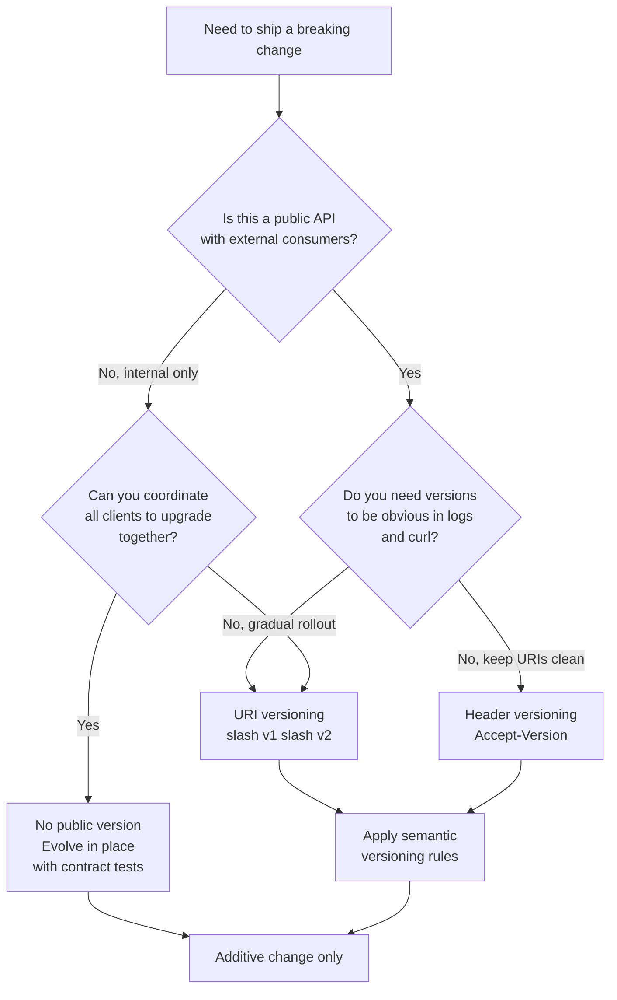
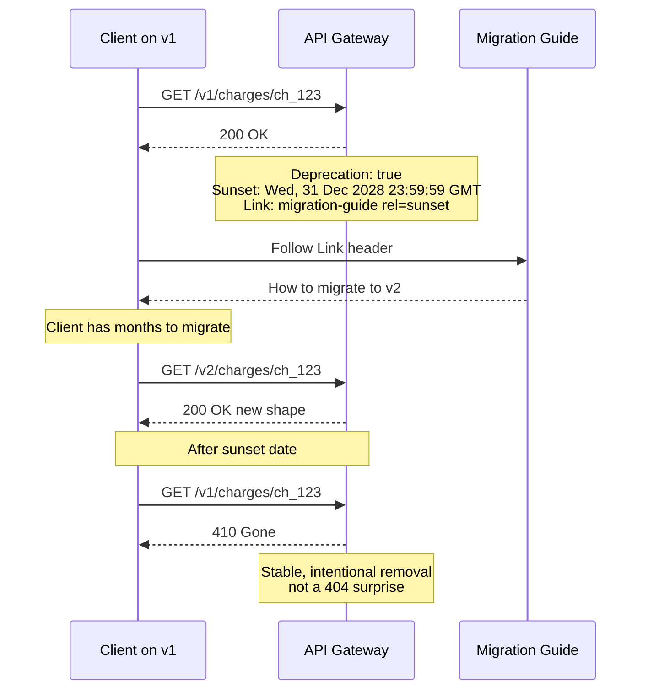
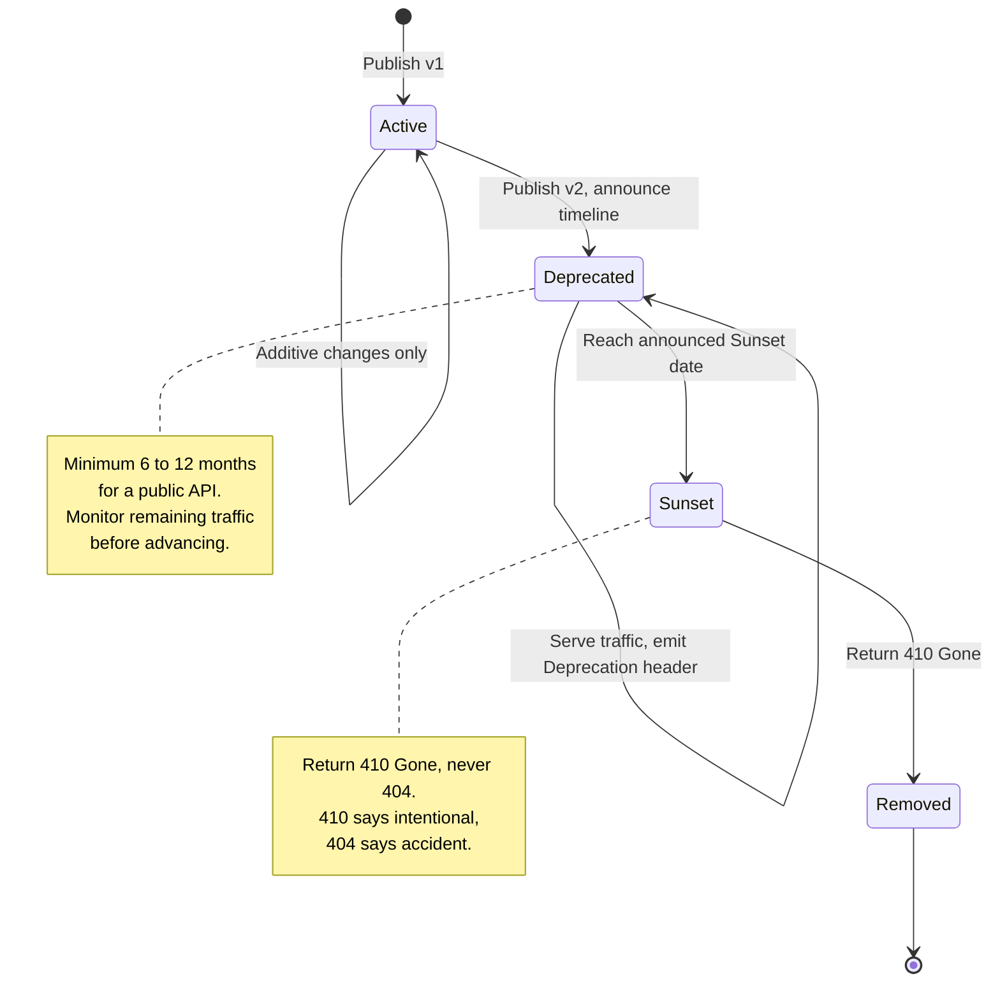

# The Container, Not the Code: API Design as a Contract

In April 1956, a converted tanker called the *Ideal X* sailed from Newark to Houston carrying fifty-eight aluminum truck bodies bolted to its deck. Malcolm McLean, a trucking magnate who was tired of watching dockworkers unload cargo one crate at a time, had a stubborn idea: what if you never unpacked the box at all? What if the box itself was the unit, and every ship, crane, truck, and railcar in the world agreed on its exact dimensions, its corner castings, its locking mechanism?

The genius was not the steel box. Anyone can weld a steel box. The genius was the *standard*. The corner casting that lets a crane in Rotterdam grab a container loaded in Shenzhen by a machine neither port has ever seen. The twist-lock that a chassis in Memphis trusts to hold a box packed in Busan. The ISO 668 specification that says a forty-foot container is 12,192 millimeters long, no exceptions, forever. Once everyone agreed on the interface, the global supply chain reorganized itself around it. Ports that adopted the standard thrived; ports that clung to break-bulk handling died. The container did not move goods faster because it was a better box. It moved goods faster because it was a better *contract*.

An API is the same trick. The code behind the endpoint is the steel box, and you can weld one in an afternoon now. Point a model at a feature description and you will have route handlers, request validation, an OpenAPI document, and a typed client in less time than it takes to read this paragraph. The implementation has become nearly free. But the *interface* you are publishing is a promise to every system that will ever call it, and like the corner casting on a container, the value is not in the thing itself. It is in the fact that everyone can depend on it not changing out from under them.

This is the third field note in a series on senior judgment in the age of AI coding. The throughline is simple and it keeps proving itself: the AI generates the implementation, but the scarce skill is deciding *what* to build, *which* trade-off to take, and *when* the generated thing is subtly, expensively wrong. Nowhere is that gap wider than in API design. The first post covered [infrastructure and the physics of distributed systems](https://juanlara18.github.io/portfolio/#/blog/senior-infrastructure-distributed-systems-failure-networking). The second covered [data modeling and query patterns](https://juanlara18.github.io/portfolio/#/blog/senior-data-modeling-query-patterns-database-design). This one is about the surface where your system meets everyone else's: the contract.

Let me show you why the contract is the part the AI cannot own, and then let me show you how to design one that survives contact with the real world.

---

## Why the Contract Is the Part the AI Cannot Own

Here is a story that has played out, in different costumes, at every company that has ever shipped a public API.

A team needed to add a field. A user object returned a `name` string, and product wanted to split it into `first_name` and `last_name`. Easy change. The AI wrote the migration, updated the serializer, adjusted the tests, all green. Someone shipped it on a Thursday. By Friday, three enterprise customers had open support tickets, a mobile app two versions back was crashing on launch, and a partner's nightly billing reconciliation had silently produced wrong invoices because their parser expected `name` and got `null`. The code was correct. The *contract* had been broken, and nobody owns the contract by writing correct code.

The reason the AI cannot own this is structural, not a temporary gap in capability. A contract is a statement about the future behavior of a system as observed by parties the author cannot see. The model generating your handler has no access to the mobile client released eighteen months ago, the partner integration written by a contractor who has since left, the internal service that hardcoded a field name in 2024, or the regulatory requirement that a particular response shape be stable for the life of a financial product. The contract is defined precisely by the constraints that live *outside* the codebase. Generation operates on what is in the context window. The hard part lives in what is not.

There is a deeper asymmetry. Writing code is reversible. If a function is wrong, you fix it and redeploy, and the cost is bounded by your release cycle. Publishing a contract is not reversible in the same way. The moment a client depends on a behavior, that behavior is load-bearing whether you documented it or not. This is Hyrum's Law, and it is the iron law of APIs: *with a sufficient number of users, every observable behavior of your system will be depended on by somebody.* The ordering of a JSON array you never promised to order. The exact wording of an error message someone is regex-matching. The fact that a `201` came back instead of a `200`. Once it is observable and someone is watching, it is part of the contract, and the AI that generated it had no way to know that.

So the division of labor is clean. The model is extraordinary at producing the *artifact* of an API. You remain responsible for the *promise* the artifact makes. Let us talk about what makes a good promise.

---

## An API Is a Contract: The Principles

Before resources and status codes and versioning schemes, there are a handful of principles that separate APIs people enjoy from APIs people endure. They are old, they are boring, and they are violated constantly.

### Postel's Law and Its Discontents

In 1981, Jon Postel wrote what became the most cited sentence in protocol design, in the TCP specification: "be conservative in what you do, be liberal in what you accept from others." It is usually shortened to "be conservative in what you send, be liberal in what you accept," and it is known as the robustness principle. The idea is humane: your service should send strictly correct, predictable output, while tolerating the messy, slightly-wrong input that real clients inevitably produce. For decades it was treated as gospel, and it is the reason the early internet interoperated at all.

It is also, in its strong form, a trap, and any senior engineer needs to know both halves. In 2023, Martin Thomson and David Schinazi wrote an IETF draft titled "The Harmful Consequences of the Robustness Principle" that is worth internalizing. Their argument: when you are too liberal in what you accept, you train your callers to send garbage. The garbage becomes a de facto standard. The next implementer has to accept the same garbage to be compatible, and now the malformed behavior is entrenched forever, impossible to deprecate, a permanent tax on everyone who comes after. Being liberal feels generous in the moment and metastasizes into a maintenance nightmare across years.

The senior synthesis is this. Be *strict* in what you accept, and be *explicit and loud* when you reject it. Validate input hard, reject early, and return an error so clear the caller fixes their code in five minutes. Be conservative in what you send, yes, always. But "liberal in what you accept" should mean *tolerant of additions you do not understand* (ignore unknown fields rather than crashing), not *tolerant of malformations you do understand* (accepting a string where you specified an integer). The distinction is everything. Tolerate the future; reject the wrong.

### The Principle of Least Astonishment

An API should behave the way a competent developer, reading only its name and signature, would *guess* it behaves. A method called `delete_user` should delete a user. It should not also send an email, archive their data to cold storage, and cancel their subscriptions unless the name says so or the docs scream it. A `GET` should not have side effects. A field called `created_at` should be a creation timestamp, not the last-modified time because someone got lazy. Every time your API surprises someone, they pay an interpretation cost, they write a defensive workaround, and they trust you a little less.

The AI is genuinely good at the local version of this. It will name things conventionally and follow patterns it has seen a million times. What it cannot do is hold your *whole* API in its head and notice that `GET /users` returns a list but `GET /accounts` returns a single object wrapped in a `data` envelope, that one endpoint paginates with `offset` and another with `cursor`, that errors come back as `{"error": "..."}` here and `{"message": "..."}` there. Consistency across the surface is a global property. Generation is a local act. You are the one who sees the whole container yard.

### Explicitness Over Cleverness

Magic is a liability in an interface. An endpoint that returns different shapes depending on an undocumented header, a field that means different things based on the value of another field, an enum that grows new values without warning, a parameter that is sometimes a string and sometimes an array: every one of these is clever, and clever is what you regret at 3 a.m. during an incident. The container worked because the spec is rigid and dumb. Forty feet means forty feet. Make your contract that boring. Boring is a feature.

---

## Designing the Resource and Its Semantics

Now the concrete part. A REST API is, at its best, a small number of well-chosen *resources* manipulated through the uniform semantics that HTTP already gives you. The reference frame here is the **Richardson Maturity Model**, named by Leonard Richardson and popularized by Martin Fowler, which grades an API on three steps above zero:

- **Level 0**: HTTP as a dumb tunnel. One endpoint, one verb, everything is a POST to `/api`. This is RPC wearing an HTTP costume.
- **Level 1**: Resources. You have distinct URIs for distinct things: `/users/42`, `/orders/118`.
- **Level 2**: HTTP verbs and status codes. `GET` reads, `POST` creates, `DELETE` removes, and the response code actually means something. This is where the overwhelming majority of good production APIs live, and it is the right target for almost everyone.
- **Level 3**: Hypermedia controls (HATEOAS), where responses carry links telling the client what it can do next. Theoretically the only "truly RESTful" level. In practice, rare, because most clients do not navigate links dynamically and the cost rarely pays for itself.

Be honest about Level 2 being the destination. Aiming for Level 3 because a blog post called it "pure" is exactly the kind of judgment failure this series is about: optimizing for a label instead of the people who use your API.

### Status Codes That Mean What They Say

HTTP status codes are a shared vocabulary defined in RFC 9110. Using them correctly is free interoperability; using them sloppily is a self-inflicted wound. The rules that matter:

- **2xx** means it worked. `200 OK` for a successful read or update, `201 Created` when you made a new resource (and return its location), `202 Accepted` when you took the work but have not done it yet, `204 No Content` when there is nothing to return.
- **4xx** means the *caller* made a mistake and should not retry without changing something. `400` for malformed syntax, `401` for "who are you," `403` for "I know who you are and no," `404` for "no such thing," `409` for a conflict with current state, `422` for syntactically valid but semantically wrong, `429` for "slow down."
- **5xx** means *you* made a mistake and the caller may retry. `500` for an unhandled failure, `503` for "temporarily down, come back later."

The single most damaging anti-pattern is returning `200 OK` with an error in the body. It blinds every monitoring system, every retry policy, every load balancer health check between you and the caller, all of which read the status line and trust it. Returning `200` with `{"success": false}` is lying in the one place everyone is listening.

### Idempotency Is a Contract Term

Idempotency is the property that making the same call twice has the same effect as making it once. It is not a nicety; on a network where any request can time out without telling you whether it succeeded, it is the difference between a reliable API and a double-charged customer. HTTP gives you idempotency for free on `GET`, `PUT`, and `DELETE` by definition. `POST` is the dangerous one, because `POST /charges` twice means two charges.

The industry-standard fix, pioneered by Stripe and now an IETF draft (`draft-ietf-httpapi-idempotency-key-header`), is the `Idempotency-Key` header. The client generates a unique key per logical operation and sends it. The server records the key with the result of the first request; on a retry with the same key, it returns the stored result instead of doing the work again. Adyen, Dwolla, WorldPay, and others have converged on the same pattern, which is a strong signal that it is correct.

```python
from fastapi import FastAPI, Header, HTTPException, status
from pydantic import BaseModel, Field
import hashlib, json

app = FastAPI()

# In production this is Redis or a database table, not a dict.
_idempotency_store: dict[str, dict] = {}


class ChargeRequest(BaseModel):
    amount_cents: int = Field(gt=0, description="Amount in minor units")
    currency: str = Field(min_length=3, max_length=3)
    customer_id: str


@app.post("/v1/charges", status_code=status.HTTP_201_CREATED)
def create_charge(
    body: ChargeRequest,
    idempotency_key: str | None = Header(default=None, alias="Idempotency-Key"),
):
    if idempotency_key is None:
        # Reject loudly. Do not silently allow a non-idempotent path.
        raise HTTPException(
            status_code=status.HTTP_400_BAD_REQUEST,
            detail={
                "type": "https://api.example.com/errors/missing-idempotency-key",
                "title": "Idempotency-Key header is required for charge creation",
                "status": 400,
            },
        )

    # Bind the key to the request body so a reused key with a different
    # payload is a hard error, not a silently wrong replay.
    fingerprint = hashlib.sha256(
        json.dumps(body.model_dump(), sort_keys=True).encode()
    ).hexdigest()

    prior = _idempotency_store.get(idempotency_key)
    if prior is not None:
        if prior["fingerprint"] != fingerprint:
            raise HTTPException(
                status_code=status.HTTP_409_CONFLICT,
                detail={
                    "type": "https://api.example.com/errors/idempotency-key-reuse",
                    "title": "Idempotency-Key reused with a different request body",
                    "status": 409,
                },
            )
        return prior["response"]  # Replay the original result.

    charge = {
        "id": f"ch_{fingerprint[:24]}",
        "amount_cents": body.amount_cents,
        "currency": body.currency.lower(),
        "customer_id": body.customer_id,
        "status": "succeeded",
    }
    _idempotency_store[idempotency_key] = {
        "fingerprint": fingerprint,
        "response": charge,
    }
    return charge
```

Notice the judgment baked into that handler that an AI would not supply unprompted: rejecting a missing key rather than allowing an unsafe path, binding the key to a body fingerprint so a reused key with a changed payload is a `409` and not a silent wrong replay, and storing the *result* so retries are cheap. The AI writes this fluently once you specify it. Specifying it is the job.

### Pagination That Survives a Moving Dataset

Every collection endpoint needs pagination, and the choice between strategies is a real trade-off, not a default. **Offset pagination** (`?limit=20&offset=40`) is simple and lets clients jump to arbitrary pages, but it breaks on data that changes underneath you: if a row is inserted while a client is paging, they see a duplicate or skip a record, and on large offsets the database has to count past everything it skips, which gets slow. **Cursor pagination** (`?limit=20&cursor=eyJpZCI6MTE4fQ`) hands the client an opaque token encoding "where you left off," which is stable under inserts and fast at any depth, at the cost of not being able to jump to page 50 directly.

The senior call: cursor pagination for anything large, append-heavy, or real-time; offset only for small, stable, admin-style lists where jumping to a page matters. Whatever you choose, make it consistent across the whole API, return the pagination metadata in a predictable place, and never let an unbounded list endpoint exist without a default limit. An endpoint that returns "all users" with no cap is a denial-of-service vector you wrote yourself.

### Error Shapes Are Part of the API

Errors are not exhaust. They are a documented, versioned part of your contract, and they are the part developers interact with most when they are stuck and frustrated. The worst thing you can do is return a different error shape from every endpoint. The best thing you can do is adopt **RFC 9457 Problem Details** (formerly RFC 7807), a standard JSON error format with `type`, `title`, `status`, `detail`, and `instance` fields, extensible with your own members.

```json
{
  "type": "https://api.example.com/errors/insufficient-funds",
  "title": "The customer's balance is too low for this charge",
  "status": 422,
  "detail": "Charge of 5000 USD exceeds available balance of 1200 USD.",
  "instance": "/v1/charges",
  "balance_cents": 120000,
  "requested_cents": 500000,
  "request_id": "req_8sZ2k1Qm"
}
```

A good error tells the caller three things: *what* went wrong (machine-readable `type`), *why* in human terms (`detail`), and *how to get help* (`request_id` they can quote to support). The `type` being a stable URI is the key move: clients switch on it programmatically, and it can link to documentation. Bury a unique `request_id` in every error and you turn an unreproducible support ticket into a one-line log lookup.

---

## Versioning Strategies and Their Trade-offs

Eventually you have to break something. Versioning is how you break it without breaking everyone. There is no free lunch here, only trade-offs you choose deliberately.

There are three main places to put a version.

**URI versioning** (`/v1/charges`, `/v2/charges`) is the most common and the most visible. It is trivially explicit: the version is right there in the path, easy to route, easy to log, easy to explain. Facebook, Twitter, Stripe, and most large public APIs use it. The purist objection is that the URI should identify a resource, and `/v1/users/42` and `/v2/users/42` are arguably the same user, so the version pollutes the resource identifier. The objection is correct and almost nobody cares, because the operational clarity is worth it.

**Header versioning** (`Accept-Version: 2` or a custom header) keeps URIs clean and version-free. The cost is invisibility: the version is now hidden in a header that nobody sees in a browser, in a log line, or in a curl command they copy-pasted, which makes debugging and onboarding harder. It is cleaner in theory and more surprising in practice.

**Media-type versioning** (`Accept: application/vnd.example.v2+json`) is the most "correct" by REST orthodoxy and uses HTTP's content negotiation as designed. It is also the most obscure, the hardest to test by hand, and the one your average API consumer will get wrong. GitHub famously used it and the developer experience friction is real.



Underneath the placement question is a more important one: *what counts as a version bump at all?* Borrow semantic versioning's discipline. A **major** version is a breaking change: removing a field, renaming one, tightening validation, changing a type, altering the meaning of a value. These force consumers to do work, so they get a new major version. A **minor** version is additive and backward compatible: a new optional field, a new endpoint, a new enum value clients can ignore. These should *not* force a new version at all if your clients are well-behaved, which is the entire subject of the next section.

The senior insight that the AI will never volunteer: **the best versioning strategy is the one that lets you version as rarely as possible.** Every major version you publish is a version you maintain, document, test, and eventually deprecate, for years. A `v2` is not a feature. It is a liability you took on because you could not make the change additively. Treat each one as a small organizational tragedy and you will design more carefully the first time.

---

## Evolving Without Breaking

Most changes do not need a new version. They need discipline. The container did not get a `v2` when refrigerated units arrived; the corner castings stayed identical and the new capability lived inside the same interface. Your API can do the same most of the time.

### Additive Change and the Tolerant Reader

The foundational rule of backward-compatible evolution: **you may add, you may not remove or change.** Adding an optional request field is safe because old clients omit it. Adding a response field is safe *only if* your clients follow the **tolerant reader** pattern, which means they ignore fields they do not recognize instead of crashing on them. This is the *correct* half of Postel's law in action: tolerate additions you do not understand.

The catch is that you cannot enforce tolerant reading in your clients, so you have to *document it as a requirement* of consuming your API and design defensively around the ones who ignore the documentation. State explicitly, in your developer docs, that clients must ignore unknown fields and must not assume the set of enum values is closed. Then, critically, hold yourself to the corresponding promise: you will only ever *add* fields and enum values, never repurpose or remove them within a major version. The contract is bidirectional. You promise stability; they promise tolerance.

What counts as a breaking change is broader than most people think. Breaking: removing a field, renaming a field, making an optional field required, narrowing a type, removing an enum value, changing a default, tightening validation that was previously lax, changing an error code. Non-breaking, usually: adding an optional field, adding an endpoint, adding an enum value (if you documented openness), loosening validation. When in doubt, assume it is breaking. Someone, somewhere, depends on the behavior you are about to change. Hyrum's Law again.

### Deprecation and Sunset: The Humane Off-Ramp

When you genuinely must remove something, the question is no longer *whether* you break people but *how kindly*. Deprecation happens in two stages, and HTTP now has standard signals for both.

The `Deprecation` header (an IETF draft) marks a resource as deprecated: still working, no longer recommended. The `Sunset` header (**RFC 8594**, a published standard) carries an HTTP-date timestamp announcing when the resource will actually stop responding. The spec is explicit that the sunset time must not be earlier than the deprecation time, and that clients should treat the timestamp as a hint, not a guarantee. Pair them, link to a migration guide via the `sunset` link relation, and you have turned a cliff into a ramp.



The lifecycle of a versioned endpoint, from the day you ship it to the day it goes dark, is a state machine worth drawing explicitly, because each transition is a promise you are making about how much notice your consumers get.



Two judgments live in those diagrams that no tool decides for you. First, the *length* of the deprecation window, which is a business decision: a public API used by enterprises needs six to twelve months minimum, an internal API consumed by two teams might need two weeks. Second, the choice of **`410 Gone` over `404 Not Found`** for a removed resource. A `404` says "this never existed, maybe you have a typo," and sends the caller debugging in the wrong direction. A `410` says "this existed and we removed it on purpose," which is the honest, kind signal. The AI returns `404` because it is the default. You return `410` because you remember the contract.

---

## Developer Experience as a Feature

An API has exactly one user: a developer who is integrating it, usually under deadline, usually after their first three guesses failed. Developer experience is not polish applied at the end. It is the product. A technically flawless API with terrible DX loses to a mediocre API that is a joy to use, every time, because adoption is a human decision made by tired people.

### Naming and Consistency

Joshua Bloch, who designed the Java Collections Framework, put it best in his classic talk "How to Design a Good API and Why it Matters": names matter, and you should strive for intelligibility, consistency, and symmetry. If you have `create_user` you should have `delete_user`, not `remove_user`. If timestamps are `created_at` and `updated_at`, every timestamp everywhere is `*_at`, never `creation_date` in one corner. If IDs are prefixed (`usr_`, `ch_`, `ord_`), they are prefixed everywhere. Consistency means a developer learns your API once and then *predicts* the rest of it. That predictive power is the highest compliment an API can earn, and it is a global property of the whole surface that only a human holding the whole thing in mind can guarantee.

### Errors as a Teaching Surface

I said errors are part of the contract; they are also your single best DX investment. The developer hitting an error is, by definition, stuck and ready to learn. An error that says `400 Bad Request` teaches nothing. An error that says "the `currency` field must be a three-letter ISO 4217 code; you sent `dollars`" fixes their code and their understanding in one shot, and links to the docs so they never make the mistake again. Every error message is a tiny piece of documentation delivered at the exact moment of maximum attention. Waste it and you generate a support ticket. Spend it well and you generate a fan.

### Docs as a Product

Bloch's other line: no matter how good the API, it will not get used without good documentation. The good news is that an OpenAPI specification, which the AI generates competently, gives you interactive reference docs, request/response schemas, and client SDK generation almost for free. The reference is the easy 20 percent.

The hard 80 percent the AI cannot write for you is the *narrative*: the getting-started guide that takes a developer from zero to a successful first call in under five minutes, the conceptual overview that explains *why* your resources are shaped the way they are, the worked examples for the three things people actually do, the migration guides, the changelog written for humans. Reference docs answer "what are the parameters of this endpoint." Good docs answer "how do I accomplish my goal." Only one of those requires understanding the goal, and the goal lives outside the codebase, which is exactly where the AI cannot see.

### SDKs and Examples

A great API ships with at least one first-class client library and a wall of copy-pasteable examples. The SDK absorbs the tedious parts (auth, retries with backoff, pagination, idempotency-key generation) so the developer writes business logic, not HTTP plumbing. Here too the leverage has shifted: AI generates a usable SDK from your OpenAPI spec in minutes. The judgment is in the *ergonomics*, the choices a spec does not encode: should pagination be a method the user calls in a loop, or an iterator that just works when you `for` over it? Should retries be automatic and silent, or visible and configurable? Those are taste decisions about how a human will feel using the thing, and taste is the scarce input.

---

## Contract Testing in CI

Here is the discipline that operationalizes everything above: if the contract is the thing that matters, then the contract is the thing you test, automatically, on every commit, on both sides of the wire.

Traditional testing checks that your *code* is correct. Contract testing checks that your *promise* is intact. These are different. Your handler can be perfectly correct and still break a consumer by changing a field name, and a unit test that only checks your own logic sails right past it. You need tests that fail when the *observable behavior* changes, not just when the internal logic does.

### Schema Validation in CI

The cheapest layer: treat your OpenAPI specification as the source of truth and check, on every build, that your responses still match it and that the new spec has not broken the old one. Tools that diff two OpenAPI documents and flag breaking changes (a removed field, a tightened type, a new required parameter) turn "did I break the contract" from a judgment call into a CI gate. If the diff says breaking and you did not bump the major version, the build fails. This catches the accidental break, the `name` becoming `null` on a Thursday, before it ships.

### Consumer-Driven Contract Testing

The deeper discipline, and the one that earns its keep across service boundaries, is **consumer-driven contract testing**, with **Pact** as the canonical tool. The model inverts who defines the contract. Instead of the provider declaring "here is my API, deal with it," each *consumer* declares "here is exactly what I send and exactly what I expect back," and the provider is tested against the union of all its consumers' expectations.

Mechanically: the consumer's test suite runs against a Pact mock server standing in for the real provider. As the consumer code makes the calls it would make in production, Pact records each request and the expected response into a *pact file*, a JSON document of every interaction between that specific consumer and provider. That file is shared with the provider, usually through a Pact Broker, and the provider runs verification: Pact replays each recorded request against the real running provider and checks that the actual response matches, same status, same headers, same body shape. If both sides pass, they are *guaranteed* to integrate, with most of the confidence of end-to-end testing at a fraction of the cost and far faster feedback.

```python
# Consumer side: the billing-dashboard team declares what it needs
# from the charges API. This runs in the CONSUMER's CI.
import atexit
from pact import Consumer, Provider

pact = Consumer("billing-dashboard").has_pact_with(Provider("charges-api"))
pact.start_service()
atexit.register(pact.stop_service)


def test_get_charge_returns_expected_shape():
    expected = {
        "id": "ch_abc123",
        "amount_cents": 5000,
        "currency": "usd",
        "status": "succeeded",
    }

    (
        pact
        .given("charge ch_abc123 exists")
        .upon_receiving("a request for a single charge")
        .with_request("GET", "/v1/charges/ch_abc123")
        .will_respond_with(200, body=expected)
    )

    with pact:
        # The real consumer client makes the call against the mock.
        result = get_charge_client("ch_abc123")
        # The dashboard only cares about these three fields. The pact
        # records exactly that, so the provider learns what it must keep
        # stable, and is free to add other fields without breaking us.
        assert result["amount_cents"] == 5000
        assert result["currency"] == "usd"
        assert result["status"] == "succeeded"
```

What makes this powerful is not the tooling. It is that the contract becomes *executable and bilateral*. The provider learns, mechanically, which fields real consumers actually depend on, which means it knows exactly what it is free to change. The `name`-to-`first_name` disaster from the opening becomes a failing build in the provider's pipeline the moment they delete the field, because a consumer's pact still expects it. The contract stops being a document people forget and becomes a test that fails. That is the whole game: make the promise machine-checkable so breaking it is loud, early, and free to fix.

---

## REST vs gRPC vs GraphQL, Briefly and Honestly

The contract principles above are protocol-agnostic, but the protocol you choose shapes the contract you can express, so a senior engineer owes the decision an honest comparison rather than a default.

**REST over HTTP/JSON** is the lingua franca. Every language, every tool, every developer already speaks it; it is debuggable with curl; it caches naturally over HTTP; and the ecosystem of tooling is unmatched. Its weaknesses are real: no built-in schema unless you bolt on OpenAPI, over-fetching and under-fetching because endpoints return fixed shapes, and chattiness when a screen needs data from five resources. It is the right default for public APIs, for anything consumed by third parties, and for anything where broad reach beats raw efficiency.

**gRPC** uses Protocol Buffers over HTTP/2 with a strict, code-generated schema and binary serialization. It is fast, it is strongly typed by construction, it supports streaming naturally, and the `.proto` file *is* the contract, enforced at compile time in every language. The costs: it is not human-readable on the wire, it is awkward through browsers and many proxies, and debugging needs special tooling. It shines for internal service-to-service communication where you control both ends, performance matters, and you want the contract enforced by the compiler rather than a test.

**GraphQL** hands the *client* control over the shape of the response: ask for exactly the fields you want across multiple resources in one round trip, no more, no less. It eliminates over-fetching and is a genuine pleasure for front-end teams composing complex views. The costs are not free either: caching is hard because every query is different, a naive query can ask for something catastrophically expensive, the contract is the schema plus a whole new query language your team must learn, and server-side complexity rises sharply. It earns its place when you have many diverse clients with divergent data needs hitting an aggregation layer over many sources, the case Mike Amundsen lays out well in his GOTO talk on unifying the three.

The senior framing, and the throughline of this whole series: this is not a contest with a winner. It is a trade-off matrix, and the right answer depends on *who* consumes the API, *what* they need, and *what* you can operate. An AI will happily generate a gRPC service, a GraphQL schema, or a REST API with equal fluency and zero opinion about which one your situation calls for. Holding the situation, the consumers, and the operational reality in your head and choosing deliberately is the part that is still yours.

---

## What to Delegate to the AI vs What to Own

Let me make the division of labor concrete, because that is the point of this series.

**Delegate to the AI, confidently:**

- Route handlers and request/response serialization from a clear spec.
- Generating the OpenAPI document and keeping it in sync with the code.
- Boilerplate validation once you have specified the rules.
- Client SDKs and typed models generated from the spec.
- Reference documentation, example requests, and test scaffolding.
- Mechanical refactors that preserve the observable contract.

**Own, because they live outside the codebase:**

- *What resources exist and what they mean.* The model can name a resource; it cannot know that "account" and "customer" are different things in your business with different lifecycles, because that knowledge lives in conversations the model was not in.
- *Which changes are breaking.* This requires knowing who depends on what, and the dependents are invisible to generation. Hyrum's Law is your problem, not the model's.
- *The versioning and deprecation policy.* How long is your sunset window? That is a promise to customers, set by business and trust, not by code.
- *Consistency across the whole surface.* A global property only a human holding the entire API in mind can enforce. Generation is local.
- *The error taxonomy and what each error teaches.* Good errors require understanding the developer's likely mistake and intent, which is empathy, not pattern-matching.
- *Protocol and trade-off selection.* REST vs gRPC vs GraphQL, cursor vs offset, URI vs header versioning, all judgment calls keyed to consumers the model cannot see.
- *The contract tests themselves.* Deciding what behavior must stay stable is deciding what your promise *is*. That is the most senior act of all.

The container revolution did not eliminate the need for people who understood shipping. It eliminated the longshoreman who unpacked crates by hand and made the person who designed the standard, negotiated its adoption, and decided what the interface should guarantee, vastly more valuable. AI code generation is doing the same thing to APIs. The handler-writing is the crate-unpacking. The contract is the corner casting. Welding boxes is now free. Deciding what the box must promise, to whom, and for how long, is the entire job.

---

## Prerequisites, Gotchas, and Testing

**Prerequisites to get the most from this post:**

- Comfort with HTTP fundamentals: methods, status codes, headers, and the request/response cycle.
- Basic familiarity with JSON and at least one web framework. The examples use FastAPI but the ideas are framework-agnostic.
- The infrastructure mindset from [the first post in this series](https://juanlara18.github.io/portfolio/#/blog/senior-infrastructure-distributed-systems-failure-networking): networks fail, requests time out, retries happen. That is *why* idempotency is a contract term, not a nicety.
- The data-modeling lens from [the second post](https://juanlara18.github.io/portfolio/#/blog/senior-data-modeling-query-patterns-database-design): your resource shapes often mirror your data model, and the same "easy to change, hard to change" asymmetry applies.

**Gotchas that bite teams repeatedly:**

- *Returning 200 with an error body.* It blinds every retry policy and monitor between you and the caller. Use the status line honestly.
- *Treating field removal as a small change.* It is the single most common breaking change shipped by accident. Diff your spec in CI.
- *Unbounded list endpoints.* "Return all users" with no default limit is a self-inflicted denial of service. Cap everything.
- *Enums that grow without warning.* If clients assume the enum is closed and you add a value, they break. Document openness up front and design for it.
- *404 for intentionally removed resources.* Use 410 Gone. The difference is the difference between "you have a typo" and "we removed this on purpose."
- *Skipping the idempotency key on write endpoints.* On an unreliable network, this is how you double-charge customers. It is not optional for money-moving operations.
- *Letting the OpenAPI spec drift from reality.* A spec that lies is worse than no spec, because people trust it. Generate it from code or test code against it.

**How to test an API contract, in layers:**

1. *Unit tests* for handler logic. Necessary, insufficient: they verify your code, not your promise.
2. *Schema validation in CI.* Assert every response conforms to the OpenAPI spec, and diff the spec against the previous version to flag breaking changes automatically.
3. *Consumer-driven contract tests* (Pact) across every service boundary. This is what catches the cross-team break before it ships.
4. *Backward-compatibility tests.* Keep a frozen copy of the previous version's expected responses and assert the current code still satisfies them within the same major version.
5. *Smoke tests against the deployed environment.* The contract is only real once it is serving traffic. Verify the live surface, not just the build.

The pattern across all five: you are not testing whether the code works. You are testing whether the *promise* still holds. That reframing is the whole discipline.

---

## Going Deeper

**Books:**

- Bloch, J. (2018). *Effective Java* (3rd ed.). Addison-Wesley.
  - The API design chapter is the distilled wisdom of the person who designed the Java Collections Framework. "Easy to use and hard to misuse" is the north star, and it applies far beyond Java.
- Lauret, A. (2019). *The Design of Web APIs.* Manning.
  - The most practical, hands-on book on designing APIs for the humans who consume them. Strong on the gap between an API that works and an API people enjoy.
- Richardson, L., & Amundsen, M. (2013). *RESTful Web APIs.* O'Reilly.
  - The canonical treatment of REST done properly, including hypermedia, from the person the Richardson Maturity Model is named after.
- Jin, B., Sahni, S., & Shevat, A. (2018). *Designing Web APIs: Building APIs That Developers Love.* O'Reilly.
  - Strong on the organizational and developer-experience side: versioning policy, deprecation, SDKs, and treating docs as a product.
- Geewax, J. J. (2021). *API Design Patterns.* Manning.
  - A deep, pattern-by-pattern reference covering pagination, long-running operations, idempotency, and versioning with real rigor.

**Online Resources:**

- [Richardson Maturity Model](https://martinfowler.com/articles/richardsonMaturityModel.html) by Martin Fowler — The clearest explanation of REST's levels and why Level 2 is where most good APIs live.
- [Stripe: Designing robust and predictable APIs with idempotency](https://stripe.com/blog/idempotency) — The blog post that effectively standardized the idempotency-key pattern across the industry.
- [Zalando RESTful API Guidelines](https://github.com/zalando/restful-api-guidelines) — A complete, opinionated, production-tested style guide you can adopt or adapt wholesale.
- [Pact documentation](https://docs.pact.io/) — The reference for consumer-driven contract testing, with implementation guides across languages.
- [Google API Improvement Proposals (AIPs)](https://google.aip.dev/) — Google's exhaustive, battle-tested design guidance covering naming, versioning, errors, and long-running operations.

**Videos:**

- [How To Design A Good API and Why it Matters](https://www.youtube.com/watch?v=aAb7hSCtvGw) by Joshua Bloch (Google Tech Talk) — The foundational talk on API design. Decades old and not aged a day; every principle still holds.
- [GraphQL, gRPC and REST, Oh My! A Method for Unified API Design](https://www.youtube.com/watch?v=oG6-r3UdenE) by Mike Amundsen (GOTO 2020) — An honest, vendor-neutral framing of when each protocol earns its place, which is exactly the trade-off thinking this post argues for.

**Articles and Specifications:**

- Thomson, M., & Schinazi, D. (2023). ["The Harmful Consequences of the Robustness Principle."](https://datatracker.ietf.org/doc/html/draft-thomson-postel-was-wrong-02) IETF Internet-Draft.
  - The essential counterweight to Postel's law. Read it to understand why "be liberal in what you accept" should mean tolerating additions, not malformations.
- Wilde, E. (2019). ["RFC 8594: The Sunset HTTP Header Field."](https://datatracker.ietf.org/doc/html/rfc8594) IETF.
  - The published standard for announcing when a resource will stop responding. The humane, machine-readable way to deprecate.
- Idempotency-Key Header. ["draft-ietf-httpapi-idempotency-key-header."](https://datatracker.ietf.org/doc/html/draft-ietf-httpapi-idempotency-key-header-02) IETF HTTPAPI Working Group.
  - The in-progress standardization of the pattern Stripe, Adyen, and others converged on independently, which is a strong signal it is correct.
- Fielding, R. T. (2000). ["Architectural Styles and the Design of Network-based Software Architectures."](https://ics.uci.edu/~fielding/pubs/dissertation/top.htm) Doctoral dissertation, UC Irvine.
  - The dissertation that defined REST. Chapter 5 is where the constraints actually come from, and reading it cures a lot of cargo-cult REST.

**Questions to Explore:**

- If every observable behavior eventually becomes a contract (Hyrum's Law), is the goal to minimize observable behavior, or to make the *intended* contract so obvious that nobody depends on accidents? Can you design an API that has no accidental surface?
- Consumer-driven contract testing requires consumers to declare their expectations. What happens to the discipline when your consumers are anonymous third parties you will never meet, as in a fully public API? What replaces the missing feedback loop?
- As AI agents become primary API consumers rather than human developers, does developer experience change shape? Do agents care about narrative docs, or do they only need a perfect machine-readable spec, and what does that do to how we design?
- If an AI can generate a perfectly conformant implementation from a contract, should we be designing the *contract specification language* as the real source code, and treating the handler as disposable build output?
- The container standard succeeded partly by killing the alternatives, the network effect that made non-standard ports obsolete. Do API standards have the same winner-take-all dynamic, and if so, when is it worth fighting an entrenched-but-flawed de facto standard versus conforming to it?
