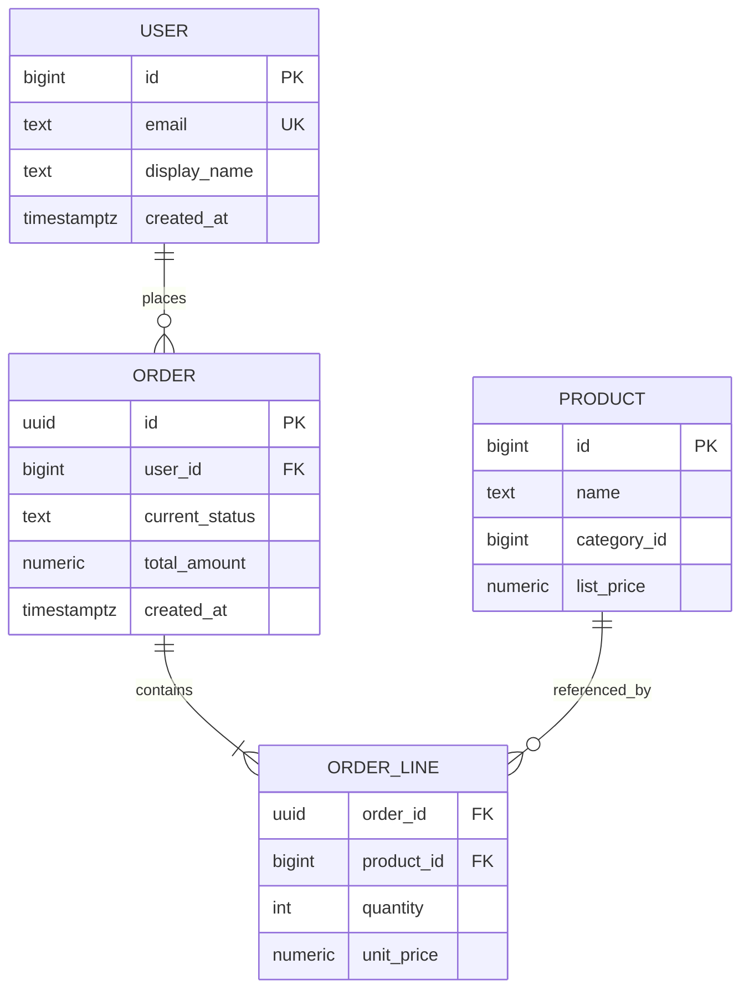
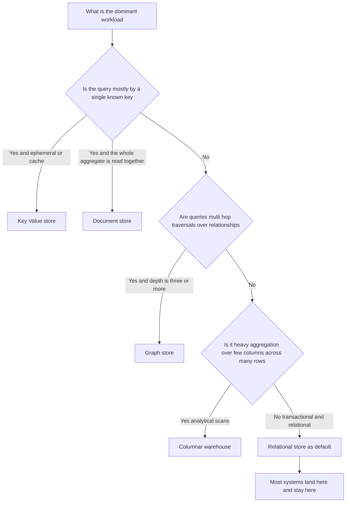
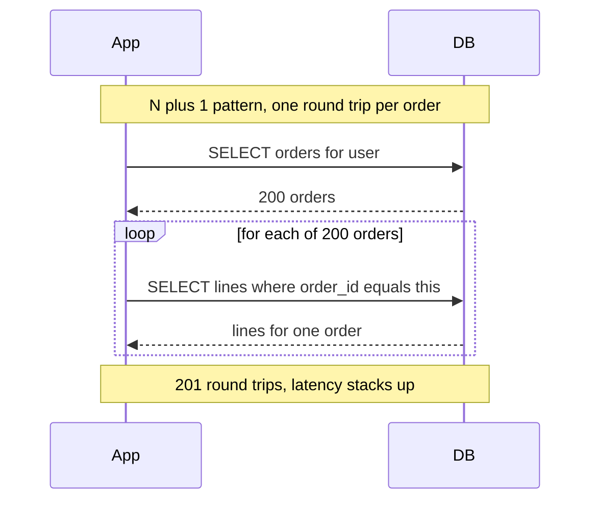
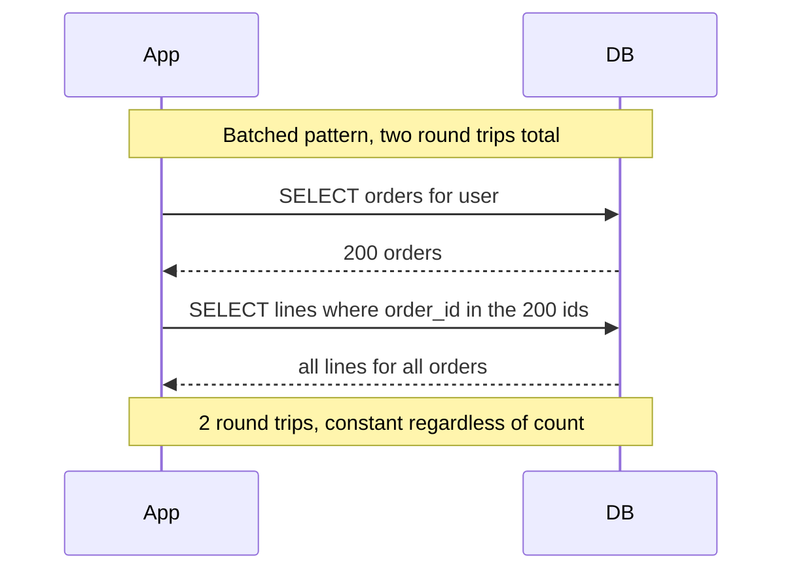

# The Shelf That Outlives the Building: Data Modeling for the Senior Engineer

A logistics company I once consulted for had a table called `shipments`. It was created in 2014 by a founding engineer who is long gone. It had grown to forty-three columns. Seven of them were named `status`, `status_2`, `legacy_status`, `status_new`, `current_state`, `state`, and `phase`. Nobody alive knew which one the billing system actually read. A nullable column called `metadata` held JSON that three different services parsed three different ways. The primary key was an auto-incrementing integer, which meant that when they finally sharded the database across regions, two warehouses in two countries started minting the same shipment IDs, and a truck in Rotterdam got billed for a delivery in Bogota.

None of this was a code problem. Every service that touched `shipments` was clean, tested, modern. They had rewritten the API twice. They had migrated from a monolith to services and back to a modular monolith. They had swapped frameworks. The one thing they never touched, because it was load-bearing for everything and terrifying to change, was the table. The data model had ossified. It had become the geology under the application: you do not renovate bedrock, you build on top of it and hope.

That is the thing about a data model. The code is the building. You renovate it, you knock down walls, you replace the wiring. The data model is the lot the building sits on, the orientation of the foundation, the position of the load-bearing columns. You can rebuild the house on top of it a dozen times. You almost never move the foundation.

Think of it as a library. A book on a shelf is trivial to read. The expensive, durable decision is the cataloging system: how you shelve, how you index the catalog, what you decide to put next to what. Get the cataloging right and any book is a thirty-second retrieval. Get it wrong and every lookup is a walk through every aisle. The Library of Congress did not pick its classification scheme casually, because reshelving ten million books is not a sprint, it is a generational project. Your `shipments` table is the same. The query is the patron at the desk. The schema is the catalog. And reshelving is a migration that runs for six months and scares everyone.

This is the second post in a series on senior engineering in the age of AI coding. The throughline is simple and, I think, increasingly obvious: the machines now write the implementation. Ask any competent model for a `CREATE TABLE` statement, an ORM class, a migration, and you will get syntactically perfect output in two seconds. What the machine cannot do, what stays stubbornly scarce, is decide what to build, which trade-off to accept, and when the generated code is subtly, expensively wrong. The first post covered [infrastructure and the physics of distributed systems](https://juanlara18.github.io/portfolio/#/blog/senior-infrastructure-distributed-systems-failure-networking). This one is about the data model, which I will argue is the single decision in that whole space where senior judgment pays the highest dividend, because it is the one you can least afford to get wrong and the one the AI is most confidently happy to get wrong for you.

---

## Why the Data Model Is the Decision the Machine Cannot Make

Here is what an AI is genuinely excellent at. Give it a description of an entity, "a user has an email, a name, a list of orders, and a subscription tier," and it will produce a normalized relational schema, an ORM model, the migration, and a seed script, faster and with fewer typos than you. The syntax will be right. The data types will be reasonable. It will even add an index on the foreign key without being asked. For the mechanical translation of a described shape into DDL, the machine has effectively won.

What it cannot do is supply the inputs that actually determine whether the shape is correct. The shape of a good data model is not derived from the entities. It is derived from the queries. And the queries come from the product, the access patterns, the read-write ratio, the latency budget, the consistency requirements, the growth curve, the team's operational maturity, and a dozen other facts that live in your head and your roadmap, not in the prompt. The AI models the nouns you give it. A senior engineer models the verbs the system will perform, ten thousand times a second, for the next five years.

There is a deeper reason the model resists automation, and it is about cost asymmetry. Most engineering decisions are cheap to reverse. You picked the wrong HTTP library, you swap it in an afternoon. You named a function badly, you rename it. The data model is the rare decision where the cost of being wrong compounds with every row you write and every query you ship against it. By the time you discover that you modeled it wrong, you have a hundred million rows in the wrong shape, forty services reading it through the wrong assumptions, and a migration that has to run online, without downtime, without losing a byte, while the wrong-shaped writes keep coming. The AI optimizes for the prompt in front of it. It has no model of the cost it is committing you to. That cost projection, the "what will this decision cost us in three years," is exactly the senior judgment that does not commoditize.

So the rest of this post is organized around the judgments, not the syntax. For each one I will be concrete, show real SQL and real Python, and end with the same refrain: here is what the AI gets right, and here is the judgment you have to supply.

---

## Query-First Modeling: Design From Access Patterns, Not Entities

The most common modeling mistake, and the one the AI will cheerfully reinforce, is entity-first design. You list your nouns. User, order, product, review. You give each a table. You connect them with foreign keys. You normalize. It feels principled. It is what the textbook showed. And it is backwards, because you designed the catalog without asking a single patron what they came to the library to find.

Query-first modeling inverts it. Before you write a line of DDL, you enumerate the access patterns. Not "what entities exist" but "what questions will the system ask of this data, how often, and how fast must the answer come back." Write them down as a list. For an e-commerce system it might look like this.

- Fetch one order with its line items and current status, by order ID, on every order detail page. High frequency. Must return under fifty milliseconds.
- List a user's orders, newest first, paginated, on their account page. Medium frequency.
- Show a seller their unfulfilled orders, sorted by age. Low frequency, but the query touches a lot of rows.
- Compute total revenue by product category by month, for the analytics dashboard. Rare, heavy, latency-insensitive.

Look at that list and the schema starts designing itself, and crucially it designs itself differently than entity-first would. The order detail page wants one order and its lines together, fast, by ID. The account page wants a user's orders sorted by time, which tells you that `(user_id, created_at)` is a composite index you will live and die by. The analytics query is a completely different beast, heavy aggregation across categories and time, and that is your first signal that it might not belong on the same store at all.

This is the discipline that NoSQL communities, especially DynamoDB practitioners, made explicit, but it applies everywhere including Postgres. You model the queries first, then design the smallest schema that serves them efficiently, then verify every query in your list has an efficient path. The entities fall out of this process. They are an output, not an input.

Here is a concrete contrast. Entity-first, you might store order status in a separate `order_status_history` table, fully normalized, one row per status change, because that is the pure model. Query-first, you notice that the order detail page reads the current status on every single render and almost never reads the history. So you keep the current status denormalized on the `orders` row for the hot read, and keep the history table for the rare audit query. Same data, two homes, chosen by frequency. The textbook says duplicate nothing. The query log says duplicate exactly the thing you read ten thousand times a second.

Here is a schema designed from that access-pattern list, expressed as an entity relationship diagram.



Notice `current_status` lives on `ORDER`, denormalized for the hot read. Notice the `ORDER` primary key is a UUID, not an auto-increment integer, because we already know we will distribute this and we never want the Rotterdam-Bogota collision. Those are query-first and operations-first decisions baked into the schema before a single row exists. An AI handed "model orders and users" would not make either choice, because nothing in the prompt told it the read frequency or the distribution plan. You have to supply that.

**What the AI gets right:** translating your finished access-pattern list into clean DDL, suggesting reasonable types, generating the migration. **The judgment you supply:** the access-pattern list itself, the frequency and latency budget of each query, and the decision to shape the schema around the hot reads rather than around the entities.

---

## Normalization Versus Denormalization: The Real Trade-Off

Normalization gets taught as a moral hierarchy. First normal form, second, third, Boyce-Codd, as if each one is a rung you climb toward virtue. That framing has done real damage, because it presents a performance trade-off as a correctness ladder. Normalization is not about being good. It is about a single, concrete trade: where do you pay for consistency.

Normalize, and every fact lives in exactly one place. A product's name is in the `products` table and nowhere else. Update it once and every order that references it instantly reflects the new name, because it never stored the name, only a foreign key. The cost is at read time: to show an order with product names you join. Joins cost CPU and IO, and at scale, deeply nested joins across large tables are where your latency goes to die.

Denormalize, and you copy the fact. The order line stores the product name at the time of purchase. Now the read is a single-table fetch, blazing fast, no join. But you have created two sources of truth, and the moment the product name changes you have a decision: do the historical orders update too, or do they keep the old name. Often you want the old name, the price as it was at purchase time, which makes denormalization not a hack but a correctness requirement. An invoice must show what the customer actually paid, not today's price. The duplication is the feature.

That last point is the one juniors and AIs both miss. Denormalization is sometimes wrong, a premature optimization that creates drift bugs. And it is sometimes the only correct model, because the duplicated value is a historical fact that must be frozen. The senior judgment is telling those two cases apart, and the test is simple: ask whether the value is a reference to a current truth or a snapshot of a past one. Current truth, normalize and join. Past snapshot, denormalize and freeze.

Here is the trade-off in code. The normalized read, correct and slower:

```sql
-- Normalized: product name lives only in products, fetched by join.
-- Correct, but every order render pays for the join.
SELECT ol.order_id,
       ol.quantity,
       p.name AS product_name,   -- current name, follows updates
       ol.unit_price             -- price snapshot, already denormalized
FROM order_line ol
JOIN product p ON p.id = ol.product_id
WHERE ol.order_id = $1;
```

Notice this example is already mixed: `unit_price` is denormalized onto the line because it is a historical snapshot, while `name` is joined because it is current truth. That is the real world. Almost no production schema is purely normalized or purely denormalized. It is a deliberate blend, fact by fact, and the blend is the design.

A rule I hold to: normalize by default, denormalize on evidence. Start normalized because it is the safe, correct, drift-free baseline. Then let the query log and the latency numbers tell you exactly which reads are too slow, and denormalize those specific paths with eyes open, documenting why. Denormalizing speculatively, before you have a measured problem, is how you end up with `status`, `status_2`, and `legacy_status` on one table, each one a denormalization somebody added in a panic and nobody dared remove.

**What the AI gets right:** producing both the normalized and denormalized versions instantly, writing the join, writing the trigger that keeps a denormalized copy in sync. **The judgment you supply:** which facts are current truth versus frozen snapshots, whether you have actual evidence that a read is too slow, and the discipline to not denormalize on a hunch.

---

## Choosing a Store: Model the Workload, Not the Hype

Now the question everyone wants to skip to: relational, document, key-value, columnar, or graph. The discourse around this is mostly fashion. There was a year when everything had to be MongoDB, a year when everything had to be a graph, a year when everything had to be "serverless." Hype is a terrible store-selection criterion. The only good one is the shape of your workload.

Here is the honest, workload-driven breakdown.

**Relational, the Postgres and MySQL family.** The default, and it should be your default. Tables, rows, strong typing, ACID transactions, joins, and a query planner that has had fifty years of research poured into it. You reach for relational when your data has relationships you query across, when you need transactional integrity across multiple rows, and when your access patterns are varied or not fully known yet, because SQL lets you ask questions you did not anticipate at schema-design time. The 2024 Stonebraker and Pavlo retrospective on four decades of data models reaches a blunt conclusion: the relational model and SQL have outlasted every challenger, and the alternatives that survived did so by adding SQL interfaces. If you do not have a specific reason to leave, do not leave.

**Document, the MongoDB and DynamoDB-with-documents family.** Stores self-contained JSON-like documents, retrieved by key. The right fit when your data is naturally a hierarchical aggregate that you read and write as a whole, and when you rarely need to join across documents. A product catalog where each product is a rich nested object, read entirely on the product page, is a genuinely good document fit. The trap is using documents for highly relational data, because then you reinvent joins in application code, badly, and you lose the transactional guarantees that would have made those cross-entity updates safe. Document stores reward access patterns where the aggregate boundary matches the read boundary.

**Key-value, the Redis and DynamoDB-as-KV family.** The simplest model: a key maps to a value, get and put, nothing else, and as a result it is brutally fast and scales horizontally with ease. Perfect for caches, sessions, rate-limit counters, feature flags, anything you fetch by a known key and do not query by content. The limitation is the strength inverted: you cannot ask "give me all values where X," because there is no query engine, only the key. Use it as a speed layer, rarely as a source of truth.

**Columnar, the BigQuery, Snowflake, ClickHouse, and Redshift family.** Stores data by column instead of by row, which is exactly wrong for fetching one order and exactly right for scanning one column across a billion rows. This is the analytics shape. "Sum revenue by category by month" reads two columns out of forty and aggregates, and a columnar store reads only those two columns off disk while a row store would drag all forty through memory. Remember the analytics query in our access-pattern list, the one I flagged as a different beast? This is its home. You do not run your transactional app on a columnar store and you do not run analytics on your OLTP Postgres if you can avoid it. They are different workloads and they want different physics.

**Graph, the Neo4j and Spanner Graph family.** Stores nodes and edges as first-class citizens, optimized for traversing relationships. The deciding question is whether your queries are about the connections themselves, multi-hop traversals like "friends of friends who bought what this person bought" or "every account within four transaction hops of this flagged one." In a relational store those are recursive self-joins that get exponentially painful with depth. A graph store traverses them natively. But for shallow, one-hop relationships, a relational store with a good index is simpler and faster, so do not reach for a graph until the traversal depth actually hurts.

Here is the decision as a flowchart. Read it top to bottom and let the workload route you.



The honest truth that diagram encodes: most systems land on relational and should stay there, with a key-value cache in front for speed and a columnar warehouse beside it for analytics. That three-piece combination, Postgres plus Redis plus a warehouse, covers a startling fraction of all real systems. The exotic stores earn their place only when a specific workload dimension, traversal depth or aggregate shape, pushes hard enough to justify the operational cost of running another system. Polyglot persistence is a real strategy, but every additional store is another thing to back up, monitor, secure, and staff, and that operational tax is exactly the kind of cost the AI will not put on the scale for you.

**What the AI gets right:** explaining each store's mechanics, generating the connection code and schema for whichever one you pick, even sketching a polyglot architecture. **The judgment you supply:** reading your actual workload honestly, resisting the hype cycle, and weighing the operational cost of each new store against the benefit, which is a judgment about your team and budget, not about the database.

---

## Indexes and the Query Planner: What Actually Happens

You can design a perfect schema and still have a slow system, because the schema is the catalog's organization and the index is the catalog itself. An index is a separate data structure that lets the database find rows without scanning every one of them. Understanding indexes well enough to reason about them, rather than sprinkling them and praying, is one of the clearest dividers between mid-level and senior.

The workhorse index is the B-tree, and its single most important property is shallowness. A B-tree packs hundreds of keys into each node, so the tree stays extraordinarily flat: as Markus Winand documents in his B-tree anatomy work, real-world indexes over millions of rows typically have a depth of four or five, and a depth of six is almost never seen. That is the whole magic. To find a row among a hundred million, the database descends four or five nodes, each a single page read, instead of scanning a hundred million rows. The lookup cost grows logarithmically while your data grows linearly, which is why a well-indexed table feels equally fast at a thousand rows and a billion.

But, and this is the part juniors miss, an index is not free and it is not always used. Three things determine whether your index actually helps.

First, an index helps a query only if the query's filter and sort match the index's columns and their order. A composite index on `(user_id, created_at)` accelerates "this user's rows sorted by time" beautifully, accelerates "this user's rows" fine, and does nothing at all for "all rows created last Tuesday," because `created_at` is the second column and the index is sorted by `user_id` first. Index column order is a real decision, driven by your access patterns, and it is one the AI gets wrong constantly because it does not know which query is hot.

Second, the query planner decides whether to use the index, and it might rationally decline. The planner is a cost estimator. For each way it could run your query, sequential scan, index scan, various joins, it estimates a cost in abstract units and picks the cheapest. PostgreSQL's defaults assume a random page read costs four times a sequential one, so if the planner estimates your query will return a large fraction of the table, it will choose to scan the whole thing sequentially rather than bounce randomly through the index, because reading everything in order is cheaper than thousands of random index lookups. This surprises people: adding an index does not force its use. The planner uses it only when it believes the index is actually cheaper, which for low-selectivity queries it is not.

Third, the planner's estimates depend on statistics that can go stale. It guesses how many rows a filter will return based on collected statistics about column distributions, and if those statistics are out of date, after a big bulk load, say, it can guess wildly wrong and pick a terrible plan. This is why a query that was fast yesterday can be slow today with no code change. The fix is keeping statistics current, but the deeper point is that the planner is a probabilistic estimator, not an oracle, and reading its mind is a senior skill.

The tool for reading its mind is `EXPLAIN ANALYZE`, which shows you the plan the planner chose and, with `ANALYZE`, the actual time and row counts versus its estimates. Learning to read it is non-negotiable for anyone who owns query performance.

```sql
EXPLAIN ANALYZE
SELECT id, total_amount, created_at
FROM orders
WHERE user_id = 42
ORDER BY created_at DESC
LIMIT 20;
```

Without the right index, this produces a sequential scan over the whole `orders` table followed by an in-memory sort, and the plan will say `Seq Scan on orders` with a sort node above it. With the right composite index, the plan collapses to an index scan that walks straight to the answer in already-sorted order, no separate sort step at all:

```sql
-- The index that turns the seq scan plus sort into a single index walk.
-- created_at DESC so the index is pre-sorted in the direction we read.
CREATE INDEX idx_orders_user_recent
    ON orders (user_id, created_at DESC);
```

After creating it, rerun the `EXPLAIN ANALYZE` and you want to see `Index Scan using idx_orders_user_recent`, no sort node, and an actual time in the sub-millisecond range. The discipline is to verify, not assume. You created an index; prove the planner uses it and that it helped. The gap between "I added an index" and "the planner chose it and the query got faster" is where a lot of phantom performance work lives.

One more senior move: the covering index. If your query only needs a few columns, you can include them in the index so the database answers entirely from the index without touching the table at all, an index-only scan. It trades disk space and slightly slower writes for a read that never visits the heap. Worth it on your hottest reads, wasteful everywhere else, and knowing the difference is, again, the judgment.

**What the AI gets right:** generating `CREATE INDEX` statements, explaining B-tree mechanics, even suggesting a covering index when prompted. **The judgment you supply:** which composite index column order matches the hot query, whether the planner will actually use it (verified, not assumed), and the restraint to not over-index, because every index you add slows every write and the AI will happily index everything.

---

## Query Anti-Patterns and How to Spot Them in Generated Code

Here is where AI-generated code becomes genuinely dangerous, because the anti-patterns it produces are syntactically perfect and behaviorally fine on the ten rows in your test database. They detonate only in production, at scale, which is exactly when you cannot easily fix them. A senior engineer reviewing generated code reads for these on sight.

**The N+1 query.** The most common, the most insidious, and the one ORMs and AI both produce by default. You fetch a list of N orders, then loop over them and fetch each order's lines one at a time. One query becomes N+1 queries. On the ten orders in your test it is invisible. On a page showing two hundred orders in production it is two hundred and one round trips to the database, each with network latency, and your page takes four seconds. The generated code looks completely reasonable, a loop with a query inside, which is why it slips through review unless you are specifically watching for it.

Here is the contrast as a sequence diagram. First the N+1, then the batched fix.





The fix is to fetch all the lines for all the orders in one query with an `IN` clause or a join, then group them in application code. Two queries instead of two hundred and one. In Python, with a plain driver:

```python
def load_orders_with_lines(conn, user_id):
    # One query for the orders.
    orders = conn.execute(
        "SELECT id, total_amount, created_at "
        "FROM orders WHERE user_id = %s "
        "ORDER BY created_at DESC LIMIT 200",
        (user_id,),
    ).fetchall()

    order_ids = [o["id"] for o in orders]
    if not order_ids:
        return orders

    # One query for ALL their lines, not one per order.
    lines = conn.execute(
        "SELECT order_id, product_id, quantity, unit_price "
        "FROM order_line WHERE order_id = ANY(%s)",
        (order_ids,),
    ).fetchall()

    # Group in memory, O(n), no extra round trips.
    by_order = {}
    for line in lines:
        by_order.setdefault(line["order_id"], []).append(line)
    for o in orders:
        o["lines"] = by_order.get(o["id"], [])
    return orders
```

If you use an ORM, the equivalent is eager loading, the `selectinload` or `joinedload` directive in SQLAlchemy, the `prefetch_related` in Django. The point is the same: collapse N+1 into a constant number of queries. When you review AI-generated data access code, the first thing you look for is a query inside a loop.

**OFFSET pagination.** The AI's default pagination, `LIMIT 20 OFFSET 10000`, is correct and gets catastrophically slower the deeper you page. The reason is mechanical: `OFFSET 10000` does not jump to row 10,001. The database reads and discards the first ten thousand rows, then returns the next twenty. Every row before the offset is read and thrown away, so the cost grows linearly with page depth. Benchmarks make the scale vivid: keyset pagination stays flat at roughly a millisecond at every depth, while OFFSET degrades without bound, and at deep pages the gap reaches thousands of times faster for keyset. By page 100 keyset is already tens of times faster, and the gap only widens.

The fix is keyset pagination, also called cursor pagination. Instead of "skip 10,000 rows," you say "give me the rows after this specific value," and because the value is indexed, the database seeks straight to it.

```sql
-- OFFSET: reads and discards 10000 rows. Slower every page.
SELECT id, created_at FROM orders
WHERE user_id = 42
ORDER BY created_at DESC, id DESC
LIMIT 20 OFFSET 10000;

-- Keyset: seeks directly to the cursor. Flat cost at any depth.
-- Pass the (created_at, id) of the last row from the previous page.
SELECT id, created_at FROM orders
WHERE user_id = 42
  AND (created_at, id) < ($1, $2)   -- the cursor, a row comparison
ORDER BY created_at DESC, id DESC
LIMIT 20;
```

The row-comparison tuple `(created_at, id) < ($1, $2)` is the elegant part: it compares the pair lexicographically, which correctly handles rows that share a timestamp, and it maps directly onto the composite index. The trade-off is that keyset cannot jump to "page 500" by number, only "the next page after here," which is exactly what infinite scroll and API cursors want and exactly wrong for a UI that shows numbered page links. Match the pagination to the UI. The AI defaults to OFFSET because it is the simplest correct thing; you upgrade to keyset when the depth or the scale demands it.

**SELECT star.** Selecting every column when you need three. It looks harmless and is, until the table has a wide JSON or text column, at which point every read drags megabytes you never use across the wire, blows your cache, and prevents index-only scans because the index does not cover the columns you did not actually need. Generated code loves `SELECT *` because it does not know which columns you want. You do. Name them.

**Unbounded scans and missing limits.** A query with no `WHERE` selective enough to use an index, or no `LIMIT`, that works fine when the table is small and turns into a full-table scan that locks up the database when the table grows. The AI cannot see your growth curve. It writes the query for the table as it is, not as it will be. A senior reviewer asks of every query: what does this do when the table is a thousand times bigger.

**What the AI gets right:** the syntax of every query, the basic correct version, and the fix when you point at the problem. **The judgment you supply:** spotting the query-in-a-loop, the OFFSET that will not scale, the `SELECT *` that breaks index-only scans, and the unbounded scan that is fine today and fatal at scale, none of which the AI flags because none of them are wrong on the test data.

---

## Schema Evolution and Migrations as a Discipline

Every data model is wrong eventually, because requirements change. So the real skill is not designing a perfect schema, which is impossible, but evolving an imperfect one safely while it serves live traffic. Migrations are the reshelving of the library, and you have to reshelve while the patrons keep checking out books. This is a discipline, with rules, and it is where a lot of AI-generated migrations are quietly dangerous.

The first rule is that every schema change is code, versioned, reviewed, applied through a tool, never run by hand against production. Tools like Alembic, Flyway, and Django migrations give you ordered, repeatable, reversible changes with a recorded history of what ran. A migration you typed into a production console at 2 a.m. is not a migration, it is an incident waiting for a name.

The second rule, the one that separates senior from mid, is that every migration must be backward compatible with the currently running code, because during a deploy both the old and new code run simultaneously. You cannot atomically swap all your servers and your schema at once. There is always a window where old code talks to the new schema or new code talks to the old schema. A migration that breaks that window takes the site down. The discipline that handles this is the expand-contract pattern, also called parallel change.

Suppose you want to rename `orders.total` to `orders.total_amount`. The naive migration, `ALTER TABLE orders RENAME COLUMN total TO total_amount`, is a disaster: the instant it runs, all the still-running old code that selects `total` starts throwing errors. Expand-contract does it in safe phases.

```sql
-- Phase 1, EXPAND: add the new column, no rename, no break.
ALTER TABLE orders ADD COLUMN total_amount numeric;

-- Backfill existing rows in batches to avoid a long lock.
UPDATE orders SET total_amount = total
WHERE total_amount IS NULL AND id IN (
    SELECT id FROM orders WHERE total_amount IS NULL LIMIT 5000
);
-- repeat the batch until no rows remain
```

Between phases you deploy code that writes to both columns and reads from the new one. Only once every running instance is on that code, and the backfill is complete, do you contract:

```sql
-- Phase 3, CONTRACT: now that nothing reads the old column, drop it.
ALTER TABLE orders DROP COLUMN total;
```

Three migrations and two deploys to do what looked like one rename, and that overhead is the price of zero downtime. The AI, asked to "rename the column," will hand you the one-line `RENAME` that works perfectly in development and breaks production. It does not model the deploy window because the deploy window is not in the prompt.

Two more migration gotchas the AI routinely misses. Adding a `NOT NULL` column with a default used to rewrite the entire table under a lock, freezing the application for the duration on a large table; modern Postgres optimizes the constant-default case, but a volatile default or an older engine still triggers the full rewrite, so you add the column nullable, backfill in batches, then add the constraint. And creating an index normally locks the table against writes for the whole build, which is why on a live table you use `CREATE INDEX CONCURRENTLY`, which builds without blocking writes at the cost of running longer. These are the kinds of operational landmines that do not show up until the table is large and the traffic is live, which is to say, until it is expensive.

A migration that touches data is also a migration you test on a production-shaped dataset before you run it for real. Run it against a restored copy of production, time it, watch the locks, verify the row counts before and after. A migration that takes two seconds on your dev database can take six hours and an exclusive lock on the real one, and the time to discover that is on the clone, not in the incident channel.

**What the AI gets right:** generating the migration file in your tool's format, writing the forward and the reverse, the batched backfill loop when asked. **The judgment you supply:** the expand-contract sequencing, the awareness of the deploy window where two versions coexist, the choice to build indexes concurrently and backfill in batches, and the discipline to rehearse the migration on production-shaped data first.

---

## Consistency and Transaction Boundaries: Where to Draw the Line

The last modeling decision, and the one that leads directly into the fourth post in this series, is where you draw your transaction and consistency boundaries. A transaction is the unit of all-or-nothing: everything inside it commits together or rolls back together, and inside it the database gives you ACID guarantees. The question is what to put inside one transaction, and it is a modeling decision as much as a coding one, because it determines what invariants your data can actually maintain.

The senior instinct is that a transaction boundary should wrap exactly one consistency invariant. When a customer places an order, the order row and its line items and the inventory decrement must all happen together or not at all, because a half-committed order, lines without a header, or a sale without an inventory decrement, is corrupt data. That is one invariant, and it belongs in one transaction. Conversely, sending the confirmation email does not belong in that transaction, because email is not part of the all-or-nothing invariant and holding a database transaction open across a network call to an email service is how you exhaust your connection pool and stall the database. Drawing the boundary tightly, around the invariant and nothing more, is the skill.

```python
def place_order(conn, user_id, cart):
    with conn.transaction():  # one boundary, one invariant
        order_id = conn.execute(
            "INSERT INTO orders (id, user_id, current_status, total_amount) "
            "VALUES (gen_random_uuid(), %s, 'placed', %s) RETURNING id",
            (user_id, cart.total),
        ).fetchone()["id"]

        for item in cart.items:
            conn.execute(
                "INSERT INTO order_line (order_id, product_id, quantity, unit_price) "
                "VALUES (%s, %s, %s, %s)",
                (order_id, item.product_id, item.qty, item.price),
            )
            # Decrement inventory and assert it never goes negative,
            # all inside the same atomic boundary.
            updated = conn.execute(
                "UPDATE product SET stock = stock - %s "
                "WHERE id = %s AND stock >= %s RETURNING id",
                (item.qty, item.product_id, item.qty),
            ).fetchone()
            if updated is None:
                raise OutOfStock(item.product_id)  # rolls back the whole order
    # Transaction has committed here. NOW do the non-invariant work.
    enqueue_confirmation_email(order_id)
```

The structure encodes the judgment: the invariant, order plus lines plus inventory, lives inside the boundary and rolls back as a unit if anything fails; the email, which is not part of the invariant, lives outside it so it never holds a transaction open across a network call.

This is straightforward inside a single database. It gets profound the moment the order and the inventory live in different services or different databases, because there is no transaction that spans them. You cannot wrap two databases in one ACID boundary. This is the exact cliff where you fall out of the comfortable world of strong consistency and into the world of distributed trade-offs, where you choose between consistency and availability under partition, reach for sagas and eventual consistency and idempotency keys, and accept that "all or nothing" becomes "eventually, probably, with compensation." That cliff is the subject of the fourth post in this series, [the theory that survives, CAP and PACELC](https://juanlara18.github.io/portfolio/#/blog/senior-distributed-theory-cap-pacelc-tradeoffs). For now the modeling lesson is this: keep the things that must be consistent together in the same store and the same transaction boundary for as long as you possibly can, because every boundary you split is a strong guarantee you trade for a distributed problem. The cheapest distributed consistency problem is the one you avoided by not distributing the invariant in the first place.

**What the AI gets right:** the transaction syntax, the rollback handling, the structure of a saga when you ask for one. **The judgment you supply:** which invariants must be atomic, how tightly to draw each boundary, what to deliberately keep out of the transaction, and the strategic call to not split a consistency boundary across stores until the workload truly forces it.

---

## What to Delegate to the AI and What to Own

Step back and the pattern across all eight sections is the same, and it is the thesis of this whole series. The AI is a superb implementer of decisions and a poor maker of them. It is, in this domain specifically, an extraordinarily fast junior who has read every database manual and retained none of your context.

Delegate to it without hesitation: writing the DDL once you have decided the shape, generating migrations in your tool's format, producing both normalized and denormalized variants so you can compare, writing the index statements, explaining what a query plan means, generating the batched query that fixes an N+1, drafting the keyset pagination once you have decided to use it. This is real leverage. It collapses hours of mechanical work into minutes, and you should take every minute of it.

Own, and never delegate: the access-pattern list that drives the whole design, the read frequency and latency budget of each query, the call on which facts are current truth versus frozen snapshots, the store selection read from your actual workload rather than the hype cycle, the index column order that matches your hot path, the verification that the planner actually uses your index, the review that catches the N+1 and the unbounded scan in generated code, the expand-contract sequencing that keeps migrations safe across a deploy window, and the transaction boundaries that wrap exactly your invariants. None of those are in the prompt. All of them are the difference between a data model that serves you for a decade and a `shipments` table with seven status columns that nobody dares to touch.

The cataloging system outlives the books, the building, and very often the librarian who designed it. The AI will shelve any book you hand it, instantly, perfectly. Deciding how the catalog itself is organized, that is the work that does not commoditize, because it is the decision you can least afford to get wrong and the one whose cost the machine cannot see. Get the model right and every future query, every future feature, every future rewrite is cheaper. Get it wrong and you pay interest on that mistake with every row you write, for years. That is why, of everything the machines now do for us, the data model is the one I would still insist a senior engineer design by hand, query first, with full knowledge of what it will cost.

The next post in the series turns from the data at rest to the contracts that move it across boundaries: [API design as a contract, versioning, and developer experience](https://juanlara18.github.io/portfolio/#/blog/senior-api-design-contracts-versioning-dx). And the series closes by zooming all the way out to [engineering for the product](https://juanlara18.github.io/portfolio/#/blog/senior-product-engineering-scale-prioritization-architecture), where every one of these technical decisions finally has to justify itself against what the business actually needs.

---

## Going Deeper

**Books:**
- Kleppmann, M. (2017). *Designing Data-Intensive Applications.* O'Reilly.
  - The single best book on the trade-offs behind data systems: encoding, replication, partitioning, consistency, and the reasoning that should drive store selection. The second edition is in progress; the first is still the canonical reference.
- Winand, M. (2012). *SQL Performance Explained.* Markus Winand.
  - A short, dense, intensely practical book on indexes and query performance from a developer's perspective. The companion site Use The Index, Luke covers the same material online for free.
- Karwin, B. (2010). *SQL Antipatterns: Avoiding the Pitfalls of Database Programming.* Pragmatic Bookshelf.
  - A catalog of the exact modeling and query mistakes this post warns about, with the cleaner alternatives, the kind of book that makes you wince in recognition.
- Kimball, R., and Ross, M. (2013). *The Data Warehouse Toolkit* (3rd ed.). Wiley.
  - The definitive reference on dimensional modeling for analytical workloads, which is the columnar half of the polyglot story and a different discipline from transactional modeling.

**Online Resources:**
- [Use The Index, Luke!](https://use-the-index-luke.com/) — Markus Winand's free, comprehensive guide to how B-tree indexes actually work and how to design them for your queries.
- [PostgreSQL Documentation: Using EXPLAIN](https://www.postgresql.org/docs/current/using-explain.html) — The authoritative reference on reading query plans and understanding what the planner chose and why.
- [Five Ways to Paginate in Postgres, From the Basic to the Exotic](https://www.citusdata.com/blog/2016/03/30/five-ways-to-paginate/) — Citus Data's classic walkthrough of pagination strategies, including the keyset approach and its performance characteristics.

**Videos:**
- [F2023 #03 - Database Storage Part 1 (CMU Intro to Database Systems)](https://www.youtube.com/watch?v=DJ5u5HrbcMk) by CMU Database Group — Andy Pavlo's lecture on how databases physically lay out data on disk, the foundation under every indexing and access-pattern decision.
- [Designing A Data-Intensive Future: Expert Talk, Martin Kleppmann and Jesse Anderson, GOTO 2023](https://www.youtube.com/watch?v=P-9FwZxO1zE) by GOTO Conferences — Kleppmann reflecting on the trade-offs in modern data systems and what has and has not changed since the book.

**Academic Papers:**
- Stonebraker, M., and Pavlo, A. (2024). ["What Goes Around Comes Around... And Around..."](https://khoury.northeastern.edu/home/pandey/courses/cs7270/fall25/papers/intro/whatgoesaroundaround-stonebraker.pdf) *ACM SIGMOD Record.*
  - A forty-year retrospective on data models concluding, with evidence, that the relational model and SQL have outlasted every challenger, the strongest argument for relational as your default.
- Codd, E. F. (1970). ["A Relational Model of Data for Large Shared Data Banks."](https://dl.acm.org/doi/10.1145/362384.362685) *Communications of the ACM*, 13(6).
  - The founding paper of the relational model, still worth reading for its clarity on why separating the logical data model from physical storage was the breakthrough that made everything else possible.

**Questions to Explore:**
- If the data model is the most expensive decision to reverse, why do most teams spend the least design time on it relative to the code that sits on top of it?
- As AI gets better at proposing schemas, will it eventually be able to infer access patterns from a product spec, or is the access-pattern list inherently a human judgment about an unknowable future?
- Where exactly is the line at which a relational store's recursive joins become painful enough to justify the operational cost of running a graph store alongside it, and how would you measure it before you commit?
- If you could enforce only one of these disciplines on a team, query-first design, index verification, or expand-contract migrations, which buys the most safety per unit of effort, and why?
- When a generated migration looks correct and passes every test on a small dataset, what is the cheapest way to systematically catch the ones that will fail only at production scale?
