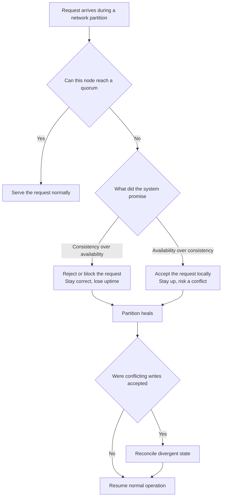
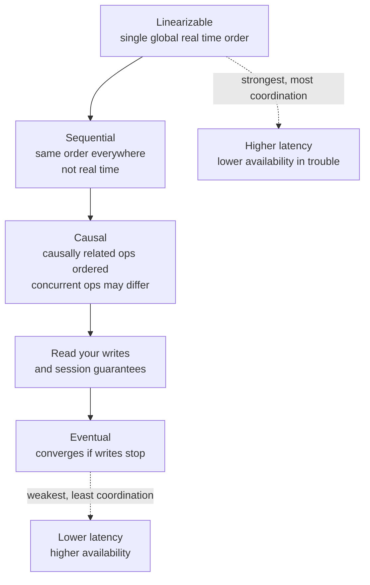
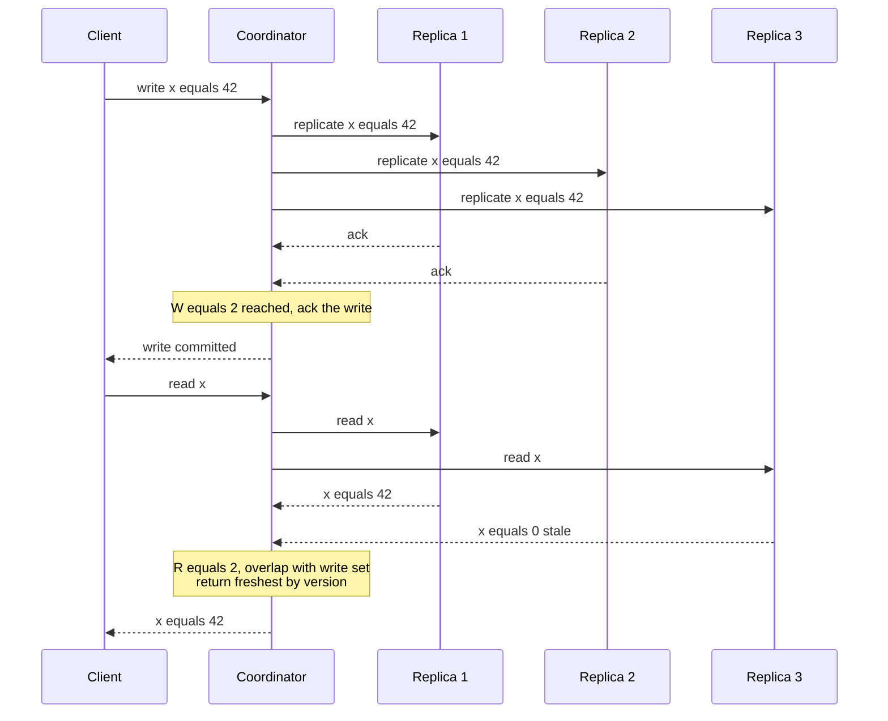
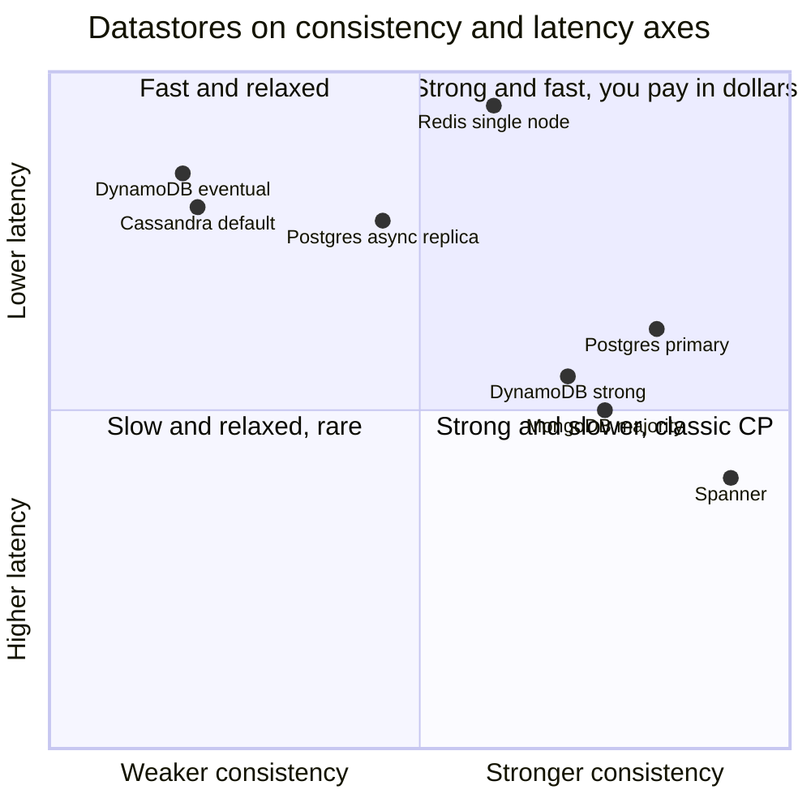

# The Theory That Survives: CAP, PACELC, and the Trade-offs an AI Will Quietly Violate

The system worked for fourteen months. Two regions, a primary and a follower, a queue in between, an inventory service that decremented stock when an order came in. It passed every test. It passed load tests at ten times peak. The on-call rotation was quiet enough that people stopped carrying their laptops to dinner.

Then a fiber cut between the two regions lasted ninety seconds. For ninety seconds, each region could still talk to its own customers but not to the other. Both regions kept taking orders, because that is what the code did, because nobody had written code that said otherwise. The last unit of a popular item sold in region A. The same last unit sold in region B. When the link healed, the two histories merged and the inventory count went negative. The fulfillment team shipped one order and refunded the other with an apology email that a human had to write.

Nobody chose this behavior. There was no design review where someone said "during a partition we will oversell and reconcile later." The behavior was a side effect of an architecture nobody had examined under the only condition that mattered: the one where the network breaks. The system did not have a consistency model. It had a default, inherited from whatever the libraries happened to do, and the default revealed itself the first time the network disagreed with itself.

Here is the part worth sitting with. Today, that inventory service would not be written by hand. You would describe it to a coding assistant, and it would produce a clean, idiomatic service with a producer, a consumer, retry logic, idempotency keys, the works. It would look more correct than the hand-written version. And it would have exactly the same flaw, because the flaw is not in the syntax. The flaw is a decision about what happens during a partition, and that decision is not visible in any line of code. It lives in the gap between what the theory says is possible and what the generated code silently assumed.

This post is about that gap. It is the most theory-leaning entry in this series for a deliberate reason: theory is the part of your knowledge with the longest shelf life, and it is precisely the part that AI tools assume you already have. Picture a brass balance scale, the old two-pan kind. Every guarantee you want from a distributed system goes in one pan. Consistency, availability, low latency, durability. The other pan holds what you pay. You do not get to load one pan for free. The theorems in this post are the law that governs the scale. They do not tell you what to build. They tell you which combinations are forbidden, so that when a tool hands you something that looks balanced, you can tell whether it actually is.

---

## Why Theory Has the Longest Shelf Life

Consider what has changed in the working life of a senior engineer over the last few years, and what has not.

The frameworks changed. The language ecosystems churned through major versions. The "correct" way to structure a service was rewritten twice. The cloud provider renamed three products and deprecated a fourth. An engineer who memorized the API surface of any specific tool in 2020 has been forced to re-memorize most of it since. That knowledge had a short half-life, and it always did. The novelty now is that you do not even need to hold it anymore. A model holds it for you and writes the call.

What did not change: a network with two nodes and a possible partition between them still cannot offer both perfect consistency and perfect availability during that partition. That was true when Eric Brewer conjectured it in 2000, true when Gilbert and Lynch proved it in 2002, and it will be true in every cloud that has not yet been built, because it is not a fact about clouds. It is a fact about information and the speed of its propagation. No framework upgrade repeals it. No model, however capable, routes around it, because it is not an engineering limitation to be engineered away. It is a boundary on the possible.

This is the asymmetry that defines senior judgment in the age of AI coding. The tool is extraordinary at the layer that churns. It is, by construction, unreliable at the layer that does not, because the durable layer is rarely written down in the code it learned from. CAP is not in your repository. The fact that your read path tolerates stale data but your write path does not is not in your repository either. These constraints live in the heads of the people who designed the system, and when the tool generates code, it cannot read those heads. It infers a default from the statistical center of its training data, and the statistical center is "looks reasonable," which is not the same as "honors the invariant your business depends on."

In the first post in this series, on [infrastructure and the failure modes of distributed systems](https://juanlara18.github.io/portfolio/#/blog/senior-infrastructure-distributed-systems-failure-networking), I argued that the senior skill is knowing how things break. This post is the formal companion: knowing what is provably impossible, so you can recognize when generated code is quietly promising it anyway. The two are the same muscle seen from different sides. One is empirical, the other is mathematical, and both have a shelf life measured in decades rather than release cycles.

So we are going to be a little more rigorous than usual. Not for rigor's sake. For shelf-life's sake.

---

## What CAP Actually Says, and the Misreadings

The CAP theorem, in its proven form, is narrow and precise. Gilbert and Lynch formalized Brewer's conjecture in 2002 and showed that it is impossible for a distributed data store to simultaneously provide all three of the following:

- **Consistency**, in the specific sense of linearizability: every read returns the most recent completed write, as if there were a single copy of the data and all operations happened one at a time in a global order.
- **Availability**: every request received by a non-failing node returns a non-error response, eventually.
- **Partition tolerance**: the system continues to operate despite an arbitrary number of messages being dropped or delayed between nodes.

The theorem says: pick at most two. That sentence is where almost every misreading begins, so let us dismantle the misreadings one at a time, because each one is a trap that generated code will happily walk you into.

**Misreading one: you freely choose two of three.** You do not. Partitions are not a property you elect to support. They are a property of the physical world. Networks drop packets, switches fail, a backhoe finds a fiber line, a garbage collection pause makes a node unresponsive long enough to be indistinguishable from a dead one. In any system that spans more than one machine, partitions will happen. So P is not on the menu as a free choice. The real choice CAP forces is the one that happens *during* a partition: when two nodes cannot talk, do you sacrifice consistency or availability? Everything else is theater. As Brewer himself put it in his 2012 retrospective, the practical question is not "CA versus CP versus AP" as a static label but "what do you give up, and only when a partition is actually happening?"

**Misreading two: C means transactions.** It does not. The C in CAP is linearizability, a property about the ordering of single-object operations across the whole system. The C in ACID is about transactions preserving invariants. They are different C's. A database can be fully ACID on a single node and offer no linearizability across replicas. A system can be linearizable for individual keys and offer no multi-key transactions at all. Conflating them is how people convince themselves that "we use Postgres, so we have CAP-consistency," which says nothing about what their read replicas return.

**Misreading three: AP systems are inconsistent and CP systems are unavailable, always.** Also wrong, and this one matters for cost. The trade-off only bites during a partition. A well-built AP system is perfectly consistent when the network is healthy, which is almost all the time. A well-built CP system is perfectly available when the network is healthy. The labels describe behavior in the degraded case, not the normal case. Treating them as permanent personality traits leads you to over-engineer for a failure mode that occupies a fraction of a percent of your uptime, while ignoring the trade-off that runs every millisecond of every day. Which is exactly the gap PACELC fills, and we will get there.

Here is the decision the theorem actually forces, as a diagram. Note that the branch point is the partition, not the architecture.



The inventory service from the opening lived in the bottom-right path without anyone deciding it should. It accepted writes locally during the partition, two regions sold the same unit, and the `MERGE` step was a human writing a refund email. The theory does not say that path is wrong. For a "likes" counter it is exactly right. The theory says that path exists, that it has a cost, and that you must choose it on purpose. The generated code chose it by omission.

A small formal note that sharpens the whole thing. Linearizability is a constraint on *real time*: if operation B starts after operation A completes, then B must observe A's effect. That is what makes it expensive. Honoring real-time order across machines means coordinating across machines, and coordination across a partition is the thing CAP says you cannot have for free. Herlihy and Wing, who defined linearizability in 1990, framed it as the illusion that each operation takes effect instantaneously at a single point between its call and its return. The illusion is gorgeous. The illusion costs a round trip.

---

## PACELC: The Refinement You Should Actually Use

CAP has a blind spot, and it is a big one: it only describes the system during a partition. But your system is not partitioned right now. It will not be partitioned for the vast majority of its operating life. So a theorem that only speaks to the partitioned case is silent about the trade-off you are paying continuously. Daniel Abadi named this gap in 2012 and gave us the better tool: PACELC.

It reads as a sentence. **If** there is a **P**artition, choose between **A**vailability and **C**onsistency; **E**lse, choose between **L**atency and **C**onsistency.

The first half is just CAP. The second half, the "else," is the part that earns the acronym its keep. Even with a perfectly healthy network, a distributed system that wants strong consistency must coordinate across replicas before it can answer, and coordination takes time. So the everyday trade-off, the one you pay on every single request when nothing is broken, is latency versus consistency. You can have a read that is guaranteed fresh, or you can have a read that is fast, and across replicas you generally cannot have both, because freshness means asking the other replicas and asking takes a round trip.

This reframes the datastore landscape far more usefully than CAP alone. Abadi's own classification gives each system two letters: its partition behavior and its else behavior.

| System | During Partition | Else (normal operation) | Abadi class |
|---|---|---|---|
| Default DynamoDB | Availability | Latency | PA/EL |
| Cassandra (tunable, default) | Availability | Latency | PA/EL |
| Spanner | Consistency | Consistency | PC/EC |
| Single-node Postgres | not applicable | Consistency | EC |
| Postgres with async replicas | reads stay up, may be stale | Latency on replicas, Consistency on primary | PA/EL-ish |
| MongoDB (default majority) | Consistency | Consistency | PC/EC |

That `EL` versus `EC` distinction is the one CAP could never express, and it is the one you feel in production every day. A PA/EL store like default Cassandra is telling you: in normal times I will answer fast and possibly stale, and during a partition I will stay up and possibly diverge. A PC/EC store like Spanner is telling you: I will pay a coordination cost on every write even when nothing is wrong, and during a partition I will refuse rather than diverge. Neither is better. They are points on the balance scale, and PACELC is the label on each pan.

The senior move is to notice that most systems are *tunable* along this axis, often per-operation, and the default is rarely the right setting for your specific call. Cassandra and DynamoDB let you dial consistency up for the one write that must not be lost and down for the thousand reads that can tolerate a stale value. The tool that generates your data-access layer will pick a default. PACELC is how you know which default it picked and whether it is the one your invariant requires.

---

## The Consistency Spectrum, From Strong to Eventual

"Consistency" is not a binary. It is a ladder, and each rung buys you a stronger guarantee at a higher coordination cost. Knowing the rungs by name is what lets you ask for the weakest one that still preserves your invariant, which is the whole game, because every rung above what you need is latency and availability you paid for and threw away. The definitions below follow the formal hierarchy catalogued by the Jepsen project, which remains the most careful public taxonomy of these models.

**Linearizable (strong).** There is a single global order of operations consistent with real time. Once a write completes, every subsequent read everywhere sees it. This is the illusion of a single copy. It is the most intuitive model and the most expensive, because it requires coordination on the critical path of every operation. Use it where correctness is non-negotiable per object: a unique-username claim, a distributed lock, a leader election, the account balance that must never go negative.

**Sequential.** All nodes see operations in the *same* order, but that order need not match real time. If you and I both issue writes, everyone agrees on whether yours or mine came first, but "first" may not correspond to the wall clock. Weaker than linearizable, and rarely the rung people actually want, because it drops the real-time guarantee that makes linearizability feel like a single machine.

**Causal.** Operations that are causally related are seen in the same order by everyone; operations that are independent ("concurrent") may be seen in different orders by different nodes. If a reply causally follows a message, no one sees the reply before the message. But two unrelated messages can be ordered differently for different observers. Causal consistency is the strongest model that is still achievable while remaining available during a partition, which makes it the sweet spot for a surprising number of collaborative and social systems. It is what you want when "reply appears before the comment it answers" would be a visible bug but global real-time order would be overkill.

**Read-your-writes (and the session guarantees).** A family of weaker, client-centric guarantees. Read-your-writes promises that after you write something, *you* will see it on subsequent reads, even if other clients do not yet. Its siblings are monotonic reads (you never see time go backwards), monotonic writes (your writes apply in order), and writes-follow-reads. These are cheap, they are local to a session, and they eliminate the most jarring user-facing anomalies, the user who posts a comment, refreshes, and watches their own comment vanish because the refresh hit a lagging replica.

**Eventual.** The weakest useful guarantee: if writes stop, all replicas eventually converge to the same value. It says nothing about *when* and nothing about what you read in the meantime. This is the cheapest and most available model. It is correct for a view counter, a "trending" list, a cache. It is a catastrophe for anything where a temporarily wrong answer causes a wrong action, like the inventory count that went negative.

The relationship between these rungs is a partial order, not a single line, but the dominant axis is clear: stronger guarantees, higher coordination cost, worse availability and latency during trouble.



The discipline here is subtraction, not addition. Start at the top and ask, for each specific operation, whether you can drop a rung without breaking an invariant. Most reads in most systems are fine at read-your-writes or causal. The handful that need linearizability are usually identifiable by a single test: would a stale answer cause an irreversible wrong action? If yes, stay strong. If no, drop down and reclaim the latency. The generated code will almost never make this distinction for you. It treats "the database read" as one uniform thing, when in fact your reads live on five different rungs and should be priced accordingly.

---

## Consensus and Quorums in One Breath

How does a system actually deliver the strong end of that spectrum across multiple machines? It gets the machines to *agree*, and agreement has a name and a cost.

Consensus is the problem of getting a set of nodes to decide on a single value despite some of them failing or being slow. It underpins everything strong: leader election, atomic commit, a linearizable register. And it is genuinely hard, which is why two algorithms, Paxos and Raft, exist as load-bearing infrastructure under most of the strongly-consistent systems you use. You do not need to implement either. You need to know why they have to exist and what they cost, because that cost is the price of the top rung of the ladder.

They have to exist because of a result so fundamental it has its own three letters: **FLP**. Fischer, Lynch, and Paterson proved in 1985 that in a fully asynchronous system, no deterministic algorithm can guarantee consensus if even a single process may crash. Not "it is slow." Impossible, in the strict sense, because you can never distinguish a crashed node from a merely slow one when there is no bound on message delay, and that ambiguity can be stretched forever. This is the bedrock under CAP. It is why every real consensus system quietly relies on timeouts and partial synchrony to make progress: they trade FLP's impossible guarantee of always-terminating for a practical "terminates when the network behaves," which is the best anyone can do. When your consensus-backed database stalls during a network blip, you are watching FLP collect its toll.

The practical mechanism most strong systems use is the **quorum**. Spread your data across $N$ replicas. Require every write to be acknowledged by at least $W$ of them and every read to consult at least $R$ of them. If you choose

$$W + R > N$$

then any read set and any write set must overlap in at least one node, so every read is guaranteed to see the most recent acknowledged write. The overlap is the whole trick. A common configuration is $N = 3, W = 2, R = 2$: two of three must ack a write, two of three must answer a read, and since $2 + 2 > 3$ the two sets cannot be disjoint. You can also bias the scale. Set $W = N$ and $R = 1$ for fast reads and slow, fragile writes; set $W = 1$ and $R = N$ for the reverse. Each setting is a different point on the same brass balance.

Here is the round trip a quorum write-then-read actually performs. Every one of these arrows is latency you are paying for the strong guarantee.



Notice that R3 returned a stale value and the system still answered correctly, because the overlap guaranteed at least one fresh replica in the read set and version metadata picked the winner. That is quorum consistency in one breath. Notice also the sheer number of messages for a single logical read and write. That message count is the latency cost in PACELC's "else" branch, made concrete. Strong consistency is not free even when the network is perfect; it is several round trips you chose to pay.

A minimal quorum read in code, to make the overlap concrete rather than abstract:

```python
from dataclasses import dataclass

@dataclass
class VersionedValue:
    value: object
    version: int  # monotonic per key, e.g. a Lamport-style counter

def quorum_read(replicas, key, N, R):
    """Read from R of N replicas and return the highest-versioned value.
    W + R > N at write time guarantees the freshest write is in this set.
    """
    responses = []
    for replica in replicas:
        try:
            responses.append(replica.get(key))   # VersionedValue
            if len(responses) >= R:               # stop at R, do not wait for all N
                break
        except ReplicaUnreachable:
            continue  # tolerate up to N - R unreachable replicas

    if len(responses) < R:
        raise QuorumNotReached(f"got {len(responses)} of required {R}")

    freshest = max(responses, key=lambda r: r.version)
    # Read repair: push the freshest value to any replica that lagged.
    for replica, resp in zip(replicas, responses):
        if resp.version < freshest.version:
            replica.put_async(key, freshest)
    return freshest.value
```

The line that matters is `raise QuorumNotReached`. That is the CAP choice rendered in Python: when fewer than $R$ replicas answer, a CP system raises and refuses, choosing consistency over availability. An AP system would delete that line and return whatever it could get, choosing the opposite. Which line the generated code writes is the entire consistency decision, and it is one line, easy to miss in a review that is skimming for syntax errors rather than for surrendered invariants.

---

## The Trade-off as a Decision Tool, and Where Real Datastores Land

You now have three pans to balance: consistency, latency, and availability. The brass scale is really a triangle, and every datastore is a point inside it. Putting real systems on the same axes turns the theory into a selection tool instead of a quiz.

The cleanest two axes for an everyday decision are how strong the default consistency is and how low the typical latency is. Here is where the major systems land, roughly. Higher on the consistency axis means stronger default guarantees; higher on the latency axis means lower latency, that is, faster.



Read the picture as a set of deliberate positions, not a ranking. Spanner sits far right and low: it buys near-linearizable consistency across regions using synchronized clocks, and pays for it in write latency and operational cost. Cassandra and eventual-mode DynamoDB sit far left and high: relaxed by default, blisteringly fast, available through almost anything, and they hand you the reconciliation problem in return. Postgres shows up as two points, because the primary and an async replica are genuinely different consistency stores wearing the same brand, which is exactly the trap from the inventory story: a developer reasons about "Postgres" as if it were one guarantee, while their read traffic is being served by a replica that is a second behind.

The senior workflow with this chart is not "pick the best one." It is to take each *operation* in your system, decide the weakest acceptable rung on the consistency ladder, and route it to a store, or a mode of a store, that sits at that point. A single application legitimately spans the chart: the unique-username check goes to a linearizable store, the home feed reads from an eventual replica, the session data uses read-your-writes. The error a generated architecture tends to make is uniformity: it picks one store and one consistency mode and applies it to everything, which means you are either overpaying for consistency on your feed or underdelivering it on your usernames. Uniformity is the smell. Heterogeneity, matched to invariants, is the senior signature.

A compact decision procedure you can apply per operation:

```python
def required_consistency(operation):
    """Return the weakest consistency rung that preserves correctness."""
    if operation.stale_read_can_cause_irreversible_action:
        return "linearizable"        # balances, locks, uniqueness, inventory
    if operation.users_must_see_their_own_effects_immediately:
        return "read_your_writes"    # profile edits, posting then refreshing
    if operation.order_between_related_events_is_visible:
        return "causal"              # comment threads, chat, collaborative docs
    return "eventual"                # counters, trending, caches, analytics
```

This function is the thing the model cannot write for you, because it encodes business consequences, not code patterns. "Irreversible action" is a fact about your domain, not your syntax. You supply the judgment; the tool supplies the implementation once the judgment is made.

---

## Idempotency and the Exactly-Once Myth

There is one promise that sits underneath all of this and that generated code over-promises more than any other: exactly-once delivery. It is worth ending the technical tour here, because it is where theory and the daily reality of distributed code collide most often.

The honest statement is blunt: **exactly-once delivery does not exist** over an unreliable network. You can have at-most-once, where a message is delivered zero or one times, by never retrying, accepting that some messages are simply lost. You can have at-least-once, where a message is delivered one or more times, by retrying until acknowledged, accepting duplicates. You cannot have exactly-once *delivery*, because the sender can never be certain whether a lost acknowledgment means the message failed to arrive or the acknowledgment failed to return, and those two cases require opposite responses. The two-generals problem is the folk version of this; FLP is the rigorous version.

What you *can* have is exactly-once *processing*, which is a different and achievable thing. You take an at-least-once channel, which duplicates, and you make the *effect* of processing a message idempotent, so that processing it twice produces the same state as processing it once. The network still delivers duplicates. Your handler simply stops caring. "Exactly-once" systems that genuinely work, including the well-known message brokers that advertise it, are all doing this underneath: at-least-once delivery plus idempotent application, usually via deduplication keys. The phrase on the box is marketing. The mechanism in the code is idempotency.

The pattern is small and you should be able to recognize it on sight, because it is the difference between the opening story ending in a refund email and ending in a no-op:

```python
def process_payment(request, db):
    """Idempotent payment handler. Safe to call repeatedly with the same key."""
    key = request.idempotency_key  # client-generated, stable across retries

    # Atomic claim: insert the key, or learn it was already processed.
    # The unique constraint on idempotency_key does the heavy lifting.
    try:
        with db.transaction():
            db.execute(
                "INSERT INTO processed_requests (key, status) VALUES (%s, 'in_progress')",
                [key],
            )
            result = charge_card(request.amount, request.card)
            db.execute(
                "UPDATE processed_requests SET status='done', result=%s WHERE key=%s",
                [result.id, key],
            )
            return result
    except UniqueViolation:
        # We have seen this key. Return the stored result, do not charge again.
        existing = db.query_one(
            "SELECT status, result FROM processed_requests WHERE key=%s", [key]
        )
        if existing.status == "done":
            return existing.result
        raise RetryLater("original request still in progress")
```

Two details carry the whole pattern. First, the idempotency key is generated by the *client* and held stable across retries, so that the duplicate caused by a lost acknowledgment carries the same key as the original. Second, the uniqueness guarantee on that key must itself be linearizable, which quietly drags the entire CAP discussion back into the room: idempotency at scale *depends on* a strongly consistent uniqueness check, so your dedup store has to sit at the strong end of the ladder even if everything around it is eventual. This is the kind of dependency a generated handler routinely gets wrong. It will produce the `try/except UniqueViolation` shape, because that shape is all over its training data, and it will cheerfully back it with an eventually-consistent store that lets two concurrent requests both win the insert during a partition, charging the card twice. The shape is right. The substrate is wrong. Only someone who knows that the dedup check is secretly a linearizability requirement will catch it.

---

## What the AI Assumes You Already Know

Pull the thread through all of it and a single pattern emerges. At each layer, the coding tool produces something that is structurally correct and semantically under-specified, and the missing specification is exactly the theory.

It assumes you know that **the consistency model is a decision, not a default.** It will generate a read path without ever asking whether a stale read is acceptable, because "the database read" is one undifferentiated thing in its world. You know it is five different things on five different rungs.

It assumes you know that **the partition is the only case that matters and the only case it will not test.** Its generated tests exercise the happy path and ordinary errors. They do not pause the network between two nodes and assert what happens, because that scenario barely appears in the code it learned from. You know that the behavior under partition is the system's true consistency model and everything else is the disguise.

It assumes you know that **strong consistency has a latency price you pay even when nothing is broken.** It will reach for the strongest available default because "consistent" sounds safe, silently signing you up for the coordination cost on every request. You know PACELC's "else" branch, and you know to drop to the weakest rung that holds your invariant.

It assumes you know that **exactly-once is idempotency wearing a costume**, and that idempotency at scale rests on a linearizable uniqueness check. It will write the dedup shape and back it with whatever store is lying around. You know the substrate has to be strong or the whole guarantee dissolves during the one partition that matters.

And it assumes you know that **these constraints are permanent.** It cannot tell you that, because nothing in its training distinguishes the parts of software that churn from the parts that are law. To the model, CAP and the latest framework's retry helper are the same kind of fact, equally revisable, equally a matter of the current best pattern. You know that one of them will outlive every framework in the file.

That is the shape of senior judgment now, and it is the throughline of this whole series. In the [data modeling post](https://juanlara18.github.io/portfolio/#/blog/senior-data-modeling-query-patterns-database-design) the scarce skill was knowing which access patterns the schema must serve before a line of DDL exists. In the [API design post](https://juanlara18.github.io/portfolio/#/blog/senior-api-design-contracts-versioning-dx) it was treating the interface as a contract that outlives its implementation. Here it is knowing which trade-offs are forbidden by theorems rather than chosen by taste. In the [final post on engineering for product](https://juanlara18.github.io/portfolio/#/blog/senior-product-engineering-scale-prioritization-architecture) it becomes deciding what is even worth building. In every case the tool writes the code and the human supplies the constraint the code must honor. The code has a short shelf life. The constraint does not.

The brass scale is the right thing to keep in your head, because it never lies. Every guarantee in one pan is paid for in the other. The theorems in this post are simply the precise statement of the exchange rate. A tool can load the pans for you faster than you ever could by hand. It cannot tell you which weights you can afford to lose, and during the ninety seconds when the fiber is cut, that is the only question that was ever real.

---

## Prerequisites and Gotchas

**Prerequisites for applying this well:**

- A working mental model of a network that drops and delays packets, and of a node that pauses long enough to look dead, which is the [infrastructure-and-failure](https://juanlara18.github.io/portfolio/#/blog/senior-infrastructure-distributed-systems-failure-networking) material in post one of this series.
- Comfort with the difference between ACID transactions and replica consistency. They are different C's and conflating them is the most common entry-level error.
- The ability to enumerate, for your own system, every operation and the consequence of a stale read on each. Without that list, the consistency ladder is abstract.

**Gotchas that bite in production:**

- **The read-replica trap.** "We use a strongly consistent database" is true of the primary and false of the async replica your read traffic actually hits. Always ask which node serves the read.
- **Default consistency settings.** Cassandra, DynamoDB, and MongoDB all ship with a default consistency mode that may not be the one your invariant needs. Generated data-access code inherits the default silently. Check it explicitly per operation.
- **Idempotency backed by an eventually-consistent store.** The dedup key's uniqueness check must be linearizable. Backing it with an eventual store reintroduces the exact double-processing you were preventing, but only during a partition, so it passes every test.
- **Clock-based "consistency."** Systems that order events by wall-clock timestamp are not consistent; they are guessing, because unsynchronized clocks drift. Spanner works because it uses bounded-uncertainty synchronized time and *waits out the uncertainty*; a naive `created_at` comparison does not.
- **Treating CAP labels as permanent traits.** A system is only "AP" or "CP" during a partition. Designing around the degraded behavior while ignoring the everyday PACELC latency-versus-consistency cost optimizes the rare case and neglects the constant one.

## Testing Distributed Guarantees

You cannot unit-test a consistency model, because the model is a statement about behavior under partition, and a unit test never partitions anything. Testing these properties requires deliberately breaking the network and asserting on what the system does.

- **Inject partitions on purpose.** Use a fault-injection layer to sever links between nodes and hold the partition open while traffic flows. The question under test is not "does it crash" but "what consistency did it actually deliver while split."
- **Check histories, do not just check values.** A read returning a plausible value is not evidence of correctness. You need to record the full history of operations and verify it against the claimed model. This is what the Jepsen tooling does: it generates concurrent operations, records a history, and uses a checker to decide whether that history is linearizable, or causal, or merely eventual.
- **Test the reconciliation path, because it is real code that rarely runs.** If your system accepts conflicting writes during a partition, the merge logic executes only after a partition heals, which is to say almost never, which is to say it is almost certainly buggy. Force it.
- **Assert idempotency under duplication.** Replay the same message with the same key concurrently and assert the effect happened exactly once. Then do it again across a simulated partition of the dedup store, which is where the eventual-substrate bug hides.
- **Measure the latency cost of your consistency setting.** Run the same workload at each consistency level and look at the tail. The gap between strong and eventual at p99 is PACELC's "else" branch in milliseconds, and it tells you what you are paying.

## Going Deeper

**Books:**

- Kleppmann, M. (2017). *Designing Data-Intensive Applications.* O'Reilly.
  - The single best practitioner's treatment of consistency, replication, and consensus. Chapters 5, 7, and 9 cover replication, transactions, and consistency-and-consensus respectively, and map almost one-to-one onto this post. A second edition co-authored with Chris Riccomini arrived in 2026.
- Cachin, C., Guerraoui, R., and Rodrigues, L. (2011). *Introduction to Reliable and Secure Distributed Programming.* Springer.
  - The rigorous companion. If you want consensus, quorums, and failure detectors stated as algorithms with proofs rather than prose, this is the reference.
- Tanenbaum, A. and Van Steen, M. (2017). *Distributed Systems* (3rd ed.).
  - A broad, classic survey, freely available from the authors, useful for placing CAP and consistency in the larger landscape of naming, time, and coordination.
- Petrov, A. (2019). *Database Internals.* O'Reilly.
  - The second half is a tour of distributed storage engines, replication, and consensus implementations, grounding the theory in how real databases are actually built.

**Online Resources:**

- [Jepsen: Consistency Models](https://jepsen.io/consistency) — The most careful public taxonomy of consistency models, with a navigable map of the hierarchy and precise definitions of each rung.
- [The Jepsen analyses](https://jepsen.io/analyses) — Kyle Kingsbury's empirical teardowns of how real databases behave under partition. Reading a few of these will permanently change how much you trust a vendor's consistency claims.
- [Aphyr: Call Me Maybe series](https://aphyr.com/tags/jepsen) — The original blog posts behind Jepsen, each one a story of a database promising more than it delivered when the network broke.

**Videos:**

- [Distributed Systems lecture series](https://www.youtube.com/playlist?list=PLeKd45zvjcDFUEv_ohr_HdUFe97RItdiB) by Martin Kleppmann (University of Cambridge) — An eight-lecture undergraduate course covering replication, consensus, linearizability, and eventual consistency, with accompanying notes. The clearest free derivation of this material available.
- [Distributed Systems 7.3: Eventual consistency](https://www.youtube.com/watch?v=9uCP3qHNbWw) by Martin Kleppmann — A focused single lecture on eventual consistency, quorums, and read-repair, which is the bottom of the ladder explained precisely.

**Academic Papers:**

- Brewer, E. (2012). ["CAP Twelve Years Later: How the Rules Have Changed."](https://www.infoq.com/articles/cap-twelve-years-later-how-the-rules-have-changed/) *Computer*, 45(2), 23-29.
  - Brewer's own retrospective, where he dismantles the "pick two" misreading and reframes CAP as a choice made only during a partition. Read this before you cite CAP in any argument.
- Abadi, D. (2012). ["Consistency Tradeoffs in Modern Distributed Database System Design: CAP is Only Part of the Story."](https://dl.acm.org/doi/10.1109/MC.2012.33) *Computer*, 45(2), 37-42.
  - The PACELC paper. Short, sharp, and the most useful single refinement of CAP for practitioners.
- Fischer, M., Lynch, N., and Paterson, M. (1985). ["Impossibility of Distributed Consensus with One Faulty Process."](https://groups.csail.mit.edu/tds/papers/Lynch/jacm85.pdf) *Journal of the ACM*, 32(2), 374-382.
  - The FLP result. The bedrock impossibility under everything strong, and the reason every real consensus system relies on timeouts.
- Herlihy, M. and Wing, J. (1990). ["Linearizability: A Correctness Condition for Concurrent Objects."](https://dl.acm.org/doi/10.1145/78969.78972) *ACM TOPLAS*, 12(3), 463-492.
  - The original definition of linearizability, the "C" that CAP actually means.
- Kleppmann, M. (2015). ["A Critique of the CAP Theorem."](https://arxiv.org/abs/1509.05393) arXiv:1509.05393.
  - A careful argument that CAP's definitions are slippery and that linearizability-plus-availability is the precise tension worth reasoning about. Useful for sharpening exactly what you mean when you invoke CAP.

**Questions to Explore:**

- If most of your operations can tolerate causal consistency, why do so many systems default to either linearizable or eventual, skipping the rung that is arguably the best fit? What makes the middle of the ladder so under-served in practice?
- An AI tool generates a service and its tests, and every test passes. What would it take to make such a tool also generate the *partition* test, the one that reveals the real consistency model, and why is that case so absent from the code it learned from?
- Spanner buys near-linearizable global consistency with synchronized clocks and bounded uncertainty. Is that a refutation of CAP, a clever hiding of the cost, or simply a very expensive point on the same balance scale?
- If exactly-once delivery is impossible but exactly-once processing is routine, why does the impossible phrasing persist on so many product pages? What does that tell you about the gap between what a system promises and what it does?
- As coding tools take over more of the implementation, does the value of knowing these theorems go up or down? Make the case for both, and decide which you believe.
