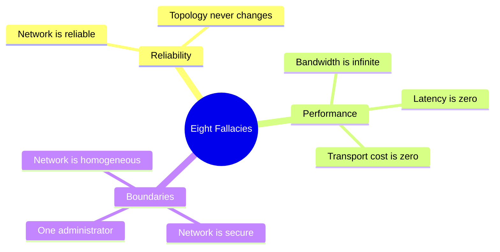
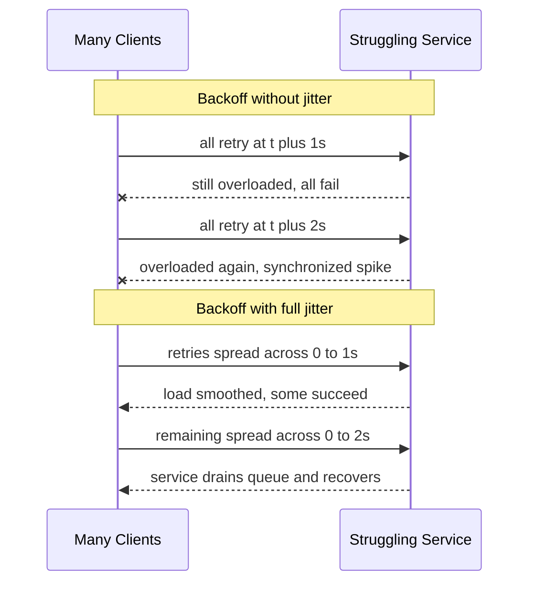
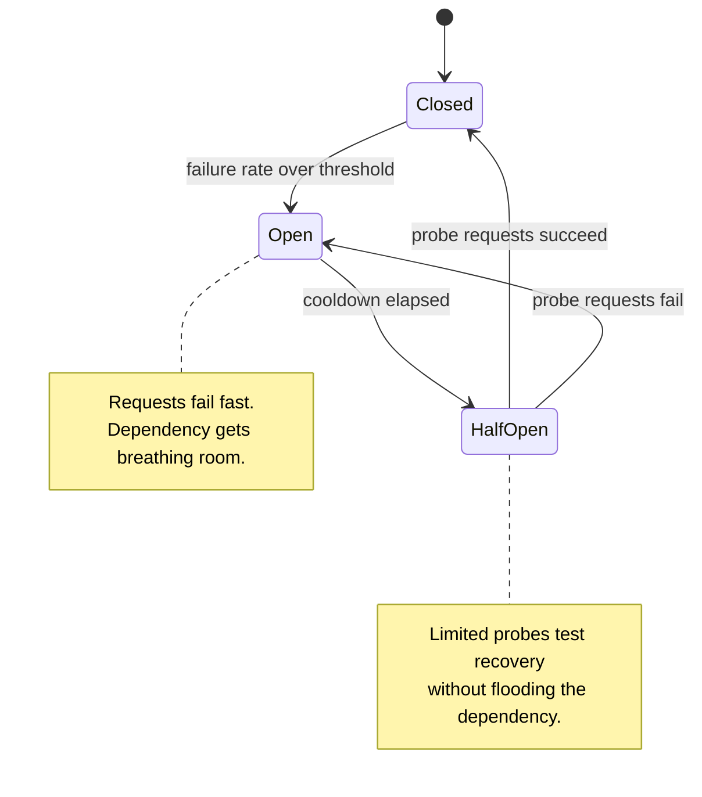
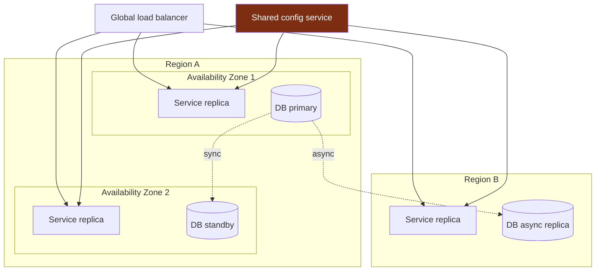

# The Grid Doesn't Care About Your Retry Loop: Infrastructure Judgment in the Age of AI Coding

At 2:14 in the afternoon on August 14, 2003, a race condition in a Unix-based energy management system called XA/21 quietly stalled the alarm subsystem in a FirstEnergy control room in Ohio. The operators did not know. The screens looked fine. For over an hour, the system that was supposed to tell humans when something was wrong simply stopped telling them anything at all.

Outside, a 345 kV transmission line called Chamberlin-Harding sagged in the August heat and brushed against an overgrown tree. It tripped. The load it had been carrying did not vanish; it flowed to neighboring lines, which were now carrying more than they were rated for. Those lines heated, sagged, hit their own trees, and tripped. Each failure handed its burden to the survivors, and each survivor was now closer to its own limit. Three hours later, 55 million people across eight US states and Ontario were in the dark. It remains one of the largest blackouts in North American history.

The thing worth sitting with is that no single component failed catastrophically. A tree grew. A line sagged. A piece of software hit a race condition and went silent. Each of these was survivable. What turned three survivable faults into a continental blackout was the absence of judgment about how failures propagate, how load redistributes, and what happens when the system that tells you the truth is itself part of the failure.

I open a series about senior engineering in the age of AI coding with the power grid because the grid is the cleanest physical model we have for the thing that AI code generators cannot do for you. An AI will write you a retry loop, a Kubernetes manifest, a load balancer config, a health check, a circuit breaker, all in seconds, all syntactically perfect. What it will not do is decide your failure domains. It will not know that your retry, multiplied across ten thousand clients, is a thundering herd aimed at a database that is already on fire. It will not tell you that your two redundant availability zones share a single network appliance, so your redundancy is a fiction. The implementation has become cheap. The judgment about what to implement, and how the pieces fail together, has not.

This is the throughline for the whole series: AI now generates the code. What stays scarce is knowing what to build, which trade-off to take, and how to recognize when the generated code is subtly, dangerously wrong. Infrastructure is where I start, because infrastructure is where being subtly wrong has the largest blast radius.

---

## Why Infrastructure Judgment Outlives the Code Generator

There is a comfortable story going around that says infrastructure is becoming a solved problem. The cloud abstracts the hardware. The orchestrator abstracts the cloud. The AI abstracts the orchestrator. Soon you describe what you want in English and the machine assembles it. There is truth in the trend, but the conclusion is wrong, and it is wrong in a specific way that matters.

Code generation is good at the parts of infrastructure that are *local and syntactic*. A health check endpoint. A retry decorator. A Helm chart with sensible defaults. A Terraform module that stands up a managed database. These are pattern-completion tasks, and pattern completion is exactly what a language model is built to do. If you ask for a retry with exponential backoff, you will get a textbook retry with exponential backoff, and it will probably even include jitter, because the training data is full of good examples.

Infrastructure failure, on the other hand, is *global and emergent*. It is not a property of any one component. It is a property of how components interact under stress, at scale, at the worst possible time. The 2003 blackout was not caused by a bad transmission line. It was caused by the relationship between many transmission lines, a load distribution, and a missing alarm. You cannot read it off any single file. You cannot pattern-match it from a snippet.

The senior engineer's value lives almost entirely in that emergent layer. Consider what you actually decide when you design a distributed system. You decide what is allowed to fail together and what must fail independently. You decide how much latency you will trade for how much consistency. You decide whether, when a dependency is slow, your service waits, fails fast, or serves a degraded answer. You decide how big the explosion is when the inevitable happens. None of these are coding decisions. They are judgment decisions, and they constrain the code, not the other way around.

Here is the practical consequence. When you let an AI scaffold infrastructure, you are not getting a system. You are getting components that look like a system. The components are fine. The relationships between them, the failure correlations, the blast radius, the question of whether two things that look independent actually share a hidden dependency, those are still yours to own. The generator gives you a faster way to express a decision. It does not make the decision, and it cannot tell you when your decision is wrong.

For the rest of this post I am going to walk through the body of knowledge that lets you make those decisions: the fallacies that still trip people, failure handling done properly, the networking facts a senior keeps loaded in their head, redundancy and cascading failure, and observability. At the end of each major idea I will name, concretely, what the AI tool will get right and what it will not. That last part is the point.

---

## The Fallacies of Distributed Computing, Revisited

In 1994, L. Peter Deutsch at Sun Microsystems wrote down a list of false assumptions that programmers new to distributed systems reliably make. He built on earlier work by Bill Joy and Dave Lyon, and around 1997 James Gosling added the eighth. The list has survived three decades of hardware revolution essentially intact, which should tell you something: these are not facts about 1994 technology. They are facts about the gap between how we *want* to reason and how networks *actually behave*.

The eight fallacies are:

1. The network is reliable.
2. Latency is zero.
3. Bandwidth is infinite.
4. The network is secure.
5. Topology does not change.
6. There is one administrator.
7. Transport cost is zero.
8. The network is homogeneous.

The reason these still bite is that every one of them is *locally true and globally false*. On your laptop, talking to localhost, the network is reliable, latency is near zero, bandwidth is effectively infinite, and there is one administrator: you. Every assumption holds. Then you ship to production, and each one inverts, and the code that was correct on your laptop is now a latent incident.

Let me take the three that cause the most damage in modern systems.

**The network is reliable** is the fallacy behind every missing timeout and every naive retry. The network is a shared, contended, physical thing. Packets are dropped, reordered, and delayed. Connections are reset by middleboxes you did not know existed. A call that succeeds 99.9 percent of the time fails one time in a thousand, and if you make a million calls a day, that is a thousand failures a day, and if you did not write code for the failure path, you wrote a thousand bugs. The grid analogy is exact: a transmission line is reliable until the afternoon it touches a tree, and the whole design discipline of the grid is about what happens *after* that line fails, not pretending it will not.

**Latency is zero** is the fallacy that destroys performance in chatty systems. A function call inside a process is nanoseconds. A call across the network in the same datacenter is roughly half a millisecond, which is hundreds of thousands of times slower. A call across continents is around 150 milliseconds, governed ultimately by the speed of light, which you do not get to optimize. The danger is that a remote call *looks* like a local call in your code. An ORM lazy-loads a relationship and you have a hidden network round trip inside a loop, and now your endpoint that was fast in development makes 400 sequential database calls in production and times out.

**Bandwidth is infinite** is the quieter cousin. It rarely causes outright failure; it causes slow, expensive degradation. You serialize a 2 MB object and send it on every request because it was convenient, and at ten thousand requests per second you have saturated a link and your transport bill has a comma you did not expect.

The remaining fallacies are no less real. *The network is secure* is why zero-trust exists; assume every hop is hostile. *Topology changes* is the daily reality of autoscaling and rolling deploys, where the set of healthy hosts is never the same two seconds in a row. *There is one administrator* dies the moment your request crosses into a dependency owned by another team, another company, another cloud. *Transport cost is zero* is a line item on your cloud bill, especially cross-zone and egress traffic. *The network is homogeneous* fails the instant a single client on a bad connection, or a single service running an old protocol version, behaves differently from everyone else.



**What the AI tool will and will not get right here.** Ask an AI to write network code and it will, by default, include timeouts and error handling, because the good patterns are well represented in its training data. That is genuinely useful. What it will not do is reason about your *specific* topology. It does not know that the dependency you are calling is owned by a team that deploys on Fridays, or that your retry budget across three nested services multiplies into a 27x amplification at the bottom of the stack, or that the 2 MB payload you casually pass around is fine at your current scale and a bandwidth bomb at 10x. The fallacies are not bugs in code; they are wrong assumptions about the world the code runs in. The AI shares your assumptions. It cannot correct a worldview it inherited from you.

---

## Failure Handling: The Part Everyone Generates and Few Get Right

This is the heart of it. Distributed systems engineering is, to a first approximation, the discipline of behaving well when something you depend on misbehaves. Five tools do most of the work: timeouts, retries with backoff and jitter, circuit breakers, idempotency, and graceful degradation. An AI will hand you a plausible version of all five. The senior work is in the parameters, the interactions, and knowing when each one is the wrong tool.

### Timeouts: The Decision You Make by Not Deciding

Every remote call needs a timeout. This is not negotiable, and Marc Brooker makes the point bluntly in the Amazon Builders' Library: set a timeout on any call across a process boundary, and set both the connection timeout and the request timeout. The reason is brutal arithmetic. A call without a timeout does not fail; it hangs. A hung call holds a thread, or a connection from the pool, or a goroutine. Under load, every one of those resources is finite. A downstream service that goes slow but not down will, given no timeouts, consume every thread in your service one stuck request at a time, until your healthy service is also down. You did not crash. You were strangled by a dependency, holding the door open for it the whole time.

The senior judgment is the *value*. Too long and the timeout does nothing; you are dead before it fires. Too short and you abort calls that would have succeeded, converting latency blips into errors and adding retry load to a system that was about to recover. The right value comes from your latency distribution, not your average. If your p99 downstream latency is 300 ms, a 250 ms timeout fails one percent of healthy traffic for no reason. The default an AI gives you, often a round number like 30 seconds, is almost always wrong, and it is wrong in the dangerous direction: far too long.

### Retries: A Loaded Gun Pointed at Your Own Infrastructure

Retries are the most dangerous safety feature in distributed systems. They turn a transient failure into a success, which is wonderful, and they turn an overloaded system into a dead one, which is catastrophic, and the line between the two is thinner than people think.

The failure mode has a name: the thundering herd, or the retry storm. A service gets slow. Its clients time out and retry. The retries are *additional* load on a service that was already struggling, so it gets slower, so more requests time out, so they retry, and the system enters a feedback loop that the original problem did not require. This is precisely the grid's cascade: the failure of one element transfers load to others, pushing them past their limits. Naive retries are how you wire your own software for cascading failure.

Two ideas defang the gun. The first is **exponential backoff**: wait longer between each successive attempt, so a struggling service gets breathing room instead of a barrage. The second, and the one people skip, is **jitter**: add randomness to the wait. The AWS Architecture Blog post by Marc Brooker shows why this is not optional. Exponential backoff alone still leaves clients synchronized; they all failed at the same instant, so they all back off by the same amount, so they all retry at the same instant. You have not removed the herd, you have only delayed it and made it periodic. Jitter spreads the retries across time, smoothing the load from a series of spikes into something the downstream can actually absorb.

Here is a production-quality retry with full jitter and a retry budget.

```python
import random
import time
from dataclasses import dataclass
from typing import Callable, Iterable, TypeVar

T = TypeVar("T")


class RetryBudgetExceeded(Exception):
    """Raised when the caller has spent its allowed retry budget."""


@dataclass
class RetryPolicy:
    max_attempts: int = 4
    base_delay: float = 0.1      # seconds
    max_delay: float = 10.0      # ceiling for any single backoff
    retryable: tuple = (TimeoutError, ConnectionError)

    def backoff_with_full_jitter(self, attempt: int) -> float:
        # attempt is zero indexed. Exponential growth, capped, then
        # uniformly sampled in 0..cap. This is the AWS "full jitter"
        # strategy: it removes client synchronization entirely.
        cap = min(self.max_delay, self.base_delay * (2 ** attempt))
        return random.uniform(0, cap)


def call_with_retry(
    fn: Callable[[], T],
    policy: RetryPolicy,
    is_idempotent: bool,
) -> T:
    # The single most important guard: never silently retry a call
    # that mutates state unless it is provably safe to repeat.
    if not is_idempotent:
        raise ValueError(
            "Refusing to auto-retry a non-idempotent call. "
            "Use an idempotency key or mark the operation safe."
        )

    last_error: Exception | None = None
    for attempt in range(policy.max_attempts):
        try:
            return fn()
        except policy.retryable as err:
            last_error = err
            if attempt == policy.max_attempts - 1:
                break
            delay = policy.backoff_with_full_jitter(attempt)
            time.sleep(delay)

    raise RetryBudgetExceeded(
        f"Failed after {policy.max_attempts} attempts"
    ) from last_error
```

Two design choices in that code are judgment, not syntax. First, the function *refuses to retry a non-idempotent operation by default*. An AI will happily wrap any call in a retry loop; it does not know that the call charges a credit card. Retrying a non-idempotent mutation is how you bill a customer three times. Second, the retry budget is bounded and the jitter is full. The AI's default retry often uses fixed delays or backoff without jitter, which is the synchronized herd waiting to happen.

The sequence below shows why jitter matters. Without it, every client marches in lockstep; with it, the load smears out.



### Circuit Breakers: Knowing When to Stop Trying

Retries help when a failure is transient. When a dependency is genuinely down, retries are pure harm: every retry is wasted work, added load, and latency you are paying for a result you will not get. The circuit breaker is the pattern that knows the difference. It comes from Michael Nygard's *Release It!* and was popularized in Martin Fowler's write-up, and the physical metaphor is exact: like the breaker in your home's electrical panel, it trips to stop a fault from spreading, and it stays tripped until it is safe to close again.

A circuit breaker has three states. **Closed** is normal: requests flow through and failures are counted. When failures cross a threshold, the breaker trips to **Open**: requests fail immediately, without even attempting the call, which both protects the caller from wasting resources and gives the struggling dependency room to recover. After a cooldown, the breaker moves to **Half-Open**: it lets a small number of probe requests through. If they succeed, it closes and normal life resumes; if they fail, it trips back open and the cooldown restarts.



Here is a compact, thread-aware implementation.

```python
import threading
import time
from enum import Enum


class State(Enum):
    CLOSED = "closed"
    OPEN = "open"
    HALF_OPEN = "half_open"


class CircuitOpenError(Exception):
    """Raised when the breaker is open and rejects the call fast."""


class CircuitBreaker:
    def __init__(
        self,
        failure_threshold: int = 5,
        cooldown_seconds: float = 30.0,
        half_open_max_calls: int = 1,
    ):
        self._failure_threshold = failure_threshold
        self._cooldown = cooldown_seconds
        self._half_open_max = half_open_max_calls

        self._state = State.CLOSED
        self._failures = 0
        self._opened_at = 0.0
        self._half_open_calls = 0
        self._lock = threading.Lock()

    def _can_attempt(self) -> bool:
        with self._lock:
            if self._state is State.CLOSED:
                return True
            if self._state is State.OPEN:
                if time.monotonic() - self._opened_at >= self._cooldown:
                    self._state = State.HALF_OPEN
                    self._half_open_calls = 0
                    return True
                return False
            # HALF_OPEN: admit only a few probes.
            if self._half_open_calls < self._half_open_max:
                self._half_open_calls += 1
                return True
            return False

    def _on_success(self) -> None:
        with self._lock:
            self._failures = 0
            self._state = State.CLOSED

    def _on_failure(self) -> None:
        with self._lock:
            self._failures += 1
            if self._state is State.HALF_OPEN:
                self._state = State.OPEN
                self._opened_at = time.monotonic()
            elif self._failures >= self._failure_threshold:
                self._state = State.OPEN
                self._opened_at = time.monotonic()

    def call(self, fn):
        if not self._can_attempt():
            raise CircuitOpenError("circuit is open")
        try:
            result = fn()
        except Exception:
            self._on_failure()
            raise
        self._on_failure if False else self._on_success()
        return result
```

The judgment, again, is not in the structure; the structure is in every tutorial. The judgment is in *what you do when the breaker is open*. Failing fast is correct, but failing fast to *what*? An open breaker is a decision point that demands a fallback strategy, which brings us to the last two tools.

### Idempotency: The Property That Makes Retries Safe

Idempotency means that performing an operation twice has the same effect as performing it once. It is the property that turns the loaded gun of retries into a safe one. If "charge this card" is idempotent, you can retry it after a timeout without fear, because if the first attempt actually succeeded, the retry is a no-op.

You make a non-idempotent operation idempotent with an **idempotency key**: the client generates a unique token for the logical operation and sends it with every attempt. The server records the key and its result. If it sees the same key again, it returns the stored result instead of redoing the work.

```python
import hashlib
import threading


class IdempotencyStore:
    """In memory for illustration. In production this is Redis or a
    database table with a unique constraint and a TTL."""

    def __init__(self):
        self._results: dict[str, object] = {}
        self._lock = threading.Lock()

    def execute_once(self, key: str, operation):
        # Fast path: result already exists for this key.
        with self._lock:
            if key in self._results:
                return self._results[key]

        # Operation runs outside the lock so a slow call does not
        # block other keys. A real store uses a per key lock or an
        # atomic insert to close the narrow double execution window.
        result = operation()

        with self._lock:
            self._results.setdefault(key, result)
            return self._results[key]


def idempotency_key(user_id: str, intent: str, nonce: str) -> str:
    raw = f"{user_id}:{intent}:{nonce}".encode()
    return hashlib.sha256(raw).hexdigest()
```

The senior insight is that idempotency is a *contract*, not a code trick. The comment in that snippet about the double-execution window is the whole game. Between checking for the key and storing the result, two concurrent requests with the same key can both run the operation. Closing that window requires an atomic operation in your store, a unique constraint that makes the second insert fail, or a per-key lock. This is the kind of correctness an AI will quietly get wrong: it will write the check-then-act version, which works in every test you run on your laptop and fails the first time two retries race in production.

### Graceful Degradation: The Brownout Instead of the Blackout

When a dependency is down and the breaker is open, you have a choice. **Fail fast** returns an error immediately and is the right answer when a correct response is impossible, for example when the database holding the user's order is unreachable. **Graceful degradation** serves a reduced but useful response: the cached version, the default recommendation, the page without the personalization sidebar. The grid does this deliberately. Before it blacks out, it browns out, dropping voltage to shed load and keep the core running. A brownout is a degraded service that is still a service. A blackout is the failure you were trying to avoid.

The judgment is knowing, for each feature, which one is correct, and that is a *product* decision as much as a technical one. Can the user check out if recommendations are down? Almost certainly yes, so degrade. Can the user check out if the payment service is down? No, so fail fast and say so clearly. The fifth post in this series, on [engineering for product](https://juanlara18.github.io/portfolio/#/blog/senior-product-engineering-scale-prioritization-architecture), digs into exactly this kind of decision, where the right technical behavior is dictated by what the product actually needs.

**What the AI tool will and will not get right here.** It will write you a clean circuit breaker, a tidy retry, an idempotency wrapper. The structures will be correct. What it will not do: choose your failure threshold and cooldown from your real traffic, recognize that your retry plus the breaker plus a nested service equals a multiplied load you have not accounted for, close the idempotency race condition under concurrency, or decide whether a given feature should fail fast or degrade. Every one of those is a judgment about *your* system under *your* load, and the generator has never seen your system under load.

---

## Networking a Senior Keeps in Their Head

You do not need to be able to recite the TCP state machine to design good systems. You do need a small set of physical facts loaded in working memory, because they constrain every architecture decision and they are the facts an AI will not volunteer unless you already know to ask.

**Latency versus throughput.** These are different and people conflate them constantly. Latency is how long one operation takes. Throughput is how many operations complete per unit time. A cross-continent link can have enormous throughput and terrible latency at the same time, the way a freight train has huge throughput and arrives next week. The classic *Latency Numbers Every Programmer Should Know* gives the orders of magnitude worth memorizing: an L1 cache reference is about 1 nanosecond; main memory is about 100 nanoseconds; an SSD random read is tens of microseconds; a round trip within a datacenter is roughly half a millisecond; a packet round trip between continents is about 150 milliseconds. The span from cache to cross-continent is eight orders of magnitude. Your architecture is, in large part, a set of decisions about which of those numbers you are willing to pay and how often.

**The cost of a hop.** Every network hop adds latency, adds a failure point, and adds tail-latency risk. This last one is subtle and it is the subject of Dean and Barroso's *The Tail at Scale*: when one request fans out to many services, your overall latency is governed not by the average of those services but by the slowest one. If each service has a one-in-a-hundred chance of a slow response, a request that touches one hundred of them is almost guaranteed to hit at least one slow path. Rare slowness becomes common at fan-out. This is why "just add another microservice" is never free, and why a senior counts hops the way the grid counts the lines between a generator and a city.

**Connection pooling.** Opening a TCP connection, and especially a TLS connection, is expensive: it is multiple round trips before a single byte of useful data moves. Doing it per request is one of the most common self-inflicted latency wounds. A connection pool keeps a set of established connections warm and reuses them. The judgment is the pool *size*. Too small and requests queue waiting for a connection, adding latency that looks like the downstream is slow when actually you throttled yourself. Too large and you exhaust the file descriptors or overwhelm the database's connection limit, where a few hundred connections is often the ceiling. Pool sizing is a classic place where the default is wrong and the right number comes from your concurrency and your downstream's limits.

**Load balancing and DNS.** A load balancer spreads traffic across instances, which is how you turn many fragile boxes into one resilient service, but the algorithm matters. Round-robin is fine until your requests have wildly different costs and one instance gets all the expensive ones. Least-connections handles uneven costs better. And DNS, the system that turns names into addresses, is a quiet source of outages all out of proportion to how little people think about it. DNS results are cached with a time-to-live, so a change does not take effect everywhere immediately, and a too-long TTL means traffic keeps flowing to a dead host long after you removed it. Some of the largest internet outages in history have been, at root, DNS problems. The network fundamentals here deserve their own treatment, which I gave in an [earlier post on networking concepts](https://juanlara18.github.io/portfolio/#/blog/network-fundamentals-every-concept).

**What the AI tool will and will not get right here.** It knows the concepts. Ask it what connection pooling is and you get a correct definition. Ask it to configure a pool and you get a plausible default. What it does not have is your numbers: your request concurrency, your downstream connection ceiling, your latency distribution, your fan-out factor. It cannot tell you that your 100-service fan-out has a tail-latency problem, because it does not know your fan-out exists. The facts in this section are the inputs to decisions the AI cannot make because it cannot see your topology.

---

## Redundancy, Blast Radius, and the Cascade

Now the grid metaphor pays off in full, because this is the section that is *only* judgment, with almost no code, and it is the section where the most expensive mistakes live.

Redundancy is the obvious idea that you keep spares so that one failure does not take you down. The non-obvious and far more important idea is **independence of failure**. Two redundant components only protect you if they fail independently. Two database replicas in the same rack, on the same power feed, behind the same network switch, are not two; they are one with extra cost, because the thing most likely to kill one will kill both. This is *correlated failure*, and it is the gap between the redundancy people think they have and the redundancy they actually have.

A **failure domain** is the boundary within which a single fault is contained. A rack is a failure domain. An availability zone is a larger one. A region is larger still. Good architecture places redundant copies in *different* failure domains so that no single fault crosses all of them. The 2003 blackout is what happens when failure domains are not isolated: the grid was so tightly coupled that a fault in Ohio propagated across state lines because the lines were not designed to contain it. Each transmission line that tripped pushed its load onto neighbors that shared the same fate.

**Blast radius** is the question: when this fails, what else fails with it? It is the single most useful question a senior can ask of any design, and it is the question AI-generated infrastructure never asks on its own. You ask it of every shared component. If this database goes down, which services stop? If this region goes dark, which customers are affected? If this one configuration service is unreachable, does everything that reads config at startup fail to start, taking down the entire fleet on the next deploy? Reducing blast radius is the discipline of making the answer to "what else fails" as small as possible: partitioning customers across cells, isolating tenants, ensuring the failure of one shard does not become the failure of all shards.



Look at that diagram and find the trap. The service replicas are spread across two availability zones and a second region, the database has a same-region standby and a cross-region async replica, the load balancer is global. By every checkbox it is a redundant, multi-region architecture. And then there is the shared config service in red, which every replica in every zone in every region depends on. Its blast radius is the entire system. All the careful redundancy above it is undone by one unconsidered shared dependency below it. This is the most common way real redundancy turns out to be fake, and it is exactly the kind of thing that does not appear in any single file, so it does not appear to a code generator looking at files.

The cascade is the dynamic version of this static picture. A cascading failure is one where the failure of one component *increases the load on others*, pushing them past their own limits, which fails them, which loads the survivors further. It is a positive feedback loop, and it is what makes distributed outages so much worse than the triggering event. The grid cascade and the software retry storm are the same phenomenon: load that was being carried by a failed element does not disappear, it redistributes, and if the survivors cannot absorb it, they fall too. The defenses are the same in both domains: shed load deliberately before you are forced to (graceful degradation), isolate domains so load cannot cross (bulkheads and cells), and trip breakers to stop the propagation. Nygard calls these stability patterns, and the bulkhead, named for the compartments that keep a breached ship from flooding entirely, is the architectural expression of "do not let one failure load the others."

**What the AI tool will and will not get right here.** This is the section where the gap is widest. An AI can generate a multi-region Terraform configuration that looks exactly like the diagram above, redundancy checkboxes all ticked. It cannot see the hidden shared dependency, because correlated failure is a property of the whole graph and the operational reality, not of any file it can read. It does not know your config service is a single point of failure, does not know your two availability zones happen to share an upstream network appliance, does not know that your blast radius is three times larger than your architecture diagram suggests. Failure domains, blast radius, and correlated failure are pure senior judgment. The generator is blind to them by construction.

---

## Observability: The Precondition for Operating Any of This

Return to the control room in Ohio one more time. The grid operators did not lack power lines or breakers or redundancy. They lacked *information*. The alarm system, the thing that turns the state of the system into something a human can act on, hit a race condition and went silent, and for over an hour the operators flew blind while the situation degraded. The cascade was not caused by the missing alarm, but it was *allowed* by it. Every defense I have described in this post is useless if you cannot see the system's state in time to act.

Observability is that ability to understand the internal state of a system from its external outputs, and it rests on three kinds of signal. **Metrics** are aggregated numbers over time: request rate, error rate, latency percentiles, saturation. They tell you *that* something is wrong and they are cheap enough to keep for everything. **Logs** are discrete records of events; they tell you *what* happened at a specific point. **Traces** follow a single request across all the services it touches; they tell you *where* in a distributed call graph the time went or the failure occurred. In a system of any real fan-out, traces are not a luxury, because without them a slow request is a mystery spread across a dozen services with no way to assemble the picture.

The senior judgment in observability is *what to measure and what to alert on*, and it is mostly about restraint. The failure mode is not too little data, it is too much: a thousand dashboards no one reads and an alert storm that trains the on-call engineer to ignore alerts, which is how the one alert that mattered gets missed. The discipline is to alert on *symptoms the user feels*, error rate and latency that breach your service objective, rather than on *causes* like a single host's CPU, which fire constantly and mostly do not matter. A useful frame is the distinction between the questions you knew to ask in advance, which metrics and predefined dashboards answer, and the questions you did not know to ask, which only high-cardinality, explorable data can answer after an incident you did not predict.

Crucially, observability is the precondition for everything earlier in this post, not an addition to it. You cannot tune a timeout without knowing your latency distribution. You cannot set a circuit breaker threshold without knowing your normal failure rate. You cannot find correlated failures without traces that reveal the shared dependency. You cannot tell a brownout from a blackout without the metrics to see degradation happening. The alarm system is not separate from the grid; it is what makes the grid operable. Build it first, or you are building everything else in the dark.

**What the AI tool will and will not get right here.** It will instrument your code competently: add the logging calls, set up the tracing middleware, expose the metrics endpoint. That plumbing is real work and the AI does it well. What it cannot do is decide *what is worth measuring* in your system, what your alert thresholds should be given your objectives, or which signals are leading indicators of the specific cascades your architecture is prone to. It will give you the instruments. Reading them, and deciding which gauges to put in front of the human at 3am, is the judgment that keeps the lights on.

---

## What to Delegate to the AI, and What to Own

Step back and the pattern across every section is the same, sharp line. Let me name it directly, because it is the whole point of this series.

Delegate to the AI the *local and syntactic*. The retry decorator, the circuit breaker class, the health check, the Terraform module, the tracing middleware, the connection pool setup. These are pattern-completion tasks where a good answer is well represented in the training data, and the AI will often produce something cleaner and more complete than you would have typed by hand, including good defaults you might have forgotten. This is real leverage and you should take it. Generating the implementation is no longer where your time should go.

Own the *global and emergent*. The timeout value derived from your latency distribution. The retry budget that accounts for amplification across nested calls. The failure domains and the blast radius. The hidden shared dependency that makes your redundancy fake. The choice between failing fast and degrading, per feature, per product requirement. The decision about what to measure and what to alert on. These are judgments about your specific system under your specific load with your specific product constraints, and the AI cannot make them because it cannot see any of those things. They live in your head and in conversations with your team, not in any file.

There is a sharper version of this that is easy to miss. The AI's greatest danger in infrastructure is not that it writes wrong code; wrong code usually fails loudly and you catch it. The danger is that it writes *plausible* code that encodes a wrong judgment silently. A retry without jitter looks fine and works in every test, until the day it synchronizes ten thousand clients into a herd. A multi-region setup looks redundant, until the shared config service falls over. An idempotency wrapper looks safe, until two retries race. The generated code is not buggy in any way a linter or a unit test will catch. It is correct as code and wrong as a decision, and recognizing that requires exactly the judgment the AI does not have. Your job, increasingly, is to be the reviewer who can look at perfect-looking generated infrastructure and ask the question it never asked itself: *what happens when this fails, and what else fails with it?*

This is also why the rest of this series matters, because infrastructure judgment does not stand alone. The same shape, cheap implementation and scarce judgment, governs how you model your data so the right queries are even possible, covered in [post two on data modeling](https://juanlara18.github.io/portfolio/#/blog/senior-data-modeling-query-patterns-database-design); how you design APIs as durable contracts rather than disposable code, in [post three](https://juanlara18.github.io/portfolio/#/blog/senior-api-design-contracts-versioning-dx); and the distributed-systems theory that tells you which trade-offs are even available, the subject of [post four on CAP and PACELC](https://juanlara18.github.io/portfolio/#/blog/senior-distributed-theory-cap-pacelc-tradeoffs). Infrastructure is the foundation because it is where the trade-offs become physical and the failures become visible. The grid does not care how elegant your retry loop is. It cares whether, when the line touches the tree, the rest of the system holds.

---

## Prerequisites and Gotchas

If you are reading this to level up rather than to confirm what you know, here is the honest scaffolding.

**Prerequisites.** You should be comfortable with the basics of how HTTP requests travel between services, what a TCP connection is at a conceptual level, and what a process and a thread are, because timeouts and connection pools are fundamentally about finite resources held by blocked execution. You should have at least once operated something in production, even a small thing, because the lessons here are about behavior under load and load is hard to imagine if you have only ever seen development traffic. If TCP, DNS, and load balancing are fuzzy, start with the [networking fundamentals post](https://juanlara18.github.io/portfolio/#/blog/network-fundamentals-every-concept) before this one.

**Gotchas that catch people.** The retry with no jitter is the most common; it works perfectly until it synchronizes under failure and amplifies the very outage it was meant to survive. The missing timeout is the most dangerous, because its symptom is not an error but a slow strangulation that is hard to attribute. The idempotency check-then-act race is the most subtle, invisible until concurrency hits it. The fake redundancy from a hidden shared dependency is the most expensive, because you paid for redundancy and got a single point of failure with a higher bill. And the alert storm that trains people to ignore alerts is the most insidious, because the system looks observable right up until the one alert that mattered is lost in the noise.

**How to test this.** You cannot unit-test emergent failure; you have to induce it. Chaos engineering is the practice of deliberately injecting failure, killing instances, adding latency, dropping packets, to verify your system degrades the way you think it does. Load testing reveals the herd and the pool exhaustion that normal traffic hides. Game days, where the team rehearses an incident against a real environment, are how you find the missing alarm before the real one. The test for a distributed system is not "does it work," it is "does it fail the way I designed it to fail," and the only way to know is to make it fail on purpose, on a Tuesday, with everyone watching, instead of at 3am with no one ready.

---

## Going Deeper

**Books:**
- Nygard, M. (2018). *Release It! Design and Deploy Production-Ready Software* (2nd ed.). Pragmatic Bookshelf.
  - The origin of the circuit breaker and bulkhead patterns and still the most practical single book on stability under failure. If you read one thing here, read this.
- Beyer, B., Jones, C., Petoff, J., and Murphy, N. (2016). *Site Reliability Engineering: How Google Runs Production Systems.* O'Reilly.
  - The canonical treatment of service objectives, error budgets, and alerting on symptoms not causes. Free to read online.
- Kleppmann, M. (2017). *Designing Data-Intensive Applications.* O'Reilly.
  - The deepest accessible explanation of replication, partitioning, and consistency trade-offs. Pairs directly with post four of this series.
- Blank-Edelman, D. (2018). *Seeking SRE.* O'Reilly.
  - A broader, multi-voice complement to the Google SRE book, strong on the organizational side of running reliable systems.

**Online Resources:**
- [The Amazon Builders' Library: Timeouts, retries, and backoff with jitter](https://aws.amazon.com/builders-library/timeouts-retries-and-backoff-with-jitter/) by Marc Brooker — The definitive practical guide to the failure-handling primitives in this post.
- [Exponential Backoff And Jitter](https://aws.amazon.com/blogs/architecture/exponential-backoff-and-jitter/) on the AWS Architecture Blog — The experiments that show why jitter, not just backoff, is what actually breaks the herd.
- [Martin Fowler on the Circuit Breaker pattern](https://martinfowler.com/bliki/CircuitBreaker.html) — The clearest short write-up of the three states and when to use them.
- [Latency Numbers Every Programmer Should Know](https://gist.github.com/jboner/2841832) — The orders of magnitude to keep in working memory.

**Videos:**
- [Stability Patterns and Antipatterns, GOTO 2016](https://www.youtube.com/watch?v=VZePNGQojfA) by Michael Nygard — The author walking through circuit breakers, bulkheads, and the cascade in his own words.
- [Architecture Without an End State, YOW! 2012](https://www.youtube.com/watch?v=AjklJYZFTPg) by Michael Nygard — On designing systems that must keep running while they change, including isolating failure domains.

**Academic Papers and Reports:**
- Dean, J. and Barroso, L. A. (2013). ["The Tail at Scale."](https://www.barroso.org/publications/TheTailAtScale.pdf) *Communications of the ACM*, 56(2), 74-80.
  - Why your latency at fan-out is governed by the slowest dependency, and the techniques to tame it. Essential reading for anyone building microservices.
- U.S.-Canada Power System Outage Task Force (2004). ["Final Report on the August 14, 2003 Blackout in the United States and Canada."](https://www.energy.gov/sites/prod/files/oeprod/DocumentsandMedia/BlackoutFinal-Web.pdf)
  - The official postmortem of the cascade that opened this post. Read it as a distributed-systems incident report, because that is exactly what it is.

**Questions to Explore:**
- If an AI can generate any individual resilience pattern flawlessly, does the skill of writing them atrophy, and does that matter if the scarce skill was always the judgment about when and how to apply them?
- The grid and a microservice mesh suffer the same cascading failures for the same reasons. What other century-old engineering disciplines have already solved problems we are rediscovering in software?
- Where is the line between graceful degradation that helps the user and degradation that quietly hides a problem you should have been forced to fix?
- If observability is the precondition for operating distributed systems, why is it almost always the last thing teams build, and what would change if it were the first?
- As infrastructure becomes more abstracted, from servers to containers to serverless to AI-assembled, does the blast radius of a single bad judgment grow or shrink, and who is accountable when no human wrote the failing code?
