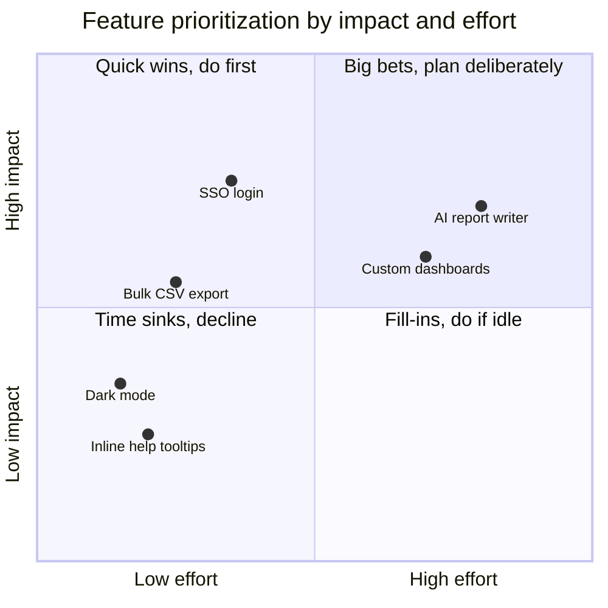
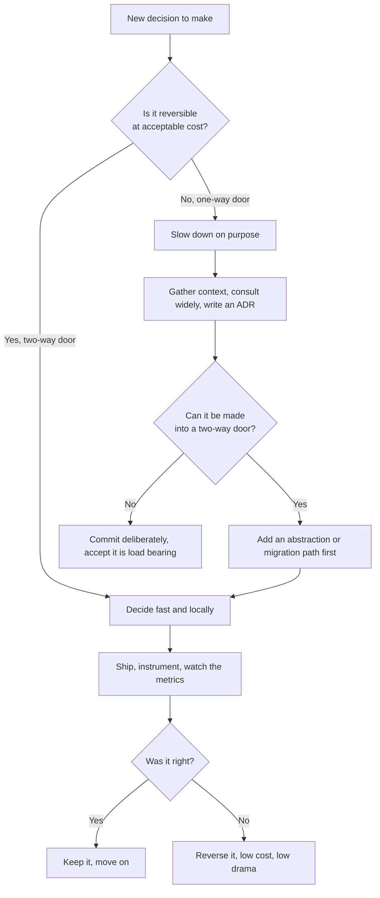
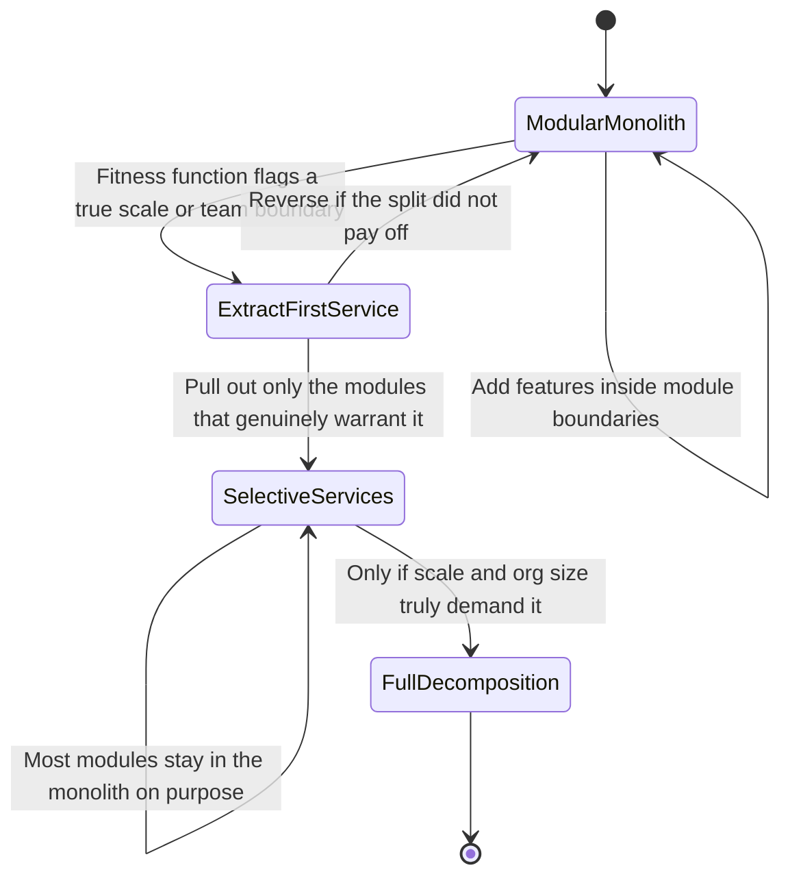

# Engineering for the Product: Scale, Prioritization, and Architecture as Judgment

A team I advised once spent four months building a sharded, multi-region, eventually-consistent ingestion pipeline. They were proud of it. It could absorb half a million events per second without breaking a sweat. The problem was that their actual peak load, eighteen months after launch, was around four hundred events per second — roughly a thousand times less than what they had built for. The system worked. It also had three on-call engineers, a quarterly bill that made the CFO wince, and a debugging surface so large that a single dropped message took two days to trace across regions. They had solved a problem they did not have, and in doing so created several they did.

I have seen the inverse too. A two-person startup serving a thousand requests a minute on a single overloaded Postgres instance, terrified to add an index because nobody understood the query planner, slowly suffocating under the load they actually had. One team scaled for an imaginary future. The other refused to scale for a real present. Both failures were the same failure underneath: a failure of judgment about *how much system the product needed*.

This is the fifth and final post in a series about what senior engineering means now that AI coding tools can generate most of the implementation. The throughline has been simple and, I think, increasingly obvious: when writing the code gets cheap, the value of *deciding what code to write* goes up. We covered [infrastructure and the physics of distributed failure](https://juanlara18.github.io/portfolio/#/blog/senior-infrastructure-distributed-systems-failure-networking), [data modeling and the query patterns that outlive your schema](https://juanlara18.github.io/portfolio/#/blog/senior-data-modeling-query-patterns-database-design), [API design as a contract you cannot casually break](https://juanlara18.github.io/portfolio/#/blog/senior-api-design-contracts-versioning-dx), and [the distributed-systems theory that survives every framework churn](https://juanlara18.github.io/portfolio/#/blog/senior-distributed-theory-cap-pacelc-tradeoffs). Infrastructure, data, APIs, theory — all of them are in service of one thing: building the *right* product. This post is about the judgment that decides what "right" means.

The metaphor I will lean on is city planning. A city is not architected the way a building is. No single person designs Tokyo. Instead, planners make a small number of decisions that are extraordinarily expensive to reverse — where the rail lines run, where the zoning boundaries fall, where the sewers and power conduits go — and then let thousands of independent buildings rise and fall within that frame. The skyline is emergent. The infrastructure is deliberate. And the catastrophic failures of urban planning are almost never "we built a bad building." They are "we poured the foundation in the wrong place, and now we cannot un-pour it." Engineering for a product is the same job. Most of your decisions are buildings — cheap, replaceable, reversible. A few are foundations. Senior judgment is mostly the skill of telling them apart.

---

## Where Senior Leverage Goes When Implementation Is Cheap

Let me state the shift plainly, because it is the premise of everything that follows.

For most of the history of software, the bottleneck was *production*. Writing correct code was slow, error-prone, and expensive, so the people who could write it fast and well were the scarce resource. A senior engineer's leverage came substantially from being a better, faster, more reliable producer of code than a junior one. That was real, and it is not entirely gone.

But it is shrinking, fast. An AI coding tool will happily produce a sharded ingestion pipeline, a microservice, a caching layer, a retry-with-backoff client, a React form with validation — and produce it in minutes, at a quality that ten years ago would have taken a competent mid-level engineer a week. The marginal cost of *implementation* is collapsing toward zero. What does not collapse is the cost of building the wrong thing. If anything, that cost goes up, because cheap production means you can build the wrong thing faster and at greater volume than ever before.

So leverage moves up the stack. It moves from *how* to *what, whether, and how much*:

- **What to build** — feature prioritization, the discipline of saying no, the honest accounting of what every shipped feature costs you for the rest of its life.
- **How much to build** — right-sizing scale, choosing the level of robustness the product actually warrants, resisting the gravitational pull of over-engineering.
- **Which trade-off to take** — the CAP and PACELC choices, the consistency-versus-latency calls, the build-versus-buy decisions, the reversible-versus-irreversible classification that should govern how much deliberation a decision deserves.
- **When the generated code is subtly wrong** — the review judgment that an LLM cannot self-supply, because the failure modes that matter are the ones that look correct and pass the tests but violate an invariant the model never knew about.

None of these are things an AI tool will decide for you. They require holding the product, the business, the cost structure, the team's capacity, and the multi-year consequences in your head at once. That is the work. The rest of this post is a field guide to doing it well, organized around the three decisions that matter most: how much to scale, what to prioritize, and how to keep architecture an enabler of future decisions rather than a prison.

---

## Scale as a Product Decision, Not a Vanity Metric

The single most common over-engineering mistake I see is treating scale as a goal rather than a constraint. Scale is not a trophy. Nobody pays you for the requests per second your system *could* handle. They pay you for the ones it *does* handle, reliably, at a cost that leaves margin. Scale is a means, and the question is always: scale to *what*, and at what cost?

### Right-Sizing: Scale for the Load You Have Plus a Credible Horizon

The discipline is to scale for the load you actually have, plus a credible growth horizon — and not one order of magnitude further. "Credible" is the load-bearing word. If you are serving four hundred events per second and growing thirty percent a quarter, a credible eighteen-month horizon is maybe two or three thousand events per second. It is not five hundred thousand. Building for five hundred thousand is not prudence; it is a bet that you will become a thousand times bigger, made with engineering effort you could have spent on the product that might actually get you there.

The asymmetry is the whole argument. If you under-build and the product takes off, you will have a good problem: a working product, revenue, and a clear, well-understood scaling task in front of you, usually with months of runway visible in your metrics. If you over-build and the product does not take off — which is the overwhelmingly likely case for any given feature — you have spent the scarcest resource you had, senior engineering time, on capacity that will never be used, plus a permanent operational tax on a system that is more complex than it needed to be. The expected value math almost always favors building for the load you can see and a modest multiple beyond it.

There is a sharper version of this from Amazon's culture that I find clarifying. Jeff Bezos has written about making decisions "with somewhere around 70 percent of the information you wish you had. If you wait for 90 percent, in most cases, you're probably being slow." Scaling decisions are exactly this. You will never have certainty about future load. Waiting for it is its own expensive mistake. Build for the credible horizon, instrument heavily so you see the real curve early, and keep the system simple enough that scaling it later is a known task rather than a rewrite.

### Vertical Before Horizontal, Usually

When you do need to scale, there are two directions, and seniority shows in knowing which one to reach for first.

**Vertical scaling** means a bigger machine: more CPU, more RAM, faster disk. It is unglamorous and it has a ceiling, but it is also astonishingly effective and almost free in engineering terms. You change an instance type. Your code does not change. Your mental model does not change. There are no new failure modes. A modern single server with a generous amount of memory can hold a startlingly large working set entirely in RAM and serve a load that most companies will never exceed.

**Horizontal scaling** means more machines: sharding, partitioning, load balancing, distributed coordination. It has a much higher ceiling, but it introduces every hard problem in distributed systems — partial failure, consistency trade-offs, the network as an unreliable participant, the operational complexity of a fleet. This is precisely the territory the [theory post in this series](https://juanlara18.github.io/portfolio/#/blog/senior-distributed-theory-cap-pacelc-tradeoffs) was about: the moment you go horizontal, CAP and PACELC stop being trivia and start being daily trade-offs you cannot escape.

The senior default is vertical first, horizontal only when you have a concrete reason. The reason might be that you have genuinely hit the ceiling of a single large machine, or that you need geographic distribution for latency or data-residency reasons, or that you need fault isolation that a single node cannot provide. Those are real reasons. "It feels more scalable" and "it is how the big companies do it" are not. The big companies do it because they have the load that justifies the complexity and the headcount to pay the operational tax. You probably have neither, yet, and pretending you do is how you end up with the five-hundred-thousand-events-per-second pipeline serving four hundred.

### The Real Cost of Premature Scaling

Premature scaling is not free even when the extra capacity sits idle. It carries a tax that compounds in three currencies:

- **Operational.** Every distributed component is a thing that can fail independently, a thing that needs monitoring, alerting, runbooks, and someone awake at 3 a.m. who understands it. Complexity is paid for in on-call hours forever.
- **Cognitive.** A system that is more complex than its load requires is harder for every future engineer to understand, debug, and safely change. The complexity is a permanent drag on velocity, and it is the kind of drag that does not show up in any dashboard.
- **Opportunity.** This is the largest and the most invisible. The four months spent on the over-built pipeline were four months not spent learning what customers actually wanted. For an early product, that is frequently the difference between finding product-market fit and running out of money while polishing infrastructure for users who never arrived.

City planning has the same lesson written in concrete. The cautionary tales of urban infrastructure are full of highways built for projected traffic that never materialized, transit lines to suburbs that were never developed, capacity poured speculatively into a future that the planners were sure of and wrong about. The capacity was real. The demand was imaginary. And concrete, like a deeply entrenched distributed architecture, is very hard to un-pour.

---

## Feature Prioritization for Engineers

If scale is about *how much* system to build, prioritization is about *which* things to build at all. This is usually filed under "product management," and engineers are encouraged to think of it as someone else's job. That is a mistake, and it is a more expensive mistake now than it used to be. When you can build almost anything quickly, the constraint is no longer capacity to build — it is wisdom about what is worth carrying. That wisdom is an engineering skill, because engineers are the ones who understand the *true* cost of a feature, including the part that PMs systematically underweight: the cost of maintaining it forever.

### Scoring: RICE and Impact-Versus-Effort

You do not need an elaborate framework, but you need *a* framework, because the alternative is prioritizing by whoever argued most loudly in the last meeting. Two are worth knowing.

**RICE**, developed by Intercom for its own roadmap decisions, scores each candidate on four factors and combines them into a single number. *Reach* is how many people the feature affects in a given period. *Impact* is how much it affects each of them, on a coarse scale (massive, high, medium, low, minimal, mapped to numbers like 3, 2, 1, 0.5, 0.25). *Confidence* is a percentage discount for how much you actually trust your estimates. *Effort* is person-months. The score is:

$$
\text{RICE} = \frac{\text{Reach} \times \text{Impact} \times \text{Confidence}}{\text{Effort}}
$$

The point of RICE is not the precision of the number — the inputs are estimates and the output is too. The point is that it forces three uncomfortable questions into the open. It forces *Confidence* to be named, which punishes the seductive feature that sounds great but rests on a guess. It puts *Effort* in the denominator, which is where engineering judgment enters: the engineer is the only person in the room who can honestly estimate it, and the only one who knows that the effort number should really include maintenance, not just the build. And it makes you compare features on a common scale instead of arguing about them one at a time.

Here is a small, honest implementation. Note that it deliberately separates build effort from a carrying cost, because the thing engineers know that scorecards usually omit is that effort does not end at launch:

```python
from dataclasses import dataclass

# Impact maps qualitative judgment to a multiplier. Coarse on purpose:
# false precision here is worse than honest roughness.
IMPACT = {"massive": 3.0, "high": 2.0, "medium": 1.0, "low": 0.5, "minimal": 0.25}
CONFIDENCE = {"high": 1.0, "medium": 0.8, "low": 0.5}

@dataclass
class Feature:
    name: str
    reach: int             # users affected per quarter
    impact: str            # key into IMPACT
    confidence: str        # key into CONFIDENCE
    build_months: float    # one-time engineering cost
    carry_months_yr: float # recurring maintenance cost per year

    def rice(self, horizon_years: float = 2.0) -> float:
        # Total cost of ownership over the planning horizon, not just build.
        # This is the engineer's correction to a product-only scorecard.
        effort = self.build_months + self.carry_months_yr * horizon_years
        numerator = self.reach * IMPACT[self.impact] * CONFIDENCE[self.confidence]
        return numerator / effort

backlog = [
    Feature("SSO login",        reach=8000, impact="high",   confidence="high",   build_months=2,  carry_months_yr=0.5),
    Feature("AI report writer", reach=3000, impact="massive",confidence="low",    build_months=4,  carry_months_yr=3.0),
    Feature("Dark mode",        reach=9000, impact="low",     confidence="high",   build_months=1,  carry_months_yr=0.2),
    Feature("Custom dashboards",reach=1500, impact="high",    confidence="medium", build_months=5,  carry_months_yr=2.0),
]

for f in sorted(backlog, key=lambda x: x.rice(), reverse=True):
    print(f"{f.name:18s} RICE={f.rice():6.1f}")
```

Run it and the ordering is instructive. The "AI report writer" — the exciting feature, the one everyone wants to demo — scores poorly, not because the idea is bad but because *low confidence* and *high carrying cost* are honestly priced in. Dark mode, cheap and broad, does well. The scorecard will not make the decision for you, and it should not, but it makes the trade-offs visible enough that the conversation stops being about enthusiasm and starts being about value per unit of permanent cost.

The lighter cousin is the **impact-versus-effort matrix**, which drops Reach and Confidence and just plots each candidate on two axes. It is less precise but faster, and for a small backlog it is often enough. The geometry is the message:



The top-left quadrant — high impact, low effort — is where you want to live. The bottom-right — high effort, low impact — is where good teams quietly go to die, building elaborate things that nobody asked for because the building itself was satisfying.

### Build Versus Buy

Every feature has a hidden fork before it even reaches the scorecard: do you build it, or do you buy or adopt it? The instinct of strong engineers is to build, because building is what we are good at and what we enjoy. That instinct is now actively dangerous, because AI tools make the build path *feel* even cheaper than it is. Generating an authentication system in an afternoon is exhilarating and almost always the wrong call.

The discipline is to build only what is *core* — the thing that is your actual differentiator, the reason the product exists — and to buy, adopt, or use a managed service for everything else. Authentication, billing, email delivery, observability, feature flags, search infrastructure: these are solved problems with mature vendors, and the version you build will be worse, will consume maintenance attention forever, and will distract from the one thing only you can build. The question to ask is not "can we build this?" In the age of AI coding, the answer is almost always yes, and that is exactly why the question is now useless. The right question is "should this be where our scarce attention goes for the next several years?" — because every system you build is a system you marry.

### The Cost of Carrying Every Feature Forever, and the Discipline of No

Here is the part that engineers feel in their bones and PMs often do not: a feature is not a one-time cost. It is a permanent liability. Every feature you ship is code that must be maintained, secured, tested, documented, kept compatible across every future change, and reasoned about by every engineer who touches the system from now until you delete it. Features are not assets that sit quietly on a shelf. They are mouths that must be fed for as long as they live.

This is why "no" is the most valuable word in a senior engineer's vocabulary, and the hardest to say. Every yes is a multi-year commitment dressed up as a quick win. The features that quietly destroy a product are rarely the big, debated ones — those at least got scrutiny. They are the dozens of small, reasonable-sounding yeses that each seemed cheap in isolation and collectively turned the codebase into a swamp where every change risks breaking three things nobody remembered were connected. Saying no, or "not now," or "only if we delete something else first," is how you keep the system's complexity proportional to its value. It is not obstruction. It is the discipline that keeps the product buildable at all.

### One-Way Doors and Two-Way Doors

The most useful single idea I know for calibrating *how much deliberation a decision deserves* comes from Bezos's 2015 Amazon shareholder letter. He divides decisions into two types. **Two-way doors** are reversible: if you walk through and dislike what you find, you can walk back. Most decisions are like this. **One-way doors** are irreversible or nearly so: walk through, and you cannot return to where you were.

The crucial insight is not just the taxonomy — it is the failure mode he names. As organizations grow, they tend to apply the slow, heavyweight, one-way-door process to *everything*, including the vast majority of decisions that are actually two-way doors. The result, in his words, is "slowness, unthoughtful risk aversion, failure to experiment sufficiently, and consequently diminished invention." Treating reversible decisions as if they were irreversible is one of the most common and most invisible ways teams grind to a halt.

For engineers, this maps onto architecture with surgical precision. Choosing a UI component library is a two-way door — swap it later if you must, it is annoying but bounded. Choosing your primary database's data model, your public API contract, or your core authentication and identity scheme is much closer to a one-way door: the entire system grows tendrils into those choices, and reversing them is a migration project measured in quarters. The classification tells you how to spend your deliberation budget: move fast and decide locally on two-way doors, slow down and consult widely on one-way doors. The skill of seniority is largely the skill of telling which door you are standing in front of before you walk through it.



Notice the most senior move in that diagram: the question *can it be made into a two-way door?* Often a decision is irreversible only because of how you frame it. An abstraction layer, a migration path, a feature flag, a strangler-fig seam — these are techniques for converting a one-way door into a two-way door, buying back reversibility at modest cost. That conversion is one of the highest-leverage things an architect does, and it is the bridge to the next section.

---

## Architecture as Deferring and Enabling Decisions

Here is the reframe that took me too long to internalize. The job of software architecture is not to decide everything up front. It is the opposite. Good architecture is the art of *deferring* decisions until you have enough information to make them well, while *enabling* the decisions you cannot yet make. A good architecture is one that keeps the maximum number of doors as two-way doors for as long as possible. It is optionality, expressed in code structure.

This is exactly the city-planning move. The planner does not design the buildings. The planner lays down the infrastructure — the grid, the utilities, the zoning — that lets a thousand independent building decisions be made later, by other people, without coordination, without the planner having to predict any of them. The infrastructure is the set of irreversible decisions, made deliberately and few. The buildings are the reversible ones, made cheaply and constantly. Architecture is drawing that line in the right place.

### YAGNI Versus Real Optionality

There is an obvious tension here. The discipline of **YAGNI** — "You Aren't Gonna Need It," from Extreme Programming — says do not build capability for a presumptive future feature, because you will probably guess wrong about what that feature needs, and the speculative generality will be a cost you pay whether or not the future arrives. Martin Fowler's analysis of YAGNI is precise about its scope, and the precision is the whole point.

YAGNI applies to *features* — functional capability you are adding now to support something you imagine you will want later. It does *not* apply to effort that makes the software easier to change. As Fowler puts it, YAGNI is only viable *because* the code is easy to change; refactoring to keep it malleable is not a YAGNI violation, it is what makes YAGNI safe. So "don't build the speculative reporting engine" is YAGNI applied correctly. "Don't bother keeping your modules decoupled" is YAGNI applied wrongly — that is not a speculative feature, it is the optionality that lets you defer the features you genuinely cannot predict.

The resolution of the tension is this: do not build speculative *features*, but do preserve cheap *optionality*. Do not implement the multi-tenancy you might need someday; do keep the tenant boundary clean enough that adding it later is bounded. The discipline is to spend effort on the structural flexibility that keeps doors open, and to refuse to spend effort on the concrete predictions about which door you will eventually walk through.

### The Modular Monolith Versus Microservices, Honestly

No architectural debate has been more distorted by cargo-culting than monolith versus microservices, and an honest treatment is the most useful thing I can offer.

Microservices solve real problems. They give you independent deployability, fault isolation, technology heterogeneity, and the ability to scale and staff teams independently around service boundaries. These are genuine benefits — *at sufficient scale, with sufficient organizational size*. Sam Newman, who quite literally wrote the books on this, is blunt that most companies would be better served by the underrated option of a **modular monolith** than by microservices, and that "microservices are not a good choice for most startups." Decomposing prematurely, before you understand the domain well enough to draw the service boundaries correctly, is one of the most expensive mistakes available to you. Get a boundary wrong and you have turned a simple in-process function call into a distributed transaction across a network, with all the partial-failure and consistency pain the [theory post](https://juanlara18.github.io/portfolio/#/blog/senior-distributed-theory-cap-pacelc-tradeoffs) catalogued — and now reorganizing the boundary means a cross-service migration instead of moving a file.

The modular monolith is the honest default for most products. It is a single deployable unit, but internally partitioned into well-defined modules with explicit, enforced boundaries between them. You get most of the organizational and cognitive benefits of clear separation — modules you can reason about independently, interfaces you can defend — without paying the distributed-systems tax of actually putting a network between every component. And critically, it keeps the door open: a clean module boundary inside a monolith is precisely the seam along which you can later extract a service *if and when* the scale or the team structure genuinely demands it. You have deferred the irreversible decision while enabling it. That is the whole architectural game in one choice.

### Evolutionary Architecture and Fitness Functions

The deepest version of "architecture as enabling future decisions" comes from *Building Evolutionary Architectures* by Neal Ford, Rebecca Parsons, and Patrick Kua. Their central idea is that architecture should not be a fixed blueprint you design once and then defend against change. It should be designed to *evolve* — to support guided, incremental change across many dimensions as you learn what the system actually needs to be.

The mechanism that makes evolution safe is the **fitness function**: an objective, automated check that measures whether the architecture still exhibits a characteristic you care about. The term is borrowed from evolutionary computing, where a fitness function defines what "better" means so the system can move toward it. In architecture, a fitness function is any test, metric, or monitor that protects an architectural property — a performance budget, a coupling constraint, a security invariant, a layering rule. The idea is that you state the characteristics that matter up front, encode them as functions that run continuously, and then you are free to evolve the implementation aggressively, because the fitness functions will fail loudly the moment a change erodes something you decided was important.

This is what lets you take YAGNI seriously without fear. If you have a fitness function guarding your module boundaries, you can build simply now and trust that you will be *told* the instant someone introduces the coupling that would close a door you wanted open. The fitness function turns "keep the architecture clean" from a matter of vigilance and code review into a matter of automated governance. Here is a concrete one — a test that fails if the modules of a would-be modular monolith start reaching into each other's internals, which is exactly the erosion that quietly turns a clean monolith into a big ball of mud:

```python
import ast
import pathlib

# Architectural rule encoded as a fitness function:
# the "billing" module may depend on "shared", but must NOT
# import from "orders" or "users" directly. Cross-module access
# goes through published interfaces only. If this fails, an
# architectural door is being closed without a decision.

ALLOWED = {"shared"}
FORBIDDEN = {"orders", "users"}
BILLING = pathlib.Path("src/billing")

def imported_modules(path: pathlib.Path) -> set[str]:
    tree = ast.parse(path.read_text(encoding="utf-8"))
    mods = set()
    for node in ast.walk(tree):
        if isinstance(node, ast.ImportFrom) and node.module:
            mods.add(node.module.split(".")[0])
        elif isinstance(node, ast.Import):
            for alias in node.names:
                mods.add(alias.name.split(".")[0])
    return mods

def test_billing_respects_module_boundaries():
    violations = []
    for py_file in BILLING.rglob("*.py"):
        for mod in imported_modules(py_file):
            if mod in FORBIDDEN:
                violations.append(f"{py_file} imports forbidden module '{mod}'")
    assert not violations, "Architectural boundary violated:\n" + "\n".join(violations)
```

Run this in CI alongside your unit tests. It is not testing behavior; it is testing *architecture*. The first time it fails, it will have caught a coupling that would have cost you a week of untangling six months later — and it caught it in seconds, which is the entire point.



The path through that diagram is the senior path: start simple, let fitness functions tell you when a real boundary has emerged, extract selectively and reversibly, and only ever reach full decomposition if the evidence forces you to. Each transition is a deliberate decision made with information you did not have at the start — which is exactly what deferring decisions buys you.

---

## Technical Debt: When to Take It On and When to Pay It Down

Technical debt is the most misused term in our field. Used loosely, it means "code I do not like." Used well, it means something precise and useful: a *deliberate* trade-off in which you take a shortcut now, accepting future cost, in exchange for moving faster today. The metaphor is financial, and the financial metaphor is exact: debt is not inherently bad. Debt taken on purpose, for a good reason, with a plan to pay it down, is a tool. Debt taken accidentally, unconsciously, with no plan, is how systems rot.

The senior skill is distinguishing the two and managing the first deliberately. There are genuinely good reasons to take on technical debt. You might cut a corner to validate a hypothesis fast — if the feature flops, you delete the shortcut along with it and the debt was never real. You might take on debt to hit a market window where being first is worth more than being clean. You might defer a refactor because the area is stable and the cost of touching it exceeds the benefit. These are sound. What makes them sound is that they are *conscious* and *recorded*: you know you took the shortcut, you know why, and ideally you wrote it down so the next engineer does not mistake your deliberate scaffolding for a load-bearing wall.

The debt you must pay down urgently is the debt that is *slowing you down now* — the module everyone is afraid to touch, the test suite so slow nobody runs it, the abstraction so wrong that every new feature has to fight it. That is debt whose interest payments are coming due in the currency of velocity, and the interest compounds. The debt you can safely carry, sometimes indefinitely, is debt in code that is stable, isolated, and rarely touched. Ugly code that works, that nobody needs to modify, and that is walled off behind a clean interface is not a problem worth solving. Beauty is not the goal. Velocity and reliability are. Spend your refactoring budget where the interest rate is highest, not where the offense to your aesthetics is greatest.

City planning, again, has the analog: deferred maintenance. A city can defer fixing a rarely used back road for years with little consequence. Defer maintenance on the main water main and you get a catastrophe. The skill is not "fix everything." It is knowing which infrastructure is load-bearing and triaging accordingly.

---

## How AI Coding Tools Change the Calculus

Everything above was largely true before AI coding tools. What the tools change is the *weights*, and the shift is worth making explicit because it is the spine of this whole series.

The headline change is that **building is cheap, so being wrong is cheap — but only if you stay reversible.** When generating a feature takes an afternoon instead of a week, the cost of a wrong two-way-door decision plummets. You can try the AI report writer, see it flop, and delete it, having spent a day. This is liberating, and it argues for *more* experimentation, faster, on reversible decisions. The Bezos warning about treating two-way doors as one-way doors becomes even more urgent: when experiments are nearly free, agonizing over reversible choices is pure waste.

But — and this is the asymmetry that defines senior work now — **the cost of one-way-door decisions does not fall.** AI can generate a database schema in seconds, but if you ship it as your production data model and the entire system grows into it, reversing that is exactly as expensive as it ever was, possibly more so because you accumulated dependent code faster. So the gap between reversible and irreversible decisions *widens*. The discipline of correctly classifying the door, and of converting one-way doors into two-way doors with abstractions and migration paths, becomes the highest-leverage skill on the team. Cheap implementation raises the stakes on the decisions that are not about implementation.

The second change is that **the bottleneck moves to review, design, and product sense.** When code is the scarce thing, you optimize for producing it. When code is abundant, you optimize for *judging* it. And here is the failure mode that should keep you up at night: AI-generated code is plausible. It looks right. It is idiomatic, well-formatted, and it passes the tests — including, often, the tests the AI also generated. The bugs that survive are precisely the ones that look correct: the off-by-one in a financial calculation, the missing transaction boundary that only corrupts data under concurrency, the retry that is not idempotent, the cache invalidation that is subtly wrong, the consistency assumption that violates an invariant the model had no way to know about. None of these are caught by "does it run?" All of them are caught by a senior engineer who understands the domain, the invariants, and the failure modes — who reviews not the syntax but the *intent*. This is the deepest reason the [theory post](https://juanlara18.github.io/portfolio/#/blog/senior-distributed-theory-cap-pacelc-tradeoffs) matters: you cannot catch a violated consistency guarantee if you do not know the guarantee exists.

Which leads to the third change, the one that ties the bow on everything: **clarity of intent matters more than ever.** If the AI is doing the typing, your job is to specify *what* with enough precision that the output can be judged against it, and to keep the system structured so that a wrong output is cheap to replace. That is the entire game now — clear intent, reversible structure, ruthless review. It is also, not coincidentally, a description of good engineering judgment that would have been recognizable decades before the first LLM. The tools did not change what good judgment is. They changed how much it is worth, by making it the only scarce thing left.

---

## Recording Decisions, and the Series Wrap-Up

A decision that lives only in someone's head is a decision that will be relitigated, misunderstood, or silently reversed by an engineer who never knew it was made on purpose. This is the failure mode behind a thousand "why on earth is it built this way?" moments. The fix is cheap and underused: write the important decisions down, close to the code, in a lightweight format, at the moment you make them.

The standard tool is the **Architecture Decision Record**, the format Michael Nygard popularized in his 2011 essay "Documenting Architecture Decisions." An ADR is short — a page or two — and it captures one decision: the context that forced it, the decision itself, and the consequences. The discipline is to keep them in the source repository, usually under `docs/adr`, versioned alongside the code they govern, so they are available to exactly the people who will later wonder why. The act of writing one is itself valuable: it forces you to articulate the reasoning, which frequently exposes a flaw before you commit. Here is the canonical lightweight template, which has barely changed since 2011 because it did not need to:

```markdown
# ADR 0007: Use a modular monolith for the orders platform

## Status
Accepted  (2028-03-09)

## Context
We are launching the orders platform with a two-person team and an
expected initial load under 500 requests per second. The team is
familiar with microservices but has no spare on-call capacity. We do
not yet understand the domain boundaries well enough to draw stable
service interfaces. We need to be able to extract services later if
scale or team growth demands it.

## Decision
We will build a single deployable modular monolith. Modules (orders,
billing, users, shared) will have enforced import boundaries, checked
in CI by an architectural fitness function. Cross-module access goes
through published interfaces only.

## Consequences
+ No distributed-systems tax while load and team are small.
+ Clean module seams preserve the option to extract services later.
+ Fitness function fails CI if a boundary is violated.
- A future extraction is still real work, but bounded to one module.
- We accept that very high scale would eventually force decomposition.

## Revisit when
Sustained load exceeds ~5k req/s, OR the team exceeds ~3 squads, OR
a single module's deploy cadence is consistently blocked by others.
```

Note the "Revisit when" section. It is not in Nygard's original template, and I add it to every ADR I write, because it converts an irreversible-feeling decision into an explicitly reversible one with a trigger. It names the conditions under which this two-way door should be walked back through. That is the deferring-and-enabling philosophy of this whole post, compressed into one heading: you are not deciding forever. You are deciding *for now*, on the record, with a written condition for changing your mind.

### The Series, In One Thought

Five posts. Infrastructure, data modeling, API design, distributed theory, and now product judgment. It would be easy to read them as five separate technical domains, but they were always one argument seen from five angles.

The argument is this: AI coding tools have made implementation cheap, and in doing so they have revealed what was always the actually scarce thing — judgment. Judgment about which infrastructure failures are physics and which are choices. Judgment about which query patterns your data model must serve before you have the queries. Judgment about which parts of your API are contracts you cannot break. Judgment about which consistency trade-off the product genuinely requires. And, in this final post, judgment about what to build at all, how much of it, which door you are standing in front of, and when the plausible-looking generated code is quietly wrong.

Infrastructure, data, APIs, and theory are not ends. They are the foundations and the zoning of a city whose skyline you cannot fully predict. You pour the foundations deliberately, because you cannot un-pour them. You let the buildings rise cheaply and fall cheaply, because you can. And the senior engineer is the city planner who knows the difference — who spends scarce deliberation on the few decisions that are forever, and spends cheap, fast, AI-assisted iteration on the many that are not. That is the work now. The machines will write the code. Deciding what is worth building remains, stubbornly and valuably, ours.

---

## Validating the Decisions, Not Just the Code

Because this post is about judgment rather than a single implementation, the usual "testing" section becomes "how do you know your decisions were good?" The honest answer is that you instrument them and check.

**Prerequisites.** This post assumes the four prior ones, or their equivalents in your own experience: a working grasp of distributed failure modes, data modeling under real query patterns, API contracts, and the CAP/PACELC trade-off space. It also assumes you have seen at least one system over-built and at least one under-built, because the calibration that this post is really about is hard to absorb without having paid for it once.

**Gotchas, the ones that bite hardest.**
- *Confusing your enthusiasm for the user's need.* The feature you most want to build is the one to scrutinize hardest. RICE's confidence factor exists for you specifically.
- *Treating two-way doors as one-way doors.* The most common organizational disease, and AI-cheap experimentation makes it more wasteful than ever. If reversing a decision is cheap, decide it fast and stop deliberating.
- *Treating one-way doors as two-way doors.* The rarer but more dangerous error. Shipping an AI-generated schema as your production data model "to iterate later" is this mistake. Iterating later is the part that is expensive.
- *Letting "we can build it" answer "should we build it."* AI tools have made the first question trivial and therefore worthless. Only the second one is still a real question.
- *Measuring debt by aesthetics instead of interest rate.* Ugly, stable, walled-off code is not your problem. The pretty abstraction that everything fights against is.

**How to validate, concretely.** Encode the architectural decisions you care about as *fitness functions* in CI, so erosion fails loudly instead of accumulating silently. Track the [DORA four key metrics](https://www.thoughtworks.com/en-us/insights/articles/improving-your-bottom-line-with-four-key-metrics) from *Accelerate* — deployment frequency, lead time for changes, change failure rate, and time to restore — because they are the closest thing we have to an objective fitness function for the *whole* engineering system, and a prioritization or architecture decision that quietly degrades them is a decision that was probably wrong. Instrument your real load curve so that scaling decisions are made against data, not anxiety. And review every ADR's "Revisit when" trigger on a cadence, so that decisions made for-now do not silently calcify into decisions-for-forever simply because nobody looked again.

---

## Going Deeper

**Books:**
- Ford, N., Parsons, R., Kua, P., & Sadalage, P. (2022). *Building Evolutionary Architectures: Automated Software Governance* (2nd ed.). O'Reilly.
  - The canonical source for fitness functions and architecture designed to evolve rather than to be defended. The single most useful book for the "architecture as enabling future decisions" thesis of this post.
- Forsgren, N., Humble, J., & Kim, G. (2018). *Accelerate: The Science of Lean Software and DevOps.* IT Revolution.
  - The research behind the four key metrics. The strongest available evidence that fast, reversible, frequently-shipped change correlates with both performance and stability, which is the empirical backbone of the reversibility argument.
- Newman, S. (2019). *Monolith to Microservices: Evolutionary Patterns to Transform Your Monolith.* O'Reilly.
  - The honest, hype-free treatment of when decomposition pays and when it does not. Read it before anyone on your team says "let's do microservices."
- Kleppmann, M. (2017). *Designing Data-Intensive Applications.* O'Reilly.
  - The deep reference under the scale and trade-off sections; the bridge between this post and the data and theory posts in the series.

**Online Resources:**
- [RICE: Simple prioritization for product managers](https://www.intercom.com/blog/rice-simple-prioritization-for-product-managers/) — Intercom's original write-up of the framework they built for their own roadmap.
- [Yagni](https://martinfowler.com/bliki/Yagni.html) by Martin Fowler — The precise, scope-limited definition of YAGNI, including the crucial distinction between speculative features and keeping code malleable.
- [Architecture Decision Record](https://martinfowler.com/bliki/ArchitectureDecisionRecord.html) and the [ADR organization site](https://adr.github.io/) — Fowler's overview plus the community hub of ADR templates, including Nygard's original.
- [Fitness Functions chapter](https://www.oreilly.com/library/view/building-evolutionary-architectures/9781491986356/ch02.html) — the foundational chapter, readable on its own.

**Videos:**
- [Building Evolutionary Architectures](https://www.youtube.com/watch?v=DloJCWdB7_o) by Neal Ford, YOW! 2018 — A clear conference-length treatment of evolutionary architecture and fitness functions from one of the book's authors.
- [The Intersection of Fitness Function driven Architecture and Agentic AI](https://www.youtube.com/watch?v=x4ZLSvVki3I) by Neal Ford, DevCon Fall 2025 — Directly on the theme of this post: what automated architectural governance means when AI is generating the implementation.

**Articles and Primary Sources:**
- Bezos, J. (2016). [2015 Letter to Shareholders](https://s2.q4cdn.com/299287126/files/doc_financials/annual/2015-Letter-to-Shareholders.PDF). Amazon.
  - The primary source for one-way versus two-way door decisions and the warning about applying heavyweight process to reversible choices.
- Nygard, M. (2011). [Documenting Architecture Decisions](https://cognitect.com/blog/2011/11/15/documenting-architecture-decisions). Cognitect.
  - The essay that defined the ADR format used across the industry.

**Questions to Explore:**
- If AI makes implementation nearly free, does the optimal team shift from many implementers to a few high-judgment reviewers — and what does the career ladder look like in a world where "produces a lot of code" is no longer a meaningful signal?
- Fitness functions guard architectural properties you thought to encode. What guards the properties you did not think of, and is "the senior engineer's intuition" a fitness function that simply has not been written down yet?
- One-way versus two-way doors assumes you can tell which is which in advance. What is your actual track record at that classification, and how would you even measure it?
- As generated code accumulates faster than humans can review it, does the reviewing bottleneck eventually force AI to review AI — and if so, where does the human judgment that this whole series is about actually live?
- City planners answer to residents who live with their decisions for decades. To whom does an architect answer for a one-way-door decision whose cost lands on engineers who have not been hired yet?
