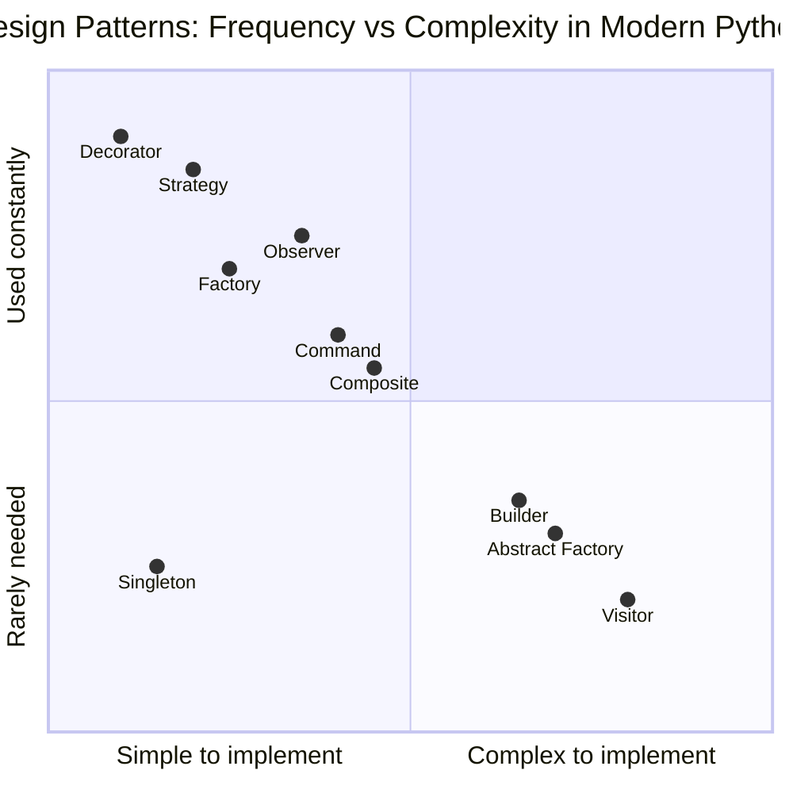
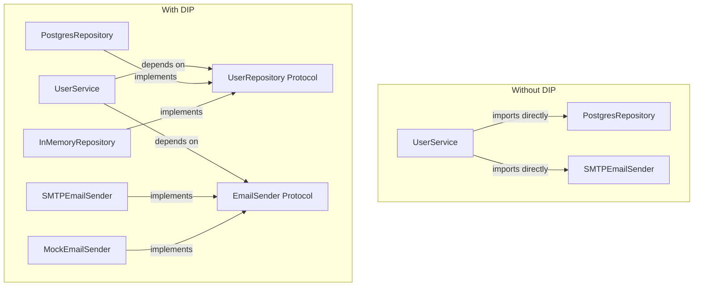
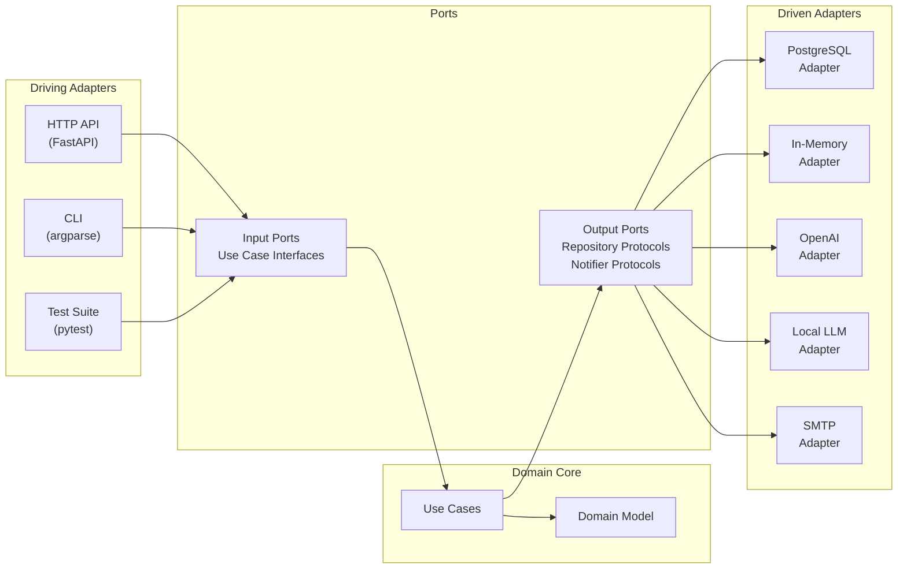
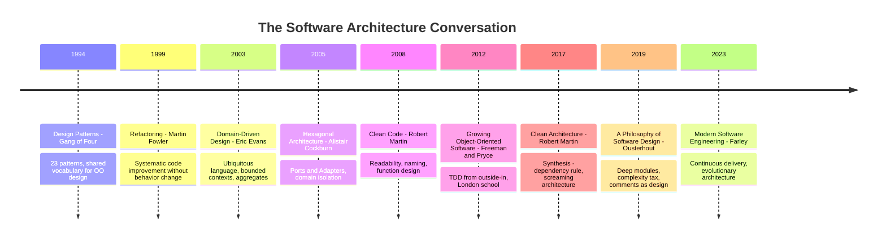
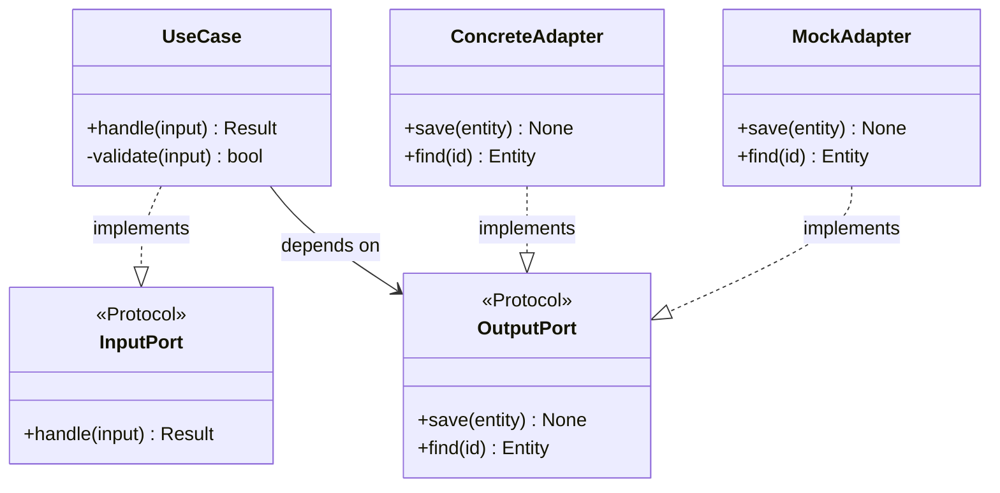

# The Books That Shaped Software: Clean Code, Design Patterns, and Architecture

There is a particular kind of conversation that happens in code review — the kind where someone says "this function is doing too much" and everyone nods, even though nobody has counted lines or measured anything. Or where someone says "we need a Factory here" and the team immediately understands the intent, even if they argue about whether it's really necessary. These conversations happen because the people having them have read the same books.

Clean Code. Design Patterns (the Gang of Four). Clean Architecture. Domain-Driven Design. These aren't textbooks you read once and put down. They're frameworks for thinking that get internalized to the point where you stop remembering where you learned an idea and start assuming everyone else thinks the same way.

This post is about those books — what they actually say, what they get right, and where following them too literally in 2026 will make your codebase worse, not better. We'll spend the most time on **Hexagonal Architecture** (also called Ports & Adapters), because it's the practical architectural pattern that ties most of the others together, and it maps directly to problems you face building real ML systems and APIs today.

The thesis upfront: these books are worth reading, but they were written for a specific era of software. The era of Java enterprise applications, large teams maintaining long-lived codebases, and software sold as shrink-wrapped products. Many of the ideas survive the translation to 2026's Python-heavy, cloud-native, LLM-assisted world. Some do not. Knowing which is which is the skill.

---

## Clean Code: The Rules That Made Code Human-Readable

Robert Martin's *Clean Code* (2008) is the most widely read software engineering book of the last two decades. It is also the book most frequently misquoted to justify over-engineering.

The book's core argument is simple and correct: **code is read far more often than it is written**, so optimizing for readability is the highest-leverage investment a programmer can make. Every heuristic in the book follows from that premise.

### What the Book Actually Says

The rules that survive to 2026 intact:

**Meaningful names.** Variables, functions, and classes should say what they do. `d` is not a variable name. `elapsed_time_in_days` is. `get_data()` is not a function name. `fetch_user_transactions_since(cutoff_date)` is. This seems obvious until you look at real production code, where `process()`, `handle()`, and `run()` appear everywhere, doing entirely different things.

**Functions should do one thing.** The single-responsibility principle at the function level. A function that validates input, queries a database, formats the output, and logs the result is four functions that got merged. The book's practical heuristic: if you can't describe what a function does without using "and", it's doing too much.

**Comments explain *why*, not *what*.** The code already says what it does. Comments earn their place by explaining *why* — why this workaround exists, why this seemingly wrong value is correct, why this order of operations matters. Comment: `# Counter-intuitive: we flush before close because the remote server buffers aggressively` is valuable. Comment: `# Add 1 to counter` is noise.

**Error handling should be separate from logic.** Don't mix your business logic with your try/except blocks. The function that reads from a database shouldn't also decide what to do when the connection fails. That's a separate concern.

**The newspaper metaphor.** A file should read like a newspaper article: the most important, high-level information first, with increasing detail as you scroll down. Public interface at the top, private helpers at the bottom. The reader should be able to stop reading at any level and still understand the gist.

These rules hold. Follow them and your code will be more readable, more maintainable, and easier for a new team member to understand.

### Where It Goes Wrong

The book was written in a Java context, and Java was written in an era where IDEs were primitive and type systems couldn't express intent. The workarounds Java needed became rules the book enshrined.

**The function length fetish.** The book argues for functions of 5-10 lines as an ideal. In Java, this made some sense because the language is verbose and functions are expensive to write. In Python, a 40-line function that does one coherent thing is cleaner than 8 five-line functions with names you have to look up to understand. The rule should be "a function should do one thing" — not "a function should be short." These correlate but don't equate.

**Abstraction proliferation.** Read Clean Code too literally and you end up with one class per concept, one method per operation, and an inheritance hierarchy four levels deep for a feature that should have been a conditional. This is the over-abstraction trap: code that looks clean at the line level but requires enormous mental overhead to trace because you're constantly jumping between files to understand what's happening.

**Comments as failure.** The book has a famous line: "The proper use of comments is to compensate for our failure to express ourselves in code." This framing leads to engineers deleting useful comments because they feel like admissions of defeat. In practice, there are things that cannot be expressed in code: why a particular approach was chosen over another, the historical context for a design decision, the edge case that bit you in production three years ago. Write those comments.

**In the LLM era.** LLM-assisted coding changes the calculus further. When you're generating code with Copilot or Claude, you're often generating longer functions with more explicit logic — because the model understands intent from context, not from navigating a hierarchy of small functions. The clean-code ideal of "self-documenting code" becomes less valuable when you have a system that can explain any code on demand.

The lesson: internalize the *principles* (readability, single responsibility, meaningful names), not the *metrics* (function length, number of comments). Principles survive translation; metrics are proxies that drift.

---

## Design Patterns: The Gang of Four Turns 30

*Design Patterns: Elements of Reusable Object-Oriented Software* was published in 1994 by Erich Gamma, Richard Helm, Ralph Johnson, and John Vlissides — the Gang of Four. It catalogued 23 recurring patterns in object-oriented design, gave them names, and established the vocabulary that software engineers still use to communicate intent.

The book's real contribution wasn't the patterns themselves — most experienced engineers had invented them independently. It was the **names**. Saying "Factory Method" communicates in two words what would otherwise require a paragraph of description. This is the power of a shared vocabulary: it compresses communication.

### The Patterns That Survived

Most of the 23 patterns are alive and well in 2026 Python codebases, even if they look different from the Java originals.

**Strategy** is the pattern you reach for when you need interchangeable behavior. You have a function that needs to sort, filter, or evaluate — and you want to swap out the algorithm without changing the caller.

```python
from abc import ABC, abstractmethod
from typing import Protocol

# Modern Python: Protocol for duck-typed strategy
class ScoringStrategy(Protocol):
    def score(self, candidate: dict) -> float: ...

class BM25Scorer:
    def score(self, candidate: dict) -> float:
        return candidate["bm25_score"] * 0.7

class EmbeddingScorer:
    def score(self, candidate: dict) -> float:
        return candidate["cosine_similarity"] * 0.9

class HybridScorer:
    def score(self, candidate: dict) -> float:
        return (candidate["bm25_score"] * 0.4 +
                candidate["cosine_similarity"] * 0.6)

class RetrievalPipeline:
    def __init__(self, scorer: ScoringStrategy):
        self._scorer = scorer
    
    def rank(self, candidates: list[dict]) -> list[dict]:
        return sorted(candidates, key=self._scorer.score, reverse=True)
```

Note: Python's `Protocol` replaces Java's interface. No inheritance needed.

**Observer** (also called the event-driven pattern) is everywhere in async systems. One object changes state and notifies a list of dependents without knowing who they are.

**Factory** abstracts object creation — the caller says what it wants, not how to build it. This matters when construction is complex, when you want to swap implementations, or when you want to test with mock objects.

**Decorator** wraps objects to add behavior without modifying the class. Python makes this so natural it has syntax for it: `@functools.lru_cache`, `@retry`, `@timing` are all the Decorator pattern.

**Command** encapsulates an operation as an object — enabling undo, queuing, logging, or replay. Modern equivalents: task queues (Celery tasks are Command objects), event sourcing (where the event log is a sequence of Command objects).

**Composite** lets you treat individual objects and compositions of objects the same way. A file tree where files and directories have the same interface. A UI widget hierarchy where a group of widgets supports the same operations as a single widget. LlamaIndex's query engine composition is Composite.

### Patterns That Became Anti-Patterns

**Singleton.** The pattern for ensuring one instance of a class exists globally. In Python, this is usually unnecessary — modules are already singletons. When you do need global state (a connection pool, a logger), use module-level variables or dependency injection. The Gang of Four Singleton is a global variable dressed in a tuxedo.

**Abstract Factory and Builder.** These made sense in strongly-typed languages where you needed elaborate machinery to construct complex objects without specifying their concrete types. In Python, keyword arguments, `dataclasses`, and `TypedDict` handle most of these cases far more simply.

**Inheritance-heavy patterns.** The original patterns leaned heavily on class inheritance. Modern Python leans on composition and protocols. "Favor composition over inheritance" was in the GoF book; it's just that the Java examples didn't always show it.

The honest summary of the GoF in 2026: the patterns are real and the names are invaluable, but you'll express them differently in Python. You don't need a `ConcreteFactory` class hierarchy. You need a function that returns the right object. The *pattern* is the intent; the code is just implementation.



---

## SOLID: Five Principles, Two Worth Tattooing

SOLID is an acronym coined by Robert Martin for five object-oriented design principles. Like most rules, they exist on a spectrum from "timeless wisdom" to "cargo-culted dogma."

A quick survey:

**S — Single Responsibility Principle.** Each class/module should have one reason to change. This is genuinely good advice, and "reason to change" is the right framing — not "number of lines" or "number of methods." A class that handles both database access and email sending is a SRP violation: changing your database library and changing your email provider are completely unrelated changes, so they shouldn't be in the same file.

**O — Open/Closed Principle.** Open for extension, closed for modification. Add new behavior by adding new code, not by changing existing code. This is what Strategy makes possible. In practice, this principle is most useful as a warning sign: if every new requirement means modifying the same file, the design probably needs more seams.

**L — Liskov Substitution Principle.** Subtypes must be substitutable for their base types. Don't override methods in ways that violate the contract established by the parent class. In Python, where duck typing is dominant, this translates to: don't lie about what an object can do. If your `ReadOnlyList` inherits from `list` but raises on `append`, that's a Liskov violation.

**I — Interface Segregation Principle.** Clients shouldn't depend on methods they don't use. Prefer narrow, focused interfaces over fat ones. In Python: don't create a Protocol with 15 methods when your code only needs 3. Keep Protocol definitions small and focused.

**D — Dependency Inversion Principle.** High-level modules shouldn't depend on low-level modules. Both should depend on abstractions. This one is the keystone — the principle that Hexagonal Architecture is built on.



DIP is the one that matters most for testability, replaceability, and long-term maintainability. When your `UserService` depends on a `PostgresRepository` directly, you can't test `UserService` without a real database. When it depends on a `UserRepository` protocol, you can inject a mock, a local SQLite, or a future DynamoDB adapter without changing a single line of `UserService`.

---

## Hexagonal Architecture: The Pattern That Ties It All Together

Alistair Cockburn published "Hexagonal Architecture" in 2005, though he called it "Ports and Adapters." The name "hexagonal" is almost accidental — he drew the diagram with six sides because a hexagon looks good, not because six is a meaningful number.

The idea is deceptively simple: **separate what your application does from how it connects to the outside world.**

### The Problem It Solves

Imagine a typical ML inference service. It receives a request, loads some context from a database, calls an LLM, stores the result, and sends a webhook. Now ask yourself: which part of this is your *domain logic*, and which part is *infrastructure*?

The domain logic is: given this input and this context, how do I construct the prompt, what do I do with the response, what constitutes a valid result? That logic is the same whether you're using PostgreSQL or DynamoDB, OpenAI or Gemma running locally, HTTP webhooks or an SQS queue.

The infrastructure is: the specific PostgreSQL connection, the OpenAI API call, the HTTP POST. These are details that *should not leak into your domain logic*.

The problem with most codebases is that these are mixed. The service class has `import psycopg2` at the top. The business logic function calls `openai.chat.completions.create()` directly. Now you can't test the business logic without a real database and a real API key. You can't swap OpenAI for a local model without editing the function. You can't replay a production failure because the logic is tangled with the infrastructure.

Hexagonal Architecture solves this by putting your domain logic in the center and defining **ports** — abstract interfaces — for everything the domain needs from the outside world.



### Ports and Adapters in Python

Let's make this concrete with an ML inference service. The domain use case is: given a user query and a user ID, retrieve relevant context, build a prompt, call a language model, and store the interaction.

**Step 1: Define the ports (abstract interfaces)**

```python
from abc import abstractmethod
from typing import Protocol
from dataclasses import dataclass

@dataclass
class UserContext:
    user_id: str
    preferences: dict[str, str]
    recent_interactions: list[str]

@dataclass
class InferenceResult:
    response: str
    tokens_used: int
    model_id: str

# Output port: what the domain needs from a context store
class ContextRepository(Protocol):
    @abstractmethod
    def get_user_context(self, user_id: str) -> UserContext: ...
    
    @abstractmethod
    def save_interaction(self, user_id: str, query: str, result: InferenceResult) -> None: ...

# Output port: what the domain needs from a language model
class LanguageModelPort(Protocol):
    @abstractmethod
    def complete(self, prompt: str, max_tokens: int = 1024) -> InferenceResult: ...

# Input port: the use case interface (what driving adapters call)
class InferenceUseCase(Protocol):
    @abstractmethod
    def handle(self, user_id: str, query: str) -> InferenceResult: ...
```

**Step 2: Implement the domain use case**

The domain logic has no imports from infrastructure libraries. It only imports from within the domain and from the port interfaces.

```python
class HandleQueryUseCase:
    """Core domain logic. No infrastructure imports."""
    
    def __init__(
        self,
        context_repo: ContextRepository,
        language_model: LanguageModelPort,
    ):
        self._context_repo = context_repo
        self._language_model = language_model
    
    def handle(self, user_id: str, query: str) -> InferenceResult:
        # Domain logic: pure business decisions
        context = self._context_repo.get_user_context(user_id)
        
        prompt = self._build_prompt(query, context)
        result = self._language_model.complete(prompt)
        
        self._context_repo.save_interaction(user_id, query, result)
        return result
    
    def _build_prompt(self, query: str, context: UserContext) -> str:
        recent = "\n".join(f"- {i}" for i in context.recent_interactions[-3:])
        return f"""You are a helpful assistant for user {context.user_id}.

User preferences: {context.preferences}

Recent conversation:
{recent}

Current query: {query}

Respond concisely and helpfully."""
```

**Step 3: Write concrete adapters**

```python
import psycopg2
from openai import OpenAI

# Driven adapter: PostgreSQL implementation of ContextRepository
class PostgresContextRepository:
    def __init__(self, connection_string: str):
        self._conn = psycopg2.connect(connection_string)
    
    def get_user_context(self, user_id: str) -> UserContext:
        with self._conn.cursor() as cur:
            cur.execute(
                "SELECT preferences FROM users WHERE id = %s", (user_id,)
            )
            row = cur.fetchone()
            preferences = row[0] if row else {}
            
            cur.execute(
                "SELECT query FROM interactions WHERE user_id = %s "
                "ORDER BY created_at DESC LIMIT 10",
                (user_id,)
            )
            recent = [r[0] for r in cur.fetchall()]
        
        return UserContext(user_id=user_id, preferences=preferences,
                          recent_interactions=recent)
    
    def save_interaction(self, user_id: str, query: str,
                        result: InferenceResult) -> None:
        with self._conn.cursor() as cur:
            cur.execute(
                "INSERT INTO interactions (user_id, query, response, tokens) "
                "VALUES (%s, %s, %s, %s)",
                (user_id, query, result.response, result.tokens_used)
            )
        self._conn.commit()


# Driven adapter: OpenAI implementation of LanguageModelPort
class OpenAIAdapter:
    def __init__(self, api_key: str, model: str = "gpt-4o"):
        self._client = OpenAI(api_key=api_key)
        self._model = model
    
    def complete(self, prompt: str, max_tokens: int = 1024) -> InferenceResult:
        response = self._client.chat.completions.create(
            model=self._model,
            messages=[{"role": "user", "content": prompt}],
            max_tokens=max_tokens,
        )
        return InferenceResult(
            response=response.choices[0].message.content,
            tokens_used=response.usage.total_tokens,
            model_id=self._model,
        )


# Local adapter: Ollama for development/cost savings
class OllamaAdapter:
    def __init__(self, base_url: str = "http://localhost:11434",
                 model: str = "gemma4:4b"):
        self._base_url = base_url
        self._model = model
    
    def complete(self, prompt: str, max_tokens: int = 1024) -> InferenceResult:
        import httpx
        response = httpx.post(
            f"{self._base_url}/api/generate",
            json={"model": self._model, "prompt": prompt,
                  "stream": False, "options": {"num_predict": max_tokens}},
        )
        data = response.json()
        return InferenceResult(
            response=data["response"],
            tokens_used=data.get("eval_count", 0),
            model_id=self._model,
        )
```

**Step 4: Test the domain without infrastructure**

This is where the architecture pays off. Your tests for `HandleQueryUseCase` don't need a database or an API key.

```python
import pytest
from unittest.mock import MagicMock

# In-memory test doubles — trivial to write
class InMemoryContextRepository:
    def __init__(self, users: dict[str, UserContext]):
        self._users = users
        self._saved: list[tuple] = []
    
    def get_user_context(self, user_id: str) -> UserContext:
        return self._users.get(user_id, UserContext(
            user_id=user_id, preferences={}, recent_interactions=[]
        ))
    
    def save_interaction(self, user_id: str, query: str,
                        result: InferenceResult) -> None:
        self._saved.append((user_id, query, result))


class EchoLanguageModel:
    """Test adapter that echoes the query back."""
    def complete(self, prompt: str, max_tokens: int = 1024) -> InferenceResult:
        return InferenceResult(
            response=f"Echo: {prompt[-50:]}",  # last 50 chars
            tokens_used=len(prompt.split()),
            model_id="echo-v1",
        )


def test_handle_query_stores_interaction():
    user = UserContext(
        user_id="u123",
        preferences={"language": "English"},
        recent_interactions=["What is Python?"],
    )
    repo = InMemoryContextRepository({"u123": user})
    model = EchoLanguageModel()
    
    use_case = HandleQueryUseCase(context_repo=repo, language_model=model)
    result = use_case.handle(user_id="u123", query="What is hexagonal architecture?")
    
    assert result.model_id == "echo-v1"
    assert len(repo._saved) == 1
    assert repo._saved[0][0] == "u123"


def test_handle_query_swaps_models_transparently():
    """The use case works identically with any LanguageModelPort implementation."""
    repo = InMemoryContextRepository({})
    
    for model in [EchoLanguageModel(), MagicMock(spec=LanguageModelPort)]:
        if isinstance(model, MagicMock):
            model.complete.return_value = InferenceResult("mocked", 10, "mock")
        
        use_case = HandleQueryUseCase(context_repo=repo, language_model=model)
        result = use_case.handle("u1", "test query")
        assert result is not None
```

**Step 5: Wire it together in the application entrypoint**

```python
import os
from fastapi import FastAPI, Depends

app = FastAPI()

def get_use_case() -> HandleQueryUseCase:
    """Dependency injection: choose adapters from environment."""
    repo = PostgresContextRepository(os.environ["DATABASE_URL"])
    
    # Swap models by changing an environment variable, not code
    if os.environ.get("USE_LOCAL_LLM") == "true":
        model = OllamaAdapter(
            base_url=os.environ.get("OLLAMA_URL", "http://localhost:11434"),
            model=os.environ.get("LOCAL_MODEL", "gemma4:4b"),
        )
    else:
        model = OpenAIAdapter(
            api_key=os.environ["OPENAI_API_KEY"],
            model=os.environ.get("OPENAI_MODEL", "gpt-4o"),
        )
    
    return HandleQueryUseCase(context_repo=repo, language_model=model)


@app.post("/query")
async def handle_query(
    user_id: str,
    query: str,
    use_case: HandleQueryUseCase = Depends(get_use_case),
):
    result = use_case.handle(user_id=user_id, query=query)
    return {"response": result.response, "tokens": result.tokens_used}
```

Notice what the domain code never imports: `psycopg2`, `openai`, `httpx`, `fastapi`. The business logic is insulated from every infrastructure decision.

### The Hexagon Is the Seam

The hexagonal boundary is not a technical limitation — it's a deliberate design choice to make the boundaries of your application explicit. The ports define what the application *needs* from the world. The adapters define *how* the world satisfies those needs.

This has a direct payoff for ML systems in particular:

- **Switching models**: Adding a new LLM provider (Anthropic, Google, a fine-tuned local model) means writing a new adapter class. The business logic is untouched.
- **Testing without API costs**: Every test that exercises business logic uses in-memory adapters. You run a full end-to-end integration test with real services only for the adapter themselves.
- **Replaying production failures**: If you can serialize the inputs to your use case, you can replay any production incident against a mock adapter in a unit test.
- **Gradual migration**: You're running on PostgreSQL but want to try DynamoDB for a subset of users. Write a `DynamoDBContextRepository`, inject it for the test group. No business logic changes.

---

## Domain-Driven Design: The Map Behind the Territory

Eric Evans' *Domain-Driven Design* (2003) is less about patterns and more about epistemology: how do we build software that matches the domain experts' mental model?

The ideas most directly useful in 2026:

**Ubiquitous language.** The words in the code should be the words the domain expert uses. If the business calls them "accounts" and the code calls them "customers", you have a permanent translation layer in everyone's head. Close that gap. Name your entities, methods, and events using the terms from the domain.

**Bounded contexts.** A large system is not one domain — it's multiple sub-domains with their own models that sometimes overlap. The word "customer" means something different to the billing system, the shipping system, and the fraud detection system. DDD says: don't force them to share a definition. Let each bounded context own its model.

**Aggregates.** Groups of domain objects that should be treated as a unit for data consistency. An `Order` aggregate contains `OrderLines`, and you always load and save them together. You never modify an `OrderLine` directly — you go through the `Order`. This prevents the consistency violations that happen when two services update related objects independently.

**Domain events.** When something important happens in the domain, publish an event: `OrderPlaced`, `PaymentFailed`, `InventoryDepleted`. These events become the integration points between bounded contexts. One context publishes; others subscribe. This is the architecture behind Kafka-based microservices: domain events are the messages on the bus.

For ML systems, DDD's bounded contexts map naturally to the data pipeline. The `FeatureStore` bounded context has its own model of what a `Feature` is. The `TrainingPipeline` context has a different model of what an `Experiment` is. The `InferenceService` has yet another model of what a `Prediction` is. Forcing all three to share a single data model is a DDD-violations waiting to cause bugs.

---

## The Intellectual Lineage

These books didn't emerge from nothing. They're part of a conversation about how to manage software complexity that has been running for fifty years.



A note on *A Philosophy of Software Design* (Ousterhout, 2019): this book is the best modern counterpoint to Clean Code's metrics-heavy approach. Ousterhout argues for "deep modules" — modules with simple interfaces but powerful implementations — over the "shallow module" trap that Clean Code's small-function rule can lead you into. If you read Clean Code, read Ousterhout too.

---

## When to Apply Architecture, When to Skip It

The honest answer to "should I use Hexagonal Architecture?" is: it depends on whether the benefits outweigh the costs.

**Apply hexagonal architecture when:**
- The application has multiple deployment environments (local, staging, prod) that need different adapters
- You need to test business logic independently of infrastructure
- The domain is likely to outlive a specific infrastructure choice (your LLM provider, your database)
- Multiple teams own different adapters but share the domain
- You're building a service that will live for more than two years

**Skip it (or use a simpler version) when:**
- You're writing a script, a notebook, or a one-off tool
- The application is small enough that the cost of defining protocols exceeds the benefit
- You're prototyping and the domain model isn't stable yet
- The "business logic" is trivially thin (a CRUD wrapper around a database)

The anti-pattern to avoid: applying hexagonal architecture to everything because it feels like the "right" thing to do. A 50-line data loader does not need ports and adapters. A six-month-old prototype that's about to become a production service probably does.



---

## The Common Thread

After reading all these books, a pattern emerges that none of them state explicitly: **the consistent goal is managing the rate of change.**

Software that's hard to change is expensive software. It costs more to debug because you can't isolate failures. It costs more to test because you can't substitute test doubles. It costs more to extend because every new feature touches existing code. It costs more to understand because there are no seams — it's all one thing.

Clean Code manages change by making code readable — you can't change what you don't understand. Design Patterns manage change by giving you proven solutions to recurring problems — you're not redesigning from scratch. SOLID manages change by setting rules that keep dependencies pointing the right way. Hexagonal Architecture manages change by making infrastructure replaceable — your domain logic survives the next cloud migration, the next database choice, the next LLM release.

The books disagreed on method and emphasis. But they agreed on the enemy: **coupling**. The unnecessary coupling between things that should be independent. Between reading a file and processing the data in it. Between making an API call and deciding what to do with the result. Between your business logic and your cloud provider.

The rule that underlies all the rules: **keep separate things separate.** Everything else is commentary.

---

## Going Deeper

**Books:**
- Martin, R. C. (2008). *Clean Code: A Handbook of Agile Software Craftsmanship.* Prentice Hall.
  - The foundational text on readability. Read it critically — internalize the principles, not the metrics.
- Gamma, E., Helm, R., Johnson, R., & Vlissides, J. (1994). *Design Patterns: Elements of Reusable Object-Oriented Software.* Addison-Wesley.
  - The original catalog. Python programmers: read it for the names and intent, not the Java implementation.
- Evans, E. (2003). *Domain-Driven Design: Tackling Complexity in the Heart of Software.* Addison-Wesley.
  - Dense but foundational. The bounded context concept alone is worth the read.
- Martin, R. C. (2017). *Clean Architecture: A Craftsman's Guide to Software Structure and Design.* Prentice Hall.
  - The synthesis: dependency rule, screaming architecture, use cases as the organizing principle.
- Ousterhout, J. (2019). *A Philosophy of Software Design.* Yaknyam Press.
  - The best modern counterpoint. Deep modules, complexity as the enemy, when comments are good design. Essential read alongside Clean Code.
- Fowler, M. (1999). *Refactoring: Improving the Design of Existing Code.* Addison-Wesley.
  - The catalog of refactoring moves. Pairs with Clean Code as the practical toolbox.

**Online Resources:**
- [Hexagonal Architecture — the original article by Alistair Cockburn](https://alistair.cockburn.us/hexagonal-architecture/) — The original 2005 post, surprisingly readable and concrete.
- [Real Python: SOLID Principles in Python](https://realpython.com/solid-principles-python/) — Python-specific implementations of all five principles with practical examples.
- [Martin Fowler's Bliki on Domain-Driven Design](https://martinfowler.com/bliki/) — Ongoing commentary on DDD patterns and their evolution.

**Videos:**
- [Ian Cooper — "TDD, Where Did It All Go Wrong"](https://www.youtube.com/watch?v=EZ05e7EMOLM) — Argues that TDD is about testing behaviors (use cases), not methods. Directly relevant to hexagonal architecture's outside-in testing approach.
- [Robert Martin — "Clean Architecture and Design"](https://www.youtube.com/watch?v=2dKZ-dWaCiU) — Martin explaining the dependency rule and its implications.

**Academic Papers / Articles:**
- Cockburn, A. (2005). ["Hexagonal Architecture."](https://alistair.cockburn.us/hexagonal-architecture/) *AlistairCockburn.us.*
  - The primary source. Short and worth reading before any secondary explanation.
- Freeman, S., & Pryce, N. (2009). *Growing Object-Oriented Software, Guided by Tests.* Addison-Wesley.
  - The definitive guide to test-driven hexagonal architecture. Shows how TDD and Ports & Adapters were designed to work together.

**Questions to Explore:**
- Hexagonal Architecture was designed for stateful applications with persistent databases. How does it apply to stateless, event-driven functions (serverless, stream processing)? What do "ports" mean when there's no persistent object?
- The pattern catalog in Design Patterns was derived from Smalltalk and C++ applications. Which patterns are genuinely language-agnostic, and which are workarounds for language limitations that Python doesn't have?
- Clean Code's rules were written before LLMs could generate and explain code. Does AI-assisted programming change which properties of code matter most — and if so, should we rewrite the rules?
- DDD's "bounded contexts" imply team ownership: each context should be owned by one team. In ML systems, where does the boundary belong — between feature engineering and training? Between training and inference? Between inference and post-processing?
- Every "good design" principle has a cost. What does Hexagonal Architecture cost you in a small team or early-stage startup? When is the pragmatic choice to skip the seams and pay the debt later?
