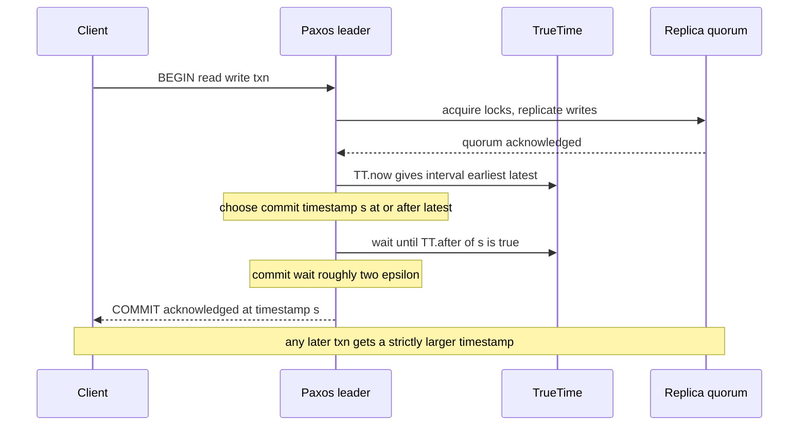
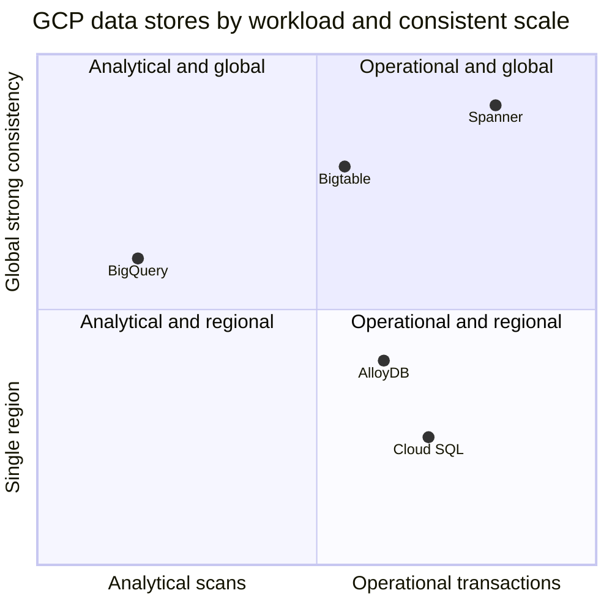
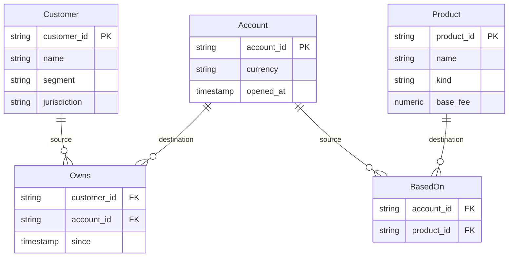
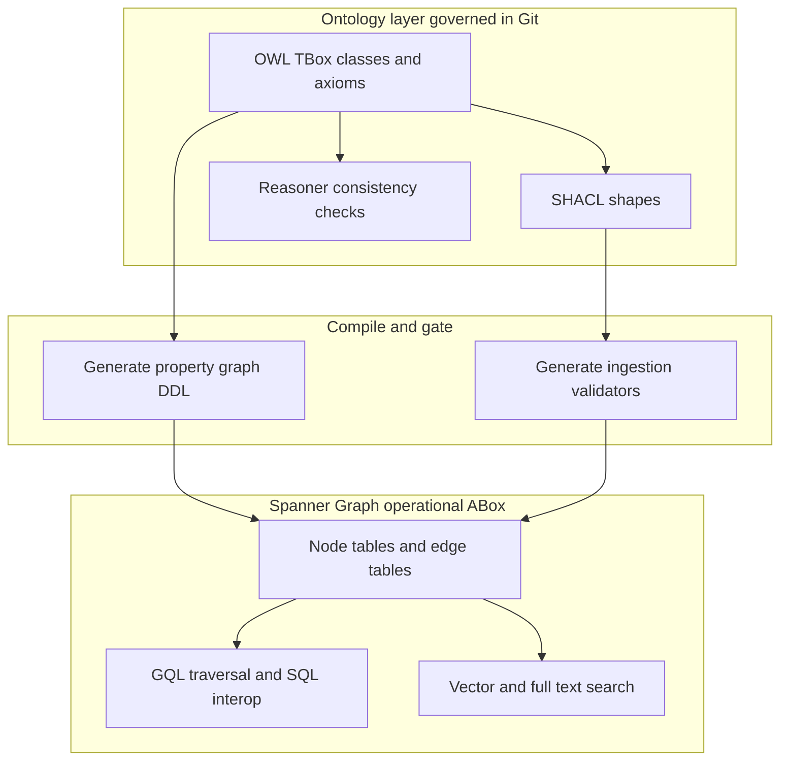
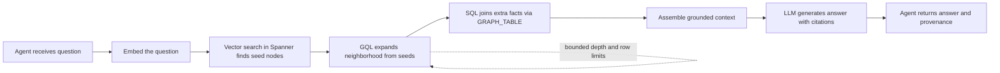

# Understanding Cloud Spanner: Graphs, Knowledge, and Where Ontologies Fit

There is a triangle that database engineers spend their careers learning to respect. One corner is *scale*: more data and more throughput than a single machine can hold. The second corner is *strong consistency*: every reader sees a single, coherent, up-to-date version of the truth, with transactions that look like they ran one at a time. The third corner is *global distribution*: the data lives in multiple regions, on multiple continents, close to users and resilient to the loss of an entire datacenter.

The folklore says you get to pick two. You can have a single-region Postgres that is strongly consistent but neither globally distributed nor horizontally scalable past one big box. You can have Cassandra or DynamoDB, globally distributed and enormously scalable, as long as you accept eventual consistency and learn to program around conflicts. You can shard MySQL by hand across a hundred instances and get scale, but you give up cross-shard transactions and spend the rest of your life writing reconciliation jobs. The triangle felt like a law of nature.

Spanner is Google's answer to "what if it isn't a law." It is a globally distributed, horizontally scalable, relational database that provides *external consistency* — the strongest consistency guarantee a transactional system can offer — across regions and continents. The original paper, presented at OSDI 2012 and given the conference's best-paper award, opens by calling Spanner "the first system to distribute data at global scale and support externally-consistent distributed transactions." That is a genuinely surprising sentence, and the rest of this post is, in large part, about why it is true and what it costs.

But this is a field-notes post for people who build knowledge bases, knowledge graphs, ontologies, and agents — not a distributed-systems lecture. So the second half is about Spanner Graph, the property-graph layer that went generally available in early 2025, and about the question I am asked more than any other when Spanner comes up in a knowledge-engineering context: *should my ontology and my knowledge graph live in Spanner?* The honest answer has two halves, and getting them straight is the whole point. Spanner Graph is an outstanding home for the *operational facts* of a knowledge graph at scale. It is not, and is not trying to be, a triplestore or an OWL reasoner. If you have read my posts on [the TBox/ABox split](https://juanlara18.github.io/portfolio/#/blog/tbox-abox-schema-facts-distinction) and [ontologies in production on GCP](https://juanlara18.github.io/portfolio/#/blog/ontology-production-pipeline-gcp), you already have the conceptual scaffolding; this post hangs Spanner on it.

## Prerequisites: what you should already have in your head

This is an advanced field-notes piece. I am going to assume a few things, and I will point at where to fill the gaps rather than re-derive them.

- **You know what a relational database and SQL are**, including transactions, isolation levels, and what "ACID" promises.
- **You understand the difference between a schema and the data that fills it.** In knowledge-graph terms this is the TBox versus the ABox distinction. If that phrasing is new, read [TBox and ABox: Why the Schema/Facts Split Matters](https://juanlara18.github.io/portfolio/#/blog/tbox-abox-schema-facts-distinction) first; the second half of this post leans on it heavily.
- **You have at least a working mental model of a property graph** (nodes, edges, labels, properties) and of RDF triples (subject, predicate, object). My [knowledge graphs in practice](https://juanlara18.github.io/portfolio/#/blog/knowledge-graphs-practice) post draws the taxonomy if you want it.
- **You have some exposure to RAG and agents.** The closing sections assume you know what retrieval-augmented generation is and why an agent might want to traverse a graph. [From Ontology to Agent Toolbox](https://juanlara18.github.io/portfolio/#/blog/ontology-to-agent-toolbox) is the companion piece on the agent side.

With that, let us start where Spanner starts: with time.

## Why Spanner Exists: TrueTime and External Consistency

The reason cross-region strong consistency is hard is that distributed systems do not agree on what time it is. Every machine has a clock, every clock drifts, and the usual fix — synchronize them over the network with NTP — leaves you with uncertainty measured in tens to hundreds of milliseconds. If you cannot agree on the order of events, you cannot agree on the order of transactions, and "the strongest consistency guarantee" is exactly a statement about the order of transactions.

Most databases respond to clock uncertainty by pretending it does not exist and then patching the symptoms: logical clocks, vector clocks, hybrid logical clocks, last-write-wins. Spanner did the opposite. It built an API called **TrueTime** that does not hide clock uncertainty — it *exposes* it.

### TrueTime: time as an interval, not a number

When ordinary code asks for the current time, it gets a single number and a false sense of precision. When Spanner code calls TrueTime, it gets back an interval: a pair `[earliest, latest]` that is *guaranteed* to contain the true absolute time. The width of that interval is the system's honest admission of how unsure it is. Google keeps the interval narrow by deploying real hardware in every datacenter — GPS receivers and atomic clocks — and running a daemon on every machine that polls them and computes a tight bound on local drift. The OSDI paper reports the uncertainty is generally kept under 10 milliseconds; later write-ups put the average half-width (the value usually called epsilon) at a few milliseconds, bounded under roughly 7 in the worst case.

Two clock sources, not one, and for a good reason: GPS and atomic clocks fail in *uncorrelated* ways. GPS can be jammed or suffer antenna and receiver faults; atomic clocks drift slowly and independently. Cross-checking the two lets the daemon detect a liar and widen the interval rather than confidently report the wrong time. The single most important property of the whole design is this: if the uncertainty grows, **Spanner slows down** to wait it out. It never trades correctness for speed.

### Commit-wait: how an interval buys you an order

Here is the trick that turns "I know time only to within epsilon" into "transactions are totally ordered consistent with real time." When a read-write transaction is ready to commit, Spanner assigns it a commit timestamp `s` taken from TrueTime. Then, before acknowledging the commit to the client, the leader deliberately *waits* until TrueTime is certain that `s` is in the past — that is, until `TT.after(s)` is true. This is called **commit-wait**, and the wait is about twice epsilon, on the order of single-digit milliseconds.

Why does this work? Because by the time the client hears "committed," every machine's clock is guaranteed to be past `s`. Any transaction that *starts* after this one finishes will therefore be handed a strictly larger timestamp. So if transaction T1 finishes before T2 begins — in real, wall-clock, externally-observable time — then T1's timestamp is smaller than T2's, and the database orders them T1 then T2. That property, that the commit order matches the real-time order any outside observer could see, is the definition of **external consistency**. It is strictly stronger than serializability: serializability says *some* serial order exists, external consistency says the serial order respects real time.



The payoff goes beyond clean commits. Because every version of every row carries a globally meaningful timestamp, Spanner supports **lock-free snapshot reads**: a read-only transaction can ask for a consistent view of the entire database "as of" some timestamp and get it without taking a single lock and without blocking any writer, even across regions. Consistent backups, repeatable analytics, and non-blocking reads in the past all fall out of the same mechanism. This is the quiet superpower that makes Spanner pleasant to build read-heavy systems on, knowledge graphs very much included.

### The machinery underneath: universes, zones, splits, and Paxos

External consistency is the headline, but Spanner is also a real distributed storage system, and its shape matters when you reason about cost and latency. A Spanner deployment is a *universe*. A universe is organized into *zones*, which are the units of physical isolation and administrative deployment — roughly, "a chunk of a datacenter." Data is partitioned into *splits*: contiguous ranges of the primary key. As a split grows or gets hot, Spanner transparently divides it and moves the pieces around; you never shard by hand.

Each split is replicated across zones, and the replicas of a split form a **Paxos group**. Paxos is the consensus protocol that keeps the replicas in agreement: as long as a majority of voting replicas are alive, the group elects a long-lived leader, the leader serves writes, and the followers can serve reads. A transaction that touches a single split is fast — it is one Paxos group reaching consensus. A transaction that spans multiple splits uses two-phase commit *across* the Paxos leaders, with the consensus protocol providing the durability that classic 2PC famously lacks. The SQL surface most people interact with descends from F1, the query engine Google built on top of Spanner in 2013 to retire its hand-sharded MySQL fleet for AdWords.

The practical consequences for a knowledge-graph engineer are worth stating plainly. Reads scoped to one split (or co-located splits) are cheap and local. Writes pay a consensus round-trip. Cross-region writes pay a geographically larger consensus round-trip plus commit-wait. And the way you choose primary keys — whether related rows land in the same split or scatter across many — is the single biggest lever you have over performance. We will come back to this when we talk about graph traversal, because a multi-hop traversal is, mechanically, a sequence of key lookups, and where those keys live determines whether your traversal is a local skip or a cross-continent tour.

## The Spanner Data Model and Where It Fits Among GCP Databases

At the surface, Spanner is a relational database: tables, typed columns, primary keys, secondary indexes, foreign keys, and SQL (in both a GoogleSQL dialect and a PostgreSQL-compatible dialect). What it adds beyond ordinary relational stores is **interleaving** — you can physically nest a child table's rows inside the parent's, so that, say, all of a customer's accounts are stored next to the customer and read in one local operation. Interleaving is how you control which rows share a split. It is the relational expression of "keep things that are queried together, stored together."

That feature set sounds like it competes with everything, so the more useful question is where Spanner *belongs*. GCP gives you a menu of databases, and choosing wrong is expensive in either money or pain. Here is how I draw the menu when a team is deciding.

| Database | Model | Consistency and scale | Reach for it when | Do not reach for it when |
|---|---|---|---|---|
| Cloud SQL | Managed MySQL, Postgres, SQL Server | Strong, single primary, regional, vertical scale plus read replicas | You have a normal app database and want zero operational surprise | You need to write at global scale or survive a region loss with no data loss |
| AlloyDB | Postgres-compatible, analytics-accelerated | Strong, regional, scales reads hard, columnar engine, vector via ScaNN | You want Postgres ergonomics plus heavy reads and vector search in one region | You need a single writer spread across continents with external consistency |
| Spanner | Relational plus property graph, multi-model | External consistency, horizontal scale, regional or multi-region | You truly need global scale and strong consistency together | The app fits on one Postgres box, or you want the cheapest possible small database |
| Bigtable | Wide-column NoSQL | Strong per-row, eventually consistent across replicas, petabyte scale | You have massive high-throughput key-value or time-series workloads | You need multi-row transactions, joins, or rich SQL |
| BigQuery | Columnar analytics warehouse | Serverless, scan-oriented, not for OLTP | You run analytical scans over huge tables and care about cost per query | You need low-latency point reads, updates, or transactional writes |

The placement on a two-axis picture makes the trade-offs legible. The horizontal axis is how operational the workload is (transactional point reads and writes) versus analytical (big scans). The vertical axis is how far the system scales while still offering strong transactional consistency.



Read the picture as a decision aid, not a scoreboard. Bigtable sits high because it scales globally, but it earns that height with weak cross-region consistency and a key-value model, so it lands away from Spanner on the operational-richness sense. BigQuery sits far to the analytical side because it is a warehouse, not a transactional store. Spanner is alone in the top-right: operationally rich *and* globally strongly consistent. That corner is exactly what is expensive and hard, which is why Spanner is not the default choice for a weekend project.

The honest framing: **Spanner is the right call when you genuinely need two corners of the impossible triangle that no cheaper option gives you together** — usually global reach plus strong consistency for transactional data — and it is overkill (and over-budget) when you do not. A regional app with a few hundred gigabytes and a single writer should run on Cloud SQL or AlloyDB and save Spanner for when scale actually forces the question. We will return to cost candidly in the boundaries section, because it is the thing most likely to surprise you.

## Spanner Graph: Property Graphs and GQL

Spanner Graph was announced in August 2024 and reached general availability on January 30, 2025. The idea is elegant and a little subversive: instead of standing up a separate graph database and building an ETL pipeline to keep it in sync with your relational data, you declare a **property graph as a view over tables you already have**. Your rows stay where they are. You add a schema object that says "these tables are nodes, these tables are edges," and from then on you can query the same data either as tables with SQL or as a graph with GQL.

### Node tables and edge tables

The mapping is declarative. You create ordinary Spanner tables, then a `CREATE PROPERTY GRAPH` statement maps them into a graph: node tables become nodes keyed by their primary key, and edge tables become edges whose `SOURCE KEY` and `DESTINATION KEY` reference the node tables. Labels classify node and edge types; columns become properties.

Let me use a small banking knowledge base, the same domain I have used across the ontology series, so the shapes are familiar. First the relational tables (GoogleSQL dialect), then the graph definition over them.

```sql
-- Node-backing tables
CREATE TABLE Customer (
  customer_id   STRING(36) NOT NULL,
  name          STRING(MAX),
  segment       STRING(32),          -- retail or corporate
  jurisdiction  STRING(2),
) PRIMARY KEY (customer_id);

CREATE TABLE Account (
  account_id    STRING(36) NOT NULL,
  currency      STRING(3),
  opened_at     TIMESTAMP,
) PRIMARY KEY (account_id);

CREATE TABLE Product (
  product_id    STRING(36) NOT NULL,
  name          STRING(MAX),
  kind          STRING(32),          -- savings, loan, card, fund
  base_fee      NUMERIC,
) PRIMARY KEY (product_id);

-- Edge-backing tables: each row is a relationship
CREATE TABLE Owns (
  customer_id   STRING(36) NOT NULL,
  account_id    STRING(36) NOT NULL,
  since         TIMESTAMP,
  FOREIGN KEY (customer_id) REFERENCES Customer (customer_id),
  FOREIGN KEY (account_id)  REFERENCES Account  (account_id),
) PRIMARY KEY (customer_id, account_id);

CREATE TABLE BasedOn (
  account_id    STRING(36) NOT NULL,
  product_id    STRING(36) NOT NULL,
  FOREIGN KEY (account_id) REFERENCES Account (account_id),
  FOREIGN KEY (product_id) REFERENCES Product (product_id),
) PRIMARY KEY (account_id, product_id);
```

Now layer the graph on top. This is the part that does not exist in a plain relational database:

```sql
CREATE OR REPLACE PROPERTY GRAPH BankGraph
  NODE TABLES (
    Customer KEY (customer_id) LABEL Customer
      PROPERTIES (customer_id, name, segment, jurisdiction),
    Account  KEY (account_id) LABEL Account
      PROPERTIES (account_id, currency, opened_at),
    Product  KEY (product_id) LABEL Product
      PROPERTIES (product_id, name, kind, base_fee)
  )
  EDGE TABLES (
    Owns
      SOURCE KEY (customer_id) REFERENCES Customer (customer_id)
      DESTINATION KEY (account_id) REFERENCES Account (account_id)
      LABEL OWNS PROPERTIES (since),
    BasedOn
      SOURCE KEY (account_id) REFERENCES Account (account_id)
      DESTINATION KEY (product_id) REFERENCES Product (product_id)
      LABEL BASED_ON
  );
```

The relationship between tables and graph elements is one-to-one and worth seeing as a diagram, because it is the literal shape of what is stored. The node tables hold entities; the edge tables hold the relationships, each carrying the foreign keys that wire two nodes together.



The thing to internalize is that **there is no separate graph store**. The `Customer` table *is* the customer nodes. The `Owns` table *is* the ownership edges. A graph query and a SQL query over these tables read the same bytes through different lenses. That is what Google means by "no ETL" and "late-bind the data model per query": the same row is a tuple to SQL and a node to GQL, and you choose per query which view fits the question.

### Querying with GQL

GQL — the ISO Graph Query Language, standardized as ISO/IEC 39075:2024 — is the graph query interface. If you have written Cypher, it will feel deeply familiar: ASCII-art patterns, `MATCH`, `RETURN`, variable-length quantifiers. A Spanner GQL query starts with `GRAPH <name>` to pick the graph, then composes linear statements.

A simple traversal — find the products held by a given customer, two hops away through their accounts:

```sql
GRAPH BankGraph
MATCH (c:Customer {customer_id: 'cust-014'})
      -[:OWNS]->(a:Account)-[:BASED_ON]->(p:Product)
RETURN p.product_id AS product, p.kind AS kind, p.base_fee AS fee
ORDER BY p.base_fee DESC;
```

Variable-length paths use a quantifier in braces. To find every account reachable from a starting account within one to three transfer hops — the canonical "follow the money" query — you would write a pattern like `-[:TRANSFERS]->{1,3}`. Spanner Graph has a specific and slightly unusual rule here that trips up people coming from Neo4j: a GQL query **cannot return a raw node, edge, or path element directly**. You must project specific properties, or wrap the element with `TO_JSON` (or, preferably, `SAFE_TO_JSON`) to serialize it. So a path-returning query looks like this:

```sql
GRAPH BankGraph
MATCH path = (src:Account {account_id: 'acct-100'})
             -[t:TRANSFERS]->{1,3}(dst:Account)
WHERE src.account_id != dst.account_id
RETURN SAFE_TO_JSON(path) AS path_json
LIMIT 50;
```

You also get the full SQL-and-graph interoperability the standard calls SQL/PGQ: the `GRAPH_TABLE` operator lets you embed a graph pattern match inside an ordinary SQL query and join its output against regular tables. So an analyst who lives in SQL can pull a subgraph and join it to a non-graph fact table without leaving their query, and a graph specialist can stay in pure GQL. Both read the same storage. As of GA, Spanner Graph also ships built-in graph algorithms (Google Research's graph-mining work, in preview on the Enterprise and Enterprise+ editions) invocable directly from GQL — PageRank-style centrality, components, and the like — so structural analytics do not require shipping the graph to an external engine.

### Strengths and limits, stated plainly

The strengths are exactly the strengths of Spanner, inherited wholesale. The graph is **transactional**: an edge and the nodes it connects commit atomically, so you never read a dangling edge that points at a node that does not exist yet, and you never lose an edge whose endpoints survived. It is **externally consistent**: a traversal sees a single coherent snapshot, even mid-write, even across regions. It **scales horizontally** past trillions of edges via the same transparent split-and-Paxos machinery. And it is **unified**: graph, relational, full-text, and vector data live in one database with one consistency model and one security boundary, which removes an entire class of "the graph and the warehouse disagree" incidents that plague two-store architectures.

The limits are equally real and mostly about latency and traversal style. A multi-hop traversal is, underneath, a chain of key lookups across splits. If your graph is laid out so that connected nodes live on different splits in different regions, a deep traversal turns into many cross-machine round-trips, and the per-hop latency adds up in a way a single-machine graph database avoids. Spanner Graph is built for *operational* graph workloads at scale — bounded-depth traversals, transactional reads and writes, point-and-neighborhood queries served fresh and fast — not for the kind of whole-graph, hundred-hop analytical wandering that a specialized in-memory graph engine does best. Knowing which workload you have is the difference between Spanner Graph feeling magical and feeling slow.

## The Ontology Question: Property Graph vs RDF/OWL, TBox vs ABox

Now the question this post exists to answer. People who work in knowledge representation hear "graph database with a knowledge-graph story" and reasonably ask: *can my ontology live in Spanner?* The careful answer requires separating two things that the word "ontology" sloppily fuses, and luckily I have already written the post that does the separating: [TBox and ABox](https://juanlara18.github.io/portfolio/#/blog/tbox-abox-schema-facts-distinction). Let me apply it here.

### Spanner Graph is a property graph, not RDF

Spanner Graph is a **labeled property graph** (LPG). RDF triplestores are a different data model with a different query language and, crucially, a different set of *semantics* attached. The distinction is not pedantry; it changes what the system can do for you.

| Dimension | Spanner Graph (property graph) | RDF / OWL triplestore |
|---|---|---|
| Atomic unit | Node or edge with key-value properties | Triple of subject, predicate, object |
| Schema style | Tables mapped to labels, closed and explicit | Open-world; vocabulary via RDFS and OWL |
| Query language | GQL (ISO 39075) plus SQL interoperability | SPARQL |
| Identity | Primary keys, local to the database | Global IRIs, designed for linking across datasets |
| Reasoning | None built in; you compute what you query | OWL entailment, description-logic inference |
| Validation | App and DB constraints, GraphRAG reconciliation | SHACL shapes, closed-world validation |
| Formal semantics | Operational, no logical entailment | Model-theoretic, open-world by default |
| Scale story | Spanner scale, external consistency, transactional | Varies by engine, rarely globally distributed |

The row that matters most is **reasoning**. An OWL ontology is not just a vocabulary; it is a set of *axioms* with a model-theoretic meaning. If you declare that `PremiumCustomer` is the class of customers with net worth over a million, and you declare a customer's net worth, an OWL reasoner will *infer* that the customer is a `PremiumCustomer` without you ever asserting it. If you declare two classes disjoint and an instance belongs to both, a reasoner will flag the contradiction. Subsumption, transitivity, inverse properties, equivalence — these are computed by description-logic engines like HermiT or Pellet against the TBox. Spanner Graph does none of this. It will not infer subclass membership, it will not check disjointness, it will not do SHACL validation, and it will not answer SPARQL. It is a fast, consistent, scalable store of nodes and edges that returns exactly what you put in plus what you explicitly traverse.

That is not a flaw. It is a different job. But it means the sentence "put your ontology in Spanner" is only half right, and the half that is wrong is the half that does the reasoning.

### The split that resolves it

Here is the resolution, and it is clean once you hold the TBox/ABox line in your head.

- The **ABox** — the assertional layer, the instances and their relationships, the millions of customers, accounts, transactions, and the typed edges between them — is exactly what a property graph is good at. It is operational, it changes continuously, it is huge, and it needs to be read fast and transactionally. **This belongs in Spanner Graph.**
- The **TBox** (and the RBox of role axioms) — the schema of the world, the class hierarchy, the formal constraints, the axioms a reasoner consumes — is small, changes slowly, is reviewed by humans, and carries the semantics. **This belongs in an ontology layer elsewhere**: a Git-versioned OWL artifact, possibly loaded into a triplestore for reasoning, governed by the kind of CI pipeline I described in [Ontologies in Production on GCP](https://juanlara18.github.io/portfolio/#/blog/ontology-production-pipeline-gcp).

The two are connected by a compilation step, not by co-residence. Your governed TBox is the source of truth for *what shapes are allowed*. From it you derive the Spanner Graph DDL (the `CREATE PROPERTY GRAPH` schema), the constraints, and the validation rules that the ABox ingestion pipeline enforces before anything lands in Spanner. The ontology stays the contract; Spanner stays the operational substrate that the contract governs.



I have watched teams try to collapse this and put schema triples in the same store as instance data, then discover at 2 a.m. that a data migration silently dropped a class axiom, or that there is no reasoner to catch the contradiction they just introduced. Keep the semantic layer where the semantics are first-class, and let Spanner do the thing it is extraordinary at: serving the facts, consistently, at scale. If you need genuine OWL reasoning over the result, you periodically project the relevant slice out of Spanner into a reasoning engine — you do not ask Spanner to become one.

There is a subtler point worth making for the property-graph purists. The LPG model *blurs* the TBox/ABox line by design: any node can carry any label and any property, so the schema is a convention enforced at write time rather than a logical theory. Spanner Graph sharpens it back up by requiring you to declare node and edge tables explicitly — the graph is closed to the tables you mapped. That declared-schema discipline is precisely what makes Spanner Graph a *safer* ABox host than a schema-optional graph database, because the allowed shapes are pinned by the DDL, which you generated from the governed TBox. The governance you build in the ontology layer actually reaches into the store.

## Spanner for AI: GraphRAG, Agents, and Hybrid Graph plus Vector Retrieval

This is where the two threads — global operational graph, and AI-facing knowledge retrieval — tie together, and where Spanner Graph earns its place in a 2026 stack.

### Vectors live in the same database

Spanner has built-in vector search, and it is not an afterthought bolted on; it is in the same tables, under the same transactions. You store embeddings as a `FLOAT32` array column (annotated with a vector length), and you query nearest neighbors two ways. For small or highly-partitioned result sets you use **exact KNN** with the distance functions `COSINE_DISTANCE`, `EUCLIDEAN_DISTANCE`, or `DOT_PRODUCT`, ordered by distance with a `LIMIT`. For large datasets you build a **vector index** backed by Google's ScaNN algorithm and switch to the approximate functions like `APPROX_COSINE_DISTANCE`, trading a sliver of recall for a large cut in latency and cost.

A KNN retrieval over document chunks, the bread and butter of RAG, looks like ordinary SQL:

```sql
-- Exact KNN: good for small or pre-filtered candidate sets
SELECT doc_id, title, chunk_text
FROM DocChunk
WHERE jurisdiction = 'ES'                       -- cheap relational pre-filter
ORDER BY COSINE_DISTANCE(embedding, @query_vec)
LIMIT 8;
```

And the approximate version, once the corpus is large enough to warrant an index:

```sql
-- ANN: requires a ScaNN-backed vector index and a vector_length annotation
SELECT doc_id, title, chunk_text
FROM DocChunk @{FORCE_INDEX=DocChunkEmbeddingIndex}
WHERE embedding IS NOT NULL
ORDER BY APPROX_COSINE_DISTANCE(
    embedding, @query_vec,
    options => JSON '{"num_leaves_to_search": 20}')
LIMIT 50;
```

The reason this matters for knowledge work is that the vectors and the graph are *the same data in the same store*. You can find an entry point by semantic similarity and then traverse relationships from it, in one consistent snapshot, without copying anything between systems. That is the architecture of GraphRAG, and Spanner gives you both halves natively. Google's own LangChain integration ships a `SpannerGraphStore` that loads an extracted knowledge graph into Spanner Graph and handles the schema generation and node deduplication, so the prototyping path is short.

### The hybrid retrieval an agent actually runs

Plain vector RAG hands a model a bag of chunks ranked by similarity. It cannot follow the relationships those chunks imply — that a regulation governs a product, that the product is held by an account, that the account belongs to a customer in a flagged jurisdiction. GraphRAG closes that gap: use vectors (or full-text search) to *land* on relevant nodes, then use GQL to *expand* the neighborhood and gather the connected context, then feed both to the model. Because Spanner does the landing and the expanding in one database, the expanded context is transactionally fresh — not a stale snapshot from last night's graph export.

Here is the loop an agent runs, end to end. Notice the two retrieval modes feeding one grounded answer.



A compact Python sketch of the hybrid step, using the Spanner client, shows how little glue it takes:

```python
from google.cloud import spanner

def hybrid_retrieve(db, query_vec, k_seeds=8, max_hops=2):
    """Vector-seed then graph-expand, in one consistent snapshot."""
    with db.snapshot() as snap:  # external-consistent read, no locks
        # 1. Semantic seeds: nearest document/entity nodes by embedding.
        seeds = list(snap.execute_sql(
            """
            SELECT entity_id
            FROM EntityEmbedding
            WHERE embedding IS NOT NULL
            ORDER BY APPROX_COSINE_DISTANCE(
                embedding, @qv, options => JSON '{"num_leaves_to_search": 20}')
            LIMIT @k
            """,
            params={"qv": query_vec, "k": k_seeds},
            param_types={
                "qv": spanner.param_types.Array(spanner.param_types.FLOAT32),
                "k": spanner.param_types.INT64,
            },
        ))
        seed_ids = [row[0] for row in seeds]

        # 2. Graph expansion: bounded neighborhood around each seed via GQL.
        context = list(snap.execute_sql(
            """
            GRAPH BankGraph
            MATCH path = (s:Entity)-[r]->{1,2}(n)
            WHERE s.entity_id IN UNNEST(@seeds)
            RETURN SAFE_TO_JSON(path) AS path_json
            LIMIT 200
            """,
            params={"seeds": seed_ids},
            param_types={
                "seeds": spanner.param_types.Array(spanner.param_types.STRING)
            },
        ))
    return seed_ids, [row[0] for row in context]
```

Two design points carry over directly from [the agent toolbox post](https://juanlara18.github.io/portfolio/#/blog/ontology-to-agent-toolbox). First, the traversal is **bounded** — `{1,2}` and a `LIMIT`, never an unbounded `*` — because an agent will otherwise eventually write the query that walks the whole graph. Second, the retrieval reads through a `snapshot`, which on Spanner is a lock-free, externally-consistent read: the agent never blocks a writer and never sees a half-applied transaction, even while the operational system keeps mutating the graph underneath it. Transactional freshness is the feature that distinguishes a knowledge base an agent can *trust* from one it merely *reads*.

What can you realistically extract from Spanner for AI and agents? Three things, in order of value. **Fresh facts**: point lookups and neighborhood traversals that reflect the true current state, not a nightly dump. **Structured context**: typed paths that tell the model not just *what* is relevant but *how* things relate, which is what lets a model reason about causation and governance rather than co-occurrence. And **hybrid candidates**: the union of semantic similarity and graph proximity, which catches relevant nodes that pure vector search misses because they are connected rather than worded similarly. The ontology, living in its own layer, is what tells the agent which traversals are *meaningful* — it is the source of the tool definitions and allow-lists — while Spanner is what makes those traversals *fast and true*.

## What Spanner Does NOT Solve (Honest Boundaries) and Cost Reality

I would be doing the reader a disservice if I let the previous sections read like a sales page. Spanner is a sharp tool with sharp edges. Here is where it is the wrong answer.

**It is not an analytics warehouse.** Spanner is built for operational reads and writes — point lookups, bounded traversals, transactions. If your question is "scan three billion rows and aggregate," that is BigQuery's job, and trying to do it in Spanner is both slow and expensive. The right pattern is operational data in Spanner, a change stream or scheduled export into BigQuery, analytics there. Do not make Spanner your warehouse.

**It is not a cheap small-app database.** Spanner's pricing reflects the machinery — replicated compute capacity, multi-region replication, the storage to back it. For a small, regional, single-writer workload it is dramatically more expensive than Cloud SQL or AlloyDB for no benefit you will use. The granularity has improved over the years (you can provision fractional capacity, and there is a free trial instance for learning), but the floor is still well above "a small Postgres." Choosing Spanner because it is impressive, rather than because you need global scale plus strong consistency, is a budget mistake I have watched happen.

**It is not a triplestore or an OWL reasoner.** We covered this at length: no SPARQL, no description-logic inference, no SHACL validation, no entailment. If your core need is reasoning over an ontology, Spanner is the wrong layer for that need (though an excellent layer for the facts the reasoning operates on).

**It is not a drop-in for unbounded graph analytics.** The built-in algorithms cover important cases, but if your workload is whole-graph, deep, iterative analytical traversal of the kind a specialized in-memory engine excels at, measure before you commit. Spanner Graph shines at operational graph access at scale; it is not pretending to be a graph-analytics supercomputer.

**It is not magic about latency physics.** External consistency for cross-region *writes* costs you a geographically-sized consensus round-trip plus commit-wait. If your write pattern is globally scattered and latency-critical, you must design your schema (key choice, interleaving, region topology) to keep related writes local, or you will pay for the distance every commit. The triangle is bent, not repealed; you still pay something for global strong consistency, and that something is write latency under contention.

On cost specifically, the realistic mental model is: you are renting always-on replicated capacity plus replicated storage, billed continuously, with multi-region configurations costing meaningfully more than regional ones because they replicate across more zones in more places. Vector indexes, full-text indexes, and the Enterprise editions needed for graph algorithms add to the bill. None of this is a reason to avoid Spanner; it is a reason to reach for it deliberately, when the workload's requirements actually intersect at the corner only Spanner occupies. When they do, it is worth every cent, because the alternative is hand-building consistency across a fleet, which costs more in engineering-years than Spanner ever costs in dollars. When they do not, you are paying for a guarantee you are not using.

## Putting It Together

If you remember five things from this post, make them these. Spanner exists to deliver global scale, horizontal sharding, and external consistency together, and the thing that makes that possible is TrueTime turning honest clock uncertainty into a global order via commit-wait. Spanner Graph is a property graph declared as a view over relational tables, queried with ISO GQL, fully interoperable with SQL, and inheriting Spanner's consistency and scale. It is a property graph, not RDF — so it stores facts beautifully and reasons not at all. The clean architecture for knowledge work puts the operational ABox in Spanner Graph and keeps the semantic TBox in a governed ontology layer that compiles down into Spanner's schema and validators. And for AI, Spanner's native vectors plus graph traversal in one consistent store make it a strong GraphRAG backbone that serves agents fresh, structured, hybrid context — with the ontology elsewhere telling the agent which traversals mean something.

The triangle is not a law of nature. But the corner Spanner occupies is expensive to build and expensive to rent, so occupy it on purpose.

## Going Deeper

**Books:**

- Kleppmann, M. (2017). *Designing Data-Intensive Applications.* O'Reilly.
  - The single best grounding for everything in the first half of this post: replication, consensus, consistency models, and clocks. Read the chapters on consistency and consensus before you argue with anyone about external consistency.
- Petrov, A. (2019). *Database Internals: A Deep Dive into How Distributed Data Systems Work.* O'Reilly.
  - Covers storage engines and the distributed-systems machinery (replication, consensus, transactions) that Spanner's splits and Paxos groups instantiate. The Paxos and 2PC chapters map directly onto Spanner's write path.
- Allemang, D., Hendler, J., & Gandon, F. (2020). *Semantic Web for the Working Ontologist* (3rd ed.). ACM Books.
  - The practitioner's reference for RDF, RDFS, OWL, and SHACL. This is the book that explains what Spanner Graph deliberately does *not* do, and why you keep the reasoning layer separate.
- Hodler, A. E., & Needham, M. (2019). *Graph Algorithms: Practical Examples in Apache Spark and Neo4j.* O'Reilly.
  - For when you are deciding whether your workload is operational graph access (Spanner Graph) or heavy graph analytics (something else). The algorithm catalog clarifies the boundary.

**Online Resources:**

- [Spanner: TrueTime and external consistency](https://cloud.google.com/spanner/docs/true-time-external-consistency) — Google's own concise explanation of the guarantee and the clock that backs it. Start here.
- [Spanner Graph overview](https://cloud.google.com/spanner/docs/graph/overview) and [schema overview](https://cloud.google.com/spanner/docs/graph/schema-overview) — The canonical reference for node tables, edge tables, and `CREATE PROPERTY GRAPH`.
- [Find K-nearest neighbors](https://cloud.google.com/spanner/docs/find-k-nearest-neighbors) and [approximate nearest neighbors](https://cloud.google.com/spanner/docs/find-approximate-nearest-neighbors) — The exact and ScaNN-backed vector search docs, with the distance functions used in this post.
- [Using Spanner Graph with LangChain for GraphRAG](https://cloud.google.com/blog/products/databases/using-spanner-graph-with-langchain-for-graphrag) — The hands-on GraphRAG path, including the `SpannerGraphStore` integration.
- [Life of Spanner Reads and Writes](https://cloud.google.com/spanner/docs/whitepapers/life-of-reads-and-writes) — A readable walk through splits, Paxos, and how a transaction actually executes.

**Videos:**

- [Distributed Systems 8.2: Google's Spanner](https://www.youtube.com/watch?v=oeycOVX70aE) by Martin Kleppmann — An 18-minute university lecture that explains TrueTime, commit-wait, and external consistency more clearly than most written treatments. The best single starting point if the first half of this post felt dense.
- [Building next-generation databases at Google: Cloud Spanner under the hood](https://www.youtube.com/watch?v=eezLzbcqrdg) by Google Cloud Tech — A practitioner-oriented tour of Spanner's architecture and the real Google workloads (Ads, YouTube, Gmail) that run on it, useful for calibrating when the scale is real.

**Academic Papers:**

- Corbett, J. C., Dean, J., Epstein, M., et al. (2012). ["Spanner: Google's Globally-Distributed Database."](https://research.google.com/archive/spanner-osdi2012.pdf) *Proceedings of OSDI 2012.* (Best Paper Award.)
  - The source. Sections 3 and 4 — TrueTime and how it implements externally-consistent transactions — are the load-bearing read. Everything else in this post is downstream of this paper.
- Brewer, E. (2017). ["Spanner, TrueTime and the CAP Theorem."](https://research.google/pubs/spanner-truetime-and-the-cap-theorem/) Google technical report.
  - Brewer (of CAP fame) explains why Spanner's combination of availability and consistency does not violate the CAP theorem, and the precise role TrueTime plays. The honest accounting of what is and is not free.

**Questions to Explore:**

- If your ontology's TBox lives in a triplestore for reasoning and your ABox lives in Spanner Graph for serving, where does inferred knowledge go? Do you materialize entailments back into Spanner as explicit edges, recompute them on read, or serve two tiers of "asserted" versus "inferred" facts? What does each choice cost in freshness and storage?
- External consistency makes cross-region writes pay commit-wait. For a globally distributed knowledge graph, is it better to pick a single write region and accept distant writers, or to partition the graph by geography so most writes stay local? How does the ontology's structure constrain that choice?
- Spanner Graph closes the schema to declared node and edge tables, while a triplestore is open-world. When an LLM extraction agent proposes a fact that does not fit the declared graph, the property-graph store simply rejects it. Is that stricter failure mode a feature or a loss compared to RDF's open-world tolerance, and for which workloads?
- GraphRAG over Spanner gives an agent transactionally fresh context. At what point does freshness stop mattering — where is the line past which a nightly export into a cheaper store would serve the agent just as well at a fraction of the cost?
- If a property graph cannot reason but can scale, and a triplestore can reason but rarely scales globally, what would a system that does both actually look like? Is the right answer one store with two engines, or two stores with a disciplined compilation seam between them, as argued here?
