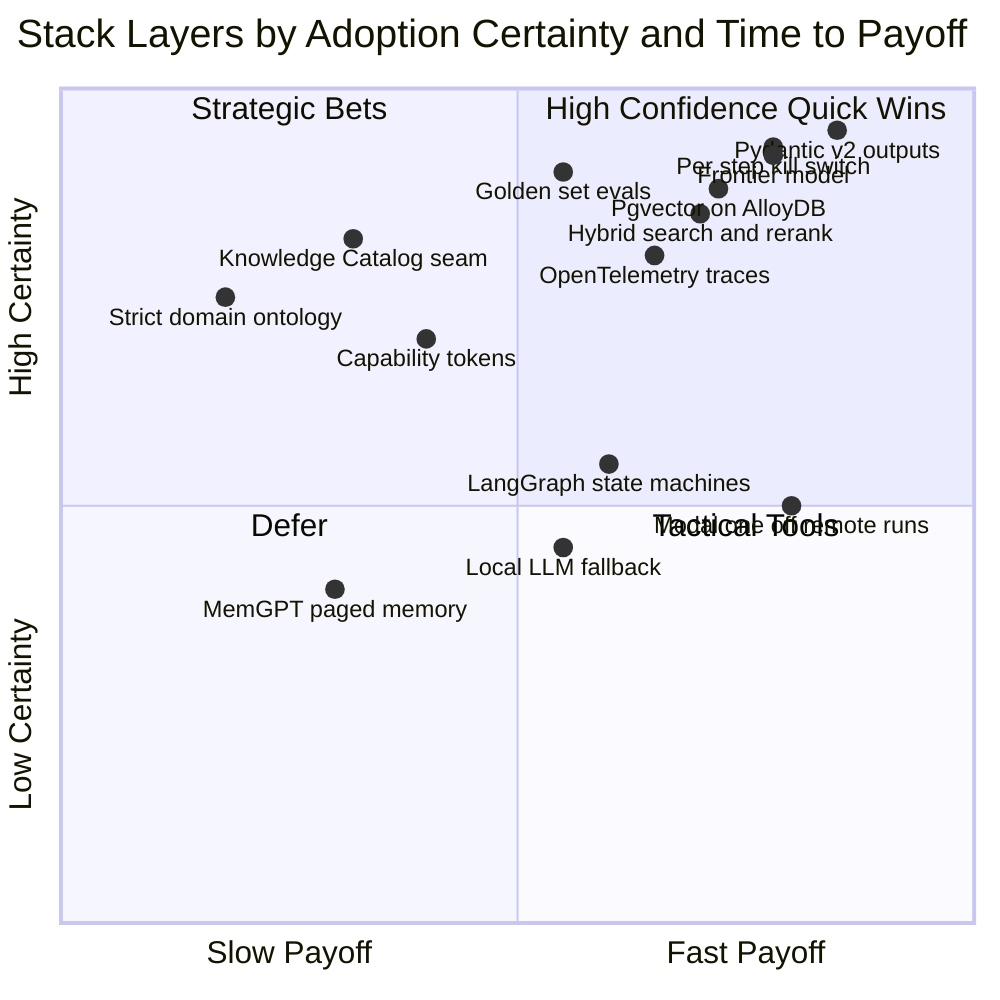
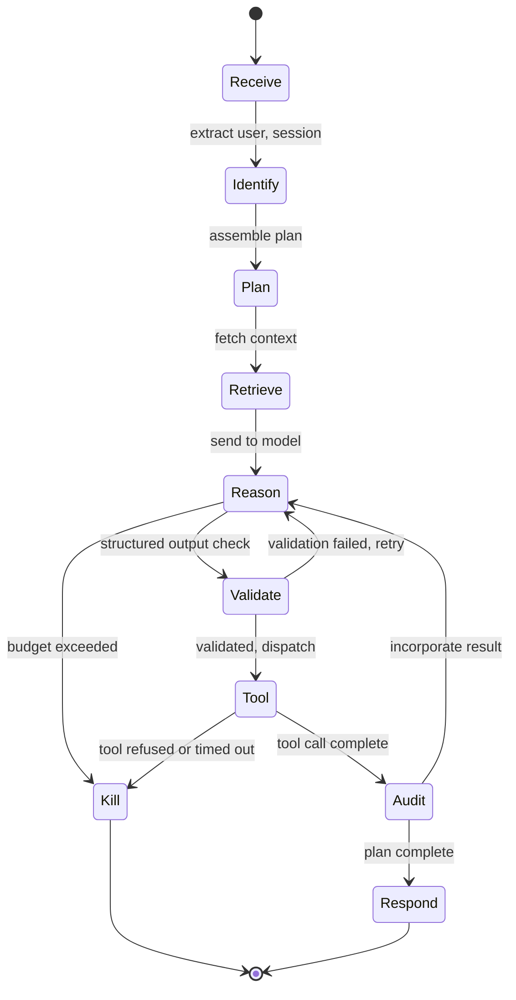
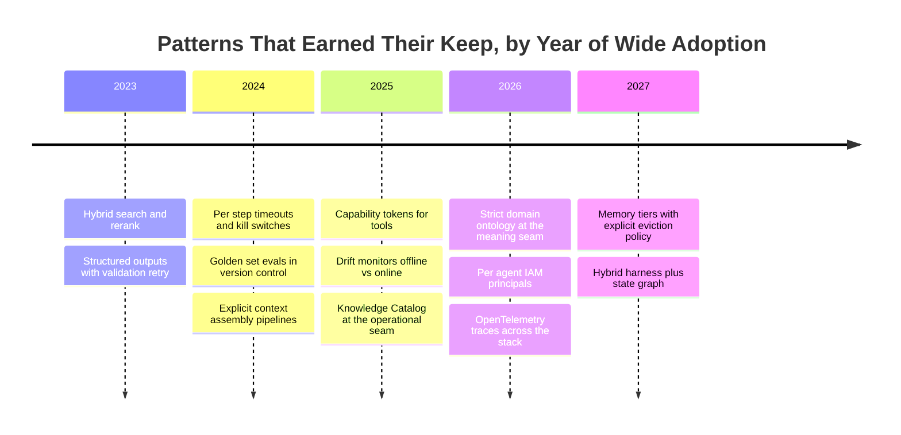
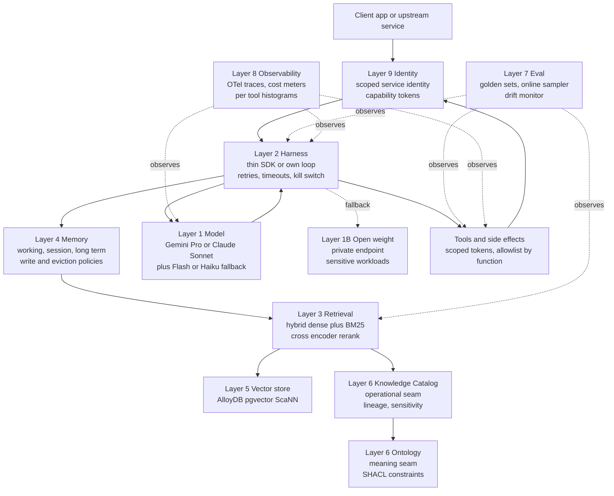
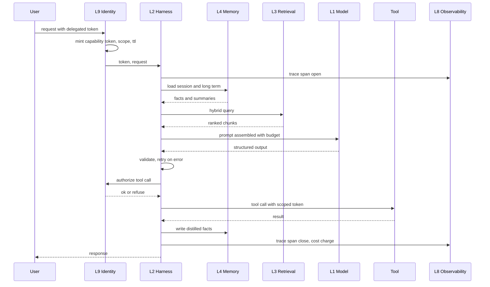

# The Stack I Would Adopt After 100 Posts: An Opinionated Manifesto

The hundredth post in this archive was the [structural retrospective](https://juanlara18.github.io/portfolio/#/blog/100-posts-knowledge-graph-retrospective) — what was written, in what order, with what tag co-occurrence, and what shape the corpus took as a graph. This post is the other half of the same coin. If post one hundred was the map of *what was written*, post one hundred and one is the map of *what to use*.

After a hundred posts of writing "it depends" — about embedding models, vector stores, frameworks, evaluation harnesses, observability tools, memory schemes, identity layers, retrieval strategies, and deployment patterns — I have earned the right, for one post, to stop hedging. This is the stack I would adopt today, end to end, if I were starting a new corporate knowledge base on GCP tomorrow morning. It is the stack I would recommend to past-me. It is opinionated, concrete, and unsurprising in places where unsurprising is the right answer. It is also, in a few places, deliberately contrarian.

The frame: I have been a Knowledge Data Engineer at a financial institution since late 2026. The systems I am building — a vector database proof of concept, lakehouse-resident agents, and the corporate knowledge base for the Personal Bank line — sit on a GCP-first stack and are governed under regulatory regimes that do not tolerate the kind of "we'll add safety later" thinking that consumer AI startups can sometimes get away with. That context shapes every recommendation in this post. If your context is different, calibrate accordingly: the criteria below explain *why* each pick made the cut, which is more transferable than the picks themselves.

---

## How To Read This

I am organizing the post by **layer**, not by vendor or by use case. There are ten layers, from the foundation model down to the engineering loop on a developer's laptop. For each layer I give three buckets:

- **Adopt** — use immediately. Production-ready, well-understood failure modes, sane operational story, defensible governance.
- **Try** — worth a serious experiment in a sandbox. Not yet load-bearing, but the upside justifies the cost of an honest evaluation.
- **Avoid** — either actively harmful, or the cost of operating it outweighs the benefit, or a better alternative has won the race and you should not pretend it has not.

For each pick I give a justification — not just a name. The criteria I use, ranked by how much weight they carry in regulated work:

1. **Governance fit.** Audit trail, identity scoping, data residency, ability to satisfy a regulator who has never read a Hugging Face model card.
2. **Time-to-stable-API.** How long the SDK has been stable. How recently the company shipped a breaking change. How honest the deprecation policy is.
3. **Total cost of ownership.** Not just the sticker price but the operational burden, the expertise required to keep it alive, the on-call cost.
4. **Simplicity.** The number of moving parts. The number of pages of documentation an on-call engineer must read at three in the morning.
5. **Ecosystem health.** Maintainers, release cadence, security disclosures, the size and seriousness of the community.
6. **Vendor lock-in.** How much code, data, and operational practice you would have to throw away to leave.

Quality of the underlying technology matters too, but past a baseline it stops being the bottleneck. The bottleneck is governance and operability.



The quadrant above is the executive summary. Top-right items are the "do them tomorrow" picks. Top-left items are the strategic bets — high-certainty wins that simply take time to bear fruit. Bottom-right items are tactical conveniences. Bottom-left items are the things to defer until you have a forcing function.

---

## Layer 1: The LLM and Model Layer

### Adopt

**One frontier model as the default brain plus one smaller fallback for cheap work.** As of mid-2027 the two viable defaults for serious enterprise work are Claude Sonnet (currently in the 4.7 generation, with Opus 4.7 sitting above it as the high-effort variant) and Gemini (the 3.x line, with 2.5 Pro still in service for older workloads). Pick *one* as your primary based on quality, price, and which vendor your organization can sign a real DPA with — not based on whichever benchmark the tech press is excited about that week.

In financial services on GCP, the path of least friction is Gemini through Vertex AI. The model lives in your tenancy boundary, the IAM model is the same one your platform team already understands, and Vertex's [Gemini lineup](https://docs.cloud.google.com/vertex-ai/generative-ai/docs/models/gemini/2-5-flash) gives you Pro for hard work and Flash for cheap volume without juggling two vendors' billing. If you have a strong reason to want Claude — and there often is one, especially for the kind of long-form structured reasoning that shows up in regulated review workflows — Claude is also available through Vertex and through Anthropic's first-party API. Pick one path and go.

The fallback model matters more than people expect. Most agent steps are small — a classifier here, a query rewriter there, a structured-output extractor — and the marginal accuracy gain from running them on Opus rather than Haiku is not worth the order-of-magnitude cost difference. Build the harness so a single annotation on the step decides whether it routes to the heavy model or the cheap one, and start with everything on the cheap model by default. Promote individual steps to the heavy model only when an eval shows it earns its keep.

| Model family | Best for | Avoid for |
| --- | --- | --- |
| Claude Sonnet 4.7 | Long-form structured reasoning, regulated review, coding agents | Tight latency budgets, cents-per-call workloads |
| Claude Opus 4.7 | High-effort planning, hardest single-shot tasks | Anything you call more than a few thousand times a day |
| Gemini 2.5 Pro / 3.x | GCP-native workloads, multimodal, very long context | Workloads that need to run outside Google's tenancy |
| Gemini Flash | Classifiers, rewriters, summarization at scale | Multi-step planning, complex tool use |
| Open-weight 70B class | Sensitive content that cannot leave VPC | General-purpose default — operational cost is too high |

### Try

**An open-weight reasoning model on a private endpoint for sensitive work.** The 2026 generation of open-weight reasoning models is good enough that, for a narrow class of workloads — the ones where the data physically cannot leave your perimeter, or where the model needs to be frozen for an auditor for years — running your own endpoint is now defensible. It is still operationally expensive. You will spend real engineering time on inference serving, autoscaling, and security patching. But the alternative for sensitive workloads is sometimes "do not build this at all," and an open-weight model in a controlled VPC is a real third option.

### Avoid

**Spreading across five providers without a router.** Every additional provider triples your governance surface area. New DPAs, new key rotation, new prompt-injection threat models, new outage stories. If you genuinely need provider redundancy — and most organizations do not — put a routing layer in front of it and treat the providers as interchangeable backends. Do not let the prompt engineer pick a provider per use case. That way lies a vendor matrix that nobody can audit.

**Local LLM tooling as a primary serving path.** I have written before about [local LLM inference tools](https://juanlara18.github.io/portfolio/#/blog/local-llm-inference-tools), and Ollama and vLLM are wonderful for development and for evaluation harnesses. They are not a serving path for a regulated knowledge base. The operational delta between "I run vLLM on a single GPU at my desk" and "I run vLLM in production with proper observability, rate limiting, and key rotation" is enormous, and most teams underestimate it by a factor of ten.

---

## Layer 2: The Orchestration Layer

### Adopt

**A thin SDK or your own harness, plus Pydantic v2 for structured outputs, plus the provider's native SDK.** This is the message of [Agent Engineering as a Discipline](https://juanlara18.github.io/portfolio/#/blog/agent-engineering-disciplines): the harness is one of the six core disciplines, and outsourcing it to a framework you do not own is one of the surest ways to lose control of your agent's failure modes.

I write my own harnesses now. They are small. The skeleton fits in a few hundred lines. They expose three things to the rest of the system: a `run(plan)` entrypoint, a structured trace emitter, and a kill switch. Everything else — retries, timeouts, planner, tool dispatch — is composed from a small library of primitives that I read top-to-bottom every six months and prune.

Pydantic v2 is non-negotiable. It is the smallest, most stable interface between the model's free-form output and the rest of your code. When the model produces a malformed object, Pydantic is the boundary that catches it before it propagates. The retry-on-validation-fail pattern is one of the patterns that earned its keep — see "Patterns That Earned Their Keep" below.

```python
from pydantic import BaseModel, Field, ValidationError
from typing import Literal

class TicketTriage(BaseModel):
    severity: Literal["P1", "P2", "P3", "P4"]
    category: Literal["billing", "technical", "compliance", "other"]
    summary: str = Field(min_length=10, max_length=400)
    confidence: float = Field(ge=0.0, le=1.0)

def triage_with_retry(client, prompt: str, max_attempts: int = 3) -> TicketTriage:
    last_error: str | None = None
    for attempt in range(max_attempts):
        suffix = "" if last_error is None else (
            f"\n\nYour previous response failed validation: {last_error}. "
            "Return JSON that matches the schema exactly."
        )
        raw = client.complete(prompt + suffix, response_format="json")
        try:
            return TicketTriage.model_validate_json(raw)
        except ValidationError as e:
            last_error = str(e)
    raise RuntimeError(f"triage failed after {max_attempts} attempts: {last_error}")
```

The pattern is small and unglamorous. It also catches more bugs than any single piece of orchestration framework I have ever used.

### Try

**LangGraph for multi-step plans where state machines genuinely help.** The honest case for [LangGraph](https://github.com/langchain-ai/langgraph) is workflows where the state is non-trivial — branches, parallel fan-out, human-in-the-loop checkpoints — and where modelling it as an explicit graph buys you readability and debuggability. As of mid-2026 the project shipped its 1.x line and the API has stabilized enough that the deprecation churn that defined LangChain in 2023 and 2024 no longer dominates. I have used LangGraph for two production workflows and I am happy with both. I would not use it for a simple linear pipeline.

**LlamaIndex for retrieval glue.** [LlamaIndex](https://www.llamaindex.ai/) has settled into a useful niche as the "smart-glue" library for retrieval — connectors, ingest pipelines, evaluation harnesses, the unflashy plumbing of RAG. Their durable workflow support, added in late 2025, finally made it usable for long-running ingestion jobs. I would adopt it for ingest-heavy projects and avoid it for chat orchestration.

### Avoid

**Heavy framework lock-in early.** The ratio of framework code to your code, in your first six months, should be far below one. If at month three you have ten thousand lines of framework configuration and a thousand lines of your own logic, you have built a system you do not own. Frameworks are seductive because they make week one fast. They make week sixty miserable.

**Reactive-imperative chains that hide the prompt.** If the prompt that goes to the model is constructed by five layers of decorators and abstract factories and template inheritance, you have lost the most important debugging primitive in the entire system, which is "print the prompt." [Agent Engineering as a Discipline](https://juanlara18.github.io/portfolio/#/blog/agent-engineering-disciplines) goes deep on why context engineering deserves its own role; the corollary at the orchestration layer is that the prompt must be visible, version-controlled, and diffable.

| Framework | Adopt for | Avoid for |
| --- | --- | --- |
| Your own harness | Production agents, anything regulated, anything you will own for years | Throwaway prototypes |
| LangGraph | Multi-step plans with branches, human-in-the-loop, parallel fan-out | Linear pipelines |
| LlamaIndex | Ingest, retrieval glue, eval harnesses | Chat orchestration, agent loops |
| LangChain core | Quick prototypes only | Anything that lives past three months |
| Provider SDK direct | Always, alongside one of the above | Never alone past the first prototype |

---

## Layer 3: The Retrieval and RAG Layer

### Adopt

**Hybrid search, with rerankers, with an evaluation harness from day one.** This is the central message of the [RAG production systems guide](https://juanlara18.github.io/portfolio/#/blog/rag-building-production-systems), and it has not changed since I wrote it. The progression from pure dense vector search to hybrid (dense plus BM25) to hybrid-with-rerank is the single highest-leverage upgrade you can make to a retrieval system, and it is fully a 2024-vintage technique. If you are not running it in 2027 you are leaving recall on the floor.

Embedding stability matters more than embedding quality past a baseline. If your embedding model changes, every chunk in your index is now technically inconsistent with every new query. Re-embedding a 100-million-chunk corpus is not free. Pick a model with a stable enough provider story that you are not re-embedding twice a year, and stop chasing the embedding-of-the-month.

```python
from typing import Sequence
import numpy as np

def hybrid_search(
    client_pg,
    query_embedding: np.ndarray,
    query_text: str,
    k_dense: int = 50,
    k_sparse: int = 50,
    k_final: int = 20,
) -> list[dict]:
    """
    Reciprocal-rank fusion of dense vector search and BM25.
    Assumes AlloyDB with pgvector and tsvector indexes on the same table.
    """
    dense_sql = """
      select chunk_id, 1.0 / (60 + row_number() over (order by emb <=> %s)) as score
        from chunks
       order by emb <=> %s
       limit %s
    """
    sparse_sql = """
      select chunk_id, 1.0 / (60 + row_number() over (
                  order by ts_rank_cd(ts, websearch_to_tsquery(%s)) desc)) as score
        from chunks
       where ts @@ websearch_to_tsquery(%s)
       limit %s
    """
    with client_pg.cursor() as cur:
        cur.execute(dense_sql, (query_embedding, query_embedding, k_dense))
        dense = dict(cur.fetchall())
        cur.execute(sparse_sql, (query_text, query_text, k_sparse))
        sparse = dict(cur.fetchall())
    fused: dict[str, float] = {}
    for cid, s in dense.items():
        fused[cid] = fused.get(cid, 0.0) + s
    for cid, s in sparse.items():
        fused[cid] = fused.get(cid, 0.0) + s
    top = sorted(fused.items(), key=lambda kv: kv[1], reverse=True)[:k_final]
    return [{"chunk_id": cid, "fused_score": s} for cid, s in top]
```

The eval harness from day one is the bit most teams skip and most teams regret skipping. Before you tune a single retrieval parameter, write a [RAGAS](https://docs.ragas.io/)-style harness that scores answer faithfulness, context precision, and context recall against a golden set. Twenty examples is enough to start. You can always grow the set; what you cannot do is retroactively know whether the parameter you tuned six months ago made things better or worse.

### Try

**ColBERT-style late interaction for very high-recall retrieval.** Late-interaction models score query-token vectors against document-token vectors directly, which buys you better recall on hard queries at the cost of more storage and more compute. The 2026-era ColBERT variants are now operationally tractable; I would experiment with them when bi-encoder recall is hitting a ceiling on a specific high-value query distribution.

**Query routing for diverse corpora.** When you have multiple corpora that look very different — a regulatory-document corpus, a product-docs corpus, a customer-support-transcript corpus — a small router that decides which retrievers to fan out to, and how to weight the fused results, often beats a single one-size-fits-all retrieval pipeline. I wrote about this pattern in [query routing as agent decisions](https://juanlara18.github.io/portfolio/#/blog/query-routing-agent-decisions).

### Avoid

**Chunk-and-pray.** Splitting documents on a fixed token boundary, embedding the chunks, hoping cosine similarity does the rest. This was the 2023 default and it still works as a demo and never works at production load.

**Pure vector search with no rerank.** A bi-encoder produces an approximate ranking. A cross-encoder rerank turns that approximate ranking into a much better one. The compute cost of reranking the top fifty is small. Skipping it is the most common cost-saving I see teams make and the one I most often have to undo.

**Embedding-of-the-month chasing.** A new embedding model that scores 1.5 points higher on MTEB is not a reason to re-embed your corpus. Re-embedding is expensive, breaks reproducibility, and almost never moves end-to-end metrics by more than noise.

---

## Layer 4: The Memory and Context Layer

### Adopt

**Explicit memory tiers — working, session, long-term — with a write policy and an eviction policy from day one.** Memory is the discipline most teams treat as an afterthought and the one that produces the most expensive failures (cross-tenant leakage, hallucinated user history, unbounded growth). The [Agent Engineering as a Discipline](https://juanlara18.github.io/portfolio/#/blog/agent-engineering-disciplines) post calls memory engineering "the least formalized of the six disciplines," and that has not changed.

The minimum viable memory architecture has three tiers:

1. **Working memory**: the current conversation buffer. Lives for the duration of a request. Bounded by a token budget. Eviction policy: oldest non-pinned messages.
2. **Session memory**: per-user-per-session state. Lives for the duration of a session (typically minutes to hours). Stored in Redis or equivalent. Eviction policy: TTL.
3. **Long-term memory**: per-user durable facts. Lives indefinitely. Stored in a relational store with strict tenant isolation. Eviction policy: explicit user-initiated forget plus regulatory retention boundary.

The write policy says *what* gets written into each tier, by whom, with what summarization. The eviction policy says *what* gets dropped, when, and how the agent is informed that it has been dropped. Both policies must exist on day one.

```python
from collections import deque
from dataclasses import dataclass, field
from datetime import datetime, timezone
from typing import Iterable

@dataclass
class WorkingMemory:
    """Token-bounded working buffer with oldest-first eviction of non-pinned items."""
    token_budget: int
    items: deque[dict] = field(default_factory=deque)
    used_tokens: int = 0

    def add(self, role: str, text: str, tokens: int, pinned: bool = False) -> None:
        self.items.append({"role": role, "text": text, "tokens": tokens, "pinned": pinned})
        self.used_tokens += tokens
        self._evict()

    def _evict(self) -> None:
        i = 0
        while self.used_tokens > self.token_budget and i < len(self.items):
            if not self.items[i]["pinned"]:
                self.used_tokens -= self.items[i]["tokens"]
                del self.items[i]
            else:
                i += 1
        if self.used_tokens > self.token_budget:
            raise MemoryError("budget exceeded with only pinned items")

    def render(self) -> Iterable[dict]:
        return list(self.items)
```

The skeleton is small. The point is that you own it: the eviction policy is a real function with a real test, not an emergent property of how the framework happens to truncate.

### Try

**MemGPT-style paged memory if you have multi-hour sessions.** When your session genuinely runs for hours — long-form research, extended planning workflows, multi-step coding tasks — paging memory in and out of the context window in the style of [MemGPT](https://memgpt.ai/) becomes worth the complexity. For the much more common case of conversations that last a few minutes, a simple summarization-on-overflow policy beats it for less code.

### Avoid

**Storing raw transcripts as the memory primitive.** Transcripts are not memory; they are evidence. Memory is the *distilled* facts, decisions, and preferences that a future turn needs to retrieve. Conflating the two means you carry the entire history into every prompt and pay for it linearly forever.

**Conflating cache with memory.** This is the failure mode I covered in [LLM caching: four layers](https://juanlara18.github.io/portfolio/#/blog/llm-caching-four-layers). A cache speeds up identical work; memory remembers the user. They share none of the same invalidation, scoping, or governance properties. Building one and calling it the other is a bug factory.

---

## Layer 5: The Vector and Knowledge Store

### Adopt

**AlloyDB with pgvector if you are GCP-native and under one hundred million vectors.** This recommendation has hardened into near-certainty over the last year. AlloyDB ships [pgvector preinstalled](https://cloud.google.com/discover/what-is-pgvector), the [ScaNN index](https://cloud.google.com/blog/products/databases/how-scann-for-alloydb-vector-search-compares-to-pgvector-hnsw) that Google built into AlloyDB outperforms standard pgvector HNSW substantially on the workloads that matter (3-4x smaller memory footprint, up to 8x faster index build, up to 4x faster queries at the same recall), and you get a real PostgreSQL alongside your vectors. The "real PostgreSQL alongside your vectors" part is what tips this from "good choice" to "default choice" in regulated work: your filters are SQL, your joins are SQL, your foreign keys are real, your audit log is the database's audit log. You do not need to write a synchronization job between a vector store and a relational store.

**Vertex Vector Search if you genuinely need scale and do not mind the bill.** Above roughly one hundred million vectors, AlloyDB's vertical-scaling story starts to bend. Vertex Vector Search is the GCP-native escape hatch. The bill is significant. The operational story is the same as any other Vertex service.

### Try

**Vespa or Qdrant if you outgrow pgvector and Vertex is the wrong tool.** Vespa is the most operationally serious of the standalone vector databases. Qdrant is the lightest and the easiest to self-host. I would experiment with one of them when I have a specific reason to leave AlloyDB, not as a general-purpose default.

### Avoid

**Standalone vector databases you cannot operate.** Pinecone-only architectures with no exit plan are a liability. The vendor risk on a single-vendor managed vector database is higher than it is on a managed PostgreSQL, because the substitutability is much lower. If you build on Pinecone, build behind an interface that lets you swap to pgvector or Qdrant in a sprint. Most teams do not do this and end up locked in by their own data model.

| Store | Best for | Avoid for | Operational story |
| --- | --- | --- | --- |
| AlloyDB pgvector + ScaNN | GCP-native, under 100M vectors, regulated | Internet-scale, sub-millisecond p99 | Managed PostgreSQL |
| Vertex Vector Search | GCP-native, over 100M vectors | Cost-sensitive workloads | Managed Google service |
| Vespa | Hybrid search, very large corpora | Small teams, no Vespa expertise | Run it yourself, hard |
| Qdrant | Self-host, dev environments | Heavy regulated production | Run it yourself, easy |
| Pinecone | Speed of POC | Long-term lock-in | Managed third-party |

---

## Layer 6: The Knowledge and Ontology Layer

### Adopt

**A small, strict ontology for the regulated domain plus the Knowledge Catalog for operational metadata.** The [Knowledge Catalog versus Ontologies](https://juanlara18.github.io/portfolio/#/blog/knowledge-catalog-vs-ontologies) post drew this line carefully and the line has not moved: the catalog owns the operational seam (where data is, who owns it, what its lineage is, what its sensitivity classification is); the ontology owns the meaning seam (what these concepts mean, how they relate, what constraints hold). They serve different consumers. Both are necessary.

The "small and strict" part matters more than the ontology evangelists usually say. A fifty-class domain ontology, written by two domain experts and an engineer over six weeks, with SHACL constraints, is a load-bearing artifact. A ten-thousand-class enterprise ontology, written by a committee over two years, is a museum exhibit. The smaller artifact actually constrains the agent's behavior at runtime; the larger one constrains nothing because nobody reads it.

### Try

**SHACL constraints on the ontology side.** SHACL gives you machine-checkable constraints on the shape of data with respect to the ontology. When the agent emits a graph fragment, you can validate it against the SHACL shapes before persisting. This is the same pattern as Pydantic at the orchestration layer, applied one layer up.

**Dataplex and Knowledge Catalog lineage hooks.** [Gemini Enterprise's Knowledge Catalog](https://juanlara18.github.io/portfolio/#/blog/gemini-enterprise-knowledge-catalog-deep-dive) deep dive went into this in detail. The catalog's lineage and sensitivity tags are accessible programmatically. Wiring an agent's tool calls to consult the catalog for sensitivity before retrieving a document is an experiment most teams have not yet run, and the early signal from the ones that have is positive.

### Avoid

**"We'll add semantics later."** The dirty secret of every enterprise knowledge base I have ever audited: the systems that did not bake semantics in early all eventually retrofitted them, and the retrofit cost more than building a small strict ontology in the first place would have. The opposite mistake — over-engineering the ontology before there is an agent to use it — is also expensive, but at least it produces an artifact. "We'll add semantics later" produces a graveyard of brittle string matches.

**The ten-thousand-class enterprise ontology before you have an agent.** The forcing function for ontology design is a downstream consumer that uses it. Without that consumer, you will design for hypotheticals, and the ontology will be wrong in ways you cannot detect until the agent finally arrives and bounces off it.

---

## Layer 7: The Eval Layer

### Adopt

**Golden sets in version control, online evaluation that fires on every deploy, capability evaluations separated from safety evaluations.** The [agent guardrails field guide](https://juanlara18.github.io/portfolio/#/blog/agent-guardrails-field-guide) made the case that capability evaluation and safety evaluation are two different jobs run by two different people on two different cadences, and conflating them in a single dashboard means you will never notice when one regresses while the other improves.

The minimum viable eval setup:

1. **Offline goldens in version control.** A folder of `.jsonl` files. One per task. Each line a `(input, expected)` pair. Reviewable in pull requests. Diffable. Owned by the eval engineer, not by whoever last touched the model.
2. **CI eval on every change.** A workflow that runs the goldens against the candidate prompt and posts a delta to the PR. Block merges that regress capability metrics by more than a threshold.
3. **Online eval on every deploy.** A separate service that samples production traffic and scores it against an LLM-as-judge or a rule-based grader. Alerts on drift.
4. **Safety evals run separately.** Different graders, different on-call rotation, different threshold. Safety regressions are not capability regressions and the same dashboard cannot show both.

The [LLM-as-a-judge](https://juanlara18.github.io/portfolio/#/blog/llm-as-a-judge) post covered the pitfalls of LLM-as-judge at length: position bias, length bias, self-enhancement bias, the inevitable model-pair you forgot to test. Use it for subjective tasks where rule-based scoring is not feasible. Calibrate it against human ratings on a held-out sample. Re-calibrate every quarter.

### Try

**Capability tokens and offline-online drift monitors.** The drift monitor — the gap between offline golden-set scores and online sampled scores — is the most under-built piece of evaluation infrastructure I see. When the gap opens, something has changed in the data distribution, and you want to know before the regulator does.

### Avoid

**Averaging accuracy across heterogeneous tasks.** A single number that averages capability across "summarize this document," "extract entities," "answer a regulatory question," and "decide whether to refuse" is a number that will never tell you anything useful. Tasks have different floors, different ceilings, different costs of failure. Report per-task. Aggregate at the human-judgment level, not at the metric level.

**Evaluating only on offline goldens.** Offline goldens are necessary. They are not sufficient. The distribution of real user queries is always weirder than your goldens, and the only way to know how your system performs on the real distribution is to sample the real distribution.

| Eval tool | Best for | Avoid for |
| --- | --- | --- |
| RAGAS | RAG-specific metrics (faithfulness, context precision/recall) | Generic chat agents |
| TruLens | Cross-cutting eval framework, custom rubrics | Heavyweight CI integration |
| LLM-as-judge | Subjective tasks, rubric scoring | Anything where rule-based scoring is feasible |
| Custom harness | Final source of truth | Premature: do this only after RAGAS or TruLens stops fitting |

---

## Layer 8: The Observability and Cost Layer

### Adopt

**Per-step traces tied to user and session, token-and-cost meters per agent, an alert on per-request cost runaway, and a kill switch that an on-call can pull.** Agent observability is not optional in 2027. The [Phoenix](https://phoenix.arize.com/) and [Langfuse](https://langfuse.com/) projects are the two open-source defaults; both speak OpenTelemetry, both self-host, both are mature. Pick one based on your existing observability stack: if you are already a Datadog or Honeycomb shop, use their LLM observability features and avoid running another service. If you are starting from scratch, Langfuse self-hosted on Postgres and ClickHouse is the path I would pick today for a regulated environment.

The cost runaway alarm is the part most teams discover only after their first incident. An agent in a loop can burn thousands of dollars in an hour. A metric on tokens-per-request, an alert when the rolling p99 crosses a threshold, and a kill switch that an on-call can pull, are the three artifacts that keep this incident from happening twice.

```python
import time
from contextlib import contextmanager

class StepBudget:
    def __init__(self, max_steps: int, max_seconds: float, max_tokens: int):
        self.max_steps = max_steps
        self.max_seconds = max_seconds
        self.max_tokens = max_tokens
        self.steps = 0
        self.tokens = 0
        self.started_at = time.monotonic()

    def charge(self, tokens: int) -> None:
        self.steps += 1
        self.tokens += tokens
        elapsed = time.monotonic() - self.started_at
        if self.steps > self.max_steps:
            raise BudgetExceeded(f"step limit {self.max_steps}")
        if elapsed > self.max_seconds:
            raise BudgetExceeded(f"time limit {self.max_seconds}s after {elapsed:.1f}s")
        if self.tokens > self.max_tokens:
            raise BudgetExceeded(f"token limit {self.max_tokens} reached at {self.tokens}")

class BudgetExceeded(RuntimeError):
    pass

@contextmanager
def per_step_timeout(seconds: float):
    """Per-step timeout. Use a thread or signal-based variant in production."""
    start = time.monotonic()
    yield
    if time.monotonic() - start > seconds:
        raise TimeoutError(f"step exceeded {seconds}s")
```

### Try

**OpenTelemetry-compatible tracing across the whole stack.** This is the right long-run bet. OTel lets your agent traces sit in the same backend as your retrieval traces and your application traces and your infrastructure traces. The vendor lock-in is minimal because OTel is the lock-in. Every observability vendor in the 2026 wave understood this and shipped OTel ingestion.

**Per-tool timing histograms.** Most agent latency analysis stops at "the agent is slow." A per-tool histogram of (count, p50, p95, p99) latency makes it clear whether you are slow because retrieval is slow, because the model is slow, because a downstream API is slow, or because you are spending too many steps re-planning.

### Avoid

**Log-only observability for agents.** If you are diagnosing an agent failure by reading log lines, you are reading the wrong artifact. You need a structured trace tree where each node is a step and each edge is a transition, and you need to be able to filter by user, session, agent version, and outcome. Logs alone cannot give you that.

**Flat per-day cost dashboards.** Aggregate cost is necessary but not sufficient. The metric you actually want is *cost per request, by tenant, by agent, by tool*. When that metric spikes, you know exactly where to look. When you only have aggregate cost, you find out about the problem at the end of the month.



The state diagram above is the one I draw for new joiners on day one. Every transition is an opportunity for observability. Every state is a place where the agent can be killed by the harness if a budget is exceeded.

---

## Layer 9: The Security and Identity Layer

### Adopt

**Scoped service identities per agent, scoped tokens for tools, allowlist tools by function not by URL, full audit trails.** This is the field guide from [agent guardrails](https://juanlara18.github.io/portfolio/#/blog/agent-guardrails-field-guide), and it is non-negotiable in regulated work.

The agent and the user must not share an identity. Ever. The agent acts on the user's behalf with a *delegated, scoped, time-limited* token; the agent itself has a service identity that is distinct from the user's identity and that scopes what the agent can do *at all*, separate from what the agent can do *for this user*. The intersection of those two scopes is what the agent is allowed to do for this user right now. The audit log captures both.

```python
from dataclasses import dataclass
from datetime import datetime, timezone
from typing import Sequence

@dataclass(frozen=True)
class CapabilityToken:
    agent_id: str
    user_id: str
    capabilities: frozenset[str]
    issued_at: datetime
    expires_at: datetime
    request_id: str

    def allows(self, capability: str) -> bool:
        return (
            capability in self.capabilities
            and datetime.now(timezone.utc) < self.expires_at
        )

def authorize_tool_call(token: CapabilityToken, tool_name: str, required: Sequence[str]) -> None:
    for cap in required:
        if not token.allows(cap):
            raise PermissionError(
                f"agent={token.agent_id} user={token.user_id} "
                f"tool={tool_name} missing_capability={cap} "
                f"request={token.request_id}"
            )

class PermissionError(RuntimeError):
    pass
```

The capability token pattern says: every tool the agent calls is gated by a token that lists the capabilities the agent has been granted *for this request*. The agent cannot escalate. The token expires. Every authorization decision is logged with `(agent_id, user_id, tool_name, capability, request_id)`. When the regulator asks "what did this agent do, for which user, with what authority, when," the audit log answers in one query.

### Try

**Per-agent IAM in Gemini Enterprise.** The [Gemini Enterprise Knowledge Catalog deep dive](https://juanlara18.github.io/portfolio/#/blog/gemini-enterprise-knowledge-catalog-deep-dive) covers this. The agent-as-IAM-principal model lets you put the same access controls on an agent that you put on a service account, and it integrates with the catalog's sensitivity tags. This is still settling, but the direction is right.

### Avoid

**The agent and the user share an identity.** The single most common architectural mistake I see at the security layer. It conflates *audit trail* and *authorization* in a way that no regulator will accept once they look closely. Fix it before someone asks you to fix it.

**God-mode tokens.** A long-lived token with broad scope, used by multiple agents, never rotated. When (not if) it leaks, the blast radius is everything that token can touch. Capability tokens with short TTLs and per-request scope are the only defensible alternative.

---

## Layer 10: The Local Engineering Loop

### Adopt

**Python 3.12 or newer, Pydantic v2, ruff for linting and formatting, pytest, type-checking with pyright, uv or pip-tools for dependency management, Docker for everything that runs in production.** The [structuring ML projects](https://juanlara18.github.io/portfolio/#/blog/structuring-ml-projects) post is the long-form treatment. Two updates since I wrote it: ruff has eaten black entirely (don't run both), and uv has eaten poetry for most new projects (poetry still wins for libraries with complex extras).

Pyright over mypy is a personal pick that I will not retreat from. Pyright is faster, has better inference, and ships in the editor by default. mypy's config story is, charitably, an artifact.

### Try

**Modal or Beam for one-off remote runs.** The "I need to run this on a real GPU for a few hours and I don't want to spin up Vertex" pattern is well-served by [Modal](https://modal.com/) and similar serverless-compute platforms. They are not a production deployment target. They are a way to skip the worst forty minutes of every research day.

**uv as your default dependency manager.** uv is fast, the resolver is good, and the ecosystem has caught up. The transition from pip-tools or poetry is an afternoon for most projects.

### Avoid

**Pickling Pydantic models in production.** Pickle is not a serialization format; it is a remote code execution vulnerability with a serialization side effect. Use `model_dump_json()` and `model_validate_json()`, store the strings, and never write a pickle to a place the network can reach.

**Bash scripts for non-trivial pipelines.** A bash script for a five-line wrapper is fine. A bash script for an ingestion pipeline with retries, failure handling, and observability is a future post-mortem. Move it to Python the moment it has more than one branch.

---

## Books I Would Re-Read Today

The list is short and opinionated. These are the six books that earned the right to be on a single shelf, beside a single chair, in the corner I read in.

| Book | Why now |
| --- | --- |
| Bishop. *Pattern Recognition and Machine Learning*, 2nd ed. | The book that frames probability in a way that makes Bayesian thinking feel native. The second edition is a real improvement on coverage of modern deep learning. |
| Goodfellow, Bengio, Courville. *Deep Learning* | Still the canonical reference. The optimization and regularization chapters age the best. |
| Kleppmann. *Designing Data-Intensive Applications* | Required reading for anyone who builds anything that touches a database. The chapter on derived data and stream processing is what makes the lakehouse make sense. |
| Ousterhout. *A Philosophy of Software Design* | The book that named "deep modules" and "shallow modules." Once you have the vocabulary, you cannot un-see it. |
| Hunt, Thomas. *The Pragmatic Programmer*, 20th anniv. ed. | Thirty short chapters of practical wisdom that survive every fashion cycle. Re-read once a year. |
| Russell, Norvig. *Artificial Intelligence: A Modern Approach*, 4th ed. | The foundational survey. The fourth edition's coverage of probabilistic reasoning and decision-making is what an agent engineer should know. |

---

## Papers I Would Re-Read Today

A short list. Each paper is here because writing about it taught me something that survived.

| Paper | What stuck |
| --- | --- |
| Vaswani et al. *Attention Is All You Need.* arxiv 1706.03762 | The self-attention mechanism, and the realization that compute at scale plus a flexible inductive bias beats clever inductive biases. |
| Liu et al. *Lost in the Middle.* arxiv 2307.03172 | Position bias is real and load-bearing. The middle of a long context is genuinely worse than the ends. Context engineering exists because of this paper. |
| Schick et al. *Toolformer.* arxiv 2302.04761 | Self-supervised tool use. The framing of "the model decides which APIs to call, when, and with what arguments" is the framing every modern agent loop uses. |
| Yao et al. *ReAct.* arxiv 2210.03629 | Interleaved reasoning and action. The earliest paper that justified the loop you now write every day. |
| Lewis et al. *Retrieval-Augmented Generation.* arxiv 2005.11401 | The original RAG paper. Worth re-reading not because it predicts production RAG, but because it shows how far the production stack has drifted from the elegant original. |
| Kaplan et al. *Scaling Laws for Neural Language Models.* arxiv 2001.08361 | Scale matters, predictably. The paper that justified the capex. |
| Inan et al. *Llama Guard.* arxiv 2312.06674 | Input-output safeguard as a separate model with its own taxonomy. The architectural pattern every safety layer borrows from. |

---

## Patterns That Earned Their Keep

Every one of these patterns appears in at least three of the systems I have built or reviewed, in at least two regulatory contexts, with at least one production incident that would have been far worse without it.



The patterns themselves:

- **Explicit context-assembly pipelines.** The prompt is constructed by a function that you can read top-to-bottom. Every retrieval, every memory load, every system instruction is visible. There is a packing step that handles overflow gracefully.
- **Structured outputs with retry-on-validation-fail.** Pydantic at the boundary, retry with the validation error embedded in the next prompt, fail loudly after a small number of attempts.
- **Per-step timeouts and kill switches.** Every step has a time budget. The agent has a step budget. The user-facing call has a wall-clock budget. An on-call can pull the kill switch in seconds.
- **Golden-set evals in version control plus a drift monitor.** PRs that regress goldens do not merge. A separate online sampler scores production traffic and alerts on drift.
- **Hybrid search plus rerank.** Dense plus BM25 with reciprocal-rank fusion, then cross-encoder rerank. The single highest-leverage retrieval upgrade.
- **Knowledge Catalog at the operational seam, ontology at the meaning seam.** They serve different consumers; trying to merge them produces an artifact that serves neither.
- **Capability tokens for tools.** Per-request, scoped, time-limited. The audit log answers "what did this agent do, for which user, with what authority, when."

---

## Patterns That Did Not

A shorter list, with venom.

- **Free-form "just let the model figure it out."** Every production agent that uses this phrase is a future incident report. The model is good. The model is not the planner. The harness is the planner. If your harness is "the model," you do not have one.
- **Embedding-of-the-month chasing.** A 1.5-point MTEB gain does not justify re-embedding 100 million chunks. End-to-end metrics rarely move by more than noise.
- **One eval to rule them all.** Capability and safety are different jobs. Latency and quality are different metrics. A single dashboard hides what each of them is doing.
- **Agents that write their own prompts.** Self-modifying prompts are the natural endpoint of "let the model figure it out." Once you cannot diff the prompt, you cannot debug the agent.
- **Vector DB as the source of truth.** The vector store is a *projection* of the source of truth, optimized for similarity search. The source of truth is the relational store, the data lake, or the catalog. Treating the projection as canonical is how you discover, six months later, that you cannot reconstruct your knowledge base from first principles.

---

## A Reference Architecture

The diagram below is the one I would put on the first slide of the architecture review for a new corporate knowledge base on GCP. It is not a complete deployment diagram — that one has many more boxes — but it is the diagram that captures the layers from this post in the order requests flow through them.



The flow: a request enters at the client, passes through identity (where capability tokens are minted), enters the harness (which is the only piece that touches every other piece), pulls memory, runs hybrid retrieval against the vector store with catalog and ontology as governance overlays, calls the model, dispatches to tools (gated again by the same identity layer), and exits. Eval and observability are sidecars; they observe but do not sit in the request path.



---

## What I'd Tell Past-Me

Seven bullets, no preamble.

- The eval harness is not optional and is not a second-quarter task. Write it before you write the agent.
- The harness is yours. Frameworks are temporary. The harness is yours.
- Memory is a real engineering discipline. Treat it like the database it is.
- The agent and the user are different identities. They were never the same identity. Stop pretending.
- Hybrid search and rerank are not optional. They have not been optional since 2024.
- Cost is a metric. Put it on the dashboard next to latency. Alert on it.
- The ontology you can write in six weeks is more useful than the one you cannot finish in two years.

---

## Pointer to #100

The [hundredth post](https://juanlara18.github.io/portfolio/#/blog/100-posts-knowledge-graph-retrospective) is the *structural* retrospective: what was written, in what order, with what tag co-occurrence, and what shape the corpus took as a graph. It is the inward-facing post.

This one, the hundred-and-first, is the *practical* retrospective: what to use, what to avoid, what to read, and what to refuse to deploy a second time. It is the outward-facing post.

Read them as a pair. The structure of what was written shapes what counts as useful; what counts as useful shapes what gets written next.

---

## Going Deeper

The body cites heavily, so this section is light. A few resources that deserve their own mention.

**Books:**
- Bishop, C. M. (2024). *Pattern Recognition and Machine Learning*, 2nd ed. Springer.
  - The second edition is what I now hand new joiners. The probabilistic framing is the framing.
- Goodfellow, I., Bengio, Y., Courville, A. (2016). *Deep Learning.* MIT Press.
  - Still canonical. The optimization chapters are still the best treatment in print.
- Kleppmann, M. (2017). *Designing Data-Intensive Applications.* O'Reilly.
  - Required reading. Re-read every two years; it gets better.

**Online Resources:**
- [Anthropic engineering blog](https://www.anthropic.com/engineering) — the source for harness, context, and memory engineering vocabulary.
- [Google Cloud blog: AlloyDB and pgvector](https://cloud.google.com/blog/products/databases/announcing-vector-support-in-postgresql-services-to-power-ai-enabled-applications) — the canonical reference for AlloyDB vector capabilities.
- [Langfuse documentation](https://langfuse.com/docs) — the most legible of the open-source observability projects, with self-hosting guides that work.

**Videos:**
- [Phoenix and OpenTelemetry talks at Arize AI's YouTube channel](https://www.youtube.com/@ArizeAI) — the clearest explanations of how to instrument an agent with traces.
- [Anthropic's "Effective context engineering" talk](https://www.youtube.com/c/AnthropicAI) — the talk that made context engineering a capitalized term in 2025.

**Academic Papers:**
- Liu, N. F., et al. (2023). ["Lost in the Middle: How Language Models Use Long Contexts."](https://arxiv.org/abs/2307.03172) *TACL.*
  - The paper that justifies context engineering as a discipline.
- Schick, T., et al. (2023). ["Toolformer: Language Models Can Teach Themselves to Use Tools."](https://arxiv.org/abs/2302.04761)
  - The framing of self-supervised tool use that every modern agent loop borrows from.
- Inan, H., et al. (2023). ["Llama Guard: LLM-based Input-Output Safeguard for Human-AI Conversations."](https://arxiv.org/abs/2312.06674)
  - The architectural template every safety layer follows.

**Questions to Explore:**
- Which of the ten layers is the one that will be commoditized into the platform first, and which will resist commoditization the longest? My bet is identity gets absorbed by the platform; ontology resists for a decade.
- What does the org chart of an agent-engineering team look like in 2030, when the six disciplines have either consolidated or specialized further?
- Is there a tenth layer I am missing, the way memory was missing from the 2023 stack? My current candidate is "feedback ingestion" — the discipline that owns the loop from production trace to next training set — but I am not yet ready to bet on it.
- At what point does the cost of a strict ontology exceed the cost of the agent failures the ontology prevents? That curve is real and probably non-monotonic.
- What is the right mid-2027 answer to "should we run our own inference"? The honest answer is "almost never," but the cases where the answer is "yes" are growing.
