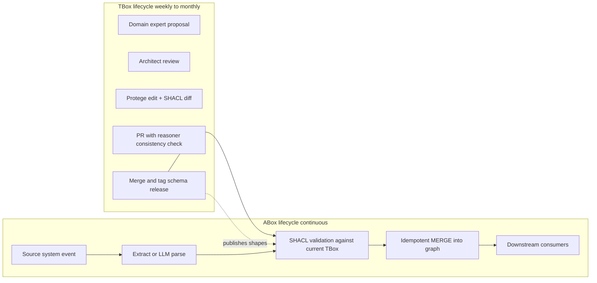
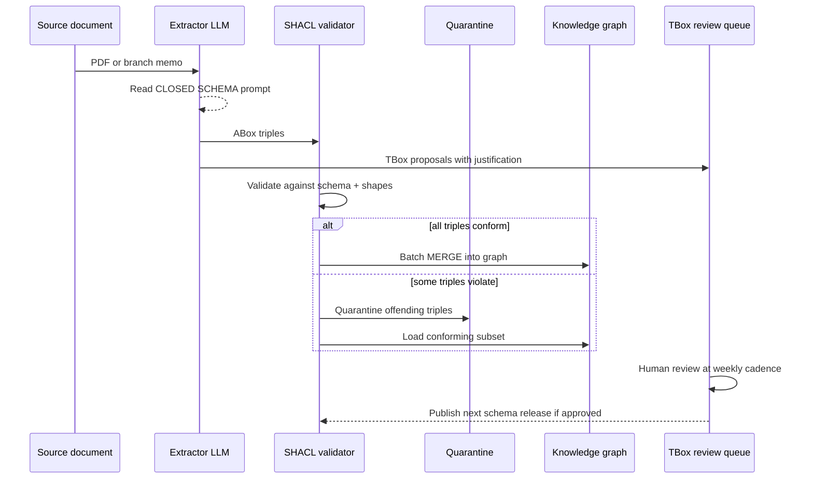

# TBox and ABox: Why the Schema/Facts Split Matters in Production Knowledge Graphs

A colleague on a neighbouring team asked me to help debug a broken build last November. The pipeline was straightforward: every night, a Composer DAG read client transactions from the lakehouse, extracted entities, merged them into the corporate knowledge base, and ran a SHACL validation pass before publishing the graph to downstream consumers. It had been green for seven months. Now it was red, and had been for three days, and nobody could point at what had changed.

The diff that broke it was a single pull request titled "update ontology and refresh products." Inside were 504,312 changed lines. Three of those lines introduced a new class called `InvestmentProduct` and declared a new property `riskTier` on it. The other 504,309 were rows of product and customer instances that had been exported from an upstream system and committed to the same file. Reviewing the PR had been, to be blunt, impossible. Two of the three new TBox lines were spelled wrong. One reused an IRI that already meant something else on the `Customer` class. The SHACL shapes had not been updated to match. The pipeline did exactly what we told it to: it loaded the broken schema, tried to validate half a million instances against it, and failed loudly for days.

That PR is the reason I am writing this post. The schema was five bytes of change buried inside a million bytes of data. The review was a rubber stamp because no human could read a million-line diff. The tools could not help because from their perspective *the ontology file and the data file were the same file*. We had collapsed two things that Description Logic has been telling us to keep separate for forty years: the TBox and the ABox. Everything that went wrong that week was downstream of that single conflation.

This post is about why the distinction matters, what it means operationally, and how to actually separate the two in a banking knowledge graph without inventing new problems.

## Where the Distinction Comes From

The terminology dates to the mid-1980s. Ronald Brachman and James Schmolze's overview of the KL-ONE knowledge representation system drew an explicit line between *terminological* knowledge, organised in a T-box, and *assertional* knowledge, organised in an A-box. KL-ONE was one of the first frame-based systems to make the separation architectural rather than merely conceptual: the reasoner that subsumed concept descriptions was a different algorithm from the reasoner that checked assertions about individuals, and the two sat in different modules with different update cadences.

The distinction survived the migration of the field into Description Logic in the 1990s. By the time Baader, Calvanese, McGuinness, Nardi, and Patel-Schneider published *The Description Logic Handbook* in 2003, with a second edition in 2007, TBox and ABox were canonical. The handbook names a third element, the RBox, which holds the axioms about *roles* (binary relations) rather than concepts: role hierarchies, inverse roles, functional roles, transitive closures. OWL 2 formalised all three in W3C specifications that are still the reference today. Read the section on semantics in the Direct Semantics specification and you will find the three-way split presented as a foundational partition of the axioms in an ontology.

The practical point for engineers in 2026 is simple: the three-way split is not an academic convenience. It corresponds to three things that have genuinely different lifetimes, owners, and tooling in any production knowledge graph.

- **TBox** tells you what *kinds* of things exist. Classes and the axioms that constrain them. In a bank: `Client`, `Account`, `CreditCard`, `MortgageLoan`, `Branch`, `Product`, `RegulatoryReport`, and the subsumption axioms that say `MortgageLoan` is a subclass of `LoanProduct`.
- **ABox** tells you *which specific things* exist and what they are. Individual assertions like `Client(c_8817)`, `hasAccount(c_8817, a_4412)`, `hasBalance(a_4412, 12_430.17)`.
- **RBox** tells you how the *relations themselves* behave. `hasAccount` is inverse to `accountOwnedBy`. `hasBranch` is functional (each account has one). `hasSubsidiary` is transitive.

In a tiny notation the split looks like this. A TBox axiom says concept $C$ is subsumed by concept $D$:

$$
C \sqsubseteq D
$$

An ABox assertion says an individual $a$ is an instance of concept $C$:

$$
C(a)
$$

And a role assertion says two individuals are related through role $R$:

$$
R(a, b)
$$

You do not need the full formal semantics to use the distinction. You need to recognise that a sentence of the first kind has a completely different natural owner, change cadence, and blast radius from a sentence of the second kind. That is the real payload.

## A Banking Example, Drawn End to End

Let me pick a small ontology that I can then use as the example for the rest of the post. It is loosely modelled on the corporate knowledge base my team at the bank maintains, stripped of anything specific.

Classes:

- `Client` — a natural or legal person who holds a relationship with the bank
- `RetailClient`, `CorporateClient` — subclasses of `Client`
- `Account` — a ledger of transactions
- `Product` — a financial offering
  - `SavingsAccountProduct`, `CreditCard`, `MortgageLoan`, `InvestmentFund` — subclasses
- `Branch` — a physical banking location
- `RegulatoryReport` — a report the bank submits to a supervisor

Object properties (relations):

- `hasAccount: Client >> Account`
- `basedOn: Account >> Product`
- `issuedBy: Account >> Branch`
- `governedBy: Product >> Regulation`
- `coversEntity: RegulatoryReport >> Client`

Data properties (attributes):

- `Client.taxId`, `Client.jurisdiction`
- `Account.accountNumber`, `Account.openedAt`, `Account.currency`
- `Product.sku`, `Product.baseFee`
- `RegulatoryReport.reportPeriod`

Everything above is TBox. There are zero clients, zero accounts, zero branches, zero reports in this description. No row of production data exists in it. This is the *shape* of the world.

Once we load actual data — individual clients, accounts, cards, transactions — we are in ABox territory. `Client(c_8817)`, `hasAccount(c_8817, a_4412)`, `basedOn(a_4412, p_SAVINGS_EUR_01)`: these are assertions about specific individuals, and they can change hundreds of times a second.

The role axioms — `hasAccount` is inverse to `accountOwnedBy`, `basedOn` is functional because an account is based on exactly one product — are RBox. In practice I lump RBox in with TBox because they share the same lifetime, owners, and review rhythm. The crucial split in an engineering team is between "what kinds of things and relations exist" and "which specific things are currently asserted to exist."

## Where the Split Lives Physically

The Description Logic literature treats TBox and ABox as mathematical sets. Your file system treats them as files. Your database treats them as tables and triples. The question is how to make the mathematical distinction visible in the artifacts your team actually edits.

Three common layouts, each of which I have used in production.

### Turtle files

The cleanest separation when the store is a triple store. Two files, two namespaces, two review flows.

```turtle
# schema.ttl — TBox + RBox only
@prefix :    <https://ont.example.bank/core#> .
@prefix owl: <http://www.w3.org/2002/07/owl#> .
@prefix rdfs: <http://www.w3.org/2000/01/rdf-schema#> .

:Client       a owl:Class .
:RetailClient a owl:Class ; rdfs:subClassOf :Client .
:Account      a owl:Class .
:Product      a owl:Class .
:MortgageLoan a owl:Class ; rdfs:subClassOf :Product .

:hasAccount   a owl:ObjectProperty ;
              rdfs:domain :Client ;
              rdfs:range  :Account ;
              owl:inverseOf :accountOwnedBy .

:basedOn      a owl:ObjectProperty , owl:FunctionalProperty ;
              rdfs:domain :Account ;
              rdfs:range  :Product .
```

```turtle
# data.ttl — ABox only
@prefix :   <https://ont.example.bank/core#> .
@prefix ex: <https://data.example.bank/> .

ex:c_8817  a :RetailClient ; :taxId "ES-12345678A" .
ex:a_4412  a :Account      ; :accountNumber "ES7621000418401234567891" .
ex:c_8817  :hasAccount ex:a_4412 .
ex:a_4412  :basedOn    ex:p_SAV_EUR_01 .
```

Two files, same namespace for the schema, different namespace for the data. A change to `schema.ttl` is a design change: reviewed by the ontology architects, tested against SHACL, released on a cadence measured in weeks. A change to `data.ttl` is a pipeline event: written by automated ingestion, validated continuously, alerted on failures.

### CSV or Parquet pairs

On lakehouse stacks the physical layout is usually tabular.

```
/ontology/
    classes.csv          # (class_iri, parent_iri, label, description)
    properties.csv       # (property_iri, domain_iri, range_iri, kind, functional, inverse_of)
/data/
    instances/
        clients.parquet  # (client_iri, class_iri, tax_id, jurisdiction, ...)
        accounts.parquet # (account_iri, class_iri, account_number, opened_at, ...)
    relationships/
        has_account.parquet     # (client_iri, account_iri, since)
        based_on.parquet        # (account_iri, product_iri)
```

`classes.csv` and `properties.csv` are the TBox+RBox. They live under `/ontology/`, are tiny (a few hundred rows in even a mature bank), change rarely, and are reviewed by humans. The Parquet files under `/data/` are the ABox, are large (hundreds of millions of rows), change continuously, and are written by pipelines.

The separation by directory is not cosmetic. It is what lets your CI run different checks on each side. A PR that touches `/ontology/` runs ontology-level lints, reasoner consistency checks, and a SHACL shape refresh. A PR that touches `/data/` is almost always a pipeline artifact and does not run through code review at all — it runs through data-quality gates.

### Neo4j

In property graphs the line is drawn with labels, constraints, and indexes on one side and nodes/edges on the other.

```cypher
// schema.cypher — TBox-equivalent
// Classes become labels plus uniqueness constraints on id properties.
CREATE CONSTRAINT client_id IF NOT EXISTS
    FOR (c:Client) REQUIRE c.id IS UNIQUE;
CREATE CONSTRAINT account_id IF NOT EXISTS
    FOR (a:Account) REQUIRE a.id IS UNIQUE;
CREATE CONSTRAINT product_id IF NOT EXISTS
    FOR (p:Product) REQUIRE p.id IS UNIQUE;

// Indexes for the high-read paths.
CREATE INDEX client_tax_id IF NOT EXISTS FOR (c:Client) ON (c.taxId);
CREATE INDEX account_number IF NOT EXISTS FOR (a:Account) ON (a.accountNumber);

// Existence constraints (Enterprise edition) encode mandatory attributes.
CREATE CONSTRAINT account_opened_at IF NOT EXISTS
    FOR (a:Account) REQUIRE a.openedAt IS NOT NULL;
```

```cypher
// load_batch.cypher — ABox load, parameterised, idempotent
UNWIND $rows AS row
MERGE (c:Client {id: row.client_id})
  SET c:RetailClient,
      c.taxId = row.tax_id,
      c.jurisdiction = row.jurisdiction
MERGE (a:Account {id: row.account_id})
  SET a.accountNumber = row.account_number,
      a.openedAt      = datetime(row.opened_at),
      a.currency      = row.currency
MERGE (c)-[:HAS_ACCOUNT]->(a);
```

`schema.cypher` is run once per deployment and only if the schema file has changed. `load_batch.cypher` runs on every DAG tick with a new batch of rows. The two are in different repos in my current workplace; they could be in the same repo in different directories. What they cannot be is in the same commit, because the review question for each is completely different.

Whatever layout you pick, the principle is the same: the TBox and the ABox must be separable by a file path or a table name, because that is what lets your CI, your review process, and your alerting systems treat them differently.

## The Operational Split

Once the files are separated, the operational separation falls out naturally.

| Dimension | TBox + RBox | ABox |
|---|---|---|
| What it asserts | Kinds of things and their relations | Specific things and their links |
| Who owns it | Data architects, domain experts | Pipelines, upstream systems |
| Change cadence | Weekly or monthly | Continuous (streaming or daily) |
| Review flow | PR with human reviewers, SHACL diff | Automated data-quality gates |
| Validation | Reasoner consistency, SHACL shape compile | SHACL shape validation, referential checks |
| Rollback | Revert the PR | Reprocess the batch |
| Storage | Small, versioned, in git | Large, versioned in lakehouse or graph |
| Tooling | Protégé, VS Code with RDF plugins, owlready2 | Airflow or Composer, Dataflow, Neo4j loaders |
| Typical file size | Kilobytes to megabytes | Gigabytes to terabytes |
| Blast radius of a bad change | Everything that reads the graph | The rows touched by that batch |

The table reads like bureaucracy, which is exactly what it is — but in the helpful sense. Each row is a decision you can make once, up front, rather than relitigate in every postmortem.

Two rows deserve a closer look.

**Change cadence.** In the bank we batch TBox changes into a fortnightly release. The ontology architects meet, triage pending proposals, approve some, defer others, and cut a release that goes through the full SHACL compile, reasoner consistency, and downstream integration tests. ABox changes happen every fifteen minutes because that is our streaming tick. The two rhythms are so different that sharing a change process between them would grind both to a halt. You would either review every data batch (impossible) or let schema changes through without review (catastrophic). Separating the cadences is what lets each one run at its natural speed.

**Blast radius.** When an ABox change is wrong — say we loaded a batch with the wrong currency code — the fix is to reprocess that batch. The damage is contained to the rows we loaded. When a TBox change is wrong, every consumer of the graph is affected, because they all started answering questions under the new schema's axioms. A bad TBox change is an incident; a bad ABox batch is a ticket. Your governance has to reflect the asymmetry, because the hair-trigger PR review that protects the TBox would kill ABox throughput, and the automated acceptance that moves ABox through the pipeline would let schema disasters ship.

## The Lifecycle Picture

It helps to see the two lifecycles side by side. The TBox moves through a deliberate, human-in-the-loop pipeline. The ABox moves through a continuous, automated one. Both end at the graph. The diagram is the thing that drives home why the two lifecycles must not share tooling or review cadence.



The arrow from `A5` into `B3` is the only point of contact between the two lifecycles. The TBox does not flow through the ABox pipeline; it *gates* it, by publishing the SHACL shapes that the ABox validator reads. Everything else in the two lifecycles is independent, and that independence is the design.

## SHACL as the Seam

If the TBox and ABox are separate physical artifacts, something has to enforce that they fit together when they meet. In RDF land that thing is SHACL. In Neo4j land it is a mixture of database constraints and application-level validators. Either way, the seam is where your TBox's promises become checks against your ABox's assertions.

A small SHACL example, derived from the banking ontology above, will make this concrete.

```turtle
# shapes.ttl — published alongside each TBox release
@prefix :    <https://ont.example.bank/core#> .
@prefix sh:  <http://www.w3.org/ns/shacl#> .
@prefix xsd: <http://www.w3.org/2001/XMLSchema#> .

:ClientShape a sh:NodeShape ;
    sh:targetClass :Client ;
    sh:property [ sh:path     :taxId ;
                  sh:datatype xsd:string ;
                  sh:minCount 1 ;
                  sh:maxCount 1 ;
                  sh:message  "Client must have exactly one taxId." ] ;
    sh:property [ sh:path     :hasAccount ;
                  sh:class    :Account ;
                  sh:minCount 0 ;
                  sh:message  "hasAccount must point at an Account." ] .

:AccountShape a sh:NodeShape ;
    sh:targetClass :Account ;
    sh:property [ sh:path     :currency ;
                  sh:pattern  "^[A-Z]{3}$" ;
                  sh:minCount 1 ;
                  sh:message  "currency must be a 3-letter ISO code." ] ;
    sh:property [ sh:path     :basedOn ;
                  sh:class    :Product ;
                  sh:minCount 1 ;
                  sh:maxCount 1 ;
                  sh:message  "Every Account must be basedOn exactly one Product." ] .
```

Two things to notice.

First, every shape is derived from a TBox axiom. `ClientShape` exists because `Client` is a class in the TBox. `currency must be 3-letter ISO` is a data-property constraint that belongs on the TBox side, not in the ABox pipeline code. The shapes file is published atomically with each schema release, and the ABox pipeline reads whichever version of the shapes corresponds to the current TBox.

Second, SHACL does exactly nothing unless you run the validator. Here is the minimal Python wiring, using `pyshacl`. It is shorter than the description of it.

```python
# validate_batch.py
from pyshacl import validate
from rdflib import Graph

# TBox + shapes come from the schema release bucket.
schema = Graph().parse("gs://bank-ontology/releases/2027-06-01/schema.ttl", format="turtle")
shapes = Graph().parse("gs://bank-ontology/releases/2027-06-01/shapes.ttl", format="turtle")

# ABox is the batch we just extracted.
data = Graph().parse("s3://bank-batches/2027-06-10/12-45/batch.ttl", format="turtle")

conforms, report_graph, report_text = validate(
    data_graph   = data,
    shacl_graph  = shapes,
    ont_graph    = schema,
    inference    = "rdfs",
    abort_on_first = False,
)

if not conforms:
    # Route the offending triples to a quarantine graph and alert.
    raise BatchValidationError(report_text)
```

This is the shape of every well-run ABox pipeline I have touched. The schema and shapes are pinned at the release version. The data is current. The validator holds the line. When a batch fails, the bad rows are quarantined rather than rejected, because a ten-million-row batch rejected for a hundred bad rows has cost you the other 9.9 million by mistake. Quarantine is the humane failure mode.

In Neo4j the equivalent is a mixture. Uniqueness and existence constraints at the database level catch the crudest violations. Application-level validators derived from the ontology catch the rest. The principle is the same: something derived from the TBox must run against every ABox change before it lands.

## The LLM Extraction Pipeline

My day job involves a lot of LLM extraction — pulling structured entities out of regulatory PDFs, branch memos, product fact sheets. The TBox/ABox distinction turns out to be the single most important concept to encode into the extraction prompt. If you do not tell the model that the classes are fixed, it will invent new ones whenever a document says something the existing schema cannot quite capture. Then the SHACL validator either rejects the output (best case) or silently ignores the made-up class (worst case), and your graph is quietly wrong.

The fix is to separate the two jobs explicitly in the prompt.

```python
# extract_prompt.py

SYSTEM_PROMPT = """You are an extraction agent for a banking knowledge graph.

There are two kinds of output you can produce: ABox assertions and TBox
proposals. You will produce only ABox assertions unless I explicitly ask
for TBox proposals.

ABox assertions populate the knowledge graph with specific instances.
You must only use the classes and properties listed in the CLOSED SCHEMA
below. If a fact does not fit the CLOSED SCHEMA, drop the fact rather
than inventing a class.

TBox proposals are requests to the ontology team to add a new class,
property, or axiom. They are reviewed by humans before taking effect.
You MUST NOT emit a TBox proposal unless the document clearly describes
a kind of entity that has no match in the CLOSED SCHEMA, and you must
flag your uncertainty. In doubt, prefer dropping the fact.

CLOSED SCHEMA:
Classes: Client, RetailClient, CorporateClient, Account,
         SavingsAccountProduct, CreditCard, MortgageLoan, InvestmentFund,
         Branch, RegulatoryReport
Object properties: hasAccount (Client -> Account),
                   basedOn    (Account -> Product),
                   issuedBy   (Account -> Branch),
                   governedBy (Product -> Regulation),
                   coversEntity (RegulatoryReport -> Client)
Data properties: taxId, accountNumber, openedAt, currency, sku, baseFee,
                 reportPeriod

OUTPUT FORMAT:
{
  "abox": [
    {"subject": "...", "predicate": "...", "object": "..."},
    ...
  ],
  "tbox_proposals": [
    {"kind": "class | property", "name": "...", "justification": "..."},
    ...
  ]
}

If tbox_proposals is non-empty, explain why each existing class in the
CLOSED SCHEMA was insufficient.
"""
```

Three design choices are worth naming.

**The schema is explicitly closed.** The word *CLOSED* is there because LLMs read prompts for affordances; an *open* schema is a license to invent, and they will take it. The equivalent trick in structured-output mode is to constrain the output to a JSON schema whose `class` field is an `enum` of the existing classes. Invention becomes impossible rather than merely discouraged.

**ABox and TBox outputs live in different keys.** Downstream code reads `abox` and writes into the graph. It reads `tbox_proposals` and files a ticket. The two paths can never collide, because they are never in the same data structure even when the model wants them to be.

**TBox proposals require justification.** This is the agent equivalent of a PR description. The ontology team reviews `tbox_proposals` at the same weekly cadence as human-submitted proposals. Most of them are rejected — the model is reaching for a new class when an existing one would do — but the occasional real gap in the schema is caught this way. Without the explicit channel, the model would either invent silently or drop silently, and you would never know.

The extract-validate-load pipeline looks like this end to end.



The single arrow that would break everything if it moved is the one from `V` to `G`. If the pipeline ever writes to the graph without going through `V`, the schema contract is dead. Every production incident I have seen on an LLM-fed graph traces back to that arrow being optional.

## Governance in Practice

Governance is where the distinction stops being a mathematical convenience and starts being a people-and-process story. What a governance document looks like inside the bank, stripped to essentials.

**TBox change request template.**

```
Title: [TBox] Add class InvestmentProduct and property riskTier
Type: TBox
Affected classes: InvestmentProduct (new), Product (parent)
Affected properties: riskTier (new)
Backward compatibility: Additive. No existing class is modified.
Reasoner consistency: Passed under HermiT.
SHACL diff: 2 new shapes, 0 modified.
Downstream impact: 3 consumers. None currently filter on InvestmentProduct.
Rollout: Next fortnightly schema release.
Reviewers: @ontology-architects @domain-lead-investment
```

Every field is forced. Every field has a downstream consumer. `Backward compatibility` drives whether this is a major or minor schema release. `Downstream impact` determines who gets notified. `SHACL diff` is machine-computed from the shape compiler and attached automatically. A PR that leaves these fields blank is a PR that does not get merged.

**ABox governance is different.** There is no per-row PR. There is a per-pipeline SLA: "the customer-accounts feed must produce a batch every fifteen minutes with less than 0.1% of rows quarantined." The SLA is the governance artifact. When it breaks, the on-call engineer investigates. When the quarantine rate creeps up, a dashboard catches it. When a batch is completely unusable, the ingestion is halted and the upstream owner is paged. At no point does a human review an individual row.

**Rollback stories diverge too.** Rolling back a TBox change means reverting the PR, cutting a new release, and telling consumers that the previous axioms are back in force. Some consumers will have written code against the new axioms; they need warning, and sometimes they need code changes. It is real work. Rolling back an ABox batch means re-running the pipeline with the offending rows excluded, or re-extracting from the source if the source was wrong. No consumer has to change anything, because the schema did not change. That asymmetry is why the governance cadences are different, and it is the strongest argument I know for keeping the files physically separate.

## Symptoms and Root Causes

Once you internalise the distinction, you start seeing it in postmortems. A table I keep in my notebook, made of production incidents from the last two years. The symptom is what got reported. The root cause is always one of two things.

| Symptom in production | Root cause | Lives in |
|---|---|---|
| New rows silently ignored by a consumer | Consumer filters on a class that was renamed | TBox drift |
| SHACL validator rejects 40% of a batch | Upstream changed a currency encoding | ABox drift |
| Reasoner goes inconsistent | Two new classes declared disjoint but an ABox row belongs to both | TBox / ABox mismatch |
| `basedOn` now points at the wrong product | Product IRI reused after a sku renumber | ABox integrity |
| Queries slow down 10x overnight | New subclass introduced without adding an index | TBox change, ABox-side omission |
| Regulatory report missing clients | `coversEntity` cardinality constraint loosened | TBox change hit production |
| LLM extractor invents new class `VIPClient` | Prompt does not close the schema | TBox contamination by ABox |
| Duplicate `Account` nodes | Ingestion uses non-unique key | ABox integrity |

Most of these are avoidable if the team has the split in their heads. The one that is not avoidable — the reasoner-inconsistency case — is the reason you run a reasoner consistency check on every TBox change regardless of how obviously safe it looks. TBox inconsistency is silent and recursive: once it is there, every ABox inference downstream may be wrong.

## Prerequisites

Before you can make the TBox/ABox split operational:

- **A named source of truth for the TBox.** A file, a repository, a person. Not "it's in a few places." One file under version control with a clear owner.
- **A schema release process.** Fortnightly, monthly, whatever fits your change rate. It must produce a versioned, immutable artifact that downstream systems can pin to.
- **SHACL shapes compiled from the TBox.** If your TBox says a property is functional, the corresponding shape has `sh:maxCount 1`. The relationship is mechanical and can be generated.
- **A SHACL validator in the ABox pipeline.** Not optional. Not occasional. Every batch.
- **A quarantine pattern.** Rejected rows go somewhere retrievable. Silent drops are how you end up with half a graph and no one noticing.
- **An LLM prompt that closes the schema.** If you are extracting with an LLM, the prompt must treat the schema as closed. Structured output with enum-typed class fields is the production form.
- **A TBox proposal queue.** For humans and for agents. Both channels feed the same review meeting.

## Gotchas

Traps I have fallen into or watched others fall into.

- **Snapshotting the TBox inside the ABox store.** Storing the schema triples in the same Neo4j database as the data triples is seductive because the reasoner can then run natively. It is also how you end up with a data migration that accidentally drops schema axioms. Keep them in separate graphs even if the database lets you mix.
- **Letting the LLM propose TBox edits by default.** A prompt that says "invent new classes if needed" is an open door. Even frontier models walk through it. Close the door.
- **Confusing SHACL shapes with OWL axioms.** OWL is open-world: a missing `hasAccount` does not mean the client has no accounts, it means you do not know. SHACL is closed-world: a missing `hasAccount` is a constraint violation if the shape requires it. You need both, for different jobs. OWL is how you reason about the domain. SHACL is how you validate what arrived.
- **Forgetting the RBox.** Role hierarchies and inverse properties are often skipped on a first pass and added under pressure later. Once there is data that assumes the old, unrestricted role behaviour, adding `FunctionalProperty` to it is a breaking change. Declare the RBox axioms early, when the graph is still small.
- **Treating the ABox as "just data" and skipping tests.** The ABox needs referential-integrity tests, freshness tests, completeness tests. The same rigour a data-engineering team applies to a fact table applies here. The graph model does not exempt you.
- **SHACL without a validator in CI.** I have seen teams author beautiful shapes files that no build step ever runs. Shapes without validation are documentation, and documentation drifts.

## Testing

The tests that catch TBox/ABox problems before they reach production.

**TBox tests:**

- *Reasoner consistency* on every schema change. An inconsistent TBox can give any answer to any query; catching it pre-merge is non-negotiable.
- *Subsumption regression*: golden list of `(class, expected superclasses)` pairs, asserted after each change. Catches accidental hierarchy breaks.
- *SHACL compile*: the shapes file must parse and the targets must match existing classes. Catches typos before they hit production.
- *Naming lint*: IRIs follow the naming convention. The review meeting is too slow to catch `:MortageLoan`.

**ABox tests:**

- *Batch-level SHACL validation* with metrics on quarantine rate. Spike alerts.
- *Uniqueness*: no two nodes share an `id` for the same class.
- *Referential integrity*: every `basedOn` points at an extant `Product`. Catches orphans.
- *Cardinality*: for every `FunctionalProperty` in the RBox, no subject has two values. Catches duplicate loads.
- *Freshness*: no class is missing from the latest batch if it was present yesterday. Catches upstream outages masquerading as normal.

**Contract tests between the two:**

- The current ABox must validate against the current TBox + shapes, not against the previous version. A TBox release that would quarantine existing data is a migration, and migrations are planned, not accidental.
- Every `class_iri` mentioned in ABox rows is present in the TBox release bundled with that ABox batch. Catches version drift.

## Where This Fits in the Ontology Series

This post is the foundation under two pieces I have written elsewhere on the blog. [*From Ontology to Agent Toolbox*](/blog/ontology-to-agent-toolbox) assumes, implicitly, that you have a clean TBox: the tools it generates are one per class, and the allow-lists it derives come from `onto.classes()` and `onto.object_properties()`. If your "ontology" is a tangle of schema triples and instance triples, you cannot generate those tools mechanically, because `onto.classes()` will include every random instance that got labelled as a class by mistake. The TBox/ABox split is what makes the toolbox generation safe.

[*Ontology-Grounded RAG: Chunks in Nodes, Not Nodes in Chunks*](/blog/ontology-grounded-rag-chunks-in-nodes) goes the other way. It assumes the ABox is where your text chunks live, attached to TBox-typed nodes, and that the SHACL layer is what keeps chunks from attaching to nonexistent types. The whole argument of that post — that structure matters less than the fact that chunks are anchored to schema-validated nodes — collapses if your nodes' types are not actually schema-validated.

You can read the three posts in any order, but if you find one of them unconvincing, the missing concept is usually the one in this post.

## Going Deeper

**Books:**

- Baader, F., Calvanese, D., McGuinness, D. L., Nardi, D., & Patel-Schneider, P. F. (Eds.). (2007). *The Description Logic Handbook: Theory, Implementation, and Applications* (2nd ed.). Cambridge University Press.
  - The canonical reference. Part I covers the theory that underpins the TBox/ABox/RBox split; Part II covers reasoning; Part III the applications. You do not need to read linearly; Chapter 2 and Chapter 4 cover what this post assumes.
- Allemang, D., Hendler, J., & Gandon, F. (2020). *Semantic Web for the Working Ontologist* (3rd ed.). ACM Books.
  - The most practical book on modelling with RDF, RDFS, and OWL. The chapters on OWL show the TBox/ABox distinction in concrete syntactic form and are the best bridge from theory to Turtle.
- Hogan, A., Blomqvist, E., Cochez, M., et al. (2021). *Knowledge Graphs*. Morgan & Claypool (also on arXiv as 2003.02320).
  - A survey-shaped book that grounds the vocabulary this post uses: graphs, ontologies, shapes, and the interplay with machine learning.
- Barrasa, J., & Webber, J. (2023). *Building Knowledge Graphs*. O'Reilly.
  - Practical Neo4j-oriented treatment of the split, including how to bridge from RDF-style ontologies into property graphs without losing the distinction.

**Online Resources:**

- [OWL 2 Web Ontology Language: Direct Semantics (Second Edition)](https://www.w3.org/TR/owl2-direct-semantics/) — The W3C specification that formally defines the three-way split in terms of the description logic SROIQ.
- [OWL 2 Web Ontology Language: Structural Specification and Functional-Style Syntax (Second Edition)](https://www.w3.org/TR/owl2-syntax/) — The concrete syntax for TBox, ABox, and RBox axioms.
- [SHACL: W3C Shapes Constraint Language](https://www.w3.org/TR/shacl/) — The spec for the validator that sits at the seam.
- [FIBO: Financial Industry Business Ontology](https://spec.edmcouncil.org/fibo/) — A real, large-scale example of a TBox in the banking domain. The `Ontology` directories and the `Data` examples are separated exactly as this post recommends.
- [Owlready2 documentation](https://owlready2.readthedocs.io/en/latest/) — The Python library this post's code examples assume. The chapters on classes, individuals, and properties map one-to-one to TBox, ABox, and RBox.
- [pySHACL](https://github.com/RDFLib/pySHACL) — The reference Python validator used in the batch-validation example.

**Videos:**

- [GraphRAG: The Marriage of Knowledge Graphs and RAG](https://www.youtube.com/watch?v=knDDGYHnnSI) by Emil Eifrem (Neo4j) — The first twenty minutes introduce the schema-versus-data distinction in the property-graph setting, and why the line matters when you layer retrieval on top.
- [Ontologies in Neo4j: Semantics and Knowledge Graphs](https://neo4j.com/videos/ontologies-in-neo4j-semantics-and-knowledge-graphs-jesus-barrasa/) by Jesús Barrasa (Neo4j) — A working demonstration of how to carry an RDF-style TBox into Neo4j via the neosemantics plugin while keeping the schema and the instance data distinct.
- [Going Meta S02E01: Using Ontologies to Guide Knowledge Graph Creation from Unstructured Data](https://neo4j.com/videos/going-meta-s02-ep-01-continuing-the-journey-in-ai-and-knowledge-graph/) by Jesús Barrasa and Alexander Erdl — The live-coding episode most relevant to the LLM extraction section of this post.

**Academic Papers:**

- Brachman, R. J., & Schmolze, J. G. (1985). ["An Overview of the KL-ONE Knowledge Representation System."](https://doi.org/10.1207/s15516709cog0902_1) *Cognitive Science*, 9(2), 171–216.
  - The paper where the T-box/A-box vocabulary enters the literature. Worth reading for the framing even if the specific system is of historical interest only.
- Patel-Schneider, P. F., & Horrocks, I. (2007). ["A Comparison of Two Modelling Paradigms in the Semantic Web."](https://doi.org/10.1016/j.websem.2006.10.005) *Journal of Web Semantics*, 5(4), 240–250.
  - Directly addresses the split between terminological and assertional knowledge as it lands in OWL, and the consequences for reasoning and validation.
- Hogan, A., Blomqvist, E., Cochez, M., et al. (2020). ["Knowledge Graphs."](https://arxiv.org/abs/2003.02320) arXiv:2003.02320.
  - Survey article covering the same material as the book above, with more recent treatment of the interaction between ontologies and learned embeddings.

**Questions to Explore:**

- If your ontology has a thousand classes and your graph has ten billion triples, is there still a single TBox, or does the TBox fragment into domain-specific modules with their own release cadences? What coordination problem does that create?
- The TBox/ABox split is sharp in Description Logic. Property graphs blur it by letting nodes carry arbitrary labels and properties. Is the blur a feature (flexibility) or a bug (undermines governance)? Which use cases is each answer correct for?
- If an LLM-extraction agent proposes a new class every day, at what point does it become cheaper to let the agent propose *and* an architect approve on the fly, versus batching into fortnightly ontology releases? What would the safety mechanisms need to look like?
- SHACL is closed-world; OWL is open-world. Your ABox pipeline needs both. Where in the pipeline does each one live, and what failure mode do you create if you use the wrong one in the wrong place?
- For a regulator-facing report, which parts of the answer are TBox-level (classifications, typologies) and which are ABox-level (specific counts, specific customers)? Does the separation of the two suggest a different pipeline for regulatory reporting than for internal analytics?
