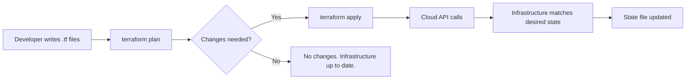
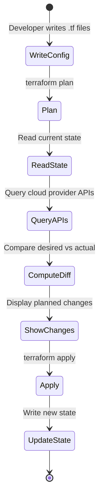
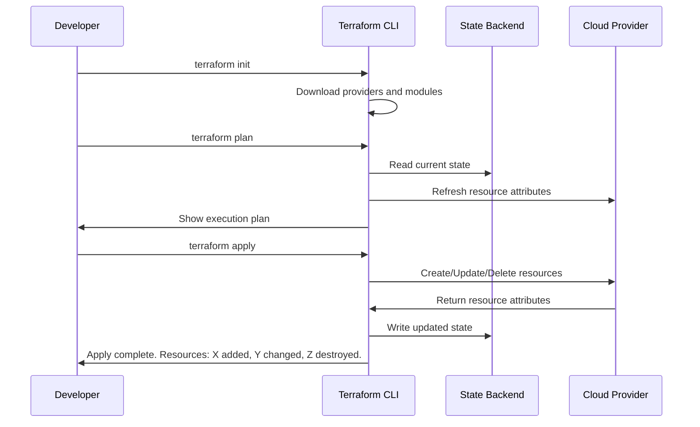
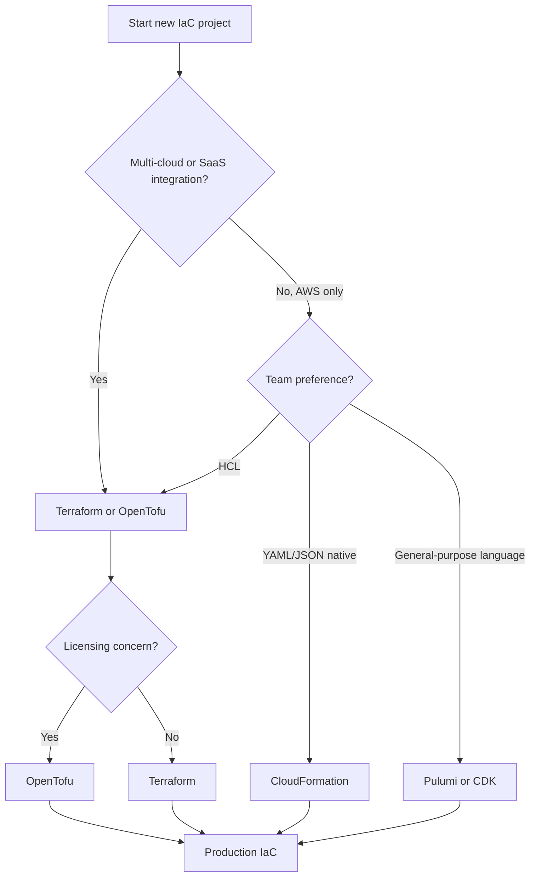

# Terraform: Infrastructure as Code from Zero to Production

There is a moment in every engineer's career when the cloud console becomes the enemy. You have three environments. Each was set up by hand — one by you, one by a colleague who left six months ago, one by someone during an incident at midnight. They are supposed to be identical. They are not. Staging has a security group rule that production doesn't. Production has an IAM role that nobody remembers creating. Dev is running an instance type that was deprecated last quarter.

You open a spreadsheet to track the differences. You write a wiki page documenting the "correct" setup. Within a week, both are outdated.

This is the problem that Infrastructure as Code solves. Not by giving you better documentation — by eliminating the need for it. When your infrastructure *is* code, the code *is* the documentation. It lives in version control, goes through pull requests, runs in CI/CD, and can be reproduced on demand. The gap between what you think your infrastructure looks like and what it actually looks like shrinks to zero.

Terraform, created by HashiCorp in 2014, has become the dominant tool for this job. As of early 2026, Terraform is at version 1.14.x, with nearly 4,000 providers in the registry and close to 20,000 community modules. It works across every major cloud provider — AWS, GCP, Azure, and dozens of others — using a single language and a single workflow. Whether you are provisioning a single S3 bucket or orchestrating a multi-region Kubernetes platform, the mental model is the same: declare what you want, and Terraform figures out how to get there.

This post covers Terraform comprehensively — from the first `terraform init` to production patterns that teams use at scale. We will go deep on the parts that matter and be honest about the parts that hurt.

---

## Prerequisites

Before we start writing infrastructure, you need two things installed and configured.

**Terraform CLI.** Download from [developer.hashicorp.com/terraform/downloads](https://developer.hashicorp.com/terraform/downloads) or use a package manager:

```bash
# macOS
brew tap hashicorp/tap
brew install hashicorp/tap/terraform

# Ubuntu/Debian
wget -O- https://apt.releases.hashicorp.com/gpg | sudo gpg --dearmor -o /usr/share/keyrings/hashicorp-archive-keyring.gpg
echo "deb [signed-by=/usr/share/keyrings/hashicorp-archive-keyring.gpg] https://apt.releases.hashicorp.com $(lsb_release -cs) main" | sudo tee /etc/apt/sources.list.d/hashicorp.list
sudo apt update && sudo apt install terraform

# Verify
terraform version
# Terraform v1.14.8
```

**Cloud provider credentials.** For AWS, configure the CLI with `aws configure` or export environment variables. For GCP, use `gcloud auth application-default login`. Terraform reads these credentials automatically through the provider's authentication chain — you never hardcode secrets in your `.tf` files.

---

## What Is Infrastructure as Code — and Why Terraform

Infrastructure as Code (IaC) is the practice of managing infrastructure — servers, networks, databases, DNS records, IAM policies — through machine-readable definition files instead of manual processes. The idea is simple: if your application code is version-controlled, tested, and deployed through automated pipelines, your infrastructure should be too.

There are two fundamental approaches to IaC:

**Imperative** tools describe *how* to reach the desired state. You write step-by-step instructions: "create this VPC, then create this subnet in that VPC, then attach this internet gateway." If you run the script twice, you might get two VPCs. Bash scripts and AWS CLI commands are imperative. So is Ansible, to a degree.

**Declarative** tools describe *what* the desired state should be. You say: "there should be a VPC with this CIDR block, a subnet in that VPC, and an internet gateway attached to it." The tool figures out the steps. If the VPC already exists, it does nothing. If the subnet is missing, it creates only the subnet. Terraform is declarative.

The declarative approach is why Terraform works at scale. You don't have to reason about ordering, conditionals, or idempotency — Terraform handles all three. You describe the end state, and Terraform builds a dependency graph, determines the correct order of operations, and applies only the changes needed to reach that state.



### Why Terraform Over Alternatives

Terraform is not the only IaC tool. CloudFormation is AWS-native. Deployment Manager is GCP-native. Pulumi lets you write infrastructure in general-purpose languages. ARM/Bicep templates cover Azure. Each has legitimate use cases.

Terraform's advantage is generality. A single Terraform configuration can provision an AWS VPC, a GCP Cloud SQL instance, a Cloudflare DNS record, and a Datadog monitoring dashboard. The same language, the same workflow, the same state management. For teams working across multiple clouds or using SaaS services alongside cloud infrastructure, this is a significant simplification.

| Feature | Terraform | CloudFormation | Pulumi |
|---|---|---|---|
| Cloud support | Multi-cloud | AWS only | Multi-cloud |
| Language | HCL | JSON/YAML | Python, TS, Go, etc. |
| State | Self-managed or remote | AWS-managed | Managed or self-hosted |
| Ecosystem | ~4,000 providers | AWS services | Growing |
| Learning curve | Moderate | Low (if AWS-only) | Low (if you know the language) |
| License | BSL 1.1 | Proprietary | Apache 2.0 |

One thing to address directly: HashiCorp changed Terraform's license from MPL 2.0 to the Business Source License (BSL 1.1) in August 2023. This led to the creation of **OpenTofu**, a community fork maintained under the Linux Foundation that remains open source. As of early 2026, OpenTofu is at version 1.9.x and has diverged meaningfully — it supports native state encryption and early variable evaluation in backends, features Terraform does not have. Terraform, meanwhile, has invested in Terraform Stacks and deeper HCP Terraform integration. Both tools share the same HCL syntax and core workflow. Everything in this post applies to both unless noted otherwise.

---

## HCL: The Language of Infrastructure

HashiCorp Configuration Language (HCL) is a domain-specific language designed specifically for infrastructure configuration. It is not a general-purpose programming language — you cannot write arbitrary loops, define classes, or call HTTP APIs from HCL. This is intentional. The constraints keep configurations readable and predictable, which matters enormously when your infrastructure definitions are reviewed by teammates who may not be software engineers.

### Blocks, Arguments, and Expressions

HCL has three fundamental constructs:

```hcl
# A block has a type, zero or more labels, and a body
resource "aws_instance" "web_server" {
  # Arguments assign values to names
  ami           = "ami-0c55b159cbfafe1f0"
  instance_type = "t3.micro"

  # Expressions compute values
  tags = {
    Name        = "web-${var.environment}"
    Environment = var.environment
    ManagedBy   = "terraform"
  }
}
```

The block type (`resource`) tells Terraform what kind of thing you are declaring. The labels (`"aws_instance"` and `"web_server"`) identify the resource type and give it a local name. The body contains arguments — key-value pairs where the value can be a literal, a variable reference, a function call, or a more complex expression.

### Types and Values

HCL supports the types you would expect: strings, numbers, booleans, lists, and maps. It also has some types specific to infrastructure work:

```hcl
# Strings — with interpolation
name = "app-${var.environment}-${var.region}"

# Numbers
port = 8080

# Booleans
enable_monitoring = true

# Lists
availability_zones = ["us-east-1a", "us-east-1b", "us-east-1c"]

# Maps
instance_tags = {
  team    = "platform"
  service = "api"
  tier    = "backend"
}

# Objects — typed maps with a specific structure
variable "database_config" {
  type = object({
    engine         = string
    instance_class = string
    allocated_storage = number
    multi_az       = bool
  })
}
```

### Built-in Functions

HCL provides a rich set of built-in functions. You cannot define your own, but the standard library covers most needs:

```hcl
# String manipulation
upper_name = upper(var.project_name)            # "MYPROJECT"
subnet_id  = element(var.subnet_ids, count.index) # Pick from a list

# Collection operations
merged_tags  = merge(var.default_tags, var.extra_tags)
unique_zones = toset(var.availability_zones)

# Encoding
user_data = base64encode(file("${path.module}/scripts/init.sh"))

# Conditionals — ternary expressions
instance_type = var.environment == "production" ? "m5.xlarge" : "t3.micro"

# Filesystem
config_content = templatefile("${path.module}/templates/config.tpl", {
  db_host = aws_db_instance.main.endpoint
  db_port = 5432
})
```

The `templatefile` function is particularly useful — it reads a file and renders it as a template, substituting variables. This is how you generate user data scripts, configuration files, and policy documents without embedding long strings in your HCL.

### Dynamic Blocks

When a resource requires a variable number of nested blocks — such as multiple ingress rules in a security group — dynamic blocks generate them from a collection:

```hcl
variable "ingress_rules" {
  type = list(object({
    port        = number
    protocol    = string
    cidr_blocks = list(string)
    description = string
  }))
  default = [
    { port = 80,  protocol = "tcp", cidr_blocks = ["0.0.0.0/0"], description = "HTTP" },
    { port = 443, protocol = "tcp", cidr_blocks = ["0.0.0.0/0"], description = "HTTPS" },
    { port = 22,  protocol = "tcp", cidr_blocks = ["10.0.0.0/8"], description = "SSH internal" },
  ]
}

resource "aws_security_group" "web" {
  name        = "${local.name_prefix}-web-sg"
  description = "Security group for web servers"
  vpc_id      = aws_vpc.main.id

  dynamic "ingress" {
    for_each = var.ingress_rules
    content {
      from_port   = ingress.value.port
      to_port     = ingress.value.port
      protocol    = ingress.value.protocol
      cidr_blocks = ingress.value.cidr_blocks
      description = ingress.value.description
    }
  }

  egress {
    from_port   = 0
    to_port     = 0
    protocol    = "-1"
    cidr_blocks = ["0.0.0.0/0"]
  }
}
```

Dynamic blocks are powerful but should be used sparingly. They make configurations harder to read — if you find yourself nesting dynamic blocks or using complex `for` expressions inside them, consider whether a simpler design (multiple resources, a module) would be clearer.

---

## Providers: Connecting to the Cloud

A provider is a plugin that teaches Terraform how to talk to a specific API. The AWS provider knows how to create EC2 instances, S3 buckets, and RDS databases. The Google provider knows about Compute Engine, Cloud Storage, and Cloud SQL. The Kubernetes provider manages pods, services, and deployments.

You declare providers in a `required_providers` block and configure them:

```hcl
terraform {
  required_version = ">= 1.5.0"

  required_providers {
    aws = {
      source  = "hashicorp/aws"
      version = "~> 5.0"
    }
    google = {
      source  = "hashicorp/google"
      version = "~> 5.0"
    }
  }
}

# Provider configuration
provider "aws" {
  region = var.aws_region

  default_tags {
    tags = {
      Project   = var.project_name
      ManagedBy = "terraform"
    }
  }
}

provider "google" {
  project = var.gcp_project_id
  region  = var.gcp_region
}
```

The version constraint `~> 5.0` means "any version >= 5.0.0 and < 6.0.0." This is the pessimistic constraint operator, and it is the right default for most providers — it allows patch and minor updates but blocks major version changes that might include breaking API changes.

### Multiple Provider Instances

Sometimes you need to work with the same provider in different configurations — for example, deploying to two AWS regions:

```hcl
provider "aws" {
  region = "us-east-1"
  alias  = "virginia"
}

provider "aws" {
  region = "eu-west-1"
  alias  = "ireland"
}

resource "aws_s3_bucket" "primary" {
  provider = aws.virginia
  bucket   = "${var.project_name}-primary"
}

resource "aws_s3_bucket" "replica" {
  provider = aws.ireland
  bucket   = "${var.project_name}-replica"
}
```

When you run `terraform init`, Terraform downloads the specified provider plugins and stores them in `.terraform/providers/`. The lock file `.terraform.lock.hcl` records the exact versions and checksums of every provider — commit this file to version control so that every team member and CI/CD run uses identical provider versions.

### A Multi-Cloud Example

One of Terraform's strongest selling points is that the same workflow manages resources across providers. Here is a realistic scenario: a GCP project with a Cloud SQL database and a Cloud Storage bucket for backups:

```hcl
resource "google_sql_database_instance" "main" {
  name             = "${var.project_name}-db"
  database_version = "POSTGRES_15"
  region           = var.gcp_region

  settings {
    tier              = "db-custom-4-16384"
    availability_type = "REGIONAL"
    disk_autoresize   = true

    backup_configuration {
      enabled                        = true
      point_in_time_recovery_enabled = true
      start_time                     = "03:00"
    }

    ip_configuration {
      ipv4_enabled    = false
      private_network = google_compute_network.main.id
    }
  }

  deletion_protection = true
}

resource "google_storage_bucket" "db_backups" {
  name     = "${var.project_name}-db-backups"
  location = var.gcp_region

  versioning {
    enabled = true
  }

  lifecycle_rule {
    condition {
      age = 90
    }
    action {
      type = "Delete"
    }
  }
}
```

The syntax is identical — blocks, arguments, expressions. Only the resource types and their arguments change. If you already know how to write Terraform for AWS, learning the GCP provider is a matter of reading the provider documentation, not learning a new tool.

---

## Resources and Data Sources

Resources and data sources are the two sides of Terraform's interaction with infrastructure: resources *create and manage* things; data sources *read* things that already exist.

### Resources

A resource block declares a piece of infrastructure that Terraform should manage:

```hcl
resource "aws_vpc" "main" {
  cidr_block           = "10.0.0.0/16"
  enable_dns_hostnames = true
  enable_dns_support   = true

  tags = {
    Name = "${var.project_name}-vpc"
  }
}

resource "aws_subnet" "public" {
  count             = length(var.availability_zones)
  vpc_id            = aws_vpc.main.id
  cidr_block        = cidrsubnet(aws_vpc.main.cidr_block, 8, count.index)
  availability_zone = var.availability_zones[count.index]

  map_public_ip_on_launch = true

  tags = {
    Name = "${var.project_name}-public-${count.index}"
    Tier = "public"
  }
}
```

Notice how `aws_subnet.public` references `aws_vpc.main.id`. Terraform uses these references to build a dependency graph — it knows it must create the VPC before the subnets. You never have to specify ordering explicitly.

### The `count` and `for_each` Meta-arguments

When you need multiple similar resources, `count` and `for_each` let you create them from a single block:

```hcl
# count — index-based, good for identical resources
resource "aws_subnet" "private" {
  count             = 3
  vpc_id            = aws_vpc.main.id
  cidr_block        = cidrsubnet(aws_vpc.main.cidr_block, 8, count.index + 10)
  availability_zone = var.availability_zones[count.index]
}

# for_each — map/set-based, good for named resources
resource "aws_iam_user" "team" {
  for_each = toset(["alice", "bob", "carol"])
  name     = each.key
}
```

Prefer `for_each` over `count` when resources have meaningful identifiers. With `count`, removing the second element from a list causes all subsequent resources to shift indices, triggering unnecessary destroy-and-recreate cycles. With `for_each`, resources are keyed by name — removing `"bob"` only affects Bob's resources.

### Data Sources

Data sources let you look up information about infrastructure you did not create with Terraform:

```hcl
# Look up the latest Amazon Linux 2 AMI
data "aws_ami" "amazon_linux" {
  most_recent = true
  owners      = ["amazon"]

  filter {
    name   = "name"
    values = ["amzn2-ami-hvm-*-x86_64-gp2"]
  }
}

# Look up an existing VPC by tag
data "aws_vpc" "existing" {
  filter {
    name   = "tag:Name"
    values = ["legacy-vpc"]
  }
}

# Use data source values in resources
resource "aws_instance" "app" {
  ami           = data.aws_ami.amazon_linux.id
  instance_type = "t3.micro"
  subnet_id     = data.aws_vpc.existing.id
}
```

Data sources are read during `plan` and `apply`. They do not create or modify anything — they just query the provider's API and make the result available for use in other blocks.

### Provisioners: A Necessary Evil

Provisioners run scripts on a resource after it is created (or before it is destroyed). The most common is `remote-exec`, which SSHs into an instance and runs commands:

```hcl
resource "aws_instance" "app" {
  ami           = data.aws_ami.amazon_linux.id
  instance_type = "t3.micro"
  key_name      = aws_key_pair.deployer.key_name

  provisioner "remote-exec" {
    inline = [
      "sudo yum update -y",
      "sudo yum install -y docker",
      "sudo systemctl start docker",
    ]

    connection {
      type        = "ssh"
      user        = "ec2-user"
      private_key = file("~/.ssh/deployer.pem")
      host        = self.public_ip
    }
  }
}
```

HashiCorp explicitly recommends using provisioners as a last resort. They introduce imperative logic into a declarative system, they are not idempotent (running them twice might break things), and they make `plan` output incomplete — Terraform cannot predict what a shell script will do. Prefer cloud-init user data, Packer-built AMIs, or configuration management tools like Ansible for post-provisioning setup.

---

## Variables, Locals, and Outputs

Terraform configurations become reusable through parameterization. Variables are the inputs, locals are the computed intermediaries, and outputs are the results.

### Input Variables

```hcl
variable "environment" {
  description = "Deployment environment (dev, staging, production)"
  type        = string

  validation {
    condition     = contains(["dev", "staging", "production"], var.environment)
    error_message = "Environment must be dev, staging, or production."
  }
}

variable "instance_config" {
  description = "Configuration for the application instances"
  type = object({
    instance_type = string
    min_count     = number
    max_count     = number
  })
  default = {
    instance_type = "t3.micro"
    min_count     = 1
    max_count     = 3
  }
}

variable "db_password" {
  description = "Database master password"
  type        = string
  sensitive   = true  # Redacted in plan/apply output
}
```

Variables can be set in multiple ways, with the following precedence (highest to lowest):

1. `-var` flag on the command line
2. `*.auto.tfvars` files (alphabetical order)
3. `terraform.tfvars` file
4. `TF_VAR_` environment variables
5. Default values in the variable declaration

For sensitive values like passwords, API keys, and tokens, use environment variables or a secrets manager — never commit them to `.tfvars` files in version control.

### Locals

Locals are named expressions that simplify complex or repeated computations:

```hcl
locals {
  # Computed values used across multiple resources
  name_prefix = "${var.project_name}-${var.environment}"

  common_tags = {
    Project     = var.project_name
    Environment = var.environment
    ManagedBy   = "terraform"
    Team        = var.team_name
  }

  # Conditional logic
  is_production   = var.environment == "production"
  instance_type   = local.is_production ? "m5.xlarge" : "t3.micro"
  multi_az        = local.is_production ? true : false
  backup_retention = local.is_production ? 30 : 7
}
```

Locals keep your resource blocks clean. Instead of repeating `"${var.project_name}-${var.environment}"` in twenty places, you write `local.name_prefix` once and reference it everywhere.

### Outputs

Outputs expose values from your configuration — for human consumption, for other Terraform configurations, or for scripts that run after `apply`:

```hcl
output "vpc_id" {
  description = "ID of the created VPC"
  value       = aws_vpc.main.id
}

output "database_endpoint" {
  description = "RDS instance endpoint"
  value       = aws_db_instance.main.endpoint
  sensitive   = true
}

output "public_subnet_ids" {
  description = "IDs of public subnets"
  value       = aws_subnet.public[*].id
}
```

After `terraform apply`, outputs are displayed on the terminal and stored in state. Other configurations can read them using the `terraform_remote_state` data source — this is how you share information between independent Terraform projects (the VPC project outputs its ID; the application project reads it).

---

## State: Terraform's Memory

State is the concept that trips up most Terraform beginners — and the one that causes the most production incidents when misunderstood. Terraform state is a JSON file that maps your configuration to real-world resources. When you declare `resource "aws_instance" "web"` and apply it, Terraform records the instance ID, IP address, and every other attribute in the state file. On the next `plan`, Terraform reads the state, queries the cloud API for the current state of that instance, and compares the two to determine what has changed.

Without state, Terraform would not know which real resources correspond to which blocks in your configuration. It would have no way to detect drift, no way to determine which resources to update, and no way to destroy resources cleanly.



### Local State

By default, Terraform stores state in a file called `terraform.tfstate` in the working directory. This is fine for learning and personal projects. It is not fine for teams, and here is why:

- **No locking.** If two people run `terraform apply` simultaneously, they can corrupt the state file with conflicting writes.
- **No shared access.** The state lives on one person's laptop. Others cannot run plans against the same infrastructure.
- **No versioning.** If someone accidentally deletes or corrupts the state, there is no rollback.
- **Sensitive data exposure.** State contains plaintext values of everything Terraform manages — including database passwords, API keys, and private IPs. A local file on a developer's machine is not a secure location.

### Remote State with S3 and DynamoDB

The production solution is a remote backend. The most common setup for AWS uses an S3 bucket for state storage and a DynamoDB table for locking:

```hcl
terraform {
  backend "s3" {
    bucket         = "mycompany-terraform-state"
    key            = "infrastructure/production/terraform.tfstate"
    region         = "us-east-1"
    encrypt        = true
    dynamodb_table = "terraform-state-lock"
  }
}
```

You need to create the S3 bucket and DynamoDB table before using this backend — a classic bootstrapping problem. Most teams create these resources manually once (or with a separate, minimal Terraform configuration that uses local state) and then reference them in all other configurations.

```hcl
# bootstrap/main.tf — run once, stores state locally
resource "aws_s3_bucket" "terraform_state" {
  bucket = "mycompany-terraform-state"

  lifecycle {
    prevent_destroy = true
  }
}

resource "aws_s3_bucket_versioning" "terraform_state" {
  bucket = aws_s3_bucket.terraform_state.id
  versioning_configuration {
    status = "Enabled"
  }
}

resource "aws_s3_bucket_server_side_encryption_configuration" "terraform_state" {
  bucket = aws_s3_bucket.terraform_state.id
  rule {
    apply_server_side_encryption_by_default {
      sse_algorithm = "aws:kms"
    }
  }
}

resource "aws_dynamodb_table" "terraform_lock" {
  name         = "terraform-state-lock"
  billing_mode = "PAY_PER_REQUEST"
  hash_key     = "LockID"

  attribute {
    name = "LockID"
    type = "S"
  }
}
```

### Remote State with GCS

For GCP, the equivalent uses a Cloud Storage bucket:

```hcl
terraform {
  backend "gcs" {
    bucket = "mycompany-terraform-state"
    prefix = "infrastructure/production"
  }
}
```

GCS handles locking natively — no separate lock table required.

### State Isolation

A critical best practice: never put all your infrastructure in a single state file. Large state files are slow to read, risky to modify, and create a blast radius problem — a mistake in one `apply` could affect everything.

Split state by environment and by logical component:

```
terraform-state-bucket/
  network/
    dev/terraform.tfstate
    staging/terraform.tfstate
    production/terraform.tfstate
  database/
    dev/terraform.tfstate
    staging/terraform.tfstate
    production/terraform.tfstate
  application/
    dev/terraform.tfstate
    staging/terraform.tfstate
    production/terraform.tfstate
```

Each component is an independent Terraform project with its own state. The application project references the network project's outputs through `terraform_remote_state` data sources. This means you can apply network changes without any risk to the database, and vice versa.

---

## Modules: Reusable Infrastructure Patterns

Modules are Terraform's mechanism for code reuse. A module is just a directory of `.tf` files — every Terraform configuration is technically a module (the "root module"). When you call another module, you are composing infrastructure from building blocks.

### Module Structure

A well-structured module follows this convention:

```
modules/
  vpc/
    main.tf          # Resources
    variables.tf     # Input variables
    outputs.tf       # Output values
    versions.tf      # Provider requirements
    README.md        # Documentation
```

```hcl
# modules/vpc/variables.tf
variable "name" {
  description = "Name prefix for all VPC resources"
  type        = string
}

variable "cidr_block" {
  description = "CIDR block for the VPC"
  type        = string
  default     = "10.0.0.0/16"
}

variable "availability_zones" {
  description = "List of availability zones"
  type        = list(string)
}

variable "enable_nat_gateway" {
  description = "Whether to create a NAT gateway for private subnets"
  type        = bool
  default     = true
}
```

```hcl
# modules/vpc/main.tf
resource "aws_vpc" "this" {
  cidr_block           = var.cidr_block
  enable_dns_hostnames = true
  enable_dns_support   = true

  tags = {
    Name = var.name
  }
}

resource "aws_subnet" "public" {
  count             = length(var.availability_zones)
  vpc_id            = aws_vpc.this.id
  cidr_block        = cidrsubnet(var.cidr_block, 8, count.index)
  availability_zone = var.availability_zones[count.index]

  map_public_ip_on_launch = true

  tags = {
    Name = "${var.name}-public-${var.availability_zones[count.index]}"
  }
}

resource "aws_subnet" "private" {
  count             = length(var.availability_zones)
  vpc_id            = aws_vpc.this.id
  cidr_block        = cidrsubnet(var.cidr_block, 8, count.index + 100)
  availability_zone = var.availability_zones[count.index]

  tags = {
    Name = "${var.name}-private-${var.availability_zones[count.index]}"
  }
}
```

```hcl
# modules/vpc/outputs.tf
output "vpc_id" {
  description = "The ID of the VPC"
  value       = aws_vpc.this.id
}

output "public_subnet_ids" {
  description = "IDs of public subnets"
  value       = aws_subnet.public[*].id
}

output "private_subnet_ids" {
  description = "IDs of private subnets"
  value       = aws_subnet.private[*].id
}
```

### Calling Modules

```hcl
# environments/production/main.tf
module "vpc" {
  source = "../../modules/vpc"

  name               = "production"
  cidr_block         = "10.0.0.0/16"
  availability_zones = ["us-east-1a", "us-east-1b", "us-east-1c"]
  enable_nat_gateway = true
}

module "database" {
  source = "../../modules/rds"

  name              = "production-db"
  engine            = "postgres"
  engine_version    = "15.4"
  instance_class    = "db.r6g.xlarge"
  subnet_ids        = module.vpc.private_subnet_ids
  vpc_id            = module.vpc.vpc_id
  multi_az          = true
}
```

### Registry Modules

The Terraform Registry hosts thousands of community and official modules. You can use them directly:

```hcl
module "vpc" {
  source  = "terraform-aws-modules/vpc/aws"
  version = "~> 5.0"

  name = "my-vpc"
  cidr = "10.0.0.0/16"

  azs             = ["us-east-1a", "us-east-1b", "us-east-1c"]
  private_subnets = ["10.0.1.0/24", "10.0.2.0/24", "10.0.3.0/24"]
  public_subnets  = ["10.0.101.0/24", "10.0.102.0/24", "10.0.103.0/24"]

  enable_nat_gateway = true
  single_nat_gateway = true
}
```

The `terraform-aws-modules` collection is the most downloaded set of modules on the registry. Always pin module versions — an unversioned module source pulls the latest version on every `init`, which can introduce breaking changes without warning.

### When to Write a Module vs. Use an Existing One

Write your own module when:
- Your organization has specific naming conventions, tagging requirements, or security policies that no public module enforces
- The infrastructure pattern is unique to your domain
- You need tight control over the resources created

Use a registry module when:
- The pattern is well-established (VPC, EKS cluster, RDS instance)
- The module is actively maintained and has wide adoption
- You need features that would take significant effort to implement from scratch

---

## The Terraform Workflow

Terraform's core workflow is four commands: `init`, `plan`, `apply`, and `destroy`. Understanding what each does — and what it does *not* do — prevents most common mistakes.



### `terraform init`

Initializes the working directory. Downloads provider plugins, installs modules, and configures the backend. Run it once when you start working with a configuration, and again whenever you change providers, modules, or backend configuration.

```bash
$ terraform init

Initializing the backend...
Initializing provider plugins...
- Finding hashicorp/aws versions matching "~> 5.0"...
- Installing hashicorp/aws v5.82.2...

Terraform has been successfully initialized!
```

### `terraform plan`

Reads the current state, queries the cloud provider for actual resource attributes, compares both against your configuration, and produces an execution plan. This is a read-only operation — it changes nothing.

```bash
$ terraform plan

Terraform will perform the following actions:

  # aws_instance.web_server will be created
  + resource "aws_instance" "web_server" {
      + ami                          = "ami-0c55b159cbfafe1f0"
      + arn                          = (known after apply)
      + instance_type                = "t3.micro"
      + id                           = (known after apply)
      ...
    }

Plan: 1 to add, 0 to change, 0 to destroy.
```

In CI/CD, save the plan to a file and apply that exact plan to ensure no changes sneak in between planning and applying:

```bash
terraform plan -out=tfplan
terraform apply tfplan
```

### `terraform apply`

Executes the plan. Creates, updates, or deletes resources as needed. If run without a saved plan file, it generates a new plan and asks for confirmation.

### `terraform destroy`

Destroys all resources managed by the configuration. Use with caution — this is irrecoverable without backups. In practice, you rarely run `destroy` on production. It is primarily useful for tearing down development and testing environments.

```bash
# Destroy only specific resources
terraform destroy -target=aws_instance.web_server

# Destroy everything
terraform destroy
```

### `terraform import`

Imports existing infrastructure into Terraform state. This is how you bring manually created resources under Terraform management without recreating them:

```bash
# Import an existing EC2 instance
terraform import aws_instance.web_server i-0123456789abcdef0

# Import an existing S3 bucket
terraform import aws_s3_bucket.data my-existing-bucket
```

After importing, you still need to write the resource block in your `.tf` files. Terraform 1.5+ introduced `import` blocks for a more declarative approach:

```hcl
import {
  to = aws_instance.web_server
  id = "i-0123456789abcdef0"
}
```

This lets you run `terraform plan` to see the configuration Terraform expects, then write the resource block to match.

### Lifecycle Rules

Lifecycle meta-arguments control how Terraform handles specific resources:

```hcl
resource "aws_instance" "web_server" {
  ami           = data.aws_ami.amazon_linux.id
  instance_type = "t3.micro"

  lifecycle {
    # Prevent accidental deletion of critical resources
    prevent_destroy = true

    # Ignore changes made outside Terraform
    ignore_changes = [tags["LastModifiedBy"], ami]

    # Create the replacement before destroying the original
    create_before_destroy = true
  }
}
```

`prevent_destroy` is essential for stateful resources like databases and S3 buckets that contain data you cannot recreate. `ignore_changes` is useful when other systems (auto-scaling, CI/CD pipelines) modify resource attributes that you don't want Terraform to fight over. `create_before_destroy` is critical for zero-downtime deployments — Terraform creates the new resource, waits for it to be healthy, and only then destroys the old one.

---

## Production Patterns

Getting Terraform working is easy. Keeping it working across a team, across environments, across months and years — that is where most teams struggle. These patterns address the problems that emerge at scale.

### Directory Structure

A battle-tested directory layout for a multi-environment project:

```
terraform/
  modules/
    vpc/
    rds/
    ecs/
    monitoring/
  environments/
    dev/
      main.tf
      variables.tf
      terraform.tfvars
      backend.tf
    staging/
      main.tf
      variables.tf
      terraform.tfvars
      backend.tf
    production/
      main.tf
      variables.tf
      terraform.tfvars
      backend.tf
  global/
    iam/
    dns/
    state-bootstrap/
```

Each environment directory is an independent Terraform root module. They share the same custom modules but have their own state, their own variables, and their own backend configuration. The `global/` directory contains resources that are not environment-specific — IAM roles, DNS zones, and the state infrastructure itself.

### Workspaces

Terraform workspaces provide an alternative to directory-based environment separation. Each workspace has its own state file but shares the same configuration:

```bash
terraform workspace new staging
terraform workspace new production
terraform workspace select staging
```

```hcl
# Use workspace name in resource configuration
locals {
  environment = terraform.workspace
  instance_type = {
    dev        = "t3.micro"
    staging    = "t3.small"
    production = "m5.large"
  }
}

resource "aws_instance" "app" {
  instance_type = local.instance_type[local.environment]
  # ...
}
```

Workspaces work well for simple projects where environments differ only in scale. For complex projects where environments have different architectures (production has multi-AZ databases, dev does not), separate directories are clearer.

### CI/CD Integration

A production-grade Terraform pipeline looks like this:

```yaml
# .github/workflows/terraform.yml
name: Terraform
on:
  pull_request:
    paths: ['terraform/**']
  push:
    branches: [main]
    paths: ['terraform/**']

jobs:
  plan:
    runs-on: ubuntu-latest
    steps:
      - uses: actions/checkout@v4
      - uses: hashicorp/setup-terraform@v3
        with:
          terraform_version: 1.14.8

      - name: Terraform Init
        run: terraform init
        working-directory: terraform/environments/production

      - name: Terraform Format Check
        run: terraform fmt -check -recursive
        working-directory: terraform/

      - name: Terraform Validate
        run: terraform validate
        working-directory: terraform/environments/production

      - name: Terraform Plan
        run: terraform plan -out=tfplan -no-color
        working-directory: terraform/environments/production

      - name: Comment Plan on PR
        if: github.event_name == 'pull_request'
        uses: actions/github-script@v7
        with:
          script: |
            const plan = require('fs').readFileSync(
              'terraform/environments/production/tfplan.txt', 'utf8'
            );
            github.rest.issues.createComment({
              issue_number: context.issue.number,
              owner: context.repo.owner,
              repo: context.repo.repo,
              body: '```\n' + plan + '\n```'
            });

  apply:
    needs: plan
    if: github.ref == 'refs/heads/main'
    runs-on: ubuntu-latest
    environment: production
    steps:
      - uses: actions/checkout@v4
      - uses: hashicorp/setup-terraform@v3
      - run: terraform init
        working-directory: terraform/environments/production
      - run: terraform apply -auto-approve
        working-directory: terraform/environments/production
```

Key principles: plan on every pull request so reviewers see exactly what will change, apply only on merge to main, require manual approval for production environments (GitHub Environments provide this), and never skip `fmt` and `validate`.

### Handling Secrets

Never store secrets in Terraform state if you can avoid it. Use dynamic secrets from a vault:

```hcl
# Read database password from AWS Secrets Manager
data "aws_secretsmanager_secret_version" "db_password" {
  secret_id = "production/database/master-password"
}

resource "aws_db_instance" "main" {
  engine         = "postgres"
  engine_version = "15.4"
  instance_class = "db.r6g.large"
  username       = "admin"
  password       = data.aws_secretsmanager_secret_version.db_password.secret_string

  # ...
}
```

For teams using OpenTofu, native state encryption (available since OpenTofu 1.7) encrypts the entire state file at rest — a feature Terraform still lacks as of version 1.14.

### Pre-commit Hooks

Automate formatting and validation before code even reaches CI:

```bash
#!/bin/bash
# .git/hooks/pre-commit (or use the pre-commit framework)

set -e

# Format all .tf files
terraform fmt -recursive -check
if [ $? -ne 0 ]; then
  echo "Run 'terraform fmt -recursive' to fix formatting."
  exit 1
fi

# Validate each environment
for dir in terraform/environments/*/; do
  echo "Validating $dir..."
  terraform -chdir="$dir" init -backend=false > /dev/null 2>&1
  terraform -chdir="$dir" validate
done
```

### Automated Drift Detection

Schedule periodic `terraform plan` runs to catch changes made outside Terraform:

```bash
#!/bin/bash
# drift-detection.sh — run via cron or scheduled CI job

ENVIRONMENT=$1
SLACK_WEBHOOK=$2

cd "terraform/environments/${ENVIRONMENT}"
terraform init -input=false > /dev/null 2>&1

PLAN_OUTPUT=$(terraform plan -detailed-exitcode -no-color 2>&1)
EXIT_CODE=$?

if [ $EXIT_CODE -eq 2 ]; then
  # Exit code 2 means changes detected
  curl -X POST "$SLACK_WEBHOOK" \
    -H 'Content-type: application/json' \
    -d "{\"text\": \"Drift detected in ${ENVIRONMENT}:\n\`\`\`${PLAN_OUTPUT}\`\`\`\"}"
fi
```

---

## Honest Limitations

Terraform is powerful, but it is not without sharp edges. Being honest about these helps you avoid frustration and plan around them.

**State is a liability.** The state file is a single point of truth that can become a single point of failure. State corruption, accidental deletion, or concurrent modification can leave your infrastructure in a limbo where Terraform's view of reality diverges from actual reality. Remote backends with locking and versioning mitigate this, but they do not eliminate it entirely. Teams still need runbooks for state recovery.

**Provider lag.** When a cloud provider releases a new service or feature, it can take weeks or months before the Terraform provider supports it. AWS is generally well-covered because the AWS provider has a massive community. Smaller providers may lag further behind. If you need a feature that the provider does not support yet, you are stuck using `local-exec` provisioners or managing that resource outside Terraform.

**The learning curve is real.** HCL is approachable for simple configurations, but advanced patterns — dynamic blocks, complex `for_each` expressions, provider aliasing, module composition — take time to master. The error messages have improved significantly since early versions, but they can still be cryptic when nested modules or complex expressions are involved.

**Refactoring is painful.** Renaming a resource, moving it into a module, or restructuring your configuration requires `terraform state mv` commands to update the state mapping. Without these commands, Terraform sees a deletion of the old resource and creation of a new one — which for a production database means downtime. The `moved` block (introduced in Terraform 1.1) helps, but complex refactoring still requires careful planning.

```hcl
# Tell Terraform that a resource was renamed, not replaced
moved {
  from = aws_instance.web_server
  to   = aws_instance.application_server
}
```

**Blast radius management.** A single `terraform apply` on a large state file can touch hundreds of resources. If the plan includes an unexpected change — perhaps a provider upgrade changed a default value — the blast radius can be significant. State isolation (splitting into smaller, independent configurations) is the primary defense, but it adds operational complexity.

**The BSL licensing question.** For some organizations, the shift from open-source MPL to the Business Source License creates vendor risk. OpenTofu addresses this for those who need it, but the ecosystem is now split — some tooling works only with Terraform Cloud, some only with OpenTofu. This is an ongoing situation worth monitoring.



---

## Going Deeper

**Books:**
- Brikman, Y. (2022). *Terraform: Up and Running*, 3rd Edition. O'Reilly Media.
  - The definitive guide to Terraform in production. Covers state management, modules, testing, and team workflows with real-world examples. The 3rd edition covers Terraform 1.x features.
- Morris, K. (2020). *Infrastructure as Code*, 2nd Edition. O'Reilly Media.
  - Tool-agnostic treatment of IaC principles: patterns, anti-patterns, testing strategies, and organizational considerations. Essential reading before committing to any specific tool.
- Winkler, M. & Steins, A. (2023). *Terraform in Action*. Manning Publications.
  - Hands-on approach with three progressively complex projects. Particularly strong on module design and multi-environment patterns.
- Hightower, K., Burns, B., & Beda, J. (2022). *Kubernetes: Up and Running*, 3rd Edition. O'Reilly Media.
  - Not a Terraform book, but essential context for anyone using Terraform to provision Kubernetes clusters — understanding what you are provisioning matters as much as knowing how.

**Online Resources:**
- [Terraform Documentation](https://developer.hashicorp.com/terraform/docs) -- The official docs are genuinely excellent, with tutorials, reference, and guides.
- [Terraform Best Practices](https://www.terraform-best-practices.com/) -- Community-maintained collection of conventions and patterns for production Terraform.
- [Spacelift Blog: Terraform Best Practices](https://spacelift.io/blog/terraform-best-practices) -- Comprehensive guide covering 21 best practices with examples and rationale.
- [AWS Prescriptive Guidance: Terraform on AWS](https://docs.aws.amazon.com/prescriptive-guidance/latest/terraform-aws-provider-best-practices/) -- AWS-specific recommendations for backend configuration, provider setup, and security.

**Videos:**
- [Terraform Course - Automate Your AWS Cloud Infrastructure](https://www.youtube.com/watch?v=SLB_c_ayRMo) by Sanjeev Thiyagarajan (freeCodeCamp) -- A hands-on 2-hour course covering Terraform fundamentals with AWS, from installation through state management and variables.
- [HashiCorp Terraform Associate Certification Course](https://www.freecodecamp.org/news/hashicorp-terraform-associate-certification-study-course-pass-the-exam-with-this-free-12-hour-course/) by Andrew Brown (ExamPro/freeCodeCamp) -- A comprehensive 13-hour deep dive covering every topic in the Terraform Associate certification, excellent as both exam prep and a thorough Terraform education.

**Academic Papers and Technical References:**
- HashiCorp. (2024). ["Terraform Internals: Resource Graph."](https://developer.hashicorp.com/terraform/internals/graph) HashiCorp Developer Documentation.
  - Explains how Terraform builds and walks its dependency graph, essential for understanding parallel resource creation and ordering.
- Morris, K. (2016). ["Infrastructure as Code: Managing Servers in the Cloud."](https://www.oreilly.com/library/view/infrastructure-as-code/9781491924334/) O'Reilly Media.
  - The foundational text that defined IaC patterns and anti-patterns. The concepts remain relevant even as tools evolve.
- Guerriero, M., Garriga, M., Tamburri, D. A., & Palomba, F. (2019). ["Adoption, Support, and Challenges of Infrastructure-as-Code: Insights from Industry."](https://doi.org/10.1109/ICSME.2019.00092) *IEEE International Conference on Software Maintenance and Evolution (ICSME)*.
  - Empirical study of how organizations adopt and struggle with IaC practices, including common anti-patterns and organizational challenges.

**Questions to Explore:**
- If infrastructure is code, should it be tested with the same rigor as application code? What does a comprehensive testing strategy for Terraform look like — unit tests, integration tests, end-to-end tests — and at what point does the testing cost exceed the risk it mitigates?
- State files create a tight coupling between your configuration and reality. Is there a future where IaC tools can work statelessly, inferring the current state entirely from the cloud provider APIs? What would that trade off?
- The IaC ecosystem is fragmenting: Terraform, OpenTofu, Pulumi, CDK, Crossplane, and more. Will the industry converge on a standard, or will we see continued specialization? What does the USB analogy from the early computing era tell us about how infrastructure tooling might consolidate?
- As AI code assistants become capable of generating Terraform configurations, how should the review and approval process for infrastructure changes evolve? Is a human-reviewed `terraform plan` sufficient, or do we need new kinds of guardrails?
- Terraform manages infrastructure, but not the data on that infrastructure. When you destroy and recreate a database, the schema comes back but the data does not. How should IaC tools handle the boundary between infrastructure and the stateful data it contains?
