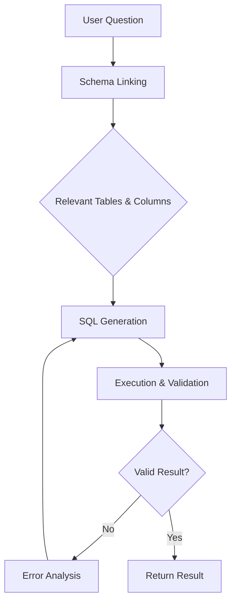
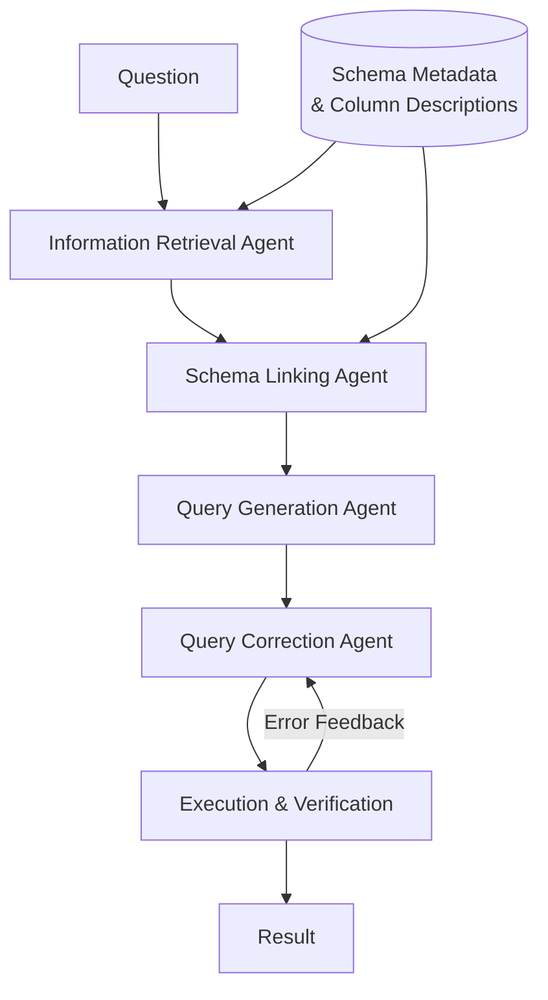

Natural language interfaces to databases have been a research dream for decades. The promise is compelling: analysts write questions in plain English, and the system generates the correct SQL. No data engineering bottleneck, no syntax errors, no tribal knowledge required about which table holds what.

The dream is closer than ever. But the gap between benchmark numbers and production reliability is still very real — and understanding that gap is the most useful thing you can know before building one of these systems.

This post covers the current landscape: how benchmarks work and what they hide, which architectures actually perform, the specific challenges of BigQuery and enterprise data warehouses, and the security patterns you cannot skip.

---

## The Benchmark Landscape

Before looking at systems, you need to understand what we're measuring. Text-to-SQL benchmarks have evolved significantly, and not all of them measure the same thing.

### Spider 1.0: The Saturated Standard

Spider (Yu et al., 2018) was the defining benchmark for years. It introduced cross-domain evaluation: train on some databases, test on unseen ones. This forced generalization rather than memorization.

At launch, the best systems scored around 18%. By 2023, fine-tuned models exceeded 85%. By 2024, the leaderboard was saturated — the best systems score ~91%, which is effectively at the human ceiling of ~92.2%.

**Spider 1.0 is no longer useful for differentiating top systems.** If someone quotes you a Spider score today without context, treat it skeptically.

### Spider 2.0: The Real Challenge

Spider 2.0 (ICLR 2025 Oral) was designed to represent actual enterprise SQL complexity. Key differences from Spider 1.0:

- **Real enterprise databases**: Snowflake, BigQuery, Databricks — not SQLite
- **Realistic SQL complexity**: CTEs, window functions, UNNEST, nested subqueries, multi-step transformations
- **Workflow-level tasks**: Some questions require multiple SQL queries in sequence
- **Larger schemas**: Real warehouses have hundreds of tables, not the dozen in academic benchmarks

The numbers reveal the difficulty: the best system as of early 2026 — ReFoRCE + o3 — scores approximately **35-36%**. That's not a typo. Even the most capable system gets about one in three questions right on enterprise-realistic SQL.

For context, human experts score around 70%+ on the same tasks.

```
Spider 1.0 (SQLite, simple)    →  Best system: ~91%  (saturated)
Spider 2.0 (enterprise, real)  →  Best system: ~36%  (far from solved)
```

The 55-point gap tells you everything about the difference between academic and production SQL.

### BIRD: The Middle Ground

BIRD (BigBench for Integrated Reasoning over Databases) targets a middle difficulty — more complex than Spider 1.0, less workflow-intensive than Spider 2.0. It uses real databases with evidence annotations: natural language hints that help the model understand domain-specific terminology.

Current top scores on BIRD:
- **Gemini 2.5 Pro (specialist setup)**: 76.13% Execution Accuracy
- **Arctic-Text2SQL-R1-32B** (open source): 71.83% EX
- **Human ceiling**: 92.96% EX

BIRD is currently the most actively contested benchmark and the best proxy for "medium-complexity enterprise SQL" performance.

### LiveSQLBench: Contamination-Free

The contamination problem is severe in text-to-SQL. Models trained on web data have seen benchmark questions, schemas, and solutions during pretraining. Spider and BIRD results are likely inflated as a result.

LiveSQLBench (May 2025) addresses this with continuously updated questions — new problems each evaluation cycle, sourced from live enterprise databases that weren't in any training corpus. Results are dramatically lower:

**o3-mini on LiveSQLBench: 44.81%**

This is probably closer to what you'd actually see on fresh enterprise data. Keep this in mind when vendors show you benchmark tables.

### Primary Evaluation Metric: Execution Accuracy

The standard metric is **Execution Accuracy (EX)**: did the generated SQL return the same results as the reference SQL?

EX is better than Exact Match (EM) because there are often multiple correct SQL formulations for the same question. If the results match, the query is correct regardless of syntax differences.

**EX limitations**:
- Doesn't account for query efficiency (a correct but 10-minute query isn't production-ready)
- Assumes the reference SQL is correct (benchmark annotation errors exist)
- Doesn't penalize queries that are correct by coincidence (same results, wrong logic)

VES (Valid Efficiency Score) attempts to incorporate query efficiency, but it's harder to compute on cloud warehouses with variable cost structures like BigQuery.

---

## System Architectures: What Actually Works

### The Naive Approach and Its Failure Mode

The simplest architecture is a single LLM call: give the model the schema and the question, ask for SQL.

```
User: "What were the top 10 products by revenue last quarter?"
Schema: [paste entire DDL]
LLM: [generates SQL]
```

This works surprisingly well on simple schemas and simple questions. It completely fails when:
- The schema has hundreds of tables and the relevant tables aren't obvious
- The question requires multi-step reasoning
- There's business-specific terminology the model doesn't know
- The SQL dialect has quirks (BigQuery vs PostgreSQL vs Snowflake)

### Schema Linking: The Critical First Step

Every high-performing system does **schema linking** before SQL generation: identify which tables and columns are relevant to the question.

The reason is straightforward — LLMs have finite context windows, and stuffing 200 table definitions into a prompt degrades performance while increasing cost. Schema linking retrieves only the relevant subset.



Schema linking implementations range from simple BM25 keyword matching against column descriptions to embedding-based semantic search over a metadata catalog. The latter handles synonyms and domain terminology better ("sales" → `revenue_transactions` table).

### Multi-Agent Validation: The CHESS Pattern

CHESS (Contextual, Hierarchical, Evidence-based SQL Synthesis) from UC Berkeley is one of the most influential recent architectures. It achieves 71.10% on BIRD with **no fine-tuning** and 93% fewer LLM calls than naive multi-agent approaches.

The key insight: decompose the problem into specialized agents, each doing one thing well.



Each agent has a focused context window and a specific task. The correction agent receives the error message from failed execution and attempts targeted fixes — this is far more effective than asking the generator to self-correct without structured feedback.

### LangGraph SQL Agent: The Production Pattern

The legacy LangChain `create_sql_agent` is now deprecated in favor of LangGraph-based patterns. LangGraph gives you explicit state management, which matters for SQL agents because you need to track: original question, identified schema, generated SQL, execution result, and error history.

A minimal production-ready LangGraph SQL agent:

```python
from langgraph.graph import StateGraph, END
from typing import TypedDict, Annotated
import operator

class SQLAgentState(TypedDict):
    question: str
    relevant_schema: str
    generated_sql: str
    execution_result: str
    error_message: str
    retry_count: int
    final_answer: str

def schema_linking_node(state: SQLAgentState) -> dict:
    """Identify relevant tables and columns using semantic search."""
    question = state["question"]
    # Search metadata catalog with embeddings
    relevant_tables = search_schema_catalog(question)
    schema_context = format_schema_context(relevant_tables)
    return {"relevant_schema": schema_context}

def sql_generation_node(state: SQLAgentState) -> dict:
    """Generate SQL from question and relevant schema."""
    prompt = build_sql_prompt(
        question=state["question"],
        schema=state["relevant_schema"],
        error=state.get("error_message", ""),
        previous_sql=state.get("generated_sql", "")
    )
    sql = llm.invoke(prompt).content
    return {"generated_sql": extract_sql(sql)}

def execution_node(state: SQLAgentState) -> dict:
    """Execute SQL with safety checks."""
    sql = state["generated_sql"]

    # Safety: only allow read operations
    if not is_read_only(sql):
        return {"error_message": "Only SELECT statements are permitted."}

    try:
        result = execute_with_timeout(sql, timeout_seconds=30)
        return {"execution_result": result, "error_message": ""}
    except Exception as e:
        return {"error_message": str(e)}

def should_retry(state: SQLAgentState) -> str:
    if state.get("error_message") and state.get("retry_count", 0) < 3:
        return "retry"
    elif state.get("error_message"):
        return "fail"
    return "success"

# Build graph
graph = StateGraph(SQLAgentState)
graph.add_node("schema_linking", schema_linking_node)
graph.add_node("sql_generation", sql_generation_node)
graph.add_node("execution", execution_node)

graph.set_entry_point("schema_linking")
graph.add_edge("schema_linking", "sql_generation")
graph.add_edge("sql_generation", "execution")
graph.add_conditional_edges(
    "execution",
    should_retry,
    {
        "retry": "sql_generation",
        "success": END,
        "fail": END
    }
)

sql_agent = graph.compile()
```

The retry loop with error feedback is essential. Execution errors are among the most informative signals — "column `product_id` not found in table `sales`" tells the model exactly what to fix.

### Arctic-Text2SQL-R1: Reinforcement Learning Approach

Snowflake's Arctic-Text2SQL-R1 (open source, HuggingFace) takes a different path: RL-based fine-tuning using GRPO (Gradient-based Reward Policy Optimization). Instead of multi-agent orchestration, it trains a single model to reason about SQL generation using execution accuracy as the reward signal.

Results: 71.83% on BIRD (32B parameter model), making it competitive with much larger proprietary models and significantly outperforming similar-size base models.

The significance: you can fine-tune an open-source 32B model to near-SOTA performance on your specific data warehouse dialect, without paying per-token API costs. This matters for high-volume enterprise deployments.

---

## BigQuery-Specific Challenges

Generic text-to-SQL systems trained on SQLite or PostgreSQL will fail silently on BigQuery. The dialect differences aren't cosmetic — they affect query validity.

### UNNEST and Nested Fields

BigQuery's first-class support for arrays and structs requires UNNEST syntax that simply doesn't exist in other dialects:

```sql
-- Querying array fields in BigQuery
SELECT
  order_id,
  item.product_id,
  item.quantity
FROM `project.dataset.orders`,
UNNEST(line_items) AS item
WHERE item.quantity > 5
```

A model trained on flat-table SQL will generate a JOIN here, which won't work. You need to either fine-tune on BigQuery-specific data or use few-shot examples that demonstrate UNNEST patterns.

### Partition Pruning

BigQuery charges by bytes scanned. A query that works correctly but scans the full table instead of filtering on the partition column can cost 1000x more than the same query with partition pruning:

```sql
-- Expensive: full table scan
SELECT * FROM `project.dataset.events`
WHERE DATE(event_timestamp) = '2026-03-28'

-- Cheap: partition pruned (if event_date is the partition column)
SELECT * FROM `project.dataset.events`
WHERE event_date = '2026-03-28'
```

This isn't just performance — it's cost. Your text-to-SQL agent needs to know which columns are partition keys and generate queries that use them.

### Backtick Identifiers

BigQuery uses backtick-quoted project.dataset.table identifiers. Models that learned on `schema.table` or `"schema"."table"` syntax will generate invalid queries:

```sql
-- PostgreSQL style (invalid in BigQuery)
SELECT * FROM my_dataset.my_table

-- BigQuery style
SELECT * FROM `my_project.my_dataset.my_table`
```

Always include the full identifier format in your schema context.

### Standard SQL vs Legacy SQL

BigQuery supports both Standard SQL (recommended) and Legacy SQL (deprecated but still encountered). Ensure your system prompt explicitly specifies Standard SQL, and never include Legacy SQL examples in few-shot prompts.

### Date and Time Functions

BigQuery's date/time functions differ from ANSI SQL and PostgreSQL:

```sql
-- Current date
CURRENT_DATE()              -- BigQuery
CURRENT_DATE               -- PostgreSQL (no parentheses)

-- Date arithmetic
DATE_ADD(CURRENT_DATE(), INTERVAL 7 DAY)   -- BigQuery
CURRENT_DATE + INTERVAL '7 days'           -- PostgreSQL

-- Quarter extraction
EXTRACT(QUARTER FROM date_column)  -- works in both (same here)
FORMAT_DATE('%Q', date_column)     -- BigQuery-specific
```

Maintain a BigQuery function reference in your schema metadata and include relevant examples based on the question's temporal requirements.

---

## Schema Metadata: The Underrated Bottleneck

The limiting factor in most production text-to-SQL systems isn't the model — it's schema metadata quality.

A model can only generate correct SQL if it understands:
- What each table represents
- What each column contains (not just its name, but its semantics)
- What the value domain looks like (enum columns, date ranges, NULL behavior)
- How tables relate to each other (foreign keys, often undocumented)
- Business-specific terminology mappings ("churn" → which table and condition)

In real enterprise warehouses, this metadata rarely exists in a structured form. It lives in Confluence pages, in the heads of senior data engineers, and in comments in old Looker views.

**Building the metadata layer is often 80% of the work.**

### Schema Metadata Structure

```python
# Structured schema metadata for text-to-SQL
schema_metadata = {
    "project.dataset.customer_events": {
        "description": "One row per customer interaction event. Primary source for funnel analysis.",
        "partitioned_by": "event_date",
        "volume": "~2B rows, 500GB",
        "columns": {
            "customer_id": {
                "type": "STRING",
                "description": "Unique customer identifier. Joins to customers.id",
                "nullable": False
            },
            "event_type": {
                "type": "STRING",
                "description": "Type of event. Values: 'page_view', 'add_to_cart', 'purchase', 'refund'",
                "nullable": False
            },
            "event_date": {
                "type": "DATE",
                "description": "Date of event. Partition key — always filter on this column.",
                "nullable": False
            },
            "revenue_usd": {
                "type": "FLOAT64",
                "description": "Revenue in USD. Non-null only when event_type = 'purchase'",
                "nullable": True
            }
        },
        "business_terms": ["funnel", "conversion", "revenue", "sales", "purchases"],
        "example_queries": [
            {
                "question": "What was the conversion rate last week?",
                "sql": "SELECT COUNT(DISTINCT CASE WHEN event_type = 'purchase' THEN customer_id END) / COUNT(DISTINCT customer_id) FROM `project.dataset.customer_events` WHERE event_date BETWEEN DATE_SUB(CURRENT_DATE(), INTERVAL 7 DAY) AND CURRENT_DATE()"
            }
        ]
    }
}
```

The `business_terms` field powers schema linking. When a user asks about "sales last quarter," the linker finds this table via semantic matching on the business terms, not just column names.

The `example_queries` field provides the most valuable few-shot context — domain-specific examples from your actual database.

---

## Security: Non-Negotiable Patterns

Giving an LLM access to a database is a significant security surface. These patterns are required, not optional.

### Read-Only Database Connections

Never connect the SQL agent with write permissions:

```python
# BigQuery: restrict to read-only via IAM
# Service account needs only: roles/bigquery.dataViewer + roles/bigquery.jobUser
# Do NOT grant: roles/bigquery.dataEditor or roles/bigquery.admin

from google.cloud import bigquery

client = bigquery.Client(project=PROJECT_ID)
# Job configuration: read only
job_config = bigquery.QueryJobConfig(
    use_query_cache=True,
    maximum_bytes_billed=10 * 1024**3  # 10 GB cap per query
)
```

### SQL Injection Detection

LLM-generated SQL can be manipulated through prompt injection in user questions:

```python
import re
from typing import Optional

DANGEROUS_PATTERNS = [
    r'\bDROP\b',
    r'\bDELETE\b',
    r'\bTRUNCATE\b',
    r'\bINSERT\b',
    r'\bUPDATE\b',
    r'\bALTER\b',
    r'\bCREATE\b',
    r'\bGRANT\b',
    r'\bREVOKE\b',
    r'--',           # SQL comment injection
    r'/\*',          # Block comment injection
    r';\s*SELECT',   # Statement chaining
    r'UNION\s+ALL\s+SELECT',  # UNION injection
]

def is_safe_sql(sql: str) -> tuple[bool, Optional[str]]:
    sql_upper = sql.upper()

    # Must start with SELECT
    stripped = sql.strip()
    if not stripped.upper().startswith('SELECT'):
        return False, "Query must begin with SELECT"

    for pattern in DANGEROUS_PATTERNS:
        if re.search(pattern, sql_upper):
            return False, f"Detected unsafe pattern: {pattern}"

    return True, None
```

### Schema Exposure Control

Don't expose tables users shouldn't access. Maintain a per-user or per-role allowlist of accessible tables:

```python
def get_allowed_schema(user_role: str) -> dict:
    """Return only the schema metadata the user's role can access."""
    role_permissions = SCHEMA_ACL.get(user_role, {})
    return {
        table: metadata
        for table, metadata in FULL_SCHEMA.items()
        if any(table.startswith(prefix) for prefix in role_permissions)
    }
```

### No Raw Data to LLM

When returning results to the user, never send raw row data through the LLM for summarization if the rows contain PII:

```python
def format_result_safely(df, question: str, contains_pii: bool) -> str:
    if contains_pii:
        # Return aggregated stats only, not raw rows
        return f"Query returned {len(df)} rows. " + df.describe().to_string()
    else:
        # Safe to summarize with LLM
        return summarize_with_llm(df.head(50).to_markdown(), question)
```

---

## Evaluation in Production

Benchmark metrics don't directly translate to production evaluation. Here's what actually matters:

### Offline Evaluation: Building a Golden Set

Create a golden set of question/SQL pairs from your actual database:

```python
golden_set = [
    {
        "question": "How many new customers signed up last month?",
        "canonical_sql": "SELECT COUNT(DISTINCT customer_id) FROM `project.dataset.customers` WHERE DATE_TRUNC(created_date, MONTH) = DATE_TRUNC(DATE_SUB(CURRENT_DATE(), INTERVAL 1 MONTH), MONTH)",
        "expected_result_checksum": "abc123",  # hash of expected result
        "difficulty": "medium",
        "requires_tables": ["customers"],
        "tags": ["customer_acquisition", "time_series"]
    },
    ...
]
```

Track EX (execution accuracy) against this golden set before any model/prompt update. Regression on the golden set is the primary signal.

### Online Evaluation: User Feedback Loop

For production systems, instrument explicit feedback:

```python
# After returning a result to the user
feedback = {
    "session_id": session_id,
    "question": question,
    "generated_sql": sql,
    "result_rows": len(result),
    "user_rating": None,  # "correct" / "incorrect" / "partial"
    "user_comment": None
}
```

Even a simple thumbs up/down widget captures the signal that matters most: did the user get the answer they needed? This is more valuable than any offline metric for catching drift.

### Tracking SQL Complexity Coverage

Monitor which question types your system handles well vs. poorly:

```python
complexity_categories = {
    "simple_filter": 0,       # WHERE clause only
    "aggregation": 0,         # GROUP BY, COUNT, SUM
    "time_series": 0,         # Date functions, period comparisons
    "multi_table_join": 0,    # JOIN across 2+ tables
    "window_function": 0,     # OVER, PARTITION BY
    "nested_subquery": 0,     # Subqueries in FROM or WHERE
    "cte": 0,                 # WITH clauses
    "unnest": 0               # BigQuery nested fields
}
```

If you see poor coverage of window functions, add more window function examples to your few-shot prompts or fine-tune specifically on that category.

---

## What the Benchmarks Don't Measure

Before deploying, understand the gaps in what academic benchmarks evaluate:

**Latency**: Spider and BIRD measure accuracy, not speed. A correct query that takes 45 seconds is not acceptable in a conversational interface. You need to set latency SLOs (e.g., SQL generation < 5s, execution < 30s) and measure them separately.

**Cost**: BigQuery charges per bytes scanned. A text-to-SQL system that generates correct but unoptimized queries can run up significant bills. EX doesn't penalize this.

**Ambiguity handling**: Benchmarks have unambiguous questions with single correct answers. Real users ask "show me sales" — no time period, no breakdown, no context. Your system needs a clarification strategy.

**Multi-turn context**: Most benchmarks are single-turn. Production users ask follow-up questions ("now break that down by region," "what about last year?"). LangGraph's state management handles this naturally, but it requires explicit design.

**Schema evolution**: Production schemas change. New columns appear, tables get renamed, deprecated views remain in the schema. Your metadata catalog needs versioning and your system needs graceful degradation when referenced objects disappear.

**Hallucinated table names**: Even the best models occasionally generate references to tables that don't exist. Always validate generated SQL against your actual schema before execution.

---

## Decision Framework: When to Use Text-to-SQL

Text-to-SQL is not the right tool for every use case. A rough decision guide:

| Question Type | Recommendation |
|---|---|
| Exploratory analytics, flexible questions | Good fit — core value proposition |
| Fixed dashboards with known questions | Use BI tools, not text-to-SQL |
| Questions requiring tribal knowledge | Requires rich metadata investment first |
| PII-heavy data | Requires careful access control design |
| Real-time operational queries (< 500ms) | Architecture mismatch — pre-compute instead |
| Multi-step workflows (ETL, data prep) | Too risky — use code generation with human review |
| Questions about unstructured content | Wrong tool — use RAG instead |

The systems that succeed in production share a common pattern: they're deployed in contexts where the question space is bounded, the schema is well-documented, and there's a human in the loop for anything that affects critical decisions.

---

## Current State of the Field (Early 2026)

The honest summary: text-to-SQL has made dramatic progress, and the remaining gap is mostly in enterprise complexity, not simple queries.

**What works well**:
- Simple to medium SQL on well-documented schemas
- Single-table queries with standard aggregations
- Time-period comparisons with standard date arithmetic
- Multi-table JOINs when relationships are explicit in the schema

**What's still hard**:
- Deeply nested SQL (multiple CTEs, correlated subqueries)
- Queries requiring implicit business knowledge ("active customers" may mean different things in different companies)
- Dialect-specific features (BigQuery UNNEST, Snowflake FLATTEN, Spark EXPLODE)
- Schema disambiguation when multiple tables could answer the question

**Where investment pays off**:
- Schema metadata quality: descriptions, business terms, value domains
- Domain-specific few-shot examples from your actual database
- Fine-tuning on your SQL dialect and query patterns (Arctic-Text2SQL-R1 approach)
- Multi-agent validation with execution feedback loops

The field is moving fast. Spider 2.0's 35% ceiling will be higher by the time you read this. But the fundamentals — schema linking, metadata quality, execution-based validation, security controls — won't change.

---

## Further Reading

- Yu, T. et al. (2019). *Spider: A Large-Scale Human-Labeled Dataset for Complex and Cross-Domain Semantic Parsing and Text-to-SQL Task*. EMNLP 2019. [arXiv:1809.08887](https://arxiv.org/abs/1809.08887)
- Lei, F. et al. (2025). *Spider 2.0: Evaluating Language Models on Real-World Enterprise Text-to-SQL Workflows*. ICLR 2025. [arXiv:2411.07763](https://arxiv.org/abs/2411.07763)
- Li, J. et al. (2024). *Can LLM Already Serve as A Database Interface? A BIg Bench for Large-Scale Database Grounded Text-to-SQLs*. NeurIPS 2024. [arXiv:2305.03111](https://arxiv.org/abs/2305.03111)
- Talaei, S. et al. (2024). *CHESS: Contextual Harnessing for Efficient SQL Synthesis*. [arXiv:2405.16755](https://arxiv.org/abs/2405.16755)
- Snowflake AI Research. (2025). *Arctic-Text2SQL-R1: Training Text-to-SQL Models with Reinforcement Learning*. [HuggingFace](https://huggingface.co/Snowflake/Arctic-Text2SQL-R1)
- LangGraph Documentation. (2025). *SQL Agent with LangGraph*. [LangChain Docs](https://langchain-ai.github.io/langgraph/)
