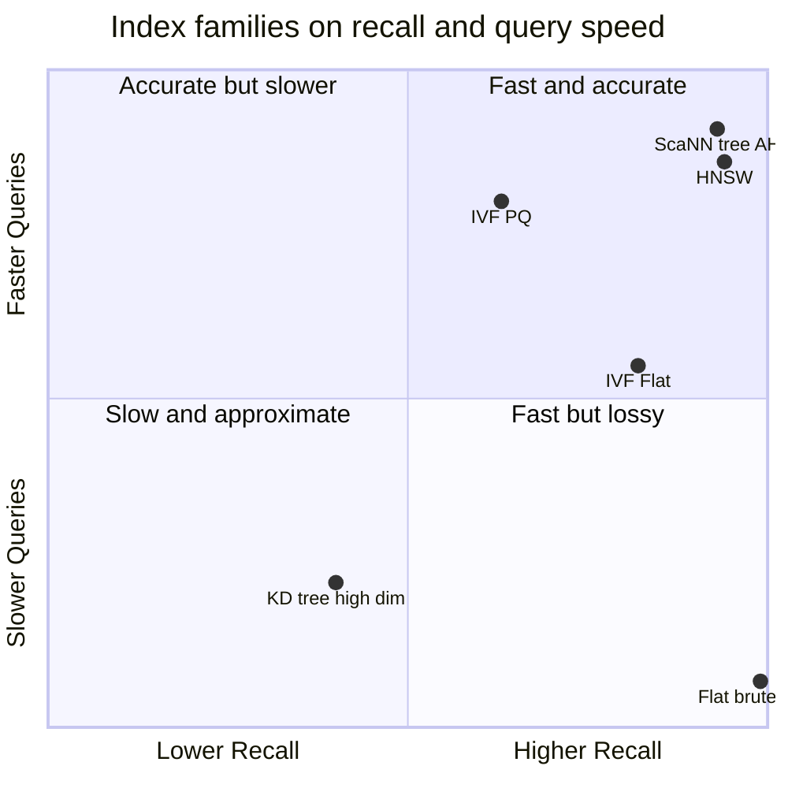
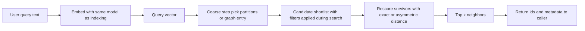
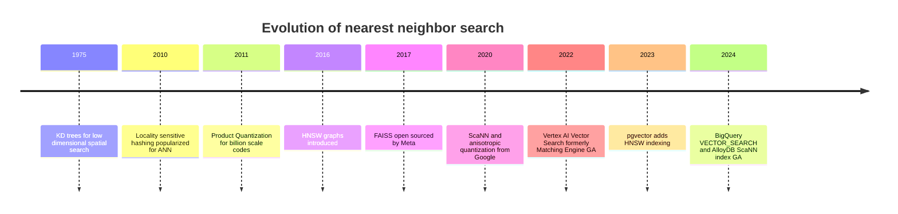

# Vector Databases Demystified: From Indexes to Vertex AI Vector Search

You have spent weeks getting embeddings right. You picked a model, you chunked your documents, you normalized your vectors, and now every paragraph in your knowledge base is a point in a 768-dimensional space where semantic similarity is geometric proximity. If that sentence already feels natural, you have done the hard conceptual work — and if it does not, start with [Embeddings: The Geometry of Meaning](https://juanlara18.github.io/portfolio/#/blog/embeddings-geometry-of-meaning), which is the prerequisite this entire post builds on.

Then you write the query. "Find the ten chunks most similar to this question." And you discover the quiet catastrophe at the center of every retrieval system: similarity is easy to define and brutally expensive to compute at scale. The embeddings were the easy part. Searching them is the part that decides whether your system survives production.

This post is the map of that territory. We start from the single constraint that forces everything else into existence — the cost of exact nearest-neighbor search — and let the index *emerge* from it. We walk the major index families (trees, IVF, product quantization, HNSW, ScaNN), clear up the confusions that trip up almost everyone (vector database versus index versus library, which distance metric, how filtering interacts with approximate search), then go deep on Google Cloud, ending with Vertex AI Vector Search in production: how it works, how to build and deploy it, what it costs, and what will bite you at 2 a.m.

> **Prerequisites.** You should be comfortable with what an embedding is and why cosine similarity captures semantic relatedness. You do not need to know any index internals — that is what we are about to build. If you want the companion piece on how to *evaluate* the systems we discuss, read [Vector Database Benchmarks](https://juanlara18.github.io/portfolio/#/blog/vector-db-benchmarks) after this; this post explains the machinery, that one explains how to read the numbers people publish about it.

---

## The kNN Wall

Let us make the problem concrete, because the entire field is a response to one number.

You have $N$ vectors, each of dimension $d$. A query arrives as another vector $q$ of dimension $d$. You want the $k$ vectors in your collection closest to $q$ under some distance. The obvious algorithm — the one every tutorial starts with and every production system eventually abandons — is to compute the distance from $q$ to all $N$ stored vectors and keep the smallest $k$. This is **exact brute-force k-nearest-neighbor search**, and it is correct by construction. It always returns the true nearest neighbors.

It is also $O(N \cdot d)$ per query. Each distance is $O(d)$ arithmetic, and you do it $N$ times.

Plug in real numbers. Ten million vectors at 1536 dimensions — a routine RAG corpus using a modern embedding model — is roughly 15 billion floating-point multiply-adds *per query*. On a single CPU core that is on the order of seconds. Multiply by concurrent users and you have a system that answers one question per second per core while your inbox fills with timeouts. Push to a billion vectors and brute force is not slow; it is structurally impossible for interactive use.

That is the kNN wall. Everything that follows — every index, every clever data structure, every Google research paper — exists to get under, over, or around it. The wall is the reason vector databases are an engineering discipline and not a `for` loop.

There is a second, subtler cost hiding behind the first: **memory**. Ten million 1536-dimensional `float32` vectors are about 60 GB of raw data. Before you optimize *time*, you have already committed to a *space* budget that determines which cloud instances you can afford. Hold these two costs in mind — latency and memory — because almost every index is a specific bargain struck between them and a third quantity we will meet in a moment: accuracy.

---

## Why an Index Must Emerge

The first instinct is to keep exact results and just make brute force faster — vectorized SIMD, GPU batching, quantized arithmetic. These help, and they buy you an order of magnitude or two, which is genuinely useful and why GPU brute force is the right answer at the scale of a few hundred thousand vectors. But they do not change the complexity class. At a billion vectors you are still scanning a billion vectors. To break the wall rather than dent it, you must stop looking at most of the data.

That is the conceptual leap. An **index** is a data structure that lets you ignore the overwhelming majority of your vectors for any given query, because you have pre-organized them so that the irrelevant ones are obviously irrelevant. And the moment you decide to skip vectors, you accept that you might skip the right one. You trade exactness for speed. This is **Approximate Nearest Neighbor (ANN) search**: you give up the guarantee of finding the true top $k$ in exchange for finding *almost* the true top $k$, much faster.

The quality of that approximation has a name you will see on every chart: **recall@k**, the fraction of the true $k$ nearest neighbors your index actually returns. Recall of 1.0 is exact. Recall of 0.95 means that, on average, nineteen of every twenty results are genuinely among the true nearest neighbors and one is an impostor that happened to be close enough to sneak in.

Once you accept approximation, you are no longer choosing between "fast" and "correct." You are navigating a three-way tension:

- **Recall** — how often you return the true neighbors.
- **Latency** — how fast you answer (and its cousin, throughput, queries per second).
- **Memory** — how much RAM the index occupies.

You can have any two at the expense of the third, and every index family is a different stance on which corner to sacrifice. Want maximum recall and speed? Pay in memory (HNSW). Want low memory and speed? Pay in recall (IVF-PQ). Want maximum recall and low memory? Pay in latency (on-disk indexes). There is no universally best index, only a best index *for your point in the triangle*. Internalize this and the rest of the landscape stops looking like a zoo and starts looking like a map.

---

## The Index Families

We will survey the main families in roughly the order they entered the field, because each one is a reaction to the limitations of the previous. Intuition first, math only where it pays for itself.

### Trees and Space Partitioning, and Why They Break

The classical answer to "find nearby points" is to recursively cut space into regions. A **KD-tree** splits along one coordinate axis at a time, so a query only descends into the regions that could contain neighbors. In two or three dimensions this is magnificent — it is how spatial databases and game engines do collision queries — and it gives genuinely logarithmic search.

Then dimensionality climbs, and the magic dies. This is the **curse of dimensionality**, and it is worth understanding viscerally rather than as a slogan. In high-dimensional space, *everything is roughly equidistant from everything else.* The contrast between the nearest and farthest points collapses; volume concentrates near the boundaries of regions; and a query's nearest neighbor routinely sits on the far side of a partition the tree decided to prune. To stay correct, the tree ends up backtracking into almost every branch, and you are back to scanning nearly all the data — except now with worse cache behavior than the honest brute-force loop.

[Annoy](https://github.com/spotify/annoy) (Spotify's library) is the pragmatic descendant: it builds a *forest* of randomized projection trees and searches several of them, accepting approximation to dodge the backtracking problem. It is memory-mappable, simple, and still used for medium-scale static datasets. But for the high-dimensional, high-recall regime that modern embeddings demand, trees were dethroned. The lesson generalizes: any method that relies on cleanly carving high-dimensional space into axis-aligned boxes is fighting geometry it cannot win.

### IVF: Don't Search Everywhere, Search the Right Neighborhoods

The **Inverted File index (IVF)** keeps the partitioning idea but throws away the rigid tree and the axis-aligned cuts. Instead, it runs $k$-means over your vectors once, producing some number of centroids — call it `nlist`. Each centroid owns a **Voronoi cell**: the region of space closer to it than to any other centroid. Every database vector is assigned to the cell of its nearest centroid, and the index stores, for each centroid, the list of vectors that fell into it. That list of cells-to-members is the "inverted file."

At query time you do something delightfully cheap. Compare the query to the `nlist` centroids — a tiny computation — pick the `nprobe` closest cells, and brute-force only the vectors inside those cells. If you have ten million vectors in 1024 cells and you probe 16 of them, you have just turned a ten-million-vector scan into roughly a 160,000-vector scan. The `nprobe` parameter is your recall-latency dial: probe more cells, catch more true neighbors that landed just across a cell boundary, pay more time.

The failure mode is exactly that boundary problem. A true neighbor sitting in an unprobed cell is invisible. Raising `nprobe` fixes it at a cost; this is the recall-latency tradeoff made tangible in a single integer. IVF shines at large scale and is the backbone of FAISS's billion-vector deployments, but on its own it still stores full vectors, so it does nothing for your memory bill. For that, we need to compress.

### Product Quantization: Compressing Vectors Without Losing the Plot

**Product Quantization (PQ)**, introduced by Jégou, Douze, and Schmid in 2011, is the most elegant idea in the field, and it attacks the memory corner of the triangle head-on.

Here is the construction. Take a $d$-dimensional vector and chop it into $m$ contiguous sub-vectors, each of dimension $d/m$. For each of the $m$ sub-spaces, run $k$-means to learn a small codebook of $k^*$ centroids (the universal choice is $k^* = 256$, because that is exactly what fits in one byte). Now any vector is approximated by recording, for each of its $m$ sub-vectors, the index of the nearest centroid in that sub-space's codebook. The vector becomes $m$ small integers.

The compression is dramatic. A raw vector costs $4d$ bytes in `float32`. Its PQ code costs

$$
m \cdot \log_2 k^* \ \text{bits} = m \cdot \log_2 256 \ \text{bits} = 8m \ \text{bits} = m \ \text{bytes}.
$$

So a 1024-dimensional vector ($4096$ bytes raw) with $m = 64$ becomes a **64-byte code** — a 64× reduction. The number of distinct vectors the codebook can represent is $(k^*)^m = 256^{64}$, an astronomically large palette assembled as a *product* of $m$ small per-subspace palettes, which is where the name comes from.

The trick that makes PQ fast at query time is **asymmetric distance computation**. You do not decompress anything. For a query, you precompute the distance from each of its sub-vectors to all 256 centroids in the corresponding codebook — a small lookup table — and then any database vector's approximate distance is just $m$ table lookups and additions. No multiplications over full vectors, no decompression.

The cost is accuracy: you are comparing against quantized approximations, so distances are noisy and recall drops. The standard production recipe, **IVF-PQ**, combines both ideas — IVF to avoid scanning everything, PQ to shrink what you do scan — and is how a billion vectors fit on a machine you can actually rent. You typically rerank the top candidates with exact distances on the small survivor set to claw back precision.

### HNSW: The Graph That Took Over

If you have used a vector database in the last few years, you have almost certainly used **Hierarchical Navigable Small World (HNSW)** graphs, introduced by Malkov and Yashunin. It is the default in Qdrant, Weaviate, Milvus, pgvector, and most of the field, and for good reason: it sits in the high-recall, high-speed corner of the triangle and is forgiving to tune.

The intuition borrows from how you would navigate a road network without a map: take highways to get to the right city, then surface streets to find the address. HNSW builds a multi-layer graph. The top layer is sparse, with a few nodes connected by long-range links — the highways. Each layer down is denser with shorter links, until the bottom layer contains every vector connected to its near neighbors — the surface streets. A search enters at the top, greedily hops toward the query using long links until it cannot get closer, drops a layer, and repeats. By the time it reaches the bottom it is already in the right neighborhood and only refines locally. The result is roughly logarithmic search with excellent recall.

Three parameters govern it, and you will set all three in production:

- **M** — the number of neighbors each node keeps. Higher `M` means a richer graph, better recall, and more memory (the dominant driver of HNSW's famously large footprint). Common values are 16 to 64.
- **efConstruction** — how many candidates the builder considers when wiring up each new node. Higher means a better-quality graph and a slower, more expensive build. Build-time only.
- **efSearch** (often just `ef`) — how many candidates the search keeps in flight. This is the runtime dial: raise it for more recall and more latency, lower it for speed. Every point on an HNSW recall-versus-QPS curve corresponds to a different `efSearch`.

HNSW's weaknesses are the flip side of its strengths: it is memory-hungry (the graph edges are pure overhead on top of the vectors), and it is awkward to update incrementally, which matters for fast-changing corpora. But as a default, it earned its dominance.

### ScaNN: Quantization Done Anisotropically

Google's **ScaNN** (Scalable Nearest Neighbors) matters here for one concrete reason: it is the engine under Vertex AI Vector Search, AlloyDB's ScaNN index, and BigQuery's TreeAH index. Understanding its key idea makes the GCP section click.

ScaNN's headline contribution is **anisotropic vector quantization**, from the 2020 ICML paper "Accelerating Large-Scale Inference with Anisotropic Vector Quantization." The insight is subtle and clever. Traditional quantization (including vanilla PQ) minimizes *reconstruction error* — it tries to make the compressed vector as close as possible to the original in every direction equally. But for **maximum inner product search**, which is what cosine and dot-product retrieval reduce to, not all errors are equal. What you care about is preserving *large* inner products, because those are the results that end up in your top $k$. ScaNN therefore weights its quantization loss to penalize error in the direction *parallel* to the data vector more heavily than error in the orthogonal direction. It deliberately sacrifices fidelity on low-scoring pairs to sharpen accuracy on high-scoring ones — exactly the pairs that determine your answer.

Wrapped in a partitioning tree (hence Google's name for it, **tree-AH**, "tree with asymmetric hashing") plus a final exact-rescoring step, this gives ScaNN a recall-versus-speed curve that bested every other library on the public ann-benchmarks suite at publication. It is not magic — it is PQ's descendant with a loss function tuned to the metric people actually use. That is the whole trick, and it is a good one.

Here is where the families land on the triangle. Note that brute force defines the recall ceiling and the latency floor; everything else trades position around it.



And here is a comparison you can keep nearby when choosing.

| Index family | Core idea | Memory | Build cost | Best when | Key knobs |
|---|---|---|---|---|---|
| Flat (brute force) | Scan everything exactly | High (full vectors) | None | Under ~100K vectors, or measuring recall | none |
| KD-tree / Annoy | Recursively partition space | Low to medium | Low | Low dimensions, static medium data | trees, search_k |
| IVF-Flat | Cluster into Voronoi cells, scan a few | High (full vectors) | Medium (k-means) | Large scale, memory available | nlist, nprobe |
| IVF-PQ | IVF plus compressed codes | Very low | Medium to high | Billions of vectors, tight memory | nlist, nprobe, m |
| HNSW | Multi-layer proximity graph | High (graph overhead) | High | High recall and low latency, fits in RAM | M, efConstruction, efSearch |
| ScaNN / tree-AH | Partition plus anisotropic quantization | Low to medium | Medium to high | Large scale on Google infra | leaf count, fraction searched |

---

## Clearing Up the Confusions

More production accidents come from conceptual muddles than from bad parameters. Let us defuse the common ones.

### Database vs Index vs Library

These three words get used interchangeably and they are not the same thing.

A **vector index** is the data structure — HNSW, IVF-PQ, ScaNN. It answers one question: given this query vector, which stored vectors are nearest? It knows nothing about metadata, persistence, networking, access control, or transactions.

A **vector search library** is code that implements indexes. [FAISS](https://github.com/facebookresearch/faiss) (Meta) and [ScaNN](https://github.com/google-research/google-research/tree/master/scann) (Google) are libraries. They are extraordinary at the algorithmic core and deliberately *not* databases: FAISS does not store your documents, does not filter by `tenant_id`, does not survive a restart unless you serialize it yourself, and does not expose a network API. It is an engine, not a car.

A **vector database** wraps an index library (or several) with everything a production system needs: durable storage, metadata and payloads, filtering, a query API over the network, concurrency control, replication, backups, observability, and often multiple index types and distance metrics. Qdrant, Weaviate, Milvus, Pinecone, and Vertex AI Vector Search are databases (or managed database services). The relationship is strict containment: a database uses an index, often via a library.

Why does this matter? Because "should I use FAISS or Pinecone?" is a category error. FAISS is what you reach for when you are embedding a search engine inside your own service and will handle storage and serving yourself. A vector database is what you reach for when you want those concerns solved for you. Choosing FAISS and then rebuilding metadata filtering, persistence, and an HTTP API on top of it means you have decided to write a vector database — which is a legitimate but large decision to make on purpose, not by accident.

### Which Metric, and the Normalization Trap

Three distance/similarity functions dominate. For vectors $a$ and $b$:

$$
\text{L2 (Euclidean): } \ \|a - b\|_2 = \sqrt{\sum_{i=1}^{d} (a_i - b_i)^2}
\qquad
\text{Dot product: } \ a \cdot b = \sum_{i=1}^{d} a_i b_i
$$

$$
\text{Cosine similarity: } \ \cos(a, b) = \frac{a \cdot b}{\|a\|_2 \, \|b\|_2}.
$$

The single fact that resolves most metric confusion: **if your vectors are L2-normalized (unit length), cosine, dot product, and L2 all produce the same ranking.** The algebra is one line — for unit vectors,

$$
\|a - b\|_2^2 = \|a\|^2 + \|b\|^2 - 2\,(a \cdot b) = 2 - 2\,(a \cdot b),
$$

so smaller L2 distance means larger dot product means larger cosine. They rank neighbors identically. This is why so many systems normalize embeddings at write time and then use dot product (the cheapest of the three) as the metric. Many modern embedding models already emit normalized vectors; some do not. The trap is mixing regimes: indexing with a metric that assumes normalization while feeding it un-normalized vectors silently corrupts your rankings, and nothing errors out. Decide your normalization policy once, apply it identically at index time and query time, and pick the metric your model was trained for. If in doubt, normalize and use dot product.

### Is pgvector a Vector Database?

This question generates more heat than it deserves. [pgvector](https://github.com/pgvector/pgvector) is a PostgreSQL *extension* that adds a `vector` column type and ANN indexes (both IVFFlat and HNSW, the latter since version 0.5.0) to Postgres. So: is it a vector database?

The honest answer is that it makes PostgreSQL into a database that can do vector search — which for a large fraction of teams is exactly the right thing and strictly better than running a second system. Your embeddings live beside your relational data, in the same transactions, the same backups, the same SQL your team already knows, with no synchronization layer to drift out of sync. It will not match a purpose-built engine on raw throughput at high recall, and its filtering historically applied *after* the index scan (mitigated in 0.8.0 with iterative scans). But "is it a real vector database?" is the wrong question. The right one is "does putting vectors in my existing Postgres beat operating a dedicated system for my scale and team?" — and surprisingly often, it does. We cover where it sits among GCP options below.

### Filtering and ANN: The Pre vs Post Trap

Real queries are almost never "find the nearest ten." They are "find the nearest ten *where `tenant_id = 42` and `lang = 'en'` and `published_after = 2027-01-01`*." How filtering combines with approximate search is where many systems quietly fall apart.

**Post-filtering** runs the ANN search first, gets the top candidates, then discards the ones that fail the filter. If your filter is selective — say only 1% of vectors match — the ANN search returns candidates that are almost all thrown away, and you may not find ten survivors at all without dramatically over-fetching. Recall craters precisely when the filter is most useful.

**Pre-filtering** restricts the search to matching vectors *during* traversal, so the index only ever considers eligible candidates. This keeps recall high under selective filters but is architecturally harder: the index has to be filter-aware. Different systems take different routes — Qdrant traverses filtered subgraphs, Vertex AI attaches "restricts" (token and numeric tags) evaluated during search. The practical rule: never assume filtered ANN behaves like unfiltered ANN. Test it at your real filter selectivity, because the benchmark everyone publishes is unfiltered and your production workload is not.

Here is the query path most ANN systems actually follow, filters included:



---

## The Vector Options on Google Cloud

Now we turn to the cloud the question is really about. Google Cloud does not have *a* vector product; it has four meaningfully different ones, and choosing wrong is a slow, expensive mistake. Here is the map. (For the broader stack around these — RAG Engine, embeddings, ingestion — see [GCP AI Stack: Vertex AI, AlloyDB, and the Cloud-Native Knowledge Pipeline](https://juanlara18.github.io/portfolio/#/blog/gcp-ai-stack-vertex-alloydb-knowledge-pipeline).)

| GCP option | What it is | Index tech | Sweet spot | Watch out for |
|---|---|---|---|---|
| Vertex AI Vector Search | Managed standalone ANN service, formerly Matching Engine | ScaNN (tree-AH) or brute force | Large scale, lowest latency, billions of vectors | Always-on endpoint cost; separate from your primary DB |
| AlloyDB / Cloud SQL (pgvector + ScaNN) | Managed PostgreSQL with vectors | pgvector HNSW/IVFFlat; AlloyDB ScaNN index | Vectors beside relational data, transactional RAG | Throughput ceiling vs dedicated service |
| BigQuery VECTOR_SEARCH | SQL vector search in the warehouse | IVF or TreeAH (ScaNN) | Analytical, batch, vectors already in BigQuery | Not a low-latency online serving path |
| Memorystore (Redis / Valkey) | In-memory store with vector search | HNSW / FLAT | Tiny corpora, sub-millisecond, ephemeral | RAM-bound, limited scale and durability story |

The decision usually comes down to three questions. *Where does the data already live?* If it is in BigQuery and your access pattern is analytical or batch, `VECTOR_SEARCH` saves you an entire pipeline. If it is in a transactional Postgres and you want vectors in the same ACID world as your rows, AlloyDB or Cloud SQL with pgvector is the path of least resistance. *How low does latency need to go, and at what scale?* For genuinely large corpora with tight online latency SLOs, the purpose-built service — Vertex AI Vector Search — is what Google engineers it for. *Is the corpus small and hot?* Memorystore answers in sub-millisecond time but lives and dies in RAM.

For the rest of this post we focus on the heavyweight, because it is the one people most often misunderstand and most often mis-budget.

---

## Deep Dive: Vertex AI Vector Search in Production

**Vertex AI Vector Search** (you will still see the old name, *Matching Engine*, in SDK classes and older docs) is Google's managed, standalone ANN service. It is the same family of technology that serves vector matching inside Google Search, YouTube, and Play, exposed for your own embeddings. Under the hood it runs ScaNN. Your job is to feed it vectors, choose a couple of parameters, deploy, and pay attention to the cost model — which is the part that surprises people.

### Two Index Algorithms: tree-AH and Brute Force

Vector Search offers exactly two index algorithms, and the choice is simple.

**tree-AH** is the ScaNN-based production algorithm: tree partitioning plus asymmetric-hashing quantization, fast and approximate. This is what you deploy. Its main tuning fields are `leafNodeEmbeddingCount` (how many vectors live in each leaf of the partition tree, default 1000) and `fractionLeafNodesToSearch` (the fraction of leaves any query may scan, default 0.05) — the latter being your direct recall-versus-latency dial, the cloud cousin of `nprobe` and `efSearch`. There is also `approximateNeighborsCount`, the number of candidates the algorithm gathers before final rescoring.

**Brute force** does exactly what its name says: an exact linear scan, 100% recall, high latency. You almost never serve production traffic with it. Its real job is *measuring recall*: deploy a brute-force index over the same data, treat its results as ground truth, and compare your tree-AH index against it to tune `fractionLeafNodesToSearch` until you hit your recall target. This offline ground-truth workflow is the correct way to set the dial, and Google's docs recommend exactly this.

### Batch vs Streaming Updates

You choose an update mode at index creation, and it is not changeable later without rebuilding.

A **batch index** ingests vectors from files in Cloud Storage in bulk — appropriate when your corpus refreshes on a schedule (nightly, weekly). A **streaming index** accepts real-time upserts and makes new vectors queryable within seconds, which is what you want when freshness matters — new inventory, new documents, live content. Streaming indexes also allow direct metadata-only updates: you can change a data point's restricts (its filter tags) without re-upserting the vector, using an `update_mask` of `all_restricts`. The catch worth circling in red: **you cannot convert a batch index to streaming**; pick the right mode up front or rebuild.

### Restricts: How Filtering Works Here

Vertex AI does filtering through **restricts** attached to each data point. **Token restricts** are categorical tags (namespace `genre` with value `drama`, or `tenant` with value `acme`); **numeric restricts** are numeric attributes (price, length) you can filter with operators like greater-than at query time. These are evaluated during search rather than purely after it, which keeps recall healthier under selective filters than naive post-filtering — but, per the universal rule above, still verify behavior at your real selectivity. Restricts are also what streaming metadata updates modify in place.

### The Endpoint, Autoscaling, and the Cost Model

This is the part that determines your bill, so read slowly. A Vector Search index is not queryable on its own. You create the index, then create an **index endpoint** (a server resource), then **deploy** the index to that endpoint. Only the deployed-index-on-endpoint combination answers queries. That endpoint runs on virtual machines — replicas — and **you pay for those replicas by the hour for as long as the endpoint is up, whether or not anyone is querying it.**

Autoscaling adjusts the replica count between a `minReplicaCount` and `maxReplicaCount` you set at deploy time. Crucially, `minReplicaCount` must be at least 1 — there is no scale-to-zero. An idle Vector Search endpoint is an always-on cost. Roughly, your monthly bill is *serving cost* (replicas × shards × hourly machine rate × ~730 hours) plus *index build/update cost* (data size in GiB times a per-GiB rate times the number of rebuilds). The serving term dominates for steady deployments, and it is the term that punishes the common mistake of standing up an endpoint for a prototype and forgetting it for a month.

The practical implications:

- **Always-on means budget-on.** Vertex AI Vector Search is excellent for systems with sustained query traffic and large corpora. For a low-traffic side project, an always-on endpoint can cost more per month than the rest of your cloud bill — exactly the kind of footgun the [GCP stack post](https://juanlara18.github.io/portfolio/#/blog/gcp-ai-stack-vertex-alloydb-knowledge-pipeline) warns about. For bursty or tiny workloads, pgvector on a database you are already paying for is often the better economics.
- **Right-size `minReplicaCount`.** It sets your latency-and-availability floor and your cost floor simultaneously. Set it to your real baseline load, let autoscaling handle peaks, and do not leave it inflated.
- **Latency SLOs are a deployment concern, not just an index concern.** Recall comes from `fractionLeafNodesToSearch`; tail latency comes from replica count, machine type, sharding, and network path (public vs VPC endpoint). Tune both.

### Code: From FAISS Locally to Vertex AI in the Cloud

It helps to see the same task at both ends of the spectrum. First, a local FAISS index — the kind of thing you would prototype with or embed directly in a service. This builds an IVF-PQ index for a compact, large-scale-friendly footprint and queries it.

```python
import numpy as np
import faiss

# Toy corpus: 200k vectors, 768 dims, L2-normalized so dot product == cosine ranking.
d = 768
n = 200_000
rng = np.random.default_rng(42)
vectors = rng.standard_normal((n, d)).astype("float32")
faiss.normalize_L2(vectors)

# IVF-PQ: nlist Voronoi cells, PQ with m sub-quantizers of 8 bits each (256 centroids).
# m must divide d. Here 768 / 96 = 8 dims per sub-vector -> 96-byte codes per vector.
nlist, m, nbits = 1024, 96, 8
quantizer = faiss.IndexFlatIP(d)  # inner product == cosine on normalized vectors
index = faiss.IndexIVFPQ(quantizer, d, nlist, m, nbits, faiss.METRIC_INNER_PRODUCT)

# PQ codebooks must be trained on a representative sample before adding data.
index.train(vectors)
index.add(vectors)

# nprobe is the recall/latency dial: probe more cells for higher recall, more time.
index.nprobe = 16

query = rng.standard_normal((1, d)).astype("float32")
faiss.normalize_L2(query)
distances, ids = index.search(query, k=10)
print("Top-10 neighbor ids:", ids[0])
print("Scores (inner product):", distances[0])
```

Now the managed equivalent on Vertex AI, using the `google-cloud-aiplatform` SDK. Note the three-step shape — create index, create endpoint, deploy — and the explicit autoscaling bounds that control your cost.

```python
from google.cloud import aiplatform

aiplatform.init(project="my-project", location="us-central1")

# 1. Create a tree-AH (ScaNN) index. Embeddings live as JSONL in a GCS bucket.
#    Use STREAM_UPDATE for near-real-time upserts; BATCH_UPDATE for scheduled refresh.
index = aiplatform.MatchingEngineIndex.create_tree_ah_index(
    display_name="docs-index",
    contents_delta_uri="gs://my-bucket/embeddings/",
    dimensions=768,
    approximate_neighbors_count=150,
    distance_measure_type="DOT_PRODUCT_DISTANCE",  # use normalized vectors
    leaf_node_embedding_count=1000,
    index_update_method="STREAM_UPDATE",
)

# 2. Create an index endpoint (the queryable server resource).
endpoint = aiplatform.MatchingEngineIndexEndpoint.create(
    display_name="docs-endpoint",
    public_endpoint_enabled=True,
)

# 3. Deploy the index. min_replica_count >= 1 (no scale-to-zero); the gap between
#    min and max enables autoscaling. These bounds set both your latency floor
#    and your always-on cost floor.
endpoint.deploy_index(
    index=index,
    deployed_index_id="docs_deployed_v1",
    min_replica_count=1,
    max_replica_count=3,
)

# Query: embed the user question with the SAME model used for indexing, then search.
query_embedding = [0.012, -0.034, ...]  # 768-dim vector from your embedding model
neighbors = endpoint.find_neighbors(
    deployed_index_id="docs_deployed_v1",
    queries=[query_embedding],
    num_neighbors=10,
)
for n in neighbors[0]:
    print(n.id, n.distance)
```

The conceptual distance between these two snippets *is* the difference between a library and a managed database: FAISS hands you an index object in memory; Vertex AI hands you a billed, replicated, networked service with an SLO. Same algorithmic core, entirely different operational contract.

---

## How It Compares

No tool is a sales pitch, so here is a balanced read on where Vertex AI Vector Search sits among the systems you might otherwise pick. This complements the deeper treatment in the [benchmarks post](https://juanlara18.github.io/portfolio/#/blog/vector-db-benchmarks); here we care about character, not leaderboard position.

| System | Model | Default index | Filtering | Strength | Trade-off |
|---|---|---|---|---|---|
| Vertex AI Vector Search | Managed, GCP-native | ScaNN tree-AH | Token + numeric restricts | Scale, latency, Google infra integration | Always-on endpoint cost, GCP lock-in |
| Pinecone | Managed, multi-cloud | Proprietary | Metadata filters | Zero ops, fast time to production | Cost at scale, lock-in, no parameter control |
| Weaviate | Open source + managed | HNSW | Pre-filtering | First-class hybrid (dense + sparse) search | Tuning effort, ops if self-hosted |
| Qdrant | Open source + managed | HNSW (Rust) | Filterable HNSW (pre-filter) | Strong filtered search, predictable tail latency | Smaller ecosystem than Weaviate |
| Milvus / Zilliz | Open source + managed | Many (HNSW, IVF, DiskANN, SCANN) | Pre/post options | Extreme scale, index diversity | Heavy operational footprint |
| pgvector (incl. AlloyDB) | Postgres extension | HNSW, IVFFlat | SQL WHERE (post by default, iterative scans in 0.8.0) | Vectors beside relational data, ACID, SQL | Lower raw throughput at high recall |

The honest summary: choose **Vertex AI Vector Search** when you are committed to GCP, operating at a scale and latency target that justifies a dedicated always-on service, and want Google to run the hard parts. Choose **pgvector/AlloyDB** when vectors are a feature of an app whose center of gravity is relational data. Choose **Qdrant or Weaviate** when you want open-source control and either strong filtered search or hybrid retrieval. Choose **Pinecone** when ops headcount is the binding constraint. Choose **Milvus** when you are genuinely at the hundreds-of-millions-to-billions frontier and need index diversity. The systems are not ranked; they are positioned.

---

## Production Checklist and Gotchas

The things that separate a demo from a system that holds up:

- **Normalize once, consistently.** Decide your normalization policy and apply it identically at index time and query time. Mismatches silently corrupt rankings with no error.
- **Embed queries with the exact model used for indexing.** Different model, or different model version, means a different space, means meaningless distances. Pin the version.
- **Set recall by measuring, not guessing.** Deploy a brute-force index as ground truth, compare, and tune `fractionLeafNodesToSearch` (Vertex) / `nprobe` (IVF) / `efSearch` (HNSW) to your target recall. Pick the recall your application needs — RAG usually wants the high end (0.95+), where the recall-latency curve is steep.
- **Test filtered search at real selectivity.** The published benchmark is unfiltered; your workload is not. Selective filters wreck naive post-filtering. Verify pre-filtering behavior with your actual filter cardinality.
- **Budget the always-on endpoint.** Vertex AI Vector Search has no scale-to-zero; `minReplicaCount >= 1` bills continuously. Right-size it, and for low-traffic or tiny corpora, reconsider whether pgvector on existing infrastructure is cheaper.
- **Choose update mode deliberately.** Streaming for freshness, batch for scheduled refresh — and remember you cannot convert between them without rebuilding.
- **Plan for rebuilds and compaction.** Indexes drift and fragment as data changes; know your rebuild time, and rehearse it as part of disaster recovery, not as a surprise.
- **Watch the memory corner.** HNSW footprints run well above the raw vectors; if memory is the binding constraint, that is the signal to move toward IVF-PQ, ScaNN, or an on-disk index.
- **Mind the latency SLO end to end.** Tail latency comes from replicas, machine type, sharding, and network path, not just the index. A VPC endpoint co-located with your service often beats a faster index reached over a slower hop.
- **Hybrid search is often a gap.** Dense ANN alone misses exact-keyword matches. If you need lexical precision too, confirm your platform's hybrid (dense + sparse) support is real, not a checkbox.



---

## Going Deeper

**Books:**

- Manning, C., Raghavan, P., & Schütze, H. (2008). *Introduction to Information Retrieval.* Cambridge University Press.
  - The canonical IR text. Its chapters on similarity, ranking, and evaluation are the foundation under everything vector search added on top.
- Boytsov, L., & Naidan, B., et al. (2017). *Non-Metric Space Library (NMSLIB) Manual and the Theory of Proximity Search.* (companion to the NMSLIB project).
  - A rigorous treatment of proximity search beyond strict metrics; excellent for understanding why graph methods like HNSW generalize so well.
- Bruch, S. (2024). *Foundations of Vector Retrieval.* Springer.
  - A modern, comprehensive synthesis of the ANN landscape — quantization, graphs, partitioning — written for practitioners who want the math without the marketing.

**Online Resources:**

- [FAISS wiki](https://github.com/facebookresearch/faiss/wiki) — The single best practical reference for index types and how to choose between IVF, PQ, and HNSW variants.
- [Vertex AI Vector Search documentation](https://cloud.google.com/vertex-ai/docs/vector-search/overview) — Index configuration, streaming updates, restricts, and deployment, straight from the source.
- [ScaNN for AlloyDB whitepaper](https://services.google.com/fh/files/misc/scann_for_alloydb_whitepaper.pdf) — A clear, accessible walk through ANN fundamentals and how ScaNN works, written by the team behind it.
- [pgvector repository](https://github.com/pgvector/pgvector) — The README is a compact, honest guide to HNSW/IVFFlat tuning, halfvec, and filtering in Postgres.

**Videos:**

- ["Get Started with Vector Search using Vertex AI"](https://www.youtube.com/watch?v=Y5Jm_Gtfhsg) by Google Cloud Tech — A nine-minute walkthrough of building, deploying, and querying a Vertex AI Vector Search index end to end.
- ["Exact vs Approximate (HNSW) Nearest Neighbors in Vector Databases"](https://www.youtube.com/watch?v=9NvO-VdjY80) by Raphael De Lio — A clear visual explanation of the FLAT-versus-HNSW trade-off and when to pick each.

**Academic Papers:**

- Jégou, H., Douze, M., & Schmid, C. (2011). ["Product Quantization for Nearest Neighbor Search."](https://ieeexplore.ieee.org/document/5432202) *IEEE Transactions on Pattern Analysis and Machine Intelligence,* 33(1), 117–128.
  - The origin of PQ and asymmetric distance computation — the compression idea every memory-efficient index descends from.
- Malkov, Y. A., & Yashunin, D. A. (2020). ["Efficient and Robust Approximate Nearest Neighbor Search Using Hierarchical Navigable Small World Graphs."](https://arxiv.org/abs/1603.09320) *IEEE Transactions on Pattern Analysis and Machine Intelligence,* 42(4), 824–836.
  - The HNSW paper. Sections 1–3 build the intuition for why the multi-layer graph dominates production.
- Guo, R., Sun, P., Lindgren, E., Geng, Q., Simcha, D., Chern, F., & Kumar, S. (2020). ["Accelerating Large-Scale Inference with Anisotropic Vector Quantization."](https://proceedings.mlr.press/v119/guo20h.html) *Proceedings of the 37th International Conference on Machine Learning (ICML), PMLR 119*, 3887–3896.
  - The ScaNN paper and the engine under Vertex AI Vector Search. The anisotropic loss is the whole insight; read it to understand tree-AH.

**Questions to Explore:**

- If recall is tunable, what recall does *your* application actually need — and how would you measure the downstream quality cost of dropping from 0.99 to 0.95 in a real RAG pipeline rather than on a synthetic benchmark?
- The curse of dimensionality kills trees but graphs and quantization survive it. What is it about HNSW and ScaNN that sidesteps the geometry that defeats KD-trees, and where might *they* eventually break?
- Always-on endpoints have no scale-to-zero. What would a genuinely serverless vector search service have to solve — index loading, cold start, cost attribution — to make on-demand ANN practical?
- Hybrid dense-plus-sparse retrieval consistently beats either alone, yet most vector databases treat sparse search as an afterthought. Is the right future architecture one unified index, or two specialized ones fused at query time?
