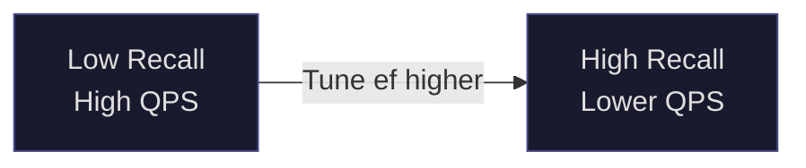

# Vector Database Benchmarks: Reading the Numbers That Actually Matter

Three charts are open on your screen. The first, from Qdrant's website, shows Qdrant handling more queries per second than Weaviate at the same recall level. The second, from Weaviate's blog, shows Weaviate's hybrid search outperforming every competitor on a combined dense-sparse retrieval task. The third, from an independent academic project called ANN-Benchmarks, barely mentions either system—it is ranking algorithms, not databases, and the top performers are all research implementations that you cannot deploy in production.

Every chart is correct. Every chart is incomplete. And if you pick your vector infrastructure based on any one of them without understanding what it actually measures, you will eventually pay for that decision.

This is the first post in a new series dedicated entirely to benchmarks—because in the current landscape of AI infrastructure, where new systems appear monthly and marketing charts precede engineering reality, the ability to read a benchmark critically is itself a production skill. We start with vector databases because they are the substrate of every serious RAG system, and because their benchmark ecosystem is mature enough to illustrate almost every failure mode that benchmarks can have.

Understanding what a number means, where it came from, who funded the machine that produced it, and what the workload looked like when it was generated—that understanding is what separates an infrastructure decision that holds up from one that surprises you six months into production.

---

## Why Benchmarks Are Harder Than They Look

A benchmark is an attempt to reduce an infinitely complex reality into a number. The reduction always loses something. The question is: what did it lose, and does what it lost matter for your situation?

Vector database benchmarks face a specific version of this problem. A vector database does not do one thing—it does several things that interact in non-obvious ways. It builds an index over high-dimensional vectors. It answers approximate nearest-neighbor queries against that index. It handles filtering by metadata alongside the vector search. It manages concurrent clients. It ingests new vectors while continuing to serve queries. It fits—or fails to fit—into a memory budget. Each of these has its own performance profile, and optimizing for one often degrades another.

Most benchmarks collapse all of this into a single axis: queries per second at a given recall level, on a static dataset, with a single client. That is a useful number. It is not a complete picture.

There is also the incentive problem. The entities most motivated to run comprehensive vector database benchmarks are the companies building vector databases. This creates a structural conflict that does not mean their benchmarks are wrong—but it does mean you should know who is in the room when a number is produced.

Let us build the vocabulary before we can read the charts.

---

## The Metrics That Matter

### Recall@k

This is the foundational metric, and getting it wrong invalidates every other number on the chart.

Recall@k measures the fraction of the true k nearest neighbors that a query returns. If the true 10 nearest neighbors to your query vector are `{v1, v2, v3, v4, v5, v6, v7, v8, v9, v10}` and your database returns `{v1, v2, v3, v4, v5, v6, v7, v9, vX, vY}` (two wrong results), your recall@10 for that query is 0.8. Average over many queries, and you have your recall@10 score.

Recall@10 of 0.95 means, on average, 9.5 out of 10 results are correct. Recall@10 of 0.99 means 9.9 out of 10 are correct. These sound close. In production RAG, the difference is enormous—the context window you send to your language model contains that one wrong chunk, and the model hallucinates from it, or misses the one chunk that would have prevented a wrong answer.

Two things make recall deceptive in benchmark comparisons. First, the relationship between recall and throughput is not linear—it is steep near the top. Going from 0.90 to 0.95 recall might cost you 30% of your throughput. Going from 0.95 to 0.99 might cost you another 60%. A system that looks competitive at recall@10 = 0.90 may look completely different at recall@10 = 0.99, and production RAG should be operating at the high end.

Second, many benchmarks report results at a fixed recall threshold, typically 0.95. This number is reasonable but not universal. Before reading any benchmark, ask: at what recall was this throughput measured? Is 0.95 sufficient for my application, or do I need 0.99?

### Queries Per Second (QPS) and Throughput

QPS measures how many queries the system processes per second. It is always measured at a specific recall level—any QPS number without a recall number is meaningless.

The subtlety is the distinction between throughput and latency. High QPS can be achieved by batching queries—processing many simultaneously and returning results together. This maximizes throughput but increases the latency of any individual query. A system reporting 10,000 QPS might achieve this by batching 100 queries at once, meaning each query waits up to 100ms just in the queue before processing starts.

For RAG pipelines, the relevant workload is typically many concurrent single queries from different users, not one client sending batches. Always check whether the benchmark uses concurrent clients or single-client batch requests.

### Latency Percentiles: Why p99 is the Number That Matters in Production

Mean latency is a polite fiction. Median latency is slightly more honest. p99 latency—the latency that 99% of queries fall below—is what your users actually experience.

Imagine a system where 98% of queries complete in 10ms and 2% of queries take 2 seconds (perhaps because they hit an index segment that requires disk access). Mean latency: roughly 50ms. Median latency: 10ms. p99 latency: 2 seconds. A user making 100 requests in a session will almost certainly hit that 2-second query at least once.

Most published vector database benchmarks report mean latency or p95. This is not deceptive on its own—p99 is harder to measure stably and requires longer test runs. But it means the number you see on the chart is not the worst-case your users will observe. When evaluating systems for production, reproduce the benchmark yourself and measure p99.

### Index Build Time

The time required to index your data from scratch. For datasets of millions of vectors, this can range from minutes to hours. For billions of vectors, it can range from hours to days.

Index build time matters in two scenarios that benchmarks frequently ignore: initial deployment (especially if you are migrating existing data) and disaster recovery (how long does it take to rebuild if an index is corrupted?). A system that is 20% slower on queries but 3× faster to index might be the right choice if your data changes frequently and you need to reindex on a schedule.

### Memory Footprint

Vector databases hold their indexes in RAM for fast lookup. The memory required depends on the index type, the dimensionality of your vectors, the number of vectors, and the index parameters. HNSW indexes, the most common type in production systems, typically require 1.5–3× the raw vector data size. For 10 million 1536-dimensional float32 vectors (a common embedding size from OpenAI's text-embedding-3-small), the raw data is about 60 GB. An HNSW index on top of that might require 90–180 GB of RAM.

This is not an academic concern. It is what determines your infrastructure cost and which cloud instance types you need. Many benchmarks are run on machines with 128 GB or 256 GB of RAM—configurations that are perfectly normal in benchmarks and perfectly expensive in production. A managed service like Pinecone or Zilliz Cloud abstracts this away (at a price); self-hosted systems require you to understand it explicitly.

---

## The Recall–Throughput Tradeoff: The Most Important Chart in the Field

The single most informative visualization in vector database benchmarking is not a bar chart of maximum QPS. It is a curve on two axes: recall on the x-axis, queries per second on the y-axis, with each point on the curve representing a different parameter configuration.

This curve—sometimes called the Pareto frontier—shows you the actual tradeoff space a system operates in. A well-engineered system will have its curve pushed toward the upper right: high recall and high QPS. But every system faces a fundamental tension where increasing recall requires more computation, which reduces throughput.

The shape of the curve matters as much as its position. A system with a steep dropoff near recall=0.99 is telling you that achieving high accuracy is expensive. A system with a flat curve that degrades gracefully is telling you that you can trade a little throughput for significantly better accuracy.

For HNSW—the dominant index type we will examine shortly—the curve is controlled primarily by a single search-time parameter called `ef`. Low `ef` means the index explores fewer candidate neighbors, returns results faster, but misses more of the true nearest neighbors. High `ef` means the index explores more candidates, takes longer, but approaches ground-truth accuracy. Every point on the recall–QPS curve for an HNSW-based system corresponds to a different value of `ef`.

When you see a single-point comparison ("System A: 8,000 QPS at recall 0.95 vs System B: 6,000 QPS at recall 0.95"), ask yourself: where do these systems sit on their respective curves? Is System A's 8,000 QPS near the bottom of its curve, meaning it can easily achieve 0.99 recall at some throughput? Or is 0.95 already near its ceiling?

---

## Under the Hood: How Indexes Shape the Numbers

The algorithms powering vector search are not a black box—they are the mechanism that explains most of the variance you see in benchmarks. Understanding the main index types takes thirty minutes and will make every benchmark you ever read more legible.

### HNSW: The Dominant Production Algorithm

Hierarchical Navigable Small World (HNSW) is the index type used by most production vector databases—Qdrant, Weaviate, Milvus (optionally), pgvector (from version 0.5.0 onward). It was introduced by Malkov and Yashunin in 2016 and has proven remarkably durable as dimensionalities have climbed and datasets have grown.

HNSW builds a multi-layer graph. The top layers are sparse, with long-range connections between distant vectors. The lower layers are dense, with short-range connections between nearby vectors. A query starts at the top layer, greedily descends through levels using long-range jumps to get close to the query, then refines on the dense bottom layer.

Three parameters control HNSW behavior:

**M** (number of connections per node): Higher M means more edges in the graph, better recall, and more memory. The memory footprint grows roughly linearly with M. Typical values range from 8 to 64, with 16 being a common default.

**ef_construction** (beam width during index building): Controls how carefully the graph is built. Higher values mean a better-quality index (better recall at any given ef) but significantly slower build times. This is a build-time parameter only—once the index is built, it has no effect on query performance.

**ef** (beam width during search): The most important runtime parameter. This is the lever that moves you along the recall–QPS curve. Every vector database exposes a way to set this per-query or globally. When a vendor runs a benchmark and publishes "recall 0.99 at 2,000 QPS," they chose a specific ef value to achieve that point. A lower ef would give more QPS at lower recall; a higher ef would give less QPS at higher recall.

This is the primary mechanism of benchmark manipulation. A vendor can find the ef value that optimizes the QPS/recall tradeoff for their system and report that point. A competitor with different index internals might have a better tradeoff curve overall but look worse at the specific (recall, QPS) point the vendor chose to highlight.

### IVF: The Alternative at Scale

Inverted File Index (IVF) divides the vector space into clusters (Voronoi cells). A query first identifies the nearest clusters, then searches only within those clusters rather than scanning all vectors. This reduces the search space dramatically for large datasets.

IVF variants include IVF-Flat (exact search within clusters, no further approximation) and IVF-PQ (adds product quantization compression to reduce memory at the cost of some accuracy). Milvus supports a wide range of IVF variants, which is one reason it is often the choice for datasets with hundreds of millions to billions of vectors.

IVF indexes require a build phase that partitions data into clusters (typically via k-means). This makes them slower to build than HNSW but more memory-efficient at scale.

### DiskANN: When Your Index Doesn't Fit in RAM

Microsoft Research's DiskANN (and its open-source implementation) moves the vector index to disk, using an SSD rather than RAM for storage. The tradeoff is increased latency (disk access vs. memory access) in exchange for dramatically reduced cost—SSDs are orders of magnitude cheaper per gigabyte than RAM.

DiskANN has become increasingly relevant as vector counts grow. pgvectorscale (from Timescale) ships DiskANN support as its primary competitive differentiator over vanilla pgvector. For datasets where keeping the index in RAM would require expensive cloud instances, DiskANN changes the cost calculation entirely.

The benchmark implication: a DiskANN-based system will look worse on pure latency benchmarks run against in-memory competitors, but may be the right choice when memory budget is the binding constraint.

---

## The Benchmark Landscape: Who Runs What

Understanding which entity runs a benchmark and what their incentives are is not cynicism—it is epistemology.

### ANN-Benchmarks

**Origin**: Academic project, started by Martin Aumüller (IT University of Copenhagen) and collaborators. Currently maintained at [ann-benchmarks.com](http://ann-benchmarks.com) with open-source methodology.

**What it measures**: Nearest-neighbor algorithms, not full database systems. It tests the indexing and search algorithms in isolation—HNSW implementations from multiple libraries (hnswlib, nmslib, faiss), IVF variants, ScaNN, and others—on standardized datasets with a single client.

**Datasets**: SIFT1M (1 million 128-dimensional SIFT descriptors), GIST1M (1 million 960-dimensional GIST descriptors), GloVe-100 (1.2 million 100-dimensional GloVe word embeddings), NYTimes (290,000 256-dimensional news article embeddings), Deep1B (1 billion 96-dimensional deep learning features).

**Strengths**: Independent, reproducible, standardized hardware, long history. The best source for comparing core ANN algorithms.

**Limitations**: Does not test full database systems—no filtering, no persistence, no networking, no concurrent clients, no updates. The winning algorithms here are often research implementations, not production databases. Results do not translate directly to production deployments.

**Bias**: Low. Academic project with no commercial stake in results.

### VectorDBBench

**Origin**: Created and maintained by Zilliz, the company behind Milvus and Zilliz Cloud. Published at [github.com/zilliztech/VectorDBBench](https://github.com/zilliztech/VectorDBBench).

**What it measures**: End-to-end database performance, including indexing, search, and cost for managed cloud services. Tests Milvus, Zilliz Cloud, Qdrant, Weaviate, pgvector, Pinecone, and others.

**Datasets**: OpenAI ADA-002 embeddings (1536 dimensions), Cohere embeddings (768 dimensions), at scales from 500K to 5M vectors.

**Strengths**: Closest to a real production workload among publicly available benchmarks. Measures cost alongside performance for cloud deployments. Open source methodology.

**Limitations and Bias**: Maintained by Zilliz, who makes Milvus and Zilliz Cloud—direct competitors to everything else it benchmarks. The methodology has been criticized for configuration choices that disadvantage competitors. Milvus and Zilliz Cloud consistently perform well in their own benchmark.

This does not mean the results are fabricated—Milvus is genuinely a strong system. It means you should reproduce any result that surprises you on your own hardware with your own configurations before making infrastructure decisions based on it.

### Qdrant's Own Benchmarks

**Origin**: Qdrant team. Published at [qdrant.tech/benchmarks](https://qdrant.tech/benchmarks) with open-source code.

**What it measures**: Qdrant vs. Weaviate vs. Milvus vs. pgvector, on multiple hardware configurations including consumer hardware and cloud instances.

**Strengths**: Good hardware diversity, open methodology, recent updates as new versions are released.

**Limitations and Bias**: Qdrant runs it. Qdrant wins. The configurations for competitors may not be optimally tuned.

### Weaviate Benchmarks

**Origin**: Weaviate team. Published on their documentation site.

**What it measures**: Weaviate performance characteristics, with some comparisons to other systems.

**Bias**: Same structural issue—Weaviate is benchmarking Weaviate.

---

The pattern across all vendor benchmarks is the same: they are not wrong, but they are optimized to present their own system favorably. The appropriate response is not to dismiss them but to use them as starting points for your own evaluation, verifying results that matter to your specific workload on your specific hardware.

---

## The Main Contenders: What the Data Actually Shows

Rather than quoting specific numbers that will be outdated by the time you read this, let us examine what the aggregate picture of benchmarks tells us about each system's characteristics—the properties that tend to be stable across benchmark versions.

### Qdrant

Qdrant is written in Rust, which gives it predictable low-level performance characteristics and low memory overhead. Its HNSW implementation is highly optimized, and benchmarks consistently place it among the top performers on raw QPS at high recall levels for pure vector search.

Its filtering architecture is particularly well-designed. Rather than post-filtering (find the approximate nearest neighbors, then discard those that don't match the filter—which degrades recall unpredictably), Qdrant uses a filterable HNSW that incorporates payload conditions into the graph traversal itself. This is the right architecture for production RAG, where almost every query carries filters (user ID, date range, document type, permission scope).

Qdrant is deployed as a standalone Rust binary with no external dependencies, which makes it operationally simple. The Rust runtime also means predictable garbage collection behavior—unlike JVM or Python-based systems, there are no GC pauses to inflate latency at the tail.

**Where it leads**: High recall pure vector search, filtered search, p99 latency consistency, operational simplicity.

**Where it trails**: Hybrid (dense + sparse) search is newer and still maturing; community ecosystem smaller than Weaviate.

### Weaviate

Weaviate is written in Go. Its benchmark numbers for pure vector search are typically somewhat below Qdrant's, but Weaviate's feature set covers ground that Qdrant is still building toward.

Weaviate ships native hybrid search—combining dense vector similarity with BM25 sparse keyword matching—as a first-class feature with a well-designed fusion algorithm. For RAG systems where "what did the document say about X?" requires both semantic similarity and keyword precision, Weaviate's hybrid search is production-grade in a way that most competitors' implementations are not.

Weaviate also has native multi-tenancy with strong isolation guarantees, an integrated knowledge graph interface, and extensive integrations with the major embedding model providers. Its community is large and active.

**Where it leads**: Hybrid search, multi-tenancy, feature richness, ecosystem integrations.

**Where it trails**: Pure vector search throughput; operational complexity (requires more configuration than Qdrant for equivalent performance).

### Milvus

Milvus (open source) and Zilliz Cloud (managed version) are the systems built for scale. The architecture is explicitly distributed—Milvus separates query nodes, data nodes, and coordinators into independent services that can be scaled independently.

For datasets in the hundreds of millions to billions of vectors, Milvus is the natural choice among open-source systems. It supports a wider range of index types than any competitor: HNSW, IVF-Flat, IVF-PQ, IVF-SQ8, DiskANN, SCANN, and others. This flexibility is a genuine advantage when you are operating at a scale where no single algorithm is optimal across all query patterns.

The cost is operational complexity. Running Milvus in production requires Kubernetes, etcd, MinIO (or S3), Pulsar (or Kafka), and the Milvus components themselves. This is a real system that requires real infrastructure engineering.

**Where it leads**: Extreme scale (hundreds of millions+ vectors), index type diversity, distributed architecture.

**Where it trails**: Operational complexity; overkill for most RAG deployments under 50M vectors.

### pgvector

pgvector is a PostgreSQL extension. It adds vector storage and ANN search to PostgreSQL with SQL syntax that every backend engineer already knows.

Benchmarks place pgvector's pure vector search performance significantly below purpose-built vector databases—typically 5–20× lower QPS at equivalent recall for large datasets. This is expected: PostgreSQL was not designed for HNSW graph traversal as a primary workload.

But raw QPS comparison misses the point of pgvector. The point is that your vectors live in the same database as your structured data, in the same transaction model, with the same backup and replication infrastructure you already manage, accessible with the SQL skills your team already has. No additional operational surface. No data synchronization between your primary database and a separate vector store. No eventual consistency between your relational records and your embedding index.

For teams building their first RAG system, for applications where vectors are secondary to relational data, and for organizations with existing PostgreSQL expertise, pgvector's operational simplicity often outweighs its performance gap. **pgvectorscale** (from Timescale) adds DiskANN support and streaming indexing, narrowing the performance gap while maintaining the PostgreSQL ecosystem advantage.

**Where it leads**: Operational simplicity for existing Postgres stacks, ACID transactions across relational + vector data, SQL familiarity.

**Where it trails**: Raw vector search performance; no native filtering optimization (post-filter only); limited horizontal scaling.

### Pinecone

Pinecone is a managed, proprietary vector database. You do not run it—you call their API. There is no infrastructure to manage, no index to tune, no HNSW parameters to optimize. You upsert vectors, you query vectors, you pay per request and per storage.

Benchmark comparisons of Pinecone against self-hosted systems are inherently comparing different things. The performance numbers for Pinecone include real network latency (typically 5–30ms depending on region). Self-hosted systems running on the benchmark machine have essentially zero network overhead. This means Pinecone's benchmark QPS numbers look worse than self-hosted systems even if the underlying index performs equivalently.

Pinecone's value proposition is not maximum QPS—it is operational zero. Teams without infrastructure engineers, applications that need to be live tomorrow, use cases where the complexity cost of running your own vector database is higher than the financial cost of a managed service. These are legitimate situations.

The concerns about Pinecone: vendor lock-in (there is no Pinecone standard to migrate to), pricing at scale (significant cost per million queries), and the fact that your critical retrieval infrastructure is fully dependent on a single company's uptime and pricing decisions.

**Where it leads**: Operational simplicity, time-to-production, zero infrastructure management.

**Where it trails**: Cost at scale, vendor lock-in, no control over index parameters, network latency in benchmark comparisons.

### Chroma

Chroma is a lightweight, Python-native vector database designed primarily for development and prototyping. It is the vector database in countless "build a RAG system in 20 minutes" tutorials.

Chroma has not published comprehensive production benchmarks, which is itself informative. It is not designed for production scale. For development, for local experimentation, for systems with under 100K vectors that will never grow: Chroma is fine. For any serious production deployment: choose something else.

---

## What Benchmarks Don't Measure

This section is the one to read carefully before any infrastructure decision. The scenarios below are the gap between a benchmark number and production reality.

### Filtered Vector Search

Production RAG queries almost never say "find the 10 vectors most similar to my query." They say "find the 10 vectors most similar to my query **where user_id = 42 and document_type = 'contract' and date > 2025-01-01**."

Filtering and vector search interact in ways that can completely change the performance picture. The naive approach—post-filtering—finds approximate nearest neighbors first, then discards those that don't match the filter. If only 1% of your vectors match the filter, post-filtering has to retrieve 1,000 approximate neighbors to find 10 that pass, which dramatically reduces both recall and performance.

The right approach—pre-filtering—applies the filter during the graph traversal, considering only filter-matching nodes. This is architecturally non-trivial and not all systems do it correctly.

Qdrant's filterable HNSW maintains separate HNSW graphs per payload value and traverses the appropriate subgraph at query time. The result is that filtered search approaches the performance of unfiltered search when a reasonable fraction of vectors match the filter. Many other systems' filtered search degrades badly with selective filters.

Almost no benchmark tests this. And it is the workload your production system will actually run.

### Hybrid Search: Dense + Sparse

Modern RAG often benefits from combining dense vector search (semantic similarity from embedding models) with sparse keyword search (BM25 or similar). Dense search finds semantically related content even without exact keyword matches; sparse search ensures exact terminology matches are not missed. Combining them—hybrid retrieval—outperforms either alone on most real-world question-answering tasks.

Only a handful of benchmarks test hybrid search. Weaviate has published hybrid search benchmarks using their internal implementation; independent comparison is sparse. But the capability matters: if your RAG system needs it, confirm it is production-grade before committing to a platform that lists it as a feature without benchmark evidence.

### Write Performance Under Live Load

All standard benchmarks build the index from a static dataset, then run queries. This measures read performance after a warm, complete index.

Production systems ingest new data continuously. Your knowledge base grows, documents are updated, old content is removed. The interesting question is: what happens to your query latency and recall when the system is simultaneously serving queries and ingesting 1,000 new vectors per minute?

HNSW indexes are notoriously difficult to update incrementally. Most implementations either (1) batch updates and periodically merge them into the main index, causing temporary recall degradation during the merge, or (2) maintain a separate "hot" buffer index that is searched alongside the main index, adding overhead to every query.

Different systems handle this differently and the operational characteristics matter significantly for dynamic knowledge bases. This is almost never tested in published benchmarks.

### Multi-Tenancy at Scale

Enterprise RAG systems frequently serve multiple tenants—departments, clients, users—from a single deployment. Each tenant's data must be isolated; queries from Tenant A should not access Tenant B's vectors.

The two main approaches are multiple collections (one collection per tenant) and namespaces/payloads within a single collection. Multiple collections scale well but consume significant memory (each collection has its own index). Single-collection approaches are memory-efficient but require the filtering overhead described above.

Benchmarking multi-tenancy means running many small, filtered queries simultaneously against a large shared index. This is not the single-client, single-collection scenario that most benchmarks test.

### Cold Start and Index Warming

Vector indexes are large, and loading them into RAM takes time. A system that has been idle for an hour—or that just restarted after a deployment—may have evicted its index from RAM. The first queries after a cold start can be 10–100× slower than steady-state performance.

For systems behind autoscalers that spin up new instances based on load, cold start latency can become the latency your users experience exactly when traffic spikes. This is never tested in benchmarks.

### Network Latency for Managed Services

If you are calling a managed vector database over the network—Pinecone, Zilliz Cloud, or a self-hosted system not co-located with your application—you are paying network latency on every query. Depending on your network configuration and cloud provider, this is typically 1–30ms per query.

For a retrieval system doing 5 queries per user request, 30ms network overhead means 150ms added to every response. This frequently dominates the algorithmic performance differences that benchmarks measure.

When comparing a managed service to a self-hosted alternative, always add realistic network latency to the managed service's benchmark numbers. A self-hosted system running in the same Kubernetes cluster as your application often wins purely on latency even if its index is algorithmically inferior.

---

## Open Source vs. Managed: A Decision Framework

The open source vs. managed question is not about benchmark numbers—it is about operational capacity, strategic control, and cost structure at your specific scale.

**The case for open source (Qdrant, Weaviate, Milvus, pgvector):**

You control the deployment. You control the configuration. You understand exactly what is running. You are not dependent on a vendor's pricing decisions or roadmap. At scale, the cost difference between self-hosting and managed services is significant—sometimes an order of magnitude. And if your retrieval infrastructure is central to your product, owning it is a form of risk management.

The cost is operational complexity. Someone on your team needs to understand HNSW parameters, memory sizing, backup and recovery, monitoring, and capacity planning. This is real engineering work. For small teams building their first production system, it may not be the right tradeoff.

**The case for managed services (Pinecone, Zilliz Cloud):**

Time-to-production is faster. Operational burden is near-zero. Scaling is handled for you. For teams without infrastructure expertise, or for applications where the vector database is not the core competency, this is often the right starting point.

The risks: vendor lock-in is real. Pinecone does not have a portable open standard for exporting your index. If Pinecone raises prices, adds per-query fees, or has a reliability incident, your options are limited. For critical production systems, this concentration of dependency deserves explicit evaluation.

**The evaluating framework:**

| Question | Open Source | Managed |
|----------|------------|---------|
| Do you have infrastructure engineers? | Preferred | Not needed |
| Is vector search your product's core capability? | Preferred | Acceptable |
| Dataset > 50M vectors? | Qdrant or Milvus | Zilliz Cloud |
| Need to deploy tomorrow? | pgvector | Pinecone |
| Existing PostgreSQL infrastructure? | pgvector | Not ideal |
| Budget-constrained at scale? | Preferred | Expensive |
| Multi-tenant, isolated workloads? | Qdrant or Weaviate | Pinecone namespaces |

---

## How to Evaluate Benchmarks Before Trusting Them

A checklist to run on any vector database benchmark before it influences your decision.

**Who ran it?** Is this an independent academic benchmark, a benchmark run by one of the systems being tested, or a third-party analysis? Weight accordingly.

**What recall was used?** If the benchmark reports QPS without specifying recall, or uses recall = 0.90 when your application requires 0.99, the numbers are not relevant to your situation.

**What hardware?** 128 GB RAM is not your $200/month cloud instance. Match the hardware in the benchmark to what you will actually deploy on.

**Static or dynamic dataset?** If your knowledge base changes frequently, a benchmark on a static, pre-loaded dataset tells you something about a workload that doesn't match yours.

**Single client or concurrent?** Single-client benchmarks measure algorithmic throughput. Concurrent-client benchmarks measure what happens when your production system is under real load.

**Was filtering tested?** If your queries will always include metadata filters, benchmark results on unfiltered queries are only partially informative.

**What were the index parameters?** "Optimal" configuration vs. "default out-of-the-box" configuration can differ by 3–5× in QPS. A benchmark with vendor-optimized parameters for one system and defaults for another is not a fair comparison.

**Can you reproduce it?** If the methodology is not public and the code is not available, treat the result with the same skepticism you would give any unreproducible experiment.

---

## What Comes Next: The Benchmarks Series

This post opens a new section of the blog dedicated to a question that runs underneath almost every AI engineering decision: *how do we measure whether something is actually working, and can we trust the measurements?*

Vector databases are the right place to start because the benchmark ecosystem is mature enough to illustrate the full range of failure modes—vendor bias, metric selection, workload mismatch, parameter optimization—in concrete, navigable terms.

The next post in this series will turn to the frontier where the benchmark problems are even more severe: **language model evaluation**. MMLU, HumanEval, HELM, MT-Bench, LiveBench, LMSYS Chatbot Arena—each measures something real and omits something important. New models appear with leaderboard numbers that have been optimized for the leaderboard. Understanding what each benchmark actually tests, which ones correlate with real-world task performance on your domain, and how to construct internal evaluations that are harder to game—this deserves the same treatment we gave vector databases here.

Subsequent posts will address RAG system benchmarks end-to-end (RAGAS, ARES, and the emerging standard of answer quality evaluation), embedding model evaluation (MTEB and its limits), and inference infrastructure benchmarks (latency vs. throughput for serving endpoints). Each of these warrants its own treatment, and each will update as the landscape evolves.

This section will maintain a changelog at the top of each post when results are updated, because benchmark comparisons go stale and a reference that stops being updated stops being useful.

---

Benchmarks are not the truth. They are evidence—structured, comparable, reproducible evidence, which is better than intuition alone but not as good as a trial on your actual workload with your actual data.

The right way to use them: read them to narrow the field and understand the characteristic tradeoffs of each system. Then test the two or three finalists yourself, on hardware that resembles your production environment, with a workload that resembles your actual query distribution, at the recall level your application actually needs. No benchmark can do that step for you.

The two doors in your infrastructure decision are not labeled "correct" and "incorrect." They are labeled with names and numbers that only resolve into a real answer when you walk through one of them and find out what is actually on the other side.

---

## Going Deeper

**Books:**

- Johnson, J., Douze, M., & Jégou, H. (2021). *Billion-scale similarity search with GPUs.* IEEE Transactions on Big Data. — The paper behind FAISS, Meta's vector search library, which underlies much of the index research that production systems build on. Dense but foundational.

- Malkov, Y., & Yashunin, D. (2020). *Efficient and robust approximate nearest neighbor search using Hierarchical Navigable Small World graphs.* IEEE Transactions on Pattern Analysis and Machine Intelligence. — The original HNSW paper. Read the first three sections to understand why the algorithm works; the math develops intuition rather than just asserting results.

**Videos:**

- ["Vector Databases Explained"](https://www.youtube.com/watch?v=klTvEwg3oJ4) by Fireship — A concise visual overview of what vector databases do and why. Good for building the initial mental model before going deeper.

- ["ANN Search: From Brute Force to HNSW"](https://www.youtube.com/watch?v=QvKMwLjdK-s) by Pinecone — Despite coming from a vendor, this is one of the clearer visual explanations of the progression from exact search through LSH, IVF, and HNSW. Watch to understand the algorithmic progression before reading benchmark papers.

- ["Understanding Vector Database Benchmarks"](https://www.youtube.com/watch?v=VEMdqeTLxPg) by Qdrant — Qdrant's own explanation of how to read their benchmarks. Useful precisely because they explain their methodology and admit what they're not measuring.

**Online Resources:**

- [ann-benchmarks.com](http://ann-benchmarks.com) — The canonical independent benchmark for ANN algorithms. Interactive charts let you compare algorithms on multiple datasets. Start here to understand the algorithm landscape before evaluating full systems.

- [github.com/zilliztech/VectorDBBench](https://github.com/zilliztech/VectorDBBench) — Open-source benchmark framework from Zilliz. Even with the vendor bias caveat, the code is worth reading to understand what a rigorous end-to-end database benchmark looks like.

- [qdrant.tech/benchmarks](https://qdrant.tech/benchmarks) — Qdrant's benchmark page with hardware-specific results. Most useful for the methodology documentation and for reproducing on your own hardware.

- [pgvector GitHub](https://github.com/pgvector/pgvector) and [pgvectorscale GitHub](https://github.com/timescale/pgvectorscale) — The source and benchmarks for PostgreSQL vector search. The pgvectorscale README includes honest comparisons with Pinecone and pgvector that are worth reading for the DiskANN perspective.

**Papers That Matter:**

- Malkov, Y., & Yashunin, D. (2018). [Efficient and robust approximate nearest neighbor search using Hierarchical Navigable Small World graphs.](https://arxiv.org/abs/1603.09320) *arXiv:1603.09320.* — The HNSW paper. Everything you need to understand why HNSW dominates production deployments is in sections 1–3.

- Johnson, J., Douze, M., & Jégou, H. (2019). [Billion-scale similarity search with GPUs.](https://arxiv.org/abs/1702.08734) *arXiv:1702.08734.* — The FAISS paper. Explains IVF-PQ at scale and the GPU-accelerated search techniques that enable billion-vector deployments.

- Jayaram Subramanya, S., et al. (2019). [DiskANN: Fast Accurate Billion-point Nearest Neighbor Search on a Single Node.](https://papers.nips.cc/paper/2019/hash/09853c7fb1d3f8ee67a61b6bf4a7f8e6-Abstract.html) *NeurIPS 2019.* — The DiskANN paper from Microsoft Research. Read this if your dataset doesn't fit in RAM or if you want to understand why pgvectorscale took the approach it did.

- Douze, M., et al. (2024). [The FAISS library.](https://arxiv.org/abs/2401.08281) *arXiv:2401.08281.* — A recent comprehensive description of FAISS, including all index types and their tradeoffs. The clearest single reference for understanding the algorithm space.

**Questions to Explore:**

How does the graph structure of HNSW change as dimensionality increases, and why does the "curse of dimensionality" affect recall differently for HNSW than for IVF-based indexes? What does it mean for two vectors to be "approximately" nearest neighbors—is there a formal bound on how wrong an ANN algorithm can be at a given recall level, and how should that bound inform your choice of recall threshold? If you had to design a benchmark that measured what your specific RAG system needs, what would the query distribution look like, and which of the existing frameworks comes closest to it?
