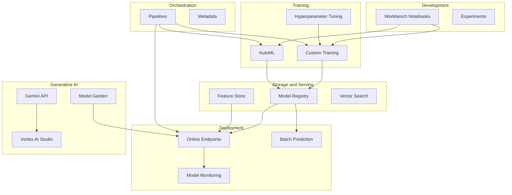
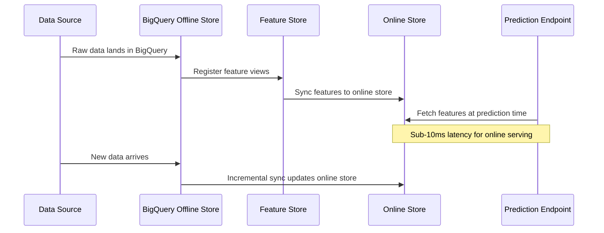
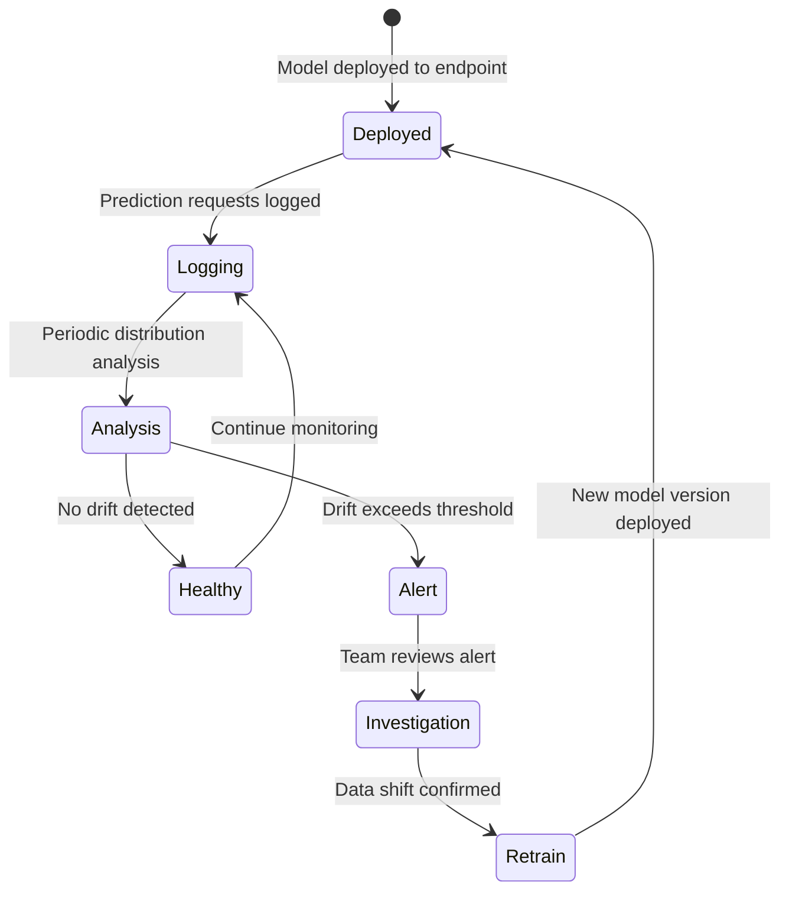
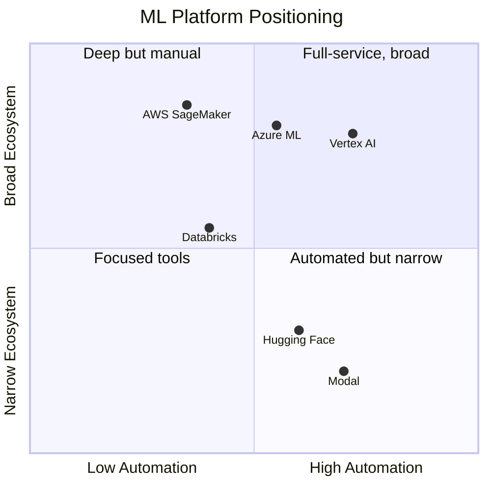

# Vertex AI: The Complete GCP ML Platform from the CLI

The first time you open the Vertex AI section in the Google Cloud Console, you encounter a sidebar with more than twenty entries. Workbench. Training. Pipelines. Feature Store. Model Registry. Endpoints. Vector Search. Model Garden. Vertex AI Studio. Agent Builder. Each one links to a distinct product with its own documentation, pricing page, and set of assumptions about what you are trying to build.

It is, frankly, overwhelming. And the Console UI, while polished, hides a critical reality: almost everything in Vertex AI maps to a `gcloud ai` command or a Python SDK call that you can script, version-control, and automate. The Console is for exploration. The CLI is for production.

This post is the map. We will walk through every major Vertex AI service, explain what it does, show the CLI commands and SDK calls that drive it, break down pricing so you know what you are committing to before you spin anything up, and connect the pieces so you can see how they fit into an end-to-end ML workflow. If you are evaluating Vertex AI against SageMaker or Azure ML, or if you are already on GCP and want to understand the full surface area, this is the reference you need.

---

## Prerequisites: Setting Up the CLI

Before touching any Vertex AI service, you need three things configured.

```bash
# Install or update the gcloud CLI
gcloud components update

# Authenticate
gcloud auth login
gcloud auth application-default login

# Set project and region
gcloud config set project my-ml-project
gcloud config set ai/region us-central1

# Enable the Vertex AI API
gcloud services enable aiplatform.googleapis.com

# Enable additional APIs you will likely need
gcloud services enable \
  notebooks.googleapis.com \
  compute.googleapis.com \
  storage.googleapis.com \
  bigquery.googleapis.com
```

The `ai/region` config is important. Vertex AI services are regional, and pricing varies by region. `us-central1` is typically the cheapest and has the broadest feature availability. Every `gcloud ai` command accepts a `--region` flag that overrides this default.

A common pattern is to create a dedicated configuration for ML work:

```bash
# Create a named configuration for ML projects
gcloud config configurations create ml-dev
gcloud config set project my-ml-project
gcloud config set ai/region us-central1
gcloud config set compute/region us-central1

# Switch between configurations
gcloud config configurations activate ml-dev
gcloud config configurations activate default
```

You will also want to set up a service account for programmatic access, especially for training jobs and pipelines that need to read from Cloud Storage and write to BigQuery:

```bash
# Create a service account
gcloud iam service-accounts create vertex-ai-sa \
  --display-name="Vertex AI Service Account"

# Grant necessary roles
gcloud projects add-iam-policy-binding my-ml-project \
  --member="serviceAccount:vertex-ai-sa@my-ml-project.iam.gserviceaccount.com" \
  --role="roles/aiplatform.user"

gcloud projects add-iam-policy-binding my-ml-project \
  --member="serviceAccount:vertex-ai-sa@my-ml-project.iam.gserviceaccount.com" \
  --role="roles/storage.objectAdmin"
```

---

## The Vertex AI Landscape

Before diving into individual services, it helps to see how they connect. Vertex AI is not a single product but an orchestration layer across the ML lifecycle.



Every box in that diagram is a billable service. Understanding the pricing model for each one is as important as understanding the functionality.

The mental model for navigating this landscape is the ML lifecycle. You start in **Development** (Workbench, Experiments) where you explore data and prototype models interactively. You move to **Training** (Custom Training, AutoML, HP Tuning) where you run reproducible training jobs at scale. Trained models land in **Storage** (Model Registry, Feature Store, Vector Search) where they are versioned and served alongside their features. You deploy to **Endpoints** (online prediction, batch prediction) where models serve traffic. You watch them with **Monitoring** (drift detection, skew detection) to catch degradation. And you tie the whole thing together with **Orchestration** (Pipelines, Metadata) to automate the cycle.

The **Generative AI** block sits somewhat apart. Model Garden, Vertex AI Studio, and the Gemini API are consumer-facing services that do not require you to train anything -- you call pre-trained models directly. But they integrate with the rest of the platform: you can fine-tune Gemini models using Custom Training infrastructure, serve them through Endpoints, and monitor them with the same tooling.

Understanding which services are "always-on" (and therefore continuously billing) versus "job-based" (billing only during execution) is the single most important distinction for cost management. We will flag this for every service below.

---

## Workbench: Managed Notebooks

Vertex AI Workbench provides managed JupyterLab instances that come pre-installed with the ML frameworks and GCP SDKs you need. The old "managed notebooks" option was deprecated in January 2025 -- what remains are Workbench Instances, which give you a full Compute Engine VM running JupyterLab with direct access to GCP services.

### CLI Commands

```bash
# Create a workbench instance
gcloud workbench instances create my-notebook \
  --location=us-central1-a \
  --machine-type=n1-standard-4 \
  --accelerator-type=NVIDIA_TESLA_T4 \
  --accelerator-core-count=1

# List instances
gcloud workbench instances list --location=us-central1-a

# Start/stop to control costs
gcloud workbench instances stop my-notebook --location=us-central1-a
gcloud workbench instances start my-notebook --location=us-central1-a

# Delete when done
gcloud workbench instances delete my-notebook --location=us-central1-a
```

### What You Pay

Workbench pricing is Compute Engine pricing. You pay for the VM while it is running, including idle time. A few representative costs in `us-central1`:

| Machine Type | vCPUs | RAM | Cost/Hour |
|---|---|---|---|
| n1-standard-4 | 4 | 15 GB | ~$0.19 |
| n1-standard-8 | 8 | 30 GB | ~$0.38 |
| n1-highmem-4 | 4 | 26 GB | ~$0.24 |
| e2-standard-4 | 4 | 16 GB | ~$0.13 |

Adding a T4 GPU adds approximately $0.25/hour. An A100 adds approximately $3.06/hour. The most common mistake is forgetting to stop notebooks when you are done -- an idle n1-standard-8 with a T4 costs roughly $460/month if left running.

### When to Use It

Use Workbench for interactive exploration, prototyping, and small-scale experiments. For production training, move to Custom Training jobs, which spin up compute only for the duration of the job and shut down automatically.

One useful pattern: develop your training code in a Workbench notebook, then extract it into a Python package and submit it as a Custom Training job. The notebook gives you fast iteration; the training job gives you reproducibility and cost control. You can even use Workbench to submit training jobs directly:

```python
from google.cloud import aiplatform

aiplatform.init(project="my-project", location="us-central1")

# Submit a training job from within a notebook
job = aiplatform.CustomJob.from_local_script(
    display_name="train-from-notebook",
    script_path="train.py",
    container_uri="us-docker.pkg.dev/vertex-ai/training/tf-gpu.2-15:latest",
    requirements=["pandas", "scikit-learn"],
    machine_type="n1-standard-8",
    accelerator_type="NVIDIA_TESLA_T4",
    accelerator_count=1,
)
job.run()
```

This keeps your development loop tight while maintaining the separation between interactive development and reproducible training.

---

## Custom Training

Custom Training is the workhorse of Vertex AI. You define a training job -- a Docker container, a Python package, or a pre-built container with your script -- and Vertex AI provisions the compute, runs the job, and tears down the infrastructure when it finishes.

### CLI Commands

```bash
# Submit a custom training job with a pre-built container
gcloud ai custom-jobs create \
  --region=us-central1 \
  --display-name=train-xgboost-v1 \
  --worker-pool-spec=machine-type=n1-standard-8,\
replica-count=1,\
accelerator-type=NVIDIA_TESLA_T4,\
accelerator-count=1,\
container-image-uri=us-docker.pkg.dev/vertex-ai/training/sklearn-cpu.1-3:latest \
  --args=--epochs=50,--learning-rate=0.01

# Submit with a custom container
gcloud ai custom-jobs create \
  --region=us-central1 \
  --display-name=train-custom-model \
  --worker-pool-spec=machine-type=n1-standard-8,\
replica-count=1,\
container-image-uri=gcr.io/my-project/my-training:v1

# List jobs
gcloud ai custom-jobs list --region=us-central1

# Describe a specific job
gcloud ai custom-jobs describe JOB_ID --region=us-central1

# Stream logs
gcloud ai custom-jobs stream-logs JOB_ID --region=us-central1
```

### Distributed Training

For large models, you can specify multiple worker pools:

```bash
gcloud ai custom-jobs create \
  --region=us-central1 \
  --display-name=distributed-training \
  --worker-pool-spec=machine-type=n1-standard-8,\
replica-count=1,\
accelerator-type=NVIDIA_TESLA_V100,\
accelerator-count=2,\
container-image-uri=gcr.io/my-project/trainer:v1 \
  --worker-pool-spec=machine-type=n1-standard-8,\
replica-count=3,\
accelerator-type=NVIDIA_TESLA_V100,\
accelerator-count=2,\
container-image-uri=gcr.io/my-project/trainer:v1
```

The first `--worker-pool-spec` is the chief worker. Additional specs define worker replicas, parameter servers, or evaluators.

### Hyperparameter Tuning

```bash
# Create a hyperparameter tuning job
gcloud ai hp-tuning-jobs create \
  --region=us-central1 \
  --display-name=tune-xgboost \
  --config=hp_tuning_config.yaml \
  --max-trial-count=20 \
  --parallel-trial-count=5
```

The config YAML defines the search space:

```yaml
studySpec:
  metrics:
    - metricId: accuracy
      goal: MAXIMIZE
  parameters:
    - parameterId: learning_rate
      doubleValueSpec:
        minValue: 0.001
        maxValue: 0.1
    - parameterId: max_depth
      integerValueSpec:
        minValue: 3
        maxValue: 10
  algorithm: ALGORITHM_UNSPECIFIED  # Bayesian optimization by default
trialJobSpec:
  workerPoolSpecs:
    - machineSpec:
        machineType: n1-standard-4
      replicaCount: 1
      containerSpec:
        imageUri: gcr.io/my-project/trainer:v1
```

### Pricing

Custom Training charges have two components: compute infrastructure (Compute Engine pricing for the machine type and accelerators) plus a Vertex AI management fee. Representative costs in `us-central1`:

| Resource | Compute/Hour | Management Fee/Hour | Total/Hour |
|---|---|---|---|
| n1-standard-4 | $0.19 | $0.04 | $0.23 |
| n1-standard-8 | $0.38 | $0.08 | $0.46 |
| n1-standard-8 + T4 | $0.63 | $0.08 | $0.71 |
| n1-standard-8 + A100 | $3.44 | $0.44 | $3.88 |
| a2-highgpu-1g (A100 40GB) | $3.67 | $0.44 | $4.11 |

Billing is in 30-second increments, which means short jobs are not penalized with a full-hour minimum. Hyperparameter tuning jobs charge the same per-trial rates -- a 20-trial job running 5 in parallel at $0.71/hour costs roughly $0.71 x 4 hours x 5 parallel = $14.20 if each trial takes 1 hour (trials vary, so this is approximate).

### Training with Spot VMs

For fault-tolerant training jobs (especially hyperparameter tuning where individual trials can restart), spot VMs offer 60-91% cost savings:

```bash
gcloud ai custom-jobs create \
  --region=us-central1 \
  --display-name=train-with-spot \
  --worker-pool-spec=machine-type=n1-standard-8,\
replica-count=1,\
accelerator-type=NVIDIA_TESLA_T4,\
accelerator-count=1,\
container-image-uri=gcr.io/my-project/trainer:v1 \
  --scheduling-strategy=SPOT
```

An A100 that normally costs $3.88/hour drops to approximately $1.17/hour with spot pricing. The trade-off is that your job can be preempted at any time, so your training code needs to support checkpointing and resumption. For most modern frameworks (PyTorch Lightning, TensorFlow with callbacks), this is straightforward.

### Pre-built Containers vs Custom Containers

Vertex AI offers pre-built containers for common frameworks:

| Framework | Container URI Pattern |
|---|---|
| TensorFlow | `us-docker.pkg.dev/vertex-ai/training/tf-gpu.2-15:latest` |
| PyTorch | `us-docker.pkg.dev/vertex-ai/training/pytorch-gpu.2-3:latest` |
| Scikit-learn | `us-docker.pkg.dev/vertex-ai/training/sklearn-cpu.1-3:latest` |
| XGBoost | `us-docker.pkg.dev/vertex-ai/training/xgboost-cpu.2-0:latest` |

Pre-built containers save you the effort of maintaining Docker images but limit you to the installed package versions. For production workloads with specific dependency requirements, custom containers give you full control. The pattern is to use pre-built containers during prototyping and switch to custom containers when you need reproducibility guarantees.

---

## AutoML

AutoML is Vertex AI's no-code/low-code training option. You provide a labeled dataset, select a task type, and AutoML searches over architectures and hyperparameters to produce a trained model. It supports tabular classification/regression, image classification/object detection, text classification/sentiment/entity extraction, and video classification/action recognition.

### CLI Commands

```bash
# Create a dataset for tabular data
gcloud ai datasets create \
  --region=us-central1 \
  --display-name=churn-dataset \
  --metadata-schema-uri=gs://google-cloud-aiplatform/schema/dataset/metadata/tabular_1.0.0.yaml

# Import data
gcloud ai datasets import DATA_SET_ID \
  --region=us-central1 \
  --import-schema-uri=gs://google-cloud-aiplatform/schema/dataset/ioformat/table_io_format_1.0.0.yaml \
  --gcs-source=gs://my-bucket/data/churn.csv

# Start AutoML training
gcloud ai models create \
  --region=us-central1 \
  --display-name=churn-predictor \
  --dataset=DATA_SET_ID \
  --training-budget=1000 \
  --model-type=CLOUD
```

### Python SDK Alternative

For AutoML, the Python SDK is often more practical:

```python
from google.cloud import aiplatform

aiplatform.init(project="my-project", location="us-central1")

dataset = aiplatform.TabularDataset.create(
    display_name="churn-dataset",
    gcs_source="gs://my-bucket/data/churn.csv",
)

job = aiplatform.AutoMLTabularTrainingJob(
    display_name="churn-predictor",
    optimization_prediction_type="classification",
    optimization_objective="maximize-au-roc",
)

model = job.run(
    dataset=dataset,
    target_column="churned",
    training_fraction_split=0.8,
    validation_fraction_split=0.1,
    test_fraction_split=0.1,
    budget_milli_node_hours=1000,  # 1 node-hour
)
```

### Pricing

AutoML pricing varies significantly by data type:

| Data Type | Training Cost/Hour | Prediction (Deployed Endpoint) |
|---|---|---|
| Tabular | ~$21.25/node-hour | Same as custom endpoints |
| Image | ~$3.47/node-hour | ~$1.38/node-hour |
| Text | ~$3.47/node-hour | ~$1.38/node-hour |
| Video | ~$3.47/node-hour | ~$1.38/node-hour |

Tabular AutoML is substantially more expensive because it searches over a larger architecture space. A typical tabular training run with a budget of 2-4 node-hours costs $42-85. Image and text training is cheaper but often requires more node-hours to converge.

### When AutoML Makes Sense

AutoML is not a toy. For structured/tabular data, Vertex AI AutoML consistently produces models that compete with hand-tuned XGBoost or LightGBM pipelines. The internal search explores ensembles of gradient-boosted trees, neural architectures, and feature engineering strategies that would take an ML engineer days to replicate manually.

The decision framework is straightforward: if the cost of ML engineer time to build and tune a custom model exceeds the cost of AutoML training, start with AutoML. If AutoML reaches 95% of your target metric and the remaining 5% does not justify the engineering investment, stay with AutoML. If you need custom architectures, specialized loss functions, or non-standard preprocessing that AutoML cannot express, move to Custom Training.

In practice, many production systems at mid-size companies run on AutoML models. The engineering time saved on model development can be redirected toward data quality, feature engineering, and monitoring -- work that has a higher marginal return on model performance than architecture tuning in most cases.

---

## Model Registry and Endpoints

The Model Registry is where trained models live. Every model you train -- whether through Custom Training, AutoML, or imported from elsewhere -- gets registered here with version tracking, metadata, and lineage.

### Registering and Managing Models

```bash
# Upload a model to the registry
gcloud ai models upload \
  --region=us-central1 \
  --display-name=churn-model-v2 \
  --container-image-uri=us-docker.pkg.dev/vertex-ai/prediction/sklearn-cpu.1-3:latest \
  --artifact-uri=gs://my-bucket/models/churn-v2/

# List models
gcloud ai models list --region=us-central1

# Describe a model (shows versions, endpoints)
gcloud ai models describe MODEL_ID --region=us-central1

# List model versions
gcloud ai models list-versions MODEL_ID --region=us-central1
```

### Online Endpoints

Endpoints serve predictions in real time. You create an endpoint, deploy one or more model versions to it, and optionally split traffic between versions for canary deployments or A/B testing.

```bash
# Create an endpoint
gcloud ai endpoints create \
  --region=us-central1 \
  --display-name=churn-endpoint

# Deploy a model to the endpoint
gcloud ai endpoints deploy-model ENDPOINT_ID \
  --region=us-central1 \
  --model=MODEL_ID \
  --display-name=churn-v2-deployment \
  --machine-type=n1-standard-2 \
  --min-replica-count=1 \
  --max-replica-count=3 \
  --traffic-split=0=100

# Split traffic between two model versions (canary)
gcloud ai endpoints deploy-model ENDPOINT_ID \
  --region=us-central1 \
  --model=MODEL_ID_V3 \
  --display-name=churn-v3-canary \
  --machine-type=n1-standard-2 \
  --min-replica-count=1 \
  --max-replica-count=1 \
  --traffic-split=0=90,DEPLOYED_MODEL_ID_V3=10

# Make a prediction
curl -X POST \
  -H "Authorization: Bearer $(gcloud auth print-access-token)" \
  -H "Content-Type: application/json" \
  "https://us-central1-aiplatform.googleapis.com/v1/projects/my-project/locations/us-central1/endpoints/ENDPOINT_ID:predict" \
  -d '{"instances": [{"feature1": 0.5, "feature2": "category_a"}]}'

# Undeploy to stop charges
gcloud ai endpoints undeploy-model ENDPOINT_ID \
  --region=us-central1 \
  --deployed-model-id=DEPLOYED_MODEL_ID
```

### Batch Prediction

For high-volume, latency-tolerant predictions:

```bash
gcloud ai batch-prediction-jobs create \
  --region=us-central1 \
  --display-name=churn-batch-march \
  --model=MODEL_ID \
  --input-format=jsonl \
  --input-path=gs://my-bucket/batch-input/*.jsonl \
  --output-uri-prefix=gs://my-bucket/batch-output/ \
  --machine-type=n1-standard-4
```

### Endpoint Pricing

This is where Vertex AI costs can surprise you. **You pay for deployed endpoints whether or not they receive traffic.** A model deployed to an `n1-standard-2` endpoint costs approximately $0.10/hour, which is $72/month. If you forget to undeploy, you pay continuously.

| Endpoint Machine | Cost/Hour | Cost/Month (24/7) |
|---|---|---|
| e2-standard-2 | ~$0.08 | ~$58 |
| n1-standard-2 | ~$0.10 | ~$72 |
| n1-standard-4 | ~$0.19 | ~$137 |
| n1-standard-4 + T4 | ~$0.44 | ~$317 |

Autoscaling to zero replicas is available with `--min-replica-count=0`, but cold starts add 30-60 seconds of latency on the first request.

Batch prediction charges only for the duration of the job, making it much cheaper for non-real-time workloads.

### Private Endpoints

For production deployments in enterprise environments, you can create private endpoints that are accessible only within your VPC:

```bash
# Create a private endpoint
gcloud ai endpoints create \
  --region=us-central1 \
  --display-name=churn-private-endpoint \
  --network=projects/PROJECT_NUMBER/global/networks/my-vpc
```

Private endpoints add VPC peering setup complexity but eliminate public internet exposure. They are required in regulated industries (finance, healthcare) where prediction data cannot traverse public networks. The pricing is the same as public endpoints -- the network configuration adds no additional Vertex AI cost, though you may incur standard VPC networking charges.

### Model Versioning Strategy

The Model Registry supports multiple versions per model, each with its own artifacts and metadata. A practical versioning strategy is to tag versions by purpose:

```bash
# Upload a new version of an existing model
gcloud ai models upload \
  --region=us-central1 \
  --display-name=churn-model \
  --version-aliases=champion,v3 \
  --container-image-uri=us-docker.pkg.dev/vertex-ai/prediction/sklearn-cpu.1-3:latest \
  --artifact-uri=gs://my-bucket/models/churn-v3/

# Deploy using alias instead of numeric ID
# The "champion" alias always points to the current production version
# When you promote a new version, update the alias rather than redeploying
```

---

## Pipelines

Vertex AI Pipelines runs ML workflows defined using the Kubeflow Pipelines (KFP) SDK or TFX. A pipeline is a DAG of containerized steps -- data preprocessing, training, evaluation, deployment -- that Vertex AI orchestrates as a managed service.

### Defining a Pipeline (Python SDK)

```python
from kfp import dsl
from kfp.dsl import component
from google.cloud import aiplatform

@component(base_image="python:3.11-slim", packages_to_install=["pandas", "scikit-learn"])
def train_model(dataset_uri: str, model_output: dsl.OutputPath("Model")):
    import pandas as pd
    from sklearn.ensemble import GradientBoostingClassifier
    import pickle

    df = pd.read_csv(dataset_uri)
    X, y = df.drop("target", axis=1), df["target"]
    model = GradientBoostingClassifier(n_estimators=100)
    model.fit(X, y)

    with open(model_output, "wb") as f:
        pickle.dump(model, f)

@component(base_image="python:3.11-slim")
def evaluate_model(model_path: dsl.InputPath("Model")) -> float:
    # Evaluation logic here
    return 0.92

@dsl.pipeline(name="training-pipeline")
def training_pipeline(dataset_uri: str):
    train_task = train_model(dataset_uri=dataset_uri)
    eval_task = evaluate_model(model_path=train_task.outputs["model_output"])

# Compile and submit
from kfp import compiler
compiler.Compiler().compile(training_pipeline, "pipeline.yaml")

aiplatform.init(project="my-project", location="us-central1")
job = aiplatform.PipelineJob(
    display_name="weekly-training",
    template_path="pipeline.yaml",
    parameter_values={"dataset_uri": "gs://my-bucket/data/latest.csv"},
)
job.run()
```

### CLI Commands

```bash
# Submit a compiled pipeline
gcloud ai pipeline-jobs create \
  --region=us-central1 \
  --display-name=weekly-training \
  --template-uri=gs://my-bucket/pipelines/pipeline.yaml \
  --parameter-values='{"dataset_uri": "gs://my-bucket/data/latest.csv"}'

# List pipeline runs
gcloud ai pipeline-jobs list --region=us-central1

# Describe a run
gcloud ai pipeline-jobs describe PIPELINE_JOB_ID --region=us-central1

# Cancel a running pipeline
gcloud ai pipeline-jobs cancel PIPELINE_JOB_ID --region=us-central1
```

### Scheduling Pipelines

```bash
# Create a recurring schedule
gcloud ai pipeline-jobs create \
  --region=us-central1 \
  --display-name=weekly-retrain \
  --template-uri=gs://my-bucket/pipelines/pipeline.yaml \
  --schedule="0 3 * * 1"  # Every Monday at 3am
```

### Pricing

Vertex AI Pipelines charges **$0.03 per pipeline run** as a management fee. The actual compute cost comes from the Compute Engine resources each pipeline component uses, billed at the same rates as Custom Training. A typical pipeline with three components running 30 minutes each on `n1-standard-4` machines costs roughly $0.03 + (3 x 0.5 x $0.23) = $0.38 total.

### Pipeline Best Practices

A few patterns that save time and money:

**Caching**: KFP supports component caching. If a component's inputs have not changed since the last run, it reuses the cached output instead of re-executing. This is invaluable for pipelines where the data preprocessing step takes 2 hours but only the training step changes between runs.

**Cost labels**: Vertex AI automatically labels pipeline resources with `vertex-ai-pipelines-run-billing-id`. Use this label to track costs per pipeline run in Cloud Billing exports to BigQuery. This gives you a clear view of which pipelines are consuming the most budget.

**Small components, big benefits**: Instead of building one monolithic training component, split your pipeline into focused steps -- data validation, feature engineering, training, evaluation, deployment. Each step can use different machine types (a large machine for training, a small one for evaluation), and failures in later steps do not require re-running earlier ones.

```bash
# Track pipeline costs using billing export
bq query --use_legacy_sql=false '
SELECT
  labels.value AS pipeline_run_id,
  SUM(cost) AS total_cost
FROM `my-project.billing_export.gcp_billing_export_v1_*`
CROSS JOIN UNNEST(labels) AS labels
WHERE labels.key = "vertex-ai-pipelines-run-billing-id"
GROUP BY pipeline_run_id
ORDER BY total_cost DESC
LIMIT 10
'
```

---

## Feature Store

Vertex AI Feature Store provides managed infrastructure for storing, serving, and sharing ML features. It uses BigQuery as the offline store and offers two options for online serving: an optimized proprietary store or Bigtable.



### CLI and SDK Setup

```python
from google.cloud import aiplatform

aiplatform.init(project="my-project", location="us-central1")

# Create a Feature Online Store (optimized serving)
from google.cloud.aiplatform_v1 import FeatureOnlineStoreServiceClient
from google.cloud.aiplatform_v1.types import feature_online_store as fos_types

client = FeatureOnlineStoreServiceClient(
    client_options={"api_endpoint": "us-central1-aiplatform.googleapis.com"}
)

online_store = client.create_feature_online_store(
    parent="projects/my-project/locations/us-central1",
    feature_online_store=fos_types.FeatureOnlineStore(
        optimized=fos_types.FeatureOnlineStore.Optimized(),
    ),
    feature_online_store_id="my-store",
)

# Create a Feature View from a BigQuery source
feature_view = client.create_feature_view(
    parent=f"projects/my-project/locations/us-central1/featureOnlineStores/my-store",
    feature_view=fos_types.FeatureView(
        big_query_source=fos_types.FeatureView.BigQuerySource(
            uri="bq://my-project.ml_features.user_features",
            entity_id_columns=["user_id"],
        ),
        sync_config=fos_types.FeatureView.SyncConfig(cron="0 */6 * * *"),
    ),
    feature_view_id="user-features",
)
```

### Pricing

| Component | Cost |
|---|---|
| Offline storage | BigQuery pricing (storage + queries) |
| Online serving (Optimized) | $0.38/node-hour |
| Online serving (Bigtable) | $1.20/node-hour |
| Data sync/ingestion | $0.10/node-hour |

The offline store uses BigQuery pricing directly -- roughly $0.02/GB/month for storage and $6.25/TB for queries. The online store runs continuously, so a single optimized node costs approximately $274/month. This makes Feature Store one of the more expensive "always-on" services in Vertex AI. Only use the online store if you genuinely need sub-10ms feature lookups at prediction time.

### Point-in-Time Lookups

One of the most important capabilities of Feature Store is point-in-time correctness. When you are building training datasets, you need features as they existed at the time of each training example -- not the current values. This prevents data leakage, which is one of the most common and insidious bugs in ML systems.

Feature Store handles this through BigQuery's time-travel capabilities in the offline store. When you create a training dataset, you provide entity IDs and timestamps, and Feature Store returns the feature values that were valid at each timestamp:

```python
# Fetch historical features for training with point-in-time correctness
from google.cloud.aiplatform_v1 import FeatureOnlineStoreServiceClient

# This happens in the offline store via BigQuery
training_query = """
SELECT
    e.user_id,
    e.event_timestamp,
    e.label,
    f.avg_session_duration,
    f.total_purchases_30d,
    f.days_since_last_login
FROM `my-project.events.training_events` e
LEFT JOIN `my-project.ml_features.user_features_history` f
ON e.user_id = f.entity_id
AND f.feature_timestamp <= e.event_timestamp
QUALIFY ROW_NUMBER() OVER (
    PARTITION BY e.user_id, e.event_timestamp
    ORDER BY f.feature_timestamp DESC
) = 1
"""
```

Without a feature store, this join logic must be implemented manually for every training dataset, and it is easy to get wrong. The Feature Store abstracts this into a managed operation, which is the primary reason teams adopt it despite the cost.

### Choosing Between Optimized and Bigtable Online Serving

The optimized online store is cheaper ($0.38/node-hour vs $1.20/node-hour) and handles most use cases. Choose Bigtable online serving when you need higher throughput (millions of reads per second), custom Bigtable configurations, or when you already have Bigtable infrastructure and want to consolidate. For most teams starting with Feature Store, the optimized option is the right default.

---

## Vector Search

Vector Search (formerly Matching Engine) is Google's managed approximate nearest neighbor (ANN) service, built on the ScaNN algorithm developed by Google Research. It is designed for high-throughput, low-latency similarity search over dense embeddings.

### How It Works

You create an index from a set of embedding vectors, deploy the index to an endpoint, and query it with a vector to retrieve the nearest neighbors. It supports tree-AH and brute-force index types, streaming updates for real-time index modifications, and filtering on metadata.

### CLI Commands

```bash
# Create an index
gcloud ai indexes create \
  --region=us-central1 \
  --display-name=product-embeddings \
  --metadata-file=index_metadata.json

# The metadata file specifies the index configuration
# {
#   "contentsDeltaUri": "gs://my-bucket/embeddings/",
#   "config": {
#     "dimensions": 768,
#     "approximateNeighborsCount": 150,
#     "distanceMeasureType": "DOT_PRODUCT_DISTANCE",
#     "algorithmConfig": {
#       "treeAhConfig": {
#         "leafNodeEmbeddingCount": 1000,
#         "leafNodesToSearchPercent": 10
#       }
#     }
#   }
# }

# Create an index endpoint
gcloud ai index-endpoints create \
  --region=us-central1 \
  --display-name=product-search-endpoint \
  --network=projects/PROJECT_NUMBER/global/networks/my-vpc

# Deploy the index
gcloud ai index-endpoints deploy-index INDEX_ENDPOINT_ID \
  --region=us-central1 \
  --index=INDEX_ID \
  --deployed-index-id=product-search-v1 \
  --display-name=product-search-v1 \
  --machine-type=e2-standard-16 \
  --min-replica-count=1 \
  --max-replica-count=3

# Query via SDK
```

### Python Query Example

```python
from google.cloud import aiplatform

my_index_endpoint = aiplatform.MatchingEngineIndexEndpoint(
    index_endpoint_name="INDEX_ENDPOINT_ID"
)

response = my_index_endpoint.find_neighbors(
    deployed_index_id="product-search-v1",
    queries=[query_embedding],  # List of embedding vectors
    num_neighbors=10,
)

for neighbor in response[0]:
    print(f"ID: {neighbor.id}, Distance: {neighbor.distance}")
```

### Pricing

Vector Search pricing depends on the deployed infrastructure:

| Component | Cost |
|---|---|
| Index building | Compute Engine pricing for the build job |
| Deployed endpoint (e2-standard-16) | ~$0.54/hour (~$389/month) |
| Deployed endpoint (e2-standard-2) | ~$0.08/hour (~$58/month) |
| Storage | Standard GCS pricing |

Like prediction endpoints, you pay for deployed indexes whether or not they receive queries. For development, use the smallest machine type and scale up for production. Vector Search also offers a $1,000 free trial credit for new users.

### When to Use Vector Search vs Alternatives

Vector Search makes sense when you need sub-10ms latency at high QPS over millions of vectors. For smaller datasets (under 100K vectors), consider using BigQuery's built-in vector search or AlloyDB's pgvector extension, both of which avoid the cost of a dedicated deployed endpoint. For prototyping, the Vertex AI RAG Engine integrates Vector Search with Gemini and handles index management automatically, though at the cost of less control over index configuration.

The ScaNN algorithm underneath Vector Search uses a technique called anisotropic quantization -- instead of treating all components of a vector equally during compression, it penalizes errors in the direction of the query vector more heavily than errors in the orthogonal direction. This matters because the inner product (the relevance metric) depends only on the parallel component. The result is significantly better recall at the same compression ratio compared to standard product quantization, which is why Vector Search consistently ranks near the top of ANN benchmarks.

---

## Generative AI on Vertex

This is where Vertex AI has expanded most aggressively. The generative AI surface includes Model Garden, Vertex AI Studio, and direct API access to Gemini and partner models.

### Model Garden

Model Garden is a catalog of 200+ foundation models you can deploy to endpoints. It includes Google's own models (Gemini, Imagen, Chirp), open models (Llama, Mistral, Falcon), and partner models (Claude on Vertex via the Anthropic partnership). You can deploy, fine-tune, or evaluate any model directly from the catalog.

```bash
# List available models in Model Garden
gcloud ai models list --region=us-central1

# Deploy a Model Garden model to an endpoint
gcloud ai endpoints deploy-model ENDPOINT_ID \
  --region=us-central1 \
  --model=publishers/google/models/gemini-2.5-flash \
  --display-name=gemini-flash-deployment
```

### Vertex AI Studio

Vertex AI Studio is the Console UI for interacting with generative models. You can test prompts, compare model outputs, configure system instructions, and build chat applications -- all without code. Think of it as a playground for prompt engineering that also generates the API calls you need for production.

### Gemini API on Vertex

```python
from google.cloud import aiplatform
import vertexai
from vertexai.generative_models import GenerativeModel

vertexai.init(project="my-project", location="us-central1")

model = GenerativeModel("gemini-2.5-pro")

response = model.generate_content(
    "Explain gradient descent in three sentences.",
    generation_config={
        "temperature": 0.3,
        "max_output_tokens": 256,
    },
)
print(response.text)
```

For batch inference with Gemini:

```bash
gcloud ai batch-prediction-jobs create \
  --region=us-central1 \
  --display-name=gemini-batch-summaries \
  --model=publishers/google/models/gemini-2.5-flash \
  --input-format=jsonl \
  --input-path=gs://my-bucket/prompts.jsonl \
  --output-uri-prefix=gs://my-bucket/responses/
```

### Generative AI Pricing

Token-based pricing varies by model. As of early 2027:

| Model | Input (per 1M tokens) | Output (per 1M tokens) | Context Window |
|---|---|---|---|
| Gemini 2.5 Pro | $1.25 | $10.00 | 1M tokens |
| Gemini 2.5 Pro (over 200K) | $2.50 | $15.00 | 1M tokens |
| Gemini 2.5 Flash | $0.30 | $2.50 | 1M tokens |
| Gemini 2.5 Flash-Lite | $0.05 | $0.30 | 1M tokens |
| Gemini 3.1 Pro | $2.00 | $12.00 | 1M tokens |
| Imagen 3 | $0.03/image | $0.03/image | - |

Gemini 2.5 Flash-Lite is aggressively priced and suitable for high-throughput tasks where you need multimodal understanding at scale without premium reasoning. For comparison, OpenAI's GPT-4o is priced at $2.50/$10.00 per million tokens, and Claude 3.5 Sonnet on Vertex is $3.00/$15.00.

### Model Tuning

You can fine-tune Gemini models on Vertex AI:

```python
from vertexai.tuning import sft

tuning_job = sft.train(
    source_model="gemini-2.5-flash",
    train_dataset="gs://my-bucket/tuning/train.jsonl",
    validation_dataset="gs://my-bucket/tuning/val.jsonl",
    tuned_model_display_name="my-tuned-flash",
    epochs=3,
)
```

Tuning costs vary by model and dataset size, typically $2-8 per million training tokens depending on the base model.

### Agent Builder and Agent Engine

One of the most significant additions to Vertex AI in 2025-2026 is the Agent Builder platform. Agent Designer provides a low-code visual interface for designing and testing AI agents. Agent Engine, now generally available, provides sessions, memory management, and code execution capabilities for building conversational agents and multi-step AI workflows.

```python
from vertexai import agent_engines

# Create an agent with tools
agent = agent_engines.Agent(
    model="gemini-2.5-flash",
    system_instruction="You are a helpful data analysis assistant.",
    tools=[search_tool, calculator_tool],
)

# Deploy as a managed agent engine
engine = agent_engines.create(
    agent=agent,
    display_name="data-analyst-agent",
)
```

Agent Engine sessions and memory began charging usage fees in February 2026, adding another billable dimension to the generative AI surface. The pricing is based on session duration and memory storage, typically $0.01-0.05 per session depending on complexity and duration.

### Vertex AI vs Direct Gemini API

A common question: why use Gemini through Vertex AI instead of the Gemini Developer API directly? The answer is enterprise controls. Vertex AI adds VPC Service Controls, Customer-Managed Encryption Keys (CMEK), audit logging, IAM-based access control, data residency guarantees, and consolidated billing through your GCP organization. The token pricing is nearly identical between the two APIs, but Vertex AI adds meters for tuning, evaluation, and batch prediction that the Developer API does not offer. If you are building a personal project, the Developer API is simpler. If you are building for an organization with compliance requirements, Vertex AI is the only option.

---

## Model Monitoring

Model Monitoring watches deployed models for feature skew (training-serving skew) and prediction drift (distribution changes over time). When distributions shift beyond a configurable threshold, it triggers alerts.



### Setting Up Monitoring

```bash
# Create a model monitoring job
gcloud ai model-monitoring-jobs create \
  --region=us-central1 \
  --display-name=churn-monitor \
  --endpoint=ENDPOINT_ID \
  --prediction-sampling-rate=0.1 \
  --monitoring-frequency=24 \
  --feature-thresholds=age=0.3,income=0.3,tenure=0.2 \
  --emails=ml-alerts@company.com
```

### Python SDK Configuration

```python
from google.cloud import aiplatform

# Configure monitoring for an endpoint
objective_config = aiplatform.ModelDeploymentMonitoringObjectiveConfig(
    deployed_model_id="DEPLOYED_MODEL_ID",
    objective_config={
        "training_dataset": {
            "gcs_source": {"uris": ["gs://my-bucket/training-data/"]},
            "data_format": "csv",
            "target_field": "churned",
        },
        "training_prediction_skew_detection_config": {
            "skew_thresholds": {
                "age": {"value": 0.3},
                "income": {"value": 0.3},
            }
        },
        "prediction_drift_detection_config": {
            "drift_thresholds": {
                "age": {"value": 0.2},
                "income": {"value": 0.2},
            }
        },
    },
)
```

### What It Detects

- **Feature skew**: Compares training data distributions against live prediction input distributions. Catches cases where your training data does not represent production traffic.
- **Prediction drift**: Compares prediction input distributions between two consecutive time windows. Catches gradual distribution shifts that degrade model performance.
- **Feature attribution drift**: Monitors changes in feature importance over time using Vertex Explainable AI.

### Pricing

Model Monitoring uses Compute Engine resources for analysis jobs. The cost depends on how frequently you run monitoring (the `--monitoring-frequency` flag, in hours) and the volume of predictions logged. Typical costs are $5-15/month for a low-traffic endpoint with daily monitoring. Prediction logging itself uses BigQuery, adding standard query and storage costs.

### Monitoring in Practice

The most common monitoring setup logs 10% of prediction requests (`--prediction-sampling-rate=0.1`), runs analysis every 24 hours, and alerts when any feature distribution deviates by more than 0.3 (measured by Jensen-Shannon divergence for numerical features and L-infinity distance for categorical features). These thresholds need calibration -- too sensitive and you get alert fatigue, too loose and you miss real drift.

A practical pattern is to connect Model Monitoring alerts to a Vertex AI Pipeline. When drift is detected, the alert triggers a Cloud Function that submits a retraining pipeline job. The pipeline reads fresh data, trains a new model version, evaluates it against a holdout set, and -- if the evaluation passes -- promotes the new version to the endpoint with a canary traffic split. This creates a semi-automated feedback loop where drift detection leads to model updates without requiring an engineer to manually retrain.

```bash
# Check monitoring job status
gcloud ai model-monitoring-jobs list --region=us-central1

# Pause monitoring (to save costs during development)
gcloud ai model-monitoring-jobs pause MONITORING_JOB_ID \
  --region=us-central1

# Resume monitoring
gcloud ai model-monitoring-jobs resume MONITORING_JOB_ID \
  --region=us-central1
```

### Vertex AI Experiments

Before deploying any model to production, Vertex AI Experiments provides a tracking framework for comparing training runs. It logs hyperparameters, metrics, and artifacts across multiple runs so you can compare model versions systematically:

```python
from google.cloud import aiplatform

aiplatform.init(
    project="my-project",
    location="us-central1",
    experiment="churn-experiment",
)

# Start a run
with aiplatform.start_run("xgboost-v3") as run:
    run.log_params({
        "learning_rate": 0.05,
        "max_depth": 7,
        "n_estimators": 200,
    })

    # ... training code ...

    run.log_metrics({
        "accuracy": 0.89,
        "f1_score": 0.84,
        "auc_roc": 0.93,
    })

# Compare runs
experiment_df = aiplatform.get_experiment_df("churn-experiment")
print(experiment_df[["run_name", "param.learning_rate", "metric.auc_roc"]])
```

Experiments are free -- you pay only for the underlying storage of logged artifacts in Cloud Storage. This makes it one of the few Vertex AI services with no direct cost beyond infrastructure.

---

## Cost Management Across Services

After mapping every service, the pricing patterns become clear. Vertex AI costs fall into four categories:

| Pricing Pattern | Services | Key Risk |
|---|---|---|
| Per-hour, always-on | Endpoints, Vector Search, Feature Store online, Workbench | Idle resources drain budget |
| Per-hour, job-based | Custom Training, AutoML, Batch Prediction, HP Tuning | Long training runs |
| Per-unit | Generative AI (per token), Pipelines (per run) | High-volume usage |
| Pass-through | Feature Store offline (BigQuery), Storage (GCS) | Data growth |

### Budget Alerts

```bash
# Set a budget alert (uses gcloud billing, not gcloud ai)
gcloud billing budgets create \
  --billing-account=BILLING_ACCOUNT_ID \
  --display-name=vertex-ai-monthly \
  --budget-amount=500 \
  --threshold-rules=percent=50,basis=CURRENT_SPEND \
  --threshold-rules=percent=90,basis=CURRENT_SPEND \
  --filter-services=services/aiplatform.googleapis.com
```

### Cost Optimization Strategies

1. **Use `--min-replica-count=0`** for endpoints with sporadic traffic. You pay nothing when idle, at the cost of cold-start latency.
2. **Stop Workbench instances** when not in use. Automate this with Cloud Scheduler + Cloud Functions.
3. **Use preemptible/spot VMs** for training jobs that can tolerate interruptions: add `--enable-spot-vm` to training commands for 60-91% discounts.
4. **Right-size endpoints**. Start with `e2-standard-2` and scale up only if latency requirements demand it.
5. **Batch over online**. If your use case tolerates minutes of latency, batch prediction is dramatically cheaper than maintaining a live endpoint.
6. **Committed Use Discounts (CUDs)**. For sustained workloads, 1-year commitments save 20-30% on Compute Engine resources used by Vertex AI.

### Platform Comparison

How does Vertex AI compare to the competition on cost and capabilities?



| Aspect | Vertex AI | SageMaker | Azure ML |
|---|---|---|---|
| AutoML | Best-in-class, especially tabular | Good, less automated | Strong, with Responsible AI focus |
| Custom Training | Solid, simple CLI | Most flexible, complex | Enterprise governance |
| Gen AI | Gemini native, Model Garden | Bedrock (separate service) | Azure OpenAI (separate service) |
| Pricing model | Per-hour + management fee | Per-hour, no extra fee | Per-hour, varies by tier |
| Free tier | $300 GCP credit + per-service credits | Free tier limited | $200 Azure credit |
| Best for | GCP-native teams, AutoML, Gemini | AWS shops, maximum flexibility | Microsoft shops, regulated industries |

The biggest differentiator for Vertex AI in 2026 is the native Gemini integration. If your workload involves generative AI -- and increasingly, most workloads do -- having the model API, fine-tuning infrastructure, evaluation tools, and deployment platform in the same environment eliminates significant integration overhead. SageMaker has Bedrock, and Azure has Azure OpenAI, but both are separate services with their own billing, IAM, and operational patterns. Vertex AI treats generative AI as a first-class citizen of the same platform that handles traditional ML.

The biggest risk with Vertex AI is GCP lock-in. While models trained on Vertex can be exported and deployed elsewhere (they are standard TensorFlow, PyTorch, or scikit-learn artifacts), the orchestration layer -- Pipelines, Feature Store, Model Monitoring, Endpoints -- is deeply GCP-specific. Migrating a full Vertex AI MLOps setup to another cloud is a multi-month engineering project. If multi-cloud is a hard requirement, consider using cloud-agnostic tools (MLflow, Kubeflow on self-managed Kubernetes, Feast for feature store) and using Vertex AI only for compute.

### Estimating Your Monthly Bill

Here is a realistic monthly cost breakdown for a mid-size ML team running two models in production:

| Service | Configuration | Monthly Cost |
|---|---|---|
| Workbench | 2 instances, n1-standard-4+T4, 8hr/day weekdays | ~$192 |
| Custom Training | 4 training runs/month, 2hr each, n1-standard-8+T4 | ~$23 |
| AutoML | 1 tabular run/month, 3 node-hours | ~$64 |
| Endpoints (Model A) | n1-standard-2, 24/7 | ~$72 |
| Endpoints (Model B) | n1-standard-4, autoscale 0-2 replicas | ~$35-137 |
| Pipelines | 30 runs/month | ~$1 |
| Feature Store online | 1 optimized node, 24/7 | ~$274 |
| Model Monitoring | 2 endpoints, daily analysis | ~$20 |
| Gemini API | 10M input + 2M output tokens/month (Flash) | ~$8 |
| Storage (GCS + BQ) | 500GB models + 1TB features | ~$25 |
| **Total** | | **~$714-779** |

This does not include network egress, Cloud Logging, or other ancillary GCP services. The Feature Store online node is the single largest line item -- if you do not need sub-10ms feature serving, eliminating it saves $274/month instantly.

### The Golden Rule of Vertex AI Costs

The pattern across every service is the same: **always-on resources are what kill budgets, not job-based compute.** A training job that costs $50 runs once and stops. An endpoint that costs $0.10/hour runs forever and costs $72/month. A Feature Store node that costs $0.38/hour runs forever and costs $274/month. The most impactful cost optimization is not finding cheaper machine types -- it is eliminating always-on resources you do not need.

Before you deploy anything to production, ask three questions: (1) Does this need to be real-time, or can batch processing handle it? (2) Can this autoscale to zero during off-hours? (3) Is there a cheaper alternative that meets my latency requirements? If you answer "batch," "yes," and "yes" to those questions, your Vertex AI bill drops dramatically.

---

## Going Deeper

**Books:**
- Bisong, E. (2019). *Building Machine Learning and Deep Learning Models on Google Cloud Platform.* Apress.
  - Comprehensive coverage of GCP ML services from notebooks to deployment, with practical examples that translate directly to Vertex AI workflows.
- Lakshmanan, V., Robinson, S., & Munn, M. (2021). *Machine Learning Design Patterns.* O'Reilly Media.
  - Written by Google Cloud engineers, covers design patterns for ML systems that map directly to Vertex AI services -- feature stores, pipelines, model serving patterns.
- Gift, N., Deza, A. (2021). *Practical MLOps.* O'Reilly Media.
  - Cloud-agnostic MLOps patterns with substantial GCP coverage. The pipeline and monitoring chapters are particularly relevant to Vertex AI Pipelines and Model Monitoring.

**Online Resources:**
- [Vertex AI Documentation](https://cloud.google.com/vertex-ai/docs) -- The official documentation is extensive and well-maintained, with quickstarts for every service.
- [Google Cloud Architecture Center: MLOps with Vertex AI](https://cloud.google.com/architecture/architecture-for-mlops-using-tfx-kubeflow-pipelines-and-cloud-build) -- Reference architecture for production ML pipelines using TFX and Vertex AI.
- [Vertex AI Samples Repository](https://github.com/GoogleCloudPlatform/vertex-ai-samples) -- Official notebook examples covering every Vertex AI service, from Feature Store to Model Monitoring.
- [Vertex AI Pricing Calculator](https://cloud.google.com/products/calculator) -- Use this before committing to any deployment to estimate monthly costs.
- [ScaNN: Efficient Vector Similarity Search](https://research.google/blog/announcing-scann-efficient-vector-similarity-search/) -- Google Research blog post explaining the algorithm behind Vector Search.

**Videos:**
- [Operationalizing Generative AI on Vertex AI](https://www.classcentral.com/course/youtube-operationalizing-generative-ai-on-vertex-ai-332035) by Google Cloud Tech -- 47-minute session from Cloud Next 2024 covering production deployment patterns for generative AI on Vertex.
- [Introduction to Google Cloud Vertex AI Platform](https://www.classcentral.com/course/youtube-google-cloud-vertex-ai-platform-362965) by Tech Field Day -- 31-minute deep dive into Vertex AI's architecture, TPU integration, and enterprise AI capabilities.

**Academic Papers:**
- Guo, R., Sun, P., Lindgren, E., Geng, Q., Simcha, D., Chern, F., & Kumar, S. (2020). ["Accelerating Large-Scale Inference with Anisotropic Vector Quantization."](https://arxiv.org/abs/1908.10396) *Proceedings of the 37th International Conference on Machine Learning (ICML).*
  - The foundational paper behind ScaNN and Vertex AI Vector Search. Introduces anisotropic quantization loss functions that prioritize accuracy for the most relevant database points.
- Kreuzberger, D., Kuhl, N., & Hirschl, S. (2023). ["Machine Learning Operations (MLOps): Overview, Definition, and Architecture."](https://arxiv.org/abs/2205.02302) *IEEE Access, 11.*
  - Systematic review of MLOps principles and architectures, with analysis of platforms including Vertex AI. Useful for understanding where Vertex AI fits in the broader MLOps landscape.

**Questions to Explore:**
- If Vertex AI charges for idle endpoints and Feature Store nodes, at what scale does a self-managed Kubernetes cluster with KServe become cheaper -- and is the operational overhead worth the savings?
- AutoML produces models that are often good enough for production. When the cost of ML engineering time exceeds the cost of AutoML training, should teams default to AutoML and only invest in custom training when AutoML fails?
- Google's generative AI pricing is aggressive, but vendor lock-in to Gemini is real. How should teams balance cost savings against the optionality of running open models on their own infrastructure?
- Model Monitoring detects drift, but does not prescribe remediation. In a fully automated pipeline, should drift detection trigger automatic retraining, or should there always be a human gate between detection and action?
- As Vertex AI Agent Builder matures, will the distinction between "ML platform" and "AI application platform" collapse entirely, making traditional MLOps tooling obsolete?
