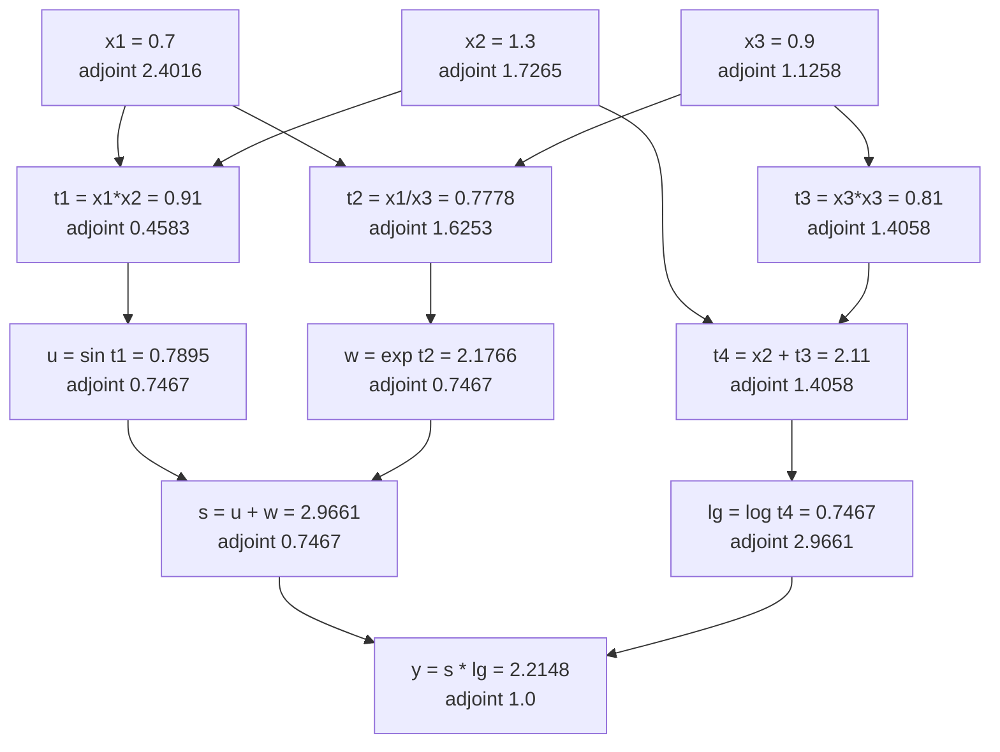
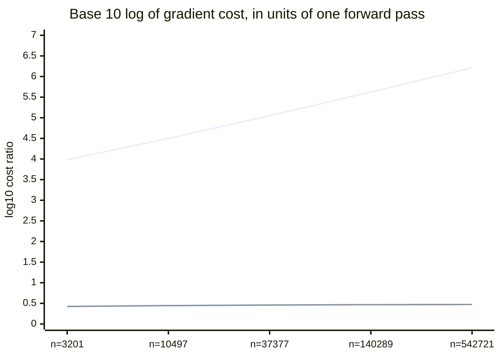

# Backprop Is Reverse-Mode Differentiation

*Part of the series "Why Learning Works: The Theorems Behind Machine Learning." Earlier instalments established what can be learned and what it costs statistically. This one is about what it costs computationally, and why the answer made everything else possible.*

---

## A Ratio That Should Not Be Possible

A frontier language model has on the order of $10^{11}$ parameters. Every training step computes the partial derivative of a single scalar loss with respect to every one of them, and the whole gradient costs roughly what two or three forward passes cost. Not $10^{11}$ forward passes. Two or three.

State that ratio as a claim and it sounds like a mistake. You have $10^{11}$ independent quantities to produce, each of which is a derivative in its own direction, and you are producing all of them for the price of a small constant number of function evaluations. Nothing in ordinary numerical practice behaves this way: finite differences cost one extra evaluation per input, so the same gradient would cost $10^{11}$ forward passes and be numerically worthless besides.

The ratio is not an engineering achievement. It is a theorem, proved by Walter Baur and Volker Strassen in 1983 for reasons having nothing to do with neural networks, and it decides the shape of the entire field. Had the constant come out proportional to the number of parameters instead, deep learning would be a footnote and the field would have spent forty years on derivative-free methods.

This post does three things. It derives backpropagation as an instance of reverse-mode accumulation on a computational graph, so the "trick" dissolves into a chain rule applied in a particular order. It states the complexity theorem precisely, separates what is proved here from what I am citing, and identifies the cost you really pay — which is memory, not time. And it shows that weight initialization, usually taught as a table of magic constants, is a four-line variance calculation whose consequences follow from a geometric series.

---

## The Chain Rule on a Graph

Forget layers. Take any function $F : \mathbb{R}^n \to \mathbb{R}^m$ evaluated by a **straight-line program**: a finite sequence of assignments

$$
\begin{aligned}
v_i &= x_i, && i = 1, \dots, n, \\
v_k &= \varphi_k\!\left(v_j : j \prec k\right), && k = n+1, \dots, n+\ell,
\end{aligned}
$$

where $j \prec k$ means "$v_j$ is an argument of $v_k$", each $\varphi_k$ is a differentiable elementary operation of bounded arity, and the last $m$ variables are the outputs. No loops, no branches — a straight-line program is what any concrete execution of a program unrolls into, which is why this covers everything a network does on a fixed input.

The relation $\prec$ makes a directed acyclic graph. Nodes are intermediate values; each edge $j \to k$ carries the **local partial derivative**

$$
\begin{aligned}
c_{kj} = \frac{\partial \varphi_k}{\partial v_j},
\end{aligned}
$$

a single number, evaluated at the point you are differentiating at. The chain rule then says the derivative of an output with respect to an input is the sum over all directed paths from input to output of the product of the local partials along the path. That formula is correct and useless: the number of paths grows exponentially. Everything interesting is in the order you accumulate them.

There are exactly two natural orders, and they are dual.

**Forward mode** fixes an input $x_i$ and propagates the *tangent* $\dot v_k = \partial v_k / \partial x_i$ from inputs to outputs, one node at a time:

$$
\begin{aligned}
\dot v_k = \sum_{j \prec k} c_{kj}\, \dot v_j .
\end{aligned}
$$

One sweep, initialized with $\dot v_i = 1$ and $\dot v_{i'} = 0$ for $i' \neq i$, produces $\partial v_k / \partial x_i$ at every node — the whole $i$-th column of the Jacobian, all $m$ outputs at once. To get the full Jacobian you need $n$ sweeps, one **per input**.

**Reverse mode** fixes an output and propagates the *adjoint* $\bar v_j = \partial y / \partial v_j$ from outputs back to inputs:

$$
\begin{aligned}
\bar v_j = \sum_{k \succ j} \bar v_k\, c_{kj} .
\end{aligned}
$$

One sweep, seeded with $\bar y = 1$, produces $\partial y / \partial v_j$ at every node — the whole row of the Jacobian, all $n$ inputs at once. To get the full Jacobian you need $m$ sweeps, one **per output**.

The asymmetry is the entire argument, and it is worth stating flatly: **forward mode costs one sweep per input; reverse mode costs one sweep per output.** Each sweep costs a small multiple of evaluating $F$ once. So for $F : \mathbb{R}^n \to \mathbb{R}^m$, forward mode costs $\Theta(n)$ evaluations and reverse mode $\Theta(m)$.

Now look at what training is. The loss is a map $\mathbb{R}^n \to \mathbb{R}$ with $n \approx 10^{11}$ and $m = 1$. Reverse mode wins by a factor of $n$. Not by a constant, not asymptotically in some limit — by the parameter count, today, on the machine in front of you. That single inequality, $m \ll n$, is why every deep learning framework is built around a tape and not a tangent.

It also tells you when the reasoning inverts. Sensitivity analysis of many outputs with respect to one scalar input — a time step, a design parameter — is a forward-mode problem, and people who use forward mode for that are not confused about backprop. They have a different Jacobian shape.



Read the graph downward for values and upward for adjoints; every number in it comes from the code later in this post. Note that $x_1$ has two outgoing edges, and its adjoint $2.4016$ is the sum of the contributions arriving back along both — the only rule in reverse mode that is not immediately obvious.

---

## The Delta Recursion, Derived

Specialize to a feedforward network and the general recursion becomes the formula in every textbook. I will derive it rather than assert it, because the derivation is where the index conventions stop being arbitrary.

Write $w_{ij}$ for the weight on the edge from unit $i$ to unit $j$, so that the pre-activation and activation of unit $j$ are

$$
\begin{aligned}
a_j = \sum_{i \,\in\, \mathrm{pred}(j)} w_{ij} z_i + b_j, \qquad z_j = f_j(a_j),
\end{aligned}
$$

the sum running over units feeding into $j$. Define the **delta** of unit $j$ as the adjoint of its pre-activation,

$$
\begin{aligned}
\delta_j \;=\; \frac{\partial L}{\partial a_j}.
\end{aligned}
$$

Choosing $a_j$ rather than $z_j$ as the differentiated quantity is the one design decision in the derivation, and it pays off twice below.

**The recursion.** The variable $a_j$ influences the loss only through $z_j = f_j(a_j)$, and $z_j$ influences the loss only through the pre-activations $a_k$ of the units $k$ that receive $z_j$ as input. Two applications of the chain rule, with the sums stated explicitly:

$$
\begin{aligned}
\delta_j \;=\; \frac{\partial L}{\partial a_j}
&\;=\; \frac{\partial L}{\partial z_j}\cdot\frac{d z_j}{d a_j}
\;=\; f_j'(a_j)\,\frac{\partial L}{\partial z_j} \\[4pt]
&\;=\; f_j'(a_j) \sum_{k \,\in\, \mathrm{succ}(j)} \frac{\partial L}{\partial a_k}\cdot\frac{\partial a_k}{\partial z_j}
\;=\; f_j'(a_j) \sum_{k \,\in\, \mathrm{succ}(j)} w_{jk}\,\delta_k .
\end{aligned} \tag{1}
$$

The first sum is over nothing — $a_j$ has a single successor, $z_j$, so the chain rule contributes one term. The second sum is over $\mathrm{succ}(j)$, the units receiving $z_j$; and $\partial a_k / \partial z_j = w_{jk}$ because $a_k = \sum_{j'} w_{j'k} z_{j'} + b_k$ and only the $j' = j$ term survives. Note the index order: the weight appearing in the backward pass is $w_{jk}$, an edge *out of* $j$, while the weight appearing in the forward pass at $j$ is $w_{ij}$, an edge *into* $j$. That reversal is the transpose, and we will name it properly in a moment.

**The output layer.** The recursion needs a base case, supplied by the loss. For squared error $L = \tfrac12\sum_o (z_o - y_o)^2$ over output units $o$,

$$
\begin{aligned}
\delta_o = \frac{\partial L}{\partial a_o} = \frac{\partial L}{\partial z_o}\cdot f_o'(a_o) = (z_o - y_o)\, f_o'(a_o).
\end{aligned} \tag{2}
$$

For softmax outputs with cross-entropy loss the activation derivative and the loss derivative cancel exactly and $\delta_o = p_o - y_o$, with $p$ the predicted distribution. That cancellation is not luck; it is the general fact that a canonical link paired with its matching negative log-likelihood yields a residual delta, and it is the reason those two are always paired.

**The weight gradient.** The parameter $w_{ij}$ enters the computation at exactly one place, the pre-activation $a_j$. So the chain rule has a single term:

$$
\begin{aligned}
\frac{\partial L}{\partial w_{ij}} = \frac{\partial L}{\partial a_j}\cdot\frac{\partial a_j}{\partial w_{ij}} = \delta_j\, z_i, \qquad \frac{\partial L}{\partial b_j} = \delta_j .
\end{aligned} \tag{3}
$$

This is the second payoff of differentiating with respect to $a_j$: the weight gradient is an outer product of quantities you already have, the forward activation at the tail of the edge and the delta at the head. No further work.

**Matrix form.** Collect layer $\ell$'s weights into $W^{(\ell)}$ with $(W^{(\ell)})_{ij} = w_{ij}$, so $W^{(\ell)} \in \mathbb{R}^{n_{\ell-1} \times n_\ell}$. Then (1)–(3) become, per layer,

$$
\begin{aligned}
a^{(\ell)} &= (W^{(\ell)})^{\top} z^{(\ell-1)} + b^{(\ell)}, \\
\delta^{(\ell)} &= f'\!\left(a^{(\ell)}\right) \odot \left(W^{(\ell+1)} \delta^{(\ell+1)}\right), \\
\nabla_{W^{(\ell)}} L &= z^{(\ell-1)} \left(\delta^{(\ell)}\right)^{\top},
\end{aligned} \tag{4}
$$

with $\odot$ the elementwise product. The forward pass applies the linear map $T : z \mapsto (W^{(\ell)})^{\top} z$; the backward pass applies $\delta \mapsto W^{(\ell)} \delta$. These are adjoints of each other in the Euclidean inner product:

$$
\begin{aligned}
\langle T z, \delta \rangle = \left\langle (W^{(\ell)})^{\top} z, \delta \right\rangle = \left\langle z, W^{(\ell)} \delta \right\rangle = \langle z, T^{*} \delta \rangle
\end{aligned}
$$

for all $z, \delta$. That identity is what "reverse mode" means. Backpropagation applies, at every node, the adjoint of the linear map that the forward pass applied there — the transpose for a matrix multiply, a multiplication by $f'(a)$ for an elementwise nonlinearity, a sum for a broadcast, a broadcast for a sum. Frameworks call the rule a "vector-Jacobian product" and the naming is exact: the backward pass never forms a Jacobian, it applies one from the left.

---

## The Cheap Gradient Principle

Now the theorem the ratio in the opening rests on.

> **Theorem (Baur and Strassen, 1983).** Let $f$ be a rational function of $x_1, \dots, x_n$ computed by a straight-line program using $L$ arithmetic operations from $\{+, -, \times, \div\}$. Then the full gradient $\left(\partial f/\partial x_1, \dots, \partial f/\partial x_n\right)$ can be computed by a straight-line program using $O(L)$ operations, with the constant independent of $n$.

The published statement is a bound on multiplicative complexity: the cost of evaluating $f$ together with all $n$ of its first partial derivatives is at most a small constant times the cost of evaluating $f$ alone. Griewank and Walther's *Evaluating Derivatives* develops the same fact for general elementary functions under the name the **cheap gradient principle**, with the standard quoted bound

$$
\begin{aligned}
\mathrm{cost}(\nabla f) \;\leq\; \omega \cdot \mathrm{cost}(f), \qquad \omega \leq 4,
\end{aligned}
$$

and $\omega$ typically between $3$ and $4$ in practice depending on how you weight memory traffic against arithmetic. The number that matters is not $4$. It is the absence of $n$.

**What I can show you in a paragraph, and what I cannot.** The counting argument is transparent for the linear part and I will do that much honestly. Suppose the program consists only of additions and multiplications by constants. Each node $k$ has in-degree at most two, so the forward pass performs at most $2L$ multiply-adds in total. The reverse sweep visits each edge exactly once, performing one multiply and one add per edge to execute $\bar v_j \mathrel{+}= \bar v_k c_{kj}$ — the same edge set, hence at most $2L$ multiply-adds again. Total: at most $3L$, counting the forward pass, and the count never mentions how many of the nodes were inputs. That is the whole intuition, and for straight-line programs over $\{+,\times\}$ with constant local partials it is a complete argument.

The general theorem is harder, and the hard part is precisely what my paragraph assumes away. Multiplication nodes have local partials that depend on the *other* operand, division nodes introduce $-v/u^2$ terms, and Baur and Strassen's result is stated for multiplicative complexity over an arbitrary field with an induction on the program that eliminates one operation at a time. I am not going to compress that into a blog post and call it a proof. The full argument is in the original paper, *Theoretical Computer Science* 22(3), 317–330, and a modern treatment in Chapter 4 of Griewank and Walther. What I have given you above is the reason the constant is small; their proof is the reason the constant exists at all.

**The cost you actually pay.** The theorem is about time, and time is not what constrains you. Look again at the reverse recursion: $\bar v_j$ depends on the local partials $c_{kj}$, which are evaluated at the forward values. The multiplication rule needs both operands; the ReLU derivative needs the sign of the pre-activation; every nonlinearity needs its input. So reverse mode must *keep the forward intermediates alive* until the backward sweep consumes them. Forward mode needs no such storage — it carries one tangent alongside one value and discards both.

That is the real trade: memory for time. The tape's peak memory is proportional to the length of the forward computation, which for a network means depth times batch size times width. Every technique in the memory-management literature moves along this curve — gradient accumulation shrinks the batch dimension, activation checkpointing stores only a subset of the intermediates and recomputes the rest during the backward pass. Chen, Xu, Zhang and Guestrin showed that checkpointing $O(\sqrt{d})$ of the $d$ layers gives $O(\sqrt{d})$ memory at the cost of one extra forward pass per minibatch, and that $O(\log d)$ memory is reachable for $O(d \log d)$ forward cost. Those are points on the line the theorem draws: the time constant is small, so buying memory back with recomputation is affordable. If gradients cost $n$ forward passes, no one would ever recompute anything.

Practitioners meet this theorem as an out-of-memory error, not as a bound. It is the same statement.

---

## Reverse Mode in Thirty Lines

None of the above needs a framework. The following is a complete tape-based reverse-mode differentiator: a list of nodes, each recording its parents and the local partial along each incoming edge, plus one backward sweep. The check is against central differences, which are second-order accurate and therefore agree to roughly $h^2$ plus rounding — about $10^{-10}$ at $h = 10^{-5}$ in double precision.

```python
import numpy as np

tape = []                                  # tape[k] = [(parent index, local partial), ...]

class Var:
    def __init__(self, value, deps=()):
        self.v, self.i = float(value), len(tape)
        tape.append(list(deps))
    def __add__(s, o): return Var(s.v + o.v, [(s.i, 1.0), (o.i, 1.0)])
    def __mul__(s, o): return Var(s.v * o.v, [(s.i, o.v), (o.i, s.v)])
    def __truediv__(s, o): return Var(s.v / o.v, [(s.i, 1/o.v), (o.i, -s.v/o.v**2)])

def sin(x): return Var(np.sin(x.v), [(x.i, np.cos(x.v))])
def exp(x): return Var(np.exp(x.v), [(x.i, np.exp(x.v))])
def log(x): return Var(np.log(x.v), [(x.i, 1.0/x.v)])

def grad(output, inputs):
    bar = np.zeros(len(tape)); bar[output.i] = 1.0      # seed the adjoint of the output
    for k in range(len(tape) - 1, -1, -1):              # one sweep, reverse topological order
        for j, partial in tape[k]:
            bar[j] += bar[k] * partial                  # adjoint accumulation
    return np.array([bar[x.i] for x in inputs])

point = np.array([0.7, 1.3, 0.9])
x1, x2, x3 = (Var(v) for v in point)
y = (sin(x1 * x2) + exp(x1 / x3)) * log(x2 + x3 * x3)
g_rev = grad(y, [x1, x2, x3])

def f(v):                                               # the same map in plain floats
    a, b, c = v
    return (np.sin(a*b) + np.exp(a/c)) * np.log(b + c*c)

h = 1e-5
g_fd = np.array([(f(point + h*e) - f(point - h*e)) / (2*h) for e in np.eye(3)])

print("value           =", f"{y.v:.12f}")
print("reverse mode    =", np.array2string(g_rev, precision=12))
print("central diff    =", np.array2string(g_fd, precision=12))
print("max difference  =", f"{np.max(np.abs(g_rev - g_fd)):.3e}")
print("tape length     =", len(tape), "nodes, one sweep, three partials")
```

```text
value           = 2.214776263077
reverse mode    = [2.401607671437 1.726544142945 1.125802437195]
central diff    = [2.401607671465 1.726544142944 1.125802437052]
max difference  = 1.434e-10
tape length     = 12 nodes, one sweep, three partials
```

Twelve nodes, one backward sweep, three exact partial derivatives — and the loop in `grad` never asks how many inputs there are. The finite-difference column needed six function evaluations to produce three numbers that are wrong in the tenth digit. This is backpropagation, and there is not a neural network anywhere in it.

---

## The Ratio, Measured

Timing is a poor instrument here because BLAS kernels change regime with size. Counting is exact, so the next block instruments the arithmetic directly: every matrix product contributes $2 \cdot m \cdot k \cdot n$ operations, every elementwise pass contributes one per element. Three quantities are counted for a four-layer ReLU network at five widths — the forward pass, the forward pass plus the full reverse sweep, and one forward-mode tangent sweep. The full gradient by forward mode needs $n$ such sweeps, one per parameter.

```python
import numpy as np

flops = 0
def mm(A, B):
    global flops; flops += 2 * A.shape[0] * A.shape[1] * B.shape[1]; return A @ B
def ew(Z, k=1):
    global flops; flops += k * Z.size; return Z

rng = np.random.default_rng(0)
X = rng.standard_normal((64, 32))                          # batch 64, input width 32

def forward(P):
    z, cache = X, [X]
    for W, b in P:
        z = np.maximum(ew(mm(z, W) + b), 0.0)              # affine, then ReLU
        cache.append(z)
    return cache

def backward(P, cache):                                    # the delta recursion, eq. (4)
    d = ew(np.ones_like(cache[-1]) * (cache[-1] > 0))
    for l in range(len(P) - 1, -1, -1):
        mm(cache[l].T, d)                                  # dL/dW = z_in (delta)^T
        if l:
            d = ew(mm(d, P[l][0].T) * (cache[l] > 0))      # delta <- (W delta) * f'
    return d

def jvp(P, dP):                                            # ONE forward-mode direction
    z, dz = X, np.zeros_like(X)
    for (W, b), (dW, db) in zip(P, dP):
        a = ew(mm(z, W) + b)
        da = ew(mm(dz, W) + mm(z, dW) + db, 2)
        z, dz = np.maximum(a, 0.0), ew(da * (a > 0))
    return dz

def count(fn, *a):
    global flops; flops = 0; fn(*a); return flops

print(f"{'width':>6}{'params n':>10}{'forward':>12}{'fwd+bwd':>12}"
      f"{'reverse x':>11}{'forward-mode x':>16}")
for w in [32, 64, 128, 256, 512]:
    P = [(rng.standard_normal((a, b)), np.zeros(b))
         for a, b in zip([32, w, w, w, 1], [w, w, w, 1])]
    dP = [(rng.standard_normal(W.shape), np.zeros_like(b)) for W, b in P]
    n = sum(W.size + b.size for W, b in P)
    f_fwd = count(forward, P)
    cache = forward(P)
    f_all = f_fwd + count(backward, P, cache)
    f_jvp = count(jvp, P, dP)
    print(f"{w:>6}{n:>10}{f_fwd:>12}{f_all:>12}"
          f"{f_all/f_fwd:>11.2f}{n*f_jvp/f_fwd:>16.3e}")
```

```text
 width  params n     forward     fwd+bwd  reverse x  forward-mode x
    32      3201      403520     1073280       2.66       9.652e+03
    64     10497     1331264     3719296       2.79       3.159e+04
   128     37377     4759616    13729920       2.88       1.123e+05
   256    140289    17907776    52625536       2.94       4.213e+05
   512    542721    69369920   205914240       2.97       1.629e+06
```

The parameter count rises by a factor of $170$ down the table. The reverse-mode column moves from $2.66$ to $2.97$ — creeping toward $3$ as the matrix multiplies come to dominate the elementwise work, and comfortably under the bound $\omega \leq 4$. The forward-mode column tracks the parameter count almost exactly, sitting near $3n$ throughout, because a forward-mode gradient really is $n$ separate sweeps.



The rising line is forward mode, the flat one reverse. Both axes would be unreadable on a linear scale, which is the point: the gap is six orders of magnitude at half a million parameters and grows without bound. Extrapolate the upper line to $10^{11}$ and you have the sentence this post opened with.

---

## The History, Corrected

The usual story credits Rumelhart, Hinton and Williams with inventing backpropagation in 1986. The usual story is wrong in a specific and instructive way, and the corrected version explains why the algorithm feels like it came from nowhere.

**Linnainmaa (1970).** Seppo Linnainmaa's master's thesis at the University of Helsinki, *The representation of the cumulative rounding error of an algorithm as a Taylor expansion of the local rounding errors*, is generally credited as the first appearance of reverse-mode accumulation, together with FORTRAN code implementing it. His problem was numerical error analysis: he wanted the sensitivity of an algorithm's accumulated rounding error to each local rounding error, which is a gradient of one scalar with respect to very many inputs — the same Jacobian shape as a loss with respect to parameters. He published the method in *BIT* in 1976. There are earlier precursors in optimal control, notably Kelley's 1960 gradient theory of optimal flight paths and Dreyfus's 1962 chain-rule derivation, but the general graph formulation is Linnainmaa's.

**Werbos (1974, 1982).** Paul Werbos's Harvard PhD thesis *Beyond Regression: New Tools for Prediction and Analysis in the Behavioral Sciences* developed what he called ordered derivatives and is where the method enters the neural-network lineage. Schmidhuber's historical survey is worth being precise about here: he reads the 1974 thesis as containing a preliminary, network-specific discussion and locates the first explicit application of efficient backpropagation to neural networks in Werbos's 1982 paper. Either way the priority over 1986 is not close.

**Rumelhart, Hinton and Williams (1986).** "Learning representations by back-propagating errors," *Nature* 323, 533–536. Their contribution was not the algorithm — it was the demonstration, on tasks people cared about, that a network trained this way develops useful internal representations in its hidden units, which is exactly what perceptron-era methods could not produce. That is a real and large contribution, and describing it accurately costs nothing. The paper does not cite Linnainmaa.

The pattern recurs: a general technique is developed in one field for its own reasons, rediscovered in another where it happens to be decisive, and the second discovery becomes canonical. Reading backprop as an ML technique is what makes it look like a trick. Reading it as reverse-mode AD makes it look like what it is — the chain rule, evaluated in the order the Jacobian's shape demands.

---

## Initialization Is a Formula, Not Folklore

The delta recursion (1) is a product of many terms. Products of many terms are geometric, and geometric things either vanish or explode unless the ratio is controlled. That single observation turns initialization from a table of constants into a calculation.

Take a layer with $n_{\text{in}}$ inputs, weights drawn i.i.d. with mean zero and variance $\sigma_w^2$, independent of the incoming activations, which are themselves i.i.d. with mean zero and variance $v_{\text{in}}$. Then for the pre-activation $a_j = \sum_{i=1}^{n_{\text{in}}} w_{ij} z_i$ (bias initialized to zero), independence kills the cross terms:

$$
\begin{aligned}
\operatorname{Var}[a_j] = \sum_{i=1}^{n_{\text{in}}} \operatorname{Var}[w_{ij} z_i] = \sum_{i=1}^{n_{\text{in}}} \mathbb{E}[w_{ij}^2]\,\mathbb{E}[z_i^2] = n_{\text{in}}\,\sigma_w^2\, v_{\text{in}} .
\end{aligned} \tag{5}
$$

For an activation that is approximately the identity near the origin — $\tanh$ or a linear unit — the activation variance equals the pre-activation variance, so (5) is a recursion on layer variances with per-layer gain $n_{\text{in}}\sigma_w^2$. After $L$ layers the signal variance has been multiplied by the product of those gains. **Preserving the forward signal requires $\sigma_w^2 = 1/n_{\text{in}}$.**

Now run the same computation on the backward pass. By (1), with $f' \approx 1$, the delta of a unit is a sum of $n_{\text{out}}$ terms $w_{jk}\delta_k$, and the identical calculation gives $\operatorname{Var}[\delta_{\text{in}}] = n_{\text{out}}\sigma_w^2 \operatorname{Var}[\delta_{\text{out}}]$. **Preserving the backward signal requires $\sigma_w^2 = 1/n_{\text{out}}$.**

Two conditions, one parameter. They are compatible only if $n_{\text{in}} = n_{\text{out}}$. Glorot and Bengio's answer in 2010 was to split the difference, taking the harmonic-style compromise

$$
\begin{aligned}
\sigma_w^2 = \frac{2}{n_{\text{in}} + n_{\text{out}}},
\end{aligned} \tag{6}
$$

which reduces to $1/n$ when the widths match and sits between the two requirements otherwise. Their uniform version, $W \sim \mathcal{U}\!\left[-\sqrt{6/(n_{\text{in}}+n_{\text{out}})},\, \sqrt{6/(n_{\text{in}}+n_{\text{out}})}\right]$, has exactly this variance, since a uniform on $[-r, r]$ has variance $r^2/3$.

**Where the factor of two comes from.** For ReLU the step "activation variance equals pre-activation variance" is false, and the correction is one line. Let $a$ be symmetrically distributed about zero and $z = \max(a, 0)$. Then

$$
\begin{aligned}
\mathbb{E}[a^2] = \mathbb{E}\!\left[a^2 \mathbb{1}_{\{a > 0\}}\right] + \mathbb{E}\!\left[a^2 \mathbb{1}_{\{a < 0\}}\right] = 2\,\mathbb{E}\!\left[a^2 \mathbb{1}_{\{a > 0\}}\right] = 2\,\mathbb{E}[z^2],
\end{aligned}
$$

the middle equality by symmetry. ReLU zeroes half the second moment. Substituting $\mathbb{E}[z^2] = \tfrac12 \operatorname{Var}[a]$ into (5) gives the layer recursion $\operatorname{Var}[a^{(\ell)}] = \tfrac12 n_{\text{in}} \sigma_w^2 \operatorname{Var}[a^{(\ell-1)}]$, so preservation requires

$$
\begin{aligned}
\sigma_w^2 = \frac{2}{n_{\text{in}}},
\end{aligned} \tag{7}
$$

which is He, Zhang, Ren and Sun's initialization from 2015. The $2$ is not a tuning constant. It is the reciprocal of the fraction of the second moment that ReLU lets through.

**Why depth turned this from a detail into a blocker.** Suppose your variance is off by a constant factor: $\sigma_w^2 = c / n_{\text{in}}$ instead of $1/n_{\text{in}}$. The per-layer gain is then $c$, and after $L$ layers the signal variance is scaled by $c^L$. At $L = 5$, a $10\%$ error gives $0.9^5 \approx 0.59$ — survivable. At $L = 50$,

$$
\begin{aligned}
0.9^{50} \approx 5.15 \times 10^{-3}, \qquad 1.1^{50} \approx 1.17 \times 10^{2},
\end{aligned}
$$

a factor of $200$ down or $100$ up from a $10\%$ error in one constant. In half precision the first case is under the smallest normal magnitude within another twenty layers and the gradients are literally zero. This is the whole content of "vanishing and exploding gradients": a geometric series with a ratio nobody checked. Shallow networks tolerate a wrong constant because $c^L$ is near $1$ for small $L$; deep ones do not, which is why initialization schemes and the deep learning era arrived together rather than by coincidence.

---

## The Conditioning Connection

One more consequence, stated briefly because it deserves its own post. Gradient descent on a quadratic with Hessian $H$ converges at a rate governed by the condition number $\kappa = \lambda_{\max}(H)/\lambda_{\min}(H)$: the error contracts by roughly $(\kappa - 1)/(\kappa + 1)$ per step, so a $\kappa$ of $10^4$ means ten thousand steps to do what one Newton step does. For a linear model with squared loss the Hessian is $\tfrac1m X^\top X$, and if one feature is measured in units a thousand times larger than another, that ratio enters $\kappa$ squared. Centring and scaling the inputs is not cosmetic preprocessing; it is a direct attack on $\lambda_{\max}/\lambda_{\min}$. Normalization layers — batch, layer, RMS — are the observation that a deep network's intermediate representations are inputs to the layers above them, so the same fix applies at every depth rather than only at the first. Initialization controls the variance once, at step zero; normalization maintains it throughout training, which is why the two coexist instead of one replacing the other.

---

## What to Take From This

Backpropagation is the chain rule accumulated from outputs toward inputs, on the graph your program already defines, applying at each node the adjoint of the linear map the forward pass applied there. It is not specific to networks, it was not invented in 1986, and its efficiency is not a bookkeeping trick — it is a complexity theorem whose constant is under $4$ and independent of the number of inputs.

Three consequences that change how you read a training loop. First, the loss must be scalar for the argument to work; when you see multi-objective training collapsed into a weighted sum, that is the theorem talking, not laziness. Second, the resource you are short of is memory, not arithmetic, because reverse mode's whole cost model is "store the forward pass and consume it backwards" — so checkpointing is not a hack but the intended way to move along the curve. Third, initialization is a two-line variance computation whose failure mode is geometric in depth, which is why constants that look arbitrary at ten layers are load-bearing at a hundred.

The general lesson is the one the history illustrates. What looks like an algorithmic trick in one field is often a theorem in another, and the theorem tells you where the trick stops working. Reverse mode is optimal for $m \ll n$. Change that inequality and the answer changes with it.

---

## Going Deeper

**Books:**
- Griewank, A., & Walther, A. (2008). *Evaluating Derivatives: Principles and Techniques of Algorithmic Differentiation*, 2nd ed. SIAM.
  - The standard reference. Chapter 3 develops forward and reverse modes on the computational graph; Chapter 4 has the cheap gradient principle and the memory analysis, including checkpointing schedules.
- Nocedal, J., & Wright, S. J. (2006). *Numerical Optimization*, 2nd ed. Springer.
  - Chapter 8 covers derivative computation, including how the finite-difference step size trades truncation against cancellation.
- Goodfellow, I., Bengio, Y., & Courville, A. (2016). *Deep Learning.* MIT Press.
  - Section 6.5 gives backpropagation as general graph differentiation rather than a layer recipe; Chapter 8 covers initialization and conditioning.
- Bürgisser, P., Clausen, M., & Shokrollahi, M. A. (1997). *Algebraic Complexity Theory.* Springer.
  - Where the Baur–Strassen result lives in its native habitat, alongside the lower-bound machinery that motivated it.

**Online Resources:**
- [autodiff.org](https://www.autodiff.org/) — the AD community's bibliography and tool index; the entry for Baur and Strassen is the canonical record of the 1983 paper.
- [JAX autodiff cookbook](https://docs.jax.dev/en/latest/notebooks/autodiff_cookbook.html) — vector-Jacobian and Jacobian-vector products treated as the primitives they are, with worked Hessian and higher-order examples.
- [PyTorch autograd mechanics](https://pytorch.org/docs/stable/notes/autograd.html) — what the tape actually stores, when it is freed, and why in-place operations break it.
- [CS231n backpropagation notes](https://cs231n.github.io/optimization-2/) — the clearest elementary treatment of local gradients and adjoint accumulation on a graph.

**Videos:**
- [Backpropagation calculus | Deep Learning Chapter 4](https://www.youtube.com/watch?v=tIeHLnjs5U8) by 3Blue1Brown — the chain rule on a network drawn rather than indexed; good calibration before reading equation (1).
- [The spelled-out intro to neural networks and backpropagation: building micrograd](https://www.youtube.com/watch?v=VMj-3S1tku0) by Andrej Karpathy — builds a tape-based reverse-mode engine from nothing, at length; the same object as this post's first code block.
- [What is Automatic Differentiation?](https://www.youtube.com/watch?v=wG_nF1awSSY) by Ari Seff — a short visual contrast of forward and reverse accumulation against symbolic and numerical differentiation.

**Academic Papers:**
- Baur, W., & Strassen, V. (1983). ["The complexity of partial derivatives."](https://doi.org/10.1016/0304-3975(83)90110-X) *Theoretical Computer Science*, 22(3), 317–330.
  - The theorem. Short, and the induction on program length is the part my counting argument does not cover.
- Rumelhart, D. E., Hinton, G. E., & Williams, R. J. (1986). ["Learning representations by back-propagating errors."](https://www.nature.com/articles/323533a0) *Nature*, 323, 533–536.
  - Not the origin, but the demonstration that hidden units learn useful features — read it for what it actually claims.
- Baydin, A. G., Pearlmutter, B. A., Radul, A. A., & Siskind, J. M. (2018). ["Automatic Differentiation in Machine Learning: a Survey."](https://www.jmlr.org/papers/volume18/17-468/17-468.pdf) *JMLR*, 18(153), 1–43.
  - The bridge between the AD literature and the ML one, including the taxonomy that separates AD from symbolic and numerical differentiation.
- Glorot, X., & Bengio, Y. (2010). ["Understanding the difficulty of training deep feedforward neural networks."](https://proceedings.mlr.press/v9/glorot10a.html) *AISTATS*, PMLR 9, 249–256.
  - Equation (6), with the activation and gradient histograms that motivated it.
- He, K., Zhang, X., Ren, S., & Sun, J. (2015). ["Delving Deep into Rectifiers: Surpassing Human-Level Performance on ImageNet Classification."](https://arxiv.org/abs/1502.01852) *ICCV 2015*, 1026–1034.
  - Equation (7) and the factor of two, plus the first thirty-layer networks trained from scratch without staged pretraining.
- Chen, T., Xu, B., Zhang, C., & Guestrin, C. (2016). ["Training Deep Nets with Sublinear Memory Cost."](https://arxiv.org/abs/1604.06174) *arXiv:1604.06174.*
  - The memory–recomputation trade made explicit: $O(\sqrt{d})$ memory for one extra forward pass.

**Questions to Explore:**
- The cheap gradient principle bounds the gradient by a constant times the function. Is there an analogous bound for the Hessian-vector product, and does the constant stay independent of $n$? What breaks for the full Hessian?
- Reverse mode is optimal when $m \ll n$ and forward mode when $n \ll m$. For intermediate shapes, the optimal elimination order on the computational graph is a combinatorial problem — and known to be NP-hard in general. What do practical heuristics actually exploit about the graphs that arise from real programs?
- The variance argument assumes weights independent of activations, which stops holding the moment training starts. What replaces (5) after a thousand steps, and does the initialization still matter then, or only through the basin it selected?
- Backpropagation requires storing the forward pass, which is biologically implausible and hardware-hostile. Do the proposed alternatives — feedback alignment, forward gradients, local learning rules — evade the complexity theorem, or do they pay for a weaker guarantee elsewhere?
- If the loss must be scalar for reverse mode to be cheap, what is the honest cost of genuinely multi-objective training, and how much of the practice of scalarizing objectives is a mathematical necessity rather than a convention?
