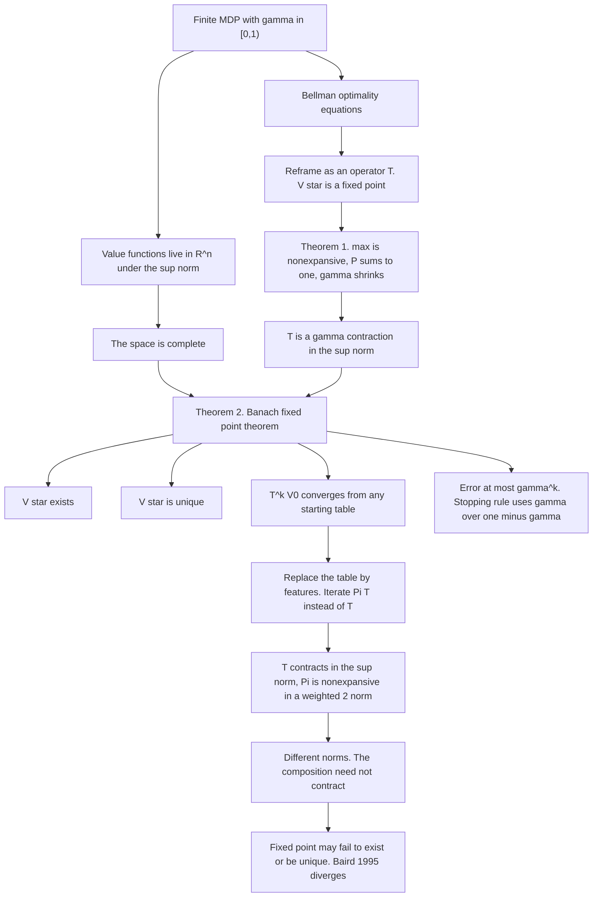
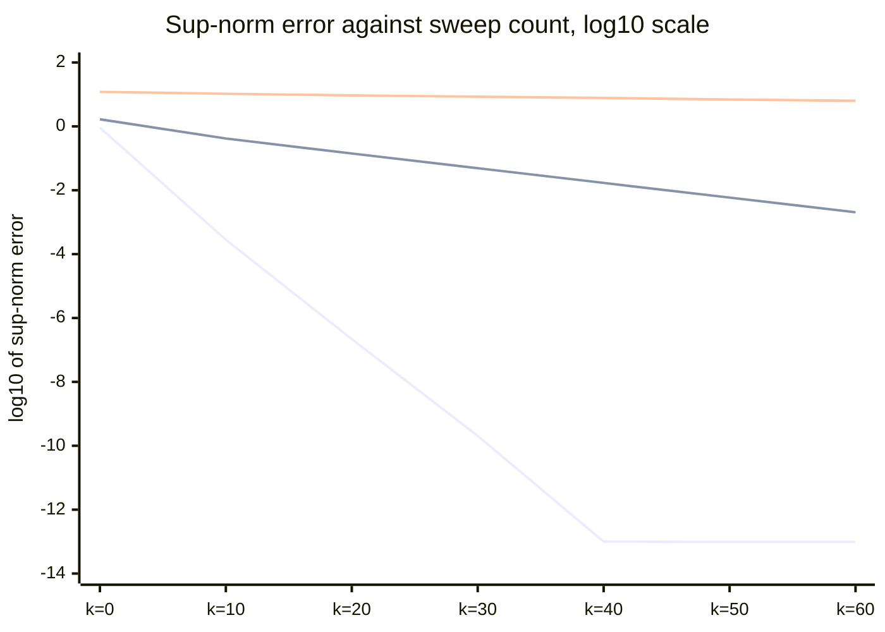

# The Bellman Operator Is a Contraction

*Part of the series "Why Learning Works: The Theorems Behind Machine Learning." Earlier instalments asked when a hypothesis class can be learned at all. This one asks a narrower and older question: when a learning procedure is an iteration, what makes the iteration stop somewhere in particular.*

---

## A Guarantee Nobody Proves

An earlier post here, [Reinforcement Learning: From First Principles to Open Frontiers](https://juanlara18.github.io/portfolio/#/blog/reinforcement-learning-first-principles), says of the tabular case that "this is exact, convergence is guaranteed, and debugging is straightforward." That sentence is true and it is unsupported, and it is unsupported in exactly the way that almost every treatment of dynamic programming is unsupported. You initialise a table of zeros, sweep the Bellman update across it until the numbers stop moving, and read off a policy. It works. Nobody says why.

The why has a name, it takes about a page, and it is worth the page because it pays for three separate things at once that are usually smuggled in as assumptions. It establishes that an optimal value function **exists** — nothing prior to this guarantees that the Bellman equations have a solution at all. It establishes that the solution is **unique**, so the fixed point your loop lands on is not one of several. And it establishes that iteration reaches it from **any** starting table, at a rate you can compute in advance and check at runtime.

The same page then tells you exactly where the guarantee ends. It ends at the projection step, and it ends for a reason you can state in one sentence about norms.

---

## The Setting, Compressed

Take a finite MDP $(\mathcal{S}, \mathcal{A}, P, r, \gamma)$: finite state set $\mathcal{S}$ with $|\mathcal{S}| = n$, finite action set $\mathcal{A}$, transition kernel $P(s' \mid s, a)$, bounded expected reward $r(s,a)$, and discount $\gamma \in [0,1)$. The half-open interval matters; $\gamma = 1$ is excluded and everything below says why. The prior post covers what these objects mean and I will not repeat it.

The move that makes the theory work is to stop thinking of a value function as a table and start thinking of it as a **point**. A function $V : \mathcal{S} \to \mathbb{R}$ on a finite state space is a vector in $\mathbb{R}^n$, and we equip $\mathbb{R}^n$ with the supremum norm

$$
\|V\|_\infty \;=\; \max_{s \in \mathcal{S}} |V(s)|,
$$

so that $\|U - V\|_\infty$ is the largest disagreement between two value functions at any single state. This is the right notion of distance because it is the one an MDP's dynamics can be made to respect: probabilities are an average, and an average of things bounded by $c$ is bounded by $c$.

One property of this space is load-bearing and easy to overlook. $(\mathbb{R}^n, \|\cdot\|_\infty)$ is a **complete** metric space: every Cauchy sequence of value functions converges to a value function. Finite-dimensional normed spaces over $\mathbb{R}$ are complete, all norms on them being equivalent and $\mathbb{R}^n$ being complete under the Euclidean norm. It costs nothing here, which is why it is usually passed over in silence — but it is the hypothesis that will do the actual work of producing a limit, and it is precisely the hypothesis that stops being free once $\mathcal{S}$ is infinite.

---

## From Equation to Operator

Define the **Bellman optimality operator** $T : \mathbb{R}^n \to \mathbb{R}^n$ by

$$
(TV)(s) \;=\; \max_{a \in \mathcal{A}} \left[\, r(s,a) \;+\; \gamma \sum_{s' \in \mathcal{S}} P(s' \mid s, a)\, V(s') \,\right], \qquad s \in \mathcal{S}. \tag{1}
$$

Read the right-hand side as a program: for each state, look one step ahead under each action, add the discounted expected value of where you land, and keep the best. $T$ takes a whole table of guesses and returns a whole table of one-step-improved guesses. It is a map from $\mathbb{R}^n$ to itself, nothing more.

Now the shift in view, which is the entire trick and deserves its own paragraph. The Bellman optimality equation is normally presented as a *system of $n$ coupled nonlinear equations* — one per state, each containing a max — that the optimal value function must satisfy. Presented that way it is unpleasant: nonlinear systems need not have solutions, need not have unique ones, and come with no general algorithm. But the system says exactly that $V = TV$. So instead of asking which tuples of numbers satisfy $n$ equations, ask which **points** the map $T$ leaves where they are. $V^\star$ is no longer a solution of a system; it is a **fixed point of an operator**. And fixed points of operators are a subject with theorems in it.

That reframing converts a question about algebra into a question about geometry: does $T$ move points closer together? If it does, and if the space is complete, everything follows.

---

## Theorem 1: $T$ Is a $\gamma$-Contraction

> **Theorem 1.** For all $U, V \in \mathbb{R}^n$,
>
> $$
> \|TU - TV\|_\infty \;\leq\; \gamma\, \|U - V\|_\infty .
> $$
>
> That is, $T$ is a contraction mapping with modulus $\gamma$ on $(\mathbb{R}^n, \|\cdot\|_\infty)$.

The proof has one step that is usually waved through, so we do that step first, as a lemma. It is the only place the max in $(1)$ interacts with the estimate, and a max is not a linear operation, so the interaction is not automatic.

> **Lemma (maxima are nonexpansive).** Let $\mathcal{A}$ be a finite non-empty set and $f, g : \mathcal{A} \to \mathbb{R}$. Then
>
> $$
> \left| \max_{a \in \mathcal{A}} f(a) \;-\; \max_{a \in \mathcal{A}} g(a) \right| \;\leq\; \max_{a \in \mathcal{A}} \left| f(a) - g(a) \right|.
> $$

*Proof.* Since $\mathcal{A}$ is finite and non-empty, both maxima are attained. Pick $a^\star \in \arg\max_a f(a)$. Then

$$
\begin{aligned}
\max_{a} f(a) - \max_{a} g(a)
&\;=\; f(a^\star) - \max_{a} g(a) \\
&\;\leq\; f(a^\star) - g(a^\star) \\
&\;\leq\; \max_{a} |f(a) - g(a)|,
\end{aligned}
$$

where the middle inequality holds because $\max_a g(a) \geq g(a^\star)$, so subtracting the larger quantity yields the smaller difference. The bound is symmetric under exchanging $f$ and $g$, and repeating the argument with $b^\star \in \arg\max_a g(a)$ gives $\max_a g(a) - \max_a f(a) \leq \max_a |f(a) - g(a)|$. A real number and its negative are both bounded by $c$ exactly when its absolute value is. $\blacksquare$

The content of the lemma is worth naming: the maximum of a family of functions cannot be more sensitive to a perturbation than the *worst* individual member. Two tables differing by at most $\varepsilon$ at every state cannot produce greedy values differing by more than $\varepsilon$, no matter how the argmax moves around. If argmax switching could amplify disagreement, dynamic programming would not work, and the lemma is the statement that it cannot.

*Proof of Theorem 1.* Fix a state $s$ and apply the lemma with $f(a) = r(s,a) + \gamma\sum_{s'} P(s'\mid s,a) U(s')$ and $g(a)$ the same expression with $V$. The reward terms cancel inside the difference:

$$
\begin{aligned}
\left| (TU)(s) - (TV)(s) \right|
&\;\leq\; \max_{a}\; \left| \gamma \sum_{s'} P(s' \mid s,a)\, \big( U(s') - V(s') \big) \right| \\
&\;\leq\; \gamma \max_{a}\; \sum_{s'} P(s' \mid s,a)\, \left| U(s') - V(s') \right| \\
&\;\leq\; \gamma \max_{a}\; \sum_{s'} P(s' \mid s,a)\, \|U - V\|_\infty \\
&\;=\; \gamma\, \|U - V\|_\infty \; \max_{a} \sum_{s'} P(s' \mid s,a) \\
&\;=\; \gamma\, \|U - V\|_\infty .
\end{aligned} \tag{2}
$$

Line two is the triangle inequality with $P \geq 0$; line three replaces each pointwise disagreement by the largest one; the last line uses $\sum_{s'} P(s' \mid s,a) = 1$ for every $(s,a)$, which is the only property of the transition kernel the argument needs. The bound is uniform in $s$, so taking the maximum over $s$ on the left gives $\|TU - TV\|_\infty \leq \gamma \|U-V\|_\infty$. $\blacksquare$

Three lines of estimate, and the structure is entirely transparent: **the max cannot amplify, the expectation cannot amplify, and $\gamma$ shrinks.** Stochasticity contributes nothing to the contraction — a deterministic MDP contracts by exactly the same factor. All of the shrinkage is the discount.

---

## Theorem 2: Banach's Fixed-Point Theorem

Contraction alone is a statement about pairs of points. Turning it into existence requires the theorem Stefan Banach proved in his 1922 doctoral dissertation, *Sur les opérations dans les ensembles abstraits et leur application aux équations intégrales*, in the third volume of *Fundamenta Mathematicae*. It is one of the shortest important theorems in analysis, and this audience should see it proved rather than cited.

> **Theorem 2 (Banach, 1922).** Let $(X, d)$ be a non-empty complete metric space and let $T : X \to X$ satisfy $d(Tx, Ty) \leq \gamma\, d(x,y)$ for all $x,y \in X$, with a constant $\gamma \in [0,1)$. Then $T$ has exactly one fixed point $x^\star \in X$, and for every $x_0 \in X$ the sequence $x_{k+1} = Tx_k$ converges to $x^\star$.

*Proof.* Fix any $x_0 \in X$ and let $x_k = T^k x_0$. First, consecutive terms shrink geometrically: applying the contraction property $k$ times,

$$
d(x_{k+1}, x_k) \;=\; d(T x_k, T x_{k-1}) \;\leq\; \gamma\, d(x_k, x_{k-1}) \;\leq\; \cdots \;\leq\; \gamma^k\, d(x_1, x_0). \tag{3}
$$

Now let $l > k$. Chaining the triangle inequality along the path from $x_k$ to $x_l$ and inserting $(3)$,

$$
\begin{aligned}
d(x_l, x_k) \;\leq\; \sum_{j=k}^{l-1} d(x_{j+1}, x_j)
\;\leq\; \sum_{j=k}^{l-1} \gamma^j\, d(x_1, x_0)
\;\leq\; d(x_1,x_0) \sum_{j=k}^{\infty} \gamma^j
\;=\; \frac{\gamma^k}{1-\gamma}\, d(x_1, x_0).
\end{aligned} \tag{4}
$$

Because $\gamma < 1$ the geometric series converges and its tail $\gamma^k/(1-\gamma)$ tends to $0$. So for any $\varepsilon > 0$ there is a $K$ with $d(x_l, x_k) < \varepsilon$ whenever $l > k \geq K$: the sequence is **Cauchy**. This is where $\gamma < 1$ is indispensable — at $\gamma = 1$ the series diverges and $(4)$ says nothing at all.

By completeness the Cauchy sequence has a limit $x^\star \in X$. That the limit is fixed follows from continuity: a contraction is Lipschitz, hence continuous, so

$$
T x^\star \;=\; T\!\left(\lim_{k \to \infty} x_k\right) \;=\; \lim_{k \to \infty} T x_k \;=\; \lim_{k \to \infty} x_{k+1} \;=\; x^\star,
$$

the last equality because dropping one term does not change a limit.

Uniqueness is one line and is the prettiest part. Suppose $Tx = x$ and $Ty = y$. Then

$$
d(x,y) \;=\; d(Tx, Ty) \;\leq\; \gamma\, d(x,y) \quad\Longrightarrow\quad (1-\gamma)\, d(x,y) \leq 0 .
$$

Since $1 - \gamma > 0$ and $d \geq 0$, we get $d(x,y) = 0$, so $x = y$. Note that this argument never mentions the sequence: uniqueness is a property of $T$ alone, and it holds even in incomplete spaces where no fixed point need exist. $\blacksquare$

Letting $l \to \infty$ in $(4)$ leaves a bound we will want in a moment,

$$
d(x^\star, x_k) \;\leq\; \frac{\gamma^k}{1-\gamma}\, d(x_1, x_0), \tag{5}
$$

which is computable from the very first step of the iteration.

---

## What the Two Together Buy

$(\mathbb{R}^n, \|\cdot\|_\infty)$ is complete and non-empty; Theorem 1 says $T$ is a $\gamma$-contraction on it; Theorem 2 applies. Four consequences, and it is worth being pedantic about them because they are routinely assumed rather than derived.

**Existence.** There is a $V^\star \in \mathbb{R}^n$ with $TV^\star = V^\star$ — that is, a value function satisfying the Bellman optimality equations at every state simultaneously. Before this, nothing guaranteed that the $n$ coupled nonlinear equations had any solution. They do, and the reason has nothing to do with rewards or dynamics; it is that a discounted lookahead cannot spread disagreement.

**Uniqueness.** There is exactly one such $V^\star$. Your loop cannot be converging to the wrong one, because there is no wrong one.

**Global convergence.** $T^k V_0 \to V^\star$ for **every** $V_0$. Initialisation is irrelevant to the destination. Zeros, random numbers, a warm start from last week's model — all reach the same table. Only the number of iterations changes.

**Geometric rate.** Since $V^\star = TV^\star$, applying Theorem 1 $k$ times to the pair $(V_0, V^\star)$ gives

$$
\|V_k - V^\star\|_\infty \;=\; \|T^k V_0 - T^k V^\star\|_\infty \;\leq\; \gamma^k \|V_0 - V^\star\|_\infty . \tag{6}
$$

The error falls by a factor of at least $\gamma$ per sweep, forever, with no asymptotic caveat and no dependence on the size of the state space.

Bound $(6)$ is a fine theorem and useless as a stopping rule, since it contains the $V^\star$ you do not have. The usable version comes from $(5)$ applied to the tail of the iteration rather than its start. Take $(4)$ with the sequence restarted at $V_k$, so that $d(x_1,x_0)$ becomes $\|V_{k+1} - V_k\|_\infty$, and let $l \to \infty$:

$$
\|V_{k+1} - V^\star\|_\infty \;\leq\; \sum_{j \geq 1} \gamma^{\,j} \|V_{k+1} - V_k\|_\infty \;=\; \frac{\gamma}{1-\gamma}\, \|V_{k+1} - V_k\|_\infty . \tag{7}
$$

Every quantity on the right is in memory. So: **stop when $\|V_{k+1} - V_k\|_\infty < \epsilon(1-\gamma)/\gamma$, and you are certain the answer is within $\epsilon$.** That is the line that should appear in every value-iteration implementation and appears in almost none of them; the usual `while delta > 1e-6` is off by the factor $\gamma/(1-\gamma)$, which at $\gamma = 0.99$ is ninety-nine.

### The Discount Factor Is a Convergence Rate

Rearranging $(6)$ for the number of sweeps needed to reach accuracy $\epsilon$:

$$
\gamma^k \|V_0 - V^\star\|_\infty \leq \epsilon
\quad\Longleftrightarrow\quad
k \;\geq\; \frac{\log\!\big(\|V_0 - V^\star\|_\infty / \epsilon\big)}{\log(1/\gamma)} . \tag{8}
$$

The numerator is benign, growing logarithmically in the precision you demand. The denominator is where the trouble lives. As $\gamma \to 1^-$ we have $\log(1/\gamma) = -\log\!\big(1 - (1-\gamma)\big) \approx 1 - \gamma$, so the iteration count grows like $1/(1-\gamma)$ — and the effective horizon $1/(1-\gamma)$ is not a coincidence but the same quantity seen twice.

Numbers make it concrete. The sweeps needed to divide the error by ten is $\log 10 / \log(1/\gamma)$:

| $\gamma$ | $\log(1/\gamma)$ | Sweeps per tenfold error reduction | Effective horizon $1/(1-\gamma)$ |
|---|---|---|---|
| $0.5$ | $0.6931$ | $3.3$ | $2$ |
| $0.9$ | $0.1054$ | $21.9$ | $10$ |
| $0.99$ | $0.01005$ | $229.1$ | $100$ |
| $0.999$ | $0.0010005$ | $2301.4$ | $1000$ |

Moving from $\gamma = 0.9$ to $\gamma = 0.999$ multiplies the cost of every digit of accuracy by more than a hundred.

This is the practical payoff and it is worth stating bluntly, because $\gamma$ is almost always introduced as a preference — how much the agent "values the future," a philosophical dial between myopia and patience. That reading is not wrong, but it is half the object. $\gamma$ is simultaneously **the contraction modulus of the operator you are iterating**, and therefore the convergence rate of your algorithm and the constant in your error bound $(7)$. When someone raises $\gamma$ from $0.99$ to $0.999$ because the task has long-range structure, they have also, in the same keystroke, multiplied the work per digit by ten and inflated the gap between the stopping test and the true error by ten. Those are not side effects. They are the same parameter.



---

## Policy Iteration, in a Paragraph

The same machinery covers the other classical algorithm. For a fixed policy $\pi$ define $(T^\pi V)(s) = r(s,\pi(s)) + \gamma\sum_{s'}P(s'\mid s,\pi(s))V(s')$. This is $(1)$ with the max deleted, so the proof of Theorem 1 goes through with the lemma step skipped entirely: $T^\pi$ is also a $\gamma$-contraction in $\|\cdot\|_\infty$, and Banach gives a unique $V^\pi$ that iterative policy evaluation reaches geometrically. Policy improvement then sets $\pi'(s) \in \arg\max_a [\, r(s,a) + \gamma\sum_{s'}P(s'\mid s,a)V^\pi(s')\,]$, and the **policy improvement theorem** — Sutton and Barto, Section 4.2 — gives $V^{\pi'} \geq V^\pi$ componentwise, with strict improvement at some state unless $\pi$ is already optimal. I will not reprove it here; the argument is a telescoping expansion of $V^\pi \leq T^{\pi'}V^\pi \leq (T^{\pi'})^2 V^\pi \leq \cdots$. What makes policy iteration *terminate*, though, is not a contraction at all but a counting argument: the sequence of policies is monotone in a partial order, the policies are distinct once improvement is strict, and there are at most $|\mathcal{A}|^{|\mathcal{S}|}$ of them. A monotone sequence in a finite set is eventually constant. Two entirely different arguments for two algorithms that look like variants of each other.

---

## Where It Came From

Richard Bellman formulated the principle of optimality — an optimal policy has the property that whatever the initial state and initial decision, the remaining decisions must constitute an optimal policy with regard to the state resulting from the first decision — and published *Dynamic Programming* with Princeton University Press in 1957. The recursion in $(1)$ is that principle written down.

The naming story is worth telling carefully, because it is usually told badly. In his 1984 autobiography *Eye of the Hurricane*, Bellman writes that he was at RAND under an Air Force contract and that the Secretary of Defense, Charles Erwin Wilson, "had a pathological fear and hatred of the word research"; he chose "dynamic" partly because it is impossible to use that word in a pejorative sense, and "programming" for the sense of finding an optimal program. The account is repeated in Stuart Dreyfus's "Richard Bellman on the Birth of Dynamic Programming" in *Operations Research* 50(1), 2002. The caveat travels less often than the anecdote: Russell and Norvig observe that the story cannot be strictly true, since Bellman's first paper using the term appeared in 1952 and Wilson became Secretary of Defense in 1953, and Harold Kushner reports Bellman also saying he wanted to upstage Dantzig's linear programming by adding "dynamic." A good story with a documented timing problem is still a good story. It is just not evidence.

The other lineage is psychological rather than mathematical. Edward Thorndike's law of effect (1911) — responses followed by satisfaction become more likely in that situation — is the trial-and-error tradition, and it developed for decades with no contact with dynamic programming. The two joined at temporal-difference learning: Richard Sutton's "Learning to Predict by the Methods of Temporal Differences," *Machine Learning* 3(1), 9-44, 1988, showed that credit can be assigned by the difference between *successive predictions* rather than between prediction and outcome. That is Bellman's recursion turned into an incremental, sampled update rule.

Q-learning inherits a genuine guarantee, and it is the contraction that it inherits. Chris Watkins and Peter Dayan, "Q-learning," *Machine Learning* 8, 279-292, 1992, prove convergence with probability one, using the same $\gamma$-contraction applied to the operator on state-action values and combined with the Robbins-Monro conditions on the step sizes $\alpha_k$:

$$
\sum_{k=1}^{\infty} \alpha_k \;=\; \infty, \qquad \sum_{k=1}^{\infty} \alpha_k^2 \;<\; \infty,
$$

together with bounded rewards and the requirement that every state-action pair be visited infinitely often. The first condition keeps enough learning rate available to travel any finite distance; the second kills the accumulated noise. Q-learning is Robbins-Monro stochastic approximation applied to a fixed-point equation whose operator happens to be a contraction. Delete the contraction and nothing survives.

---

## Where the Guarantee Dies

Tabular value iteration is $V \leftarrow TV$. Approximate value iteration is

$$
V \;\leftarrow\; \Pi T V,
$$

where $\Pi$ projects the result back onto the representable set — the span of your features, or the set of functions a network with your architecture can express. Fitting a regressor to the Bellman targets *is* a projection, whether or not anyone calls it one.

Now put the two operators side by side, because the failure is visible in one line.

- $T$ is a $\gamma$-contraction **in $\|\cdot\|_\infty$**. That is what Theorem 1 says, and the proof needs the sup norm: the step $\sum_{s'} P(s'\mid s,a)|U(s')-V(s')| \leq \|U-V\|_\infty$ is exactly the statement that an average is bounded by a maximum.
- $\Pi$ is an orthogonal projection, hence a nonexpansion — **in the weighted Euclidean norm $\|\cdot\|_\mu$ it projects with respect to**, where $\mu$ is whatever distribution weights your training data. Projections are not nonexpansive in the sup norm; a least-squares fit can easily overshoot the largest entry of its target.

**The two guarantees are stated in different norms, and composing them proves nothing.** The quantity $\|\Pi T U - \Pi T V\|$ is bounded by neither argument: the first controls sup-norm distance, the second controls $\mu$-weighted Euclidean distance, and no inequality chains them with a constant below one. So $\Pi T$ need not be a contraction in any norm. Banach does not apply. The fixed point may fail to exist, may fail to be unique, and the iteration may diverge.

That is not a technicality about proof technique. Leemon Baird's "Residual Algorithms: Reinforcement Learning with Function Approximation" (*Machine Learning Proceedings 1995*, pages 30-37) exhibits an explicit MDP — the seven-state "star" counterexample, six outer states each transitioning to a centre state — on which TD(0) with linear function approximation makes the parameters diverge to infinity for any positive step size. Not slow, not merely unstable. Divergent, on seven states with linear features.

Sutton and Barto's second edition names the three ingredients the **deadly triad**: function approximation, bootstrapping, and off-policy training. Instability requires all three, and removing any one restores a guarantee:

| Remove | What comes back | Cost |
|---|---|---|
| Function approximation | Tabular $T$; Theorems 1 and 2 apply verbatim | State space must be small enough to enumerate |
| Bootstrapping | Monte Carlo targets, a genuine supervised regression on unbiased returns | High variance, slow, needs episodes to end |
| Off-policy training | On-policy $\Pi T^\pi$ contracts in $\|\cdot\|_\mu$ for the policy's own stationary $\mu$ | No replay buffer, no learning from another policy |

The third row is the sharp one, and it is a theorem rather than folklore. Tsitsiklis and Van Roy, "An Analysis of Temporal-Difference Learning with Function Approximation," *IEEE Transactions on Automatic Control* 42(5), 674-690, 1997, prove that when $\mu$ is the **stationary distribution of the policy being evaluated**, $T^\pi$ is a $\gamma$-contraction in $\|\cdot\|_\mu$ — the *same* norm the projection is nonexpansive in. Then $\Pi T^\pi$ is a $\gamma$-contraction in $\|\cdot\|_\mu$, Banach applies, and TD converges with probability one, with an approximation-error bound attached. Match the norms and the whole argument comes back.

Off-policy learning is precisely the act of breaking that match: the data is weighted by a behaviour distribution, the operator contracts with respect to a different one, and the composition is unconstrained. Deep RL's stabilisers — target networks, large replay buffers, gradient clipping, double estimators — are engineering that keeps the iteration inside a region where the composition behaves, not proofs that it contracts. The earlier RL post said "deep RL works in practice, but not because theory says it should." This is the sentence underneath that one: the theory is a fixed-point theorem, and the fixed-point theorem needs one norm.

---

## Watching the Bound Hold

A continuing $3\times 4$ gridworld: intended moves succeed with probability $0.8$ and slip perpendicular with probability $0.1$ each, a step costs $0.04$, entering the goal pays $+1$ and the pit pays $-1$, and both send the agent back to the start so the task never terminates and $\gamma$ genuinely sets the horizon. Column two is the measured error against the converged $V^\star$; column three is the a priori bound $(6)$.

```python
import numpy as np, math

ROWS, COLS, WALL, GOAL, PIT, START = 3, 4, (1, 1), (0, 3), (1, 3), (2, 0)
STATES = [(r, c) for r in range(ROWS) for c in range(COLS) if (r, c) != WALL]
IDX = {s: i for i, s in enumerate(STATES)}
MOVES = {"U": (-1, 0), "D": (1, 0), "L": (0, -1), "R": (0, 1)}
SLIP = {"U": ["L", "R"], "D": ["R", "L"], "L": ["D", "U"], "R": ["U", "D"]}

def step(s, a):
    r, c = s[0] + MOVES[a][0], s[1] + MOVES[a][1]
    return s if not (0 <= r < ROWS and 0 <= c < COLS) or (r, c) == WALL else (r, c)

n, m = len(STATES), len(MOVES)
P, R = np.zeros((m, n, n)), np.zeros((m, n))          # each P[a] is row-stochastic
for ai, a in enumerate(MOVES):
    for s in STATES:
        for b, p in [(a, 0.8), (SLIP[a][0], 0.1), (SLIP[a][1], 0.1)]:
            t = step(s, b)
            rew = 1.0 if t == GOAL else -1.0 if t == PIT else -0.04
            P[ai, IDX[s], IDX[START if t in (GOAL, PIT) else t]] += p
            R[ai, IDX[s]] += p * rew

def T(V, g):                                          # the Bellman optimality operator
    return (R + g * P @ V).max(axis=0)

def solve(g, tol=1e-13):                              # stop via the gamma/(1-gamma) rule
    V = np.zeros(n)
    while True:
        W = T(V, g)
        if np.abs(W - V).max() < tol * (1 - g) / g:
            return W
        V = W

g = 0.9
V_star, V = solve(g), np.zeros(n)
d0 = np.abs(V - V_star).max()
print(f"{'k':>3} {'sup-norm error':>15} {'gamma^k bound':>14} {'ratio':>7}")
for k in range(11):
    e = np.abs(V - V_star).max()
    print(f"{k:>3} {e:>15.8f} {g**k * d0:>14.8f} {e / (g**k * d0):>7.4f}")
    V = T(V, g)
```

```text
  k  sup-norm error  gamma^k bound   ratio
  0      1.66854901     1.66854901  1.0000
  1      1.39810312     1.50169411  0.9310
  2      1.19931095     1.35152470  0.8874
  3      1.04594132     1.21637223  0.8599
  4      0.91329264     1.09473500  0.8343
  5      0.80882794     0.98526150  0.8209
  6      0.69248042     0.88673535  0.7809
  7      0.59904704     0.79806182  0.7506
  8      0.52727528     0.71825564  0.7341
  9      0.46903648     0.64643007  0.7256
 10      0.42051038     0.58178707  0.7228
```

The ratio column never exceeds $1$, which is the theorem, and it drifts steadily downward, which is the theorem being conservative: $\gamma$ is a worst case over all pairs of value functions, and this particular pair does better than the worst. That gap is the normal state of affairs, and it is why $(7)$ is worth using — the a posteriori test tracks the iteration you actually ran instead of the worst one you might have.

Now the same MDP at four discounts, counting sweeps to $\|V_k - V^\star\|_\infty < 10^{-6}$ against the prediction $(8)$.

```python
print(f"{'gamma':>7} {'iters':>7} {'predicted':>10} {'x10 drop':>9}")
for g in [0.5, 0.9, 0.99, 0.999]:
    V_star, V, k = solve(g), np.zeros(n), 0
    d0 = np.abs(V - V_star).max()
    while np.abs(V - V_star).max() >= 1e-6:
        V, k = T(V, g), k + 1
    print(f"{g:>7} {k:>7} {math.log(d0 / 1e-6) / math.log(1 / g):>10.1f}"
          f" {math.log(10) / math.log(1 / g):>9.1f}")
```

```text
  gamma   iters  predicted  x10 drop
    0.5      18       19.8       3.3
    0.9     133      136.0      21.9
   0.99    1618     1621.6     229.1
  0.999   18550    18554.1    2301.4
```

Eighteen sweeps at $\gamma = 0.5$; eighteen thousand five hundred and fifty at $\gamma = 0.999$. The measured counts sit just under the predictions, as $(8)$ requires, and close enough that the bound is not merely valid but nearly tight — the discount really is doing all the work. Nine states. Four actions. The blow-up is not about problem size at all.



Three straight lines on a log scale, which is what "geometric" means, with slopes $\log_{10}\gamma$: the steep one is $\gamma = 0.5$, falling into floating-point noise by sweep $40$; the middle is $\gamma = 0.9$; the nearly flat top line is $\gamma = 0.99$, which after sixty sweeps has improved by barely a quarter of one decimal digit. Same MDP, same operator, same code. Only the contraction modulus differs.

---

## Going Deeper

**Books:**
- Bertsekas, D. P. (2012). *Dynamic Programming and Optimal Control, Vol. II: Approximate Dynamic Programming*, 4th ed. Athena Scientific.
  - The definitive treatment of contraction-based dynamic programming, including the semicontractive and undiscounted cases where $\gamma = 1$ and Theorem 2 no longer applies.
- Sutton, R. S., & Barto, A. G. (2018). *Reinforcement Learning: An Introduction*, 2nd ed. MIT Press.
  - Chapter 4 for value and policy iteration and the policy improvement theorem; Section 11.3 for the deadly triad. Free from the authors.
- Puterman, M. L. (1994). *Markov Decision Processes: Discrete Stochastic Dynamic Programming.* Wiley.
  - The measure-theoretic reference, with the full treatment of average-reward and total-reward criteria that the discounted contraction argument cannot reach.
- Kreyszig, E. (1978). *Introductory Functional Analysis with Applications.* Wiley.
  - Chapter 5 develops Banach's theorem and applies it to differential and integral equations, which is where the fixed-point view of an equation originally came from.

**Online Resources:**
- [Reinforcement Learning: An Introduction, free PDF](http://incompleteideas.net/book/the-book-2nd.html) — the authors' own copy of the second edition.
- [Dynamic Programming and Optimal Control, sample chapters](https://www.mit.edu/~dimitrib/dpbook.html) — Bertsekas's contraction framework straight from the source, with the counterexamples that motivate its hypotheses.
- [Visualizing the Contraction Mapping Theorem](https://econweb.ucsd.edu/~jrauch/pdfs/Contraction_mapping_Rauch_Toda.pdf) — Rauch and Toda's note, which makes the iterates of a contraction geometrically visible on an optimal-savings problem.

**Videos:**
- [RL Course by David Silver](https://www.youtube.com/playlist?list=PLzuuYNsE1EZAXYR4FJ75jcJseBmo4KQ9-) by David Silver, UCL and DeepMind — Lecture 3, "Planning by Dynamic Programming," derives value and policy iteration and states the contraction result.
- [Animation of Contraction Mappings: Value Function Convergence](https://www.youtube.com/watch?v=hcm_7AmUvZ0) by James E. Rauch and Alexis Akira Toda — the iterates of a Bellman operator animated as they collapse onto the fixed point.
- [Stable Optimal Control and Semicontractive Dynamic Programming](https://www.youtube.com/watch?v=bnSimLYmWfc) by Dimitri Bertsekas — what survives when the operator is not a contraction on the whole space, which is the honest frontier of this material.

**Academic Papers:**
- Banach, S. (1922). ["Sur les opérations dans les ensembles abstraits et leur application aux équations intégrales."](https://eudml.org/doc/213289) *Fundamenta Mathematicae*, 3(1), 133-181.
  - Theorem 2 in its original setting, aimed at integral equations rather than decision processes.
- Watkins, C. J. C. H., & Dayan, P. (1992). ["Q-learning."](https://doi.org/10.1007/BF00992698) *Machine Learning*, 8, 279-292.
  - Convergence with probability one for tabular Q-learning: the contraction plus the Robbins-Monro step-size conditions stated above.
- Baird, L. (1995). ["Residual Algorithms: Reinforcement Learning with Function Approximation."](https://doi.org/10.1016/B978-1-55860-377-6.50013-X) *Machine Learning Proceedings 1995*, 30-37.
  - The star counterexample: linear features, seven states, parameters to infinity.
- Tsitsiklis, J. N., & Van Roy, B. (1997). ["An Analysis of Temporal-Difference Learning with Function Approximation."](https://doi.org/10.1109/9.580874) *IEEE Transactions on Automatic Control*, 42(5), 674-690.
  - Why on-policy TD converges and off-policy TD need not: the norm the operator contracts in must be the norm the projection is nonexpansive in.

**Questions to Explore:**
- The stopping rule $(7)$ carries the factor $\gamma/(1-\gamma)$, which is $999$ at $\gamma = 0.999$. Is there a cheap a posteriori certificate for value iteration that degrades more gracefully as $\gamma \to 1$, or is that factor irreducible for sup-norm methods?
- Theorem 1 never uses stochasticity, only that $P$ is row-stochastic. Which other operators built from a max and a row-stochastic average inherit contraction, and does that class admit a useful characterisation?
- Tsitsiklis and Van Roy restore contraction by matching norms. Is there a principled way to *choose* the projection norm from data so that $\Pi T$ contracts, and what would that cost relative to the gradient-TD family?
- Undiscounted average-reward MDPs have no contraction, yet relative value iteration converges under a unichain condition. What replaces $\gamma$ there, and is the substitute a property of the operator or of the chain?
- If $\gamma$ is simultaneously a preference and a convergence rate, tuning it conflates a modelling choice with a computational one. Is there a formulation in which horizon and convergence rate are genuinely separate parameters?
