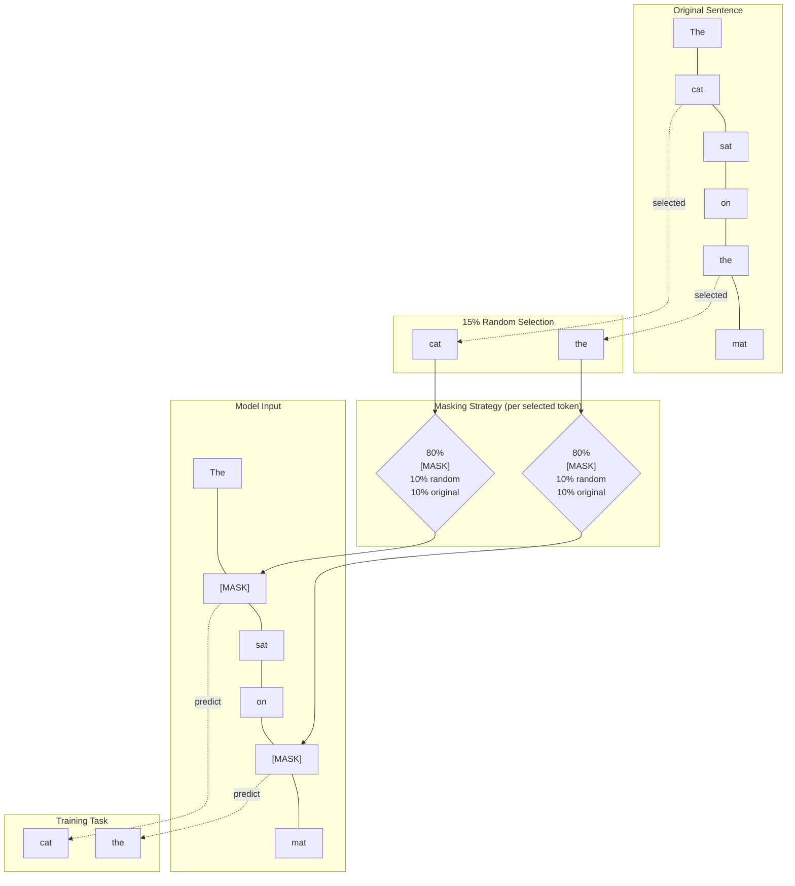
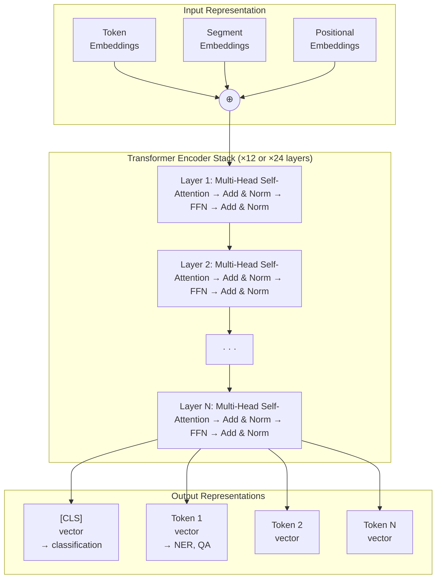
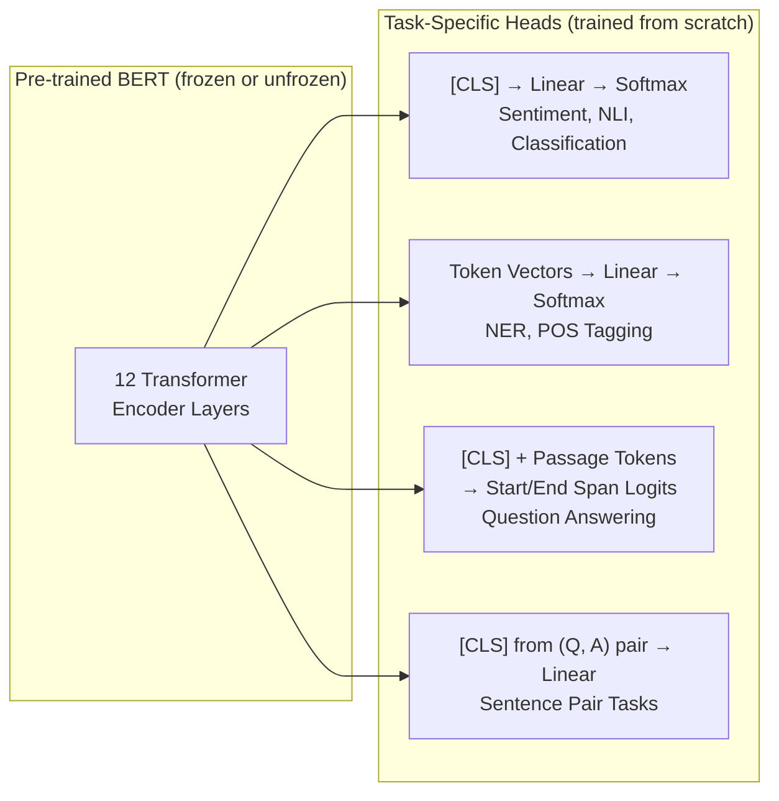

# BERT: How Machines Learned to Read in Both Directions

## November 2018

Eleven NLP benchmarks. Eleven new state-of-the-art results. Released simultaneously. From a single model.

When Jacob Devlin and his colleagues at Google AI published "BERT: Pre-training of Deep Bidirectional Transformers for Language Understanding," the reaction in the NLP community was something between awe and mild disorientation. People had grown accustomed to incremental progress—a point here, half a point there, a new trick on one benchmark. BERT didn't play that game. It arrived with the confidence of something that had solved a structural problem, not just optimized an existing solution.

The improvements were not marginal. On SQuAD 1.1, a reading comprehension benchmark where the model answers questions about passages, BERT exceeded human performance. On GLUE—a collection of nine different language understanding tasks—it surpassed all previous models by 7.6 percentage points. The numbers weren't just good. They were embarrassingly good, in the way that makes you wonder whether the previous approaches had been missing something fundamental.

They had.

The paper's title contains the word that matters most: *bidirectional*. Understanding why bidirectionality was the missing piece, how BERT achieves it, and what that achievement unlocked—that is the story of this paper, and in many ways the story of modern NLP.

## The Problem with Reading Left to Right

To understand what BERT fixed, you need to understand what was broken.

The Transformer architecture, introduced in 2017, was a breakthrough in sequence modeling. But the original Transformer was designed for translation—an encoder-decoder system. When researchers adapted it for language modeling, they faced a choice about how to train the model.

The natural approach was **causal language modeling**: train the model to predict the next word given all previous words. GPT (OpenAI, 2018) took this approach. At each position, the model can only attend to previous positions. It reads strictly left to right, and when it processes the word "bank" in the sentence "I went to the bank to deposit money," it hasn't yet seen "deposit"—the word that would disambiguate this as a financial institution, not a riverbank.

This is not a quirk. It is a fundamental constraint baked into the architecture. To train a causal language model, you must prevent the model from "seeing the future" during training. The masking is enforced via what's called a **causal attention mask**, which zeroes out all attention weights pointing to future positions.

```
For the sequence: "The cat sat on the mat"

GPT sees:
Position 1: "The" → can attend to: ["The"]
Position 2: "cat" → can attend to: ["The", "cat"]
Position 3: "sat" → can attend to: ["The", "cat", "sat"]
Position 4: "on"  → can attend to: ["The", "cat", "sat", "on"]
...
```

The model learns to generate coherent continuations. It becomes an excellent predictor of what comes next. But predicting what comes next and *understanding the meaning* of what you've read are different cognitive tasks. A model that reads only left to right has access to an incomplete picture when processing any given word.

There was an earlier attempt at bidirectionality: ELMo (2018), which stood for Embeddings from Language Models. ELMo ran two separate language models—one left-to-right, one right-to-left—and concatenated their representations. This was better than pure left-to-right, but the bidirectionality was shallow. The two models never actually interacted. They each produced their own representation, and those representations were stitched together afterward. The left-to-right model never "knew" what the right-to-left model knew, and vice versa.

What BERT's authors wanted was true, deep bidirectionality: a single model where every position can attend to every other position, left and right simultaneously, throughout all layers of the network. Meaning built from complete context at every step.

There was just one problem. You cannot train this with standard language modeling. If every position can see every other position, predicting the next word becomes trivial—you simply look at the position immediately to the right. The training signal collapses.

The solution required a different question to ask.

## The Masked Language Model: A New Kind of Test

The insight that unlocked bidirectionality came from an old idea in linguistics and education: the **cloze task**.

A cloze test presents a reader with a passage where some words have been removed, and asks them to fill in the blanks. "The cat sat on the _____." To answer correctly, you use context—words that appear before and after the blank. This is inherently bidirectional.

BERT formalized this into a training objective called **Masked Language Modeling (MLM)**. The procedure is elegant:

1. Take a sequence of text from a large corpus.
2. Randomly select 15% of the tokens.
3. For each selected token:
   - With 80% probability, replace it with a special `[MASK]` token.
   - With 10% probability, replace it with a random token from the vocabulary.
   - With 10% probability, keep it unchanged.
4. Train the model to predict the original token at every masked position.

The 15% masking rate is not arbitrary—it represents a balance between providing enough training signal per sequence and preserving enough context for the model to make meaningful predictions. At 15%, roughly 1 in 7 tokens is masked. The model must use the surrounding 6 tokens (on average) to reconstruct each masked one.

The breakdown within the selected 15%—80/10/10—is equally deliberate. If every masked token became `[MASK]`, the model would develop a representation specifically tuned to the presence of `[MASK]` tokens, and since `[MASK]` never appears at fine-tuning time, there would be a mismatch. The 10% random tokens force the model to maintain useful representations for all tokens, since it can never be sure whether any given token is the original or a replacement. The 10% unchanged tokens prevent the model from assuming that non-`[MASK]` tokens are always correct.



Consider what the model must do to predict `[MASK]` in the sentence "The `[MASK]` sat on the mat." It sees "The" before the blank and "sat on the mat" after it. The word that fills this blank is a living thing that sits on mats—almost certainly a cat or a dog. The model is forced to integrate both left and right context simultaneously to produce a good representation.

Now consider the same blank in "The `[MASK]` in the refrigerator was spoiled." The context after the blank—"in the refrigerator was spoiled"—is essential for disambiguation. A purely left-to-right model, trained never to peek right, would systematically underperform on this task. MLM makes right-context not just useful but necessary.

## The Second Objective: Next Sentence Prediction

Language understanding is not only about individual words and their contexts. It involves understanding relationships between sentences—whether one sentence follows naturally from another, whether an answer addresses a question, whether two statements are in contradiction.

BERT's second pre-training objective addresses this directly: **Next Sentence Prediction (NSP)**.

For each training example, BERT receives two sentences (A and B) separated by a special `[SEP]` token. Fifty percent of the time, B is the actual next sentence following A in the original text. The other fifty percent, B is a random sentence from the corpus.

The model must predict, using only a special `[CLS]` token prepended to the entire input, whether the pair is a genuine consecutive pair (`IsNext`) or a random juxtaposition (`NotNext`).

```
Input format:

[CLS] Sentence A [SEP] Sentence B [SEP]

Example (IsNext = True):
[CLS] The dog chased the ball. [SEP] It ran across the yard for hours. [SEP]

Example (IsNext = False):
[CLS] The dog chased the ball. [SEP] Photosynthesis occurs in chloroplasts. [SEP]
```

The `[CLS]` token is not incidental. By the time the model's final layer processes it, this token has attended to every other token in the input through all twelve (or twenty-four) layers of self-attention. It accumulates a holistic representation of the entire input. For NSP, a linear classifier sits on top of the `[CLS]` representation and predicts `IsNext` or `NotNext`. For downstream classification tasks, the same `[CLS]` representation becomes the input to the task-specific head.

It is worth noting that subsequent research—particularly RoBERTa (2019)—found that removing NSP and training on longer sequences often improved downstream performance. The community's consensus settled on a more nuanced view: NSP as originally formulated may have been too easy, since the `NotNext` examples came from completely different documents and the model could distinguish them by topic alone rather than by true discourse understanding. But this complication came later. In BERT's original form, NSP trained genuine cross-sentence reasoning capabilities for tasks like question answering and natural language inference.

## The Architecture: An Encoder, Pure and Entire

BERT does not use the full Transformer. It uses only the **encoder stack**—the left half of the original architecture from "Attention is All You Need."

This choice is a consequence of the training objective. A causal language model needs the decoder's masked attention, which prevents future-position leakage. MLM needs the encoder's full bidirectional attention, where every position can attend to every other. BERT discards the decoder entirely because it has no use for it: it is not generating sequences. It is building representations.

BERT was released in two configurations:

| Configuration | Layers ($L$) | Hidden size ($H$) | Attention heads ($A$) | Parameters |
|---|---|---|---|---|
| BERT-base | 12 | 768 | 12 | 110M |
| BERT-large | 24 | 1024 | 16 | 340M |

The notation $L$/$H$/$A$ appears throughout the paper. Twelve layers means twelve sequential blocks of self-attention plus feedforward processing. Hidden size 768 means every token at every layer is represented as a 768-dimensional vector. Twelve attention heads means the model runs twelve parallel attention computations per layer, each learning to attend to the input from a different perspective.

For reference, the original Transformer used 6 encoder layers with 512-dimensional hidden states. BERT-base doubles the depth and hidden dimension. BERT-large is a substantial further scaling.



## Input Representation: Three Embeddings, One Signal

Before the Transformer processes anything, the raw input must be converted into vectors. BERT's input representation is the sum of three distinct embeddings:

**Token Embeddings** convert each token to a learned vector. BERT uses **WordPiece tokenization**, which splits words into subword units. "unaffable" might become `["un", "##aff", "##able"]`. This handles out-of-vocabulary words gracefully: even if "unaffable" was never seen during training, its subwords probably were. The `##` prefix signals continuation of a word. The vocabulary contains 30,000 subword units.

**Segment Embeddings** tell the model which sentence each token belongs to. Every token in sentence A receives embedding $E_A$; every token in sentence B receives $E_B$. For single-sentence tasks, all tokens get $E_A$. This simple binary signal enables the model to learn cross-sentence relationships during NSP and carry that capability into fine-tuning.

**Positional Embeddings** encode each token's position in the sequence. Unlike the original Transformer's fixed sinusoidal encodings, BERT learns its positional embeddings during pre-training. Position 0 is the `[CLS]` token. Positions 1 through $n$ are the actual content tokens. BERT supports sequences up to 512 tokens—a constraint that became significant as models scaled to handle longer documents.

The final input vector for each token is the element-wise sum of all three:

$$\text{Input}_i = E_{\text{token}_i} + E_{\text{segment}_i} + E_{\text{position}_i}$$

```python
# Illustrating the three-embedding structure
# (Simplified; actual BERT uses torch.nn.Embedding)

class BERTInputRepresentation(nn.Module):
    def __init__(self, vocab_size, max_seq_len, hidden_size, num_segments=2):
        super().__init__()
        self.token_embeddings    = nn.Embedding(vocab_size, hidden_size)
        self.segment_embeddings  = nn.Embedding(num_segments, hidden_size)
        self.position_embeddings = nn.Embedding(max_seq_len, hidden_size)
        self.norm = nn.LayerNorm(hidden_size)
        self.dropout = nn.Dropout(0.1)

    def forward(self, input_ids, segment_ids):
        seq_len = input_ids.size(1)
        position_ids = torch.arange(seq_len, dtype=torch.long, device=input_ids.device)
        position_ids = position_ids.unsqueeze(0).expand_as(input_ids)

        token_emb    = self.token_embeddings(input_ids)
        segment_emb  = self.segment_embeddings(segment_ids)
        position_emb = self.position_embeddings(position_ids)

        # Sum — not concatenate — all three
        embeddings = token_emb + segment_emb + position_emb
        return self.dropout(self.norm(embeddings))
```

Three sources of information, added together into a single vector that the Transformer then processes. The network's job is to learn which dimensions of that vector to use for syntax, which for semantics, which for position, which for sentence identity—and how all of those interact.

## Pre-Training at Scale

The pre-training corpus consisted of two sources:

**BooksCorpus**: 800 million words from unpublished novels. The choice was deliberate. Books contain long, coherent passages where sentences that are far apart still relate to each other. This forces the model to learn long-range discourse structure rather than just local co-occurrence patterns.

**English Wikipedia**: 2.5 billion words from the encyclopedia, text only—no tables, no lists, no non-prose content. Wikipedia's encyclopedic range and generally high-quality prose provided breadth.

Together: approximately 3.3 billion words. For comparison, a human reads roughly 1-2 million words per year. BERT was pre-trained on what amounts to thousands of years of reading, compressed into a few days of GPU computation.

The computational cost was significant. BERT-base trained for 1 million steps on batches of 256 sequences, each 512 tokens long—about 3.3 billion token-pairs seen during pre-training. BERT-large used 64 Cloud TPU v3 chips for four days. This was expensive enough in 2018 that it effectively limited who could train BERT from scratch. The release of pre-trained weights democratized access: anyone could fine-tune BERT without repeating the pre-training.

## Fine-Tuning: One Model, Every Task

The pre-training/fine-tuning paradigm is perhaps BERT's most consequential contribution. The idea is not entirely new—transfer learning has existed since the early days of deep learning for vision—but BERT demonstrated that it worked for NLP at a scale and generality that nobody had seen before.

Fine-tuning means taking the pre-trained BERT weights and continuing training on a small labeled dataset for a specific downstream task, with minimal architectural modification. The key insight is that BERT's representations, learned from predicting masked tokens and sentence relationships, are general enough to be useful for almost any task that requires language understanding.

The modifications required are genuinely minimal:



**Sentence classification** (sentiment, topic, acceptability): Feed the sentence through BERT. Take the `[CLS]` vector from the final layer. Pass it through a linear classifier. Fine-tune the entire network end-to-end.

**Token classification** (named entity recognition, POS tagging): Feed the sentence through BERT. Take every token's vector from the final layer. Pass each through a linear classifier that predicts the label for that token.

**Question answering** (extractive QA): Concatenate the question and passage with a `[SEP]` token. Feed through BERT. Train two linear layers—one to predict the start of the answer span, one to predict the end—over the passage token vectors.

**Natural Language Inference** (determining whether a hypothesis is entailed by a premise): Encode both sentences together, separated by `[SEP]`. Use the `[CLS]` representation for classification.

In each case, the task-specific parameters are minimal—a single linear layer, sometimes two. Everything else is shared from pre-training. Fine-tuning a BERT model for sentiment analysis on 10,000 examples typically takes minutes on a single GPU. The heavy lifting was done during pre-training.

Here is what fine-tuning looks like with Hugging Face Transformers—the library that made BERT practically accessible to the entire field:

```python
from transformers import (
    AutoTokenizer,
    AutoModelForSequenceClassification,
    TrainingArguments,
    Trainer,
)
from datasets import load_dataset
import numpy as np
from sklearn.metrics import accuracy_score, f1_score

# Load pre-trained BERT — weights downloaded automatically
model_name = "bert-base-uncased"
tokenizer  = AutoTokenizer.from_pretrained(model_name)

# Load and tokenize data
dataset = load_dataset("imdb")

def tokenize(examples):
    return tokenizer(
        examples["text"],
        truncation=True,
        padding="max_length",
        max_length=512,
    )

tokenized = dataset.map(tokenize, batched=True)

# Add a classification head: bert-base-uncased + 2-class linear layer
model = AutoModelForSequenceClassification.from_pretrained(
    model_name,
    num_labels=2,
)

def compute_metrics(eval_pred):
    logits, labels = eval_pred
    preds = np.argmax(logits, axis=-1)
    return {
        "accuracy": accuracy_score(labels, preds),
        "f1": f1_score(labels, preds, average="binary"),
    }

training_args = TrainingArguments(
    output_dir="./bert-imdb",
    num_train_epochs=3,
    per_device_train_batch_size=16,
    per_device_eval_batch_size=32,
    learning_rate=2e-5,
    weight_decay=0.01,
    warmup_ratio=0.1,
    evaluation_strategy="epoch",
    save_strategy="epoch",
    load_best_model_at_end=True,
    metric_for_best_model="f1",
    logging_dir="./logs",
)

trainer = Trainer(
    model=model,
    args=training_args,
    train_dataset=tokenized["train"],
    eval_dataset=tokenized["test"],
    compute_metrics=compute_metrics,
)

trainer.train()
# Fine-tuning BERT on IMDB typically yields ~93-94% accuracy
# Previous state-of-the-art with LSTMs: ~89-90%
```

The learning rate of `2e-5` is characteristic. BERT's pre-trained weights are valuable—you want to adjust them slightly, not overwrite them. High learning rates would destroy the learned representations before the task-specific head has a chance to adapt. The warmup period lets the new classification head stabilize before the gradients start shifting the pre-trained layers.

## The Results That Changed the Conversation

When the paper was released alongside pre-trained weights, the community was effectively invited to run the fine-tuning experiments themselves. The results confirmed what the paper reported:

On **GLUE** (General Language Understanding Evaluation), a multi-task benchmark covering sentence similarity, textual entailment, sentiment, and more, BERT-large scored 80.4 compared to the previous best of 72.8. On the diagnostic test designed to challenge models on linguistic phenomena like negation, double negatives, and quantification—BERT improved by 17 points.

On **SQuAD 1.1** (Stanford Question Answering Dataset), BERT's F1 score of 93.2 exceeded the human baseline of 91.2. The model wasn't just better than previous systems. It was better than humans at extracting answers from passages—on this particular benchmark, with this particular format.

On **SQuAD 2.0**, which added unanswerable questions (requiring the model to say "I don't know" when the passage doesn't contain the answer), BERT achieved an F1 of 83.1, compared to 66.3 for the previous best.

On **SWAG** (Situations With Adversarial Generations), a commonsense inference task where the model must choose the most plausible continuation from four options, BERT-large scored 86.3 compared to 73.4 for the previous best—an improvement of nearly 13 points.

What unified all of these results was the same pre-trained model, with only a lightweight task-specific head. The same 110 million parameters, tuned slightly differently for each task, beat specialized architectures that had been designed specifically for each benchmark.

## What Does BERT Actually Learn?

A model that improves on eleven benchmarks simultaneously is doing *something* right. But what, exactly?

This question launched an entire subfield: **BERTology**—the probing study of what linguistic knowledge BERT encodes, where it encodes it, and how. The findings are illuminating and, in places, humbling.

**Syntactic knowledge**: Probing experiments—where small classifiers are trained to predict syntactic properties from BERT's intermediate representations—showed that BERT learns substantial syntactic structure. Part-of-speech tags are recoverable from lower layers (2-4). Constituency structure is represented in middle layers (5-8). Dependency parse information peaks around layers 6-9. Syntactic structure is encoded without BERT ever being trained on parse trees.

**Long-range subject-verb agreement**: BERT correctly assigns "is" vs. "are" even when there are several intervening noun phrases that could distract a simpler model. "The keys to the cabinet are on the table" — BERT knows the plural verb agrees with "keys," not "cabinet," despite "cabinet" being syntactically closer to the verb.

**Coreference**: BERT handles pronoun resolution at impressive accuracy. The classic challenge—"The trophy doesn't fit in the suitcase because it is too large" (what is too large?) versus "The trophy doesn't fit in the suitcase because it is too small" (what is too small?)—requires genuine situational understanding. BERT handles many such cases correctly.

**Attention head specialization**: Individual attention heads develop identifiable behaviors. Some heads consistently attend to the next token. Others attend to the previous token. Some heads in higher layers develop patterns corresponding to syntactic dependencies—the head of a noun phrase attending to its determiner, or a verb attending to its direct object. This specialization emerges from training on masked prediction alone. No labels for syntax were provided.

**What BERT doesn't know**: Probing studies also revealed genuine gaps. BERT's logical reasoning is weak—it struggles with negation, with quantifiers ("all," "some," "no"), and with formal entailment. It sometimes relies on surface-level statistical correlations rather than genuine semantic understanding. It fails on carefully constructed adversarial examples that are trivial for humans.

The picture that emerges is of a model with impressive but uneven linguistic knowledge—rich syntactic intuitions, good semantic clustering, weak formal reasoning. It knows how language works as a pattern more than it knows what language is about.

## The BERT Family: What Came After

BERT's release triggered a wave of follow-up work that refined, extended, and specialized the approach.

**RoBERTa (2019)** — from Facebook AI — asked a simple question: was BERT undertrained? The answer was yes. RoBERTa (Robustly optimized BERT approach) removed NSP, trained on more data (160GB vs. 16GB), used larger batches, and trained for longer. No architectural changes whatsoever. The improvements were substantial—RoBERTa outperformed BERT-large on most benchmarks, suggesting that the original model had not converged and that NSP was a distraction rather than a benefit.

**DistilBERT (2019)** — from Hugging Face — addressed the deployment cost. BERT-base with 110M parameters is not lightweight. DistilBERT used **knowledge distillation**: train a smaller 6-layer model to mimic the behavior of the full 12-layer BERT, rather than training on raw data. The result was 60% smaller, 40% faster, and retained 97% of BERT's performance on GLUE. For production systems where latency matters, DistilBERT is often the practical choice.

**ALBERT (2019)** — Lite BERT, from Google — achieved parameter efficiency through two structural changes. **Factorized embedding parameterization** separates the embedding dimension from the hidden dimension, reducing the vocabulary embedding matrix significantly. **Cross-layer parameter sharing** uses the same parameters in every Transformer layer rather than learning distinct parameters per layer. ALBERT-xxlarge achieves higher performance than BERT-large with fewer parameters (235M vs. 340M), though inference is not faster because the number of layers is unchanged.

**DeBERTa (2020)** — Decoding-enhanced BERT with disentangled attention, from Microsoft — made the most sophisticated architectural contribution. Standard BERT adds positional embeddings to token embeddings and feeds the combined vector into the attention mechanism, where content and position are entangled. DeBERTa disentangles them: each attention score is computed as the sum of four terms involving content-to-content, content-to-position, position-to-content, and position-to-position interactions. This gives the model finer-grained control over how position influences attention. DeBERTa held the top GLUE benchmark position for much of 2021 and 2022.

**Domain-specific BERTs**: The general recipe transferred cleanly to specialized domains. BioBERT, pre-trained on PubMed abstracts and full-text articles, significantly outperformed BERT on biomedical NLP tasks. LegalBERT, pre-trained on court decisions and contracts, improved performance on legal document classification. SciBERT, pre-trained on computer science and biomedical papers, outperformed BERT on scientific NLP benchmarks. The lesson: if your domain has substantially different vocabulary and sentence structure from Wikipedia and books, domain-specific pre-training matters.

**XLM-RoBERTa (2019)** — from Facebook AI — extended the approach to 100 languages simultaneously. Pre-trained on 2.5TB of multilingual CommonCrawl text, it demonstrated that a single model could achieve strong performance across languages and even exhibit cross-lingual transfer: fine-tuning on English training data and evaluating on French, German, or Chinese.

| Model | Params | GLUE | Key innovation |
|---|---|---|---|
| BERT-base | 110M | 79.6 | Original bidirectional pre-training |
| BERT-large | 340M | 80.4 | Scale |
| RoBERTa | 355M | 88.5 | Better pre-training recipe |
| DistilBERT | 66M | 77.0 | Knowledge distillation |
| ALBERT-xxlarge | 235M | 90.9 | Parameter sharing + factorization |
| DeBERTa-xxlarge | 1.5B | 92.8 | Disentangled attention |

## The Deeper Lesson: Pre-Training as Compression

There is a way to think about BERT that connects it to something more fundamental than "better NLP benchmark scores."

Language is structured at every scale. Individual words have internal morphological structure. Phrases follow syntactic rules. Sentences express propositions with logical relationships. Paragraphs maintain topical coherence. Texts follow genre conventions. All of these levels of structure are present, simultaneously, in any piece of human-written text.

MLM, as a training objective, does not directly supervise any of these levels. It simply asks: given the surrounding context, what word was here? But to answer that question consistently across a large corpus, the model must implicitly learn about all of them. To predict a masked verb, you need to know the grammatical role of the surrounding noun phrases. To predict a masked noun, you need to know the semantic field established by the surrounding discourse. The training objective is shallow; the representations learned to achieve it are deep.

This is what "pre-training as compression" means. The 3.3 billion words in BERT's training corpus carry an enormous amount of information about how language works—its syntax, its semantics, its pragmatics. The pre-training process compresses this information into the 110 million parameters of BERT-base. Fine-tuning recovers the relevant compressed knowledge for a specific task.

The consequence is counterintuitive but empirically clear: a model trained on unlabeled text outperforms models trained on labeled data for specific tasks. The signal in raw text—billions of words of it—is richer than the signal in any labeled dataset. Supervised fine-tuning on 10,000 labeled examples, atop pre-training on 3.3 billion words, beats supervised training on 10,000 labeled examples alone by a wide margin. The labeled data specifies which capability to extract. The pre-training provides the capability.

## Limitations: What BERT Cannot Do

Clarity about BERT's limitations is as important as appreciation for its strengths.

**The 512-token ceiling**. BERT was pre-trained with positional embeddings for up to 512 tokens. Sequences longer than this must be truncated or broken into chunks with sliding windows. For classification of long documents, many potentially relevant passages are simply discarded. For tasks requiring holistic document understanding—summarization, long-form question answering—this is a significant constraint.

**The `[MASK]` mismatch**. During pre-training, `[MASK]` tokens appear frequently. During fine-tuning, they never appear. This discrepancy means the model is trained in a slightly different regime from the one it is deployed in. The 10/10 noise injection during masking mitigates this but doesn't eliminate it. Later models (like ELECTRA, which replaced the masking objective with a discriminator-based approach) addressed this more directly.

**No generation**. BERT is an encoder. It produces representations; it does not generate text. For tasks requiring text generation—summarization, translation, dialogue—BERT is inappropriate. The encoder-only design is a deliberate trade-off: it enables full bidirectionality, but at the cost of generative capability.

**Computational cost at inference**. BERT-base runs 110 million parameters through 12 Transformer layers for every inference call. For high-throughput production systems—classifying millions of short texts per day—this can be prohibitively expensive. DistilBERT, BERT with quantization, or entirely different architectures (like ONNX-exported models with optimized runtimes) address this in practice.

**Statistical, not logical, understanding**. BERT models statistical patterns in language. It has no formal semantics, no logical inference engine, no world model. Tasks that require reasoning under negation, quantifier scope, or formal entailment remain challenging. It is a very powerful pattern-matcher, not a reasoner.

## The Path Forward

BERT sits at the inflection point of a trajectory.

Before BERT: NLP tasks required task-specific architectures, careful feature engineering, and models that were brittle to domain shift.

After BERT: The default approach is to start with a pre-trained language model and fine-tune. The question became not "how do I design a model for this task" but "which pre-trained model, and how do I adapt it."

The paradigm BERT established—pre-train on unlabeled text, fine-tune on labeled data—turned out to have headroom nobody had anticipated. Scale it up: GPT-2 (1.5B parameters), GPT-3 (175B parameters), PaLM (540B parameters). Instruction-tune it: teach it to follow directions, not just predict next tokens. Apply RLHF to align it with human preferences. The result, a few years later, was ChatGPT.

BERT's specific architecture—12 layers of bidirectional encoder self-attention—was superseded quickly. But the *idea* it validated, that language understanding can emerge from self-supervised pre-training on raw text at scale, turned out to be the central idea of the decade that followed.

The encoder-decoder Transformer was the architectural breakthrough. BERT was the empirical proof that the breakthrough could be harvested—that the representations learned by a Transformer pre-trained on language were general enough to be immediately useful for almost anything involving text.

## When Bidirectionality Sees Everything

There is something almost philosophical about what BERT does when it reads.

Human reading is sequential. We encounter words left to right, and meaning accretes as we go. But understanding is retroactive: the word at the end of a sentence can change the meaning of the word at the beginning. "The soldier decided to spare his enemy." "The soldier had no time to spare." The word "spare" means something different in each sentence, and you need both the words before it and after it to know which.

BERT doesn't read sequentially. Every token, at every layer, simultaneously attends to every other token. There is no "reading forward" and then "revising." Every word is processed in the full light of every other word, at once. The attention mechanism produces, for each token, a weighted average of every other token's representation—weighted by relevance. Meaning emerges not from sequential accumulation but from a kind of simultaneous consideration.

Whether this is "understanding" in any philosophically meaningful sense is a question worth sitting with. BERT passed human-level benchmarks on reading comprehension tests. It did so without having read anything, without having seen anything, without having any sensory experience of the world that language is about. It learned the *pattern* of language from text alone.

What that fact means—whether it suggests that language comprehension is more statistical than we believed, or whether it reveals a gap between benchmark performance and genuine understanding—is still being debated. BERT opened the question as much as it answered it.

What is not in debate is the practical consequence: machines that process language as BERT does are genuinely useful in a way that earlier approaches were not. And the design choice that made BERT—letting the model see in both directions, trusting the masked prediction objective to do the rest—turned out to be the key that unlocked it.

---

## Going Deeper

**The Paper Itself:**
- Devlin, J., Chang, M. W., Lee, K., & Toutanova, K. (2019). ["BERT: Pre-training of Deep Bidirectional Transformers for Language Understanding."](https://arxiv.org/abs/1810.04805) *NAACL 2019*. — Read the original. It is clearly written and the ablation studies are illuminating.

**The Transformer Foundation:**
- Vaswani, A., et al. (2017). ["Attention is All You Need."](https://arxiv.org/abs/1706.03762) *NeurIPS 2017*. — The architecture BERT is built on.

**Critical Follow-ups:**
- Liu, Y., et al. (2019). ["RoBERTa: A Robustly Optimized BERT Pretraining Approach."](https://arxiv.org/abs/1907.11692) — What happens when you take BERT's recipe seriously.
- Sanh, V., et al. (2019). ["DistilBERT, a distilled version of BERT."](https://arxiv.org/abs/1910.01108) — Making BERT deployable.
- He, P., et al. (2020). ["DeBERTa: Decoding-enhanced BERT with Disentangled Attention."](https://arxiv.org/abs/2006.03654) — The architectural refinement that held the GLUE record.

**BERTology — What Is Learned:**
- Rogers, A., Kovaleva, O., & Rumshisky, A. (2020). ["A Primer in BERTology: What We Know About How BERT Works."](https://arxiv.org/abs/2002.12327) — The most comprehensive survey of probing experiments. Essential reading for understanding what the model actually encodes.
- Clark, K., et al. (2019). ["What Does BERT Look at? An Analysis of BERT's Attention."](https://arxiv.org/abs/1906.04341) — Attention head specialization and syntactic structure.

**For Implementation:**
- [Hugging Face Transformers Documentation](https://huggingface.co/docs/transformers/model_doc/bert) — The canonical library for working with BERT in practice.
- [The Illustrated BERT](https://jalammar.github.io/illustrated-bert/) (Jay Alammar) — Exceptional visual walkthrough of the architecture and pre-training objectives.
- [BERT Fine-Tuning Tutorial with PyTorch](https://mccormickml.com/2019/07/22/BERT-fine-tuning/) (Chris McCormick) — Thorough practical guide.
