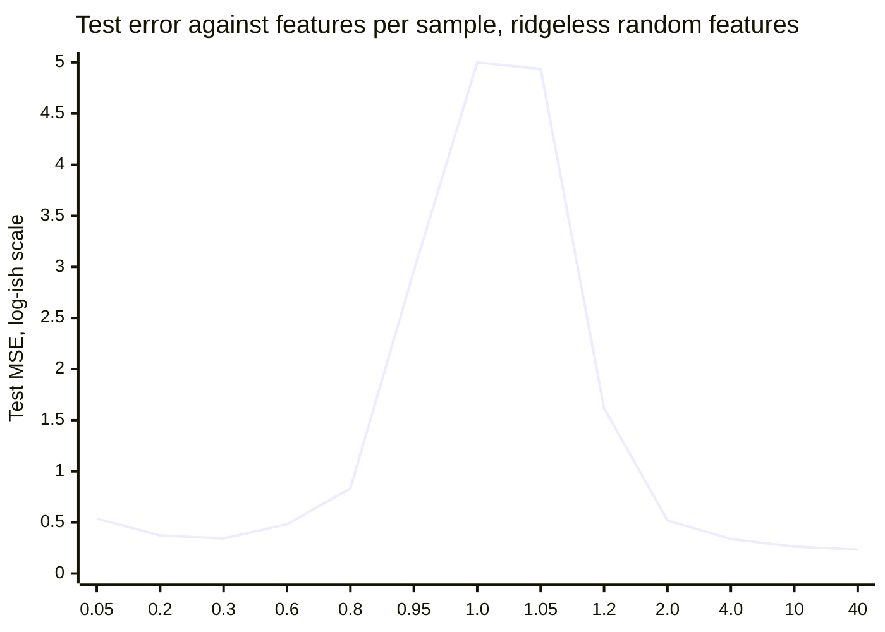
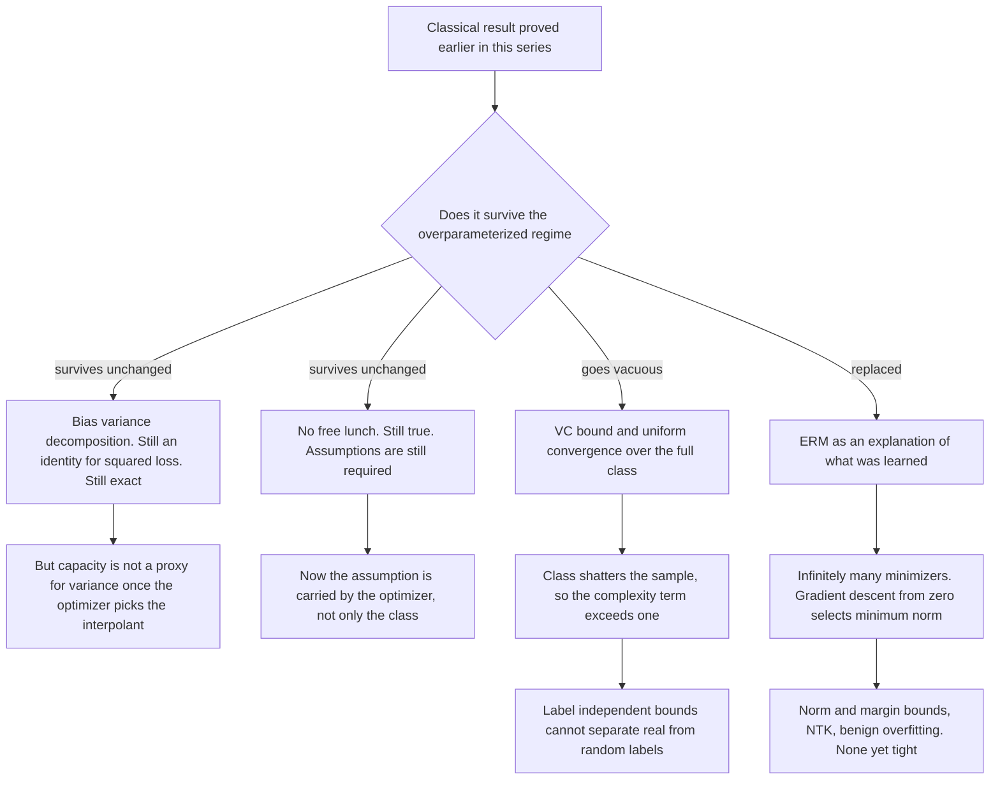

# Double Descent: Where the Classical Theory Runs Out

*Part of "Why Learning Works: The Theorems Behind Machine Learning," and the final instalment. Everything before this post proved that learning works. This one is about the regime where those proofs stop saying anything, why they stop, and what has been put in their place so far.*

---

## The Contradiction

Two results from earlier in this series, both correct, both proved:

The bias-variance decomposition says that as capacity grows, squared bias falls and variance rises, so test error traces a U and the useful model sits at the bottom of it. Past that point, extra capacity buys approximation power you cannot pay for. The post that derived it measured the U on polynomial regression and watched variance reach $5.9 \times 10^6$ at degree fifteen.

The VC bound says that a class of VC dimension $d$ generalizes with a slack term of order $\sqrt{d \log(n/d) / n}$, so a class whose dimension exceeds the sample size carries a slack larger than $1$ and the bound certifies nothing.

Now take a network with $10^9$ parameters trained on $10^6$ images. The U-curve says it is far past the minimum. The VC bound says its guarantee is vacuous. Both statements are correct, and the network has a test error of a few percent.

The temptation is to pick a side: either the classical theory was wrong, or deep learning is a mysterious exception that theory will eventually absorb unchanged. Both are wrong, and both are lazy. The theorems are true. Their hypotheses are satisfied. What fails is a step of reasoning that never appeared in either theorem and that everyone supplies for free — the step from *the bound is loose* to *the model is bad*. Finding exactly where that step enters is more interesting than defending or discarding anything, so that is what this post does.

---

## The Experiment That Broke the Frame

In 2017, Chiyuan Zhang, Samy Bengio, Moritz Hardt, Benjamin Recht and Oriol Vinyals published *Understanding deep learning requires rethinking generalization* at ICLR, where it won a best-paper award. The experiment is one paragraph to describe and it settled the question.

Take a standard convolutional architecture — Inception, AlexNet, an MLP — and CIFAR-10 or ImageNet. Now destroy the labels. Replace each label with a uniformly random class, so that the label carries no information whatsoever about the image. Train with the usual pipeline, unchanged.

The network reaches zero training error. It takes somewhat longer to converge, but not much, and the training curve looks qualitatively like the real one. The same holds when the *images* are replaced with Gaussian noise, and it holds with weight decay, dropout and data augmentation switched on. Explicit regularization slows the memorization down; it does not prevent it.

### The Consequence, Stated Precisely

This is the sharpest argument available about capacity bounds for deep networks, and it is worth stating so that no step is hidden.

Fix an architecture, and let $\mathcal{H}$ be the set of predictors it can express. Let $S = (x_1, \dots, x_n)$ be a training set of $n$ images. What the experiment establishes is that for essentially every labelling $\sigma \in \{-1,+1\}^n$ of those images there is some $h \in \mathcal{H}$ with $h(x_i) = \sigma_i$ for all $i$: the class shatters $S$.

Now consider a bound of the shape every result in this series has produced,

$$
R(h) \;\leq\; \hat{R}_S(h) \;+\; \mathrm{comp}(\mathcal{H}, n, \delta) \qquad \text{for all } h \in \mathcal{H},
$$

where $\mathrm{comp}$ depends on the hypothesis class, the sample size and the confidence level, but *not* on the labels. Every VC bound and every uniform-convergence bound over a full class has this shape.

> **Proposition.** If $\mathcal{H}$ shatters $S$ and the bound above holds with probability at least $1-\delta$ over samples of size $n$ from every distribution, then $\mathrm{comp}(\mathcal{H}, n, \delta) \geq 1/2 - o(1)$.

*Proof.* Let $D$ be the distribution that draws $x$ from the image distribution and then assigns a label by an independent fair coin. Under $D$, every predictor has true risk exactly $1/2$, since the label is independent of everything the predictor sees. Draw $S \sim D^n$. Because $\mathcal{H}$ shatters $S$, there is $h \in \mathcal{H}$ with $\hat{R}_S(h) = 0$; that is precisely what the random-label experiment exhibits, and the bound holds for all $h \in \mathcal{H}$ simultaneously, so it holds for that one. Substituting,

$$
\tfrac{1}{2} \;=\; R(h) \;\leq\; 0 + \mathrm{comp}(\mathcal{H}, n, \delta). \;\blacksquare
$$

The $o(1)$ absorbs the event of probability $\delta$ and the fact that shattering holds for almost all rather than all labellings; neither changes the conclusion. The point is that $\mathrm{comp}$ cannot see the labels, so *the same number* appears in the bound for the random-label run and for the real one. A network that achieves $4\%$ test error on real CIFAR-10 is certified by this bound to have error at most $0 + 1/2$. The bound is not wrong. It is correct and useless, and it is correct-and-useless for a reason internal to its own construction.

The Rademacher version makes the same computation exact. Recall the empirical Rademacher complexity of a class of $\pm 1$-valued functions,

$$
\hat{\mathfrak{R}}_S(\mathcal{H}) \;=\; \mathbb{E}_{\sigma}\left[\sup_{h \in \mathcal{H}} \frac{1}{n}\sum_{i=1}^{n}\sigma_i h(x_i)\right].
$$

If $\mathcal{H}$ shatters $S$, then for each sign vector $\sigma$ shattering supplies $h_\sigma$ with $h_\sigma(x_i) = \sigma_i$, so the supremum is at least $\frac{1}{n}\sum_i \sigma_i^2 = 1$; and since $|h(x_i)| = 1$ it is at most $1$. So the supremum equals $1$ for every $\sigma$ and $\hat{\mathfrak{R}}_S(\mathcal{H}) = 1$ exactly. The standard bound (Mohri, Rostamizadeh and Talwalkar, Chapter 3) then reads $R(h) \leq \hat{R}_S(h) + 1 + 3\sqrt{\ln(2/\delta)/2n}$, whose right-hand side exceeds $1$ while risk never does.

So the VC route is not refuted for deep networks. It is *uninformative* for them, and the argument above shows that no repair internal to the framework can help: any complexity term that ignores the labels inherits the random-label lower bound. Whatever explains generalization here must depend on the data, or on the algorithm, or on both.

---

## The Double Descent Curve

The empirical shape that replaces the U was named and unified by Mikhail Belkin, Daniel Hsu, Siyuan Ma and Soumik Mandal in *Reconciling modern machine-learning practice and the classical bias-variance trade-off*, *PNAS* 116(32), 2019.

Sweep a capacity parameter $N$ — the number of parameters, features, or hidden units — with the sample size $n$ held fixed, and plot test error against $N$.

**The classical regime, $N < n$.** The model cannot fit the training data exactly. Test error falls, reaches a minimum, and rises. This is the U, and everything the bias-variance post proved applies here without amendment.

**The interpolation threshold, $N \approx n$.** The capacity is just barely sufficient to drive training error to zero. Test error does not merely continue rising; it *spikes*, often by orders of magnitude.

**The modern regime, $N > n$.** Training error stays at zero, and test error *descends again*. With enough capacity it can fall below the classical minimum reached in the first descent.

The threshold is not a vague location. In the least-squares setting it is the exact point where the design matrix stops having full column rank and starts having full row rank, which for generic data is $N = n$: parameters equal to samples. Below it there is no exact fit; above it there are infinitely many.

The curve was not new in 2019. Marco Loog, Tom Viering, Alexander Mey, Jesse Krijthe and David Tax wrote a short *PNAS* letter, *A brief prehistory of double descent*, tracing the same non-monotonicity to work by Vallet and coauthors in 1989 and to the statistical-mechanics literature on learning curves that followed. Belkin and coauthors' contribution was to name it, to show it across model families — random features, random forests, neural networks — and to argue it is the *general* picture of which the U-curve is the left half.

Preetum Nakkiran, Gal Kaplun, Yamini Bansal, Tristan Yang, Boaz Barak and Ilya Sutskever extended it in *Deep Double Descent: Where Bigger Models and More Data Hurt* (2019). They report the peak along three separate axes:

- **Model-wise**, sweeping width at fixed training time — the curve above.
- **Epoch-wise**, sweeping training time at fixed architecture. The same network, trained longer, gets worse and then better again.
- **Sample-wise**, sweeping $n$ at fixed architecture. This is the strange one: they identify regimes where *quadrupling* the training set makes test error worse.

The last deserves a moment, because it sounds like a bug report against statistics itself. It is not. Adding data moves the interpolation threshold: with more samples, a fixed architecture that was comfortably overparameterized becomes merely just-barely-sufficient, and the extra data drags the model toward the peak. Take enough more and it lands on the far side and improves again. Monotone improvement in $n$ holds for a fixed estimator; here the estimator's *regime* changes underneath you.

Nakkiran and coauthors propose *effective model complexity* — the largest $n$ on which a training procedure achieves near-zero error — as the parameter along which all three axes are the same phenomenon. Note the definition quantifies over the training *procedure*, not the architecture. That is a hint about where the answer lives.

---

## Measuring It

None of this needs a GPU. Random-features ridgeless regression reproduces the whole curve in a few lines of numpy: draw $N$ random Fourier features, fit them to $n$ noisy samples by the pseudo-inverse — which returns the minimum-norm least-squares solution — and sweep $N$ across $n$.

```python
import numpy as np

d, n, n_test, sigma, gamma = 8, 100, 4000, 0.10, 0.8
TRIALS = 20

def target(X):
    return np.sin(3.0 * X[:, 0]) + 0.5 * X[:, 1] * X[:, 2] - 0.4 * X[:, 3]

def features(X, W, b):
    return np.sqrt(2.0) * np.cos(X @ W.T + b)          # random Fourier features

gen = np.random.default_rng(0)
X_test = gen.uniform(-1, 1, (n_test, d))
y_test = target(X_test)                                 # noiseless test target

def sweep(N, trials=TRIALS):
    train_err, test_err = [], []
    for t in range(trials):
        r = np.random.default_rng(1000 + t)
        X = r.uniform(-1, 1, (n, d))
        y = target(X) + sigma * r.standard_normal(n)    # noisy training labels
        W = gamma * r.standard_normal((N, d))
        b = r.uniform(0, 2 * np.pi, N)
        Phi = features(X, W, b)
        beta = np.linalg.pinv(Phi) @ y                  # minimum-norm least squares
        train_err.append(np.mean((Phi @ beta - y) ** 2))
        test_err.append(np.mean((features(X_test, W, b) @ beta - y_test) ** 2))
    return np.median(train_err), np.median(test_err)

print(f"{'N':>6} {'N/n':>6} {'train MSE':>12} {'test MSE':>14}")
for N in [5, 10, 20, 30, 40, 60, 80, 95, 100, 105, 120, 200, 400, 1000, 4000]:
    tr, te = sweep(N)
    print(f"{N:6d} {N/n:6.2f} {tr:12.2e} {te:14.4f}")
```

```text
     N    N/n    train MSE       test MSE
     5   0.05     5.10e-01         0.5371
    10   0.10     4.03e-01         0.4723
    20   0.20     2.35e-01         0.3734
    30   0.30     1.56e-01         0.3433
    40   0.40     1.18e-01         0.3602
    60   0.60     6.13e-02         0.4832
    80   0.80     2.87e-02         0.8340
    95   0.95     4.35e-03         2.9599
   100   1.00     6.63e-28        68.7384
   105   1.05     4.09e-29         4.9362
   120   1.20     1.28e-29         1.6167
   200   2.00     1.02e-29         0.5206
   400   4.00     8.99e-30         0.3378
  1000  10.00     5.67e-30         0.2638
  4000  40.00     1.06e-29         0.2343
```

Read the train column first. It falls smoothly, then collapses by twenty-five orders of magnitude between $N = 95$ and $N = 100$: that is the interpolation threshold, and it lands exactly on $N = n = 100$, not near it. From there on the model fits the noisy training labels perfectly, forever.

Now the test column. The classical U bottoms out at $0.3433$ with $N = 30$ features, thirty parameters for a hundred samples. It then climbs, and at $N = 100$ it reaches $68.74$ — a factor of two hundred worse than the classical optimum, with training error at machine zero. One feature later, at $N = 105$, it has already fallen to $4.94$. By $N = 400$ it is back to $0.3378$, and by $N = 4000$ — forty times more parameters than samples — it is $0.2343$, which is *better* than the best model the classical regime could produce.



The plotting axis is clipped at $5$ so the two descents are visible at all; the true value at the threshold is $68.74$, thirteen times off the top of the chart. That clipping is itself the point. The peak is not a bump on a curve, it is a singularity that the surrounding regime does not resemble.

---

## Why the Peak, and Why the Second Descent

Here is the mechanism, and it is a counting argument before it is anything else.

Write the fitted model as $\hat{f}(x) = \langle \beta, \varphi(x)\rangle$ with $\varphi(x) \in \mathbb{R}^N$, and let $\Phi \in \mathbb{R}^{n \times N}$ have rows $\varphi(x_i)^\top$. Interpolation means $\Phi\beta = y$.

**Below the threshold**, $N < n$: the system is overdetermined and generically has no solution. Least squares returns a compromise, and the classical analysis applies.

**At the threshold**, $N = n$: $\Phi$ is generically square and invertible, so there is *exactly one* $\beta$ with $\Phi\beta = y$, namely $\Phi^{-1}y$. There is no choice to make and no room to be sensible. The estimator must absorb every unit of label noise into the one available solution, and it does so through $\Phi^{-1}$, whose norm is governed by the smallest singular value of $\Phi$. For a random matrix that is on its way to zero at exactly this aspect ratio, so $\|\beta\|$ explodes and with it the test error. The $68.74$ in the table above is the smallest singular value of a square random matrix having a bad day.

**Above the threshold**, $N > n$: the system is underdetermined. The solution set $\{\beta : \Phi\beta = y\}$ is an affine subspace of dimension $N - n$, containing infinitely many exact interpolants — some with enormous norm, some with small norm, all with training error exactly zero. Capacity has stopped buying the ability to fit and started buying *choice among fits*.

Which is where the crucial question appears. Every point in that affine subspace is an empirical risk minimizer. The theory built in this series says nothing about which one you get, because ERM as a principle does not specify it. Something outside the objective is choosing, and that something is the optimizer.

### The Implicit Bias of Gradient Descent

> **Theorem (minimum-norm implicit bias).** Let $\Phi \in \mathbb{R}^{n \times N}$ have full row rank $n$, let $y \in \mathbb{R}^n$, and consider $L(\beta) = \tfrac{1}{2}\|\Phi\beta - y\|_2^2$. Run gradient descent $\beta_{t+1} = \beta_t - \eta\, \Phi^\top(\Phi\beta_t - y)$ from $\beta_0 = 0$ with $0 < \eta < 2/\sigma_{\max}(\Phi)^2$. Then
> $$
> \lim_{t \to \infty}\beta_t \;=\; \Phi^{+}y \;=\; \operatorname*{arg\,min}\{\|\beta\|_2 \,:\, \Phi\beta = y\},
> $$
> the unique minimum-$\ell_2$-norm interpolant.

*Proof.* Three steps.

**Every iterate lies in the row space.** Let $\mathcal{R} = \operatorname{range}(\Phi^\top) \subseteq \mathbb{R}^N$. Then $\beta_0 = 0 \in \mathcal{R}$, and if $\beta_t \in \mathcal{R}$ then $\beta_{t+1} = \beta_t - \eta\,\Phi^\top(\Phi\beta_t - y)$ adds a vector of the form $\Phi^\top v$ to $\beta_t$, so $\beta_{t+1} \in \mathcal{R}$. By induction all iterates lie in $\mathcal{R}$, and $\mathcal{R}$ is a finite-dimensional subspace, hence closed, so any limit lies in $\mathcal{R}$ too. Gradient descent never leaves the row space, because it has no mechanism for doing so: the gradient itself lives there.

**The row space contains exactly one interpolant, and it is the smallest.** Since $\Phi$ has full row rank the system is consistent; let $\beta$ and $\beta'$ both satisfy $\Phi\beta = \Phi\beta' = y$. Then $\beta - \beta' \in \mathcal{N}(\Phi)$, the null space, and $\mathbb{R}^N = \mathcal{R}\oplus\mathcal{N}(\Phi)$ orthogonally. So all interpolants share the same component in $\mathcal{R}$ and differ only in $\mathcal{N}(\Phi)$; exactly one of them has zero null-space component, and that is the unique interpolant lying in $\mathcal{R}$. Call it $\beta^{\dagger}$. For any other interpolant $\beta = \beta^{\dagger} + \nu$ with $\nu \in \mathcal{N}(\Phi)$, orthogonality gives $\|\beta\|^2 = \|\beta^{\dagger}\|^2 + \|\nu\|^2 > \|\beta^{\dagger}\|^2$ unless $\nu = 0$. So $\beta^\dagger$ is the minimum-norm interpolant, and $\beta^\dagger = \Phi^\top(\Phi\Phi^\top)^{-1}y = \Phi^{+}y$.

**The iterates converge to it.** Since $\Phi\beta^\dagger = y$, subtracting $\beta^\dagger$ from both sides of the update gives $\beta_{t+1} - \beta^\dagger = (I - \eta\,\Phi^\top\Phi)(\beta_t - \beta^\dagger)$, hence

$$
\beta_t - \beta^{\dagger} \;=\; (I - \eta\,\Phi^\top\Phi)^{t}\,(\beta_0 - \beta^{\dagger}) \;=\; -(I - \eta\,\Phi^\top\Phi)^{t}\beta^{\dagger}.
$$

Diagonalize the symmetric matrix $\Phi^\top\Phi$ with eigenvalues $\lambda_1 \geq \cdots \geq \lambda_N \geq 0$. On $\mathcal{N}(\Phi)$ the eigenvalue is $0$ and the factor $1 - \eta\lambda$ equals $1$, so components there are frozen — but $\beta^\dagger \in \mathcal{R}$ has none. On $\mathcal{R}$ the eigenvalues are $\lambda = \sigma^2 > 0$ with $\sigma$ a nonzero singular value of $\Phi$, and the step-size condition gives $|1 - \eta\sigma^2| < 1$, so those components decay geometrically to zero. Therefore $\beta_t \to \beta^\dagger$. $\blacksquare$

That is implicit regularization, and it is worth being precise about what makes it *implicit*. The objective $L$ contains no penalty. Nothing in the problem statement prefers small $\beta$. The preference is a property of the **algorithm and its initialization**: start at zero, follow gradients, and the trajectory is confined to a subspace that contains exactly one of the infinitely many minimizers. Start somewhere else and you converge somewhere else — to the projection of $\beta_0$ onto the solution set, by the same argument.

An earlier post in this series proved that penalizing is constraining: adding $\lambda\|\beta\|_2^2$ to a loss is equivalent to minimizing over a norm ball, and the two problems have the same solution path. Here the penalty was never written down and the constraint is imposed anyway, silently, by the optimizer's geometry. The regularizer in modern deep learning is largely of this kind, which is exactly why bounds quantified over the hypothesis class cannot see it: the class contains all the terrible interpolants too, and the algorithm simply never visits them.

### Checking It

```python
import numpy as np

d, n, N, sigma, gamma = 8, 100, 400, 0.10, 0.8
def target(X): return np.sin(3.0*X[:,0]) + 0.5*X[:,1]*X[:,2] - 0.4*X[:,3]
def features(X, W, b): return np.sqrt(2.0)*np.cos(X @ W.T + b)

r = np.random.default_rng(1000)
X = r.uniform(-1, 1, (n, d)); y = target(X) + sigma*r.standard_normal(n)
W = gamma*r.standard_normal((N, d)); b = r.uniform(0, 2*np.pi, N)
Phi = features(X, W, b)                          # 100 x 400: underdetermined

beta_pinv = np.linalg.pinv(Phi) @ y              # minimum-norm interpolant
beta_gd = np.zeros(N)                            # gradient descent from zero
eta = 1.0 / np.linalg.norm(Phi, 2) ** 2
for _ in range(400000):
    beta_gd -= eta * Phi.T @ (Phi @ beta_gd - y)

_, _, Vt = np.linalg.svd(Phi, full_matrices=True)
beta_other = beta_pinv + 3.0 * Vt[n]             # move along the null space

g = np.random.default_rng(0)
Xt = g.uniform(-1, 1, (4000, d)); yt = target(Xt)
Pt = features(Xt, W, b)
for name, bb in [("pinv", beta_pinv), ("gd", beta_gd), ("other", beta_other)]:
    print(f"{name:>6}  train residual {np.linalg.norm(Phi @ bb - y):.3e}"
          f"   ||beta|| {np.linalg.norm(bb):7.4f}   test MSE {np.mean((Pt @ bb - yt)**2):.4f}")
print("relative gap gd vs pinv:", np.linalg.norm(beta_gd - beta_pinv) / np.linalg.norm(beta_pinv))
```

```text
  pinv  train residual 1.793e-14   ||beta||  0.5047   test MSE 0.2647
    gd  train residual 4.736e-14   ||beta||  0.5047   test MSE 0.2647
 other  train residual 2.769e-14   ||beta||  0.5047 -> 3.0422   test MSE 2.1453
relative gap gd vs pinv: 1.6730823642927234e-13
```

Two readings. Gradient descent from zero and the pseudo-inverse agree to a relative difference of $1.7 \times 10^{-13}$ — the theorem, confirmed to numerical tolerance. And `other` is a perfectly legitimate empirical risk minimizer, interpolating the training data to $2.8 \times 10^{-14}$, with a norm six times larger and a test error eight times worse. Same class, same training loss, same zero. The only difference is which interpolant you reach, and nothing in ERM decides that.

---

## Benign Overfitting

The mechanism explains the shape of the curve. It does not yet explain why interpolating *noisy* labels can be harmless at all — the model fits $\varepsilon_i$ exactly, so surely it must pay for that somewhere.

The theorem that makes this respectable is Peter Bartlett, Philip Long, Gábor Lugosi and Alexander Tsigler, *Benign overfitting in linear regression*, *PNAS* 117(48), 2020. The setting is linear regression in a separable Hilbert space: covariates with covariance $\Sigma$ having eigenvalues $\lambda_1 \geq \lambda_2 \geq \cdots$, responses $y = \langle\theta^\star, x\rangle + \varepsilon$ with noise variance $\sigma^2$, and $\hat\theta$ the minimum-norm interpolant of $n$ samples. They define two effective ranks,

$$
\begin{aligned}
r_k(\Sigma) \;=\; \frac{\sum_{i > k}\lambda_i}{\lambda_{k+1}}, \qquad
R_k(\Sigma) \;=\; \frac{\left(\sum_{i > k}\lambda_i\right)^2}{\sum_{i > k}\lambda_i^2},
\end{aligned}
$$

and set $k^\star = \min\{k \geq 0 : r_k(\Sigma) \geq bn\}$ for a constant $b$. Their characterization is that the excess risk of $\hat\theta$ vanishes precisely when $k^\star$ is finite with

$$
\frac{k^\star}{n} \to 0 \qquad \text{and} \qquad \frac{n}{R_{k^\star}(\Sigma)} \to 0 .
$$

I am not going to pretend to prove this; the argument runs to tens of pages of random-matrix analysis and lives in the paper and in Tsigler's thesis. But the *shape* is readable, and reading it is most of the value.

The spectrum splits into a head of $k^\star$ large eigenvalues and a tail. The first condition says the head is small relative to $n$ — few enough strong directions that the signal in them is estimated well. The second says the tail is both heavy and *flat*: $R_{k^\star}$ is a participation ratio, large exactly when the tail energy is spread over many comparable directions rather than concentrated in a few, and it must grow faster than $n$.

That is the geometry of harmless interpolation. The estimator must fit the noise somewhere. If it fits it into the head, it corrupts the directions that carry the signal. If instead there are many low-variance tail directions, the minimum-norm solution spreads the noise thinly across all of them, and because each contributes little variance to the prediction, the total damage is $O(k^\star/n + n/R_{k^\star})$ rather than $O(1)$. Overparameterization is not incidental here — the paper is explicit that the number of directions unimportant for prediction must significantly exceed the sample size. There is no benign overfitting without a lot of room to hide the noise in.

Two consequences worth carrying. First, benign overfitting is a property of the **data covariance**, not of the model class: the same estimator is benign under one spectrum and disastrous under another. Second, this is why the effect is genuinely fragile in finite dimension — the authors note that in finite-dimensional settings the range of spectra permitting near-optimal interpolation is much narrower than in the infinite-dimensional case.

---

## What Replaces the Old Bounds

Three lines of work, and an honest assessment of each.

**Norm-based and margin-based bounds.** Measure capacity by the size of the weights rather than their count. Peter Bartlett proved the founding result in 1998 (*IEEE Transactions on Information Theory* 44(2), 525-536): if a large network is found with *small weights* and small training error, the generalization bound depends on the weight magnitudes, not on the parameter count. The modern version is Bartlett, Dylan Foster and Matus Telgarsky, *Spectrally-normalized margin bounds for neural networks* (NeurIPS 2017), which bounds margin-normalized risk by the product of the spectral norms of the weight matrices times a correction factor. Crucially, this quantity *does* depend on the trained network, so it can distinguish real labels from random ones — and empirically it does, growing sharply for networks trained on random labels. It is the right shape of answer. It is also numerically far too large to be a useful certificate.

**The neural tangent kernel.** Arthur Jacot, Franck Gabriel and Clément Hongler (NeurIPS 2018) showed that in the infinite-width limit, a network's function evolves under gradient descent according to a kernel — the NTK — that converges to a fixed limit at initialization and stays constant throughout training. Training is then linear in function space and reduces to kernel regression, an object with a complete classical theory including the minimum-norm story above. This is a genuine analysis, not an analogy. What it does not capture is **feature learning**: in the NTK regime the representation is frozen at its random initialization, and finite networks demonstrably do learn features — that is most of what makes pretraining, transfer and fine-tuning work. The regime is real, and it is not the regime the useful networks are in.

**Where this leaves us.** None of these yields a bound that is simultaneously non-vacuous, tight, and predictive for a network you actually trained. The norm-based bounds are valid but numerically enormous. The NTK is exact in a limit whose most interesting behaviour it excludes. Benign overfitting is proved for linear regression under conditions on a spectrum you cannot measure for a deep network. There is no version of this section that ends in a theorem covering ResNets, and writing one would require inventing it.



---

## Closing the Series

Fifteen posts of theorems, and the last one ends without a bound for the models people deploy. That deserves a straight answer rather than a flourish.

The theorems in this series are not wrong, and they have not been superseded. Every one of them is a correct answer to a question posed in a specific way: *distribution-free* and *worst-case*, quantified over all distributions and all members of a hypothesis class. Under that quantification the answers are sharp, and the fundamental theorem of statistical learning is an equivalence, not an approximation.

Modern practice succeeds by living somewhere those quantifiers do not bind. Real data is not an adversarial distribution; it concentrates near low-dimensional structure with a spectrum whose tail is heavy and flat. The trained network is not an arbitrary member of its hypothesis class; it is the specific point that gradient descent from a small initialization reaches, and the class contains vastly many predictors the optimizer will never visit. Bounds that quantify over everything charge for everything, and what makes them safe is exactly what makes them silent.

That is not a defeat for the classical theory. It is the classical theory telling you, precisely, what you would have to give up to get a guarantee. Want a distribution-free bound? Then control the capacity of the class, and the U-curve is real and binding. Willing to make assumptions about the covariance spectrum? Then Bartlett and coauthors give you a theorem where interpolation is safe. Willing to condition on the algorithm? Then implicit bias tells you which of the infinitely many minimizers you actually got, and the analysis becomes possible. Each escape route is priced, and the price is stated in the theorem.

The remaining gap is not a philosophical puzzle, it is an open technical problem: a complexity measure that depends on the data and the algorithm, that is computable for a trained network, and that produces a number below one. Nobody has it. Ending on that is more useful than a manufactured resolution, because the alternative — declaring that deep learning is mysterious, or that the theory was always wrong — forecloses exactly the question worth working on. The classical results tell you where to look. They just do not tell you what you will find.

---

## Going Deeper

**Books:**
- Hardt, M., & Recht, B. (2022). *Patterns, Predictions, and Actions: Foundations of Machine Learning.* Princeton University Press.
  - Written by two authors of the random-labels paper; the generalization chapter treats the failure of uniform convergence as a first-class topic rather than a footnote. Free online.
- Shalev-Shwartz, S., & Ben-David, S. (2014). *Understanding Machine Learning: From Theory to Algorithms.* Cambridge University Press.
  - The source for every classical result this post is measuring against; read Chapters 4-6 first, then this post as the counterexample.
- Mohri, M., Rostamizadeh, A., & Talwalkar, A. (2018). *Foundations of Machine Learning*, 2nd ed. MIT Press.
  - Chapter 3 for the Rademacher machinery used in the Proposition, Chapter 5 for the margin bounds the spectral results generalize.
- Bishop, C. M., & Bishop, H. (2024). *Deep Learning: Foundations and Concepts.* Springer.
  - Discusses double descent and implicit regularization inside a standard deep learning curriculum rather than as an exotic result.

**Online Resources:**
- [Double Descent, MLU-Explain](https://mlu-explain.github.io/double-descent/) — an interactive visualization where you can move the capacity slider and watch the peak form.
- [Deep Double Descent, OpenAI blog](https://openai.com/index/deep-double-descent/) — the accessible companion to Nakkiran et al., with the epoch-wise and sample-wise plots.
- [Understanding "Deep Double Descent"](https://www.lesswrong.com/posts/FRv7ryoqtvSuqBxuT/understanding-deep-double-descent) — a careful lay-through of the mechanism, useful for locating where intuitions go wrong.
- [Understanding Machine Learning, free PDF](https://www.cs.huji.ac.il/~shais/UnderstandingMachineLearning/) — the authors' own copy of the classical text.

**Videos:**
- [Mikhail Belkin - From classical bias-variance trade-off to double descent](https://www.youtube.com/watch?v=waJOSLNhHII) — the author presenting the curve and the random-features experiments this post reproduces.
- [Machine Learning Lecture 19: Bias Variance Decomposition, Cornell CS4780](https://www.youtube.com/watch?v=zUJbRO0Wavo) by Kilian Weinberger — the classical derivation, worth rewatching with the interpolation threshold in mind.
- [MIT 9.520 / 6.860, Statistical Learning Theory and Applications](https://www.youtube.com/playlist?list=PL_Ig1a5kxu55ivmyrfRmeUOFeaaWuqPpg) — the graduate course, several lectures of which address exactly the gap this post ends on.

**Academic Papers:**
- Zhang, C., Bengio, S., Hardt, M., Recht, B., & Vinyals, O. (2017). ["Understanding deep learning requires rethinking generalization."](https://arxiv.org/abs/1611.03530) *ICLR 2017.*
  - The random-label experiment. Section 2 is four pages and is the whole argument; a 2021 *CACM* revisit adds hindsight.
- Belkin, M., Hsu, D., Ma, S., & Mandal, S. (2019). ["Reconciling modern machine-learning practice and the classical bias-variance trade-off."](https://doi.org/10.1073/pnas.1903070116) *PNAS*, 116(32), 15849-15854.
  - The curve, named and demonstrated across random features, random forests and networks.
- Nakkiran, P., Kaplun, G., Bansal, Y., Yang, T., Barak, B., & Sutskever, I. (2019). ["Deep Double Descent: Where Bigger Models and More Data Hurt."](https://arxiv.org/abs/1912.02292) *ICLR 2020.*
  - Model-wise, epoch-wise and sample-wise double descent, plus effective model complexity as a unifying axis.
- Bartlett, P. L., Long, P. M., Lugosi, G., & Tsigler, A. (2020). ["Benign overfitting in linear regression."](https://doi.org/10.1073/pnas.1907378117) *PNAS*, 117(48), 30063-30070.
  - The effective-rank characterization quoted above; the finite-dimensional discussion is the part most often skipped and most worth reading.
- Jacot, A., Gabriel, F., & Hongler, C. (2018). ["Neural Tangent Kernel: Convergence and Generalization in Neural Networks."](https://arxiv.org/abs/1806.07572) *NeurIPS 2018.*
  - The infinite-width limit as kernel regression, with the constancy of the kernel during training as the central claim.

**Questions to Explore:**
- The Proposition shows that any label-independent complexity term is bounded below by $1/2$ for a class that shatters the sample. Is there a natural class of *data-dependent* complexity measures for which a matching lower bound can be proved, or is the obstruction genuinely specific to uniform convergence?
- Implicit bias is fully characterized for linear least squares under gradient descent. What is the analogous statement for Adam, or for SGD with momentum and a schedule? Different optimizers reach different interpolants — is the resulting difference in test error predictable from the geometry alone?
- Benign overfitting requires a heavy, flat covariance tail. Is that spectrum something pretraining *produces*, so that fine-tuning inherits a benign geometry it did not have to earn? Is there a measurable version of this claim for a real encoder?
- Epoch-wise double descent means the same network, trained longer, gets worse and then better. Early stopping is supposed to be a regularizer. Under what conditions does stopping early land you on the wrong side of the peak?
- If the honest bound is "no non-vacuous bound is known," what should a practitioner do differently tomorrow? Is there a decision this open problem actually changes, or is the gap between theory and practice here purely an intellectual debt?
