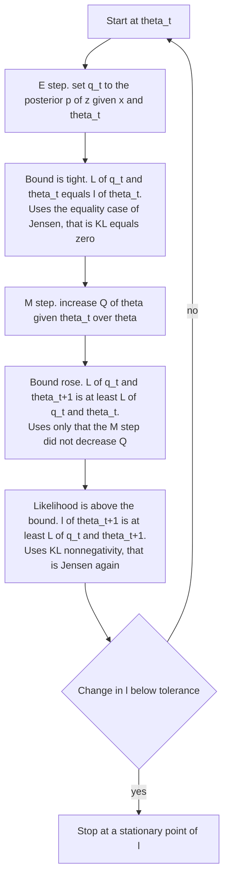
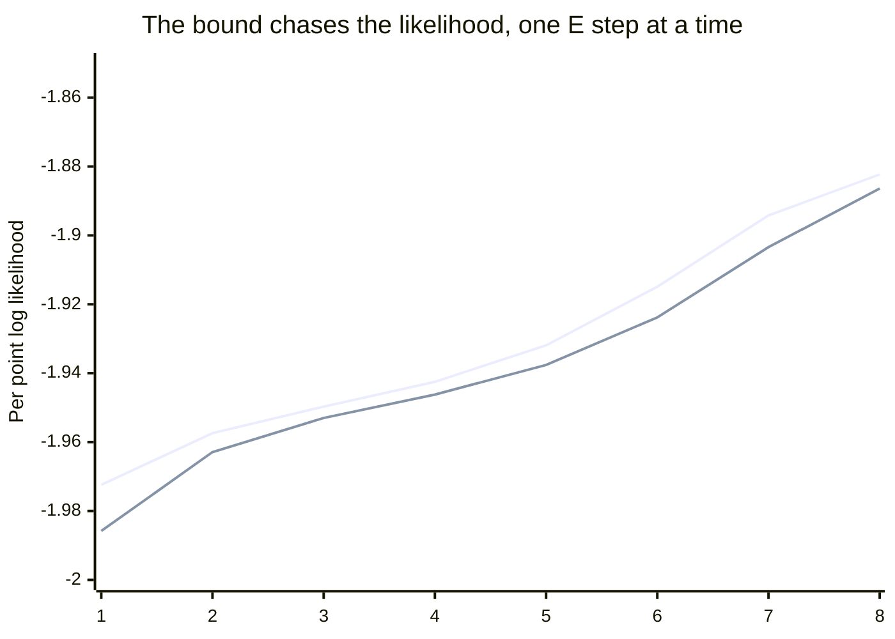

# EM Never Goes Down: Jensen's Inequality as an Algorithm

*Part of the series "Why Learning Works: The Theorems Behind Machine Learning." Earlier instalments asked when a hypothesis class can be learned at all. This one asks something narrower and more practical: when an algorithm alternates between two steps until nothing moves, what exactly have you been promised?*

---

## An Alternating Scheme That Actually Promises Something

Guess the hidden assignments. Refit the parameters as if the guesses were data. Repeat. That is the shape of a heuristic, and most schemes with that shape guarantee nothing at all — alternating minimisation over two blocks can cycle, stall on a ridge, or wander with no monotone quantity to point at.

Expectation-Maximization has the same shape and a genuine theorem. Every iteration provably cannot decrease the observed-data log-likelihood. Not on average, not asymptotically, not under a step-size condition: never, on every dataset, from every starting point. And the proof is one inequality about concave functions, applied once, plus an algebraic identity that costs three lines.

What makes the result worth a post is not the guarantee itself but where it comes from. Writing the guarantee down forces you to write an exact decomposition of the log-likelihood, and that decomposition is the evidence lower bound. EM and variational inference are not analogous methods. They are the same identity, read with different things held fixed.

Notation: $x$ is the observed data, $z$ the latent variables, $\theta$ the parameters. Sums over $z$ are written as sums; everything goes through verbatim with integrals and a dominating measure.

---

## The Problem, Stated Precisely

Maximum likelihood asks for

$$
\hat{\theta} \;\in\; \arg\max_{\theta} \; \ell(\theta), \qquad \ell(\theta) \;=\; \log p(x \mid \theta) \;=\; \log \sum_{z} p(x, z \mid \theta).
$$

The difficulty is located entirely in one place: the sum sits *inside* the logarithm. This is worth being precise about, because it is the reason EM exists rather than a vague complaint about intractability.

If you observed $z$, you would maximise the **complete-data log-likelihood** $\log p(x,z \mid \theta)$. For any exponential family — Gaussians, multinomials, Poissons, and the mixtures and hidden Markov models built from them — that function is concave in the natural parameters and its maximiser is available in closed form: a mean is a weighted average, a variance is a weighted second moment, a mixing weight is a count divided by a total. There is nothing to iterate.

Marginalising destroys that. The logarithm of a sum does not decompose over the terms, so the derivative of $\ell$ mixes all components together, no sufficient statistic separates, and the closed form is gone. For a $K$-component mixture over $n$ points, $\sum_z$ ranges over $K^n$ assignments.

So the situation is asymmetric in a very specific way: the hard problem is one logarithm away from an easy one. EM is the algorithm that exploits exactly that asymmetry, and the theorem below says what the exploitation costs.

---

## Jensen's Inequality, With Its Equality Condition

Everything rests on one classical fact. State it with the equality case, because the E-step exists precisely to attain it.

> **Theorem (Jensen, finite form).** Let $\varphi$ be concave on an interval $I$, let $y_1, \dots, y_m \in I$, and let $w_1, \dots, w_m \geq 0$ with $\sum_i w_i = 1$. Then
>
> $$
> \varphi\!\left(\sum_{i=1}^m w_i y_i\right) \;\geq\; \sum_{i=1}^m w_i \, \varphi(y_i).
> $$
>
> If $\varphi$ is strictly concave, equality holds if and only if all $y_i$ with $w_i > 0$ are equal.

*Proof.* Write $c = \sum_i w_i y_i$, which lies in $I$ by convexity of $I$. Assume $c$ is interior to $I$; if $c$ is an endpoint then all $y_i$ with $w_i>0$ already equal $c$ and both sides agree.

The engine is the three-chord inequality: for $a < b < d$ in $I$, writing $b = \lambda a + (1-\lambda) d$ with $\lambda = \frac{d-b}{d-a}$, concavity gives $\varphi(b) \geq \lambda \varphi(a) + (1-\lambda)\varphi(d)$, and rearranging yields

$$
\frac{\varphi(b) - \varphi(a)}{b - a} \;\geq\; \frac{\varphi(d) - \varphi(b)}{d - b}.
$$

So the difference quotient $t \mapsto \frac{\varphi(t) - \varphi(c)}{t - c}$ is nonincreasing on $I \setminus \{c\}$. Hence the one-sided derivatives $\varphi'_-(c)$ and $\varphi'_+(c)$ exist at the interior point $c$ and satisfy $\varphi'_-(c) \geq \varphi'_+(c)$. Put $s = \varphi'_+(c)$. For $t > c$ the quotient is at most $s$, and multiplying by $t - c > 0$ gives $\varphi(t) \leq \varphi(c) + s(t-c)$. For $t < c$ the quotient is at least $\varphi'_-(c) \geq s$, and multiplying by $t - c < 0$ reverses the inequality to the same conclusion. So the **supporting line** at $c$ dominates $\varphi$ everywhere on $I$:

$$
\varphi(t) \;\leq\; \varphi(c) + s\,(t - c) \qquad \text{for all } t \in I. \tag{J.1}
$$

Now evaluate (J.1) at each $y_i$, multiply by $w_i$, and sum:

$$
\begin{aligned}
\sum_{i=1}^m w_i \varphi(y_i) \;&\leq\; \sum_{i=1}^m w_i \left[\varphi(c) + s\,(y_i - c)\right] \\
&=\; \varphi(c) + s\left(\sum_{i=1}^m w_i y_i - c\right) \;=\; \varphi(c),
\end{aligned}
$$

using $\sum_i w_i = 1$ and $\sum_i w_i y_i = c$. That is the inequality.

For equality: the sum of the nonnegative slacks $w_i\left[\varphi(c) + s(y_i-c) - \varphi(y_i)\right]$ must vanish, so each term with $w_i > 0$ has $\varphi(y_i) = \varphi(c) + s(y_i - c)$ — the point $y_i$ lies *on* the supporting line. If $\varphi$ is strictly concave the supporting line touches the graph only at $c$: any other contact point $y \neq c$ would force $\varphi$ to be affine on the whole interval between them, contradicting strictness. Hence $y_i = c$ for every $i$ with $w_i > 0$. $\blacksquare$

The same supporting-line argument proves the general form $\varphi(\mathbb{E}[Y]) \geq \mathbb{E}[\varphi(Y)]$ for any integrable random variable $Y$ with $\mathbb{E}[Y]$ interior to $I$: apply (J.1) pointwise to $Y(\omega)$ and take expectations. Nothing changes except the notation. We will use it for $\varphi = \log$, which is strictly concave on $(0,\infty)$.

---

## The Decomposition

This is the centerpiece, and the surprise is that it is an **equality**, not a bound.

Fix $\theta$ and let $q$ be any distribution over $z$ whose support contains that of the posterior $p(z \mid x, \theta)$. Define the **evidence lower bound**

$$
\mathcal{L}(q, \theta) \;=\; \sum_z q(z) \log \frac{p(x, z \mid \theta)}{q(z)} \;=\; \mathbb{E}_q\!\left[\log p(x,z \mid \theta)\right] + H(q),
$$

where $H(q) = -\sum_z q(z)\log q(z)$ is the entropy, and the Kullback-Leibler divergence

$$
\mathrm{KL}\!\left(q \,\|\, p(\cdot \mid x, \theta)\right) \;=\; \sum_z q(z) \log \frac{q(z)}{p(z \mid x, \theta)}.
$$

> **Proposition (exact decomposition).** For every such $q$ and every $\theta$,
>
> $$
> \ell(\theta) \;=\; \mathcal{L}(q, \theta) \;+\; \mathrm{KL}\!\left(q \,\|\, p(\cdot \mid x, \theta)\right). \tag{D}
> $$

*Proof.* The quantity $\ell(\theta) = \log p(x\mid\theta)$ does not depend on $z$, so averaging it against $q$ changes nothing: $\ell(\theta) = \sum_z q(z)\,\ell(\theta)$. Apply the product rule $p(x,z\mid\theta) = p(z \mid x,\theta)\, p(x \mid \theta)$ inside, then multiply and divide by $q(z)$ and split the logarithm:

$$
\begin{aligned}
\ell(\theta) \;&=\; \sum_z q(z) \log \frac{p(x, z \mid \theta)}{p(z \mid x, \theta)} \\
&=\; \sum_z q(z) \log\!\left[\frac{p(x, z \mid \theta)}{q(z)} \cdot \frac{q(z)}{p(z \mid x, \theta)}\right] \\
&=\; \underbrace{\sum_z q(z) \log \frac{p(x, z \mid \theta)}{q(z)}}_{\mathcal{L}(q,\theta)} \;+\; \underbrace{\sum_z q(z) \log \frac{q(z)}{p(z \mid x, \theta)}}_{\mathrm{KL}(q\,\|\,p(\cdot\mid x,\theta))}. \;\blacksquare
\end{aligned}
$$

No inequality was used. Identity (D) holds for *every* $q$ in the admissible set — a good one, a terrible one, a point mass. The log-likelihood is split into a term you can compute and a term measuring how wrong your guess about the latent variables is, and the two always sum to exactly the same number.

The bound is then a corollary of one fact about KL.

> **Lemma (Gibbs).** $\mathrm{KL}(q \,\|\, p) \geq 0$, with equality if and only if $q = p$.

*Proof.* Since $\log$ is strictly concave, Jensen applied with weights $q(z)$ to the values $p(z)/q(z)$ gives

$$
-\mathrm{KL}(q \,\|\, p) \;=\; \sum_{z: q(z)>0} q(z) \log \frac{p(z)}{q(z)} \;\leq\; \log \sum_{z: q(z)>0} q(z)\,\frac{p(z)}{q(z)} \;=\; \log \!\!\sum_{z: q(z)>0}\!\! p(z) \;\leq\; \log 1 \;=\; 0.
$$

Equality in the Jensen step forces $p(z)/q(z)$ to take one common value $c$ on $\{q > 0\}$; equality in the last step forces $p$ to put no mass outside $\{q>0\}$, so summing $p(z) = c\,q(z)$ over that set gives $c = 1$ and $p = q$. $\blacksquare$

Combining, $\ell(\theta) \geq \mathcal{L}(q,\theta)$ for every admissible $q$ — hence the name. You can also get this bound directly, without (D), by Jensen on $\log \sum_z q(z) \frac{p(x,z\mid\theta)}{q(z)}$; that is the textbook one-liner. But the one-liner tells you only that a gap exists. Identity (D) tells you the gap is exactly $\mathrm{KL}(q\,\|\,p(\cdot\mid x,\theta))$, which is what makes an *algorithm* out of it, because a quantity you can name is a quantity you can drive to zero.

$\mathcal{L}(q,\theta)$ is the same object variational inference maximises. Neal and Hinton (1998) write $-\mathcal{L}$ and call it a free energy, which is the physics name for the same decomposition.

---

## Reading the Two Steps Off the Identity

EM is coordinate ascent on $\mathcal{L}(q,\theta)$. Both steps fall out of (D) by asking which term is constant.

**E-step.** Hold $\theta = \theta_t$ fixed. The left side of (D) is then a fixed number, independent of $q$. So

$$
\arg\max_{q} \; \mathcal{L}(q, \theta_t) \;=\; \arg\min_{q} \; \mathrm{KL}\!\left(q \,\|\, p(\cdot \mid x, \theta_t)\right),
$$

and by Gibbs the minimum is $0$, attained uniquely at $q_t = p(\cdot \mid x, \theta_t)$. Setting $q$ to the exact posterior is not a modelling choice or an approximation; it is the exact solution of the maximisation over $q$. And at that $q$,

$$
\mathcal{L}(q_t, \theta_t) \;=\; \ell(\theta_t). \tag{E}
$$

**After the E-step the bound is tight** — it touches the log-likelihood at the current parameters. That single fact is what turns a bound into a guarantee.

**M-step.** Hold $q = q_t$ fixed. Then $\mathcal{L}(q_t,\theta) = \mathbb{E}_{q_t}[\log p(x,z\mid\theta)] + H(q_t)$, and the entropy does not involve $\theta$. So maximising the bound reduces to maximising

$$
Q(\theta \mid \theta_t) \;=\; \mathbb{E}_{z \sim p(\cdot \mid x, \theta_t)}\!\left[\log p(x, z \mid \theta)\right],
$$

the expected complete-data log-likelihood. This is the whole practical payoff. $Q$ is an *average of* complete-data log-likelihoods, so the logarithm now sits inside the sum over $z$ rather than outside it. For exponential families the average is linear in the sufficient statistics, and $Q$ inherits the closed-form maximiser the complete-data problem had. The intractable $\log\sum$ has been traded for a weighted version of a problem that was already solved.



---

## The Theorem

> **Theorem (monotonicity of EM).** Let $q_t = p(\cdot \mid x, \theta_t)$ and let $\theta_{t+1}$ be any parameter value with $Q(\theta_{t+1} \mid \theta_t) \geq Q(\theta_t \mid \theta_t)$. Then
>
> $$
> \ell(\theta_{t+1}) \;\geq\; \ell(\theta_t).
> $$

*Proof.* Three steps, each using exactly one thing.

$$
\begin{aligned}
\ell(\theta_{t+1}) \;&=\; \mathcal{L}(q_t, \theta_{t+1}) + \mathrm{KL}\!\left(q_t \,\|\, p(\cdot \mid x, \theta_{t+1})\right) \;\geq\; \mathcal{L}(q_t, \theta_{t+1}) \\[2pt]
&=\; Q(\theta_{t+1}\mid\theta_t) + H(q_t) \;\geq\; Q(\theta_t \mid \theta_t) + H(q_t) \;=\; \mathcal{L}(q_t, \theta_t) \\[2pt]
&=\; \ell(\theta_t).
\end{aligned}
$$

Line one is identity (D) at $\theta_{t+1}$, then Gibbs — that is Jensen. Line two is the M-step hypothesis, with the entropy cancelling because $q_t$ is the same on both sides. Line three is (E), the tightness delivered by the E-step. $\blacksquare$

Three observations the proof makes visible.

**The M-step need not maximise.** Only $Q(\theta_{t+1}\mid\theta_t) \geq Q(\theta_t\mid\theta_t)$ was used. Any increase suffices — one Newton step, one gradient step, a partial update of a subset of parameters. This is the *generalised* EM of Dempster, Laird and Rubin, and it is what Neal and Hinton exploit to justify incremental and sparse variants: you may also improve $\mathcal{L}$ over $q$ only partially, for a subset of data points, and monotonicity survives because every step is still ascent on the same $\mathcal{L}$.

**Subtracting the two lines gives an exact accounting.** With $q_t$ fixed, $\ell(\theta) = Q(\theta\mid\theta_t) + H(q_t) + \mathrm{KL}(q_t \,\|\, p(\cdot\mid x,\theta))$, so

$$
\ell(\theta_{t+1}) - \ell(\theta_t) \;=\; \underbrace{Q(\theta_{t+1}\mid\theta_t) - Q(\theta_t\mid\theta_t)}_{\text{what the M-step bought}} \;+\; \underbrace{\mathrm{KL}\!\left(q_t \,\|\, p(\cdot\mid x,\theta_{t+1})\right)}_{\text{free, since } \geq\, 0}.
$$

The likelihood rises by at least what you paid for, plus a bonus equal to how far the posterior moved. That second term is why EM's early iterations often outrun the improvement in $Q$ alone.

> **Corollary.** If $\ell$ is bounded above on the parameter space, the sequence $\ell(\theta_0) \leq \ell(\theta_1) \leq \cdots$ is nondecreasing and bounded, hence converges to some $\ell^\star \in \mathbb{R}$.

That is the monotone convergence theorem for real sequences and nothing more. Read the hypothesis carefully, because the next section is about what happens when it fails.

---

## What the Theorem Does Not Say

This is where practice diverges from folklore, and each gap is a real one.

**Convergence of values is not convergence of parameters.** The corollary concerns the sequence $\ell(\theta_t)$ in $\mathbb{R}$. It says nothing about $\theta_t$ in the parameter space. A sequence can have $\ell(\theta_t) \to \ell^\star$ while $\theta_t$ fails to converge, drifting along a level set or a flat ridge; the set of limit points can be a connected continuum rather than a single point. Conditions ruling this out — typically $\|\theta_{t+1}-\theta_t\| \to 0$ together with a discreteness or compactness assumption on the stationary set — were supplied by Wu (1983) and, independently, by Boyles (1983). They are extra hypotheses, not consequences.

**Stationary, not optimal.** Under regularity conditions (continuity of $Q(\theta'\mid\theta)$ in both arguments, compact level sets), Wu proves that every limit point of an EM sequence is a stationary point of $\ell$. Stationary. A saddle point is stationary, and EM initialised on one stays there forever: if $\nabla\ell(\theta_t) = 0$ then $\theta_t$ already maximises $Q(\cdot\mid\theta_t)$ to first order and the algorithm does not move. Nothing in the monotonicity theorem distinguishes a saddle from a maximum, because a nondecreasing sequence is perfectly happy to be constant.

This is worth stating flatly, because the original paper claimed more. Dempster, Laird and Rubin (1977) asserted convergence to a local maximum, and their argument for it was flawed; Wu's 1983 paper identified the flaw, supplied a correct treatment, and extended the analysis beyond the curved exponential family. The monotonicity theorem above — the part everyone quotes — was never in doubt. The convergence theory built on top of it was, and Wu is the reference that fixed it.

**No global maximum, and initialisation decides which local one.** Different starting points reach different stationary points with different final likelihoods. That is not a numerical artefact; the code below exhibits three of them on 400 points. Which is why running EM from many random restarts and keeping the best, or warm-starting from k-means, is not superstition but the only thing available — the theorem ranks nothing.

**For a Gaussian mixture the likelihood is genuinely unbounded, so the corollary's hypothesis fails.** Take $K \geq 2$ components in one dimension and set $\mu_1 = x_1$, an actual data point. Then

$$
p(x \mid \theta) \;=\; \prod_{n=1}^{N} \sum_{k=1}^{K} \pi_k \, \mathcal{N}(x_n \mid \mu_k, \sigma_k^2) \;\geq\; \frac{\pi_1}{\sqrt{2\pi}\,\sigma_1} \prod_{n=2}^{N} \pi_2\, \mathcal{N}(x_n \mid \mu_2, \sigma_2^2),
$$

keeping only the $k=1$ term for $n=1$ and the $k=2$ term for the rest. Hold $\pi, \mu_2, \sigma_2$ fixed: the product on the right is a fixed positive constant while the prefactor diverges as $\sigma_1 \to 0$. So $\ell \to +\infty$ along that path. The supremum is $+\infty$, no maximum likelihood estimator exists, and any EM run that wanders into such a spike fits one point exactly and everything else not at all.

The monotonicity theorem is untouched — it never assumed boundedness. What fails is the corollary, and with it any claim that EM "converges" in general. In practice you restore the hypothesis by hand: floor the variances at $\sigma^2_{\min}$, add a ridge to the covariance, or put a prior on $\Sigma_k$ and run MAP-EM, which is the same algorithm with $\log p(\theta)$ added to $Q$ and the same monotonicity proof.

So the honest statement is: **EM cannot go downhill, and that is all it cannot do.**

---

## Instantiated: The Gaussian Mixture

Model: $p(z = k) = \pi_k$ and $p(x \mid z = k) = \mathcal{N}(x \mid \mu_k, \Sigma_k)$, with $\theta = \{\pi_k, \mu_k, \Sigma_k\}_{k=1}^K$.

**E-step.** The posterior over the latent label of point $n$ is Bayes' rule, and its values are the **responsibilities**

$$
r_{nk} \;=\; p(z_n = k \mid x_n, \theta_t) \;=\; \frac{\pi_k \, \mathcal{N}(x_n \mid \mu_k, \Sigma_k)}{\sum_{j=1}^{K} \pi_j \, \mathcal{N}(x_n \mid \mu_j, \Sigma_j)}.
$$

**M-step.** With the labels one-hot encoded, $\log p(x, z\mid\theta) = \sum_n \sum_k \mathbb{1}[z_n = k]\left(\log \pi_k + \log \mathcal{N}(x_n \mid \mu_k, \Sigma_k)\right)$, so taking the expectation under the posterior replaces each indicator by $r_{nk}$:

$$
Q(\theta \mid \theta_t) \;=\; \sum_{n=1}^{N} \sum_{k=1}^{K} r_{nk} \left[\log \pi_k + \log \mathcal{N}(x_n \mid \mu_k, \Sigma_k)\right].
$$

This separates over $k$, and the $(\mu_k, \Sigma_k)$ part is an ordinary Gaussian maximum-likelihood problem with fractional weights $r_{nk}$. Writing $N_k = \sum_n r_{nk}$:

$$
\begin{aligned}
\mu_k^{\text{new}} &= \frac{1}{N_k}\sum_{n=1}^{N} r_{nk}\, x_n, \\
\Sigma_k^{\text{new}} &= \frac{1}{N_k}\sum_{n=1}^{N} r_{nk}\,(x_n - \mu_k^{\text{new}})(x_n - \mu_k^{\text{new}})^{\top}, \\
\pi_k^{\text{new}} &= \frac{N_k}{N}.
\end{aligned}
$$

The weights need a Lagrange multiplier for $\sum_k \pi_k = 1$: differentiating $\sum_k N_k \log \pi_k + \lambda(\sum_k \pi_k - 1)$ gives $N_k/\pi_k + \lambda = 0$, so $\pi_k \propto N_k$, and summing fixes $\lambda = -N$.

One structural point. The responsibility $r_{nk}$ depends on $\pi_k$ and on $|\Sigma_k|$, not only on the distance from $x_n$ to $\mu_k$. A point can sit closer to $\mu_1$ and still be assigned mostly to component 2, if component 2 is broader or heavier. Hard-assign the responsibilities, force $\Sigma_k = \sigma^2 I$ with $\sigma^2 \to 0$, and fix $\pi_k = 1/K$, and the E-step collapses to nearest-centroid while the M-step collapses to averaging: that is k-means. GMM is the version that keeps the shape, the size and the softness.

---

## Verifying the Theorem in Code

Three overlapping Gaussians in one dimension, 400 points, $K = 3$, numpy only. The E-step runs in log space; the printed columns are the three quantities from the proof chain, all per data point.

```python
import numpy as np

rng = np.random.default_rng(1)
mu_t, sd_t = np.array([-2.0, 0.0, 2.5]), np.array([0.5, 0.5, 0.5])
comp = rng.choice(3, size=400, p=[1/3, 1/3, 1/3])
x = rng.normal(mu_t[comp], sd_t[comp])          # 400 points, three overlapping bumps

def log_comp(x, mu, var):                        # n x K matrix of log N(x_n | mu_k, var_k)
    return -0.5 * (np.log(2 * np.pi * var) + (x[:, None] - mu) ** 2 / var)

def logsumexp(a):
    m = a.max(axis=1, keepdims=True)
    return (m + np.log(np.exp(a - m).sum(axis=1, keepdims=True)))[:, 0]

def em(x, mu, var, pi, iters=300):
    n, trace = len(x), []
    for t in range(iters):
        lj = np.log(pi) + log_comp(x, mu, var)   # E step: log pi_k + log N(x_n)
        lse = logsumexp(lj)                      # = log p(x_n | theta_t)
        ll = lse.sum() / n                       # l(theta_t), per point
        r = np.exp(lj - lse[:, None])            # responsibilities = exact posterior
        H = -(r * np.log(np.clip(r, 1e-300, None))).sum()      # entropy of q_t
        N = r.sum(0)                             # M step: closed form
        pi, mu = N / n, (r * x[:, None]).sum(0) / N
        var = (r * (x[:, None] - mu) ** 2).sum(0) / N
        elbo = ((r * (np.log(pi) + log_comp(x, mu, var))).sum() + H) / n
        trace.append((ll, elbo))                 # L(q_t, theta_{t+1}), with q_t FIXED
    trace.append((logsumexp(np.log(pi) + log_comp(x, mu, var)).sum() / n, np.nan))
    return trace, (mu, np.sqrt(var), pi)

trace, fit = em(x, np.array([-1.7, 2.2, 3.4]), np.full(3, x.var()), np.full(3, 1/3))
ll = [row[0] for row in trace]
assert all(ll[t + 1] >= ll[t] - 1e-12 for t in range(len(ll) - 1)), "likelihood decreased"

print(" t |    l(theta_t)   L(q_t,theta_t+1)   l(theta_t+1)      KL gap")
for t in range(6):
    print(f"{t:>2} | {ll[t]:>13.6f} {trace[t][1]:>16.6f} "
          f"{ll[t+1]:>14.6f} {ll[t+1]-trace[t][1]:>11.2e}")
print(f"monotone over {len(ll)-1} iterations; means {np.round(np.sort(fit[0]), 3)}")
```

```text
 t |    l(theta_t)   L(q_t,theta_t+1)   l(theta_t+1)      KL gap
 0 |     -2.319855        -1.985783      -1.972394    1.34e-02
 1 |     -1.972394        -1.962949      -1.957365    5.58e-03
 2 |     -1.957365        -1.953039      -1.949675    3.36e-03
 3 |     -1.949675        -1.946173      -1.942493    3.68e-03
 4 |     -1.942493        -1.937641      -1.931947    5.69e-03
 5 |     -1.931947        -1.923799      -1.914889    8.91e-03
monotone over 300 iterations; means [-1.997 -0.099  2.497]
```

Read the table against the proof. Column 2 at row $t+1$ equals column 4 at row $t$ exactly — that is the E-step tightness (E), the bound re-touching the likelihood at the new parameters. Column 3 sits strictly between them, which is the sandwich $\mathcal{L}(q_t,\theta_t) \leq \mathcal{L}(q_t,\theta_{t+1}) \leq \ell(\theta_{t+1})$. The last column is the KL gap opened by the M-step. The assertion covers all 300 iterations, not the six shown.



The upper trace is $\ell(\theta_{t+1})$, the lower is $\mathcal{L}(q_t, \theta_{t+1})$. The vertical distance is the KL gap; each E-step closes it to zero before the next M-step reopens it.

Now the failure mode. Same data, same code, three starting positions for the means.

```python
for name, mu0 in [("A far apart ", [-1.70,  2.20,  3.40]),
                  ("B mid-left  ", [-1.00, -0.40, -0.30]),
                  ("C bunched   ", [-1.13, -0.46, -0.45])]:
    trace, (mu, sd, pi) = em(x, np.array(mu0), np.full(3, x.var()), np.full(3, 1/3))
    ll = [row[0] for row in trace]
    assert all(ll[t+1] >= ll[t] - 1e-12 for t in range(len(ll)-1))
    o = np.argsort(mu)
    print(f"{name} start {mu0} -> l = {ll[-1]:.6f} | means {np.round(mu[o],2)} "
          f"| sd {np.round(sd[o],2)} | pi {np.round(pi[o],2)}")
```

```text
A far apart  start [-1.7, 2.2, 3.4] -> l = -1.789632 | means [-2. -0.1 2.5] | sd [0.47 0.55 0.55] | pi [0.34 0.37 0.3]
B mid-left   start [-1.0, -0.4, -0.3] -> l = -1.803163 | means [-2.11 -0.3 2.46] | sd [0.41 0.71 0.6] | pi [0.28 0.42 0.3]
C bunched    start [-1.13, -0.46, -0.45] -> l = -1.940834 | means [-2.06 0.72 0.75] | sd [0.41 1.62 1.62] | pi [0.25 0.38 0.38]
```

Three runs, three different stationary points, three different final likelihoods, and all three monotone throughout — the assertion holds in every run. Run A recovers the generating parameters. Run C converges to a solution in which two components have collapsed onto each other at $0.72$ and $0.75$ with standard deviation $1.62$, jointly smearing across the two right-hand clusters while the third component takes the left one. It is a genuine stationary point of the likelihood: EM sits there permanently, monotonically, and reports success.

The theorem holds in all three runs. It just does not say which one you get.

---

## Where This Goes: When the E-Step Cannot Close the Gap

The E-step assumed you can compute $p(z \mid x, \theta)$. For mixtures and hidden Markov models you can. For a topic model with per-document topic proportions, a deep latent-variable model, or almost any model in which the latent variables are coupled, the normaliser $p(x\mid\theta) = \sum_z p(x,z\mid\theta)$ is exactly the intractable object you started with, so the exact posterior is unavailable.

Identity (D) does not care. It holds for every admissible $q$. So restrict $q$ to a tractable family $\mathcal{Q}$ — fully factorised over latent variables, say — and solve

$$
q_t \;=\; \arg\max_{q \in \mathcal{Q}} \; \mathcal{L}(q, \theta_t) \;=\; \arg\min_{q \in \mathcal{Q}} \; \mathrm{KL}\!\left(q \,\|\, p(\cdot \mid x, \theta_t)\right).
$$

If the true posterior lies in $\mathcal{Q}$ you recover exact EM. Otherwise the KL term stays strictly positive and the bound never becomes tight. Monotonicity in $\mathcal{L}$ survives — it was only ever coordinate ascent on $\mathcal{L}$ — but monotonicity in $\ell$ does not, because the tightness step (E) was the link between them and it is gone. This is variational EM; treating $\theta$ as one more latent variable gives variational inference proper, and Blei, Kucukelbir and McAuliffe (2017) is the review to read next.

Which reframes what EM is. It is the special case of variational inference in which the variational family is rich enough to contain the truth, so the approximation is free and the gap closes exactly. Everything else in that literature is the price of a family that is not.

---

## Going Deeper

**Books:**
- Bishop, C. M. (2006). *Pattern Recognition and Machine Learning.* Springer.
  - Chapter 9 is the canonical treatment: the decomposition (D), the GMM updates, and the k-means limit, with the clearest figures of the tight-then-rise picture.
- McLachlan, G. J., & Krishnan, T. (2008). *The EM Algorithm and Extensions*, 2nd ed. Wiley.
  - The reference monograph; Chapter 3 collects the convergence theory, including the rate expressed through the missing-information matrix.
- Murphy, K. P. (2022). *Probabilistic Machine Learning: Advanced Topics.* MIT Press.
  - Modern coverage linking EM, MM algorithms and variational inference under one bound-optimisation framework.
- Boyd, S., & Vandenberghe, L. (2004). *Convex Optimization.* Cambridge University Press.
  - Sections 3.1 and 3.4 give supporting hyperplanes and Jensen in the generality the proof above needed only on an interval.

**Online Resources:**
- [CS229 main lecture notes](https://cs229.stanford.edu/main_notes.pdf) — Stanford's notes derive the bound, the GMM updates and the monotonicity argument in about ten pages.
- [Neal and Hinton's free-energy paper, full text](https://www.cs.toronto.edu/~radford/ftp/emk.pdf) — the source for reading EM as coordinate ascent, and for why partial E-steps are legitimate.
- [Wu (1983) on Project Euclid](https://projecteuclid.org/journals/annals-of-statistics/volume-11/issue-1/On-the-Convergence-Properties-of-the-EM-Algorithm/10.1214/aos/1176346060.full) — open access; the convergence results quoted above are its main theorems.

**Videos:**
- [Lecture 14: Expectation-Maximization Algorithms, Stanford CS229 (Autumn 2018)](https://www.youtube.com/watch?v=rVfZHWTwXSA) by Andrew Ng — derives the bound from Jensen and applies it to mixtures of Gaussians.
- [Lecture 15: EM Algorithm and Factor Analysis, Stanford CS229 (Autumn 2018)](https://www.youtube.com/watch?v=tw6cmL5STuY) by Andrew Ng — continues into a latent-variable model where the E-step is still tractable but far less obvious.
- [Clustering (4): Gaussian Mixture Models and EM](https://www.youtube.com/watch?v=qMTuMa86NzU) — a compact walkthrough of responsibilities and the weighted M-step updates.

**Academic Papers:**
- Dempster, A. P., Laird, N. M., & Rubin, D. B. (1977). ["Maximum Likelihood from Incomplete Data via the EM Algorithm."](https://doi.org/10.1111/j.2517-6161.1977.tb01600.x) *Journal of the Royal Statistical Society, Series B*, 39(1), 1-38.
  - The paper that named EM and unified a dozen existing algorithms; read it for the breadth of examples, not for the convergence theorem.
- Wu, C. F. J. (1983). ["On the Convergence Properties of the EM Algorithm."](https://doi.org/10.1214/aos/1176346060) *The Annals of Statistics*, 11(1), 95-103.
  - Identifies the flaw in the 1977 convergence argument and replaces it: limit points are stationary points, with separate conditions for convergence of the parameter sequence.
- Neal, R. M., & Hinton, G. E. (1998). ["A View of the EM Algorithm that Justifies Incremental, Sparse, and Other Variants."](https://doi.org/10.1007/978-94-011-5014-9_12) In M. I. Jordan (ed.), *Learning in Graphical Models*, 355-368. Kluwer.
  - The free-energy reading of identity (D), and the source of the observation that partial steps preserve the guarantee.
- Blei, D. M., Kucukelbir, A., & McAuliffe, J. D. (2017). ["Variational Inference: A Review for Statisticians."](https://arxiv.org/abs/1601.00670) *Journal of the American Statistical Association*, 112(518), 859-877.
  - Where the same ELBO goes once the exact posterior is out of reach.

**Questions to Explore:**
- The M-step only needs $Q$ to increase. How far can that be weakened before the guarantee breaks — does a stochastic M-step that increases $Q$ only in expectation still yield a monotone likelihood, or only a submartingale?
- EM's convergence is linear rather than quadratic, at a rate governed by the fraction of missing information. Is there a way to read that rate off the geometry of the gap $\mathrm{KL}(q_t \,\|\, p(\cdot\mid x,\theta_{t+1}))$ rather than off the Jacobian of the map $\theta_t \mapsto \theta_{t+1}$?
- The GMM likelihood is unbounded, yet EM usually finds a sensible local maximum anyway. Is there a characterisation of the basin of attraction of the degenerate spikes, and does its measure shrink with $N$?
- Identity (D) makes no reference to probability beyond normalisation. Which other alternating algorithms — k-means, non-negative matrix factorisation, iterative proportional fitting — are coordinate ascent on an exact decomposition of the objective they claim to optimise, and which are merely alternating?
- If EM is the case where the variational family contains the true posterior, is there a useful measure of how far a family is from containing it that predicts the loss in final likelihood, rather than only bounding it?
