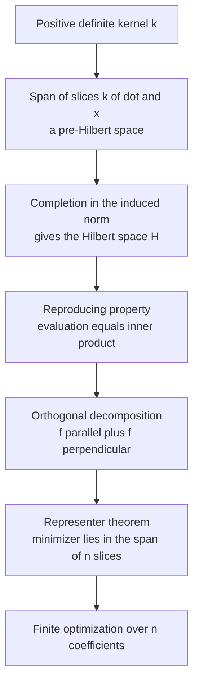
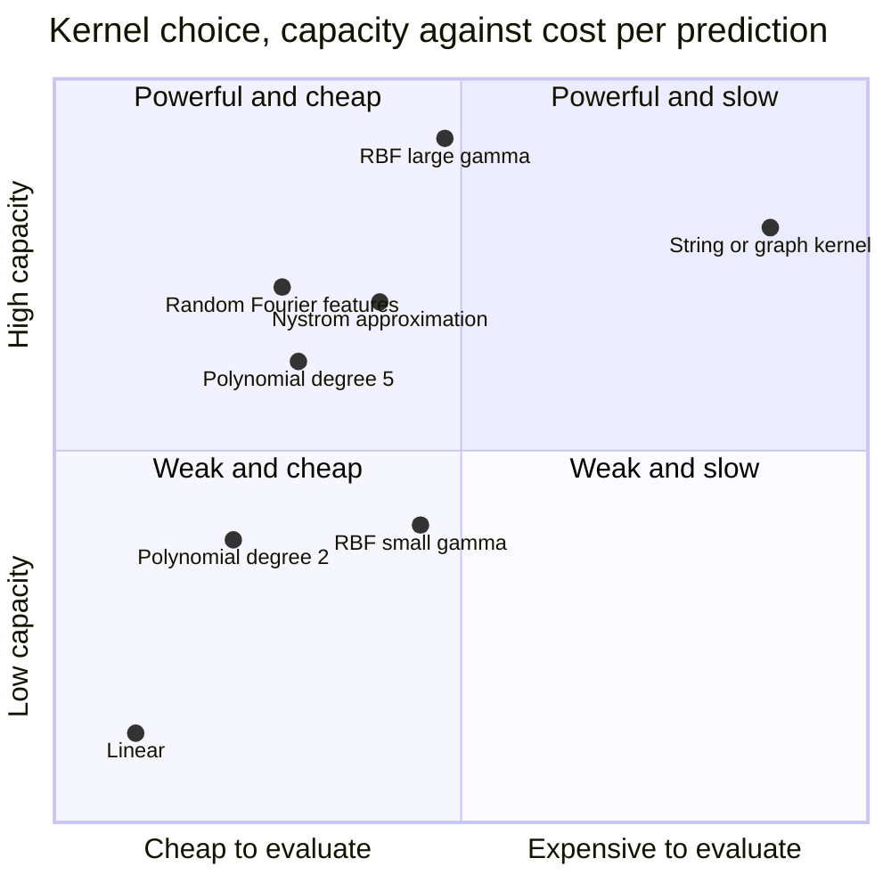

# The Kernel Trick Is a Theorem, Not a Trick

*Part of **Why Learning Works: The Theorems Behind Machine Learning**, a series that proves why machine learning works rather than describing what it does. Every result here is stated as a theorem -- hypotheses first, conclusion second -- and then proved, or else explicitly flagged as unproved with a pointer to where the proof lives. This post is about the two theorems hiding underneath a piece of folklore.*

---

## An Impossible Optimization That Runs in Milliseconds

Open any tutorial on support vector machines and you will find, stated with no visible discomfort, that the Gaussian radial basis function kernel

$$
k(x, x') = \exp\!\left(-\gamma \|x - x'\|^2\right)
$$

corresponds to an inner product in an **infinite-dimensional** feature space. The support vector machine then finds a hyperplane in that space -- specified by an infinite-dimensional normal vector $w$ -- on a laptop, in a fraction of a second.

That should be impossible. Gradient descent over an infinite-dimensional space does not even start, because you cannot store the first iterate. "We only ever compute inner products" is not the explanation: it says why you never need to *write down* $\varphi(x)$, but nothing about why the *optimum* should be reachable from finitely many numbers. The first is bookkeeping. The second is a theorem -- two theorems, in fact, and the standard "kernel trick" framing conceals both.

The first is a characterization: which functions $k(x,x')$ are legitimate kernels, and what is the space they secretly live in? The answer -- Moore and Aronszajn's -- is that positive definiteness is exactly the right condition, and that the space can be *constructed* out of the kernel itself, no guessing required.

The second is the **representer theorem**, proved by Kimeldorf and Wahba in 1971 for splines and generalized by Schölkopf, Herbrich and Smola in 2001. It says the minimizer of a regularized empirical risk over an infinite-dimensional function space always lies in the span of $n$ specific functions, one per training point. The search collapses from infinite dimensions to $n$ real coefficients.

Without the second theorem, the first would be a curiosity: a beautiful Hilbert space you could not compute in. Together they are the reason kernel methods exist. The "trick" is the shadow the theorems cast.

---

## Where Inner Products Are All You Need

Start with the object everyone actually runs. The soft-margin support vector machine, in its dual form, is the quadratic program

$$
\max_{\alpha}\ \sum_{i=1}^n \alpha_i - \tfrac{1}{2} \sum_{i=1}^n \sum_{j=1}^n \alpha_i \alpha_j y_i y_j\, k(x_i, x_j) \quad \text{s.t.} \quad \sum_{i=1}^n \alpha_i y_i = 0, \quad 0 \le \alpha_i \le C.
$$

Its solution determines the normal vector

$$
w = \sum_{i=1}^n \alpha_i y_i\, \varphi(x_i)
$$

and the classifier

$$
h(x) = \operatorname{sign}\!\left(\sum_{i=1}^n \alpha_i y_i\, k(x_i, x) + b\right).
$$

Look at where $\varphi$ appears: in the formula for $w$, and nowhere else. It is absent from the objective, the constraints, and the decision function. Every quantity you actually compute involves $\varphi$ only through the scalar $k(x, x') = \langle \varphi(x), \varphi(x')\rangle$. The feature map is a bookkeeping device that cancels out of the ledger.

Boser, Guyon and Vapnik noticed this in 1992 and turned it into an algorithm: replace $\langle x, x'\rangle$ with any function that behaves like an inner product after some mapping, and the optimal-margin classifier becomes nonlinear at essentially no extra cost.

### A feature map you can hold in your hand

Take $\mathcal{X} = \mathbb{R}^2$ and define

$$
\varphi(x) = \left(x_1^2,\ \sqrt{2}\, x_1 x_2,\ x_2^2\right) \in \mathbb{R}^3.
$$

Then for any $x, x' \in \mathbb{R}^2$,

$$
\begin{aligned}
\langle \varphi(x), \varphi(x')\rangle &= x_1^2 x_1'^2 + \left(\sqrt{2}\,x_1x_2\right)\left(\sqrt{2}\,x_1'x_2'\right) + x_2^2 x_2'^2 \\
&= x_1^2 x_1'^2 + 2\, x_1 x_2 x_1' x_2' + x_2^2 x_2'^2.
\end{aligned}
$$

And separately,

$$
\langle x, x'\rangle^2 = \left(x_1 x_1' + x_2 x_2'\right)^2 = x_1^2 x_1'^2 + 2\, x_1 x_1' x_2 x_2' + x_2^2 x_2'^2.
$$

The two expressions are identical term by term. So $k(x,x') = \langle x,x'\rangle^2$ costs one dot product in $\mathbb{R}^2$ and one squaring, and it delivers the inner product of two vectors in $\mathbb{R}^3$. The $\sqrt{2}$ in the middle coordinate is exactly what makes the cross term come out with the coefficient $2$ the binomial expansion demands.

### The feature map is not unique, and that is the whole point

Consider instead

$$
\psi(x) = \left(x_1^2,\ x_1 x_2,\ x_2 x_1,\ x_2^2\right) \in \mathbb{R}^4.
$$

Compute $\langle \psi(x), \psi(x')\rangle$ and you get $x_1^2x_1'^2 + 2x_1x_2x_1'x_2' + x_2^2x_2'^2$ again -- the same kernel, from a map into a space of a different dimension. Later we will build yet another feature map for the same kernel, this time into a space of functions.

So $\varphi$ and the space $\mathcal{H}$ it lands in are **not determined by $k$**. Any orthogonal transformation of $\varphi$, any embedding into a larger space, any of infinitely many unrelated constructions reproduces the same kernel. The usual pedagogical order is backwards: the feature space is not the primary object the kernel summarizes; the kernel is the primary object, and the feature space is a story told afterwards to make it feel geometric. If the feature map were the real content, "infinite-dimensional feature space" would be a genuine computational problem. Because the kernel is the real content, the feature space can be as large as it likes -- we will never visit it.

---

## Which Functions Are Kernels?

If we are going to let people pass in arbitrary similarity functions, we need to know which ones are admissible: which $k$ admit *some* inner product space $\mathcal{H}$ and *some* map $\varphi : \mathcal{X} \to \mathcal{H}$ with $k(x,x') = \langle \varphi(x), \varphi(x')\rangle$. The characterization is a condition stated without mentioning $\mathcal{H}$ at all.

**Definition (Gram matrix).** Given $k : \mathcal{X} \times \mathcal{X} \to \mathbb{R}$ and points $x_1, \dots, x_n \in \mathcal{X}$, the **Gram matrix** is $K \in \mathbb{R}^{n\times n}$ with $K_{ij} = k(x_i, x_j)$.

**Definition (positive definite kernel).** A symmetric function $k : \mathcal{X} \times \mathcal{X} \to \mathbb{R}$ is a **positive definite kernel** if for every $n \in \mathbb{N}$ and every choice of points $x_1, \dots, x_n \in \mathcal{X}$, the Gram matrix $K$ is positive semidefinite, that is,

$$
\alpha^\top K \alpha = \sum_{i=1}^n \sum_{j=1}^n \alpha_i \alpha_j\, k(x_i, x_j) \ \ge\ 0 \qquad \text{for all } \alpha \in \mathbb{R}^n.
$$

Two remarks on the wording. First, the quantifier ranges over all finite subsets of $\mathcal{X}$ simultaneously, not one convenient sample. Second, the standard terminology is unfortunate: a "positive definite kernel" requires only *positive semidefinite* Gram matrices; I keep the standard name and the correct condition.

**Proposition 1.** The linear kernel $k(x,x') = \langle x, x'\rangle$ on $\mathcal{X} = \mathbb{R}^d$ is positive definite.

*Proof.* Symmetry is clear. For any points $x_1,\dots,x_n$ and any $\alpha \in \mathbb{R}^n$,

$$
\alpha^\top K \alpha = \sum_{i,j} \alpha_i \alpha_j \langle x_i, x_j\rangle = \left\langle \sum_i \alpha_i x_i,\ \sum_j \alpha_j x_j \right\rangle = \Big\| \sum_i \alpha_i x_i \Big\|^2 \ \ge\ 0,
$$

using bilinearity of the inner product in the middle step. $\blacksquare$

**Proposition 2.** If $\mathcal{H}$ is any real inner product space and $\varphi : \mathcal{X} \to \mathcal{H}$ is any map, then $k(x,x') := \langle \varphi(x), \varphi(x')\rangle_{\mathcal{H}}$ is a positive definite kernel.

*Proof.* Symmetry is inherited from the symmetry of the inner product. For positive definiteness the computation is verbatim the one above, with $x_i$ replaced by $\varphi(x_i)$:

$$
\alpha^\top K \alpha = \sum_{i,j}\alpha_i\alpha_j \langle \varphi(x_i), \varphi(x_j)\rangle = \Big\|\sum_i \alpha_i \varphi(x_i)\Big\|_{\mathcal{H}}^2 \ \ge\ 0. \qquad \blacksquare
$$

Proposition 2 says positive definiteness is **necessary**: every kernel arising from a feature map has it. The converse -- that it is also **sufficient** -- is Moore-Aronszajn, next section's subject. Together they say the class of functions computable as inner products after a mapping is exactly the class of positive definite kernels.

### Cauchy-Schwarz, for free

One consequence worth extracting before building the space, since it is the inequality you will reach for constantly.

**Proposition 3 (Cauchy-Schwarz for kernels).** If $k$ is a positive definite kernel then for all $x_1, x_2 \in \mathcal{X}$,

$$
|k(x_1,x_2)|^2 \ \le\ k(x_1,x_1)\, k(x_2,x_2).
$$

*Proof.* Apply the definition with $n = 2$ at the points $x_1, x_2$. The Gram matrix

$$
K = \begin{pmatrix} k(x_1,x_1) & k(x_1,x_2) \\ k(x_1,x_2) & k(x_2,x_2)\end{pmatrix}
$$

is symmetric positive semidefinite, so its two eigenvalues $\lambda_1, \lambda_2$ are nonnegative reals, and therefore $\det K = \lambda_1 \lambda_2 \ge 0$. Expanding the determinant,

$$
k(x_1,x_1)k(x_2,x_2) - k(x_1,x_2)^2 \ \ge\ 0,
$$

which rearranges to the claim. $\blacksquare$

Notice what was used: a single instance of the definition, at $n=2$. The full strength of positive definiteness is never needed for Cauchy-Schwarz -- a hint that the condition does much more work elsewhere.

### The standard kernels

Three functions cover most of practice. **Homogeneous polynomial:** $k(x,x') = \langle x,x'\rangle^d$, whose feature space is all degree-$d$ monomials with multinomial weights. **Inhomogeneous polynomial:** $k(x,x') = \left(\langle x,x'\rangle + c\right)^d$ with $c>0$, which by the binomial theorem adds all lower-degree monomials, weighted by powers of $c$. **Gaussian RBF:** $k(x,x') = \exp\!\left(-\|x-x'\|^2 / 2\sigma^2\right) = \exp\!\left(-\gamma \|x-x'\|^2\right)$ with $\gamma = 1/(2\sigma^2)$: large $\gamma$ (small $\sigma$) gives a narrow bump, high capacity, and a classifier that risks memorizing the data; small $\gamma$ flattens the decision function. Nothing in the theory picks $\gamma$; it is a capacity knob set by validation.

### Building new kernels from old

You will rarely verify positive definiteness from the definition directly. In practice you assemble kernels from known ones using closure properties -- positive kernels are closed under nonnegative scaling, sums, pointwise products, pointwise limits, and reweighting by any $f(x)k_1(x,x')f(x')$ -- and those five facts, applied to Proposition 1's linear kernel, are exactly what is needed to show the Gaussian RBF is positive definite.

### And a symmetric function that is not a kernel

The counterexample everyone should see is the sigmoid or tanh kernel, $k(x,x') = \tanh\!\left(a\langle x,x'\rangle + r\right)$ -- symmetric, but not positive definite (Lin and Lin, 2003). Positive definiteness is refutable by a single finite counterexample, and finding one is a short computation.

```python
import numpy as np

rng = np.random.default_rng(0)


def gram(kernel, X):
    n = X.shape[0]
    return np.array([[kernel(X[i], X[j]) for j in range(n)] for i in range(n)])


def k_linear(x, y):
    return float(x @ y)


def k_poly(x, y, d=3, c=1.0):
    return float((x @ y + c) ** d)


def k_rbf(x, y, gamma=0.5):
    return float(np.exp(-gamma * np.sum((x - y) ** 2)))


def k_tanh(x, y, a=1.0, r=1.0):
    return float(np.tanh(a * (x @ y) + r))


X = rng.normal(size=(40, 5))

for name, k in [("linear", k_linear), ("poly d=3", k_poly),
                ("rbf", k_rbf), ("tanh", k_tanh)]:
    K = gram(k, X)
    lam = np.linalg.eigvalsh(K)
    print(f"{name:9s} asymmetry={np.max(np.abs(K - K.T)):.1e} "
          f"lambda_min={lam[0]:+.4e}")

print()
Z = np.array([[1.0], [2.0], [3.0]])
K = gram(k_tanh, Z)
lam, V = np.linalg.eigh(K)
print("Gram matrix of tanh(<x,y> + 1) at x = 1, 2, 3:")
print(np.round(K, 6))
print("eigenvalues:", np.round(lam, 6))
c = V[:, 0]
print("witness c    =", np.round(c, 6))
print("c^T K c      =", float(c @ K @ c))
```

```text
linear    asymmetry=0.0e+00 lambda_min=-1.4223e-14
poly d=3  asymmetry=0.0e+00 lambda_min=+6.6154e-01
rbf       asymmetry=0.0e+00 lambda_min=+1.1132e-01
tanh      asymmetry=0.0e+00 lambda_min=-5.1003e+00

Gram matrix of tanh(<x,y> + 1) at x = 1, 2, 3:
[[0.964028 0.995055 0.999329]
 [0.995055 0.999909 0.999998]
 [0.999329 0.999998 1.      ]]
eigenvalues: [-2.065600e-02  2.470000e-04  2.984346e+00]
witness c    = [-0.814286  0.31831   0.485404]
c^T K c      = -0.020656112183464713
```

Three points on the real line already give $\alpha^\top K \alpha < 0$ for tanh, which kills the universal quantifier in the definition; the linear kernel's $\lambda_{\min}=-1.4\times10^{-14}$, by contrast, is floating-point noise around zero. An empirical check like this can only refute positive definiteness, never establish it: to *use* a kernel you need a proof, to *reject* one you need only a witness.

---

## Moore-Aronszajn: The Space Exists, and Here It Is

We have a condition on $k$ that is necessary for a feature map to exist. This section's theorem says it is also sufficient, and the proof is constructive: given nothing but a positive definite $k$, we build the space out of the kernel, step by step.

### Step 1: the feature map is the kernel itself

Define, for each $x \in \mathcal{X}$, a **function**

$$
\varphi(x) := k(\cdot, x) : \mathcal{X} \to \mathbb{R}, \qquad \varphi(x)(t) = k(t,x).
$$

Each data point becomes the function that measures similarity between it and everything else. This is the move that makes the whole thing work: we are not searching for a feature space and then locating a kernel inside it, we are taking the kernel's own slices as the features.

Let $\mathcal{H}_0$ be the set of all finite linear combinations of such functions:

$$
\mathcal{H}_0 := \left\{ f = \sum_{i=1}^m \alpha_i\, k(\cdot, x_i) \ :\ m \in \mathbb{N},\ \alpha_i \in \mathbb{R},\ x_i \in \mathcal{X} \right\}.
$$

This is a real vector space under pointwise operations, and every element of it is a genuine function on $\mathcal{X}$.

### Step 2: define an inner product, and check that it is one

For $f = \sum_{i=1}^m \alpha_i k(\cdot,x_i)$ and $g = \sum_{j=1}^p \beta_j k(\cdot, x'_j)$, define

$$
\langle f, g\rangle := \sum_{i=1}^m \sum_{j=1}^p \alpha_i \beta_j\, k(x_i, x'_j).
$$

**Well-definedness.** The formula refers to representations of $f$ and $g$, which are not unique, so we must check the value does not depend on which one we picked. The double sum regroups two ways:

$$
\sum_{i,j}\alpha_i\beta_j\, k(x_i,x'_j) = \sum_{j=1}^p \beta_j \left(\sum_{i=1}^m \alpha_i\, k(x'_j, x_i)\right) = \sum_{j=1}^p \beta_j\, f(x'_j),
$$

using symmetry of $k$, and by the mirror computation it also equals $\sum_{i=1}^m \alpha_i\, g(x_i)$. The middle expression depends on $f$ only through its values and on $g$ only through its coefficients; the right-hand one, the reverse. Since the two agree, the quantity depends on neither set of coefficients -- only on $f$ and $g$ themselves.

**Bilinearity and symmetry** are immediate from the formula.

**Positive semidefiniteness.** $\langle f,f\rangle = \sum_{i,j}\alpha_i\alpha_j\, k(x_i,x_j) = \alpha^\top K\alpha \ge 0$ -- exactly the hypothesis that $k$ is a positive definite kernel, used here for the first time. Drop it and what remains is a mere symmetric bilinear form: no norm, no orthogonal decomposition, no representer theorem. Positive definiteness is the load-bearing hypothesis of the entire theory.

**Definiteness.** We still need $\langle f,f\rangle = 0 \implies f = 0$ as a function. Take $g = k(\cdot, x)$ in the regrouping identity above -- it has the single coefficient $\beta_1 = 1$ at the point $x$ -- to get

$$
\langle f, k(\cdot,x)\rangle = \sum_{i=1}^m \alpha_i\, k(x, x_i) = f(x). \tag{$\ast$}
$$

Now, Cauchy-Schwarz holds for any positive **semi**definite symmetric bilinear form: the usual proof, expanding $\langle f + tg,\, f + tg\rangle \ge 0$ as a quadratic in $t$ and forcing a nonpositive discriminant, never uses definiteness. So

$$
|f(x)|^2 = |\langle f, k(\cdot,x)\rangle|^2 \le \langle f,f\rangle\, \langle k(\cdot,x), k(\cdot,x)\rangle = \langle f,f\rangle\, k(x,x).
$$

If $\langle f,f\rangle = 0$ then $f(x) = 0$ for every $x$, that is, $f$ is the zero function. $\blacksquare$

So $(\mathcal{H}_0, \langle\cdot,\cdot\rangle)$ is a genuine inner product space.

### Step 3: the kernel reproduces itself

Setting $f = k(\cdot,x')$ in the definition gives, in one line,

$$
\langle \varphi(x), \varphi(x')\rangle = \langle k(\cdot,x),\, k(\cdot,x')\rangle = k(x,x').
$$

This is the sufficiency we were after: $\varphi(x) = k(\cdot,x)$ is a feature map for $k$, into $\mathcal{H}_0$. Every positive definite kernel is an inner product of features. Note also that for $k(x,x') = \langle x,x'\rangle^2$ this is a *third* feature map, distinct from the ones into $\mathbb{R}^3$ and $\mathbb{R}^4$ written earlier -- non-uniqueness showing up concretely.

Equation $(\ast)$ is the **reproducing property**, and it deserves its own display:

$$
\boxed{\ \langle f,\ k(\cdot,x)\rangle = f(x)\quad \text{for all } f \in \mathcal{H},\ x \in \mathcal{X}.\ }
$$

**Evaluating a function at a point is the same operation as taking an inner product with the kernel slice at that point.** Pointwise evaluation -- normally not even a continuous operation in function spaces -- has been converted into geometry. That conversion is what the representer theorem exploits, and it is the single fact that makes the whole apparatus computational.

### Step 4: complete the space

$\mathcal{H}_0$ is a **pre-Hilbert space**: an inner product space that need not be complete. Cauchy sequences in it may fail to converge inside it. This matters, because we intend to minimize over the space, and minimizers are limits.

Define $\mathcal{H}$ as the completion of $\mathcal{H}_0$ in the norm $\|f\| = \sqrt{\langle f,f\rangle}$. Abstract completion produces a Hilbert space of equivalence classes of Cauchy sequences, and we need its elements to still be *functions* on $\mathcal{X}$, with $(\ast)$ surviving. Both follow from one inequality: if $(f_n)$ is Cauchy in $\mathcal{H}_0$, then for every $x$,

$$
|f_n(x) - f_m(x)| = |\langle f_n - f_m,\, k(\cdot,x)\rangle| \le \|f_n - f_m\|\, \sqrt{k(x,x)},
$$

by $(\ast)$ and Cauchy-Schwarz. So $(f_n(x))_n$ is Cauchy in $\mathbb{R}$ for each fixed $x$, and the limit can be defined *pointwise*; the same inequality shows equivalent Cauchy sequences give the same function, so the identification is legitimate.

Verifying that the resulting space of functions is itself complete, and that the inner product extends continuously to it, is routine but genuinely tedious, and I am not going to write it out. **This is a place where I am not giving you the full proof.** The complete argument, including the uniqueness half of the theorem, is in Aronszajn's 1950 paper, Part I; it is cited below and it is readable.

**Theorem (Moore-Aronszajn, 1950).** *For every positive definite kernel $k$ on a set $\mathcal{X}$ there exists a unique Hilbert space $\mathcal{H}$ of real-valued functions on $\mathcal{X}$ in which $k$ is a reproducing kernel -- that is, $k(\cdot,x) \in \mathcal{H}$ for every $x \in \mathcal{X}$, and $\langle f, k(\cdot,x)\rangle = f(x)$ for all $f\in\mathcal{H}$ and all $x\in\mathcal{X}$.*

The correspondence runs both ways and is a bijection: every positive definite kernel determines exactly one reproducing kernel Hilbert space, and every RKHS has exactly one reproducing kernel. Choosing a kernel *is* choosing a hypothesis space. That is the sentence to remember.

### The cleaner definition, and Riesz

The construction above is how you *build* an RKHS. The modern, shorter definition says a Hilbert space of functions is an RKHS exactly when every evaluation functional $f \mapsto f(x)$ is bounded; the Riesz representation theorem then hands you the reproducing kernel directly. Boundedness of evaluation is the conceptual condition, positive definiteness its computational shadow -- and it is a real restriction: $L^2[0,1]$ is not an RKHS, since evaluation at a point is not even well defined there.



---

## The Representer Theorem

Everything so far has produced a space. Nothing so far has said we can optimize in it.

**Theorem (Representer theorem; Kimeldorf and Wahba 1971, generalized by Schölkopf, Herbrich and Smola 2001).**

*Let $k$ be a positive definite kernel on $\mathcal{X}$ with reproducing kernel Hilbert space $\mathcal{H}$. Let $(x_1,y_1),\dots,(x_n,y_n) \in \mathcal{X}\times\mathcal{Y}$ be a training sample. Let*

- *$L : \mathcal{Y}\times\mathbb{R}\to\mathbb{R}\cup\{+\infty\}$ be an arbitrary pointwise loss -- no convexity, no differentiability, no continuity is assumed -- and*
- *$\Omega : [0,\infty)\to\mathbb{R}$ be **strictly increasing**.*

*Then every minimizer $f^\star \in \mathcal{H}$ of the regularized empirical risk*

$$
\min_{f\in\mathcal{H}}\ \sum_{i=1}^n L\big(y_i,\, f(x_i)\big)\ +\ \Omega\big(\|f\|_{\mathcal{H}}\big)
$$

*admits a representation*

$$
f^\star(\cdot) = \sum_{i=1}^n \alpha_i\, k(\cdot, x_i), \qquad \alpha \in \mathbb{R}^n.
$$

*Proof.* Let $S = \operatorname{span}\{k(\cdot,x_1),\dots,k(\cdot,x_n)\} \subseteq \mathcal{H}$. This is a finite-dimensional, hence closed, subspace of a Hilbert space, so the projection theorem gives the orthogonal decomposition $\mathcal{H} = S \oplus S^\perp$. Write an arbitrary $f \in \mathcal{H}$ as

$$
f = f_\parallel + f_\perp, \qquad f_\parallel \in S,\quad f_\perp \in S^\perp.
$$

**The loss cannot see $f_\perp$.** For each training index $j$, the reproducing property gives

$$
f(x_j) = \langle f,\, k(\cdot,x_j)\rangle = \langle f_\parallel,\, k(\cdot,x_j)\rangle + \langle f_\perp,\, k(\cdot,x_j)\rangle = \langle f_\parallel,\, k(\cdot,x_j)\rangle = f_\parallel(x_j),
$$

because $k(\cdot,x_j) \in S$ while $f_\perp \perp S$ by construction, so the second inner product vanishes. Hence $f$ and $f_\parallel$ agree at every one of the $n$ training points, and therefore

$$
\sum_{i=1}^n L\big(y_i, f(x_i)\big) = \sum_{i=1}^n L\big(y_i, f_\parallel(x_i)\big).
$$

The loss term is completely blind to the orthogonal component. This is where the reproducing property earns its keep: it converts "evaluation at $x_j$" into "inner product with a vector in $S$," and only then does orthogonality apply.

**The regularizer does see it.** By the Pythagorean identity in a Hilbert space,

$$
\|f\|_{\mathcal{H}}^2 = \|f_\parallel\|^2 + \|f_\perp\|^2 \ \ge\ \|f_\parallel\|^2,
$$

with equality if and only if $\|f_\perp\| = 0$, that is, $f_\perp = 0$. Since $\Omega$ is strictly increasing on $[0,\infty)$, whenever $f_\perp \ne 0$ we have $\|f\| > \|f_\parallel\|$ and hence

$$
\Omega(\|f\|) > \Omega(\|f_\parallel\|).
$$

**Conclusion.** Suppose $f^\star$ were a minimizer with $f^\star_\perp \ne 0$. Then $f^\star_\parallel$ has exactly the same loss and a strictly smaller regularization term, so its objective value is strictly smaller -- contradicting the minimality of $f^\star$. Therefore $f^\star_\perp = 0$, so $f^\star \in S$, which is precisely the claimed representation. $\blacksquare$

That is the entire proof. Four lines of Hilbert space geometry, no assumptions on the loss, and it is the reason kernel methods are computable at all.

### What it buys, stated plainly

Before the theorem, the problem is to minimize a functional over $\mathcal{H}$, infinite-dimensional for the Gaussian kernel. After it, substitute $f = \sum_i \alpha_i k(\cdot,x_i)$, using $f(x_j) = (K\alpha)_j$ and $\|f\|_{\mathcal{H}}^2 = \alpha^\top K\alpha$:

$$
\min_{\alpha\in\mathbb{R}^n}\ \sum_{j=1}^n L\big(y_j,\, (K\alpha)_j\big)\ +\ \Omega\!\left(\sqrt{\alpha^\top K \alpha}\right),
$$

an optimization over $n$ real numbers, with the Gram matrix $K$ the only object you ever need to build -- a finite-dimensional program whose dimension is the *sample size*, not the feature dimension. **That** is the content of "the kernel trick," and calling it a trick undersells a theorem that is both deep and, once you see the decomposition, simple.

### The hypothesis that does the work

Strict monotonicity of $\Omega$ is not decoration. Drop it -- take $\Omega \equiv 0$, pure empirical risk minimization -- and the conclusion fails immediately: with no penalty, $f^\star_\parallel + f_\perp$ has the same objective value as $f^\star_\parallel$ for *every* $f_\perp \in S^\perp$, so the minimizers form an entire affine subspace and "every minimizer lies in $S$" is simply false. Away from the training points those minimizers do wildly different things -- exactly the failure mode regularization exists to prevent.

Weakening to a merely non-decreasing $\Omega$ salvages only a weaker conclusion: a minimizer of the required form *exists*, but not that all of them have it. The 2001 generalization by Schölkopf, Herbrich and Smola extended the result from Kimeldorf and Wahba's spline-smoothing setting -- squared loss, one quadratic penalty -- to an arbitrary pointwise loss and a general monotone $\Omega$, which is what brings the hinge loss, and hence the SVM, inside the theorem.

### Watching it happen

Take the homogeneous quadratic kernel on $\mathbb{R}^3$, whose feature space is a concrete $6$-dimensional vector space small enough to write down. We solve ridge regression **both ways** -- primally over $w \in \mathbb{R}^6$, dually over $4$ coefficients $\alpha$ -- and check that they agree, that the primal optimum has no component orthogonal to the span of the mapped training points, and that adding such a component leaves the loss untouched while strictly raising the penalty.

```python
import numpy as np

rng = np.random.default_rng(7)
SQ2 = np.sqrt(2.0)


def phi(x):
    """Explicit feature map for k(x, x') = <x, x'>^2 on R^3."""
    x1, x2, x3 = x
    return np.array([x1 * x1, x2 * x2, x3 * x3,
                     SQ2 * x1 * x2, SQ2 * x1 * x3, SQ2 * x2 * x3])


a, b = rng.normal(size=3), rng.normal(size=3)
print("<phi(a), phi(b)> =", phi(a) @ phi(b))
print("<a, b>^2         =", (a @ b) ** 2)

n, lam = 4, 0.3
X = rng.normal(size=(n, 3))
y = rng.normal(size=n)
Phi = np.stack([phi(x) for x in X])          # 4 x 6
K = Phi @ Phi.T                              # equals <x_i, x_j>^2

# Primal ridge regression, solved in the 6-dimensional feature space.
w_primal = np.linalg.solve(Phi.T @ Phi + lam * np.eye(6), Phi.T @ y)

# Dual: the representer theorem says w = sum_i alpha_i phi(x_i).
alpha = np.linalg.solve(K + lam * np.eye(n), y)
w_dual = Phi.T @ alpha

print("||w_primal - w_dual|| =", np.linalg.norm(w_primal - w_dual))

# The primal optimum has no component orthogonal to span{phi(x_i)}.
_, _, Vt = np.linalg.svd(Phi)
N = Vt[n:]                                   # basis of the orthogonal complement
print("||P_perp w_primal||   =", np.linalg.norm(N @ w_primal))

# Add an orthogonal direction: predictions frozen, penalty strictly up.
v = N[0]
for eps in [0.0, 0.5, 2.0]:
    w = w_primal + eps * v
    loss = np.sum((y - Phi @ w) ** 2)
    print(f"eps={eps:>4}  loss={loss:.10f}  lam*||w||^2={lam * w @ w:.10f}"
          f"  objective={loss + lam * w @ w:.10f}")
```

```text
<phi(a), phi(b)> = 0.018203791522526783
<a, b>^2         = 0.018203791522526797
||w_primal - w_dual|| = 3.2728343330664463e-15
||P_perp w_primal||   = 1.601246556581068e-15
eps= 0.0  loss=3.0979071015  lam*||w||^2=0.4131737740  objective=3.5110808756
eps= 0.5  loss=3.0979071015  lam*||w||^2=0.4881737740  objective=3.5860808756
eps= 2.0  loss=3.0979071015  lam*||w||^2=1.6131737740  objective=4.7110808756
```

Every line of the proof is visible in that output. Primal and dual agree to $3\times10^{-15}$, machine precision. The projection of the primal optimum onto the orthogonal complement of the data span is $1.6\times10^{-15}$ -- zero. And the loss is bit-identical across all three values of $\varepsilon$ while the penalty rises by exactly $\lambda\varepsilon^2$. The orthogonal component is pure cost with no benefit -- the proof, rendered as a table of numbers.

The dual solution here, incidentally, is kernel ridge regression in closed form. Differentiating $\|y - K\alpha\|^2 + \lambda\,\alpha^\top K\alpha$ with respect to $\alpha$ gives $-2K(y - K\alpha) + 2\lambda K\alpha = 0$, that is $K\big(y - K\alpha - \lambda\alpha\big) = 0$, which is satisfied by

$$
\alpha = (K + \lambda I)^{-1} y.
$$

One linear solve. The feature map never appears.

---

## Soft Margins and What the Multipliers Mean

The SVM is the representer theorem with the hinge loss. Starting from the primal with slack variables $\zeta_i$ and forming the Lagrangian with multipliers $\alpha_i \ge 0$ for the margin constraints and $\mu_i \ge 0$ for slack nonnegativity, stationarity in $w$, $b$, $\zeta$ gives

$$
w = \sum_i \alpha_i y_i \varphi(x_i), \qquad \sum_i \alpha_i y_i = 0, \qquad \alpha_i + \mu_i = C.
$$

The first is the representer theorem falling out of the KKT conditions rather than the orthogonal decomposition; the third, with $\mu_i \ge 0$, is where the box constraint $0 \le \alpha_i \le C$ in the dual comes from. Substituting back eliminates $w$, $b$, $\zeta$ and produces exactly the dual quadratic program from the top of this post.

The complementary slackness conditions $\alpha_i[y_if(x_i) - 1 + \zeta_i] = 0$ and $\mu_i\zeta_i = 0$, with $f(x) = \langle w,\varphi(x)\rangle + b$, split every training point into exactly one of three cases.

**$\alpha_i = 0$:** $\zeta_i = 0$ and $y_if(x_i) \ge 1$. The point sits strictly outside the margin, on the correct side, and contributes nothing to $w$.

**$0 < \alpha_i < C$:** $\zeta_i = 0$ and $y_if(x_i) = 1$ exactly. These are the *free* support vectors, lying precisely on the margin -- also what you use to recover $b$.

**$\alpha_i = C$:** $\zeta_i$ unconstrained above, with $y_if(x_i) = 1 - \zeta_i$. These are the *bounded* support vectors, subdividing by slack size: $0 < \zeta_i < 1$ (inside the margin band, still correctly classified), $\zeta_i = 1$ (exactly on the decision boundary), $\zeta_i > 1$ (misclassified).

Since $w = \sum_i \alpha_i y_i \varphi(x_i)$, every point with $\alpha_i = 0$ drops out of that sum. **The non-support vectors could be deleted from the training set and the solution would not change** -- not approximately, exactly. On a typical problem that is most of the data. (As $C \to \infty$ on a separable problem the slacks vanish, the bounded case empties out, and every support vector lands exactly on the margin: the hard-margin SVM, recovered as a limit.)

---

## What Kernels Cost

The theory is better than the theory of almost anything else in machine learning. The engineering is worse, and it is worth being honest about why.

The Gram matrix is $n \times n$ in the number of *training examples*. Storing it is $O(n^2)$; at a million examples, in double precision, that is eight terabytes for the matrix alone. Solving kernel ridge regression exactly means factorizing $K + \lambda I$, which is $O(n^3)$. SVM solvers based on sequential minimal optimization avoid materializing $K$ and empirically scale somewhere between $O(n^2)$ and $O(n^3)$ depending on the problem, but the quadratic floor is structural: every pair of training points contributes an entry. Prediction costs $O(n_{\text{SV}})$ kernel evaluations per query, so a model with 100,000 support vectors is slow at inference too.

Compare a neural network, whose parameter count and per-step cost are set by the *architecture* and are independent of $n$. Kernel methods scale with the data, neural networks scale with the model: when datasets were in the thousands, kernels won; when datasets reached the millions, the same theory that makes kernels beautiful -- the solution is a combination of similarities to *every* training point -- became the thing that sank them. That is the honest reason for the historical reversal, and it has nothing to do with kernels being theoretically inferior.

Two standard approximations push the wall back rather than removing it, both trading the exact Gram matrix for an approximate low-dimensional stand-in: the **Nyström method** builds a low-rank factorization of $K$ from $m \ll n$ landmark points, and **random Fourier features** (Rahimi and Recht, 2007) sample frequencies from the kernel's Fourier transform to build an explicit finite feature map and then run an ordinary linear method on it.



---

## The Shape of the Computation

The representer theorem says the learned function is $f(x) = \sum_{i=1}^n \alpha_i k(x,x_i)$, a weighted sum of similarities to stored training points. A softmax attention head has the same shape: $\operatorname{Attn}(q) = \sum_j \operatorname{softmax}_j(\langle q,k_j\rangle/\sqrt d)\, v_j$, and Tsai and coauthors (2019) made the analogy precise. It is structural, not an equivalence: query-key similarity is asymmetric, hence not positive definite, so Moore-Aronszajn does not apply, and the weights come from a forward pass rather than the argmin of a regularized objective. What survives is the pattern -- a function built as a weighted combination of similarities to stored items -- which the representer theorem proves is a *necessity* for kernel machines, and, as far as anyone has shown, only an architectural choice for attention.

---

## What to Take Away

- A kernel is legitimate exactly when it is **positive definite**: every Gram matrix, at every finite subset, is positive semidefinite. This is necessary because inner products of features always satisfy it, and sufficient because Moore-Aronszajn constructs a space when it holds.
- The feature map is **never unique**. The same kernel admits maps into $\mathbb{R}^3$, into $\mathbb{R}^4$, and into a Hilbert space of functions. The kernel is the object; the feature space is commentary.
- **Moore-Aronszajn** builds the space from the kernel's own slices $k(\cdot,x)$, and yields the reproducing property $\langle f, k(\cdot,x)\rangle = f(x)$: evaluation is an inner product.
- The **representer theorem** turns that identity into an algorithm. Decompose $f = f_\parallel + f_\perp$; the loss sees only $f_\parallel$, the strictly increasing regularizer strictly penalizes $f_\perp$, so $f_\perp = 0$ at every minimizer. Infinite-dimensional search collapses to $n$ coefficients.
- Strict monotonicity of $\Omega$ is the hypothesis doing the work. Without it, the theorem is false as stated.
- The SVM's KKT conditions partition the training set into three classes, and the largest class -- everything with $\alpha_i = 0$ -- can be deleted without changing the model at all.
- The cost is $O(n^2)$ in the sample size, which is the honest reason kernels lost the scale competition despite having the better theory.

The next post in this series takes up what none of this addresses: the representer theorem tells you the *form* of the solution, and says nothing whatsoever about whether that solution generalizes. For that we need to bound the capacity of the ball $\{f : \|f\|_{\mathcal{H}} \le B\}$, which is where Rademacher complexity enters.

---

## Going Deeper

**Books:**
- Schölkopf, B., & Smola, A. J. (2002). *Learning with Kernels: Support Vector Machines, Regularization, Optimization, and Beyond.* MIT Press.
  - The standard reference for everything in this post, from positive definite kernels through the representer theorem in its 2001 generality.
- Steinwart, I., & Christmann, A. (2008). *Support Vector Machines.* Springer.
  - The rigorous treatment; its RKHS chapter is the most careful textbook account of the Moore-Aronszajn construction, including what this post declined to verify.
- Wahba, G. (1990). *Spline Models for Observational Data.* SIAM.
  - The spline side of the story, by the co-author of the original representer theorem.

**Online Resources:**
- [Aronszajn, N. (1950), *Theory of Reproducing Kernels* (full text, AMS)](https://www.ams.org/journals/tran/1950-068-03/S0002-9947-1950-0051437-7/S0002-9947-1950-0051437-7.pdf) — The original, freely available, and more readable than its reputation suggests.
- [Arthur Gretton, *Reproducing Kernel Hilbert Spaces in Machine Learning* (UCL COMP0083 course files)](https://www.gatsby.ucl.ac.uk/~gretton/coursefiles/rkhscourse.html) — A full graduate course on RKHS theory with the proofs of this post's centerpieces.
- [Lin, H.-T., & Lin, C.-J. (2003), *A Study on Sigmoid Kernels for SVM and the Training of non-PSD Kernels by SMO-type Methods*](https://www.csie.ntu.edu.tw/~cjlin/papers/tanh.pdf) — The reference for the tanh counterexample and what happens when a solver is fed a non-PSD kernel.

**Videos:**
- [Caltech CS156, *Learning From Data*, Lecture 15: Kernel Methods](https://work.caltech.edu/telecourse.html) — Yaser Abu-Mostafa on extending the SVM to infinite-dimensional spaces via the kernel.
- [MIT 9.520 lecture materials and recordings](https://www.mit.edu/~9.520/) — The RKHS and regularization lectures, with the representer theorem's proof given in full.

**Academic Papers:**
- Aronszajn, N. (1950). ["Theory of Reproducing Kernels."](https://www.ams.org/journals/tran/1950-068-03/S0002-9947-1950-0051437-7/S0002-9947-1950-0051437-7.pdf) *Transactions of the American Mathematical Society*, 68(3), 337–404.
  - The bijection between positive definite kernels and Hilbert spaces of functions with bounded evaluation, two decades before anyone applied it to learning.
- Kimeldorf, G., & Wahba, G. (1971). ["Some Results on Tchebycheffian Spline Functions."](https://doi.org/10.1016/0022-247X(71)90184-3) *Journal of Mathematical Analysis and Applications*, 33(1), 82–95.
  - The original representer theorem, stated for spline smoothing.
- Schölkopf, B., Herbrich, R., & Smola, A. J. (2001). ["A Generalized Representer Theorem."](https://doi.org/10.1007/3-540-44581-1_27) In *Computational Learning Theory (COLT 2001)*, Lecture Notes in Computer Science 2111, 416–426.
  - The version proved in this post: arbitrary pointwise loss, arbitrary strictly monotonic regularizer.

**Questions to Explore:**
- The representer theorem says the solution lies in the span of $n$ kernel slices, but says nothing about how many coefficients are nonzero. What property of a loss function controls the sparsity of $\alpha$, and can it be read off before solving?
- The theorem's conclusion holds for every strictly increasing $\Omega$, but the shape of $\Omega$ changes the solution's character entirely. Is there a principled correspondence between $\Omega$ and the smoothness of the resulting estimator?
- Attention's asymmetric similarity is not a positive definite kernel, so no representer theorem applies to it. Does some weaker structural guarantee survive on the Banach space side, or is the finite representation in a transformer purely architectural?
