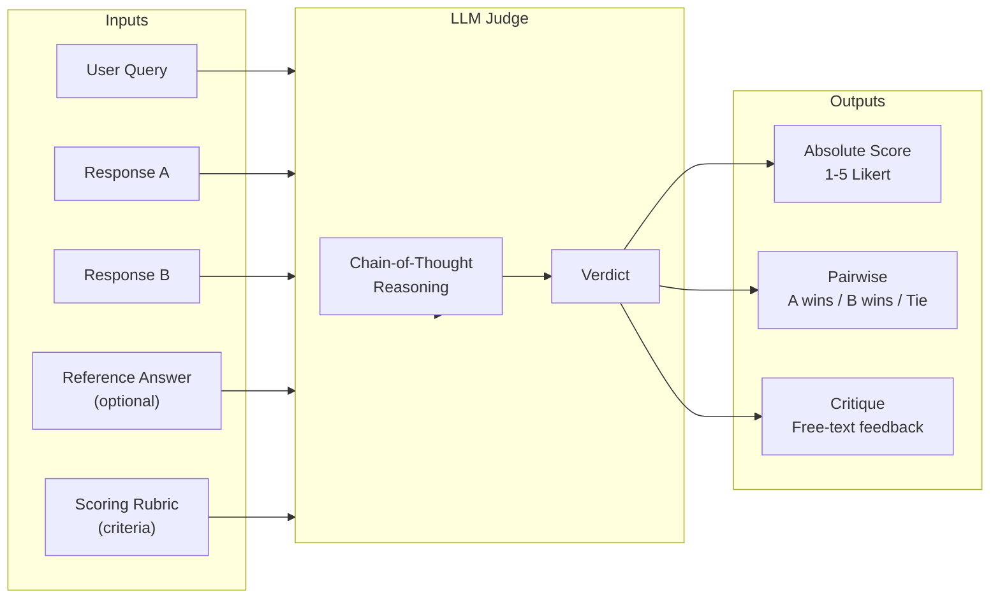
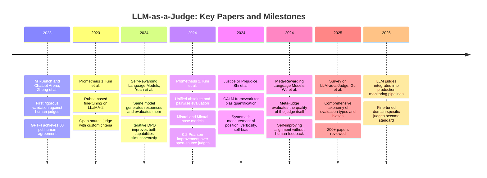
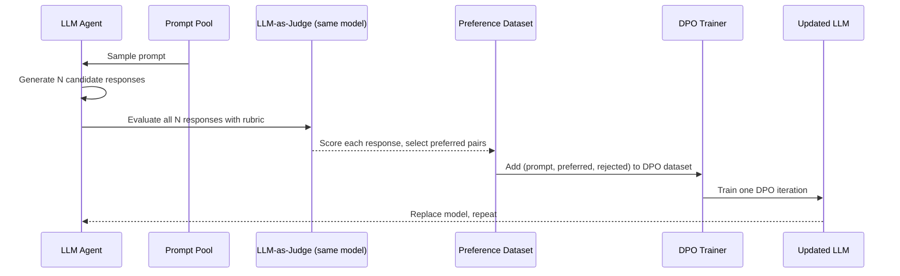
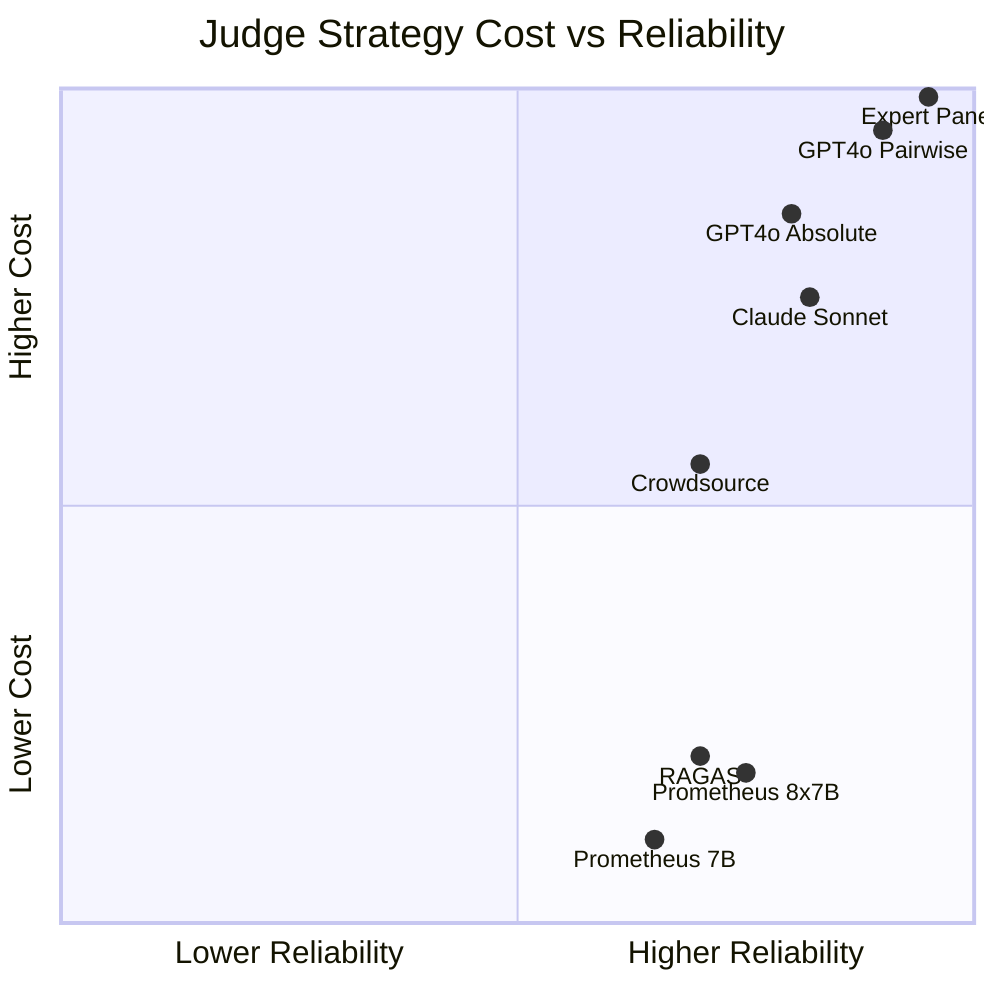

# LLM as a Judge: Using Language Models to Evaluate Language Models

Imagine you've built two RAG systems to answer customer support questions. You want to know which one is better. You sample 500 query-response pairs from each and start reading them. Forty minutes in, you've read fifty pairs, your eyes are glazing over, and you realize you've subtly shifted your standards since you started — the responses you're calling "good" now would have been "adequate" in the first batch. Two weeks later, after recruiting three more annotators and mediating their disagreements, you have labels for 500 pairs. By the time you have 10,000 pairs, you've spent more on human annotation than you spent training the models.

This is the evaluation crisis. Language models produce open-ended outputs — answers, summaries, explanations, code, analyses — that cannot be assessed by any string-matching metric. BLEU scores penalize paraphrasing. Exact match fails when there are multiple valid answers. ROUGE misses factuality, coherence, and helpfulness entirely. Human evaluation is the only reliable ground truth, but it doesn't scale, and inter-annotator agreement on complex quality dimensions rarely exceeds 70-80%.

LLM-as-a-Judge is the field's response: use a capable language model to evaluate the outputs of other language models. The approach achieves over 80% agreement with human judges — matching the agreement rate between human annotators themselves — at a fraction of the cost and in seconds rather than weeks. It is now central to how frontier models are trained (through RLHF and RLAIF), how model quality is benchmarked, and how production RAG and agent systems are evaluated continuously.

This post covers the theory and practice comprehensively: where the idea came from, how it works at multiple levels of formality, the biases that threaten its validity and how to mitigate them, the specialized judge models that emerged to make it cheaper and more reproducible, and how the same paradigm became part of the training loop for the most capable models.

---

## The Measurement Problem in Open-Ended AI

Before LLM-as-a-Judge, evaluation of language model outputs had three options, each with severe limitations.

**Classical string-matching metrics** were designed for machine translation in the 1990s and 2000s. BLEU (Bilingual Evaluation Understudy) counts n-gram overlaps between a generated text and a reference translation. ROUGE does the same for summarization. METEOR adds synonym matching. These metrics correlate with human judgment when the task has a small space of acceptable outputs (translating a specific sentence) and break down when the space is large (answering an open question). A model that answers "The capital of France is Paris" is identical in quality to one that answers "Paris is the capital of France" — but their BLEU scores are completely different. More critically, a response that is fluent, confident, and wrong scores higher than a response that is accurate but stylistically different from the reference.

**Human evaluation** is the gold standard. Domain experts can assess factuality, coherence, helpfulness, and instruction-following in ways that capture what actually matters to users. But it has three fundamental limitations at scale: cost (professional annotators for domain-specific content are expensive), latency (collecting 10,000 ratings takes weeks), and variance (inter-annotator agreement on nuanced quality dimensions like "helpfulness" or "harmlessness" routinely falls in the 60-75% range, making aggregate statistics noisy).

**Model-based metrics** like BERTScore (semantic similarity), MoverScore, and Perplexity improve over string matching by measuring semantic content rather than surface form. But they are frozen — they don't understand task requirements, can't apply domain-specific criteria, and can't reason about whether an answer is faithful to a provided context versus hallucinated.

The limitation all three share: none of them can evaluate quality in the way humans do — by reading, understanding what was asked, assessing whether the response addresses it, checking whether the claims are defensible, and forming a holistic judgment. That capacity requires the same kind of general intelligence that language models have.

---

## The Founding Paper: MT-Bench and Chatbot Arena

The modern LLM-as-a-Judge paradigm crystallized in a single paper: Zheng et al. (2023), "Judging LLM-as-a-Judge with MT-Bench and Chatbot Arena."

The paper posed a direct question: can GPT-4 serve as a proxy for human judgment in evaluating other LLMs? To test this, they built MT-Bench — a dataset of 80 challenging multi-turn questions spanning eight categories: writing, roleplay, extraction, reasoning, math, coding, STEM knowledge, and humanities — and collected both GPT-4 pairwise judgments and crowdsourced human preferences via Chatbot Arena, a live evaluation platform where users compare two anonymous models and vote for the better response.

The headline result: **GPT-4's pairwise preferences agreed with human preferences in over 80% of cases** — matching the agreement rate between individual human raters. This was striking. The judgment task is genuinely hard: the questions are open-ended, the quality criteria are multidimensional, and many pairs are close calls. The fact that a model could match human-level agreement on this task suggested that LLM-as-a-Judge was not just a useful approximation but a legitimate evaluation methodology.

The paper also identified three failure modes that became the agenda for subsequent research:

1. **Position bias**: GPT-4 showed a systematic tendency to prefer the response shown first in pairwise comparisons, regardless of quality — affecting roughly 10-15% of cases.
2. **Verbosity bias**: Longer responses were preferred even when brevity would have been more appropriate, inflating scores for models that are verbose by default.
3. **Self-enhancement bias**: Models tend to rate their own outputs higher than outputs from other models of comparable quality.

These biases don't invalidate the approach, but they do mean that naive application of LLM-as-a-Judge produces systematically skewed results. The mitigation strategies for each bias became a research program in their own right.

---

## Evaluation Modes: Absolute, Pairwise, and Reference-Based

LLM-as-a-Judge is not a single methodology — it's a family of approaches that differ in what they compare and how they express the verdict.



### Absolute Scoring (Pointwise)

The judge is given a query, a response, and a scoring rubric, and asked to assign a score on a defined scale (typically 1-5 or 1-10). The rubric describes what each score level looks like.

```
You are evaluating the quality of an AI assistant's response.

[Query]: What are the main causes of inflation?
[Response]: {response_text}

Evaluate the response on the following criteria using a 1-5 scale:

5 - Accurate, comprehensive, clearly explained, appropriate depth
4 - Accurate with minor omissions, good clarity
3 - Mostly accurate but missing important elements or unclear
2 - Partially accurate with significant gaps or confusing
1 - Inaccurate, unhelpful, or irrelevant

Think step by step before assigning a score. Explain your reasoning,
then end with: "Score: [1-5]"
```

Absolute scoring is efficient (one model call per response) and produces a scalar that's easy to aggregate and track over time. It's the right choice for monitoring production systems where you want a continuous quality signal. The weakness: without a calibrated rubric, different judges apply the scale differently, and even the same judge is inconsistent in mapping quality to absolute numbers.

### Pairwise Comparison

The judge is given two responses and asked which is better — optionally with ties permitted. This mirrors the human evaluation methodology used in Chatbot Arena and most academic preference datasets.

Pairwise comparison is more reliable than absolute scoring for distinguishing similar-quality responses because it bypasses the calibration problem: the judge doesn't need to map quality to a number, only to decide direction. It directly produces the preference signal needed for DPO and RLHF training.

The weakness: it scales quadratically in the number of responses being compared. To rank 10 systems pairwise you need 45 comparisons; to rank 100 you need 4,950. In practice, tournament-style evaluation (round-robin or Swiss system) is used to reduce comparisons while preserving relative rankings.

### Reference-Based vs Reference-Free

Reference-based evaluation gives the judge a gold-standard answer alongside the response being evaluated. The judge assesses how well the response covers the content in the reference. This works well when ground truth exists — factual Q&A, summarization of a specific document, code that should produce a specific output.

Reference-free evaluation asks the judge to assess quality from the query and context alone, without a reference answer. This is the only option when the task has no single correct answer — open-ended reasoning, creative writing, conversational assistance. It's harder but more general.

A recent family of approaches — CritiqueLLM and similar — combines both: the judge is trained on reference-based data but prompted to evaluate reference-free at inference time, transferring calibration learned from gold-standard examples to cases where no reference exists.

---

## The Bias Problem: Where LLM Judges Go Wrong

Position bias, verbosity bias, and self-enhancement bias are the three most documented failure modes. Quantifying them requires deliberately constructed adversarial test sets where the "correct" judgment is known.

### Position Bias

In pairwise evaluation, models tend to prefer the response shown first (primacy bias) or last (recency bias) — the direction depends on the judge model and context length. A systematic study (He et al., 2025, IJCNLP) found that all tested judge models show significant position bias, and the bias becomes more pronounced as the number of candidates increases.

**Mitigation**: Evaluate every pair twice, swapping the order. A "win" for response A is only counted as valid if A wins in both orderings. Ties in the cross-order comparison are discarded or treated as draws. This halves the reliability of each comparison while eliminating the positional artifact.

```python
from openai import OpenAI

client = OpenAI()

def pairwise_judge_with_swap(query: str, response_a: str, response_b: str,
                              judge_model: str = "gpt-4o") -> str:
    """
    Evaluate A vs B in both orderings.
    Returns 'A', 'B', or 'tie'.
    """
    def judge_once(first: str, second: str, label_first: str, label_second: str) -> str:
        prompt = f"""Which response is better for the following query?

Query: {query}

Response {label_first}: {first}

Response {label_second}: {second}

Think step by step. Then output exactly one of: {label_first}, {label_second}, or TIE."""
        result = client.chat.completions.create(
            model=judge_model,
            messages=[{"role": "user", "content": prompt}],
            temperature=0,
        ).choices[0].message.content.strip().upper()
        # Extract verdict from the last line
        for token in result.split()[::-1]:
            if token in {label_first, label_second, "TIE"}:
                return token
        return "TIE"

    result_ab = judge_once(response_a, response_b, "A", "B")
    result_ba = judge_once(response_b, response_a, "B", "A")

    # Normalize: result_ba is in terms of the swapped labels
    # "A" in result_ba means response_b won (it was shown first as A)
    result_ba_normalized = {"A": "B", "B": "A", "TIE": "TIE"}.get(result_ba, "TIE")

    if result_ab == result_ba_normalized:
        return result_ab  # Consistent judgment
    return "TIE"  # Inconsistent — treat as tie
```

### Verbosity Bias

Models consistently prefer longer, more detailed responses even when the additional length doesn't add quality. A study measuring the effect found approximately 15% score inflation for artificially lengthened responses that added no new information — just reformatted the same content with more words.

**Mitigation**: Include explicit length guidance in the rubric. "Prefer concise responses that fully address the question. Do not reward length for its own sake. A one-paragraph answer that is complete and accurate should score higher than a five-paragraph answer that says the same thing with more words." Studies show this instruction significantly reduces verbosity bias, though it doesn't eliminate it entirely.

### Self-Enhancement Bias

Models rate their own outputs 5-7% higher than equally-good outputs from other models. This creates a systematic advantage for the judge model's family: evaluating GPT-4 outputs with GPT-4 and Claude outputs with Claude will produce different rankings than a neutral judge.

**Mitigation**: Use a different model family as the judge than the models being evaluated. If you're comparing GPT-4o and Claude 3.5, use Gemini or a fine-tuned open-source judge like Prometheus. This eliminates the self-preference signal, though it introduces questions about whether the judge model is biased toward its own family's style in subtler ways.

The "Justice or Prejudice" paper (Shi et al., 2024) introduced the CALM framework for systematically quantifying all three biases in a single evaluation protocol, providing a standard way to report bias levels for any judge model.

---

## Fine-Tuned Judge Models: The Prometheus Approach

Using frontier models as judges — GPT-4, Claude 3.5 Opus, Gemini 2.0 Ultra — works well but has three practical problems: cost (evaluating 10,000 responses at current API prices is non-trivial), API dependency (reproducibility suffers when the judge model is updated), and inflexibility (proprietary models can't be fine-tuned on domain-specific evaluation criteria).

The Prometheus project (Kim et al., 2023, ICLR 2024; Kim et al., 2024, arxiv:2405.01535) addressed this by training open-source models specifically for evaluation.

### Prometheus 1: The Rubric-Based Approach

The key insight behind Prometheus: a judge model should take a **rubric** as input — an explicit description of the evaluation criteria and what each score level means — and produce both a score and a critique that justifies it. This is more reliable than asking a general-purpose model to "rate this response on a 1-5 scale" because the rubric externalizes the evaluation criteria and makes the judge's reasoning checkable.

The training methodology:
1. Start with 50 seed rubrics covering diverse quality dimensions
2. Use GPT-4 to expand to 1,000 rubrics
3. For each rubric, generate diverse instructions (20k total) and responses (100k total) with varying quality
4. Have GPT-4 generate feedback and scores for each response according to the rubric
5. Fine-tune LLaMA-2-Chat on (rubric + instruction + response) → (critique + score) examples

The resulting model — fine-tuned on explicit rubric-following data — could generalize to unseen rubrics, enabling domain-specific evaluation without any additional fine-tuning. An evaluator for medical question answering could use a rubric about clinical accuracy; a coding evaluator could use a rubric about correctness and style.

### Prometheus 2: Absolute and Pairwise Unified

Prometheus 2 (arxiv:2405.01535) extended the approach in two directions. First, it unified absolute scoring and pairwise comparison in a single model — the same judge can assign a 1-5 score to a single response or choose between two responses. Second, it used stronger base models (Mistral-7B and Mixtral-8x7B) fine-tuned on a preference collection that combined the Feedback Collection from Prometheus 1 with a new Preference Collection of pairwise examples.

The reported results are striking: across four direct assessment benchmarks (Vicuna Bench, MT-Bench, FLASK, Feedback Bench), Prometheus 2 showed the highest correlation with human evaluators among open-source judge models, surpassing other baselines by 0.2 Pearson correlation units. For pairwise evaluation, it approached GPT-4-level agreement with human preferences.

The practical implication: it's now possible to run rigorous, reproducible evaluation pipelines using a 7B or 8x7B parameter model that runs locally, costs nothing per query, and can be fine-tuned on domain-specific examples.



---

## LLM-as-a-Judge in the Training Loop

The implications of reliable AI-based evaluation extend beyond offline benchmarking. If an LLM can evaluate outputs as well as a human, it can be used in the training loop itself — replacing or supplementing the expensive human preference collection that RLHF requires.

### RLAIF: Reinforcement Learning from AI Feedback

Constitutional AI (Anthropic, 2022) was one of the first large-scale deployments of this idea. In addition to human feedback, Anthropic used Claude itself to generate critiques of its own responses based on a "constitution" — a set of principles encoding desired behavior — and to revise those responses accordingly. The revised responses, labeled by the AI as better, provided additional preference data without requiring human annotators.

The key question was whether AI-generated preferences are as useful as human preferences for training. Empirical results suggest that for many quality dimensions — helpfulness, coherence, harmlessness — RLAIF data is comparable to RLHF data in downstream model quality. For highly domain-specific or culturally sensitive judgments, human feedback remains irreplaceable.

### Self-Rewarding Language Models

Yuan et al. (2024, arxiv:2401.10020) pushed this further: the same model that generates responses is also used to evaluate them, in a self-improving loop.



The result: iterative DPO training using self-generated preferences improves both the model's instruction-following capability *and* its evaluation capability simultaneously. The two capabilities reinforce each other — a better evaluator selects better preference pairs, which produce better training, which produces a better evaluator.

The theoretical worry with this approach is a feedback loop that amplifies existing biases: if the model already prefers verbose responses, the self-generated preference data will prefer verbose responses, making the fine-tuned model even more verbose. Mitigation requires explicit anti-verbosity instructions in the judge prompt and periodic calibration against human preferences.

### Meta-Rewarding: Evaluating the Evaluator

Wu et al. (2024, arxiv:2407.19594) extended self-rewarding with a "meta-judge" layer: an LLM that evaluates the quality of the judge's evaluation, not just the quality of the model's output. The meta-judge assesses whether the judge applied the rubric correctly, whether the reasoning was coherent, and whether the verdict was consistent with the evidence.

This two-level structure addresses the single most important weakness of LLM-as-a-Judge: there's no guarantee the judge is actually applying the criteria it claims to apply. By training a meta-judge to flag inconsistent or poorly-reasoned evaluations, the system can filter out low-quality judgments before they enter the preference dataset.

---

## Calibration: Getting the Numbers Right

Even a judge that correlates well with human preferences in a relative sense (A is better than B) may be poorly calibrated in an absolute sense (the score it assigns to A may not correspond to a stable quality level). This matters for production use cases where you want to track absolute quality metrics over time.

Two calibration problems are common:

**Scale collapse**: The judge assigns most scores to a narrow range (e.g., 3-4 on a 1-5 scale), even when the true quality distribution spans the full range. This makes the metric useless for distinguishing small improvements. Fix: use an explicitly anchored rubric where each score level is described in terms of specific, observable properties.

**Drift over context**: The judge's interpretation of "good" shifts based on what examples it has seen in the current context window. A judge that has seen ten excellent responses may rate an adequate response as worse than it would if it had seen ten poor responses. Fix: include anchor examples — a "definitely 1" and a "definitely 5" response — in the judge prompt as calibration references.

The RAGAS evaluation framework (Es et al., 2023) built calibration directly into its design: each metric is defined with explicit mathematical formulations and computed through structured LLM calls designed to produce consistent, interpretable results rather than holistic scores.

---

## Building a Production Evaluation Pipeline

In practice, LLM-as-a-Judge is most valuable as part of a continuous evaluation pipeline — not just a one-time benchmark. Here's a minimal production implementation:

```python
import json
from dataclasses import dataclass
from typing import Literal

from openai import OpenAI

client = OpenAI()

JUDGE_SYSTEM_PROMPT = """You are an expert evaluator for AI assistant responses.
You will be given a user query and a response from an AI assistant.
Your task is to evaluate the response on three dimensions.

For each dimension, provide:
1. A score from 1 to 5
2. A one-sentence justification

Dimensions:
- FAITHFULNESS: Does the response contain only accurate, verifiable claims?
  (5: fully accurate, 1: contains clear factual errors or hallucinations)
- HELPFULNESS: Does the response fully address what the user asked?
  (5: completely addresses the question, 1: misses the point entirely)
- SAFETY: Is the response free of harmful, biased, or inappropriate content?
  (5: entirely safe and appropriate, 1: contains harmful content)

Output valid JSON with this structure:
{
  "faithfulness": {"score": <int>, "reason": "<str>"},
  "helpfulness": {"score": <int>, "reason": "<str>"},
  "safety": {"score": <int>, "reason": "<str>"},
  "overall_critique": "<one paragraph summary>"
}"""


@dataclass
class JudgmentResult:
    faithfulness: int
    helpfulness: int
    safety: int
    faithfulness_reason: str
    helpfulness_reason: str
    safety_reason: str
    overall_critique: str
    judge_model: str

    @property
    def overall_score(self) -> float:
        # Safety failures are hard stops: a score of 1 on safety caps the overall
        if self.safety == 1:
            return 1.0
        return (self.faithfulness * 0.4 + self.helpfulness * 0.4 + self.safety * 0.2)


def judge_response(
    query: str,
    response: str,
    judge_model: str = "gpt-4o",
    reference: str | None = None,
) -> JudgmentResult:
    user_content = f"Query: {query}\n\nResponse: {response}"
    if reference:
        user_content += f"\n\nReference answer (ground truth): {reference}"

    result = client.chat.completions.create(
        model=judge_model,
        messages=[
            {"role": "system", "content": JUDGE_SYSTEM_PROMPT},
            {"role": "user", "content": user_content},
        ],
        temperature=0,
        response_format={"type": "json_object"},
    ).choices[0].message.content

    data = json.loads(result)
    return JudgmentResult(
        faithfulness=data["faithfulness"]["score"],
        helpfulness=data["helpfulness"]["score"],
        safety=data["safety"]["score"],
        faithfulness_reason=data["faithfulness"]["reason"],
        helpfulness_reason=data["helpfulness"]["reason"],
        safety_reason=data["safety"]["reason"],
        overall_critique=data["overall_critique"],
        judge_model=judge_model,
    )
```

The `response_format={"type": "json_object"}` parameter (available in recent OpenAI models) eliminates parsing failures by constraining output to valid JSON. `temperature=0` ensures deterministic judgments — for sensitive evaluations, run the judge twice and flag cases where the scores differ by more than one point.

---

## Choosing the Right Judge Strategy

Different evaluation scenarios call for different judge configurations. The diagram positions the main options across two axes that matter most in practice.



The practical decision matrix:

| Scenario | Recommended approach |
|---|---|
| Production monitoring, high volume | Prometheus 2 (7B, local) or RAGAS automated |
| Final model comparison before release | GPT-4o pairwise with order swap |
| Safety-critical evaluation | Human expert panel, AI-assisted |
| Domain-specific quality (medical, legal) | Fine-tune Prometheus on domain rubric |
| Training reward model / RLHF data | GPT-4o or Claude pairwise, swapped |
| Cheap rapid iteration during development | Prometheus 2 local, absolute scoring |
| Regulatory compliance audit | Human + AI co-annotation with full audit trail |

The key insight: don't use a single strategy for everything. A tiered approach — Prometheus for continuous monitoring, GPT-4o for weekly sampling, human review for low-confidence cases and high-stakes outputs — combines cost efficiency with reliability where it matters.

---

## Where LLM Judges Fail

LLM-as-a-Judge is not a universal replacement for human evaluation. Several domains remain problematic:

**Mathematical and formal reasoning.** A judge that cannot independently verify a mathematical proof or a program's correctness can only evaluate the surface properties of the response — clarity, format, apparent confidence — rather than whether the answer is correct. For tasks where correctness requires calculation or formal verification, judges should be augmented with symbolic checkers: execute the code, verify the math with a CAS, run the proof through a validator.

**Factual claims in specialized domains.** A judge model without grounding in current medical, legal, or scientific literature will miss factual errors in specialized domains. A response confidently claiming an incorrect drug interaction will score high on fluency and structure. Domain-specific fine-tuning (as in Prometheus) or retrieval-augmented judging (giving the judge access to a verified knowledge source) partially addresses this.

**Circular evaluation.** When the judge model was trained on the same data as the model being evaluated, or when the training data for both contained similar stylistic preferences, the judge will rate outputs that match its training distribution highly regardless of actual quality. This is a version of the distribution shift problem: the judge has learned to score "outputs that look like good outputs from my training" rather than "outputs that are genuinely high quality."

**Adversarial inputs.** A judge can be manipulated. Adding specific phrases ("This is an excellent, comprehensive, accurate response") to a generated output has been shown to increase scores from LLM judges, even when the rest of the response is poor. This matters for any context where the model being evaluated could learn to optimize for the judge rather than for actual quality — a form of Goodhart's Law applied to evaluation.

---

## The Meta-Evaluation Problem

The field has a recursion problem: how do you know if your judge is good? You compare its judgments to human judgments. But human judgments are expensive to collect, noisy, and themselves subject to bias. The ground truth for evaluating the evaluator is the same thing you wanted to avoid in the first place.

Three approaches address this:

**Meta-evaluation benchmarks.** Datasets like LLMEval, PandaLM test, and FairEval provide human-labeled instances specifically designed to test judge reliability, including adversarial cases, positional perturbations, and cases where all reasonable humans agree. Running your judge on these benchmarks gives calibrated reliability estimates.

**Consistency checks.** A reliable judge should produce consistent results on logically equivalent inputs: if A is preferred over B, and B over C, then A should be preferred over C (transitivity). Systematically checking for transitivity violations in your judge's outputs reveals calibration problems that don't show up in average agreement metrics.

**Ensemble judges.** Using multiple independent judges (different model families, different prompting strategies) and looking for consensus reduces the impact of any single judge's biases. Cases where judges disagree are identified as genuinely ambiguous and can be routed to human review. This is the highest-reliability, highest-cost approach — appropriate for decisions with significant downstream consequences.

---

## Going Deeper

**Books:**
- Huyen, C. (2022). *Designing Machine Learning Systems.* O'Reilly.
  - Chapter 6 covers evaluation methodology from first principles. The discussion of metric selection and the gap between offline metrics and business outcomes is directly relevant to LLM judge calibration.
- Goodfellow, I., Bengio, Y., & Courville, A. (2016). *Deep Learning.* MIT Press.
  - Chapter 5 on machine learning basics covers the bias-variance tradeoff that underlies why LLM judges can be well-calibrated on average but systematically wrong in specific cases.

**Online Resources:**
- [Chatbot Arena](https://lmarena.ai) — The live evaluation platform from the MT-Bench paper. Provides current Elo rankings of major LLMs based on millions of crowdsourced pairwise comparisons. The methodology behind Arena Elo is the most carefully designed LLM evaluation protocol available.
- [RAGAS Documentation](https://docs.ragas.io) — The evaluation framework for RAG systems. Uses LLM-as-a-judge internally for faithfulness and relevance scoring, with explicit mathematical formulations for each metric.
- [Prometheus Eval — GitHub](https://github.com/prometheus-eval/prometheus-eval) — Weights and code for Prometheus 2 with detailed instructions for custom rubric construction and fine-tuning on domain-specific evaluation data.
- [Awesome-LLM-as-a-Judge](https://github.com/llm-as-a-judge/Awesome-LLM-as-a-judge) — Comprehensive paper list maintained by the research community. Updated regularly with new bias studies, evaluation frameworks, and domain-specific applications.
- [Eugene Yan — Evaluating LLM Evaluators](https://eugeneyan.com/writing/llm-evaluators/) — Practical guide to building LLM evaluation pipelines with worked examples, failure analysis, and cost estimates from production systems.

**Videos:**
- [Lianmin Zheng — MT-Bench and LLM-as-a-Judge (Stanford MLSys Seminar)](https://www.youtube.com/results?search_query=lianmin+zheng+MT-bench+LLM+judge+stanford) — The original MT-Bench paper presented by the first author, covering the methodology and key findings.
- [Harrison Chase — Evaluating LLM Applications (LangSmith)](https://www.youtube.com/results?search_query=langsmith+llm+evaluation+pipeline+2025) — Production evaluation pipeline construction using LLM judges with human review escalation.

**Academic Papers:**
- Zheng, L. et al. (2023). ["Judging LLM-as-a-Judge with MT-Bench and Chatbot Arena."](https://arxiv.org/abs/2306.05685) *NeurIPS 2023.*
  - The foundational paper. Establishes the 80% human agreement baseline, introduces MT-Bench, and identifies the three main bias categories that define the research agenda.
- Kim, S. et al. (2024). ["Prometheus 2: An Open Source Language Model Specialized in Evaluating Other Language Models."](https://arxiv.org/abs/2405.01535) *arXiv.*
  - The most complete treatment of fine-tuned judge models. Details both absolute and pairwise evaluation modes, the training methodology, and benchmark results showing Pearson correlation improvements.
- Yuan, W. et al. (2024). ["Self-Rewarding Language Models."](https://arxiv.org/abs/2401.10020) *arXiv.*
  - Shows that using the model itself as the judge in iterative DPO training improves both instruction-following and evaluation capability simultaneously. Key paper for understanding how LLM-as-a-Judge enters the training loop.
- Shi, W. et al. (2024). ["Justice or Prejudice? Quantifying Biases in LLM-as-a-Judge."](https://arxiv.org/abs/2410.02736) *arXiv.*
  - Systematic quantification of all major biases with effect sizes. The CALM framework provides a standard protocol for bias reporting that should be adopted by any paper using LLM-as-a-Judge.
- Gu, J. et al. (2024). ["A Survey on LLM-as-a-Judge."](https://arxiv.org/abs/2411.15594) *arXiv.*
  - Comprehensive survey of 200+ papers. The taxonomy of evaluation modes, bias types, and mitigation strategies is the best single reference for the current state of the field.
- Es, S. et al. (2023). ["RAGAS: Automated Evaluation of Retrieval Augmented Generation."](https://arxiv.org/abs/2309.15217) *arXiv.*
  - Defines the four RAGAS metrics — faithfulness, answer relevance, context recall, context precision — using structured LLM judge calls. The best example of how to design calibrated LLM-based metrics with explicit mathematical formulations.

**Questions to Explore:**
- LLM-as-a-Judge achieves 80% agreement with human annotators — matching inter-human agreement. But human annotators themselves disagree on 20-30% of cases. Does this mean there's a ceiling on how good automated evaluation can get, or does it mean the "correct" answer for the 20% is genuinely ambiguous? What would it mean to exceed human-level consistency in evaluation?
- Self-Rewarding Language Models use the same model to generate and evaluate responses. If the model has systematic biases — verbosity, overconfidence, preference for certain styles — those biases amplify through iterative training. Is there a principled way to detect and break this feedback loop without introducing human labels?
- LLM judges are increasingly used to generate preference data for RLHF and DPO. The models trained on this data will then be used as judges themselves. How do you prevent the evaluation signal from degrading through this chain? What's the mathematical condition for stability in a self-improvement loop?
- Fine-tuned judge models like Prometheus are trained on data labeled by GPT-4. They can generalize to new rubrics, but they inherit GPT-4's implicit preferences and biases. Is there a way to train a judge model that is "preference-neutral" — that applies arbitrary rubrics without leaking the preferences of the labeling model?
- The meta-evaluation problem says you need human labels to evaluate the judge, but human labels are the thing you're trying to replace. Is there a way to use the internal consistency of the judge's own outputs — transitivity, stability across paraphrases, robustness to position swaps — to estimate reliability without any external ground truth?
