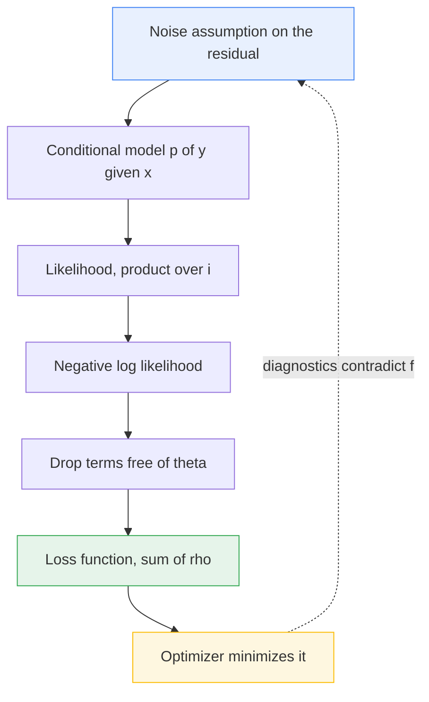
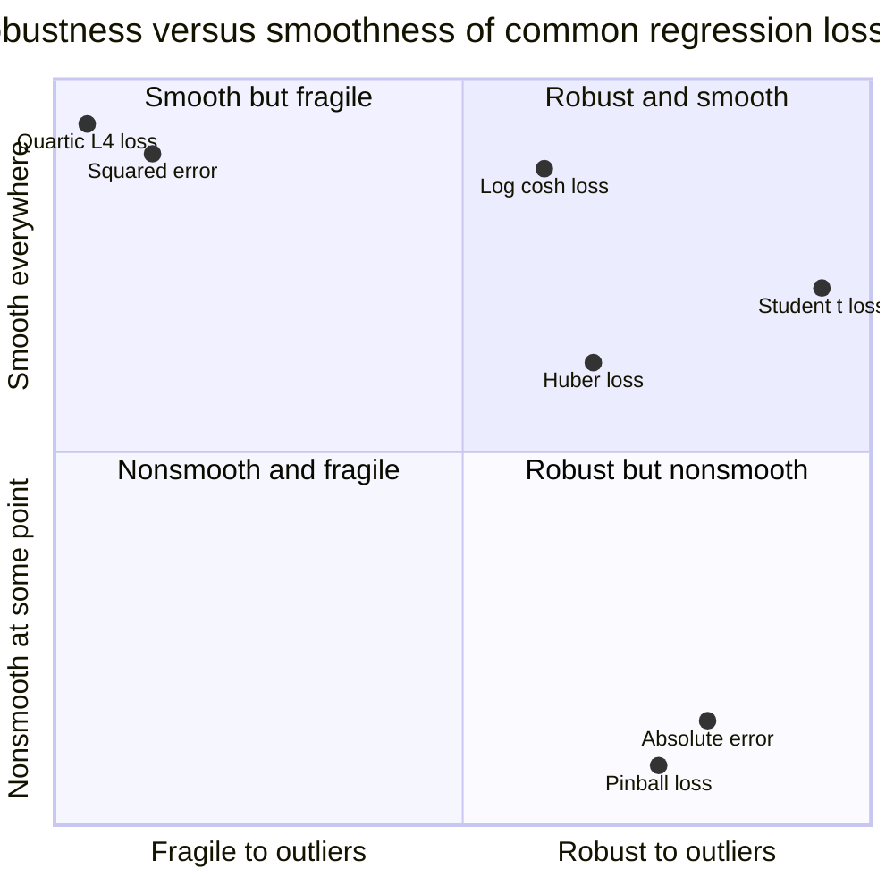

# The Loss Function Is a Probability Assumption

*This is part of **Why Learning Works: The Theorems Behind Machine Learning**, a series that proves why machine learning works rather than describing what it does. Each post states results formally and argues them. This one establishes the correspondence between losses and noise models -- scaffolding the rest of the series leans on whenever it talks about risk, estimation, and generalization.*

---

## The Choice Nobody Told You Was Derived

Open any introductory machine learning course and you meet the same two sentences within an hour of each other. For regression, use mean squared error. For classification, use cross-entropy. They arrive as conventions: reasonable defaults, sanctioned by practice, adopted and then never revisited. They are not conventions. They are theorems.

Squared error is not "the standard regression loss." It is the exact negative log-likelihood of a model in which the residuals are independent, identically distributed Gaussians with constant variance. Cross-entropy is not "the standard classification loss." It is the exact negative log-likelihood of a Bernoulli conditional. Neither was chosen. Both were *derived*, from an assumption about noise, by a short calculation most practitioners never see.

If your loss encodes a distributional assumption, then choosing a loss is choosing a probability model -- and you make that choice whether or not you know it. Every time someone reaches for MSE on heavy-tailed residuals, they are asserting, in a notation that hides the assertion, that six-sigma events essentially do not happen; the data will disagree, and the fit will absorb the disagreement by dragging the parameters toward the outlier.

The correspondence runs both ways and is mechanical: write down a noise density, turn a crank, a loss falls out; write down a loss, turn the crank backwards, a noise density falls out. Run it in both directions and a great deal of folklore -- "MAE is robust," "Huber is a nice compromise," "you cannot train on accuracy" -- becomes a short list of one-line consequences. Let us build the crank.

---

## The Setup

We observe pairs $(x_i, y_i)_{i=1}^n$, drawn independently and identically from an unknown joint distribution on $\mathcal{X} \times \mathcal{Y}$. We propose a parametric family of *conditional* densities $p(y \mid x; \theta)$, indexed by $\theta \in \Theta$. We do not model the marginal law of $x$; the design is treated as ancillary, the standard supervised-learning posture.

The **likelihood** is the joint density of the observations viewed as a function of $\theta$, namely $\prod_i p(y_i \mid x_i;\theta)\cdot\prod_i p(x_i)$. The second product is free of $\theta$. Drop it and define

$$
L(\theta) = \prod_{i=1}^{n} p(y_i \mid x_i; \theta), \qquad \ell(\theta) = \sum_{i=1}^{n} \log p(y_i \mid x_i; \theta).
$$

**Maximum likelihood** is $\hat{\theta} \in \arg\max_{\theta} L(\theta)$. Since $\log$ is strictly increasing this equals $\arg\max_\theta \ell(\theta)$, which equals $\arg\min_\theta(-\ell(\theta))$. That last object, the **negative log-likelihood**, is a sum over data points of a per-example quantity: structurally, already a loss function. The rest of this post is about what it *is* in each concrete case.

One remark on register: nothing here is asymptotic. We are not claiming maximum likelihood is consistent, efficient, or asymptotically normal -- separate theorems for later posts. The claim here is an algebraic identity, holding at every finite $n$.

---

## The General Theorem

Here is the engine. Everything in the next three sections is an instance of it.

> **Theorem 1 (Loss--density correspondence for additive noise).**
> Let $\rho : \mathbb{R} \to [0, \infty)$ be measurable and let $s > 0$. Suppose
>
> $$
> Z(s) := \int_{\mathbb{R}} \exp\!\left(-\frac{\rho(u)}{s}\right) du \in (0, \infty). \tag{H1}
> $$
>
> Define the conditional model
>
> $$
> p(y \mid x; \theta, s) = \frac{1}{Z(s)} \exp\!\left(-\frac{\rho\big(y - f(x; \theta)\big)}{s}\right), \tag{H2}
> $$
>
> with $f(\cdot\,;\theta)$ any measurable regression function, and let the data be i.i.d. with the marginal law of $x$ free of $(\theta, s)$. **(H3)** Then, writing $r_i(\theta) = y_i - f(x_i; \theta)$,
>
> $$
> -\ell(\theta, s) \;=\; \frac{1}{s} \sum_{i=1}^{n} \rho\big(r_i(\theta)\big) \;+\; n \log Z(s),
> $$
>
> and for every fixed $s > 0$,
>
> $$
> \boxed{\;\arg\min_{\theta \in \Theta} \big(-\ell(\theta, s)\big) \;=\; \arg\min_{\theta \in \Theta} \sum_{i=1}^{n} \rho\big(y_i - f(x_i; \theta)\big)\;}
> $$
>
> as an equality of sets, both possibly empty.

**Proof.** By (H1) the function in (H2) is nonnegative and integrates to $1$ in $y$ for each fixed $x$ -- substitute $u = y - f(x;\theta)$, a translation, which preserves Lebesgue measure -- so the family is well defined. By independence $L(\theta,s) = \prod_i p(y_i \mid x_i;\theta,s)$, and by (H3) the discarded $x$-marginal contributes an additive constant free of $(\theta,s)$. Taking logarithms of (H2) termwise, $\log p(y_i \mid x_i;\theta,s) = -\rho(r_i(\theta))/s - \log Z(s)$; summing over $i$ and negating gives the identity for $-\ell$. The content is in the next step.

> **Lemma (positive affine maps preserve minimizers).** Let $g : \Theta \to \mathbb{R}$, $a > 0$, $b \in \mathbb{R}$, and $h = a g + b$. Then $\arg\min_\Theta h = \arg\min_\Theta g$.
>
> *Proof.* For any $\theta, \theta'$: $h(\theta) \le h(\theta')$ iff $a g(\theta) + b \le a g(\theta') + b$ iff $a g(\theta) \le a g(\theta')$ iff $g(\theta) \le g(\theta')$, the last step because dividing by $a > 0$ preserves inequalities. So $\theta$ minimizes $h$ globally exactly when it minimizes $g$ globally, the argmin sets coincide, and one is empty iff the other is. $\square$

Apply the lemma with $g(\theta) = \sum_i \rho(r_i(\theta))$, $a = 1/s > 0$, $b = n \log Z(s)$, the last two constant in $\theta$ once $s$ is fixed. $\blacksquare$

The boxed conclusion is the entire thesis of this post. **The loss is the negative log-density of the assumed noise, up to a positive affine transformation, and positive affine transformations do not move the argmin.** MSE does not resemble the Gaussian log-density. It *is* the Gaussian log-density with the $\theta$-free parts thrown away.

### The converse, which is the part people forget

> **Proposition 2.** Let $\rho : \mathbb{R} \to [0,\infty)$ be measurable with $C := \int_{\mathbb{R}} e^{-\rho(u)}\,du \in (0, \infty)$. Then $f_\rho(u) := C^{-1} e^{-\rho(u)}$ is a probability density, and minimizing $\sum_i \rho(r_i)$ is maximum likelihood under additive noise with density $f_\rho$.

**Proof.** Nonnegativity and integration to one are immediate from the definition of $C$; the rest is Theorem 1 with $s = 1$, $Z(1) = C$. $\blacksquare$

So *any* loss with integrable exponential is secretly a likelihood. You do not get to opt out of having a noise model; you only get to be unaware of the one you picked. The condition is not vacuous: if $\rho$ is bounded above -- Tukey's biweight, the $0$--$1$ loss, any capped loss -- then $e^{-\rho}$ is bounded below and the integral diverges, so such losses correspond to no density at all, and the guarantees that come free with maximum likelihood do not attach to them.

### Where the constants stop being harmless

The lemma discards $1/s$ and $n \log Z(s)$ *because $s$ was fixed*. Relax that and they return: minimizing $\frac{1}{s}\sum_i \rho(r_i)$ alone over $s > 0$ has infimum $0$ attained nowhere, so estimating the scale needs the normalizer back; comparing models via likelihood-ratio tests, AIC, BIC or Bayes factors compares *values* of $\ell$, not argmins, so $\sum_i \rho(r_i)$ alone is incommensurable across models with different assumed scales; a predictive interval needs $s$, since the point estimate does not know how wide it should be; and under heteroscedasticity $1/s_i$ sits *inside* the sum and becomes a weight, worked through below.

The chain runs downward when you derive and upward when you diagnose.



---

## Five Instantiations

Each subsection states a noise law, does the algebra, lands on a loss. A summary table follows, but a table is only trustworthy to someone who has seen where its rows came from.

### Gaussian noise gives squared error

Assume $y = f(x;\theta) + \varepsilon$ with $\varepsilon \sim \mathcal{N}(0, \sigma^2)$:

$$
p(y \mid x; \theta, \sigma) = \frac{1}{\sqrt{2\pi\sigma^2}} \exp\!\left(-\frac{\big(y - f(x;\theta)\big)^2}{2\sigma^2}\right).
$$

This is (H2) with $\rho(z) = \tfrac{1}{2}z^2$, $s = \sigma^2$, and $Z(\sigma^2) = \int e^{-u^2/(2\sigma^2)}du = \sqrt{2\pi\sigma^2}$, finite and positive, so (H1) holds. Theorem 1 gives

$$
-\ell(\theta, \sigma) = \frac{1}{2\sigma^2} \sum_{i=1}^{n} \big(y_i - f(x_i;\theta)\big)^2 + \frac{n}{2}\log\!\big(2\pi\sigma^2\big).
$$

The factor $\tfrac{1}{2\sigma^2}$ is a positive constant in $\theta$ and the log term is additive, so by the Lemma the $\theta$-minimizer is the least-squares estimator *whatever $\sigma$ happens to be*. That is why nobody needs the noise variance to run a regression -- a lucky property of the Gaussian, not a general fact.

Now stop fixing $\sigma$. Write $v = \sigma^2$:

$$
\frac{\partial(-\ell)}{\partial v} = -\frac{1}{2v^2}\sum_i r_i^2 + \frac{n}{2v} = 0 \quad\Longrightarrow\quad \hat{\sigma}^2 = \frac{1}{n}\sum_{i=1}^{n} r_i(\hat\theta)^2,
$$

and substituting back, the second derivative there is $n/(2\hat v^2) > 0$, so it is a minimum. The joint MLE splits cleanly: $\hat\theta$ unaffected by $\sigma$, $\hat\sigma^2$ the mean square residual. The divisor is $n$, not $n - p$, so the MLE of the variance is biased downward -- which is why the unbiased estimator used for standard errors divides by the residual degrees of freedom instead.

### Laplace noise gives absolute error

Assume $\varepsilon$ has the Laplace density with scale $\lambda > 0$:

$$
f_\varepsilon(z) = \frac{1}{2\lambda} e^{-|z|/\lambda}, \qquad \mathbb{E}[\varepsilon] = 0, \qquad \operatorname{Var}(\varepsilon) = 2\lambda^2.
$$

With $\rho(z) = |z|$, $s = \lambda$: $Z(\lambda) = \int_{\mathbb{R}} e^{-|u|/\lambda}du = 2\int_0^\infty e^{-u/\lambda}du = 2\lambda$. For a linear model $f(x;w) = w^\top x$,

$$
\log L(w) = n \log \frac{1}{2\lambda} \;-\; \frac{1}{\lambda} \sum_{i=1}^{n} \big|y_i - w^\top x_i\big|.
$$

Maximizing over $w$ is minimizing $\sum_i |y_i - w^\top x_i|$. Absolute error is not an alternative to likelihood; it is likelihood under a different noise law.

> **Proposition 3.** A point $m^\star$ minimizes $\sum_{i=1}^n |y_i - m|$ over $m \in \mathbb{R}$ if and only if $m^\star$ is a median of $y_1, \dots, y_n$.

**Proof.** $G(m) = \sum_i |y_i - m|$ is convex, a finite sum of convex functions, and piecewise linear, so $m^\star$ is a global minimizer iff $0 \in \partial G(m^\star)$. Where $m$ is not a data value, $G$ is differentiable with

$$
G'(m) = \sum_i -\operatorname{sign}(y_i - m) = \#\{i : y_i < m\} - \#\{i : y_i > m\},
$$

which vanishes exactly when as many observations lie strictly below $m$ as strictly above. At a data value the subdifferential is the closed interval spanned by the one-sided derivatives, and the ties at $m$ supply enough slack for it to contain $0$ under the same balance condition. Both conditions define a median. $\blacksquare$

So the Laplace MLE for location is the median and the Gaussian MLE for location is the mean. "MAE gives you the median, MSE gives you the mean" is this proposition and its Gaussian twin, nothing more.

### Bernoulli gives cross-entropy, and it is a different kind of object

For binary $y \in \{0,1\}$ there is no decomposition $y = f(x;\theta) + \varepsilon$ with $\varepsilon$ independent of $x$. There cannot be: the support of $y$ is two points, so the "noise" is forced to depend on the mean, its variance pinned by $\operatorname{Var}(y \mid x) = \pi(x)(1 - \pi(x))$. Theorem 1 is about additive-noise location families; the Bernoulli is not one, so it does not apply.

What does apply is the direct route: model the conditional distribution itself. Set $\pi(x) = \sigma(f(x;\theta))$ with $\sigma(z) = (1 + e^{-z})^{-1}$ and write $p(y \mid x;\theta) = \pi(x)^y(1-\pi(x))^{1-y}$, a valid mass function since it returns $\pi$ at $y=1$ and $1-\pi$ at $y=0$. Then

$$
-\ell(\theta) = -\sum_{i=1}^n \Big[\, y_i \log \pi(x_i) + (1 - y_i)\log\big(1 - \pi(x_i)\big) \Big],
$$

verbatim the binary cross-entropy. No approximation, no constant dropped, no choice made. Cross-entropy *is* the Bernoulli negative log-likelihood. The unification that puts Gaussian and Bernoulli under one roof is the exponential family, in Section 7. Until then hold the distinction: Theorem 1 covers "signal plus symmetric noise"; the GLM view covers "a conditional distribution whose mean depends on $x$."

### Poisson gives the Poisson deviance

For counts $y \in \{0,1,2,\dots\}$ assume $y \mid x \sim \operatorname{Poisson}(\mu(x))$ with $\mu(x) = \exp(f(x;\theta)) > 0$; dropping the $\theta$-free $\log(y_i!)$ term, $-\ell(\theta) = \sum_i(\mu_i - y_i\log\mu_i)$ is what a Poisson regression minimizes, and recentering it against the saturated fit ($\mu_i = y_i$) gives the Poisson **deviance** -- the same negative log-likelihood, shifted so a perfect fit scores zero (see the table below). Squared error on counts is the wrong likelihood in a specific way: it asserts constant variance where the Poisson asserts variance equals mean.

### Student-$t$ gives a redescending robust loss

Assume the residual is Student-$t$ with $\nu > 0$ degrees of freedom, unit scale: $f_\varepsilon(z) \propto (1 + z^2/\nu)^{-(\nu+1)/2}$, giving $\rho_\nu(z) = \tfrac{\nu+1}{2}\log(1+z^2/\nu)$ and score $\psi_\nu(z) = (\nu+1)z/(\nu+z^2)$, tabulated below. Since $\psi_\nu(z) \to 0$ as $|z|\to\infty$, the loss is **redescending** -- an extreme residual pulls the fit *less* than a moderate one, and in the limit not at all -- at the cost of a non-convex $\rho_\nu$, so $-\ell$ has no guaranteed unique optimum and the fit depends on initialization.

### The table

| Assumed conditional law | Density or mass function | $\rho(z)$, up to positive affine | Resulting loss | $\psi(z) = \rho'(z)$ |
|---|---|---|---|---|
| Gaussian $\mathcal{N}(0,\sigma^2)$ | $\frac{1}{\sqrt{2\pi\sigma^2}}e^{-z^2/2\sigma^2}$ | $\tfrac12 z^2$ | squared error | $z$ |
| Laplace, scale $\lambda$ | $\frac{1}{2\lambda}e^{-\lvert z\rvert/\lambda}$ | $\lvert z\rvert$ | absolute error | $\operatorname{sign}(z)$ |
| Huber least favorable | Gaussian core, exponential tails | $\tfrac12 z^2$ or $k\lvert z\rvert - \tfrac12 k^2$ | Huber | $z$ clipped at $\pm k$ |
| Student-$t$, $\nu$ d.f. | $\propto (1 + z^2/\nu)^{-(\nu+1)/2}$ | $\tfrac{\nu+1}{2}\log(1 + z^2/\nu)$ | redescending | $\frac{(\nu+1)z}{\nu+z^2}$ |
| Asymmetric Laplace, level $\tau$ | $\tau(1-\tau)e^{-\rho_\tau(z)}$ | $z\big(\tau - \mathbb{1}\{z<0\}\big)$ | pinball / quantile | $\tau - \mathbb{1}\{z<0\}$ |
| Bernoulli $(\pi)$ | $\pi^y(1-\pi)^{1-y}$ | not additive noise | cross-entropy | $\pi - y$, in $\eta$ |
| Poisson $(\mu)$ | $\mu^y e^{-\mu}/y!$ | not additive noise | Poisson deviance | $\mu - y$, in $\eta$ |

The last two rows are deliberately marked: their $\psi$ column is a derivative with respect to the *linear predictor* $\eta$, not an additive residual. Section 7 resolves that distinction.

Now the demonstration. Two losses, one dataset, one contaminated point.

```python
"""Gaussian vs Laplace noise, fit to the same data, with one outlier."""

import numpy as np
from scipy.optimize import minimize

rng = np.random.default_rng(20240617)

n = 40
x = np.sort(rng.uniform(0.0, 10.0, size=n))
X = np.column_stack([np.ones_like(x), x])
y_clean = 2.0 + 1.5 * x + rng.normal(0.0, 0.5, size=n)

nll_gauss = lambda w, y: 0.5 * np.sum((y - X @ w) ** 2)
nll_lap = lambda w, y: np.sum(np.abs(y - X @ w))

fit = lambda obj, y: minimize(obj, np.zeros(2), args=(y,), method="Nelder-Mead",
                              options={"xatol": 1e-10, "fatol": 1e-12,
                                       "maxiter": 20000}).x

y_dirty = y_clean.copy()
y_dirty[n // 2] += 30.0

for name, obj in [("squared error", nll_gauss), ("absolute error", nll_lap)]:
    clean, dirty = fit(obj, y_clean), fit(obj, y_dirty)
    print(f"{name:<15} clean {clean[0]:7.4f} {clean[1]:6.4f} | "
          f"outlier {dirty[0]:7.4f} {dirty[1]:6.4f} | "
          f"shift {np.linalg.norm(dirty - clean):.4f}")
```

Output:

```text
squared error   clean  1.8949 1.5250 | outlier  2.5656 1.5414 | shift 0.6709
absolute error  clean  1.9377 1.5141 | outlier  1.9363 1.5157 | shift 0.0022
```

On clean data the estimates are close, as expected: both are consistent for the center of a symmetric noise law. One contaminated point in forty moves the Gaussian fit by $0.67$ and the Laplace fit by $0.0022$ -- a ratio of roughly $300$, predictable before anything was run.

---

## Huber's Loss Is Not a Hack

Huber's loss is almost always introduced as a compromise: quadratic near the origin so it is smooth, linear far away so outliers cannot dominate, with the crossover $k$ a knob you tune. That description undersells it -- it is the exact maximum-likelihood loss for a uniquely determined distribution, derived by Huber as the solution to a minimax problem.

Fix a contamination level $\varepsilon \in (0,1)$ and consider the neighborhood of the standard Gaussian

$$
\mathcal{P}_\varepsilon = \Big\{\, F = (1 - \varepsilon)\Phi + \varepsilon H \;:\; H \text{ a symmetric distribution} \Big\},
$$

i.e. "most of my data is Gaussian, a fraction $\varepsilon$ is garbage of unknown kind." For an M-estimator of location with score $\psi$, the asymptotic variance at $F$ is $V(\psi,F) = \int\psi^2 dF \big/ (\int \psi' dF)^2$, and Huber asked which $\psi$ minimizes the *worst case* of $V$ over $\mathcal{P}_\varepsilon$.

> **Theorem (Huber, 1964).** The problem $\min_\psi \max_{F \in \mathcal{P}_\varepsilon} V(\psi, F)$ has a saddle point $(\psi_k, F_k)$. The least favorable distribution $F_k$ -- the member of $\mathcal{P}_\varepsilon$ with smallest Fisher information for location -- has density
>
> $$
> f_k(z) = \frac{1 - \varepsilon}{\sqrt{2\pi}} \begin{cases} \exp\!\big(-\tfrac{1}{2}z^2\big), & |z| \le k, \\[4pt] \exp\!\big(\tfrac{1}{2}k^2 - k|z|\big), & |z| > k, \end{cases}
> $$
>
> and the optimal score is $\psi_k(z) = \max(-k, \min(k, z))$, the identity clipped at $\pm k$. Equivalently, the minimax estimator is the MLE for $F_k$, minimizing $\sum_i \rho_k(r_i)$ with $\rho_k(z) = \tfrac12 z^2$ for $|z| \le k$ and $k|z| - \tfrac12 k^2$ otherwise.

Read the density again. It is **Gaussian in the middle and Laplace in the tails**, glued at $\pm k$. That is not a metaphor for what Huber loss does; it is the distribution whose negative log-density Huber loss is.

**What can be shown here, and what cannot.** The full minimax argument runs several pages -- convexity of Fisher information as a functional of the density, a variational computation over $\mathcal{P}_\varepsilon$, a saddle-point verification -- and belongs to Huber's Sections 3--5, reproduced as Theorem 4.5 in Huber and Ronchetti. The shape of it: Fisher information is convex in $f$, so a minimizer over the convex set $\mathcal{P}_\varepsilon$ exists, and the Euler--Lagrange condition forces $-(\log f)'$ linear where the contamination constraint is slack and constant where it binds -- exactly $\psi_k$.

What can be derived in full, and is genuinely satisfying, is the tuning constant. It is not free.

> **Proposition 4.** The density $f_k$ integrates to one if and only if $k > 0$ satisfies
>
> $$
> \frac{2\phi(k)}{k} - 2\Phi(-k) = \frac{\varepsilon}{1 - \varepsilon},
> $$
>
> with $\phi, \Phi$ the standard normal density and distribution function. This follows by splitting the integral of $f_k$ at $\pm k$, evaluating the Gaussian core and the exponential tails separately, and setting the total to one; the left side decreases strictly from $+\infty$ to $0$ on $(0,\infty)$, so the root is unique for every $\varepsilon$. Numerically:

| $\varepsilon$ | 0.001 | 0.01 | 0.02 | 0.05 | 0.10 | 0.25 |
|---|---|---|---|---|---|---|
| $k$ | 2.633 | 1.945 | 1.717 | 1.398 | 1.140 | 0.766 |

As $\varepsilon \to 0$ the crossover runs to infinity and Huber loss becomes squared error; as $\varepsilon$ grows it shrinks toward zero and becomes absolute error. The knob is a contamination level in different units.

One clarification: the popular default $k = 1.345$ is *not* the minimax constant for any round $\varepsilon$ -- it is the value giving 95% asymptotic efficiency relative to the mean under an exactly Gaussian model, a different criterion answering a different question.

At $|z| = k$ the two branches of $\rho_k$ agree at $\tfrac12 k^2$ and their derivatives agree at $k$, so $\rho_k$ is continuously differentiable, though its second derivative jumps from $1$ to $0$ -- exactly the regularity you want: enough smoothness for gradient methods, a hard cap on influence.



---

## Reading It Backwards

Proposition 2 says the crank runs in reverse: given a loss with integrable exponential, the noise density is $e^{-\rho}$ normalized, and the estimator's behavior follows from that density's tails. Two exercises make the habit stick.

**What does an $L_4$ loss assume?** Take $\rho(z) = z^4$. Substituting $u = z^4$,

$$
\int_{\mathbb{R}} e^{-z^4}\,dz = 2\int_0^\infty e^{-u}\,\tfrac{1}{4}u^{-3/4}\,du = \tfrac{1}{2}\Gamma\!\left(\tfrac14\right) \approx 1.8128,
$$

so $L_4$ is maximum likelihood under $f(z) \propto e^{-z^4}$: a flat-topped law whose tails decay *faster* than a Gaussian's. Picking $L_4$ to "punish big errors harder" asserts a noise model in which big errors essentially cannot occur, making the estimator *more* sensitive to a single outlier than least squares -- its score $\psi(z) = 4z^3$ grows cubically, a price written into the loss the moment it was chosen.

**What does the pinball loss assume?** Fix $\tau \in (0,1)$ and take

$$
\rho_\tau(z) = z\big(\tau - \mathbb{1}\{z < 0\}\big) = \begin{cases} \tau z, & z \ge 0,\\ (1-\tau)|z|, & z < 0.\end{cases}
$$

Normalize its exponential:

$$
\int_{\mathbb{R}} e^{-\rho_\tau(z)}dz = \int_0^\infty e^{-\tau z}dz + \int_{-\infty}^0 e^{-(1-\tau)|z|}dz = \frac{1}{\tau} + \frac{1}{1-\tau} = \frac{1}{\tau(1-\tau)},
$$

so the implied density is $f_\tau(z) = \tau(1-\tau)e^{-\rho_\tau(z)}$: the **asymmetric Laplace**, two exponential tails with different rates glued at zero -- the likelihood underlying quantile regression. Now the payoff, in two lines.

> **Proposition 5.** Let $Y$ have distribution function $F$, continuous and strictly increasing on its support, with $\mathbb{E}|Y| < \infty$. Then $q^\star$ minimizes $\mathbb{E}[\rho_\tau(Y - q)]$ if and only if $F(q^\star) = \tau$.

**Proof.** Write $R(q) = \tau\,\mathbb{E}[(Y-q)^+] + (1-\tau)\,\mathbb{E}[(q-Y)^+]$, convex and finite. Differentiating under the expectation, licensed by dominated convergence and the integrability of $Y$,

$$
R'(q) = -\tau\,\mathbb{P}(Y > q) + (1-\tau)\,\mathbb{P}(Y < q) = -\tau\big(1 - F(q)\big) + (1-\tau)F(q) = F(q) - \tau.
$$

By convexity $q^\star$ is a global minimizer iff $R'(q^\star) = 0$, that is $F(q^\star) = \tau$. $\blacksquare$

The pinball loss estimates the $\tau$-th quantile *because* its implied noise law is an asymmetric Laplace whose balance point sits there. "This loss estimates a quantile" and "this loss assumes asymmetric Laplace noise" are two readings of one fact. The general habit: exponentiate the negative loss, normalize, look at the tails. Heavy tails mean the loss tolerates large residuals; light tails mean it does not; asymmetric tails mean it is not estimating a center at all.

---

## Exponential Families and the Shape of the Gradient

Section 4 left a seam. Theorem 1 handles additive noise; Bernoulli and Poisson are not additive noise; yet all three produce losses that behave alike under gradient descent. The object closing the seam is the exponential family with its canonical link -- the generalized linear model as Nelder and Wedderburn set it out.

A one-dimensional **exponential dispersion family** has density or mass function

$$
p(y \mid \theta, \phi) = h(y, \phi)\exp\!\left(\frac{y\theta - b(\theta)}{\phi}\right),
$$

with $\theta$ the **natural** parameter, $b$ the **cumulant function**, $\phi > 0$ a dispersion parameter. Three members, each checkable in a line: Gaussian, $b(\theta) = \tfrac12\theta^2$, $\phi = \sigma^2$, $\theta = \mu$; Bernoulli, since $\pi^y(1-\pi)^{1-y} = \exp(y\log\tfrac{\pi}{1-\pi} + \log(1-\pi))$, so $\theta = \operatorname{logit}(\pi)$, $b(\theta) = \log(1 + e^\theta)$, $\phi = 1$; Poisson, $\theta = \log\mu$, $b(\theta) = e^\theta$, $\phi = 1$, $h = 1/y!$.

> **Lemma 6.** For a regular exponential dispersion family, $\mathbb{E}[Y] = b'(\theta)$ and $\operatorname{Var}(Y) = \phi\, b''(\theta)$.

**Proof (mean; the variance is the same move applied twice).** Differentiate $\int p(y \mid \theta,\phi)\,dy = 1$ in $\theta$, exchanging derivative and integral, which regularity permits on the interior of the natural parameter space:

$$
0 = \int \frac{\partial p}{\partial \theta}\,dy = \int \frac{y - b'(\theta)}{\phi}\,p(y \mid \theta, \phi)\,dy = \frac{\mathbb{E}[Y] - b'(\theta)}{\phi}.
$$

Multiply by $\phi > 0$. $\blacksquare$

A GLM with the **canonical link** sets the natural parameter equal to the linear predictor, $\theta_i = \eta_i = w^\top x_i$, so $\mu_i = b'(w^\top x_i)$ and

$$
-\ell(w) = \frac{1}{\phi}\sum_{i=1}^n \Big[\, b\big(w^\top x_i\big) - y_i\, w^\top x_i \Big] + \text{const}.
$$

> **Theorem 7 (canonical links: gradient shape and convexity).** Under the canonical link,
>
> $$
> \nabla_w \big(-\ell(w)\big) = \frac{1}{\phi}\sum_{i=1}^n \big(\mu_i - y_i\big)\, x_i, \qquad \nabla^2_w \big(-\ell(w)\big) = \frac{1}{\phi}\sum_{i=1}^n b''\big(w^\top x_i\big)\, x_i x_i^\top \;\succeq\; 0,
> $$
>
> so $-\ell$ is convex in $w$, and strictly convex whenever $b'' > 0$ and the design has full column rank.

**Proof.** Chain rule: $\nabla_w\, b(w^\top x_i) = b'(w^\top x_i)x_i = \mu_i x_i$ and $\nabla_w\, y_i w^\top x_i = y_i x_i$; summing gives the gradient. Differentiating again, $\nabla_w\,\mu_i x_i = b''(w^\top x_i)x_i x_i^\top$. Each $x_i x_i^\top$ is positive semidefinite and $b''(\theta) = \operatorname{Var}(Y)/\phi \ge 0$ by Lemma 6, so the Hessian is a nonnegative combination of positive semidefinite matrices, hence positive semidefinite, and convexity follows from the second-order characterization. If $b'' > 0$ and $\{x_i\}$ spans $\mathbb{R}^p$, then $v^\top \nabla^2 v = \frac{1}{\phi}\sum_i b''_i (x_i^\top v)^2 > 0$ for $v \ne 0$. $\blacksquare$

This is the theorem people gesture at when they say two losses "have the same gradient":

$$
\nabla_w \tfrac{1}{2}\big(w^\top x - y\big)^2 = \big(w^\top x - y\big)\,x, \qquad \nabla_w \Big[-y\log\sigma(w^\top x) - (1-y)\log\big(1-\sigma(w^\top x)\big)\Big] = \big(\sigma(w^\top x) - y\big)\,x.
$$

The first is immediate. The second takes three lines. Write $z = w^\top x$ and use $\sigma'(z) = \sigma(z)(1 - \sigma(z))$:

$$
\begin{aligned}
\frac{d}{dz}\Big[y\log\sigma(z) + (1-y)\log\big(1-\sigma(z)\big)\Big] &= y\,\frac{\sigma'(z)}{\sigma(z)} - (1-y)\,\frac{\sigma'(z)}{1-\sigma(z)} \\[4pt]
&= y\big(1 - \sigma(z)\big) - (1-y)\,\sigma(z) \\[4pt]
&= y - y\sigma(z) - \sigma(z) + y\sigma(z) \;=\; y - \sigma(z).
\end{aligned}
$$

Negate and apply $\nabla_w z = x$ to get $(\sigma(z) - y)x$. Both gradients are (fitted mean minus observed value) times the input -- not analogy, but what the canonical link *is*. Choosing the identity link for a Gaussian, the logit for a Bernoulli and the log for a Poisson is choosing, each time, the link that makes the score take this form and the objective convex.

---

## What Breaks When the Assumption Is Wrong

Everything so far has been bookkeeping. Here it pays.

### Influence is the derivative of the loss

Let $T$ be a location M-estimator: the functional $T(F)$ defined implicitly by $\int \psi(y - T(F))\,dF(y) = 0$. The **influence function** measures the effect on $T$ of infinitesimal contamination at $y_0$, via the Gateaux derivative along $F_t = (1-t)F + t\,\delta_{y_0}$.

> **Proposition 8.** Assume $\psi$ is differentiable with $\int \psi'(y - T(F))\,dF(y) \ne 0$, and that differentiation under the integral is licensed. Then
>
> $$
> \operatorname{IF}(y_0; T, F) \;=\; \frac{\psi\big(y_0 - T(F)\big)}{\displaystyle\int \psi'\big(y - T(F)\big)\,dF(y)}.
> $$

**Proof.** Substitute $F_t$ into the defining equation:

$$
0 = \int \psi\big(y - T(F_t)\big)\,dF_t(y) = (1-t)\int \psi\big(y - T(F_t)\big)\,dF(y) + t\,\psi\big(y_0 - T(F_t)\big).
$$

Differentiate at $t = 0$, writing $\dot{T} = \frac{d}{dt}T(F_t)|_{t=0}$ and $T = T(F)$:

$$
0 = -\int \psi(y - T)\,dF(y) \;-\; \dot{T}\int \psi'(y - T)\,dF(y) \;+\; \psi(y_0 - T).
$$

The first integral is zero by the definition of $T(F)$. Solve for $\dot{T}$. $\blacksquare$

The denominator does not depend on $y_0$. So **the influence function is proportional to $\psi$**, and "how far can one observation move my fit?" is the question "is $\psi$ bounded?" The gross-error sensitivity $\gamma^\star = \sup_{y_0}|\operatorname{IF}(y_0;T,F)|$ is finite exactly when $\psi$ is. Read the last column of Section 4's table:

- **Squared error:** $\psi(z) = z$, unbounded, $\gamma^\star = \infty$ -- one far observation moves the fit arbitrarily far. Sample mean, breakdown point $0$.
- **Absolute error:** $\psi(z) = \operatorname{sign}(z)$, bounded by $1$, $\gamma^\star < \infty$. Sample median, breakdown point $1/2$.
- **Huber:** bounded by $k$, tunable.
- **Student-$t$:** bounded and redescending to zero -- an extreme point has essentially no influence.

"MAE is robust to outliers" is therefore not empirical folklore: $\frac{d}{dz}|z|$ is bounded and $\frac{d}{dz}z^2$ is not, run through Proposition 8, and the ratio of roughly $300$ in the code block above was implied by that line before any data existed. A Gaussian assumption has unbounded influence because of its tails -- $-\log$ of a density with $e^{-z^2/2}$ tails grows quadratically, so the likelihood pays almost any price to avoid a large residual, since under its own model a large residual is nearly impossible.

### Heteroscedasticity

Suppose the truth is $\varepsilon_i \sim \mathcal{N}(0, \sigma_i^2)$ with $\sigma_i$ varying. The correct negative log-likelihood is

$$
-\ell(\theta) = \sum_{i=1}^n \left[\frac{r_i(\theta)^2}{2\sigma_i^2} + \log \sigma_i \right] + \frac{n}{2}\log 2\pi,
$$

and now $1/\sigma_i^2$ is trapped inside the sum, not constant across terms, so the Lemma cannot pull it out. Minimizing over $\theta$ gives **weighted least squares** with weights $1/\sigma_i^2$ -- the corrected MLE, not a heuristic adjustment. Plain OLS stays unbiased and consistent if the mean model is right, but it is no longer the MLE, no longer efficient, and its usual standard errors are wrong.

### Label noise

The classification analogue. Suppose labels are flipped independently with probability $\eta < 1/2$. The conditional you are actually fitting is

$$
\tilde{\pi}(x) = (1-\eta)\pi(x) + \eta\big(1 - \pi(x)\big) = \eta + (1 - 2\eta)\,\pi(x).
$$

Cross-entropy on the observed labels is the correct negative log-likelihood for $\tilde{\pi}$, so a flexible enough model converges to $\tilde{\pi}$, not $\pi$: your probabilities are shrunk toward $1/2$ and your calibration is wrong by a known amount. But note what survives, using $1 - 2\eta > 0$:

$$
\tilde{\pi}(x) > \tfrac12 \iff (1-2\eta)\pi(x) > \tfrac12 - \eta = \tfrac{1-2\eta}{2} \iff \pi(x) > \tfrac12.
$$

The Bayes-optimal *decision* boundary is unchanged; only the probabilities are distorted. That asymmetry -- calibration destroyed, ranking preserved -- is the whole reason symmetric label noise hurts probabilistic models far more than it hurts accuracy, and the fix is the one this post keeps recommending: write down the likelihood that includes the noise process instead of fitting the wrong one and hoping.

---

## A Footnote on Classification: Proper Scoring Rules

For probabilistic classification the right frame is slightly different, and the difference is often stated wrongly.

A **scoring rule** $S(P, y)$ penalizes the forecast $P$ when $y$ is observed; lower is better. It is **proper** if $\mathbb{E}_{Y \sim Q}[S(Q, Y)] \le \mathbb{E}_{Y \sim Q}[S(P, Y)]$ for every $P, Q$ -- reporting your true belief is at least as good as reporting anything else -- and **strictly proper** if equality forces $P = Q$. Gneiting and Raftery give the general theory. Three cases, with $Q$ Bernoulli$(q)$ and forecast $p$.

**Log score, $S(p,y) = -y\log p - (1-y)\log(1-p)$.** Its expectation is $-q\log p - (1-q)\log(1-p)$, derivative $-q/p + (1-q)/(1-p)$ vanishing at $p = q$, second derivative $q/p^2 + (1-q)/(1-p)^2 > 0$. Strictly proper. Equivalently the gap between the score at $p$ and at $q$ is $\operatorname{KL}(q\,\|\,p) \ge 0$, zero only at $p = q$.

**Brier score, $S(p,y) = (p-y)^2$.** Its expectation is $q(1-p)^2 + (1-q)p^2 = (p-q)^2 + q(1-q)$, uniquely minimized at $p = q$. Strictly proper. In the binary case the Brier score is *literally squared error on the probability*, closing a loop with Section 4.

**Misclassification loss.** The common statement needs sharpening. Take $S(p, y) = \mathbb{1}\{\mathbb{1}[p > 1/2] \ne y\}$, whose expectation under Bernoulli$(q)$ is $1 - q$ if $p > 1/2$ and $q$ otherwise. Reporting $p = q$ achieves the minimum, so accuracy is *proper* -- but **not strictly proper**: for $q = 0.99$ the forecast $p = 0.51$ scores exactly as well as $p = 0.99$. A rule that cannot distinguish $0.51$ from $0.99$ cannot *estimate* a probability, since its minimizer does not identify $q$ -- the precise version of "you cannot train on accuracy," stronger than the usual complaint about zero gradient.

Every strictly proper scoring rule is minimized in expectation at the true conditional distribution, which is exactly what makes maximum likelihood sensible: log loss is the negative log-likelihood, and its strict propriety is another face of the nonnegativity of KL divergence.

---

## Going Deeper

**Books:**

- **Huber, P. J., & Ronchetti, E. M. (2009). *Robust Statistics*, 2nd edition. Wiley.**
  - The full minimax least-favorable-distribution argument Section 5 could only sketch.
- **McCullagh, P., & Nelder, J. A. (1989). *Generalized Linear Models*, 2nd edition. Chapman & Hall/CRC.**
  - The exponential-family setup, canonical link and deviance in more generality than Section 7 needed.
- **Hampel, F. R., Ronchetti, E. M., Rousseeuw, P. J., & Stahel, W. A. (1986). *Robust Statistics: The Approach Based on Influence Functions*. Wiley.**
  - Where Proposition 8's consequences -- gross-error sensitivity, breakdown points -- get worked out.
- **Koenker, R. (2005). *Quantile Regression*. Cambridge University Press.**
  - Everything implied by Section 6's asymmetric-Laplace derivation.

**Academic Papers:**

- **Huber, P. J. (1964). ["Robust Estimation of a Location Parameter."](https://projecteuclid.org/journals/annals-of-mathematical-statistics/volume-35/issue-1/Robust-Estimation-of-a-Location-Parameter/10.1214/aoms/1177703732.full) *The Annals of Mathematical Statistics*, 35(1), 73--101.**
  - The founding paper of robust statistics and the source of the Huber-loss result.
- **Gneiting, T., & Raftery, A. E. (2007). ["Strictly Proper Scoring Rules, Prediction, and Estimation."](https://sites.stat.washington.edu/raftery/Research/PDF/Gneiting2007jasa.pdf) *Journal of the American Statistical Association*, 102(477), 359--378.**
  - The reference for Section 9.
- **Nelder, J. A., & Wedderburn, R. W. M. (1972). ["Generalized Linear Models."](https://www.jstor.org/stable/2344614) *JRSS Series A (General)*, 135(3), 370--384.**
  - Unifies regression, logistic and Poisson regression under one likelihood framework; Theorem 7's source.

**Online Resources:**

- [Generalized Linear Models in scikit-learn](https://scikit-learn.org/stable/modules/linear_model.html#generalized-linear-models) — Poisson, Gamma and Tweedie regression.
- [Huber Regression in scikit-learn](https://scikit-learn.org/stable/modules/linear_model.html#huber-regression) — The implementation, including joint estimation of the scale.
- [statsmodels Robust Linear Models](https://www.statsmodels.org/stable/rlm.html) — Huber, Tukey biweight and other score functions side by side.
- [Stanford CS229 Lecture Notes](https://cs229.stanford.edu/main_notes.pdf) — GLMs derived from the exponential family.

**Videos:**

- [Lecture 7 "Estimating Probabilities from Data: Maximum Likelihood Estimation" - Cornell CS4780](https://www.youtube.com/watch?v=RIawrYLVdIw) by Kilian Weinberger — derives MLE from first principles and sets up the MLE-to-loss connection this post formalises.
- [Statistical Learning: 4.8 Generalized Linear Models](https://www.youtube.com/watch?v=n8Nj64FyjSo) by Stanford Online — the exponential-family and canonical-link material behind the shared gradient shape.

**Questions to Explore:**

- Every loss with an integrable exponential is a likelihood, and every bounded loss is not. Is there a wider notion under which capped losses find a home?
- Deep networks train fine with squared error on heavy-tailed residuals. Does the noise assumption matter less once the model class absorbs misspecification into $f$?
- If the loss encodes the noise model, a learned loss encodes a learned one. What distribution is a discriminator implicitly asserting?
