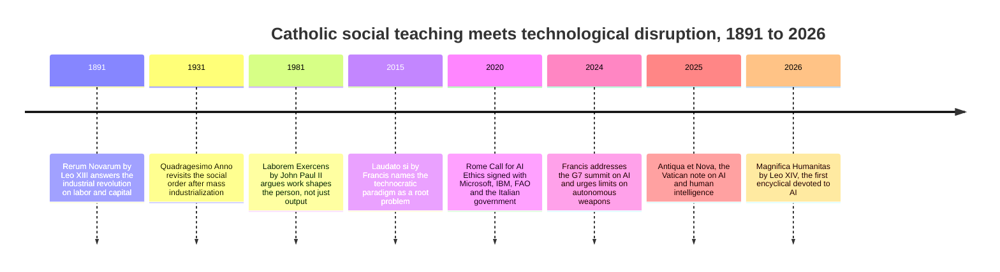
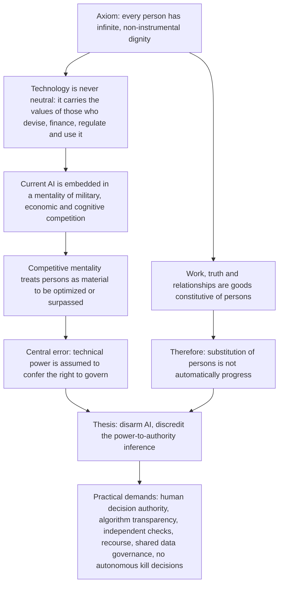
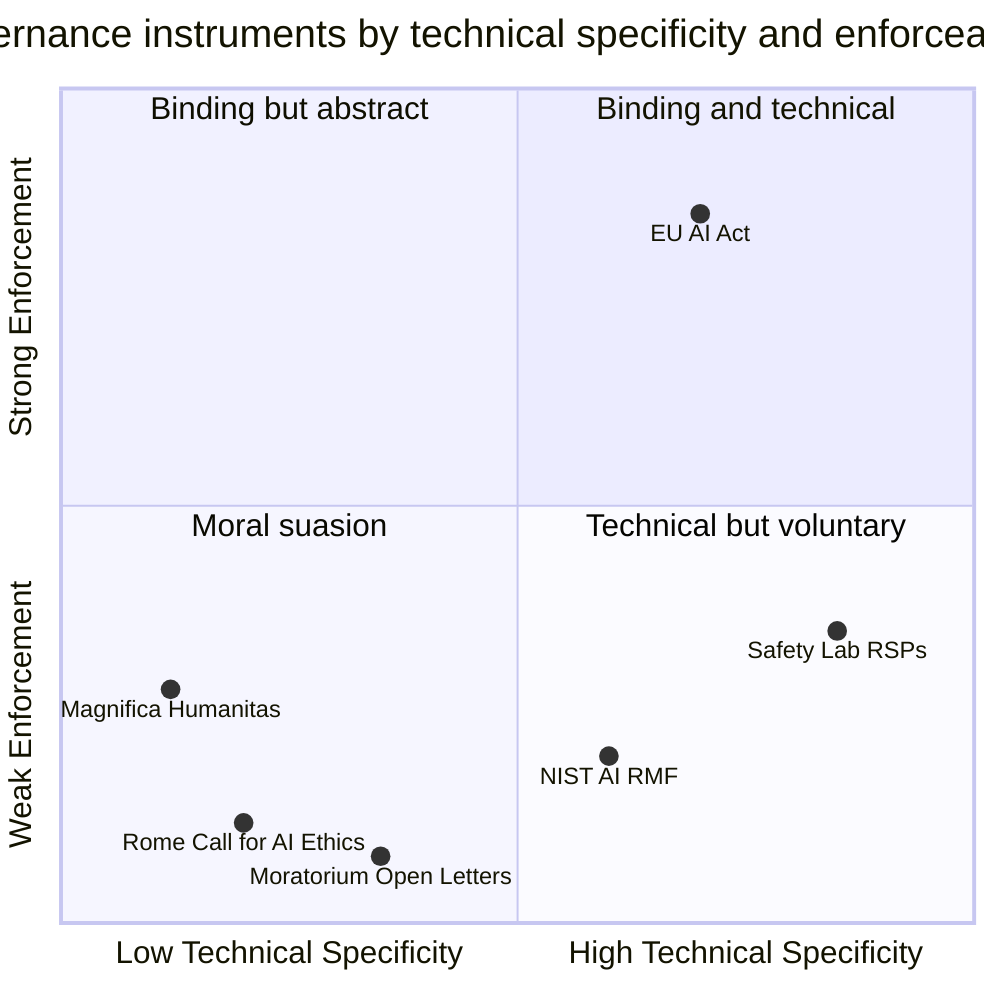

# Magnifica Humanitas: Reading the Pope's AI Encyclical as an Engineer

On May 15, 2026, Pope Leo XIV signed his first encyclical. The date was not an accident. Exactly 135 years earlier, on May 15, 1891, Leo XIII signed *Rerum Novarum* — the document that dragged the Catholic Church into the industrial revolution's argument about labor, capital, and machines, and that still shapes how a billion people think about work. The new pope had already told the College of Cardinals, days after his election in May 2025, that he chose the name Leo precisely because of that precedent: artificial intelligence, he said, poses challenges to human dignity, justice, and labor comparable to the ones the first industrial revolution posed in Leo XIII's time.

Ten days later, on May 25, 2026, the Vatican published *Magnifica humanitas: On Safeguarding the Human Person in the Time of Artificial Intelligence* — roughly 42,300 words across 245 numbered paragraphs, organized into five chapters. Within days, CEOs, regulators, cabinet ministers, and half the tech commentariat had responded. Simon Willison called it "some of the clearest writing I've seen on the ethics of integrating AI into modern society." Jack Dorsey endorsed its treatment of data and property. David Sacks worried it would license censorship. Slate ran a long, conflicted appreciation. A US vice president quoted it in a commencement address.

You are probably not going to read 42,300 words of magisterial prose. Most ML engineers won't, and that is fine — most of us don't read the full text of the EU AI Act either. But this document is now a primary source in the AI-governance conversation, it will be cited at you in meetings for the next decade, and it makes several arguments that map with surprising precision onto decisions you make in code: what goes in the objective function, when an agent acts autonomously versus asking a human, who gets to run frontier models. So this post does what this blog does with landmark papers: reads the primary source carefully, extracts the real structure and the real claims, maps them onto engineering practice, and assesses honestly where the document is sharp and where it is thin.

One framing note before we start. This is not a devotional post and not a takedown. I am treating *Magnifica humanitas* the way I treated ["Attention Is All You Need"](/#/blog/attention-is-all-you-need) or the scaling-laws paper: as a substantial intellectual document whose influence justifies careful reading, whatever your priors about its author's institution.

---

## Why a Papal Document Belongs on an ML Blog

Three reasons, in ascending order of interest.

**Reach.** The Catholic Church claims roughly 1.4 billion members. An encyclical is its highest-weight teaching instrument short of dogmatic definition — the genre in which popes address the whole Church, and explicitly, in modern practice, "all people of good will." When this genre takes up a technical subject, the subject's public framing shifts. *Laudato si'* (2015) did this for climate: within two years it was cited in national climate litigation and quoted at COP summits. *Magnifica humanitas* is positioned to do the same for AI. Whether or not the document changes your mind, it will change your stakeholders' vocabulary.

**The historical rhyme.** *Rerum Novarum* is arguably the most consequential document ever written about technological disruption of labor. In 1891 the question was: what do factories, wage labor, and mechanization do to the human person, and who is responsible? Leo XIII's answers — workers have inherent dignity that markets don't confer, private property is legitimate but not absolute, the state has a duty to protect the weak, workers may organize — seeded a century of labor law, Christian democratic parties, and the modern welfare-state compromise. A pope deliberately signing an AI document on that anniversary is making a claim: *this is the same genre of event*. That claim deserves examination on its merits, because if it is even half right, the reference class for "what happens next" is not the smartphone or the internet — it is the factory system.

**The layer it argues at.** Here is the genuinely interesting part for engineers. Almost every AI-governance document you have encountered — the EU AI Act, NIST's risk framework, the frontier labs' responsible scaling policies — argues at the level of *risk*: enumerate hazards, tier them, mitigate them. *Magnifica humanitas* argues at the level of *anthropology*: what is a human being, what is human work for, what is a relationship, what is thinking — and therefore what may machines legitimately replace. That is the layer every risk framework quietly presupposes and almost never defends. You cannot decide whether replacing a radiologist is a harm or a benefit without an implicit theory of what work is for. The encyclical makes that theory explicit and argues for it across 245 paragraphs. You may reject the theory; you cannot claim the question is out of scope, because your objective functions already answer it implicitly.

---

## The Lineage: From Rerum Novarum to Magnifica Humanitas

The encyclical does not arrive from nowhere. Catholic social teaching has been running a continuous, surprisingly well-documented research program on technology and society for 135 years, and the recent AI-specific outputs form a clear sequence.

The milestones worth knowing, because the encyclical builds directly on them:

- ***Rerum Novarum* (1891).** The template. Leo XIII refused both laissez-faire capitalism and socialism, and instead derived labor rights from human dignity. Its core analytical move — evaluate an economic-technological system by what it does to persons, not by its output — is the move *Magnifica humanitas* repeats for AI.
- ***Laudato si'* (2015).** Francis's ecology encyclical devotes a full chapter to what it calls the "technocratic paradigm": the assumption that every increase in technical power is progress and that whatever can be done should be done. This is the direct intellectual ancestor of the new encyclical's central thesis.
- **The Rome Call for AI Ethics (February 2020).** A joint declaration coordinated by the Pontifical Academy for Life and signed by Microsoft, IBM, the FAO, and the Italian government — notable as the Vatican's first move from commentary to convening industry. It proposed six principles (transparency, inclusion, responsibility, impartiality, reliability, security and privacy) under the banner of "algorethics."
- **Francis's G7 address (June 2024).** The first time a pope addressed a G7 summit, and he chose AI as the topic — arguing that machines make "choices" among options but only humans *decide*, and calling for a ban on lethal autonomous weapons.
- ***Antiqua et Nova* (January 2025).** A joint doctrinal note from two Vatican dicasteries on the relationship between artificial and human intelligence — the technical groundwork. Its central claim, that "intelligence" applied to statistical systems is a functional analogy rather than an identity, is carried into the encyclical almost verbatim.

So when *Magnifica humanitas* landed, it was not an improvisation. It was the synthesis release of a decade-long pipeline — the Vatican equivalent of a position paper preceded by workshops, a consortium, and a technical report.

The parallels with 1891 are close enough to put in a table:

| Dimension | Rerum Novarum (1891) | Magnifica Humanitas (2026) |
|---|---|---|
| Triggering disruption | Factory system, mechanization, urbanized wage labor | Machine learning systems, LLMs, algorithmic mediation of daily life |
| Core anxiety | Workers reduced to instruments of production | Persons reduced to data sources, cognitive functions outsourced |
| Named power asymmetry | Concentration of capital; owners vs. workers | Concentration of compute, data, and models; platforms vs. users and states |
| Rejected extremes | Laissez-faire capitalism and socialism | Techno-utopianism and blanket technophobia |
| Positive principle | Just wage, right of association, duty of the state | Human dignity as design constraint, "disarmed" AI, shared governance of data |
| Immediate reception | Denounced as radical by industrialists, embraced by labor movements | Praised and attacked across the tech industry within days |
| Long-run influence | Labor codes, Christian democracy, welfare-state compromise | To be determined |

---

## What the Document Actually Says

The structure: an introduction (¶1–16), five chapters, and a conclusion (¶229–245). The chapter titles, in the official English text:

1. **A Dynamic Approach Faithful to the Gospel** (¶17–45)
2. **Foundations and Principles of the Social Doctrine of the Church** (¶46–89)
3. **Technology and Dominance. The Grandeur of Humanity in Light of the Promises of AI** (¶90–130)
4. **Safeguarding Humanity at a Time of Transformation. Truth, Work, Freedom** (¶131–181)
5. **The Culture of Power and the Civilization of Love** (¶182–228)

A fair warning about genre: the first two chapters are mostly internal scaffolding — scriptural framing and a restatement of social-doctrine principles. If you read only one stretch of the document, read ¶90–181. That is where the AI-specific argumentation lives. Here is the walkthrough.

### Introduction (¶1–16): the diagnosis

The introduction sets the terms. The pope observes that "emerging technologies are interwoven into the fabric of daily life, shaping decision-making processes" (¶4), and names the asymmetry that motivates everything that follows: "the main drivers of development are private, often transnational, parties that are endowed with resources and the capacity to intervene that surpass those of many Governments" (¶5).

Then comes the sentence the whole document leans on:

> "Technology is never neutral, because it takes on the characteristics of those who devise, finance, regulate and use it." (¶9)

Note the four verbs: *devise, finance, regulate, use*. This is not a vague claim that "tools can be misused." It is a claim about the full supply chain of a technical artifact — that values enter at design time, at funding time, at regulation time, and at deployment time. We will come back to how precisely this maps onto an ML pipeline.

The introduction also explicitly rejects the doomer framing: technology is not "a force antagonistic to humanity" nor "inherently evil." The document's enemy is not AI. It is a *mentality* — captured in the Babel image of "the idolatry of profit that sacrifices the weak, a uniformity that neutralizes differences" (¶10).

### Chapters 1–2 (¶17–89): the method and the axioms

Chapter 1 establishes continuity with *Rerum Novarum* — "the 135th anniversary of which we celebrate with deep gratitude this year" (¶3, echoed throughout) — and restates the tradition's view of labor: "Work is not considered simply as a problem to be dealt with or a means of generating income, but a fundamental good for the person" (¶37). Hold onto that sentence; it is the axiom that drives every later claim about automation.

Chapter 2 lays out the axioms of Catholic social doctrine as they apply here: dignity ("Every human person possesses an infinite dignity, inalienably grounded in his or her very being," ¶53), the common good, solidarity, and subsidiarity — the principle that decisions should be made at the lowest competent level. The subsidiarity section contains the document's first structurally interesting move for governance readers: it extends a principle originally aimed at states to "major economic and technological actors that exercise *de facto* power over the conditions of everyday life" (¶71), and demands, concretely, "independent checks, transparency regarding algorithms, equitable access to data and avenues for recourse" (¶71). That is an audit-and-appeals regime, stated in 1891 vocabulary.

For an engineer, the honest summary of these two chapters is: *here are the axioms; the theorems follow*. If you grant infinite, non-instrumentalizable dignity per person, most of the rest is derivation. If you don't grant it, the document at least shows you exactly which axiom you are rejecting — which is more than can be said for most governance texts, where the anthropology is smuggled in.

### Chapter 3 (¶90–130): what AI is, and the "disarming" thesis

This is the chapter engineers should actually read, because it does two things well.

First, it commits to a position on what AI systems *are*. Drawing on *Antiqua et Nova*, it argues that "intelligence" is being used analogically:

> "These systems merely imitate certain functions of human intelligence... they do not undergo experiences, do not possess a body, do not feel joy or pain... nor do they have a moral conscience." (¶99)

You can quarrel with pieces of this (the embodiment claim does real philosophical work that some cognitive scientists would contest), but note what it is not: it is not the claim that these systems are unimpressive, and it is not a capability forecast. It is a category claim — functional imitation is not the thing itself — deployed to block a specific inference: from "the machine performs the function" to "the machine can bear the responsibility."

The chapter also contains the observation Simon Willison singled out: that current AI systems are more "cultivated" than "built," since developers do not directly design every detail of their behavior. Willison called this "a useful description of the interpretability problem for LLMs," and he is right — it is a strikingly accurate one-sentence account of why post-hoc alignment and evals exist at all. Whoever drafted this paragraph understood that gradient descent is closer to agriculture than to blueprint engineering.

Second — the thesis the headlines led with. AI, the pope argues, must be **disarmed**: freed from the mentality of military, economic, and cognitive competition in which it is currently embedded. The key paragraph:

> "To disarm means discrediting the assumption that technical power automatically confers the right to govern... To disarm does not mean rejecting technology, but preventing it from dominating humanity." (¶110)

Read that first sentence twice, because it is the most compact statement of the document's politics. The target is not a technology; it is a *legitimacy claim* — the inference from capability to authority. Whoever builds the most capable systems thereby earns the right to set the rules for everyone. The encyclical treats that inference as the central superstition of the age, and "disarmament" is its name for refusing it, in three registers: military (autonomous weapons, taken up around ¶125 under the heading "Weapons and artificial intelligence" and again in Chapter 5), economic (winner-take-all competition for compute, data, and markets), and cognitive (the race to substitute machine cognition for human cognition wherever substitution is cheaper).

The chapter's warning about where the competitive mentality leads is one of the document's sharpest lines:

> "If the human being is treated as something to be perfected or surpassed, it becomes easier to accept that some lives are less useful, less desirable or less worthy."

That sentence is aimed simultaneously at transhumanist rhetoric and at ordinary product-metric thinking, and it lands on both.

### Chapter 4 (¶131–181): truth, work, freedom

The applied chapter, organized around three goods under pressure.

**Truth.** The document addresses synthetic media, disinformation at scale, and — with more precision than most op-eds manage — the relational deception of chatbots: systems whose responses "reflect the cultural assumptions of those who designed and trained them" and that can create "the illusion of a relationship with a real personal subject" through simulated empathy. The concern is not that models say false things; it is that fluent simulation degrades the *practices* by which humans establish truth together: testimony, trust, verification. It also flags cognitive offloading — the erosion of critical thinking when the habit of thinking is delegated — and calls for "the promotion of digital literacy" (¶14, developed here) as a duty of families and educators, not just platforms.

**Work.** Applying ¶37's axiom: if work is a fundamental good for the person — the "context for expression, relationships and contributing to the community," as Slate's summary rendered it — then automation policy cannot be evaluated on aggregate productivity alone. The chapter is emphatic that the answer is not job preservation for its own sake; it is that displacement without transition support treats workers as costs, which the axioms forbid. Notably, the chapter also attends to the labor *inside* the AI supply chain — content moderators, data annotators, cobalt miners — a population most governance frameworks ignore entirely.

**Freedom.** The chapter's treatment of algorithmic mediation: recommender systems and predictive models that shape choices invisibly, and the insistence that "responsibility must be clearly defined at every stage: from those who design and develop these systems to those who use them." No responsibility gaps; no "the algorithm decided."

### Chapter 5 (¶182–228) and conclusion: power, peace, and Tolkien

The final chapter widens back out: "the culture of power" versus "the civilization of love." It contains the document's hardest political economy — "AI tends to amplify the power of those who already possess economic resources, expertise and access to data," and, in the line that got Jack Dorsey's attention, "data cannot be left solely in private hands." It returns to military AI, arguing that delegating kill decisions to machines removes the human judgment on which the entire just-war tradition depends — to the point that the tradition itself risks becoming "outdated" as a control on states. And it includes a section on "the need to disarm words" — extending the disarmament theme to the language of AI discourse itself, the vocabulary of races, arms, dominance, and inevitability.

Then, in the conclusion, the 80-year-old pontiff cites *The Lord of the Rings* (¶213, in the closing movement):

> "It is not our part to master all the tides of the world, but to do what is in us for the succour of those years wherein we are set."

Gandalf, quoted in an encyclical, as a summary of the document's alternative to both accelerationism and despair. The title's meaning also resolves here: *magnifica humanitas* — magnificent humanity — echoing the Magnificat, the claim being that humanity's grandeur is the thing to be safeguarded, not surpassed.

The argument, compressed into one diagram:

---

## The Engineer's Reading

Now the useful part. Strip the theological vocabulary and the encyclical makes four claims that translate directly into ML practice. In several cases the translation is embarrassingly exact.

### Non-neutrality ↔ the values in your pipeline

"Technology is never neutral, because it takes on the characteristics of those who devise, finance, regulate and use it" (¶9). Any ML engineer can instantiate each verb without effort:

| Encyclical's verb | Where the values actually enter |
|---|---|
| *Devise* | Objective functions, architecture choices, what counts as ground truth, eval design |
| *Finance* | What gets compute; which capabilities are worth a training run; whose problems get solved |
| *Regulate* | RLHF reward models, constitution documents, content policies, refusal boundaries |
| *Use* | Deployment context, default settings, who the system is optimized to please |

This is not a metaphorical mapping. A reward model *is* a codified value system — thousands of human preference judgments, from a specific annotator pool, hired by a specific company, distilled into a differentiable function. Loss functions are normative claims wearing a mathematical costume: choosing to optimize engagement over reported well-being is an ethics decision made in code, and everyone who has tuned a recommender knows it. The philosopher Langdon Winner asked "Do artifacts have politics?" in 1980; the encyclical answers yes, and the RLHF pipeline is the constructive proof.

Where this bites in practice: the non-neutrality claim demolishes the most common deflection in the industry — "we just build the tools." The document's four-verb formulation assigns responsibility at each stage, which is precisely the model behind [agent guardrails as layered engineering controls](/#/blog/agent-guardrails-field-guide) rather than end-user disclaimers. If values enter at design time, they must be *governed* at design time.

### Cognitive disarmament ↔ automation versus augmentation

The "cognitive" branch of the disarmament thesis — stop racing to substitute machine cognition for human cognition wherever substitution is cheaper — is, in engineering terms, a position on the oldest design fork in the agent literature: automation versus augmentation.

Anyone who builds agent systems knows this fork concretely. For every workflow you can ask: does the system *replace* the human's judgment (auto-approve, auto-send, auto-remediate) or *extend* it (draft, retrieve, rank, flag, explain)? The technical costs differ, the failure modes differ, and — the encyclical's point — the anthropological effects differ. A system that drafts and explains keeps the human's skill loop closed; a system that silently auto-acts opens it, and skills that are not exercised atrophy. The document's worry about critical thinking and cognitive offloading is a claim that, at civilizational scale, defaulting to substitution is a slow self-lobotomy — and that the default is being chosen by cost curves, not by anyone's considered judgment about what human capacities are worth preserving.

The engineering translation: *the automation/augmentation choice is a values decision currently being made implicitly by whoever writes the agent's tool permissions.* That is exactly the argument for explicit human-in-the-loop tiers in [enterprise agent governance](/#/blog/enterprise-agents-governance-security-business) — decide deliberately, per action class, what the machine may do alone, and treat that decision as an owned, reviewable artifact rather than an emergent property of the backlog.

### Concentration of power ↔ compute, data, and the open-model question

"AI tends to amplify the power of those who already possess economic resources, expertise and access to data." As an empirical claim about 2026, this is just... true, and every practitioner knows the mechanism better than the document's drafters do: scaling laws reward capital, frontier training runs cost billions, data flywheels compound, and inference margins fund the next run. The encyclical's ¶5 observation — private transnational actors with capacity "that surpass those of many Governments" — is a plain description of the compute landscape.

What is interesting is the remedy vocabulary. The demands of ¶71 — "independent checks, transparency regarding algorithms, equitable access to data and avenues for recourse" — read like a requirements document: third-party audits, model documentation, data-access regimes, appeal mechanisms. And "data cannot be left solely in private hands" lands directly in the open-versus-closed model debate, though the document is careful not to resolve it: it argues for *shared governance* of the data commons, not for open-weighting frontier models, and its military chapter cuts against naive proliferation. An engineer looking for a policy algorithm won't find one here; what the document supplies is the criterion — does this arrangement concentrate or distribute the capacity to shape daily life? — and a refusal to accept "trust us" as an architecture.

### Human dignity ↔ human-in-the-loop as design principle, not checkbox

The document's most practically consequential move is its treatment of human oversight. In most compliance regimes, "human in the loop" is a mitigation — a box you tick to lower a risk tier. The encyclical grounds it differently: humans must retain decision authority not because models are unreliable (a contingent, improvable fact) but because *responsibility is a property only persons can bear* (a categorical claim, from ¶99's denial that these systems have moral conscience). Machines select among options; persons decide and answer for it — the line Francis drew at the G7 in 2024 and Leo XIV makes systematic.

This distinction has engineering teeth. If human oversight is only a reliability patch, then every eval improvement is an argument for removing it, and your org chart will make that argument every quarter. If it is a responsibility-location requirement, then the design question changes from "when is the model good enough to remove the human?" to "how do we keep the human's decision *real* — informed, non-rubber-stamped, exercised at the right altitude?" That is a harder and better question, and it is the one that serious [access-control and audit architectures for agents](/#/blog/bank-grade-agent-security-iam-gateways) are already forced to answer: every action attributable, every consequential decision owned by an identifiable principal.

### Where the document is technically naive — and where it is precise

Honest assessment, both directions.

**Surprisingly precise:** the "cultivated, not built" account of model development (an accurate description of why interpretability is hard); the four-verb supply-chain model of value injection; the observation that chatbot empathy is a simulation trained from the designers' cultural assumptions; the attention to annotators and content moderators in the supply chain; the identification of the capability-to-authority inference as the load-bearing ideology of the industry. None of these are technical errors dressed in robes. Willison — nobody's idea of a soft touch on AI writing — read the whole thing and called it very approachable and unusually clear, "including to non-Catholics."

**Genuinely thin:** the document has no gradient of capability — it treats "AI" as one phenomenon, with almost nothing distinguishing a logistic-regression credit scorer from a frontier agentic system, which any risk-tiered framework handles better. It has no account of the *benefits* trade-off at the margin (when is automated diagnosis a dignity gain for the patient who otherwise gets no diagnosis?). Its environmental claims about "computing power and storage capacity" are directionally right but innocent of any quantitative footing. And its economic program is stated at the level of principle — "equitable access to data" — with no mechanism, which is where a century of social-teaching implementation has always been outsourced to lay experts. The document knows this about itself; whether its readers will is another matter.

---

## Where It Lands in the Governance Landscape

It is worth being precise about what kind of object this is, because it is neither regulation nor capability forecasting, and evaluating it as either produces nonsense.

The comparison in full:

| | EU AI Act | Lab RSPs / preparedness frameworks | Moratorium open letters | Magnifica Humanitas |
|---|---|---|---|---|
| **Argues at the level of** | Risk to health, safety, fundamental rights | Catastrophic capability thresholds | Timing and pace | Anthropology: what persons are and are for |
| **Unit of analysis** | Use case / deployment context | Model capability level | The frontier as a whole | The person and the mentality of the builders |
| **Normative source** | EU fundamental-rights law | Internal safety commitments | Signatory consensus | 135 years of social doctrine plus scripture |
| **Enforcement** | Fines up to a percentage of global revenue | Self-binding, revisable by the binder | None | Moral authority over 1.4B people, zero legal force |
| **Handles capability tiers** | Yes, by risk class | Yes, by eval thresholds | Crudely | No |
| **Handles labor and work** | Marginally | No | No | Centrally |
| **Handles military AI** | Carve-outs for national security | Mostly out of scope | Rarely | Centrally, with a demanded prohibition |
| **Says why dignity matters** | Presupposes it | Out of scope | Out of scope | Argues it for 245 paragraphs |
| **Fails when** | Innovation routes around definitions | Incentives collide with thresholds | Signatories keep shipping | Nobody with power is listening |

The structural observation: every instrument in that table except the encyclical takes the *goals* as given and argues about mechanisms. The AI Act does not tell you why fundamental rights matter; it inherits that from constitutional law and gets to work. RSPs do not tell you why human extinction is bad; it would be an odd thing to have to write down. The encyclical works the opposite layer — all goals, no mechanism. That is a complementary position, not a competing one, and the document is explicit that mechanism design belongs to "science, culture and human experience" (¶23), i.e., to us.

What can an engineering leader concretely take from it? Four things that survive translation out of the genre:

1. **Write down your anthropology.** Your agent platform already encodes answers to "what should humans still decide?" Make the answers explicit, per action class, and make someone own them — the same discipline [a serious PoC evaluation](/#/blog/ai-poc-enterprise-evaluation) applies to success metrics before the demo dazzles anyone.
2. **Treat the automation/augmentation fork as a reviewed decision**, not a default. The encyclical's cognitive-disarmament argument is a reason to have the review; your incident postmortems will supply the rest.
3. **Locate responsibility before the incident.** "Responsibility must be clearly defined at every stage: from those who design and develop these systems to those who use them" is an org-design requirement. If your on-call rotation cannot answer "who decided the agent could do that?", ¶71's "avenues for recourse" is describing your gap.
4. **Audit the supply chain you don't see.** Annotators, moderators, data provenance. The document's attention to invisible AI labor is ahead of most corporate responsible-AI programs, and it is checkable.

---

## An Honest Critique

Steelmanning both receptions, because both have a point.

**The enthusiastic reading** — Willison's, roughly, and Slate's Nitish Pahwa at his warmest — holds that this is the clearest widely-read statement of the human side of the AI question: non-hysterical, technically better-informed than it had any right to be, and arguing at the one layer (what humans are for) that the entire governance apparatus leaves implicit. Pahwa found it "truly remarkable" precisely because it refuses the anti-AI caricature: the pope's principle, in Pahwa's summary, is "A.I. as *addition*, not replacement." A document that Jack Dorsey and a sitting US vice president both cited approvingly, that BBC read as a "stark message," and that polling suggests large majorities agreed with on its core claims, has demonstrably done what encyclicals are for: moved the frame.

**The skeptical reading** has three solid counts.

*No mechanism.* The document demands independent checks, algorithmic transparency, equitable data access, recourse, and a prohibition on autonomous kill decisions — and provides no institution, treaty, standard, or metric for any of them. Defenders answer that encyclicals never do; *Rerum Novarum* specified no labor code either, and got several anyway, written by others over decades. True — but 1891's time constants may not be available. If the transition is as fast as the document itself fears, principle-first-mechanism-later may simply arrive late. Matthew Walther's verdict — "disappointingly measured" — and Ned Desmond's "missed opportunity" both reduce to this: the house is on fire and the fire code is eloquent.

*The tension of the messenger.* An absolute monarchy with a two-millennium history of centralized authority, writing against concentration of power and unaccountable governance, invites the obvious retort — and the tech critics made it (Jeremy Nixon dismissed Vatican competence on AI outright; David Sacks read the truth chapter as a censorship license; Blake Scholl objected that protecting work from automation protects stagnation). The strongest form of the objection isn't hypocrisy-hunting; it is that the Church's own governance record gives it no standing to specify *how* accountable power should work, which is exactly the part the document skips. The document's partial defense is that it argues from an authority explicitly *not* derived from technical or economic power — which is coherent, but only if you grant the alternative source.

*Selective precision.* The document is specific where the tradition has vocabulary (labor, war, dignity) and vague where it doesn't (capability tiers, benefit trade-offs, open weights, compute economics). Slate's Pahwa also flagged the awkwardness of the Vatican's collaborative posture with the industry it critiques — noting that consulting frontier-lab engineers sits uneasily with the disarmament thesis when those same labs, in his words, have "peddled software to merchants of warfare." The convening strategy that produced the Rome Call is either the document's method vindicated or its thesis compromised, depending on your priors, and the text does not resolve which.

My own assessment, for what it is worth: the document is best understood as infrastructure. It will not change a single deployment decision this quarter. What it changes is what can be *said* in rooms where deployment decisions are justified — it puts "technical power does not confer the right to govern" and "work is a good for the person, not a cost" into circulation with 1.4 billion people's institution behind them. Infrastructure is slow. So was *Rerum Novarum*, and the eight-hour day arrived anyway.

---

## Conclusion

The industrial revolution needed engineers, and it also needed *Rerum Novarum* — not because the encyclical built anything, but because someone had to say, with institutional weight, that the humans inside the machine age were not inputs, and keep saying it for the decades it took law and practice to catch up. The engineers who built the factories and the document that constrained what factories could morally be were not opponents. They were the two halves of a transition that ended somewhere livable.

*Magnifica humanitas* is a bid to play the same role for our transition, from a pope who chose his name to make exactly that bid. Read as regulation, it is toothless. Read as forecasting, it is silent. Read as what it is — a 245-paragraph argument that capability is not authority, that substitution is not automatically progress, and that the values in the pipeline are chosen by whoever devises, finances, regulates, and uses it — it is the most serious statement yet from the anthropology layer of the stack, the layer underneath every RSP and risk tier, where the question is not *what can the system do* but *what are people for*.

You don't have to grant its axioms. You do have to notice that your objective functions already answer its questions — and that, as of May 2026, someone with a very large audience is checking the answers.

---

## Going Deeper

**What background helps:** No theology required. Useful prerequisites are a passing familiarity with how RLHF encodes preferences (any post-training overview will do), the automation-vs-augmentation debate in agent design, and the basic shape of the EU AI Act's risk tiers. For the historical rhyme, skimming even the opening paragraphs of *Rerum Novarum* pays off — the 1891 prose about "the enormous fortunes of some few individuals and the utter poverty of the masses" reads uncannily current.

**Books:**
- Vallor, S. (2016). *Technology and the Virtues: A Philosophical Guide to a Future Worth Wanting.* Oxford University Press.
  - The closest secular analogue to the encyclical's method: virtue ethics applied to concrete technology design, by a philosopher who consults for industry.
- Winner, L. (1986). *The Whale and the Reactor: A Search for Limits in an Age of High Technology.* University of Chicago Press.
  - Contains "Do Artifacts Have Politics?" — the canonical academic statement of the non-neutrality thesis the encyclical asserts in ¶9.
- Christian, B. (2020). *The Alignment Problem: Machine Learning and Human Values.* W. W. Norton.
  - The engineering-side account of how values actually enter models — reward design, preference learning, fairness — that makes the "devise, finance, regulate, use" mapping concrete.
- Postman, N. (1992). *Technopoly: The Surrender of Culture to Technology.* Knopf.
  - The sharpest earlier statement of "cognitive disarmament" avant la lettre; thirty years on, its argument about tools redefining the culture that adopts them reads as a draft of Chapter 4.

**Online Resources:**
- [Magnifica Humanitas — full text](https://www.vatican.va/content/leo-xiv/en/encyclicals/documents/20260515-magnifica-humanitas.html) — The primary source; ¶90–181 is the stretch to read if you read one.
- [Antiqua et Nova (2025)](https://www.vatican.va/roman_curia/congregations/cfaith/documents/rc_ddf_doc_20250128_antiqua-et-nova_en.html) — The Vatican's technical groundwork note on AI and human intelligence; shorter and more analytical than the encyclical.
- [Rerum Novarum (1891)](https://www.vatican.va/content/leo-xiii/en/encyclicals/documents/hf_l-xiii_enc_15051891_rerum-novarum.html) — The template document; worth skimming for the structural parallels alone.
- [Simon Willison: "Encyclical on AI"](https://simonwillison.net/2026/May/25/encyclical-on-ai/) — The best tech-community close reading, including the "cultivated, not built" observation.
- [Rome Call for AI Ethics](https://www.romecall.org/) — The 2020 Vatican-industry declaration and its six "algorethics" principles.

**Videos:**
- [Pope Leo XIV's AI Encyclical Explained (w/ Fr. Gregory Pine)](https://www.youtube.com/watch?v=cpptgvohfZc) — A theologically literate walkthrough of the document's argument, useful for the tradition-internal context this post compresses.
- [Reading Pope Leo's New Encyclical: Magnifica Humanitas | EWTN Vaticano](https://www.youtube.com/watch?v=m0ETpkNjXnU) — Vatican-affairs coverage of the drafting, promulgation, and early reception.
- [Pope Leo's A.I. encyclical: Top takeaways | Inside the Vatican Podcast](https://www.youtube.com/watch?v=84KKXG0dl4g) — Journalists' distillation of the key claims and the politics around them.

**Papers and Documents:**
- Winner, L. (1980). ["Do Artifacts Have Politics?"](https://www.jstor.org/stable/20024652) *Daedalus*, 109(1), 121–136.
  - The academic ancestor of ¶9; forty-six years old and still the cleanest argument that technical arrangements are forms of order.
- Dicastery for the Doctrine of the Faith & Dicastery for Culture and Education. (2025). ["Antiqua et Nova: Note on the Relationship Between Artificial Intelligence and Human Intelligence."](https://www.vatican.va/roman_curia/congregations/cfaith/documents/rc_ddf_doc_20250128_antiqua-et-nova_en.html)
  - The source of the encyclical's functional-imitation account of machine intelligence (¶99); the more technically careful of the two documents.

**Questions to Explore:**
- If human oversight is grounded in responsibility rather than reliability, is there *any* eval score at which removing the human from a consequential decision becomes legitimate — or does the requirement survive arbitrary capability?
- The encyclical assigns values-responsibility across four verbs: devise, finance, regulate, use. When a fine-tuned open-weight model causes harm, how should responsibility actually distribute across that chain — and does your answer change if the base model was released precisely to counter concentration of power?
- *Rerum Novarum*'s principles took roughly forty years to become labor law. If AI transitions compress that timeline, what institution plays the role the labor movement played — the organized constituency that converts principle into mechanism?
- Is "cognitive disarmament" compatible with competitive markets at all, or does any actor who unilaterally chooses augmentation over automation simply lose to one who doesn't — making it a coordination problem rather than an ethics problem?
- The document argues machines choose but only persons decide. Where exactly is that line in an agentic system that plans, executes, and only summarizes afterward — and is "decide" a property of the action, the accountability, or the summary?
