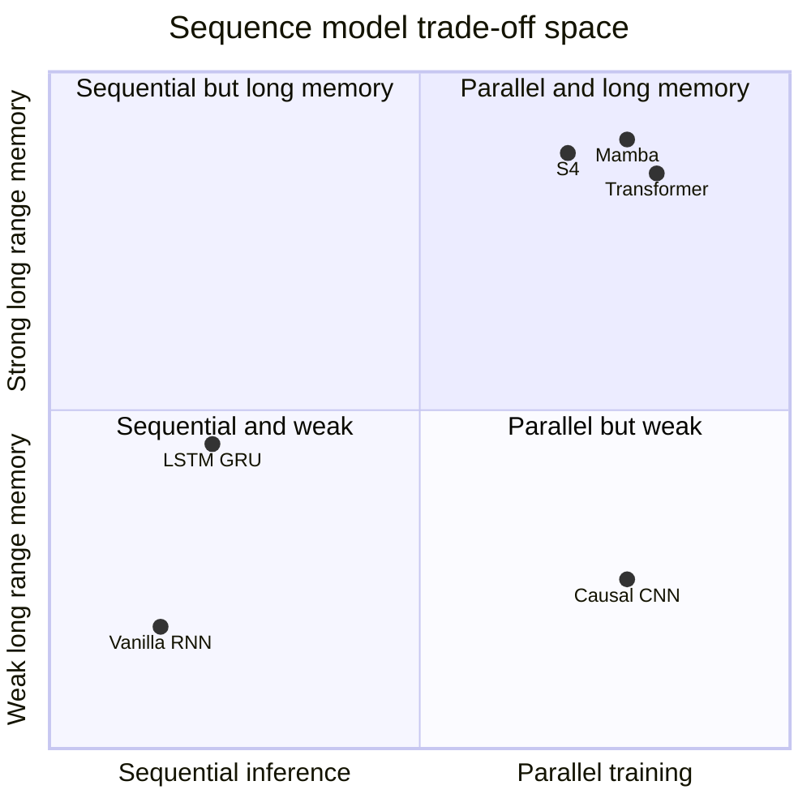
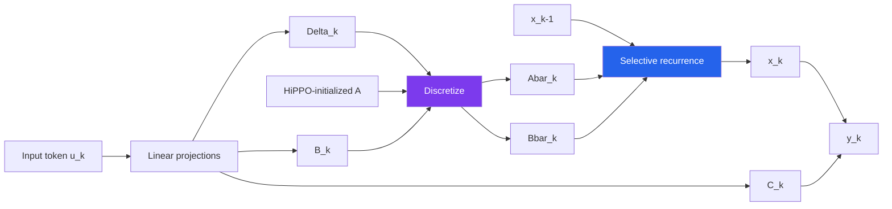
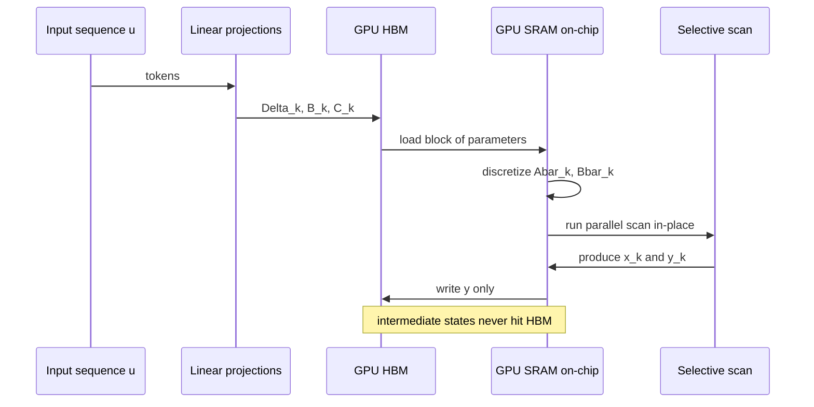
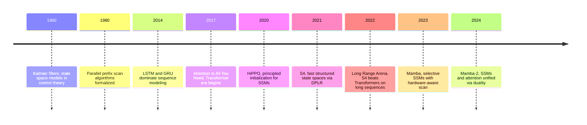

# Mamba: The Paper That Asked If Attention Was Really All You Need

In December 2023, Albert Gu and Tri Dao published a paper with a quietly confrontational title: *Mamba: Linear-Time Sequence Modeling with Selective State Spaces.* The title doesn't mention Transformers. It doesn't need to. By 2023, "sequence modeling" and "Transformer" were effectively synonyms. Proposing any other architecture was less a technical contribution than a declaration that the field had missed something.

Most of us, reading it for the first time, were skeptical in the polite way you're skeptical of a paper claiming to have beaten a five-year incumbent at its own game. The history of "Transformer killers" is long, unimpressive, and littered with architectures that matched attention on toy benchmarks and collapsed on real ones. What made Mamba different is that it didn't try to beat Transformers at being Transformers. It brought a completely different mathematical tradition — **state space models** from classical control theory — and showed how to make that tradition work on language, audio, and DNA with competitive quality and **five times the inference throughput**.

This post is a careful walkthrough of the paper. Not a summary — a walkthrough. My goal is that by the end, you understand *why* each equation in the paper looks the way it does, *what* problem each design choice solves, and *where* the intellectual lineage comes from. We'll cover continuous state space models from control theory, the discretization trick that turns them into neural network layers, HiPPO and why it was the right initialization, S4 and its convolutional view, the single observation that broke the convolutional view and required a new algorithm, Mamba's selection mechanism, and the hardware-aware parallel scan that made the whole thing practical on GPUs.

This is a [research post](/blog/research) in our usual sense — more math, less code, written for readers who want to be able to read the paper and internalize it. If you've read the [*Attention is All You Need* deep-dive](/blog/research/attention-is-all-you-need) on this blog, consider this the counter-essay: the architecture that asked whether attention was really all you needed, and what you'd build if the answer was no.

## The Problem Attention Has With Long Sequences

Start with the complaint. The self-attention mechanism in a Transformer computes an $n \times n$ matrix of pairwise interactions between every pair of tokens in the sequence. That's $O(n^2)$ compute and $O(n^2)$ memory during training, and at inference time the KV cache grows linearly with context length, so decoding the $k$-th token costs $O(k)$ work and the full sequence costs $O(n^2)$ in aggregate.

For a lot of modern use cases — long documents, DNA, audio, genomics, video — this is a genuine constraint, not a theoretical annoyance. A human genome is three billion base pairs. A one-hour audio clip at 16 kHz is 57 million samples. A textbook is hundreds of thousands of tokens. None of these fit comfortably in a Transformer context window, and naive workarounds (chunking, sliding windows, sparse attention) lose the long-range dependencies that were the whole reason you used a neural network in the first place.

This is the problem Mamba is trying to solve. Not "be better than attention on the tasks attention is already great at," but "be competitive on those tasks while unlocking the regimes attention cannot reach." To understand how they got there, we need to start much earlier — in control theory.

## State Space Models: A Primer from Control Theory

A continuous-time state space model (SSM) describes how a dynamic system evolves. You have an input signal $u(t) \in \mathbb{R}$, a hidden state $x(t) \in \mathbb{R}^N$, and an output signal $y(t) \in \mathbb{R}$. The state evolves according to a linear differential equation, and the output is a linear function of the state:

$$
\begin{aligned}
x'(t) &= A\,x(t) + B\,u(t) \\
y(t) &= C\,x(t)
\end{aligned}
$$

Here $A \in \mathbb{R}^{N \times N}$ is the **state matrix** (how the state evolves on its own), $B \in \mathbb{R}^{N \times 1}$ is the **input matrix** (how input drives the state), and $C \in \mathbb{R}^{1 \times N}$ is the **output matrix** (how state becomes output). There's sometimes a $D\,u(t)$ skip term added to $y$, but the residual connections in the surrounding architecture absorb it, so we'll ignore it.

If this looks familiar from a signal processing class, that's because SSMs have been the standard tool for modeling linear dynamical systems since Kalman's work in the 1960s. They describe everything from RLC circuits to spacecraft attitude control to biological population dynamics. The intuition is that the hidden state $x(t)$ is a compressed memory of the input history — a running summary the system maintains as time flows.

An SSM has three lovely properties that are about to become relevant:

1. **It's linear in the state.** The entire system is parameterized by three matrices. No nonlinearities, no learned activations.
2. **The input $u(t)$ can be anything.** If you pick a nice $u$, the system has a closed-form solution.
3. **It's time-invariant.** The matrices $A, B, C$ don't depend on $t$. The system behaves the same way whether you start observing it at noon or at midnight.

Property 3 is crucial and is exactly what Mamba will eventually break. Hold onto it.

## Discretization: From Continuous Time to a Neural Network Layer

A sequence model takes discrete tokens as input, not continuous signals. To use an SSM as a neural network layer, we need to discretize it — replace the derivative $x'(t)$ with finite differences over a timestep $\Delta$.

The simplest discretization is the zero-order hold (ZOH): assume the input $u(t)$ is piecewise constant over each interval of length $\Delta$, and solve the ODE analytically on each interval. The result is a discrete recurrence:

$$
\begin{aligned}
x_k &= \bar{A}\,x_{k-1} + \bar{B}\,u_k \\
y_k &= C\,x_k
\end{aligned}
$$

where

$$
\bar{A} = \exp(\Delta A), \qquad \bar{B} = (\Delta A)^{-1}\bigl(\exp(\Delta A) - I\bigr) \cdot \Delta B.
$$

The overline notation $\bar{A}, \bar{B}$ denotes the **discretized** versions of the continuous parameters. $\Delta$ is a learnable scalar that controls how much continuous time each discrete step represents — it's the model's "step size" through the underlying continuous dynamics. Small $\Delta$ means the state updates slowly and long history is preserved; large $\Delta$ means the state turns over quickly and recent inputs dominate.

This looks exactly like a linear recurrent neural network, because it is one. You can run it token by token like an RNN, carrying the state $x_k$ forward in $O(1)$ per step. But unlike a vanilla RNN, the recurrence is linear, which unlocks a second, equivalent view.

### The convolutional view

Because the recurrence is linear, you can unroll it:

$$
y_k = C\bar{A}^k \bar{B}\,u_0 + C\bar{A}^{k-1}\bar{B}\,u_1 + \cdots + C\bar{B}\,u_k.
$$

That's a convolution. The output at position $k$ is an inner product between the input sequence and a fixed kernel

$$
\bar{K} = \bigl(C\bar{B},\, C\bar{A}\bar{B},\, C\bar{A}^2\bar{B},\, \ldots,\, C\bar{A}^{L-1}\bar{B}\bigr) \in \mathbb{R}^L
$$

so the full output is $y = \bar{K} * u$. Compute $\bar{K}$ once, apply it to the whole sequence as a convolution, and you've processed $L$ tokens in parallel. During training, where you have the full sequence, this is a huge win over sequential recurrence — FFT-based convolution gives you $O(L \log L)$ time for the whole sequence instead of $L$ sequential steps.

This duality — **recurrence for inference, convolution for training** — is the single most important structural fact about state space models. It's what lets them scale. It's also what Mamba will eventually give up, and the paper's central engineering challenge is figuring out how to live without it.

## The RNN, CNN, Attention Trilemma

At this point it's worth stepping back and comparing the three ways sequence models have handled the trade-off between expressiveness, training speed, and inference speed.

| Property | RNN | CNN (causal) | Self-attention |
|---|---|---|---|
| Training parallelism | ✗ sequential | ✓ parallel | ✓ parallel |
| Inference per step | ✓ $O(1)$ | ✓ $O(k)$ fixed | ✗ $O(n)$ growing |
| Long-range dependency | ✗ vanishing gradients | ✗ fixed receptive field | ✓ direct pairwise |
| Memory of past | compressed in state | windowed | fully cached KV |

Every architecture picks two of three. RNNs have compact state and fast inference but don't parallelize during training. CNNs parallelize but have bounded context. Transformers parallelize and handle long range but pay $O(n^2)$ and carry an unbounded cache at inference.

State space models, as described so far, occupy a fascinating corner: they're linear RNNs, which means they have **both** the constant-cost inference of an RNN **and** the training parallelism of a CNN (via the convolutional view). The only thing missing is the "long-range dependency" box — and that's what HiPPO was invented to fix.

## HiPPO: Memory as Polynomial Projection

Here's the awkward truth that held SSMs back for decades in deep learning. If you initialize $A$ randomly and train it with gradient descent, you get catastrophically bad models. The state collapses, the gradients vanish, and the recurrence forgets everything more than a few tokens back. Linear RNNs have been known since the 1980s to be theoretically expressive but practically untrainable on long sequences.

The breakthrough that unlocked SSMs for deep learning was a 2020 paper by Gu and collaborators called **HiPPO** (High-order Polynomial Projection Operators). The central question HiPPO asks is: if you're going to compress the entire history of an input signal into a fixed-size state vector, what's the mathematically optimal way to do it?

HiPPO's answer is a beautifully elegant one. You pick a basis of orthogonal polynomials (Legendre polynomials, for example) and at every moment in time you store the coefficients of the best polynomial approximation to the history of the input so far. As new inputs arrive, you update the coefficients so the stored polynomial continues to optimally fit the growing history. This is a **projection onto a function space**, and it turns out the update rule for the coefficients is a linear differential equation — which means it's exactly a state space model, with a very specific, derivable $A$ matrix.

The HiPPO-LegS (Legendre Scaled) matrix, for instance, is

$$
A_{nk} = -\begin{cases}
(2n+1)^{1/2}(2k+1)^{1/2} & \text{if } n > k \\
n+1 & \text{if } n = k \\
0 & \text{if } n < k
\end{cases}
$$

You don't need to memorize that. What you need to know is that **HiPPO gave us a principled initialization for the $A$ matrix** — one that provably compresses history in a way that preserves long-range information. With HiPPO as the starting point, SSMs suddenly trained on long sequences without collapsing.

This is the moment state space models became viable for deep learning. Everything that follows — S4, S5, Mamba — is building on the HiPPO insight that the $A$ matrix is not arbitrary. It has structure that corresponds to a meaningful mathematical operation on the input signal's history, and you need to respect that structure if you want the model to remember anything.

## S4: Making HiPPO Fast

HiPPO is beautiful math. It is also, as originally formulated, a computational disaster. Computing $\bar{A} = \exp(\Delta A)$ and the powers $\bar{A}^k$ needed for the convolutional kernel requires $O(N^2)$ per step or $O(N^3)$ to diagonalize $A$, and the HiPPO matrices are dense, so you can't exploit sparsity. For a state dimension $N = 64$ and sequence length $L = 16{,}000$, that's tens of billions of floating-point operations for a single forward pass.

The 2021 **S4** paper (Gu, Goel, Ré) is the engineering paper that made HiPPO-based SSMs actually fast. Its trick, stated at the highest level, is to decompose the HiPPO matrix into a **diagonal plus low-rank** (DPLR) form. Concretely, you write

$$
A = \Lambda - P Q^{*}
$$

where $\Lambda$ is diagonal and $P, Q$ are low-rank. The DPLR structure lets you compute the convolutional kernel $\bar{K}$ using a Cauchy kernel formulation that runs in $\tilde{O}(N + L)$ time instead of $O(NL)$.

I am skipping about four pages of linear algebra here, because the details of the DPLR trick are not what you need to understand Mamba. What you need to understand is this:

- S4 kept the convolutional view.
- S4 was fast because the kernel $\bar{K}$ could be computed cheaply as long as $A$ was structured (DPLR).
- S4 was good at long-range tasks because HiPPO initialization preserved history.
- **S4 was still Linear Time-Invariant (LTI).** The matrices $A, B, C$ did not depend on the input.

That last point is the crack Mamba pries open.

## The Crack in S4: LTI Cannot Select

Here's a task that's trivial for a Transformer and genuinely hard for an LTI state space model. You're given a long sequence of tokens, and embedded somewhere in it is a "marker" token followed by a value you need to remember and recall hundreds of positions later. Between the marker and the query, there's a lot of irrelevant distractor tokens you need to ignore.

An LTI SSM cannot do this well. Why? Because the whole point of "time invariant" is that the model processes every position the same way. It can't look at an incoming token and decide "this one is a marker, I should update my state strongly" versus "this one is a distractor, I should ignore it and decay nothing." The kernel $\bar{K}$ is fixed. It applies the same filter to every position regardless of content.

The Gu and Dao paper calls this the **selectivity problem** and it's the motivation for everything that follows. Transformers handle selectivity naturally: the attention mechanism assigns different weights to different key-value pairs based on content. An LTI SSM, by construction, cannot. It's processing the input through a fixed linear filter; content-based weighting is outside the hypothesis class.

The paper introduces two synthetic tasks to make this concrete:

- **Selective Copying.** Given a sequence with tokens in random positions, copy only the meaningful tokens to the output while ignoring padding. An LTI SSM cannot solve this because it can't tell padding from signal — they go through the same filter.
- **Induction Heads.** Given a sequence like "... $A\,B$ ... $A$ ?", predict $B$. This is the canonical in-context learning primitive. LTI SSMs fail on it; Transformers and gated RNNs solve it.

The paper then makes a simple but radical proposal. **Let $B$, $C$, and $\Delta$ be functions of the input.**

## Mamba's Selection Mechanism

This is the central technical contribution of the paper. I'll write it out precisely because it's a small change with enormous implications.

In S4, the parameters are static tensors:

$$
B \in \mathbb{R}^{N}, \qquad C \in \mathbb{R}^{N}, \qquad \Delta \in \mathbb{R}.
$$

In Mamba, they become functions of the input sequence $u$:

$$
\begin{aligned}
B(u) &= \text{Linear}_N(u), \\
C(u) &= \text{Linear}_N(u), \\
\Delta(u) &= \text{softplus}\bigl(\text{broadcast}_D(\text{Linear}_1(u))\bigr).
\end{aligned}
$$

So $B$ and $C$ now depend on what token you're looking at, and $\Delta$ — the step size, remember, the thing that controls how much history you retain — also depends on the input. The state matrix $A$ stays fixed (initialized via HiPPO), because making it input-dependent explodes the parameter count and the paper found empirically that it wasn't needed.

What does this mean in intuition? The $\Delta$ parameter is the key. When a token is "informative," the model can learn to produce a small $\Delta$, which effectively freezes the state and writes the token in crisply. When a token is noise, it can produce a large $\Delta$, which makes the state decay fast and lets the token wash through without distorting memory. The model has learned to **select** what to remember and what to forget, token by token, based on content.

This is the "selective" in Selective State Spaces.

## The Price of Selection: Goodbye Convolutional View

Here's the catch, and it's a big one. Recall that the convolutional view of SSMs worked because $\bar{A}$ and $\bar{B}$ were fixed across the sequence — you could precompute the kernel $\bar{K}$ once and convolve. The moment you let $\bar{B}$ and $\Delta$ depend on the input, each position has a **different** $\bar{A}_k$ and $\bar{B}_k$. There's no single kernel to precompute. The convolutional view collapses.

You're now stuck with the recurrent view:

$$
x_k = \bar{A}_k\,x_{k-1} + \bar{B}_k\,u_k, \qquad y_k = C_k\,x_k.
$$

That's an RNN. Sequential. $O(L)$ steps on the GPU, each waiting for the previous one. On modern hardware, where the whole game is to saturate thousands of parallel compute units, sequential recurrence is a nightmare — you'd be running at maybe 1% of peak throughput.

This is where Mamba's second contribution enters, and it's the reason Tri Dao is a co-author: the **hardware-aware parallel scan**.

## The Parallel Scan Trick

Here's a mathematical fact that has been sitting in the parallel computing literature since the 1980s. **Any associative operation can be computed in parallel in $O(\log L)$ depth via a scan.** A scan (also called a prefix sum) takes a sequence $(a_1, a_2, \ldots, a_L)$ and an associative binary operator $\oplus$ and computes

$$
(a_1,\; a_1 \oplus a_2,\; a_1 \oplus a_2 \oplus a_3,\; \ldots).
$$

The trick is that because $\oplus$ is associative, you can group the operations into a tree. With $L$ processors, you can do the whole thing in $O(\log L)$ parallel steps instead of $L$ sequential ones.

The linear recurrence $x_k = \bar{A}_k\,x_{k-1} + \bar{B}_k\,u_k$ looks sequential, but it turns out to be expressible as an associative scan. Define each element of the sequence as the pair $(M_k, v_k) = (\bar{A}_k,\; \bar{B}_k u_k)$, and define the operator

$$
(M_1, v_1) \oplus (M_2, v_2) = (M_2 M_1,\; M_2 v_1 + v_2).
$$

Then $x_L$ is the result of $\oplus$-scanning the whole sequence. You can check that $\oplus$ is associative (it's matrix multiplication wrapped in an affine update), which means you can run the recurrence in $O(\log L)$ parallel depth using a tree reduction.

So in principle, even with input-dependent parameters, you can compute the full Mamba recurrence in parallel. The problem is that a naive GPU implementation of this scan is memory-bound: it reads and writes intermediate states to HBM (the GPU's main memory) on every step, and HBM bandwidth is two orders of magnitude slower than on-chip SRAM. The wins from parallelism get eaten by memory traffic.

Dao's hardware-aware implementation solves this by **keeping the state entirely in SRAM during the scan**, only writing back to HBM once at the end. This is the same playbook he used for FlashAttention: fuse the computation so that intermediate values never touch slow memory. The result is an implementation that achieves roughly the same FLOPs efficiency as cuBLAS matrix multiply — the gold standard for GPU code — while being mathematically a selective SSM.

The paper calls this the "selective scan" and its CUDA implementation is, honestly, the reason the paper is important. Without it, the selection mechanism would be theoretically cute and practically useless. With it, Mamba is faster than a Transformer at inference and competitive at training.

## The Mamba Block

Now we can describe the full architecture. A Mamba block is drop-in in the same sense a Transformer block is: you stack $N$ of them, add layer norms and residual connections, and train end-to-end. The block itself is a simplification of the standard Transformer recipe — no separate attention and MLP, just one unified block inspired by the "gated MLP" pattern.

The flow through a single Mamba block on an input $u \in \mathbb{R}^{L \times D}$ is:

1. **Project up.** Two linear projections expand the $D$-dimensional input to an inner dimension $2E$ (typically $E = 2D$). One branch will go through the SSM, the other is a gating branch.
2. **Short convolution.** The SSM branch passes through a small depthwise 1D convolution of width 3 or 4. This gives the model local context before the SSM sees it, and empirically helps a lot.
3. **Selective SSM.** The gated branch runs through the selective SSM we just described: compute input-dependent $B, C, \Delta$, discretize, run the parallel scan, get outputs $y$.
4. **Gate.** Multiply the SSM output element-wise by the other branch (activated with SiLU). This is a learned gating mechanism that decides how much of the SSM's output to let through.
5. **Project down.** A final linear projection brings the result back to dimension $D$.

All of this is wrapped in a residual connection and a layer norm. The full language model is just a stack of these blocks plus an embedding table and an output head, exactly analogous to a Transformer language model.

A few things are worth noting about this design. First, there's no separate "MLP block" — the up-projection and gating in the Mamba block are already playing the role the MLP plays in a Transformer. Second, the short convolution is load-bearing; the paper's ablations show that removing it hurts significantly. Third, the SSM parameters $A$, $D$ (the skip term), and the linear projections that produce $B, C, \Delta$ are per-layer, so each layer learns its own memory dynamics.

## Results: What the Paper Actually Shows

The Mamba paper evaluates the architecture on three axes: synthetic benchmarks that isolate the selection mechanism, language modeling, and "hard" modalities like DNA and audio where Transformers struggle.

**On the synthetic selective copying and induction heads tasks**, LTI models (including S4 and S5) fail completely. Mamba solves both cleanly, confirming that the selection mechanism is doing what the paper claims.

**On language modeling**, the paper trains Mamba models at 125M, 370M, 790M, 1.4B, and 2.8B parameters on the Pile, and compares against a strong Transformer baseline (GPT-NeoX-style), Hyena, RWKV, and other non-attention architectures. The headline result is that **Mamba-3B matches or exceeds Transformers of twice its size** on standard LLM benchmarks (LAMBADA, HellaSwag, PIQA, Arc-E, Arc-C, WinoGrande). On pure perplexity on the Pile, Mamba is roughly 1-2% better than a same-size Transformer and scales with model size at a similar or slightly better rate.

**On DNA modeling**, where sequences are genuinely long (up to a million nucleotides), Mamba scales gracefully and Transformers simply cannot fit the context. The paper shows Mamba improving monotonically as you give it longer context, which is a meaningful signal that the model is actually using the additional history rather than just tolerating it.

**On audio waveform modeling**, the story is similar: long sequences, strong performance, clear wins over Transformers in the relevant regime.

**On inference throughput**, the paper reports ~5x higher tokens/second than a comparable-size Transformer, because the recurrent form of the SSM gives you $O(1)$ per step with no KV cache growth. This is probably the result with the biggest production implications. A model that generates 5x faster at the same quality is a deployment win regardless of which is "theoretically" better.

## Mamba-2 and the Transformer Connection

Six months after the original paper, Dao and Gu published a follow-up: *Transformers are SSMs: Generalized Models and Efficient Algorithms Through Structured State Space Duality* (ICML 2024). This is Mamba-2, and it's worth mentioning because it reframes the whole story.

The key insight of Mamba-2 is a mathematical equivalence called **State Space Duality (SSD)**. It shows that a specific restricted class of state space models — where the state matrix $A$ is a scalar times the identity — is mathematically equivalent to a specific form of masked self-attention, where the mask is a 1-semiseparable matrix. This means SSMs and attention are not separate paradigms; they're two views of the same family of structured matrix transformations, connected through a general framework called *structured state space duality*.

Practically, Mamba-2 exploits this duality to build an SSM layer that runs 2-8x faster than the original Mamba selective scan, because it can be implemented as matrix multiplications (which GPUs love) rather than as a custom scan kernel. Quality is competitive with Mamba on language modeling benchmarks.

Intellectually, Mamba-2 is the more satisfying paper because it tells you *why* both Transformers and SSMs work: they're instances of the same underlying object. But for understanding the architectural bet being made — "we can do sequence modeling without attention" — the original Mamba paper is the one you should read first.

## The Intuitions Worth Keeping

If you forget the math tomorrow, these are the ideas from the paper that survive:

**State space models are linear RNNs with a well-chosen structure.** The linearity is a feature, not a bug: it's what gives you the convolutional training view and the constant-cost inference path.

**HiPPO is the "residual connections" moment for SSMs.** A theoretically principled initialization that turned an untrainable architecture into a trainable one. No HiPPO, no S4, no Mamba.

**The LTI assumption was the limiting factor.** Time-invariant filters cannot do content-based selection. This is the single observation that makes Mamba possible.

**Selection costs you the convolutional view.** You can no longer precompute a kernel. You have to run a recurrence.

**The parallel scan rescues training.** Because linear recurrences are associative, you can parallelize them with a scan — but only if the scan is implemented in a hardware-aware way that keeps intermediate states off slow memory.

**The bet is that constant-cost inference and linear training are worth giving up full attention.** In regimes where sequences are long and cache budgets are tight, the bet pays. In shorter-context regimes, Transformers remain competitive or better — especially after Mamba-2 showed they're mathematically closer than they look.

## Honest Limitations

The paper is confident but not oblivious. A few things it either acknowledges or has become clearer since publication:

**Mamba still loses to Transformers on some tasks.** Specifically, tasks that require precise in-context recall of rare information — the "needle in a haystack" family of evaluations — tend to favor Transformers, because attention can directly address any prior position while an SSM has to carry it through a compressed state. The state is finite-dimensional; there's only so much you can fit in it.

**Hardware efficiency is still a moving target.** The selective scan kernel is tuned for specific GPU architectures and requires careful re-engineering on new hardware. Transformers benefit from being the default, which means everyone from NVIDIA to every inference vendor optimizes for them. Mamba has had to play catch-up.

**Scaling laws at very large sizes are not yet as well characterized** as they are for Transformers. The 2024-2025 generation of SSM hybrids (Jamba, Zamba, various Mamba-Transformer interleaved models) suggests the pragmatic answer is to blend the two rather than pick one, and several production-scale models now use this approach.

**The theoretical story is still evolving.** Mamba-2's state space duality is a beautiful result, but it also reveals that the "Mamba vs Transformer" framing was always a little false — they're cousins in a larger family. Subsequent work is mapping out more of that family, and the "right" architecture is unlikely to be either pure Mamba or pure attention.

## Why This Paper Matters

If the Transformer paper said "attention is all you need," Mamba said "maybe, but it's worth checking." And checking, it turned out, produced an architecture competitive with Transformers on many tasks, better on some, and constructed from entirely different mathematical building blocks. That's a meaningful contribution to a field that had spent six years treating one architecture as the endpoint.

The broader lesson I take from Mamba is about how progress actually happens in deep learning. The components were all there by 2021: state space models (control theory, decades old), HiPPO (2020), S4 (2021), parallel scans (1980s), hardware-aware kernels (FlashAttention, 2022). What Mamba did was combine them with a single new observation — **break time invariance by making the parameters input-dependent** — and then engineer the result until it ran fast on real hardware. The paper is as much a systems contribution as a modeling contribution. That's not a weakness; it's how most important work gets made.

If you read one architecture paper this year that isn't about Transformers, read this one. It will change how you think about what sequence modeling even *is*.

## Going Deeper

**Books:**
- Brunton, S. L., & Kutz, J. N. (2022). *Data-Driven Science and Engineering: Machine Learning, Dynamical Systems, and Control* (2nd ed.). Cambridge University Press.
  - The single best bridge between the control-theory lineage of state space models and modern ML. Chapters 8-10 on dynamical systems and Koopman theory are directly relevant to why HiPPO works.
- Åström, K. J., & Murray, R. M. (2021). *Feedback Systems: An Introduction for Scientists and Engineers* (2nd ed.). Princeton University Press.
  - The classical state-space-models textbook. Reading Chapter 2 makes the $x' = Ax + Bu$, $y = Cx$ formulation feel natural instead of mysterious.
- Goodfellow, I., Bengio, Y., & Courville, A. (2016). *Deep Learning.* MIT Press.
  - Chapter 10 on recurrent networks is still the clearest textbook account of why vanishing gradients make long-range dependencies hard with vanilla RNNs — exactly the problem HiPPO solves.
- Strang, G. (2016). *Introduction to Linear Algebra* (5th ed.). Wellesley-Cambridge Press.
  - The diagonalization and matrix exponential chapters are all you need to follow the discretization math in Mamba and the DPLR decomposition in S4.

**Online Resources:**
- [The Annotated S4 by Sasha Rush](https://srush.github.io/annotated-s4/) — A line-by-line walkthrough of the S4 paper with runnable JAX code. Essential reading if you want to see the math become code.
- [A Visual Guide to Mamba by Maarten Grootendorst](https://newsletter.maartengrootendorst.com/p/a-visual-guide-to-mamba) — The best visual explanation of Mamba on the internet. Diagrams every step from continuous SSM to selective scan.
- [Hazy Research blog: S4 series](https://hazyresearch.stanford.edu/blog/2022-01-14-s4-1) — Four posts from the S4 authors explaining the paper in their own words. Worth reading for the intuitions behind DPLR.
- [Tri Dao's Mamba-2 blog series](https://tridao.me/blog/2024/mamba2-part1-model/) — Three-part explanation of state space duality from one of the co-authors, in more accessible language than the paper.
- [state-spaces/mamba on GitHub](https://github.com/state-spaces/mamba) — Official implementation. The `selective_scan_cuda.cu` file is the hardware-aware kernel — worth opening even if you don't read CUDA, just to see what "hardware-aware" actually looks like.

**Videos:**
- [Yannic Kilcher's Mamba walkthrough](https://www.youtube.com/@YannicKilcher) — A thorough, slightly critical reading of the paper. Yannic is good at pointing out where the intuitions do and don't land.
- [Umar Jamil: Mamba and S4 explained](https://www.youtube.com/@umarjamilai) — Patient, blackboard-style derivation of the SSM math from scratch. Several hours, worth all of them.

**Academic Papers:**
- Gu, A., & Dao, T. (2023). ["Mamba: Linear-Time Sequence Modeling with Selective State Spaces."](https://arxiv.org/abs/2312.00752) *arXiv:2312.00752*.
  - The paper this post walks through. Read it after this post, not before.
- Gu, A., Dao, T., Ermon, S., Rudra, A., & Ré, C. (2020). ["HiPPO: Recurrent Memory with Optimal Polynomial Projections."](https://arxiv.org/abs/2008.07669) *NeurIPS 2020*.
  - The origin of the principled $A$ matrix. The paper is mathematically dense but the introduction alone is worth reading for the "memory as projection" framing.
- Gu, A., Goel, K., & Ré, C. (2021). ["Efficiently Modeling Long Sequences with Structured State Spaces."](https://arxiv.org/abs/2111.00396) *ICLR 2022*.
  - The S4 paper. The source of the DPLR trick and the first demonstration that SSMs could be genuinely competitive on long-range benchmarks.
- Dao, T., & Gu, A. (2024). ["Transformers are SSMs: Generalized Models and Efficient Algorithms Through Structured State Space Duality."](https://arxiv.org/abs/2405.21060) *ICML 2024*.
  - Mamba-2 and the SSD framework. The more mathematically mature follow-up that reframes Mamba's place in the sequence modeling landscape.
- Vaswani, A., et al. (2017). ["Attention Is All You Need."](https://arxiv.org/abs/1706.03762) *NeurIPS 2017*.
  - The paper Mamba is in dialogue with. Re-read it after Mamba and you'll notice how much of its design is specifically about avoiding the limitations Mamba solves differently.

**Questions to Explore:**
- Is there a "right" amount of in-context recall that a fixed-size state can support, or is the finite-state bottleneck fundamentally limiting in ways that will hurt Mamba on increasingly recall-heavy tasks? What does the scaling curve of state size vs task accuracy actually look like?
- If the state space duality framework tells us Transformers and SSMs are two views of the same family, what other useful points in that family have not yet been explored? Are there "missing architectures" the duality suggests but nobody has built?
- Why do hybrid Mamba-Transformer models (Jamba, Zamba) empirically work better than either alone? Is there a principled decomposition of which tasks favor which mechanism, or is the win coming from something more like ensembling?
- HiPPO works because it's an optimal polynomial projection of the input history. What would an "optimal" projection look like for modalities where the notion of "history" is different — graphs, 2D images, 3D video, irregular time series?
- If input-dependent parameters were the missing ingredient in SSMs, are there other places in deep learning where a time-invariance assumption is silently limiting us and we haven't noticed?
