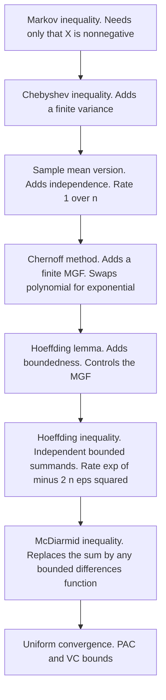
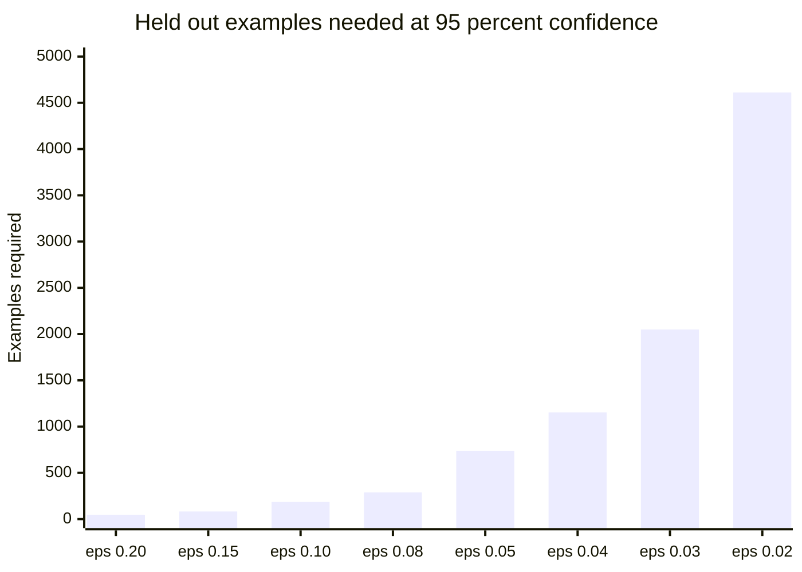
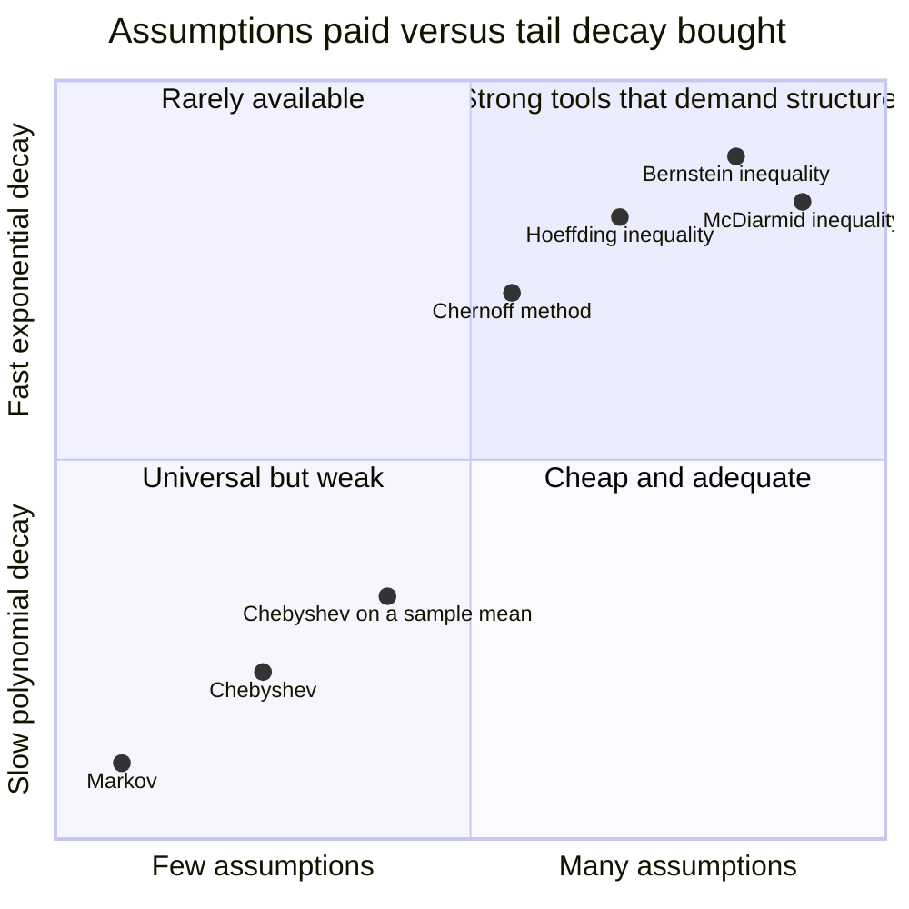

# From Markov to Hoeffding: The Inequalities Every Generalization Bound Is Made Of

*Part of "Why Learning Works: The Theorems Behind Machine Learning," a series that proves, rather than asserts, why a model fitted on a finite sample says anything at all about the world. This post builds the concentration toolbox from nothing and spends it on the most ordinary object in machine learning: a test-set number.*

---

## The Number You Report and the Number You Cannot Defend

You finish training. You run the model on the held-out set. The script prints `0.942`, you write "94.2% accuracy" in the results table, and you move on.

Now answer a simple question: what is the error bar on that number?

Most practitioners never compute one. Some report a standard deviation across random seeds, which measures *training* variability and says nothing about *evaluation* sampling error. The interval that actually matters — how far the true error rate could be from the number the script printed — is computable in one line, and on a 200-example test set it is roughly ten percentage points wide in each direction. The third significant figure you just typed is not merely uncertain, it is fictional. Worse: 94.2% is not even attainable on 200 examples, since $0.942 \times 200 = 188.4$. The number you reported is not a possible outcome of the experiment you ran.

The machinery that produces the honest interval is a century old. It takes four theorems, each proved from the one before it: Markov's inequality gives Chebyshev's, Chebyshev's inadequacy motivates the Chernoff method, the Chernoff method needs Hoeffding's lemma, and Hoeffding's lemma yields Hoeffding's inequality. Everything that comes later in statistical learning theory — PAC bounds, VC dimension, Rademacher complexity — is this chain with extra bookkeeping on top. We will prove every step in full except one, and I will say clearly which one and why.



---

## Markov's Inequality: Almost No Hypotheses, Almost No Strength

Everything starts here.

> **Theorem (Markov).** Let $X$ be a random variable with $X \geq 0$ almost surely and $\mathbb{E}[X] < \infty$. Then for every $a > 0$,
> $$
> \mathbb{P}(X \geq a) \;\leq\; \frac{\mathbb{E}[X]}{a}.
> $$

**Proof.** Fix $a > 0$ and consider the indicator $\mathbb{1}\{X \geq a\}$. I claim the pointwise inequality

$$
a\,\mathbb{1}\{X \geq a\} \;\leq\; X
$$

holds for every outcome. There are two cases. If $X(\omega) \geq a$, the left side equals $a$ and the right side is $X(\omega) \geq a$, so the inequality holds. If $X(\omega) < a$, the left side is $0$ and the right side is $X(\omega) \geq 0$ by nonnegativity, so it holds again. Since the inequality holds pointwise, monotonicity of expectation gives

$$
a\,\mathbb{E}\big[\mathbb{1}\{X \geq a\}\big] \;\leq\; \mathbb{E}[X].
$$

The expectation of an indicator is the probability of the event it indicates, so the left side is $a\,\mathbb{P}(X \geq a)$. Divide by $a > 0$. $\blacksquare$

Three lines. Look at what the proof consumed: nonnegativity, and the existence of a first moment — no variance, no independence, no distributional shape. Markov's inequality applies to a random variable you know essentially nothing about, and it is correspondingly weak: for a fair die, $\mathbb{E}[X] = 3.5$ gives $\mathbb{P}(X \geq 6) \leq 3.5/6 \approx 0.583$ against a truth of $1/6 \approx 0.167$. It cannot be improved without more hypotheses, because it is tight — the variable equal to $a$ with probability $\mathbb{E}[X]/a$ and $0$ otherwise attains it with equality — so a bound tight over so poor a class of distributions is loose on every distribution you actually care about. The way forward is not to improve Markov but to apply it to a cleverly chosen transformation of $X$; every remaining theorem here is that one move, executed with increasing ambition.

---

## Chebyshev: The First Transformation

Markov wants a nonnegative random variable. If $X$ has mean $\mu$ and finite variance $\sigma^2$, then $(X - \mu)^2$ is nonnegative and its expectation is exactly $\sigma^2$. Feed that to Markov.

> **Theorem (Chebyshev).** Let $X$ have mean $\mu$ and finite variance $\sigma^2$. Then for every $\varepsilon > 0$,
> $$
> \mathbb{P}\big(|X - \mu| \geq \varepsilon\big) \;\leq\; \frac{\sigma^2}{\varepsilon^2}.
> $$

**Proof.** The events $\{|X - \mu| \geq \varepsilon\}$ and $\{(X-\mu)^2 \geq \varepsilon^2\}$ are the same event, because squaring is a strictly increasing bijection on the nonnegative reals. Apply Markov's inequality to the nonnegative variable $(X-\mu)^2$ with threshold $a = \varepsilon^2$:

$$
\mathbb{P}\big((X-\mu)^2 \geq \varepsilon^2\big) \;\leq\; \frac{\mathbb{E}\big[(X-\mu)^2\big]}{\varepsilon^2} \;=\; \frac{\sigma^2}{\varepsilon^2}. \qquad \blacksquare
$$

That is a corollary, not a new theorem. The whole content of Chebyshev is the choice of transformation.

Now specialize to the object we care about. Let $X_1, \dots, X_n$ be independent and identically distributed with mean $\mu$ and variance $\sigma^2$, and let $\bar{X}_n = \frac{1}{n}\sum_{i=1}^n X_i$. By linearity $\mathbb{E}[\bar{X}_n] = \mu$, and by independence the variances add:

$$
\operatorname{Var}(\bar{X}_n) = \frac{1}{n^2}\sum_{i=1}^n \operatorname{Var}(X_i) = \frac{\sigma^2}{n}.
$$

Chebyshev applied to $\bar{X}_n$ therefore gives

$$
\mathbb{P}\big(|\bar{X}_n - \mu| \geq \varepsilon\big) \;\leq\; \frac{\sigma^2}{n\,\varepsilon^2}.
$$

This proves the weak law of large numbers in one line, and it is the first place independence enters the story. But look at the rate: the failure probability decays like $1/n$, which is *polynomial* in the sample size, and polynomial is not good enough.

Concretely. Estimating a Bernoulli error rate, so $\sigma^2 = p(1-p) \leq 1/4$, at half-width $\varepsilon = 0.05$, reaching failure probability $\delta$ needs $n \geq \sigma^2/(\delta\varepsilon^2)$. At $\delta = 0.05$ that is $n \geq 0.25/(0.05 \times 0.0025) = 2{,}000$ examples; at $\delta = 0.001$ it is $n \geq 100{,}000$. Every factor of ten in confidence costs a factor of ten in data. Confidence should be nearly free, and at a linear exchange rate it is unaffordable. Getting there requires a genuinely different transformation.

---

## The Chernoff Method: Buying Exponential Decay

Chebyshev squared the deviation. What if we exponentiate it instead?

Fix $\lambda > 0$. The map $x \mapsto e^{\lambda x}$ is strictly increasing, so the event $\{X \geq a\}$ is *identical* to the event $\{e^{\lambda X} \geq e^{\lambda a}\}$ — not approximately equal, the same set of outcomes. And $e^{\lambda X}$ is nonnegative by construction, so Markov applies:

$$
\mathbb{P}(X \geq a) \;=\; \mathbb{P}\big(e^{\lambda X} \geq e^{\lambda a}\big) \;\leq\; e^{-\lambda a}\,\mathbb{E}\big[e^{\lambda X}\big].
$$

This holds for *every* $\lambda > 0$, and the left side does not depend on $\lambda$. So the bound holds for the best $\lambda$:

$$
\mathbb{P}(X \geq a) \;\leq\; \inf_{\lambda > 0}\; e^{-\lambda a}\,\mathbb{E}\big[e^{\lambda X}\big].
$$

This is the **Chernoff method**, named for Herman Chernoff's 1952 paper on the asymptotic efficiency of hypothesis tests. It is not a single inequality but a recipe: the quantity $M_X(\lambda) = \mathbb{E}[e^{\lambda X}]$ is the **moment generating function**, and $\lambda$ sets an exchange rate between the prefactor $e^{-\lambda a}$, which decays exponentially in $a$, and $M_X(\lambda)$, which grows with $\lambda$ as the exponential emphasises the upper tail of $X$. Optimizing over $\lambda$ finds the best trade.

Two observations before we cash this in. First, the method demands a hypothesis Chebyshev did not: $\mathbb{E}[e^{\lambda X}]$ must be finite for the relevant $\lambda$. Heavy-tailed distributions — a Cauchy, a Pareto with small shape parameter — have infinite MGF for every $\lambda > 0$, and for them the method yields the vacuous bound $\mathbb{P}(X \geq a) \leq \infty$. Exponential concentration is not free; you pay for it with a tail assumption.

Second, for a *sum* of independent variables the method is extraordinarily well behaved. If $S_n = \sum_{i=1}^n X_i$ with the $X_i$ independent, then

$$
\mathbb{E}\big[e^{\lambda S_n}\big] = \mathbb{E}\left[\prod_{i=1}^n e^{\lambda X_i}\right] = \prod_{i=1}^n \mathbb{E}\big[e^{\lambda X_i}\big],
$$

because $e^{\lambda X_1}, \dots, e^{\lambda X_n}$ are independent whenever the $X_i$ are, and independence makes the expectation of a product the product of expectations. The MGF of a sum factorizes. That is why the exponential, out of all increasing functions, is the transform that works: it converts sums into products, and products of $n$ numbers each slightly less than one shrink exponentially in $n$. It is the entire reason learning-theoretic bounds are exponential rather than polynomial, and it reduces everything to one question: **how large can $\mathbb{E}[e^{\lambda X}]$ be for a single summand?**

---

## Hoeffding's Lemma: Controlling the Moment Generating Function

This is the technical heart of the post, and it does fit, so here it is in full. The hypothesis we will use is boundedness — the summand lives in a known interval, which is exactly the situation of a per-example loss: a 0/1 error is in $\{0,1\}$, a clipped or normalized loss is in $[0,1]$, a bounded regression loss is in some $[a,b]$ known in advance.

> **Lemma (Hoeffding, 1963).** Let $X$ be a random variable with $a \leq X \leq b$ almost surely and $\mathbb{E}[X] = 0$. Then for every $\lambda \in \mathbb{R}$,
> $$
> \mathbb{E}\big[e^{\lambda X}\big] \;\leq\; \exp\!\left(\frac{\lambda^2 (b-a)^2}{8}\right).
> $$

The hypotheses force $a \leq 0 \leq b$, since a mean-zero variable cannot live strictly on one side of zero. And since a mean-zero Gaussian with variance $\sigma^2$ has MGF exactly $e^{\lambda^2\sigma^2/2}$, the lemma says a bounded mean-zero variable has an MGF no larger than that of a Gaussian with variance $(b-a)^2/4$. Boundedness buys Gaussian-like tails — the property called **sub-Gaussianity**.

**Proof.** The argument has three movements: convexity, a change of variables, and Taylor.

*Step 1: bound the exponential by its chord.* The function $x \mapsto e^{\lambda x}$ is convex. Any point $x \in [a,b]$ can be written as the convex combination

$$
x = \frac{b-x}{b-a}\,a \;+\; \frac{x-a}{b-a}\,b,
$$

where the two coefficients are nonnegative and sum to $1$. Convexity means the function at a convex combination is at most the same convex combination of the function values, so

$$
e^{\lambda x} \;\leq\; \frac{b-x}{b-a}\,e^{\lambda a} \;+\; \frac{x-a}{b-a}\,e^{\lambda b}, \qquad x \in [a,b].
$$

Geometrically: on $[a,b]$ the graph of $e^{\lambda x}$ lies below the chord joining its endpoints.

*Step 2: take expectations.* The right-hand side is affine in $x$, so taking expectations is easy, and the linear terms vanish because $\mathbb{E}[X] = 0$:

$$
\mathbb{E}\big[e^{\lambda X}\big] \;\leq\; \frac{b - \mathbb{E}[X]}{b-a}\,e^{\lambda a} + \frac{\mathbb{E}[X] - a}{b-a}\,e^{\lambda b} \;=\; \frac{b}{b-a}\,e^{\lambda a} - \frac{a}{b-a}\,e^{\lambda b}.
$$

This is the only place the mean-zero hypothesis is used, and it is decisive: the bound is now a deterministic function of $\lambda$, $a$, and $b$. All the randomness is gone.

*Step 3: change variables.* Set

$$
p = \frac{-a}{b-a} \in [0,1], \qquad u = \lambda(b-a).
$$

Since $a \leq 0 \leq b$ we have $p \in [0,1]$, and $1 - p = \frac{b}{b-a}$. Also $\lambda a = u \cdot \frac{a}{b-a} = -pu$ and $\lambda b = u \cdot \frac{b}{b-a} = u(1-p)$. Substituting,

$$
\frac{b}{b-a}e^{\lambda a} - \frac{a}{b-a}e^{\lambda b} \;=\; (1-p)e^{-pu} + p\,e^{u(1-p)} \;=\; e^{-pu}\Big[(1-p) + p\,e^{u}\Big].
$$

Define

$$
\varphi(u) \;=\; -pu + \ln\!\big(1 - p + p\,e^{u}\big),
$$

so that the whole bound reads compactly as $\mathbb{E}[e^{\lambda X}] \leq e^{\varphi(u)}$. For $p \in (0,1)$ the argument of the logarithm satisfies $1 - p + p\,e^{u} > 1 - p > 0$ for every real $u$, so $\varphi$ is smooth on all of $\mathbb{R}$. (If $p = 0$ or $p = 1$ then $X$ is almost surely $0$ and the lemma is trivial.)

*Step 4: differentiate.* We compute

$$
\varphi'(u) = -p + \frac{p\,e^u}{1 - p + p\,e^u}.
$$

Write $\tau(u) = \dfrac{p\,e^u}{1 - p + p\,e^u}$, so $\varphi'(u) = \tau(u) - p$. Then $\tau(u) \in (0,1)$ for every real $u$, and

$$
\varphi(0) = -0 + \ln(1 - p + p) = \ln 1 = 0, \qquad \varphi'(0) = \tau(0) - p = p - p = 0.
$$

For the second derivative, differentiate $\tau$ by the quotient rule:

$$
\varphi''(u) = \tau'(u) = \frac{p e^u\,(1 - p + p e^u) - p e^u \cdot p e^u}{(1 - p + p e^u)^2} = \frac{p e^u (1-p)}{(1 - p + p e^u)^2} = \tau(u)\big(1 - \tau(u)\big).
$$

Now read what $\tau(u)$ is. It is the success probability of a Bernoulli variable obtained by **exponentially tilting** a Bernoulli$(p)$ by $u$: reweight the outcome $1$ by $e^u$ and renormalize. So $\varphi''(u) = \tau(1-\tau)$ is precisely the *variance of that tilted Bernoulli*. And the variance of any Bernoulli is at most a quarter, since $\tau(1-\tau)$ is a downward parabola with maximum $1/4$ at $\tau = 1/2$. Hence

$$
\varphi''(u) \;\leq\; \tfrac{1}{4} \qquad \text{for all } u \in \mathbb{R}.
$$

*Step 5: Taylor with remainder.* Since $\varphi$ is twice continuously differentiable on $\mathbb{R}$, Taylor's theorem with Lagrange remainder gives, for each $u$, some $\theta$ between $0$ and $u$ with

$$
\varphi(u) = \varphi(0) + u\,\varphi'(0) + \frac{u^2}{2}\varphi''(\theta) = \frac{u^2}{2}\varphi''(\theta) \;\leq\; \frac{u^2}{8}.
$$

Undoing the substitution $u = \lambda(b-a)$,

$$
\mathbb{E}\big[e^{\lambda X}\big] \;\leq\; e^{\varphi(u)} \;\leq\; \exp\!\left(\frac{\lambda^2(b-a)^2}{8}\right). \qquad \blacksquare
$$

Writing $\psi(\lambda) = \varphi(\lambda(b-a))$ gives $\psi''(\lambda) = (b-a)^2\varphi''(u) \leq (b-a)^2/4$, the form the bound is usually quoted in: the variance proxy is a quarter of the squared range, and Taylor's factor of $1/2$ turns the quarter into the eighth in the exponent. The inequality $\tau(1-\tau) \leq 1/4$ used in Step 4 is tight only when the tilted Bernoulli is fair, so away from that single value of $u$ the lemma is already conservative — the first of two places the final result loses sharpness.

---

## Hoeffding's Inequality: Assembling the Pieces

Now the payoff. The lemma controls one summand, independence multiplies the control across $n$ summands, and the Chernoff method converts the product into a tail bound.

> **Theorem (Hoeffding, 1963).** Let $X_1, \dots, X_n$ be independent random variables with $a_i \leq X_i \leq b_i$ almost surely, and let $S_n = \sum_{i=1}^n X_i$. Then for every $t > 0$,
> $$
> \mathbb{P}\big(S_n - \mathbb{E}[S_n] \geq t\big) \;\leq\; \exp\!\left(\frac{-2t^2}{\sum_{i=1}^n (b_i - a_i)^2}\right).
> $$

**Proof.** Write $Y_i = X_i - \mathbb{E}[X_i]$. Each $Y_i$ has mean zero and lies in an interval of the same length $b_i - a_i$, namely $[a_i - \mathbb{E}X_i,\; b_i - \mathbb{E}X_i]$; the $Y_i$ inherit independence from the $X_i$. Fix $\lambda > 0$. Chernoff's method on $\sum_i Y_i = S_n - \mathbb{E}[S_n]$ gives

$$
\mathbb{P}\left(\sum_{i=1}^n Y_i \geq t\right) \;\leq\; e^{-\lambda t}\;\mathbb{E}\left[e^{\lambda \sum_i Y_i}\right] \;=\; e^{-\lambda t}\prod_{i=1}^n \mathbb{E}\big[e^{\lambda Y_i}\big],
$$

where the factorization is independence. Apply Hoeffding's lemma to each factor:

$$
\prod_{i=1}^n \mathbb{E}\big[e^{\lambda Y_i}\big] \;\leq\; \prod_{i=1}^n \exp\!\left(\frac{\lambda^2 (b_i - a_i)^2}{8}\right) \;=\; \exp\!\left(\frac{\lambda^2 V}{8}\right), \qquad V := \sum_{i=1}^n (b_i - a_i)^2.
$$

So for every $\lambda > 0$,

$$
\mathbb{P}\big(S_n - \mathbb{E}[S_n] \geq t\big) \;\leq\; \exp\!\left(-\lambda t + \frac{\lambda^2 V}{8}\right) \;=:\; e^{g(\lambda)}.
$$

Now optimize, explicitly. The exponent $g(\lambda) = -\lambda t + \lambda^2 V/8$ is a quadratic in $\lambda$ with positive leading coefficient $V/8$, hence strictly convex, hence minimized at its unique stationary point:

$$
g'(\lambda) = -t + \frac{\lambda V}{4} = 0 \quad\Longrightarrow\quad \lambda^\star = \frac{4t}{V},
$$

which is positive as required since $t > 0$ and $V > 0$. Evaluating,

$$
g(\lambda^\star) = -\frac{4t}{V}\,t + \frac{1}{8}\left(\frac{4t}{V}\right)^{\!2} V = -\frac{4t^2}{V} + \frac{16t^2}{8V} = -\frac{4t^2}{V} + \frac{2t^2}{V} = -\frac{2t^2}{V}.
$$

Substituting back gives the claim. $\blacksquare$

Two specializations turn this into the form you will actually use.

**Identical ranges.** If every $X_i$ lies in the same $[a,b]$, then $V = n(b-a)^2$. Setting $t = n\varepsilon$ to convert a statement about the sum into one about the mean:

$$
\mathbb{P}\big(\bar{X}_n - \mu \geq \varepsilon\big) \;\leq\; \exp\!\left(\frac{-2n^2\varepsilon^2}{n(b-a)^2}\right) = \exp\!\left(\frac{-2n\varepsilon^2}{(b-a)^2}\right).
$$

**Both tails.** The theorem bounds the upper deviation. Apply it to $-X_1, \dots, -X_n$ — which are independent and lie in $[-b, -a]$, an interval of the same length — to get the identical bound on $\mathbb{P}(\mu - \bar{X}_n \geq \varepsilon)$. The event $\{|\bar{X}_n - \mu| \geq \varepsilon\}$ is the union of the two one-sided events, so by the union bound its probability is at most the sum:

$$
\boxed{\;\mathbb{P}\left(\left|\frac{1}{n}\sum_{i=1}^n X_i - \mu\right| \geq \varepsilon\right) \;\leq\; 2\exp\!\left(\frac{-2n\varepsilon^2}{(b-a)^2}\right)\;}
$$

For $X_i \in \{0,1\}$ or $X_i \in [0,1]$ — the case of a 0/1 error indicator or any normalized loss — the range is $1$ and this collapses to the form worth memorizing:

$$
\mathbb{P}\big(|\bar{X}_n - \mu| \geq \varepsilon\big) \;\leq\; 2e^{-2n\varepsilon^2}.
$$

Compare the rates: Chebyshev gave $\sigma^2/(n\varepsilon^2)$, decaying like $1/n$; Hoeffding gives $2e^{-2n\varepsilon^2}$, decaying like $e^{-cn}$ — nothing about the problem changed, only the transform, and the boundedness it costs is free in a classification setting.

---

## Spending It: The Error Bar You Owe Your Test Set

Now the point of all this.

Let $h$ be a fixed classifier and let $Z_1, \dots, Z_n$ be a held-out sample drawn i.i.d. from the data distribution $D$, independent of everything used to build $h$. Let $X_i = \mathbb{1}\{h(Z_i) \neq y_i\}$ be the error indicator on example $i$. These are i.i.d. Bernoulli variables in $\{0,1\}$ with mean equal to the **true error** $e(h) = \mathbb{P}_{Z \sim D}(h(Z) \neq y)$, and their sample mean is the **test error** $\hat{e}(h)$ your script prints. Hoeffding applies verbatim:

$$
\mathbb{P}\big(|\hat{e}(h) - e(h)| \geq \varepsilon\big) \;\leq\; 2e^{-2n\varepsilon^2}.
$$

Set the right side equal to a target failure probability $\delta$ and invert. In one direction, solve for $n$:

$$
2e^{-2n\varepsilon^2} \leq \delta \iff e^{-2n\varepsilon^2} \leq \frac{\delta}{2} \iff -2n\varepsilon^2 \leq \ln\frac{\delta}{2} \iff n \;\geq\; \frac{1}{2\varepsilon^2}\ln\frac{2}{\delta}.
$$

In the other, solve for $\varepsilon$ given $n$:

$$
\varepsilon \;=\; \sqrt{\frac{1}{2n}\ln\frac{2}{\delta}}.
$$

That second formula is the one to put on a sticky note. With probability at least $1 - \delta$ over the draw of the test set,

$$
e(h) \;\in\; \left[\;\hat{e}(h) - \sqrt{\frac{1}{2n}\ln\frac{2}{\delta}},\;\; \hat{e}(h) + \sqrt{\frac{1}{2n}\ln\frac{2}{\delta}}\;\right].
$$

**Worked example.** Your model makes 20 errors on a 200-example held-out set, so $\hat{e} = 0.1$. Take $\delta = 0.05$, that is, 95% confidence. Then $2/\delta = 40$ and

$$
\varepsilon = \sqrt{\frac{1}{2 \cdot 200}\ln 40} = \sqrt{\frac{3.6889}{400}} = \sqrt{0.009222} \approx 0.0960.
$$

So with 95% confidence the true error rate lies in

$$
[\,0.1 - 0.096,\; 0.1 + 0.096\,] \;=\; [\,0.004,\; 0.196\,].
$$

Read that interval. The upper endpoint is *forty-nine times* the lower one. Your point estimate says the model errs one time in ten; the honest interval is equally consistent with one in five and with one in two hundred and fifty. Those are not the same model. One ships and one does not.

Return to the opening: 94.2% on 200 examples means $\hat{e} = 0.06$ (the nearest attainable value is $188/200$), and the same $\varepsilon \approx 0.096$ puts the true accuracy anywhere in $[84.4\%, 100\%]$. The third significant figure of $0.942$ is meaningless, and so is the second — report the interval with the number, and be suspicious of leaderboard gaps smaller than it, which on the small evaluation sets that dominate practice is most of them.

The sample-size formula behind that interval:

$$
n \;\geq\; \frac{1}{2\varepsilon^2}\,\ln\frac{2}{\delta}.
$$

The two parameters you care about enter in radically different ways. The precision $\varepsilon$ appears **squared in the denominator**. The confidence parameter $\delta$ appears **only inside a logarithm**. That asymmetry is the single most practically useful fact in this post.

| Target | $n$ required |
|---|---|
| $\varepsilon = 0.05$, 95% confidence | $\geq 738$ |
| $\varepsilon = 0.04$, 95% confidence | $\geq 1{,}153$ |
| $\varepsilon = 0.04$, 97.5% confidence | $\geq 1{,}370$ |
| $\varepsilon = 0.02$, 95% confidence | $\geq 4{,}612$ |

Read the table along two axes. Down the precision axis: $\varepsilon = 0.05$ to $0.04$, a 20% improvement, costs 56% more data; $0.05$ to $0.02$ costs $6.25$ times as much. Halving $\varepsilon$ multiplies $n$ by four, because $\varepsilon$ is squared. Across the confidence axis: 95% to 97.5% at fixed $\varepsilon = 0.04$ costs $1{,}370 - 1{,}153 = 217$ extra examples, about 19% more. Halving the failure probability adds $\ln 2 \approx 0.69$ nats inside a logarithm that already holds $\ln 40 \approx 3.69$. You could reach 99.9% confidence at $\varepsilon = 0.05$ with $n = 1{,}521$, roughly double the 95% requirement, for a fifty-fold reduction in failure probability.

The operational advice falls out. **If your evaluation is underpowered, do not fix it by lowering your confidence level.** You will save almost nothing. The only lever that matters is $\varepsilon$, and it is a quadratic lever.



Flat and cheap on the left, exploding on the right, and it does not stop: pinning an error rate to $\pm 0.005$ at 95% confidence needs $n \geq 73{,}778$, which is why benchmark suites separating models by half a point need tens of thousands of evaluation examples, and suites without them cannot make the distinctions their leaderboards imply.

---

## How Loose Is Hoeffding, Really?

Hoeffding is a *bound*, valid for every bounded distribution including the worst one, but for the Bernoulli case the exact tail is computable, so the price of that generality can be measured rather than guessed.

Comparing the two probabilities directly is misleading: the ratio of the Hoeffding bound to the exact binomial tail grows without limit into the deep tail — about $4\times$ at $n = 200$, $\varepsilon = 0.05$, and a factor of four million at $n = 5000$, $\varepsilon = 0.2$, which sounds catastrophic until you notice both probabilities are around $10^{-180}$, where the factor is irrelevant to any decision anyone will ever make. The honest currency is data: **how many extra examples does Hoeffding ask for?**

```python
import numpy as np
from scipy.stats import binom

def tail(n, eps, p=0.5):
    """Exact P(|Xbar - p| >= eps) for the mean of n iid Bernoulli(p)."""
    lo = int(np.floor(n*(p - eps) + 1e-12))   # event X <= lo
    hi = int(np.ceil(n*(p + eps) - 1e-12))    # event X >= hi
    return binom.cdf(lo, n, p) + binom.sf(hi - 1, n, p)

def n_chebyshev(eps, delta, var=0.25):   # sigma^2 / (n eps^2) <= delta
    return int(np.ceil(var / (delta * eps**2)))

def n_hoeffding(eps, delta):             # 2 exp(-2 n eps^2) <= delta
    return int(np.ceil(np.log(2 / delta) / (2 * eps**2)))

def n_exact(eps, delta):
    # exact tail is lattice-valued (non-monotone in n); smallest n it first drops below delta
    return next(n for n in range(1, 200_000) if tail(n, eps) <= delta)

print(f"{'eps':>6}{'delta':>8}{'Chebyshev':>12}{'Hoeffding':>12}{'exact':>9}{'H/exact':>10}")
for eps, delta in [(0.05, 0.05), (0.02, 0.05), (0.05, 0.001)]:
    nc, nh, ne = n_chebyshev(eps, delta), n_hoeffding(eps, delta), n_exact(eps, delta)
    print(f"{eps:>6.2f}{delta:>8.3f}{nc:>12,}{nh:>12,}{ne:>9,}{nh/ne:>9.2f}x")
```

```
   eps   delta   Chebyshev   Hoeffding    exact   H/exact
  0.05   0.050       2,000         738      401     1.84x
  0.02   0.050      12,500       4,612    2,451     1.88x
  0.05   0.001     100,000       1,521    1,101     1.38x
```

There is the number to quote: **Hoeffding asks for roughly 1.4 to 1.9 times as many examples as the exact binomial calculation** — a small price for a bound needing no distributional assumption beyond boundedness, holding for any bounded loss, and composing cleanly under sums. Chebyshev, in the same table, asks for $2{,}000$ against Hoeffding's $738$ at $\delta = 0.05$, and $100{,}000$ against $1{,}521$ at $\delta = 0.001$ — a factor of 66, because polynomial and exponential diverge exactly where you need them not to: in the high-confidence regime.

A Monte Carlo over two million simulated evaluations per configuration confirms this and surfaces an asymmetry the ratio table hides: at $n = 200$, $\varepsilon = 0.05$, the true deviation probability is about $0.179$ when $p = 0.5$ but only $0.024$ when $p = 0.1$, while Hoeffding reports $0.736$ for both, because it only ever sees the range and assumes the worst-case Bernoulli variance of $1/4$. Since a deployed model's error rate is usually small, that is exactly the regime where Hoeffding is loosest — Bernstein's and Bennett's inequalities fix this by putting the true variance back into the exponent, at the cost of a messier statement.



---

## The Catch, Which Is the Whole Reason Learning Theory Exists

Everything above rests on a hypothesis so quiet it is easy to miss. Go back and reread the setup of the worked example: *let $h$ be a fixed classifier*, and let the held-out sample be drawn **independently of everything used to build $h$**.

That independence is not decoration. It is what makes $X_i = \mathbb{1}\{h(Z_i) \neq y_i\}$ a genuine i.i.d. Bernoulli sequence with mean $e(h)$. If $h$ depends on the $Z_i$, then $X_i$ is a function of $Z_i$ *and*, through $h$, of every other $Z_j$; the sequence is not independent and Hoeffding's hypotheses fail outright. Not "approximately hold." Fail. And of course your model was chosen by looking at the data. That is what training is.

Make the failure concrete. Take a hypothesis class $\mathcal{H}$ of $M$ classifiers, each of which is pure noise: each $h_j$ predicts by an independent fair coin flip, so $e(h_j) = 1/2$ for every $j$. Evaluate all $M$ of them on the same $n$-example set and keep the best. For any single fixed $h_j$, Hoeffding says the chance of a test error below $1/2 - \varepsilon$ is at most $e^{-2n\varepsilon^2}$. But the probability that *at least one* of $M$ independent classifiers gets that lucky is roughly $1 - (1 - e^{-2n\varepsilon^2})^M$, which approaches $1$ once $M \gtrsim e^{2n\varepsilon^2}$. With $n = 200$ and $\varepsilon = 0.1$, $e^{2n\varepsilon^2} = e^{4} \approx 55$. Try sixty random classifiers on a 200-example set and you will very likely find one that scores 60% or better. It has learned nothing. Its true error is exactly one half. Its *selected* empirical error is a biased estimate, and Hoeffding has nothing to say about it, because the selected hypothesis is not fixed — it is a random variable depending on the very sample used to evaluate it.

This is not an exotic edge case. It is architecture search, hyperparameter sweeps, trying twelve prompts and reporting the best — every workflow in which the test set is consulted more than once. The quantity that concentrates is $\hat{e}(h)$ for *predetermined* $h$; the quantity you report is $\hat{e}(\hat{h})$ with $\hat{h} = \arg\min_{h \in \mathcal{H}} \hat{e}(h)$, and those are different random variables.

The first patch is the crudest one available: the **union bound**. If you cannot control the selected hypothesis, control all of them simultaneously. For a finite class $\mathcal{H}$ with $|\mathcal{H}| = M$,

$$
\mathbb{P}\Big(\exists h \in \mathcal{H} : |\hat{e}(h) - e(h)| \geq \varepsilon\Big) \;\leq\; \sum_{h \in \mathcal{H}} \mathbb{P}\big(|\hat{e}(h) - e(h)| \geq \varepsilon\big) \;\leq\; 2M e^{-2n\varepsilon^2}.
$$

Set that to $\delta$ and invert as before: with probability at least $1 - \delta$, *simultaneously for every* $h \in \mathcal{H}$,

$$
|\hat{e}(h) - e(h)| \;\leq\; \sqrt{\frac{1}{2n}\ln\frac{2M}{\delta}}.
$$

Since this holds for all $h$ at once, it holds for the $\hat{h}$ your algorithm picked. The cost is the $\ln M$ inside the square root — a $\sqrt{\ln M / 2n}$ penalty for the privilege of choosing — and the logarithm is generous. On our 200-example set the single-hypothesis half-width was $0.096$; searching over $M = 10$ widens it to $0.122$, over $M = 1{,}000$ to $0.163$, over $M = 10^6$ to $0.209$. A million-fold search costs barely more than double the interval.

But it is not enough, and the reason is stark: **almost no interesting hypothesis class is finite.** A linear classifier in $\mathbb{R}^d$ has a continuum of parameter settings; so does a neural network. For these $\ln M = \infty$, and the union bound says only that the deviation is at most infinity.

That failure is the founding problem of statistical learning theory. Vapnik and Chervonenkis's resolution is that what matters is not how many hypotheses $\mathcal{H}$ contains but how many distinct *labelings of $n$ points* it can produce. An infinite class can still cut a finite sample in only finitely many ways, and the growth of that count is governed by the VC dimension. That is where this series goes next — the shattering argument, the symmetrization trick that makes it work, and the bound that comes out the other side, all of it running on the machinery proved above.

---

## One Step Beyond: McDiarmid's Bounded Differences Inequality

There is one generalization worth naming before we stop, because it, and not Hoeffding, is what the uniform-convergence bounds actually run on.

Hoeffding controls a sum, but the quantity that matters in learning theory is $\sup_{h \in \mathcal{H}} |\hat{e}(h) - e(h)|$, a supremum over a class rather than a sum. What survives is that this supremum still changes only a little when you perturb a single example.

McDiarmid's inequality says that if $f(x_1,\dots,x_n)$ changes by at most $c_i$ whenever coordinate $i$ is altered and everything else is held fixed, then $f$ concentrates around its mean at the rate $\exp\big(-2t^2 / \sum_i c_i^2\big)$ — the *same exponent* Hoeffding's inequality produced, with $\sum_i c_i^2$ in place of $\sum_i (b_i - a_i)^2$. Hoeffding is the special case $f = \sum_i x_i$ with $c_i = b_i - a_i$.

**I am not proving this here.** The proof is a genuine step up in machinery: it constructs the Doob martingale $M_k = \mathbb{E}[f \mid X_1, \dots, X_k]$, shows its increments are bounded by $c_k$, and applies the Azuma–Hoeffding inequality for martingale differences. That is a post of its own, and I will not pretend a paragraph is a proof of it. The full argument is in McDiarmid's 1989 survey and in Chapter 6 of Boucheron, Lugosi and Massart; both are cited below.

Dropping the "sum" requirement buys the ability to apply concentration to a supremum over a hypothesis class, exactly what uniform convergence needs — and it is why the constant $2$ from $\tau(1-\tau) \leq 1/4$ keeps reappearing in bounds that look nothing like a sum of coin flips.

So the formula to keep is $\varepsilon = \sqrt{\tfrac{1}{2n}\ln\tfrac{2}{\delta}}$: $\pm 0.096$ on 200 examples at 95% confidence, $\pm 0.0136$ on ten thousand. Put it on every test-set number you report, with the catch attached — this all assumes the hypothesis was fixed before the data was seen, and the moment you select, tune, or iterate against the test set, you need uniform convergence instead. That is the next post.

---

## Going Deeper

**Books:**
- Boucheron, S., Lugosi, G., & Massart, P. (2013). *Concentration Inequalities: A Nonasymptotic Theory of Independence.* Oxford University Press.
  - The standard modern reference for this material, with Chapter 2 covering the Chernoff method and Hoeffding's lemma.
- Vershynin, R. (2018). *High-Dimensional Probability: An Introduction with Applications in Data Science.* Cambridge University Press.
  - Builds the sub-Gaussian framework that Hoeffding's lemma is a special case of, and is a more approachable first book than Boucheron et al.
- Shalev-Shwartz, S., & Ben-David, S. (2014). *Understanding Machine Learning: From Theory to Algorithms.* Cambridge University Press.
  - The cleanest modern treatment of how concentration turns into PAC learnability, with Appendix B collecting the measure concentration results this post uses.
- Mitchell, T. M. (1997). *Machine Learning.* McGraw-Hill.
  - Chapter 5 remains one of the clearest elementary derivations of exactly the test-set confidence interval computed here.

**Online Resources:**
- [Boucheron, Lugosi & Massart, *Concentration Inequalities* (full text PDF)](https://www.hse.ru/data/2016/11/24/1113029206/Concentration%20inequalities.pdf) — The complete book, freely readable, with Sections 2.1–2.8 covering this post's chain in the authors' own notation.
- [Larry Wasserman, "Concentration of Measure" (CMU 10-702 notes)](https://www.stat.cmu.edu/~larry/=sml/Concentration.pdf) — Compact lecture notes running Markov through Bernstein and McDiarmid with proofs.
- [Sham Kakade, "Hoeffding, Chernoff, Bennett, and Bernstein Bounds" (UW STAT 928)](https://homes.cs.washington.edu/~sham/courses/stat928/lectures/lecture06.pdf) — Side-by-side derivations of the four bounds that make the role of each extra hypothesis clear.
- [Patrick Rebeschini, "Sub-Gaussian Concentration Inequalities" (Oxford, Algorithmic Foundations of Learning)](https://www.stats.ox.ac.uk/~rebeschi/teaching/AFoL/22/material/lecture06.pdf) — Presents Hoeffding through the sub-Gaussian lens, which generalizes better than the bounded-variable statement.

**Videos:**
- [MIT RES.6-012 *Introduction to Probability*](https://ocw.mit.edu/courses/res-6-012-introduction-to-probability-spring-2018/) — Bertsekas and Tsitsiklis; Lecture 18 covers Markov, Chebyshev, and the weak law at the level of Sections 2 and 3 here.
- [MIT 18.650 *Statistics for Applications*, lecture videos](https://ocw.mit.edu/courses/18-650-statistics-for-applications-fall-2016/video_galleries/lecture-videos/) — Philippe Rigollet's early lectures develop concentration and confidence intervals non-asymptotically, as an alternative to the usual normal-approximation route.

**Academic Papers:**
- Hoeffding, W. (1963). ["Probability Inequalities for Sums of Bounded Random Variables."](https://www.tandfonline.com/doi/abs/10.1080/01621459.1963.10500830) *Journal of the American Statistical Association*, 58(301), 13–30.
  - The source, containing both the lemma and the inequality proved above, plus sharper results for sampling without replacement that are still underused.
- Chernoff, H. (1952). ["A Measure of Asymptotic Efficiency for Tests of a Hypothesis Based on the Sum of Observations."](https://projecteuclid.org/journals/annals-of-mathematical-statistics/volume-23/issue-4/A-Measure-of-Asymptotic-Efficiency-for-Tests-of-a-Hypothesis/10.1214/aoms/1177729330.full) *Annals of Mathematical Statistics*, 23(4), 493–507.
  - The paper the exponential-moment method is named after, though its actual subject was the error exponent of hypothesis tests.
- McDiarmid, C. (1989). ["On the Method of Bounded Differences."](https://www.cambridge.org/core/services/aop-cambridge-core/content/view/AABA597B562BDA7D89C6077E302694FB) In J. Siemons (ed.), *Surveys in Combinatorics 1989*, London Mathematical Society Lecture Note Series 141, Cambridge University Press, 148–188.
  - The survey that made bounded differences a standard tool, containing the martingale proof this post declined to give.

**Questions to Explore:**
- Hoeffding uses only the range $(b-a)$ and throws away the variance, which is why it is so conservative when the true error rate is near zero. Bernstein's inequality puts the variance back — but the variance of the loss depends on the unknown error rate you are trying to estimate, so how should a bound depend on a quantity you do not know?
- The union-bound penalty $\sqrt{\ln M / 2n}$ says that searching over $10^6$ hypotheses costs barely twice the interval of a single one. Why, then, is overfitting to a validation set such a persistent practical problem?
- Hoeffding's lemma says a bounded variable is sub-Gaussian with variance proxy $(b-a)^2/4$, the worst-case Bernoulli variance. Is there a natural class of distributions for which this proxy is exactly attained at all $\lambda$ simultaneously?
- McDiarmid replaces "sum" with "bounded differences" and keeps the exponent unchanged. Is there a characterization of exactly which functionals of independent variables concentrate at the Gaussian rate?
