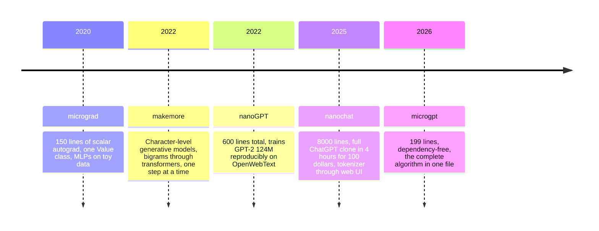
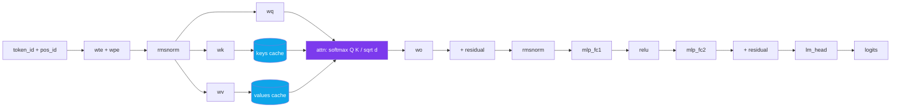
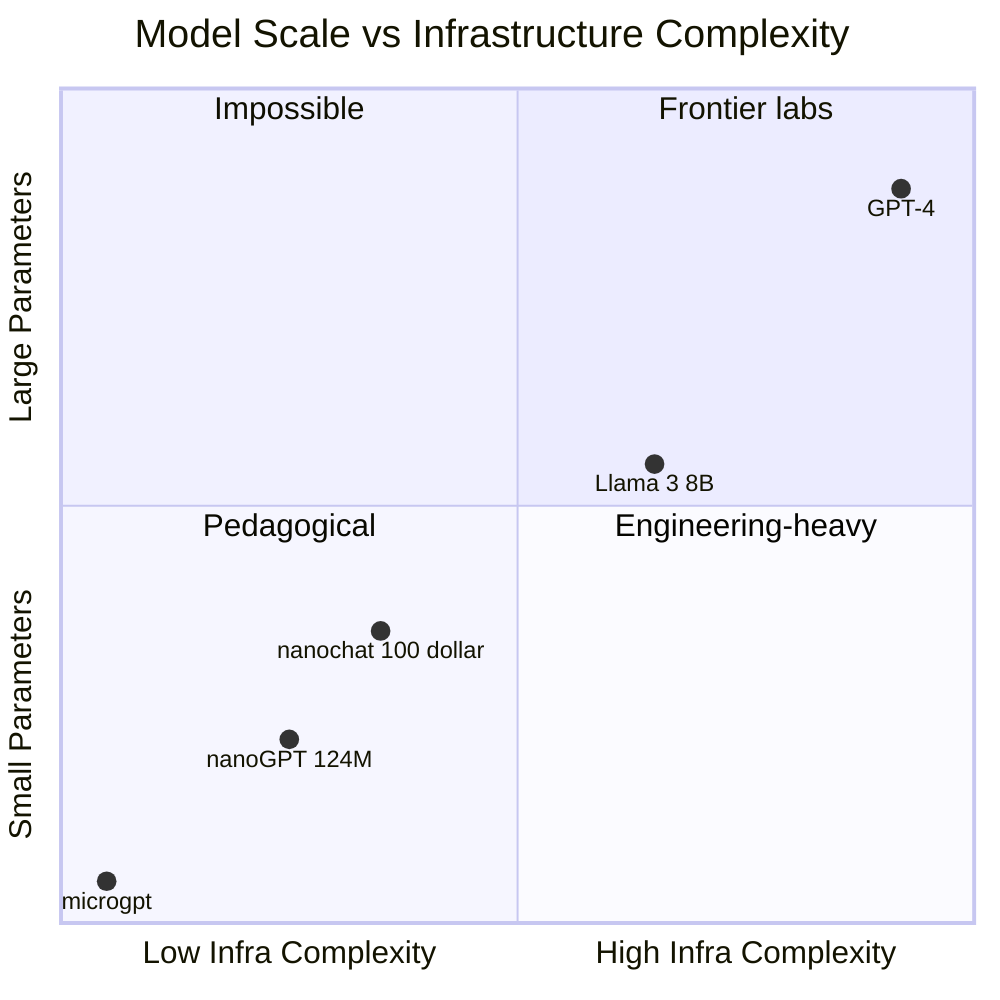

# Reading microgpt: What Karpathy's 200-Line LLM Teaches You That PyTorch Hides

On February 12, 2026, Andrej Karpathy published a Python file called `microgpt.py`. It is 199 lines long. It has no dependencies — not NumPy, not PyTorch, not JAX, not even `typing`. Three imports: `os`, `math`, `random`. That's it.

What that file does is absurd: it downloads 32,033 names, tokenizes them character by character, builds a GPT-2-style transformer with 4,192 parameters, trains it for 1,000 steps with Adam, and then samples new made-up names. The whole thing runs in about a minute on a MacBook. The loss goes from 3.3 to 2.37. The generated samples — `kamon, ann, karai, jaire, vialan, karia, yeran, anna, areli, kaina` — look like real names from a universe next door.

Karpathy's own description, from the file's docstring:

> *The most atomic way to train and run inference for a GPT in pure, dependency-free Python. This file is the complete algorithm. Everything else is just efficiency.*

That last sentence is the thesis of this entire post. Everything a real LLM lab does — GPUs, distributed training, mixed precision, BPE, paged KV cache, speculative decoding, ZeRO sharding, FlashAttention — is *efficiency*. The algorithmic content of an LLM is what's in those 199 lines. If you understand microgpt, you understand GPT-4. Everything else is engineering scaling.

I'm going to walk through the file section by section, pulling out the design decisions that matter, comparing each piece to its production counterpart, and flagging the things PyTorch hides from you that microgpt makes painfully visible. At the end you should be able to open the file on your own machine and read it the way you read a short story — beginning to end, no skipping.

Let's start by placing this file in its lineage, because microgpt isn't a standalone artifact. It's the endpoint of a ten-year pedagogical project.

## The Karpathy Ladder: A Decade of Simplification

Karpathy has been publishing "how to build an X from scratch" code for his entire public career, and if you line up the projects chronologically they form a ladder that goes in two directions at once — toward *more capability* and toward *less code*.



Each project answered a different question. **micrograd** (2020) asked: what is the minimum code that implements backpropagation? The answer was a scalar autograd engine of about 150 lines built around a `Value` class. **makemore** (2022) asked: how do you go from n-gram models to transformers without losing the reader? Several scripts, each one slightly more complex than the last, all predicting the next character in a list of baby names. **nanoGPT** (2022) asked: what's the smallest repo that can train real GPT-2 at scale? About 600 lines of PyTorch that actually reproduce the 124M-parameter model. **nanochat** (October 2025) asked: can you train a full ChatGPT-class model — pretraining, SFT, RL, eval, inference, web UI — for 100 dollars on a single GPU node in under four hours? Yes, and it takes about 8,000 lines.

And then microgpt (February 2026) asked the opposite question. Not "how do I scale up?" but "how far can I strip down?" The answer: 199 lines, zero dependencies, everything algorithmic, nothing operational.

What makes microgpt special in this ladder isn't that it's the smallest — that title goes to micrograd. It's that it's the first one that's genuinely **end-to-end**. micrograd has the autograd but no transformer. makemore has the transformer but splits it across files and relies on PyTorch. nanoGPT relies on PyTorch. nanochat relies on PyTorch, FlashAttention, FineWeb, TikToken. microgpt relies on *nothing*. You can read it on a plane with no wifi and run it on the same laptop you're reading it on.

That's a different kind of minimalism. It's not "minimal within a framework." It's "minimal from first principles."

## The Map: 199 Lines, Eight Sections

Before we go line by line, here's the full table of contents. I counted the lines in the actual file (which I pulled from Karpathy's Gist) so these numbers are exact:

| Section | Lines | What it does |
|---|---|---|
| Docstring and imports | 1–11 | Three imports, one random seed |
| Dataset | 13–20 | Download 32,033 names from GitHub, shuffle |
| Tokenizer | 22–26 | Character-level, 27 tokens (26 letters + BOS) |
| `Value` autograd class | 28–75 | Scalar backprop, six operations, topological sort |
| Parameter initialization | 77–94 | `state_dict` with embeddings, attention, MLP weights |
| Model forward pass | 96–142 | `linear`, `softmax`, `rmsnorm`, `gpt` — the transformer |
| Adam optimizer setup | 144–147 | Two moment buffers, four hyperparameters |
| Training loop | 149–182 | 1,000 steps, forward/backward/update, linear LR decay |
| Inference loop | 184–199 | Sample 20 names, temperature 0.5 |

Notice the proportions. The autograd engine is almost a quarter of the file (48 lines). The forward pass is another quarter. The actual training and inference loops combined are less than half the file. That ratio matters: **most of the "interesting" code is setup**. Once you have a scalar autograd and a transformer forward pass, the training loop is almost trivial.

This is the exact opposite of what most PyTorch tutorials show you, where the "code" is a 20-line training loop and the real machinery is hidden inside `torch.nn` and `torch.optim`. microgpt inverts that. The training loop is tiny because the machinery is in your face.

## Section 1: The Imports Are a Statement

```python
import os       # os.path.exists
import math     # math.log, math.exp
import random   # random.seed, random.choices, random.gauss, random.shuffle
random.seed(42)
```

Four lines, three modules. Every import is commented with the specific functions used, which is a beautiful little discipline — if you add an import, you have to justify it. `math` is there because we need `log` and `exp` for the cross-entropy loss and the exponential in softmax. `random` is there because we need `gauss` for parameter initialization, `choices` for sampling, and `shuffle` for the dataset. `os` is there for a single `path.exists` check.

What's missing is what matters. No NumPy. No PyTorch. No Jupyter niceties. No `from typing import List`. The seed is hardcoded as `42` with a comment: *"Let there be order among chaos."* Karpathy's file has a light biblical cadence that runs throughout — *"Let there be a Dataset"*, *"Let there be a Tokenizer"*, *"Let there be Autograd"*, *"Let there be Adam, the blessed optimizer"*, *"may your loss be low"*, *"may the model babble back to us."* It's a joke and it's not a joke. The structure really is a kind of genesis: first there is data, then there is representation, then there is gradient flow, then there is parameters, then there is forward pass, then there is optimizer, then there is training, then there is speech.

## Section 2: The Dataset Is a List of Strings

```python
if not os.path.exists('input.txt'):
    import urllib.request
    names_url = 'https://raw.githubusercontent.com/karpathy/makemore/988aa59/names.txt'
    urllib.request.urlretrieve(names_url, 'input.txt')
docs = [line.strip() for line in open('input.txt') if line.strip()]
random.shuffle(docs)
print(f"num docs: {len(docs)}")
```

The dataset is 32,033 English baby names, one per line, the same file that `makemore` has used since 2022. Each name is a "document" in the sense that GPT-4 treats a Wikipedia article as a document: a complete unit with a beginning and an end, wrapped by boundary tokens and trained on independently.

This is the first place microgpt teaches you something subtle. In real LLM training, "documents" are huge — web pages, books, code repositories — and the model trains on them by packing many documents into a fixed-length context window. microgpt skips that entirely. One document per training step. The longest name is 15 characters, which is why `block_size = 16` later. The whole dataset is tiny by LLM standards (under a megabyte), but it's enough to learn the statistical structure of English names. And that's the point: you need a *fraction* of what real LLMs need to learn *something*. Scaling laws are not magic; they just give you more of the same thing.

## Section 3: The Tokenizer Is Five Lines

```python
uchars = sorted(set(''.join(docs)))
BOS = len(uchars)
vocab_size = len(uchars) + 1
```

That's the whole tokenizer. Five lines including the print statement. Twenty-six lowercase letters become token IDs 0 through 25. A special `BOS` token gets ID 26. Total vocabulary: 27.

To encode a name, you look up each character's index: `[uchars.index(ch) for ch in doc]`. To decode back to a string, you index into `uchars`. There is no BPE, no merges file, no regex pre-tokenizer, no byte fallback, no vocabulary training. There is just: one character, one integer.

This is where microgpt is most obviously a toy — and also where it teaches the most. In production LLMs, the tokenizer is one of the most consequential design choices. GPT-4 uses a BPE tokenizer with a vocabulary around 100,000. The choice of vocab size controls a fundamental tradeoff: bigger vocab means shorter sequences (each token carries more information), which means cheaper attention ($O(n^2)$ in sequence length), but also means a bigger embedding matrix and a bigger LM head. Too small a vocab and your sequences get long and expensive. Too big and you waste parameters on embeddings for tokens you rarely see.

microgpt sidesteps all of that by picking the smallest possible vocab (27) for the smallest possible dataset (names, max length 15). The resulting sequences are 15–17 tokens each. The attention is trivially cheap. The embedding table is tiny. And because every character is its own token, the model has to learn spelling from scratch, which is exactly the kind of thing a 4,192-parameter model can do well enough to be interesting.

When you move from microgpt to nanochat to GPT-4, *most* of the code doesn't change. The tokenizer does. Everything else is the same machinery at different scales.

## Section 4: The Value Class — Autograd in 48 Lines

This is the heart of the file. Forty-eight lines that implement automatic differentiation from scratch. If you've only ever used `torch.autograd`, reading this section is a jolt — it makes you realize that backpropagation, the thing that supposedly makes deep learning work, is *really simple*.

```python
class Value:
    __slots__ = ('data', 'grad', '_children', '_local_grads')

    def __init__(self, data, children=(), local_grads=()):
        self.data = data
        self.grad = 0
        self._children = children
        self._local_grads = local_grads

    def __add__(self, other):
        other = other if isinstance(other, Value) else Value(other)
        return Value(self.data + other.data, (self, other), (1, 1))

    def __mul__(self, other):
        other = other if isinstance(other, Value) else Value(other)
        return Value(self.data * other.data, (self, other), (other.data, self.data))

    def __pow__(self, other): return Value(self.data**other, (self,), (other * self.data**(other-1),))
    def log(self): return Value(math.log(self.data), (self,), (1/self.data,))
    def exp(self): return Value(math.exp(self.data), (self,), (math.exp(self.data),))
    def relu(self): return Value(max(0, self.data), (self,), (float(self.data > 0),))
```

Every `Value` holds four things: a scalar `data` value, an accumulated `grad`, a tuple of `_children` (the Values this one was computed from), and a tuple of `_local_grads` (the partial derivative with respect to each child).

That's all a computation graph is. A node in the graph is a `Value`. An edge is the reference from a node to its children. When you write `c = a * b`, the resulting `Value` *c* has `data = a.data * b.data`, `_children = (a, b)`, and `_local_grads = (b.data, a.data)` — because $\partial c / \partial a = b$ and $\partial c / \partial b = a$. Those local gradients are stored as literal numbers at the moment `c` is created. No symbolic math. No tape. Just: "here's the forward value and here's the derivative with respect to each input."

Six operations suffice: `+`, `*`, `**`, `log`, `exp`, `relu`. That's enough for every piece of math the transformer needs:
- `+` gives you residual connections and the accumulators in `linear`
- `*` gives you multiplication, and through it the matrix-vector product
- `**` gives you reciprocals (`x**-1`) and square roots (`x**0.5`) for RMSNorm
- `log` gives you the negative-log-likelihood loss
- `exp` gives you softmax
- `relu` gives you the nonlinearity in the MLP

Subtraction, division, negation are all just combinations of these. Look at how they're implemented:

```python
def __neg__(self): return self * -1
def __sub__(self, other): return self + (-other)
def __truediv__(self, other): return self * other**-1
```

Three lines. Each operation is *expressed in terms of the primitives* so that the autograd engine doesn't need to know about them. This is the same trick PyTorch uses internally, just made brutally explicit. You don't need a gradient rule for subtraction if subtraction is just "add a negation." You don't need a gradient rule for division if division is just "multiply by an inverse power." The chain rule handles it all for free.

And then the backward pass:

```python
def backward(self):
    topo = []
    visited = set()
    def build_topo(v):
        if v not in visited:
            visited.add(v)
            for child in v._children:
                build_topo(child)
            topo.append(v)
    build_topo(self)
    self.grad = 1
    for v in reversed(topo):
        for child, local_grad in zip(v._children, v._local_grads):
            child.grad += local_grad * v.grad
```

Ten lines. Let me narrate what's happening, because this is the single most important algorithm in deep learning and it's right here in front of you.

First, you build a topological sort of the computation graph starting from the loss. This walks from the final scalar (the loss) backward through the children, then the children's children, and so on, until you reach the parameters (which have no children). The topological order guarantees that when we process a node, all the nodes that depend on it have already been processed.

Second, you set the gradient of the final scalar to 1, because $\partial L / \partial L = 1$.

Third, you walk the graph in reverse topological order. At each node, you look at each child, and you update the child's gradient by adding `local_grad * v.grad`. That's the chain rule in one line: $\partial L / \partial \text{child} \mathrel{+}= (\partial v / \partial \text{child}) \cdot (\partial L / \partial v)$. The `+=` matters — a node can be used in multiple places in the graph (residual connections do exactly this), and its total gradient is the sum of contributions from all paths.

That's it. That's backpropagation. It's ten lines of Python. PyTorch's autograd is a thousand times more sophisticated — it handles tensors, it fuses operations, it runs on GPUs, it does JIT compilation, it supports higher-order gradients — but *conceptually*, it is doing exactly what these ten lines do. Walking a computation graph backward and accumulating gradients via the chain rule.

Here's the thing PyTorch hides that microgpt makes visible: **there is no backward function for each operation**. In PyTorch, when you define a custom `autograd.Function`, you have to implement both `forward` and `backward`, and `backward` has to return gradients for each input. In microgpt, you don't define a backward function at all. You just store the local gradients at the time of the forward pass, and the generic `backward()` on the loss walks the graph and multiplies things. Every operation is its own gradient, because the gradient is computed from the inputs and stored at creation time.

That's a beautiful insight and it explains a subtle thing about how modern autodiff systems are built. There are two styles: "define and run" (where you build a static graph, then differentiate it symbolically) and "define by run" (where the graph is constructed as a side effect of the forward pass, and the backward pass traverses it). microgpt is the purest possible "define by run" — so pure that the backward rules are not functions but literal numbers stored on the nodes. Whenever you see `(self, other), (1, 1)` in the `__add__` method, you're seeing two things at once: the children and the gradients. The graph and its derivative live in the same data structure.

## Section 5: The Parameters

```python
n_layer = 1
n_embd = 16
block_size = 16
n_head = 4
head_dim = n_embd // n_head

matrix = lambda nout, nin, std=0.08: [[Value(random.gauss(0, std)) for _ in range(nin)] for _ in range(nout)]

state_dict = {'wte': matrix(vocab_size, n_embd), 'wpe': matrix(block_size, n_embd), 'lm_head': matrix(vocab_size, n_embd)}
for i in range(n_layer):
    state_dict[f'layer{i}.attn_wq'] = matrix(n_embd, n_embd)
    state_dict[f'layer{i}.attn_wk'] = matrix(n_embd, n_embd)
    state_dict[f'layer{i}.attn_wv'] = matrix(n_embd, n_embd)
    state_dict[f'layer{i}.attn_wo'] = matrix(n_embd, n_embd)
    state_dict[f'layer{i}.mlp_fc1'] = matrix(4 * n_embd, n_embd)
    state_dict[f'layer{i}.mlp_fc2'] = matrix(n_embd, 4 * n_embd)
params = [p for mat in state_dict.values() for row in mat for p in row]
print(f"num params: {len(params)}")
```

Eighteen lines and you have a complete transformer parameter set. Notice a few things:

A "matrix" in microgpt is a list-of-lists of `Value` objects. There is no tensor type, no shape metadata, no device, no dtype. A matrix of shape $(n_\text{out}, n_\text{in})$ is just `[[Value, Value, ...], [Value, Value, ...], ...]`. The `matrix` helper initializes each entry from a Gaussian with standard deviation 0.08. That's one of microgpt's fixed design choices — small init, no elaborate scaling schemes, no Xavier/He tricks.

The `state_dict` intentionally mirrors PyTorch's convention. You see `wte` (word token embeddings), `wpe` (word position embeddings), `lm_head`, and per-layer `attn_wq`, `attn_wk`, `attn_wv`, `attn_wo`, `mlp_fc1`, `mlp_fc2`. These are the exact names from GPT-2. If you already know the PyTorch nanoGPT code, you'll feel immediately at home. That's deliberate — Karpathy wants the mental model to transfer.

The final line flattens every parameter into a single flat list. This matters because the optimizer later iterates over `params` to do the Adam update. Every single one of the 4,192 scalars lives in this flat list.

Let me compute that number explicitly. With `n_embd=16`, `n_head=4`, `vocab_size=27`, `block_size=16`, `n_layer=1`:
- `wte`: $27 \times 16 = 432$
- `wpe`: $16 \times 16 = 256$
- `lm_head`: $27 \times 16 = 432$
- `attn_wq`, `attn_wk`, `attn_wv`, `attn_wo`: each $16 \times 16 = 256$, four of them = 1,024
- `mlp_fc1`: $64 \times 16 = 1,024$
- `mlp_fc2`: $16 \times 64 = 1,024$

Total: $432 + 256 + 432 + 1,024 + 1,024 + 1,024 = 4,192$. Every one of those parameters is an individual Python `Value` object with its own `data`, `grad`, `_children`, `_local_grads`. Every forward pass creates thousands of new `Value` objects to represent intermediate activations. Every backward pass walks a fresh graph. This is *extraordinarily* slow compared to a GPU tensor implementation — we're talking a 6-order-of-magnitude gap — but the 4,192 parameters and 1,000 training steps keep the whole thing tractable on a laptop.

## Section 6: The Model — Forward Pass

The forward pass is defined as a single function `gpt(token_id, pos_id, keys, values)`. Notice the signature: it takes *one token at a time*, not a sequence. This is the first of two really unusual choices microgpt makes, and it's worth understanding why.

In any production LLM, you forward a whole sequence at once. A batch of $B$ sequences of length $T$ gets turned into a tensor of shape $(B, T, d)$, you run it through the model, and you get logits of shape $(B, T, V)$. Parallelism across positions is what makes GPUs efficient — you're computing all the next-token predictions simultaneously.

microgpt forwards one token at a time. That means it has to keep track of previous keys and values explicitly, across calls, in two external lists called `keys` and `values`. Each call appends its own key and value to these lists, and attention reads from the entire accumulated history. In other words: **microgpt trains with a KV cache**. This is unheard of in real training code — KV caches are an inference-time optimization — but here it falls out naturally because training happens one token at a time.



Here's the full `gpt` function, slightly trimmed for readability:

```python
def gpt(token_id, pos_id, keys, values):
    tok_emb = state_dict['wte'][token_id]
    pos_emb = state_dict['wpe'][pos_id]
    x = [t + p for t, p in zip(tok_emb, pos_emb)]
    x = rmsnorm(x)

    for li in range(n_layer):
        # Multi-head Attention
        x_residual = x
        x = rmsnorm(x)
        q = linear(x, state_dict[f'layer{li}.attn_wq'])
        k = linear(x, state_dict[f'layer{li}.attn_wk'])
        v = linear(x, state_dict[f'layer{li}.attn_wv'])
        keys[li].append(k)
        values[li].append(v)
        x_attn = []
        for h in range(n_head):
            hs = h * head_dim
            q_h = q[hs:hs+head_dim]
            k_h = [ki[hs:hs+head_dim] for ki in keys[li]]
            v_h = [vi[hs:hs+head_dim] for vi in values[li]]
            attn_logits = [sum(q_h[j] * k_h[t][j] for j in range(head_dim)) / head_dim**0.5 for t in range(len(k_h))]
            attn_weights = softmax(attn_logits)
            head_out = [sum(attn_weights[t] * v_h[t][j] for t in range(len(v_h))) for j in range(head_dim)]
            x_attn.extend(head_out)
        x = linear(x_attn, state_dict[f'layer{li}.attn_wo'])
        x = [a + b for a, b in zip(x, x_residual)]

        # MLP
        x_residual = x
        x = rmsnorm(x)
        x = linear(x, state_dict[f'layer{li}.mlp_fc1'])
        x = [xi.relu() for xi in x]
        x = linear(x, state_dict[f'layer{li}.mlp_fc2'])
        x = [a + b for a, b in zip(x, x_residual)]

    logits = linear(x, state_dict['lm_head'])
    return logits
```

Let me walk through what's happening. The token embedding `tok_emb` and the position embedding `pos_emb` are looked up from the respective tables and added elementwise to form `x`, a 16-dimensional vector. Then RMSNorm normalizes it. Then we enter the transformer block.

**Attention.** The input is saved as `x_residual` for the residual connection. RMSNorm is applied (pre-norm, like modern transformers, not post-norm like the original "Attention Is All You Need"). Q, K, V projections are applied. The new K and V are appended to the global caches. Then for each head, we extract this head's slice of Q, K, V, compute attention logits as the scaled dot product of the current Q against every K in the cache (including the current one), softmax them, and take the weighted sum over V. The output of all heads is concatenated and projected through `attn_wo`. Finally the residual is added back.

Note what's not there: **there is no explicit causal mask**. In full-sequence transformers, you compute attention over all positions and mask out future tokens with $-\infty$ in the logits. In microgpt, the causal masking is implicit: at each training step, we call `gpt` once per position in increasing order, and the KV cache only contains positions we've already seen. Position $t$ can attend to positions $0..t$ and nothing else, because positions $t+1..n$ literally don't exist in the cache yet. This is a gorgeous consequence of the one-token-at-a-time design — you get causality for free.

**MLP.** Save residual, normalize, project up to $4 \times n_\text{embd}$ (so 64 dimensions), apply ReLU, project back to $n_\text{embd}$, add residual. The docstring explicitly notes: *"Follow GPT-2, blessed among the GPTs, with minor differences: layernorm → rmsnorm, no biases, GeLU → ReLU."* Three principled simplifications. LayerNorm becomes RMSNorm because it's computationally simpler and research has shown the mean-subtraction step isn't doing much. Biases are removed because they add parameters without much benefit in transformers (a finding from PaLM and others). GeLU becomes ReLU because `relu` is one line in the `Value` class and GeLU would require `erf`.

**LM head.** Project the final 16-dimensional vector through `lm_head` to get 27 logits over the vocabulary. That's the output.

The helper functions deserve their own look. `linear` is a straightforward matrix-vector product:

```python
def linear(x, w):
    return [sum(wi * xi for wi, xi in zip(wo, x)) for wo in w]
```

One line. No bias. The double list comprehension is computing $w x$ where $w$ is a list of rows and $x$ is a vector. `sum(wi * xi for wi, xi in zip(wo, x))` is the dot product of row `wo` with input `x`. The outer list comprehension does this for every row. The result is a new vector whose length is the number of rows in `w`.

`softmax` is a numerically stable softmax:

```python
def softmax(logits):
    max_val = max(val.data for val in logits)
    exps = [(val - max_val).exp() for val in logits]
    total = sum(exps)
    return [e / total for e in exps]
```

Subtracting the max before exponentiating is the standard trick to avoid overflow. Note the subtle detail: `max_val` is computed from `.data` (a raw float) because we don't want the max to be part of the computation graph. If we used the full Value, the gradient would flow through the max, which is weird and unnecessary. Using `.data` breaks that path.

`rmsnorm` is four lines:

```python
def rmsnorm(x):
    ms = sum(xi * xi for xi in x) / len(x)
    scale = (ms + 1e-5) ** -0.5
    return [xi * scale for xi in x]
```

Compute the mean of squares, add epsilon, take the inverse square root, multiply every element by the scale. That's RMSNorm. No learnable gain. No learnable bias. Just normalize to unit RMS magnitude and move on. Real RMSNorm has a learned per-dimension gain vector, but microgpt skips it — one more simplification.

## Section 7: Adam in Ten Lines

```python
learning_rate, beta1, beta2, eps_adam = 0.01, 0.85, 0.99, 1e-8
m = [0.0] * len(params)
v = [0.0] * len(params)
```

And then later, inside the training loop:

```python
lr_t = learning_rate * (1 - step / num_steps)
for i, p in enumerate(params):
    m[i] = beta1 * m[i] + (1 - beta1) * p.grad
    v[i] = beta2 * v[i] + (1 - beta2) * p.grad ** 2
    m_hat = m[i] / (1 - beta1 ** (step + 1))
    v_hat = v[i] / (1 - beta2 ** (step + 1))
    p.data -= lr_t * m_hat / (v_hat ** 0.5 + eps_adam)
    p.grad = 0
```

That's Adam. The complete optimizer used to train every frontier model. Ten lines.

Let me decode it. Adam maintains two running averages per parameter: a first moment `m` (exponentially weighted average of gradients) and a second moment `v` (exponentially weighted average of squared gradients). The $\beta_1$ and $\beta_2$ are the decay rates. At each step, you update both moments, then bias-correct them (the `m_hat` and `v_hat` lines — the early estimates are biased toward zero because `m` and `v` start at zero), then update the parameter by $-\eta \cdot \hat m / (\sqrt{\hat v} + \epsilon)$. The first moment provides momentum; the second moment provides per-parameter learning rate scaling.

The hyperparameters are slightly unusual. Typical Adam uses $\beta_1 = 0.9, \beta_2 = 0.999$. microgpt uses $\beta_1 = 0.85, \beta_2 = 0.99$. These are more aggressive decay rates, meaning the running averages react faster to recent gradients. For 1,000 training steps on a tiny model, this is a reasonable choice — you don't need the long memory that $\beta_2 = 0.999$ provides, and faster reactivity helps when you're training for so few steps.

The linear LR decay `lr_t = learning_rate * (1 - step / num_steps)` is the simplest possible schedule. No warmup. No cosine. Just "start at 0.01, linearly decay to 0 over 1,000 steps." This works because the model is tiny and the number of steps is small — you don't need the elaborate schedules that big models need.

The `p.grad = 0` at the end is the equivalent of PyTorch's `optimizer.zero_grad()`. microgpt doesn't have a separate optimizer object, so the zeroing happens inline with the update.

If you've used PyTorch, you've typed `optim.Adam(model.parameters(), lr=1e-4)` a hundred times and never seen the math. Here it is in ten lines and now you know what that function call is doing.

## Section 8: The Training Loop

```python
num_steps = 1000
for step in range(num_steps):
    doc = docs[step % len(docs)]
    tokens = [BOS] + [uchars.index(ch) for ch in doc] + [BOS]
    n = min(block_size, len(tokens) - 1)

    keys, values = [[] for _ in range(n_layer)], [[] for _ in range(n_layer)]
    losses = []
    for pos_id in range(n):
        token_id, target_id = tokens[pos_id], tokens[pos_id + 1]
        logits = gpt(token_id, pos_id, keys, values)
        probs = softmax(logits)
        loss_t = -probs[target_id].log()
        losses.append(loss_t)
    loss = (1 / n) * sum(losses)

    loss.backward()

    lr_t = learning_rate * (1 - step / num_steps)
    for i, p in enumerate(params):
        m[i] = beta1 * m[i] + (1 - beta1) * p.grad
        v[i] = beta2 * v[i] + (1 - beta2) * p.grad ** 2
        m_hat = m[i] / (1 - beta1 ** (step + 1))
        v_hat = v[i] / (1 - beta2 ** (step + 1))
        p.data -= lr_t * m_hat / (v_hat ** 0.5 + eps_adam)
        p.grad = 0
```

At each step, we pick one document (cycling through the shuffled list), tokenize it by wrapping with BOS on both sides, and compute the number of prediction positions. Then we initialize empty KV caches for each layer.

The inner loop is where the document gets forwarded one token at a time. For each position, we call `gpt` to get logits, softmax to get probabilities, and then compute the cross-entropy loss as $-\log p(\text{target})$. The losses are collected in a list, and the final loss is the mean. Crucially, all these losses are *Values* in a single computation graph rooted at `loss` — because we reused the same parameters and because the KV cache entries are Values too, the backward pass from `loss` flows through the entire document's worth of forward computation.

Then `loss.backward()` populates gradients on every parameter. Then Adam updates every parameter. Then we zero gradients and move to the next document. Rinse and repeat 1,000 times.

On a MacBook, the whole loop takes about a minute. You'll see output like:

```
step    1 / 1000 | loss 3.2994
step  100 / 1000 | loss 2.6713
step  500 / 1000 | loss 2.5019
step 1000 / 1000 | loss 2.3722
```

The starting loss is roughly $-\log(1/27) \approx 3.30$ — exactly what you'd expect from a random model picking uniformly over 27 tokens. The ending loss of 2.37 corresponds to an effective vocabulary of about $e^{2.37} \approx 10.7$, meaning the model has roughly learned to narrow its predictions to about 11 plausible next characters on average. That's not great by modern LLM standards (GPT-4 achieves far lower loss per token), but it's enormously better than random and it's enough to produce recognizable name-like outputs.

## Section 9: Inference

```python
temperature = 0.5
for sample_idx in range(20):
    keys, values = [[] for _ in range(n_layer)], [[] for _ in range(n_layer)]
    token_id = BOS
    sample = []
    for pos_id in range(block_size):
        logits = gpt(token_id, pos_id, keys, values)
        probs = softmax([l / temperature for l in logits])
        token_id = random.choices(range(vocab_size), weights=[p.data for p in probs])[0]
        if token_id == BOS:
            break
        sample.append(uchars[token_id])
    print(f"sample {sample_idx+1:2d}: {''.join(sample)}")
```

Inference is basically the same as training, minus the loss and the backward. You start with a BOS token, call `gpt` to get logits, scale by $1/T$ (temperature), softmax, sample from the distribution, append the sampled character, and repeat until you hit BOS or the block size. Twenty samples, one per iteration.

Temperature deserves a moment. Dividing logits by $T$ before softmax is mathematically equivalent to raising the probabilities to the power $1/T$ and renormalizing. Lower $T$ (closer to 0) makes the distribution peakier — the argmax becomes overwhelmingly likely. Higher $T$ (above 1) flattens the distribution — everything becomes more likely, including unlikely tokens. At $T = 0.5$, we're being conservative: sticking close to the learned distribution but not fully committing to the mode.

That's why the outputs look like real names. Conservative sampling from a well-trained distribution produces in-distribution samples.

## What microgpt Omits — And What Those Omissions Teach

Reading microgpt carefully reveals a second list of things: the things that aren't there. Each omission is a decision, and each decision has a reason.

**No batching.** Every step processes one document and every document is forwarded one token at a time. Real training processes batches of hundreds of sequences in parallel. Why does microgpt skip it? Because batching has nothing to do with the algorithm — it's purely a device for utilizing GPU compute. Without a GPU, batching is pointless.

**No dropout.** Dropout is a regularization technique that randomly zeroes activations during training. microgpt's model is so small and its dataset so tiny that regularization isn't the bottleneck — underfitting is. Adding dropout would just slow learning.

**No weight decay.** Same reason. You regularize big models that are prone to overfitting. microgpt will never overfit.

**No gradient clipping.** In large models, gradient norms can explode and you clip them to a maximum value for stability. In microgpt, the gradients are well-behaved because the model is small and the steps are few.

**No warmup.** Real transformers use a learning rate warmup — start low, ramp up to the target LR over a few hundred or thousand steps, then decay. This helps avoid early instability. microgpt starts at the target LR and decays linearly from step one. Works fine at this scale.

**No mixed precision.** Real training uses `bfloat16` or `float16` for speed and memory. microgpt uses Python floats (which are 64-bit doubles). It doesn't matter because the model is small.

**No checkpointing.** No saving to disk, no resume, no model loading. Training is 60 seconds; you just rerun it.

**No evaluation loop.** No held-out validation set, no perplexity tracking, no eval-mode toggle. The only "metric" is the training loss printed each step.

**No learned normalization parameters.** RMSNorm in microgpt has no learned gain. Real RMSNorm has a per-dimension scale vector.

**No causal mask as code.** The causal masking is implicit in the one-at-a-time forward pass.

**No tokenizer merges.** Character-level everything.

**No CUDA, no MPS, no NumPy.** Pure Python scalars in lists.

Every one of these omissions is labeled in the docstring as *efficiency*. Every one of them, when you add it back, is something a production system needs for reasons that have nothing to do with the underlying math of "predict the next token." That's the whole point of the exercise. You can see the algorithm clearly precisely because the efficiency machinery is gone.

## From microgpt to GPT-4: The Scaling Ladder

Now that you've seen what microgpt is, let's connect it to real systems by walking the scaling ladder.



| | microgpt | nanoGPT | nanochat | GPT-4 tier |
|---|---|---|---|---|
| Parameters | 4,192 | 124M | ~550M | ~1T+ |
| Tokenizer | char-level (27) | BPE (50,257) | BPE (65,536) | BPE (~100K) |
| Context | 16 tokens | 1,024 tokens | 2,048 tokens | 128K–1M |
| Training data | 32K names | OpenWebText (~8B tokens) | FineWeb (~38B tokens) | trillions of tokens |
| Training time | 60 seconds | ~4 days, 8xA100 | ~4 hours, 8xH100 | months, thousands of H100 |
| Training cost | ~0 | ~$1,000 | ~$100 | ~$100M |
| Post-training | none | none | SFT + RL | SFT + RLHF + RLAIF + more |
| Inference infra | Python loop | PyTorch | PyTorch + vLLM | massive distributed serving |
| Lines of code | 199 | ~600 | ~8,000 | millions (internal) |

What strikes me about this table is that the *algorithmic core* — the thing inside the forward pass — is basically the same at every level. It's a transformer. Attention, MLP, normalization, residuals. The parameter count changes, the tokenizer changes, the hyperparameters change, the data changes, the infrastructure changes, but the math is the same math.

Scaling an LLM is not about inventing new ideas. It's about taking the ideas in microgpt and pouring more compute and data into them while building the engineering to make that compute and data actually flow. Every line of code in a production LLM lab beyond the 199 in microgpt exists to answer one of:
- How do we use the GPU effectively? (batching, mixed precision, kernel fusion, FlashAttention)
- How do we use *many* GPUs? (data parallelism, tensor parallelism, pipeline parallelism, ZeRO)
- How do we handle *more data*? (streaming loaders, tokenizer training, data mixing, deduplication)
- How do we train faster? (better optimizers, better schedules, warmup, weight decay, gradient clipping)
- How do we make the model bigger without breaking it? (more layers, deeper init schemes, residual scaling)
- How do we align the model after pretraining? (SFT, RLHF, DPO, constitutional AI)
- How do we serve inference fast? (KV cache paging, continuous batching, speculative decoding, quantization)

All of those are answers to engineering questions. None of them change what happens inside the transformer block. That's the thing microgpt forces you to internalize: **the frontier is a scaling exercise on a stable algorithmic base.** New architectures come along occasionally (Mamba, Mixture of Experts, diffusion LMs) but the baseline is still transformer + next-token prediction + SGD-family optimizer, and that baseline is what you see in these 199 lines.

## How to Actually Read the File

My recommendation if you want to internalize this: spend a dedicated two-hour session with the file and Karpathy's `build_microgpt.py` Gist, which shows `train0.py` through `train5.py` — progressive versions where each adds one component to the previous.

Here's a good sequence:

1. **Download `microgpt.py`** from the Gist. Open it in your editor of choice. Do not look at any explanation yet.
2. **Read it top to bottom**. No notes, no running. Just read. You will not understand everything. That's fine.
3. **Run it**. Literally `python microgpt.py`. Watch the loss go down. Read the samples it generates.
4. **Open `build_microgpt.py`** and step through the versions in order. Diff `train0.py` against `train1.py`, then `train1.py` against `train2.py`, and so on. Each diff shows one new idea being added.
5. **Now re-read microgpt.py**. Every line should light up with purpose. If a line is still mysterious, put a print statement on it and run it.
6. **Try to break it**. Change `n_layer` to 2. Change `n_embd` to 32. Change the dataset to a different word list. Change the learning rate. Watch what happens. Nothing will break catastrophically; the model is forgiving.
7. **Try to shrink it**. Someone on GitHub already has a 90-line version. Can you do 80? What would you lose?
8. **Now open PyTorch's nanoGPT**. Read `model.py` alongside the microgpt `gpt` function. The correspondence will be clear in a way it never was before.

After that session, you will understand deep learning differently. Not because the concepts are different — they're exactly what you've read in papers — but because *you've seen the whole system fit in your head at once*. That's rare. PyTorch is so good at hiding complexity that most practitioners never get to see autograd, Adam, transformers, and training loops all sitting on the same screen.

## Honest Limits: What You Don't Learn from microgpt

microgpt is a beautiful pedagogical tool but it's not a substitute for production understanding. Here are the things it can't teach you:

**Parallelism and distributed training.** The hardest problems in modern LLM engineering are about making 10,000 GPUs cooperate efficiently. Data parallelism, tensor parallelism, pipeline parallelism, ZeRO sharding, communication-computation overlap — none of this exists in microgpt. If you're going to work on training infrastructure, you need to read the Megatron, DeepSpeed, and Fully Sharded Data Parallel papers and codebases.

**Tokenizer craft.** BPE training, subword merges, byte fallback, handling of special characters, vocabulary sizing — all invisible in microgpt. Read the SentencePiece and TikToken source code.

**Data curation.** Real LLM performance depends enormously on dataset quality, mixing ratios, deduplication, filtering, and ordering. microgpt's dataset is 32K names dumped in random order. Go read the FineWeb paper and the Gopher data pipeline writeup.

**Serving infrastructure.** Nothing about batched inference, paged attention, continuous batching, or quantization. Read the vLLM and TensorRT-LLM codebases.

**Post-training.** microgpt stops at pretraining. Everything that makes ChatGPT feel like ChatGPT — SFT, RLHF, constitutional AI, preference models — is absent. Read the InstructGPT paper and the Anthropic Constitutional AI paper.

**Numerical stability at scale.** Tricks like stable softmax, gradient clipping, learning rate warmup, weight decay, init scaling, RMSNorm with learned gain — microgpt either skips them or uses a trivial version. At 100B+ parameters these things are load-bearing.

**Efficient attention.** FlashAttention, memory-efficient attention, grouped-query attention, sliding window attention, ring attention — microgpt uses the most naive possible attention. A production system touches none of its attention code.

None of these matter for understanding what an LLM *is*. All of them matter for making one *work at scale*. Read microgpt first, then read the other things with the microgpt skeleton in mind.

## Going Deeper

**Books:**
- Goodfellow, I., Bengio, Y., & Courville, A. (2016). *Deep Learning.* MIT Press.
  - Still the best textbook for the mathematical foundations. Chapters 6 through 10 cover feedforward networks, optimization, regularization, and convnets — all of which give context for what microgpt does and doesn't do.
- Murphy, K. P. (2022). *Probabilistic Machine Learning: An Introduction.* MIT Press.
  - The chapters on gradient-based optimization and softmax/cross-entropy are the right companion to Adam in ten lines.
- Phuong, M., & Hutter, M. (2022). *Formal Algorithms for Transformers.* arXiv preprint.
  - A pseudocode specification of transformer architectures that pairs beautifully with microgpt's code. Read them side by side.
- Prince, S. J. D. (2023). *Understanding Deep Learning.* MIT Press.
  - Modern textbook with clear chapters on transformers, attention, and training dynamics. Chapter 12 on transformers is excellent preparation for reading microgpt.

**Online Resources:**
- [microgpt blog post](http://karpathy.github.io/2026/02/12/microgpt/) — Karpathy's own writeup of the project. The three-column newspaper triptych is worth seeing.
- [microgpt Gist](https://gist.github.com/karpathy/8627fe009c40f57531cb18360106ce95) — The actual 199-line file. Download it and read it.
- [build_microgpt.py](https://gist.github.com/karpathy) — The incremental build sequence showing how the file comes together one piece at a time.
- [nanoGPT repository](https://github.com/karpathy/nanoGPT) — The PyTorch follow-up that scales the same ideas to GPT-2 124M.
- [nanochat repository](https://github.com/karpathy/nanochat) — The full-stack ChatGPT clone for 100 dollars, ~8000 lines.
- [micrograd repository](https://github.com/karpathy/micrograd) — The original 150-line autograd that started the whole lineage.

**Videos:**
- [Neural Networks: Zero to Hero](https://www.youtube.com/playlist?list=PLAqhIrjkxbuWI23v9cThsA9GvCAUhRvKZ) by Andrej Karpathy — The companion video series. "The spelled-out intro to neural networks and backpropagation: building micrograd" is the foundation. "Let's build GPT from scratch" covers nanoGPT. Together they are the best free deep learning course available.
- [Let's reproduce GPT-2 (124M)](https://www.youtube.com/watch?v=l8pRSuU81PU) by Andrej Karpathy — The four-hour video where he rebuilds nanoGPT live. Pairs well with reading microgpt as a next step.

**Academic Papers:**
- Vaswani, A., et al. (2017). ["Attention Is All You Need."](https://arxiv.org/abs/1706.03762) *NeurIPS 2017*.
  - The original transformer paper. Read it after microgpt, not before — you'll find the architecture descriptions much clearer once you've seen the 40-line implementation.
- Radford, A., et al. (2019). ["Language Models are Unsupervised Multitask Learners."](https://cdn.openai.com/better-language-models/language_models_are_unsupervised_multitask_learners.pdf) *OpenAI*.
  - The GPT-2 technical report. microgpt is explicitly GPT-2 shaped, so this is the spec it's aiming at.
- Kingma, D. P., & Ba, J. (2015). ["Adam: A Method for Stochastic Optimization."](https://arxiv.org/abs/1412.6980) *ICLR 2015*.
  - The Adam paper. After reading microgpt's ten-line implementation, the paper becomes easy.
- Zhang, B., & Sennrich, R. (2019). ["Root Mean Square Layer Normalization."](https://arxiv.org/abs/1910.07467) *NeurIPS 2019*.
  - Why RMSNorm works as well as LayerNorm and why modern models increasingly use it. Directly relevant to one of microgpt's simplifications.

**Questions to Explore:**
- If the algorithmic content of an LLM fits in 199 lines, what exactly are the thousands of researchers at frontier labs doing? Where is the actual intellectual work happening when the core algorithm is stable?
- microgpt is character-level and uses a tiny vocabulary. If you rewrote it to use a BPE tokenizer, what other parts of the file would you have to change? Which parts wouldn't change at all?
- The scalar autograd in microgpt is O(1,000,000) times slower than a GPU tensor implementation for the same math. At what model size would this gap stop mattering for pedagogical purposes? At what model size does it start mattering for research purposes?
- Karpathy's ladder — micrograd, makemore, nanoGPT, nanochat, microgpt — took ten years to build. What's the next rung? What's the smallest file that can train a model with real-world usefulness (not just a toy)?
- Reading microgpt, which "efficiency" decisions in production LLMs feel like they *could* be removed without changing the core learning dynamics? Which feel load-bearing in a way that goes beyond speed?
